# 第一章。Arch Linux 环境设置指南

欢迎来到 Arch Linux 环境设置指南。Arch Linux 是一个非常灵活的发行版，本书将指导您到达可以建立基本系统的地步。从那里，您可以朝任何方向发展。一个简单的服务器，一个功能齐全的桌面系统。最终，Arch Linux 始终是您所做的样子。

# 使用官方 ISO 安装 Arch Linux（应该知道）

如今，安装 Arch Linux 可能看起来像是一种疯狂的工作，因为官方媒体中没有安装程序，只有一个要遵循的指南。没有安装程序的安装就像它可以一样简单。对于有经验的用户来说，没有安装程序的安装甚至更加方便。最新的 ISO 要求您的机器连接到互联网，因为安装媒体上不再有软件包可用。

## 准备工作

您可以从[`www.archlinux.org/download/`](https://www.archlinux.org/download/)获取官方 ISO 镜像文件。在此页面上，您将找到到最新版本的下载链接。根据您的偏好，立即下载种子文件或 ISO 镜像文件。

以下列表描述了我们将在这个步骤中执行的主要任务：

+   **准备、启动和设置键盘布局**：我们将从 Arch Linux 网站的下载页面获取 ISO 文件，并将其存储在我们选择的首选媒体上。在撰写本书时，有一个双重 ISO 镜像文件，其中包含 i686 和 x86-64 架构在一个磁盘上。使用您首选的安装媒体（CD 或 USB 闪存驱动器）启动您的 PC。在大多数 PC 系统上，您可以通过按一个功能键（通常在*F8*和*F12*之间，具体取决于主板制造商）来访问启动菜单。在尚未具有启动菜单的旧机器上，您可能需要在 BIOS 中更改启动顺序，选择 CD-ROM（或 DVD/蓝光）作为首选设备进行启动。我们还将在本步骤中解释如何使用与默认键盘布局不同的键盘布局。

+   **创建、格式化和挂载分区**：您可以使用 cfdisk（用于 MBR 磁盘分区）或 cgdisk（用于 GUID 磁盘分区）按照您的意愿对磁盘进行分区。创建分区后，我们可以选择使用特定的文件系统格式化我们创建的分区。当所有分区都格式化完成后，我们需要挂载这些分区。首先，我们将把根分区挂载到`/mnt`。其他分区将在您创建了特定文件夹后挂载。我们将使用`/dev/sdX`指定我们的设备；在您的情况下，这可以是`/dev/sda`等。

+   **连接到互联网**：为了能够继续安装 ISO，您需要连接到互联网，因为 ISO 上没有可用于安装的软件包。对于无线网络，您需要使用 netcfg。连接到有线网络时，只需使用 dhcpcd 或 dhclient。

+   **安装基本系统和引导加载程序**：如今，基本系统通过运行一个简单的脚本**pacstrap**来安装。Pacstrap 接受多个参数，目标位置和您想要安装的软件包或组。对于想要在他们的机器上开发的人来说，最好的`base`安装是将`base-devel`添加到默认安装中。对于普通用户来说，只需`base`就足以开始了。

+   系统配置：在这个步骤中，我们将描述配置过程中要做的事情。有关如何配置系统的更多详细信息，请参考《配置您的系统》步骤。

## 如何做…

以下步骤将指导您准备、启动和设置键盘布局：

1.  一旦您下载了 ISO 镜像文件，您还应该通过从下载页面下载`sha1sums.txt`文件来验证其完整性。

### 注意

如今，您还可以通过验证 ISO 的签名来检查 ISO 是否完全有效。

1.  通过发出`sha1sum -c sha1sums.txt`命令来验证完整性，您将看到您的下载是否成功。还要通过运行`gpg -v archlinux-...iso.sig`来检查 ISO 的签名是否正确：

```
sha1sum -c sha1sums.txt
gpg -v archlinux-2012-08-04-dual.iso.sig

```

以下屏幕截图显示了此步骤的执行：

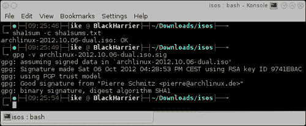

1.  如前面的屏幕截图所示，ISO 的校验和有效签名都是正确的。

1.  现在我们确定 ISO 没有问题，我们可以用我们喜欢的刻录程序将其刻录到 CD 上。

1.  将 CD 插入驱动器，或将 USB 存储设备插入 PC 的 USB 端口。

1.  进入引导菜单，或者让您的计算机自动从插入的安装介质中引导。

1.  如果前面的步骤执行正确，您将看到以下屏幕截图：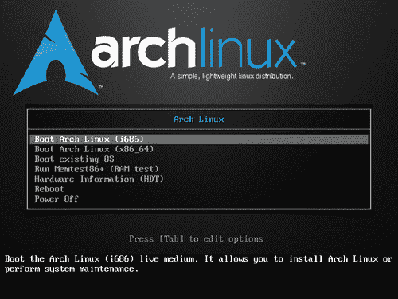

1.  选择您想要的架构并按*Enter*，我们就可以开始了。

1.  搜索所需的区域键盘布局。可在`/usr/share/kbd/keymaps/`找到可用的键盘布局。

1.  使用`loadkeys keyboardlayout`设置所需的键盘布局。

现在让我们执行以下步骤来创建、格式化和挂载分区：

1.  启动 cfdisk 或 cgdisk，第一个参数是您要分区的设备：

```
cfdisk /dev/sdX
cgdisk /dev/sdX

```

1.  创建您的分区方案。

1.  存储分区方案。

1.  使用`mkfs`命令在特定分区上创建文件系统：

```
mkfs -t vfat /dev/sdX
mkfs.ext4 -L root /dev/sdX

```

1.  将根分区挂载到`/mnt`：

```
mount /dev/sdX3 /mnt

```

1.  在`mount`下为其他分区创建目录：

```
mkdir -p /mnt/boot

```

1.  挂载其他分区：

```
mount /dev/sdX1 /mnt/boot

```

连接到互联网需要以下步骤：

1.  当我们需要无线网络时，创建一个 netcfg 配置文件并运行`netcfg mywireless`。

1.  使用 dhclient 或 dhcpcd 获取 IP 地址。

安装基本系统和引导加载程序应执行以下步骤：

1.  使用所需的参数运行 pacstrap：

```
pacstrap /mnt base base-devel

```

1.  安装所需的引导加载程序：此刻最好的选择是 Syslinux。

1.  引导加载程序的最终安装将在初始配置期间在 chroot 中完成（稍后在本书中讨论）。

我们现在将列出配置期间要执行的步骤：

1.  使用`genfstab`生成`fstab`：

```
genfstab -p /mnt >> /mnt/etc/fstab

```

1.  将根更改为系统位置：

```
arch-chroot /mnt

```

1.  在`/etc/hostname`中设置您的主机名。

1.  创建`/etc/localtime`符号链接。

1.  在`/etc/locale.conf`中设置您的区域设置。

1.  取消注释`/etc/locale.gen`中配置的区域设置。

1.  运行`locale-gen`。

1.  配置`/etc/mkinitcpio.conf`。

1.  生成您的初始 ramdisk：

```
mkinitcpio -p linux

```

1.  完成引导加载程序的安装。

1.  使用`passwd`设置根密码。

1.  离开 chroot 环境（`exit`）。

### 注意

有关如何配置系统的更多详细信息，请参阅*配置您的系统*配方。

### 注意

有关执行的主要任务的详细描述，请参阅本配方的*准备就绪*部分。

## 工作原理...

我们通过种子文件或从下载页面上列出的镜像站点通过 HTTP 下载了 ISO 映像文件。`sha1sum`命令让我们验证已下载 ISO 的完整性。除了校验和外，我们还可以通过验证 ISO 的签名来检查完整性。因此，现在我们可以放心地知道下载的文件是真实的。ISO 包含一个完全可用的操作系统。它还包含执行系统恢复和安装所需的所有必要工具。

使用`loadkeys`设置的键盘配置将确保您在键盘上按下的键会被正确地转换为屏幕上的正确字母。使用与物理键盘上不同的键盘布局可能会令人困惑。

然后我们使用适当的工具（cfdisk 或 cgdisk）在所选磁盘上创建了分区方案。**Make Filesystem**（**mkfs**）是一个统一的前端，用于创建文件系统。使用它，我们在`/mnt`下手动创建了我们的文件系统布局，通过在我们的根目录中创建默认分区布局，并相应地挂载特定分区。

你可以连接到你的无线网络（如果需要），然后使用 dhcpcd 或 dhclient 获取一个 IP 地址，以便你访问互联网。

Pacstrap 将使用修改后的根位置运行**pacman**，以安装所需的软件包到新创建的系统中。

例如，安装 Syslinux：

```
pacstrap /mnt syslinux

```

特定的配置文件将确保我们不必在每次启动时都重复所有这些步骤。

## 还有更多...

如果你愿意，你可以直接从 USB 驱动器使用官方 ISO。验证 ISO 可能会出现一些问题。接下来的两个部分讨论了这些问题，并为你提供了解决方案。

### 使用 USB 驱动器中的 ISO

为 Arch Linux 下载的 ISO 都是“混合”映像，这意味着你可以将它们放在 USB 驱动器上，并且它们将是可引导的。因此，从 USB 驱动器安装也非常简单。将 USB 驱动器放入你的机器中（*警告：它将丢失所有数据*），然后输入以下命令：

```
dd if=archlinux-2012.08.04-dual.iso of=/dev/sdX bs=1M

```

### 注意

确保你有`if=正确的 ISO 文件名`和`of=/dev/sdX`，其中你不使用 USB 驱动器的*分区*，如`/dev/sdX1`，而是整个 USB 驱动器。因此只使用`/dev/sdX`。

### 验证 ISO 签名时遇到问题吗？

当你的`gpg keyring`中没有签名者的公钥时，你会收到一个错误，如**gpg: Can't check signature: No public key**。这意味着你首先必须导入签名者的公钥，然后才能进行签名的验证：

```
gpg --keyserver wwwkeys.pgp.net  --recv-keys 0x9741E8AC

```

导入公钥，这里是 Pierre Schmitz 的公钥。然后你可以再次运行 ISO 的验证。验证现在应该给你**gpg: Good signature from "Pierre Schmitz <pierre@archlinux.de>"**。当你完成这里描述的步骤后，你会收到一个警告，说这个密钥没有受到受信任签名的认证。在验证 ISO 的完整性的情况下，这并不重要。有关 GPG 和签名的更多信息，请参见[`www.gnupg.org/`](http://www.gnupg.org/)。

接下来的部分讨论了一个良好的桌面分区方案的常见示例。

### 桌面的良好分区方案

在桌面系统上，尤其是 Arch Linux，我个人建议有一个单独的`/var`分区。根据你对这个分区的其他目标（例如，运行一个庞大的 MySQL 数据库，其他数据库等）可能有的需求，一个合理的值将是 5GB 或更多。不要过度使用，否则你的`/var`分区将有很多空间。为什么要把`/var`做得这么大？Pacman 将它的缓存保存在`/var`中，你真的不希望你的根文件系统被一个填满了软件包缓存的磁盘所死锁。

+   **引导分区**：50MB

+   **交换分区**：

+   当你的 RAM 小于 4GB 时：RAM + RAM 的三分之一

+   当你的 RAM 大于 4GB 时：将其固定在 4GB（实际上没有必要使其更大）

+   **根分区**：10GB（游戏玩家可能会想要增加到 50GB）

+   **Var 分区**：5GB（如果只用于缓存），如果其中存储了一些数据库的数据；根据需要可以增加

+   **主目录分区**：现在你可能会有 300 到 400GB 甚至更多

最初由 Arch Linux 开发的 netcfg 工具为我们提供了大量的选项，我们将在下一节中讨论。

### Netcfg 示例配置

示例配置可以在`/etc/network.d/examples`文件夹中找到。在下表中，我们列出了 netcfg 软件包提供的示例配置列表：

| 连接类型 | 示例配置 |
| --- | --- |
| 无线/WEP 十六进制密钥 | `wireless-wep` |
| 无线/WEP 字符串密钥 | `wireless-wep-string-key` |
| 无线/WPA-Personal（密码/预共享密钥） | `wireless-wpa` |
| 无线/WPA-Enterprise |

+   `wireless-wpa-config`（`wpa_supplicant`配置是外部的）

+   `wireless-wpa-configsection`（`wpa_supplicant`配置存储为字符串）

|

| 有线/DHCP | `ethernet-dhcp` |
| --- | --- |
| 有线/静态 IP | `ethernet-static` |
| 有线/iproute 配置 | `ethernet-iproute` |

### 注意

对于接下来的一些部分的更详细的解释，我建议您参考*配置您的系统*方法。

### Genfstab 额外选项

如果您更喜欢在`fstab`文件中使用 UUID 或标签，可以向`genfstab`脚本传递额外参数：`U`表示 UUID，`L`表示标签。

### Syslinux 的最终安装

Syslinux 的最终安装必须在 chrooted 环境中完成。

```
/usr/sbin/syslinux-install_update -iam

```

如果前面的命令在尝试设置引导标志时失败，可以使用以下命令：

```
/usr/sbin/syslinux-install_update -im

```

成功安装 Syslinux 后，通过编辑`/boot/syslinux/syslinux.cfg`来配置系统启动方式。

# 使用 Archboot ISO 安装 Arch Linux（应该知道）

在这个方法中，我们将学习如何安装 Arch Linux。由于手动安装过程，可能会显得有点可怕，但实际上并不难。安装脚本将贯穿整个安装过程，您可以在不到 10 分钟内拥有一个能够启动的系统。在 Arch Linux 生态系统中，由于软件包的滚动发布，安装通常只需要进行一次，然后就再也不需要了。还可以参考[`wiki.archlinux.org/index.php/Beginners'_Guide`](https://wiki.archlinux.org/index.php/Beginners'_Guide)中的*初学者指南*，了解 Arch Linux 的相关信息。由于 Arch Linux 是一个不断发展的目标，最好的安装方法是在连接到互联网时进行，这样您可以获取所有最新和最好的软件。甚至在下载之前，必须阅读[`www.archlinux.org/news/`](http://www.archlinux.org/news/)上的最新消息，了解任何新的发展。

当我们只是想尝试 Arch Linux，并且可能并不确定这是否适合全天使用时，可以考虑通过在虚拟机中安装来学习系统的工作方式。在*初学者指南*中有一个有用的部分，网址为[`wiki.archlinux.org/index.php/Beginners'_Guide#Install_on_a_virtual_machine`](https://wiki.archlinux.org/index.php/Beginners'_Guide#Install_on_a_virtual_machine)。

## 准备工作

我们可以从[`wiki.archlinux.org/index.php/Archboot`](http://wiki.archlinux.org/index.php/Archboot)获取 Archboot ISO。在这个页面上，我们会找到最新版本的下载链接。我们可以选择立即下载种子文件或 ISO。

以下列表描述了我们将在这个方法中执行的主要任务：

+   准备安装介质：我们将从 Archboot 维基页面下载 ISO 文件，并将其保存在我们选择的首选介质上。在撰写本文时，可以选择下载特定架构的 ISO 或包含 i686 和 x86-64 架构的双重 ISO。我建议下载双重 ISO，这样可以在任何 PC 上安装任何架构，而无需任何麻烦。

+   **引导安装介质并开始安装**：使用您首选的安装介质（CD 或 USB 驱动器）启动您的 PC。在大多数 PC 系统上，您可以通过按下一个功能键（通常在*F8*和*F12*之间，具体取决于主板制造商）进入引导菜单。在还没有引导菜单的旧机器上，您可能需要在 BIOS 中更改引导顺序，选择 CD-ROM（或 DVD/蓝光）作为首选启动设备。

+   设置键盘和控制台字体：当使用不同于默认键盘布局时，您肯定需要这个方法来配置您特定的键盘布局，以及您喜欢的控制台字体。如果两者都配置了，安装程序还将把这些设置带入到我们安装的系统的配置中。

+   设置日期和时间：在这个方法中，我们还将配置三个小部分——设置我们的时区、当前时间和当前日期。

+   **自动准备硬盘**：**自动准备**选项将指导您创建默认的分区方案。当我们无法擦除整个驱动器，或者我们想要与安装程序选择的默认分区方案有所不同时，我们应该跳转到*手动准备硬盘*的步骤。

### 注意

警告：所选的硬盘将被完全擦除。

+   **手动准备硬盘**：手动分区可以让您完全控制创建多少个分区。这也可能涉及多个磁盘，因此有完全的自由。当您习惯于分区时，请使用手动准备。

+   **选择源**：我们可以选择是从互联网上可用的存储库安装，还是立即从安装媒体上可用的软件包安装。最好选择 FTP/HTTP，因为这将确保我们有最新的软件包可用。

+   **选择软件包**：从我的角度来看，选择软件包的最佳方式是首先安装基本系统。当我们完成并系统独立引导时，可以根据需要逐步添加软件包。安装程序会询问是否要添加额外的存储库，以便一次性安装所有内容。我认为在这里选择不包括额外的存储库并从基本系统开始是比较安全的。通常，需要时安装应用程序会更快。安装后，我们只需检查一些自动创建的配置文件，以确保安装程序正确创建了它们，并且在安装引导加载程序后重新启动时将获得可引导的系统。更详细的配置将在后面解释。如果您在安装过程中想要更改任何内容，我建议您跳转到*配置系统*的步骤，其中会深入解释配置。

+   **安装引导加载程序**：在本教程结束时，我们几乎拥有所需的一切。但是，为了使我们的计算机真正可用，我们必须安装引导加载程序，因为这个软件将使我们在重新启动时能够进入 Arch Linux。

## 如何操作...

让我们为准备安装媒体执行以下步骤：

1.  一旦我们下载了 ISO 镜像文件，我们必须通过从`archboot`文件夹下载`md5sum.txt`文件来验证其完整性。

1.  我们将通过发出`md5sum -c md5sum.txt`命令来验证完整性，并检查我们的下载是否成功：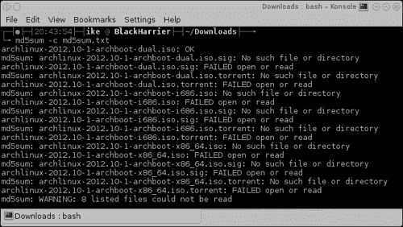

1.  正如我们所看到的，所有 ISO 都已下载，但是种子文件没有。这导致一些成功的检查和其他状态文件未找到，但最终我们知道我们下载的 ISO 文件是正常的。

1.  既然我们确定我们的 ISO 是正常的，我们可以使用我们喜欢的刻录程序将其刻录到 CD 上。

以下步骤将指导您启动安装媒体并开始安装：

1.  将 CD 插入驱动器或将 USB 插入 PC 的 USB 端口。

1.  进入启动菜单或让计算机自动从插入的安装媒体启动。

1.  如果前面的步骤进行得很顺利，我们应该会看到以下截图：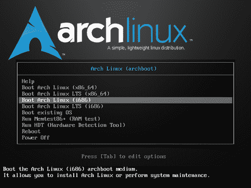

1.  根据我们是否要引导**长期支持**（**LTS**）或默认内核，选择架构。默认内核应该没问题，但是如果出于稳定性原因我们想要运行 LTS 内核，我们可以选择它。按下*Enter*，我们就可以开始了。

1.  当安装媒体完全启动时，我们会得到有关 Archboot 环境的一些初始信息。当我们按下*Enter*时，安装脚本将启动：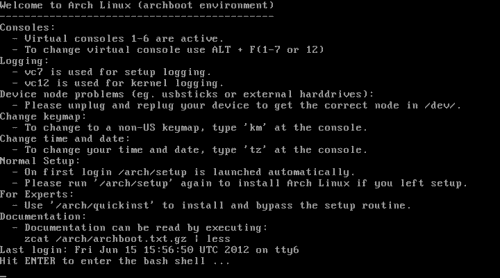

1.  准备好后，按下*Enter*，我们将看到**主菜单**屏幕。菜单包含几个按照时间顺序进行新安装的步骤：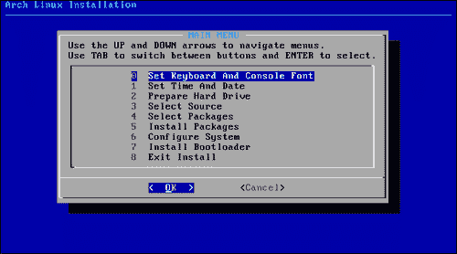

让我们执行以下步骤来设置键盘和控制台字体：

1.  我们可以选择键盘布局，列出 Arch Linux 支持的所有可能的键盘布局。选择您的键盘布局并继续。

1.  可选地，您还可以选择自己喜欢的控制台字体。如果您不知道或不想这样做，只需返回到主安装程序菜单并继续下一步。如果您有偏好，然后选择**设置控制台字体选项**并选择您的字体。

让我们设置我们的时区、当前时间和当前日期：

1.  选择时区。这类似于大陆/首都。例如，欧洲/布鲁塞尔。

1.  为您的硬件时钟选择**UTC**。这将确保夏令时更改将被正确应用。

1.  设置您当前的系统时间。这实际上是您所在时区的当前时间。

1.  设置您当前的系统日期。

自动准备硬盘需要执行以下步骤：

1.  首先，您可以选择使用旧的 MBR 分区表或新的 GUID（GPT）分区表。选择完全取决于您；但是，对于较旧的机器，安全的选择是 MBR。对于较新的机器和具有 UEFI 引导的机器，建议使用 GPT 分区表。

1.  选择要用于引导`(/boot`)分区的大小。

1.  选择要用于交换`(/swap`)分区的大小。

1.  选择要用于根`(/root`)分区的大小。

1.  剩余的磁盘空间将自动用于您的家（`/home`)分区，其中所有用户的数据将驻留。

1.  选择要用于根分区和家目录分区的文件系统。这里最安全的选择是 ext4。如果您是一个冒险的精神，您可以选择 Btrfs 或 NILFS。在选择使用当前标记为实验性文件系统之前，请进行研究，确保它确实是您想要使用的东西。

1.  选择您想要在配置文件中使用的命名系统。

1.  当我们完全确定一切都没问题时，我们继续，安装程序将准备整个驱动器。如果一切顺利，安装程序将声明准备成功。

手动准备硬盘需要执行以下步骤：

1.  选择分区类型（MBR 或 GPT）。有关更多信息，请参见*自动准备硬盘*执行的步骤 1。

1.  选择要分区的磁盘。

1.  安装程序会根据您选择使用 MBR 或 GPT 分区来提供 cfdisk 或 cgdisk。

1.  创建分区后，我们需要返回到分区菜单并使用**设置文件系统挂载点**选项。

1.  首先，您需要选择要用作交换的分区。

1.  然后，安装程序会要求您选择系统的根分区。

1.  选择完所需的分区后，您可以继续选择分区并将它们的挂载点设置为您想要的位置。

### 注意

由于我们正在进行手动分区布局，我们可以应用手动部分中的自动准备部分的提示。但是，通过使用手动方法，您可以获得更多额外的自由来创建您喜欢的分区方案。

选择您要使用的源需要以下步骤：

1.  选择 CD-ROM 或 FTP/HTTP。

1.  配置您的网络。

1.  选择要使用的镜像（仅在选择 FTP/HTTP 时才需要执行此操作）。

选择您的软件包需要以下步骤：

1.  不要启用额外的存储库。

1.  只选择**base**；这包含安装后获得工作系统所需的所有软件包。

1.  选择要安装的软件包。

1.  让安装脚本安装软件包。

最后，让我们安装引导加载程序：

1.  选择您最喜欢的引导加载程序。

最著名的将是 GRUB 和 Syslinux——这些可能也是最受支持的。还有其他可用的引导加载程序，如 LILO。

1.  安装程序会建议您检查它创建的配置文件。在大多数情况下，这个配置将是正确的，但您应该始终检查它是否正确。查看配置文件中是否使用了正确的设备。您可以通过检查文件系统的布局来验证正确的设备。

1.  安装引导加载程序。

现在，您已经采取了安装基本的 Arch Linux 系统所需的所有步骤，安装过程中唯一剩下的事情就是重新启动系统并移除安装介质。然后，您就可以享受您新安装的 Arch Linux 的首次启动了。

1.  重新启动系统。

### 注意

有关执行的主要任务的详细描述，请参阅本食谱的“准备就绪”部分。

## 它是如何工作的...

我们通过种子文件或直接使用 Web 浏览器下载了 Archboot ISO，并且`md5sum`命令让我们验证了下载的 ISO 的完整性。所以现在，我们可以放心地知道下载的文件是真实的。

### 注意

永远不要使用您未验证校验和的 ISO。

Archboot ISO 包含一个完全可用的操作系统，所以首先我们启动它。按下*Enter*键后，我们会自动登录到实时系统。接下来，安装脚本被调用，我们被放入 Archboot 安装脚本中。

安装脚本将调用正确的应用程序来设置键盘布局和控制台字体，以及选择的日期和时间设置。安装脚本还将跟踪所选的值，以将它们放入适当的配置文件中。

如果我们选择了**自动准备**选项，那么根据我们所做的配置，安装程序将运行 fdisk 并创建我们想要的分区方案。

如果我们选择手动分区磁盘，那么我们可以选择任何布局。一旦我们对分区方案满意，安装程序将询问一些问题（例如：挂载到哪里？使用什么文件系统？），并使用我们的答案将我们创建的分区挂载到正确的挂载点上。安装脚本还将跟踪给出的答案，以便稍后用于生成配置文件。

安装脚本将向您显示 pacman 为您提供的要安装的软件包列表。当您选择了系统上想要的所有软件包后，安装脚本将使用一些额外的参数将这些软件包传递回 pacman，然后 pacman 将进行实际安装。

安装结束时，将为您准备一份配置文件列表。这些配置文件供您审查。当您对配置文件满意时，请保存它。安装脚本现在将使用配置文件将所选的引导加载程序放置到相应位置。

## 还有更多...

当我们想要偏离默认设置时，我们可能需要一些额外的知识。所以让我们逐一讨论它们。

### ISO 可以从 USB 驱动器中使用

从 Arch Linux 下载的 ISO 都是“混合”映像，这意味着您可以将它们保存在 USB 驱动器上，并且它们将是可启动的。从 USB 驱动器安装也非常简单。只需将 USB 驱动器连接到您的计算机，并发出以下命令：

```
dd if=archlinux-2012.04-2-archboot-dual.iso of=/dev/sdX bs=1M

```

### 注意

USB 驱动器上的所有信息都将被覆盖。

我们需要确保将正确的输入文件，即我们的 ISO，设置为`if`参数。同时，输出文件参数必须是设备，而不是设备的某个分区，比如`of=/dev/sdX`。`X`代表系统分配给您的 USB 驱动器的字母。

### 选择本地时间还是 UTC

在某些罕见情况下，硬件时钟上的本地时间是最佳选择。例如，在安装 Arch Linux 旁边的 Windows XP 时，这是一个无法处理硬件时钟和系统时钟不同时间的操作系统。更近期的 Windows 操作系统可以处理将硬件时钟设置为 UTC 的情况。

### 桌面系统的安全分区大小选择

分区是一个非常广泛的主题。它可以以无数种组合进行。我们现在将讨论一些理解分区所需的额外信息。还有一些很好的默认值，可以让系统快速启动和运行。

以下列表是正常桌面使用的选择。对于想要玩很多游戏的人来说，这些大小选择将无法满足您的需求：

+   **引导分区**：50MB

+   **交换分区**：

+   当您的 RAM 小于 4GB 时：RAM + RAM 的三分之一

+   当您的 RAM 大于 4GB 时：将其固定在 4GB（实际上没有真正需要使其更大）

+   **根分区**：10GB（玩家可能希望在这里选择 50GB）

+   **家目录分区**：这些天您最终会有 300 到 400GB 甚至更多

### 选择所需的文件系统

在选择根和家目录分区的文件系统时，您应该对文件系统的可能性有所了解。如果您不知道，最好的选择是**ext4**，因为这是现代特性、速度快和稳健性的默认文件系统，因此您不会丢失任何数据。

选择所需的文件系统

### 引导时的文件系统怎么样？

引导分区将自动使用 ext2 文件系统格式化。这是最安全的选择，因为您可以在那里找到的所有引导加载程序都能够在引导分区格式化为 ext2 时使系统启动。

### 块设备的命名方案

有三种指向块设备（分区）的方法：

+   **UUID 方案**：这是一个唯一的 ID，我们可以用它来指向一个块设备

+   **LABEL 方案**：在这里，我们可以通过使用其标签指向一个分区

+   **KERNEL 方案**：这是通过直接指向设备节点来指向块设备的最古老的方法

使用 UUID 方案可能会使您的配置看起来不太美观，但这是您始终指向正确设备的最确定的方法。假设您有一些硬件更改，并且设备以新的方式排序；使用这种方法，您仍将选择正确的块设备。

LABEL 方案看起来非常简洁优雅，但可能会出现一些名称冲突，因为多个物理磁盘分区可能具有相同的名称。

KERNEL 方案实际上是最古老的，这里我们只是指向一些设备节点（比如`/dev/sda1`），但在一些硬件更改后可能会失败，这可能导致设备节点的不同顺序。

块设备的命名方案

### 桌面系统的良好分区方案

在桌面系统上，特别是在 Arch Linux 上，我建议有一个单独的`/var`分区。根据您对此分区的其他目标（例如运行一个庞大的 MySQL 数据库，其他数据库等），适当的值将是 5GB 及以上。不要过度使用，否则您将在`/var`分区中有很多空间。为什么这么大？Pacman 将其缓存保存在`/var`中，您真的不希望您的根文件系统被填满了软件包缓存而陷入僵局。

### 选择一个地理位置靠近您的镜像

当从互联网安装 Arch Linux 时，最好选择一个靠近我们家的镜像以获得最佳的下载速度：

选择一个地理位置靠近您的镜像

当您的网络正常运行时，可以选择一个镜像，并选择尽可能靠近您位置的镜像。这样我们将获得最佳性能。如果您对您的最近的镜像有疑问，您可以随时选择全球镜像，例如[mirrors.kernel.org](http://mirrors.kernel.org)，它将自动选择一个靠近您的服务器。

### 选择哪些软件包

在安装 Arch Linux 时，我们可以选择要安装的软件包列表。现在我将分享我的首选方式。对于第一次安装，我个人偏好是保留从基本组中选择的所有软件包。如果您坚持要从基本组中删除一些软件包，可以继续删除，但在这种情况下，您确实应该知道自己在做什么。

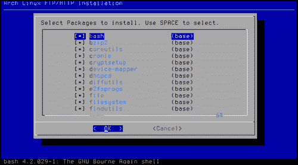

### 启用额外的软件源

如果这不是 Arch Linux 的第一次安装，您肯定可以启用额外的软件源，以便可以选择一大堆应用程序，您肯定想要在系统上安装。例如，您可以立即安装 Xorg、GNOME、XFce、KDE 等。对于第一次安装，我建议一步一步进行，暂时保持额外的软件源不变。

# 配置您的系统（应该知道）

在本教程中，我们将解释用于识别您的系统的配置文件。通常，这些文件只需要配置一次，并且在整个系统的生命周期内保持不变。

## 准备工作

以下列表描述了本教程中将执行的主要任务：

+   配置主机名：**主机名**是我们为机器指定的名称，这将使我们很容易识别我们正在谈论的是哪台机器。因此，如果我们在一个网络中，我们可以通过它们的主机名轻松区分不同的机器。

+   配置控制台：我们还将配置虚拟控制台，使用哪种键盘布局，以及可能一些特殊的字体和映射。

+   配置本地化：在这个任务中，我们将使用正确的本地化设置我们的机器。这可以在`locale.conf`文件中非常广泛地完成。在大多数情况下，我们只在此文件中设置`LANG`和`LC_COLLATE`。如果您想缩小范围，可以通过输入`man locale.conf`来获取更多信息。但是，当一切都失败时，`LC_COLLATE`是后备。

+   配置时区：设置您的时区将确保系统时钟正确。这必须与`/etc/localtime`结合使用。实际上，它们必须一起更改，因此为了您自己的安全，请更改`/etc/localtime`符号链接，然后立即将新时区添加到`/etc/timezone`。

+   配置模块处理：您是否想加载默认未加载的额外模块？在“花哨”的硬件或一些第三方软件（如 VMware 或 VirtualBox）的情况下，我们可能需要这样做。您可以在`/etc/modules-load.d/`中添加一个配置文件，其中包含模块列表。模块必须用换行符分隔。当您想在这些文件中添加一些注释时，您可以通过在行首加上`#`或`;`来实现。放置在该目录中的文件只需要一个额外要求；名称必须以`*.conf`结尾。

## 如何做...

以下步骤配置主机名：

1.  使用`vim /etc/hostname`编辑主机名进行配置。

让我们列出配置控制台所需的步骤：

1.  编辑`/etc/vconsole.conf`。

1.  添加带有它们的值的关键字。例如：

```
KEYMAP=us
FONT=lat9w-16
FONT_MAP=8859-1_to_uni
```

让我们列出配置本地化所需的步骤：

1.  要指示我们要支持的区域设置，编辑`/etc/locale.gen`。

1.  当我们更改了`locale.gen`文件后，运行`locale-gen`。

1.  要指示我们要默认使用的区域设置，编辑`/etc/locale.conf`：

```
LANG=en_US.UTF-8
LC_COLLATE=C
```

让我们列出配置时区所需的步骤：

1.  创建指向您时区的符号链接`/etc/localtime`：

```
ln -s /usr/share/zoneinfo/Europe/Brussels /etc/localtimevim /etc/timezone

```

1.  将时区的名称复制到`/etc/timezone`中。

让我们列出配置模块所需的步骤：

1.  要加载模块，请将配置文件添加到`/etc/modules-load.d/`。

1.  要对模块进行黑名单和传递特殊参数，请将配置文件添加到`/etc/modprobe.d/`。

### 注意

有关执行的主要任务的详细描述，请参阅本教程的*准备就绪部分*。

## 它是如何工作的...

在启动时，系统将读取`/etc/hostname`文件的内容。此内容将用于识别我们作为用户的系统，并在网络中标识机器。主机名主要是为了用户方便，因为它比一个大数字列表更容易记住。

终端将允许您在本地化键盘上输入。屏幕上的输出将与键盘上按下的按钮对应。此外，终端将以所选字体显示文本输出。最后，它将根据需要对文本编码进行翻译。在配置控制台的步骤中显示的示例中，输出将从 ISO-8859-1 翻译为 Unicode。

所有支持本地化的应用程序将以美式英语输出，如果`LANG=en_US`。当应用程序没有选择的语言时，它将退回到“C 语言”。C 语言是计算机系统中的默认语言，因此它也将是英语。

系统显示的时间将是您所在时区的时间。当您处于一个有夏令时变化的时区时，您的计算机将自动调整。

所有位于`/etc/modules-load.d/`中以`*.conf`结尾的文件将用于加载额外的模块。所有位于`/etc/modprobe.d/`中的`*.conf`文件将用于确定模块是否必须被列入黑名单，或者是否必须使用一些特殊选项。

## 还有更多...

让我们看一些关于更轻松配置所需键盘映射和控制台字体的技巧，以及查找可用时区的简便方法。

### KEYMAP

我们可以通过列出文件夹`/usr/share/kbd/keymaps`来获取所有可用的键盘布局映射列表。从下面的截图中，我们可以看到我们已经找到了比利时布局，因此我们可以将`KEYMAP=be-latin1`添加到我们的配置文件中：

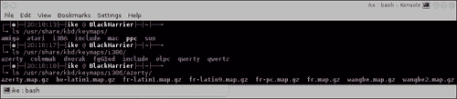

### CONSOLEFONT

我们可以通过列出`/usr/share/kbd/consolefonts`来找到控制台中所有可用字体的列表。当我们找到所需的字体时，可以将其添加到我们的配置文件中。例如，`CONSOLEFONT=Lat2-Terminus16.psfu.gz`。

### CONSOLEMAP

要获取可能的转换列表，我们可以获取`/usr/share/kbd/consoletrans`的列表。可选地，我们可以将其添加到我们的配置文件中，但这并不总是需要的。例如，`CONSOLEMAP=8859-1_to_uni`。

### 查找您的时区

查找您的时区远非困难，因为它几乎总是大陆/首都。我们可以在`/usr/share/zoneinfo/`文件夹中运行`ls`，然后从那里获取：

```
ls /usr/share/zoneinfo/

```

# 安装和删除软件包（必须知道）

在这个教程中，我们将看到 Arch Linux 中的软件包管理围绕着 pacman 展开。**Pacman**只是软件包管理器的简称，而不是软件包管理是一种游戏的笑话。Pacman 的完整指南可以在维基上找到[`wiki.archlinux.org/index.php/Pacman`](https://wiki.archlinux.org/index.php/Pacman)。Arch Linux 有三个官方仓库：[core]、[extra]和[community]。[core]和[extra]都由 Arch Linux 开发人员维护，而[community]仓库由受信任的用户维护。还有许多由 Arch Linux 爱好者维护的非官方仓库，这些仓库安装了官方仓库中找不到的特定类型的软件，从而使您的生活变得更加轻松。非官方仓库的列表可以在[`wiki.archlinux.org/index.php/Unofficial_User_Repositories`](https://wiki.archlinux.org/index.php/Unofficial_User_Repositories)找到。

Arch Linux 采用完全开放的模型，这意味着官方存储库中提供的每个软件都可以由用户重新构建。这就是我们所说的**Arch Build System**或**ABS**。Arch Linux 还为用户提供了一种非常简单的方式，通过**Arch User Repository**或**AUR**来分享其他存储库中找不到的软件的构建脚本。最后，在维基上还有一个常用软件的列表，网址为[`wiki.archlinux.org/index.php/Common_Applications`](https://wiki.archlinux.org/index.php/Common_Applications)。这个列表可能会帮助您找到最适合您需求的应用程序。

## 准备工作

以下列表描述了我们在本教程中将执行的主要任务：

+   **配置 pacman**：首先，pacman 的默认配置在`/etc/pacman.conf`中完成。其次，您还会在系统上默认安装`/etc/pacman.d/mirrorlist`，其中包含安装过程中使用的选定镜像。mirrorlist 包含 Arch Linux 的所有官方镜像。安装后获得的默认配置可以完美运行。您可以在维基页面[`wiki.archlinux.org/index.php/Pacman`](https://wiki.archlinux.org/index.php/Pacman)上找到与 pacman 相关的所有信息。

+   **完整系统升级**：这可能是所有操作中最常用的操作，一旦您的系统安装了满足您需求的所有软件。通常情况下，您只需要不时进行完整系统升级。

+   **从存储库安装软件包**：使用 pacman 安装软件包很简单。我们可以将多个软件包传递给命令以安装多个软件包，或者甚至可以传递一个组名以安装整个软件包组。

### 注意

我们还可以通过更新安装软件包，需要将软件包文件传递给 pacman 以安装某些软件。

+   **在存储库中搜索软件包**：这将使我们能够搜索我们喜欢的软件是否在存储库中可用，以便我们可以轻松安装。

+   **从磁盘安装软件包**：这实际上与从存储库安装的方式相同，唯一的区别是这里我们将文件传递给命令，而不是软件包名称。

+   **删除软件包**：当我们厌倦了一个软件包，或者找到了一些新的软件可以更好地满足我们的需求时，我们可以删除某个软件包甚至整个软件包组。

+   **清理软件包缓存**：随着时间的推移，我们不希望我们的磁盘被旧的软件包文件填满，因此不时清理软件包缓存是一个非常好的做法。

+   **官方和非官方存储库**：Arch Linux 默认提供了大量软件包，这些软件包可以在官方存储库中找到。官方存储库包含 Arch Linux 开发人员和受信任用户支持的软件包。

+   **使用 Arch Build System**：**Arch Build System**（**ABS**）类似于 FreeBSD 中的 ports 系统。用于创建官方存储库中找到的软件包的所有构建脚本都可以通过 ABS 获得。这使您作为用户可以根据自己的需求重新构建每个软件包，使用自己的编译器标志等。如果您想充分使用 ABS，您需要使用 pacman 安装**base-devel**和**abs**。如果您只想查看如何完成任务，您只需要安装 abs。

+   **使用 Arch 用户存储库**：**Arch 用户存储库**（**AUR**）包含在官方存储库中找不到的软件包，是纯用户贡献的内容。因此，每个在 AUR 网站[`aur.archlinux.org`](https://aur.archlinux.org)注册的人都可以上传新软件包，因此其他用户可能会从中受益。要使用 AUR，您必须安装 base-devel。有关 AUR 的更多详细信息，我将参考[`wiki.archlinux.org/index.php/AUR`](https://wiki.archlinux.org/index.php/AUR)上的 wiki。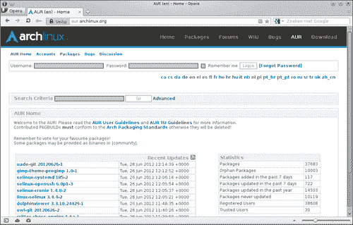

+   使用 makepkg：Makepkg 是用于构建 Arch Linux 软件包的工具。我不会深入使用，但会让您快速了解如何从 ABS 或 AUR 构建软件包。Makepkg 假定已安装 base-devel。还请参阅[`wiki.archlinux.org/index.php/Makepkg`](https://wiki.archlinux.org/index.php/Makepkg)。Makepkg 必须在至少有一个名为`PKGBUILD`的文件的目录中调用。

## 如何做...

让我们列出配置 pacman 所需的步骤：

1.  编辑`/etc/pacman.conf`以修改选项或添加/删除一些存储库。

1.  编辑`/etc/pacman.d/mirrorlist`以更改或添加包含官方存储库的镜像。

1.  以 root 身份运行`pacman -Syu`进行完整系统升级。

1.  要从存储库安装软件包，请在终端中以 root 身份运行`pacman -S somepackage`。

1.  以 root 身份，运行 `pacman -Ss somepackage` 来搜索存储库中的软件包。

1.  在终端中以 root 身份运行`pacman -U somepackage.pkg.tar.xz`以从磁盘安装软件包。

1.  以 root 身份运行`pacman -R somepackage`以删除软件包。

1.  要清理软件包缓存，请以 root 身份运行`pacman -Sc`并回答问题。

让我们列出配置官方和非官方存储库所需的步骤：

1.  打开`/etc/pacman.conf`。

1.  禁用或启用官方存储库，或添加非官方存储库。

让我们列出使用 ABS 所需的步骤：

1.  安装 base-devel 和 abs：

```
pacman -Syu base-devel abs

```

1.  可选地编辑`/etc/abs.conf`。

1.  让 abs 同步`abs`脚本。您必须以 root 身份运行 abs。

让我们列出使用 AUR 所需的步骤：

1.  安装 base-devel：

```
pacman -Syu base-devel

```

1.  在 AUR 中搜索您喜欢的应用程序。

1.  下载 tarball 并开始构建它。

让我们列出使用 makepkg 所需的步骤：

1.  转到包含构建脚本的文件夹（`PKGBUILD`）。

1.  运行 `makepkg`。

1.  这应该可以获取软件包进行构建。如果缺少构建软件包的依赖项，您需要先安装这些依赖项。

### 注意

有关执行的主要任务的详细描述，请参考本教程的*准备就绪*部分。

## 它是如何工作的...

在`pacman.conf`中设置的选项将决定 pacman 的行为。这些选项从忽略软件包或组到更新到额外的存储库都有所不同。我们在 mirrorlist 中定义的内容将决定我们的软件包来自哪里（从哪个服务器）。

完整系统升级命令将使您的本地软件包数据库与远程数据库同步，并根据您安装的软件包询问您是否要继续安装一些升级的软件包。

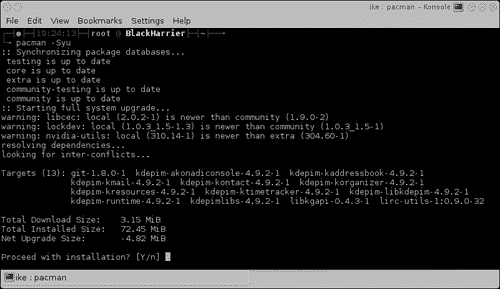

`pacman -S somepackage`命令将搜索您传递的软件包名称或组，如果存在，它将继续尝试安装它。

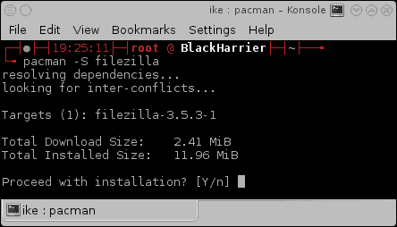

在执行`pacman -Ss somepackage`命令时，pacman 将在本地同步的数据库中搜索我们要查找的软件包是否可用。如果是这样，我们将看到可供我们安装的版本。

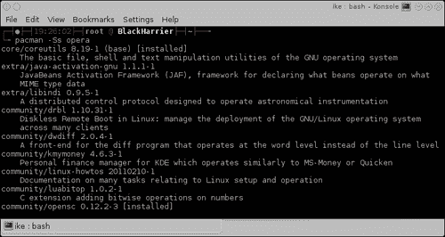

在执行`pacman -U somepackage.pkg.tar.xz`命令时，pacman 将检查软件包的依赖关系，并尝试将这些依赖项与您要安装的软件包一起安装。一切顺利时，它将在正确的位置安装 tarball 中的软件包。

执行`pacman -R somepackage`命令后，软件包将从系统中删除。软件包的唯一剩下的东西将是缓存中的条目。

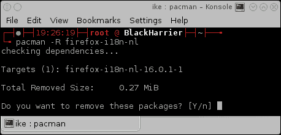

执行`pacman -Sc`命令时，pacman 将查找旧的软件包文件，并询问您是否希望将其从文件系统中删除。

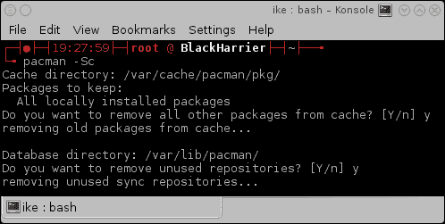

Pacman 使用`pacman.conf`进行选项和仓库。现在，所有已启用的仓库都将用于软件包安装。如果存在一些配置不匹配，pacman 将通知我们。

Abs 将使用`rsync`来同步官方仓库中使用的构建脚本到您的本地计算机。例如，这将使您能够使用其他启用或禁用的选项构建官方支持的软件包。

AUR 实际上只是一个网站，其中包含用户贡献的构建脚本。如果您喜欢的应用程序已经在那里可用，您可以从其他人已经完成的工作中受益。通过评论也很容易贡献改进。

Makepkg 将读取`PKGBUILD`文件中描述的信息，以正确构建软件包，并以 pacman 可以在您的系统上安装的正确格式呈现。

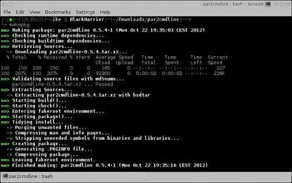

## 还有更多...

`pacman.conf`文件由`[section]`定义的部分组成。这些部分可以在其中定义一些选项。有一个特殊的部分称为`[options]`，可以在其中为 pacman 配置全局选项。其他部分是默认或用户定义的仓库。关于仓库，声明的顺序很重要。文件顶部最近的仓库将优先，按降序排列。这对于提供具有相同名称的软件包的仓库非常重要。声明的顺序也很重要，以便理解为什么`[testing]`必须在`[core]`之上定义。通常，`pacman.conf`文件通过解释提供的选项的注释进行了很好的文档化，但是在这里我们将尝试深入解释它们。

**mirrorlist**是一个列出所有官方 Arch Linux 镜像的文件。让我们找一个离家更近的镜像，这样我们就可以获得最佳的下载速度。我们可以在这里定义多个服务器。请注意，这不会给我们提供来自最新服务器的软件包，但是当列表中的第一个不可访问时，可以使用第二个，因此我们仍然能够更新我们的系统。

### pacman.conf 选项

`pacman.conf`的选项可以在[`www.archlinux.org/pacman/pacman.conf.5.html`](https://www.archlinux.org/pacman/pacman.conf.5.html)找到。默认情况下，一切都应该可以正常工作。默认情况也应该足够适用于新用户。

### 一些仓库示例

以下是`[core]`仓库的示例。我们可以看到软件包需要进行签名检查，并且我们使用镜像列表来配置服务器。

```
[core]
SigLevel = PackageRequired
Include = /etc/pacman.d/mirrorlist
```

以下示例将使用`[options]`部分中定义的默认`SigLevel`，并在使用时首先尝试使用 FTP，当不可用时将退回到 HTTP：

```
[otherrepository]
Server = ftp://10.0.0.1/$repo/$arch
Server = http://10.0.0.1/$repo/$arch
```

在以下示例中，我们有一个本地仓库，您可以在其中看到可以用于填写`Server`选项的所有可能的 URL：

```
[somelocalrepository]
Server = file:///home/packages/$repo/$arch
```

### 有关官方和非官方仓库的更多信息

默认情况下，官方仓库在`pacman.conf`中列出。并非所有官方仓库都是默认启用的。还有一个非官方仓库的很好的列表，您可以在那里找到一些非常高质量的软件。

有关官方仓库的完整信息以及在何种情况下应该启用或禁用它们，请查看[`wiki.archlinux.org/index.php/The_Arch_Linux_Repositories`](https://wiki.archlinux.org/index.php/The_Arch_Linux_Repositories)。

由于很容易设置自己的软件仓库，有很多用户正在构建一组特定的软件包，并将它们作为非官方软件仓库提供给所有人。非官方软件仓库的完整列表可以在[`wiki.archlinux.org/index.php/Unofficial_User_Repositories`](https://wiki.archlinux.org/index.php/Unofficial_User_Repositories)上找到。

### 有关 ABS 的更多信息

通过使用 ABS，我们作为用户对我们的系统有很大的灵活性。对于第一次使用 ABS 的用户，您可能希望查看 ABS 维基页面[`wiki.archlinux.org/index.php/ABS`](https://wiki.archlinux.org/index.php/ABS)。对于一个简化的介绍，您也可以参考[`wiki.archlinux.org/index.php/ABS_FAQ`](https://wiki.archlinux.org/index.php/ABS_FAQ)。

# 使用 systemd 引导和管理服务（应该知道）

Systemd 为我们提供了一种更现代的引导方法。它还受益于现代多核处理器，并依赖于非常激进的并行化来快速完成工作。Arch Linux 默认提供 systemd。Systemd 使用“所谓的服务文件”来定义何时以及何种方式启动某个特定服务或“所谓的守护进程”。

## 准备工作

以下列表描述了我们将在本教程中执行的主要任务：

+   **安装 systemd**

+   **设置默认目标**：默认目标可以与使用 initscripts 时的运行级别进行比较。它不同，但源自同样的想法，即你希望在某些情况下启动一些东西。在 systemd 世界中，“所谓的运行级别”被称为**目标**。

+   **手动启动服务**：使用`systemctl`命令，我们可以根据需要启动和停止服务。

+   **在启动时启用服务**：当然，systemd 可以在启动时启动服务。启用或禁用这些服务非常简单。

## 如何做...

让我们列出安装 systemd 所需的步骤：

1.  通过运行`pacman -S systemd systemd-arch-units`安装 systemd 和 systemd-arch-units 以使安装工作。

1.  通过编辑`/boot/syslinux/syslinux.cfg`，在内核命令行中添加`init=/bin/systemd`：

```
APPEND initrd=/initramfs-linux.img root=/dev/sda2rootfstype=ext4 ro init=/bin/systemd

```

让我们列出设置默认目标所需的步骤：

1.  如果你想最终得到一个图形系统，启用图形目标：

```
systemctl enable graphical.target

```

1.  当终端足够时，多用户目标就足够了：

```
systemctl enable multi-user.target

```

1.  通过运行以下命令手动启动服务：

```
systemctl start service

```

1.  通过运行以下命令在启动时启用服务：

```
systemctl enable service

```

### 注意

有关执行的主要任务的详细描述，请参考本教程的*准备工作*部分。

## 它是如何工作的...

我们需要安装 systemd-arch-units 软件包，因为并非所有提供服务的软件包都提供了使用 systemd 所需的服务文件。由于我们在内核命令行中添加了`init=/bin/systemd`，系统将使用 systemd 进行启动。

如今，只有两个目标可以自动设置为默认目标，因为只有`graphical.target`和`multi-user.target`提供默认目标安装。

在`systemctl start service`命令中，`service`实际上是一个文件的名称。例如，NetworkManager 有一个名为`NetworkManager.service`的 systemd 服务文件，这就是我们需要传递给`systemctl`命令的完整名称。例如：

```
systemctl start NetworkManager.service

```

为了能够知道在启动时启动哪些服务，`systemctl`将在正确的位置为特定的服务文件创建符号链接，systemd 在启动时将在这些位置搜索它们。

## 还有更多...

一旦我们对 systemd 引导我们的系统感到满意，我们最终可以对其进行微调。

### 只有 systemd 初始化

以下命令将为 initscripts 的兼容性提供符号链接：

```
pacman -S systemd-sysvcompat

```

结果是，你可以在内核命令行中省略额外的参数`init=/bin/systemd`。

我们可以通过更改引导加载程序配置中的内核命令行轻松更改所需的目标。这样可以轻松测试某些特定目标是否符合我们的需求。

### 在内核命令行上设置目标

与在使用 initscripts 时将数字附加到内核命令行类似，我们也可以使用`systemd.unit`参数为 systemd 执行此操作。

例如，考虑 Syslinux 作为引导加载程序，打开`/boot/syslinux/syslinux.cfg`并将`systemd.unit=multi-user.target`添加到内核命令行中：

```
APPEND initrd=/initramfs-linux.img root=/dev/sda2 rootfstype=ext4ro systemd.unit=multi-user.target

```

先前的示例适用于仅使用 systemd 的系统，否则我们还需要`init=/bin/systemd`。

### 列出所有可用的服务

我们可能想要知道我们的系统上有哪些服务，当然也想知道我们可以对这些服务做些什么。

我们可以列出所有使用的服务或通过运行以下命令选择列出所有可用的服务：

```
systemctl list-units --type=service
systemctl list-units -a --type=service

```

### 服务的默认操作

默认情况下，systemd 支持`start`、`stop`、`restart`、`reload`和`status`等操作。还有更多可用的操作，可以通过发出`man systemctl`来找到。

### 检查服务是否将在引导时启动

在启用服务之前，我们可能希望检查服务是否已经启用。我们可以通过使用`is-enabled`操作来检查服务是否已经启用了在引导过程中启动：

```
systemctl is-enabled service

```

### 禁用在引导时启动的服务

如果我们发现一些不再需要的服务，我们可能希望禁用它们。有时我们不再希望在引导过程中启动某些服务，因此需要禁用它们：

```
systemctl disable service

```

# 使用 initscripts 引导和管理服务（应该知道）

在本教程中，我们将学习有关 initscripts 的知识。**Initscripts**是一组脚本，可确保计算机正常启动。它还提供了管理系统上的服务所需的功能和工具。Initscripts 的服务通常被称为**守护进程**（[`wiki.archlinux.org/index.php/Daemon`](https://wiki.archlinux.org/index.php/Daemon)）。如今，使用 initscripts 进行引导仍然可以与 systemd 一起使用，但随着时间的推移，将不鼓励使用 initscripts 并逐步淘汰。**Systemd**是一个守护进程，用于控制系统的启动，并管理运行在其中的服务。Initscripts 是用**Bash**编写的，因此在需要时很容易阅读和修改。有关 Arch Linux 引导过程的更多信息，请访问[`wiki.archlinux.org/index.php/Arch_Boot_Process`](https://wiki.archlinux.org/index.php/Arch_Boot_Process)。

## 做好准备

以下列表描述了本教程中将执行的主要任务：

+   更改运行级别：运行级别的定义有点抽象。**运行级别**将决定将启动哪些应用程序。Arch Linux 使用全局定义的一些运行级别，我们可以在[`wiki.archlinux.org/index.php/Runlevels`](https://wiki.archlinux.org/index.php/Runlevels)上找到它们的确切作用。在系统运行时，可以动态更改运行级别，或者可能需要更改运行级别以执行一些需要更改运行级别的机器上的管理操作。

+   设置默认运行级别：默认情况下使用的运行级别是`3`。这是多用户运行级别，不会启动`X`。

+   手动启动服务（守护进程）：使用 initscripts，启动和停止某些服务所需的所有文件也只是 Bash 脚本，因此可以直接调用它们。

+   自动启动服务（守护进程）：在`rc.conf`文件的`DAEMONS`数组中配置了在启动时启动的守护进程的列表。

## 如何做...

以下步骤更改运行级别：

1.  运行`telinit runlevel`来更改运行级别，其中`runlevel`是从`0`到`6`的数字。

让我们列出设置默认运行级别所需的步骤：

1.  编辑`/etc/inittab`。

1.  更改您找到的`id:3:initdefault:`所在的行。在这里，您将看到默认选择的运行级别为`3`。

1.  通过运行`telinit q`测试您的配置是否正确。

1.  要手动启动服务（守护进程），请首先调用脚本：

```
/etc/rc.d/somedaemon start

```

让我们列出自动启动服务（守护进程）所需的步骤：

1.  编辑`/etc/rc.conf`。

1.  按照您的意愿向`DAEMONS`数组添加新项目：

```
DAEMONS=(syslog-ng network crond)
```

1.  保存文件。

### 注意

有关执行的主要任务的详细描述，请参阅本食谱的*准备就绪*部分。

## 它是如何工作的...

`telinit`命令将更改运行级别，并根据您切换到的数字，一些正在运行的应用程序和守护进程可能会停止或只是启动。

在`inittab`文件中设置的默认选择的运行级别决定了在启动计算机时将使用哪些脚本。这也是为什么您总是需要通过运行`telinit q`来检查配置是否正确，因为如果`inittab`文件以某种方式损坏，您的系统将无法启动。

位于`/etc/rc.d/`文件夹中的 Bash 脚本将是可执行的。默认情况下，它还提供三种操作：`start`，`stop`和`restart`。

在启动过程中，初始化脚本将读取在`rc.conf`文件中定义的`DAEMONS`数组，并按照它们的定义顺序在启动过程中启动所有的守护进程。

## 还有更多...

现在让我们谈谈与本食谱相关的一些一般信息。

### 运行级别

运行级别只是数字，但对于我们人类来说，记住句子更容易。因此，我们对动作与运行级别编号进行了一些匹配。

以下列表定义了每个运行级别编号：

+   `0`：关机

+   `1`：单用户模式（救援模式）

+   `2`和`4`：这些是用户定义的，但与任何其他系统一样，默认情况下与`3`相同

+   `3`：多用户模式；用户可以通过终端或网络登录

+   `5`：多用户图形模式；这是运行级别`3 + X`（某些显示管理器）

+   `6`：重启

+   `emergency`：紧急 shell（您将在启动失败时遇到此问题）

### 在内核命令行中设置默认运行级别

修改`/etc/inittab`文件可能导致无法启动的系统。因此，有其他方法可以配置默认运行级别。

我们可以在引导加载程序配置文件中设置我们想要的默认运行级别。这将允许我们安全地切换运行级别。

让我们执行以下步骤通过引导加载程序（在此示例中为 Syslinux）设置默认运行级别：

+   编辑`/boot/syslinux/syslinux.cfg`。

```
APPEND initrd=/initramfs-linux.img root=/dev/sda2rooftfstype=ext4 ro 5

```

我们已将默认运行级别设置为`5`（图形模式）。

### 默认操作

Arch Linux 提供了一个助手应用程序，可以轻松地一次启动多个守护进程。

通常，简化守护进程启动的脚本默认提供三种操作：

+   `start`：启动守护进程

+   `stop`：停止守护进程

+   `restart`：重新启动守护进程

另一个常见的操作是`reload`，它使正在运行的守护进程实际重新加载其配置而无需真正停止。

### rc.d 助手

Arch Linux 提供了一个助手，可以一次启动和停止多个服务。该助手带有一个很好的手册，您可以通过发出`man rc.d`来阅读。

```
rc.d action daemon1 daemon2 ...

```

您可以向`rc.d`提供的操作与直接传递给脚本的操作相同。因此，如果脚本提供`reload`操作，`rc.d`可以使用它。

现在，启动守护进程的默认方式是顺序的。必须正确启动第一个，然后才能启动下一个。我们可以通过稍微不同地配置`DAEMONS`数组来改善我们的启动时间。

### 守护进程可以在后台启动

如果我们希望某些服务与其后的服务并行启动，可以在`DAEMONS`数组中的条目前面添加`@`：

```
DAEMONS=(syslog-ng network @crond)
```

### 在数组中留下一个未启动的守护进程

我们还可以将服务留在`DAEMONS`数组中，但仍然禁用它自动启动。为此，我们需要在服务前面添加`!`：

```
DAEMONS=(syslog-ng !network crond)
```

### 获取可用守护程序的列表

通过运行`rc.d list`命令，我们可以获取所有可用服务的列表。

# 使用 Xorg 配置 GUI（应该知道）

在这个食谱中，我们将学习如何使用**Xorg**配置 GUI。当我们想要将我们的系统用作桌面系统时，我们无论如何都需要 Xorg。这些天，Xorg 是在 Linux 系统上显示和使用图形界面的事实标准。对于大多数单屏设置，您不需要配置任何内容。多屏设置和使用专有驱动程序的设置是这个规则的例外。一些发行版提供了工具来安装正确的视频驱动程序；Arch Linux 没有。因此，最终我们需要找出要安装哪个驱动程序。关于键盘、鼠标和许多其他输入设备，Xorg 大多数情况下可以自动找到它们。在某些情况下，输入设备需要安装额外的 Xorg 驱动程序。

## 准备工作

以下列表描述了我们将在本食谱中执行的主要任务：

+   安装 Xorg：我们将安装基本所需的软件包，以便能够使用 Xorg 图形系统。

+   更改键盘布局：对于大多数人来说，更改键盘布局是不需要的，因为大多数人使用 QWERTY。但是对于世界上一些使用其他布局的地方，这可能会很方便。

+   安装输入驱动程序：当我们有一些特殊的输入硬件时，我们可能需要安装额外的输入驱动程序。这些天一切都应该被自动检测，但有时为了满足您的输入硬件的特定要求，我们需要安装输入驱动程序。例如，笔记本电脑用户可能需要为其触摸板安装 Synaptics 驱动程序。

+   安装视频驱动程序：首先，我们需要找出系统中安装了哪些显卡，以及对它们来说最好的驱动程序是什么。

+   使用专有的 NVIDIA 驱动程序：在 Arch Linux 上安装专有的 NVIDIA 驱动程序很容易，因为它们可以在官方存储库中找到。Arch Linux 维基中有一篇文章涵盖了所有细节。

+   使用专有的 AMD 驱动程序：在 Arch Linux 上使用 AMD（ATI）Catalyst 驱动程序的参考资料是以下维基页面：

[`wiki.archlinux.org/index.php/ATI_Catalyst`](https://wiki.archlinux.org/index.php/ATI_Catalyst)

在这个页面上，我们找到了许多需要的信息，以便在您的硬件上很好地使用 Catalyst 驱动程序。

### 注意

不久前，catalyst 和 catalyst-utils 软件包进入了官方存储库。因此，它们变得非常容易安装。

## 如何做...

1.  安装 xorg-server：

```
pacman -S xorg-server

```

现在让我们更改键盘布局：

1.  运行`setxkbmap`命令，然后选择所需的键盘布局：

```
setxkbmap be

```

1.  安装输入驱动程序：

```
pacman -S xf86-input-synaptics

```

让我们列出安装视频驱动程序所需的步骤：

1.  找出系统中使用的显卡。

1.  搜索是否有可用的驱动程序：

```
pacman -Ss xf86-video

```

1.  安装驱动程序：

```
pacman -S xf86-video-driver

```

让我们列出使用专有的 NVIDIA 驱动程序所需的步骤：

1.  安装 nvidia 和 nvidia-utils：

```
pacman -S nvidia nvidia-utils

```

1.  创建配置文件`/etc/X11/xorg.conf.d/20-nvidia.conf`。

1.  重新启动并查看驱动程序是否正在使用。

让我们列出使用专有的 AMD 驱动程序所需的步骤：

1.  通过运行以下命令安装 catalyst 和 catalyst-utils：

```
pacman -S catalyst-dkms catalyst-utils

```

1.  在内核命令行中添加`nomodeset`参数，以确保不会启动开源驱动程序：

```
APPEND initrd=/initramfs-linux.img root=/dev/sda3rootfstype=btrfs ro vga=773 nomodeset

```

1.  添加默认配置文件`/etc/X11/xorg.conf.d/20-catalyst.conf`，以便 Xorg 知道必须使用专有驱动程序。

```
Section "Device"
  Identifier  "aticard"
  Driver      "fglrx"
EndSection
```

### 注意

有关执行的主要任务的详细描述，请参阅本食谱的*准备工作*部分。

## 它是如何工作的...

Pacman 将下载并安装 xorg-server 软件包及其最小必需的依赖项。

`setxkbmap`命令将更改所选的键盘布局。例如，默认情况下我们使用的是美国布局，运行`setxkbmap be`后将是比利时 AZERTY 布局。

特定的驱动程序由 pacman 安装到您的系统中，这将为 Xorg 提供理解触摸板输入并正确处理它的手段。

NVIDIA 驱动程序应该会被 Xorg 自动检测到，但为了确保，您可以在`/etc/X11/xorg.conf.d/`中添加一个文件，例如`/etc/X11/xorg.conf.d/20-nvidia.conf`：

```
Section "Device"
  Identifier  "NVIDIAcard"
  Driver      "nvidia"
EndSection
```

在需要时，您可以通过发出以下命令创建默认配置：

```
nvidia-xconfig

```

当有两个连接的屏幕时，您还可以自动生成一个 twinview 默认配置：

```
nvidia-xconfig –twinview

```

当我们使用 AMD 专有驱动程序时，设置`nomodeset`参数可以确保内置内核驱动程序不会开始与专有驱动程序发生冲突。Xorg 配置文件将确保 Xorg 在没有错误的情况下启动。虽然不是完全必要的，但我们确保 Xorg 使用驱动程序并为我们提供良好的服务。

## 还有更多...

我们可以选择直接使用我们的图形环境，这将意味着安装 xorg-xinit，或者我们可以使用带有显示管理器的 Xorg 环境。**显示管理器**是一个图形登录屏幕，因此我们可以一直使用 Xorg。

### 直接使用 Xorg

为了直接从终端启动 Xorg，我们首先需要安装 xorg-xinit 软件包以便进行这样的操作：

```
pacman -S xorg-xinit

```

然后，`startx`命令将使我们进入 X 服务器。如果直接使用此命令而没有配置，X 将不会启动，因为我们将缺少默认配置所请求的一些应用程序。因此，让我们继续并安装：

```
pacman -S xorg-twm xorg-xclock xterm

```

### 使用 Xorg 与窗口管理器或桌面环境

为了方便起见，最好安装一个**窗口管理器**（**WM**）或**桌面环境**。有关窗口管理器的完整列表，请转到[`wiki.archlinux.org/index.php/Window_manager`](https://wiki.archlinux.org/index.php/Window_manager)。有关桌面环境的完整列表，请转到[`wiki.archlinux.org/index.php/Desktop_Environment`](https://wiki.archlinux.org/index.php/Desktop_Environment)。

在本节中，我们将安装 Xfce ([`wiki.archlinux.org/index.php/Xfce`](https://wiki.archlinux.org/index.php/Xfce))：

```
pacman -S xfce

```

Pacman 会询问我们是否要安装 Xfce 组中的所有软件包。我们说是，因为这样最方便。

现在 Xfce 已安装，我们可以在启动的 Xorg 会话中发出`startxfce4`，或者修改我们的`~/.xinitrc`。在`.xinitrc`文件中，我们可以取消注释`# exec startxfce4`一行并保存文件。登录后，我们现在可以发出`startx`并享受 Xfce 桌面环境。

### 使用 Xorg 与显示管理器

对于桌面用户来说，这是常见的用法，因为他们需要一个图形登录屏幕，然后从那里继续到所需的桌面环境或窗口管理器。在 Arch Linux 中有几个可用的显示管理器。在本节中，我们只描述**LXDM**，这是一个相当简单的显示管理器。有关 Arch Linux 可用的其他显示管理器的列表，您可以阅读[`wiki.archlinux.org/index.php/Display_Manager`](https://wiki.archlinux.org/index.php/Display_Manager)。

要安装 LXDM，我们使用以下命令发出 pacman：

```
pacman -S lxdm

```

在使用 initscripts 时，我们可以将 LXDM 添加到我们的`DAEMONS`数组的末尾。当我们使用 systemd 时，我们可以发出`systemctl enable lxdm.service`命令，以在启动时启用 LXDM。重启后，LXDM 显示管理器将显示出来，我们可以从桌面会话下拉列表中选择，例如**Xfce 会话**。

### 在配置文件中设置键盘布局

由于我们希望键盘和鼠标在每次计算机启动时自动配置，因此我们可以在配置文件中设置键盘布局，这样我们就不必每次进入 Xorg 时都运行`setxkbmap`。我们已经安装了 xf86-input-evdev，因此我们可以将键盘设置放在同一个文件`10-evdev.conf`中，例如`/etc/X11/xorg.conf.d/10-evdev.conf`（仅键盘部分）：

```
Section "InputClass"
    Identifier "evdev keyboard catchall"
    MatchIsKeyboard "on"
    MatchDevicePath "/dev/input/event*"
    Driver "evdev"
 Option "XkbModel" "pc105"
 Option "XkbLayout" "be"
EndSection
```

高亮部分被添加并执行以下操作：

+   `XkbModel`: 我们使用什么键盘型号？在我们的例子中，是`pc105`。

+   `XkbLayout`: 我们使用什么键盘布局？在我们的例子中，是`be`（比利时 AZERTY）。

### 查找键盘选项

我们可以在`/usr/share/X11/xkb/rules/evdev.lst`中找到所有可能的型号、布局和选项。

### 查找系统上使用的显卡

默认情况下，我们对显卡的支持有限。为了增强我们的 Xorg 体验，我们必须找出我们有什么显卡，以及为它们安装什么驱动程序。通过为我们的硬件安装匹配的驱动程序，我们将获得比以前更好的性能。

找出要安装的驱动程序最简单的方法是使用应用程序**lspci**：

```
lspci | grep VGA

```

示例输出：

```
01:05.0 VGA compatible controller: Advanced Micro Devices [AMD] neeATI RS880M [Mobility Radeon HD 4200 Series]

```

现在我们已经知道我们有一张 ATI 卡。在某些情况下，我们需要使用内核使用的驱动程序来确定要使用的确切的 Xorg 驱动程序。在这个例子中，我们已经知道它将是 xf86-video-ati。

### 安装显卡驱动程序

现在我们可以为我们特定的系统安装所需的驱动程序。在这个例子中，它将是 xf86-video-ati，但可以是任何可用的驱动程序（在下面的例子中用您需要的替换`ati`）。

```
pacman -S xf86-video-ati

```

### NVIDIA GUI 配置

NVIDIA 实际上并不希望我们为显卡的配置而苦苦挣扎。因此，他们为我们提供了一个很好的 GUI 来创建一个精细调整的配置。

配置 NVIDIA 基础设施的最简单方法是使用**nvidia-settings**配置所有内容。您可以以 root 身份发出此应用程序，以便您可以编写全局配置文件。

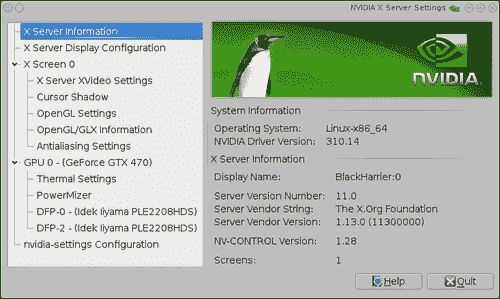

使用 GUI，您还可以存储配置文件。通过输入`/etc/X11/xorg.conf.d/20-nvidia.conf`来这样做：

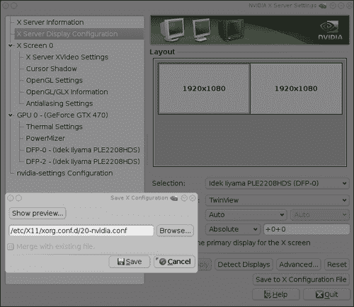

AMD 还为我们提供了一些有用的工具，使配置变得非常容易。现在让我们来讨论它们。

### 使用 AMD 自动生成 Xorg 配置文件

如果您想进行一些扩展配置，可以通过运行以下命令来启动一个新的配置文件：

```
aticonfig --initial

```

这将创建一个新的配置文件，`/etc/X11/xorg.conf`。

### AMD GUI 配置

您可以通过运行 AMDCCCLE 应用程序进一步微调您的 ATI 硬件的工作。

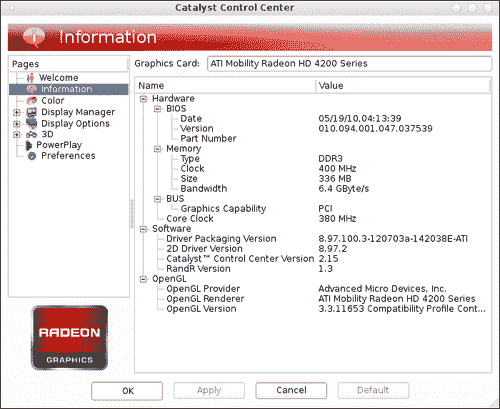
