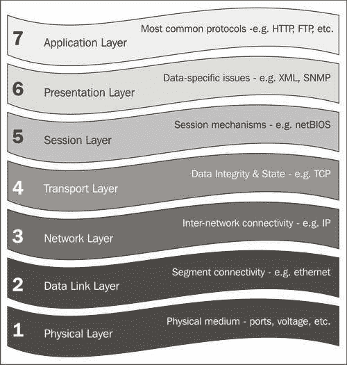
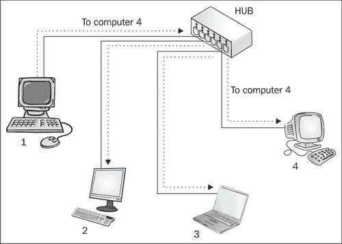
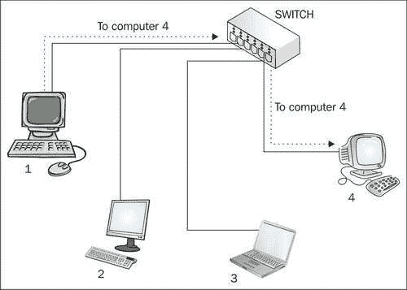
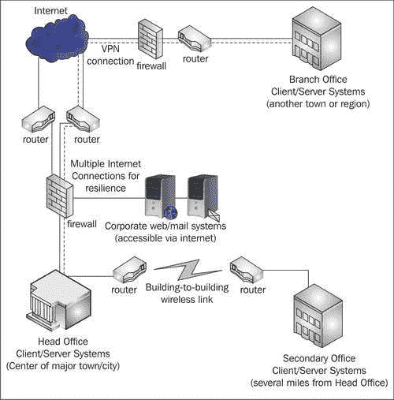
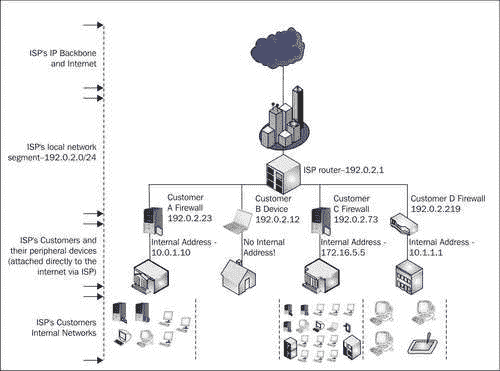
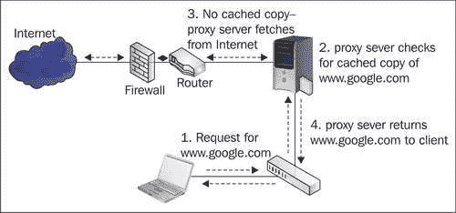
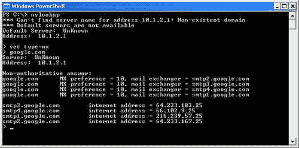

# 第一章：防火墙简介

在本章中，我们将介绍一些防火墙和网络概念，以足够的细节为那些已经遇到过它们的人提供一个复习，但尽可能地以最简洁的方式，因为理解网络概念并不是本书的重点。我们认为其中一些概念很重要，了解这些技术的使用方式和来源有助于更好地理解 IT 的工作方式，但对于时间紧张的读者，我们已经尽可能提供了对这些概念重要性的*斜体*总结。

如果您不理解我们讨论的所有概念，不要担心，同样，对网络概念更熟悉的读者应该能够跳过。IPCop 使许多这些概念的明确理解变得无关紧要，因为它试图尽可能简化和自动化管理。然而，如果您确实有兴趣更深入地了解这些主题，这里提供的介绍以及我们提供的一些 URL 和其他资源的链接应该会有所帮助。了解网络、路由以及一些常见协议的工作原理，虽然不是必需的，但如果您打算经常使用 IPCop 等系统，这也将对您有所帮助。

# 网络防火墙入门

在 20 世纪 70 年代初，随着数据网络变得更加普遍，构建它们的方式也呈指数级增长。对于许多人来说，*互联网*（IBM *TCP/IP 教程和技术概述，Martin W. Murhammer，Orcun Atakan，Stefan Bretz，Larry R. Pugh，Kazunari Suzuki，David H. Wood，1998 年 10 月，第 3 页）或*将多个网络连接在一起*的概念变得极为重要，因为连接不同的、相互对立的网络开始引起痛苦。

在 IT 和计算机科学的背景下，协议通常是指计算机为特定目的交换数据的常见格式。在网络中，协议最好比作一种语言——20 世纪 70 年代的网络情况是存在许多不同的语言，但很少有翻译器可以为人们进行翻译。

美国国防部的*国防高级研究计划局*（[`www.darpa.mil`](http://www.darpa.mil)）进行的研究，尤其是由其资助的研究，不仅产生了一系列旨在实现互操作性的网络*协议*（也就是说，为了实现设备之间的轻松、平台中立的通信），还建立了一个名为**ARPANet**的网络，专门用于这一目的。在语言方面，最好的比较是发展出国际语言*世界语*的发展——尽管这种*国际*语言的传播相当有限，但计算机有一个优势，那就是不需要花费数年时间学习特定的协议！

ARPANet 在 1976 年首次尝试使用 TCP/IP，到 1983 年 1 月，其使用被强制要求适用于网络中的所有计算机。到了 20 世纪 70 年代末，除了军方之外，许多其他组织也被允许访问 ARPANet，如 NASA、**国家科学基金会**（**NSF**），最终还有大学和其他学术实体。

军方从 ARPANet 中分离出来，建立了自己的独立网络用于军事用途（**MILNET**），这个网络成为了 NSF 的责任，后者创建了自己的高速骨干网，称为**NSFNet**，以促进互联网的发展。

当 NSFNet 的可接受使用政策开始允许非学术流量时，NSFNet 开始与其他（商业和私人）网络（如通过 CIX 运营的网络）结合，形成了我们现在所知的互联网实体。随着 NSF 退出对互联网的管理和 1995 年 4 月关闭 NSFNet，互联网被不断增长的商业、学术和私人用户所填满。

互联网所基于的标准已经成为现代网络的基石，如今当有人提到“网络”时，他们往往指的是建立在（和周围）TCP/IP 基础上的东西，这是最初为 ARPANet 开发的一套分层协议，以及 TCP/IP 实现的其他标准，如 802.3 或以太网，它定义了 TCP/IP 在网络段上运行的最流行的标准之一的工作方式。

这些分层协议除了因历史和轶事原因对我们来说很有趣之外，还对我们有一些重要的影响。最显著的影响是，基于它们构建的任何设备都可以与任何其他设备完全互操作。因此，其结果是，我们可以购买任何供应商生产的网络组件——我们的戴尔笔记本电脑运行 Microsoft Windows 可以通过 TCP/IP 自由通信，在以太网网络上使用 Linksys 交换机，插入思科路由器，并查看托管在运行 AIX 的 IBM 服务器上的网页，也使用 TCP/IP 进行通信。

运行在 TCP/IP 之上的更多标准化协议，如 HTTP，实际上携带着信息本身，由于这些协议的分层，我们可以连接一个庞大而不同的网络集合，对于像 Web 浏览器和 Web 服务器这样的设备来说，这些网络看起来是透明的，它们使用 HTTP 等协议进行通信。在我们的戴尔笔记本电脑和 IBM 服务器之间，我们可能有一个拨号连接，一个帧中继网络段，互联网骨干的一部分，以及一个无线网络链接——这些都与 TCP/IP 或 HTTP 无关，它们位于网络的这些层“之上”，并在这些层之上自由传输。如果一辆载满孩子的校车可以使用飞机、渡轮、自行车道和缆车，而不用下车或意识到他们下面的交通工具在变化！TCP/IP 在这种意义上所能实现的分层通信是非常强大的，真正使我们的通信基础设施能够扩展。

# 防火墙的目的

这个网络及其支撑它的研究最初是基于一国军事目的的效用而获得资助的，远远超出了其最初的目标，并通过国际研究和采用，产生了一个正在塑造（并将塑造）未来几代人的现象。网络现在不仅是政府和研究机构的核心活动，也是各种规模的公司，甚至家庭用户的核心活动。无线技术的进一步发展使得这项技术对家庭用户、在外出时以及在不久的将来几乎在地球表面的任何地方都更加易于接触（和相关）！

许多这些网络协议最初是在一个词“*黑客*”还没有具有（负面）含义的环境中设计的，并且是在一个相互信任和尊重的文化网络上实施的。**IPv4**，作为通过互联网进行所有通信的基础（以及大多数私人网络），以及**SMTP**（用于发送电子邮件并将其从一个服务器中继到另一个服务器的协议）是这一点的两个主要例子。这两种协议的初始版本都没有设计用于维护现在与有效通信同义的三个特性**保密性、完整性**和**可用性**（称为**CIA 三位一体**）。CIA 三位一体通常被定义为信息安全的目标- [`en.wikipedia.org/wiki/CIA_triad`](http://en.wikipedia.org/wiki/CIA_triad)。*垃圾邮件*和*拒绝服务攻击*只是这两种协议中一些弱点的（恶意）利用的两个例子。

随着网络技术的发展和被政府和依赖于它们的大型组织采用，对这三种特性的需求增加了，网络防火墙成为了必需品。简而言之，*网络安全*的需求应运而生。互联网也已经走过了很长的路。随着准入门槛的降低，以及支撑它的技术知识变得更加易于获取，它变得越来越不友好。

随着人们越来越依赖互联网进行通信，防火墙已经几乎成为了防止未经授权的网络活动、自动攻击和内部滥用的主要防线。它们被部署在各个地方，术语“防火墙”在这个语境中用来指代从内置到常用操作系统（如微软的 Windows 操作系统 Service Pack 2 中内置的*Windows 防火墙* ([`www.microsoft.com/windowsxp/using/security/internet/sp2_wfintro.mspx`](http://www.microsoft.com/windowsxp/using/security/internet/sp2_wfintro.mspx)）只保护其运行的计算机，到在银行、数据中心和政府设施中部署的耗资巨大的设备（如思科的 PIX 系列防火墙产品([`www.cisco.com/en/US/products/hw/vpndevc/ps2030/`](http://www.cisco.com/en/US/products/hw/vpndevc/ps2030/))）。这样的高端设备可能管理和限制数十万台个人计算机之间的网络流量。

鉴于“防火墙”一词的使用增加，并且在词中添加了许多限定词以区分不同类型的防火墙（如有状态、代理、应用、数据包过滤、硬件、软件、电路级等术语），当有人告诉你他们的网络“有防火墙”时，很难知道他们的意思。因此，我们对 IPCop 的探索必须从对防火墙的实际含义的探索开始，掌握了这些知识，我们就可以将 IPCop 与这些知识联系起来，了解 IPCop 可以为我们提供什么功能。

为了改善我们的网络安全，我们需要首先确定我们需要解决的问题，并确定这个防火墙是否是解决这些问题的方案。出于满足流行词要求而实施防火墙是安全设计中的一个常见错误。

防火墙一词通常指的是一系列旨在做一件事的技术和设备-阻止未经授权的网络活动。防火墙充当了一个以上网络（或网络段）之间的瓶颈，并使用（希望）严格定义的一组规则，以允许或禁止某些类型的流量穿过防火墙的另一侧。最重要的是，它是两个或多个网络之间的安全边界。

防火墙的目的

在上图中，连接到互联网的 Web 服务器受到防火墙的保护，防火墙位于它和互联网之间，过滤所有进出流量。在这种情况下，防火墙阻止了攻击者的非法流量。这可能是由于多种原因，比如防火墙从互联网上阻止了攻击者尝试连接的服务，因为攻击者的网络地址被列入黑名单，或者因为防火墙识别到攻击者发送的流量是拒绝服务攻击的一部分。

在这种情况下，Web 服务器所在的网络（在这种情况下可能包含多个 Web 服务器）被防火墙与互联网隔离，有效地实施了一个安全策略，规定了从一个网络（或一组网络）到另一个网络可以传输*什么*。例如，如果我们的防火墙禁止攻击者连接到 Web 服务器上的文件共享端口，而“用户”可以自由访问端口 80 上的 Web 服务器，那么防火墙后面的其他服务器可能被允许访问文件共享端口以同步内容或进行备份。

分层协议通常使用**开放系统互连**（**OSI**）层来解释。对于任何在网络或特别是防火墙中工作的人来说，对此的了解是非常有用的，因为与之相关的许多概念都需要了解这种分层工作方式。

OSI 层将流量和数据分为七层，每一层理论上都属于一个协议。尽管在理论上很好，但网络和 IT 应用并不总是严格遵守 OSI 层，因此值得将其视为指导方针而不是严格的框架。尽管如此，它们对于可视化连接非常有用，通常每一层都使用不同厂商设计的硬件和软件，与上下层进行互操作并不是不切实际的。

# OSI 模型

OSI 模型如下图所示：



## 第 1 层：物理层

物理层包括构建网络的物理介质。在物理层内运行的规范包括物理接口，如端口、电压、引脚规范、电缆设计和材料。**网络集线器**是一个第一层设备。

## 第 2 层：数据链路层

数据链路层在同一网络段上的主机之间提供连接。**MAC**地址在物理层上用于区分不同的物理网络适配器，并允许它们进行通信。**以太网**是一个第二层的标准。

## 第 3 层：网络层

网络层在不同网络上的主机之间提供连接，并且在这一层进行路由。**Internet Protocol**（**IP**）和**Address Resolution Protocol**（**ARP**）存在于这一层。ARP 具有重要作用，因为它通过确定给定层三（IP）地址的层二（MAC）地址来在第二层和第三层之间进行中介。

## 第 4 层：传输层

传输层通常作为确保数据完整性的层。**TCP**是在这一层最常用的协议，它是一个**有状态**的协议，通过与远程主机保持连接，可以重新传输未到达目的地的数据。**UDP**是另一个（稍微不太常见）在这一层操作的协议，但它不是有状态的——它发送的每条消息都不是作为一个“连接”的一部分，并且被视为与回复（如果需要）或之前在两个主机之间传递的任何消息完全分开。

### 注意

**IP、TCP/IP、UDP 和其他第四层协议**

从对 OSI 层的考察中，我们可以看到 TCP 是在 IP 之上运行的协议，形成了 TCP/IP 的缩写。不幸的是，当人们使用术语 TCP/IP 时，并不总是指的是这一对特定的协议——“TCP/IP 协议套件”经常被定义为 IP、TCP 以及与之一起使用的 UDP 和 ICMP 等其他协议。这是一个值得注意的区别，尤其是在 IT 专业人员中很常见，在操作系统的文档中也很常见，比如微软的 Windows。

## 第 5 层：会话层

OSI 模型中的最后三层不再关注（互联）网络问题，而更多地涉及使用连接的软件和应用的实际问题。会话层是建立会话的机制所在，比如**NetBIOS**协议。

## 第 6 层：表示层

表示层处理与数据特定问题，如编码、压缩和加密。**SNMP**和**XML**通常是在这一层存在的标准。

## 第 7 层：应用层

应用层是常用于通信的协议所在的层，比如**HTTP、FTP**和**SMTP**。

通常，第三层和第四层是防火墙最常处理的层，还有一小部分（但数量在增加）通常被称为“代理防火墙”或“应用层防火墙”，位于这些层之上（并且了解诸如 HTTP、DNS、RCP 和 NetBIOS 等协议）。值得注意的是，许多防火墙（错误地）将第三层以上的所有层都分类为*应用层*。

对于我们的目的来说，对 OSI 层的深入理解（和解释）以及一些更概念性和技术性的网络方面是不必要的——尽管我们已经试图提供了一些概述，但这更多是为了熟悉和为了给你一些你可能想要在将来学习的想法。

对于我们的目的来说，知道分层存在就足够了。如果你有需要（或者有兴趣）了解更多关于这些主题的内容，本章中提供的一些 URL 可以作为很好的起点。你不一定要理解、同意或者喜欢 OSI 层，才能使用防火墙（事实上，许多 TCP/IP 堆栈并不严格遵循基于它们的流量处理），但知道它们的存在以及大致了解它们的设计目的以及围绕它们构建的技术如何相互作用，对于任何认真了解防火墙或网络的人，或者经常使用这些技术的人来说都是很重要的。

在许多情况下，维基百科([`www.wikipedia.org`](http://www.wikipedia.org))是技术概念的很好起始参考，维基百科的受众通常在 IT 方面很精通，提供了全面的主题覆盖！维基百科的 OSI 层页面有很好的参考资料和技术上准确的内容。这可以在[`en.wikipedia.org/wiki/OSI_seven-layer_model`](http://en.wikipedia.org/wiki/OSI_seven-layer_model)找到。

另一个关于 TCP/IP 所有事物信息的优秀在线资源是[`tcpipguide.com/`](http://tcpipguide.com/)。

本章前面提到的 IBM“TCP/IP 教程和技术概述”，作者是 Martin W. Murhammer、Orcun Atakan、Stefan Bretz、Larry R. Pugh、Kazunari Suzuki 和 David H. Wood，是另一本很好（而且免费）的 TCP/IP 网络世界指南。尽管稍微有些过时（最后一次修订是在 1998 年 10 月），但围绕 TCP/IP 的许多标准在 20 多年来都没有改变，所以日期不应该让你太在意。这个指南以及许多其他与开放标准和 IBM 产品相关的指南可以在优秀的“IBM Redbooks”网站上找到[`www.redbooks.ibm.com/`](http://www.redbooks.ibm.com/)。

对于 TCP/IP 的介绍，理查德·W·史蒂文斯的三本《TCP/IP 图解》书籍通常被认为是该主题的权威来源。完整套装的 ISBN 号码是 0-201-77631-6，可以在任何一家好的大型书店或在线书店找到。

# 网络结构

无论你是否知道，你使用的任何网络的机会都是建立在 IP，即互联网协议的基础上。IP 及其上面构建的协议（如 TCP、UDP 和 ICMP，所有这些协议都使用 IP 数据报）是几乎每个当前部署的网络的基础。这些网络构成的组件是可互操作的，因此它们的角色是明确定义和理解的。我们将简要讨论这些设备，特别是它们如何与防火墙相互连接。

以太网作为大多数这些协议通常层叠在其上的基础技术，构成了这些设备的基础。因此，网络设备、外围设备和设备通常被称为**LAN**、以太网或 TCP/IP 设备（或更常见的是**网络**设备）。还有其他正在使用的网络标准，其中两个是**Token Ring**和**SNA**网络，它们具有相当特定的用途。其中包括上述两种标准在内的许多标准通常被认为已过时。通常情况下，它们仍然部署在遗留原因的场景中，这些网络通常标志着需要更换或者已经被冻结更改。

值得一提的是，Token Ring 和 SNA 通常部署在较大的组织中，后者几乎完全与 IBM zSeries 等大型机进行通信。其他专门的 IT 环境，如集群，具有特定的网络要求，这使它们倾向于其他形式的网络。

然而，在这里，我们将考虑以下（以太网/IP）网络设备：

+   服务器和客户端（微型计算机）

+   交换机和集线器

+   路由器

+   组合设备

## 服务器和客户端

服务器/客户端关系是 TCP/IP 协议的基石，有必要对其有一定的了解，以便能够有效地管理、实施和思考。简单地说，客户端是指发起连接（即开始发送数据）到另一台计算机的任何设备，服务器是指监听这样的连接以允许其他设备连接到它的任何设备。

在 TCP/IP 的上下文中，网络上的所有设备都是服务器和客户端，无论它们是否被专门分配为服务器（如企业邮件服务器）或客户端（如台式电脑）。这是由于两个原因：首先，许多高级协议从服务器本身向客户端发起连接；其次，TCP/IP 连接实际上涉及在两个连接中发送数据到监听端口——最初是从客户端到服务器，以启动交易，连接（通常）到服务器上的一个众所周知的端口，以访问特定服务（如端口 80 用于 HTTP，端口 25 用于 SMTP，或端口 21 用于 FTP），流量来自客户端的（通常）随机的临时（即大于 1024）端口。

一旦数据到达，服务器从服务端向客户端发送数据（在这个连接中，服务器也是客户端！），并且发送到客户端的（随机）端口，该端口被用作初始连接的源端口。从服务器到客户端的服务端口的流量用于服务器回复客户端。从客户端到服务器和从服务器到客户端的数据流构成了一个完整的 TCP/IP 连接。当我们讨论流量过滤时，这种特定的区别后来变得重要。

在网络的范围内，服务器是为该网络上的主机提供固定服务的设备。通常涉及某种形式的集中式资源；尽管“防火墙”可以被描述为服务器，但它不一定必须接受连接（而是促进到其他位置和/或服务器的连接）。

服务器可以提供文件、电子邮件或网页，通过 DHCP 提供网络配置信息，通过 DNS 服务器提供域名和主机名与 IP 地址之间的转换，甚至提供其他更复杂的服务，例如单一登录或提供安全服务（如 Kerberos 服务器、半径服务器、入侵检测系统等）。对于本书的目的，我们通常将服务器视为*为网络上的其他计算机和设备提供服务和数据的设备*。

客户端通常由用户直接使用，放置在桌子上，并连接有显示器和输入设备，或者是笔记本电脑（服务器通常要么共享这些外围设备，要么根本没有这些设备）。它们直接用于访问有时存储在其他地方（如网页或文件服务器上的文件）或本地（如存储在本地“我的文档”文件夹上的文档）的资源和信息。对于本书的目的，我们通常将客户端视为*用户用于访问网络或互联网上其他计算机上的服务（以及访问存储在其中的数据）的设备*。

### 注意

有关客户端/服务器关系的更多信息，请参阅[`en.wikipedia.org/wiki/Client-server`](http://en.wikipedia.org/wiki/Client-server)。

## 交换机和集线器

集线器是一种网络设备，允许多个客户端连接到网络段，在这个范围内它们可以相互通信。逻辑上，集线器非常简单，基本上充当所有连接到设备的设备的逻辑连接器，允许流量自由地从端口流向端口，因此在一个四端口设备中，如果连接到端口 1 的客户端向连接到端口 4 的客户端发送数据，集线器（不知道“客户端”概念）简单地允许这个流量流向该设备上的所有端口——客户端 2 和 3 忽略不属于它们的流量。



交换机解决了集线器的一些缺点，并且通常优先部署。此外，集线器越来越成为过去时代的遗物，在零售店和在线购买变得非常困难。



交换机通过在内存中保持将端口与 MAC 地址相关联的表来工作，因此交换机知道哪台计算机插入了哪个端口。一些交换机可以“堆叠”，将这种功能应用于整个网络段，尽管在一个网络中，未经管理或未堆叠的交换机只是通过交叉连接电缆相互连接，给定的交换机只会在特定端口上看到大量 MAC 地址。

由于本地段上的流量（甚至是通过该段路由并且目的地是另一个网络的流量）是根据 MAC 地址直接从主机到主机（路由器到路由器，路由器到客户端，客户端到服务器等）传递的，因此交换机可以根据其拥有的端口决定特定数据报文的目的端口。由于需要处理，交换机的成本一直比集线器高，因为执行此类处理所需的电子元件的成本比集线器内部的“愚蠢”元件更高。

就其优势而言，交换机更快，因为任何两个端口都可以使用大量带宽，而不会影响设备上其他端口可用的带宽。在未切换的网络上，如果客户端 1 和 4 正在使用可用带宽的 90%生成流量，则网络的其余部分只有 10%的带宽（或者在处理 IP 强加的开销时，实际上更少）。在切换网络上，每个端口逻辑上具有显着增加的带宽限制，通常可达到交换机硬件的极限。

值得注意的是，许多交换机将对所有端口的流量设置总带宽限制，大多数中高端交换机都有一个“上行”端口，除了提供 MDI-X 功能（能够感知是否需要交叉链接，并在需要时在交换机中执行必要的修改，以便可以使用普通的“补丁”电缆进行交换机到交换机的连接），还是一个更高带宽的端口（在 100 兆交换机上是千兆位），或者是一个 GBIC 接口，可以实现模块化上行。

交换机本身也稍微更安全，因为任何设备都很难随意监听可能包含私人数据或身份验证信息（如密码）的网络流量。交换机了解哪些客户端插入了交换机上的哪个插座，并且在正常情况下会将数据从一个端口移动到另一个端口，而不会将无关的流量传递给不作为目的地的计算机。

然而，这并不是绝对的安全措施，可能会被一种称为 ARP 欺骗或 ARP 中毒的技术所规避（[`www.node99.org/projects/arpspoof/`](http://www.node99.org/projects/arpspoof/)）。**ARP 欺骗**是一种非常著名的技术，存在多个平台的多个工具，允许人们执行它。在本地段上，ARP 欺骗允许具有管理员或系统级访问 PC 的任何用户（管理员凭据，一个备用网络插座，可以插入笔记本电脑，或者只是配置为从 CD 或软盘启动的计算机）拦截同一段上其他计算机发送的任何和所有流量，并将其透明地重定向到互联网（或其他目的地），而不会对用户造成任何可见的中断。一旦这个第二层协议被破坏，每个其他层的每个其他协议（除了使用证书的难以攻击的强加密协议）都必须被认为是被破坏的。

现代交换机通常具有许多形式的高级功能。传统交换机虽然比集线器更智能，但在上面描述的形式中被描述为“未管理”的交换机。更新的“受管理”交换机（通常具有更大的微处理器、更多内存和增加的吞吐量（在给定时间内可以穿越网络的数据量））提供更多功能。其中一些例子是提供增加的安全功能，如 MAC 地址过滤、DHCP 监听和监视端口。其他新功能可能涉及安全和网络结构，如虚拟局域网（vLANs）。正如前面提到的，一些“受管理”交换机提供堆叠功能，通过使用专有的链接电缆（例如 3com Superstack 交换机的“Matrix”电缆）或交换机的上行端口之间的普通补丁/交叉电缆，可以将一组交换机管理为一个，有效地共享配置和管理界面。

一些非常高端的交换机，如思科 6500 系列和 3com Corebuilder 交换机，还具有“路由引擎”，使它们能够实现一些路由器的功能。这再次导致在将它们应用于“现实生活”时，OSI 层之间的更多“模糊”。

交换机的范围从小型的四端口单元（通常与其他网络设备集成，并作为消费类电器销售，比如 Linksys WRT54G）到设计用于数据中心的大型、高可用性单元，支持许多并发客户端并具有极高的吞吐量。

在本书的背景下，我们将在一个相当简单的背景下考虑交换机，并忽略诸如 vLAN 和路由引擎之类的功能，这些功能超出了我们在谈论 IPCop 时可以合理处理的范围（这样的讨论更适合于网络书籍）。对于本书的目的，虽然了解交换机是有用的，但理解交换机是*允许插入网络插座的所有客户端彼此交谈，并且为许多主机之间、网络之间以及存储在服务器上的共享资源提供连接*的设备就足够了。

## 路由器

如果一系列交换机和集线器将我们的客户设备连接在一起以形成网络，那么路由器就是非常简单地连接这些网络的设备（换句话说，路由器是互联网的基础）。一个小型路由器（比如 1700 系列的思科路由器）可以通过 ISDN 或宽带连接将分支办公室与总部连接起来，而在另一端，思科、瞻博或北电（或基于 Windows 2003 或 Linux 等操作系统）的昂贵高端路由器可能有几个网络链接，并负责将一个较小的 ISP 与几个较大的 ISP 连接到互联网骨干网。在高端设备中，专用设备虽然基于与 PC 类似的架构，但可以处理比运行 Windows 或 Linux 等操作系统的“普通”计算机更多的流量，因此这些“骨干”路由器几乎从不是除了专用设备以外的其他东西。

在 TCP/IP 网络上，位于同一“子网”（即插入同一集线器/交换机或一系列集线器/交换机的计算机）的计算机将直接使用 ARP（地址解析协议）进行通信，以查找目标计算机的硬件（或 MAC）地址（正如我们在讨论 OSI 层时提到的，ARP 用于在第二层和第三层之间进行转换），然后直接向本地网络段上的这个 MAC 地址发送数据。正因为如此，“子网掩码”非常重要；它允许设备计算哪些网络地址是“本地”的，哪些不是。如果我们的网络使用（私有）地址范围 192.168.0.1，并且我们的子网掩码是 255.255.255.0（或一个 C 类网络或/24 CIDR 地址空间），那么任何不以 192.168.0\开头的网络地址都将被视为远程地址，设备将不会直接尝试连接它（通过第二层），而是会查阅“路由表”以查看通过哪个“路由器”（通过第三层）发送数据，作为连接到另一个网络的中介。

在较小网络（或结构良好的较大网络）上，客户端的一个相当典型的配置是只有一个路由器——“默认”路由器——通过它进行流量传输。使用前面的例子，如果我们的设备尝试连接到网络地址 192.0.2.17 的另一个设备，操作系统会看到根据网络适配器的网络地址和子网，这不是一个本地设备，然后将数据发送到“默认网关”，然后“路由”流量到正确的目的地。虽然可以配置客户端使用不同的路由器来连接不同的网络段，但这是一个更高级和不太常见的配置选项。

如果一个网络使用快速网络连接（如 ADSL 路由器）作为默认网关（用于互联网访问），并且使用另一个路由器访问内部网络的另一个子网（例如，一个公司有多个站点的分公司），则可能希望为客户端配置多个路由。在较小的公司中，这种情况更好的方案是通过一个处理两者的路由器提供内部和互联网连接，使客户端配置和管理更简单（所有流量通过默认网关，而不是每个客户端都指向不同路由器的静态路由表），但这可能并非总是可能或理想。



在上面的插图中，我们考虑一个拥有总部大楼的公司。**总部**局域网基础设施（在这里由左下角的柱廊建筑代表）包含内部访问的服务器，如文件、邮件、打印和目录服务器，以及客户端。在这个网络和互联网以及不受信任的网络段或 DMZ 之间（其中包含外部可访问的公司网站/邮件系统，托管公司网站并接受传入电子邮件）之间是一个防火墙。

除了总部后面的防火墙处的客户端，我们还有一个**分部办公室**，位于总部所在的城镇——当总部没有扩展空间时开设的。这个办公室在与**总部**相同的逻辑网络基础设施上拥有服务器和客户端系统，但在自己的（路由）子网中，通过建筑间的无线链接连接到总部网络，可能是通过微波或激光链接。

一个**分公司**（也许是为了我们虚构的业务在国家另一地区的销售人员，客户密度很高）也使用**总部**网络的资源。由于距离的原因，这个办公室也有自己的服务器（很可能是文件、打印和电子邮件系统，内容和信息与**总部**相应系统同步）。在自己的子网中，这个网络通过 VPN 连接，从**分公司**段到**总部**段通过互联网和防火墙隧道传输，因为租用线路或类似连接的成本过高。

由于网页/邮件服务向互联网开放，我们的**总部**有多个互联网连接以实现冗余。在这种情况下，**总部**基础设施（可能相当大）和互联网服务提供（**总部**防火墙本身很可能是或伴随着另一个路由器）通常会使用更多的路由器。这些都被简化了！

对于我们的目的，我们将考虑路由器是一个*将数据包跨越广域网或互联网转发到它们正确目的地的设备*。

## 路由器、防火墙和 NAT

虽然很容易用这种干净利落的术语来谈论网络——基于层的分离网络和网络设备作为孤立的、明确定义的项目，但这通常并非如此。出于许多原因，包括网络拓扑和有限的资源，角色经常被合并，特别是在较小的网络中。经常，首先合并的是“防火墙”和“路由器”的角色。

由于网络经常由路由器连接在一起，这个自然的瓶颈点似乎是一个方便的防火墙位置。这本身是良好的网络理论，但经常是通过向现有路由器添加防火墙功能或规则集来实现的，而不对网络进行任何更改。虽然在小型网络上这是有些合理的，但它可能会导致处理负载的问题，并给设备（路由器）增加复杂性。一般来说，尽可能地分离角色是一个好主意，通过使用单独的路由器、防火墙、代理服务器等。

这也适用于服务器上的其他基础设施角色 - DNS 服务器、Kerberos 域控制器、DHCP 服务器、Web 服务器等等，应尽可能地保持分离，以提高性能、可靠性和安全性。

不幸的是，正如我们已经提到的，这并不总是可能的，有一些网络角色经常被合并，比如防火墙和路由器。特别是在没有为每个网络设备拥有自己的可路由 IP 地址的组织中（这几乎是每个中小型企业），需要进行网络地址转换。NAT 是一个过程，通过这个过程（为了缓解互联网可用 IP 地址的不断减少），本地网络将不使用在互联网上可用的 IP 地址。

### 网络地址转换

网络地址转换是互联网及其构建的协议的另一个结果。就像 DNS、SMTP 和 TCP/IP 等协议是在安全性经常被忽视的环境中设计的一样，互联网的增长程度也是如此。我们应该熟悉的 IPv4 寻址方案使用四个数字的八位组，每个数字的范围是 0 到 255，最多只有 40 多亿个地址（精确地说是 255⁴）。

鉴于互联网连接的广泛普及和使用 IP 地址的个人计算机、移动电话、PDA 和其他设备的数量庞大（其中路由器、非移动 IP 电话，甚至家用电器如冰箱和微波炉只是其中的一部分），这个地址空间虽然最初可能被认为是巨大的，但开始用尽。因此，为了减少 IP 地址消耗的速度，需要一种临时方法，这就是 NAT。

作为 NAT 在实践中的使用示例，考虑以下假设情景：



考虑上面的图表 - 一个虚构的 ISP 和它的四个客户。每个客户由 ISP 分配一个 IP 地址，分配给 ISP 提供的连接直接连接的计算机或设备。

客户 A 是一个中等规模的律师事务所 - 客户 A 有一个基于 IPCop 的防火墙，几台服务器和几个私人网络段中的客户端。它使用 10.0.1.0/24（C 类）子网用于内部客户端，但其外部 IP 实际上被几十台计算机使用。

客户 B 是一个家庭用户 - 客户 B 只有一台电脑，一台笔记本电脑，直接连接到 ISP 的互联网连接。客户 B 的外部 IP 被一台计算机使用，没有 NAT 和私人内部网络。

客户 C 是一个较大的制造公司 - 客户 C 在其互联网连接上连接了一个高端防火墙，并在其内部网络中有大量不同的设备。客户 C 在其防火墙后面的网络段中使用 172.16.5.0/24 子网，并在其内部网络中有电话系统、客户端、服务器系统和中档主机系统。

客户 D 是一个家庭，有几台电脑供家庭成员使用，还有一台平板电脑——他们有几个客户端连接到由一台一体化交换机/路由器/防火墙设备（可能是之前提到的 Linksys WAP54G）提供的无线网络。

实际上，只有四个 IP 地址代表了互联网上数百个客户端，通过巧妙地利用技术，使用互联网服务提供商为客户端提供互联网访问，减少了 IP 地址的浪费，不为每个主机分配一个 IP 地址。

如果您的计算机作为网络上的主机存在，并且默认网关执行网络地址转换，并且您访问一个网站，您的计算机将发起到您正在连接的 Web 服务器的端口 80 的连接，您的计算机将从其拥有的 IP 地址（在 NAT 的情况下，是一个私有地址，如 192.168.1.23）发送数据包到目的地。目的地在互联网上的网站的情况下，将是一个互联网可路由的 IP 地址，例如 72.14.207.99（Google 的 IP 地址之一）。

如果您的网关只是将此数据包转发给 Google，那么它很可能根本无法到达那里，因为您的计算机和 Google 之间的路由器几乎肯定会配置为“丢弃”来自 192.168.0.0/16 地址范围的数据包，这些数据包对于互联网通信是无效的。因此，您的路由器在转发数据包之前*重新写入*数据包，并将 192.168.1.23 替换为您的 ISP 临时分配给您的路由器的外部地址。

当来自另一端主机的回复返回时，路由器在记下翻译过程后，会在内存中的表中查找，根据连接的序列号确定 192.168.1.23 是发起主机，并重新写回数据包。实际上，您的客户端是伪装成连接到互联网的设备（或者它在伪装成他们），确实，“伪装”是 Linux 中 iptables/netfilter 防火墙组件中 NAT 的技术术语。尽管 NAT 过程会破坏一些更复杂的协议，但它是一种非常有效的方式，可以让成百上千台设备在一个互联网可路由（公共）IP 地址后面在线。

对于客户端来说，设置看起来就像他们的地址范围存在于互联网的一个正常路由段中，而实际上，“默认网关”正在执行网络地址转换。通过这种方式，IP 地址的全球短缺得到缓解，但牺牲了一些便利。特别是小型和家庭办公设备，如 D-Link、Linksys 等公司销售的设备，几乎总是使用网络地址转换来为其客户提供连接，IPCop 也使用它。

### 注意

**私有地址范围**

这些“私有”IP 地址范围在 RFC 1918 中设置。RFC 或请求评论，虽然不是技术标准，但是“关于互联网（最初是 ARPANET）的技术和组织笔记，始于 1969 年。RFC 系列中的备忘录讨论了计算机网络的许多方面，包括协议、程序、程序和概念，以及会议记录、意见，有时还有幽默。”对于协议、标准和惯例，它们是一个很好的第一参考线，尽管（通常取决于作者和预期受众）它们通常是相当技术性的。

私有 IP 范围中最为人熟知的可能是 192.168.0.0/16 范围，其中包括 255 个 C 类“子网”，其中最常用的是 192.168.0.1/24 和 192.168.1.1/24 子网。这个地址范围经常被用作**小型办公室家庭办公室**（SOHO）路由器的默认私有地址范围。还有另外两个私有地址范围用于这些目的，即 10.0.0.0/8 和 172.16.0.0/12 范围。

### 组合角色设备

因为 NAT 的结果，因此几乎总是处于**小型办公室家庭办公室**网络边界的设备几乎总是*组合角色*，尽管通常被营销为*路由器/防火墙*或简单地*路由器*，但通常执行以下所有角色：

+   路由器（执行网络地址转换）

+   防火墙

+   DHCP 服务器

+   缓存/解析 DNS 服务器

一些这样的设备（包括 IPCop）可能还提供以下一些功能，其中大多数通常更常见于企业产品中：

+   代理服务器

+   内容过滤

+   文件服务器

+   入侵检测

+   VPN/IPSec 服务器

由于某些任务的复杂性，通常情况下，“嵌入式”组合设备很难配置，并且与其他设备（如来自其他供应商的 IPSec/VPN 设备）进行一些更复杂功能（如 IPSec 和文件共享）的互操作可能非常困难。尽管这些设备的价格和大小使它们对较小的网络非常有吸引力，但需要一些更高级功能的网络应该仔细考虑它们，并评估它们是否在经济和技术上能够满足他们的需求。

当需要组合角色时，更大、更完全设计的解决方案（如 Borderware、Checkpoint、Cisco 等的防火墙设备）或商业软件（如 Microsoft 的 ISA 服务器）通常比它们更有效地完成工作，并以更可配置和可互操作的方式。显然，我们相信 IPCop 不仅在其预期任务上比嵌入式设备做得更好，而且比一些商业防火墙和网关软件包做得更好！

# 流量过滤

了解防火墙的预期功能以及为什么它们的功能对我们很重要，现在有必要简要探讨一下防火墙是如何实现我们为其分配的广泛目的的。

## 个人防火墙

个人防火墙在过去五年中变得越来越普遍。随着 Windows XP Service Pack 2 中个人防火墙技术的加入（以及即将推出的 Windows Vista 中的增强技术），以及 OSX 和 Linux 操作系统中的防火墙堆栈，现在工作站和台式机运行防火墙软件已经成为相当正常的事情。

一般来说，防火墙软件有两种形式——一种是内置于操作系统中的防火墙软件（如 OSX、Linux 和 XP 的 Windows 防火墙），另一种是来自软件供应商编写的许多第三方防火墙。这类软件包的两个相对受好评的例子是 Agnitum 的 Outpost 软件包和 ZoneLabs 的 ZoneAlarm 软件包。

个人防火墙软件不能成为真正的防火墙。正如我们之前讨论过的，防火墙是防火墙一侧和另一侧之间的安全边界。根据定义，个人防火墙必须在做出是否允许数据存在的决定之前接受数据进入计算机。许多形式的利用都涉及对恶意构造的数据进行解析和评估时的误解。由于防火墙正在执行这些任务，它无法有效地隔离正在保护的软件部分和正在被保护的软件部分。即使对于较小的网络，个人防火墙也永远无法提供网络防火墙提供的隔离程度。

尽管个人防火墙软件相对有效地防御入站（入口）流量，但这种软件无法防御未经授权的出站（或出口）流量，因为在工作站上生成这种流量的应用程序通常会对防火墙的内部有一定程度的访问权限。如果登录用户是工作站的管理员（或者操作系统存在安全漏洞，允许非管理员应用程序获得系统或管理员权限），那么很可能可以绕过软件/个人防火墙，使用操作系统（[`www.vigilantminds.com/files/defeating_windows_personal_firewalls.pdf`](http://www.vigilantminds.com/files/defeating_windows_personal_firewalls.pdf)）的方式，这是使用与客户端本身不同的防火墙根本不可能的。

许多个人防火墙软件，如 ZoneAlarm，超越了仅由数据包过滤防火墙提供的服务，并作为基于主机的入侵检测系统（HIDS）或基于主机的入侵预防系统（HIPS）。这些系统积极监视，并在 HIPS 的情况下，防止对操作系统及其组件的更改。这些功能不能由像 IPCop 这样的网络防火墙提供，但对 HIPS 和个人防火墙同样适用批评——最终，如果其运行的主机受到损害，入侵预防系统的准确性也会受到损害。

安全领域的最新发展包括 rootkit 软件，它能够利用虚拟化软件（如 VMware）和硬件虚拟化支持（如 AMD 和英特尔最新处理器中的支持）为主机操作系统提供“后门”。像 VMware 和 Virtual PC 本身一样，这样的软件实际上充当了 OS 内部运行的容器（或 hypervisor），其结果是这样的后门实际上存在于安装它们的 OS 之外。鉴于这些概念已经公开展示，主机防火墙和 IPS 软件的作用得到了加强——作为安全解决方案的一部分，但并非“杀手级应用程序”。从根本上讲，我们可以肯定地得出结论，不同的软件包具有不同的优势，我们绝不能依赖特定的软件包。

尽管个人防火墙软件是整体安全策略的重要组成部分，但并非所有防火墙都是平等的，个人防火墙绝不能被视为网络整体安全策略中精心设计、精心维护的外围和分段防火墙的替代品。

## 无状态数据包过滤

“数据包过滤”是一个通常用来描述防火墙的术语，它在网络层起作用，根据数据包的标准决定数据应该去哪里。通常，这将包括源端口和目标端口以及源地址和目标地址——因此，例如，一个组织可能允许从业务伙伴的 IP 地址范围连接到其远程访问服务器，但不允许从互联网连接。其他标准可能包括连接的时间。

尽管快速且在历史上有效，“无状态”数据包过滤器仅在网络层操作，并且根本不检查通过它们传输的数据——一个配置为允许来自互联网到组织 DMZ 端口 80 的流量的无状态数据包过滤器将允许这样的流量，无论去往端口 80 的数据是什么，更重要的是这些数据是否实际上是已建立连接的一部分。

## 有状态数据包过滤

有状态的数据包过滤器理解通过它进行的正在进行的 TCP 连接的状态。当建立 TCP 连接时，源和目标主机之间会进行一个称为“三次握手”的特定过程。

这是对有状态防火墙的非常基本和简单的解释——本文的范围不包括有状态防火墙的整个主题（还有其他资源如[`en.wikipedia.org/wiki/Stateful_inspection`](http://en.wikipedia.org/wiki/Stateful_inspection)），但对该主题的基本解释是有用的：

首先，连接中的客户端向目的地发出一个 TCP SYN 数据包。对于防火墙来说，这被视为一个“新”连接，此时防火墙将分配内存来跟踪连接的状态随着其进展。

其次，如果连接按预期进行，服务器会通过发送一个带有正确序列号、源和目的端口的数据包来回复，同时设置 SYN 和 ACK 标志。

第三，客户端在收到 SYN ACK 数据包后，返回一个仅包含 ACK 数据包的第三个数据包。通常，这个数据包也会包含与连接相关的一些数据的前几位。在这一点上，防火墙认为连接已经“建立”，并且将允许与该连接相关的数据（即来自源/目的地址的数据，去往和来自正确端口的数据，带有正确序列号的数据）自由通过防火墙。

如果未完成这一点，防火墙将在特定时间段后或者在可用内存用尽时忘记连接的细节，这取决于防火墙的工作方式。这种额外的内存使用使得“有状态”数据包检查更加依赖处理器和内存，尽管它只检查我们数据的头部，但它仍然不像检查数据一直到应用层并解开数据包的有效载荷的防火墙那样依赖处理器或内存。

然而，有状态防火墙的主要优势源于其对“已建立”连接的理解。在一个具有非有状态防火墙的多个客户端的网络中，允许这些客户端连接到端口 80 的外部站点，任何目的端口为 80 的流量都将被允许离开网络，但更重要的是，任何互联网上的主机都可以完全绕过防火墙，并通过从源端口为 80 发送其流量来连接到内部客户端。因为 Web 服务器的响应将来自端口 80，没有防火墙检查来自网络外部端口 80 的连接是否是对内部客户端的响应（即没有进行有状态处理），因此无法阻止这种情况发生。

然而，有状态的防火墙只有在数据是属于一个“已建立”的连接时才允许数据穿过防火墙。由于在三次握手之前发送的数据包不应该允许通过任何有效载荷，这最大程度地减少了攻击者对目标系统的实际影响，除非完全按照防火墙允许的方式连接到目标系统。

## 应用层防火墙

尽管有状态包过滤防火墙可以非常有效地限制网络上的流量去向，但它无法控制流量的确切内容。数据包内部的实际数据存在于比数据包防火墙更高的级别，因为作为网络层设备的数据包防火墙不了解应用层。

举例来说，考虑一个简单的办公网络，网关允许对端口 80（HTTP）的出站连接，以便允许网络上的客户端浏览互联网。网络管理员已经拒绝了对所有其他端口的连接，比如 443 和 25，因为公司政策规定员工不应该能够访问外部邮件（通过 25 端口）或需要 HTTPS 登录的网站（因为其中许多是 eBay 和网页邮件等网站，公司不希望员工访问）。它使用有状态防火墙来防止带有源端口 80 的流量进入其网络，因为这可能被用于攻击、探测或扫描其网络上的客户端。

然而，这种防火墙无法阻止员工访问端口 80 上的其他资源——例如，员工中的某人可能已经在端口 80 上设置了邮件服务器，并且正在使用它来阅读自己的邮件。另一个可能在公司外部或家中的服务器上运行 SSH 服务或 VPN 服务器，并且正在监听端口 80 并使用此连接来“隧道”其他流量，以便连接到 IT 政策禁止访问的服务（如邮件、IRC 等）。

除非管理员有一个理解应用层的防火墙，否则很难防止这种情况，因为只有这样，他或她才能根据流量的类型来限制流量。这样的防火墙通常被称为“代理防火墙”，因为它们的功能方式经常是通过代理流量——代表客户端接受连接，解包并检查数据，然后根据防火墙所设定的访问控制来转发到目的地。与有状态防火墙一样，应用层防火墙或代理服务器可以根据目的地、时间、内容（在这种情况下）和许多其他因素来限制流量。Squid 是与 IPCop 一起提供的开源代理服务器，在这方面非常强大，并且能够强制执行强大的访问控制，特别是与 Squidguard 附加组件结合使用时。

Web 代理服务器可以说是经常部署的应用层防火墙，尽管通常不被视为这样，许多代理服务器具有近似完整的应用层防火墙功能，通过阻止对端口 80 的正常连接并强制通过代理服务器连接到互联网，组织确保对端口 80 的请求是 HTTP，并且不允许在该端口上使用其他协议。不幸的是，许多协议（如端口 443 上的 SSL）由于使用了加密技术，很难进行代理，因此这些端口经常是不受保护的，因此是恶意入侵者（或错误的员工）用于不良目的的好选择。

将边境控制作为一个教训——我们通过护照限制跨境旅行，以验证某人是否被授权前往源和目的地国家——这类似于无状态数据包过滤，因为护照类似于数据包头部；它们包含有关持有者（或有效载荷）的信息。然后，我们使用签证来验证某人在旅行中的“状态”，也就是说，他们是否处于合法停留的状态，没有合法理由进入该国家（尽管根据法律他们可能有权进入），等等。单凭护照（及其检查）本身并不会根据某人的身份和所做的事情以及他们是否因安全原因被列入黑名单来限制旅行。这类似于应用层防火墙。此外，通过护照和名单，政府检查跨境旅行的人员本身，并检查他们的行李（有效载荷）以验证其是否合法携带（或包含违禁品，如爆炸物或军火）——这可以与应用层防火墙和入侵检测/预防系统进行比较。

## 代理服务器

因此，代理服务器可以是一种应用层防火墙。代理服务器非常简单，它接受来自一台计算机的请求，并将其传递给另一台计算机。在传递请求的同时，代理服务器还可能对该请求施加一定的限制。然而，最重要的是，代理服务器理解“请求”的概念，它提供的安全性不仅仅是允许客户端连接到目标服务器或服务本身，因为代理服务器不会允许任何东西穿过防火墙。

考虑我们之前的例子——希望允许客户端访问互联网，同时阻止他们访问某些资源（如邮件、在线拍卖网站、游戏等）的小型网络。网络管理员决定当前的防火墙策略不够，安装了代理服务器，并为网络上的客户端配置了 Web 浏览器（可以手动配置，也可以使用脚本或集中配置方法，如 Red Hat Directory 服务器或微软的 Active Directory）指向代理服务器进行互联网访问。

然后，网络管理员配置防火墙，以阻止网络上工作站的所有出站连接（允许代理服务器连接到互联网）。此时，如果有人使用网关/防火墙连接到互联网，比如一个假设的员工以恶意目的连接到端口 80 上的 SSH 服务器，这些连接将被防火墙拒绝（并可能被记录）。从这时起，每当员工使用他或她的网络浏览器连接到网站时，网络浏览器不再像以前那样尝试连接到相关网站并为用户检索内容。相反，网络浏览器连接到它被配置的代理服务器，并请求代理服务器提供所需的网页。

在这一点上，代理服务器实施任何形式的访问控制，将确定用户是否被允许访问所请求的资源。Dan's Guardian 是一个允许过滤不适当网站的 IPCop 软件包的例子。

代理服务器的另一个优点是，它们作为内容请求的瓶颈，可以检查网页是否已经被请求过，如果是的话，就给客户端一个本地（缓存）页面的副本，而不是检索相同内容的另一个副本。这样的代理服务器被称为缓存网络代理。微软的 ISA 服务器和开源软件 Squid 都是这方面的例子。

在确定没有内容的本地副本（如果代理服务器正在缓存）并且用户被授权查看内容（如果有生效的访问控制）之后，代理服务器将尝试自行检索内容，要么从上游代理服务器，要么（更可能）直接从互联网上检索。如果目标站点不存在，代理服务器可能会向用户返回错误，或者将远程站点返回的错误传递给用户。

透明代理（IPCop 支持），或者“拦截代理”（[`www.rfc.org.uk/cgi-bin/lookup.cgi?rfc=rfc3040`](http://www.rfc.org.uk/cgi-bin/lookup.cgi?rfc=rfc3040)）通过 NAT 执行此操作，无需重新配置（也无需客户端的参与），利用瓶颈来对流量施加网络策略。



在上面的示例中，我们的透明代理服务器为笔记本客户端获取[www.google.com](http://www.google.com)。假设我们允许访问大多数互联网站点（如 Google），但阻止包含“色情”等关键词或者列在黑名单上的站点。在这种情况下，代理服务器通过提供内容过滤来实现我们的 IT 政策目标。它还对内容进行清理，以确保只允许有效的 HTTP 流量，而不允许任意应用程序的连接（如 Skype 或 MSN），这是我们的 IT 政策不允许的。如果第二个客户端现在请求相同的页面，代理服务器可以提供缓存的副本（消除步骤 3），比第一次快得多，为客户提供更好的服务，并减少对互联网连接的负载。代理服务器本质上为客户端自身进行了“繁重的工作”。

在防火墙角色中，代理服务器的主要优势之一，除了更有效地限制用户访问某些资源之外，是它在一定程度上对进出网络的数据进行清理。由于为了流量进出网络，必须符合有关网页的标准，而 Web 代理理解这一点，因此“带外”或非标准数据要进出安全边界要困难得多。

一些软件包，如开源软件包 Zorp 和微软的 ISA 服务器，还会代理其他协议，如 RPC——这是防火墙世界中相对较新的参与者，除了企业网络外，很少见到部署具有这种功能的防火墙。

# 防火墙上有时也运行其他服务

尽管在企业场景中（如本章前面列出的网络拓扑示例）防火墙、路由器和代理服务器通常是独立的设备，在较小的网络中（甚至一些较大的网络中），角色经常被合并。即使在大型企业中，在我们的分公司，如果办公室只有 50 名员工，可能没有经济意义购买三个网络基础设施服务器（防火墙、路由器、代理服务器）和三个桌面基础设施服务器（文件服务器、邮件服务器、打印服务器）！通过将我们所有的网络任务放在运行 IPCop 之类的主机上，并在一个服务器上处理我们的桌面服务，我们可以减少设备数量三分之二，并可能提高性能（因为我们可以将这些服务放在更高规格的机器上）。我们更易管理的环境需要更少的电力，减少空调，占用更少的空间。

## DNS

DNS，即域名系统（[`www.dns.net/dnsrd/rfc/`](http://www.dns.net/dnsrd/rfc/)），是互联网（以及私人网络）上用来将主机名转换为 IP 地址的系统。与之前的主题一样，这是对 DNS 做的一个非常基本、简单的解释——这是为了让人对这个主题有一个基本的理解，而不是培养 DNS 专家。已经有很多关于 DNS 理论和实践的书籍（[`www.packtpub.com/DNS/book`](http://www.packtpub.com/DNS/book) 就是其中一个例子），而我们的范围不包括在这里重新创造它们。

除了用于互联网访问的默认网关和/或代理服务器外，客户端还被分配了一个 DNS 服务器，它允许它们查找任何给定 DNS 域名的互联网协议地址。当连接到另一个主机时，网络客户端将向其分配的第一个 DNS 服务器发出查找请求，请求 A 记录（除非它正在连接到诸如 SMTP 这样使用自己特定记录的服务，在这种情况下是 MX）。

DNS 服务器向客户端返回一个 IP 地址，或者多个 IP 地址，然后客户端使用这些地址通过默认网关连接到站点或向代理服务器发出请求以建立连接。在许多情况下，一个网站被定义为 A 记录的一个 IP 地址，客户端将连接到该地址，但在某些情况下，通常是对于较大的站点，有几个——在这些情况下，它们将以随机顺序由响应的 DNS 服务器每次请求时返回，使用这个顺序来平衡所有 IP 地址的流量。这种技术被称为“循环 DNS”，谷歌就是使用这种技术的一个典型例子。

电子邮件使用 MX 记录来指示特定域名的电子邮件应该发送到哪里。为一个域名列出的每个 MX 记录通常都有自己的“优先级数”——惯例是最低的优先级数是最重要的邮件服务器，因此一个域名通常会设置两个（或更多）MX 记录，一个主要的（例如，优先级为 10）用于主邮件服务器，一个次要的（例如，优先级为 50）指向备用 MX 服务器，以防主要服务器宕机。

在 Unix 或 Linux 系统上使用 `dig` 或 `host` 命令（或安装了 cygwin 工具包的 Windows 系统），或者在 Windows（或 Unix/Linux）中使用 `nslookup` 命令，我们可以检索给定域名的 IP 地址列表以及（使用最新版本的 `host` 命令）其 MX 记录，如下所示：

```
james@horus: ~ $ host google.com
DNSIP address, retrievinggoogle.com has address 72.14.207.99
google.com has address 64.233.187.99
google.com mail is handled by 10 smtp2.google.com.
google.com mail is handled by 10 smtp3.google.com.
google.com mail is handled by 10 smtp4.google.com.
google.com mail is handled by 10 smtp1.google.com.
james@horus: ~ $

```

`dig`命令（它将要检索的记录类型作为第一个参数输入）也可以用来进行故障排除，如下所示：

```
james@horus: ~ $ dig mx google.com
; <<>> DiG 9.3.1 <<>> mx google.com
;; global options: printcmd
;; Got answer:
;; ->>HEADER<<- opcode: QUERY, status: NOERROR, id: 64387
;; flags: qr rd ra; QUERY: 1, ANSWER: 4, AUTHORITY: 0, ADDITIONAL: 1
;; QUESTION SECTION:
;google.com. IN MX
;; ANSWER SECTION:
google.com. 118 IN MX 10 smtp3.google.com.
google.com. 118 IN MX 10 smtp4.google.com.
google.com. 118 IN MX 10 smtp1.google.com.
google.com. 118 IN MX 10 smtp2.google.com.
;; ADDITIONAL SECTION:
smtp3.google.com. 209 IN A 64.233.183.25
;; Query time: 21 msec
;; SERVER: 10.1.1.6#53(10.1.1.6)
;; WHEN: Sun Nov 20 19:59:24 2005
;; MSG SIZE rcvd: 132
james@horus: ~ $

```

作为循环 DNS 的完美演示，我们可以看到 MX 记录每次查询时以不同的顺序返回（2341，3412），从而在它们之间分散负载。

在 Windows 中，`nslookup`命令可以以交互模式用来查找 MX 记录（或 A 记录，如果没有设置显式记录类型，则为默认值）如下所示：



在排除防火墙和网络问题时，这些知识通常会很有用，因为 DNS 故障是可能导致连接失败的许多问题之一（也是在配置错误的 Active Directory 环境中几乎是故障的主要原因）。了解 DNS（以及如何手动查找 DNS 记录）和如何使用`ping`命令是 IT 专业人员用于调试连接问题的工具包中的前两个工具。`ping`命令通常用于排除连接问题，尽管经常使用的`ping`所使用的第四层协议 icmp 在客户端或目的地处被防火墙屏蔽（[www.microsoft.com](http://www.microsoft.com)是一个丢弃 ICMP 数据包的网站的例子），因此`ping`无响应并不总是可以作为连接问题的明确指标。

IPCop 包括一个 DNS 服务器，默认设置为作为解析名称服务器，即它将接受来自客户端的 DNS 请求并在外部解析，将结果传递回本地网络上的客户端。与 Web 代理服务器一样，当解析名称服务器具有域名/IP 对应关系的缓存副本时，它可以将其传递回客户端，而无需完全解析，从而加快请求速度。客户端也可以配置通过防火墙向外部 DNS 服务器进行自己的 DNS 查询，但这是低效的，会通过防火墙打开不必要的端口，并且通常不建议这样配置。

## DHCP

DHCP（动态主机配置协议）是 BOOTP 的后代，用于自动配置网络上的主机的网络地址和其他配置信息，如网关和 DNS 服务器信息。DHCP 使用广播流量——简单地说，配置为使用 DHCP 的客户端在连接到网络时会向地址 255.255.255.255（广播地址，转发到同一子网中的每个主机）发送一个带有 DHCPDISCOVER 消息的 UDP 数据包，请求 DHCP 服务器。

根据客户的要求，网络段上的 DHCP 服务器将发送一个 DHCPOFFER 请求，指定它向客户端提供的 IP 地址。一般来说，一个客户端只会被一个服务器提供一个 IP 地址（在同一网络段上运行多个 DHCP 服务器的情况非常罕见），但如果有多个服务器的情况，客户端将选择其中一个提供的 IP 地址。然后客户端向广播地址返回一个 DHCPREQUEST 消息，请求它选择的配置。如果一切顺利，服务器将返回一个 DHCPACK 消息给客户端，确认它可以获得分配的配置信息。

除了 IP 地址外，DHCP 还能够分配各种其他配置信息，最常见的几个选项包括 DNS 服务器、WINS 服务器、网关、子网掩码、NTP 服务器和 DNS 域名。IPCop 包括一个 DHCP 实现，默认配置为向客户端分发使用 IPCop 服务器进行互联网访问所需的信息，并使用动态 DNS 来通过 DHCP 请求发送的主机名填充 DNS 服务器，以便在客户端通过 DHCP 请求配置时为网络上的客户端设置 DNS 条目。

在 Windows 上，可以使用`ipconfig /a`命令查看 DHCP 配置（或静态网络配置），在 Unix/Linux 上，可以使用`ifconfig -a`命令。在 Windows 上，`ipconfig`命令还允许用户释放和更新 DHCP 信息。

# 总结

在本章中，我们涵盖了一些关于互联网的起源，一些设计考虑因素以及防火墙的重要性以及其在整个体系中的适应性。我们还了解了基本的网络，包括网络层的重要性及其功能，一些不同类型的防火墙以及防火墙可能运行的一些其他服务。

到目前为止，我们应该对 IPCop 中使用的协议和技术的范围有相对良好的理解。我们可能还发现了一些你之前没有听说过或不理解的技术，不用担心，这是件好事！如果有兴趣，可以根据这里总结的信息和提供的其他资源链接来学习这些技术。
