# 第二章。IPCop 简介

在我们看如何使用 IPCop 之前，我们需要首先了解 IPCop 的背景以及它构建的工具。我们还需要查看这些工具分发的许可证，因此也需要查看 IPCop 许可证。对于那些想要直接进行安装和配置并且已经了解开源软件、GPL 和 Linux 背景的人来说，本章将不太有益。然而，我们还将在本章中看到选择 IPCop 的原因以及它具有的独特功能，这在决定是否以及如何部署 IPCop 时将会有用。因此，这非常重要。

# 自由和开源软件

许多人可能听说过几种常见类型的软件，比如免费软件，这是你被允许免费使用的软件，还有商业软件，比如微软 Windows 或 Adobe Photoshop。商业软件通常附带许可证，限制你以某种方式使用软件，并通常禁止你复制或修改它。

IPCop 是一种称为**开源软件**（**OSS**）的软件类型。作为一种 OSS，IPCop 是根据称为**GNU 通用公共许可证**（**GPL**）的许可证发布的。

与所有根据此许可证和其他类似许可证分发的开源软件包一样，IPCop 为其用户提供了一些基本的自由。

在 GPL 下，IPCop 用户被赋予阅读、修改和重新分发软件源代码的自由。唯一附加的条件是，如果你决定重新分发这个软件（例如，如果你复制了一份带有一些改进的 IPCop 并把它给朋友），你必须以相同的许可证提供修改后的作品，并提供源代码的访问权限。当我们看 IPCop 的历史时，我们会发现这对于那些想要将项目引向新方向的用户非常有益。

GPL 是最知名的开源许可证之一。然而，还有许多其他许可证，比如**伯克利软件分发许可证**（**BSD 许可证**）。每个许可证在给予你的自由方面略有不同，但它们都必须至少允许阅读、修改和重新分发源代码，才能被开源倡议认为是开源许可证。

### 注

**什么是源代码？**

源代码是由计算机程序员用人类可读的语言编写的一组指令。然后这组指令通常由编译器转换成计算机可以运行的可执行程序。对于像微软 Windows 和 ISA Server 这样的闭源软件，你看不到这一点。而对于像 Linux 和 IPCop 这样的开源软件，你可以看到！

开源倡议是一个非营利组织，致力于推广开源软件，并帮助开发人员创建和使用开源许可证。它还维护着所有被接受为开源的许可证的列表。

您可以在开源倡议组织的网站[`www.opensource.org/`](http://www.opensource.org/)找到所有被认可的许可证。

GPL 本身可以在 GNU 网站[`www.gnu.org/copyleft/gpl.html`](http://www.gnu.org/copyleft/gpl.html)上找到。

除了是最知名的开源软件许可证外，GPL 也是最知名的开源软件 Linux 内核选择的许可证，这是 IPCop 的关键组件。Linux 内核的发布是在 GPL 下，这使得像 IPCop 这样的系统成为可能。Linux 内核是 Linux 操作系统的核心（比如 GNU/Linux 的各种变体）。内核由一个由世界各地的大多数志愿者组成的开发团队开发，但也包括许多依赖 Linux 进行业务的公司支付的开发人员，如红帽 Linux、Canonical、IBM、Novell 和 Sun Microsystems。

正如我们现在所知，创建开源软件意味着让用户能够修改我们的源代码，然后重新分发他们的修改。这就是 IPCop 所做的。IPCop 采用了 Linux 内核以及大量其他工具，将它们捆绑成一个软件的 *distribution*，并使用户能够创建一个功能丰富且易于使用的防火墙系统。这就是许多开源软件的创建方式，也是 OSS 背后哲学的一种功能。

## 分支 IPCop

不仅可以在 OSS 上构建软件，还可以进一步采取其中一个组件（或一组这样的组件——称为 *distribution*）并修改它，使其成为比原始开发人员设计更适合您需求的东西。例如，如果某个软件的用户和开发人员决定他们希望软件有更多功能，或者希望软件朝另一个方向发展，他们完全有自由这样做。这就是 IPCop 发生的情况。

在创建 IPCop 之前，SmoothWall 存在（[`www.smoothwall.org`](http://www.smoothwall.org)）。目前，SmoothWall 与 IPCop 非常相似，IPCop 中的所有初始代码都来自 SmoothWall 代码。然而，SmoothWall 采用了 *双重许可* 来商业发布其免费防火墙的变体。SmoothWall 的商业变体具有更多功能，可能导致免费和商业软件的开发目标之间发生冲突，因为如果改进免费产品会导致非免费产品赚取更少的钱，那么改进免费产品就没有动力。

这导致了软件用户和一些开发人员之间的紧张关系。当前的 IPCop 开发人员决定基于已经投入到 SmoothWall 中的工作来开发系统，但他们不想遵循 SmoothWall 当前的理念和方向。因此，决定创建软件的一个新分支——*fork* 它。分支背后的主要原因之一是希望创建一个具有商业 SmoothWall 中可用功能的防火墙，然后将其作为纯非商业的 OSS 发布。

像这样创建软件的新分支因非常明显的原因被称为 *forking*。用户和/或当前开发人员通常通过对源代码进行快照并决定朝不同方向开发来进行分支。他们添加不同的功能，可能删除一些对项目不重要的东西，从而创建了另一种替代软件，通常与原始软件竞争，或者为其提供替代品。

其他 *forked* 软件的例子包括 GNU 工具和 Linux 的许多不同发行版，如 Mandrake、Debian、Slackware、Ubuntu 等。它们中的一些是源自它们自己对 Linux 内核和 GNU 工具的打包，一些是源自彼此。例如，Adamantix 和 Ubuntu 源自 Debian，它们具有不同的设计目标，与彼此和其父软件不同。

分支也是商业软件经历的一个过程——例如，Windows 操作系统的许多不同版本最终都是从相同的源代码 *fork* 出来的。通过 *fork* 源代码并开发 Windows 的 *server* 版本（如 Windows 2003 Server）和 *client* 版本（如 Windows XP），微软能够更好地为每个版本提供适合该版本目的的功能，并为此收取价格。

OSS 有着丰富的多样性，如果没有涉及许可的自由，IPCop 本身就不会存在，因为它源自 GNU 工具、Linux、SmoothWall 和许多其他开源软件包。这绝不是一个详尽的清单，参与创建这样一个系统中所有代码的开发人员数量非常难以估计。

IPCop 发布的许可证意味着，如果公司选择在内部使用该系统，并随后决定对其进行一些更改，它是可以自由进行的——根据许可证，修改是一项理所当然的权利，您没有义务重新分发仅在内部使用的更改。如果您决定重新分发您的修改（给朋友、合作伙伴或其他公司），唯一要求的是您给予您的用户与您最初收到的相同的权利；即，如果您决定发布软件，则必须根据 GPL 发布软件。许可证甚至规定可以收取（合理的）分发费用以支付成本（尽管您重新分发给的人可以自由地向任何人免费重新分发软件！）。这给软件增加的权力很难衡量，但很容易看出这可能是有益的。

OSS 中分叉的例子是 IPCop 从 SmoothWall 中分叉出来。逻辑上没有什么可以阻止再次发生这种情况，作者认为，软件的多样性和选择是一件好事。

如果我们还没有掌握这个许可证的力量，一个很好的例子就是高度安全的安装。在需要完全控制源代码并能够随意修改软件以适应安全环境的情况下，拥有 IPCop 及其源代码可以为您提供一个功能齐全的防火墙，您可以基于此创建一个更定制的系统，以确保网络安全。这可以是对系统底层的更改，也可以是对配置选项的更改，甚至是添加和删除防火墙功能。由于没有重新分发的要求，您可以决定将其完全保密，并且只需要少量的开发投资就可以拥有一个内部系统。有很多软件选项可以提供这种功能，这是 IPCop 等 OSS 相对于市场上的闭源和商业竞争对手的最大优势之一。

如果您不需要这种灵活性，您仍然可以从使用这种灵活性的开发人员中受益，以创建一个非常有用的系统。开放的开发过程的性质是代码的开放性的直接结果，能够接触到项目（如 IPCop、Linux 内核或 Apache Web 服务器）的大量人员意味着这些软件包可以被高度打磨并且保持无 bug，而商业产品的开发团队可能不会如此勤奋。

# IPCop 的目的

IPCop 是一种非常易于使用的小型办公室/家庭办公室（SOHO）网络防火墙。它提供了大多数您期望现代防火墙具有的基本功能，最重要的是它以一种高度自动化和简化的方式为您设置了所有这些功能。很容易启动和运行 IPCop 系统，几乎不需要任何时间。

对于 IPCop 中的功能，我们通常需要为高端防火墙系统付费，或者使用一系列其他工具进行组合。IPCop 使用了一些强大的工具，并为我们创建了一个预构建的软件包。

IPCop 的创建是为了填补市场上的空白，即小型网络用户需要一些通常只有大型网络才能负担得起的功能，就专业知识或金钱而言。本书希望提供额外的专业知识，使商业产品的适当替代品真正发光，并介绍如何在多种不同的场景中设置 IPCop。

# 构建在稳定组件上的好处

IPCop 很可能会作为操作系统的附加组件开发，就像 Shorewall 是要安装在 Linux 系统上的应用程序，或者 ISA 服务器是要安装在 Windows 系统上的应用程序，这样它就成为了一个可以安装在现有设置上的应用程序。然后你就需要维护软件包下面的系统。

这种缺点是，如果你的服务器只是作为网络防火墙，你需要对 Linux 操作系统有足够的基本了解才能安装软件，如果你想让它表现良好，你需要配置操作系统和 IPCop 本身。然而，由于 IPCop 安装为自己的操作系统，你不需要真正了解 Linux 就能使用系统。在稳定性方面，这意味着 IPCop 开发人员可以集中精力在一个平台上进行开发，并且可以完全确信他们控制着这个环境。他们完全负责配置这个环境，当涉及支持时，他们可以相对确信用户没有通过错误配置操作系统来破坏系统，如果他们这样做了，那么希望他们了解后果，要么正确地做，要么了解为什么在他们摆弄后 IPCop 会崩溃！

稳定性、安全性、可靠性和易用性可能是较小网络中最重要的因素，也是 IPCop 似乎擅长的领域。作为基于 Linux 内核 2.4 系列构建的系统，该系统具有显著的安全性、稳定性和可靠性。此外，安装了在世界各地不同规模网络中使用的工具，意味着有大量用户群体，这些系统经过了充分测试，并且有许多个人和公司在使用它们，报告了它们的错误，并依赖它们进行业务。

Linux 内核是最大的开源软件之一，包括来自世界各地众多开发人员开发的数百万行源代码。Linux 具有许多现代操作系统功能，如对无线和蓝牙设备的支持，以及最新的加密网络通信。正如我们将在本书的过程中看到的那样，其中一些功能对 IPCop 开发人员和因此受益于 IPCop 分发中可以包含的功能的用户来说是非常宝贵的。IPCop 的开发人员不必过多担心底层网络通信，因为他们已经在现有的内核代码之上构建了 IPCop，这些代码管理着这一切。

这种层叠——软件叠加在其他软件之上——使开发人员能够集中精力在他们最擅长的领域，对于 IPCop 开发人员来说，这个领域就是制作易于使用的防火墙。你可能会发现这是一个熟悉的概念，来自我们在上一章中介绍的 OSI 模型的网络层叠。这种互操作性，无论是在应用程序堆栈、操作系统还是一组网络协议中发生，对于构建可靠、安全的系统至关重要。*开放标准*，从 HTTP 等网络协议到开放文档格式等文档格式，对此至关重要。

我们提到的其他一些软件包括 Apache 和 OpenSSH。Apache 是用于配置 IPCop 的页面的网络服务器，它为世界上一些最大的网站提供动力。根据最新的网络服务器调查，Apache 几乎在全球 70%的网络服务器上使用（[`news.netcraft.com/archives/2005/11/07/november_2005_web_server_survey.html`](http://news.netcraft.com/archives/2005/11/07/november_2005_web_server_survey.html)）。

因此，Apache 看起来是一个非常稳定和可靠的系统，并且在开发 IPCop 用户界面时给予了开发人员非常大的灵活性，这个界面几乎完全基于 Web。除了设置过程之外，没有真正的需要超越 Web 界面。通过结合 Apache 服务器的内置功能和 IPCop 自己的脚本，开发人员可以在最小的努力下完成非常高级的任务。然后，这种稳定性和易用性会透明地转移到用户身上。用户完全不知道 Apache 是系统中正在工作的一部分，用户只需具备浏览网页所需的知识就可以配置防火墙。由于这正迅速成为一项必不可少的技能，并且已经加入阅读和写作作为学校课堂教授的技能之一，这使得 IPCop 非常易于接近。使用这样易于接近的技术是 IPCop 努力实现其目标的众多方式之一。

在没有全职 IT 人员的网络和那些 IPCop 只占很少时间的员工的网络中，易用性变得至关重要。大多数 IPCop 用户不想了解创建和维护会话状态规则进行数据包过滤的内部工作原理。IPCop 旨在使这种知识变得不必要。前端允许我们快速配置防火墙的基本和高级功能，而无需了解底层系统的深入细节。在这种易用性的基础上，还有一些强大的配置选项，允许我们设置相当高级的配置，使用 IPCop 构建的工具要难得多。虚拟私人网络和服务质量控制是这方面的绝佳例子——单独使用提供这些服务的软件包有非常陡峭的学习曲线，但当它们被整合到 IPCop 中时，它们相对容易配置。

# IPCop 填补的空白

防火墙有各种不同级别可用。在光谱的一端，有企业系统，如 Check Point 和 ISA，可以执行各种强大的功能，并且可以控制各种规模和拓扑结构的网络的流量。在另一端，我们有在主机上运行的个人防火墙，如 Agnitum、ZoneAlarm 和 Windows XP Service Pack 2 中内置的防火墙，可以保护单个机器。还有许多提供基本防火墙功能的家用路由器。这让我们面临一个问题，即 IPCop 适合哪种角色，是否符合我们的需求。

IPCop 最适合，正如我们之前讨论的那样，用于 SOHO 网络。如果我们的网络相对较小，只有一个互联网连接，比如家庭网络或小型企业，或者我们有几个站点，各自有独立的互联网连接，需要在中型企业中连接在一起，那么我们肯定可以从使用 IPCop 来处理这些连接中受益。IPCop 的另一个重要方面是成本。由于 IPCop 本身是免费的，我们防火墙的唯一费用是硬件成本（通常是低规格的机器）和管理机器的成本（由于易于使用的界面，成本相对较低）。对于较小的网络来说，这是非常有吸引力的。

像 ISA 服务器和 CheckPoint 这样的系统非常昂贵，需要大量的背景知识才能正确配置和保护。相比之下，IPCop 几乎默认作为一个非常安全的路由器和防火墙。更大型的企业系统也有更高的系统要求，通常对于较小的网络来说是过度的。设置这些系统所需的费用和时间不太可能为较小的企业网络带来良好的投资回报。IPCop 还受益于简单性，而使用通用操作系统（如 Windows 甚至带有通常不必要的服务的 Linux 发行版）时无法获得。IPCop 有特定的角色，因此许多服务和其他应用程序可以被移除，使您留下一个专业化的系统。

在另一端，个人防火墙如 Agnitum、ZoneAlarm 等提供的防火墙。通常在 SOHO 办公室中，使用 Windows Internet Connection Sharing（或廉价路由器）来完成 IPCop 经常承担的角色。

这些防火墙通常提供基本功能，并且不允许我们创建 VPN 或从单个集中设备保护多台机器。当考虑到 IPCop 提供的功能，如创建 DMZ、入侵检测系统和网络服务时，您会发现简单的基于主机的系统可能不足以满足我们的需求，而 IPCop 的强大功能以及易用性成为一个引人注目的选择。

目前，IPCop 最常见的用途是在具有一定防火墙和 Linux 知识的人中，但不想花时间从头开始设置防火墙。这绝不是 IPCop 的唯一用途。不需要真正的 Linux 或防火墙经验，本书的目的是以易于理解的方式介绍 IPCop，使具有最基本计算机知识的用户能够快速上手并设置一个简单的防火墙来保护他们的网络。

# IPCop 的特点

在本书中，我们将讨论 IPCop 的 1.4.10 版本，这是写作时的最新版本。由于 IPCop 不断在开发中，新功能将被添加，其中一些功能可能会发生变化。

## Web 界面

许多防火墙都配备了混乱复杂的用户界面，需要大量的培训和经验才能熟悉。例如，ISA 服务器界面以难以理解而闻名，通常界面设计并不是为了使常见任务变得简单易行。

通常，像 ISA 服务器和 BorderWare 这样的专有防火墙会将**端口转发**等常见功能重新命名，并将其称为完全不同的东西，即使对于具有防火墙经验但不了解特定用户界面的管理员来说，也不会让生活变得更轻松。举个简单的例子，BorderWare 将端口转发称为**内部代理**，ISA 称为**发布**，而 DrayTek 的一系列（可靠且功能齐全，但配置有些棘手）路由器将其称为虚拟服务器。在某些情况下，这些定义是有原因的（应用层防火墙将代理流量，正如我们之前发现的那样），但即使有理由，也并不会让生活变得更轻松！

我们将仔细研究如何设置 IPCop，因此将花费大量时间在界面内。因此非常幸运的是，界面非常易于使用和直观。IPCop 开发人员决定使用基于网站的界面内置系统，因此对于大多数人来说，界面是一个熟悉的环境，因为几乎不太可能有人设置防火墙而从未使用过网站。

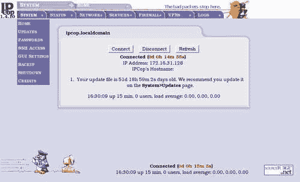

仅仅使用网站作为**图形用户界面**（**GUI**）是不够的。界面仍然必须设置得易于理解和访问所有常见功能。我们将要查看的大多数功能将包括填写简单的表单，这是一种有效且易于管理的界面。IPCop 在使用这样的界面方面并不独特。许多设备，如 Linksys、DrayTek 和 D-Link 制造的 SOHO 电缆路由器，以及从思科设备到 HP Procurve 交换机等许多高端产品都有类似的设置，但很少有这些产品包含 IPCop 提供的所有功能和易用性。

## 网络接口

IPCop 提供最多四个网络接口，每个接口通常连接到一个单独的网络。对于大多数 IPCop 部署来说，这是足够的数量，因为在中小型网络中很少有许多网络汇聚在一个点上，但是 IPCop 可以通过使用虚拟专用网络（VPN）连接到更多的网络。可用的四个网络被赋予标识颜色以便于管理。

## 绿色网络接口

IPCop 部署的绿色网络段代表*内部*网络，并且是隐式信任的。IPCop 防火墙将自动允许所有从绿色段*到*所有其他段的连接。

绿色段始终是以太网网络接口卡（NIC），不支持在此容量上使用任何其他设备。本地网络可能只是一个插入绿色接口的小型集线器，也可能包括几十个交换机、到另一个站点的二层桥接器，甚至是路由器。

### 注意

**绿色接口上的寻址**

绿色网络应该使用私人地址范围（私人地址范围可以在 RFC1918 中找到）。虽然可能使用公共可寻址地址范围来设置这个，但默认的 IPCop 配置是使用 NAT 来仅暴露一个 IP 地址，因此，在绿色网络段使用公共地址范围将是没有意义的，因为 IPCop 会将其视为私人地址范围！使用 IPCop 作为路由防火墙（而不是执行 NAT 的防火墙，这是默认配置）需要更高级的配置，并且无法通过 GUI 完成。

通常，一个接近这种复杂性的网络会选择使用基于 IPCop、另一个免费软件包或商业软件包构建的一个或多个防火墙或路由器，但是有足够的网络知识和几个硬件平台，可以使用 IPCop 构建一个复杂、安全的网络拓扑。

## 红色网络接口

与绿色网络接口类似，红色网络接口始终存在。红色网络接口代表互联网或不受信任的网络段（在更大的拓扑结构中）。

IPCop 防火墙的主要目标是保护绿色、蓝色和橙色段以及它们上的网络主机免受红色段上的流量、用户和主机的影响。红色网络段通常有良好的防火墙，并不会向内部网络段开放大量端口（如果有的话）。默认为无。

### 注意

**红色接口上的寻址**

红色段几乎总是使用由您的互联网服务提供商分配的公共地址范围。互联网服务提供商使用私人地址范围来设置其内部网络的大部分，并在其网络和暴露在互联网上的骨干网之间执行 NAT 是可能的（但不太常见）。

GPRS 和 3G 网络通常会这样做，一些有线 ISP 也会这样做。如果有疑问，请咨询您的 ISP 或检查已连接到您的 ISP 的现有计算机或路由器。网站[www.dnsstuff.com](http://www.dnsstuff.com)可以用来**WHOIS**一个 IP 地址以检查注册情况，如果您不确定一个 IP 地址是*私有*还是*公共*，这是一个检查所有权的绝佳方式。

红色网络段是 IPCop 支持硬件的*唯一*网络段，除了以太网网络接口卡之外。红色网络段可以是静态分配的以太网网络接口，也可以是使用 DHCP 分配的，也可以是 USB ADSL 调制解调器，ISDN 卡，甚至是连接到公共交换电话网络的拨号模拟调制解调器。

IPCop 在这个接口上支持的其他硬件接口包括：

### USB 和 PCI ADSL 调制解调器

**DSL**是一种技术，允许宽带、高速互联网或网络信号通过现有的铜线路发送。这种形式的互联网供应非常受欢迎，特别是在传统上对像有线这样的服务的接受程度较低的国家，因为它不需要昂贵的挖掘和重新布线街道和建筑物以安装新的电缆或网络基础设施。DSL 的一个缺点是 DSL 信号的相对短的传输距离，需要靠近电话交换机，尽管随着技术的进步，这个限制正在增加。

IPCop 将允许使用 DSL 服务（包括**SDSL**和**ADSL**）的用户直接将某些品牌的调制解调器连接到 IPCop 防火墙。有三种主要的方法可以将 IPCop 防火墙连接到 DSL 线路。

第一个是通过以太网将 IPCop 主机连接到 ADSL 调制解调器。通常来说，这是最稳定的方式，但设置起来更加困难。许多基于 Conexant 芯片组的路由器都是完整的路由器，通常设计为在网络中充当 NAT 路由器。这些设备通常有一个以太网端口（插入交换机或集线器）或几个以太网端口（和一个小型内置交换机），并为网络中的客户端分配私有地址（通常在 10.0.0.0/8 范围内），充当防火墙。连接 IPCop 主机到这些路由器的后面而不更改默认配置是一个坏主意，因为这样做就相当于进行两次网络地址转换。

虽然 NAT 在执行一次时经常会破坏协议，但执行两次几乎是一种确保让您头痛的网络方式。除了由于在您和互联网之间基本上有两个网络而引起的路由问题之外，很难通过这些路由器实现诸如 BitTorrent、SIP、在线游戏或传入服务（如 SMTP 邮件）的端口转发，因为每个端口转发必须配置两次。因此，这些路由器必须被配置为*不*充当 NAT 网关，而是回退到像*正常*路由器一样的行为。如果没有多个 IP 地址，这是不可能的，这使得家庭用户或企业如果希望使用 IPCop 而没有来自 ISP 的固定 IP 地址池，陷入了困境！

因此，一些基于以太网的 ADSL 路由器具有一个称为**PPP 半桥**的功能。这个功能允许通过以太网（即您的 IPCop 防火墙）连接的设备获取来自 ISP 的*公共*IP 地址，并禁用路由器充当防火墙或 NAT 网关。在这种模式下，ADSL 路由器在认证期间获取到的 IP 地址，并通过 DHCP 分配给第一个请求 DHCP 地址的设备。这个功能应该在您的 ADSL 手册中有所说明。

配置 ADSL 的第二种方法是使用直接连接到 PC 或防火墙的 USB ADSL 调制解调器。虽然可能最简单（因为它需要最少的网络知识，没有复杂的布线或硬件安装），但这些调制解调器是最便宜、最不可靠的，并且在所有三种方法中性能最差。

配置 ADSL 的第三种方法是使用内部 ADSL 或 SDSL 卡，占据防火墙、PC 或服务器内的一个 PCI 插槽。这可能是配置 ADSL 最不常见的方法。

IPCop 在一定程度上支持所有三种：在可能的情况下，作者强烈建议使用以太网 ADSL 调制解调器，配置为使用静态地址集的路由器，或者（如果这不可能）使用 DHCP 本地或使用类似 PPP 半桥的解决方案。以下是 IPCop 支持的设备列表：

+   阿尔卡特 SpeedTouch 系列 USB ADSL 调制解调器

+   ECI USB ADSL 设备（包括 BT Voyager 调制解调器，Zoom 5510 ADSL 调制解调器和其他几十种类似设备）

+   BeWan USB/PCI ADSL 调制解调器（USB 调制解调器的 ST 系列和 PCI 调制解调器的 ST 系列）

+   Conexant USB 调制解调器（包括 Zoom 5510，DrayTek Vigor 318 和其他几种）

+   Conexant PCI 调制解调器

+   Amedyn ADSL 调制解调器（HCL 只列出了 Zyxel 630-11，Asus AAM6000UG USB）

+   3com 3CP4218 USB ADSL 调制解调器

### ISDN 调制解调器

**综合业务数字网**（**ISDN**）是一种（慢速）宽带互联网接入方式，早于 ADSL 或电缆连接。 ISDN 本质上是一种数字电路电话线。在广泛采用电缆、DSL 和卫星宽带之前，ISDN 经常被使用，并且在一些分支办公室、远程办公和没有 DSL、电缆或卫星可用性的地区仍然被使用。

IPCop 支持大量 ISDN 调制解调器（1.4.10 HCL 列出了 34 个）。完整列表可在 IPCop Wiki 网站上找到（[`www.ipcop.org/modules.php?op=modload&name=phpWiki&file=index&pagename=IPCopHCLv01`](http://www.ipcop.org/modules.php?op=modload&name=phpWiki&file=index&pagename=IPCopHCLv01)）。

### 模拟（POTS）调制解调器

IPCop 应该支持任何硬件模拟（拨号）调制解调器。硬件设备通常通过串行端口或作为 ISA 卡连接。

使用 PCI 接口的较新调制解调器通常是基于*软件*的。这意味着调制解调器的某一部分工作是由连接的计算机的 CPU 通过软件执行，而不是由调制解调器本身执行。

没有执行这项工作的设备驱动程序，这些调制解调器将无法工作，由于通常没有为 Linux 操作系统编写的这些设备的驱动程序，它们通常被视为在 Linux 中*损坏*。 USB 调制解调器也应该在 IPCop 中工作。

IPCop HCL 列出了一个与 IPCop 兼容的 PCI 调制解调器，即*PCI Smartlink 5634PCV*。

### 电缆和卫星互联网

一般来说，来自欧洲和美国的提供商的电缆互联网服务提供以太网调制解调器，这些调制解调器将在 IPCop 中*正常工作*，因为它们通过 DHCP 提供公共的可路由 IP 地址。然而，一些电缆提供商提供的 USB 调制解调器不太可能在 IPCop 中工作。卫星互联网也是如此（USB 调制解调器不太可能在 IPCop 中工作）。

## 橙色网络接口

*可选*的橙色网络接口被设计为**DMZ**网络（有关 DMZ 防火墙的更多信息，请参见[`www.firewall.cx/dmz.php`](http://www.firewall.cx/dmz.php)）。在军事术语中，DMZ（非军事区）是不允许进行军事活动的地区，例如两个不同（和敌对）国家之间的边界。因此，在防火墙术语中，术语*DMZ*具有类似的含义，作为组织内部网络和互联网等外部网络之间的网络段。在这个段中，服务器受到防火墙保护，但与内部客户端隔离（因为它们有互联网暴露），后者位于更受保护的前线之后。

组织通常会将任何面向外部世界的服务放入这个不受信任但隔离的网络，比如网页服务器（为网站请求提供服务的外部客户端）或者更常见的邮件服务器（外部服务器连接以通过 SMTP 传递邮件）。

### 注意

**橙色接口的寻址**

橙色网络接口通常使用私有地址范围，因为 IPCop 执行 NAT。与绿色区域一样，*路由*而不是*NAT*的防火墙需要高级配置。

因此，DMZ 被认为是一个不受信任的网络段，仅次于红色网络接口。橙色网络段上的主机*不能*连接到绿色或蓝色网络段，所有从橙色网络段到这些内部网络段的流量必须通过**DMZ pinholes**显式允许。从红色网络段到橙色网络段的流量可以通过端口转发允许。

然而，橙色网络上的客户端*不应该*将 IPCop 防火墙作为 DNS 或 DHCP 服务器。这有其合理的安全原因——除了更难配置之外，为这个网络段上的 IPCop 主机提供的服务的额外暴露，会增加 IPCop 主机受到来自橙色区域攻击的风险，降低为绿色区域的客户提供安全服务的能力。

## 蓝色网络接口

*可选*的蓝色网络接口是 IPCop 相对较新的一个功能，是在 1.4 版本系列中引入的。这个网络专门设计用于一个独立的无线段。蓝色段上的主机除了通过类似于橙色网络的特定*pinholes*之外，无法访问绿色网络。

### 注意

**蓝色网络段的寻址**

蓝色网络几乎总是使用私有地址范围。

IPCop 还允许通过虚拟专用网络连接到绿色区域，使客户端完全访问这个网络段上的资源。

蓝色段不一定要是无线段，因为蓝色段只是另一个网络段，主机的无线连接对于 IPCop 是透明的，所以如果您在绿色区域的主机数量不够用，完全可以将蓝色段用作网络的另一个子网。

以这种方式使用蓝色区域也是分隔具有不同网络使用的主机的好方法，比如特定员工组使用的工作站子网，在公共区域或工厂车间。蓝色区域甚至可以用作网络的默认区域，管理员不希望网络上的主机自动访问网络上的每个资源，就像绿色区域一样。

在这样的拓扑结构中，IT 人员可能被分配到绿色区域以访问网络资源，而工作站可能被保留在蓝色区域，只能访问他们需要的网络区域。

## 简单的管理和监控

作为一个旨在易于使用的设备，如果用户每次新版本发布都需要重新安装，那对用户来说就没有太大用处。如果用户无需在任何时候登录到机器上的 Linux 控制台，那将非常有益。IPCop 的开发人员显然同意这一点，因此内置了一个简单的升级系统。这可以完全通过 Web 界面管理。然而，如果用户确实想要登录到 Linux 控制台并进行更改，可以通过连接到机器的键盘/显示器或者从本地网络（绿色接口）上的计算机使用 SSH 来简单地完成。出于安全考虑，SSH 默认情况下被禁用，必须在使用之前启用。

### 注意

**本地控制台**

在 PC 上运行 IPCop 防火墙等服务器通常会将键盘和显示器分离，因为它们很少被使用。尽管方便，但这可能会导致一些主板（和软件包）不喜欢热插拔键盘和鼠标（特别是 PS/2 连接器）。尽管显示器是热插拔的（因此您可以随意断开并重新连接显示器到 IPCop 系统），但我们建议您将 IPCop 系统连接到键盘或 KVM 开关。

将键盘分离的另一个副作用是，许多计算机的 BIOS 在启动时会*停止*并等待按键，如果它没有检测到连接的键盘。对于没有连接键盘的计算机，通常可以（而且确实应该）在 BIOS 配置中禁用此行为。

您还可以从同一界面备份和恢复配置，这确保了防火墙的所有常见管理任务都可以非常轻松地进行管理，更重要的是，无需了解 Linux 或 bash shell。 

通过 Web 界面提供的状态，我们可以准确地了解系统的运行情况。例如，我们可以看到防火墙上当前正在运行的服务、内存和磁盘使用情况，以及流量图，如果我们对此感兴趣的话。

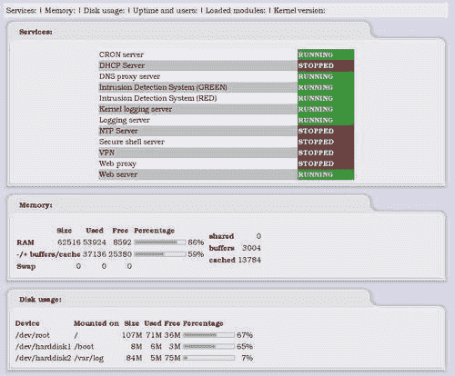

再次，这些功能展示了基于 Web 的界面的强大之处，以及为什么选择了这种特定的界面。我们还可以在不登录系统的情况下快速查看重要的系统信息，而无需使用交互式 shell。

还可以使用基于 Web 的日志查看器查看日志，这意味着您可以轻松地监视系统，而无需直接登录系统。IPCop 还具有将这些日志导出到远程 Syslog 服务器以简化管理和日志聚合的功能，特别是如果您有几台设备需要监视的话。

## 调制解调器设置

许多家庭用户正在使用 ISDN 或 ADSL 调制解调器进行拨号（包括 USB/ADSL 调制解调器），因此 IPCop 支持它们非常重要。IPCop 支持各种常见的调制解调器，并且具有加载额外驱动程序以支持默认不支持的调制解调器的功能，这些调制解调器的配置选项相当灵活。防火墙很少支持这种方式的调制解调器和驱动程序；这是 IPCop 最独特的功能之一，也是它在 SOHO 网络中如此合适的原因之一。

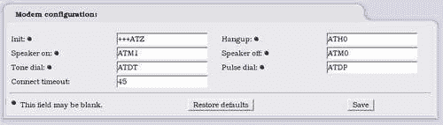

## 服务

IPCop 为小型网络提供了各种基本服务。严格来说，将这些服务提供在本应作为网络保护机制的设备上并不是防火墙的最佳实践，但在较小的网络中，经济因素起了作用，将所有基本网络服务由一台机器提供非常有用。

### Web 代理

IPCop 既可以用作代理，也可以用作防火墙。您可以轻松管理缓存并在绿色接口上配置代理。在这里，定义接口的好处变得非常明显，因为这意味着只需简单地点击复选框即可在 IPCop 上设置代理。

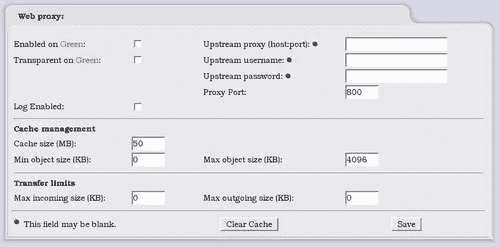

### DHCP

随着网络的增长，手动为客户端分配网络配置变得非常困难，能够自动化这一过程以及管理所使用的网络地址非常重要。IPCop 中的**动态主机配置协议**（**DHCP**）配置使您能够轻松为绿色接口上的客户端提供 DHCP 服务，如果您不确定如何做到这一点。通过 DHCP 进行这项操作简化了客户端的配置，这意味着大多数机器将自动连接到网络并自动获得互联网访问权限，而无需在主机上进行任何配置。

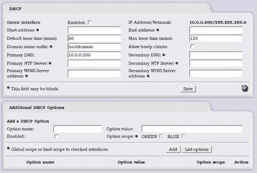

### 动态 DNS

一般来说，SOHO 用户的互联网连接将具有类似 31-34-43-10.some ISP.net 的**完全合格的域名**（**FQDN**）。互联网上计算机的 FQDN 可用于与其建立连接，因此，例如，对 Google 的连接会转到[www.google.com](http://www.google.com)。对于家庭用户，您的 FQDN 不是像**google.com**这样的域名，而是您的 ISP 用来识别您来自哪个 ISP 以及您在网络上是哪个客户端的域名，并且通常会使事情对人类更加可理解。

尽管这对于 ISP 管理其客户是有意义的，但对于远程连接到像这样提供互联网连接的网络却很困难。即使您可以记住并分配您的 ISP 分配的域名，如果您希望人们能够访问您托管的服务，这仍然不是一个解决方案，因为防火墙或路由器的 IP 地址，因此 FQDN 会不时更改。

因此，许多网络使用**动态 DNS**。使用动态 DNS 系统，运行在连接到互联网的防火墙或客户端上的小型软件将更新互联网上的服务器（动态 DNS 服务器）与您的 IP 地址，并将固定的主机名（例如 yourname.dynamicdnsprovider.com）重定向到当前的 IP 地址。如果您连接到 IPSec VPN，或者其他服务，如 HTTP，VNC 或终端服务，或者如果客户端使用这些协议远程连接到您，连接可以建立到这个动态 DNS 主机名，并且将无缝地转到与动态 DNS 服务器更新的 IP。

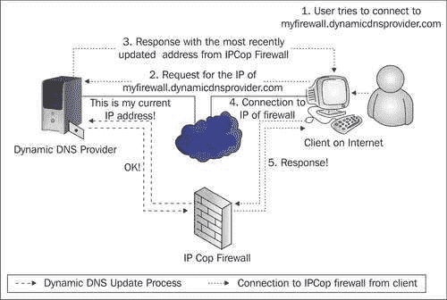

由于这些服务需要不断更新服务器以保持 DNS 工作的当前 IP 地址，因此使用动态 DNS 需要运行软件并不断与动态 DNS 提供商通信的计算机或其他设备。

动态 DNS 是一个在较大的防火墙产品中并不常见的功能，而且在大多数低端家用路由器中也并不常见。

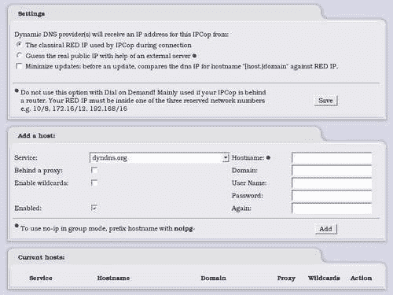

### 时间服务器

网络上的主机通常需要配置为保持相同的时间，无论是因为身份验证机制（如 Kerberos）还是仅仅为了方便。 IPCop 提供了**网络时间协议**（**NTP**）服务，可用于使网络上的所有客户端保持同步。

使用 NTP，IPCop 服务器连接到互联网上的 NTP 时间服务器，从中确定正确的时间。然后使用计算机的时钟在内部保持这个时间，并作为网络内的客户端的 NTP 服务器。通过定期从上游 NTP 服务器更新，IPCop 盒可以确保时间保持在合理的准确度范围内。

通过从本地源更新，而不是让每个本地客户端从外部时间源更新，您可以使客户端相互保持准确（因此即使时间不是严格准确，您也知道所有本地客户端保持大致相同的时间，这对于日志审计和 Kerberos 等重要）。最重要的是，它还减少了 NTP 服务器的负载，这些服务器为您提供免费服务！

有关如何配置客户端操作系统与 NTP 服务器通信的信息可以在这里找到：

+   Windows：[`www.boulder.nist.gov/timefreq/service/pdf/win2000xp.pdf`](http://www.boulder.nist.gov/timefreq/service/pdf/win2000xp.pdf)

+   Linux：[`Linuxreviews.org/howtos/ntp/`](http://Linuxreviews.org/howtos/ntp/)

+   OS X：选择**系统偏好设置**，然后**使用网络时间**

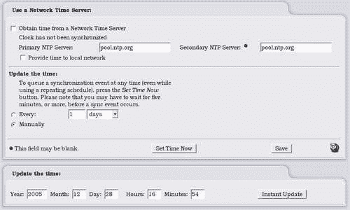

### 高级网络服务

流量整形和入侵检测是相当先进的网络服务，我们不太希望在大多数 SOHO 设备中看到。IPCop 不仅提供了这些功能，而且使它们非常易于管理，当我们开始配置 IPCop 时，我们将看到这些相当复杂的系统如何被轻松维护。

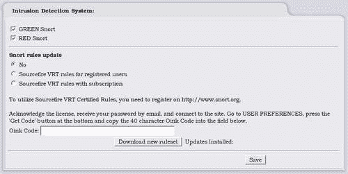

### 端口转发

这是一个在从 SOHO 到大型企业的防火墙中非常常见的功能。IPCop 的好处有两个。首先，我们没有任何限制可以添加的转发数量，其次设置非常容易。对于一些 SOHO 设备，我们不仅在可以转发的端口数量上有限制，而且通常还会发现围绕它的非常复杂的配置。企业系统本质上是复杂的，在这个特定功能中，复杂性被加剧。

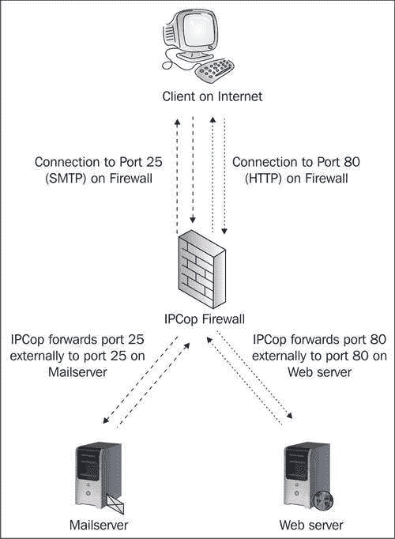

正如我们所看到的，IPCop 防火墙对客户端来说既是邮件服务器，又是 Web 服务器，但在这个示例配置中，端口 25 和 80 的连接实际上被转发到端口转发菜单中配置的服务器。在 IPCop 配置中，这些服务器可能位于橙色区域。

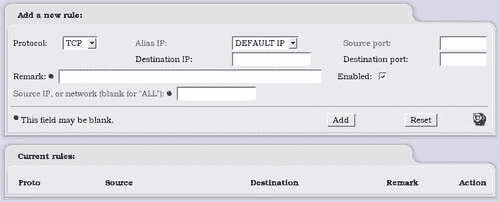

# 虚拟私人网络

这使您能够通过（虚拟）私人链接加入更多的互联网网络。这是 IPCop 的主要功能之一，这意味着它不仅可以用于 SOHO 网络，还可以用于中型企业。IPCop VPN 实现的细节将在后面的章节中进行彻底讨论。

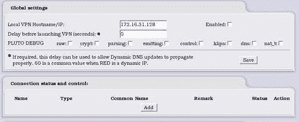

## ProPolice 堆栈保护

IPCop 已经构建为使用 ProPolice，这是一种机制，用于保护防火墙上运行的服务免受通过互联网进行攻击。ProPolice 提供的堆栈保护是一种相当有效的机制，可以防止网络服务中常见的一种特定类型的漏洞。

# 为什么选择 IPCop？

在评估 IPCop 在我们环境中的使用时，我们应该看一下它提供的功能，这可以从我们刚刚看到的功能列表中看出。然后，我们需要确定它是否将是我们网络的最有效解决方案。通常对于中小型网络来说，IPCop 非常有益，并且可以极大地简化网络管理。然而，对于非常大型的网络，我们可能会发现 IPCop 不够。重要的是要弄清楚我们的网络将如何组合在一起，然后选择 IPCop，如果有它可以适应的角色。对于 SOHO 网络来说，这可能是一个非常简单的拓扑结构，可能需要很少的思考。在较大的网络中，IPCop 可能在基础设施内的特定角色中有部署的空间，例如作为关键远程网络的网关设备，如分支办公室。

# 总结

在本章中，我们看了一下 IPCop 中可用的功能集。我们对 IPCop 究竟能做什么有了一个概念，并且结合上一章的知识，我们知道它作为防火墙的表现如何。我们现在也对 IPCop 可能有用的情况有了一个概念，以及我们需要理解什么才能使用它。如果我们对任何主题都是新手，一些截图可能看起来有点复杂。当我们逐步了解这些功能时，一切都会被解释清楚，以便我们充分理解每个选项，并知道我们是否需要配置特定区域以及我们希望如何设置它。对于那些对技术更熟悉的人来说，这可能已经为他们提供了 IPCop 中一些功能如何工作的概述。
