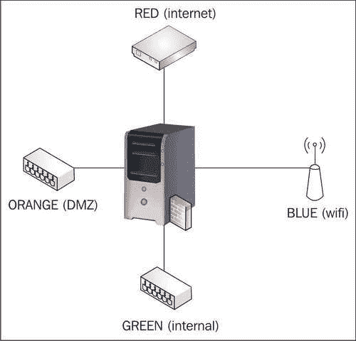
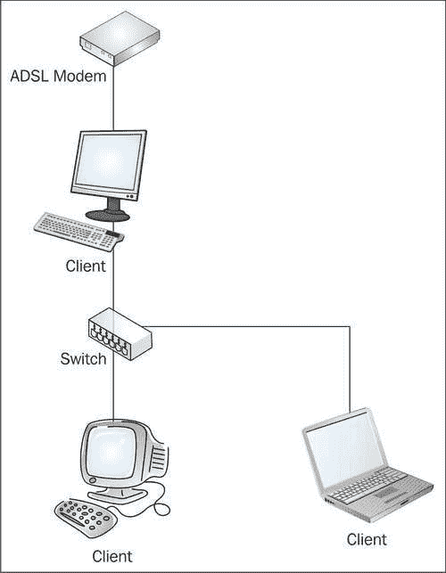
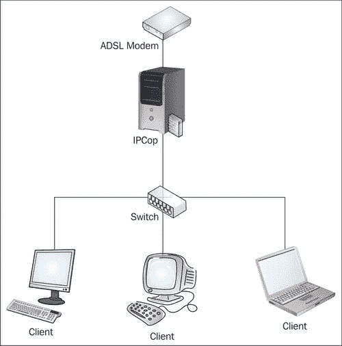
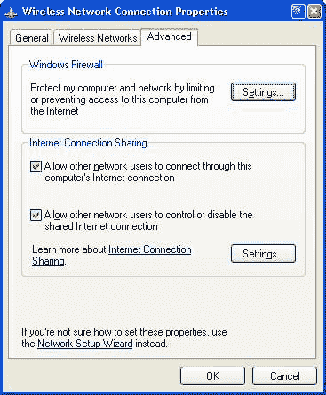
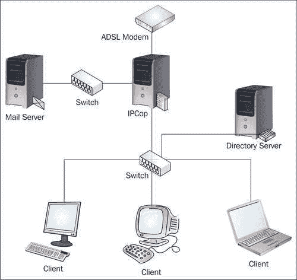
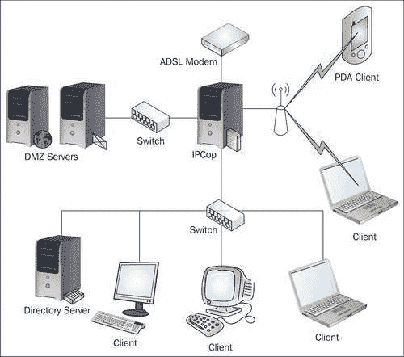

# 第三章。部署 IPCop 和设计网络

现在我们了解了 IPCop 作为一个与任何其他系统不连接的防火墙的功能，我们需要开始考虑它如何连接到它们，以及对我们有什么影响。正如你现在可能意识到的那样，部署 IPCop 的范围是相当广泛的，特别是与 Linux 的知识和开源软件的灵活性结合在一起，即使是一个 IPCop 盒子的可能排列方式也是相当无限的！也就是说，大多数网络使用的功能核心，在所有这些排列中，有一些核心网络布局可能在大多数 IPCop 部署中是常见的。

因此，我们在这里要做的是概述部署 IPCop 的几种常见方法以及这些拓扑结构背后的动机，这取决于我们想要部署哪些 IPCop 组件。

# 接口之间的信任关系

正如我们现在了解的那样，IPCop 支持的四种网络接口——绿色、红色、蓝色和橙色——它们之间有不同级别的信任。这里有一个简单的表格，概述了允许从哪个接口到哪个接口的流量。这个表格和其中包含的知识应该成为我们规划的基础，当考虑使用多少个接口以及用途时。这基本上是 IPCop 管理指南中的流量流动图表。

| 从接口 | 到接口 | 状态 | 如何访问 |
| --- | --- | --- | --- |
| 红色红色红色红色 | 防火墙橙蓝绿 | 关闭关闭关闭关闭 | 外部访问端口转发/ VPN 端口转发/ VPN 端口转发/ VPN |
| 橙色橙色橙色橙色 | 防火墙红蓝绿 | 关闭打开关闭关闭 |   |   | DMZ 针孔 DMZ 针孔 |
| 蓝蓝蓝蓝 | 防火墙红橙绿 | 关闭关闭关闭关闭 | 蓝色访问蓝色访问蓝色访问 DMZ 针孔/ VPN |   |   |
| 绿绿绿绿 | 防火墙红橙蓝 | 打开打开打开打开 |   |   |   |

在可视化流量通过 IPCop 防火墙的方式时，我们可以将其看作是一个巨大的十字路口，中间有一个交通警察（字面上就是 IP Cop——因此得名！）。当一辆车（在网络术语中，一包数据）到达十字路口时，警察根据 IPCop 使用的路由表决定数据包应该朝哪个方向前进，并将其推向适当的方向。

在绿色客户端访问互联网的情况下，我们可以从前面的表格中看到这种访问是打开的，所以警察允许流量通过。然而，在其他情况下，情况可能并非如此。例如，如果蓝色客户端尝试访问绿色段上的客户端，警察可能会允许流量通过，如果它通过 VPN 或通过 DMZ 针孔——但如果蓝色段上的客户端没有这些东西明确允许流量通过，它就会被阻止。汽车被拦下，车上的人成了虚拟牢房的受害者！

请注意，当我们说明 IPCop 配置时，红色接口位于最上方（北），橙色接口位于左侧（西），蓝色接口位于右侧（东），绿色接口位于底部（南）。有了这四个接口，它看起来像这样：

# 改变 IPCop 功能

与 IPCop 防火墙的许多行为方面一样，可以改变防火墙规则的行为，以定制 IPCop 以满足默认规则无法满足的拓扑结构。在防火墙规则的上下文中，自 1.4 系列发布以来，IPCop 就有一个文件允许用户专门添加自己的防火墙规则(`/etc/rc.d/rc.firewall.local`)。自 1.3 版本以来，已经有了 iptables 链，*CUSTOMINPUT, CUSTOMFORWARD,*等，允许手动添加 iptables 规则。

具体使用 iptables 超出了我们的范围，但我们建议感兴趣的读者阅读：

Linux iptables HOWTO 网址：[`www.linuxguruz.com/iptables/howto/`](http://www.linuxguruz.com/iptables/howto/)

# 拓扑结构一：NAT 防火墙

我们的第一个拓扑结构是许多市场上存在的 NAT 防火墙的即插即用替代品。在小型办公室和家庭中，诸如 D-Link、Linksys 等公司销售的嵌入式 NAT 防火墙经常被部署，以提供小型网络经济有效的互联网访问。诸如**Internet Connection Sharing**（有关 Microsoft 的 Internet Connection Sharing 的更多信息，请参见[`www.microsoft.com/windowsxp/ using/networking/learnmore/default.mspx`](http://www.microsoft.com/windowsxp/)），这是自 Windows 98 以来内置在客户端版本的 Windows 中的一种组合 NAT 防火墙、DNS 代理和 DHCP 服务器，也经常被用于允许一个带调制解调器或网络接口的 PC 充当其他客户端的网络网关。在这里，我们将考虑**ICS**，因为这样的拓扑结构与 ICS 实际上是替换以前提到的 Linksys 或 NETGEAR 型号路由器所需工作的超集。我们从这些路由器之一迁移到 IPCop 的过程将是相同的，只是需要在客户端上停用 ICS 软件——如果我们移除路由器，这是不必要的，路由器可以保持配置不变（和/或作为备份，或在其他地方重复使用）（有关在不同 Windows 版本上实施（因此，停用）ICS 的更多信息，请参见[`www.annoyances.org/exec/show/ics`](http://www.annoyances.org/exec/show/ics)）。

这样的拓扑结构与 ICS 可能看起来像这样：

这样的解决方案虽然便宜和方便，但通常不具备可扩展性或可靠性，并且安全性较差。它们使工作站面临不必要的安全风险，提供有限的吞吐量，并且经常不可靠，需要频繁重启和死机。

与软件防火墙一样，网络防火墙被设计为工作站和互联网之间的屏障。通过将其中一个工作站直接连接到互联网，并使用 ICS 等解决方案，虽然可以减少共享互联网连接所需的资源，但也会使该工作站面临不必要的风险。此外，该计算机还需要一直开机运行——与没有不必要组件和低功率电源运行 IPCop 的低端 PC 相比，这可能会更吵，而且功耗更大。

在这种情况下，IPCop 提供了一种经济有效的替代方案，为小型企业和家庭用户提供了强大的防火墙，而无需过于复杂，并添加了嵌入式解决方案或 ICS 中不存在的其他功能，如可定制的 DHCP 服务器、入侵检测、代理服务器等。

在这种情况下，使用 IPCop 作为替代，替代网络可能看起来像这样：

这样的拓扑结构确保了在数据传输到客户端之前进行防火墙处理，使用专门设计为网络防火墙的软件包，极大地提高了客户端的服务质量以及他们的网络提供的安全性。在这种情况下，IPCop 使用的组件将是：

+   绿色/红色区域

+   DHCP 服务器

+   DNS 服务器

在这种情况下，网络管理员或顾问还可以选择启用以下任何一项功能，以增强为网络提供的服务：

+   入侵检测

+   IPSec 以允许远程工作或远程支持

+   端口转发以允许远程访问 VNC 或终端服务/远程桌面，用于远程支持的简化模型（比 IPSec 更方便，尽管固有地更不安全）

在这种情况下，停用 ICS 非常简单——我们只需禁用 ICS 功能，如下图所示（从外部、面向互联网的 ICS 网络接口的网络连接属性中获取）。

删除 ICS 就像取消选择**允许其他网络用户通过此计算机的互联网连接进行连接**选项一样简单。完成后，我们应该点击**确定**，如果有要求，重新启动，然后我们可以自由地禁用和/或删除工作站上的外部接口（如果我们希望在机器上留下第二张网络卡或者它有两张内置卡，或者如果我们使用外部调制解调器或其他打算从我们的 IPCop 主机中删除或安装的硬件）。

### 注意

**IPCop 的入侵检测系统**

入侵检测功能是 IPCop 的一个强大组件，易于启用和使用。尽管对 IPCop 的 IDS 生成的日志文件进行精确分析需要相当的技能和经验，但它很容易打开，除非 IPCop 防火墙有特定的空间要求（即在运行设备上有一个非常小的硬盘或紧凑闪存卡，或者 CPU/内存不足以进行分析），否则没有理由不启用 IDS 系统。

对于这种拓扑结构，防火墙规则很简单；因为绿色段自动被允许访问红色接口上的资源，所以不需要特定于拓扑结构的设置来设置这个。

在这样一个小办公室环境中部署 IPCop 的另一个重要好处是，如果业务需要增长，它所拥有的解决方案是可扩展的。这样一个运行着一些 Windows 工作站的工作组的企业可能会决定工作组不足以满足其需求，需要集中管理、文件存储和配置。

即使在这样的预升级场景中，IPCop 也是有利的，因为它提供了内置的开放升级路径。从简单的 NAT 和 DHCP 转移到具有多个网络段、端口转发和代理服务器的网络不需要硬件或软件升级。如果服务器已经有几张网络卡（而且现在这些价格很便宜，如果预期会扩展的话，没有理由不这样做），甚至可以在几乎没有或没有明显中断现有客户服务的情况下完成。

# 拓扑结构二：带有 DMZ 的 NAT 防火墙

在一个不断发展的小公司办公室环境中，对于传入电子邮件的需求可能会迫使激活橙色区域，并在该区段部署和安装邮件服务器。

这样的公司可能会选择将其桌面和内部服务器基础设施放在绿色网络段内，并将其服务器放在 DMZ 上的交换机/集线器上，或者简单地使用交叉线缆连接到 IPCop 主机的橙色接口。由于这些系统暴露在互联网上，这种分段提供了一个重要的优势，使得入侵者更难以扩大对网络的访问。

### 注意

**DMZ 和外部网络段基础设施**

尽管使用交叉电缆将 DMZ 服务器或外部路由器连接到防火墙（或另一个路由器）通常非常方便，但使用集线器或交换机通常会产生回报——不可避免的是，当您实际上可能需要在这些系统相关的连接问题上进行故障排除时，您可能需要交换机或集线器，而在这种情况下，您可能无法及时找到并安装交换机/集线器，或者可能不想中断仍然存在的任何连接。

使用集线器和交换机也可以为未来的扩展计划，并且使您可以更轻松地添加另一个系统。带有半打端口的小型交换机也不贵！

微软的 Exchange 邮件服务器在相当长的一段时间内通过使用“前端”和“后端”交换角色来支持这样的配置（尽管这些角色将在未来的 Exchange 版本中被弃用）。然而，通过不同的网络配置，例如使用 Novell 的 eDirectory 或 RedHat 的 Directory Server（RHDS）等管理系统的 Linux 客户端，或者过滤设备，一个类似的系统与外部面向 SMTP 服务器（也许运行开源 MTA exim）同样有益。

在这种拓扑结构中，客户端可以自由连接到邮件服务器（无论是通过 POP、IMAP、RPC 还是 RPC over HTTP）。为了使作为网络域的一部分存在的邮件服务器能够对目录服务器进行身份验证，我们还需要使用 DMZ Pinholes 功能打开适当的端口（取决于目录提供者）到目录服务器。

### 注意

防火墙活动目录域控制器

有关活动目录需要复制的特定端口的信息（即在域控制器之间，如果邮件主机和目录服务器是域控制器）可在[`www.microsoft.com/technet/prodtechnol/windows2000serv/technologies/activedirectory/deploy/confeat/adrepfir.mspx`](http://www.microsoft.com/technet/prodtechnol/windows2000serv/technologies/activedirectory/deploy/confeat/adrepfir.mspx)找到

尽管在这种情况下，将邮件主机的妥协意味着域控制器的妥协，DMZ 的安全性好处将受到限制，但仍然会有一些安全性好处——在互联网面向角色中运行域控制器是不推荐的！

客户端或服务器与域控制器通信所需的端口可以在以下文章中找到，该文章详细介绍了在 Windows 2003 系统上配置 Windows 防火墙所需的端口：

[`support.microsoft.com/default.aspx?scid=kb;en-us;555381&sd=rss&spid=3198`](http://support.microsoft.com/default.aspx?scid=kb;en-us;555381&sd=rss&spid=3198)

我们还设置了一个端口转发规则，从 IPCop 防火墙的外部 IP 地址到邮件服务器的 25 号端口。这允许外部邮件服务器连接到邮件服务器以传递电子邮件。

在这种拓扑结构中，邮件服务器的妥协（在绿色段可能会妥协整个网络段）是受控的，因为防火墙提供了一定程度的保护。

在这种拓扑结构中，我们使用 IPCop 防火墙的以下功能：

+   红色、橙色、绿色区域

+   DMZ Pinholes

+   DHCP 服务器

+   DNS 服务器

+   端口转发到橙色段

我们还可以选择使用以下功能中的任何一个：

+   入侵检测系统

+   端口转发到邮件服务器上的 Web 服务器（通过 Horde、SquirrelMail 或 Outlook Web Access 等 Web 邮件解决方案进行 IMAP 或 Exchange 邮箱的外部访问）

+   代理服务器（用于桌面互联网访问）

+   用于远程访问绿色和橙色段的服务器或外部支持的 IPSec

+   后端邮件服务器在绿色区域中，使用橙色区域中的服务器作为中继，执行反垃圾邮件和反病毒扫描/过滤

# 拓扑结构三：带有 DMZ 和无线的 NAT 防火墙

在一个更大的组织中，或者如果上面的网络增长了，我们可能会选择使用一个或多个 IPCop 防火墙来扩展我们的网络拓扑结构。非常大的网络超出了本书的范围，因为它们需要网络/IT 专业人员从多个来源获取的知识和经验。

### 注意

**IPCop 邮件列表**

IPCop 用户邮件列表是有关扩展 IPCop 并在更高级角色中部署它的非常好的信息来源。对于那些对 IPCop 有更多兴趣的人来说，订阅并浏览这个邮件列表是值得的。这个邮件列表的存档可以在[`sourceforge.net/mailarchive/forum.php?forum_id=4957`](http://https://sourceforge.net/mailarchive/forum.php?forum_id=4957)找到，并且有一个订阅页面在[`lists.sourceforge.net/lists/listinfo/ipcop-user`](http://lists.sourceforge.net/lists/listinfo/ipcop-user)。

一个人可能会使用多个 IPCop 防火墙，以便分隔多个站点，或者进一步将一个或多个 DMZ 与物理上不同的防火墙分隔开。

值得考虑的是，IPCop 主要是为中小型企业和家庭/家庭办公市场设计的网络防火墙。虽然可以在更大的部署中设置 IPCop，但这相当罕见，而且有其他软件包可能更适合这样的部署。在这种情况下，IPCop 的网络分割的限制开始变得更加繁重，而不是方便，而且为了满足组织的需求，需要的工作量可能超过手动设置另一个防火墙软件包以适应相同拓扑结构的工作量。

在这个例子中，我们将考虑一个 IPCop 盒子可以部署的最广泛的范围，使用所有四个网络接口来保护一个具有内部（绿色）网络、互联网或广域网连接（红色）、包含多个服务器的 DMZ（橙色）和一个带有 IPSec VPN 系统的无线段的网络。

在这种情况下，我们几乎肯定会选择部署 IPCop 包含的所有高端功能，例如代理服务器和入侵检测系统。

在这种情况下，我们为各个网络接口提供的服务如下：

在红色接口上，除了默认的防火墙策略外，我们还调用了端口转发功能，以允许在 DMZ 上的邮件服务器上的 25 号端口和邮件服务器上的 443 号端口（HTTPS）的连接，以允许对业务网络邮件系统的连接。我们还允许对 IPCop 防火墙的传入 IPSec 连接，以允许远程访问远程工作的员工，并为 IT 人员和第三方软件和硬件供应商提供远程连接以支持目的。

在蓝色接口上，我们通过 IPSec VPN 为客户提供连接，以便他们可以访问在绿色段和 DMZ 段内运行的服务器提供的服务。供应商和访客可以通过在无线接入点上配置的预共享密钥模式的 WPA 来访问绿色段。

### 注意

**WPA 和 WEP**

WPA 旨在引入更先进的无线标准的一些特性，以完全取代 WEP，但在该标准准备就绪之前。WEP 系统用于保护 802.11 无线局域网的不安全性已经有充分的文献记录，WPA 最显著地采用 TKIP 协议（以及其他更改）来不断更改用于加密通过空中传输的数据的加密密钥。使用 TKIP，而不是一个不断使用的密钥，大大减轻了加密被破解的严重性（实际上，它只在短时间内被破解），尽管这意味着用于生成这些加密密钥的预共享密钥必须强大且严加保护。

WPA-RADIUS 或 WPA-Enterprise 采用 RADIUS 服务器。RADIUS 通常用于对交换机或系统进行用户认证，以提供互联网服务，允许接入点强制客户计算机使用用户名和密码或加密证书对 RADIUS 服务器进行认证，然后才允许它们完全与无线接入点关联。以这种方式利用 RADIUS 服务器比 WPA-PSK 更安全得多，因为消除了预共享密钥的不安全性（每个客户端都有自己的证书或用户名/密码，并且可以单独锁定或分发），并且因为为每个客户端创建了一个唯一的加密隧道，使得无线网络更像交换机而不是集线器（通过加密）。

WPA2，消除了 WPA 和 TKIP 的一些加密弱点，更加强大，并且使用 AES 加密标准来实现最大的数据安全。

Microsoft TechNet 在其 RADIUS 服务器（IAS，Internet Authentication Service）上有关于实施 WPA-RADIUS 的优秀指南，可在线通过以下网址获取：使用证书服务保护无线局域网：[`www.microsoft.com/technet/security/prodtech/windowsserver2003/pkiwire/swlan.mspx?mfr=true`](http://www.microsoft.com/technet/security/prodtech/windowsserver2003/pkiwire/swlan.mspx?mfr=true)

使用 PEAP 和密码保护无线局域网：[`www.microsoft.com/technet/security/topics/cryptographyetc/peap_0.mspx`](http://www.microsoft.com/technet/security/topics/cryptographyetc/peap_0.mspx)

仅使用接入点的 WPA-PSK 可以防止未经授权的用户访问无线段和互联网，并且对于大多数中小型网络来说是一个足够的解决方案；使用支持 WPA2-PSK 的新型接入点可以增加这种安全性，对于没有接入点或实施 RADIUS 或证书服务的网络基础设施的用户来说更加安全。

防火墙策略和 IPSec 系统确保访客/供应商只能访问红色区域（互联网），而不能访问网络上的任何资源。

在橙色接口上，我们的针孔允许 DMZ 服务器连接到绿色区段中的目录服务器和 Kerberos 域控制器，以便通过公司目录系统登录到它们的用户进行身份验证。这确保了这些服务器的策略和配置是集中管理的，并且为它们存储了中央日志，但是外部服务的妥协可能造成的损害大大减少，确保了业务安全和合规性。

在绿色接口上，我们允许连接到所有接口，因为绿色区段内的工作站和服务器是受管理的服务工作站，用户没有足够的访问级别来对其访问的资源造成损害。

在这种情况下，我们正在使用以下 IPCop 功能：

+   红色，橙色，绿色，蓝色区域

+   DMZ 针孔

+   DHCP 服务器

+   DNS 服务器

+   端口转发到橙色区段

+   IPSec 用于远程访问绿色、橙色、蓝色区段

+   IPSec 用于蓝色用户访问内部资源

+   入侵检测系统

+   端口转发到外部的邮件服务器上的 Web 服务器

+   代理服务器（用于桌面互联网访问）

在一个较大的组织中，我们还可以选择使用 IPSec 的站点到站点模式，以将这个办公室与一个或多个分支或总部连接起来。在这个角色中，就像在单个网络防火墙的角色中一样，IPCop 表现出色。

# 规划站点到站点 VPN 拓扑

除了*本地*服务，比如我们之前在 IPCop 部署中所示的服务，我们还可以使用 IPCop 中的 IPSec 软件来配置与分支或总部、商业伙伴、支持公司或第二站点的“站点到站点”VPN。在这种情况下，拓扑规划可能变得重要，因为网络规模增长。

如果我们有多个站点，考虑如何配置 VPN 隧道以提供服务和稳定性对我们的客户非常重要。例如，在两个附属办公室连接到一个主办公室，并且彼此包含文件服务器同步内容的情况下，从附属办公室到主办公室设置两个 VPN 隧道在“辐射”拓扑中几乎没有意义。在文件传输过程中，额外的跳数会减慢主站点的互联网连接速度，并导致传输速度变慢。

相反，如果我们有许多较小的办公室，对站点间流量的要求很少，而总部有一个大型的互联网连接，我们可能会决定通过一个单一的地点汇聚所有网络活动的增加控制对我们而言是值得的。随着网络规模的增加，从站点到站点形成个别 VPN 隧道在“网状”配置中可能变得非常复杂和难以管理——尽管作为 IPCop 的部署不太可能，但超过十几个服务器的这样的部署将越来越难以灵活地管理，除非考虑使用路由协议（如 RIP 或 OSPF）来计算我们的路由表！

在考虑 VPN 设计时，花一点时间来确定你的冗余和速度目标（例如，设置从远程办公室到彼此的 VPN 是否值得冗余，以防主站点出现故障）。在纸上计算一下，考虑一下哪些流量将通过你的 VPN，然后选择最适合你的、可扩展的最佳设计。

# 总结

在本章中，我们提供了 IPCop 可能被部署的三种情景的高层概述，以及在这些情况下使用 IPCop 的好处和缺点的分析。

这三种拓扑将在本书中进一步用作维护和部署的案例研究。

拓扑一：双主机防火墙执行网络地址转换，为少数客户端提供服务。这是一个很好的替代方案，可以取代小型 SOHO 路由器或微软的互联网连接防火墙。它比其他类似情况的解决方案更安全、更可靠、更可扩展。

这种拓扑使用了 IPCop 的 NAT 功能，并可以使用端口转发来访问外部服务，入侵检测系统用于增加网络安全性。

拓扑二：一个带有用于外部服务的单独段的 DMZ 防火墙，比如传入邮件。通常由一个小型或中型企业使用，他们已经超出了单子网网络，这是一个常见的过渡阶段，从嵌入式设备的小型网络到具有商业或中高端防火墙的大型网络。

这种拓扑使用了 IPCop 的 NAT 功能，以及 DMZ 的针孔，以允许 DMZ 段中的服务器访问资源并对绿色区域中的服务器进行身份验证。入侵检测系统可以用于增加安全性，端口转发用于允许外部（红色区域）访问 DMZ 中主机上运行的服务。

拓扑结构三：一个带有独立段的 DMZ 防火墙，用于外部服务，如传入邮件和无线访问。这通常由一个已经超出单子网网络的中小型企业使用。这类似于第二个拓扑结构，但增加了第三个内部段，即蓝区，用于不太受信任的无线客户端。

这可能是拓扑结构二的常见扩展，或者是对具有两个工作站段的较大网络进行分割的一种方式。

该拓扑结构使用了 IPCop 的 NAT 功能，以及 DMZ 针孔，以允许 DMZ 段中的服务器访问资源并对绿区中的服务器进行身份验证。入侵检测系统可用于增加安全性，并且端口转发用于允许外部（红区）访问 DMZ 中主机上运行的服务。IPSec 服务器用于允许蓝区中的主机访问绿区和橙区的资源。

该拓扑结构也可以用于对网络进行分割或提供更好的安全性，而无需使用无线技术。
