# 第四章：安装 IPCop

现在我们已经介绍了一些基本的网络和防火墙原则，并且了解了 IPCop 允许我们利用的功能，我们可以看看如何安装防火墙。IPCop 可以通过多种方式安装，但使用 CDROM（有时还有一个附带的软盘）是最简单和最常见的方法。因此，我们将详细介绍这种安装方法，并在后面的部分中讨论更高级安装的选项，比如通过网络安装和调试安装过程。

# 硬件要求

IPCop 的最低硬件要求非常低，设计用于常见的 PC 硬件。我们的主要问题通常不是“这台机器是否足够强大来运行 IPCop”，而更多是“这台机器是否足够强大来处理通过它的带宽”。

IPCop 的最低系统要求是：

+   基于**386**的**PC**或更高配置（这意味着您可以使用一台非常老的 PC 作为防火墙）

+   **32MB**的**RAM**

+   **200MB 硬盘**（或固态硬盘）

+   每个接口需要一个**网卡**（最多四个）。每张卡都有唯一的硬件或 MAC 地址，现在值得记下这些地址以便在以后识别这些卡。

+   如果红色接口不是以太网，则需要连接设备

# 其他硬件考虑

尽管由于 IPCop 的最低要求，很容易将其放在一台旧工作站或过时的 PC 上，但值得退一步考虑我们如何使用它。在家庭环境或非常小的办公室中，旧 PC 可能提供所需的可靠性水平，但如果互联网访问至关重要，特别是如果我们在 IPCop 中使用更复杂的功能，比如 VPN 或复杂的防火墙规则，这些功能更难复制，硬件故障可能是关键的，即使我们有备份。

因此，值得考虑稍微更可靠、更新的主机。还有基于防火墙所处环境的考虑。在家庭或小型办公环境中，防火墙可能不在服务器房或通讯柜中，旧电源供应器的噪音虽小，但可能令人讨厌。此类服务器的功耗也需要考虑——去除一些不必要的组件或将电源供应器降级为更新、更高效、更低功率的型号可能解决噪音和功耗问题。

也值得考虑硬件设置——我们的服务器的位置应该考虑到不会出现重布线的问题，也不会需要重新安置或被绊倒。正如我们之前提到的，我们还应该在 BIOS 中启用某些设置，比如禁用“错误时停止”功能（这样我们的服务器在键盘被移除或组件损坏时不会在提示处冻结，除非我们希望发生这种情况）。另一个常见的 BIOS 选项是“断电后恢复”选项——在断电事件中使我们的服务器自动重新开机。

# 安装程序

在开始安装 IPCop 之前，我们必须确保我们已经做好了充分的准备，并且拥有所有必要的设备。以下是一个简短的清单，以确保我们在开始之前已经准备好了一切；任何特定于 IPCop 的设备，比如 CD 和软盘介质，将在安装过程中详细说明。

+   我们是否有一台能够满足最低系统要求的机器？

+   我们的机器是否有足够的资源来处理我们预期的带宽使用？

+   我们是否拥有所有必需的网卡及其驱动程序，并且已经检查它们是否与 IPCop 兼容？

+   我们是否已经准备好了 IPCop 机器周围的所有必需设备？例如电缆、交换机和一个客户机来测试配置。

+   我们是否有可靠的互联网连接？

一旦我们确定了所有先决条件的硬件和连接可用，我们就可以开始安装。我们将不得不下载 IPCop 安装 ISO 并将其刻录到 CD。最新版本可以在 IPCop 的 SourceForge 项目页面上找到[`sourceforge.net/project/showfiles.php?group_id=40604`](http://sourceforge.net/project/showfiles.php?group_id=40604)。撰写时的最新版本是 1.4.10：[`prdownloads.sourceforge.net/ipcop/ipcop-install-1.4.10.i386.iso?download`](http://prdownloads.sourceforge.net/ipcop/ipcop-install-1.4.10.i386.iso?download)

在下载 ISO 并使用您选择的 CD 刻录软件将其刻录到 CD 后，我们可以开始安装。

### 注意

**使用软盘安装**

如果您的 IPCop 机器无法从 CD 启动，您可以在 CD 的`images`文件夹中找到一个软盘镜像，例如`boot-1.4.0.img`，可以使用 Linux 上的`dd`命令将其复制到软盘，或者使用 IPCop 光盘上提供的`rawwritewin.exe`。

现在我们可以将 IPCop 光盘插入 CD 驱动器，然后启动机器，然后应该会出现以下屏幕：

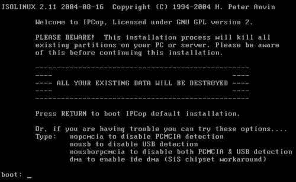

正如您所看到的，有一个非常显眼的消息，即安装 IPCop 将销毁系统上的所有数据。这意味着 IPCop 遇到的第一个磁盘将被擦除、重新分区和格式化，以便安装 IPCop 系统。为了保护我们的数据，非常重要的是要验证系统中只有一个磁盘，并确保其中没有任何有价值的东西。一旦我们确定了这一点，我们就可以开始安装，而不必担心数据丢失。

此时按下*enter*将会将我们引导到安装系统，但我们也可以向内核提供额外的参数。如果按下*enter*后系统无法正常启动，我们应该重新启动机器，并尝试上面的选项之一。如果我们的机器没有 PCMCIA（通常在笔记本电脑上找到）我们通常可以使用`nopcmcia`选项，USB 也是一样。许多 IPCop 系统运行在旧硬件上，USB 在这种情况下较少见。

按下*enter*后，我们将会看到语言选择屏幕。假设我们想要一个英文 IPCop 系统，我们可以选择默认选项，否则选择我们偏好的语言。您可以使用箭头键导航菜单项。然后我们将看到 IPCop 的欢迎消息，并附有指示，随时按取消键可以导致重新启动，以防我们改变主意。

## 安装介质

安装过程的下一个阶段，如下图所示，是安装介质的选择。

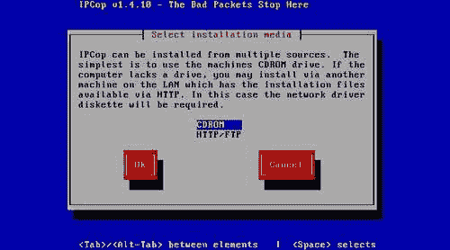

IPCop 可以通过 FTP 或 HTTP 安装到没有 CDROM 驱动器的机器上。在这种情况下，我们会从软盘启动机器，然后让主机从互联网上下载通常包含在 CDROM 上的内容。由于我们的机箱中有 CDROM，我们可以选择**CDROM**选项。然后会出现一个提示消息，上面写着**请在 CDROM 驱动器中插入 IPCop CDROM**。这并不意味着安装过程没有检测到 CD。在这一点之前，我们可以从 CD 或软盘启动，安装过程允许这样做，如果我们点击**确定**，安装应该会正常进行。

## 硬盘分区和格式化

然后我们将收到警告，系统即将对硬盘进行分区和格式化。

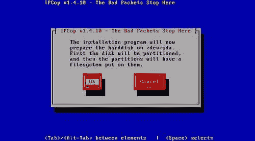

这是不可逆转的点，按下*Enter*会完全擦除磁盘，我们会丢失驱动器上的任何数据。如前所述，只要我们确保系统中只有一个驱动器，并且该驱动器是我们不介意擦除的，我们就可以继续。按下*Enter*将开始分区和格式化过程。如果我们有一个大磁盘，这可能需要一两分钟的时间。通常最好将较小的磁盘放入 IPCop，因为它不会占用大量空间，这取决于我们预计 IPCop 会有多少日志文件。但是，我们必须确保满足最低要求，大约为 200 MB，而超过 10 GB 左右的空间几乎不太可能被使用，除非您最终使用需要更多空间的附加组件-这些附加组件可能会提供磁盘空间要求。

## 从软盘备份恢复配置

在这个阶段，我们可以选择从软盘上恢复之前保存的配置，这是备份 IPCop 配置的理想方式。

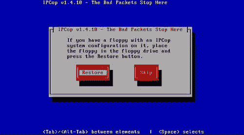

由于这是我们的第一个 IPCop 安装，我们可能没有软盘。但是，如果有的话，我们可以选择**恢复**，其余的系统配置将根据我们以前的安装选项自动运行。现在我们将选择**跳过**这一步，继续进行手动安装。

# 绿色界面配置

正如我们在前几章中讨论的那样，IPCop 对系统中安装的 NICs 有一个颜色方案。这是安装过程中我们第一次遇到这些的地方。

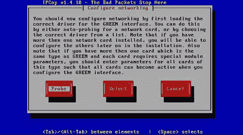

绿色接口对应于我们的本地网络，我们现在可以选择这个接口。最简单的方法是允许 IPCop**探测**网络卡，它完成得非常可靠。但是，如果我们确切地知道要使用哪种制造和型号的卡，我们可以选择手动**选择**它，然后会为我们提供一个已知卡的列表供我们选择。此屏幕还提到**特殊模块参数**，这些是我们可以在必要时传递给内核中的网络驱动程序的选项。一旦配置了这个阶段，我们就可以远程完成安装的其余部分，并且稍后会要求我们配置其他卡。

在这个阶段的一个小复杂之处在于，如果我们让 IPCop 探测网络卡，IPCop 发现的第一张卡将用作绿色网络接口。我们可能有选择特定接口的特定卡的原因：例如，我们可能有一张 10Mbit 和一张 100Mbit 的卡，并希望使用 10Mbit 卡进行互联网连接。在这种情况下，我们可以采用两种技术之一-要么自己选择我们想要作为绿色接口的特定卡的驱动程序，要么按顺序将卡放入机器，使绿色卡位于最低编号的 PCI 或 ISA 插槽。还要注意，IPCop 给卡的名称可能不是与使用的**芯片组**相关的卡的制造或型号的名称，例如，许多常见的卡将被识别为**Digital 21x4x Tulip PCI …**。

有时这可能需要一些工作，特别是两张相同的网络卡共享同一个盒子可能会导致对分配给哪个接口的网络卡感到困惑。一些卡，例如较旧的 3Com Etherlink 卡，在主机中有多张卡时可能会很难使用。在这些大多数情况下，特别问题的帮助可以通过 IPCop 社区找到。

## 完成了吗？

哇，这太容易了！看来我们已经完成了安装。 

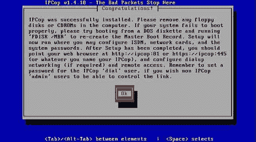

不要太过分; 这条消息意味着基本系统文件已经就位，我们最基本的配置已经完成。现在，我们必须根据我们的特定需求设置 IPCop，选择我们想要使用的接口类型以及我们的寻址系统将如何工作。在这里按*Enter*将带我们进入 IPCop 的配置。

## 区域设置

我们从键盘布局选项开始。

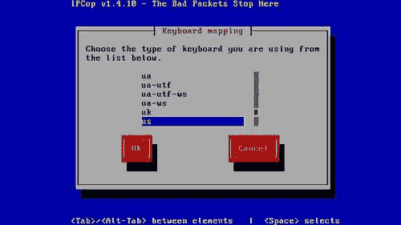

我们应该选择我们想要使用的键盘布局。对于标准美国键盘的用户，选择**us**，对于英国键盘的用户，选择**uk**。在这里选择错误的布局可能会使菜单导航和命令稍后有点困难，所以一定要选择正确的选项。如果您不确定，可以检查您的桌面系统是如何配置的。

我们还将被提示选择我们的**时区**，比如**GMT**或**EST**；再次小心选择正确的选项，并检查您的桌面系统如何配置。

## 主机名

现在我们必须给 IPCop 机器取一个名字。

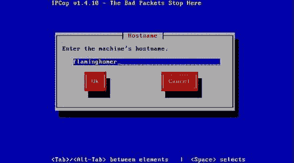

如果我们已经在网络上有一个命名方案，我们可以使用它；其他选项可能是**firewall**或**ipcop**的默认值。如果我们将 IPCop 盒用作 DNS 服务器，它将回复该名称的自己的 IP 地址，因此可以方便地寻址 IPCop 的 Web 前端。

## DNS 域名

IPCop 在我们的本地网络上的默认域名如下图所示：

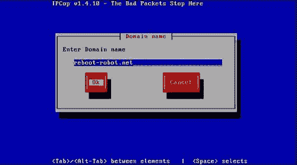

如果我们没有，我们可以使用默认值，尽管作为企业网络，我们可能已经在本地段上使用了一个域；我们应该在这里输入，小心不要重叠内部和外部 DNS。例如，如果我们在外部使用**reboot-robot.net**，那么在内部使用**lan.reboot-robot.net**可能是一个更好的主意，以允许内部客户端使用 DNS 引用内部和外部机器。错误配置这一点，或者使用不属于您的域名，可能导致该域在网络内部的客户端无法访问。例如，如果我们在这里放入**aol.com**，那么我们可能会难以访问 AOL 的网站和其他服务。

## ISDN 配置

如果我们有 ISDN 调制解调器，我们现在可以在这里配置它：

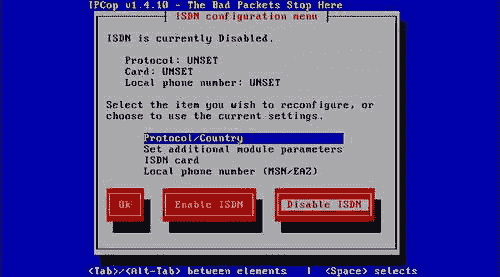

我们将需要参数，比如使用的协议和要使用的电话号码，所有这些都可以由 ISDN ISP 提供。如果您必须拨打 9 来获得外线，那么也应该包括在内，必要时可以通过插入逗号添加暂停。如果我们没有 ISDN，我们应该选择禁用它；然后我们可以设置其他连接方法，比如在后续步骤中设置 DSL。

## 网络配置

我们现在应该看到**网络配置菜单**。

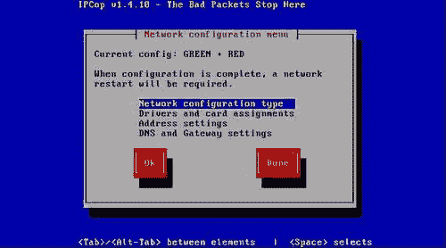

这是设置过程的一个重要部分，直接关系到我们在上一章中讨论的网络拓扑结构。

我们首先决定我们的**网络配置类型**。有许多选择，而在上一章中，我们概述了其中一些。在这个例子中，我们将通过**GREEN + RED**拓扑结构的安装过程。

根据我们在上一章中决定的拓扑结构选择适当的选项后，我们可以继续进行网络配置菜单中的第二项。

### 驱动程序和卡分配

对于系统中找到的每张网络接口卡，我们将在菜单中收到提示，如下图所示：

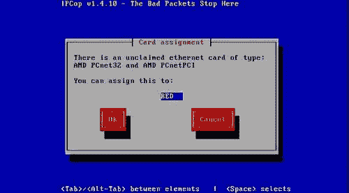

如果我们选择了具有更多接口的拓扑结构，比如橙色或蓝色，我们可以将卡分配给我们想要指定的接口。在上面显示的示例中，我们有一张卡，并将其分配给**RED**接口；这将成为我们的互联网连接。

### 地址设置

网络配置菜单中的下一个选项是**地址设置**。在这里，我们可以定义服务器上要使用的地址。

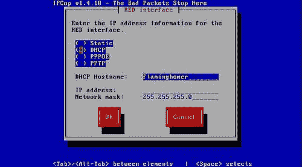

我们始终希望绿色、橙色和蓝色接口是静态的，每个接口的子网不同。红色接口将取决于我们的 ISP，他们将提供配置信息。对于静态、PPPOE 和 PPTP，地址和配置信息应根据您的 ISP 的指示进行配置。然而，如果我们使用 DHCP，所有需要做的就是点击**DHCP**选项，将所有其他设置保持默认（除非您的 ISP 另有指示）。大多数电缆连接将使用 DHCP，而 ADSL 连接将根据使用的 ADSL 路由器、调制解调器或接口卡的类型而有所不同。

## DNS 和默认网关

我们还应该为 DNS 和默认网关服务器提供服务。

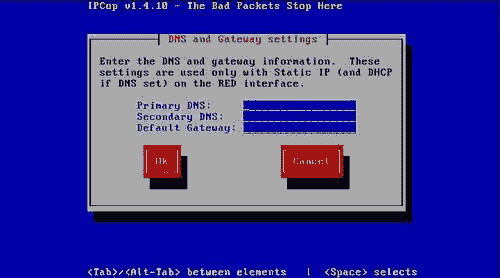

如前所述，这对于 DHCP 并不总是必要，通常也不是一个好主意，因为它会覆盖 ISP 提供的 DHCP 设置。

## DHCP 服务器

如果我们决定使用 IPCop 作为我们的 DHCP，那么我们必须配置各种 DHCP 选项。

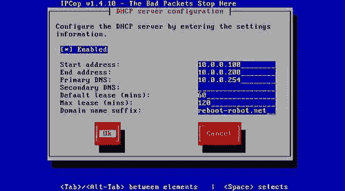

如果我们有一个简单的网络，有几个客户端，我们可能希望我们的 IPCop 处理 DHCP。在一个更大的网络中，我们可能已经使用了专用的 DHCP 服务器；如果是这样，我们应该禁用 DHCP 服务器。

DHCP 需要一系列地址来分配给客户端。我们首先提供这个范围，由**起始地址**和**结束地址**定义。在上面的例子中，我们选择了**10.0.0.100**到**10.0.0.200**。默认租约和最大租约时间是我们允许 DHCP 客户端*租用*IP 地址的持续时间。通常情况下，除非您的网络对指定时间的租约有特定要求，否则通常没有真正的理由去更改这些设置。

通常，正如我们之前讨论过的，我们可以选择任何内部寻址方案（只要我们使用内部地址）。只要我们在使用上保持一致，并合理配置一切，这都会起作用，而这个示例安装的默认设置（除了域名后缀，正如我们之前提到的）将会起作用。再次强调，正如我们之前讨论过的，唯一的例外是如果我们的 ISP 本身使用这些（RFC1918）地址——这些信息可以从您的 ISP 那里获得。

域名后缀应该预先填充我们之前在配置中提供的信息，通常后缀应该与网络上的其他客户端一起使用，以确保所有客户端都配置了相同的设置，这也与 IPCop 机器匹配。

## 完成！

现在我们可以兴奋了！我们已经完成了 IPCop 的安装过程。

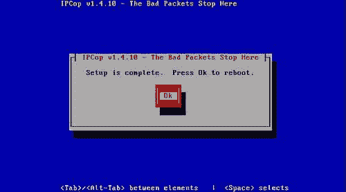

在这里按下*Enter*后，系统将首次重启到我们的 IPCop 安装中。

# 首次启动

当 IPCop 系统启动时，我们将看到以下屏幕，这是作为 IPCop（Grub）的一部分安装的引导加载程序。现在我们可以选择我们想要使用的引导选项，并在引导之前可选择添加任何内核参数。几秒钟后，默认条目应该会引导。

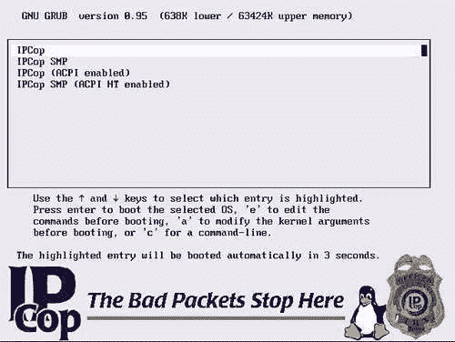

### 注意

**Grub**

Grub 是 Linux 中常用的引导加载程序之一，它在计算机的 BIOS 和操作系统之间起着中介作用，让我们可以选择多个操作系统或者只为一个指定选项（例如在前面的屏幕截图中显示的菜单中选择 SMP 或 ACPI 支持，而不是标准内核）。

有关 Grub 的更多信息可以在 FSF 网站上找到。

[`www.gnu.org/software/grub/`](http://www.gnu.org/software/grub/)

然后我们应该在屏幕上看到一些引导信息输出，持续几秒钟，然后是一系列令人满意的愉快的蜂鸣声，最后是以下输出：

```
 IPCop v1.4.10 - The Bad Packets Stop Here
flaminghomer login: 

```

这是 Linux 登录提示符，表示我们已经安装并成功启动了 IPCop 系统。IPCop 现在将作为我们的基本 NAT 防火墙运行，无需进一步配置。

# 总结

在本章中，我们介绍了如何使用之前介绍的配置和拓扑来启动和运行 IPCop 系统。我们还看到 NAT 应该通过防火墙；客户端应该能够获取 IP 地址，使用 DNS，并访问互联网。现在我们可以继续定制系统，并启用默认情况下不可用的功能和服务。在接下来的几章中，我们将介绍基本配置，然后再看看更高级的选项，比如入侵检测和 VPN。
