# 第五章。基本 IPCop 使用

现在我们已经介绍了 IPCop 防火墙的安装以及我们想要部署它的几种情况，我们可以讨论如何管理和操作 IPCop 防火墙。假设安装成功，一个默认的 IPCop 安装会呈现给我们一个 Web 界面。Web 界面允许我们通过任何 Web 浏览器配置防火墙，并且（默认情况下）仅对 Green 内部接口上的客户端启用。

Web 服务器默认情况下在端口 445 上运行（用于**HTTPS**流量），尽管这些端口可以被更改；该端口与常用/分配的端口（443）不同。应该注意，使用此端口访问 Web 界面将产生证书弹出窗口—这是由于使用自签名的**SSL**证书造成的，可以安全地忽略。

HTTPS 管理的端口分配可以使用 IPCop 控制台或**SSH**会话中的`setreservedports`命令更改为 445 以上的任何端口，并且这可能是考虑到远程访问其 IPCop 主机的任何人的一个考虑因素，因为一些互联网服务提供商将防火墙流量到端口 445，以防止像 Sasser 这样的蠕虫，它利用端口 445 上 Windows 的漏洞（**SMB**通过**TCP**）。将此端口更改为 445 以下必须手动完成，尽管不应轻率进行，并且需要编辑与`setreservedports`相同的文件（[`www.ipcop.org/modules.php?op=modload&name=phpWiki&file=index&pagename=IPCop140HttpsPortHowto`](http://www.ipcop.org/modules.php?op=modload&name=phpWiki&file=index&pagename=IPCop140HttpsPortHowto)）。

不加密的端口 81 的流量在 1.4 版本之前的版本中已经不再支持，并且最初只是为了支持不支持 HTTPS/ssl 的浏览器。自 IPCop 防火墙的 1.4 版本以来，已经进行了更改，以便仅允许 HTTPS 管理（尽管端口 81 可以重新配置）。

通过[`ipcopfirewall:445/`](https://ipcopfirewall:445/)（其中 ipcopfirewall 是主机的名称或 IP 地址）访问我们的 IPCop 防火墙，然后，我们会看到默认配置屏幕，其中包括 IPCop 防火墙的状态概述、更新状态、系统负载和所有适当配置选项的菜单。此时出现的有关证书的任何消息都可以安全地忽略，这是因为您的 IPCop 主机生成自己的 SSL 证书，而不是使用您的浏览器可能知道的**证书颁发机构**（**CA**）（如 VeriSign 或 CAcert）颁发的证书。

# 系统菜单

**系统**菜单中的项目对系统的功能性相当关键。

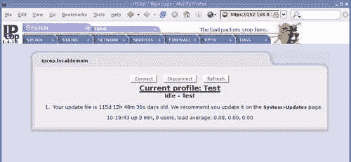

## 软件更新

安装后，我们应该做的第一件事是确保我们的 IPCop 防火墙应用了适当的更新。尽管许多软件更新提供了新功能和现有软件包的更新和错误修复，但有些是为了解决新的安全问题，为了维护防火墙的完整性；尽可能频繁地应用这些更新是很重要的。

软件更新功能在**系统 | 更新**菜单下提供。

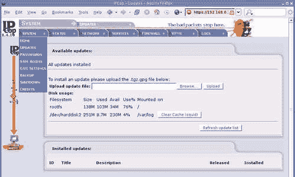

**刷新更新列表**按钮连接到 IPCop 服务器并检索已发布更新的列表—页面上的**可用更新**部分将指示何时需要提供更新，并提供下载链接。更新必须按原样（不解压或提取）从互联网手动下载，然后通过**浏览**按钮上传到防火墙。

正如更新文件的名称（`*.tgz.gpg`）所示，更新使用**GNU 隐私保护**（**GPG**）签名，这可以防止未经授权（或被篡改）的更新由任何人发布，而不是首先篡改用于签署更新的 IPCop 密钥。GPG 签名防止更新文件被篡改或解压重组或修改，导致 IPCop 拒绝使用已被入侵者篡改或解压而不是简单下载和上传的更新文件。

更新将指示是否需要重新启动 IPCop 防火墙，但在许多情况下，不需要重新启动，通常是内核更新需要这样做。

IPCop 防火墙的某些版本（通常是主要版本增量，例如 1.3-1.4）要求完全重新安装防火墙，因为升级过程太复杂，无法通过更新进行。在这种情况下，可以备份防火墙配置，因此防火墙不需要完全从头开始重建。

## 密码

下一个**系统**菜单允许我们更改密码——这个屏幕相对简单，给了我们重置**admin**密码（可以完全控制 Web 界面）和**dial**密码的选项。**dial**用户只允许用户连接或断开连接，必须手动拨号，例如模拟调制解调器。

系统上的第三个帐户，即根帐户（在安装过程中设置的密码），具有重置**admin**和**dial**用户帐户密码的权限，但此功能必须在 IPCop 防火墙的控制台上或通过 SSH 使用，SSH 必须手动启用。

## SSH 访问

SSH 访问允许我们使用具有适当权限的帐户（例如根帐户）远程安全建立控制台会话。SSH 是一个非常有用的工具，对它的全面覆盖超出了本章甚至本书的范围。在其最基本的形式下，SSH 可用于以与机器本身的控制台上所做的方式（即文本方式，在命令行上）运行命令和管理系统。

在 IPCop 的上下文中，这非常有用，因为我们可以运行安装过程中运行的设置程序（允许我们重置或更改参数，如网络配置和卡分配，或重置密码）。如果您更改了网络拓扑或在 IPCop 防火墙中添加/替换了网络卡，可能希望通过 SSH 重新配置它。

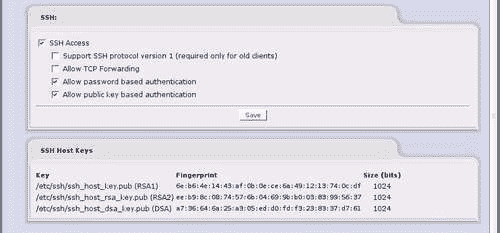

### 注意

**SSH 密钥**

[`hacks.oreilly.com/pub/h/66`](http://hacks.oreilly.com/pub/h/66)是关于使用 SSH 密钥的简要概述，以及其他资源的一些指针（以及关于该主题的大量用户评论）。

密钥认证允许使用存储在客户端计算机上的密钥（类似于 SSL）来验证客户端，而不是在 SSH 身份验证阶段（SSH-USERAUTH）期间每次通过互联网传输的密码。假设密钥未被盗用或泄露，这种身份验证方法比使用密码更安全，但更复杂，更难理解和配置，而且灵活性稍差（在要用于登录到 SSH 服务器的任何系统上都需要密钥文件，而密码只需记住）。

SSH 通常也更有用作为诊断工具——IPCop 中包含许多只能通过命令行访问的工具，如`vim`（强大的文本编辑器）、诸如`ping`和`traceroute`的网络实用工具，以及`tcpdump`，通过转储网络流量或仅在控制台上查看标头来调试网络问题非常有用。我们还可以使用许多标准的 Unix 实用程序，如`touch`和`grep`。这些（实际上，除了`vim`和`tcpdump`之外，本段中提到的所有命令）都是由`busybox`提供的，该程序在您通过控制台或 ssh 登录时运行以提供所使用的 shell。

### 注意

**Busybox Shell**

在以下网址了解有关`busybox` shell 及其提供的选项：[`www.busybox.net/downloads/BusyBox.html`](http://www.busybox.net/downloads/BusyBox.html)。

### 连接到 SSH

在 Linux 或 Unix 系统上访问 SSH 相当容易——一旦我们启用了 SSH，它将在（非默认）端口 222 上运行，因此类似于以下命令将使您进入 IPCop 主机（假设主机名为"IPCop"）：

```
james@horus: - $ ssh -p 222 root@ipcop
root@ipcop's password:
Last login: Thu Feb 27 12:31:22 2006 from 10.0.2.241
root@ipcop:- #

```

在这一点上，您可以像登录到机器一样工作。在 Windows 平台上，有一个名为**PuTTY**的优秀免费 SSH 客户端，而 Linux 和最近的 Unix 平台（如 OS X）几乎普遍安装了命令行 SSH 客户端。在 OS X 中，可以通过`Terminal.app`访问，而在任何最近的 Linux 桌面中都可以使用 konsole、gnome-terminal、rxvt 或任何其他 Linux 终端仿真器来使用 SSH。

### 注意

**下载 PuTTY**

从[`www.chiark.greenend.org.uk/~sgtatham/putty/download.html`](http://www.chiark.greenend.org.uk/~sgtatham/putty/download.html)下载 PuTTY

要使用 PuTTY，请启动从上述网址下载的`putty.exe`文件。这应该会弹出一个类似于以下图示的框：

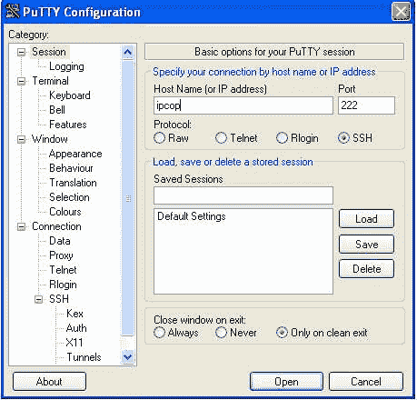

要连接到 IPCop 主机，请将主机名或 IP 地址输入**主机名**框中，并将端口号**222**输入**端口**框中。您可以通过在**已保存的会话**文本框中输入配置文件名称并单击**保存**来保存这些设置；下次打开 PuTTY 时，将在多列表框中列出一个条目，目前只显示**默认设置**，其中包含您在**已保存的会话**框中输入的名称。您只需双击此条目即可连接。使用用户名**root**和安装过程中设置的密码进行连接，然后您应该会得到一个与之前在 Linux 系统上列出的非常相似的提示。

### 关于 SSH 的更多信息

SSH 本身是一个成熟的协议，在非常广泛的部署中，并因此构成了最小（并且被充分理解的）安全风险。它由 OpenSSH 团队设计和维护，以 OpenBSD 而闻名，后者被认为是世界上最安全的操作系统之一。因此，如果您不需要 IPCop 中 VPN 功能提供的更丰富的 VPN 连接形式，SSH 提供了一个更低调的选择（和安心）。

SSH 还为我们提供了其他几个强大的工具——SSH 协议包括允许通过 SSH 进行网络连接隧道化的功能（**TCP 转发**）。通过在我们的 IPCop 防火墙上启用此选项并将 SSH 暴露给外部世界，我们可以以非常轻量级、平台无关的方式访问内部网络资源和/或 IPCop 配置页面，而无需 VPN 的开销或复杂性。

例如，这可能是在 IPCop 防火墙后面内部访问客户机器的一个很好的方式，或者只是访问 IPCop Web 界面而不将 Web 服务器暴露给互联网。

### 注意

**使用 SSH 进行网络流量隧道**

简而言之，有几种方法可以通过我们的 IPCop 防火墙使用 SSH 来隧道网络流量。启用 TCP 转发后，我们可以使用动态端口转发通过代理服务器通过 SSH 会话发送连接。使用 SSH 的命令行版本，我们可以使用类似以下的命令：

```
james@horus: ~ $ ssh -D 1234 -p 222 root@80.68.90.223
root@ipcop's password:
Last login: Thu Mar 2 10:22:42 2006 from 207.46.250.119
root@ipcop:~ # 

```

只要我们保持这个`SSH`连接打开（并且我们可以像普通的 SSH 连接一样使用它），我们的本地机器（即我们启动连接的系统）将在回环接口上运行一个代理服务器（即仅在地址 127.0.0.1 上监听）和端口 1234。然后，我们可以使用任何支持代理的应用程序连接到 IPCop 主机可以连接到的任何主机。这可以是一个穷人的 VPN，用于在公共互联网连接上私下访问网站，或者如上所述，我们可以使用它来访问 IPCop 主机或内部网络资源上的 Web 界面。

SSH man 页面非常全面——在任何 Linux/Unix 系统（除 IPCop 外）上使用`man ssh`，或者在 Google 上搜索"man ssh"，都会提供`ssh`命令的其他可用选项的全面列表。PuTTY 也通过 GUI 支持类似的选项（包括以相同方式进行动态端口转发）。

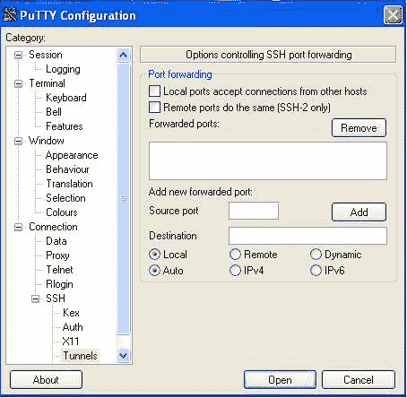

在**源端口**框中输入您希望在客户端上用于代理连接的端口，选择**动态**，点击**添加**，然后像平常一样连接。一旦为特定连接配置了这个设置，如果选择在 PuTTY 中保存配置文件，这个设置将与主机名和端口号一起保存。

### 注意

**SSH 和 TCP 转发**

[`www.securityfocus.com/infocus/1816`](http://www.securityfocus.com/infocus/1816)是 Brian Hatch 于 2005 年撰写的关于 SSH 在这一领域的能力的一篇优秀的安全焦点文章。这很复杂，但如果您对这个主题有丝毫兴趣，那么阅读起来是非常值得的。

**SSH 访问**页面还允许我们查看 SSH 密钥。强烈建议使用这些——但超出了本书的范围。同样，SSH 文档（和 SSH man 页面）强烈建议作为了解这一点的良好信息来源。

## GUI 设置

**GUI 设置**菜单显示在以下图片中：


我们可能要认真看一下的唯一选项（并且不是立即明显的）是**启用 Javascript**选项，如果我们使用较旧（或文本模式）的客户端连接到 IPCop，我们可能需要禁用它。

## 备份

我们可以使用 IPCop 中的**备份菜单**将设置备份到软盘或通过网络访问的文件中。除了用于灾难恢复目的，这也是升级主要版本增量之间的重要部分，其中不总是可能进行就地升级（必须重新安装防火墙并恢复配置）。

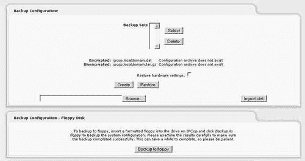

顶部的**备份配置：**选项允许我们在 IPCop 主机上创建备份——点击**创建**按钮允许我们创建一个列在**备份集**下的备份。

### 注意

**备份加密**

从 IPCop 1.4.0 版本开始，IPCop 包括了由 Tim Butterfield 编写的带加密功能的备份。当 IPCop 进行加密备份时，它会使用存储在机器本身上的随机密钥来进行，恢复备份时需要该密钥。如果您的备份是加密的，您将需要一个密钥的副本来恢复备份。

有关这是如何工作的更多信息，请参阅作者在将备份附加组件集成到 IPCop 代码主体之前的原始页面：

[`www.timbutterfield.com/computer/ipcop/backup.php`](http://www.timbutterfield.com/computer/ipcop/backup.php)

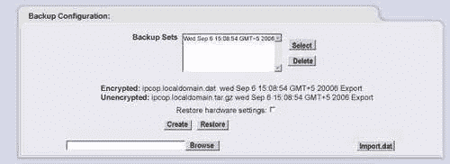

通过选择相关的备份并点击“选择”，我们可以下载适当的备份并将其保存在另一台机器上进行归档，或者保存到 CD、磁带等。由于许多 IPCop 防火墙的空间有限，这允许以不影响操作效率的方式维护全面的备份集（并且比仅在同一主机上存储备份更具有容灾能力）。由于防火墙配置往往相对静态，IPCop 主机的备份计划可能不需要频繁，但出于明显的原因，强烈建议定期备份计划（或在每次重大更改后备份的程序）。

## 关机

关机菜单相对简单，允许手动重新启动或关闭 IPCop 主机，并允许我们安排主机定期重新启动。

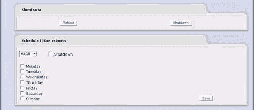

# 检查我们的 IPCop 防火墙的状态

我们的管理程序的一部分应该包括监视 IPCop 防火墙，以确保 CPU 负载、内存使用、网络吞吐量等保持健康水平。系统管理员的一个极其重要的角色是为他或她的系统建立一个基线，以便能够识别异常 - 许多入侵和硬件故障首先是通过网络活动的下降（或上升）或 CPU 负载来注意到的。

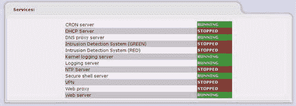

基本状态屏幕允许我们在检查防火墙的生命周期统计数据之前查看一些基本系统统计数据。在 IPCop 盒上运行的服务显然会严重影响盒子执行其工作的能力，作为一个快速指示器，服务显示在防火墙停止正常运行时是有用的，以确保防火墙认为正确的服务正在运行。

许多服务，如安全外壳服务器和 Web 代理，默认情况下未运行 - 前一图像说明了默认设置，并添加了 SSH 服务器（我们在本章前面启用了）。


内存是相当明显的。性能问题，特别是在作为较大网络的 Web 代理的主机中可能是由于内存不足引起的。虽然不总是内存问题的指标，特别是如果主机负载过重并且使用了 IPCop 提供的一些更密集的功能（如代理服务器），但是值得了解交换指示器。交换是将分配给进程的内存移动到硬盘上的过程，而不是存储在系统的随机存取内存中。这实际上允许系统使用比主机实际拥有的更多物理内存，但在执行交换操作时会降低速度；访问已经被交换出的程序的数据的硬盘上的速度比从真实内存中访问要慢得多。

重要的是要注意，由于 Linux 分配和管理内存的方式，已使用内存的百分比（顶部行）*不*代表不可变地使用的内存量 - Linux 内核将频繁访问的文件缓存到内存中的磁盘缓存中以提高性能，这解释了一些内存使用情况。通常更明智的做法是查看没有缓冲/缓存的内存（第二个指示器），以更好地指示实际*可用*内存量。这是`free`命令的输出的更美观、图形化版本。


IPCop 系统的**磁盘使用情况**也应该相对不言而喻。**/boot**分区用于存储操作系统内核和配置信息（由于这是作为软件更新过程的一部分进行管理，即使在高水平下使用也不是关键）。用于唯一真正增长的东西的最大分区被挂载到**/var/log**，正如名称所示，用于存储日志文件。


**运行时间和用户：** 运行时间是不言而喻的。用户可能不是；因为这是（字面上）`w`命令的输出，**用户**指的是通过控制台或 SSH 登录到 Linux 主机本身的用户。这不应被理解为没有人*使用*IPCop 作为防火墙、代理服务器或通过 Web 界面登录。

在这种情况下，负载是根据`w`命令的*Unix*负载。列出的三个数字分别代表过去 1、5 和 15 分钟的负载。该数字代表正在使用或等待 CPU 时间的进程数量，或处于不可中断的睡眠状态。每个这样的进程都会使负载数字加 1，您看到的数字是该时段的平均值。

负载并不总是衡量系统负载的好方法，网络吞吐量、特定 CPU 统计信息以及更详细的输出，详细说明特定进程的信息通常更有用作为诊断工具（而不是粗略指标）。


**加载的模块：** 是另一个特定于操作系统的信息。Linux 内核将功能模块捆绑为可加载的*模块*，如果不需要，可以将其移除或者不加载。每个模块化并且正在使用的功能都会显示在这里；其中大多数将在启动时加载，并代表从网络卡的设备驱动程序到 iptables 所需的模块，用于执行不同的防火墙功能（其中一些显示在前一个图中）。

除非您有特定的需求了解或查看正在使用哪些模块（或者只是好奇），这并不是非常有用的信息。前一个图形基本上是`lsmod`命令的输出。


这是命令`uname -a`的输出，从左到右显示：内核名称、网络节点主机名、内核发布版本、内核版本、机器硬件名称和操作系统。

# 网络状态

**网络状态**屏幕上包含的信息通常在故障排除网络问题时非常有用。

我们得到的第一个工具是`ifconfig`命令的着色版本输出，系统上的网络接口被赋予 IPCop 用于标识它们的颜色。当 IPCop 主机连接到通过 DHCP 分配配置信息的网络（如电缆或 ADSL 连接）时，这通常对于验证连接丢失是否与 IPCop 主机相关或服务提供商的网络中断有关是很有用的。由于我们可以看到错误和丢包的数量，这通常也对于排除其他网络问题很有用。

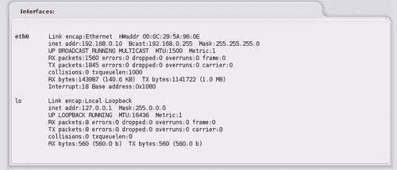

**lo**接口代表**本地环回**适配器，地址为**127.0.0.1**，应始终存在。在这个系统上，红色接口是不活动的，但在一个完全配置的 IPCop 系统上，我们可以在这里看到多达五个接口（红色、绿色、橙色、蓝色和环回）。

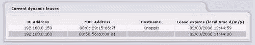

**当前动态租约**表实际上显示了分配给内部网络段上客户端的*DHCP*租约。在这种情况下，我们有两个客户端，其中一个没有在 DHCP 请求中提供主机名，另一个（**Knoppix**）提供了。IPCop 会将主机名注册到 DNS，因此主机**Knoppix**应该可以通过 IPCop 的 DNS 服务器作为**Knoppix**进行寻址。

过期的租约通过（划掉）进行了评分。这里显示的输出基本上包括`/var/state/dhcp/dhcpd.leases`的内容。

除了让我们调试 DHCP，这也是获取特定系统的 MAC 地址的一种快速有用的方法，无论是用于设置静态预留还是其他任何目的。


路由表由防火墙用于确定系统处理的 IP 数据报应该转发（或发送）到何处。关于路由的全面讨论超出了本书的范围，但主机路由表是许多网络问题的一个很好的起点，对路由的彻底理解对于有效管理防火墙、网络甚至一组工作站至关重要。


ARP 表包括本地网络段上 IP 地址和硬件（MAC）地址之间的当前映射。通常每个网络上的客户端都有条目，以及上游路由器的一个条目（通常是电缆/ADSL 路由器，或更通常是 ISP 的上游路由器）。与许多其他项目一样，这对于某些网络故障排除非常有用，但超出了本书的范围。

## 系统图表

IPCop 使用一个名为**rrdtool**的软件包（[`oss.oetiker.ch/rrdtool/`](http://oss.oetiker.ch/rrdtool/)）来维护一组与系统和网络活动相关的统计数据图表。这些在系统安装时会自动设置，我们在**系统图表**菜单下可以访问的统计数据包括**CPU 使用率、内存使用率、交换使用率**和**磁盘访问**。

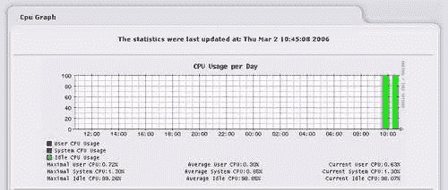

前面的图表是这种图表的一个示例（用于 CPU 使用率）。点击特定图表会深入到该特定统计数据，为您提供上一天、上一周、上一月和上一年的该指标的图表。

您应该注意，由于 rrdtool 的 UTF 问题（这会阻止使用特殊字符），IPCop 目前受到限制，只能以英语生成这些图表。

## 网络图表

IPCop 还维护系统中各接口上的网络流量图表。这些与**系统图表**的工作方式完全相同。

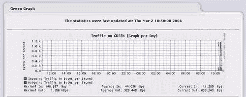

## 连接

**连接**功能显示了通过 IPCop 防火墙当前进行的所有连接的彩色输出。在此屏幕上点击 IP 地址会对该地址执行**反向 DNS 查找**，如果配置了反向 DNS（即地址有**PTR**记录），则会给出与地址相关的主机名。

# 服务

虽然 IPCop 是一个防火墙软件包，但它包含许多功能，超出了普通防火墙的范围。例如，DNS 和 DHCP 功能通常由单独的主机提供。IPCop 专为较小的部署设计，其中半打不同的服务器（路由器、防火墙、DHCP 服务器、DNS 服务器、代理服务器、入侵检测系统等）根本不可行，它将所有这些功能捆绑在一起。

**服务**选项卡是我们可以配置 IPCop 中许多独立元素并需要更复杂设置的功能的地方。其中一些在它们自己的章节中介绍；其他几乎总是与 IPCop 一起部署的功能（如 DNS 和 DHCP）将在此介绍。

## DHCP 服务器

**DHCP 服务器**页面的顶部允许我们重新配置安装 IPCop 时设置的一些选项（如起始和结束地址和租约时间）。其他选项，如**WINS**服务器和**附加的 DHCP 选项**，现在可以添加到我们的配置中。

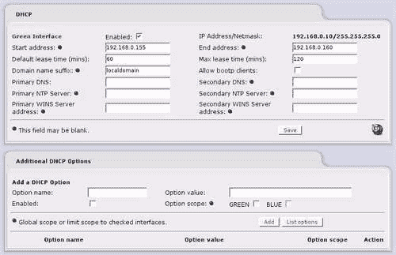

如果您不了解 DHCP，那么您可能不需要重新配置它（如果您的 IPCop 盒子正常运行）。但是，您最好了解 DHCP（以及它存在的各种缺陷）。

在页面的下方，我们可以配置**固定租约**。固定租约（有时称为保留）允许您配置 DHCP 服务器，以便为与特定 MAC 地址匹配的主机响应特定的 IP 地址（而不是从池中随机选择的地址）。这样做的好处是，您可以在集中管理 IP 配置的同时，通过 IP 地址可靠地连接到主机，而不是依赖 DNS。

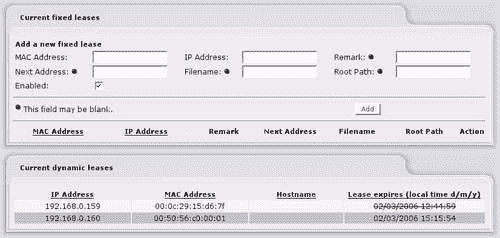

对于一些设备，如网络打印机或 IP 摄像头，通常不处理动态 DNS（或使用不友好且经常不可更改的主机名），如果您不想在网络上的每个设备上手动设置 IP 地址，这是一个福音。

在此之下，我们可以（再次）看到**当前动态租约**。如果我们刚刚将一个支持 DHCP 的设备连接到我们的网络，但想要为其分配一个特定的地址，这是一个有用的功能；我们可以复制 MAC 地址，为其创建一个固定租约，并重新启动设备，此时它应该重新获取正确的（静态）地址。

**根路径**和**文件名**选项对许多网络管理员或 IT 专业人员来说可能不熟悉，用于配置从网络引导系统和通过**NFS**读取文件。在绝大多数部署中（如页面所示），可以安全地忽略它们。

## 动态 DNS

许多较小企业或家庭中的互联网连接使用动态分配的 IP 地址，通过 PPP 或 DHCP 等协议，从 ISP 拥有的地址池中分配。这使得 ISP 可以最小化所需的 IP 地址数量（理论上，它只需要与任何给定时间在线的最大客户端数量一样多的 IP 地址），并且使得集中配置更容易。

由于客户端的 IP 地址通常会话对话地更改，如拨号连接的情况，或者在不确定的时间间隔内更改，如 ADSL 或 Cable 客户端的情况，传入连接是一个问题。如果 IP 地址不断变化，就无法让客户端 VPN 到 IPCop 服务器，或者将邮件传递到 IPCop 主机所在的站点。

动态 DNS 提供商解决了这个问题。通过在客户机上使用一个代理，不断更新互联网上的服务器，动态 DNS 提供商可以更新 DNS 名称（例如 youripcopserver.afraid.org）与当前 IP 地址，这样只要 IPCop 主机保持在线，客户端就可以始终通过相同的 DNS 名称连接到它。

IPCop 支持广泛的动态 DNS 提供商列表，其中大多数是免费的。Afraid.org（[`freedns.afraid.org/`](http://freedns.afraid.org/)）是一个很好的选择，具有可靠和良好设置的服务。所有动态 DNS 提供商的工作原理基本相同——您通过提供商的网站注册一个帐户，然后提供 IPCop 所需的详细信息，以便它可以注册自己。此时（并给一两分钟让一切开始运作），您注册的主机名应该解析为 IPCop 的红色 IP 地址。一般来说，这非常简单和直接。

如果您想在外部进行此测试，但没有外部主机可以进行测试，有几个在线 DNS 测试服务，如[www.dnsstuff.com](http://www.dnsstuff.com)，您可以使用它们来查找您域名的**A**记录，以查看它是否解析为正确的 IP 地址。

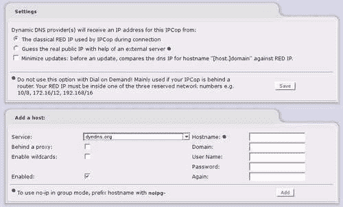

一般来说，默认情况下选中的**在连接期间 IPCop 使用的经典 RED IP**选项将是最适合您的选项。如果您的 IPCop 路由器位于另一台路由器后面，实际上连接到 IPCop 盒子通过互联网会遇到问题，甚至在连接到内部服务时也会遇到更多问题，因为您的流量实际上会经历两次网络地址转换。如果您能够这样做，建议的解决方案（如页面所建议的）是删除其他 NAT 路由器，并将 IPCop 红色接口直接插入您的互联网连接。

### 注意

**配置端口转发**

请注意，为了能够连接到您的 IPCop 主机（或其后面的任何资源），您将不得不配置端口转发到内部服务，以及能够从互联网解析您 IPCop 主机的 IP 地址。

一些路由器不允许这样做（例如以太网 ADSL 调制解调器），它们将允许您启用桥接模式，而不是执行 NAT。使用 Conexant 芯片组（等等）的 ADSL 路由器具有半桥特性，通过 DHCP 将从 ADSL 提供商接收的 IP 地址传递给通过电缆/DSL 调制解调器的第一台计算机的路由器以太网端口。这是一个技巧，但是一个有用的技巧，因为它允许一个主机直接连接到互联网，而无需复杂的设置。

您应该咨询制造商的文档或支持服务，以获取有关设置的信息，因为这是一个非常复杂的主题，因各个路由器而异。

### 注意

**动态 DNS**

请注意，在本书的上下文中，短语**动态 DNS**指的是两件事。其中一种是在此提到的，指的是将 IPCop 主机的 IP 地址注册到互联网上的提供商，以便互联网上的客户可以通过可预测的主机名（例如*youripcopbox.afraid.org*）找到 IPCop 主机，即使 IP 地址发生变化。

另一种是在其他地方提到的，指的是 IPCop Green 网络中的客户端向 IPCop DNS 服务注册*它们的*主机名，以便 IPCop 内部段上的其他计算机可以从它们的主机名解析其 IP 地址。这第二个服务严格来说是内部的，与外部世界没有直接关系。

## 编辑主机

主机文件在 Linux/Unix 中为`/etc/hosts`，在 Windows 中为`%SystemRoot%\System32\Drivers\Hosts`，提供了一种手动设置主机名-IP 地址关系的方法，而无需使用 DNS。这对于测试目的、作为 DNS 的备份或在没有 DNS 的环境中可能很有用。如果您需要强制 IPCop 将特定主机名解析为特定 IP 地址，您可以在这里这样做，而无需复杂的 DNS 配置。这是一件事，除非您对其功能有很好的理解，否则不应该随意更改。

## 时间服务器

**NTP**是一种旨在从互联网同步时间的协议。非常简单地说，您的 IPCop 主机连接到一个 Stratum 2 NTP 服务器，并确定时间；这个 Stratum 2 NTP 服务器本身连接到一个 Stratum 1 服务器（或多个服务器），以便将其时间源维持在可接受的精度水平。

Stratum 1 服务器根据外部时间源（如 GPS 时钟或无线电接收器）维护其时间。保持这种分工是为了减轻 Stratum 1 服务器的负载，否则它们将无法应对客户端的数量。将服务器同步到 Stratum 1 NTP 源被认为是一种不良做法，除非您有一个庞大的（以千计计数）网络。您还应尽量选择一个距离您尽可能近的 Stratum 2 服务器（或池），因为服务器越接近，系统就能越准确地设置其时钟。

准确的时间对于网络设备非常重要，特别是对于防火墙，因为能够准确辨别记录事件（如入侵）发生的顺序通常对于维护功能性基础设施和调查（和起诉）入侵者至关重要。

NTP 通常在互联网上保持 5-15 毫秒的精度水平。有关 NTP 的起源、重要性以及可用 NTP 服务器列表的详细解释，请访问[`ntp.isc.org/bin/view/Main/WebHome`](http://ntp.isc.org/bin/view/Main/WebHome)。

IPCop 具有同步到外部 NTP 源并为本地网络上的客户端提供 NTP 服务的能力。

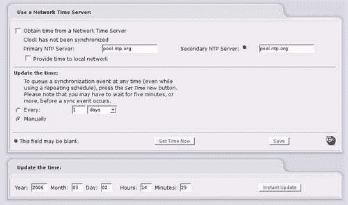

默认设置，如果您勾选了**从网络时间服务器获取时间**设置，应该可以正常工作，但建议您选择一个离您更近的**主要 NTP 服务器**（或池）。正如配置页面所示，IPCop 也可以自动同步时间。

IPCop 还可以通过 Web 界面设置时间。如果系统时钟特别不同步，手动同步后可能不会立即发生 NTP 更新。如果出于某种原因不希望使用 NTP，您可以保持通过此方式更新时间，或者只是用它来测试 NTP，方法是将时间设置不正确，然后验证 NTP 是否确实起作用。

# 防火墙功能

IPCop 中的**防火墙**下拉菜单包含配置防火墙本身功能的功能。由于 IPCop 的设计理念是将绿色区域视为隐式信任，并从那里降低信任，因此 IPCop 本身没有出口过滤功能。因此，在这里配置的两个主要选择是**外部访问**，它允许您控制 IPCop 允许的入站方向的端口，以及**端口转发**。有关设置更细粒度的防火墙策略的更多信息，请参见第九章 ，特别是有关出口流量（即从绿色到红色的流量）的设置。

## 外部访问

IPCop 防火墙默认情况下会丢弃红色区域中发起的所有流量。几乎所有通过防火墙进入网络的流量（例如响应网络内部客户端发出的对网站的*get*请求而提供的网站）都是允许的，但为了允许外部主机连接到 IPCop 防火墙本身，以访问诸如 Web 界面或 SSH 之类的服务，我们需要添加一个外部访问规则。

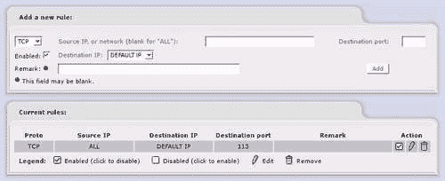

正如我们所看到的，IPCop 默认只有一个外部访问规则，用于端口 113（ident）。尽管 IPCop 主机默认情况下没有在此端口上运行的服务，但此规则存在是为了允许连接到 ident（例如 IRC 或 Internet Relay Chat）的服务连接而不必等待连接超时。通过外部访问打开此端口，IPCop 防火墙上对 ident 的任何连接都将遇到关闭的端口，从而加快连接速度，而不是过滤端口。

因此，默认情况下，如果我们添加一个允许规则，流向允许端口的流量将会命中 IPCop 的外部接口上的端口。**外部访问**屏幕让我们可以通过 IPCop 的最外层防御允许流量进入，实际上端口转发（或允许流量命中特定内部机器）是在下一部分完成的。

## 端口转发

由于我们只有一个外部（红色）IP 地址和多个内部客户端，为了允许从互联网连接到特定内部机器上的特定端口，我们必须在红色接口上分配一个端口与内部机器上的服务对应，并将这个流量*转发*到内部客户端。

在某些情况下，例如如果我们要将内部 SSH（22）服务器发布到网络上，我们可能选择使用不同的外部端口来监听内部主机上的端口。例如，我们可能将防火墙上的端口 4022 转发到内部主机上的端口 22。这种方法的好处是我们可以容纳同一服务的多个实例（使用端口 4023、4024 等），并且隐藏我们的 SSH 服务运行的端口会有轻微的安全性好处。

这种方法的一个主要缺点是在某些情况下，端口对于运行在其上的应用程序是至关重要的。例如，HTTP 流量默认使用端口 80——浏览器需要额外的参数（通常在 IP 地址或主机名的末尾由冒号跟随端口号表示）来访问替代端口上的 HTTP 流量，就像 IPCop 自己在端口 81 和 445 上的 HTTP/HTTPS 接口一样。

如果我们将 HTTP 流量重定向到端口 81（或其他端口），那么在防火墙只允许连接到端口 80 的客户端后面，可能会意外地阻止访问我们的 Web 服务器。

一些服务需要特定的端口号。如果我们有一个内部邮件服务器，我们从 IPCop 防火墙转发端口 25（SMTP）到该服务器，我们必须在外部使用端口 25，否则向我们中继邮件的邮件服务器将无法连接到邮件服务器——SMTP 服务器使用端口 25，Web 上没有使用替代端口的方法。

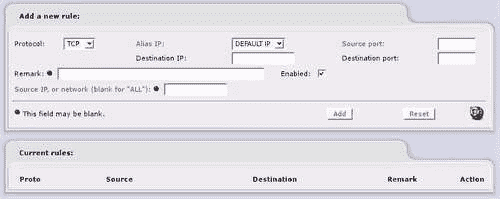

因此，我们的**源端口**指的是我们在外部接口上打开的端口。**目标端口**指的是目标主机上的端口。例如，如果我们想要将外部端口 4022 转发到内部主机 10.1.1.123 上的端口 22，我们会在**源端口**框中输入**4022**，在**目标端口**框中输入**22**，并在**目标 IP**框中输入**10.1.1.123**。

### 注意

**转发多个端口**

您可以通过指定端口范围来转发多个连续的端口。这是通过使用冒号来界定范围中最低和最高的端口来实现的。例如，如果我们想要将外部接口上的端口 10 到 30 转发到网络中的服务器上的端口 10 到 30，我们会在**源端口**和**目标端口**中分别输入**10:30**。

**源 IP 或网络（空白表示“全部”）**框允许我们仅接受特定主机的连接。如果我们要打开一个诸如**RDP**（**3389**）这样的协议到 Web 上，而我们对其安全性并不完全满意，我们可能会选择这样做。或者，我们可能会选择仅从受信任的 IP 地址块主动允许连接，而对所有的端口转发规则都采取这种方法（除了 SMTP，它要求连接来自许多不同的主机，以至于以这种方式设置基于 IP 的过滤几乎是不可能的）。

如果我们要转发诸如 DNS 这样同时使用 UDP 和 TCP 的协议，我们可能会选择不同的*协议*。

## 防火墙选项

**防火墙选项**页面允许我们启用和禁用 IPCop 主机上各个接口对**ICMP**（互联网控制消息协议）**回显**（ping）请求的响应。通常认为禁用任何不必要的流量是一个好的做法，尽管在防火墙规则中允许这种流量是一个相当常见的遗漏。

虽然这个选项并不是一个与此相关的主要问题，因为它只允许从 IPCop 主机发送 ICMP 响应，但在严格控制出站流量的环境中，有很多理由禁止 ICMP 流量。可以通过 ICMP 隧道传输 IP 流量（即通过 TCP、UDP 和 ICMP 进行的所有连接，包括网页访问、DNS、端口扫描和任何其他类型的 TCP/IP 网络活动）。

这可能导致这样一种情况，即在使用机场或咖啡店网络时，一个恶意用户可以在不支付的情况下访问互联网（因为这种预认证或支付系统通常允许 DNS 和 ICMP 流量穿过他们设置的防火墙），或者在企业中，员工可以规避防火墙策略以访问未经授权的资源和站点。

有关通过 ICMP 进行 IP 隧道传输的更多详细信息，请参见 [`thomer.com/icmptx/`](http://thomer.com/icmptx/)。


## 使用 Ping 进行网络故障排除

在运行在 IP 之上的三个协议中，构成了互联网上常用的**TCP/IP 协议栈**（TCP、UDP 和 ICMP）中，ICMP 经常被忽视。ICMP 可以被视为一种管理通道，主要用于发送错误消息和其他用于诊断问题和处理数据的信息。

Ping 实际上使用 ICMP 的“回显请求”和“回显回复”消息，第一个名为 ping 的实用程序是在 1983 年编写的。这种工作方式有时被等同于**声纳**，发起主机发送一个*回显请求*消息，通常是发送到特定的 IP 地址的主机。接收主机然后回复一个*回显回复*消息，发起计算往返时间，以毫秒（ms）显示出来。

这提供了一个很好的、快速的测试：

+   连接性（对方主机是否回复）

+   网络延迟（所花费的时间长度）

+   网络可靠性（保持使用`ping`命令运行，使用 Windows 的 `-t` 标志或者在许多其他 ping 实现中默认情况下，通常是检测网络使用或延迟突然增加或连接丢失的好方法）。

最近，互联网上许多主机已经开始对这种类型的 ICMP 流量进行防火墙处理，不回应“回显请求”数据包。在某些情况下，这可能是为了减少带宽使用，而在其他情况下，管理员可能出于安全原因而阻止它。微软（[www.microsoft.com](http://www.microsoft.com)）是一个高调的网站的例子，它会丢弃 ping 请求，而谷歌（[www.google.com](http://www.google.com)）则是一个不会丢弃的例子。

### 注意

**有关 Ping 的更多信息**

有关 ping 的更多信息，请参见 [`ftp.arl.mil/~mike/ping.html`](http://ftp.arl.mil/~mike/ping.html)，了解 ping 的原始作者 Mike Muuss 的更多信息，以及 ping 故事的链接（和图片），这是任何 IT 图书馆或书架的有价值的补充！

# 摘要

我们已经通过 IPCop 网页界面的主要配置，并且到目前为止应该对我们如何利用 IPCop 提供的各种选项来管理、故障排除和监控 IPCop 防火墙在不同场景下有了扎实的理解。
