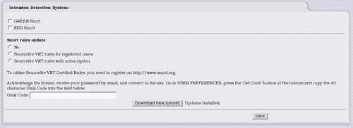
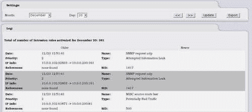
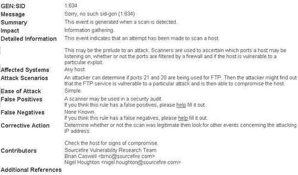

# 第六章：使用 IPCop 进行入侵检测

现在我们有一个功能齐全的防火墙，大多数基本功能都已设置好，我们感到非常安全。但如果有恶意入侵者呢？如果他们真的进来了，我们怎么知道？我们该怎么办？

这些是**入侵检测系统**（**IDS**）试图回答的问题；它会检测网络安全方面的问题，并记录任何它识别出的可疑活动，以便我们能够有效地处理安全事件。

# IDS 简介

市场上有各种各样的入侵检测系统，从企业级的托管网络监控解决方案到简单的主机日志记录系统。入侵检测系统和 IDS 之间也有区别。IPS 比 IDS 更进一步，试图阻止正在进行的攻击，而 IDS 试图记录攻击并在必要时通知负责人采取安全事件响应计划。

IDS 可以进一步分类为**NIDS**或**HIDS**，区别在于前者监视*网络*，后者监视*主机*。在选择 IDS 时，这一点很重要，因为我们必须确定我们究竟在监视什么。

例如，许多管理员不会在 Windows 或 Unix 系统上使用 HIDS，因为它们内置了大量日志记录的能力（事件日志/系统日志），因此更喜欢监视网络上的流量以寻找恶意行为的迹象。这也比主机监控更可靠，因为很难相信受到威胁的主机的日志。

在 IPCop 的情况下，我们的防火墙上内置了一个 NIDS，预先配置并准备好使用的**Snort**入侵检测系统。

# Snort 简介

Snort 是包含在 IPCop 中的 IDS，是当今最知名和常用的**sniffers**之一，被世界各地的大大小小网络所使用。它不断更新的签名覆盖了大量的漏洞，拥有庞大的用户群，商业支持以及在线和印刷版的优秀文档。Snort 最初是由 Martin Roesch 在 20 世纪 90 年代末开发的，最初被设计为一个 sniffer，可能还有一些其他功能，因此得名 Snort。

最初作为 sniffer，Snort 相当不错，并与稍老一点的亲戚 TCPDUMP 有关。最终，Snort 被扩展并被认为更像是 NIDS 而不是 sniffer（许多 Snort 的用户并不知道它的 sniffing 能力，并纯粹将其用作 IDS）。

随着 Snort 的广泛应用，Martin Roesch 决定成立一家以 Snort 为基础的公司，提供他作为 Snort 开发者所拥有的安全服务专业知识。这导致了 Sourcefire（[`www.sourcefire.com`](http://www.sourcefire.com)）的创建。Sourcefire 现在提供基于 Snort 的商业支持和其他服务。尽管它也雇佣了全职开发人员来开发 Snort，但它仍然是一个开源产品，因此可以与 IPCop 一起提供。IPCop 开发人员为此添加了一个预配置的 Snort 系统，在 IPCop 界面中提供了非常易于使用和简单的管理选项。

# 我们需要 IDS 吗？

IDS 的需求完全取决于网络和我们想要做什么。一般来说，我会说我们需要它，除非我们能想到一个不需要它的充分理由。

IDS 的附加好处是我们可以看到通过我们的网络的流量，并尝试隔离任何看起来恶意的流量。这很重要，因为许多防火墙缺乏这一功能（除了具有第七层支持的防火墙，被称为应用层防火墙）。由于防火墙在网络通信的较低层工作，它们的过滤规则通常仅限于 IP 地址、端口、时间以及少数其他标准。如果我们的防火墙不检查数据包的有效载荷，而只是根据数据包标头做出决定，那么这些设备可能会允许一些恶意流量通过，这并非不可想象。我们的 IDS 的作用是对这些数据包进行深度检查，查看其中包含的数据，并做出决定，比如：“这看起来像 Code Red 蠕虫吗？”，“这是对我们 sendmail 服务器的缓冲区溢出的尝试吗？”，或者“我们的用户刚刚受到了最新的 0-day WMF 漏洞的利用吗？”。对于管理员来说，被通知任何引起 IDS 警告的数据包是非常有价值的，因为我们可以利用这些信息进一步了解我们的网络状态，看看我们是否有重大问题需要处理，尽管这些警告通常是误报。我们可以把 IDS 看作是一个早期警报系统，提示可能有需要我们关注的事情发生。为了保护我们的网络，这是非常有价值的信息！

### 附注

**第七层过滤（应用层）**

对于 IPCop，有提供在这一层进行过滤的选项，但这些选项不是默认提供的，需要安装第三方附件。

# IDS 是如何工作的？

NIDS 通常在具有尽可能多网络监控能力的设备上运行，通常在网关设备上或附近运行（如 IPCop 的情况），或者在交换机的某种监控端口上（SPAN/Mirror 端口）。然后，NIDS 设置设备上的网络卡以工作在**混杂模式**，这意味着它们会将数据包通过网络堆栈传递，无论这些数据包是否是发送给该设备的。这很重要，因为 NIDS 通常会监视除自身以外的其他机器。然后主机上的 NIDS 会接收这些数据包，并查看数据负载（有时也包括标头），以查看是否有任何恶意行为。这可能听起来像人工智能，因为 NIDS 只是坐在那里思考经过的数据包；实际上比那要简单得多！

每天都会有利用漏洞、病毒、蠕虫、间谍软件和其他恶意软件生成网络流量，这些流量通常具有特定于所使用软件的模式，利用漏洞中的特定字符串，它联系的特定主机以及 TCP/IP 标头中的特定选项。有许多人在监视他们的网络，当他们注意到看起来很奇怪的东西时，他们会记录下来，并通常向同行寻求建议，看看是否有人注意到类似的情况。很快，如果检测到恶意活动，有人会为他们喜欢的 IDS 编写签名，而且在许多情况下会同时为几个 IDS 编写签名。基于这些签名，IDS 检测引擎将决定是否将数据包标记为可能恶意。这些很少是 100%准确的，因为它们可能会产生误报或漏报。这种检测被设计为额外的防御层，不能确定网络是否已经遭到入侵。可以做的是提醒管理员有异常情况发生。在 IPCop 上的 Snort 处于一个很好的位置，可以警告任何试图通过防火墙到受保护接口的恶意行为，甚至在受保护接口之间。

# 使用 Snort 与 IPCop

使用 IPCop 设置 Snort 是一个非常简单的过程。SourceFire 要求用户注册，如果他们想下载更新的签名。我们确实希望有更新的规则，所以我们应该确保注册 SourceFire。可以通过按照在 Snort 网站上注册并生成 Oink 代码的屏幕上的说明来完成。

注册后，我们填写上一个屏幕上的表格。我们通过选中相应的复选框来选择要监视的每个接口。作者的偏好是在此时监视所有接口，然后在监视日志时进行过滤。除非我们有一个允许访问订阅规则的付费订阅，否则我们应该选择**SourceFire VRT rules for registered users**，然后输入从 Snort 网站获取的**Oink Code**。现在我们可以下载最新的规则。就是这样！通过填写一个非常简单的表格，我们现在为我们的网络配置了一个 NIDS。现在我们肯定是安全的！

# 监视日志

单独的入侵检测系统毫无用处；它需要一双眼睛来查看日志并采取行动，或者一些自动通知系统。IPCop 的 Web 界面提供了对网络中发生的情况的原始第一印象。

这可以在**Logs IDS Logs**菜单选项下找到，如下图所示：

日志屏幕默认显示今天的日期，并提供了一些有趣的信息。今天是 12 月 20 日，激活了 381 条规则，这意味着 Snort 注意到网络上发生了 381 次可能的攻击。这个数字是异常高的，因为数据是作者人为生成的，但通常情况下，你会预期每天激活几条规则，具体取决于你的网络规模。家庭用户应该预期看到很多端口扫描和自动蠕虫攻击。如果我们更仔细地查看其中一条规则，我们可以看到 Snort 在日志中向我们展示了什么。

**日期：12/20 12:51:41 名称：SNMP 请求 udp**

**优先级：2 类型：尝试信息泄漏**

**IP 信息：10.0.0.102:32833 -> 10.0.0.200:161**

**参考资料：未找到 SID：1417**

我们可以看到，来自 IP 地址**10.0.0.102**的计算机尝试使用攻击者的端口**32833**向**10.0.0.200**的端口**161**发出基于**UDP**的**SNMP**请求，试图获取我们网络的信息。我们还有一个**SID**值为**1417**。这是让我们知道发生了什么的基本信息。我们可以看到谁、什么、在哪里以及何时——这对入侵检测非常重要。这里唯一没有明显解释的值是 SID。

SID 是 Snort 签名 ID，数字本身是指向 SID 在线数据库的链接，其中包含有关此事件的更多信息。

这为我们提供了大量信息，并让我们准确地缩小了在这种情况下发生了什么。在虚警部分，我们可以看到当系统被安全扫描软件扫描时，这个事件可能发生，而在这种情况下是完全正确的，因为作者使用 OpenVAS（[`www.openvas.org`](http://www.openvas.org)）对 IPCop 盒进行了扫描，这是一个开源漏洞扫描仪。

### 注意

**OpenVAS**

OpenVAS 是 Nessus 安全扫描仪的一个分支，现在作为一个独立项目进行开发，以提供对 Nessus 最新的非 GPL 版本的替代方案。

## 优先级

另一个非常重要的字段是优先级，在这种情况下是**2**。Snort 默认有以下三个级别：

+   级别 1：

+   检测到可执行代码

+   尝试或成功获取管理特权

+   特洛伊木马签名

+   级别 2：

+   尝试/成功的拒绝服务

+   尝试/成功信息泄漏

+   异常的客户端端口连接

+   级别 3：

+   端口扫描

+   可疑字符串检测

每当检测到攻击时，匹配规则的优先级将被引用，以为事件赋予其优先级编号。这些数字是规则的一部分，如果必要，可以通过手动修改 Snort 规则来进行修改。这里不会涵盖手动修改 Snort 配置；但是，关于 Snort 的主题有许多书籍和大量在线文档可供使用。

# 日志分析选项

由于 Snort 是一个被广泛使用的项目，因此有各种分析产品可用。我们将快速浏览一些最常用的产品以及它们提供的功能。IPCop 的日志记录系统对于大多数分析来说并不完全足够，并且绝对不能用于提供通常在入侵尝试时所需的报告。已经创建了许多项目，以便分析和报告这些日志。为了使用这些工具，您可能需要配置 IPCop 以将日志记录到远程 syslog 服务器，或者在某些情况下，您可以安装并添加到 IPCop 中。

## Perl 脚本

对于 Snort 日志分析来说，最简单的安装和使用产品之一是出色的 SnortALog。它提供了一些出色的功能，最有用的是它用于报告生成的能力 - 您可以获得 ASCII、PDF 或 HTML 格式的报告，其中的图像表示为 GIF、PNG 或 JPEG。这使得报告非常出色，因为您可以获得各种图表和统计数据，然后可以在演示文稿或其他报告中使用，用于网络安全状态的报告。SnortALog 与 Snort 提供的所有输出选项兼容，并且具有易于使用的 GUI 用于生成报告。还有 SnortSnarf 的选项，它提供了与 SnortALog 类似的功能；但是 SnortALog 相对容易使用，而且显然 SnortSnarf 已不再开发。SnortALog 还提供了更多的报告选项，并且外观更加精致。

## 酸和碱

还有一些更全面和复杂的系统可用于监视和分析 Snort 日志。例如，基于 PHP 的 ACID 需要使用 Web 服务器，并提供 Snort 日志的实时监控和统计信息。此外，通过上述 PERL 脚本生成的统计信息，您可以进行非常强大的进一步分析。例如，您可以进行相当广泛的查询，以仅提供您当前分析最感兴趣的事件，您可以查看生成事件的数据包内容，并仔细分析数据包数据，以充分确定攻击的程度以及它是否是误报。BASE 是 ACID 的替代品（从 ACID 分叉出来），提供类似的功能，值得比较这两者，以找到我们监视入侵检测系统的首选产品。

# 下一步该怎么办？

一旦确定发生了事件，迅速采取行动是非常重要的。尽管 Snort 本身只提供了一些关于进一步查看特定事件的想法，但管理员有责任决定如何处理事件。

在较小的网络中，正式的事件响应计划并不总是必要的，但是如果我们知道如何处理特定攻击，可以帮助维护系统安全。一些很好的例子包括端口扫描、拒绝服务和利用尝试。然后我们可以决定诸如：

+   我们是否想要报告这些？

+   如果发生其他保护系统，我们是否想要分析它们？

+   我们需要通知某人吗？

在设置 IDS 时回答一些基本问题，可以使 IDS 在成为网络保护有效计划的一部分时具有更多的价值。

# 总结

在本章中，我们已经介绍了什么是 IDS 的基础知识，它是如何工作的，如何在 IPCop 中使用 Snort，以及与 Snort 一起使用的其他工具。

在这一点上，我们已经了解了网络保护、网络监控，至少对如果发生攻击尝试我们会做些什么有一个基本的想法。这使我们在网络上处于一个良好的状态，并确保我们完全了解正在发生的事情。正如在本章的介绍中提到的，入侵检测系统（IDS）应该给我们一个网络安全状态的基本概述——我们是否受到攻击，攻击来自何处，以及攻击目标是什么。

凭借这些信息，我们可以有效地增加网络的安全性。使用这样的自动化工具意味着我们可以更容易地每天监控这些活动，并确保我们始终了解我们的周围环境。了解我们的网络如何运作以及每天通过它的数据类型是发现网络入侵的重要措施。如果我们没有基线来进行比较，我们就无法意识到出了问题；不断监控我们的 IDS 给了我们这个基线。
