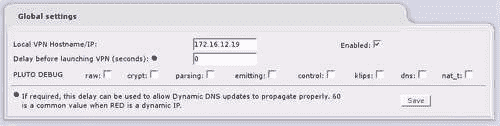
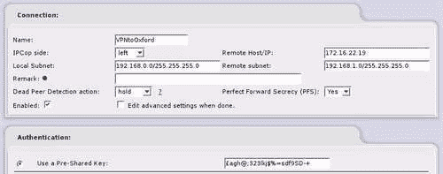
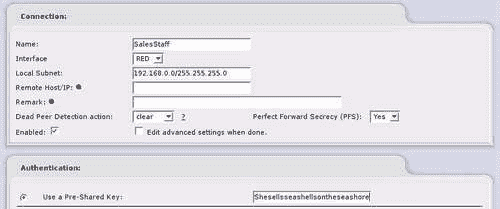
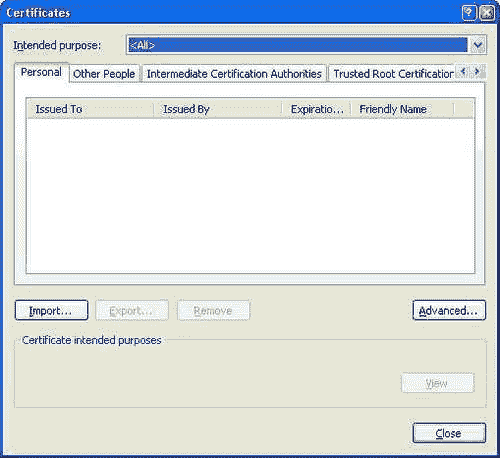
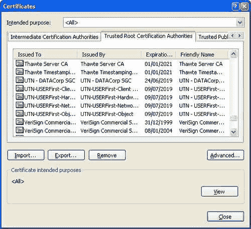
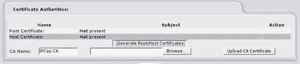
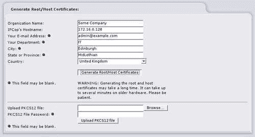
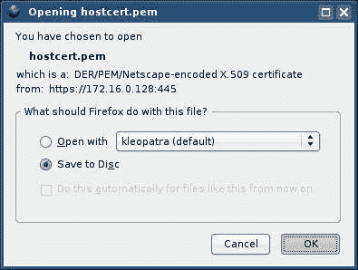

# 第七章 虚拟私人网络

正如前几章所讨论的，支撑网络运作方式的许多技术是根据与今天的 IT 专业人员和计算机用户面临的考虑截然不同的情况设计的。其中最突出的是安全问题。

远程访问是 IT 专业人员关注的另一个主要问题，它是允许员工、承包商、客户和供应商通过广域网或互联网访问资源和服务的做法。这种做法不仅涉及将公司的内部网络连接到互联网，还允许来自互联网的流量访问内部网络，因此带来了固有的安全风险。其中一些风险源于远程访问系统给攻击者探测和攻击网络的能力，而另一些风险源于传统上，信息是以明文形式通过互联网传输的，没有任何形式的篡改保护。

最后一个问题的含义是，如果我们使用传统的协议，比如 HTTP 或 NFS 来访问我们的信息，或者让他人通过互联网访问我们的信息，那么任何具有适当访问权限的人（即任何具有物理或逻辑访问我们网络基础设施的人——交换机、路由器、集线器、防火墙等）都可以拦截、阅读、复制或篡改我们的信息。

因此，与其简单地将诸如 HTTP 服务器、邮件服务器、文件服务器和终端服务或 VNC 服务器等服务直接暴露在互联网上，现在越来越多的做法是将这些服务安全地放在一个**VPN**或**虚拟私人网络**之后。

# 什么是 VPN？

顾名思义，VPN 是一个*虚拟*的*网络*。也就是说，与企业或小办公室的本地网络不同，后者通常包括成千上万码的电缆和许多网络设备，*虚拟*网络根本没有实体——事实上，它存在于现有网络之上。它也是私有的，这意味着在这种情况下它既是*加密的*（这样第三方就无法看到我们发送和接收的内容），又是*经过验证的*（我们需要用密码等方式来确认身份才能使用它）。

考虑一个涉及一家小公司的情景，该公司有少数销售员经常在国内外不同地方工作。销售人员需要定期将销售信息与其他在外和在内的销售员同步，以及发送和接收电子邮件和访问其他类型的公司信息。直到现在，这些服务只能在我们的防火墙后面访问。

销售员使用虚拟私人网络，将笔记本电脑连接到所住酒店的无线网络，使用电脑的无线适配器提供互联网访问。一旦通过 Wi-Fi 连接到互联网，他/她就连接到公司的 VPN，VPN 客户端软件建立了与公司 VPN 服务器的安全连接。笔记本电脑上出现了一个新的虚拟网络接口，分配给销售员笔记本电脑的 IP 地址对应于公司网络的内部段。

现在，前往内部网络的流量可以通过这个网络接口。通过这个接口的流量由 VPN 客户端软件封装并通过加密的 VPN 链路发送，然后在另一端由 VPN 服务器解封装并路由到内部网络。销售总监在公司总部的办公桌上可以看到销售员的笔记本电脑在网络上，就好像它实际上插在网络上一样，尽管访问速度稍慢！

这是对 VPN 软件实际工作方式的技术上的极度简化，但它在高层次上给出了这个过程如何发生的一个很好的概念。网络感知应用程序（如电子邮件客户端、FTP 客户端或 Samba 客户端）可以访问内部网络上的资源，而不必意识到网络连接，只需简单地进行与以前相同的连接即可——VPN 软件和驱动程序处理封装和解封装。公司越来越多地使用 VPN 进行与上述情况非常相似的场景，使用各种技术，包括**IP 安全**（**IPSec**）、**第二层隧道协议**（**L2TP**）、**点对点隧道协议**（**PPTP**）、SSH、SSL 以及一些专有协议，如专有 VPN 服务 Hamachi 使用的协议。

除了提供对另一个网络的访问之外，最近设置的一些 VPN 系统，例如 Hamachi 提供的或作为 Google Wi-Fi 服务一部分的 VPN 服务，只是在使用不受信任的网络连接（特别是公共场所的无线网络连接）时提供一些隐私保证（通常是未加密和非安全的）。

### 注

**专有互联网 VPN 服务**

Hamachi 的 VPN 服务（[`www.hamachi.cc/`](http://www.hamachi.cc/)）是互联网 VPN 服务中不断增长的一种，它只寻求为用户提供隐私（即用户无法访问互联网上不可用的*额外*资源，与我们的销售员和公司 VPN 不同），以保护用户在不受信任的网络连接上（如 Wi-Fi 网络）的隐私。

在这种情况下，流量被隧道传输到 VPN 连接所有者拥有的服务器，并且*额外*的隐私是通过假设这些所有者（如 Hamachi）不太可能试图拦截您的信息，而不是您通过不受信任的网络连接连接的其他用户（可能有支持此操作的政策）。

## IPSec

尽管许多 VPN 协议都在常见的部署中（PPTP 和 L2TP 由于它们作为 Windows 产品系列的一部分而广泛部署），IPSec 是最独立、标准化的解决方案，并以一种形式或另一种形式纳入了大多数 VPN 解决方案。

大多数支持 IPSec 的设备将与其他这类设备形成隧道，尽管这并不是保证——特别是具有此功能的低端设备（如 SOHO 路由器）通常非常难以配置和故障排除，并且通常对 IPSec 功能的制造商支持不佳。尽管 IPSec 应该是可互操作的，但在两端使用相同的设备通常可以避免很多麻烦！还值得注意的是，在谈到互操作性时，IPSec 只支持**主模式**IPSec，而不支持**主动模式**IPSec。

### 注

**PPTP 和 L2TP**

PPTP 最初由思科设计，后来由微软许可为 Windows 拨号网络的 VPN 协议（实际上是 Windows 中原生支持的第一个 VPN 协议）。流量使用**微软挑战-握手认证协议 v2**（**MS-CHAPv2**）或**可扩展认证协议-传输层安全**（**EAP-TLS**）（使用证书）进行认证，并使用**MPPE**（**RSA RC4**）进行加密。尽管 PPTP 通过证书加强了安全性，并且比 IPSec 复杂得多，但如果没有证书，它仍然比 IPSec 弱，并且受到较少的广泛实施。

L2TP 是 Cisco 的**第二层转发**（**L2F**）和 PPTP 的进化进程。它不实现认证或加密，因此通常与 IPSec 一起使用以形成 VPN。由于使用了 IPSec，L2TP/IPSec VPN 比使用 PPTP 更安全，并且存在使用更高级加密的潜力。

IPSec 本身的范围不仅仅是用于 VPN，它还是**IPv6**规范的强制部分。最初它是为两种部署场景而设计的：

+   **隧道模式：** 隧道模式中的 IPSec 旨在像前一种情况一样，将流量从一个以上的主机（或整个网络或网络）隧道到另一个主机或一组网络，端点用于在流经中间网络之前和之后封装和解封装流量，通常是互联网。

+   **传输模式：** 传输模式中的 IPSec 旨在一般保护 IP 通信。尽管可以在互联网上部署，但通常部署用于保护 LAN 段，无论是在需要加密特定主机之间通信的关键任务场景中，例如 Web 和数据库服务器，还是保护整个网络。这样的系统可以作为分布式防火墙策略的一部分来使用——通过配置网络上的所有主机只使用 IPSec 进行通信，任何未经授权连接到网络的主机都无法直接连接到其他主机，有效地将该主机隔离在网络的某一层。

微软采用这种设置作为其服务器和域隔离的一部分（有关在 Windows 平台上使用 IPSec 进行逻辑隔离的更多信息，请参见[`www.microsoft.com/technet/itsolutions/network/sdiso/default.mspx`](http://www.microsoft.com/technet/itsolutions/network/sdiso/default.mspx)），这是安全最佳实践的一部分，也是**网络访问保护**（**NAP**）和**网络访问隔离控制**（**NAQC**）框架的一部分。

正如我们所看到的，IPSec 是一个复杂的主题，可以用来做很多事情。然而，在本章的范围内，我们只需要知道 IPSec 可以用来保护 IP 流量，在这种情况下，IPCop 利用 IPSec 作为 VPN 系统的一部分，允许远程客户端通过互联网上的安全加密隧道出现为虚拟地连接到内部网络，以及一个或多个网络（例如客户的内部网络或酒店无线网络）。我们还可以使用 IPSec 来连接两个 IPCop 防火墙（或一个 IPCop 防火墙和另一个支持 IPSec 的路由器或防火墙），以形成一个*虚拟*站点到站点网络。以下链接提供了学习更多关于 IPSec 的绝佳起点：

+   [`www.packtpub.com/openswan/book:`](http://www.packtpub.com/openswan/book) 由 Openswan 开发人员编写的 Openswan 书籍

+   [`www.openswan.org/docs/:`](http://www.openswan.org/docs/) Openswan 文档

+   [`en.wikipedia.org/wiki/IPSec:`](http://en.wikipedia.org/wiki/IPSec) 维基百科关于 IPSec 的文章

## 关于部署 IPSec 的更多信息

对于希望充分设置、管理、维护或支持使用 IPSec 作为站点到站点部署的网络的任何人来说，对 IPSec 的基本理解都是重要的。

即使是比 IPCop 更少*亲身参与*的解决方案，例如商业防火墙与站点到站点 VPN 解决方案，也经常需要高级调试，这又需要对它们使用的协议有深入的了解。商业防火墙套件与 VPN 支持，如微软的 ISA 服务器、Checkpoint、Borderware，或者从小型 VPN 路由器到企业级防火墙的任何防火墙设备，通常很难进行故障排除。

特别是设备，由于它们在许多定制的免费 IPSec 软件实例中的使用，很难进行故障排除，因为它们与其他 IPSec 软件包相似，但经过 OEM 供应商的修改。维基百科在撰写时列出了九种不同的 IPSec 软件供应商。

出于所有这些原因（以及好奇心），您希望对为什么要学习 IPSec 有一些想法（或者没有想法！）。

我们可以在 IPCop 中以两种方式设置 IPSec：其中一种被称为具有**预共享密钥**的 IPSec；预共享密钥就像是已知于连接的两个端点的密码。虽然设置简单，但比第二种方式不安全，第二种方式依赖于由证书颁发机构（CA）颁发的证书。

### 注意

**预共享密钥与证书**

PSK 比证书不安全，因为它是一种固有较弱的安全机制。预共享密钥通常（像密码一样）被选择，因为它对人类来说是可记忆的，因此比证书更容易被暴力破解，证书包含高度随机的字符集，并且需要对公钥和私钥部分都有了解才能造成安全漏洞。

证书可以由 Verisign、Thawte 或 CAcert.org 等 CA 发行，或者您可以设置自己的 CA（要么仅用于生成这些证书，要么作为更大 PKI 系统的一部分）来完成这个过程。您不必为此支付费用，也不必经历（非常）痛苦的经历。

### 注意

**配置您自己的 CA**

如果您使用带有 Active Directory 的 Windows Server，您可能已经具备了一个灵活、安全的 PKI 系统的基础设施和软件，其中包括您自己的 CA。微软 TechNet 上有关于此的出色指导：

[`www.microsoft.com/windowsserver2003/technologies/pki/default.mspx`](http://www.microsoft.com/windowsserver2003/technologies/pki/default.mspx)

如果您使用另一个操作系统，或者更愿意将您的 PKI 环境与 Windows 基础设施分开，onlamp.com 在以下 URL 上有一个很好的入门指南：

[`www.onlamp.com/pub/a/onlamp/2003/02/06/linuxhacks.html`](http://www.onlamp.com/pub/a/onlamp/2003/02/06/linuxhacks.html)

运行您自己的 CA，特别是如果您开始依赖它来执行诸如 IPSec 和文件加密之类的任务，这在任何业务中都是一个极其重要的角色，如果出现问题，可能会给生产力带来大量的头痛，如果被破坏，可能会造成很大的损害。如果您决定采取这一步骤，强烈建议您阅读有关证书颁发机构最佳实践的信息，并听取一些在这一领域是专家的人提供的一些建议。

微软的指导虽然是针对 Windows 的，但在 CA 最佳实践方面提供了出色的指导，许多关于 CA 位置和管理、以及智能卡和 HSM 使用的建议，无论您选择在哪个平台和操作系统上运行您的 CA，都适用。至少，如果您没有 Windows 基础设施，值得看看*另一方*是如何做的（以及它的实施是否有任何价值），然后再决定是否自己建立这样的基础设施。

## 成功 VPN 的先决条件

对于站点到站点的 VPN，IPSec 设置过程也可能会有些混乱，因为术语。因此，在尝试设置 VPN 之前，将所需的所有信息都写下来是非常重要的。作者甚至建议使用易于理解的表格，比如下一页上显示的表格。

VPN 设置的绝大多数问题（其中许多令人沮丧并且需要花费大量时间）都是由于配置错误和不匹配的设置引起的。花几分钟时间制定部署计划，并清晰地在一张纸上标出您的设置，将为您节省宝贵的时间和理智。

我们的先决条件是：

##### 可靠的网络

由于 VPN 连接是通过中间网络（如互联网）进行的，它们的成功和稳定性取决于中间网络的可靠性。VPN 会给网络增加更多开销，任何延迟或低带宽都会在 VPN 上被（轻微地）放大。

##### 连接到互联网的两个端点运行 IPSec 软件

我们需要在两个端点上运行 IPSec 软件才能使站点到站点 VPN 正常工作！

##### 静态红色 IP 地址用于两个端点或动态 DNS 主机名

没有这些，我们就无法始终建立连接。虽然很少见，但一些 ISP 会为客户分配 RFC1918 范围内的地址，也就是说，192.168.0.0/16，10.0.0.0/8 和 172.16.0.0/12。虽然这种情况不太可能发生，但首先要检查你是否有一个真正的 IP 地址！

##### 不重叠的内部地址空间

没有重叠的地址范围，我们无法将流量从一个站点路由到另一个站点。

正如您可能已经从前一章关于网络的内容中了解到的那样，路由和路由对于将数据从一个网络子网传递到另一个网络子网非常重要。当计算机尝试连接到另一台计算机时——例如，连接到 192.0.2.33 上的 SSH 服务器——操作系统首先检查以确定这个 IP 地址是否是本地的。如果我们的计算机具有 IP 地址 192.0.22.99 和子网掩码为 255.255.255.0，计算机将使用 IP 地址和子网掩码的二进制进行计算，以确定 IP 地址的哪一部分是*网络*部分，哪一部分是*主机*部分。在这种情况下，IP 地址的前三个八位组（192、0 和 22）是网络部分，而第四个（也是最后一个）八位组是主机部分。

由于 192.0.2.33 地址的网络部分（192.0.2）与进行连接的计算机的 IP 地址的网络部分（192.0.22）不匹配，计算机无法通过交换机或集线器直接连接到目的地，因此必须将数据传递给路由器，以便直接将数据传输到目的地或通过一个或多个路由器传输数据。

路由表包含一系列条目，其中包含对应于 IP 地址的网络，通过这些子网可以到达。由于客户端计算机必须连接到*一个*路由器才能将数据发送到非本地机器，路由表中列出的每个路由器 IP 地址*必须*与客户机中网络适配卡分配的 IP 地址处于相同的子网中。一般来说，客户端计算机往往只有一个网络适配卡，只有一个（重要的）路由——即默认路由。这是客户端计算机如果在路由表中没有其他更高的条目，则将传输流量的路由器。

在大多数 Linux 发行版中，您可以使用`ip route list`命令显示路由表的输出，在 Linux 和大多数 Unix 发行版中，使用没有参数的`route`命令。在 Windows 中，使用`route print`命令将显示路由表。

在 VPN 配置中，我们的主机必须知道 VPN 连接的另一端是哪个子网，以及本地是哪个子网。因此，使用重叠的 IP 范围会破坏 VPN——如果我们有一个使用 192.168.0.1/24（或带有子网掩码 255.255.255.0 的 192.168.0.1）地址范围的网络，并且配置了一个使用 192.168.0.1/24 地址范围的网络的 VPN，我们的计算机或 VPN 路由器将无法将数据包从一个范围路由到另一个范围，因为它不知道主机 192.168.0.22 计算机在*哪个*192.168.0.1/24 地址范围内。

地址空间应该经过规划，如果您预计您的网络将来需要访问 VPN 或站点到站点 VPN，您应该选择一个非默认的私有 IP 地址范围（例如 10.0.0.0/8（10.0.0.1 到 10.255.255.255）范围，或者一个非标准的 192.168.0.0/16 子网（例如 192.168.130.0/24）以便在将来更容易地处理。

##### 时间和耐心

IPCop 使用的*left*和*right*术语可能会有些令人困惑——在这方面可以给出的最好建议是选择一个站点作为*left*，另一个站点作为*right*。下面的表格演示了这一点——一个站点清楚地标有**L**，另一个**R**。换句话说，*配置 VPN 的两端要相同！*

### 注

**IP 地址**

这些示例使用 172.16.0.0/12 地址范围中的*外部*地址—如果您在 Internet 上配置 VPN，您的实际红色*外部*地址将是您的 ISP 分配的*公共*地址。

为了本章的目的，我们将考虑在剑桥和牛津两个物理分离的位置之间的两个 IPCop 防火墙之间的网对网配置。在本例中，这两个主机被认为是设置为红-绿配置的 IPCop 防火墙，其互联网连接具有固定 IP 地址。

| 左侧站点 |   | 站点名称: ____ | 剑桥 _______ |
| --- | --- | --- | --- |
| 红色（外部）IP | ____172.16.12.19 | 网关（内部）IP | ___192.168.0.10__ |
|   |   | 内部网络 | __192.168.0.0/24_ |
| 预共享密钥: _____ | "不要和陌生人说话！" | ______________________________ | __________ |
| 右侧站点 |   | 站点名称: ____ | 牛津 _______ |
| --- | --- | --- | --- |
| 红色（外部）IP | ____172.16.22.19 | 网关（内部）IP | __192.168.1.1____ |
|   |   | 内部网络 | __192.168.1.0/24_ |
| 预共享密钥: _____ | £agh@;323lkj$%=sdf9SD-+" | _____________________________ | ____________ |

以下页面包含这些表格的空白版本，以便您可以，如果愿意，将这些表格用于您自己的环境。

| 左侧站点 |   | 站点名称: ____________________ |   |
| --- | --- | --- | --- |
| 红色（外部）IP | __________________ | 网关（内部）IP __________________ |   |
|   |   | 内部网络 __________________ |   |
| 预共享密钥: _______________________________________ |   |   |   |

注：

| 右侧站点 |   | 站点名称: ____________________ |   |
| --- | --- | --- | --- |
| 红色（外部）IP | __________________ | 网关（内部）IP __________________ |   |
|   |   | 内部网络 __________________ |   |
| 预共享密钥: ____________________________________ |   |   |   |

注：

首先，在剑桥防火墙上，我们使用红色 IP 配置全局设置：

接下来，我们添加一个新的 VPN 并选择**网对网虚拟专用网络：**

接下来，我们将 VPN 配置设置输入对话框：

### 注

**附加的 IPSec 设置**

**完美前向保密**（**PFS**）和**死对等检测**（**DPD**）是您可能希望考虑启用的两个附加设置。两者都需要 VPN 隧道两端的支持，但分别提高了安全性和有效的服务提供。

PFS 确保在 VPN 上使用的密钥被破解时，使用其他密钥加密的数据也不会受到威胁—密码学中完美前向保密的属性将数据泄露分隔开，以防密码学被破解，使攻击者必须破解会话生命周期中使用的*每个*密钥才能拦截或解密所有会话数据，而不是能够破解一个密钥并访问所有会话数据。

DPD 使用**Internet 密钥交换**（**IKE**）来查询 IPSec 伙伴，以确保其仍然活着。这确保了您的 IPSec 端点准确地知道会话的状态，因为它将检测故障并关闭连接（因此尽可能重新建立会话）更迅速。

接下来，我们添加 VPN 并验证它是否出现在主**VPN**对话框中：

一旦我们在牛津 IPCop 主机上配置了相同的 VPN（具有适当的配置信息），我们的 VPN 应该是可用的。

## 验证连接

在最近的 IPCop 版本中，VPN 页面上有一个清晰的指示器，指示 VPN 的状态。然而，在那之后，我们首先要查看网络状态屏幕，在那里我们应该看到类型为*ipsecX*的**UP** VPN 接口，其中 X 是一个数字（对于我们配置的每个 VPN，从 0 开始递增）。

我们还应该使用`route`命令或带有`r`标志的`netstat`命令（`netstat -nr`）检查路由表，以查看 VPN 隧道另一侧子网的路由是否存在。如果一切正常，我们可以尝试对远程侧私有子网中的主机进行 ping 测试。

通常，VPN 问题是由配置问题引起的，其中许多问题可以通过仔细注意合理 VPN 的先决条件来避免——其中一些例子是参数不匹配、子网重叠或存在网络配置问题。在尝试重新配置之前，重置现有的 VPN 配置总是值得的，如果有疑问，第二双眼睛通常可以帮助发现您忽略的错误。

如果您绝对确定您的配置匹配，并且您的网络已正确配置，那么可能存在互操作性问题。支持 IPSec 的不同设备经常不像预期那样一起工作，有时根本不起作用。SOHO 和嵌入式设备经常在与*正常*Openswan 安装和其他 IPSec 堆栈交流时表现出非常奇怪的行为。事实上，支持 IPSec 的廉价路由器经常只能与具有相同型号和相同固件版本的其他路由器通信，甚至不能与同一供应商的其他路由器通信。这是一个相当棘手的领域，通常并不是很有趣。如果有疑问，您可以控制的 IPSec 堆栈（例如 IPCop 的）或受支持的堆栈（例如您可能在受支持的 Cisco 路由器上找到的堆栈）通常值得额外的费用或努力。

尽管我们的设置没有涵盖这一点，但 IPCop 防火墙允许为 VPN 使用*动态*DNS 名称（如管理章节中所述）。正如 VPN 配置页面所示，IPCop 机器启动后，这些更新可能需要一段时间才能完成；因此，如果您的系统使用动态 DNS 和 IPSec，您可能希望在启动 VPN 之前配置 60 秒（或更长时间）的*延迟*，以防止 VPN 失败。如果主机启动的最初几分钟内始终发生故障，这也值得注意！

## 使用预共享密钥的主机到网络连接

我们的主机到网络或路由战士连接的程序与网络到网络配置非常相似。我们首先在**添加**对话框中选择适当的 VPN 类型：

然后，我们使用适当的参数配置 VPN：

值得注意的是，您只能使用 PSK 进行一次主机到网络连接。

## 使用证书的主机到网络连接

基于证书的 VPN 配置比预共享密钥复杂得多，但也显著提高了 VPN 提供的安全级别。

### 证书和 X.509 的简要解释

请注意，本书*不*对 X.509、证书或密码学进行详细解释——这里的信息旨在让您对 IPSec 的功能有一些了解，以便您理解它在什么情况下起作用——但更进一步，让您了解您*不*知道的东西，并且如果您认为重要，可以自行阅读。

这些都是非常复杂的话题，如果您使用这项技术，值得花费数小时甚至数天的时间阅读。维基百科几乎涵盖了这里提到的几乎所有技术术语的综合文章，虽然不具权威性，但通常是指向正确方向的极好指南，并且经常有出色的内容。

在这种情况下，证书是 X.509 证书，其起源于 X.500，这是一组用于目录服务的标准，包括协议**目录访问协议**（**DAP**），是 LDAP 的前身。

广义上说，目录服务是一组用于存储有关网络、其提供的服务以及其用户的信息的应用程序和协议，通常包括用户名、用户配置文件、登录信息、安全信息以及许多其他应用程序特定信息。

在目录服务系统中，*目录*是存储在目录服务器上的数据库，通常位于中央位置。该数据库通常包含用户、计算机和其他对象的条目，每个对象都有参数，例如用户的*用户名*或*分机号*。

X.509 证书类似于目录中的条目，因为它们在一个单一文件中存储了许多参数。X.509 证书中存储的参数包括一些强制字段，如序列号、主题、颁发者以及存储在证书中的密钥的信息，还有用于将附加信息合并到证书中的*扩展*，以及在 X.509 PKI 系统中加入功能。

X.509 系统使用证书颁发机构（CA）来发行和管理这些证书。这些 CA 通常存在于树的顶部，并且有一种层次结构。

如果您打开任何现代浏览器的副本，您已经将证书存储库（或者在 Windows 中，操作系统本身）集成到了浏览器中。在 Windows 中，可以通过 Internet Explorer 访问它，方法是点击**工具 | Internet 选项 | 内容 | 证书**，显示一个类似以下的窗口：

窗口顶部的标签指示正在查看的证书的*类型*，在这个例子中，所选的标签（默认标签）是**个人**证书，这些证书是由证书颁发机构颁发给用户或计算机的。这些证书可能用于使用**S/MIME**等标准发送签名电子邮件，或者使用 IPSec 访问 VPN。

与证书关联的私钥在这些情况下将被用来签署电子邮件以验证发件人（或者可能是签署电子邮件并使用其公钥加密给另一个 S/MIME 用户），或者用于认证到 VPN 服务器。

前一张图片中可见的最右边的标签是**受信任的根证书颁发机构**。

就像我可以验证发送给我的 PGP 签名电子邮件一样，如果我有发送者的公钥（在数学上，我可以建立电子邮件是由相应私钥的所有者发送的，这种方式不容易被破坏），我可以验证证书是由前一张图片中显示的*根*证书的一个关联私钥签署的。

由于密钥分发很困难，使用根证书签名非常重要，因为它使我们能够将所有信任放在一个地方。由于我们知道（理论上）VeriSign 只有在验证了他们所说的人的身份后才向人们发放证书，因此如果我们收到由 Verisign 的根证书签名的[joebloggs@somecompany.com](http://joebloggs@somecompany.com)的安全电子邮件证书，发送者是[joebloggs@somecompany.com](http://joebloggs@somecompany.com)（假设我们同时信任 Verisign 和 somecompany.com 的安全性）。

在线购物、电子邮件和许多其他事情的背景下，这是非常重要的！简而言之，这些签名使您的计算机能够根据签署证书的人以及我们是否信任他们和他们的证书发行过程来做出关于如何处理证书的决定。

HTTPS 使用 X.509 证书作为 SSL 的一部分，因此当您查看一个安全网站（URL 前缀为`https://`）时，您的浏览器要么认识到 SSL 使用的证书是由该地址的根证书颁发机构颁发的，要么不认识。在后一种情况下，浏览器通常会弹出一个错误——这可能是因为证书是为稍微不同的网址（例如，如果您访问[`www.gmail.com`](http://https://www.gmail.com)，该网址使用了不同 URL 的证书），或者因为证书是自签名的或由您信任的根证书存储中没有的根证书签名的（例如 CAcert，[www.cacert.org](http://www.cacert.org)，或者在没有完整一套受信任的根证书的设备上，比如智能手机）。

根证书包含在诸如浏览器之类的产品中，由开发它们的公司或组织自行决定——这是互联网上使用的 X.509 PKI 实现的许多缺陷之一。

回到 IPSec；IPSec 可以像 HTTPS 一样使用 X.509 证书来验证 VPN 中的客户端。请注意，与这些证书相关的密钥实际上并不用于加密 VPN 本身发送的内容，而是用于安全交换*会话*密钥，然后用于加密实际数据。完美前向保密性是其中一个原因——使用相同的密钥会使整个 VPN 容易受到威胁——但也有两种主要类型的加密密码可供使用。

一种常用于加密电子邮件或文件加密的方法使用公钥和私钥，被称为**非对称**密码，其中公钥用于加密数据，然后以只有私钥持有者才能访问的格式。这种密码非常适合用于像电子邮件这样的通信，因为您可以随意分发您的公钥，用户可以在世界任何地方离线加密信息发送到您，然后通过不受信任的网络发送给您。只有当您收到该信息时，它才会被解密。

另一种**对称**密码只使用一个密钥——相同的密钥用于加密和解密。由于涉及的数学问题，这些密码加密和解密速度更快，但由于只使用一个密钥，不太实用——密钥分发成为一个问题，因为在一个拥有大量人员的环境中，需要非常多的密钥才能让每个人都能与其他人安全通信——实际上是每个人对每个其他人一个密钥！

由于在快速数据流上使用非对称密码的实际性，诸如 IPSec 和 SSH 之类的通信会生成用于传输数据的对称密钥（使用诸如 RC4、AES 和 blowfish 的密码），然后使用非对称密钥（使用诸如 RSA 的密码）在会话完全建立之前交换用于此传输的密钥。

## IPCop 中的 IPSec 证书

IPCop 1.4.0 版本不仅包含基于证书的 IPSec 隧道的支持，还包含内置的 CA，以避免配置自己的 CA 或从第三方 CA 购买证书的麻烦！

因此，我们在配置基于证书的 IPSec VPN 的第一步是在 VPN **证书颁发机构**窗口中。在 IPCop 中，默认情况下，这将列出**根证书**和**主机证书**为**未出现**。

如果我们正在使用现有的根 CA（或配置站点到站点的 VPN），我们需要使用**上传 CA 证书**按钮上传证书文件，但对于路由战士配置（或在从另一个防火墙上传证书文件之前），我们首先需要在**CA 名称**字段中输入 CA 的名称，完成后，点击**生成根/主机证书**开始生成我们自己的根 CA 和主机证书的过程。

加载下一页后，我们需要填写我们希望 X.509 证书具有的参数。我们需要填写的参数是**组织名称，IPCop 主机名，电子邮件地址，部门，城市，州**和**国家**。

这些都应该是相对容易理解的-根据您的环境，您可能希望或不希望使用真实信息填写每个字段。输入的数据并不重要，但将被发放根或主机证书的客户端看到。填写此表单后，点击**生成**按钮。由于此步骤涉及生成证书，可能需要一些时间（取决于您的 IPCop 主机的规格）。在这一点上，可以随意冲杯咖啡。

完成此步骤后，您应该回到 VPN 配置页面，与之前相同，但有一个显着的例外，即表中的**根证书**和**主机证书**条目应该已填充，并且旁边会有按钮，允许您**下载根证书**和**下载主机证书**。

我们的下一步是下载主机和根证书文件的副本。我们可以通过点击表中它们条目右侧的软盘图标来完成。根和主机文件都应该保存在硬盘或网络共享的位置，而不是在进行配置的 PC 上打开或安装（除非这是您执行配置的主机）。

## 使用证书的站点到站点 VPN

完成了这种方法保存了我们的主机和根证书后，我们在另一个 IPCop 主机上执行相同的过程。完成后，我们将每个 IPCop 防火墙的根和主机证书导入到另一个防火墙的**身份验证**屏幕中，当我们创建站点到站点的 VPN 时，选择**上传证书**选项，而不是本章前面详细介绍的**使用预共享密钥**选项。

完成后，两台服务器将使用证书而不是 PSK 进行身份验证，这为我们的 VPN 配置增加了相当大的安全性。

## VPN 身份验证选项

在**VPN 身份验证**菜单中，配置 VPN 时我们有四个选项可用，这些选项会影响我们如何配置我们的客户端：

+   **使用预共享密钥：**如前所述，我们只能使用预共享密钥进行一次 VPN 配置，如果我们使用此配置，只需将选择的 PSK 输入到此字段中即可。

+   **上传证书请求：** 通常，在从 CA（包括 VeriSign 和 Equifax 等 CA）获取证书时，首先在将安装证书的系统上进行证书*请求*是一种常见做法。这是一个由原始系统生成的具有 X.509 证书的密钥，但没有由任何根 CA 签名，因此缺乏任何信任机制。通过将这个*请求*文件发送给 CA（并让 CA 处理它），我们可以收到相同文件的签名副本。这个响应文件必须重新导入到发出请求的机器中（其中包含已签名密钥的*私有*密钥部分），一旦导入，就可以组合成完整的证书（具有公钥/私钥）。在使用相同已签名证书的多台机器（如 Web 集群）的配置中，一旦证书响应重新导入，最终证书应该从原始机器中导出。

一些 IPSec 软件具有生成证书请求文件的能力。在这种情况下，我们可以在认证对话框中简单地选择**上传证书请求**选项，一旦 IPCop 处理了请求文件，就可以像处理根证书和主机证书一样从 VPN 页面下载证书。这个证书可以重新导入到客户端中。

+   **上传证书：** 如果 IPSec 对等端有我们希望使用的证书，比如我们正在配置与另一个 IPSec 主机的站点到站点 VPN，我们将以这种方式上传主机和根证书文件。通过将右侧的 IPCop 主机的主机和根证书文件上传到左侧的 IPCop 服务器，并将左侧的 IPCop 主机的主机和根证书文件上传到右侧的 IPCop 主机，我们使两个防火墙都意识到对方，并可以在网对网 VPN 中使用证书。

+   **生成证书：** 如果 IPSec 对等端自身不处理证书，也无法生成证书请求，我们可以从 IPCop 生成证书。这比使用证书请求略不安全，因为在使用证书请求时，私钥（用于使用证书的私钥）在任何时候都不会在开放网络上传输（即使恶意攻击者拦截了 CA 的证书响应，他或她也无法做太多事情），但如果我们打算在局域网上传输证书（或者在生成对话框中输入一个强大的 PKCS12 文件密码，用于加密证书），那么我们可以在一定程度上减轻这个风险。这个过程产生的证书可以像证书响应方法一样从 VPN 页面下载。

## 为 VPN 配置客户端

这是一个复杂的话题，在不同的主机平台上差异很大。IPCop Wiki 提供了 Windows 客户端的说明，这些客户端没有很好的内置 IPSec VPN 支持。

如果我们使用证书进行 VPN 配置，我们要么需要使用像 IPCop 这样有自己 CA 的客户端，要么使用 IPCop 创建证书，就像之前详细说明的那样。如果我们的 VPN 要求不太复杂，或者我们不想使用证书，我们可以使用 PSKs。

### 注意

**Windows 客户端配置**

有关 Windows 2000/XP 中的客户端配置，请参见：[`www.ipcop.org/modules.php?op=modload&name=phpWiki&file=index&pagename=OpenVPNHowto`](http://www.ipcop.org/modules.php?op=modload&name=phpWiki&file=index&pagename=OpenVPNHowto)。

Linux 用户可以使用与 IPCop 本身使用的相同软件包来建立与服务器的连接，Linux、BSD 和 OSX 用户应该查阅其操作系统文档，以找到在其环境中配置此项的最合适方式，因为对客户端操作系统的全面调查超出了本书的范围。

## 蓝区

从 1.4 版本开始，IPCop 已经支持蓝色区域，这是一个无线段，其防火墙规则比橙色或绿色区域更为激进，专门设计用于不受信任的无线段。这可以是一个开放的无线网络，只允许一些客户端访问其他网络，也可以是一个具有额外安全层的封闭无线网络，甚至可以是有线网络，不一定非要是无线的。

在过去几年里，无线安全一直备受关注。从对 802.11 标准提供的安全措施缺乏理解，到最初由 WEP 加密提供的安全性不足，无线安全仍然是许多 IT 部门和制造商的痛点。即使 WPA 在预共享密钥和企业（带有半径服务器）模式下提供了改进的加密，仍然不足以满足对机密信息要求强加密的监管要求和企业政策。

更好、更安全的无线标准（如备受期待的 802.11i 的 WPA2）承诺使用更好的今天技术的版本，具有改进的程序和更强的加密，但目前还没有，许多旧设备和客户端可能不支持它们。出于所有这些原因以及深度防御提供的安心感，建立 VPN 连接和/或在无线网络上使用 IPSec 往往是一个好主意。

传统上，这样的设置一直复杂且昂贵，但现在 IPCop 为家庭用户提供了丰富的企业级功能。

### 蓝色区域 VPN 的先决条件

为了建立一个有效的蓝色区域 VPN 设置，我们需要一个由 IPCop 支持的以太网卡，并配置适当的 IP 地址信息（即非重叠的私有子网），并配置 DHCP 服务器以分配正确地址范围内的信息（即与 IPCop 蓝色接口相同子网，并将蓝色接口地址作为网关和 DNS 服务器）。

### 设置

蓝色 VPN 的设置与路由战士 VPN 相同，只是配置*蓝色*接口而不是*红色*接口。

### 注意

**IPCop 蓝色 VPN Wiki**

IPCop 有一个专门用于蓝色 VPN 配置的 Wiki 页面，如果设置发生变化，应该进行更新；[`www.ipcop.org/modules.php?op=modload&name=phpWiki&file=index&pagename=IPCop140BlueVpnHowto`](http://www.ipcop.org/modules.php?op=modload&name=phpWiki&file=index&pagename=IPCop140BlueVpnHowto)。

# 总结

我们已经涵盖了 IPCop 防火墙和 IPSec VPN 的三种常见配置方案。虽然我们没有完全覆盖整个主题，但我们希望为您提供足够的信息，让您了解 VPN 的工作原理，并成功地配置（希望如此）您的 IPCop 主机以进行基于证书和预共享密钥的 VPN。有许多关于 IPSec 的好书，包括本书出版商（如[`www.packtpub.com/openswan/book`](http://www.packtpub.com/openswan/book)）撰写的几卷关于使用 Linux 构建 VPN 的书籍，由 Openswan 的开发人员撰写。

尽管 IPSec VPN 得到了广泛支持，但绝不是最容易配置的。基于 SSL 的 VPN，使用与 HTTPS 相同的加密技术，如 OpenVPN，由于相对容易的配置以及协议的简单性，正在迅速变得流行；IPSec，即使与 L2TP 等协议结合使用，也是复杂的，并经常被防火墙和网络地址转换所破坏。

OpenVPN 除了更容易防火墙外，还可以在任意数量的端口上运行，比如那些经常允许通过防火墙的端口，几乎没有应用层检查，比如 443 或 53。对于远程员工来说，PPTP 或 IPSec VPN 难以使用且不稳定，因此，OpenVPN 可能值得一看。不幸的是，这种易用性是有代价的——OpenVPN 目前还没有得到广泛支持，虽然 Windows 和 Linux 存在客户端，但并不常用，而且 IPCop 并不原生支持 OpenVPN（尽管有一个 OpenVPN 的附加组件）。

关于 OpenVPN 也有一些资源，包括一些来自这个出版商的资源（[`www.packtpub.com/openvpn/book`](http://www.packtpub.com/openvpn/book)），以及关于 OpenVPN 一般和与 IPCop 结合的无数在线 howto（[`home.arcor.de/u.altinkaynak/howto_openvpn.html`](http://home.arcor.de/u.altinkaynak/howto_openvpn.html)）。

希望有了这些材料和外部资源的链接，好奇的 IPCop 管理员现在有了所需的信息，可以更多地了解这个主题，并可能挑选一本特定主题的书来阅读！
