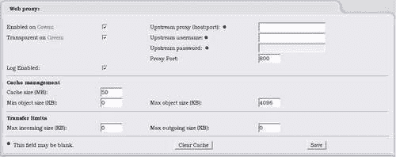
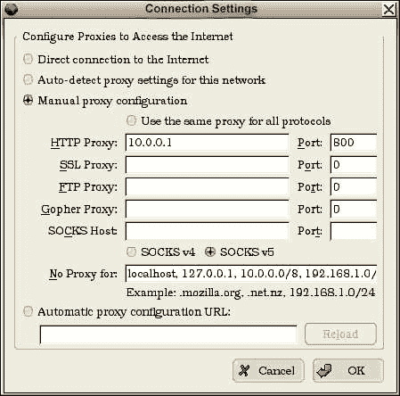
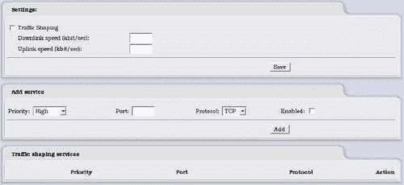
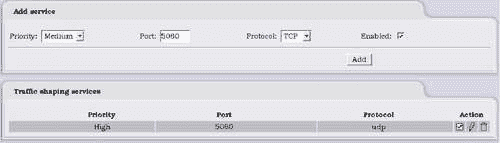
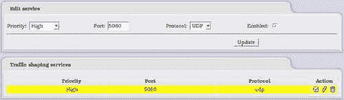

# 第八章。使用 IPCop 管理带宽

我们现在非常清楚 IPCop 不仅仅是一个基本的数据包过滤防火墙。我们已经看到了内置的入侵检测系统以及强大的 VPN 选项。我们还有另一个增加，就是通过几种不同的技术来管理流量，即流量整形和缓存。现在我们将看看如何在需要的地方使用这些技术来提高网络的性能。

# 带宽问题

目前大多数网络中通常会提供和使用多种不同的服务，并且可能会有多个链接到其他网络。由于有这么多的服务，我们可以很快地用尽带宽。确保您的网络上有足够的带宽供所有服务和用户使用的最简单方法是购买低争用率的快速链接。这是一个很好的理论，但经济现实要复杂一些，因为带宽可能很昂贵，可能是服务的主要开销。为了应对这一问题，我们可以与我们拥有的服务合作，尝试减少它们的带宽使用。

最初可以通过使用尽可能节省带宽的协议来减少带宽使用；然而，有时我们别无选择，必须使用由应用程序、供应商或用户指定的特定协议。这时，我们可以考虑减少该应用程序对网络的负担。我们可以使用一些技术和设备来做到这一点，每种技术和结果都有所不同。然而，IPCop 本身有一些简单的选项，可以帮助我们管理带宽。

# HTTP 问题

在整个互联网上，最常用的协议之一是 HTTP（尽管点对点文件共享应用程序正在迅速赶上）。大多数企业都有一个基于 HTTP 运行的网站作为他们的基本互联网存在，几乎没有不使用 HTTP 的互联网用户。我们可以非常有信心地认为这将是我们网络上使用的协议之一。

当涉及带宽时，HTTP 给我们带来了一个重要的问题——用户期望 HTTP 几乎是即时的。由于带宽拥塞而导致用户的网页浏览体验出现延迟，远非理想的情况，可能是网络用户首先会注意到（并抱怨！）缺乏带宽的地方。幸运的是，IPCop 为我们提供了非常强大的选项，以减少 HTTP 对网络的影响。

# 解决方案：代理和缓存

虽然代理本身并不是节省带宽的措施，但它是与带宽控制和监控相关的功能。代理允许您监视、修改和控制对 Web 内容的请求。您可以选择要记录和/或拒绝的流量，以及在通过代理时修改这些请求。由于代理位于 Web 客户端和 Web 服务器之间，它还可以执行一些其他功能，比如缓存。

在同一网络上的用户通常会访问一些相同的网站。这意味着每当用户访问网站时，他们将下载页面上的所有 HTML 和图像。如果这些内容只下载一次，然后以某种方式存储以供后续请求相同内容的客户端呈现，那对我们的网络显然是有利的。我们的浏览器在本地级别为我们做到了这一点，因此如果我们多次访问同一页面，我们的浏览器可能已经为我们缓存了本地副本。

这正是缓存代理会为我们提供的，但它会为所有人缓存。每当用户下载页面及其图片时，代理将在内存中保留一份副本（和/或将其写入磁盘）。每当出现对相同内容的请求时，代理不会将其传递给原始网站，而是为客户端提供文件的缓存版本的副本。我们可以大大减少带宽，特别是如果我们的用户访问许多相同的网站。这并不意味着您获取的信息将过时；网站可以要求代理不缓存时间相关的信息（股票信息、天气等）。

# Squid 简介

**Squid**是最有用和功能强大的 Web 代理和缓存系统之一。它是免费和开源的，这就是为什么它可以与 IPCop 一起使用。Squid 本身有相当复杂的配置文件，并执行各种代理和缓存功能。正如我们所期望的那样，IPCop 很好地抽象了这种复杂性，并让我们相对轻松地配置 Squid。

Squid 诞生于 Harvest Cached 的*分支*，Harvest Cached 是一个代理/缓存项目，并于 1994 年发布了其第一个版本，因此 Squid 的开发时间跨越了 10 多年。这导致了一个相当稳定和功能齐全的代理和缓存应用程序。原始的 Harvest Cached 项目已不再开发。

# 配置 Squid

IPCop 中的 Squid 配置屏幕非常易于操作，您只需点击几个框即可进行基本配置。

在这个例子中，我们只有一个绿色接口；但是，我们可以在所有其他接口上启用代理——除了红色接口，即互联网连接。

第一步非常明显；我们通过点击第一个复选框在需要的接口上启用代理，然后选择代理监听的端口（在 IPCop 中默认为 800，尽管 Squid 通常在端口 3128 上运行）。我们还可以勾选**启用日志**框，这是接口非特定的，因此我们要么记录所有内容，要么不记录任何内容。如果我们想要在某个时候监视代理，启用这个选项是个好主意。我们还可以通过配置**上游**选项将此代理链路通过我们的 ISP 提供的代理，例如，这些选项可能由 ISP 或其他代理服务提供商提供。可能需要连接的主机端口，以及用户名和密码。

透明代理需要更多的解释。传统上，代理在机器上的特定端口上监听，客户端必须配置为连接到此端口。例如，代理可以在 IP 地址 10.0.0.1 上监听端口 800。在这种情况下，我们将配置所有的 HTTP 客户端连接到此代理。Firefox 和 Internet Explorer 有网络设置对话框，我们可以在其中配置代理访问。Firefox 代理配置屏幕如下图所示：

这是一种简单的使用方法，但如果我们必须像这样配置所有的应用程序，这可能会变得乏味，特别是如果我们有许多需要以相同方式配置的机器。这就是透明代理变得有用的地方。代理不再监听一个端口并转发请求，而是监视通过机器的所有流量，并在检测到 HTTP 流量时尝试进行缓存。这也有一个缺点，即一些其他协议可能看起来像 HTTP，并且尝试缓存这些协议可能会破坏它们。如果我们启用了透明代理，不久后某个应用程序开始出现问题，关闭透明度作为初始步骤是值得的。这是一个罕见而具体的问题，但可能很难追踪。

# 缓存管理

缓存大小：我们希望缓存占用磁盘多少空间？这默认设置为 50MB，对于大多数小型网络来说是相当合理的。如果我们有很多用户，可能需要将其增加到几百兆字节。除非是真正大型网络，否则很少需要超过 1GB。此外，如果这个数字明显大于 IPCop 机器上可用的内存，那么我们将有大量的磁盘读/写，这可能会减慢速度。

最小对象大小：有时我们不希望缓存真正小的文件，因为这可能效率低下。然而，通常将其设置为零是一个好主意，因为这些文件的重复 HTTP 开销可能会影响性能。

最大对象大小：同样，我们可能不希望缓存过大的文件，因为这将很快填满我们的缓存，并导致我们陷入磁盘读/写问题，这是我们希望避免的。

通常应该使用前两个选项的默认设置，除非我们有特定的需求需要更改，例如用户不断下载相同的大文件。

## 传输限制

我们还可以控制系统中文件传输的最大和最小大小。除非有特定的情况需要这样做，否则这不是一个好主意，因为这可能会让用户非常沮丧。如果我们想要防止用户下载诸如 ISO 之类的非常大的文件，这将非常方便，以防止滥用网络带宽进行个人使用。

# 在没有缓存的情况下管理带宽

HTTP 并不是我们网络上唯一需要足够带宽的协议。例如，如果我们在网络上有在线游戏或语音和视频通信，这些服务通常由于其对时间敏感的使用而需要比其他服务更高的优先级。你不会希望因为网络上的某个用户正在下载大文件而与客户进行声音不连贯的对话，或者在家庭网络上，你不会希望因为有人决定开始收听在线广播电台而失去在线游戏中的高分。这就是流量整形的用武之地。

## 流量整形基础知识

为了确保服务质量（QoS），我们必须控制流量，使高优先级的流量被视为高优先级！通过流量整形，我们可以使用与数据包过滤相同的参数；然而，我们不是决定是否传递流量，而是对哪些流量享有最高优先级做出更复杂的决定，因此首先处理或给予比网络上使用的其他协议更多的带宽。

流量通常用于控制媒体服务。视频和音频服务严重依赖低延迟和充足的可用带宽，因此在网络中引入流量整形以适应这些服务是很常见的。

### 注意

ISP 利用流量整形

一些 ISP 像我们在这里描述的那样使用流量整形，以提供更好的服务给依赖带宽和延迟的服务。

还有另一种商业用途，即服务提供。ISP 可以进行流量整形（有些确实这样做），以便一个内容提供商的服务比另一个更好。例如，ISP 可以收费进行优先整形，如果 Google 为此服务付费，他们将确保他们的内容和服务比他们的竞争对手如 Yahoo!和 MSN 更快更具响应性。

这是一种有效地排挤竞争对手的方法，因为 ISP 的用户可能会选择*更好*的内容提供商。显然这并不完全符合 ISP 用户的利益，但对于 ISP 和可能为这些服务付费的内容提供商来说，这肯定是一项有利可图的投资。

## 流量整形配置

流量整形配置页面非常简单，可能会给我们提供更多选项，但我们有能力基于使用的端口进行整形，这使我们足够具体以区分大多数服务以进行流量整形。

**流量整形**旁边的复选框用于启用该服务。然而，在我们定义一些流量整形规则之前，这对流量不会产生任何影响。

我们还必须提供上行和下行速度。这是我们的网络可以传输数据的速度。常见上传和下载速度的快速参考如下表所示，这可能对我们的设置并不完全准确。建议我们测试自己的速度或咨询我们的 ISP 以获取更准确的信息。

| 连接类型 | 上行（kbit/秒） | 下行（kbit/秒） |
| --- | --- | --- |
| 拨号 | 48 | 56 |
| 电缆（1 兆） | 256 | 1000 |
| T1 | 192 | 1540 |

可以在这里找到更完整的不同服务及其上传和下载速度的指南：[`en.wikipedia.org/wiki/List_of_device_bandwidths`](http://en.wikipedia.org/wiki/List_of_device_bandwidths)。

## 添加流量整形服务

为了添加一个服务，我们填写三个必填字段，然后选择**启用**。点击**添加**会在底部窗格的**流量整形服务**中添加一行新的行。在这种情况下，我们已经添加了端口**5060 UDP**（SIP）作为**高**优先级，这将确保该服务在网络上优先处理。这些是相当基本的流量整形选项，我们没有能力定义端口范围或按 IP 地址进行整形。我们只能限制为三个优先级——低、中、高，并且端口一次添加一个。不需要列出所有将通过 IPCop 的端口，因为未指定的端口将默认以中等级处理。要删除此规则，我们只需点击右侧的垃圾桶；我们还可以使用**操作**标题下的复选框启用或禁用添加的规则。

## 编辑流量整形服务

为了编辑我们已经添加的服务，我们可以点击操作标题下的铅笔，这应该显示如下屏幕：

我们可以看到，我们的规则现在以黄色突出显示，以便清楚地知道我们正在编辑哪个规则，并且我们在上面的配置框中有原始参数。**添加**按钮也已更改为**更新**。我们现在修改任何我们需要的值，然后点击**更新**按钮，这将保存规则并将我们带回初始的流量整形屏幕。

对于 IPCop 还有其他可用的模块，可以进一步扩展这些功能，如果您有一些严肃的流量整形工作要完成，这是值得考虑的。

# 摘要

在本章中，我们已经介绍了使用 IPCop 进行缓存和流量整形以及如何配置这些功能。即使在最小的网络中，这也可能很有用，因为我们优先考虑服务访问，允许网络上的用户保证使用中的关键服务获得最佳的服务。在 IPCop 中进行这样做的选项相当基本，我们在控制方面受到限制。然而，我们已经看到，可以对服务产生影响，以改善我们的带宽利用率。
