# 第九章。定制 IPCop

IPCop 是市场上功能最齐全的 SOHO 防火墙之一，到目前为止，您应该已经熟悉了大部分功能，但您可能已经注意到了一些不足之处。也许有一些地方 IPCop 没有以恰当的方式执行某个功能，或者没有我们需要的特定功能。那么我们该怎么办呢？我们可以使用一些必要的插件来定制 IPCop。

# 插件

在其核心，IPCop 是一组基于 Linux 的工具，通过令人印象深刻的基于脚本的粘合剂粘合在一起。因此，毫不奇怪，我们可以修改、扩展和改进系统以满足我们的需求。这就是开源软件社区部分变得重要的地方，因为我们发现系统的用户已经开发了各种插件，可以安装和使用在 IPCop 上。

插件通常由第三方开发，即 IPCop 开发人员以外的人。它们通常是为了填补用户在软件中发现的某些空白而开发的，然后发布，以便其他用户可以从这项工作中受益并解决类似的问题。

我们将查看一些常见的插件，它们提供了什么，以及我们如何使用它们。我们可以在 IPCop 网站上找到插件的链接：[`ipcop.org/modules.php?op=modload&name=phpWiki&file=index&pagename=IPCopAddons`](http://ipcop.org/modules.php?op=modload&name=phpWiki&file=index&pagename=IPCopAddons)。

# 防火墙插件服务器

防火墙插件服务器允许我们使用简单、用户友好和基于 Web 的系统来管理一些 IPCop 的插件。为了在本章中使用插件，有必要安装它。

我们可以从[`firewalladdons.sourceforge.net/`](http://firewalladdons.sourceforge.net/)下载防火墙插件服务器包。

在撰写本文时，我们将使用文件：[`heanet.dl.sourceforge.net/sourceforge/firewalladdons/addons-2.3-CLI-b2.tar.gz`](http://heanet.dl.sourceforge.net/sourceforge/firewalladdons/addons-2.3-CLI-b2.tar.gz)

对于以后的版本，此位置可能会更改，与文件名相关的以下命令应更改以反映下载文件的名称。

首先，我们使用`scp`命令将此文件复制到服务器，指定端口 222，这是 IPCop 默认的 SSH 访问端口，并指定 root 用户。

```
 $ scp -P 222 addons-2.3-CLI-b2.tar.gz root@10.0.0.200:/ 

```

我们将被提示输入 root 帐户的密码，这是我们在安装 IPCop 机器时设置的密码。

现在文件已经就位，我们可以登录 IPCop 机器并对其进行设置。

```
 $ ssh -p 222 root@10.0.0.200 

```

### 注意

**P 与 p**

请注意，使用`ssh`时小写`-p`用于端口，而使用`scp`时大写`-P`用于端口。这种差异可能会变得非常恼人，并且可能导致难以发现的拼写错误。如果无法连接，请检查您是否对命令使用了正确的大小写。

输入 root 密码后，我们应该看到以下提示：

```
 root@ipcop:~ # 

```

现在，我们输入以下命令来设置插件服务器：

```
 # mv /addons /addons.bak
# tar xzvf /addons-2.3-CLI-b2.tar.gz -C /
# cd /addons
# ./addoncfg -u
# ./addoncfg -i 

```

命令完成后，我们登录到 IPCop Web 界面，应该会看到页面顶部的菜单中新增了一个选项。

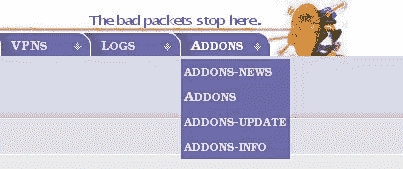

我们将查看我们的 Web 界面现在具有的一些新页面，以及它们提供的附加选项。

**ADDONS-NEWS**页面显示有关防火墙插件服务器及其提供的插件的更新。除了我们想要查看多少新闻之外，这里没有配置选项。它作为一个通用信息页面，使用从插件网站下载的重要新闻。

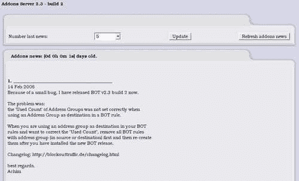

**ADDONS**页面提供有关已安装的插件和当前可用的插件的信息，并允许我们安装或删除插件。

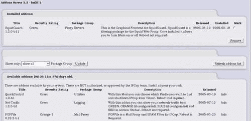

**ADDONS-UPDATE**页面向我们提供有关插件更新的信息，方式与**ADDONS**页面提供有关插件本身的信息相似，显示可用内容，并为我们提供了安装更新的方法。

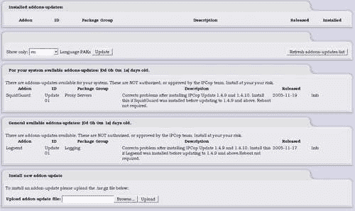

## 安装插件

现在我们熟悉了防火墙附加组件服务器的界面，我们可以开始安装和使用附加组件。我们将从 SquidGuard 开始，你可能已经注意到它在之前的截图中已经安装了。要安装附加组件，我们转到**附加组件**页面，向下滚动直到看到我们想要安装的附加组件。然后点击右侧的**信息**超链接，这将带我们到附加组件的详细信息和下载页面。对于 SquidGuard，这个页面是[`firewalladdons.sourceforge.net/squidguard.html`](http://firewalladdons.sourceforge.net/squidguard.html)。

在这个页面上，我们可以获得有关插件的详细信息，并提供当前版本的下载链接；在撰写本文时，当前版本是：[`heanet.dl.sourceforge.net/sourceforge/firewalladdons/SquidGuard-1.2.0-GUI-b11.tar.gz`](http://heanet.dl.sourceforge.net/sourceforge/firewalladdons/SquidGuard-1.2.0-GUI-b11.tar.gz)。这可能会更新，因此首先检查之前的链接！

我们下载附加组件，它以一个 GZIPPED TAR 存档的形式提供。然后我们返回到**附加组件**页面，点击**浏览**按钮，浏览到我们刚下载的文件，点击**上传**，附加组件就安装到服务器上了。

### 注意

注意：有时在上传附加组件时，特别是像 SquidGuard 这样会重新启动 Web 服务器的附加组件，我们可能没有页面自动刷新和/或连接可能会超时。点击**刷新**，或者在浏览器中点击**停止**然后**刷新**应该会把我们带回**附加组件**页面。

对于使用防火墙附加组件服务器安装的所有其他附加组件，流程是相似的，因此当我们查看其他附加组件及其工作原理时，我们无需重复这些步骤。

# 常见附加组件

现在我们将查看一些常见附加组件的配置以及它们的使用方式。由于我们已经安装了 SquidGuard，我们可以从这个附加组件开始。我们不会在本文中涵盖所有的附加组件，因为它们相当多。但是，我们将涵盖最常见和重要的附加组件。建议我们至少熟悉其他可用的附加组件，因为它们可能满足我们以后可能认识到的需求。

## SquidGuard

SquidGuard 是一个内容过滤插件，可以与 Squid 一起安装。它主要用于阻止不适当的网络内容，并可以配置一组动态规则，包括对各种主题的全面禁止和/或根据它们对我们网络上的受众的适用性进行黑名单和白名单设置。

SquidGuard 配置屏幕如下：

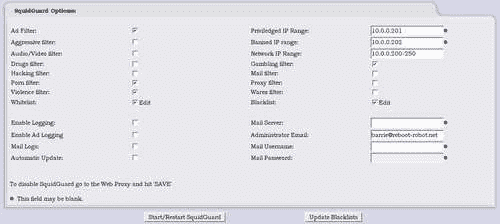

正如我们所看到的，我们可以根据 SquidGuard 配置中预定义的各种主题进行过滤。

在上面的截图中，我们选择了过滤广告、色情、暴力和赌博相关网站。

我们还配置了一些其他选项来帮助控制我们的网络使用。我们已经确定 IP 地址为**10.0.0.201**的机器是一个特权机器（可能是我们自己或管理员的机器），允许它绕过过滤器并无差别地访问网站。**10.0.0.202**处于**被禁止的 IP 范围**，是一台不允许通过这个 Web 代理访问任何互联网资源的机器。**网络 IP 范围**表示网络上的所有其他用户将受到之前配置的其他规则的约束。请注意，**网络 IP 范围**包括机器**200-250**；所有其他范围可以类似地指定，允许我们在必要时在规则中包含多个 IP 地址。

我们还有一些其他重要和强大的配置选项。如果我们允许白名单，然后点击**编辑**框，我们会看到以下屏幕：

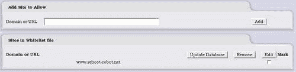

通过输入 URL 并单击**添加**，我们允许访问该域，而不管其他规则如何。在这种情况下，URL [www.reboot-robot.net](http://www.reboot-robot.net) 已被列入白名单。

黑名单配置屏幕与之前完全相同，列出的任何域都将被 SquidGuard 阻止，除了特权 IP 地址。

除了直接配置要阻止和不要阻止的内容之外，我们还有一些其他需要解释的选项。

+   **启用日志记录：**允许我们记录 SquidGuard 允许和拒绝的连接

+   **启用广告日志记录：**允许更详细地记录被阻止的广告

+   **邮件日志：**记录通过防火墙的邮件信息

+   **自动更新：**从 SquidGuard 网站下载用于阻止的 URL 的自动更新

+   **邮件服务器：**发送邮件给管理员时要使用的服务器

+   管理员电子邮件：发送日志的电子邮件地址

+   **邮件用户名：**如果邮件服务器需要身份验证，则使用的用户名

+   **邮件密码：**之前使用的密码

### 注意

**邮件设置**

您将注意到这些邮件设置作为任何提供与网络管理员通信的插件的一部分。值得随时保留这些信息，并可能专门为我们的 IPCop 机器创建一个电子邮件帐户/地址。

此页面上唯一需要的框是我们的**网络 IP 范围**和我们的**管理员电子邮件**；其他所有内容都可以选择配置（可选字段旁边有蓝色星号）。

在页面底部，我们有**启动/重新启动 SquidGuard**按钮，当我们已经根据需要配置了服务，并希望保存和在运行的机器上使用配置时，可以使用该按钮（诚然，这并不直观）。**更新黑名单**按钮允许我们下载更新的黑名单以供内容过滤选项使用。

配置完 SquidGuard 后，我们现在应该有一个有效的内容过滤系统，以确保网络上的用户不会访问被认为是不良的网站。

如果我们想要监视并控制怎么办？细心的读者可能已经意识到，当我们启用日志选项时，可能应该有访问这些日志的权限，可能是在 Web 界面中。如果我们将鼠标移动到**日志**上方，我们确实会看到**SquidGuard 日志**；点击这将给我们：

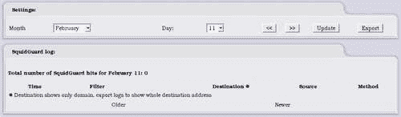

这使我们能够在类似于系统上默认日志的界面中查看 SquidGuard 日志。

## 增强过滤

增强过滤插件是最有用的插件之一，它解决了 IPCop 默认严重缺乏的一个功能。IPCop 的默认安装将允许从绿色接口到其他接口的所有流量出站，而没有任何过滤。通常希望控制用户可以从绿色接口访问的端口和 IP 地址。例如，我们可能希望阻止除网站运行的端口之外的所有出站连接。这将允许默认阻止点对点文件共享程序和即时通讯程序。这是防火墙的首选默认设置，我们在第三章中讨论过。增强过滤还允许对无线连接进行基于 MAC 的过滤。

### 注意

**基于端口和 IP 的阻止并不完全有效**

请注意，阻止应用程序使用的端口并不会阻止用户在另一个端口或通过位于 IPCop 受保护网络之外的代理服务器上使用该应用程序。同样，使用代理可以克服基于 IP 的阻止。应用层过滤增加了这种保护，但如果没有对网络上的内部资源进行严格控制，大多数网络级别的过滤机制都可以被绕过。

有关更多信息，请参阅增强过滤网页：[`firewalladdons.sourceforge.net/filtering.html`](http://firewalladdons.sourceforge.net/filtering.html)。

在撰写时使用的版本是从以下 URL 下载的，并且安装方式类似于 SquidGuard：

[`heanet.dl.sourceforge.net/sourceforge/firewalladdons/EnhancedFiltering-1.0-GUI-b2.tar.gz`](http://heanet.dl.sourceforge.net/sourceforge/firewalladdons/EnhancedFiltering-1.0-GUI-b2.tar.gz)

以下图显示了增强过滤配置屏幕，可以通过单击**防火墙|增强过滤：**来访问：

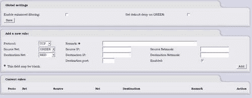

在这里，我们可以**启用增强过滤**或**禁用**它，以及**在 GREEN 网络接口上设置默认拒绝**。当我们介绍防火墙时，我们讨论了默认拒绝以及为什么它是一种更易管理和更安全的设置。

我们还可以为网络之间的连接添加特定的防火墙规则。我们必须提供源和目标 IP 地址，源子网掩码和目标子网掩码，网络和目标端口。

一个例子是只允许我们的邮件服务器向我们的 ISP 邮件服务器发出邮件，以便为网络中继邮件。我们将指定**源 IP**地址为我们的邮件服务器的 IP 地址，**目标 IP**地址为 ISP 的邮件服务器的 IP 地址，并设置端口为**25**。这意味着我们的邮件服务器可以向 ISP 中继邮件，但网络上的其他机器不能。这将有助于防止我们的用户使用外部邮件帐户，并防止带有恶意软件的机器发送恶意软件或垃圾邮件，而不经过我们的邮件服务器和潜在的邮件过滤软件。

正如我们现在所看到的，主要优势是我们可以非常具体地控制本地网络机器可以访问哪些服务器和这些服务器上的服务，这是 IPCop 本身默认不提供的功能。

### 蓝色访问

增强过滤插件提供的另一个选项是根据 IP 地址和 MAC 地址过滤蓝色（无线）接口。这是一种粗糙但相当有效的方法，可以限制对具有特定 MAC 地址的机器的无线接口的访问。MAC 地址是唯一的网络接口卡，并且是识别卡的相当有用的方法。MAC 地址过滤绝不是加密无线连接的替代方法，但是是一个有用的辅助措施。

### 注意

MAC 欺骗

MAC 地址很容易被欺骗，大多数常见操作系统都有工具来修改网卡的 MAC 地址。MAC 地址并不是在设备本身中修改，而是在操作系统中修改。例如，Linux 可以使用其默认网络配置工具`ifconfig`来做到这一点，而 Windows 存在许多工具来完成相同的任务。IPCop 有一个插件，可以在 GUI 中为红色接口提供 MAC 欺骗功能。

**蓝色访问**配置屏幕可以通过单击**防火墙|蓝色访问：**来访问。

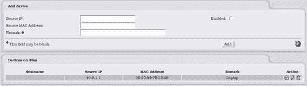

源 IP 和源 MAC 地址填充了被允许从这个接口访问网络的机器的信息，当启用复选框被勾选时，只有匹配列表的机器才能访问任何网络资源。蓝色设备列表中的机器是已被允许访问的机器。

## LogSend

LogSend 是一个插件，允许我们将日志从 IPCop 机器发送到各种管理员和/或 DShield 服务。这很有用，因为它允许我们使用外部工具更深入地分析我们的日志，而无需配置 syslog 服务器。

LogSend 网页位于：[`firewalladdons.sourceforge.net/logsend.html`](http://firewalladdons.sourceforge.net/logsend.html)。

撰写时使用的当前版本是：[`heanet.dl.sourceforge.net/sourceforge/firewalladdons/Logsend-1.0-GUI-b3.tar.gz`](http://heanet.dl.sourceforge.net/sourceforge/firewalladdons/Logsend-1.0-GUI-b3.tar.gz)。

**LogSend 配置**页面通过单击**日志 | LogSend**访问。

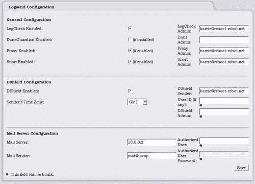

**LogCheck**的配置相对简单；我们可以选择启用服务，启用**DansGuardian**（由 Cop+插件提供）日志、**代理**日志和**Snort**日志的邮件发送。每个日志都可以发送到不同的管理员，但通常会使用相同的电子邮件地址，如上图所示。

### 注意

**DShield**

**DShield**选项可能需要一些解释。DShield ([`www.dshield.org`](http://www.dshield.org)) 是由 SANS（系统管理、网络和安全研究所：[`www.sans.org`](http://www.sans.org)）提供的服务。它汇总和分析来自世界各地数千个系统的日志，以获取关于最常被攻击的端口和最严重的攻击 IP 地址的详细信息。这是为了让系统管理员随时了解互联网的当前状态。发送到 DShield 的任何日志都将添加到该数据库中，如果我们注册了 DShield 帐户（发送日志不需要），我们还可以使用其在线分析工具来监视来自我们自己的入侵保护系统的数据。

LogSend 中的 DShield 配置功能使我们可以轻松使用 DShield 服务发送我们的日志。所需的只是启用 DShield，并设置发送日志时使用的时区和返回电子邮件地址。如果我们还提供我们的用户 ID，我们可以确保日志归属于我们的帐户，并在 DShield Web 界面上可用。**DShield 管理员**是任何日志信息将被发送到的地址。

我们还有熟悉的邮件服务器选项，可以提供要使用的邮件服务器、发件人和所需的任何身份验证凭据。我们在 IPCop 的其他领域也看到了这些选项。

## Copfilter

Copfilter 将 IPCop 从防火墙扩展为类似于 Symantec 和 MacAfee 提供的安全设备，试图保护我们的网络免受各种恶意软件的侵害。Copfilter 将监视 Web、FTP 和电子邮件流量，以便检测并阻止其中发现的恶意软件。

Copfilter 网页是：[`www.copfilter.org`](http://www.copfilter.org)。

撰写时使用的版本是：[`heanet.dl.sourceforge.net/sourceforge/copfilter/copfilter-0.82.tgz`](http://heanet.dl.sourceforge.net/sourceforge/copfilter/copfilter-0.82.tgz)。

Copfilter 安装是直接进行的，而不是通过插件界面。它的安装方式与防火墙插件服务器的安装方式非常相似。

```
$ scp -P 222 copfilter-0.82.tgz root@10.0.0.200:/ # provide password
$ ssh -p 222 root@10.0.0.200 # provide password
# cd /
# tar xzvf copfilter-0.82.tgz
# cd copfilter-0.82
# ./install 

```

然后我们应该看到以下输出：

```
============================================================
Copfilter installation -- Version 0.82
============================================================
WARNING:
This package is NOT an official ipcop addon. It has not been approved
or reviewed by the ipcop development team. It comes with NO warranty or
guarantee, so use it at your own risk.
This package adds firewall rules, proxies, filters, virus scanners
and precompiled binaries to your ipcop machine,
Do NOT use Copfilter if firewall security is an issue
Continue ? [y/N] 

```

它警告我们安装 Copfilter 会重新配置防火墙，并可能改变一些功能，可能会降低安全性。

### 注意

**复杂性和安全性**

这引入了一个重要的观点，我们在安装插件时应该考虑。我们向防火墙添加的代码和功能越多，出现问题的可能性就越大。软件错误会导致崩溃，更重要的是安全妥协。在我们用各种插件填充系统之前，重要的是要权衡功能带来的价值与系统中额外代码的潜在风险。

Copfilter 现在应该安装，当它设置自身时，我们会看到一些消息滚动。当 Copfilter 完全安装时，我们应该看到以下消息：

```
Copfilter 0.82 installation completed successfully ! 

```

如果我们现在登录到 Web 界面，我们应该看到新的菜单选项添加到 IPCop 配置站点。我们将在接下来的几节中看一下它们。

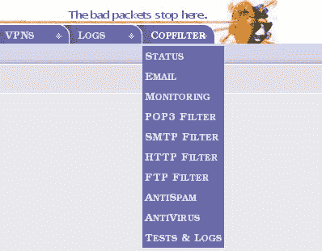

### 状态

**Status**屏幕为我们提供了有关使用 Copfilter 安装的工具的信息（又一个简单包中强大工具的集合！）。您可以在此处启动和停止所有服务。通过单击**Virus Quarantine**和**Spam Quarantine**按钮，您可以查看扫描软件保存的项目。

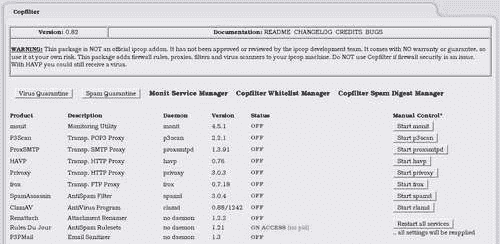

**monit**：允许我们比 IPCop 提供的基本状态信息更详细地监视系统，管理服务是一个重要的补充（[`www.tildeslash.com/monit/`](http://www.tildeslash.com/monit/)）。

p3Scan：用于扫描恶意软件的电子邮件代理服务器（**POP3**）（[`p3scan.sourceforge.net/`](http://p3scan.sourceforge.net/)）。

ProxySMTP：类似于**p3scan**，但用于扫描 SMTP。

HAVP：用于 HTTP 代理，允许扫描网站上的恶意软件（[`www.server-side.de/`](http://www.server-side.de/)）。

Privoxy：另一个 HTTP 代理，更专注于隐私和广告（[`www.privoxy.org`](http://www.privoxy.org)）。

frox：透明的 FTP 代理，允许针对 FTP 协议的功能类似于**HAVP**和**Privoxy**（[`frox.sourceforge.net`](http://frox.sourceforge.net)）。

Spamassassin：非常强大和可定制的反垃圾邮件软件。这是 ISP 常用的反垃圾邮件解决方案之一（[`spamassassin.apache.org/`](http://spamassassin.apache.org/)）。

ClamAV：用于与其他软件配合提供病毒扫描引擎的防病毒软件（[`www.clamav.net/`](http://www.clamav.net/)）。

Renattach：识别和重命名危险的电子邮件附件，如`.exe，.bat`和`.pif`，以防止用户意外或无意中打开危险文件（[`freshmeat.net/projects/renattach/`](http://freshmeat.net/projects/renattach/)）。

Rules Du Jour：用于保持 SpamAssassin 规则的最新状态（[`www.exit0.us/index.php?pagename=RulesDuJour`](http://www.exit0.us/index.php?pagename=RulesDuJour)）。

P3PMail：类似于前面提到的 p3Scan；但是它检测电子邮件中的危险 HTML 并将其删除（[`www.exit0.us/index.php?pagename=RulesDuJour`](http://www.exit0.us/index.php?pagename=RulesDuJour)）。

### 电子邮件

我们希望为本书的目的启用所有服务，但如果我们现在尝试这样做，许多服务将失败，因为我们尚未配置我们的电子邮件设置。如果我们点击**Copfilter | Email**，将会出现熟悉的**Email**选项屏幕，我们可以相应地填写。

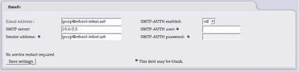

填写完这些内容后，我们可以开始启用和配置服务。

### 监控

**monit**在 Copfilter 中非常容易设置，并且是一个功能强大且可靠的工具。如**Monitoring**屏幕（点击**Copfilter | Monitoring**）所示，**monit**将不断监视运行的服务，并将在 60 秒内重新启动任何失败的服务。手动停止服务将导致该服务的监视被关闭。要为所有服务重新打开监视，需要重新启动**monit**本身。

我们可以在此配置窗口中打开**monit**。我们现在应该打开它，以便它可以监视其他服务，因此在下拉框中选择**On**，然后单击**Save**按钮。

### POP3 过滤

POP3 是常用的邮件协议，用于接收邮件。如果我们有用户从 ISP 的邮件服务器下载电子邮件，那么我们可以配置此屏幕以通过 POP3 过滤任何传入的邮件，并根据我们的需求进行调整。

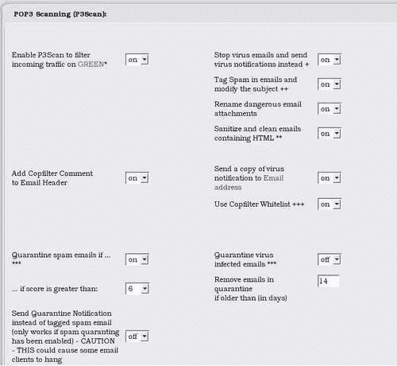

在隔离电子邮件或附件时，我们应该小心，因为这很快就会开始占用硬盘空间。如果我们为使用 IPCop 盒子而配置了低规格的机器，那么我们可能会在硬盘空间上遇到问题。如果这开始引起问题，只需备份 IPCop 配置并重新安装到更大的硬盘上。

按照上一图所示的方式配置此屏幕，然后点击“保存设置（并重新启动服务）”按钮。这将启用 POP3 扫描。通知将发送到我们在之前的电子邮件屏幕中配置的电子邮件地址。

### SMTP 过滤

乍一看，这个页面与 POP3 页面相同，但具有 SMTP 倾向（在这里我们应该配置相同）。然而，当我们向下滚动时，我们会看到：

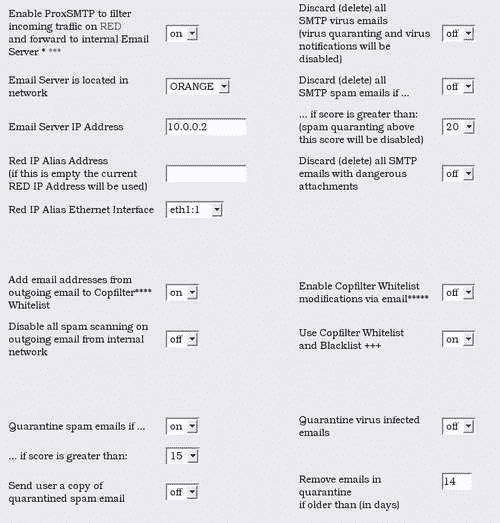

这为我们提供了一些额外的选项，主要与我们网络上的电子邮件服务器有关。我们之前讨论过使用 DMZ 和 IPCop 使用橙色网络作为 DMZ。如果我们的电子邮件服务器在 DMZ 中，我们可以将端口 25（或特定 IP 上的端口 25）配置为转发到我们的电子邮件服务器。由于这是 SMTP 过滤部分而不是端口转发部分，因此在电子邮件接近我们的服务器之前，我们也可以过滤所有电子邮件。这使我们能够保护我们 DMZ 中的机器免受攻击，并随后保护我们的用户，因为带有恶意软件的电子邮件永远不会触及他们的收件箱！

所示的配置选项是相当合理的水平，除非我们需要白名单或具体的隔离要求。

### HTTP 过滤（和 FTP）

Copfilter 的最消耗资源的功能之一是 HTTP 过滤，主要是因为 HTTP 流量涉及大文件和相当详细的扫描，而且 HTTP 是大多数网络上使用的最流行的协议之一。

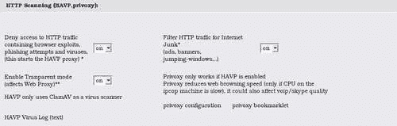

将 HTTP 代理配置为透明通常是一个好主意，因为这不需要重新配置客户机器。正如在此屏幕上所指出的，如果防火墙变得非常忙碌，这可能会对通过防火墙的应用程序产生不利影响。在繁忙的网络上使用 HTTP 过滤可能不是一个好主意，除非 IPCop 机器非常强大。如果在使用互联网时遇到缓慢的情况，请将 HTTP 过滤禁用为初始故障排除步骤之一。

FTP 过滤器设置非常简单，只需要从关闭切换到打开。它的工作方式与透明 HTTP 过滤器大致相同。FTP 过滤器使用较少，因为它比 HTTP 协议不太流行，现在有许多其他比 FTP 更受欢迎的文件传输方法。

### 反垃圾邮件

除了与恶意软件作斗争，我们还在每天邮箱中不断地与垃圾邮件的泛滥作斗争。幸运的是，Copfilter 对垃圾邮件的选项相对简单。

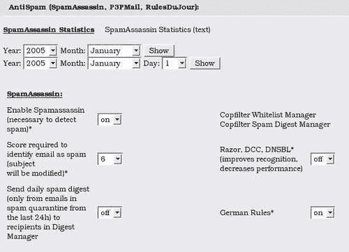

一旦启用，我们可以配置将电子邮件视为垃圾邮件的分数。每条消息都会被检查是否具有各种类似垃圾邮件的特征；它具有的特征越多，得分就越高。如果我们将此阈值设置得太高，那么我们将允许一些垃圾邮件通过，如果设置得太低，我们增加了误报的机会。默认设置效果非常好，应该使用，除非有大量垃圾邮件通过。我们还可以在此页面上配置贝叶斯过滤。但是这可能会消耗大量资源，不建议在提供许多其他功能的盒子上使用。打开德国规则将阻止德语垃圾邮件通过过滤器；这是因为最近发送的垃圾邮件大量使用德语。启用**Razor, DCC, DNSBL**选项将基于已知垃圾邮件站点的数据库进行阻止，这些数据库可能相当大，并且如配置屏幕上所述，它们可能会降低性能。

### 反病毒

ClamAV 在 Linux 系统上非常常用作病毒扫描器。然而，它涵盖了各种操作系统的病毒，显然其最大的签名数据库与 Windows 平台相关。因此，它非常适合保护网络上的 Windows 客户端免受病毒攻击。ClamAV 被用作 Copfilter 中其他工具的扫描引擎，因此当我们使用它时，其他服务已经在使用它了。

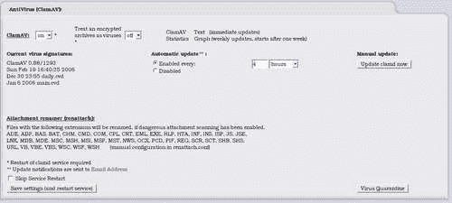

我们可能希望调整自动更新的应用时间，以及在安装后不久执行 ClamAV 的手动更新。我们还可以从这个菜单中向`renattach`配置文件添加其他文件扩展名，比如 WMF。这些文件将被重命名，以便不会因为双击而自动执行。

### 注意

**WMF 和媒体文件漏洞**

最近，微软 Windows 出现了一个非常严重且备受关注的漏洞，如果用户查看 WMF 格式的图像，就可以利用这个漏洞。这突显了一个经常被忽视的事实，不仅可执行文件可以包含可执行代码。

### 测试和日志

Copfilter 插件有自己的日志区域，遗憾的是选择不像其他插件那样在**日志**菜单中添加选项。在这个区域，我们可以查看和下载各种格式的日志；然而，它们太多了，不值得在这篇文章中进行覆盖。日志相对容易阅读和理解，而前面提到的项目网站上的文档将提供更多关于这些日志的信息。

这里还有三个重要的功能是测试按钮。

+   **发送测试病毒邮件：** 这个按钮发送一封带有 EICAR 测试病毒的邮件。

### 注意

**EICAR**

EICAR 是一个测试病毒定义，所有防病毒软件都能识别。它被用作校准工具，以确保我们的防病毒解决方案在不必通过网络发送病毒的情况下工作。

[`www.eicar.org/anti_virus_test_file.htm`](http://www.eicar.org/anti_virus_test_file.htm)

+   **发送测试垃圾邮件：** 发送一封应该被垃圾邮件过滤器拦截的邮件。

+   **发送测试邮件+危险附件：** 通过电子邮件发送一个危险的附件，以测试 renattach 的功能。

在信任设置保护我们网络资源之前，运行每个测试以及可能进行一些手动运行以通过过滤器发送测试非常重要。

## 运行中！

如果我们现在看一下状态屏幕，我们应该看到所有的服务都已经启动，并且正在被监控和控制。

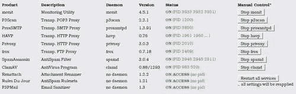

# 总结

我们已经看到 IPCop 不仅仅是一个简单的 NAT 防火墙。它可以处理多个网络区域，并独立对待每个区域。我们可以真正控制这些网络段如何相互通信。防火墙不仅仅可以进行过滤，它还可以控制、监控并报告网络的状态，为我们提供一个网络功能的全面视图，而 IPCop 可以满足这些要求。

我们还将 IPCop 视为类似于许多供应商昂贵商业产品的网络设备。在这方面，IPCop 可以处理高级防火墙和一些应用层或第七层过滤。我们之前讨论过这一点以及 IPCop 的第七层不足之处。现在我们看到了如何解决这个问题以及其他问题，以创建一个真正有用和强大的边界设备。

我们看了一下 IPCop 可用的各种附加组件，并对一些常用的和有用的选项进行了比较详细的了解。我们已经看到使用 IPCop 等开源软件的一些直接好处，比如它的简单可扩展性或“*可黑客化*”。我们介绍了一些使用 SquidGuard 的高级代理选项及其在 IPCop 上的使用。我们还看了 Copfilter——IPCop 最受欢迎的附加组件之一，它可以过滤许多常见的恶意软件和其他不良流量的协议。然而，我们只是浅尝辄止 IPCop 的附加组件，因为还有更多的附件组件。从在 IPCop 上安装 Nmap 到 SETI 客户端，应有尽有！值得探索可用的选项，因为这里介绍的只是常见应用的概述。
