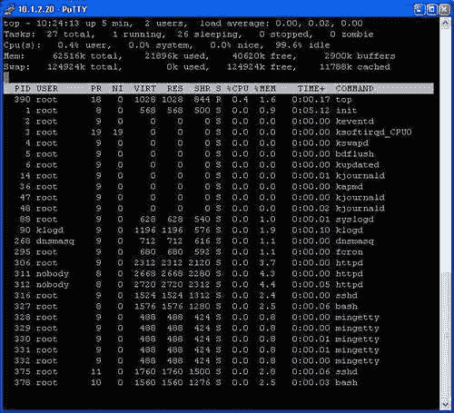
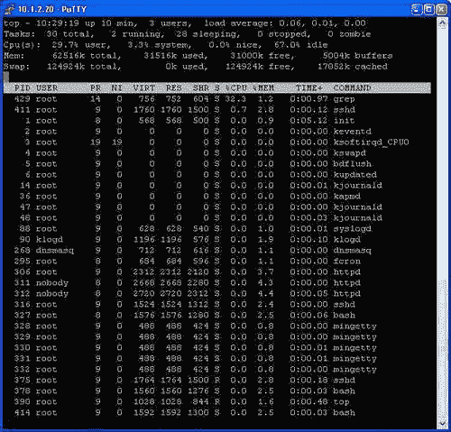
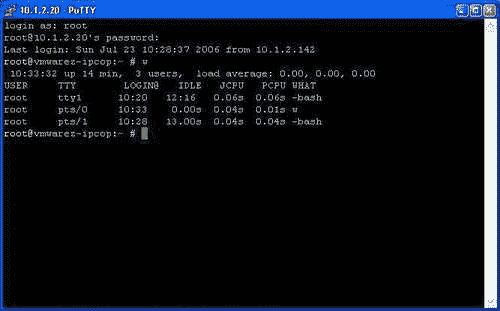

# 第十章。测试、审计和加固 IPCop

在本章中，我们将研究对安全和补丁管理的一些常见态度，并讨论在 IPCop 的背景下我们可能如何处理这些主题。我们还将讨论一些常见的安全风险，一些常见的安全和审计工具和测试，并找出下一步该去哪里。

# 安全和补丁管理

安全，非常宽泛地说，是保持我们的系统处于一种状态的过程，要么被认为是不可行的入侵，要么是对保持这些系统运行所带来的漏洞和风险的理解、管理，并且进行补偿或接受。与常识相反（对于一些人来说，也与直觉相反），没有绝对安全的系统。

在安全社区中有一个广为人知的格言，“安全是一种旅程，而不是目的地。”

世界上最好的安全顾问、程序员或 IT 专业人员只能够根据他们所使用的硬件和软件的能力来保护计算机系统。即使是一个完美设置、按教科书部署的安全软件包也存在风险，因为应用组件、操作系统组件或硬件可能出现故障，从而危及系统的安全。软件故障可能导致各种问题，它可能允许入侵者获取信息，导致系统功能异常，甚至控制系统。

一个相对无害的故障，仅仅提供给攻击者信息，可能会为他或她提供进一步研究计算机系统上运行的软件的其他漏洞所需的信息，导致进一步的妥协，可能导致控制系统。

此外，无论任何供应商、专业人士或开发者告诉你什么，都没有*解决方案，无论是闪亮的新软件、闪亮的新硬件、陈旧的安全专家，还是聪明的配置更改，都能解决你所有的安全问题。它们（可以）都有所贡献，但*没有什么是万能药*。

我们所能做的就是牢记这些原则，分层设置我们的环境，尽可能不依赖任何一种安全措施，并使损害得到限制。事实上，类似 IPCop 的防火墙在较大的组织中被用来隔离不同的网络和子网，正是出于这个原因。

使我们的系统尽可能安全的过程有两个重要的组成部分，我们在这里关注。

第一个，也是最基本的，是保持我们系统上运行的软件是最新的。如果我们运行的软件过时，因此存在漏洞，那么全面的防火墙策略、优秀的权限设置和强大的密码几乎毫无意义。虽然我们使用的大多数软件包中可能存在尚未被发现的安全漏洞，但如果我们（以及软件开发者）不知道它们的存在，入侵者知道的可能性也会降低。如果开发者知道这个漏洞（更糟糕的是，如果它已经被修补），我们应该自动假设任何想要入侵我们系统的攻击者也知道它。未打补丁的系统比打了补丁的系统要难以保护得多。

第二个，更困难的步骤是**系统加固**的过程。这可能涉及一系列步骤，从更改文件系统权限和制定防火墙策略，到在我们的系统周围设置入侵预防系统、物理安全措施（如锁和闭路电视），甚至定期备份（能够回溯并检查我们的系统看起来是非常重要的，通常对我们认为可能受到威胁的系统进行分析至关重要）。

## 为什么我们应该关注

对于一些读者来说，这个话题可能显而易见，而对于其他一些人来说，他们习惯于从不同的角度思考 IT 和计算机，可能并不明显。作者的经验是，非常有能力的经理、IT 专业人员和计算机科学家经常对计算机如何被滥用、这种滥用可能造成多大的损害以及这些事情有多容易实现毫不知情。

然而，暂且不考虑这种误解，有许多善意的经理、家庭用户和 IT 专业人员确实明白计算机可以被入侵，并且意识到他们可以做更多来保护他们的系统。这产生了一个广泛流传的最大谬论之一，这种观点通常由组织中具有很大影响力的人坚定地持有。这是一个*错误*的观点，对于任何重视赚钱能力并使用计算机来实现这一目标的组织（现在几乎是每个人），或者任何使用个人电脑进行诸如会计、在线银行业务或在线购物等活动的家庭用户。这种错误观点是基于这样的前提：计算机的唯一威胁是特定攻击者根据其身份选择公司，而作为家庭用户、小型企业或无聊的制造公司，一个人是免疫的。

当然，病毒、蠕虫、广告软件和间谍软件——安全和 IT 专业人员正在处理的四个最常见问题——与公司被针对无关，一些最大的（也是最昂贵的）事件处理结果导致形象丧失或法律责任，这是入侵者利用公司系统作为突破口进入其他系统的结果。这些问题对于家庭用户来说可能是毁灭性的，他们的信用卡被盗刷，遭受身份盗用，或者因为有人滥用他们的在线拍卖账户而承担法律责任。

在网络上对灾难恢复的许多论文进行快速调查，一遍又一遍地出现了不同版本的相同统计数据——*X%的公司经历 Y 天的停机时间后永远无法恢复* [*灾难*]。X 和 Y 在不同的论文中有所不同，但 X 总是一个两位数，Y 总是一个个位数。这一点就足以让你保护系统免受可能抹去你的数据并破坏你的业务能力的入侵者的影响——无论业务是指经营一家实际公司还是简单地能够报税。

所有这些都假设我们没有监管要求——探讨诸如 ISO 17799 之类的标准远远超出了我们的范围，许多法规和标准（包括 ISO 17799）包括有关业务连续性和灾难恢复规划的规定。

你有这本书并且正在阅读本章节的这一部分，可能意味着这段文字是在说已经被说服的人，但至少——希望你如果遇到还没有被说服的人，你可能会有一些有用的观点！

## 设备及其对我们管理 IPCop 的影响

现在我们已经简要探讨了安全性和灾难恢复的概念，我们可以继续讨论这实际上如何影响我们对 IPCop 的持续管理和保护。进入 IT 中另一个常见的失败，防火墙（以及打印机、交换机和路由器等网络设备）是一些最不受关注的设备。大多数中小型企业根本不对这些设备进行任何例行管理，经常留下可能暴露在互联网上的交换机和路由器，其软件版本可能存在入侵者可以利用的漏洞！诸如**简单网络管理协议**（**SNMP**）之类的服务，通常默认使用公共/私有社区字符串（类似于密码），经常允许入侵者悄无声息地完全控制设备（有时比通过设备的网络配置界面更有力）。

另一个常见的先入之见是，因为设备不是个人电脑，没有屏幕、键盘或鼠标，所以它不是计算机，也不需要更新。互联网的广泛用户群以及设计为路由器、防火墙等设备的产品数量并没有帮助改变这种忽视。

*设备*，一个不是计算机的计算机，对此有很大影响。*设备*广泛来说，是设计为在没有*正常*软件中心服务器所需的管理和更新的情况下运行的计算机。不幸的是，许多这些设备都基于类似于非设备设备的软件，尽管设备通常比设置为执行相同工作的等效服务器更加严格地锁定和保护，但它们并不免于类似的安全问题。

我们的 IPCop 系统设计为类似于一个设备。它完全由一个团队（IPCop 团队）设计和更新，它运行在个人电脑上，并且基于一个定制的正常操作系统，以提供非常特定的功能（并且几乎不暴露操作系统的运行情况）-因此在某种程度上我们需要将其视为一个设备。我们应该（与任何设备一样）通过固件更新我们的系统，并且如果我们希望它保持运行（并且可支持），我们仍然需要避免过多地研究防火墙的运作方式，但是了解其内部运作和工作原理对我们保护 IPCop 非常有益。

# 基本防火墙加固

首先，我们需要考虑 IPCop 在外部世界中的表现。任何黑客、渗透测试人员、IT 专业人员或分析师在评估特定设备构成的威胁时，无论他们打算修复它还是通过它进行入侵，第一步都是对该设备进行概要分析，以了解以下一些信息：

+   设备是什么

+   它运行的操作系统是什么

+   它可能运行在什么样的硬件上

+   服务器运行的服务，因此可以推断出...

+   服务器运行的软件（服务）以及基本操作系统之外的内容

+   以上任何内容（特别是服务）是否存在不安全的情况

作为合法的审计员、经理和 IPCop 系统的维护者，我们大部分信息都可以从记忆中获取，也可以从我们的文档或者登录到主机本身获取。对于攻击者来说，这些信息非常有价值，但情况并非如此，因此我们需要了解入侵者如何收集这些信息，以防止其这样做。

## 检查我们的防火墙对客户端的暴露

在评估我们的 IPCop 盒子在外部的样子时，最基本的工具是端口扫描器。正如我们在本书的前面所了解的，服务器可以打开任意数量的端口，以允许用户连接到其运行的服务。我们还应该知道，IPCop 可能默认情况下至少打开一个端口供内部客户端使用——端口 445，这是 HTTPS 通过 Web 界面进行配置的端口。端口扫描器非常简单地尝试连接到许多不同的端口，并查看它从哪些端口收到回复，将这些定义为打开的（即在另一端有活动）。

对于基础设施如防火墙进行端口扫描是进行安全审计或定期检查的重要练习，原因有几个。其中最显著的是我们可能并不总是知道我们的服务器在运行什么。我们可以通过在 shell 中使用`netstat`命令或通过 Web 界面查看我们的防火墙认为自己打开了哪些端口的列表。然而，如果我们之所以扫描我们的服务器是因为我们相信恶意入侵者可能已经在我们的防火墙上安装了软件进行不正当目的，那么这种软件有一个打开的端口（例如，允许入侵者重新连接并通过后门获得访问权限）可能会被`netstat`命令和操作系统的某些部分隐藏起来。

在这种情况下独立扫描系统是检测此类活动的少数方法之一，因此如果你对安全性很重视，定期进行这种扫描是一个好习惯；你永远不能太谨慎。

### 注意

**通过互联网进行端口扫描**

许多互联网服务提供商对通过其网络进行端口扫描有相当严格的政策，并会将任何此类活动视为非法，即使对自己的服务器进行端口扫描并不违法（而许多人认为对非自己的系统进行端口扫描是法律上的灰色地带，尽管越来越多地被视为犯罪活动）。更为合理的 ISP 将区分对自己系统进行端口扫描（显然是有同意的）和对他人进行端口扫描。然而，有些则更加武断（有些人会使用不自由这个词！）。

对于在 ISP 网络中传输此类活动进行密集扫描是非常耗费资源的，而且 ISP 很少会对不是发送到他们服务器（或者一般高价值系统）的流量进行扫描，因为这需要很大的开支。然而，在你考虑这样做并把自己置于不便或责任的风险之前，最好先检查你的 ISP 的条款和可接受使用政策！这些几乎总是可以在 ISP 的网站上找到，或者可以向 ISP 要求提供。

例如，BT（英国电信）宽带服务的 AUP（可在[`www.abuse-guidance.com/`](http://www.abuse-guidance.com/)上找到）中对端口扫描的规定如下：

“你*不得*运行”端口*扫描“软件，访问远程机器或网络，除非得到这些远程机器或网络的管理员或所有者的明确事先许可。这包括使用能够扫描其他互联网用户端口的应用程序。[...]”

“如果你打算运行端口扫描应用程序，你必须向 BT 提供从扫描目标获得的书面同意的副本，授权该活动。这必须在运行应用程序之前提供给 BT。”

这与大多数 ISP 发布的 AUP 类型相似，尽管有点官僚主义。

使用扫描器 Nmap 进行的示例扫描可能看起来像这样：

```
james@horus: ~ $ sudo nmap 10.10.2.32 -T Insane -O
Starting nmap 3.81 ( http://www.insecure.org/nmap/ ) at 2006-05-02 21:36 BST
Interesting ports on 10.10.2.32:
(The 1662 ports scanned but not shown below are in state: closed)
PORT STATE SERVICE
22/tcp open ssh
MAC Address: 00:30:AB:19:23:A9 (Delta Networks)
Device type: general purpose
Running: Linux 2.4.X|2.5.X|2.6.X
OS details: Linux 2.4.18 - 2.6.7
Uptime 0.034 days (since Tue May 2 20:47:15 2006)
Nmap finished: 1 IP address (1 host up) scanned in 8.364 seconds

```

从这次扫描中可以看到，Nmap 版本 3.81 默认扫描的 1663 个端口中有一个是开放的—端口 22，也就是 SSH 运行的端口。由于这是一个没有防火墙的 Linux 主机，Nmap 还可以检测系统的正常运行时间（使用 TCP 时间戳，RFC1323，[`www.faqs.org/rfcs/rfc1323.html`](http://www.faqs.org/rfcs/rfc1323.html)）。我们还可以猜测机器上次重启的时间，并且基于机器对 Nmap 在扫描过程中发送的各种非标准数据包的响应方式的特点，Nmap 可以对主机进行**操作系统指纹识别**（通过使用`-O`标志请求），准确度相当高。

Nmap 是一个非常强大的工具，也是全球最常用的 IT 安全工具之一。（新编写的）手册页（man Nmap，或者从网站上—[`www.insecure.org/nmap/man/`](http://www.insecure.org/nmap/man/)）不仅非常详细地介绍了工具的使用方法，还介绍了工具的工作原理和原因。

您可能想尝试其他扫描器，特别是在 Windows 平台上（Nmap 在该平台上安装有些麻烦，并且经常被服务包和补丁阻止工作），包括 Superscan（[`www.foundstone.com/index.htm?subnav=resources/navigation.htm&subcontent=/resources/proddesc/superscan.htm`](http://www.foundstone.com/index.htm?subnav=resources/navigation.htm&subcontent=/resources/proddesc/superscan.htm)）。

从内部网络查看 IPCop 防火墙的默认配置（即如果您从绿色区域对服务器进行端口扫描，或者如果员工、孩子或客户连接到公司网络进行了防火墙扫描），我们只会看到端口 445 是开放的。

许多端口扫描器（包括 Nmap）并不会扫描服务器上可能连接的每个端口，正如我们从前面的扫描中所看到的—Nmap 默认扫描 1663 个*常用*端口。这样做有两个原因：首先，我们发送（和接收）的数据越少，扫描速度越快；其次，我们发送和接收的数据越多，扫描就越容易引起怀疑（或者引起网络问题）—希望对于 Nmap 这样的合法用户来说不是一个问题！

由于通常只扫描众所周知的端口，因此，我们已经实施了一个实际的加固措施的实例—从 443 端口更改为 445 端口（这不是一个常见的服务端口）。这可能是“通过混淆来增加安全性”，但这*并不是坏事—除了使对该端口进行的任何连接更加明显（它们必须来自有意的连接尝试，而不是意外浏览或自动蠕虫通过 HTTPS 影响 HTTP 服务器），它确实会减少（微妙的）入侵者网络侦察的有效性。

*端口扫描*使我们能够从内部网络确定*防火墙上运行的服务*。

那么在外部呢？嗯，端口扫描在这里同样有价值（甚至更有价值）。

外部端口扫描允许我们测试互联网在我们的防火墙外部接口上看到的开放端口是否与我们在防火墙外打开的任何端口转发或漏洞对应。出于与内部主机端口扫描相同的原因，这是积极的安全策略的重要部分。

尽管我们可以通过 IPCop GUI 检查我们允许进入网络的端口，但端口扫描是另一种验证我们的端口转发是否转发到适当位置的方法。我们已经转发到网络内部主机的端口，如果在端口扫描中没有显示（被过滤），也可以通过这种方式进行识别；尽管我们可以在 Web 界面中查看哪些端口被转发，但我们无法验证这些端口被转发到任何地方。在一个大型环境中，我们可能不知道所有转发的端口，这可能是识别防火墙中不需要的漏洞（我们可以删除）的一种方式。

一些网站，如 Sygate 的([`scan.sygatetech.com/`](http://scan.sygatetech.com/))，将自动（免费）为您的主机进行端口扫描，并通过 Web 向您呈现结果。如果您的 ISP 有限制或者您没有另一台直接连接到互联网的计算机进行扫描，这将非常有用！

## 我们的防火墙上正在运行什么？

除了审计我们的防火墙以查看它正在监听哪些端口之外，我们还可以定期审计它，以确定防火墙上正在运行哪些进程。有几个软件包可以帮助我们完成这项工作。

在最简单的情况下，像`ps`命令这样的 binutils，可以列出系统上运行的进程，可以用来确定我们的系统在做什么。`top`命令可以实时显示进程，并可用于监视系统上的进程（例如监视不可预测的进程并找出导致性能不佳的原因）。

然而，`ps`命令并不适合这些情况。主要原因是：入侵者很容易用不显示恶意进程的版本替换`ps`命令（执行此类任务的一组工具通常被称为**rootkit**）。另一个原因是，比较`ps`输出相当耗时，并且需要对系统上的进程有相对详细的了解（即使`ps`输出没有直接被修改，许多恶意进程也可能伪装成合法进程）。

幸运的是，我们还有许多其他应用程序可以用来预防和检测系统被篡改的情况。其中第一个，也是在 Unix 和 Linux 系统上使用的较旧的工具之一，叫做 tripwire ([`sourceforge.net/projects/tripwire`](http://sourceforge.net/projects/tripwire))。Tripwire 是一个主机入侵检测系统（HIDS），它将监视系统上的特定文件（如系统二进制文件如`ps`和配置文件）。Tripwire 不是实时监控，而是在事后寻求检测这些更改。Tripwire 可以为我们提供这些事件的警报，用于安全目的和其他目的（如变更管理或仅仅是正常的 IT 流程的一部分）。

Tripwire 是一个开源工具，可以作为 IPCop 的附加组件使用。

对于这些情况的另一个有用工具是 chkrootkit ([`www.chkrootkit.org/`](http://www.chkrootkit.org/))。与 tripwire 一样，chkrootkit 检查系统上的文件，但 chkrootkit 是一个在用户请求时启动的脚本，专门用于扫描被识别为恶意的文件。尽管定期运行以进行验证进程很有用，但预防胜于治疗的古老格言仍然成立，负面扫描并不意味着系统是干净的。由于 chkrootkit 是一个脚本，您可以使用`wget`命令下载脚本，或者使用`scp` ([`www-hep2.fzu.cz/computing/adm/scp.html`](http://www-hep2.fzu.cz/computing/adm/scp.html))将其上传到服务器，并在服务器上直接运行新下载的副本。

### 注意

**SCP**

SCP，或安全复制，是包含在 IPCop 中的 SSH 服务器/客户端的功能的子集。在 Unix/Linux 命令提示符下使用`scp`命令，或在 Windows 上使用诸如 WinSCP（[`winscp.sourceforge.net`](http://winscp.sourceforge.net)）之类的工具，您可以访问 IPCop 系统上的文件系统并远程操作文件系统。尽管非常有用，但`scp`很容易被用于不良目的，因此应谨慎保护和保护 shell 访问。

# 高级加固

到目前为止，我们已经意识到可以对 IPCop 的操作和设置进行两个重大改变，以使其更加安全。首先，审计开放端口，使我们能够减少防火墙和系统对互联网的暴露。其次，利用某种形式的入侵检测或事后扫描系统，如 tripwire 和 chkrootkit，使我们更有可能检测到任何突破我们防御的人。

然而，加固我们的主机远不止是安装服务或运行一些端口扫描软件这么简单。保持加固系统涉及删除我们不需要的任何功能，以及对系统安全进行深思熟虑的更改。在这方面，IPCop 已经得到了相当大的加固，使其比任何主要发行版的默认 Linux 安装都更加安全。为了使 IPCop 更加安全，已经采取了一些步骤，包括以下内容。

## 堆栈破坏保护程序（Propolice）

**堆栈破坏保护程序**（**SSP**）（[`www.research.ibm.com/trl/projects/security/ssp/`](http://www.research.ibm.com/trl/projects/security/ssp/)）是用于创建 IPCop 和许多其他开源应用程序中的二进制可执行文件的 GCC 编译器的补丁集，由 IBM 的 Hiroaki Etoh 开发。SSP 有助于保护计算机软件中操纵*堆栈*的漏洞，堆栈是添加和删除数据的区域，如缓冲区溢出攻击。

在**缓冲区溢出**攻击中，攻击者可能利用软件中的漏洞将数据写入与分配给该数据的内存区域相邻的内存区域（如堆或堆栈）。当存在这种情况时，可能编写恶意应用程序以允许攻击者在系统上运行自己的（恶意）代码，从而一般会破坏安全性。

SSP 通过验证堆栈是否被篡改来保护堆栈免受攻击，并导致发生这种情况的任何应用程序出现**分段错误**并退出。因此，在 IPCop 上编译了这一功能的所有软件都受到一定程度的保护，以防止常用于利用系统的某些攻击类型。

## 服务加固

IPCop 默认删除了不必要的服务-许多操作系统，包括广泛部署的 Linux 版本和旧版本的 Windows 操作系统，运行了许多不必要的服务，这些服务对正常运行是不必要的。这些常见的例子包括 Windows 上的 IIS 服务器和 Linux 上的 Apache 服务器等 Web 服务器，以及在大多数部署中不使用的进程，如 finger、nfs、portmap、telnet 等。

由于每个这些进程都存在利用缓冲区溢出等漏洞来入侵系统的风险，因此消除的每个服务都关闭了潜在入侵的另一扇门。入侵可能是从 2001 年利用 IIS Web 服务器中的缓冲区溢出的 Code Red 蠕虫，到 2002 年利用 OpenSSL 握手过程中的缓冲区溢出来威胁 Apache Web 服务器的 Slapper 蠕虫，一直到恶意入侵者进行更精确的攻击。

如果我们不需要包括 SSH 或 Squid 在内的 IPCop 提供的服务，或者通过附加组件安装的服务，最好的做法是不启用它们，并最好将它们从系统中完全删除。虽然像 SSH 和 Apache 这样的服务通常暴露在互联网上，比起像 Squid 这样不常暴露的服务，风险要小一些，但任何不需要的服务都应该被移除。

# 日志文件和监控使用

作为良好安全管理的一部分，保留注意行为和信息系统使用趋势的能力非常重要，这使我们能够主动注意到变化。代理服务器使用、内存使用或 CPU 负载的变化可能表明一些无害的事情，比如用户活动增加或需要升级硬件、硬件故障，甚至是恶意活动。

## 通过图表建立基线

因此，建立服务器行为的*基线*是非常重要的，以便能够识别特定行为何时变得不寻常。IPCop 通过提供图形工具来监视（和绘制）代理连接和 CPU 使用率等统计数据，极大地帮助了我们。定期审查这些数据并解释任何主要的突变或行为变化对于您的主机的安全非常重要。

作者已经意识到了几种情况，其中系统已被入侵并用于恶意目的，并且在系统上游路由器的流量监控表明流量增加。随后的调查随后揭示了恶意活动，并导致服务器被关闭和清理。

## 日志文件

日志文件是安全管理的另一个重要部分，也是恶意活动的常见指示。管理员需要阅读他们的日志文件，并建立服务器产生事件的基线。例如 Apache web 服务器日志和`/var/log/auth.log`文件存储了认证事件，这些日志非常重要，通常提供有关尝试入侵系统、猜测密码或收集系统信息的宝贵信息。这可能包括尝试通过 SSH 服务器或 IPCop 管理界面等 HTTP 服务器使用暴力破解来发现用户名和密码。

### 注意

**审计 SSH 日志事件**

由于恶意蠕虫在线，对默认端口 22 的 SSH 服务器进行粗暴的暴力破解尝试是在线生活中非常常见的一部分。几乎任何连接到互联网的 SSH 服务器都很可能生成大量的日志事件，例如尝试使用 root 和 admin 等常见系统帐户登录失败。这些是相对正常的，并且有力地证明了将 SSH 移动到替代端口（IPCop 默认情况下）以区分这样的尝试和真正的入侵尝试是有道理的。

`/var/log/auth.log`中由 SSH 服务器上的暴力破解尝试引起的日志示例可能如下所示：

```
Apr 30 09:34:48 firewall sshd[28936]: Illegal user library from 217.160.209.42
Apr 30 09:34:48 firewall sshd[28938]: Illegal user test from 217.160.209.42
Apr 30 09:34:50 firewall sshd[28944]: Illegal user admin from 217.160.209.42
Apr 30 09:34:50 firewall sshd[28946]: Illegal user guest from 217.160.209.42
Apr 30 09:34:50 firewall sshd[28948]: Illegal user master from 217.160.209.42
Apr 30 09:34:53 firewall sshd[28960]: Illegal user admin from 217.160.209.42
Apr 30 09:34:53 firewall sshd[28962]: Illegal user admin from 217.160.209.42
Apr 30 09:34:53 firewall sshd[28964]: Illegal user admin from 217.160.209.42
Apr 30 09:34:54 firewall sshd[28966]: Illegal user admin from 217.160.209.42
Apr 30 09:34:55 firewall sshd[28972]: Illegal user test from 217.160.209.42
Apr 30 09:34:55 firewall sshd[28974]: Illegal user test from 217.160.209.42
Apr 30 09:34:56 firewall sshd[28976]: Illegal user webmaster from 217.160.209.42
Apr 30 09:34:56 firewall sshd[28978]: Illegal user username from 217.160.209.42
Apr 30 09:34:56 firewall sshd[28980]: Illegal user user from 217.160.209.42
Apr 30 09:34:57 firewall sshd[28984]: Illegal user admin from 217.160.209.42
Apr 30 09:34:58 firewall sshd[28986]: Illegal user test from 217.160.209.42
Apr 30 09:34:59 firewall sshd[28994]: Illegal user danny from 217.160.209.42
Apr 30 09:35:00 firewall sshd[28996]: Illegal user alex from 217.160.209.42
Apr 30 09:35:00 firewall sshd[28998]: Illegal user brett from 217.160.209.42
Apr 30 09:35:00 firewall sshd[29000]: Illegal user mike from 217.160.209.42

```

日志文件通常相对容易理解，而在这不成立的情况下，相关软件的文档（如 OpenVPN ([`www.openvpn.net`](http://www.openvpn.net))、OpenSSH ([`www.openssh.com`](http://www.openssh.com))和 Apache web 服务器 ([`www.apache.org`](http://www.apache.org))）通常非常好。

# 使用和拒绝服务

并非所有安全风险都源自软件和凭据的妥协。许多安全风险通常被称为**拒绝服务**或**DoS**攻击，影响计算机系统提供的服务质量，可能与系统妥协一样具有破坏性。如果您的防火墙关闭，无法向客户发送电子邮件确认业务交易，那么收入损失可能会大于如果您的防火墙被入侵者知晓交易的情况。

确保我们系统的安全性的一个极其重要的方面是确保它们运行的硬件是足够的，因此性能监控，如第五章中提到的，应该定期进行，并且应该对异常活动，如高网络或 CPU 使用率，进行核算。这样的管理是确保我们的防火墙不仅对简单攻击进行了保护，而且还能够抵御 DoS 攻击和使用量激增的重要部分。

如果一个性能计数器（或多个）出现异常高或最近急剧上升，我们可以做一些事情来排除问题。可能是，特别是如果我们的硬件规格较低（Pentium II 或更低）而我们的网络相对较快（五 Mbit 或更快），那么机器可能只是负载过重—使用 IDS（Snort）或代理服务器（Squid）将增加处理器的负载和内存使用。

## CPU 和内存使用情况

如果 CPU 使用率很高，我们可以首先查看哪个应用程序正在使用 CPU！虽然通过 Web GUI 没有太多有用的诊断信息，但幸运的是我们可以使用`top`实用程序来查看系统上正在运行的进程，以及它们正在使用的内存和 CPU 时间的百分比等统计信息。



虽然看起来可能有点吓人，但`top`命令的输出相当合乎逻辑，并且在您查看时会动态更新。上面的`top`输出来自一个干净的 IPCop 1.4.10 系统（没有配置代理服务器或 IDS），大多数列出的进程都是不言自明的。

以字母`k`开头的进程都是（在本例中）内核进程。`sshd`，毫不奇怪，是 SSH 服务器进程（`d`代表**守护进程**，在 Unix 和 Linux 术语中基本上意味着服务器进程）。`httpd`是提供基于 HTTP 的 GUI 的进程；`dnsmasq`既是 DNS 又是 DHCP 服务器。`syslogd`保留系统日志，`mingetty`和`bash`都是处理和提供基于文本的控制台的进程。

在这种情况下，CPU 使用率非常低—**99.6%空闲**，**0.4%**的实际使用率仅归功于`top`！因此，我们可以得出结论，这个系统没有性能相关的问题（或者它们是如此普遍，以至于`top`本身受到影响并提供虚假输出—这几乎是不可能的，除非系统已被入侵，`top`本身被攻击者替换）。

在下面的例子中，我们可以看到 CPU 使用率为**29.7%**—有第二个 root 登录（通过 SSH 登录的每个用户将会出现一个新的`bash`和`sshd`进程），负责运行`grep`命令（在文件或大量文件中查找特定的文本），这个命令使用了大量的 CPU 时间（可能也使用了大量的磁盘时间）。这是本例中的第二次登录，运行的`grep`命令（它将消耗 CPU 时间并使用磁盘，但不应该破坏任何东西）是从文件系统的根目录运行的（在命令行中`cd/`）。



了解系统上正在运行的进程是一个好主意。虽然许多入侵行为将涉及替换二进制文件，比如运行`ps`和`top`的文件，但通常情况下，即使入侵者没有对系统进行 root（管理员）访问，也会有通过`ps`或`top`可见的正在运行的进程。不可见的进程，或者像`ps`和`top`这样的二进制文件的修改版本，可能会被 chkrootkit 等应用程序检测到。

如果您的 Squid 代理、HTTP 服务器或其他进程大量使用 CPU 或内存，您可能会遇到需要关注的问题（或者可能是攻击者）。我们还可以使用`ps`命令列出系统上运行的进程，尽管 IPCop 中包含的`ps`命令是 busybox 工具包的一部分，比大多数 Linux 系统中包含的*真正*（binutils 版本）`ps`命令功能更弱。

## 已登录用户

我们可以使用`w`命令查看通过 SSH 登录的用户，如下图所示：



正如我们所看到的，有三个`root`用户登录的实例：第一个在`tty1`上，登录到 IPCop 主机本身的物理终端上，而`pts/0`和`pts/1`终端都是虚拟终端，通过 SSH 访问。**WHAT**列显示用户当前交互运行的进程——在第二个会话中，是`w`（w 将在枚举系统上运行的进程时检测到自身在运行），而其他两个会话都在`bash`，这是命令行本身的名称（即另外两个用户要么处于空闲状态，要么在命令行上输入而没有特定的应用程序在`前台`）。

Linux 系统管理的掌握是复杂的，但 IPCop 配备了一些简单的工具，如`top, ps, w, netstat`和`route`，它们可以分别显示实时和快照的进程信息、已登录用户、网络连接和路由表。对这些工具的了解以及对网络和 Linux 操作系统架构的基本理解将在诊断问题、分析入侵和解决性能问题方面帮助我们很多。

## 其他安全分析工具

除了我们提到的工具之外，还有许多其他工具可以帮助我们分析防火墙的状态并寻找安全漏洞。许多较小的实用程序，如 Nmap，具有非常具体的目的，而一些工具的范围更广。作为一个安全扫描程序，Nessus 由于其使用范围而值得特别关注。Nessus 汇总了许多不同的安全漏洞，并有能力在一个主机或整个网络上寻找这些漏洞。

Nessus 报告的一些漏洞可能是误报，而在这些情况下，Nessus 可能不确定是否存在特定的不安全配置。或者，误报可能是一个应该被禁用的已启用功能，但实际上正在使用。无论哪种情况，Nessus 虽然有用，但是需要谨慎使用，特别是在像 IPCop 这样的系统上，它被精心设计成不以相当正常的方式进行维护。

然而，在您的 IPCop 系统以及其他系统（如服务器、工作站、打印机、交换机和无线接入点）上，Nessus 能够发现各种各样的安全漏洞和常见的配置错误。在[`www.nessus.org/`](http://www.nessus.org/)了解更多关于 Nessus 的信息。

# 下一步去哪里？

你可能觉得自己生活在一个真空中，无法获得有关安全等问题的帮助，也没有足够的信息来进一步了解这些话题。幸运的是，情况并非如此，在线资源中有大量关于安全话题的信息。这里已经提到了一些很好的例子。

## Full-Disclosure

如果有一个在线安全社区的中心，你可以很有说服力地认为它是 Full-Disclosure。

作为对其他经过审查的邮件列表的回应，这些列表中的信息并不是自由可得的，审查是在线安全讨论的例行部分，Full-Disclosure 的概念提倡信息的完全可得性，正如列表的名称所暗示的那样，邮件列表提倡这些理念。

因此，根据这些原则，该列表完全没有经过审查（除了极少数高度反社会行为，如垃圾邮件或重复且令人不快的冒犯行为），并且促进了有关安全的所有信息的全面可用性。Full-Disclosure 是一个繁忙的列表，由来自安全社区各个领域的人员组成。有关 Full-Disclosure 宪章的更多信息，请访问[`lists.grok.org.uk/full-disclosure-charter.html`](http://lists.grok.org.uk/full-disclosure-charter.html)。

## 维基百科

尽管维基百科通常不被视为安全专用信息来源，但许多有关技术主题如 TCP/IP、防火墙和计算机安全的文章都非常好，而计算机安全文章是一个很好的起点，因为它链接到了维基百科文章和非常全面的第三方资源（参见[`en.wikipedia.org/wiki/Computer_security`](http://en.wikipedia.org/wiki/Computer_security)）。

## SecurityFocus

尽管不是供应商中立（SecurityFocus 归杀毒软件供应商赛门铁克所有），SecurityFocus 是一个很好的门户网站，有许多由知识渊博的贡献者撰写的好文章。SecurityFocus 也是许多好的邮件列表的主页，包括著名的 Bugtraq（请参见[`www.securityfocus.com`](http://www.securityfocus.com)）。

## 文学

有许多关于安全的好书，涵盖了广泛的主题。其中一些非常广泛，很快就会过时，而一些则涵盖了极为详细的主题。关于不同主题的（相对）备受推崇的书籍的随机选择如下：

*Counter Hack Reloaded: A Step-by-Step Guide to Computer Attacks and Effective Defenses, ISBN 0-13-148104-5*

这本由 Ed Skoudis 和 Tom Liston 撰写的备受赞誉的书籍代表了对计算机安全的相当全面的概述，从网络开始，涵盖了 Unix 和 Windows 环境中的操作系统安全，网络侦察，软件缺陷以及各种攻击和黑客技术。这是一本很好的、严肃的、易于理解的技术性安全入门读物。

*The Art of Deception: Controlling the Human Element of Security, ISBN 0-47-123712-4*

这本由 Kevin Mitnick 撰写的非技术性书籍涵盖了社会工程学的主题，即通过操纵人来破坏计算机系统。这包括电话呼叫、冒充员工、假装来自公用事业公司，甚至贿赂，以获取对计算机系统的物理和逻辑访问以及有关它们的信息。

*Hacking Exposed 5th Edition, ISBN 0-07-226081-5*

这本第五版的相对技术性书籍代表了对多种不同技术的黑客行为的广泛观点。尽管它的封面和态度稍微有些耸人听闻，它不会在一夜之间教会你所有关于黑客或计算机安全的知识，但它确实涵盖了一些安全领域的基本主题，并且实际上演示了计算机是如何被破坏的，对于新手来说是一个不错的起点。

*TCP/IP Illustrated 3 Volume Set, ISBN 0-20-177631-6*

这本由 Richard W. Stevens 撰写的经典书籍经常被誉为 TCP/IP 网络的*the*书籍，并且是关于 TCP/IP 工作原理的极好（尽管在某些地方非常技术性）的入门读物。除了在网络章节中提到的 IBM 红皮书第七章之外，对于任何对安全感兴趣的人来说，这都是值得一读的，因为（特别是关于防火墙）了解网络工作原理对于理解网络计算机系统的安全至关重要。

*Linux Server Security, Second Edition, ISBN 0-59-600670-5*

这本相对技术性的书籍是关于 Linux 服务器安全的极好入门读物，从文件系统权限和数据库安全到 iptables。对于任何对运行 Linux 服务器感兴趣的人来说，这都是值得一读的。

*《网络安全监控之道：超越入侵检测》，ISBN 0-32-124677-2*

这本由安全公司创始人 Richard Bejtlich 撰写的相对技术性的书籍不仅涵盖了传统入侵检测的缺陷，还涵盖了对网络、安全或防火墙管理员至关重要的许多技能，比如使用`tcpdump`和 IDS 分析工具。

# 总结

最重要的技能不是掌握如何保护（或仅仅管理）任何计算机系统，而是在需要时能够尽可能短的时间内找到所需信息的能力。往往这些信息是可以在线获取的——如果你知道去哪里找——而且像这样的书籍通常会为你提供足够的知识，让你能够自行学习更复杂的主题。类似于我们之前提到的网站，比如维基百科和 SecurityFocus，以及 Full-Disclosure 和 SecurityFocus 邮件列表等邮件列表，都是很好的起点，每天都会发布广泛的用户和内容类型。

即使你不成为常规用户或发帖者，如果你对安全有丝毫认真的话，订阅 Full-Disclosure 一个月或两个月是值得的！

我们已经审查了一些常见的安全态度，审查了 IPCop 提供的一些安全措施，以及我们可以采取的一些技术和操作安全措施，并为感兴趣的读者提供了一些学习更多安全知识的起点。

计算机安全是一个令人愉快、复杂、备受关注且颇具时尚感的话题，因此作为进一步研究的来源非常具有吸引力！
