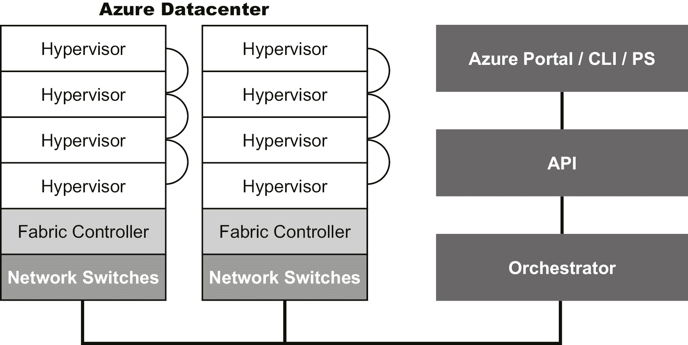

# 第一章：探索微软 Azure 云

人们经常因为围绕**云计算**这个术语的模糊性而感到困惑。在这里，我们不是指诸如 OneDrive、Dropbox 等云存储解决方案。相反，我们指的是实际由组织、公司甚至个人使用的计算解决方案。

微软 Azure（以前称为**Windows Azure**）是微软的公共云计算平台。它提供了广泛的云服务，包括计算、分析、存储、网络等。如果你浏览 Azure 提供的服务列表，你会发现你几乎可以处理任何东西，从虚拟机到人工智能和机器学习。

从虚拟化的简要历史开始，我们将解释如何将物理硬件转化为虚拟化硬件，使得在许多方面超越了经典数据中心的边界成为可能。

之后，我们将解释云技术中使用的不同术语。

以下是我们将要涵盖的关键主题列表：

+   计算、网络和存储的虚拟化

+   云服务

+   云类型

## 云计算基础

当你开始学习新的**信息技术**（**IT**）学科时，通常会从研究基本概念（即理论）开始。然后你会熟悉架构，迟早你会开始动手实践，看看它在实践中是如何工作的。

然而，在云计算中，如果你不仅了解概念和架构，而且了解它的来源，那真的会很有帮助。我们不想给你上一堂历史课，但我们想向你展示过去的发明和想法仍然在现代云环境中使用。这将让你更好地理解云是什么，以及如何在你的组织中使用它。

以下是云计算的关键基础：

+   虚拟化

+   **软件定义的数据中心**（**SDDC**）

+   **面向服务的架构**（**SOA**）

+   云服务

+   云类型

让我们逐个看看这些，并了解这些术语指的是什么。

### 虚拟化

在计算中，虚拟化指的是创建设备或资源的虚拟形式，比如服务器、存储设备、网络，甚至操作系统。虚拟化的概念出现在 IBM 在 20 世纪 60 年代末和 70 年代初开发其分时共享解决方案时。**分时共享**指的是在大量用户之间共享计算资源，提高用户的生产力，消除为每个用户购买计算机的需要。这是计算技术革命的开始，新计算机的购买成本大大降低，组织可以利用他们已经拥有的未充分利用的计算资源。

现在，这种虚拟化已经发展成基于容器的虚拟化。虚拟机有自己的操作系统，在物理服务器的顶部虚拟化；另一方面，一个机器上的容器（无论是物理的还是虚拟的）都共享相同的基础操作系统。我们将在*第九章《Azure 中的容器虚拟化》*中更多地讨论容器。

快进到 2001 年，另一种虚拟化类型被引入，称为硬件虚拟化，由 VMware 等公司推出。在他们的产品 VMware Workstation 中，他们在现有操作系统的顶部添加了一层，提供了一组标准硬件和内置软件，而不是物理元素来运行虚拟机。这个层被称为**hypervisor**。后来，他们建立了自己的操作系统，专门用于运行虚拟机：VMware ESXi（以前称为 ESX）。

2008 年，微软推出了 Hyper-V 产品，进入了硬件虚拟化市场，作为 Windows Server 2008 的可选组件。

硬件虚拟化就是将软件与硬件分离，打破硬件和软件之间的传统界限。一个 hypervisor 负责将虚拟资源映射到物理资源上。

这种类型的虚拟化是数据中心革命的推动者：

+   由于标准硬件的设置，每个虚拟机都可以在安装了 hypervisor 的任何物理机器上运行。

+   由于虚拟机彼此隔离，如果特定的虚拟机崩溃，它不会影响在同一 hypervisor 上运行的任何其他虚拟机。

+   因为虚拟机只是一组文件，您可以有新的备份、移动虚拟机等可能性。

+   新的选项变得可用，以改善工作负载的可用性，具有**高可用性**（**HA**）和即使虚拟机仍在运行也可以迁移虚拟机的可能性。

+   新的部署选项也变得可用，例如使用模板。

+   还有关于中央管理、编排和自动化的新选项，因为一切都是软件定义的。

+   隔离、保留和在需要时限制资源，在可能的情况下共享资源。

### SDDC

当然，如果您可以将硬件转换为计算机软件，那么很快就会有人意识到您也可以对网络和存储进行相同的操作。

对于网络，一切都始于虚拟交换机的概念。与其他形式的硬件虚拟化一样，这只是在软件中构建网络交换机，而不是在硬件中构建。

**互联网工程任务组**（**IETF**）开始着手一个名为**转发和控制元素分离**的项目，这是一个提议的标准接口，用于解耦控制平面和数据平面。2008 年，在斯坦福大学使用 OpenFlow 协议实现了这一目标的第一个真正的交换机实现。**软件定义网络**（**SDN**）通常与 OpenFlow 协议相关联。

使用 SDN，您可以获得与计算机虚拟化相似的优势：

+   中央管理、自动化和编排

+   通过流量隔离和提供防火墙和安全策略，实现更加精细的安全性

+   塑造和控制数据流量

+   HA 和可伸缩性的新选项

2009 年，**软件定义存储**（**SDS**）的开发在一些公司开始，比如 Scality 和 Cleversafe。同样，这是关于抽象化：将服务（逻辑卷等）与物理存储元素解耦。

如果您深入研究 SDS 的概念，一些供应商为虚拟化的已有优势添加了新功能。您可以向虚拟机添加策略，定义您想要的选项：例如，数据复制或**每秒输入/输出操作**（**IOPS**）的限制。这对于管理员来说是透明的；hypervisor 和存储层之间进行通信以提供功能。后来，这个概念也被一些 SDN 供应商采纳。

您实际上可以看到，虚拟化慢慢地将不同数据中心层的管理转变为更加面向服务的方法。

如果您可以虚拟化物理数据中心的每个组件，那么您就拥有了一个 SDDC。网络、存储和计算功能的虚拟化使得可以超越单一硬件的限制。通过将软件从硬件中抽象出来，SDDC 使得可以超越物理数据中心的边界。

在 SDDC 环境中，一切都是虚拟化的，并且通常完全由软件自动化。这完全改变了传统的数据中心概念。服务托管的位置或可用时间（24/7 或按需）并不重要。此外，还有可能监视服务，甚至添加自动报告和计费等选项，这些都会让最终用户感到满意。

SDDC 与云不同，甚至不同于在您的数据中心运行的私有云，但您可以争辩说，例如，Microsoft Azure 是 SDDC 的全面实现—Azure 从定义上来说是软件定义的。

### SOA

在硬件虚拟化成为数据中心主流并且 SDN 和 SDS 的开发开始的同时，软件开发领域出现了一些新的东西：SOA，它提供了几个好处。以下是一些关键点：

+   最小的服务可以相互通信，使用诸如**简单对象访问协议**（**SOAP**）之类的协议。它们一起提供完整的基于 Web 的应用程序。

+   服务的位置并不重要；服务必须意识到其他服务的存在，就是这样。

+   服务是一种黑匣子；最终用户不需要知道盒子里面有什么。

+   每个服务都可以被另一个服务替换。

对于最终用户来说，应用程序位于何处或由几个较小的服务组成并不重要。在某种程度上，这就像虚拟化：看起来是一个物理资源，例如存储**LUN**（逻辑单元编号），实际上可能包括多个位置的多个物理资源（存储设备）。正如前面提到的，如果一个服务意识到另一个服务的存在（它可能在另一个位置），它们将一起行动并交付应用程序。我们每天互动的许多网站都是基于 SOA 的。

虚拟化与 SOA 的结合为您提供了更多的可伸缩性、可靠性和可用性选项。

SOA 模型和 SDDC 之间存在许多相似之处，但也有区别：SOA 涉及不同服务之间的交互；SDDC 更多地涉及向最终用户提供服务。

SOA 的现代实现是微服务，由 Azure 等云环境提供，可以独立运行或在 Docker 等虚拟化容器中运行。

### 云服务

这就是那个神奇的词：*云*。**云服务**是由云解决方案或计算提供商（如 Microsoft Azure）提供给组织、公司或用户的任何服务。如果您想提供以下服务，则云服务是合适的：

+   高度可用并始终按需提供。

+   可以通过自助服务进行管理。

+   具有可伸缩性，使用户可以进行升级（使硬件更强大）或扩展（添加额外节点）。

+   具有弹性—根据业务需求动态扩展或收缩资源数量的能力。

+   提供快速部署。

+   可以完全自动化和编排。

除此之外，还有用于监视资源和新类型的计费选项的云服务：大多数情况下，您只需支付您使用的部分。

云技术是通过互联网提供服务，以便使组织能够访问诸如软件、存储、网络和其他类型的 IT 基础设施和组件等资源。

云可以为您提供许多服务类型。以下是最重要的几种：

+   **基础设施即服务**（**IaaS**）：托管虚拟机的平台。在 Azure 中部署的虚拟机就是一个很好的例子。

+   **平台即服务**（**PaaS**）：一个用于开发、构建和运行应用程序的平台，无需建立和运行自己的基础设施的复杂性。例如，有 Azure 应用服务，您可以将代码推送到 Azure，Azure 将为您托管基础设施。

+   **软件即服务**（**SaaS**）：在云中运行的即插即用应用程序，例如 Office 365。

尽管上述是云服务的关键支柱，您可能也会听说**FaaS**（**函数即服务**），**CaaS**（**容器即服务**），**SECaaS**（**安全即服务**），随着云中服务提供的数量日益增加，清单也在不断增加。Azure 中的函数应用将是 FaaS 的一个例子，Azure 容器服务将是 CaaS 的例子，Azure 活动目录将是 SECaaS 的例子。

### 云类型

云服务可以根据其位置或托管服务的平台进行分类。正如前一节中提到的，基于平台，我们可以将云服务分类为 IaaS、PaaS、SaaS 等；然而，基于位置，我们可以将云分类为：

+   **公共云**：所有服务都由服务提供商托管。微软的 Azure 就是这种类型的实现。

+   **私有云**：您自己的数据中心中的云。微软最近为此开发了 Azure 的特殊版本：Azure Stack。

+   **混合云**：公共云和私有云的组合。一个例子是结合 Azure 和 Azure Stack 的强大功能，但您也可以考虑新的灾难恢复选项，或者在临时需要更多资源时将服务从您的数据中心移到云端，然后再移到回来。

+   **社区云**：社区云是多个组织在同一共享平台上工作，前提是它们有类似的目标或目标。

选择这些云实现之一取决于几个因素；仅举几个例子：

+   **成本**：将您的服务托管在云中可能比在本地托管它们更昂贵，这取决于资源使用情况。另一方面，它可能更便宜；例如，您不需要实施复杂和昂贵的可用性选项。

+   **法律限制**：一些组织可能无法使用公共云。例如，美国政府有自己的名为 Azure Government 的 Azure 产品。同样，德国和中国也有他们自己的 Azure 产品。

+   **互联网连接**：仍然有一些国家的必要带宽甚至连接的稳定性是一个问题。

+   **复杂性**：特别是混合云环境可能难以管理；对应用程序和用户管理的支持可能具有挑战性。

## 了解微软 Azure 云

现在您已经更多地了解了虚拟化和云计算，是时候向您介绍云的微软实现：Azure。

重新开始，从一些历史开始，在这一部分，您将了解到 Azure 背后的技术，以及 Azure 可以成为您的组织的一个非常好的解决方案。

### 微软 Azure 云的简要历史

在 2002 年，微软启动了一个名为 Whitehorse 的项目，以简化在 SOA 模型中开发、部署和实施应用程序。在这个项目中，重点是提供小型、预构建的 Web 应用程序，并能够将它们转换为服务。这个项目在 2006 年左右悄然消失。

在那个项目中学到的许多经验教训以及**亚马逊网络服务**（**AWS**）的出现，促使微软在 2006 年启动了一个名为**RedDog**的项目。

过了一段时间，微软将另外三个开发团队加入了这个项目：

+   **.NET 服务**：为使用 SOA 模型的开发人员提供的服务。.NET 服务提供了作为安全、基于标准的消息基础设施的服务总线。

+   **Live 服务和 Live Mesh**：一个 SaaS 项目，通过互联网使 PC 和其他设备能够相互通信。

+   **SQL 服务**：通过互联网提供微软 SQL 的 SaaS 项目。

2008 年，微软宣布启动 Azure，并在 2010 年公开发布时，Azure 已准备好提供 IaaS 和 PaaS 解决方案。RedDog 这个名字存活了一段时间：经典门户也被称为**RedDog 前端**（**RDFE**）。经典门户基于**服务管理模型**。另一方面，Azure 门户基于**Azure 资源管理器**（**ARM**）。这两个门户基于两种不同的 API。

如今，Azure 是微软三个云服务之一（其他两个是 Office 365 和 Xbox），用于提供不同类型的服务，如虚拟机、Web 和移动应用程序、Active Directory、数据库等。

在功能、客户和可用性方面，Azure 仍在不断增长。Azure 在超过 54 个区域可用。这对于可伸缩性、性能和冗余性非常重要。

拥有这么多的区域也有助于遵守法律和安全/隐私政策。有关安全、隐私和合规性的信息和文件可通过微软的信任中心获取：[`www.microsoft.com/en-us/TrustCenter`](https://www.microsoft.com/en-us/TrustCenter)。

### Azure 架构

Microsoft Azure 运行在定制的、精简的、加固的 Hyper-V 版本上，也被称为**Azure Hypervisor**。

在这个虚拟化程序之上，有一个云层。这个层或基础架构是托管在微软数据中心中的许多主机的集群，负责部署、管理和维护基础设施的健康。

这个云层由基础架构控制器管理，负责资源管理、可伸缩性、可靠性和可用性。

这一层还通过基于 REST、HTTP 和 XML 的 API 提供管理界面。与基础架构控制器互动的另一种方式是通过 Azure 门户和诸如 Azure CLI 之类的软件通过 Azure 资源管理器。

以下是 Azure 架构的图示表示：

###### 图 1.1：Azure 架构

这些用户界面服务（Azure 门户、PowerShell、Azure CLI 和 API）将通过资源提供程序与基础架构进行通信。例如，如果您想要创建、删除或更新计算资源，用户将与称为**计算资源提供程序**（**CRP**）的**Microsoft.Compute**资源提供程序进行交互。同样，网络资源通过**网络资源提供程序**（**NRP**）或**Microsoft.Network**资源提供程序进行通信，存储资源通过**存储资源提供程序**（**SRP**）或**Microsoft.Storage**资源提供程序进行通信。

这些资源提供程序将创建所需的服务，比如虚拟机。

### 您的组织中的 Azure

Azure 可以提供 IaaS：轻松部署虚拟机，手动或自动化，并使用这些虚拟机开发、测试和托管您的应用程序。还有许多额外的服务可用，使您作为系统工程师的生活更加轻松，如备份和恢复选项、添加存储和可用性选项。对于 Web 应用程序，甚至可以在不创建虚拟机的情况下提供服务！

当然，Azure 也可以用于 PaaS 解决方案；与 IaaS 一样，PaaS 包括基础架构的所有组件，但还支持云应用程序的完整生命周期：构建、测试、部署、管理和更新。还有预定义的应用程序组件可用；您可以节省时间，将这些组件与您的代码一起转换为您想要提供的服务。容器也可以成为 PaaS 解决方案的一部分。Azure 容器服务简化了使用 Kubernetes 或其他编排器（如 Mesos）部署、管理和操作容器。

如果你是一家希望在 Azure 中托管 SaaS 解决方案的公司或组织，这是可能的，使用 AppSource。你甚至可以与其他微软产品（如 Office 365 和 Dynamics）进行集成。

2017 年，微软宣布推出 Azure Stack。现在你可以在自己的数据中心或选择的服务提供商的数据中心中运行 Azure，以提供 IaaS 和 PaaS。它为你提供了 Azure 的可伸缩性和可用性，而无需担心配置。只有在需要时才需要添加更多的物理资源。如果你愿意，你可以将其用于与公共 Azure 的混合解决方案，用于灾难恢复或云和本地部署中的一致工作负载。

Azure Stack 不是你可以用于混合环境的唯一选择。例如，你可以将本地 Active Directory 与 Azure Active Directory 连接，或者使用 Azure Active Directory 应用程序为本地和托管的 Web 应用程序提供单一登录（SSO）。

### Azure 和开源

2009 年，甚至在 Azure 公开之前，微软就开始为开源框架（如 PHP）添加支持，2012 年，由于许多客户的要求，微软添加了对 Linux 虚拟机的支持。

当时，微软并不是开源社区的好朋友，可以说他们真的不喜欢 Linux 操作系统。这种情况在 2014 年左右发生了变化，当时萨蒂亚·纳德拉（Satya Nadella）接替史蒂夫·鲍尔默（Steve Ballmer）担任微软首席执行官。在那一年的十月，他甚至在旧金山的一次微软大会上宣布*微软热爱 Linux！*

从那时起，Azure 已经发展成一个非常开源友好的环境：

+   它为许多开源解决方案提供了平台，如 Linux 实例、容器技术和应用/开发框架。

+   它通过提供开放和兼容的 API，与开源解决方案进行集成。例如，Cosmos DB 服务提供了与 MongoDB 兼容的 API。

+   文档、软件开发工具包（SDK）和示例都是开源的，可以在 GitHub 上找到：[`github.com/Azure`](https://github.com/Azure)。

+   微软正在与开源项目和供应商合作，并且也是许多开源项目的主要代码贡献者。

2016 年，微软以白金会员的身份加入了 Linux 基金会组织，以确认他们对开源开发兴趣和参与度稳步增加。

2017 年 10 月，微软表示 Azure 中超过 40%的虚拟机正在运行 Linux 操作系统，Azure 正在运行许多容器化的工作负载。从当前的统计数据来看，工作负载的数量已经超过 60%。此外，微服务都在使用开源编程语言和接口。

微软非常重视开源技术、开源 PowerShell 和许多其他产品。并非 Azure 中的每个微软产品都是开源的，但至少你可以在 Linux 上安装和运行 Microsoft SQL，或者获取 Microsoft SQL 的容器镜像。

## 总结

在本章中，我们讨论了虚拟化的历史和云的概念，并解释了云环境中使用的术语。

有些人认为微软进入云世界有点晚了，但实际上，他们从 2006 年开始研究和开发技术，其中许多部分在 Azure 中得以保留。一些项目因为太早而夭折，当时很多人对云持怀疑态度。

我们还介绍了 Azure 云的架构和 Azure 可以为您的组织提供的服务。

在本章的最后部分，我们看到 Azure 是一个非常开源友好的环境，微软付出了很多努力，使 Azure 成为一个开放、标准的云解决方案，具有互操作性。

在下一章中，我们将开始使用 Azure，并学习如何在 Azure 中部署和使用 Linux。

## 问题

1.  您的物理数据中心中的哪些组件可以转化为软件？

1.  容器虚拟化和硬件虚拟化有什么区别？

1.  如果您想在云中托管应用程序，哪种服务类型是最佳解决方案？

1.  假设您的某个应用程序需要严格的隐私政策。对于您的组织来说，使用云技术仍然是一个好主意吗？

1.  为什么 Azure 有这么多可用的区域？

1.  Azure Active Directory 的目的是什么？

## 进一步阅读

如果您想了解更多关于 Hyper-V 以及如何将 Azure 与 Hyper-V 一起用于站点恢复和工作负载保护的信息，请查看 Packt Publishing 的《Windows Server 2016 Hyper-V Cookbook, Second Edition》。

有许多关于虚拟化、云计算及它们之间关系的技术文章。我们想提到的一个是《虚拟化与云计算关系的正式讨论》（ISBN 978-1-4244-9110-0）。

不要忘记访问本章中提到的微软网站和 GitHub 存储库！
