# 第二章：开始使用 Azure 云

在第一章中，我们介绍了虚拟化和云计算的历史和理念。之后，你了解了微软 Azure 云。本章将帮助你迈出 Azure 世界的第一步，获取 Azure 访问权限，探索不同的 Linux 提供，并部署你的第一个 Linux 虚拟机。

部署后，你将需要使用**安全外壳**（**SSH**）进行密码验证或使用 SSH 密钥对访问你的虚拟机。

要开始你的 Azure 云之旅，完成所有练习并检查结果非常重要。在本章中，我们将使用 PowerShell 以及 Azure CLI。随意选择你喜欢的方式进行跟随；然而，学习两者都不会有坏处。本章的关键目标是：

+   设置你的 Azure 帐户。

+   使用 Azure CLI 和 PowerShell 登录 Azure。

+   与**Azure 资源管理器**（**ARM**）交互以创建网络和存储资源。

+   了解 Linux 发行版和微软认可的发行版。

+   部署你的第一个 Linux 虚拟机。

#### 注意

本章中的所有内容都在 macOS、Linux 子系统和最新版本的 CentOS 和 openSUSE LEAP 上进行了测试。

## 技术要求

如果你想尝试本章中的所有示例，至少需要一个浏览器。出于稳定性的考虑，使用最新版本的浏览器非常重要。微软在官方 Azure 文档中提供了支持的浏览器列表：

+   微软 Edge（最新版本）

+   Internet Explorer 11

+   Safari（最新版本，仅限 Mac）

+   Chrome（最新版本）

+   Firefox（最新版本）

根据个人经验，我们建议使用 Google Chrome 或基于其引擎最新版本的浏览器，如 Vivaldi。

你可以在浏览器中完成所有练习，甚至包括命令行练习。实际上，使用本地安装的 Azure CLI 或 PowerShell 是个好主意；它更快，更容易复制和粘贴代码，你还可以保存历史和命令的输出。

## 获取 Azure 访问权限

开始使用 Azure，你需要的第一件事是一个帐户。前往[`azure.microsoft.com`](https://azure.microsoft.com)并获取一个免费帐户开始，或者使用已经在使用的公司帐户。另一个可能性是使用 Visual Studio 专业版或企业版订阅的 Azure，这将为你提供 Azure 的**微软开发者网络**（**MSDN**）积分。如果你的组织已经与微软签订了企业协议，你可以使用你的企业订阅，或者你可以注册一个按使用量付费的订阅（如果你已经使用了免费试用）。

如果你使用的是免费帐户，你将获得一些信用额度来开始，一些流行的服务有限时间内免费，以及一些永远免费的服务，如容器服务。你可以在[`azure.microsoft.com/en-us/free`](https://azure.microsoft.com/en-us/free)找到最新的免费服务列表。在试用期间，除了需要额外许可的虚拟机外，你不会被收费，但你需要一张信用卡来验证身份。

### 使用 Azure 门户登录

将浏览器指向[`portal.azure.com`](https://portal.azure.com)并使用你的凭据登录。你现在可以开始使用 Azure，或者换句话说，开始使用你的订阅。在 Azure 中，订阅允许你使用你的帐户使用 Azure 门户/Azure CLI/PowerShell 创建和部署资源。它也用于会计和计费。

Azure 门户将带你到一个仪表板，你可以根据自己的监控需求进行修改。你现在可以：

+   检查你的资源。

+   创建新资源。

+   访问 Marketplace，这是一个在线商店，你可以购买和部署专为 Azure 云构建的应用程序或服务。

+   了解您的计费情况。

您可以使用网络界面，以图形方式执行所有操作，或者通过网络界面使用 Azure Cloud Shell，它提供了 Bash 或 PowerShell 界面。

### 获取对 Azure 的命令行访问

有几个很好的理由使用命令行。这就是为什么在本书中，我们将主要介绍 Azure 命令行访问的原因：

+   它可以帮助您了解 Azure 的架构。在图形界面中，通常可以在一个配置窗口中执行许多操作，而不必了解不同字段和组件之间的关系。

+   这是自动化和编排的第一步。

+   网络界面仍在积极开发中；网络界面可以并且将会随着时间改变：

某些功能和选项目前尚不可用。

微软可能会在网络界面中重新定位功能和选项。

+   另一方面，命令行界面在语法和输出方面非常稳定。

在本书中，我们将在 Bash shell 中使用 Azure CLI 和带有 PowerShell Az 模块的 PowerShell。两者都非常适合，与平台无关，并且除了一两个例外之外，在功能上没有区别。选择您喜欢的，因为您已经熟悉它，或者尝试两种界面，然后选择。

#### 注意

请注意，从本书中复制和粘贴命令可能会由于空格和缩进而导致错误。为了获得更好的结果，请始终输入命令。此外，这将帮助您熟悉命令。

### 安装 Azure CLI

如果您在 Azure Cloud Shell 中使用 Bash 界面，那么可以使用完整的 Linux 环境来安装 Azure 命令行界面。它还提供了 Azure 特定的命令，比如 `az` 命令。

您也可以在 Windows、macOS 和 Linux 上安装此实用程序。还提供了 Docker 容器。您可以在 [`docs.microsoft.com/en-us/cli/azure`](https://docs.microsoft.com/en-us/cli/azure) 找到所有这些平台的详细安装说明。

让我们以 CentOS/**Red Hat Enterprise Linux** (**RHEL**) 7 为例来安装 Azure CLI：

1.  导入 Microsoft 存储库的 **GNU 隐私卫士** (**GPG**) 密钥：

```
sudo rpm --import \ https://packages.microsoft.com/keys/microsoft.asc
```

1.  添加存储库：

```
sudo yum-config-manager --add-repo= \    
  https://packages.microsoft.com/yumrepos/azure-cli
```

1.  安装软件：

```
sudo yum install azure-cli
```

1.  要在基于 Ubuntu 或 Debian 的系统上安装 Azure CLI，请使用以下命令：

```
curl -sL https://aka.ms/InstallAzureCLIDeb | sudo bash 
```

在 macOS 上，您必须首先安装 Homebrew，这是一个免费的开源软件包管理系统，简化了大多数开源软件的安装。

1.  打开终端并执行以下操作：

```
ruby -e "$(curl -fsSL \
 https://raw.githubusercontent.com/Homebrew/install/master/install)"
```

1.  更新 Homebrew 并安装 Azure CLI：

```
brew update && brew install azure-cli
```

1.  安装 Azure CLI 后，您可以使用以下命令验证已安装的版本：

```
az -v
```

### 使用 Azure CLI 登录

Azure CLI 是用于访问或管理 Azure 资源的命令行工具，好处是它适用于 macOS、Linux 和 Windows 平台。在使用 CLI 之前，您必须登录：

```
az login
```

此命令将打开浏览器，并要求您使用 Microsoft 帐户登录。如果出现错误，指出 shell 无法打开交互式浏览器，请使用 `az login –use-device-code`。这将生成一个代码，您可以在 [`www.microsoft.com/devicelogin`](https://www.microsoft.com/devicelogin) 中使用它完成身份验证。

如果成功，它将以 JSON 格式给出一些关于您的订阅的输出，比如您的用户名：

```
[
   {
     "cloudName": "AzureCloud",
         "id": "....",
         "isDefault": true,
         "name": "Pay-As-You-Go",
         "state": "Enabled",
         "tenantId": "....",
         "user": {
            "name": "....",
            "type": "user"
          }
    }
 ]
```

要再次获取此信息，请输入以下内容：

```
az account list 
```

您可以始终使用额外的参数将输出格式化为 JSON、JSONC、TABLE 或 TSV 格式。

JSON（或 JSONC，彩色变体）格式在编程和脚本语言中更容易解析：

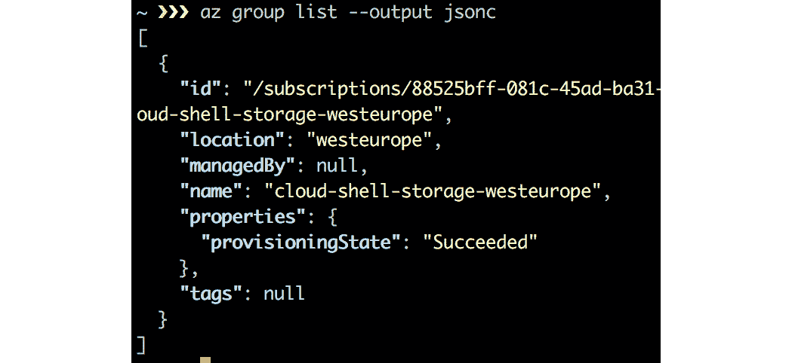

###### 图 2.1：以 JSONC 格式显示的订阅详细信息

**制表符分隔值**（**TSV**）是一个很好的主意，如果输出是单个值，如果您想要使用文本过滤实用程序（如 AWK），或者如果您想要将输出导出到电子表格中：

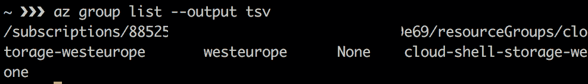

###### 图 2.2：以制表符分隔的订阅详细信息

表格输出非常易于阅读，但比默认输出更受限制：

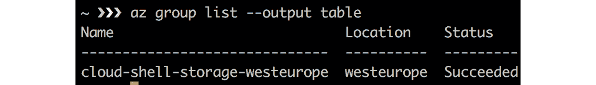

###### 图 2.3：表格格式的订阅详细信息

要以表格格式获取已登录帐户具有访问权限的订阅列表，请执行以下命令：

```
az account list -o table
```

为了更容易阅读 JSON 输出，您还可以查询特定字段：

```
az account list -o table --query '[].[user.name]'
```

如果您已经拥有大量资源或帐户，浏览整个列表将非常困难。幸运的是，有一种方法可以深入了解输出并仅获取所需的信息。使用`--query`参数链接命令将帮助您执行此操作，使用称为 JMESPATH（[`jmespath.org`](http://jmespath.org)）的强大查询语言。再次查看`az account list`命令的 JSON 输出。此查询正在搜索`user`字段和`name`属性。

让我们回到登录过程。每次都这样做可能不是最用户友好的过程。更好的方法是创建服务主体，也称为应用程序注册，为特定应用程序提供凭据：

```
az ad sp create-for-rbac --name <APP_NAME>
```

您可以为应用程序提供名称，但是某些特殊字符是不允许的。原因是`APP_NAME`将创建一个 URL，因此在 URL 中禁止的所有字符都不能添加到`APP_NAME`中（例如@和%）。再次以 JSON 格式输出，将提供应用程序 ID（`appID`参数）：

```
{
    "appID": "....",
    "displayName": "APP_NAME",
    "name": "http://APP_NAME",
    "password": "....",
    "tenant": "...."
 }
```

请在记事本上记下输出，因为我们将使用这些值进行身份验证。应用程序或服务主体代表 Azure 租户中的对象。租户是指一个组织，通常表示为<yourcompany/yourname>.onmicrosoft.com，它管理和拥有 Microsoft 云服务的实例。从 Azure 的角度来看，部署的所有服务都将与订阅相关联，并且订阅将映射到租户。一个租户可以拥有托管不同服务的多个订阅。从前面的输出中，我们将获得以下值：

+   `appID`：应用程序 ID 类似于应用程序的用户名。我们将在登录时使用此 ID 作为用户名。

+   `displayName`：在创建应用程序时为应用程序指定的友好名称。我们通过`name`参数设置名称。

+   `name`：基于我们给定的名称的 URL。

+   `password`：这是我们创建的服务主体的密码。在登录时，我们将在密码字段中使用此值。

+   `tenant`：租户 ID；我们在前一段中讨论了租户。

需要访问的应用程序必顶由安全主体表示。安全主体定义了租户中用户/应用程序的访问策略和权限。这使得在登录期间对用户/应用程序进行身份验证，并在资源访问期间进行基于角色的授权成为可能。总之，您可以使用`appID`进行登录。

列出分配给新创建的`appID`的角色：

```
az role assignment list --assignee <appID> --o table
```

默认情况下使用贡献者角色。此角色具有对 Azure 帐户的读写权限。

现在，测试一下并注销：

```
az logout
```

现在，再次使用`appID`登录。您可以使用之前复制的值来完成身份验证：

```
az login --service-principal --username <appID> --tenant <tenant id>
```

不幸的是，没有办法将用户名、`appID`或`tenant id`存储在配置文件中。可选地，您可以将`--password`添加到命令中：

```
az login --service-principal --username <appID> --tenant <tenant id> --password <app_password> 
```

除了使用`az`命令输入完整命令之外，还可以以交互式 shell 模式打开它：

```
az interactive
```

这个 shell 最大的特点之一是它将终端分成两个窗口。在上屏幕上，您可以输入命令；在下屏幕上，您在输入命令时会得到帮助。命令、参数和通常参数值也支持自动完成。

### PowerShell

PowerShell 是由 Microsoft 开发的脚本语言，集成到.NET Framework 中。它是由 Jeffrey Snover、Bruce Payette 和 James Truher 于 2006 年设计的。PowerShell 不仅适用于 Windows，还适用于 Linux 和 macOS。您可以在 PowerShell 的 GitHub 存储库上找到使用这些操作系统的详细说明：[`github.com/PowerShell`](https://github.com/PowerShell)。

例如，在 RHEL 或 CentOS 中安装它，请按照以下步骤操作：

1.  如果您在安装 Azure CLI 时没有导入 Microsoft 存储库的 GPG 密钥，请执行此操作：

```
sudo rpm –import \  https://packages.microsoft.com/keys/microsoft.asc
```

1.  添加存储库：

```
sudo yum-config-manager --add-repo= \https://packages.microsoft.com/rhel/7/prod/
```

1.  安装软件：

```
sudo yum install -y powershell
```

1.  使用`pwsh -v`显示已安装的版本。

1.  输入 PowerShell：

```
pwsh
```

在 macOS 上，您需要 Homebrew 和 Homebrew Cask。Cask 扩展了 Homebrew 以安装更多和更大的应用程序：

1.  安装 Homebrew Cask：

```
brew tap caskroom/cask
```

1.  安装 PowerShell：

```
brew cask install powershell
```

1.  使用`pwsh -v`显示已安装的版本。

1.  进入 PowerShell：

```
pwsh
```

安装 PowerShell 后，您可以安装 Az 模块。根据您的互联网速度，下载模块可能需要一些时间。您将能够在 shell 中看到下载的进度：

```
Install-Module -Name Az -AllowClobber -Scope CurrentUser -Force
```

PowerShell 使用`PowerShellGet` cmdlet 从 PowerShell Gallery 下载模块及其依赖项，PowerShell Gallery 是一个托管许多模块的在线存储库。请注意，您需要在 Windows 和 Linux 中具有管理员权限才能执行此操作。PowerShell Gallery 未配置为受信任的存储库：

```
Untrusted repository
You are installing the modules from an untrusted repository. If you trust this 
repository, change its InstallationPolicy value by running the Set-PSRepository
 cmdlet. Are you sure you want to install the modules from 'PSGallery'?
[Y] Yes  [A] Yes to All  [N] No  [L] No to All  [S] Suspend  [?] Help 
(default is "N"): A
```

在列表中用`[A] Yes to All`回答问题。

现在可能由于`force`参数，您安装了多个 Az 模块的版本。您可以使用以下命令验证多个版本的存在：

```
Get-InstalledModule -Name Az -AllVersions | '       select Name,Version 
```

默认情况下将使用最新版本，除非在导入模块时使用`-RequiredVersion`参数。

### 使用 PowerShell 登录

安装完成后，导入模块：

```
Import-Module -name Az
```

如果您不创建 PowerShell 脚本，而只在与 Azure 交互时在 PowerShell 环境中执行命令，您将需要再次执行此命令。但是，如果您愿意，您可以自动加载模块。

首先，通过执行以下命令找出您的 PowerShell 配置文件在文件系统上的位置：

```
$profile
```

在文本编辑器中打开或创建此文件，并添加以下行：

```
Import-Module -name Az
```

#### 注意

在实际创建此文件之前，可能需要创建目录结构。

现在您可以执行所有可用的 Azure 命令。

使用以下 cmdlet 登录：

```
Connect-AzAccount
```

这将打开一个交互式浏览器窗口，您可以使用您的凭据进行身份验证。如果结果没有显示租户 ID，请执行此操作：

```
Get-AzContext -ListAvailable | select Tenant
```

现在，使用您找到的租户 ID 再次登录：

```
Connect-AzAccount -Tenant <tenantID>
```

如果您有多个订阅，您可以添加`-Subscription`参数和订阅 ID。如前所述，创建服务主体可能是一个好主意：

```
$newsp = New-AzADServicePrincipal ' -DisplayName "APP_NAME" -Role Contributor
```

如果您不提及`DisplayName`，这是服务主体的友好名称，Azure 将以格式 azure-powershell-MM-dd-yyyy-HH-mm-ss 生成一个名称。接下来，您需要检索新创建的服务主体的应用程序 ID：

```
$newsp.ApplicationId
```

密码可以存储到一个变量中，该变量将被加密，我们必须解密它：

```
$BSTR = [System.Runtime.InteropServices.Marshal]::SecureStringToBSTR($newsp.Secret)
$UnsecureSecret = [System.Runtime.InteropServices.Marshal]::PtrToStringAuto($BSTR)
```

`$UnsecureSecret`变量包含服务主体的密码。

为了能够进行身份验证，我们需要服务主体的凭据：

```
$creds = Get-Credential 
```

提供`ApplicationID`和密码，它们分别存储在`$newsp.ApplicationId`和`$UnsecureSecret`变量中。现在我们有了使用这些凭据连接到 Azure 所需的一切：

```
Connect-AzAccount -Credential $creds '
  -Tenant <tentant id> '
  -ServicePrincipal
```

现在，保存上下文：

```
Save-AzContext -Path $HOME/.Azure/AzureContext.json
```

必要时覆盖现有内容。退出 PowerShell 环境并执行 PowerShell。确保你已登录到 Azure 并使用以下命令验证上下文：

```
Get-AzContext
```

### Azure 资源管理器

在开始部署你的第一个 Linux 虚拟机之前，了解**Azure 资源管理器**（**ARM**）更加重要。

基本上，ARM 使你能够使用诸如存储和虚拟机之类的资源。为此，你必须创建一个或多个资源组，以便你可以执行生命周期操作，如在一个操作中部署、更新和删除资源组中的所有资源。

#### 注意

资源组必须在一个区域中创建，也被称为位置。请注意，不同区域提供的服务可能会有所不同。要了解更多关于这些差异的信息，请访问[`azure.microsoft.com/en-us/global-infrastructure/services/`](https://azure.microsoft.com/en-us/global-infrastructure/services/)。

Azure 有超过 54 个区域。如果一个位置不可用，需要为你的账户加入白名单。为此，你可以联系微软支持。要获取你的账户可用位置和支持的资源提供程序列表，请在 PowerShell 中执行以下命令：

```
Get-AzLocation | Select-Object Location
```

你也可以在 Bash 中执行以下操作：

```
az account list-locations --query '[].name'
```

然后，在其中一个区域创建一个资源组：

```
New-AzResourceGroup -Location westus2 -Name 'MyResource1'
```

现在，验证结果：

```
Get-AzResourceGroup | Format-Table
```

这是前述命令的 Bash 版本：

```
az group create --location westus2 --name MyResource2
```

要验证**Azure 资源管理器（ARM）**的结果，执行以下命令：

```
az group list -o table
```

除了使用区域和资源组，你还必须了解存储冗余的概念。可用的复制选项如下：

+   Standard_LRS：本地冗余存储

Premium_LRS：与 LRS 相同，但也支持文件存储。

Standard_GRS：地理冗余存储

Standard_RAGRS：读取访问地理冗余存储

+   Standard_ZRS：区域冗余存储；ZRS 不支持 Blob 存储

#### 注意

更多信息可在微软网站上找到：[`docs.microsoft.com/en-us/azure/storage/common/storage-redundancy`](https://docs.microsoft.com/en-us/azure/storage/common/storage-redundancy)。

理解这个概念很重要，因为与你的资源组一起，一个存储账户在一个区域是必需的。存储账户在 Azure 中提供了一个唯一的命名空间来存储数据（如诊断）和使用 Azure Files 等服务的可能性。要为这些数据配置冗余，你必须指定在这种情况下代表冗余选项的 SKU：

```
New-AzStorageAccount -Location westus '
  -ResourceGroupName MyResource1'
  -Name "<NAME>" -SkuName Standard_LRS
```

或者你可以通过 Azure CLI 执行：

```
az storage account create --resource-group MyResource2 
  --sku Standard_LRS --name <NAME>
```

存储账户名称必须在 Azure 中是唯一的，长度在 3 到 24 个字符之间，并且只能使用数字和小写字母。

## Linux 和 Azure

Linux 几乎无处不在，出现在许多不同的设备和环境中。有许多不同的风味，你可以选择使用什么。那么，你会选择什么？有很多问题，也有很多不同的答案。但有一件事是肯定的：在企业环境中，支持是很重要的。

### Linux 发行版

如前所述，周围有许多不同的 Linux 发行版。但为什么有这么多选择呢？有很多原因：

+   Linux 发行版是一组软件。有些集合是为了特定的目标。这样一个发行版的一个很好的例子是 Kali Linux，它是一个先进的渗透测试 Linux 发行版。

+   Linux 是一个多用途操作系统。由于我们对 Linux 有很多定制选项，如果你不想要操作系统上的特定软件包或功能，你可以删除它并添加自己的。这是为什么有这么多发行版的主要原因之一。

+   开源天生是达尔文主义的。有时，一个项目会被分叉，例如因为其他开发人员不喜欢项目的目标，或者认为他们可以做得更好，而项目的补丁没有被接受。只有最强大的项目才能生存下来。

+   这是一个品味问题。不同的人有不同的品味和观点。有些人喜欢 Debian 的`apt`软件包管理器；其他人可能喜欢 SUSE 的 Zypper 工具。

+   另一个重要的区别是，一些发行版是由 Red Hat、SUSE 和 Canonical 等供应商收集和支持的，而另一些如 Debian 则是由社区驱动的。

在生产环境中，支持是很重要的。在将他们的生产工作负载推送到一个发行版之前，组织将关注某些因素，如 SLA、停机时间和安全更新，可能会出现以下问题：

+   谁负责更新，更新中包含什么样的信息？

+   谁负责支持，如果出现问题我该找谁？

+   如果软件许可存在法律问题，谁会为我提供建议？

### 微软认可的 Linux 发行版

在 Azure 市场上，有第三方提供的 Linux 映像，也称为微软合作伙伴提供的 Microsoft 认可的 Linux 发行版。

Microsoft 与这些合作伙伴和 Linux 社区一起合作，以确保这些 Linux 发行版在 Azure 上运行良好。

您可以将自己的映像，甚至自己的 Linux 发行版导入 Azure。微软直接为 Linux 内核做出贡献，为 Hyper-V 和 Azure 提供 Linux 集成服务，因此只要支持编译到内核中，您就可以在 Azure 上运行任何 Linux 发行版。此外，在 Azure 市场上的每个 Linux 映像中都安装了 Azure Linux 代理，并且该代理的源代码也可以在 GitHub 上找到，因此您可以在映像中安装它。微软甚至愿意在您遇到 Linux 问题时为您提供指导；只需购买支持计划！

对于一些商业 Linux 发行版，有很好的支持选项：

+   Red Hat：Microsoft 支持将帮助您使用 Azure 平台或服务，并且还将支持 Red Hat 内部的问题，但这需要一个支持计划。

+   Oracle Linux：Microsoft 提供支持计划；还可以从 Oracle 购买额外的商业支持。

+   SUSE：有 Microsoft 支持的高级映像；如果需要，他们会为您调用 SUSE。这个 SUSE 高级映像包括所有软件、更新和补丁。

+   其他供应商：有 Microsoft 支持计划来覆盖其他供应商；您不必为此购买单独的计划。Microsoft 计划详情可在[`azure.microsoft.com/en-us/support/plans/`](https://azure.microsoft.com/en-us/support/plans)上找到。

#### 注意

请访问微软网站获取最新的认可发行版和版本列表，以及有关发行版可用支持的详细信息：

[`docs.microsoft.com/en-us/azure/virtual-machines/linux/endorsed-distros`](https://docs.microsoft.com/en-us/azure/virtual-machines/linux/endorsed-distros )

## 部署 Linux 虚拟机

我们已经介绍了 Azure 中可用的 Linux 发行版以及您可以获得的支持水平。在上一节中，我们通过创建资源组和存储来设置了初始环境；现在是时候部署我们的第一个虚拟机了。

### 您的第一个虚拟机

资源组已创建，此资源组中已创建存储帐户，现在您可以在 Azure 中创建您的第一个 Linux 虚拟机了。

在 PowerShell 中，使用以下命令：

```
 New-AzVM -Name "UbuntuVM" -Location westus2 '
  -ResourceGroupName MyResource1 '
  -ImageName UbuntuLTS -Size Standard_B1S
```

该 cmdlet 将提示您为虚拟机提供用户名和密码：

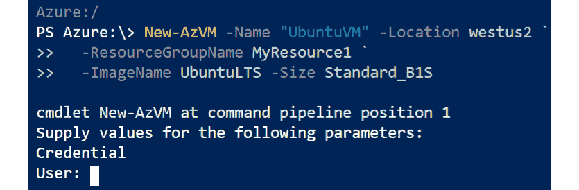

###### 图 2.4：为您的虚拟机提供用户凭据

在 Bash 中，您可以使用以下命令：

```
az vm create --name UbuntuVM --resource-group MyResource2 \
  --image UbuntuLTS --authentication-type password \
  --admin-username student --size Standard_B1S
```

这非常简单，但是如果您以这种方式创建虚拟机实例，则可以设置的选项数量非常有限。 此过程将使用默认设置创建虚拟机所需的多个资源，例如磁盘、NIC 和公共 IP。

让我们深入了解一下细节，并获取有关所做选择的一些信息。

### 图像

在我们的示例中，我们部署了一个名为`UbuntuLTS`的图像的虚拟机。 您可以在几个 Linux 图像之间进行选择：

+   CentOS

+   Debian

+   RHEL

+   UbuntuLTS

+   CoreOS

+   openSUSE

+   SUSE Linux Enterprise

但是，不同供应商提供了许多更多的图像，称为发布商。

让我们获取这些发布商的列表。 在 PowerShell 中，使用此命令：

```
Get-AzVMImagePublisher -Location <REGION>
```

如您在以下截图中所见，Azure 有很多发布商，我们将从中选择一个进行演示：

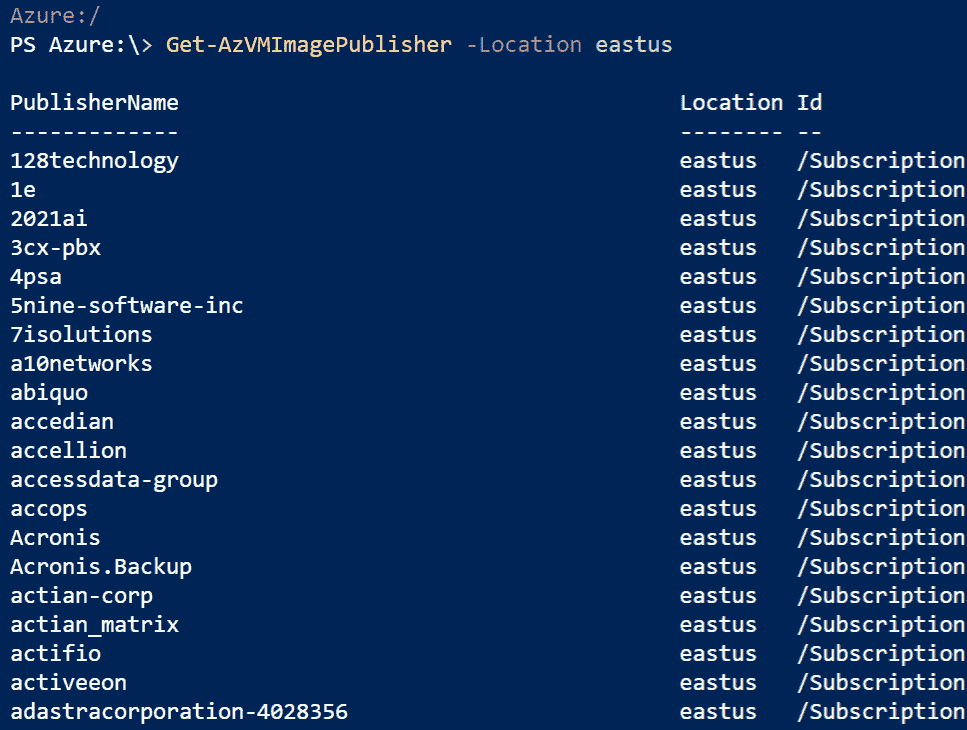

###### 图 2.5：在 PowerShell 中列出图像发布商

在 Bash 中，您可以运行以下命令来获取发布商的列表：

```
az vm image list-publishers --location <REGION> --output table
```

列表是相同的：

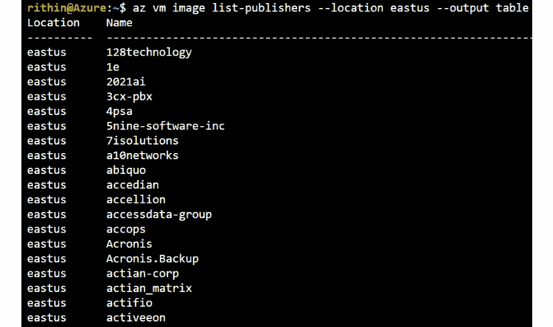

###### 图 2.6：在 Bash 中列出图像发布商

现在您知道发布商，可以使用以下命令获取发布商提供的图像列表：

```
Get-AzVMImageOffer -Location <REGION> '
  -PublisherName <PUBLISHER> | select offer
```

我们已经选择了`Canonical`作为发布商，现在我们正在尝试获取可用的优惠列表。 `UbuntuServer`是其中之一，我们将使用这个：

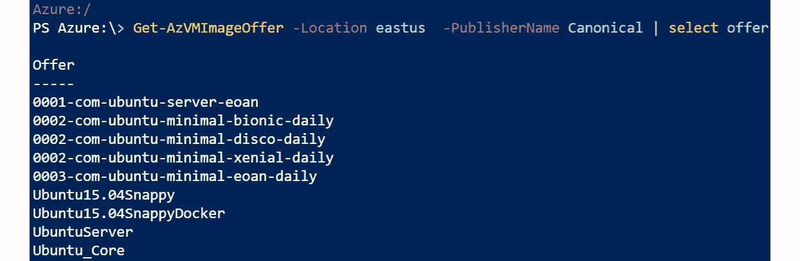

###### 图 2.7：列出 Canonical 发布商的优惠

或者，在 Azure CLI 中运行以下命令：

```
az vm image list-offers --location <REGION> '
  --publisher <PUBLISHER> --output table
```

输出是所谓的*优惠*列表。 优惠是由发布商创建的一组相关图像的名称。

现在我们需要知道图像的可用 SKU。 SKU 是指发行版的主要版本。 以下是使用 Ubuntu 的示例：

```
Get-AzVMImageSku -PublisherName <publisher> -Offer <offer>'
 -Location <location>
```

现在我们已经获得了发布商和优惠的值，让我们继续查看由`Canonical`发布的`UbuntuServer`可用的主要发行版（SKU）：

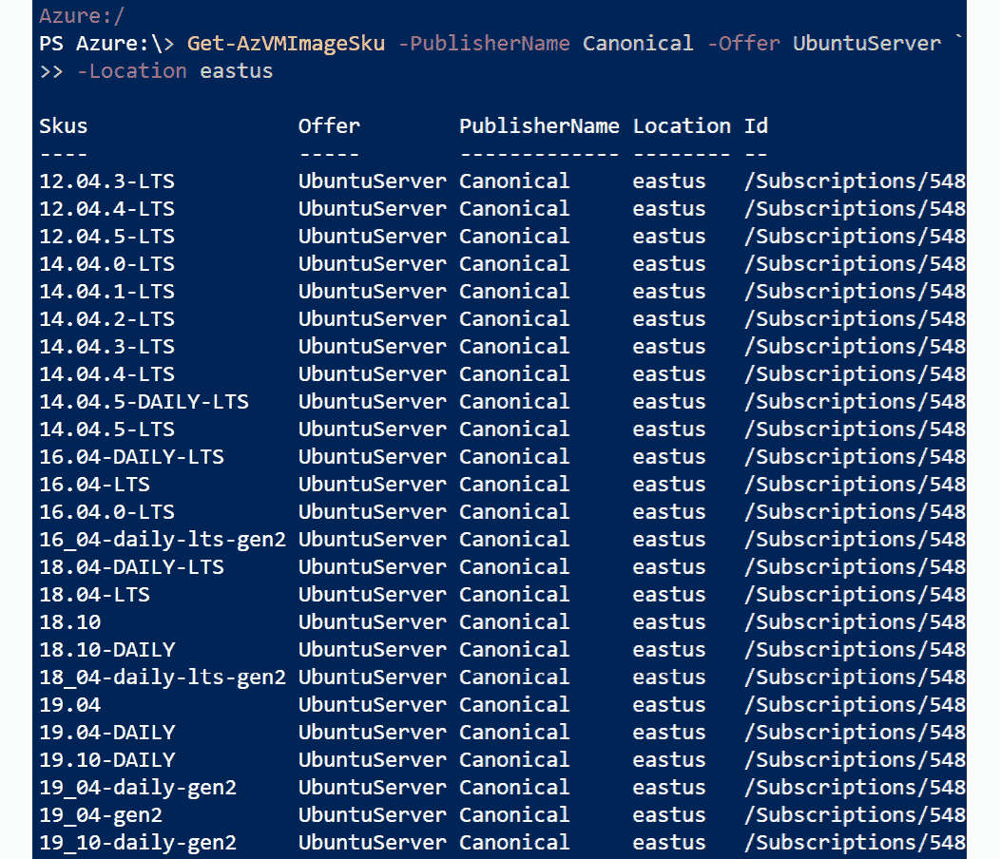

###### 图 2.8：在 Azure CLI 中列出由 Canonical 发布的 UbuntuServer 的 SKU

或者，在 Azure CLI 中运行以下命令：

```
az vm image list-skus --location <LOCATION> \
  --publisher <PUBLISHER> --offer <OFFER> -o table
```

查询此优惠中的特定实例：

```
Get-AzureVMImage -Location <REGION>'
 -PublisherName <PUBLISHER> -Offer <OFFER> '
 -Skus <SKU> | select Version -last 1 
```

让我们再次查看我们拥有的值。 因此，使用发布商名称、优惠和 SKU，我们将获取可用的版本。 在以下截图中，您可以看到图像版本`19.10.201912170`可用。 让我们为我们的虚拟机选择此图像：

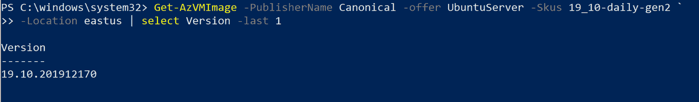

###### 图 2.9：在 Azure CLI 中选择可用的图像版本

这是在撰写本章时提供的最新版本。 如果有任何新版本发布，您可能会看到另一个版本号。

或者，在 Azure CLI 中使用以下命令：

```
az vm image list --location <REGION> --publisher <PUBLISHER> \
  --offer <OFFER> --sku <SKU> --all --query '[].version' \
  --output tsv | tail -1
```

为了将输出减少到最新版本，添加了参数以选择最后一行。 收集的信息包含`Set-AzVMSourceImage` cmdlet 的参数; 但是，在使用此命令之前，我们需要使用`New-AzVMConfig`创建一个新的虚拟机配置：

```
$vm = New-AzVmConfig -VMName <name> -VMSize "Standard_A1"
Set-AzVMSourceImage -PublisherName <PUBLISHER>'
  -Offer <OFFER> -Skus <SKU> -Version <VERSION>
```

最后，我们正在创建一个大小为`Standard_A1`的新虚拟机，并指示 PowerShell 使用`Canonical`发布的`UbuntuServer`优惠中的`19_10-daily-gen2`发行版的图像版本`19.10.201912170`：

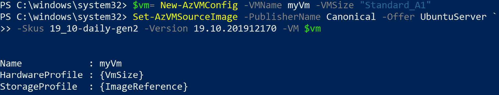

###### 图 2.10：创建一个 Standard_A1 大小的虚拟机

在 Bash 中，收集的信息包含`az vm create`命令的参数：

```
az vm create --name UbuntuVM2 --resource-group Packt-Testing-2   --image canonical:UbuntuServer:19_10-daily-gen2:19.10.201912170 --authentication-type password   --admin-username pacman --size Standard_B1S 
```

#### 注意

在 Bash 和 PowerShell 中，可以使用单词*latest*代替特定版本。收集的信息不足以创建虚拟机。需要更多参数。

### 虚拟机大小

另一件您需要注意的事情是根据您的需求和成本决定虚拟机的大小。有关可用大小和定价的更多信息，请访问[`azure.microsoft.com/en-us/pricing/details/virtual-machines/linux`](https://azure.microsoft.com/en-us/pricing/details/virtual-machines/linux)。

该网站上的列表（包括实例的价格）经常更改！您可以在命令行上获取列表（而不显示成本）：

```
Get-AzVMSize -Location <REGION> | Format-Table
az vm list-sizes --location <REGION> -o table
```

一个小型虚拟机足以执行本书中的练习。在撰写本文时，`Standard_B1ls`是必要的基本性能。但最好重新检查虚拟机的大小/定价列表，如前面提到的。

在 PowerShell 中，`New-AzVM` cmdlet 可以使用`-size`参数，或者可以在`New-AzVMConfig` cmdlet 中使用它：

```
New-AzVMConfig -VMName "<VM NAME>" -VMSize <SIZE>
```

在 Bash 中，添加`az vm create`命令的`--size`参数。

### 虚拟机网络

Azure 虚拟网络允许虚拟机、互联网和其他 Azure 服务之间通过安全网络进行通信。当我们在本章开头创建第一个虚拟机时，有关网络的几个项目是自动创建的：

+   虚拟网络

+   虚拟子网

+   附加到虚拟机并插入虚拟网络的虚拟网络接口

+   配置在虚拟网络接口上的私有 IP 地址

+   公共 IP 地址

网络资源将在*第四章，管理 Azure*中介绍；目前，我们只会查询虚拟机的私有和公共 IP 地址。使用此命令获取公共 IP 地址列表：

```
Get-AzPublicIpAddress -ResourceGroupName <RESOURCE GROUP>'
 | select Name,IpAddress
```

要获取所有虚拟机的私有 IP 地址列表，请使用以下命令：

```
Get-AzNetworkInterface -ResourceGroupName <resource group name> | ForEach { $interface = $_.Name; $ip = $_ | Get-AzNetworkInterfaceIpConfig | Select PrivateIPAddress; Write-Host $interface $ip.PrivateIPAddress }
```

前面的命令可能看起来有点复杂，但这是一个方便的脚本，用于获取私有 IP 列表。如果您想要获取资源组中虚拟机的私有 IP 地址，可以使用以下命令：

```
Get-AzNetworkInterface -ResourceGroup <resource group name>
```

获取的输出将以 JSON 格式显示，并且您可以在`IpConfigurations`下看到私有 IP 地址：

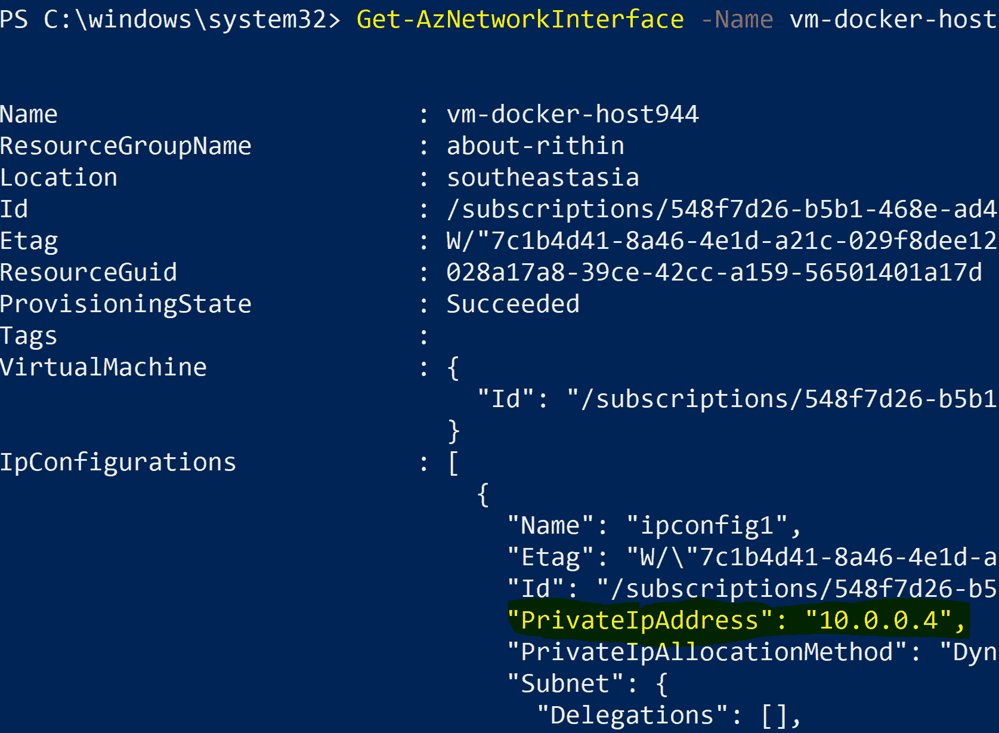

###### 图 2.11：资源组中虚拟机的私有 IP 地址

这也可以使用 Azure CLI 来完成。要获取虚拟机的私有 IP 地址列表，请使用以下命令：

```
az vm list-ip-addresses --resource <RESOURCE GROUP> --output table
```

公共 IP 地址是使虚拟机通过互联网访问的 IP 地址。进入此 IP 地址的虚拟机网络流量经历**网络地址转换**（**NAT**）以配置在 Linux 虚拟机的网络接口上的私有 IP 地址。

### 虚拟机信息

虚拟机部署后，可以使用 PowerShell 和 Bash 获取附加到虚拟机的所有信息，例如状态。查询状态很重要；有几种状态：

+   运行中

+   已停止

+   失败

+   已停止

如果虚拟机未停止，Microsoft 将向您收费。`Failed`状态表示虚拟机无法启动。要查询状态，请执行以下命令：

```
Get-AzVM -Name <VM NAME> -Status -ResourceGroupName <RESOURCE GROUP>
```

在 Bash 中，可以接收部署的虚拟机的状态，但如果需要将输出缩小到单个实例，则无法使用复杂的查询：

```
az vm list --output table
```

要停止虚拟机，首先停止它：

```
Stop-AzVM -ResourceGroupName <RESOURCE GROUP> -Name <VM NAME>
```

现在您可以将其停止：

```
az vm deallocate --name <VM NAME> --resource-group <RESOURCE GROUP>
```

您可以获取有关部署的虚拟机的更多信息。在 PowerShell 中，很难接收虚拟机的属性。首先，创建一个变量：

```
$MYVM=Get-AzVM -Name <VM NAME> -ResourceGroupName <RESOURCE GROUP>
```

现在要求此`MYVM`对象的属性和方法：

```
$MYVM | Get-Members 
```

查看`HardwareProfile`属性以查看此实例的大小：

```
$MYVM.HardwareProfile
```

或者，为了更精确地查看虚拟机信息，使用以下命令：

```
$MYVM.HardwareProfile | Select-Object -ExpandProperty VmSize
```

你也可以尝试`NetworkProfile`、`OSProfile`和`StorageProfile.ImageReference`。

如果你想在 Bash 中使用`az`命令，你可能想尝试的第一个命令是这个：

```
az vm list –-resource-group <RESOURCE GROUP>
```

唯一的问题是它同时显示了所有虚拟机的所有信息；幸运的是，也有一个`show`命令，可以将输出减少到单个虚拟机：

```
az vm show --name <VM NAME> --resource-group <RESOURCE GROUP>
```

并且最好通过使用查询来限制输出。例如，如果你想查看特定虚拟机的存储配置文件，可以查询如下：

```
az vm show --name <VM NAME> --resource-group <RESOURCE GROUP>\
  --query 'storageProfile'
```

上述命令应该给出以下输出：

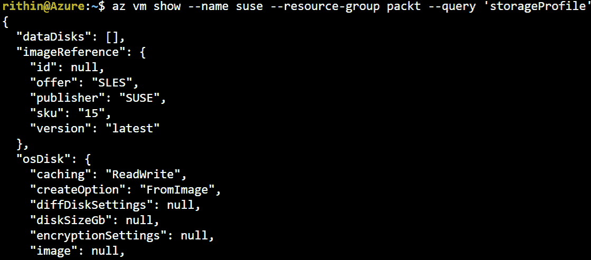

###### 图 2.12：SUSE 虚拟机的存储配置文件

## 连接到 Linux

虚拟机正在运行，准备让您远程登录，使用您在部署第一台虚拟机时提供的凭据（用户名和密码）。另一种更安全的连接到 Linux 虚拟机的方法是使用 SSH 密钥对。由于其复杂性和长度，SSH 密钥更安全。此外，Azure 上的 Linux 支持使用**Azure 活动目录**（**Azure AD**）进行登录，用户将能够使用其 AD 凭据进行身份验证。

### 使用密码身份验证登录到您的 Linux 虚拟机

在*虚拟机网络*部分，查询了虚拟机的公共 IP 地址。我们将使用这个公共 IP 通过本地安装的 SSH 客户端连接到虚拟机。

**SSH**，或**安全外壳**，是一种加密的网络协议，用于管理和与服务器通信。Linux、macOS、**Windows 子系统**（**WSL**）和最近更新的 Windows 10 都配备了基于命令行的 OpenSSH 客户端，但也有更高级的客户端可用。以下是一些示例：

+   Windows：PuTTY、MobaXterm 和 Bitvise Tunnelier

+   Linux：PuTTY、Remmina 和 Pac Manager

+   macOS：PuTTY、Termius 和 RBrowser

使用 OpenSSH 命令行客户端连接到虚拟机：

```
ssh <username>@<public ip>
```

### 使用 SSH 私钥登录到您的 Linux 虚拟机

使用用户名和密码不是登录远程机器的最佳方式。这不是完全不安全的操作，但你仍然在连接中发送你的用户名和密码。如果你想远程执行脚本、执行备份操作等，这也很难使用。

另一种更安全的登录系统的方法是使用 SSH 密钥对。这是一对两个密码安全的密钥：私钥和公钥。

私钥由客户端保留，不应复制到任何其他计算机。它应该绝对保密。在创建密钥对时，最好用密码保护私钥。

另一方面，公钥可以复制到您想要管理的所有远程计算机上。这个公钥用于加密只有私钥才能解密的消息。当您尝试登录时，服务器通过使用密钥的这个属性来验证客户端拥有私钥。没有密码发送到连接中。

有多种方法可以创建 SSH 密钥对；例如，PuTTY 和 MobaXterm 都提供了创建工具。你必须在每台需要访问远程机器的工作站上执行此操作。在本书中，我们使用`ssh-keygen`，因为它适用于每个操作系统：

```
ssh-keygen
```

上述命令的输出应该如下所示：

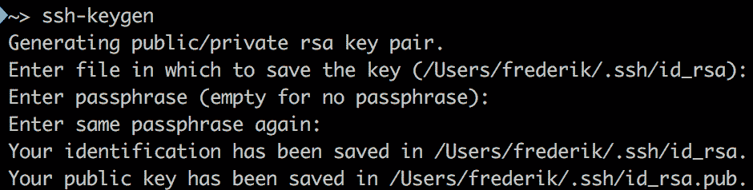

###### 图 2.13：使用 ssh-keygen 创建 SSH 密钥对

不要忘记输入密码！

要了解如何使用 SSH 密钥对访问您的虚拟机，让我们创建一个新的虚拟机。如果您还记得，当我们之前创建 Linux 机器时，我们使用了`az vm create`命令和`authentication-type`作为密码，但在下面的命令中，我们使用了`--generate-ssh-keys`参数。这将生成一个 SSH 密钥对，并将其添加到您的主目录中的`.ssh`目录中，可用于访问虚拟机：

```
az vm create --name UbuntuVM3 --resource-group MyResource2 \
  --admin-username student --generate-ssh-keys --image UbuntuLTS
```

如果您想在 PowerShell 中执行此操作，请使用`Add-AzVMSshPublicKey` cmdlet。有关该命令的更多信息，请参阅[`docs.microsoft.com/en-us/powershell/module/azurerm.compute/add-azurermvmsshpublickey?view=azurermps-6.13.0`](https://docs.microsoft.com/en-us/powershell/module/azurerm.compute/add-azurermvmsshpublickey?view=azurermps-6.13.0)。

虚拟机创建后，您将能够使用此命令访问它：

```
ssh student@<IP ADDRESS>
```

## 总结

本章介绍了 Microsoft Azure 的第一步。第一步始终涉及创建一个新帐户或使用现有的公司帐户。有了帐户，您就可以登录并开始发现 Azure 云。

在本章中，使用 Azure CLI 命令`az`或通过 PowerShell 发现了 Azure 云；通过示例，您了解了以下内容：

+   Azure 登录过程

+   区域

+   存储帐户

+   由出版商提供的图像

+   虚拟机的创建

+   查询附加到虚拟机的信息

+   Linux 是什么以及 Linux 虚拟机的支持

+   使用 SSH 和 SSH 密钥对访问 Linux 虚拟机

下一章从这里开始，带着一个新的旅程：Linux 操作系统。

## 问题

1.  使用命令行访问 Microsoft Azure 的优势是什么？

1.  存储帐户的目的是什么？

1.  您是否能想到为什么会收到以下错误消息？

```
Code=StorageAccountAlreadyTaken
Message=The storage account named mystorage is already taken.
```

1.  提供的报价和图像之间有什么区别？

1.  停止和取消分配虚拟机之间有什么区别？

1.  使用私有 SSH 密钥进行身份验证访问 Linux 虚拟机的优势是什么？

1.  `az vm create`命令有一个`--generate-ssh-keys`参数。创建了哪些密钥，它们存储在哪里？

## 进一步阅读

这一章绝不是关于使用 PowerShell 的教程。但是，如果您想更好地理解示例，或者想更多地了解 PowerShell，我们建议您阅读 Packt Publishing 的*Mastering Windows PowerShell Scripting – Second Edition*（ISBN：9781787126305）。我们建议您从第二章*使用 PowerShell*开始，并至少继续到第四章*在 PowerShell 中使用对象*。

您可以在网上找到大量关于使用 SSH 的文档。一个很好的起点是这本 wikibook：[`en.wikibooks.org/wiki/OpenSSH`](https://en.wikibooks.org/wiki/OpenSSH)。

如果您希望更多地了解 Linux 管理，Packt Publishing 的*Linux Administration Cookbook*是一个很好的资源，特别是对于系统工程师。

要深入了解安全性和管理任务，这是一个很好的阅读材料：*Mastering Linux Security and Hardening*，作者是 Donald A. Tevault，由 Packt Publishing 出版。
