# 第三章：基本的 Linux 管理

在部署了你的第一个 Linux 虚拟机（VM）之后，让我们登录，讨论一些基本的 Linux 命令，并学习如何在 Linux 环境中找到我们的方法。本章是关于基本的 Linux 管理，从 Linux shell 开始，用于与 Linux 系统交互。我们将讨论如何使用 shell 来完成我们的日常管理任务，比如访问文件系统，管理进程（如启动和终止程序）等等。

在本章的最后部分，我们将讨论自主访问控制（DAC）模型以及如何在 Linux 中创建、管理和验证用户和组，并根据用户名和组成员身份获取文件和目录的权限。我们还将涵盖更改文件所有权以及更改和验证基本权限和访问控制列表。

以下是本章的主要主题：

+   与 shell 交互和配置 shell

+   使用 man 页面获取帮助

+   通过 shell 处理和编辑文本文件

+   理解文件层次结构，管理文件系统和挂载新文件系统

+   管理进程

+   用户和组管理

## Linux Shell

在上一章中，我们创建了 VM 并使用 SSH 登录，但是我们如何与 Linux 机器交互并指示其执行任务呢？正如我们在本章开头提到的，我们将使用 shell。

我们将探索广泛使用的 Bash shell，配置 Bash shell 以及如何使用它。shell 是一个用户界面，您可以在其中执行以下操作：

+   与内核、文件系统和进程交互

+   执行程序、别名和 shell 内置

shell 提供以下功能：

+   脚本编写

+   自动补全

+   历史和别名

有许多不同的 shell 可用，例如 KornShell、Bash 和 Z shell（Zsh）。Bash 是几乎每个 Linux 系统上的默认 shell。它的开发始于 1988 年，作为最古老的 shell 之一 Bourne shell 的替代品。Bash 基于 Bourne shell 和从其他 shell（如 KornShell 和 C shell）中学到的经验教训。Bash 已成为最流行的 shell，并可在许多不同的操作系统上使用，包括 Windows 10、FreeBSD、macOS 和 Linux。

以下是添加到 Bash 版本 2.05a（2001 年发布）中的一些最重要的功能，这些功能使 Bash 成为最突出的 shell：

+   命令行编辑

+   历史支持

+   自动补全

+   整数计算

+   函数声明

+   文档（一种将文本输入到单独文件中的方法）

+   新变量，如`$RANDOM`和`$PPID`

最近，Z shell 变得越来越受欢迎；这个 shell 的开发始于 1990 年，可以看作是对 Bash 的扩展。它还具有与 Bash 的兼容模式。它具有更好的自动补全支持，包括自动更正和更高级的路径名扩展。其功能可以通过模块进行扩展，例如，以获取更多关于命令的帮助。值得一提的是 Oh-My-ZSH（https://github.com/robbyrussell/oh-my-zsh）和 Prezto（https://github.com/sorin-ionescu/prezto）项目：它们提供主题、高级配置和插件管理，使 Z shell 非常用户友好。所有这些好功能都是有代价的：Z shell 肯定比 Bash 更耗资源。

### 执行命令

shell 的最重要功能之一是可以执行命令。命令可以是以下之一：

+   Shell 内置（由相关 shell 提供的命令）

+   在文件系统上可执行

+   别名

要找出正在执行的命令类型，可以使用`type`命令：

```
type echo
```

添加`-a`参数将显示包含可执行文件`echo`的所有位置。在下面的截图中，我们可以看到当我们添加`-a`参数时，由于可执行文件的存在，shell 给出了对`/usr/bin/echo`目录的引用：


###### 图 3.1：包含可执行文件 echo 的位置

让我们对`ls`做同样的操作：

```
type ls
```

所以，你将得到一个类似的输出`type ls`：


###### 图 3.2：包含可执行文件 ls 的位置

在这里，我们可以看到`ls`是`ls --color=auto`命令的别名，添加了一些参数。别名可以替换现有命令或创建新命令。没有参数的`alias`命令会给出已经配置的别名：

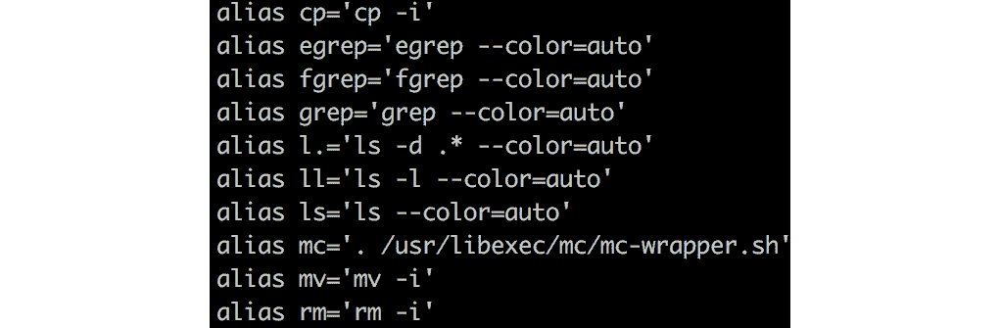

###### 图 3.3：使用别名命令

`ll`别名是一个新创建命令的例子。`mv`命令是一个替换的例子。使用以下命令创建一个新的别名：

```
alias <command>='command to execute'
```

例如，要用`search`替换`grep`命令，执行以下命令：

```
alias search=grep
```

你创建的别名将被添加到`.bashrc`文件中。如果你想要移除一个创建的别名，可以使用`unalias`命令：

```
unalias <alias name>
```

如果你想要移除所有定义的别名，可以使用`unalias -a`。

`which`命令标识了`$PATH`变量中程序的位置。这个变量包含了一个目录列表，用于查找可执行文件。这样，你就不必提供完整的路径：

```
which passwd
```

输出告诉你它在`/usr/bin`目录中可用：


###### 图 3.4：$PATH 变量中程序的目录位置

### 命令行编辑

在许多方面，输入 Bash shell 中的命令与在文本编辑器中工作是一样的。这可能是为什么有一些快捷键，比如跳转到行首，而且这些快捷键与两个最著名、最常用的文本编辑器 Emacs 和 vi 中的快捷键是一样的。

默认情况下，Bash 被配置为处于 Emacs 编辑模式。如果你想要检查当前的编辑模式，运行`set -o`。输出将告诉你 Emacs 或 vi 是否被设置为`on`。以下是一些非常重要的快捷键：

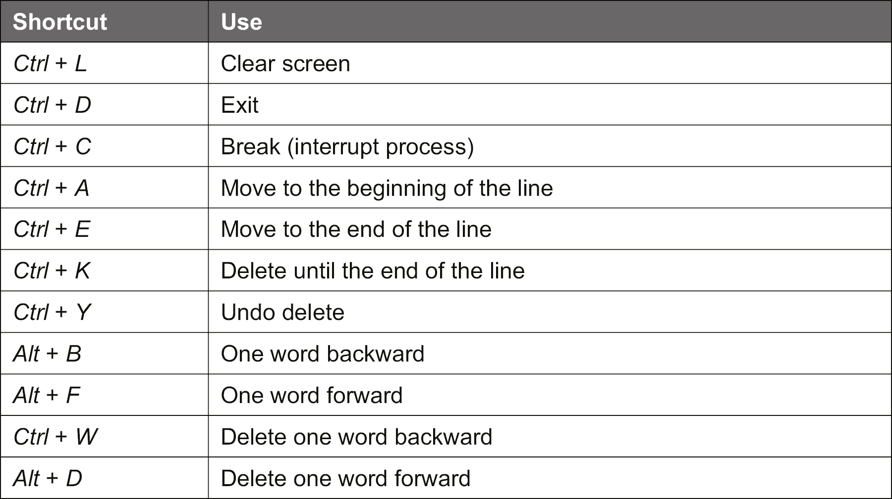

###### 图 3.5：Bash shell 快捷键列表

如果你想使用 vi 模式，执行以下命令：

```
set -o vi
```

要切换回 Emacs 模式，使用以下命令：

```
set -o emacs
```

#### 注意

vi 编辑器在本章的后面部分*使用文本文件*中有介绍。现在，你可以在命令模式下使用几乎每个命令，包括`导航`、`复制`和`粘贴`。

`set`命令是 Bash 内置命令，用于切换特定于 Bash 的属性。没有参数时，它会显示环境变量。

### 处理历史记录

Bash shell 提供了命令行工具，你可以用来处理用户的命令历史。你执行的每个命令都会在主目录的历史文件`~/.bash_history`中注册。要查看这个历史的内容，执行以下命令：

```
history
```

输出显示了一个已使用命令的编号列表；你可以简单地使用以下命令重做一个命令：

+   `!<number>`：根据历史列表编号执行命令。

+   `!<-number>`：例如，`!-2`执行了在历史记录中比上一条命令早两条的命令。

+   `!<first characters of the command>:` 这将执行以这个字符开头的最后一个项目。

+   `!!:` 重复执行上一条命令。您可以将其与其他命令结合使用。例如，`sudo !!`。

您可以使用*Ctrl* + *R*（Emacs 模式）或正斜杠（vi 命令模式）向后搜索历史记录。可以使用箭头键进行浏览。

历史文件不是在执行命令后直接编写的，而是在登录会话结束时。如果您在多个会话中工作，直接编写历史记录可能是一个好主意。要执行此操作，请执行以下操作：

```
history -a
```

要在另一个会话中读取刚保存的历史记录，请执行以下命令：

```
history -r
```

要清除当前会话的历史记录，请使用以下命令：

```
history -c
```

如果要将历史记录保存到文件中，可以执行以下命令：

```
history -w <filename>
```

因此，通过保存清除的历史记录，您清空了历史文件。

与历史记录一起工作的另一个好功能是您可以编辑它。假设您执行了`ls -alh`命令，但您需要`ls -ltr`。只需输入：

```
^alh^ltr
```

这实际上与以下内容相同：

```
!!:s/ltr/alh/
```

当然，您可以对历史记录中的每个条目执行此操作；例如，对于历史记录列表中的第 6 个条目，请使用：

```
!6:s/string/newstring/
```

有时您需要更灵活，想要编辑包含许多拼写错误的大行。输入`fc`命令。使用以下命令修复命令：

```
fc <history number> 
```

这将打开一个文本编辑器（默认为 vi），保存修改后，将执行修改后的命令。

### 自动补全

每个人都会犯错；没有人能记住每个参数。自动补全可以防止许多错误，并在输入命令时以多种方式帮助您。

自动补全适用于以下情况：

+   可执行文件

+   别名

+   Shell 内置

+   文件系统上的程序

+   文件名

+   参数，如果实用程序支持并且安装了`bash-completion`软件包

+   变量

如果 shell 配置为 Emacs 模式，请使用*Ctrl* + *I*来激活自动完成；如果 shell 配置为 vi 模式，您也可以使用*Ctrl* + *P*。

#### 注意

如果有多个可能性，您必须两次按*Ctrl* + *I*或*Ctrl* + *P*。

### Globbing

Globbing 是将 Linux shell 中包含通配符的非特定文件名扩展为一个或多个特定文件名的过程。Globbing 的另一个常用名称是路径名扩展。

Bash shell 中识别以下通配符：

+   `?`：一个字符。

+   `*`：多个字符。请注意，如果将此通配符用作第一个字符，则以点开头的文件名将不匹配。当然，您可以使用`.*`。

+   `[a-z], [abc]`：来自范围的一个字符。

+   `{a,b,c}`：a 或 b 或 c。

以下是使用通配符的一些不错的例子：

+   `echo *`：这将列出当前工作目录中的文件或目录。

+   `cd /usr/share/doc/wget*`：这将切换到以`wget`开头的目录名所在的`/usr/share/doc`目录。

+   `ls /etc/*/*conf`：这将列出`/etc`目录下所有目录中的所有`.conf`文件。以下是此命令的示例：

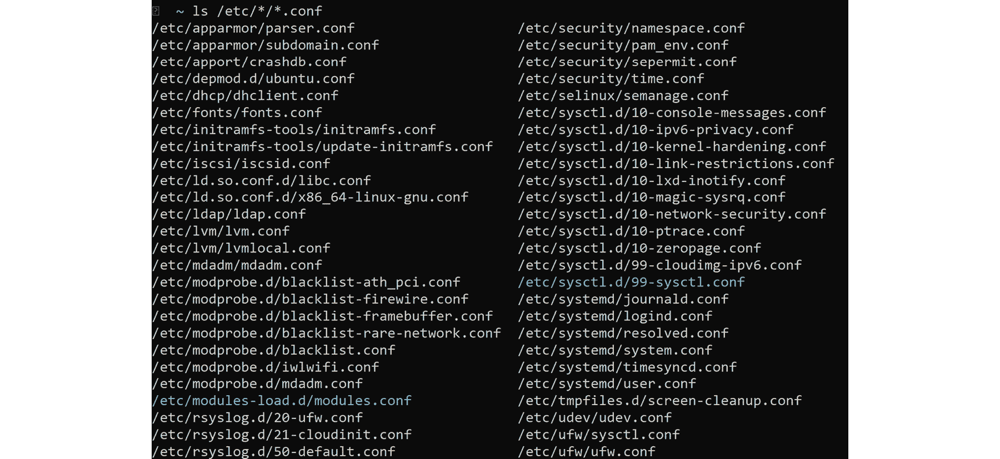

###### 图 3.6：列出所有目录中的.conf 文件

+   `mkdir -p /srv/www/{html,cgi-bin,logs}`：这将在`/srv/www`目录下创建`html`、`cgi-bin`和`log`目录。

### 重定向

在 Unix 早期，开发人员之一 Ken Thompson 定义了*Unix 哲学*，这是一种基于经验的方法，旨在使一切尽可能模块化，并尽可能重用代码和程序。特别是在那些日子里，可重用性对性能原因很重要，并且提供了一种允许轻松维护代码的方法。

在 Peter H Salus 修改的*Unix 哲学*版本中，重定向的目标如下：

+   编写只做一件事并且做得很好的程序。

+   编写程序以协同工作。

+   编写处理文本流的程序，因为这是一个通用接口。

为了使这种哲学成为可能，开发了支持文件描述符或现代术语中的通信通道的程序。每个程序至少有三个通信通道：

+   标准输入（0）

+   标准输出（1）

+   标准错误（2）

此实现的一个很好的特性是您可以重定向通道。

将标准输出重定向到文件，使用以下命令：

```
command > filename
```

要将标准输出重定向并追加到现有文件中，请使用：

```
command >> filename
```

将标准错误和输出重定向到文件，如下所示：

```
command &> filename 
```

首先将标准输出重定向到文件，然后也将标准错误重定向到那里，使用：

```
command 2>&1 filename
```

要重定向标准输入，请使用以下命令：

```
filename < command
```

让我们进行一个活动，以帮助我们理解重定向的概念。请先运行命令，验证输出，然后使用以下方法将其重定向到文件。例如，运行`ls`并验证输出，然后使用`>`将输出重定向到`/tmp/test.list`。您始终可以使用`cat /tmp/test.list`检查文件：

```
ls > /tmp/test.list 

echo hello > /tmp/echotest 

echo hallo again >> /tmp/echotest 

ls -R /proc 2> /tmp/proc-error.test 

ls -R /proc &> /tmp/proc-all.test 

sort < /etc/services
```

输入重定向的特殊版本是`heredoc.txt`：

```
cat << EOF >> /tmp/heredoc.txt 
 this is a line 
 this is another line 
EOF
```

`cat`命令将标准输出连接并将其附加到`/tmp/heredoc.txt`文件中。由于键盘直到遇到标签（在本例中为`EOF`）之前不是标准输入，因此无法中断或中断命令。这种方法通常用于从脚本创建配置文件。

另一种可能性是使用`|`符号将一个命令的标准输出重定向到另一个命令的标准输入：

```
command | other command
```

例如：

```
ls | more
```

使用`tee`命令，您可以结合重定向和管道的功能。有时您希望确保`command 1`的输出被写入文件以进行故障排除或记录，并且同时将其管道传输到另一个命令的标准输入：

```
command 1 | tee file.txt | command 2
```

还可以使用`-a`参数将内容追加到文件中。

`tee`的另一个用例是：

```
<command> | sudo tee <file> 
```

这样，就可以在不使用复杂的`su`结构的情况下写入文件。

### 使用变量

每个命令行界面，即使没有高级脚本编写的可能性，也都有变量的概念。在 Bash 中，有两种类型的变量：

+   影响 Bash 行为或提供有关 Bash 的信息的内置或内部变量。一些示例包括`BASH_VERSION`，`EDITOR`和`PATH`。

+   已知一个或多个应用程序的环境变量，包括内置变量和用户定义变量。

要列出当前 shell 的环境变量，可以使用`env`或`printenv`命令。`printenv`还能够显示特定变量的内容：

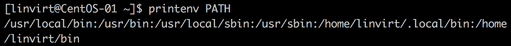

###### 图 3.7：使用 printenv 命令显示特定变量的内容

查看变量内容的另一种方法如下：

```
echo $VARNAME
```

要声明环境变量，请执行`var=value`。例如：

```
animal=cat 

echo $animal
```

要向值添加更多字符，请使用：

```
animal=$animal,dog 

echo $animal
```

`animal`变量只对当前 shell 可见。如果要将其导出到子进程，需要导出该变量：

```
export animal
```

Bash 还能够进行简单的计算：

```
a=$(( 4 + 2 ))
```

或者，您可以使用此命令：

```
let a=4+2 
echo $a 
```

另一个特性是将命令的输出放入变量中-一种称为嵌套的技术：

```
MYDATE=$(date +"%F")
echo $MYDATE
```

当然，这只是 Bash 能够做到的一小部分，但这应该足够让您学会如何处理 Bash 配置文件并根据需要修改它们，以使它们以您想要的方式运行。

### Bash 配置文件

Bash shell 有三个重要的系统范围配置文件：`/etc/profile`、`/etc/bashrc`和`/etc/environment`。这些文件的目的是存储关于您的 shell 的信息，如颜色、别名和变量。例如，在前一节中，我们添加了一些别名，它们存储在一个名为`bashrc`的文件中，这是一个配置文件。每个文件都有自己的目的；我们现在将逐个查看它们。

`/etc/profile`是一个在用户登录到系统时执行的脚本。修改此文件不是一个好主意；而是使用快捷方式`/etc/profile.d`目录。该目录中的文件按字母顺序执行，并且必须具有`.sh`作为文件扩展名。作为一个附注，`/etc/profile`不仅被 Bash shell 使用，而且被所有 Linux 的 shell 使用，除了 PowerShell。您还可以在主目录中创建一个特定于用户的配置文件脚本，`~/.bash_profile`，这也是特定于 Bash 的。

配置文件脚本的一些典型内容如下：

```
set -o vi  
alias man="pinfo -m" 
alias ll="ls -lv --group-directories-first" 
shopt -u mailwarn  
unset MAILCHECK
```

#### 注意

如果您使用 Ubuntu 或类似的发行版，默认情况下不会安装`pinfo`。运行`apt install pinfo`来安装它。

`shopt`命令更改了一些默认的 Bash 行为，比如检查邮件或 globbing 的行为。`unset`命令是`set`命令的相反。在我们的示例中，默认情况下，Bash 每分钟检查一次邮件；执行`unset MAILCHECK`命令后，`MAILCHECK`变量被移除。

`/etc/bashrc`脚本在任何用户调用 shell 或 shell 脚本时都会启动。出于性能原因，尽量保持它尽可能简洁。您可以使用特定于用户的`~/.bashrc`文件，如果退出 shell，则会执行`~/.bash_logout`脚本。`bashrc`配置文件通常用于修改提示符（`PS1`变量）：

```
DARKGRAY='\e[1;30m'
GREEN='\e[32m'
YELLOW='\e[1;33m'
PS1="\n$GREEN[\w] \n$DARKGRAY(\t$DARKGRAY)-(\u$DARKGRAY)-($YELLOW-> \e[m"
```

让我们看看`PS1`变量的参数：

+   颜色（比如传递给 PS1 变量的 GREEN、DARKGRAY）是用 ANSI 颜色代码定义的。

+   `\e`：ANSI 中的转义字符。

+   `\n`：换行。

+   `\w`：当前工作目录。

+   `\t`：当前时间。

+   `\u`：用户名。

`/etc/environment`文件（在基于 Red Hat 的发行版中默认为空）是在登录时执行的第一个文件。它包含每个进程的变量，而不仅仅是 shell。它不是脚本，每行只有一个变量。

以下是`/etc/environment`的示例：

```
EDITOR=/usr/bin/vim
BROWSER=/usr/bin/elinks
LANG=en_US.utf-8
LC_ALL=en_US.utf-8
LESSCHARSET=utf-8
SYSTEMD_PAGER=/usr/bin/more
```

`EDITOR`变量是一个重要的变量。许多程序可以调用编辑器；有时默认是 vi，有时不是。设置默认值可以确保您始终可以使用您喜欢的编辑器。

#### 注意

如果您不想注销并重新登录，可以使用`source`命令，例如`source /etc/environment`。这样，变量将被读入当前的 shell。

## 获取帮助

无论您是 Linux 的新手还是长期用户，都会时不时需要帮助。不可能记住所有命令及其参数。几乎每个命令都有一个`--help`参数，有时在`/usr/share/doc`目录中安装了文档，但最重要的信息来源是信息文档和 man 页面。

### 使用 man 页面

有一句话，**阅读完整的手册**（**RTFM**），有时人们会用另一个不太友好的词替换*fine*。几乎每个命令都有一个手册：man 页面为您提供了所有需要的信息。是的，不是所有的 man 页面都容易阅读，特别是旧的页面，但如果您经常使用 man 页面，您会习惯它们，并且能够快速找到所需的信息。通常，man 页面已安装在您的系统上，并且可以在线获取：[`man7.org/linux/man-pages`](http://man7.org/linux/man-pages)。

请注意，Azure 镜像中的 openSUSE Leap 和 SUSE Linux Enterprise Server 中删除了 man 页面。您必须重新安装每个软件包才能再次使用它们：

```
sudo zypper refresh
for package in $(rpm -qa);
  do sudo zypper install --force --no-confirm $package;
done
```

man 页面被安装在`/usr/share/man`目录中，以 GZIP 压缩的存档形式。man 页面是特别格式化的文本文件，您可以使用`man`命令或`pinfo`来阅读。`pinfo`实用程序充当文本浏览器，非常类似于基于文本的网络浏览器。它添加了超链接支持和使用箭头键在不同的 man 页面之间导航的能力。

#### 注意

如果您想要用`pinfo`替换`man`命令，最好使用`alias man="pinfo -m"`命令创建一个别名。

所有的 man 页面都遵循相似的结构，它们总是被格式化并分成各个部分：

+   **名称**：命令的名称和简要解释。通常是一行；详细信息可以在 man 页面的描述部分找到。

+   **概要**：包含所有可用参数的概述。

+   `ifconfig`命令明确说明这个命令已经过时。

+   **选项**：命令的所有可用参数，有时包括示例。

+   **示例**：如果示例不在选项部分，可能会有一个单独的部分。

+   **文件**：对于这个命令很重要的文件和目录。

+   **另请参阅**：指的是其他 man 页面、info 页面和其他文档来源。一些 man 页面包含其他部分，如注释、错误、历史、作者和许可证。

Man 页面是帮助页面，分为几个部分；这些部分在 man 页面的描述部分中描述。您可以使用`man man`来了解更多关于这些部分的信息。以下屏幕截图显示了不同的部分：

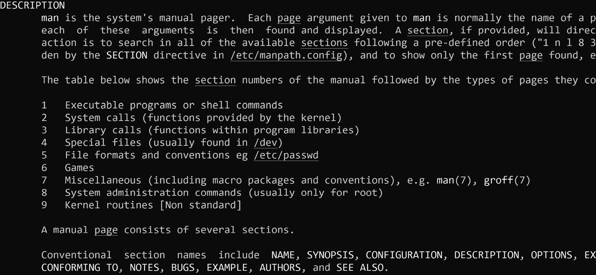

###### 图 3.8：man 页面的不同部分

了解这些分区是很重要的，特别是如果您想要搜索文档。要能够搜索文档，您需要索引 man 页面：

```
sudo mandb 
```

#### 注意

通常，在安装软件包后，索引会自动更新。有时，打包者可能没有添加一个后安装脚本来执行`mandb`命令。如果您找不到信息并且非常确定应该有一个 man 页面，手动执行该命令是个好主意。

之后，您可以使用`apropos`或`man -k`命令来找到您需要的信息。无论您选择哪个，语法都是一样的：

```
man -k -s 5 "time"
```

在前面的命令中，我们搜索了单词`time`，将搜索限制在 man 页面的第五部分。

### 使用 info 文档

Info 文档是另一个重要的信息来源。man 页面和 info 页面的区别在于 info 页面的格式更自由，而 man 页面是某个命令的一种说明手册。Info 文档大多数时候是完整的手册。

Info 文档和 man 页面一样，被压缩并安装在`/usr/share/info`目录中。要阅读它们，您可以使用`info`或更现代的`pinfo`。这两个命令都是文本浏览器。如果您是 Emacs 编辑器的忠实粉丝，您可以使用 InfoMode ([`www.emacswiki.org/emacs/InfoMode`](https://www.emacswiki.org/emacs/InfoMode))来阅读 info 文档。

其中一个很好的功能是，您可以使用`pinfo`或`info`直接跳转到文档中的超链接：

```
pinfo '(pinfo) Keybindings'
```

#### 注意

如果您使用 Ubuntu 或类似的发行版，默认情况下不会安装`pinfo`。运行`apt install pinfo`来安装它。

前面的例子打开了`pinfo`的 man 页面，并直接跳转到`Keybindings`部分。

`pinfo`命令有一个搜索选项，`-a`。如果有匹配，它将自动打开相应的`info`文档或 man 页面。例如，如果您想了解`echo`命令，使用`pinfo -a echo`；它会带您到`echo`命令的帮助部分。

`info`命令也有一个搜索选项：`-k`。使用`-k`，`info`命令将在所有可用手册中查找关键字。例如，在这里我们检查了`paste`关键字，它返回了所有可能的匹配项：

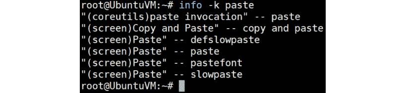

###### 图 3.9：使用 info 命令检查 paste 关键字

### 其他文档

另一个文档来源是 Linux 发行版供应商提供的文档。Red Hat、SUSE、Canonical 和 Debian 的网站托管了有用的手册、维基等。它们可能非常有用，特别是对于特定于发行版的主题，如软件管理。

有两个不是微软认可的发行版，Gentoo 和 Arch Linux，它们在其网站上有出色的维基。当然，这些维基中的一些信息是特定于这些发行版的，但许多文章是有用的，并且适用于每个发行版。

Linux 基金会在[`wiki.linuxfoundation.org`](https://wiki.linuxfoundation.org)上托管了一个维基，其中包含有关诸如网络等主题的文档，以及`init`系统、systemd 和 Linux 防火墙（firewalld）等标准；这些主题在*第五章，高级 Linux 管理*中讨论。

最后，Linux 文档项目可以在[`www.tldp.org`](https://www.tldp.org)找到。尽管你可以在那里找到的许多文档都非常古老，但它仍然是一个很好的起点。

## 处理文本文件

由 Ken Thompson 发起的 Unix 哲学旨在创建一个占用空间小、用户界面清晰的功能强大的操作系统。因为 Unix 哲学的一部分是*编写处理文本流的程序，因为那是一个通用接口*，程序之间的通信、配置文件和许多其他内容都是以纯文本实现的。本节是关于处理纯文本的。

### 阅读文本

在最基本的层面上，以纯文本格式阅读文件的内容意味着将该文件的内容重定向到标准输出。`cat`命令就是可以做到这一点的实用程序之一——将一个或多个文件（或另一个输入通道）的内容连接到标准输出：

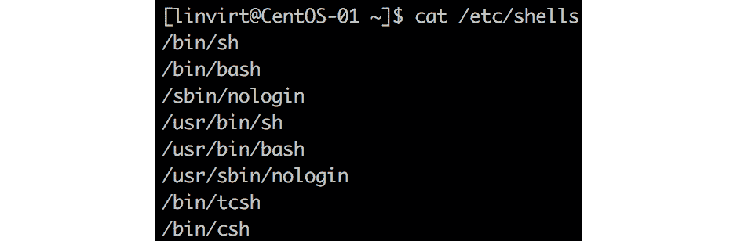

###### 图 3.10：使用 cat 命令生成标准输出

该实用程序的一些不错的参数包括：

+   `-A`：显示所有不可打印字符

+   `-b`：编号行，包括空行

+   `-n`：编号行，不包括空行

+   `-s`：抑制重复（!）空白行

还有另一个类似于`cat`的实用程序，即`tac`实用程序。这将以逆序打印文件：

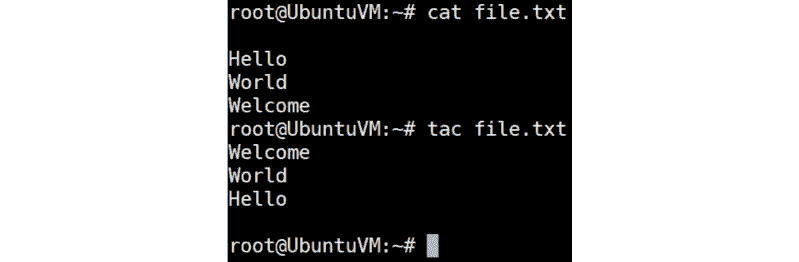

###### 图 3.11：使用 tac 实用程序以逆序打印文件

`cat`命令的问题在于它只是将内容转储到标准输出而不对内容进行分页，并且终端的回滚功能不是很好。

`more`实用程序是一个分页过滤器。它一次显示一个屏幕的文本，并提供一个基本的搜索引擎，可以通过使用正斜杠来激活。在文件末尾，`more`将退出，有或没有消息`按空格键继续`。

`less`实用程序比`more`实用程序更先进。它具有以下功能：

+   能够向前、向后和水平滚动

+   高级导航

+   高级搜索引擎

+   多文件处理

+   能够显示有关文件的信息，如文件名和长度

+   能够调用 shell 命令

在`more`和`less`中，`v`命令允许我们切换到编辑器，默认为 vi 编辑器。

#### 注意

`more`和`less`都可以在每个发行版上使用；但是，在某些发行版上，`more`是`less`的别名。使用`type`命令进行验证！

如果您只想看到文件顶部的特定行数，有一个名为`head`的实用程序。默认情况下，它显示文件的前 10 行。您可以使用`-n`参数修改此行为，以便指定行数，使用`-c`参数指定字节/千字节的数量。

`head`实用程序是`tail`的相反；它默认显示前 10 行。例如，我们有一个名为`states.txt`的文件，其中按字母顺序列出了美国各州的名称。如果我们使用`head`命令，它将打印文件的前 10 行，如果我们使用`tail`命令，它将打印最后 10 行。让我们来看一下这个：

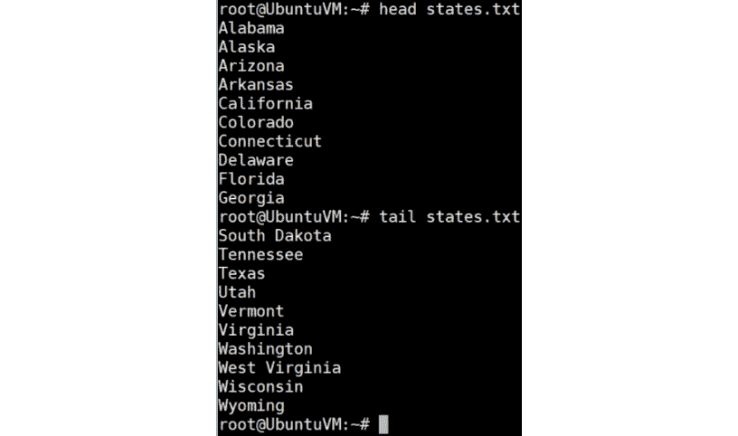

###### 图 3.12：使用 head 和 tail 实用程序列出文件的前 10 个和最后 10 个条目

它识别与`head`相同的参数以修改其行为。但是有一个额外的参数，使得这个实用程序对于日志记录非常有用。`-f`在文件增长时追加输出；这是一种跟踪和监视文件内容的方法。一个非常著名的例子是：

```
sudo tail -f /var/log/messages
```

### 在文本文件中搜索

您可能听说过 Linux 中的一切都是文件。此外，Linux 中的许多东西都是由文本流和文本文件管理的。迟早，您会想要搜索文本以进行修改。这可以通过使用正则表达式来实现。正则表达式（简称 regex）是一种特殊字符和文本的模式，用于在执行搜索时匹配字符串。正则表达式被许多应用程序使用，这些应用程序具有内置处理器，例如 Emacs 和 vi 文本编辑器，以及`grep`、`awk`和`sed`等实用程序。许多脚本和编程语言都支持正则表达式。

在本书中，我们只会涵盖这个主题的基础知识——足够让您在日常系统管理任务中使用它们。

每个正则表达式都是围绕一个原子构建的。原子标识要匹配的文本以及在进行搜索时要找到的位置。它可以是已知的单个字符项（或者如果您不知道字符，则是一个点），一个类，或者一个范围，比如：


###### 图 3.13：原子的示例

正则表达式也可以以简写类的形式表示。以下是一些简写类的示例：


###### 图 3.14：简写类的示例

我们可以使用位置锚点来确定下一个字符的位置。一些常用的位置锚点包括：


###### 图 3.15：位置锚点列表

使用重复运算符，您可以指定字符应该出现多少次：


###### 图 3.16：重复运算符列表

一些例子如下：

+   如果搜索字符`b`并找到单词`boom`，它将匹配字母`b`。如果搜索`bo`，它将按照这个顺序匹配这些字符。

+   如果您搜索`bo{,2}m`，单词`bom`和`boom`将匹配。但如果存在单词`booom`，它将不匹配。

+   如果您搜索`^bo{,2}m`，只有当单词`boom`位于行的开头时才会匹配。

可以使用以下内容找到正则表达式的参考：

```
man 7 regex
```

我们已经提到的一个实用程序是`grep`实用程序，它用于在文本文件中进行搜索。这个实用程序有多个版本；如今，`egrep`是最常用的版本，因为它具有最完整的正则表达式支持，包括简写范围和 OR 交替运算符`|`。

`egrep`和`grep`的常见选项包括：


###### 图 3.17：egrep 和 grep 选项

您还可以通过查看 man 页面来查看其他选项。

这是`grep`的一个简单示例：

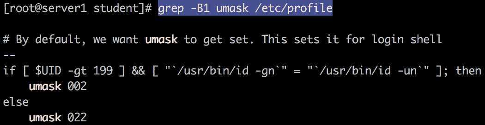

###### 图 3.18：grep 示例

另一个非常有用的实用程序是`awk`。现在，`awk`是由开发人员 Alfred Aho、Peter Weinberger 和 Brian Kernighan 创建的实用程序。它是用于生成和操作日志文件或报告的文本文件的脚本语言。`awk`不需要任何编译，您可以在报告中提及所需的字段。

让我们看一个例子：

```
awk -F: '/^root/ {print "Homedir of root:", $6}' /etc/passwd
```

它扫描`/etc/passwd`文件，并使用字段分隔符冒号来拆分内容。它搜索以`root`字符串开头的行，并打印一些文本（`root 的主目录：`）和第六列。

### 编辑文本文件

由于文本文件在 Linux 中非常重要，因此文本编辑器非常重要。每个发行版都在其存储库中提供一个或多个编辑器，用于图形和非图形环境。您可以肯定至少有 vim（现代 vi 实现）和 Emacs 可用。vi 爱好者和 Emacs 爱好者之间一直存在着一场战争——他们已经互相侮辱了几十年，并将在未来的几十年内继续这样做。

我们不会为您做决定；相反，如果您已经熟悉其中一个，请坚持下去。如果您不了解 vi 或 Emacs，请尝试一段时间并自行决定。

还有一些其他可用的编辑器：

+   `nano`，专有 Pico 的免费克隆，Pico 是 Pine 电子邮件客户端的文本编辑器组件

+   `mcedit`，**Midnight Commander**（**MC**）文件管理器的一部分，可以独立运行

+   `joe`，它可以模拟 nano、Emacs 和一个名为 WordStar 的非常古老的文字处理器的键绑定（请注意，对于 CentOS，这个编辑器在标准存储库中不可用，但在第三方存储库中可用）。

#### 注意

如果您想了解 vi，请执行`vimtutor`命令，这是随 vim 一起提供的教程。这是学习 vi 中所有基础知识、命令和文本编辑的良好起点。

Emacs 带有一个非常好的帮助功能，您可以通过*Ctrl* + *H* + *R*在 Emacs 中访问。

编辑文本流和文件的另一种方法是使用非交互式文本编辑器 sed。它不是通过在文本编辑器窗口中打开文件来编辑文本文件，而是通过 shell 处理文件或流。如果您想要执行以下操作，它是一个方便的实用程序：

+   自动对文件进行编辑

+   在多个文件上进行相同的编辑

+   编写一个转换程序，例如，在小写和大写之间进行转换，甚至更复杂的转换

sed 编辑器的语法与 vi 编辑器的命令非常相似，并且可以进行脚本化。

sed 的默认行为不是编辑文件本身，而是将更改转储到标准输出。您可以将此输出重定向到另一个文件，或者使用`-i`参数，该参数代表`sed`命令：

```
sed -i 's/string/newstring/g' filename.txt
```

它将搜索一个字符串，替换它，并继续搜索和替换直到文件末尾。

通过一点脚本编写，您可以以相同的方式编辑多个文件：

```
for files in *conf; do sed -i 's/string/newstring/g' $files; done
```

您可以将搜索限制为单行：

```
sed -i '10 s/string/newstring/g' <filename>
```

`sed`的`info`页面是所有命令的重要资源，更重要的是，它有一个示例部分，如果您想了解更多。

## 在文件系统中找到自己的方法

现在您知道如何操作和编辑文本文件了，是时候看看这些文件是如何存储在系统中的了。作为系统管理员，您将不得不检查、挂载甚至卸载驱动器。因此，现在让我们仔细看看 Linux 中的文件系统。Linux 文件系统的布局与 Unix 家族的其他成员一样：与 Windows 非常不同。没有驱动器字母的概念。相反，有一个根文件系统（`/`），并且根文件系统上包括其他已挂载的文件系统在内的所有其他内容都可用。

在本节中，您将了解文件的存放位置以及它们为何在那里。

### 文件系统层次结构标准

2001 年，Linux 基金会启动了 Linux 标准基础项目（LSB）。基于 POSIX 规范，这个过程的想法是建立一个标准化的系统，使应用程序可以在任何兼容的 Linux 发行版上运行。

文件系统层次结构标准（FHS）是该项目的一部分，定义了目录结构和目录内容。当然，不同发行版之间仍然存在一些关于目录结构的细微差异，但即使在不愿意完全支持 LSB 的发行版上，如 Debian，目录结构也遵循 FHS。

以下截图来自一个 CentOS 系统，使用 tree 实用程序显示目录结构。如果您的系统上没有安装 tree，则 shell 会提示您安装该命令。请安装。

在根文件系统中，有以下目录：

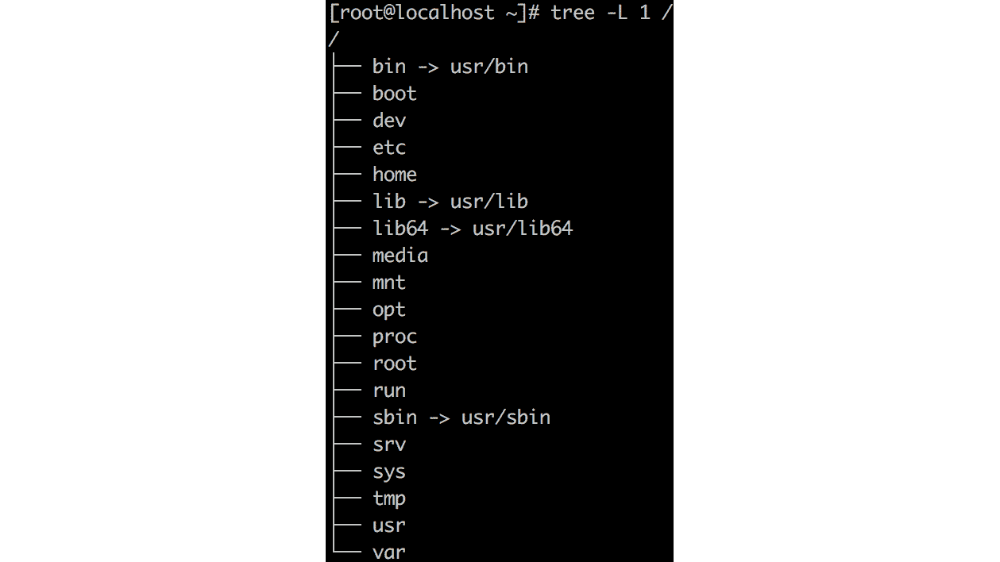

###### 图 3.19：使用 tree 实用程序显示目录结构

tree 命令将以树状结构布局文件系统。或者，您可以使用 ls -lah /以列表格式查看结构。

以下目录在截图中出现：

+   /bin：包含在最小系统上需要由非特权用户执行的程序，如 shell。在基于 Red Hat 的系统中，此目录是指向/usr/bin 的符号链接。命令如 ps、ls 和 ping 都存储在这里。

+   /sbin：包含在最小系统上需要由特权用户（root）执行的程序，如文件系统修复工具。在基于 Red Hat Enterprise Linux 的系统中，此目录是指向/usr/sbin 的符号链接。例如 iptables、reboot、fdisk、ifconfig 和 swapon。

+   /dev：设备挂载在一个叫做 devfs 的特殊文件系统上。所有外围设备都在这里，如串行端口、磁盘和 CPU，但不包括网络接口。例如：/dev/null、/dev/tty1。

+   /proc：进程挂载在一个叫做 procfs 的特殊文件系统上。

+   /sys：sysfs 文件系统上的硬件信息。

+   /etc：由所有程序需要的可编辑文本配置文件组成。

+   /lib：驱动程序和不可编辑文本配置文件的库。库文件名要么是 ld*，要么是 lib*.so.*，例如 libutil-2.27.so 或 libthread_db-1.0.so。

+   /lib64：驱动程序的库，但没有配置文件。

+   /boot：内核和引导加载程序。例如：initrd.img-2.6.32-24-generic、vmlinuz-2.6.32-24-generic。

+   /root：root 用户的用户数据。只有 root 用户有权写入此目录。/root 是 root 用户的主目录，不同于/。

+   /home：非特权用户的用户数据。类似于 Windows 中的 C:\Users\username 文件夹。

+   /media：可移动介质，如 CD-ROM 和 USB 驱动器，都挂载在这里。每个用户至少有只读权限。例如，/media/cdrom 用于 CD-ROM，/media/floppy 用于软盘驱动器，/media/cdrecorder 用于 CD 刻录机。

+   /mnt：包括远程存储在内的不可移动介质。每个用户至少有只读权限。

+   /run：特定用户或进程的文件，例如应该对特定用户可用的 USB 驱动程序，或者守护进程的运行时信息。

+   /opt：不是发行版的一部分的可选软件，如第三方软件。

+   /srv：静态服务器数据。可用于静态网站、文件服务器和 Salt 或 Puppet 等编排软件。

+   /var：动态数据。从打印队列和日志到动态网站都有。

+   `/tmp`: 临时文件，在重新启动期间不会保留。现在，它通常是挂载在这个目录上的 RAM 文件系统（`tmpfs`）。这个目录本身已经过时，从应用程序的角度来看，已经被`/var`或`/run`中的目录取代。

+   `/usr`: 包含所有额外的与软件相关的二进制文件、文档和源代码。

再次使用`tree`命令显示`/usr`中的目录结构：

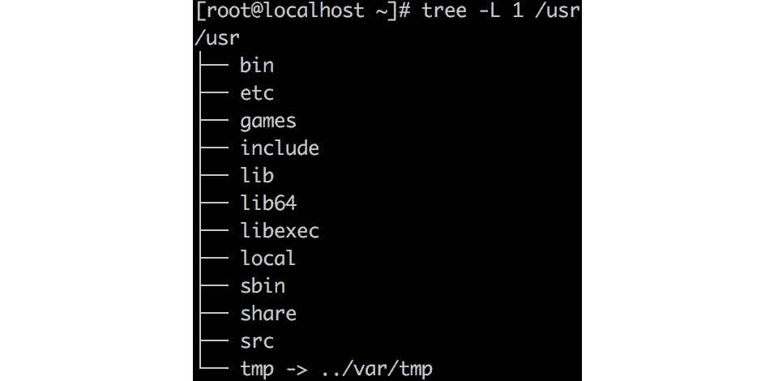

###### 图 3.20：/usr 目录中的目录结构

`/usr`的目录结构与`/`的结构非常相似。添加了一些额外的目录：

+   `/usr/etc`: 如果重新编译已经是发行版的一部分的软件，配置文件应该在`/usr/etc`中，这样它们就不会与`/etc`中的文件冲突。

+   `/usr/games`: 旧游戏的数据，比如`fortune`、`figlet`和`cowsay`。

+   `/usr/include`: 开发头文件。

+   `/usr/libexec`: 包装脚本。比如说你需要多个版本的 Java。它们都需要不同的库、环境变量等。包装脚本用于调用具有正确设置的特定版本。

+   `/usr/share`: 程序数据，如壁纸、菜单项、图标和文档。

+   `/usr/src`: Linux 内核源代码和发行版中包含的软件的源代码。

+   `/usr/local`: 你自己安装和编译的软件。

`/usr/local`的目录结构与`/usr`相同：

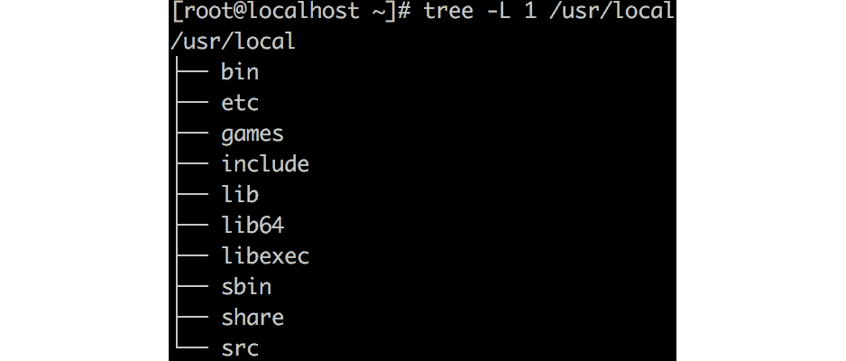

###### 图 3.21：/usr/local 目录的目录结构

这个目录是为了软件开发而存在的。在生产环境中不需要有这个目录。

可选软件放在`/opt`中。主目录结构是`/opt/<vendor>/<software>/`，例如`/opt/google/chrome`。可能的供应商/提供者名称列表由`/usr`和`/usr/local`维护，有一个例外：你可以在软件目录或`/etc/opt`目录中选择`/conf`和`/etc`之间。非本地 Linux 软件，如 PowerShell，可以在软件目录内使用自己的结构。

### 挂载文件系统

更精确地定义根文件系统可能是个好主意。根文件系统是根目录`/`所在的文件系统。所有其他文件系统都挂载在这个根文件系统上创建的目录上。要找出哪些目录是根文件系统本地的，哪些是挂载点，执行`findmnt`命令：

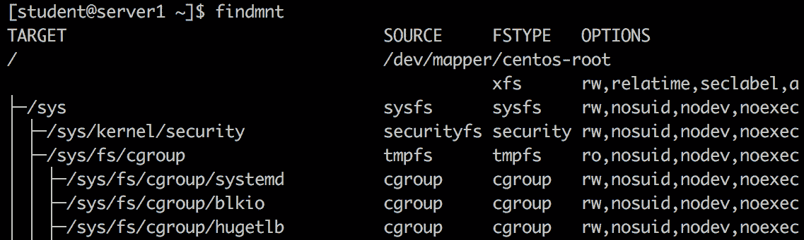

###### 图 3.22：使用 findmnt 命令查找挂载点

添加`-D`参数将显示文件系统的大小和可用空间量：

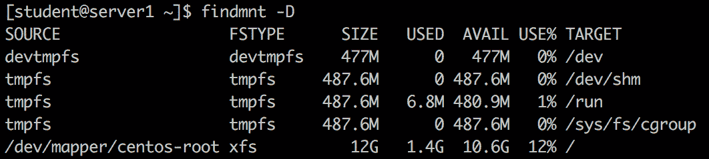

###### 图 3.23：使用 findmnt -D 命令列出文件大小和可用空间

`findmnt`命令是查找设备挂载位置的好方法，例如：

```
findmnt /dev/sda1
```

如果一个目录不是挂载点，使用`-T`参数：

```
findmnt -T /usr
```

在*第五章，高级 Linux 管理*中，详细介绍了不同的文件系统，以及如何挂载和自动挂载本地和远程文件系统。

### 在文件系统上查找文件

在文件系统上搜索文件可以使用`find`命令。不幸的是，如果你对这个命令不熟悉，man 页面可能会让人不知所措，而且很难阅读。然而，如果你了解这个命令的基本原理，man 页面将帮助你添加参数来搜索文件或目录的每个属性，或者两者兼而有之。

`find`命令的第一个可能参数是选项。这些选项影响`find`命令的行为，即它是否应该遵循符号链接以及调试和速度优化选项。选项是可选的——大多数情况下您不需要它们。

在选项之后，下一个参数告诉`find`命令在哪里开始搜索过程。从根目录(`/`)开始搜索不是一个很好的主意；它会花费太多时间，并且可能在大型文件系统上消耗太多 CPU 活动。记住 FHS——例如，如果要搜索配置文件，请从`/etc`目录开始搜索：

```
find /etc
```

上述命令将显示`/etc`中的所有文件。

在位置之后，下一个参数是包含一个或多个测试的表达式。要列出最常见的测试，请使用以下命令：

+   `-type`，`f`表示文件，`d`表示目录，`b`表示块设备

+   `-name <pattern>`

+   `-user`和`-group`

+   `-perm`

+   `-size`

+   `-exec`

您可以执行这些测试的组合。例如，要搜索以`conf`结尾的文件，请使用以下命令：

```
find /etc -type f -name '*conf' 
```

对于一些测试，如`size`和`atime`，可以添加所谓的与提供的参数进行比较：

+   `+n`：大于`n`

+   `-n`：小于`n`

+   `n`：正好`n`

`find`命令搜索文件和目录，并将它们与`n`的值进行比较：

```
find / -type d -size +100M
```

此示例将搜索内容超过 100MB 的目录。

最后一个参数是应在找到的文件上执行的操作。示例包括：

+   `-ls`，输出类似于`ls`命令。

+   `-print`打印文件名。

+   `-printf`格式化`-print`命令的输出。

+   `-fprintf`将格式化输出写入文件。

`-printf`参数非常有用。例如，此命令将搜索文件并列出其大小（以字节为单位）和文件名。之后，您可以使用`sort`命令按大小对文件进行排序：

```
find /etc -name '*conf' -printf '%s,%p\n' | sort -rn 
```

还有一些更危险的操作，例如`-delete`删除找到的文件和`-exec`执行外部命令。在使用这些参数之前，请非常确定搜索操作的结果。大多数情况下，从性能的角度来看，您最好使用`xargs`实用程序。此实用程序将结果转换为命令的参数。这样的命令示例如下；`grep`实用程序用于搜索结果的内容：

```
find /etc/ -name '*' -type f| xargs grep "127.0.0.1"
```

## 进程管理

在前一节中，我们讨论了 Linux 中的文件系统。从系统管理员的角度来看，管理进程至关重要。会有一些情况，您需要启动、停止，甚至杀死进程。此外，为了避免使您的机器过载，您需要谨慎处理系统上运行的进程。让我们更仔细地看看 Linux 中的进程管理。

进程由 Linux 内核运行，由用户启动，或由其他进程创建。所有进程都是进程编号为 1 的子进程，这将在下一章中介绍。在本节中，我们将学习如何识别进程以及如何向进程发送信号。

### 查看进程

如果您启动一个程序，会有一个`/proc`。

在 Bash 中，您可以使用以下命令找到当前 shell 的 PID：

```
echo $$
```

您还可以找到父 shell 的 PID：

```
echo $PPID
```

要在文件系统上找到程序的 PID，请使用`pidof`实用程序：

```
pidof sshd
```

您可能会看到 shell 返回多个 PID。如果您只想返回一个 PID，请使用`-s`参数，表示单次射击：

```
pidof -s sshd
```

让我们来看看当前 shell 的`proc`目录：

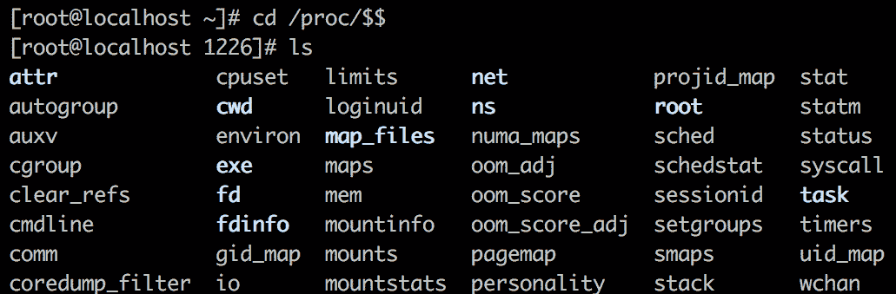

###### 图 3.24：当前 shell 的 proc 目录

您可以查看此进程的所有属性。让我们看看其中一些：

+   `cmdline`：执行此进程的命令

+   `environ`：此进程可用的环境变量

+   `status`：文件的状态，**UID**（**用户标识符**）和拥有该进程的用户/组的**GID**（**组标识符**）

如果执行`cat environ`，输出将很难阅读，因为换行符是`\0`而不是`\n`。您可以使用`tr`命令将`\0`转换为`\n`来解决这个问题：

```
cat /proc/$$/environ | tr "\0" "\n"
```

`proc`目录对故障排除非常有趣，但也有许多工具使用这些信息生成更人性化的输出。其中一个实用程序是`ps`命令。这个命令有一些奇怪之处；它支持三种不同类型的参数：

+   `ps -ef`与`ps -e -f`相同。

+   `ps ax`与`ps a x`相同。

+   **GNU 风格**：由双破折号和长命名选项前导。命令不能分组。

三种样式的输出格式不同，但您可以使用选项修改行为。以下是比较：

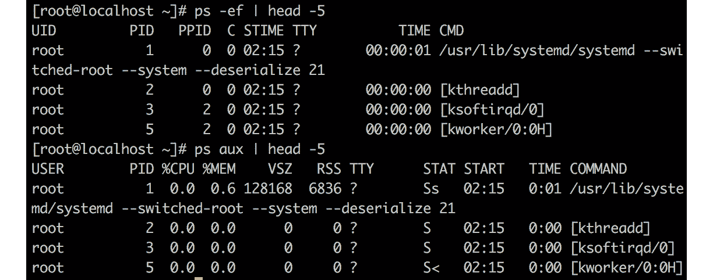

###### 图 3.25：使用带参数的 ps 实用程序

方括号中的进程是内核进程。

您可以查询特定值，例如：

```
ps -q $$ -o comm
```

这与以下内容相同：

```
cat /proc/$$/cmdline
```

另一个可以帮助您搜索进程的实用程序是`pgrep`。它可以根据名称和用户等值进行搜索，并默认显示 PID。输出可以使用参数进行格式化，例如使用`-l`列出进程名称，或使用`-o`将完整命令添加到输出中。

使用`top`命令监视进程的交互方式：

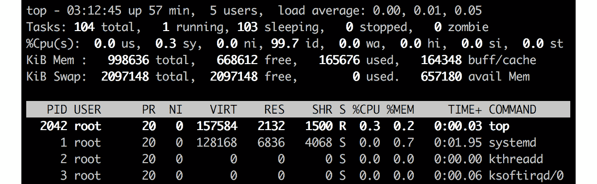

###### 图 3.26：使用 top 命令监视进程

在`top`中可见的进程的列中的值与`ps`中的值相同。在`top`的手册页中，您可以找到对它们含义的很好解释。其中一些将在后面的章节中介绍。

`top`命令或更高级的`htop`命令可以帮助您快速识别占用过多内存或 CPU 的进程，并向进程发送信号。如果您想要详细和高级的进程监视和故障排除，最好使用 Azure 中提供的工具。这将在*第十一章，故障排除和监视工作负载*中介绍。

### 向进程发送信号

在现实世界中，您可能会遇到一个问题，即某个特定进程正在消耗大量内存。此时，您可能希望向该进程发送终止信号。同样，在处理进程时，您可能会遇到不同的情况。在本节中，我们将探讨可以发送给进程的不同信号。在信号的手册页第七部分中，您可以找到有关信号的更多信息。信号是发送给进程的消息，例如，改变优先级或终止进程。在本手册中描述了许多不同的信号，但只有少数几个真正重要：

+   **信号 1**：这会挂起进程；它将重新加载附加到进程的所有内容。通常用于重新读取更改的配置文件。

+   **信号 2**：与*Ctrl* + *C*和*Ctrl* + *Break*相同。

+   **信号 3**：正常退出进程；与*Ctrl* + *D*相同。

+   **信号 15**：默认信号，用于终止命令，使终端有时间清理一切。

+   **信号 9**：终止命令而不清理。这很危险，可能会使您的系统不稳定，有时甚至会有漏洞。

如果您想要查看可以发送给进程的信号列表，请运行：

```
kill -l
```

要向进程发送信号，可以使用`top`（快捷键`k`）或`kill`命令：

```
kill -HUP <PID>
```

有一个很好的实用程序可以用来 grep 一个进程或一组进程；它可以一次发送一个信号：`pkill`。它类似于`pgrep`。可以根据`name`和`uid`等值进行选择。

## 自主访问控制

现在我们已经介绍了文件系统和进程管理，应该有一种方法来限制您创建的文件的权限。换句话说，您不应该授予每个人对所有内容的访问权限，大多数组织都遵循给予最细粒度权限的原则。**自主访问控制**（**DAC**）是一种安全实现，它限制对文件和目录等对象的访问。用户或一组用户根据所有权和对象上的权限获得访问权限。

在云环境中，用户和组管理可能不是您日常工作的一部分。通常委托给诸如**活动目录**（**AD**）之类的身份管理系统，并且您不需要许多用户帐户；现在在应用程序级别进行身份验证和授权更加重要。但是，能够验证用户并了解基础系统的工作原理仍然是一个好主意。

### 用户管理

如果您在 Azure 中部署虚拟机，在向导中您将指定一个用户，该用户将由 Azure 代理用户管理在虚拟机中创建 - 例如，如果您使用 PowerShell 部署虚拟机：

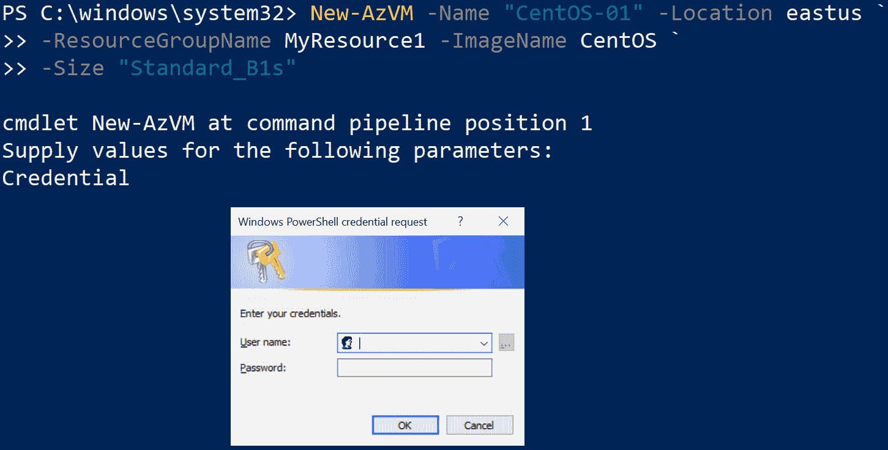

###### 图 3.27：使用 PowerShell 部署虚拟机

您可以使用此帐户登录。这是一个普通用户，也称为非特权用户，没有管理权限。要获得管理权限，您需要`sudo`命令；`sudo`表示超级用户执行（或以超级用户身份执行）。没有参数时，`su`命令将当前用户切换到另一个用户，即 root - Linux 中的管理员帐户。

#### 备注

如果您想要 root 权限，在 Azure 中的某些 Linux 映像中，您不能使用`su`命令。它默认禁用。要获取 root shell，您可以使用`sudo -s`。默认情况下，`sudo`命令会要求您输入密码。

要获取有关此用户帐户的更多信息，请使用`getent`命令从存储用户信息的`passwd`数据库中获取实体。这个`passwd`数据库可以是本地的，存储在`/etc/passwd`文件中，也可以是远程的，远程服务器将通过检查用户数据库（例如**轻量级目录访问协议**（**LDAP**））来授予授权：

```
sudo getent passwd <username>
```

要获取`linvirt`用户的详细信息：


###### 图 3.28：使用 getent 获取 linvirt 的详细信息

此命令的输出是一个以冒号分隔的列表：

+   用户帐户名

+   密码

+   用户 ID

+   组 ID

+   **通用电气综合操作系统**（**GECOS**）字段用于额外的帐户信息

+   此用户的主目录

+   默认 shell

在 Unix 操作系统家族的早期，密码存储在`/etc/passwd`文件中，但出于安全原因，哈希密码被移动到`/etc/shadow`。密码可以使用以下命令更改：

```
sudo passwd <username>
```

如果要更改当前用户的密码，不需要使用`sudo`，也不需要指定用户名。您可以使用`getent`在`/etc/shadow`文件中查看条目：


###### 图 3.29：使用 getent 命令检查密码条目

哈希密码后的列包含可以使用`chage`命令查看（和更改）的老化信息。阴影数据库中的标记是自 Unix 的虚拟生日（1970 年 1 月 1 日）以来的天数。`chage`命令将其转换为更易读的形式：

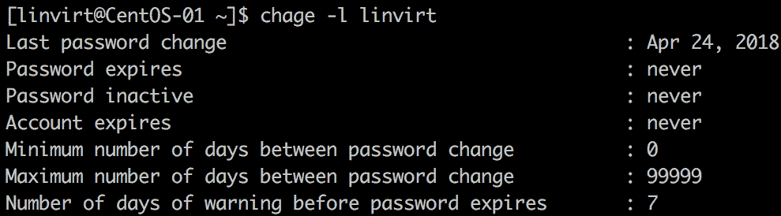

###### 图 3.30：使用 chage 命令获取老化信息

让我们回到`passwd`数据库。用户 ID 的编号在`/etc/login.defs`文件中定义。ID `0`保留给 root 帐户。ID `1`到`200`保留给在现代 Linux 系统中不再使用的`admin`帐户。在基于 Red Hat 的发行版中，范围 201-999 保留给系统帐户，和在这些帐户下运行的守护程序。非特权帐户的范围是 1,000 到 60,000 用于本地用户，>60,000 用于远程用户（例如，AD 或 LDAP 用户）。Linux 发行版之间存在一些小差异。让我们总结一下这些值：


###### 图 3.31：用户 ID 及其保留用户类型

许多发行版都配置了所谓的`/etc/login.defs`文件：

```
USERGROUPS_ENAB yes 
```

这意味着如果您创建一个用户，将自动创建一个与登录名相同的主要组。如果禁用此功能，新创建的用户将自动成为另一个组的成员，该组在`/etc/default/useradd`中定义：

```
GROUP=100
```

可以使用`chfn`命令更改 GECOS 字段：

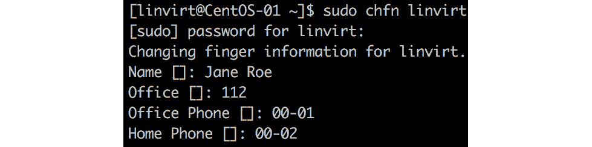

###### 图 3.32：使用 chfn 命令更改 GECOS 字段

#### 注意：

`chfn`（更改 finger）命令是指一个旧实用程序`finger`，它不是默认安装的，但仍然可以在存储库中找到。还有一个`finger`守护程序，可以通过网络提供 GECOS 信息，但被认为是安全风险。

在创建用户时，默认 shell 在`/etc/default/useradd`中定义。您可以使用`chsh`命令将默认 shell 更改为另一个。shell 必须在`/etc/shells`文件中列出：

```
chsh -s /bin/tcsh linvirt
```

为了本书的目的，保持 Bash 作为默认 shell。

在本节中，您学习了如何验证和更改现有本地用户的属性。当然，您也可以添加额外的用户：

```
sudo useradd <username>
```

`useradd`命令有很多自定义选项。您可以使用`man useradd`了解更多信息。或者，您可以使用`adduser`命令：

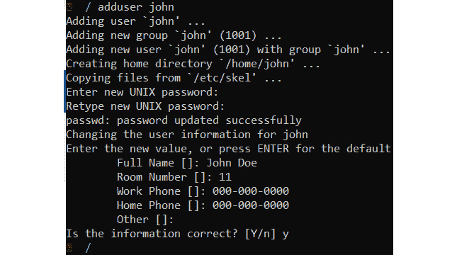

###### 图 3.33：使用 adduser 命令添加用户

### 组管理

如前一章所述，用户将成为主要组的一部分。当您创建用户时，如果不指定组，将自动创建一个与用户名相同的组。如果您检查前面的屏幕截图，您可以看到一个名为`john`的组，用于用户`john`。

除了是主要组的成员之外，还可以添加额外的组成员资格。这是为了访问组目录/共享或在`sudo`配置中委派权限而必要的。您可以在创建用户时使用`useradd`命令的`--groups`参数添加现有的额外组成员，或者之后使用`usermod`或`groupmems`。

让我们创建一个新用户和一个新组，并验证结果：

```
sudo useradd student
sudo passwd student
sudo getent passwd student
sudo groupadd staff 
sudo getent group staff
```

将`student`用户添加到`staff`组：

```
sudo groupmems -g staff -a student
```

或者：

```
sudo usermod –aG staff student
sudo groupmems -g staff -l
sudo getent group staff
```

您可以使用**switch group**（**sg**）临时更改您的主要组：

```
su student
id -g 
sg staff
```

#### 注意：

虽然不太常见，但您可以使用`gpasswd`命令为组帐户添加密码。这样，不属于该组的用户仍然可以使用`sg`并输入该组的密码。

一个非常特殊的组是`wheel`组。在`sudo`配置中，属于这个组的用户能够执行需要管理员权限的命令。在 Ubuntu 中，这个组不可用；而是有一个名为`sudo`的组，可以用于相同的目的。

### 登录管理

在企业环境中，管理员需要收集诸如登录用户数、无效登录数以及任何授权用户尝试登录的信息，以进行安全审计。在本章中，我们将介绍 Linux 中的登录管理，这在安全方面至关重要。

任何对 Linux 系统的登录都会被一个名为`systemd-logind`的服务跟踪和管理，以及一个相应的命令：`loginctl`。这个命令适用于所有的 Linux 发行版；然而，如果你使用**Windows 子系统用于 Linux**（**WSL**），由于缺乏 systemd，这将不可用。

这个命令的参数分为用户、会话和座位三个部分。要使用这些参数进行一些练习，使用学生账户的凭据在你的 VM 上打开第二个`ssh`会话。在第一个`ssh`会话中执行命令。

首先，列出会话：

```
loginctl list-sessions
```

记录会话 ID 和特定会话的详细信息：

```
loginctl show-session <session number>
```

在我的情况下，会话 ID 是`27`，所以我们将使用`loginctl`来检查会话详细信息：

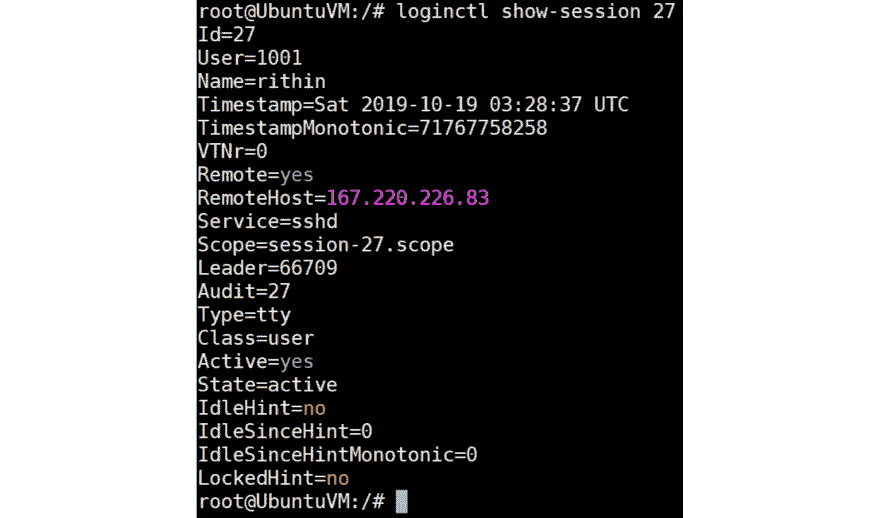

###### 图 3.34：检查会话 ID 27 的会话详细信息

查看用户属性：

```
loginctl show-user <username>
```

切换到第二个 SSH 会话并执行`man man`。

现在切换登录管理回到第一个 SSH 会话，并使用`user-status`参数查看学生的状态：

使用用户状态参数查看学生的状态

###### 图 3.35：使用用户状态参数

最后，终止会话：

```
sudo loginctl terminate-session <session id>
```

还有一个`terminate-user`参数，如果一个会话中有多个用户，这可能会很方便。

## 总结

本章是一个关于如何在 Linux 中生存的速成课程，如果你对这个操作系统不熟悉的话。这一章并不是关于如何成为一名高级 Linux 管理员。

在你作为 Azure 管理员的日常生活中，你可能不会使用本章中的所有内容。例如，你可能不会在虚拟机中创建用户。但是你应该能够验证在诸如 AD 之类的身份管理系统中配置的用户，并验证他们能够登录。

本章主要讲述了如何使用 shell、文件系统的结构以及查找文件。我们看了一下文本文件在 Linux 中的作用以及如何处理和编辑它们。我们处理了进程，并学会了如何查看和终止它们。最后但并非最不重要的是，我们看了用户和组管理。

在下一章中，我们将讨论在 Azure 中管理资源。

## 问题

在本章中，我不想回答一些问题，而是让你做一个练习：

1.  创建用户`Lisa`、`John`、`Karel`和`Carola`。

1.  为这些用户设置密码为`welc0meITG`。

1.  验证这些用户的存在。

1.  创建`finance`和`staff`组。

1.  使用户`Lisa`和`Carola`成为`finance`的成员，`Karel`和`John`成为`staff`的成员。

1.  创建/home/staff 和/home/finance 目录，并将这些目录的组所有权分别设置为 staff 和 home。

1.  给予 staff 组对 finance 目录的读取权限。

1.  确保新创建的文件获得正确的组所有权和权限。

## 进一步阅读

有很多为 Linux 操作系统新用户出版的书籍。以下是我个人喜欢的一些。

*与 Linux 一起工作-命令行的快速技巧*（ISBN 978-1787129184）由 Petru Işfan 和 Bogdan Vaida 是一个奇怪的收集，里面有很多不错的技巧，有时这就是你所需要的。

如果你能阅读德语，那么 Michael Kofler（[`kofler.info`](https://kofler.info)）的所有书籍都应该放在你的书架上，即使你是一名经验丰富的 Linux 用户！

微软网站上有关于正则表达式的非常好的文档：[`docs.microsoft.com/en-us/dotnet/standard/base-types/regular-expressions`](https://docs.microsoft.com/en-us/dotnet/standard/base-types/regular-expressions)。如果你想练习使用正则表达式，我也喜欢[`regexone.com`](http://regexone.com)。

`awk`实用程序附带有一本大型手册（[`www.gnu.org/software/gawk/manual/gawk.html`](https://www.gnu.org/software/gawk/manual/gawk.html)），但也许不是最好的起点。Shiwang Kalkhanda 在《学习 AWK 编程》（ISBN 978-1788391030）中做得非常好，编写了一本非常易读的书。不要害怕这个标题中的“编程”一词，特别是如果你不是开发人员；你应该阅读这本书。
