# 第四章：管理 Azure

在*第二章*，*开始使用 Azure 云*中，我们迈出了进入 Azure 世界的第一步。我们发现有许多方法可以管理 Azure 环境，其中包括 Azure 门户和命令行接口。你可以在 Azure 门户中使用命令行接口在你的工作站上运行它们。在本书的后面，我们将看到使用自动化和编排解决方案还有其他很好的可能性。在*第三章*，*基本 Linux 管理*结束时，我们创建了一个 Linux 虚拟机，并探索了 Linux 环境的基础知识。

在我们继续探讨更高级的主题之前，本章涵盖了 Azure 基础架构的组件，这些组件是我们工作负载、虚拟机和容器所需的。我们已经讨论了 Linux 中的文件系统，但是我们如何向虚拟机添加更多的数据磁盘呢？作为系统管理员，你可能需要根据业务需求允许或拒绝流量到你的虚拟机，但这在 Azure 中如何实现？在某些情况下，你需要将多个网络接口连接到虚拟机。你将如何完成这个任务？本节将回答你关于如何管理与虚拟机相关的 Azure 资源的所有问题。我们谈论的是我们在以前的章节中已经使用过的组件，有时甚至是在不知情的情况下。

基本上，本章是关于 Azure 资源的。记住，它们都是资源组的一部分，资源组是一个逻辑容器，用于部署和管理资源。以下是本章的一些关键要点：

+   管理 Azure 中的存储资源和不同的存储选项

+   管理 Azure 中的网络资源并了解它们在虚拟机中的作用

+   使用 PowerShell 和 Azure CLI 中的便捷命令来管理 Azure 中的资源

#### 注意

在这本书中，我们尽可能中立地对待可用的接口。因为这一章更多关于理论而不是接口，我们将以 PowerShell 作为示例。

## 使用 Azure CLI 和 PowerShell 管理 Azure 资源

在本章中，我们将看到如何使用 PowerShell 和 Azure CLI 来管理 Azure 资源。我们在这里要做的每一个任务也可以从 Azure 门户中完成。然而，作为一个每天都在终端执行任务的系统管理员，你应该能够使用 CLI 或 PowerShell 来管理你的资源。本章中几乎每个命令都是用 PowerShell 编写的；然而，在本章结束时，你会找到每个 PowerShell 命令的 Azure CLI 等效命令。命令列表太长了，最好参考官方的微软文档或使用相应的帮助命令。

在某些情况下，甚至在接下来的章节中，我们将使用 Azure 门户。这是为了简化流程，并让你们都了解另一种方法。如果你愿意，你可以使用门户，但是当涉及自动化任务和编排部署时，CLI 或 PowerShell 体验是必不可少的。因此，我们鼓励你们在本章中遵循 PowerShell 命令，并投入时间测试使用 Azure CLI 的等效命令。

以下是本章完成任务的一些技术要求。

## 技术要求

对于本章，需要有存储和网络的基本知识。在*进一步阅读*部分，你可以找到一些准备自己的建议。

虽然不是必需的，但最好至少有一个虚拟机正在运行。这样，你不仅可以在本章中创建新资源，还可以查看现有虚拟机的属性。在本节中，我们将在`chapter4`资源组中创建一个名为`ubuntu01`的 Ubuntu 虚拟机作为示例。

设置资源组和位置的变量：

```
$myRG = "chapter4"
$myLocation = "westus"
$myTestVM = "ubuntu01"
```

创建资源组：

```
New-AzResourceGroup -Name $myRG -Location $myLocation
```

创建虚拟机：

```
  New-AzVm '
  -ResourceGroupName $myRG '
  -Name $myTestVM '
  -ImageName UbuntuLTS '
  -Location $myLocation '
  -VirtualNetworkName "$myTestVM-Vnet" '
  -SubnetName $myTestVM-Subnet '
  -SecurityGroupName "$myTestVM-NSG" '
  -PublicIpAddressName $myTestVM-pip
```

目前，在此示例中使用的参数并不重要；在本章结束时，您将能够理解它们。

不是真正的要求，但很好拥有的是 Azure Storage Explorer 实用程序，可以免费在[`azure.microsoft.com/en-us/features/storage-explorer`](https://azure.microsoft.com/en-us/features/storage-explorer)上获得。这是一个独立的实用程序，可安装在您的工作站上。此实用程序将帮助您上传、下载和管理 Azure blob、文件、队列和表。它还支持 Azure Cosmos DB 和 Azure Data Lake。另一个优势是您可以访问连接到虚拟机的磁盘。Storage Explorer 也作为 Azure 门户中的选项可用。

## 管理存储资源

微软的云解决方案用于处理数据存储的是 Azure 存储。Azure 存储提供高可用性、安全性、可扩展性和可访问性。在 Azure 中，我们有不同类型的数据或存储服务。它们是：

+   Azure Blob

+   Azure 文件

+   Azure 队列

+   Azure 表

让我们更仔细地看看每一个，并了解它们是什么：

+   Azure Blob：用于存储大量非结构化数据的优化对象，例如文本或二进制数据。它们通常用于使数据可用于其他资源，例如存储可用于创建虚拟磁盘的 VHD 文件。另一个用例是将它们用作音频和视频文件的存储。通过使 blob 公开访问，甚至可以流式传输数据。

+   Azure 文件：Azure 文件是托管在 Azure 中可以通过**服务器消息块**（**SMB**）访问并可以挂载到本地计算机的文件共享。您可能想知道这些与普通文件共享有何不同。这里的附加优势是生成的 URL 将包括一个**共享访问签名**（**SAS**），并且文件共享将能够从世界各地访问。

+   Azure 队列：用于将消息从一个资源传递到另一个资源，特别是用于无服务器服务，如 Azure Web 应用程序和函数。它还可以用于创建异步处理的工作积压。

+   Azure 表：用于 Azure Cosmos DB 服务。

+   Azure 磁盘：这是用于托管磁盘存储和非托管磁盘的。

在本章中，我们只会涵盖 Blob 存储、Azure 文件和磁盘存储，因为队列和表存储是针对特定解决方案的，只对应用程序开发人员重要。

#### 注意

如果您有大量数据要存储在云中，上传可能需要太长时间。微软有一个名为 Azure Data Box Disk 的服务。它允许您将加密的 SSD 发送到您的数据中心，复制数据，然后发送回来。有关更多信息，请访问[`docs.microsoft.com/en-gb/azure/databox/data-box-disk-overview`](https://docs.microsoft.com/en-gb/azure/databox/data-box-disk-overview)。

### 存储帐户

存储帐户提供了一个在 Azure 中唯一的命名空间，用于包含诸如 blob、文件、表、队列等存储对象。需要帐户来访问存储。它还定义了正在使用的存储类型。

有三种不同类型的存储帐户：

+   存储：这种旧类型的已弃用存储帐户不支持所有功能（例如，没有存档选项）。它通常比较新的 V2 更昂贵。

+   StorageV2：这是一种更新的存储帐户类型。它支持所有类型的存储和最新的 blob、文件、队列和表功能。

+   BlobStorage：尚未被弃用，但不再有理由使用它。这种帐户类型的最大问题是无法存储 VHD 等文件。

#### 注意

对于托管磁盘，您无需创建存储账户。但是，如果您想要存储 VM 引导诊断数据，您将需要一个。引导诊断账户在 VM 进入非可引导状态时非常有用。存储在此账户中的日志可用于查找 VM 无法引导状态的根本原因。对于测试来说，这不是一个强制性选项，但对于生产工作负载，建议启用引导诊断，这将帮助您了解故障发生时出了什么问题。

另一个属性是 SKU，如*第二章，开始使用 Azure 云*中所述。它指定了适用于存储账户的复制类型。以下是可用的类型，如果您还记得，我们已经讨论过它们是什么：

+   **Standard_LRS**：本地冗余存储账户

+   **Premium_LRS**：与 LRS 相同，但支持 FileStorage 和 BlockBlobStorage

+   **Standard_GRS**：地理冗余存储账户

+   **Standard_RAGRS**：具有读取访问地理冗余存储账户

+   **Standard_ZRS**：区域冗余存储账户

最后一个重要属性是访问层；它指定了存储的优化。有三种类型可用：

+   **热存储层**：需要频繁访问的数据将存储在热存储层中。

+   **冷存储层**：很少访问的数据，存储期至少为 30 天。

+   **归档存储层**：很少访问的数据，存储期至少为 180 天，具有灵活的延迟要求。

设置对象级别的访问层仅支持 Standard LRS、GRS、RA-GRS BlobStorage 和通用 V2 账户。**通用 V1**（**GPv1**）账户不支持分层。

访问层的选择也会影响成本；例如，归档存储提供了最低的存储成本，但也提供了最高的访问成本。

存储账户名称长度必须在 3 到 24 个字符之间，并且只能使用数字和小写字母。存储账户名称在 Azure 中必须是唯一的。微软建议使用全局唯一名称和一个随机数：

```
New-AzStorageAccount '
  -ResourceGroupName <resource group> '
  -SkuName <sku> '
  -Location <location> '
  -Kind StorageV2 '
  -AccessTier <access tier> '
  -name <storage account>
```

让我们创建一个冗余为 Standard_LRS 的存储账户：

```
$mySA = New-AzStorageAccount '
  -ResourceGroupName $myRG '
  -SkuName Standard_LRS '
  -Location $myLocation '
  -Kind StorageV2 '
  -AccessTier Hot '
  -name chapter4$(Get-Random -Minimum 1001 -Maximum 9999)
```

检查您的订阅中可用的存储账户：

```
Get-AzStorageAccount | Select StorageAccountName, Location
```

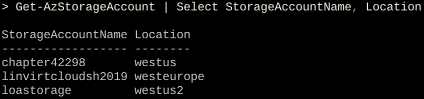

###### 图 4.1：可用存储账户

在屏幕截图中，您可以看到此订阅中有三个不同区域的存储账户可用。

存储账户受密钥保护。如果您想要访问存储账户，您将需要密钥。在创建账户时会自动创建一组两个密钥。如果您仍然处于创建账户时的同一会话中，您可以接收密钥：

```
$mySA | Get-AzStorageAccountKey | Format-Table -Wrap
```

否则，您可以使用以下内容：

```
Get-AzStorageAccountKey '
  -ResourceGroupName <resource group>'
  -Name <storage account name>
```

在下面的屏幕截图中，位于$MyRG 资源组中的`chapter42298`存储账户有一组受保护的密钥：

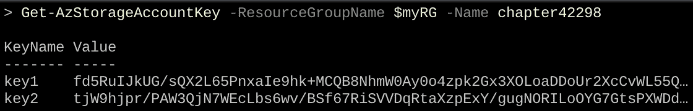

###### 图 4.2：获取 chapter42298 存储账户的密钥

### 托管磁盘

早些时候，当我们部署 VM 时，我们需要创建一个存储账户，用于保存 VM 的**虚拟硬盘**（**VHD**）。后来，微软推出了**托管磁盘**，我们可以简单地创建一个磁盘，微软负责底层存储账户。此外，客户还可以获得额外的优势，如轻松调整大小、更多的加密选项和更好的性能。

当您使用托管磁盘创建 VM 时，将会附加两个磁盘到 VM：一个操作系统磁盘和一个临时磁盘。所有磁盘都以 VHD 格式存储。当您重新启动 VM 时，临时磁盘上存储的数据将被清除，因此微软不建议在临时磁盘上存储重要数据，因为它不是持久的。

您还可以添加额外的托管数据磁盘。首先，创建磁盘配置：

```
New-AzDiskConfig -Location <location>'
  -DiskSizeGB <size> -OsType Linux -SkuName <sku>  '
  -CreateOption empty
```

让我们看看如何创建一个大小为 5GB 且冗余为 Standard_LRS 的示例磁盘配置：

```
$diskconfig = New-AzDiskConfig -Location $myLocation '
  -DiskSizeGB 5 -OsType Linux -SkuName Standard_LRS '
  -CreateOption empty
```

现在，您可以创建实际的磁盘：

```
New-AzDisk -ResourceGroupName <resource group name> '
  -DiskName <disk name> -Disk <disk configuration>
```

例如，以下是前面命令的实现：

```
$Disk01 = New-AzDisk -ResourceGroupName $myRG '
  -DiskName 'Disk01' -Disk $diskconfig
```

通过执行`$Disk01`命令，您将看到新创建的磁盘。在以下屏幕截图中，输出被限制以使其更易读：


###### 图 4.3：$Disk01 命令的输出

下一步是附加托管数据磁盘。为此，我们需要磁盘 ID。因此，我们将使用磁盘名称运行以下命令以查找 ID：

```
Get-AzDisk -DiskName <disk name> | select Id
```

添加数据磁盘：

```
Add-AzVMDataDisk -VM $myVM -Name <disk name> '
  -ManagedDiskId <disk id> -Lun <lun number> -CreateOption Attach 
```

**逻辑单元号**（**LUN**）是用于标识 VM 中存储的数字。您可以从零开始编号。最后，更新 VM 设置：

```
Update-AzVM '
  -ResourceGroupName <resource group> '
  -VM <virtual machine>
```

现在，您可以将数据磁盘添加到 VM。总结一个完整的示例，首先您需要 VM 的所有属性。要获取 VM 的属性，我们将使用以下命令并将属性保存到变量`$myVM`中：

```
$myVM = Get-AzVM -ResourceGroupName $myRG -Name $myTestVM 
```

下一个命令是将之前创建的磁盘添加到 VM 中：

```
Add-AzVMDataDisk -VM $myVM -Name Disk01 '
  -ManagedDiskId $Disk01.Id -Lun 1 -CreateOption Attach
```

上述命令将显示 VM 的配置属性，如此屏幕截图所示：

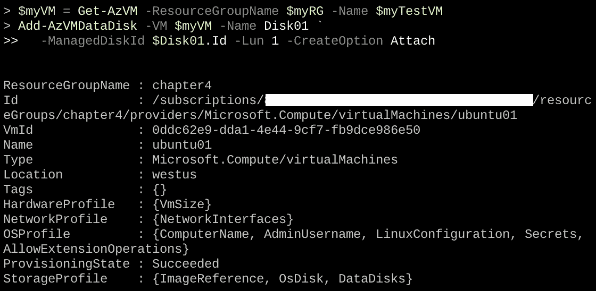

###### 图 4.4：在 VM 上添加创建的磁盘

从输出中可以看出，信息已添加到`StorageProfile`，但更改尚未生效。

要使其生效，请使用`Update-AzVM`。输出应该给出`StatusCode`为`OK`：

```
Update-AzVM -ResourceGroupName $myRG -VM $myVM
```

如您在以下屏幕截图中所见，`IsSuccessStatusCode`告诉您请求已收到。`StatusCode`是请求的结果：


###### 图 4.5：使用 Update-AzVM 命令更新 StatusCode

验证结果：

```
$myVM.StorageProfile.DataDisks
```

或者，更好的是，不要重用变量，只需在这个一行命令中查询所有信息：

```
$(Get-AzVM -Name $myTestVM '
  -ResourceGroupName $myRG).StorageProfile.DataDisks
```

您可以看到名称、大小和 LUN：

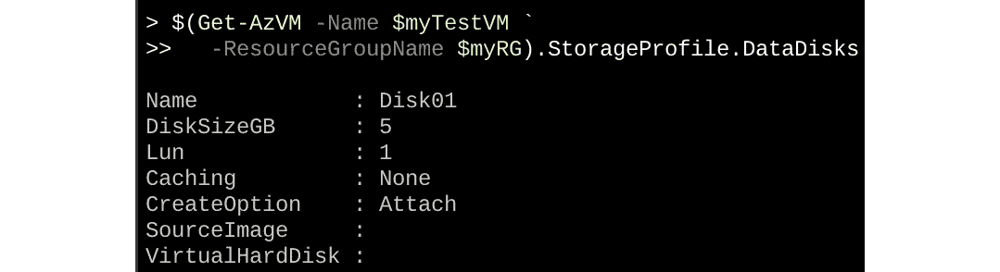

###### 图 4.6：磁盘存储配置

### Azure Files

您可以使用**Azure Files**而不是向 VM 添加数据磁盘。如果您还记得，我们在本章的开头讨论了 Azure Files，并提到它与普通文件共享不同。Azure Files 是云中完全托管的文件共享，可以通过**服务器消息块**（**SMB**）访问，并且可以挂载到 Linux、Windows 和 macOS。

Azure Files 需要一个存储账户，并支持 Standard_LRS、Standard_ZRS、Standard_GRS 和 Standard_ZRS（仅在选定的区域）SKU 类型。除了标准（热）可用之外，没有高级存储或其他访问层。 （在撰写本书时，微软的消息来源表示目前没有可用于引入这些功能的时间表。）

请注意，出于性能原因，您确实需要 SMB 3.0 协议。这意味着您需要一个最新的 Linux 发行版，比如这里列出的一个：

+   基于 RHEL 的发行版 7.5 或更高版本

+   Ubuntu 16.04 或更高版本

+   Debian 9

+   SUSE SLE 12 SP3 / OpenSUSE LEAP 42.3 或更高版本

您还需要使用挂载选项强制版本 3：**vers=3.0**。

第一步涉及创建 Azure Files 共享：

```
New-AzStorageShare '
  -Name <share name> -Context <storage account context> 
```

对于存储账户上下文，您可以使用用于创建存储账户的变量或重新创建变量：

```
$mySA = (Get-AzStorageAccount | Where-Object {$_.StorageAccountName -Like "chapter*"})
```

让我们实现这个并创建一个新的文件共享：

```
$myShare01 = New-AzStorageShare '
  -Name "myshare01-staff" -Context $mySA.Context
```

让我们检查一下`$myShare01`的值。输出清楚地显示了存储的 URL、创建时间以及快照是否可用：

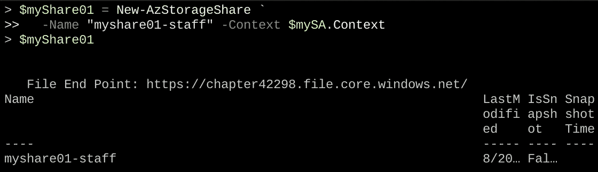

###### 图 4.7：myShare01 的输出

要查看创建的共享的属性，请执行以下命令：

```
(Get-AzStorageShare -Context $mySA.Context).Uri
```

如下面的屏幕截图所示，它将为您提供相同的输出，但会提供一些更多的信息，这对我们的目的并不重要：

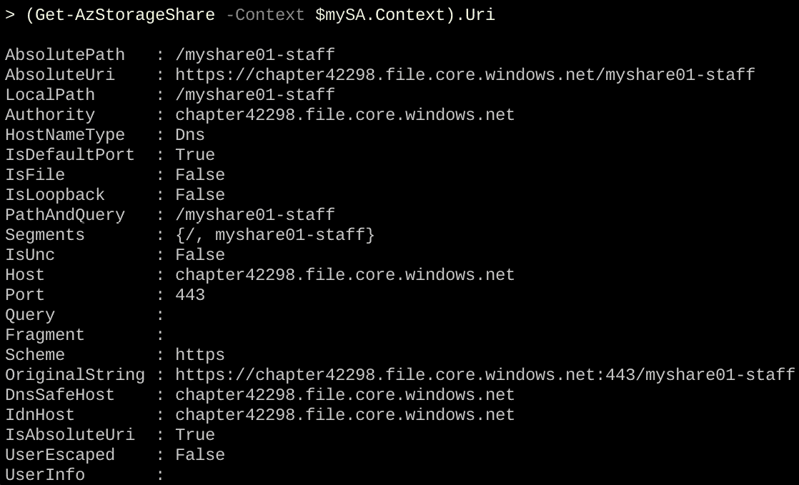

###### 图 4.8：创建的共享属性

在 Linux 中，您可以使用以下代码手动挂载文件共享：

```
mount -t cifs \
  -o vers=3.0,username=<storage account>,password=<storage key>\
  //<storage account name>.file.core.windows.net/<share> \
  /<mount point>
```

请注意，我们不使用 HTTPS 方案，因为 CIFS 不使用 URI。Azure 将负责在不同方案之间进行映射。

让我们继续挂载文件共享。您的密码和存储文件共享将与示例中的不同，因为名称在 Azure 中是唯一的：

```
mkdir /mnt/staff

mount -t cifs -o vers=3.0,username=chapter42585,password=.... \
  //chapter42585.file.core.windows.net/myshare-01.staff /mnt/staff
```

此外，您还可以在 Azure 门户（[`portal.azure.com/`](https://portal.azure.com/)）中使用连接选项进行文件共享，Azure 将生成挂载共享到 Linux 以及 Windows 和 macOS 系统的命令。

在下面的屏幕截图中，您可以看到单击“连接”时，Azure 会生成代码，将文件共享连接到 Linux 系统。您可以复制此代码并粘贴到您的 Linux 系统中：

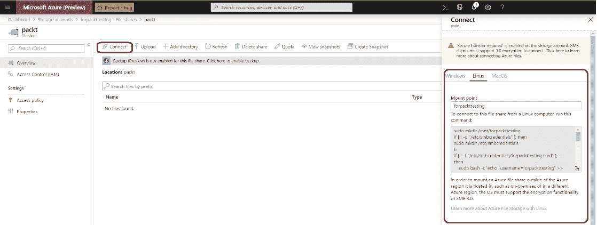

###### 图 4.9：将文件共享连接到 Linux 系统

有关 Azure 文件挂载共享的更多信息，请参阅《第五章，高级 Linux 管理》中的《挂载远程文件系统》部分。以下是 Azure 文件的挂载单元的示例：

```
[Unit]
Description = Staff Share
[Mount] 
What = //chapter42585.file.core.windows.net/myshare-01.staff
Where = /mnt/staff 
Type = cifs
Options = vers=3.0,credentials=/root/.staff
```

在这里，`/root/.staffs`文件包含以下条目：

```
username=<storage account>
password=<key>
```

验证共享和管理内容的另一种好方法是使用 Azure 存储资源管理器。在您的工作站上启动 Azure 存储资源管理器并连接您的 Azure 账户。如果您不想添加整个账户，您也可以选择使用 SAS 密钥仅添加存储账户。存储资源管理器将在左侧显示不同类型的资源，如此屏幕截图所示：

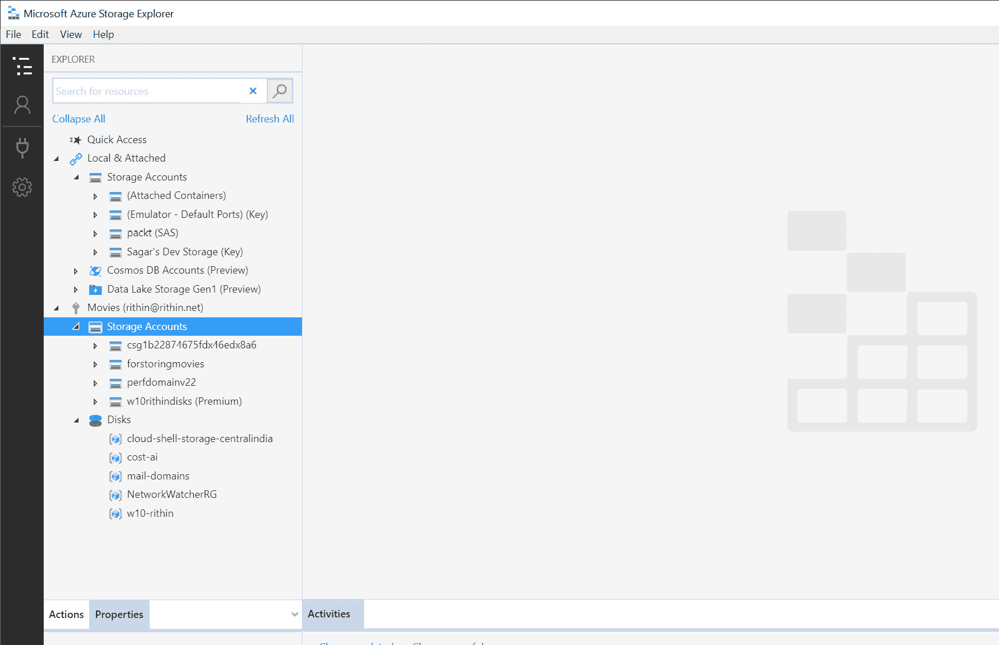

###### 图 4.10：Azure 存储资源管理器

### Azure Blob

**Azure Blob 存储**是一种存储服务，用于在云中以对象形式存储非结构化数据（图像、视频、音频、备份数据等，不符合数据模型）。Blob 是基于对象的存储，可以存储任何类型的数据。

在存储账户中，您可以拥有容器；容器与计算机上的目录或文件夹非常相似。例如，如果您将喜爱的音乐文件存储在 Azure 中，您可以将账户名称设置为*音乐*，在其中，您可以根据流派或艺术家创建一个容器，实际的音乐文件就是 blob。一个存储账户可以拥有无限数量的容器，一个容器可以拥有无限数量的 blob。

Azure 文件共享是将数据保存在虚拟机之外的一种好方法。但它们是基于文件的，并不是每种数据类型的最快选择。例如，从 Azure 文件进行流式传输虽然可能，但性能并不是很好；上传非常大的文件也可能非常具有挑战性。Blob 存储是这个问题的解决方案，它的扩展性更好：Azure 文件共享为 5TB，单个 Blob 容器为 500TB。

要能够上传 blob，您必须首先创建一个容器：

```
New-AzStorageContainer -Name <container name> '
  -Context <context of storage account> -Permission blob
```

以下是创建容器列表的示例：

```
$myContainer = New-AzStorageContainer '
  -Name container01 '
  -Context $mySA.context -Permission blob
```

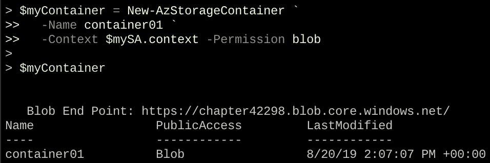

###### 图 4.11：创建容器列表

创建容器时有三种权限可用：

+   **容器**：提供对容器及其 blob 的完全读取访问。客户端可以通过匿名请求枚举容器中的 blob；其他容器是不可见的。

+   **Blob**：通过匿名请求提供对容器中的 blob 数据的读取访问，但不提供对容器数据的访问。其他 blob 是不可见的。

+   **关闭**：限制访问仅限于存储账户所有者。

您可以再次使用 Azure 存储资源管理器查看容器：

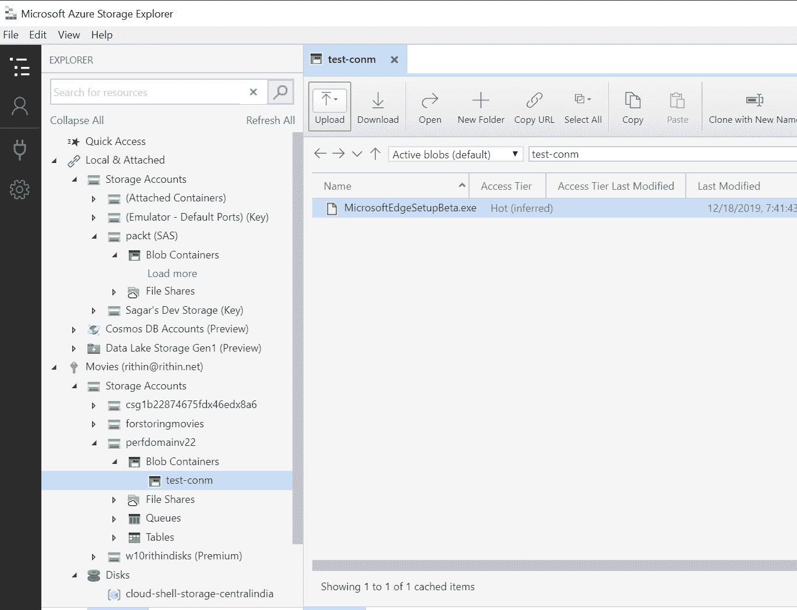

###### 图 4.12：使用 Azure 存储资源管理器查看容器

使用 PowerShell，您可以创建一个 blob：

```
Set-AzStorageBlobContent -File <filename> '  
  -Container <container> -Blob <blobname> '  
  -Context $mySA.context
```

您可以使用以下命令验证结果：

```
Get-AzStorageBlob -Container <container name> '
  -Context $mySA.context | select Name 
```

现在，您可以将文件上传到容器，将其转换为 blob，例如：

```
Set-AzStorageBlobContent -File "/Pictures/image.jpg" '   
  -Container $myContainer.Name ' -Blob "Image1.jpg" '   
  -Context $mySA.context 
```

您还可以列出结果：

```
Get-AzStorageBlob -Container <container> '
  -Context $mySA.context | select Name 
```

所有这些操作也可以在 Bash 中执行。

您可以使用**Blobfuse**从 Linux Blobfuse 参考链接中挂载 blob；有关更多信息，请访问[`github.com/Azure/azure-storage-fuse`](https://github.com/Azure/azure-storage-fuse)和[`docs.microsoft.com/en-us/azure/storage/blobs/storage-how-to-mount-container-linux`](https://docs.microsoft.com/en-us/azure/storage/blobs/storage-how-to-mount-container-linux)。

将数据复制到 blob 的另一种解决方案是**AzCopy**（有关更多信息，请访问[`docs.microsoft.com/en-us/azure/storage/common/storage-use-azcopy-linux`](https://docs.microsoft.com/en-us/azure/storage/common/storage-use-azcopy-linux)）。

但是，老实说，大多数情况下，这不是您将使用 Blob 存储的方式。Blob 存储不是您希望在操作系统级别访问的内容，而是在应用程序级别访问的内容，用于存储诸如图像之类的对象并使其公开可用。微软提供了一些很好的入门示例，网址为[`github.com/Azure-Samples?q=storage-blobs`](https://github.com/Azure-Samples?q=storage-blobs)。

在*第七章，部署您的虚拟机*中，有一个很好的例外示例：上传 VHD 文件以创建使用该 VHD 的自定义映像。

## 管理网络资源

如前所述，在*第三章基本 Linux 管理*中，网络非常重要。Azure 虚拟网络是 Azure 提供的一项服务，提供以下功能：

+   与工作负载的连接

+   工作负载与外部世界的连接

+   虚拟机之间的连接

+   其他连接选项，如 VPN 隧道

+   流量过滤

+   包括通过 VPN 隧道的 BGP 路由在内的高级路由选项

### 虚拟网络

在 Azure 中，虚拟网络的最重要组件是**虚拟网络**或**VNet**。虚拟网络至关重要，因为它为您的 VM 提供了一个高度安全的隔离环境。

以下过程可能看起来有点混乱和冗长，但这里的目的是让您了解过程和命令。让我们从创建虚拟网络开始：

```
AzVirtualNetwork -Name <vnet name> '
  -ResourceGroupName <resource group> -Location <location>'
  -AddressPrefix <network>
```

因此，如果我们想要创建名称为`MyVirtualNetwork`、地址空间为`10.0.0.0/16`的虚拟网络，我们将使用：

```
$myVnet = New-AzVirtualNetwork -Name MyVirtualNetwork '
  -ResourceGroupName $myRG -Location $myLocation '
  -AddressPrefix "10.0.0.0/16"
```

执行刚刚创建的变量将显示所有属性：

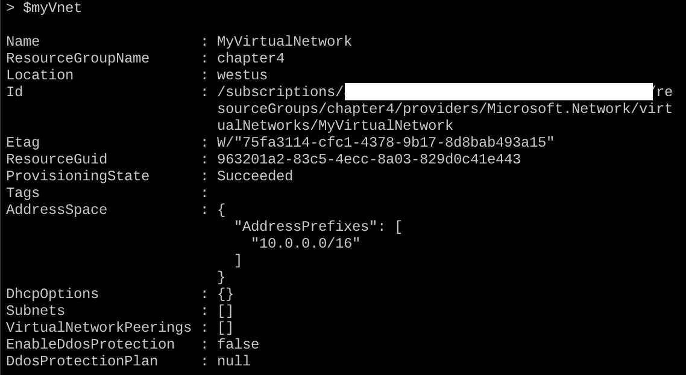

###### 图 4.13：虚拟网络属性

`AddressSpace`或地址是一个或多个子网可以使用的网络。可以添加额外的地址空间。

### 子网

如前所述，子网是在虚拟网络中创建的。在 Azure 中，同一网络中不同子网之间的所有流量都经过路由，因此子网可以相互访问。当然，您可以修改该行为，例如，当您想要使用负载均衡器时。

同样，出于与虚拟网络相同的原因，我们将使用最简单的命令：

```
Add-AzVirtualNetworkSubnetConfig '
  -AddressPrefix <subnet> -Name <subnet> '
  -VirtualNetwork <vnet>
```

要创建名称为`MySubnet`、地址池为`10.0.1.0/24`的子网，请执行以下命令：

```
$mySubnet = Add-AzVirtualNetworkSubnetConfig '
  -AddressPrefix 10.0.1.0/24 -Name MySubnet '
  -VirtualNetwork $myVnet
```

#### 注意

可能会收到一条警告，指出某些对象已被弃用。您可以放心忽略它。

如果执行`$mysubnet`，您将看到子网已添加：

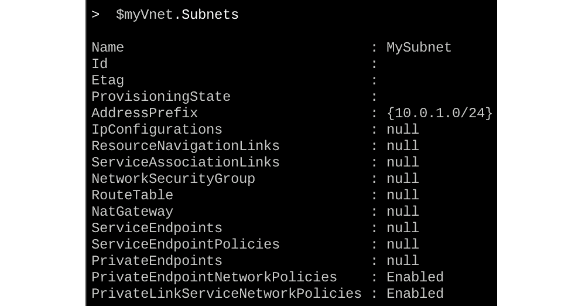

###### 图 4.14：子网详细信息

如前面的屏幕截图所示，我们没有使用整个网络，只使用了其中的一部分。

或者，可以使用以下命令进行验证：

```
Get-AzVirtualNetworkSubnetConfig '
  -VirtualNetwork $myVnet -Name MySubnet
```

输出将与前面的截图完全相同。

子网的第一个 IP 地址是来自虚拟机的网络流量的网关；它提供以下内容：

+   默认网关，带有**源网络地址转换**（**SNAT**）以获得互联网访问。为了能够这样做，必须配置公共 IP 地址。SNAT 允许您将来自私有网络中的虚拟机（或任何资源）生成的流量发送到互联网通过网关。

+   DNS 服务器，如果未另行配置。

+   DHCP 服务器。

虚拟网络配置的最后一部分涉及附加新创建的子网：

```
    Set-AzVirtualNetwork -VirtualNetwork $myVnet
```

从输出中，除其他信息外，您可以看到地址空间和子网：

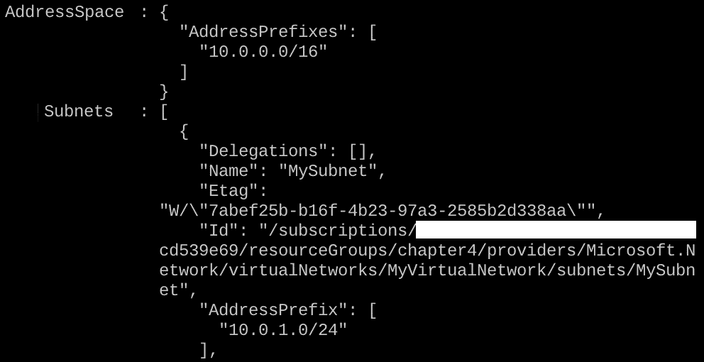

###### 图 4.15：附加新创建的子网

### 网络安全组

**网络安全组**（**NSG**）是我们需要关注的下一个组件。它本质上是与子网关联的访问控制列表。它还为虚拟机或容器提供端口转发。规则适用于附加到子网的所有接口。

第一步是创建一个 NSG：

```
New-AzNetworkSecurityGroup '
  -ResourceGroupName <resource group>'
  -Location <location> -Name <nsg name>
```

例如，您可以通过以下方式创建 NSG：

```
$myNSG = New-AzNetworkSecurityGroup '
  -ResourceGroupName $myRG -Location $myLocation -Name myNSG1
```

在庞大的输出中，您将找到几个部分；其中一个部分名为`默认安全规则`。该部分包含一组规则，按优先级顺序给出：

+   允许来自虚拟网络中所有虚拟机的入站流量（AllowVnetInBound）

+   允许来自 Azure 负载均衡器的入站流量（AllowAzureLoadBalancerInBound）

+   拒绝所有入站流量（DenyAllInBound）

+   允许来自虚拟网络中所有虚拟机到所有虚拟机的出站流量（AllowVnetOutBound）

+   允许来自所有虚拟机到互联网的出站流量（AllowInternetOutBound）

+   拒绝所有出站流量（DenyAllOutBound）

在进入规则之前，让我们将子网与 NSG 关联起来：

```
Set-AzVirtualNetworkSubnetConfig -Name <subnet name> '
  -VirtualNetwork <vnet> -NetworkSecurityGroupID <nsg id> '
  -AddressPrefix <subnet> 
```

例如，以下是前述命令的实现：

```
$NSGSubnet = Set-AzVirtualNetworkSubnetConfig '
  -Name $myVnet.Subnets.Name '
  -VirtualNetwork $myVnet '
  -NetworkSecurityGroupID $myNSG.Id '
  -AddressPrefix 10.0.1.0/24 
```

您可能会收到与之前看到的相同的弃用警告。您可以再次忽略它们。将 NSG 附加到网络：

```
$NSGSubnet | Set-AzVirtualNetwork
```

此命令的输出将为 JSON 格式，并且由于所有参数的原因而很长。如果您查看输出，您将看到`NetworkSecurityGroup`被称为`myNSG1`，这是我们创建的 NSG：


###### 图 4.16：附加到网络的 NSG

如果我们想要使用 SSH 访问我们的虚拟机，那么我们需要添加一个安全规则：

```
$myNSG | Add-AzNetworkSecurityRuleConfig -Name SSH '
  -Description "Allow SSH" '
  -Access Allow -Protocol Tcp -Direction Inbound '
  -Priority 100 '
  -SourceAddressPrefix Internet -SourcePortRange * '
  -DestinationAddressPrefix * '
  -DestinationPortRange 22 | Set-AzNetworkSecurityGroup
```

`-SourceAddressPrefix`参数是一种缩写，表示虚拟网络之外并可通过公共互联网到达的一切。其他值如下：

+   `VirtualNetwork`：此虚拟网络及其他连接的网络中的一切。

+   `AzureLoadBalancer`：如果您正在使用 Azure 负载均衡器，这将为您的虚拟机提供访问。

+   `*`：一切。

`优先级`范围从`100`到`4096`。较高的数字由 Azure 创建并可以被覆盖。优先级数字越低，规则的优先级越高。

前一个命令的输出可能包含太多信息，这有点令人困惑。为了确认端口`22`的流量是否被允许，我们将使用以下命令过滤输出：

```
$myNSG | select SecurityRules
$myNSG.SecurityRules
```

如下截图所示的输出验证了 TCP 端口`22`对入站流量是开放的。该端口的优先级为`100`，但由于它是唯一的规则，这并不重要：

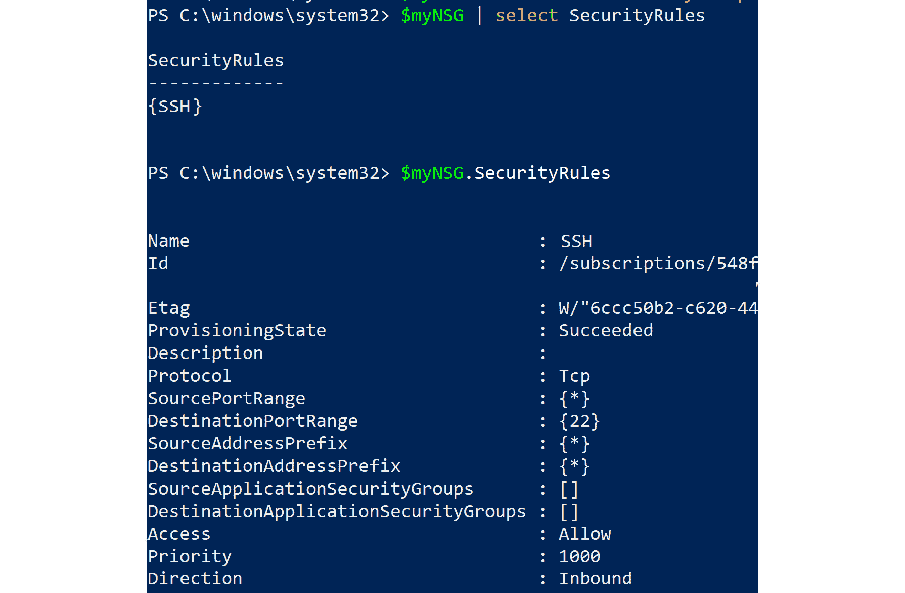

###### 图 4.17：列出为 NSG 设置的安全规则

或者，您可以使用以下命令：

```
$myNSG | Get-AzNetworkSecurityRuleConfig
```

正如您所看到的，输出是相同的。

### 公共 IP 地址和网络接口

要能够从互联网访问虚拟机，需要一个公共 IP 地址以及一个 DNS 标签，这是赋予我们的虚拟机的 DNS 名称。

公共 IP 可以是静态的或动态的。对于动态公共 IP，每当您取消分配然后重新启动 VM 时，IP 将被释放并与 VM 解除关联。下次启动 VM 时，将为 VM 分配一个新的公共 IP。因此，每次您取消分配然后重新启动 VM 时，都必须从 CLI 或门户验证公共 IP 以连接到 VM。

DNS 标签的重要部分来了：如果您已经向 VM 添加了 DNS 标签，无论 VM 具有的公共 IP 是什么，您都可以始终使用该标签连接到 VM。当您取消分配并重新启动 VM 时，DNS 标签不会更改。此外，DNS 标签在 Azure 中是唯一的。

对于静态公共 IP，IP 将为您保留。即使您取消分配然后重新启动 VM，IP 也不会更改。将静态 IP 分配给 VM 不会阻止您添加 DNS 标签。如果需要，您也可以添加标签。

使用以下命令创建新的动态公共 IP：

```
$pip = New-AzPublicIpAddress '
  -ResourceGroupName $myRG '
  -Location $myLocation -AllocationMethod Dynamic '
  -Name "$(Get-Random)" 
```

通过查看`$pip`变量的内容来验证。如果分配方法是`动态`，则在将 IP 地址分配给网络接口之前，不会分配 IP 地址：

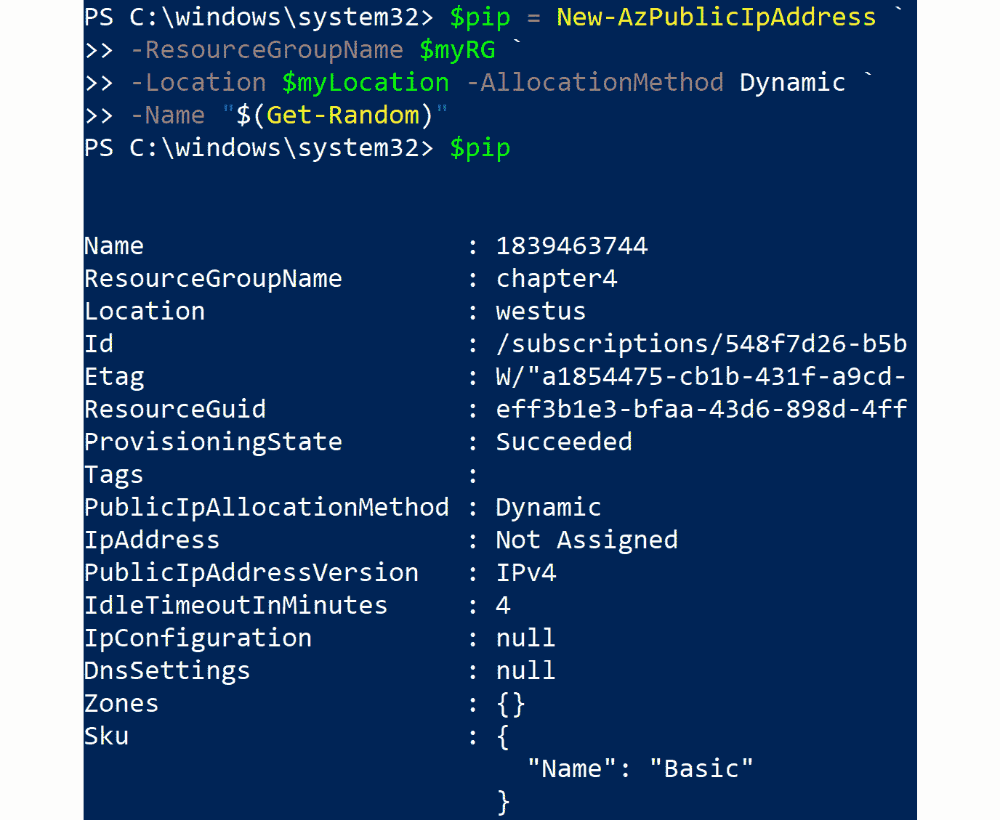

###### 图 4.18：验证新的动态公共 IP

因此，在前面的截图中，`IpAddress`字段显示为`未分配`。

使用以下命令创建网络接口：

```
$nic = New-AzNetworkInterface -Name myNic '
  -ResourceGroupName $myRG -Location $myLocation '
  -SubnetId $myVnet.Subnets[0].Id -PublicIpAddressId $pip.Id '
  -NetworkSecurityGroupId $myNSG.Id
```

如果在`SubnetId`上出现错误，请尝试重新设置`myVnet`变量并运行以下命令：

```
$myVnet = Get-AzVirtualNetwork -Name $myVnet.Name '
  -ResourceGroupName $myRG
```

要验证结果，请执行以下命令：

```
$nic.ipConfigurations
```

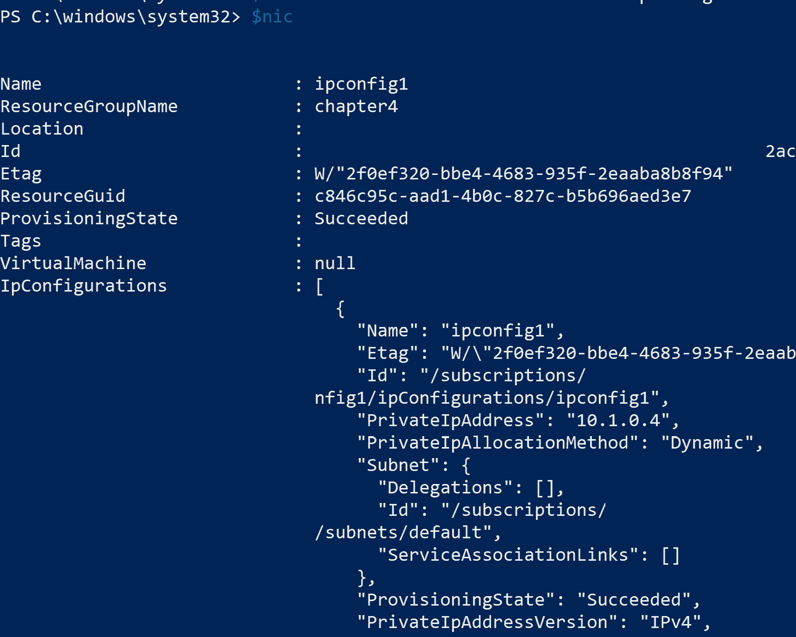

###### 图 4.19：检查分配给网络接口的 IP 地址

在输出中，正如您在前面的截图中所看到的，分配了一个 IP 地址，这次是`10.0.1.4`。

## 管理计算资源

让我们总结一下本章涵盖的组件，这些是您在部署 VM 之前需要的要求。对于存储账户来说，这不是一个真正的要求，但是您想在遇到麻烦时无法接收引导诊断吗？如前所述，如果您的 VM 进入非可引导状态，引导诊断账户非常有用。存储在此账户中的日志可用于查找 VM 非引导状态的根本原因。对于测试来说，这不是一个强制性选项，但对于生产工作负载，建议启用引导诊断，这将帮助您了解故障发生时出了什么问题。

#### 注意

这里提到的每个资源也被 Azure 容器服务和 Azure Kubernetes 服务使用。

如果您还记得，在*技术要求*部分，我们看了一下使用 PowerShell 代码创建新 VM 的过程，其中大多数变量未定义。这里是代码：

```
  New-AzVm '
  -ResourceGroupName $myRG '
  -Name $myTestVM '
  -ImageName UbuntuLTS '
  -Location $myLocation '
  -VirtualNetworkName "$myTestVM-Vnet" '
  -SubnetName $myTestVM-Subnet '
  -SecurityGroupName "$myTestVM-NSG" '
  -PublicIpAddressName $myTestVM-pip
```

现在，我希望您能理解这些参数各自代表什么，以及它们对于您的 VM 有多么重要。

## 虚拟机资源

在本节中，我们将提供一些表格，其中包含必要的组件以及 PowerShell 和 Bash 中对应的命令。它可以与 PowerShell 中的帮助一起使用（`help <cmdlet>`），Azure CLI（在命令中添加`--help`参数），或 Azure 在线文档。

### **Azure 配置文件**

Azure 配置文件包括描述 Azure 环境所需的设置：

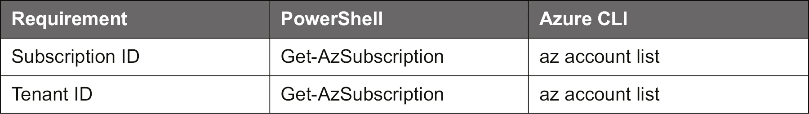

###### 图 4.20：Azure 配置文件设置命令

### **资源组**

资源组需要包含和管理资源：

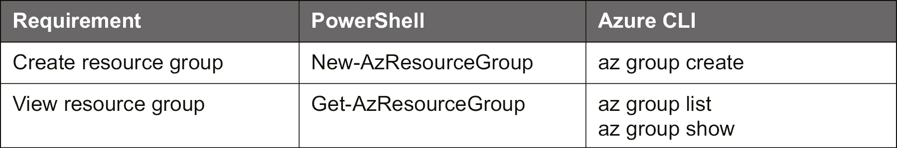

###### 图 4.21：Azure 资源组命令

### **存储账户**

如果您想在 VM/容器外部存储数据，则需要存储账户：

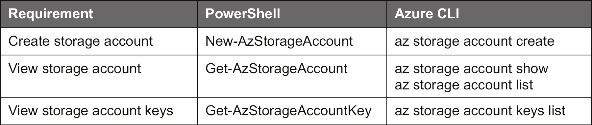

###### 图 4.22：Azure 存储账户命令

### **虚拟网络**

虚拟网络用于 VM/容器之间的通信和与外部世界的通信：

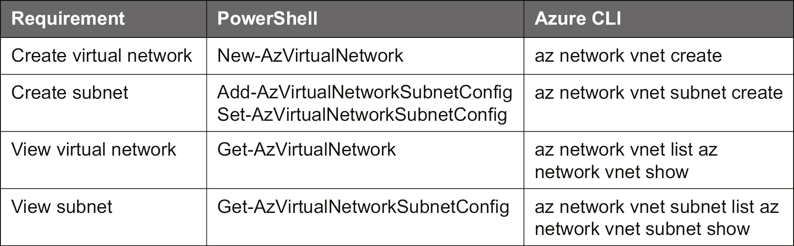

###### 图 4.23：Azure 虚拟网络命令

### **网络安全组**

NSG 包括**访问控制列表**（**ACL**）来保护您的工作负载并在需要时允许访问。它与公共 IP 地址一起，也需要用于端口转发到 VM/容器：

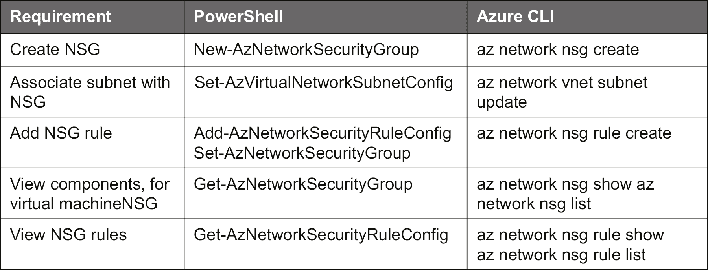

###### 图 4.24：Azure NSG 命令

### **公共 IP 地址和网络接口**

公共 IP 地址提供了从外部世界进入 VM/容器的访问。这对于端口地址转换（PAT）和 SNAT 是必要的：

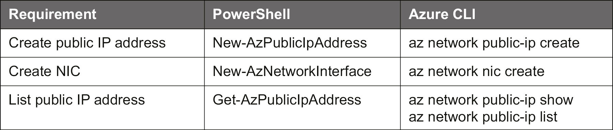

###### 图 4.25：Azure 公共 IP 地址和网络接口命令

## 摘要

通过本章获得的知识，您现在应该更好地理解了您在*第二章，开始使用 Azure 云*中遇到的事物。

在本章中，我们探讨了在您可以在 Azure 中创建工作负载之前所需的所有 Azure 组件：

+   您需要一个存储账户来存储 VM 之外的数据。

+   您需要一个存储账户来存储 VM 之外的数据。

+   需要网络组件才能与 VM 进行通信，启用机器之间的通信，并使 VM 能够访问互联网。

到目前为止，我们讨论的步骤将对您理解与 VM 相关的组件以及这些组件如何在 Azure 中部署非常有用。我们从 Azure 中的存储解决方案开始，然后也涵盖了网络。我们希望这给您一个关于这些组件如何组合提供服务交付的想法。

在下一章中，我们将利用本章获得的知识来识别和配置 Linux 操作系统中的网络和存储组件。除了网络和存储主题，我们还将探讨其他系统管理任务，如软件和服务管理。

## 问题

1.  在您创建 VM 之前需要哪些资源？

1.  哪些资源建议用于 VM？

1.  在示例中，随机数生成器被多次使用——为什么？

1.  网络上的`AddressPrefix`的目的是什么？

1.  子网上的`AddressPrefix`的目的是什么？

1.  NSG 的目的是什么？

1.  为什么需要公共 IP 地址与外部世界进行通信？

1.  静态和动态分配的公共 IP 地址有什么区别？

## 进一步阅读

微软出版社的书籍*Implementing Microsoft Azure Infrastructure Solutions*旨在作为学习 70-533 考试的参考指南；即使考试已经废弃，内容仍然适合参考。它使用 Azure 门户和命令行界面详细解释了 Azure 基础架构的每个部分。

如果您是网络方面的新手，另一本推荐的书籍，也是作为考试学习指南编写的，是 Glen D. Singh 和 Rishi Latchmepersad 的*Comptia Network+ Certification Guide*。

更古老且更难阅读的是 IBM 的免费*TCP/IP Redbook*（[`www.redbooks.ibm.com/redbooks/pdfs/gg243376.pdf`](https://www.redbooks.ibm.com/redbooks/pdfs/gg243376.pdf)）；它涵盖的内容远远超出您需要了解的范围，但如果您对这个主题感兴趣，这是必读的。即使您对参加思科 ICND1 考试不感兴趣，Neil Anderson 在[`www.packtpub.com`](https://www.packtpub.com)录制了一个视频，除了思科部分外，还提供了对网络的很好介绍。

#### 注意

请注意，Azure 环境不断变化，特别是在存储和网络方面；验证来源与微软网站上可用的文档非常重要。发布日期可能是您首先要检查的内容。
