# 第五章：高级 Linux 管理

在*第三章，基本 Linux 管理*中，涵盖了一些基本的 Linux 命令，并学会了如何在 Linux 环境中找到自己的位置。之后，在*第四章，管理 Azure*中，我们深入探讨了 Azure 架构。

通过这两章获得的知识，我们现在准备继续我们在 Linux 中的旅程。让我们继续探索以下主题：

+   软件管理，我们将看到如何向 Linux 机器添加新软件包以及如何更新现有软件包。

+   存储管理。在上一章中，我们讨论了如何从 Azure 向您的**虚拟机**（**VM**）附加数据磁盘，但现在我们将讨论如何在 Linux 中管理这些磁盘。

+   网络管理。之前，我们讨论了如何向 VM 添加**网络接口卡**（**NIC**）以及在 Azure 中管理网络资源的方法。在本章中，我们将讨论这些资源在 Linux 中是如何管理的。

+   系统管理，我们将讨论如何管理服务和系统必需品。

## 技术要求

为了本章的目的，您需要在 Azure 中部署一个 Linux VM，并选择您喜欢的发行版。

在尺寸方面，您至少需要 2GB 的临时存储空间，并且能够添加至少三个额外的磁盘。例如，B2S VM 大小是一个很好的起点。在本章中，我分享了 Ubuntu、Red Hat 和 SUSE 系统的步骤；您可以选择要遵循的发行版。

## 软件管理

在任何操作系统中，我们需要安装一些软件来帮助我们进行日常工作。例如，如果你正在编写脚本，操作系统自带的股票软件或应用可能不够用。在这种情况下，您需要安装诸如 Visual Studio Code 之类的软件来简化您的工作。同样，在企业环境中，您可能需要添加新软件或甚至更新现有软件以满足业务需求。

在过去，安装软件是将存档提取到文件系统中的事情。然而，这种方法存在一些问题：

+   如果文件被复制到其他软件也在使用的目录中，那么删除软件就会很困难。

+   升级软件很困难；也许文件仍在使用中，或者因为某种原因被重命名。

+   处理共享库很困难。

这就是为什么 Linux 发行版发明了软件管理器。使用这些软件管理器，我们可以安装完成任务所需的软件包和应用程序。以下是一些软件管理器：

+   RPM

+   YUM

+   DNF

+   DPKG

+   APT

+   ZYpp

让我们仔细看看每个内容，并了解它们如何用于管理 Linux 系统中的软件。

### RPM 软件管理器

1997 年，Red Hat 发布了他们的软件包管理器 RPM 的第一个版本。其他发行版，如 SUSE，也采用了这个软件包管理器。RPM 是`rpm`实用程序的名称，也是格式和文件扩展名的名称。

RPM 软件包包含以下内容：

+   打包的二进制文件和配置文件的**CPIO**（**Copy In, Copy Out**）存档。CPIO 是一个用于合并多个文件并创建存档的实用程序。

+   包含有关软件的描述和依赖关系等信息的元数据。

+   用于预安装和后安装脚本的 Scriptlets。

过去，Linux 管理员使用`rpm`实用程序在 Linux 系统上安装、更新和删除软件。如果存在依赖关系，`rpm`命令可以告诉您确切需要安装哪些其他软件包。`rpm`实用程序无法解决依赖关系或软件包之间可能的冲突。

现在，我们不再使用`rpm`实用程序来安装或删除软件，尽管它是可用的；相反，我们使用更先进的软件安装程序。在使用`yum`（在 Red Hat/CentOS）或`zypper`（在 SUSE）安装软件后，所有元数据都会进入数据库。使用`rpm`命令查询这个`rpm`数据库非常方便。

以下是最常见的`rpm`查询参数列表：

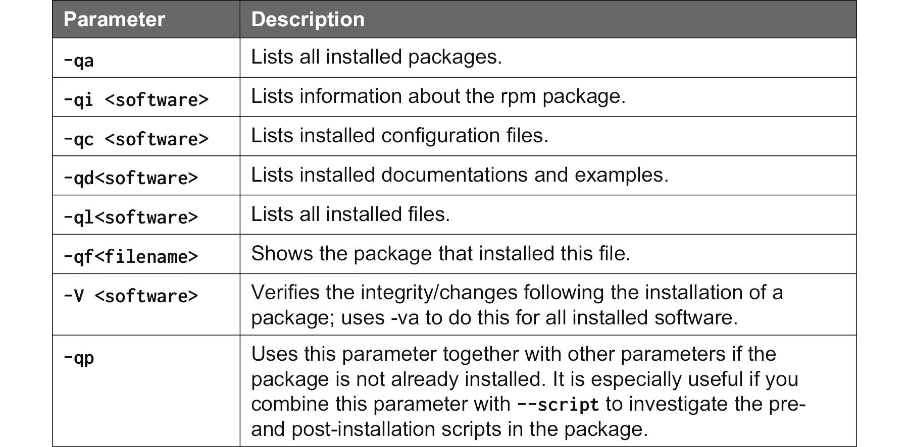

###### 图 5.1：常见的`rpm`查询参数

以下截图是获取有关已安装 SSH 服务器软件包的信息的示例：

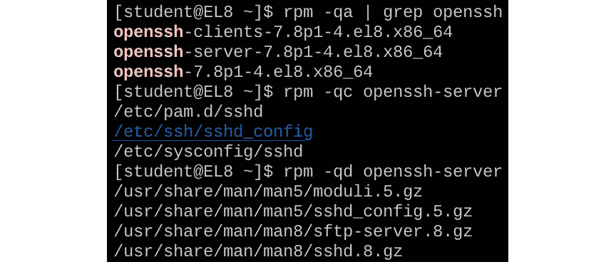

###### 图 5.2：SSH 服务器软件包信息

`-V`参数的输出可以告诉我们有关已安装软件的更改。让我们对`sshd_config`文件进行更改：

```
sudo cp /etc/ssh/sshd_config /tmp
sudo sed -i 's/#Port 22/Port 22/' /etc/ssh/sshd_config
```

如果验证已安装的软件包，则输出中会添加`S`和`T`，表示时间戳已更改，文件大小不同：


###### 图 5.3：S 和 T 表示时间戳和文件大小的更改

输出中的其他可能字符如下：

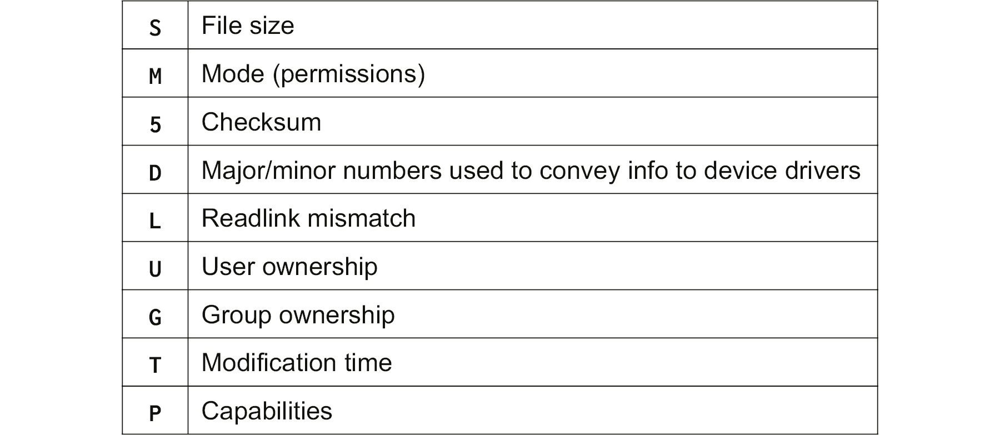

###### 图 5.4：可能的输出字符及其描述

对于文本文件，`diff`命令可以帮助显示`/tmp`目录中备份与`/etc/ssh`目录中配置之间的差异：

```
sudo diff /etc/ssh/sshd_config /tmp/sshd_config
```

按以下方式恢复原始文件：

```
sudo cp /tmp/sshd_config /etc/ssh/sshd_config
```

### 使用 YUM 进行软件管理

`up2date`实用程序。它目前在所有基于 Red Hat 的发行版中使用，但将被 Fedora 使用的`dnf`替换。好消息是，`dnf`与`yum`的语法兼容。

YUM 负责以下工作：

+   安装软件，包括依赖项

+   更新软件

+   删除软件

+   列出和搜索软件

重要的基本参数如下：

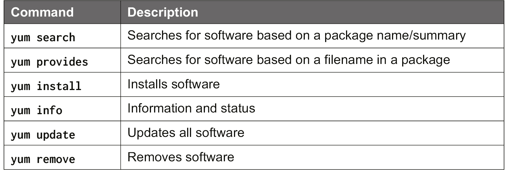

###### 图 5.5：基本 YUM 参数

您还可以安装软件模式；例如，*文件和打印服务器*模式或组是一种非常方便的方式，可以一次安装**网络文件共享**（**NFS**）和 Samba 文件服务器以及 Cups 打印服务器，而不是逐个安装软件包：

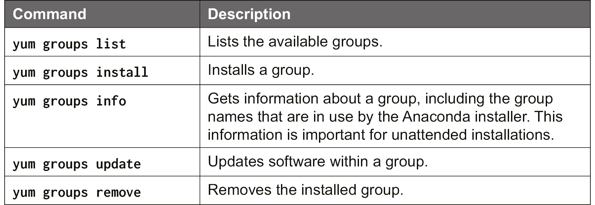

###### 图 5.6：YUM 组命令及其描述

`yum`的另一个好功能是与历史记录一起工作：

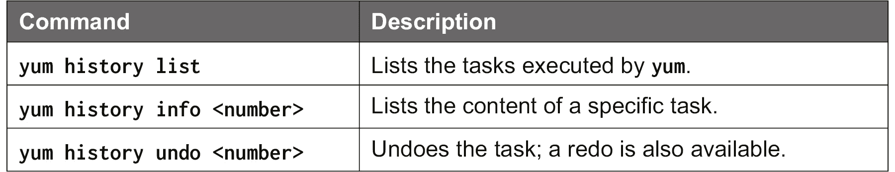

###### 图 5.7：YUM 历史命令及其描述

`yum`命令使用存储库来进行所有软件管理。要列出当前配置的存储库，请使用以下命令：

```
yum repolist
```

要添加另一个存储库，您将需要`yum-config-manager`工具，它在`/etc/yum.repos.d`中创建和修改配置文件。例如，如果要添加一个存储库以安装 Microsoft SQL Server，请使用以下命令：

```
yum-config-manager --add-repo \
  https://packages.microsoft.com/config/rhel/7/\
  mssql-server-2017.repo
```

`yum`功能可以通过插件进行扩展，例如，选择最快的镜像，启用文件系统`/` LVM 快照，并将`yum`作为定期任务（cron）运行。

### 使用 DNF 进行软件管理

在 Red Hat Enterprise Linux 8 以及所有基于此发行版和 Fedora 的发行版中，`yum`命令被 DNF 取代。语法相同，所以只需要替换三个字符。关于`yum-config-manager`命令，它被替换为`dnf config-manager`。

它与`dnf`命令本身集成，而不是一个单独的实用程序。

还有新的功能。 RHEL 8 配备了软件模块化，也被称为**AppStreams**。作为一种打包概念，它允许系统管理员从多个可用版本中选择所需的软件版本。顺便说一句，此刻可能只有一个版本可用，但会有更新的版本出现！例如，其中一个可用的 AppStreams 是 Ruby 编程解释器。让我们来看看这个模块：

```
sudo dnf module list ruby
```

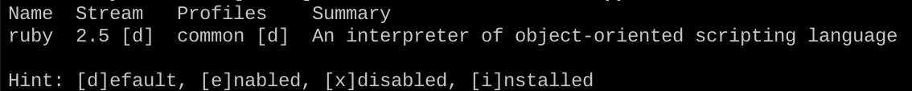

###### 图 5.8：Ruby 编程解释器模块

从前面的输出中，您可以观察到在撰写本书时，只有版本 2.5 可用；将来会添加更多版本。这是默认版本，但未启用也未安装。

要启用和安装 AppStreams，请执行以下命令：

```
sudo dnf module enable ruby:2.5
sudo dnf module install ruby
```

如果再次列出 AppStreams，输出将发生变化：

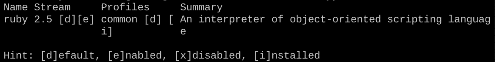

###### 图 5.9：已安装并启用 Ruby 2.5

提示：要知道 AppStreams 安装了哪些软件包，可以使用以下命令：

```
sudo dnf module info ruby
```

#### 注意

要了解有关订阅管理器的更多信息，请访问[`access.redhat.com/ecosystem/ccsp/microsoft-azure`](https://access.redhat.com/ecosystem/ccsp/microsoft-azure)。

### DPKG 软件管理器

Debian 发行版不使用 RPM 格式，而是使用 1995 年发明的 DEB 格式。该格式在所有基于 Debian 和 Ubuntu 的发行版上都在使用。

DEB 软件包包含以下内容：

+   一个名为`debian-binary`的文件，其中包含软件包的版本。

+   一个名为`control.tar`的存档文件，其中包含元数据（软件包名称、版本、依赖项和维护者）。

+   一个名为`data.tar`的存档文件，其中包含实际软件。

DEB 软件包的管理可以使用`dpkg`实用程序完成。与`rpm`一样，`dpkg`实用程序虽然具有安装软件的功能，但已不再使用。取而代之的是更先进的`apt`命令。尽管如此，了解 dpkg 命令的基础知识仍然是很有用的。

所有元数据都存储在一个可以使用`dpkg`或`dpkg-query`查询的数据库中。

`dpkg-query`的重要参数如下：

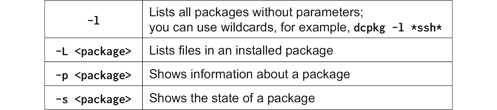

###### 图 5.10：重要的`dpkg-query`参数

`dpkg -l`输出的第一列还显示了软件包是否已安装，或未安装，或未解包，或半安装等等：

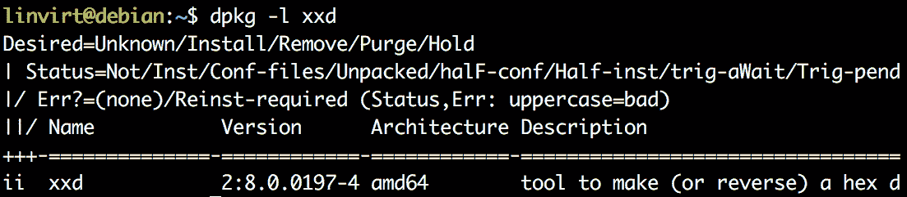

###### 图 5.11：`dpkg -l`命令的输出

第一列中的第一个字符是所需的操作，第二个字符是软件包的实际状态，可能的第三个字符表示错误标志（`R`）。`ii`表示软件包已安装。

可能的所需状态如下：

+   `u`: 未知

+   `i`：安装

+   `h`：保持

+   `r`: 删除

+   `p`：清除

重要的软件包状态如下：

+   `n`：未—软件包未安装。

+   `i`：已安装—软件包已成功安装。

+   `c`：Cfg-files—配置文件存在。

+   `u`：未解包—软件包仍未解包。

+   `f`：失败-cfg—无法删除配置文件。

+   `h`：半安装—软件包只安装了一部分。

### 使用 apt 进行软件管理

在基于 Debian/Ubuntu 的发行版中，软件管理是通过`apt`实用程序完成的，这是`apt-get`和`apt-cache`实用程序的最新替代品。

最常用的命令包括以下内容：

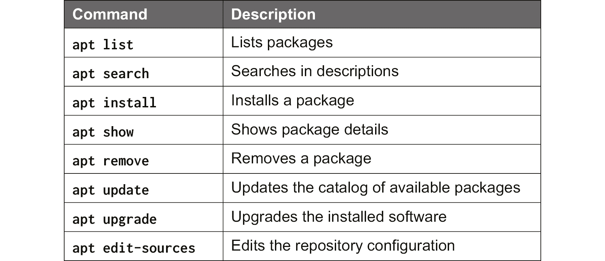

###### 图 5.12：常见的`apt`命令及其描述

存储库配置在`/etc/apt/sources.list`目录中，文件位于`/etc/apt/sources.list.d/`目录中。另外，还可以使用`apt-add-repository`命令：

```
apt-add-repository \
  'deb http://myserver/path/to/repo stable'
```

`apt`存储库具有发行类的概念，其中一些列在此处：

+   `oldstable`：软件已在先前版本的发行版中进行了测试，但尚未为当前版本进行测试。

+   `stable`：软件已正式发布。

+   `testing`：软件尚未稳定，但正在进行中。

+   `unstable`：软件开发正在进行，主要由开发人员运行。

存储库还具有组件的概念，也称为主要存储库：

+   `main`：经过测试并提供支持和更新

+   `contrib`：经过测试并提供支持和更新，但有一些依赖项不在主要存储库中，而是在`non-free`中

+   `non-free`：不符合 Debian 社交契约指南的软件（[`www.debian.org/social_contract#guidelines`](https://www.debian.org/social_contract#guidelines)）

Ubuntu 添加了几个额外的组件或存储库：

+   `Universe`：由社区提供，无支持，可能有更新

+   `Restricted`：专有设备驱动程序

+   `Multiverse`：受版权或法律问题限制的软件

### 使用 ZYpp 进行软件管理

SUSE 与 Red Hat 一样，使用 RPM 进行软件包管理。但是，他们使用另一个工具集与 ZYpp（也称为 libzypp）作为后端，而不是使用`yum`。软件管理可以使用图形配置软件 YaST 或命令行界面工具 Zypper 来完成。

#### 注意

YUM 和 DNF 也可以在 SUSE 软件存储库中使用。您可以使用它们来管理（仅限于安装和删除）本地系统上的软件，但这不是它们可用的原因。原因是 Kiwi：一个用于构建操作系统映像和安装程序的应用程序。

重要的基本参数如下：

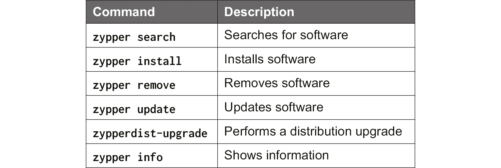

###### 图 5.13：重要的 Zypper 命令及其描述

有一个搜索选项可以搜索命令，`what-provides`，但它非常有限。如果您不知道软件包名称，可以使用名为`cnf`的实用程序。在使用`cnf`之前，您需要安装`scout`；这样可以搜索软件包属性：

```
sudo zypper install scout
```

之后，您可以使用`cnf`：

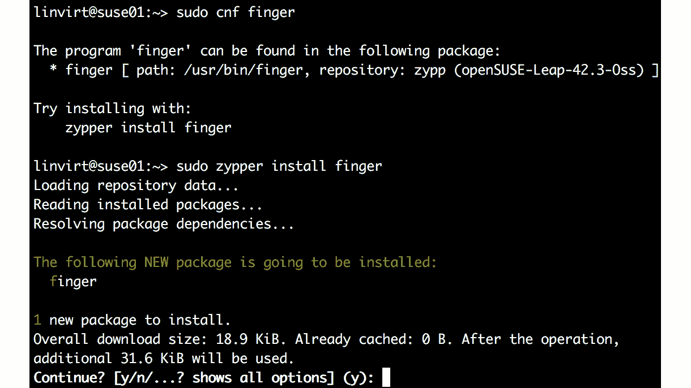

###### 图 5.14：使用 cnf 实用程序

如果您想将系统更新到新的发行版版本，您必须首先修改存储库。例如，如果您想从基于**SUSE Linux 企业服务器**（**SLES**）的 SUSE LEAP 42.3 更新到基于**SUSE Linux 企业**（**SLE**）的 15.0 版本，执行以下过程：

1.  首先，安装当前版本的可用更新：

```
sudo zypper update
```

1.  更新到 42.3.x 版本的最新版本：

```
sudo zypper dist-upgrade  
```

1.  修改存储库配置：

```
sudo sed -i 's/42.3/15.0/g' /etc/zypp/repos.d/*.repo
```

1.  初始化新的存储库：

```
sudo zypper refresh
```

1.  安装新的发行版：

```
sudo zypper dist-upgrade
```

当然，在发行版升级后，您必须重新启动。

除了安装软件包，您还可以安装以下内容：

+   `patterns`：软件包组，例如，安装包括 PHP 和 MySQL 的完整 Web 服务器（也称为 LAMP）

+   `patches`：软件的增量更新

+   `products`：安装额外产品

要列出可用的模式，请使用以下命令：

```
zypper patterns
```

要安装它们，请使用以下命令：

```
sudo zypper install --type pattern <pattern>
```

相同的过程适用于补丁和产品。

Zypper 使用在线存储库查看当前配置的存储库：

```
sudo zypper repos
```

您可以使用`addrepo`参数添加存储库；例如，要在 LEAP 15.0 上添加最新 PowerShell 版本的社区存储库，请执行以下命令：

```
sudo zypper addrepo \
  https://download.opensuse.org/repositories\
  /home:/aaptel:/powershell-stuff/openSUSE_Leap_15.0/\
  home:aaptel:powershell-stuff.repo 
```

如果您添加存储库，您总是需要刷新存储库：

```
sudo zypper refresh
```

#### 注意

SUSE 有可信或不可信的存储库的概念。如果供应商不受信任，您需要在`install`命令中添加`--from`参数。或者，您可以在`/etc/vendors.d`中添加配置文件，如下所示：

`[main]`

`vendors = suse,opensuse,obs://build.suse.de`

可以使用`zypper info`找到软件包的供应商。

现在您知道如何管理分发中的软件了，让我们继续讨论网络。在上一章中，我们讨论了 Azure 中的网络资源；现在是时候了解 Linux 网络了。

## 网络

在 Azure 中，网络设置（例如 IP 地址和 DNS 设置）是通过**动态主机配置协议**（**DHCP**）提供的。配置与在其他平台上运行的物理机器或虚拟机的配置非常相似。不同之处在于配置由 Azure 提供，通常不应更改。

在本节中，您将学习如何识别 Linux 中的网络配置，以及如何将该信息与上一章中介绍的 Azure 中的设置相匹配。

### 识别网络接口

在引导过程中和之后，Linux 内核负责硬件识别。当内核识别硬件时，它将收集的信息交给一个名为`systemd-udevd`的进程，即运行的守护进程（后台进程）。此守护进程执行以下操作：

+   必要时加载网络驱动程序。

+   它可以负责设备命名。

+   使用所有可用信息更新`/sys`。

`udevadm`实用程序可以帮助您显示硬件标识。您可以使用`udevadm info`命令查询设备信息的`udev`数据库：

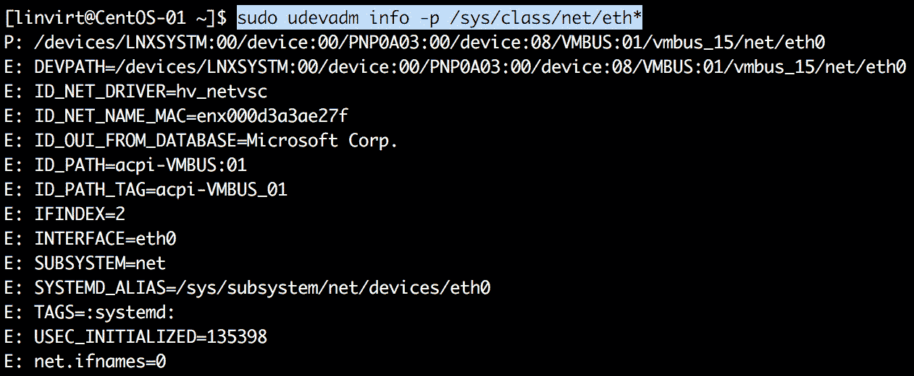

###### 图 5.15：使用`udevadm info`命令检索设备信息

除了使用`udevadm`之外，还可以访问`/sys/class/net`目录，并使用可用文件查看`cat`命令，但这不是一个非常用户友好的方法，通常不需要这样做，因为有解析所有可用信息的实用程序。

最重要的实用程序是`ip`命令。让我们从列出可用的网络接口和相关信息开始：

```
ip link show
```

上述命令应该给出以下输出：

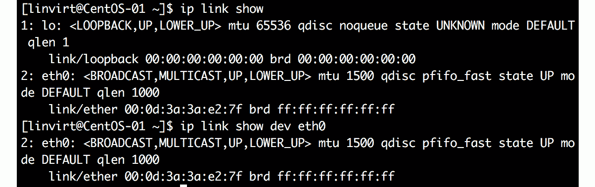

###### 图 5.16：使用 ip link show 列出可用的网络接口

列出可用的网络接口后，您可以更具体：

```
ip link show dev eth0
```

所有状态标志的含义，如`LOWER_UP`，可以在`man 7 netdevice`中找到。

### 识别 IP 地址

在了解网络接口的名称后，可以使用`ip`实用程序显示网络接口上配置的 IP 地址，如下截图所示：

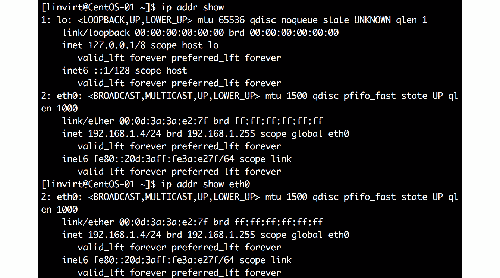

###### 图 5.17：使用 ip 实用程序检索配置的 IP 地址

### 显示路由表

路由表是存储在 Linux 内核中的结构，其中包含有关如何路由数据包的信息。您可以配置路由表，并根据规则或条件使数据包采取某条路线。例如，您可以声明如果数据包的目的地是 8.8.8.8，则应将其发送到网关。路由表可以按设备或子网显示：

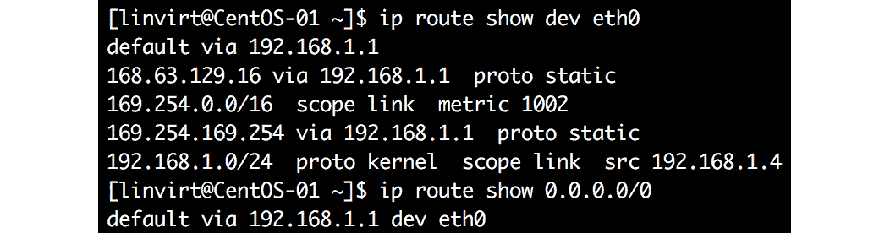

###### 图 5.18：显示路由表

另一个不错的功能是您可以查询用于到达特定 IP 的设备和网关：


###### 图 5.19：查询用于特定 IP 的设备和网关

### 网络配置

现在我们知道如何识别接口的 IP 地址和接口定义的路由，让我们看看这些 IP 地址和路由如何在 Linux 系统上配置。

`ip`命令主要用于验证设置。持久配置通常由另一个守护程序管理。不同的发行版有不同的管理网络的守护程序：

+   RHEL 发行版使用`NetworkManager`。

+   在 SLE 和 OpenSUSE LEAP 中，使用`wicked`。

+   在 Ubuntu 17.10 及更高版本中，使用`systemd-networkd`和`systemd-resolved`，而早期版本的 Ubuntu 完全依赖于`/etc/network/interfaces.d/*cfg`文件中配置的 DHCP 客户端。

在 Ubuntu 中，Azure Linux Guest Agent 在`/run/system/network`目录中创建两个文件。一个是名为`10-netplan-eth0.link`的链接文件，用于保留基于 MAC 地址的设备名称：

```
[Match]
MACAddress=00:....
[Link]
Name=eth0
WakeOnLan=off
```

另一个是`10-netplan-eth0.network`，用于实际网络配置：

```
[Match]
MACAddress=00:...
Name=eth0
[Network]
DHCP=ipv4
[DHCP]
UseMTU=true
RouteMetric=100
```

如果有多个网络接口，将创建多组文件。

在 SUSE 中，Azure Linux Guest Agent 创建一个名为`/etc/sysconfig/network/ifcfg-eth0`的文件，其中包含以下内容：

```
BOOTPROTO='dhcp'
DHCLIENT6_MODE='managed'
MTU=''
REMOTE_IPADDR=''
STARTMODE='onboot'
CLOUD_NETCONFIG_MANAGE='yes'
```

`wicked`守护程序读取此文件并将其用于网络配置。与 Ubuntu 一样，如果有多个网络接口，则会创建多个文件。可以使用`wicked`命令查看配置的状态：

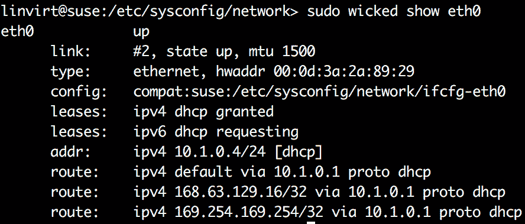

###### 图 5.20：使用 wicked show 命令检查配置状态

在 RHEL 和 CentOS 中，`ifcfg-`文件创建在`/etc/sysconfig/network-scripts`目录中：

```
DEVICE=eth0
ONBOOT=yes
BOOTPROTO=dhcp
TYPE=Ethernet
USERCTL=no
PEERDNS=yes
IPV6INIT=no
NM_CONTROLLED=no
DHCP_HOSTNAME=...
```

如果`NM_CONTROLLED`设置为`no`，则`NetworkManager`将无法控制连接。大多数 Azure Linux 机器都将其设置为`yes`；尽管如此，您可以从`/etc/sysconfig/network-scripts`目录中的`ifcfg-`文件中验证它。您可以使用`nmcli`命令显示设备设置，但不能使用该命令修改这些设置：

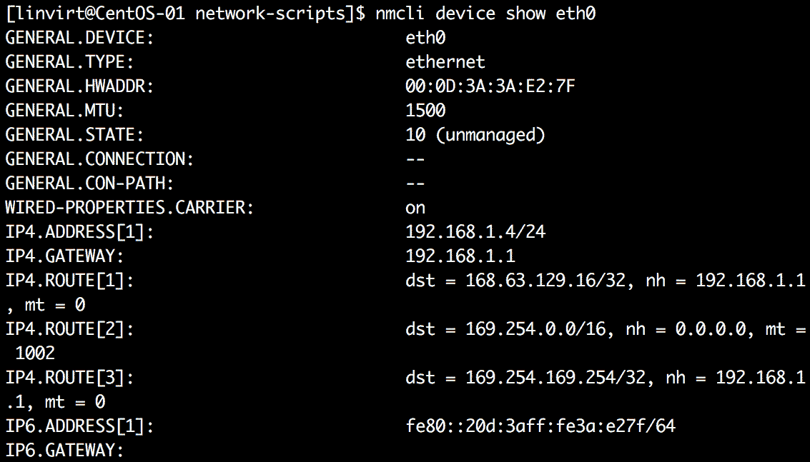

###### 图 5.21：使用`nmcli`命令显示设备设置

### 网络配置更改

如前所述，Azure DHCP 服务器提供了每个网络设置。到目前为止，我们学到的一切都是关于验证在 Azure 中配置的网络设置。

如果在 Azure 中更改了某些内容，则需要在 Linux 中重新启动网络。

在 SUSE 和 CentOS 中，可以使用以下命令执行此操作：

```
sudo systemctl restart network
```

在 Ubuntu Server 的最新版本中，使用以下命令：

```
sudo systemctl restart systemd-networkd
sudo systemctl restart systems-resolved
```

### 主机名

可以使用`hostnamectl`实用程序找到 VM 的当前主机名：

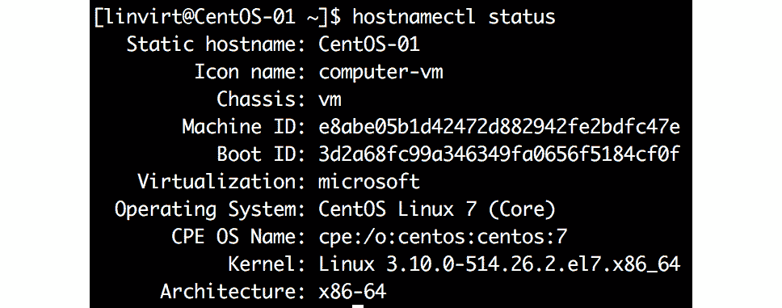

###### 图 5.22：使用`hostnamectl`实用程序获取主机名

主机名由 Azure 中的 DHCP 服务器提供；要查看 Azure 中配置的主机名，可以使用 Azure 门户、Azure CLI 或 PowerShell。例如，在 PowerShell 中，使用以下命令：

```
$myvm=Get-AzVM -Name CentOS-01 '
  -ResourceGroupName MyResource1
$myvm.OSProfile.ComputerName
```

在 Linux 中，可以使用`hostnamectl`实用程序更改主机名：

```
sudo hostnamectl set-hostname <hostname>
sudo systemctl restart waagent #RedHat & SUSE
sudo systemctl restart walinuxagent  #Ubuntu
```

这应该更改您的主机名。如果不起作用，请检查 Azure Linux VM 代理的配置文件`/etc/waagent.conf`：

```
Provisioning.MonitorHostName=y
```

如果仍然无法正常工作，请编辑`/var/lib/waagent/ovf-env.xml`文件，并更改`HostName`参数。另一个可能的原因是`ifcfg-<interface>`文件中的`DHCP_HOSTNAME`行；只需删除它并重新启动`NetworkManager`。

### DNS

DNS 设置也是通过 Azure DHCP 服务器提供的。在 Azure 中，这些设置附加到虚拟网络接口上。您可以在 Azure 门户、PowerShell（`Get-AZNetworkInterface`）或 Azure CLI（`az vm nic show`）中查看它们。

当然，您可以配置自己的 DNS 设置。在 PowerShell 中，声明 VM 并标识网络接口：

```
$myvm = Get-AzVM -Name <vm name> '
  -ResourceGroupName <resource group>
$nicid = $myvm.NetworkProfile.NetworkInterfaces.Id
```

最后一个命令将为您提供所需网络接口的完整 ID；此 ID 的最后部分是接口名称。现在让我们从输出中剥离它并请求接口属性：

```
$nicname = $nicid.split("/")[-1]
$nic = Get-AzNetworkInterface '
  -ResourceGroupName <resource group> -Name $nicname 
$nic
```

如果查看`$nic`变量的值，您会发现它包含了我们需要的所有信息：

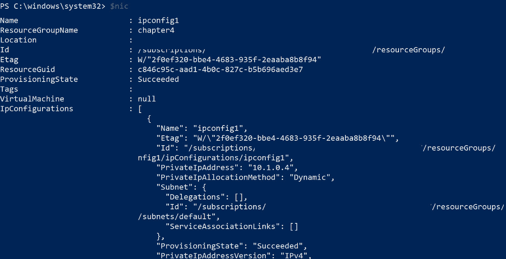

###### 图 5.23：使用$nic 变量获取接口属性

最后一步是更新 DNS 域名服务器设置。为了本书的目的，我们使用的是`9.9.9.9`，这是一个名为 Quad9 的公共、免费可用的 DNS 服务。您也可以使用谷歌的 DNS 服务（`8.8.8.8`和`8.8.4.4`）：

```
$nic.DnsSettings.DnsServers.Add("9.9.9.9")
$nic | Set-AzNetworkInterface
$nic | Get-AzNetworkInterface | '
  Select-Object -ExpandProperty DnsSettings
```

使用 Azure CLI 的方法类似，但涉及的步骤较少。搜索网络接口名称：

```
nicname=$(az vm nic list \
  --resource-group <resource group> \
  --vm-name <vm name> --query '[].id' -o tsv | cut –d "/" -f9)
```

更新 DNS 设置：

```
az network nic update -g MyResource1 --name $nicname \
  --dns-servers 9.9.9.9
```

然后验证新的 DNS 设置：

```
az network nic show --resource-group <resource group> \
  --name $nicname --query "dnsSettings"
```

在 Linux VM 中，您必须更新 DHCP 租约以接收新的设置。为了做到这一点，您可以在 RHEL 中运行`systemctl restart NetworkManager`或在 Ubuntu 中运行`dhclient -r`。设置保存在`/etc/resolv.conf`文件中。

在使用`systemd`的网络实现的 Linux 发行版中，如 Ubuntu，`/etc/resolv.conf`文件是指向`/run/systemd/resolve/`目录中的文件的符号链接，`sudo systemd-resolve --status`命令会显示当前的设置：

```
link 2 (eth0)
      Current Scopes: DNS
       LLMNR setting: yes
MulticastDNS setting: no
      DNSSEC setting: no
    DNSSEC supported: no
         DNS Servers: 9.9.9.9
          DNS Domain: reddog.microsoft.com
```

要测试 DNS 配置，可以使用`dig`，或者更简单的`host`实用程序，如下所示：

```
dig www.google.com A
```

## 存储

在上一章中，我们讨论了如何创建磁盘并将其附加到 VM，但我们的工作并不止于此。我们必须对 Linux 机器进行分区或挂载磁盘。在本节中，我们将讨论 Linux 中的存储管理。Azure 中有两种类型的存储可用：附加到 VM 的虚拟磁盘和 Azure 文件共享。在本章中，将涵盖这两种类型。我们将讨论以下主题：

+   向 VM 添加单个虚拟磁盘

+   处理文件系统

+   使用**逻辑卷管理器**（**LVM**）和 RAID 软件处理多个虚拟磁盘

### 由块设备提供的存储

块设备可以提供本地和远程存储。在 Azure 中，几乎总是附加到 VM 的虚拟硬盘，但也可以使用**Internet 小型计算机系统接口**（**iSCSI**）卷，由 Microsoft Azure StorSimple 或第三方提供。

附加到 VM 的每个磁盘都由内核标识，并在标识后，内核将其交给一个名为`systemd-udevd`的守护进程。这个守护进程负责在`/dev`目录中创建一个条目，更新`/sys/class/block`，并在必要时加载一个驱动程序来访问文件系统。

`/dev`中的设备文件提供了一个简单的接口给块设备，并由 SCSI 驱动访问。

识别可用块设备的多种方法。一种可能性是使用`lsscsi`命令：

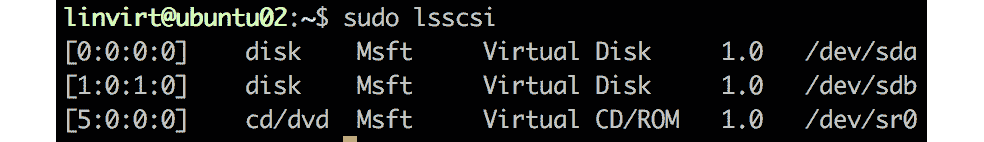

###### 图 5.24：使用`lsscsi`命令识别块设备

第一个可用的磁盘称为`sda`—SCSI 磁盘 A。此磁盘是从在 VM 配置期间使用的映像磁盘创建的，也称为根磁盘。您可以通过`/dev/sda`或`/dev/disk/azure/root`访问此磁盘。

识别可用存储的另一种方法是使用`lsblk`命令。它可以提供有关磁盘内容的更多信息：

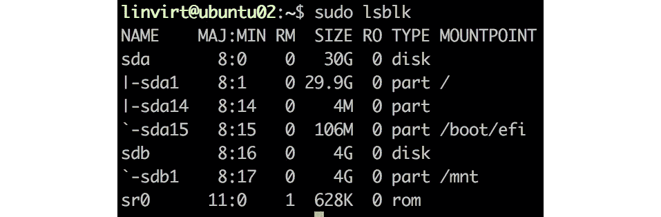

###### 图 5.25：使用 lsblk 命令识别可用存储

在此示例中，在`/dev/sda, sda1`和`sda2`（或`/dev/disk/azure/root-part1`和`root-part2`）上创建了两个分区。第二列中的主要号码`8`表示这是一个 SCSI 设备；次要部分只是编号。第三列告诉我们该设备不可移动，用`0`表示（如果可移动，则为`1`），第五列告诉我们驱动器和分区不是只读的：再次，只读为`1`，读写为`0`。

另一个可用的磁盘是资源磁盘，`/dev/sdb`（`/dev/disk/azure/resource`），这是一个临时磁盘。这意味着数据不是持久的，在重新启动后会丢失，并且用于存储诸如页面或交换文件之类的数据。交换就像 Windows 中的虚拟内存，当物理 RAM 已满时使用。

### 添加数据磁盘

在本节中，我们将回顾我们在上一章中所做的工作，以继续练习并帮助您熟悉命令。如果您已经添加了数据磁盘的 VM，可以跳过本节。

您可以通过 Azure 门户或通过 PowerShell 向 VM 添加额外的虚拟磁盘。让我们添加一个磁盘：

1.  首先，声明我们要如何命名我们的磁盘以及磁盘应该创建在哪里：

```
$resourcegroup = '<resource group>'
$location = '<location>'
$diskname = '<disk name>'
$vm = Get-AzVM '
  -Name <vm name> '
  -ResourceGroupName $resourcegroup
```

1.  创建虚拟磁盘配置-大小为 2GB 的空标准托管磁盘：

```
 $diskConfig = New-AzDiskConfig '
   -SkuName 'Standard_LRS' '
   -Location $location '
   -CreateOption 'Empty' '
   -DiskSizeGB 2
```

1.  使用此配置创建虚拟磁盘：

```
$dataDisk1 = New-AzDisk '
  -DiskName $diskname '
  -Disk $diskConfig '
  -ResourceGroupName $resourcegroup
```

1.  将磁盘附加到 VM：

```
$vmdisk = Add-AzVMDataDisk '
  -VM $vm -Name $diskname '
  -CreateOption Attach '
  -ManagedDiskId $dataDisk1.Id '
  -Lun 1
Update-AzVM '
  -VM $vm '
  -ResourceGroupName $resourcegroup
```

1.  当然，您也可以使用 Azure CLI：

```
az disk create \
  --resource-group <resource group> \
  --name <disk name> \
  --location <location> \
  --size-gb 2 \
  --sku Standard_LRS \ 

az vm disk attach \
  --disk <disk name> \
  --vm-name <vm name> \
  --resource-group <resource group> \ 
  --lun <lun number>
```

#### 注意

LUN 是逻辑单元编号的缩写，用于标记存储（在我们的情况下是虚拟存储）的编号或标识符，这将帮助用户区分存储。您可以从零开始编号。

创建虚拟磁盘后，它将作为`/dev/sdc`（`/dev/disk/azure/scsi1/lun1`）显示在 VM 中。

`rescan-scsi-bus`命令，它是`sg3_utils`软件包的一部分。

再次查看`lssci`的输出：

```
[5:0:0:1]    disk   Msft     Virtual Disk     1.0  /dev/sdc
```

第一列格式化为：

```
<hostbus adapter id> :  <channel id> : <target id> : <lun number>
```

`hostbus adapter`是与存储的接口，并由 Microsoft Hyper-V 虚拟存储驱动程序创建。通道 ID 始终为`0`，除非您已配置多路径。目标 ID 标识控制器上的 SCSI 目标；对于 Azure 中的直接连接设备，这始终为零。

### 分区

在您可以使用块设备之前，您需要对其进行分区。有多种可用于分区的工具，一些发行版配备了自己的实用程序来创建和操作分区表。例如，SUSE 在其 YaST 配置工具中有一个。

在本书中，我们将使用`parted`实用程序。这在每个 Linux 发行版上都是默认安装的，并且可以处理所有已知的分区布局：`msdos`，`gpt`，`sun`等。

您可以从命令行以脚本方式使用`parted`，但是，如果您对`parted`不熟悉，最好使用交互式 shell：

```
parted /dev/sdc
  GNU Parted 3.1
  Using /dev/sdc
  Welcome to GNU Parted! Type 'help' to view a list of commands.
```

1.  第一步是显示有关此设备的可用信息：

```
(parted) print
  Error: /dev/sdc: unrecognised disk label
  Model: Msft Virtual Disk (scsi)
  Disk /dev/sdc: 2147MB
  Sector size (logical/physical): 512B/512B
  Partition Table: unknown
  Disk Flags:
```

这里的重要一行是`unrecognised disk label`。这意味着没有创建分区布局。如今，最常见的布局是`parted`在问号后支持自动补全-按两次*Ctrl* + *I*。

1.  将分区标签更改为`gpt`：

```
(parted) mklabel
 New disk label type? gpt
```

1.  通过再次打印磁盘分区表来验证结果：

```
(parted) print
  Model: Msft Virtual Disk (scsi)
  Disk /dev/sdc: 2147MB
  Sector size (logical/physical): 512B/512B
  Partition Table: gpt
  Disk Flags:
  Number Start  End  Size File system  Name  Flags
```

1.  下一步是创建分区：

```
(parted) mkpart
  Partition name?  []? lun1_part1
  File system type?  [ext2]? xfs
  Start? 0%
  End? 100%
```

文件系统将在本章后面介绍。对于大小，您可以使用百分比或固定大小。一般来说，在 Azure 中，使用整个磁盘更有意义。

1.  再次打印磁盘分区表：

```
(parted) print
  Model: Msft Virtual Disk (scsi)
  Disk /dev/sdc: 2147MB
  Sector size (logical/physical): 512B/512B
  Partition Table: gpt
  Disk Flags:
  Number Start   End     Size   File system  Name        Flags
  1      1049kB 2146MB  2145MB               lun1_part1
```

请注意，文件系统列仍为空，因为分区尚未格式化。

1.  使用*Ctrl* + *D*，或`quit`，退出`parted`。

### Linux 中的文件系统

文件系统有它们自己的数据组织机制，这将因文件系统而异。如果我们比较可用的文件系统，我们会发现有些快速，有些设计用于更大的存储，有些设计用于处理更小的数据块。您选择的文件系统应取决于最终需求以及您要存储的数据类型。Linux 支持许多文件系统——本地 Linux 文件系统，如 ext4 和 XFS，以及第三方文件系统，如 FAT32。

每个发行版都支持本地文件系统 ext4 和 XFS；除此之外，SUSE 和 Ubuntu 还支持非常现代的文件系统：BTRFS。Ubuntu 是为数不多支持 ZFS 文件系统的发行版之一。

格式化文件系统后，您可以将其挂载到根文件系统。`mount`命令的基本语法如下：

```
mount <partition> <mountpoint>
```

分区可以使用设备名称、标签或`mount`命令或通过`zfs`实用程序进行命名。

另一个重要的文件系统是交换文件系统。除了普通文件系统外，还有其他特殊文件系统：devfs、sysfs、procfs 和 tmpfs。

让我们从对文件系统及其周围实用程序的简短描述开始。

### **ext4 文件系统**

ext4 是一种本地 Linux 文件系统，作为 ext3 的继任者开发，多年来一直是（对于一些发行版来说仍然是）默认文件系统。它提供了稳定性、高容量、可靠性和性能，同时需要最少的维护。除此之外，您可以轻松调整（增加/减少）文件系统的大小。

好消息是它可以在非常低的要求下提供这一点。当然，也有坏消息：它非常可靠，但无法完全保证数据的完整性。如果数据在磁盘上已损坏，ext4 既无法检测到也无法修复这种损坏。幸运的是，由于 Azure 的基础架构，这种情况不会发生。

ext4 并不是最快的文件系统，但对于许多工作负载来说，ext4 和竞争对手之间的差距非常小。

最重要的实用程序如下：

+   `mkfs.ext4`：格式化文件系统

+   `e2label`：更改文件系统的标签

+   `tune2fs`：更改文件系统的参数

+   `dump2fs`：显示文件系统的参数

+   `resize2fs`：更改文件系统的大小

+   `fsck.ext4`：检查和修复文件系统

+   `e2freefrag`：报告碎片情况

+   `e4defrag`：对文件系统进行碎片整理；通常不需要

要创建 ext4 文件系统，请使用以下命令：

```
sudo mkfs.ext4 -L <label> <partition>
```

标签是可选的，但可以更容易地识别文件系统。

### **XFS 文件系统**

XFS 是一种高度可扩展的文件系统。它可以扩展到 8 EiB（exbibyte = 2⁶⁰ 字节）并且可以在线调整大小；只要有未分配的空间，文件系统就可以增长，并且可以跨多个分区和设备。

XFS 是最快的文件系统之一，特别是与 RAID 卷结合使用时。但这是有代价的：如果要使用 XFS，您的虚拟机至少需要 1 GB 的内存。如果要能够修复文件系统，您至少需要 2 GB 的内存。

XFS 的另一个好功能是您可以使流量静止到文件系统，以创建一致的备份，例如数据库服务器。

最重要的实用程序如下：

+   `mkfs.xfs`：格式化文件系统

+   `xfs_admin`：更改文件系统的参数

+   `xfs_growfs`：减小文件系统的大小

+   `xfs_repair`：检查和修复文件系统

+   `xfs_freeze`：暂停对 XFS 文件系统的访问；这使得一致的备份更容易

+   `xfs_copy`：快速复制 XFS 文件系统的内容

要创建 XFS 文件系统，请使用以下命令：

```
sudo mkfs.xfs -L <label> <partition>
```

标签是可选的，但可以更容易地识别文件系统。

### **ZFS 文件系统**

ZFS 是由 SUN 开发的组合文件系统和逻辑卷管理器，自 2005 年以来由 Oracle 拥有。它以出色的性能和丰富的功能而闻名：

+   卷管理和 RAID

+   防止数据损坏

+   数据压缩和重复数据删除

+   可扩展至 16 艾字节

+   能够导出文件系统

+   快照支持

ZFS 可以在 Linux 上使用用户空间驱动程序（FUSE）或 Linux 内核模块（OpenZFS）实现。在 Ubuntu 中，最好使用内核模块；它的性能更好，并且没有 FUSE 实现的一些限制。例如，如果使用 FUSE，则无法通过 NFS 导出文件系统。

OpenZFS 没有被广泛采用的主要原因是许可证问题。OpenZFS 的**公共开发和分发许可证**（**CDDL**）许可证与 Linux 内核的通用公共许可证不兼容。另一个原因是 ZFS 可能会占用大量内存；您的虚拟机每 TB 存储需要额外 1GB 内存，这意味着 16TB 存储需要 16GB RAM 用于应用程序。对于 ZFS，至少建议使用 1GB 内存。但内存越多越好，因为 ZFS 使用大量内存。

最重要的实用程序如下：

+   `zfs`：配置 ZFS 文件系统

+   `zpool`：配置 ZFS 存储池

+   `zfs.fsck`：检查和修复 ZFS 文件系统

在本书中，仅涵盖了 ZFS 的基本功能。

Ubuntu 是唯一支持 ZFS 的发行版。要在 Ubuntu 中使用 ZFS，您必须安装 ZFS 实用程序：

```
sudo apt install zfsutils-linux
```

安装后，您可以开始使用 ZFS。假设您向虚拟机添加了三个磁盘。使用 RAID 0 是个好主意，因为它比单个磁盘提供更好的性能和吞吐量。

首先，让我们使用两个磁盘创建一个池：

```
sudo zpool create -f mydata /dev/sdc /dev/sdd
sudo zpool list mydata
sudo zpool status mydata
```

现在让我们添加第三个磁盘，以展示如何扩展池：

```
sudo zpool add mydata /dev/sde
sudo zpool list mydata
sudo zpool history mydata
```

您可以直接使用此池，或者您可以在其中创建数据集，以便更精细地控制诸如配额之类的功能：

```
sudo zfs create mydata/finance
sudo zfs set quota=5G mydata/finance
sudo zfs list
```

最后，您需要挂载此数据集才能使用它：

```
sudo zfs set mountpoint=/home/finance mydata/finance
findmnt /home/finance
```

此挂载将在重新启动后保持。

**BTRFS 文件系统**

BTRFS 是一个相对较新的文件系统，主要由 Oracle 开发，但也得到了 SUSE 和 Facebook 等公司的贡献。

就功能而言，它与 ZFS 非常相似，但正在大力开发中。这意味着并非所有功能都被认为是稳定的。在使用此文件系统之前，请访问[`btrfs.wiki.kernel.org/index.php/Status`](https://btrfs.wiki.kernel.org/index.php/Status)。

内存要求与 XFS 相同：虚拟机中需要 1GB 内存。如果要修复文件系统，则不需要额外的内存。

在本书中，仅涵盖了 BTRFS 的基本功能。您可以在所有发行版上使用 BTRFS，但请注意，在 RHEL 和 CentOS 上，文件系统被标记为废弃，在 RHEL 8 中已删除。有关更多信息，请访问[`access.redhat.com/solutions/197643`](https://access.redhat.com/solutions/197643)。

最重要的实用程序如下：

+   `mkfs.btrfs`：使用此文件系统格式化设备

+   `btrfs`：管理文件系统

假设您向虚拟机添加了三个磁盘。使用 RAID 0 可以提高性能，并允许与仅使用单个磁盘相比获得更高的吞吐量。

首先，让我们使用两个基础磁盘创建一个 BTRFS 文件系统：

```
sudo mkfs.btrfs -d raid0 -L mydata /dev/sdc /dev/sdd
```

当然，您可以使用第三个磁盘扩展文件系统，但在这样做之前，您必须挂载文件系统：

```
sudo mkdir /srv/mydata
sudo mount LABEL=mydata /srv/mydata 
sudo btrfs filesystem show /srv/mydata
```

现在，添加第三个磁盘：

```
sudo btrfs device add /dev/sde /srv/mydata
sudo btrfs filesystem show /srv/mydata
```

像 ZFS 一样，BTRFS 有数据集的概念，但在 BTRFS 中，它们被称为**子卷**。要创建一个子卷，执行以下命令：

```
sudo btrfs subvolume create /srv/mydata/finance
sudo btrfs subvolume list /srv/mydata
```

您可以独立于根卷挂载子卷：

```
sudo mkdir /home/finance
sudo mount -o subvol=finance LABEL=mydata /home/finance
```

您可以在`findmnt`命令的输出中看到 ID`258`：

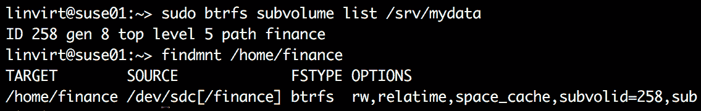

###### 图 5.26：创建子卷

**交换文件系统**

如果您的应用程序没有足够的可用内存，可以使用交换。即使机器上有大量 RAM，使用交换也是一个好习惯。

空闲内存是以前使用过但当前应用程序不需要的内存。如果这些空闲内存在长时间内没有使用，它将被交换以使更多的内存可用于更频繁使用的应用程序。

为了提高整体性能，最好为 Linux 安装一些交换空间。最好使用最快的可用存储，最好是在资源磁盘上。

#### 注意

在 Linux 中，您可以使用交换文件和交换分区。性能上没有区别。在 Azure 中，您不能使用交换分区；这将使您的系统不稳定，这是由底层存储引起的。

在 Azure 中，交换由 Azure VM Agent 管理。您可以验证`ResourceDisk.EnableSwap`参数是否设置为`y`，以确认在`/etc/waagent.conf`中启用了交换。此外，您可以在`ResourceDisk.SwapSizeMB`中检查交换大小：

```
# Create and use swapfile on resource disk.
ResourceDisk.EnableSwap=y
# Size of the swapfile.
ResourceDisk.SwapSizeMB=2048
```

一般来说，2048 MB 的`swapfile`内存已经足够增加整体性能。如果交换没有启用，要创建交换文件，可以通过设置以下三个参数更新`/etc/waagent.conf`文件：

+   `ResourceDisk.Format=y`

+   `ResourceDisk.EnableSwap=y`

+   `ResourceDisk.SwapSizeMB=xx`

要重新启动 Azure VM Agent，对于 Debian/Ubuntu，执行以下命令：

```
sudo systemctl restart walinuxagent
```

对于 Red Hat/CentOS，执行以下命令：

```
service waagent restart 
```

验证结果：

```
ls -lahR /mnt | grep -i swap
swapon –s
```

如果发现交换文件未创建，可以继续重启 VM。要执行此操作，请使用以下任一命令：

```
shutdown -r now init 6
```

### Linux 软件 RAID

**独立磁盘冗余阵列**（**RAID**），最初称为廉价磁盘冗余阵列，是一种冗余技术，相同的数据存储在不同的磁盘中，这将帮助您在磁盘故障的情况下恢复数据。RAID 有不同的级别可用。微软在[`docs.microsoft.com/en-us/azure/virtual-machines/linux/configure-raid`](https://docs.microsoft.com/en-us/azure/virtual-machines/linux/configure-raid)中正式声明，您需要 RAID 0 以获得最佳性能和吞吐量，但这不是强制性的实施。如果您当前的基础架构需要 RAID，那么您可以实施它。

如果您的文件系统不支持 RAID，可以使用 Linux 软件 RAID 来创建 RAID 0 设备。您需要安装`mdadm`实用程序；它在每个 Linux 发行版上都可用，但可能不是默认安装的。

假设您向 VM 添加了三个磁盘。让我们创建一个名为`/dev/md127`的 RAID 0 设备（只是一个尚未使用的随机数）：

```
sudo mdadm --create /dev/md127 --level 0 \
  --raid-devices 3 /dev/sd{c,d,e} 
```

验证配置如下：

```
cat /proc/mdstat
sudo mdadm --detail /dev/md127
```

前面的命令应该给出以下输出：

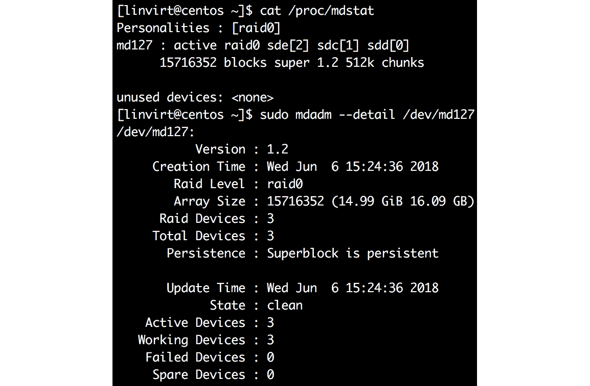

###### 图 5.27：验证 RAID 配置

使配置持久化：

```
mdadm --detail --scan --verbose >> /etc/mdadm.conf
```

现在，您可以使用此设备并使用文件系统格式化它，如下所示：

```
mkfs.ext4 -L BIGDATA /dev/md127
```

### Stratis

Stratis 是在 RHEL 8 中新引入的，用于创建多磁盘、多层存储池，以便轻松监视和管理该池，并且只需最少量的手动干预。它不提供 RAID 支持，但它将多个块设备转换为一个具有文件系统的池。Stratis 使用已经存在的技术：LVM 和 XFS 文件系统。

如果在您的 RHEL 上未安装 Stratis，可以通过执行以下命令轻松安装：

```
sudo dnf install stratis-cli
```

启用守护程序的命令如下：

```
sudo systemctl enable --now stratisd
```

假设您向 VM 添加了两个数据磁盘：`/dev/sdc`和`/dev/sdd`。创建池：

```
sudo stratis pool create stratis01 /dev/sdc /dev/sdd
```

使用此命令进行验证：

```
sudo stratis pool list
```

输出显示了总存储量；在上面的示例中，为 64 GB。其中 104 MiB 已被占用，用于池管理所需的元数据：


###### 图 5.28：stratis 池的存储详细信息

要获取有关池中磁盘和使用情况的更多详细信息，请执行以下命令：

```
sudo stratis blockdev list
```

如你在以下截图中所见，我们得到了相同的输出，但是有关池中磁盘和使用情况的更多详细信息。在以下输出中，你可以看到池的名称和状态：

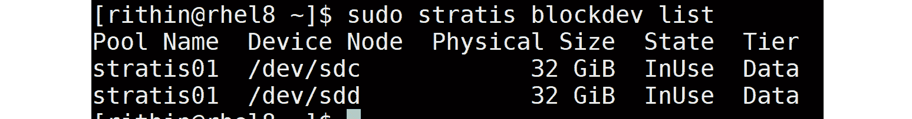

###### 图 5.29：池名称和状态

在这里，存储用于数据，因为也可以将磁盘配置为读/写缓存。Stratis 在新创建的池上形成一个文件系统（默认为 xfs）：

```
sudo stratis filesystem create stratis01 finance
```

文件系统被标记为`finance`，可以通过设备名称(`/stratis/stratis01/finance`)或 UUID 进行访问。

有了这些信息，你可以像对待其他文件系统一样挂载它，比如使用 systemd 挂载，我们将在本章后面讨论。

创建文件系统后，可以创建快照，这些快照基本上是原始文件系统的副本。可以通过执行以下命令来添加快照：

```
sudo stratis filesystem snapshot stratis01 finance finance_snap
```

要列出文件系统，可以执行以下命令：

```
sudo stratis filesystem
```

而且你必须将其挂载为普通文件系统！

添加读/写缓存可以提高性能，特别是如果你使用性能比标准 SSD 磁盘（甚至非 SSD 磁盘）更好的磁盘。假设这个磁盘是`/dev/sde`：

```
sudo sudo stratis pool add-cache stratis01 /dev/sde
```

并且以与之前相同的方式进行验证，使用`blockdev`参数：

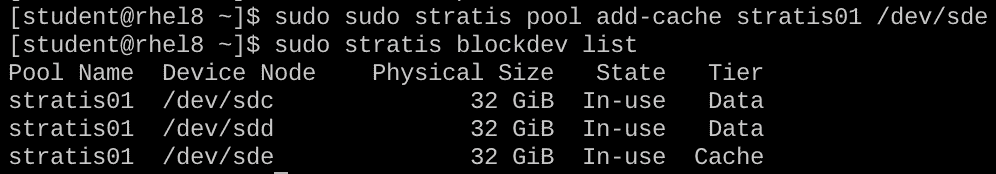

###### 图 5.30：向`/dev/sde`磁盘添加缓存

总之，我们已经讨论了各种文件系统；你的选择将取决于你的需求。首先，你需要确保文件系统与你的发行版兼容；例如，BTRFS 在 RHEL 8 中被移除。因此，在选择之前最好先检查兼容性。

## systemd

Linux 内核启动后，第一个 Linux 进程开始第一个进程。这个进程被称为`init`进程。在现代 Linux 系统中，这个进程是`systemd`。看一下以下截图，显示了以树状格式显示的运行进程：

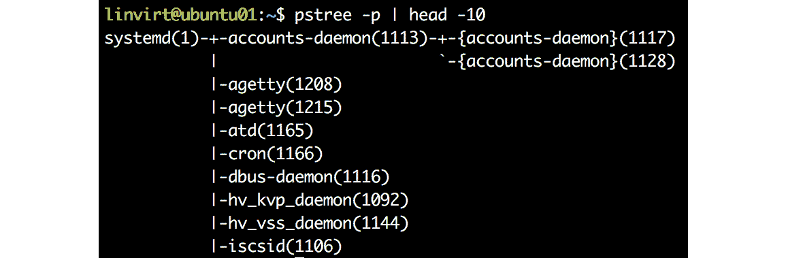

###### 图 5.31：以树状格式查看运行进程

systemd 负责在引导过程中并行启动所有进程，除了由内核创建的进程。之后，它按需激活服务等。它还跟踪和管理挂载点，并管理系统范围的设置，比如主机名。

systemd 是一个事件驱动的系统。它与内核通信，并会对事件做出反应，比如时间点或引入新设备或按下*Ctrl* + *Alt* + *Del*的用户。

### 使用单元

systemd 与单元一起工作，这些单元是由 systemd 管理的实体，并封装了与 systemd 相关的每个对象的信息。

单元文件是包含配置指令的配置文件，描述了单元并定义了其行为。这些文件存储如下：

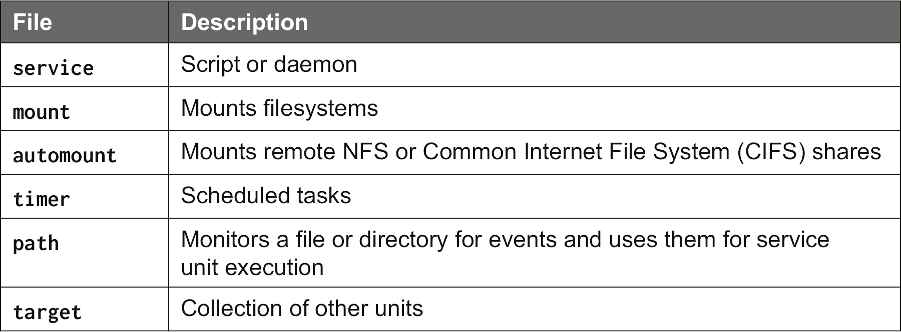

###### 图 5.32：单元文件及其描述

单元可以通过`systemctl`实用程序进行管理。如果要查看所有可用类型，执行以下命令：

```
systemctl --type help
```

要列出所有已安装的单元文件，请使用以下命令：

```
sudo systemctl list-unit-files
```

要列出活动单元，请使用以下命令：

```
sudo systemctl list-units
```

`list-unit-files`和`list-units`参数都可以与`--type`结合使用。

### 服务

服务单元用于管理脚本或守护程序。让我们来看看 SSH 服务：

#### 注意

这些截图是从 Ubuntu 18.04 中获取的。在其他发行版上，服务的名称可能不同。

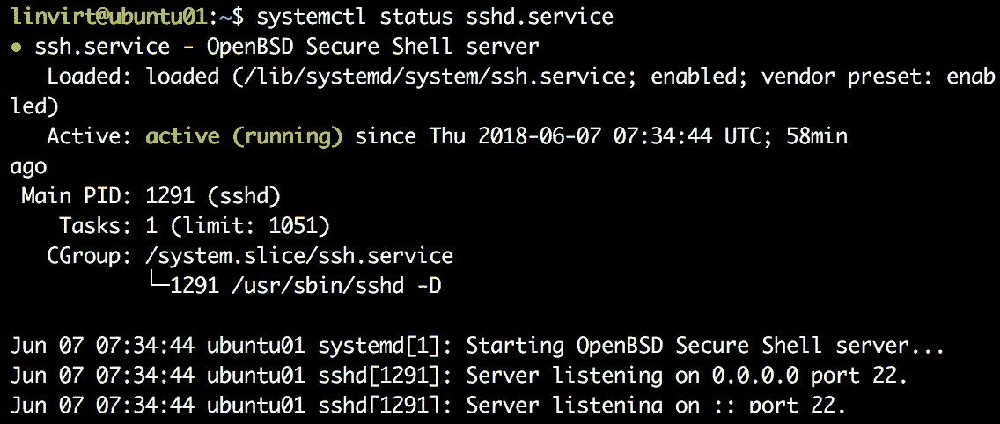

###### 图 5.33：ssh 服务详细信息

使用`systemctl`的`status`参数，您可以看到该单元已加载，已启用并在启动时启用，并且这是默认值。如果未启用，可以使用此命令启用它；启用将将服务添加到自动启动链中：

```
sudo systemctl enable <service name.service>
```

要查看服务的状态，可以执行此命令：

```
sudo systemctl status <service name>
```

在输出中，您可以看到 SSH 服务正在运行，并且日志中显示的最后条目如下：

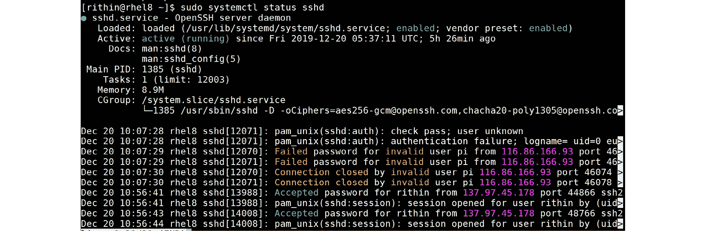

###### 图 5.34：服务状态和条目

要查看`unit`文件的内容，请执行以下命令：

```
sudo systemctl cat <service name.service>
```

`unit`文件始终有两个或三个部分：

+   `[Unit]`：描述和依赖项处理

+   `[<Type>]`：类型的配置

+   `[Install]`：如果要能够在启动时启用服务，则是可选部分

为了处理依赖项，有几个可用的指令；最重要的是这些：

+   `before`：在启动此单元之前，指定的单元将被延迟启动。

+   `after`：在启动此单元之前启动指定的单元。

+   `requires`：如果激活此单元，则列在此处的单元也将被激活。如果指定的单元失败，此单元也将失败。

+   `wanted`：如果激活此单元，则列在此处的单元也将被激活。如果指定的单元失败，将没有后果。

#### 注意

如果您不指定`before`或`after`，则列出的单元或单元（逗号分隔）将与单元同时启动。

`ssh`服务的示例如下：

```
[Unit]
Description=OpenSSH Daemon After=network.target
[Service] 
EnvironmentFile=-/etc/sysconfig/ssh 
ExecStartPre=/usr/sbin/sshd-gen-keys-start 
ExecStart=/usr/sbin/sshd -D $SSHD_OPTS 
ExecReload=/bin/kill -HUP $MAINPID KillMode=process
Restart=always
[Install] 
WantedBy=multi-user.target
```

`Service`部分中的大多数选项都是不言自明的；如果不是，请查看`systemd.unit`和`systemd.service`的手册页。对于`[Install]`部分，`WantedBy`指令说明如果启用此服务，它将成为`multi-user.target`集合的一部分，该集合在启动时激活。

在进入目标之前，最后要涵盖的内容是如何创建覆盖。systemd 单元可以有许多不同的指令；许多是默认选项。要显示所有可能的指令，请执行以下命令：

```
sudo systemctl show
```

如果要更改默认值中的一个，请使用以下命令：

```
sudo systemctl edit <service name.service>
```

启动编辑器。添加条目，例如如下所示：

```
[Service]
ProtectHome=read-only
```

保存更改。您需要重新加载 systemd 配置文件并重新启动服务：

```
sudo systemctl daemon-reload
sudo systemctl restart sshd
```

使用`systemctl cat sshd.service`审查更改。再次登录并尝试在您的主目录中保存一些内容。

#### 注意

如果您想要为`systemctl edit`添加另一个编辑器，请在`/etc/environment`文件中添加一个变量`SYSTEMD_EDITOR`，例如`SYSTEMD_EDITOR=/usr/bin/vim`。

### 目标

目标是单元的集合。有两种类型的目标：

+   `timers.target`，其中包含所有计划任务。

+   `systemctl isolate <target name.target>`，这将关闭不属于目标的所有进程，并启动属于它的所有进程。示例包括`rescue.target`和`graphical.target`单元。

要查看目标的内容，请使用以下命令：

```
systemctl list-dependencies <target name.target>
```

### 计划任务

systemd 可用于安排任务。以下是一个定时器单元文件的示例：

```
[Unit]
Description=Scheduled backup task
[Timer]
OnCalendar=*-*-* 10:00:00
[Install] 
WantedBy=timers.target
```

如果将此文件的内容保存到`/etc/systemd/system/backup.timer`，则需要一个相应的文件，例如`/etc/systemd/system/backup.service`，其内容如下：

```
[Unit]
Description = backup script
[Service]
Type = oneshot
ExecStart = /usr/local/bin/mybackup.sh
```

启用和激活定时器：

```
sudo systemctl enable --now backup.timer
```

要了解计划任务的信息，请使用以下命令：

```
sudo systemctl list-timers
```

#### 注意

阅读`man 7 systemd.time`以了解日历事件的语法。该手册页有一个专门的部分介绍了这个。

如果计划任务不是一个重复性的任务，您可以使用以下命令：

```
sudo systemd-run --on-calendar <event time> <command>
```

例如，如果我们想要在 2019 年 10 月 11 日上午 12:00 将`done`回显到文件`/tmp/done`中，我们必须按照以下屏幕截图所示进行操作：

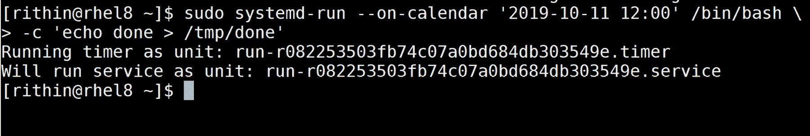

###### 图 5.35：通过提供事件时间运行定时任务

### 挂载本地文件系统

挂载单元可用于挂载文件系统。挂载单元的名称有一些特殊之处：它必须对应于挂载点。例如，如果你想在`/home/finance`上挂载，挂载单元文件就变成了`/etc/systemd/system/home-finance.mount`：

```
[Unit]
Description = Finance Directory
[Mount] 
What = /dev/sdc1
Where = /home/finance
Type = xfs
Options = defaults
[Install]
WantedBy = local-fs.target
```

使用`systemctl start home-finance.mount`来开始挂载，使用`systemctl enable home-finance.mount`来在启动时挂载。

### 挂载远程文件系统

如果一个文件系统不是本地的而是远程的，例如，如果它是一个 NFS 共享，最好的挂载方式是使用`automount`。如果你不使用 automount（`autofs`服务），你必须手动挂载远程共享；这里的优势是，如果你已经访问了远程共享，autofs 会自动挂载。它会挂载共享，如果你失去了与共享的连接，它会尝试按需自动挂载共享。

你需要创建两个文件。让我们以在`/home/finance`上挂载 NFS 为例。首先，创建`/etc/systemd/system/home-finance.mount`，内容如下：

```
[Unit]
Description = NFS Finance Share
[Mount]
What = 192.168.122.100:/share
Where = /home/finance
Type = nfs
Options = vers=4.2
```

创建一个名为`/etc/systemd/system/home-finance.automount`的文件：

```
[Unit]
Description = Automount NFS Finance Share
[Automount]
Where = /home/finance
[Install]
WantedBy = remote-fs.target
```

启动自动挂载单元，而不是挂载单元。当然，你可以在启动时启用它。

## 总结

在本章中，我们深入探讨了 Linux，解释了每个 Linux 系统管理员的基本任务：管理软件、网络、存储和服务。

当然，作为 Linux 系统管理员，这不是你每天都会做的事情。很可能你不会手动操作，而是自动化或编排。但是为了能够编排它，你需要了解它的工作原理，并能够验证和排除配置问题。这将在*第八章，探索持续配置自动化*中介绍。

在下一章中，我们将探索 Linux 中限制对系统访问的选项。

+   强制访问控制

+   网络访问控制列表

+   防火墙

我们还将介绍如何使用 Azure 活动目录域服务将 Linux 机器加入域。

## 问题

1.  谁负责硬件的识别？

1.  谁负责设备命名？

1.  有哪些识别网络接口的方法？

1.  谁负责网络配置的维护？

1.  有哪些识别本地附加存储的方法？

1.  为什么我们在 Azure 中使用 RAID 0？

1.  在 Azure 中实现 RAID 0 的选项有哪些？

1.  尝试使用三个磁盘实现 RAID 0 设备；用 XFS 格式化它。挂载它，并确保它在启动时被挂载。

## 进一步阅读

在某种程度上，本章是一次深入的探讨，但是关于本章涉及的所有主题，还有很多值得学习的地方。我强烈建议你阅读所有使用的命令的 man 页面。

关于存储，除了 Azure 网站上的文档外，一些文件系统还有它们自己的网站：

+   **XFS**: [`xfs.org`](https://xfs.org)

+   **BTRFS**: [`btrfs.wiki.kernel.org`](https://btrfs.wiki.kernel.org)

+   **ZFS**: [`open-zfs.org`](http://open-zfs.org)

+   **Stratis**: [`stratis-storage.github.io`](https://stratis-storage.github.io)

Lennart Poettering，systemd 的主要开发人员之一，有一个很好的博客，里面有很多技巧和背景信息：[`0pointer.net/blog`](http://0pointer.net/blog)。此外，还有文档可在[`www.freedesktop.org/wiki/Software/systemd`](https://www.freedesktop.org/wiki/Software/systemd)找到。

由于`systemctl status`命令无法提供足够的信息，我们将在*第十一章，故障排除和监控工作负载*中进一步讨论日志记录。
