# 第六章：管理 Linux 安全和身份

在上一章中，我们讨论了处理存储、网络和进程管理。然而，作为系统管理员，您的主要目标是保护 Linux 机器，拒绝任何未经授权的访问或限制用户的访问。在企业环境中，安全漏洞是一个巨大的关注点。在本章中，我们将涵盖安全性——在操作系统级别保护您的工作负载；例如，如果您的组织是一个金融机构，在那里您将处理涉及货币承诺甚至客户的**个人可识别信息**（**PII**）的工作负载，那么保护工作负载以避免任何违规行为就至关重要。当然，Azure 已经为您提供了多种方式和多个层面的服务来保护您的 VM。以下是其中一些服务：

+   Azure 资源管理器，提供安全性、审计和标记功能

+   Web 应用程序防火墙，可防范诸如 SQL 注入等许多攻击

+   网络安全组的有状态数据包过滤功能

+   Azure 防火墙，提供与 Azure 监控功能紧密集成的有状态防火墙

您还可以订阅 Azure 安全中心服务，进行统一的安全管理，具有许多有吸引力的功能，如持续安全评估。

有了所有这些可能性，我们是否仍然需要在操作系统级别进行保护？在我们看来，多层保护是一个好主意。这将使黑客付出更多的努力和时间，这将使检测黑客变得更容易。没有完全没有漏洞的软件：如果一个应用程序有漏洞，至少操作系统应该受到保护。

身份管理是与安全相关的一个话题。您可以将 Linux 与**Azure Active Directory**（**Azure AD**）集成，以集中管理您的登录帐户，通过使用基于角色的访问控制进行细粒度访问，撤销访问权限，并启用多因素身份验证。

在本章结束时，您将能够：

+   实施**强制访问控制**（**MAC**）系统，如 SELinux 或 AppArmor。

+   了解**自主访问控制**（**DAC**）的基础知识。

+   使用 Azure 中可用的身份管理系统。

+   使用防火墙守护程序和 systemd 增强 Linux 安全性。

## Linux 安全提示

在深入讨论您可以采取的所有出色安全措施之前，这里有一些关于安全性的提示。

一般来说，在多个层面上实施安全性是一个好主意。这样，黑客需要不同的方法来获取访问权限，这会花费他们时间。由于这段时间，希望也是由于日志记录和监控，您有更大的机会发现未经授权的访问。

对于文件和目录，尽可能使用`suid/sgid`位。是否有需要更改自己密码的用户？没有？那么从`passwd`命令中删除该位。

使用分区，特别是对于`/tmp`、`/var`、`/var/tmp`和`/home`等目录，并使用`noexec`、`nodev`和`nosuid`标志进行挂载：

+   一般来说，允许用户从这些位置执行程序并不是一个好主意。幸运的是，如果你无法将所有者设置为 root，你可以将带有`suid`位的程序复制到自己的目录中作为普通用户。

+   这些目录中文件的`suid`和`sgid`权限非常危险。

+   不允许在此分区上创建或存在字符或特殊设备。

要访问虚拟机，请使用基于 SSH 密钥的身份验证，而不是密码。使用 ACL 或防火墙限制对特定 IP 的访问。限制用户，并且不允许 root 进行远程访问（使用`PermitRootLogin no`参数和`AllowUsers`只允许一个或两个帐户访问）。使用`sudo`以 root 身份执行命令。也许在`sudo`配置中创建特殊用户或用户组来执行特殊任务。

不要在虚拟机上安装太多软件，特别是涉及网络服务的软件，比如 Web 服务器和电子邮件服务器。定期使用 `ss` 命令来查看开放端口，并将其与 ACL 和/或防火墙规则进行比较。

另一个提示是不要在系统上禁用 SELinux，这是 Linux 内核中的一个安全模块。现在不用担心这个问题，因为我们有一个专门的章节介绍 SELinux。

保持系统更新；Linux 供应商提供更新是有原因的。可以手动进行更新，也可以使用自动化/编排工具。一定要做！

## 技术要求

在本章中，您需要部署 RedHat/CentOS 7 和 Ubuntu 18.04 VM。另一个选择是使用 SUSE SLE 12 或 openSUSE LEAP 而不是 CentOS 和 Ubuntu VM。SUSE 支持本章讨论的所有选项。

## DAC

**DAC** 也被称为用户控制的访问控制。您可能已经熟悉 Linux 中的经典权限和 ACL。这两者结合形成了 DAC。经典权限检查当前进程的 **用户 ID**（**UID**）和 **组 ID**（**GID**）。经典权限将试图访问文件的用户的 UID 和 GID 与文件设置的 UID 和 GID 进行匹配。让我们看看 DAC 是如何引入的，以及您在 Linux 中拥有什么级别的权限。但是，我们不会详细讨论这个问题，因为主要目的是让您熟悉 Linux 中的权限。

### DAC 简介

大多数操作系统，如 Linux、macOS、各种 Unix 的变种，甚至 Windows，都是基于 DAC 的。MAC 和 DAC 在美国国防部发布的《可信计算机系统评估标准》（TCSEC），也称为橙皮书中定义。我们将在下一节讨论 MAC。顾名思义，DAC 允许文件的所有者或创建者决定他们需要为同一文件提供其他用户的访问级别。

尽管我们看到 DAC 在所有系统中都得到了实施，但它也被认为是薄弱的。例如，如果我们授予用户读取权限，它将具有传递性质。因此，没有任何东西会阻止用户将别人文件的内容复制到用户可以访问的对象中。换句话说，信息的分发在 DAC 中没有得到管理。在下一节中，我们将快速了解文件权限。

### Linux 中的文件权限

Linux 中的每个文件和目录都被视为一个对象，并且具有三种所有者类型：用户、组和其他。接下来，我们通常将文件和目录称为对象。首先，让我们了解三种不同类型的所有者：

+   用户：用户是创建对象的人。默认情况下，这个人将成为对象的所有者。

+   **组**：组是用户的集合。所有属于同一组的用户将对对象具有相同的访问级别。组的概念使您能够一次为多个用户分配权限更加容易。想象一种情况，您将创建一个文件，并且希望您的团队成员也能访问该文件。如果您是一个庞大的团队，并且为每个用户分配权限，这将是繁琐的。相反，您可以将用户添加到一个组中，并为该组定义权限，这意味着组中的所有用户都继承了访问权限。

+   **其他**：这指的是任何不是对象所有者（创建者）或不是用户组成员的其他用户。换句话说，想象一个包含创建者和具有权限的组中的所有用户的集合；“其他”指的是不是这个集合元素的用户。

如前所述，每个对象都有三种所有者类型。每个所有者（用户、组、所有者）对对象都有三种权限。它们如下：

+   **读取**：读取权限将允许读取或打开文件。目录上的读取权限意味着用户将能够列出目录的内容。

+   **写入**：如果应用于文件，这将允许修改文件的内容。将此权限添加到目录将授予添加、删除和重命名文件的权限。

+   **执行**：这个权限对于运行可执行程序或脚本是必需的。例如，如果你有一个 bash 脚本并且有读/写权限，这意味着你可以读取和修改代码。然而，要执行代码，你需要这个权限。

这是所有者和相关权限的图示表示：

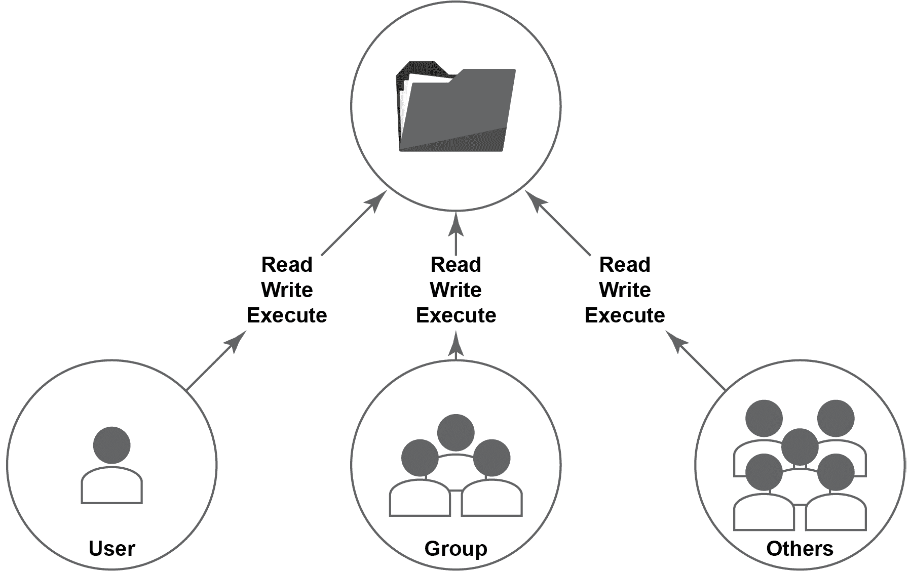

###### 图 6.1：所有者类型和访问权限

让我们继续了解如何从 Linux 终端中找出权限。

要列出目录的内容，执行`ls -lah`。

输出将根据你要列出的目录中的内容而有所不同：

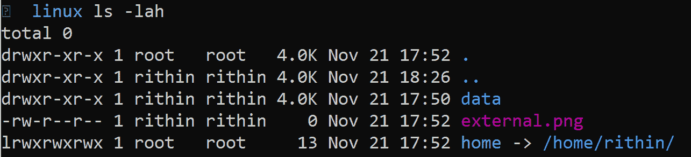

###### 图 6.2：列出目录的内容

如果观察`数据`行，第一个字母是`d`，这意味着它是一个目录。至于`external.png`，显示的是`-`，代表一个文件，而`home`有`l`，意味着一个链接（更像是一个快捷方式）。

让我们仔细看一下：


###### 图 6.3：目录输出的数据行

首先，`rwx`表示用户/所有者有读、写和执行权限。

第二，`r-x`表示组有读和执行权限。然而，没有写权限。

第三，`r-x`表示所有其他人都有读和执行权限，但没有写权限。

同样地，你可以理解分配给其他对象的权限。

这些将按顺序写成`读(r)`、`写(w)`和`执行`。如果有一个字母缺失，那意味着该权限不存在。下面是一个解释这些字母代表的表格：


###### 图 6.4：访问权限的符号

你可能想知道这个文件的所有者是谁，以及哪个组在访问。这在输出中已经有答案了：

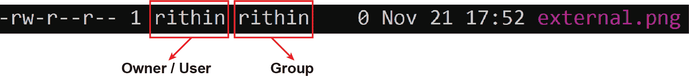

###### 图 6.5：所有者和组的详细信息

在这种情况下：

+   用户有读和写权限，但没有执行权限。

+   组只有读权限，没有写和执行权限。

+   所有其他人只有读权限。

以下的图表将帮助你理解如何区分每个所有者的权限：


###### 图 6.6：区分每个所有者的权限

你可以使用`chmod`命令来改变文件或文件夹的权限。一般的语法是：

```
chmod permissions filename/directory
```

然而，对目录应用权限并不会继承到子文件夹和文件中。如果希望权限被继承，可以使用`-R`参数，代表*递归*。

此命令也不会给出任何输出；也就是说，无论是否应用了权限，它都不会返回任何输出。你可以使用`-v`参数来获得详细输出。

有两种方式可以传递权限给`chmod`命令：

+   符号方法

+   绝对方法/数字模型

### 符号方法

在符号方法中，我们将使用操作符和用户表示。以下是操作符列表：

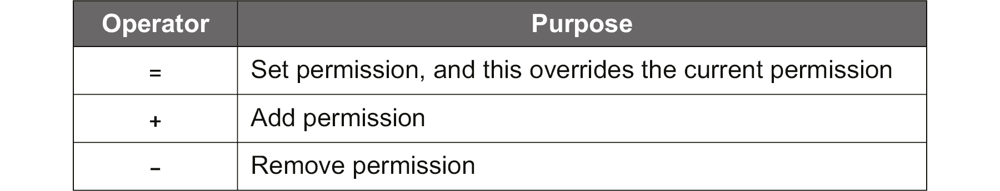

###### 图 6.7：符号方法中的操作符

以下是用户表示列表：


###### 图 6.8：用户表示

现在，让我们看看如何结合操作符和表示法来更改权限。我们将使用`-v`参数来理解发生了什么变化。

让我们回顾一下我们对`external.png`文件的权限：


###### 图 6.9：external.png 文件的权限

目前，用户没有执行权限。要添加这些权限，请执行以下命令：

```
chmod -v u+x external.png
```

在输出中，您可以看到该值从`rw-r--r--`更改为`rwxr--r--`：

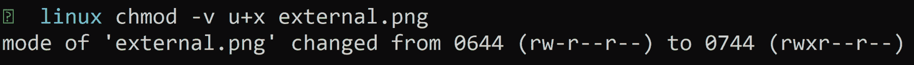

###### 图 6.10：添加执行权限

这里会显示一些数字。我们将在讨论绝对方法时讨论这些内容。

接下来，让我们尝试为组添加写和执行权限，执行以下命令：

```
chmod -v g+wx external.png
```

因此，向`g（组）`添加`wx（写、执行）`将给您一个类似以下的输出。您可以清楚地从输出中理解变化：

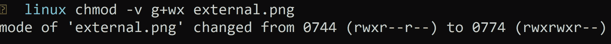

###### 图 6.11：为组添加写和执行权限

到目前为止，我们一直在添加权限。现在，让我们看看如何移除其他人的现有读权限。

执行以下命令：

```
chmod -v o-r external.png
```

这将移除读权限，从以下输出中可以明显看出：

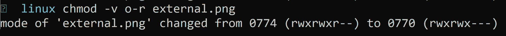

###### 图 6.12：移除读权限

让我们为所有人（用户、组和其他人）设置读、写和执行权限。

执行以下命令：

```
chmod -v a=rwx external.png
```

输出显示权限更改为`rwxrwxrwx`：

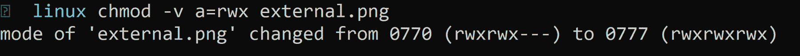

###### 图 6.13：为所有人设置读、写和执行权限

另一个例子涉及将每个所有者的权限组合在一起，并一次性传递这些权限，如下所示：

```
chmod -v u=rw,g=r,o=x external.png
```

在这里，用户权限设置为读写，组权限设置为只读，其他权限设置为仅执行。同样，您可以使用逗号分隔权限，并使用必要的运算符授予权限。

### 绝对（数字）节点

在这种方法中，我们将使用一个三位八进制数来设置权限。以下是数值及其对应权限的表格：

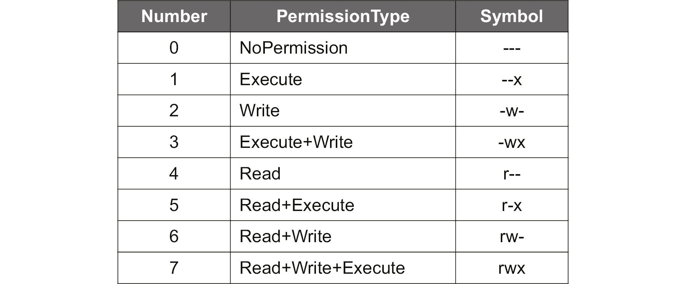

###### 图 6.14：数字值及其对应权限

让我们举个例子。检查位于当前目录中的`new-file`文件的权限。执行`ls -lah`：


###### 图 6.15：检查 new-file 的权限

现在，让我们使用数字模式并分配权限。我们将把用户权限更改为`rwx`，因此 4 + 2 + 1 = 7，然后将组权限更改为`rw`，因此 4 + 2 + 0 = 6，其他人仅执行，因此 0 + 0 + 1 = 1。

将这三个数字组合起来，我们得到 761，因此这是我们需要传递给`chmod`的值。

执行以下命令：

```
chmod -v 761 new-file
```

输出如下：

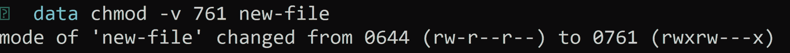

###### 图 6.16：使用三位八进制代码分配权限

现在，我们可以将我们在使用符号方法进行测试时得到的数字与之前的输出相关联。

这是该值的图示表示：


###### 图 6.17：三位八进制代码的图示表示

您可能已经注意到我们分配的权限之前有一个额外的数字（例如，0761）。这个`0`是用于高级文件权限。如果您还记得提示，我们有“*这些目录中文件的 suid 和 sgid 权限非常危险*”和“*尽量避免使用 suid/sgid 位*”。这些`suid/sgid`值通过额外的数字传递。最好不要使用这个，而是坚持使用基本权限，因为这些非常危险且复杂。

现在我们知道如何更改权限，但是我们如何更改拥有用户和组呢？为此，我们将使用`chown`命令。语法如下：

```
chown user:group filename/directory
```

这将更改文件的所有者和组。如果只想更改所有者，可以使用这个：

```
chown user filename/directory
```

如果只想更改组，使用`chgrp`命令：

```
chgrp group filename/directory
```

就像在`chown`命令的情况下解释的那样，这个命令也不是递归的。如果要使更改继承到目录的子文件夹和文件中，使用`-R`（递归）参数。就像我们在`chmod`中看到的那样，您还有一个详细的（`-v`）选项。

现在我们知道如何处理权限，让我们进入下一个关于 MAC 的部分。DAC 完全是关于使用 UID 和 GID 进行权限检查。另一方面，MAC 是基于策略的访问控制。现在让我们更仔细地看看 MAC。

## MAC

在 MAC 中，系统根据特定资源的授权和敏感性限制对特定资源的访问。它更多地基于策略，并使用**Linux 安全模块**（**LSM**）来实现。

安全标签是 MAC 的核心。每个主体都被赋予了一定级别的安全许可（例如，机密或保密），每个数据对象都有安全分类。例如，一个安全许可级别为保密的用户试图检索一个具有绝密安全分类的数据对象，因为他们的许可级别低于对象的分类，所以被拒绝访问。

因此，很明显，您可以在机密性非常重要的环境中（政府机构等）大多数情况下使用 MAC 模型。

SELinux 和 AppArmor 是基于 MAC 的商业系统的例子。

### LSM

LSM 是一个提供在 DAC 之上添加 MAC 接口的框架。这种额外的安全层可以通过 SELinux（基于 Red Hat 的发行版和 SUSE）、AppArmor（Ubuntu 和 SUSE）或较少人知道的 Tomoyo（SUSE）来添加。在本节中，我们将介绍 SELinux 和 AppArmor。

DAC 是一个基于用户组成员和文件设备权限的访问控制模型。MAC 限制对资源对象的访问，例如以下内容：

+   文件

+   进程

+   TCP/UDP 端口

+   用户及其角色

MAC，由 SELinux 实现，通过为每个资源对象分配一个分类标签，也称为上下文标签，来工作，而 AppArmor 是基于路径的。在任何情况下，如果一个资源对象需要访问另一个对象，它需要许可。因此，即使黑客成功进入您的网络应用程序，其他资源仍然受到保护！

### SELinux

正如我们之前提到的，SELinux 是 Linux 中的一个安全模块，作为一个安全提示，建议不要禁用它。SELinux 是由 NSA 和 Red Hat 开发的。最初发布于 2000 年 12 月 22 日，在撰写本书时，可用的稳定版本是 2019 年发布的 2.9 版。它可以在每个基于 Red Hat 的发行版和 SUSE 上使用。本书将介绍在 Red Hat 上的实现。如果您想在 SUSE 上使用它，请访问 SUSE 文档[`doc.opensuse.org/documentation/leap/security/html/book.security/cha-selinux.html`](https://doc.opensuse.org/documentation/leap/security/html/book.security/cha-selinux.html)来安装和启用 SELinux。之后，程序是相同的。过去曾经努力使其在 Ubuntu 上运行，但目前没有积极的开发，而且软件包已经损坏。

所有访问必须明确授权，但在使用 SELinux 的发行版上，已经有许多策略。这几乎涵盖了每个资源对象。除了文档中已经提到的列表之外，还包括以下内容：

+   完整的网络堆栈，包括 IPsec

+   内核功能

+   **进程间通信**（**IPC**）

+   内存保护

+   文件描述符（通信通道）继承和传输

对于 Docker 等容器虚拟化解决方案，SELinux 可以保护主机并在容器之间提供保护。

### SELinux 配置

SELinux 是通过`/etc/selinux/config`文件进行配置的：

```
#  This file controls the state of SELinux on the system.
#  SELINUX= can take one of these three values:
#  enforcing - SELinux security policy is enforced.
#  permissive - SELinux prints warnings instead of enforcing.
#  disabled - No SELinux policy is loaded.
SELINUX=enforcing
```

在生产环境中，状态应该是`enforcing`模式。策略是强制执行的，如果访问受限，可以进行审计以修复 SELinux 引起的问题。如果您是软件开发人员或打包人员，并且需要为您的软件创建 SELinux 策略，`permissive`模式可能会有用。

可以使用`setenforce`命令在`enforcing`和`permissive`模式之间切换。使用`setenforce 0`切换到 permissive 模式，使用`setenforce 1`切换回 enforcing 模式。`getenforce`命令可用于查看当前状态：

```
#  SELINUXTYPE= can take one of these three values:
#  targeted - Targeted processes are protected,
#  minimum - Modification of targeted policy.
#  Only selected processes are protected.
#  mls - Multi Level Security protection.
SELINUXTYPE=targeted
```

默认策略—`targeted`，保护所有资源，并为大多数工作负载提供足够的保护。**多级安全**（**MLS**）通过使用类别和敏感性提供的许可级别以及 SELinux 用户和角色提供额外的安全性。这对于提供文件共享的文件服务器非常有用。

如果选择了`minimum`类型，那么只有最基本的保护；如果需要更多的保护，就需要自己配置其他所有内容。如果在保护多进程应用程序（通常是非常老的应用程序）时遇到困难，并且生成的策略去除了太多限制，那么这种类型可能会有用。在这种情况下，最好是让特定应用程序不受保护，并保护系统的其余部分。在本节中，我只会讨论`SELINUXTYPE=targeted`，这是最常用的选项。

要显示 SELinux 的状态，可以使用`sestatus`命令。输出应该类似于以下屏幕截图：

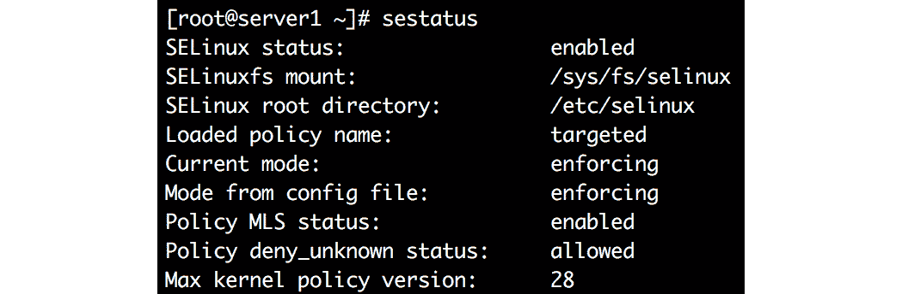

###### 图 6.18：SELinux 状态

在探索 SELinux 之前，您需要向系统添加必要的软件包，以便审计 SELinux。请执行以下命令：

```
sudo yum install setroubleshoot
```

之后，您需要重新启动虚拟机：

```
sudo systemctl reboot
```

重启后，我们准备使用和排除 SELinux 故障：

```
SELinux context on ports
```

让我们从涉及 SSH 服务的简单示例开始。如前所述，所有进程都带有上下文标签。为了使此标签可见，许多实用程序，如`ls`、`ps`和`lsof`，都有`-Z`参数。首先，您需要找到此服务的主要进程 ID：

```
systemctl status sshd | grep PID
```

使用此进程 ID，我们可以请求上下文标签：

```
ps -q <PID> -Z
```

上下文标签是`system_u`，`system_r`，`sshd_t`和`s0-s0，c0.c1023`。因为我们使用的是有针对性的 SELinux 类型，所以我们只关心 SELinux 类型部分：`sshd_t`。

SSH 正在端口 22 上运行。现在让我们调查端口的标签：

```
ss -ltn sport eq 22 -Z
```

您将确定上下文标签是`system_u`，`system_r`，`sshd_t`，`s0-s0`和`c0.c1023`，换句话说，完全相同。不难理解`sshd`进程确实具有以相同标签运行在此端口的权限：

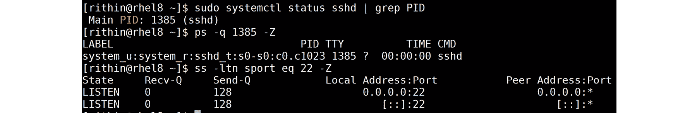

###### 图 6.19：sshd 进程的上下文标签

这并不总是那么简单，但在进入更复杂的情景之前，让我们将 SSH 服务器监听的端口修改为端口 44。要这样做，请编辑`/etc/ssh/sshd_config`文件：

```
sed -i 's/#Port 22/Port 44/' /etc/ssh/sshd_config
```

然后，重新启动 SSH 服务器：

```
sudo systemctl restart sshd
```

这将失败：

```
Job for sshd.service failed because the control process exited with error code.
See systemctl status sshd.service and journalctl -xe for details.
```

如果您执行`journalctl -xe`命令，您将看到以下消息：

```
SELinux is preventing /usr/sbin/sshd from name_bind access  
on the tcp_socket port 44.
```

有多种方法可以用于排除 SELinux 故障。您可以直接使用日志文件`/var/log/audit/audit.log`，或者使用`sealert -a /var/log/audit/audit.log`命令，或者使用`journalctl`命令：

```
journalctl --identifier setroubleshoot
```

日志条目还说明了以下内容：

```
For complete SELinux messages run: sealert -l <audit id>
```

执行此命令（可能将输出重定向到文件或通过`less`或`more`进行管道传输），它不仅会再次显示相同的 SELinux 消息，而且还会提出如何修复它的建议：

```
If you want to allow /usr/sbin/sshd to bind to network port 44
Then you need to modify the port type.
Do 
# semanage port -a -t PORT_TYPE -p tcp 44 
where PORT_TYPE is one of the following: ssh_port_t, vnc_port_t, xserver_port_t.
```

在进入此解决方案之前，SELinux 与包含资源对象和上下文标签的多个数据库一起工作，即应将`/`应用于资源对象。`semanage`工具可用于修改数据库并向其中添加条目；在我们的情况下，是端口数据库。日志的输出建议为 TCP 端口 44 添加上下文标签到数据库。有三种可能的上下文；它们都将解决您的问题。

另一个重要的方面是有时还有其他可能的解决方案。有一个信心评级可以让您更容易地做出选择。但即使如此，您仍然必须仔细阅读。特别是对于文件，有时，您希望添加一个正则表达式，而不是一遍又一遍地为每个文件做同样的事情。

您可以采取一种实用的方法并声明“我不使用`vnc`和`xserver`，所以我选择`ssh_port_t`”，或者您可以使用`sepolicy`实用程序，该程序是`policycoreutils-devel`软件包的一部分。如果您收到错误消息，请使用`sudo yum install –y policycoreutils-devel`安装`policycoreutils-devel`：

```
sepolicy network -a /usr/sbin/sshd 
```

在输出中搜索 TCP `name_bind`，因为 SELinux 访问正在阻止`/usr/sbin/sshd`对`tcp_socket port 44`进行`name_bind`访问。

现在您知道建议来自何处，请查看端口 22 的当前标签：

```
sepolicy network -p 22 
```

标签是`ssh_port_t`。

#### 注意

您可以使用`semanage port -l`和`grep`来查找端口 22 的内容。

使用相同的标签确实是有道理的。不相信？让我们生成手册页：

```
sepolicy manpage -a -p /usr/share/man/man8/ 
mandb  
```

`ssh_selinux`手册页告诉您`ssh_port_t`。

最后，让我们解决问题：

```
semanage port -a -t ssh_port_t -p tcp 44 
```

您不必重新启动`sshd`服务；`systemd`将在 42 秒内自动重新启动此服务。顺便说一句，`sshd_config`文件已经有一条注释描述了这个修复。在`#Port 22`之前的行中明确说明了这一点：

```
If you want to change the port on a SELinux system, you have to tell:
# SELinux about this change. 
# semanage port -a -t ssh_port_t -p tcp #PORTNUMBER 
```

最好撤消配置更改并将其重新配置为端口 22；否则，您可能会被锁在测试系统外。

### 文件上的 SELinux 上下文

在我们与 SELinux 的第一次会议以及调查端口上的上下文标签之后，现在是时候调查文件上的上下文标签了。作为示例，我们将使用`vsftpd`和 FTP 客户端：

```
sudo yum install vsftpd ftp 
```

然后，创建一个名为`/srv/ftp/pub`的目录：

```
sudo mkdir -p /srv/ftp/pub 
chown -R ftp:ftp /srv/ftp 
```

然后在`/srv/ftp`中创建一个文件：

```
echo WELCOME > /srv/ftp/README 
```

编辑配置文件`/etc/vsftpd/vsftpd.conf`，并在`local_enable=YES`行下添加以下内容：

```
anon_root=/srv/ftp 
```

这将使`/srv/ftp`成为匿名用户`vsftpd`服务的默认根目录。现在您可以开始服务了：

```
sudo systemctl start vsftpd.service
sudo systemctl status vsftpd.service
```

使用`ftp`实用程序，尝试以用户`anonymous`的身份登录到 FTP 服务器，无需密码：

```
ftp localhost 

Trying ::1... 
Connected to localhost (::1). 
220 (vsFTPd 3.0.2) 
Name (localhost:root): anonymous 
331 Please specify the password. 
Password: 
230 Login successful. 
Remote system type is UNIX. 
Using binary mode to transfer files. 
ftp> ls 
229 Entering Extended Passive Mode (|||57280|). 
150 Here comes the directory listing. 
-rw-r--r-- 1 14 50 8 Jul 16 09:47 README 
drwxr-xr-x 2 14 50 6 Jul 16 09:44 pub 
226 Directory send OK. 
Try to get the file:  
get README 
```

而且它有效！为什么会这样？因为数据库中已经有了`/srv/ftp/README`的正确标签条目：

```
semanage fcontext -l | grep /srv  
```

上面的命令显示以下行：

```
/srv/([^/]*/)?ftp(/.*)? all files system_u:object_r:public_content_t:s0 
```

在创建新文件时应用：

```
stat -c %C /srv/ftp/README 
ls -Z /srv/ftp/README 
```

这两个命令告诉你类型是`public_content_t`。`ftpd_selinux`的 man 页面有两个在这里很重要的部分：`public_content_t`类型只允许你读取（下载）文件，但不允许你使用这种类型写入（上传）文件。你需要另一种类型`public_content_rw_t`才能上传文件。

创建一个上传目录：

```
mkdir -m 2770 /srv/ftp/incoming 

chown -R ftp:ftp /srv/ftp/incoming 
```

查看当前标签并更改它：

```
ls -dZ /srv/ftp/incoming 

semanage fcontext -a -t public_content_rw_t "/srv/ftp/incoming(/.*)?" 

restorecon -rv /srv/ftp/incoming 

ls -dZ /srv/ftp/incoming 
```

首先，你必须将策略添加到`fcontext`数据库；之后，你可以将策略应用到已经存在的目录。

#### 注意

阅读`selinux-fcontext`的 man 页面。除了描述所有选项外，还有一些很好的例子。

### SELinux 布尔值

使用单个字符串，你可以改变 SELinux 的行为。这个字符串被称为`SELinux 布尔值`。你可以使用`getsebool -a`获取布尔值及其值的列表。使用`boolean allow_ftpd_anon_write`，我们将改变 SELinux 的反应方式。再次匿名连接到 FTP 服务器并尝试上传文件：

```
ftp> cd /incoming 
250 Directory successfully changed. 
ftp> put /etc/hosts hosts 
local: /etc/hosts remote: hosts 
229 Entering Extended Passive Mode (|||12830|). 
550 Permission denied. 
```

`journalctl --identifier setroubleshoot`命令非常清楚地告诉你：

```
SELinux is preventing vsftpd from write access on the directory ftp.   
```

`sealert`命令将为你提供修复问题所需的信息：

```
setsebool -P allow_ftpd_anon_write 1 
```

那么，这里发生了什么？有时，对于端口或文件的简单规则是不够的，例如，如果一个 NFS 共享也必须与 Samba 一起导出。在这种情况下，你可以创建自己的复杂 SELinux 策略，或者使用易于使用的开关数据库。为此，你可以使用较旧的`setsebool`实用程序或`semanage`：

```
semanage boolean --list | grep "ftpd_anon_write" 
semanage boolean --modify ftpd_anon_write --on 
```

使用`setsebool`而不加上`-P`会进行更改，但不是持久的。`semanage`实用程序没有选项可以进行非永久更改。

### AppArmor

在 Debian、Ubuntu 和 SUSE 发行版中，AppArmor 可用于实现 MAC。请注意，各发行版之间存在一些细微差异，但总的来说，一个发行版可以添加更少或更多的配置文件和一些额外的工具。在本节中，我们以 Ubuntu 18.04 为例。

此外，你必须确保保持你的发行版最新，特别是 AppArmor；Debian 和 Ubuntu 的软件包经常受到错误的困扰，有时会导致意外的行为。

确保必要的软件包已安装：

```
sudo apt install apparmor-utils apparmor-easyprof \ 
  apparmor-profiles apparmor-profiles-extra apparmor-easyprof 
```

与 SELinux 相比，存在一些基本差异：

+   默认情况下，只有最低限度受到保护。你必须为每个应用程序应用安全性。

+   你可以混合强制和投诉模式；你可以针对每个应用程序做出决定。

+   当 AppArmor 开发开始时，范围相当有限：进程和文件。如今，除了进程和文件，你还可以用它来进行基于角色的访问控制（RBAC）、MLS、登录策略以及其他方面的控制。

在本章中，我们将涵盖初始范围：需要访问文件的进程。

### AppArmor 状态

首先要做的是检查 AppArmor 服务是否正在运行：

```
sudo systemctl status apparmor 
```

或者，执行以下命令：

```
sudo aa-enabled 
```

之后，使用以下命令更详细地查看状态：

```
sudo apparmor_status 
```

以下是上述命令的替代方法：

```
sudo aa-status 
```

以下截图显示了使用`apparmor_status`命令派生的 AppArmor 状态：

使用`apparmor_status`命令检查 AppArmor 状态

###### 图 6.20：AppArmor 状态

### 生成 AppArmor 配置文件

你想要保护的每个应用程序都需要一个配置文件，可以由`apparmor-profiles`或`apparmor-profiles-extra`软件包、应用程序软件包或你自己提供。这些配置文件存储在`/etc/apparmor.d`中。

让我们以安装 nginx web 服务器为例：

```
sudo apt install nginx 
```

如果您浏览`/etc/apparmor.d`目录，您会发现没有 nginx 的配置文件。创建一个默认的：

```
sudo aa-autodep nginx 
```

创建了一个配置文件：`/etc/apparmor.d/usr.sbin.nginx`。这个文件几乎是空的，只包括一些基本规则和变量，称为抽象，以及以下行：

```
/usr/sbin/nginx mr, 
```

`mr`值定义了访问模式：`r`表示读取模式，`m`允许将文件映射到内存中。

让我们强制执行 nginx 的模式：

```
sudo aa-enforce /usr/sbin/nginx 
sudo systemctl restart nginx 
```

nginx 将无法启动。前述命令的输出如下：

```
sudo journalctl --identifier audit 
```

这非常明显地指向了 AppArmor：

```
sudo journalctl -k | grep audit 
```

要解决问题，请为此配置文件设置投诉模式。这样，它不会强制执行策略，但会对安全策略的每个违规行为进行投诉：

```
sudo aa-complain /usr/sbin/nginx 
sudo systemctl start nginx 
```

通过浏览器或实用程序（例如`curl`）发出`http`请求：

```
curl http://127.0.0.1 
```

下一步是扫描“日志文件”并批准或拒绝每个操作：

```
sudo aa-logprof 
```

非常仔细地阅读并使用箭头键选择正确的选项（如果需要）：

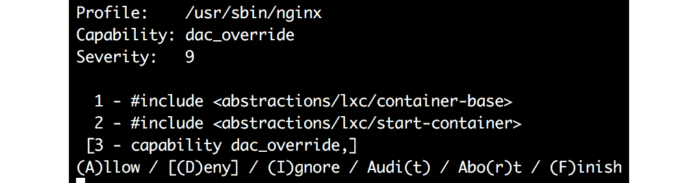

###### 图 6.21：配置 nginx 配置文件

**LXC**（**Linux 容器**）是一种容器技术，我们只是在为 web 服务器配置配置文件。似乎修复 DAC 的问题是一个不错的选择：

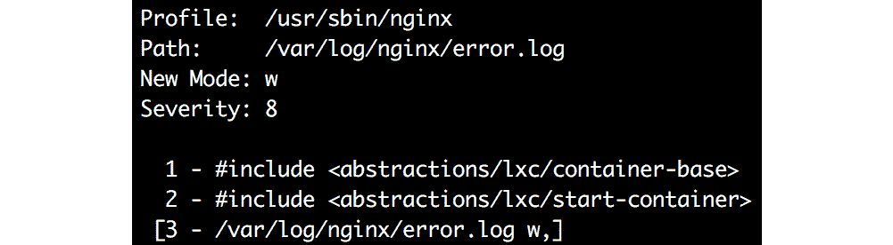

###### 图 6.22：修复 nginx 的 DAC

审计建议一个新模式：`w`表示对`/var/log/nginx/error.log`文件的写访问。

此外，您可以阻止访问以下目录：

+   对`/etc/ssl/openssl.conf`的读访问。这是一个困难的问题，但是`ssl`的抽象听起来是正确的。

+   对`/etc/nginx/nginx.conf`的读访问。同样，不是一个容器，因此文件的所有者必须是 OK 的。

+   一般来说，文件的所有者是一个不错的选择。

现在，是时候保存更改并重试了：

```
sudo aa-enforce /usr/sbin/nginx 
sudo systemctl restart nginx
curl http://127.0.0.1 
```

一切似乎现在都运行正常，至少对于对一个简单网站的请求。正如您所看到的，这主要是基于合理的猜测。另一种选择是深入研究所有建议的抽象。

创建的文件`/etc/apparmor.d/usr.sbin.nginx`相对容易阅读。它以应该对每个配置文件可用的所有可调整变量开始：

```
#include <tunables/global> 
```

文件之后是其他抽象，比如以下内容：

```
#include <abstractions/nameservice 
```

要知道他们在做什么，只需查看文件。例如，`/etc/apparmor.d/abstractions/nameservice`文件中列出了以下内容：

```
/usr/sbin/nginx flags=(complain) { 
 #include <abstractions/base> 
 #include <abstractions/nameservice> 
 #include <abstractions/openssl> 
 #include <abstractions/web-data> 
```

#### 注意

许多程序希望执行类似名称服务的操作，例如按名称或 ID 查找用户、按名称或 ID 查找组，以及按名称或 IP 查找主机。这些操作可以通过 DNS、NIS、NIS+、LDAP、hesiod 和 wins 文件执行。在这里允许所有这些选项。

下一节是关于 Posix 功能的；有关更多信息，请参阅`man 7 capabilities`：

```
capability dac_override, 
```

最后一节是权限；有关完整列表，请参阅`man 5 apparmor.d`：

```
/var/log/nginx/error.log w, 
 owner /etc/nginx/modules-enabled/ r, 
 owner /etc/nginx/nginx.conf r, 
 owner /run/nginx.pid w, 
 owner /usr/lib/nginx/modules/ngx_http_geoip_module.so mr, 
 owner /usr/share/nginx/modules-available/mod-http-geoip.conf r, 
 owner /usr/share/nginx/modules-available/mod-http-image-filter.conf r, 
 owner /var/log/nginx/access.log w, 
} 
```

特别是在开始使用`aa-logprof`时，可能会有点压倒性。但是配置文件并不难阅读；每个选项都在两个 man 页面中，并且包含的抽象都有注释进行了记录。

## firewalld 和 systemd

在*第五章*，*高级 Linux 管理*中，systemd 被介绍为系统和服务管理器。在 systemd 中，有几个选项可以为您的守护进程和文件系统添加额外的保护层。

老实说，我们认为在 Azure 网络安全组之上使用 Azure 防火墙确实是有道理的。它易于设置，提供集中管理，并且几乎不需要维护。它在 VM、虚拟网络甚至不同的 Azure 订阅之间提供安全性。

#### 注意

如果您想使用这个防火墙，还会有额外的费用。但是 Linux 防火墙不会产生任何费用，因为它是安装在您的机器上的安全措施。

在 Azure 防火墙和 Linux 防火墙之间的选择取决于许多因素：

+   成本

+   VM 和应用程序的部署和编排

+   不同的角色：是否有一个管理员负责一切？

希望在介绍了 Linux 防火墙实现之一后，可以清楚地了解 Linux 防火墙绝不是 Azure 防火墙的完全替代品。它只能为 VM 的传入流量提供安全性，是的，也可以配置此防火墙来阻止传出流量，但这相当复杂。另一方面，如果它配置在 Azure 网络安全组之上，在许多情况下，这已经足够了。

Linux 有不同类型的防火墙解决方案，包括 firewalld 和 iptables。在本书中，我们将遵循 firewalld，因为它具有可用的配置选项和流行度。请确保已安装 firewalld 软件，并且已从系统中删除其他防火墙软件，以避免冲突。在基于 RHEL/CentOS 的发行版中，这已经是这样。在 Ubuntu 中，使用以下命令：

```
sudo apt remove ufw 
sudo apt install firewalld 
```

在基于 SUSE 的发行版中，使用以下命令：

```
sudo zypper install susefirewall2-to-firewalld 
sudo susefirewall2-to-firewalld -c 
```

Linux 有多种防火墙实现；其中一些甚至是为特定发行版开发的，比如 SuSEfirewall2。在本章中，我们将介绍 firewalld，它在每个发行版上都可用。

firewalld 由一个管理防火墙所有组件的守护程序组成：

+   区域

+   接口

+   来源

+   iptables 和 ebtables 的直接规则（本书未涉及）

firewalld 利用内核模块：iptables/IP6 表用于 IPv4 和 IPv6 流量，ebtables 用于过滤通过 Linux 桥接的网络流量。在较新的发行版中，比如 RHEL 8，使用 `nftables` 模块。

要配置 firewalld 规则，有一个命令行实用程序可用：`firewall-cmd`。规则可以是运行时的或持久的。这种行为有两个重要的原因：这样就不需要重新加载所有规则，意味着临时的安全风险。您可以动态添加和删除规则。如果您犯了一个错误，因此无法再次登录，只需重新启动作为一个快速解决方案。我们还可以使用 `systemd-run --oncalendar` 命令创建一个定时任务，执行 `firewall-cmd --reload`，这是一个更好的解决方案：

```
sudo systemd-run --on-calendar='2018-08-20 13:00:00' \ 
  firewall-cmd --reload  

sudo systemctl list-timers 
```

如果防火墙规则正确（并且您没有被锁定），不要忘记停止和禁用计时器。

您还可以使用编排工具配置守护程序，这些工具与守护程序通信或将 XML 文件推送到主机。

#### 注意

端口仅对连接到虚拟机网络的虚拟机开放，除非您在网络安全组中打开了端口！

重要的是要知道 Azure Service Fabric（基础设施）将根据需要向防火墙配置添加额外规则。建议不要删除这些规则，因为它们很重要，因为它们被 Azure 平台使用。如果您使用 `journalctl` 命令在日志数据库中搜索，就可以看到这一点：

```
sudo journalctl | grep "Azure fabric firewall"
```

使用 `iptables-save` 命令查看所有活动防火墙规则，或者如果您的发行版使用 `nftables`：

```
sudo nft list ruleset
```

### firewalld 区域

firewalld 的最重要的概念之一是区域。区域包括默认规则（称为目标）、网络接口或网络源，以及其他服务、端口、协议和丰富规则。

只有在网络接口连接到接口或网络源时，区域才处于活动状态。

要列出可用的区域，请使用以下命令：

```
sudo firewall-cmd --get-zones
```

这些区域配置在 `/usr/lib/firewalld/zones` 中。您不应该对这些文件进行更改。新区域或对区域的更改将写入 `/etc/firewalld/zones` 目录。

默认区域是公共区域：

```
sudo firewall-cmd --get-default-zone
```

要列出公共区域的区域配置，请使用以下命令：

```
sudo firewall-cmd --zone public --list-all
```

区域配置如下所示：

```
public 
  target: default 
  icmp-block-inversion: no 
  interfaces: 
  sources: 
  services: ssh dhcpv6-client 
  ports: 
  protocols: 
  masquerade: no 
  forward-ports: 
  source-ports: 
  icmp-blocks: 
  rich rules: 
```

公共区域的目标策略是 `default`，这意味着默认情况下会阻止所有传入的东西，除非配置了服务、端口和协议。

该区域的相应 `/usr/lib/firewalld/zones/public.xml` 文件如下：

```
<?xml version="1.0" encoding="utf-8"?> 
<zone> 
 <short>Public</short> 
 <description>For use in public areas. You do not trust the other computers on networks to not harm your computer. Only selected incoming connections are accepted.</description> 
 <service name="ssh"/> 
 <service name="dhcpv6-client"/> 
</zone> 
```

还有用于配置伪装和端口转发的选项。丰富规则是高级防火墙规则，如`firewalld.richlanguage`手册中所述。

执行`man firewalld.richlanguages`，如下截图所示：


###### 图 6.23：`man firewalld.richlanguages`命令的输出

根据您使用的发行版，可能会有其他服务名称。例如，如果您使用的是 RHEL 8，您可能会看到`cockpit`列为服务。`cockpit`是用于管理 RHEL 机器的基于 Web 的界面。

您可能已经注意到，在公共区域中，它说`target: default`。目标是默认行为。可能的值如下：

+   默认：不执行任何操作，接受每个 ICMP 数据包，并拒绝其他所有内容。

+   `%%REJECT%%`：这通过 ICMP 协议向客户端发送拒绝响应。

+   `DROP`：这会发送 TCP SYN/ACK，就像在打开端口上一样，但所有其他流量都会被丢弃。没有 ICMP 消息通知客户端。

+   接受：接受一切。

在 Ubuntu 中，默认情况下，没有附加网络接口。请不要在附加接口之前重新启动虚拟机！执行以下命令：

```
sudo firewall-cmd --add-interface=eth0 --zone=public 

sudo firewall-cmd --add-interface=eth0 --zone=public --permanent 

sudo firewall-cmd --zone=public --list-all 
```

如果修改区域，则文件将从`/usr/lib/firewalld/zones`复制到`/etc/firewalld/zones`。下一次修改将创建一个带有`.old`文件扩展名的区域备份，并创建一个包含修改内容的新文件。

### firewalld 服务

服务是一个以应用为中心的配置，允许一个或多个端口。要接收可用服务的列表，请使用以下命令：

```
sudo firewall-cmd --get-services 
```

如果要添加服务，例如 MySQL，请执行以下命令：

```
sudo firewall-cmd --add-service=mysql --zone=public 

sudo firewall-cmd --add-service=mysql --zone=public \ 
  --permanent 
```

如果要从区域中删除服务，请使用`--remove-service`参数。

服务配置在`/usr/lib/firewalld/services`目录中。同样，您不应该修改这些文件。您可以通过将它们复制到`/etc/firewalld/services`目录中来更改它们或创建自己的服务。

也可以添加单个端口，但一般来说，这不是一个好主意：过一段时间后，您还能记得哪些端口被哪个应用程序使用吗？相反，如果服务尚未定义，请创建自己的服务。

现在，让我们为 Microsoft PPTP 防火墙协议创建一个服务文件，`/etc/firewalld/services/pptp.xml`：

```
<?xml version="1.0" encoding="utf-8"?> 
<service> 
 <short>PPtP</short> 
 <description>Microsoft VPN</description> 
 <port protocol="tcp" port="1723"/> 
</service> 
```

在前面的文件中，您可以看到允许 TCP 端口`1723`。您可以添加尽可能多的端口规则。例如，如果要添加 TCP 端口`1724`，则行项目将如下所示：

```
<port protocol="tcp" port="1724" /> 
```

使用`firewalld-cmd --reload`重新加载防火墙后，服务可用。这还不够：**GRE**（通用路由封装）协议不被允许。要允许此协议，请使用以下命令：

```
sudo firewall-cmd --service=pptp --add-protocol=gre \ 
  --permanent 

sudo firewall-cmd --reload 
```

这将向服务文件添加以下行：

```
<protocol value="gre"/>  
```

您可以使用`--remove-protocol`参数删除协议。

### firewalld 网络源

只有在网络接口连接到它或网络源时，区域才处于活动状态。将网络接口添加到拒绝区域是没有意义的。拒绝区域是所有传入数据包都被丢弃且不回复的地方；但是，允许传出连接。所以，正如我提到的，如果将网络接口添加到拒绝区域，所有传入数据包将被 firewalld 丢弃，这根本没有任何意义。

但是，添加网络源是有意义的。源由一个或多个条目组成：媒体访问控制地址、IP 地址或 IP 范围。

例如，出于任何原因，假设您想要阻止来自百慕大的所有流量。网站[`ipdeny.com`](http://ipdeny.com)可以为您提供 IP 地址列表：

```
cd /tmp 
wget http://www.ipdeny.com/ipblocks/data/countries/bm.zone 
```

有几种类型的`ipset`。要查看支持的`ipset`类型列表，请执行以下命令：

```
sudo firewall-cmd --get-ipset-types 
```

在我们的场景中，我们希望`hash:net` IP 范围的类型：

```
sudo firewall-cmd --new-ipset=block_bermuda --type=hash:net --permanent 
sudo firewall-cmd --reload 
```

现在，我们可以使用下载的文件向`ipset`添加条目：

```
sudo firewall-cmd --ipset=block_bermuda --add-entries-from-file=/tmp/bm.zone 
sudo firewall-cmd --ipset=block_bermuda --add-entries-from-file=/tmp/bm.zone \ 
  --permanent 
sudo firewall-cmd --reload 
```

最后一步涉及将`ipset`添加为区域的源：

```
sudo firewall-cmd --zone=drop --add-source=ipset:block_bermuda 
sudo firewall-cmd --zone=drop --add-source=ipset:block_bermuda --permanent 
sudo firewall-cmd --reload 
```

丢弃区的目的是在不让客户端知道流量被丢弃的情况下丢弃所有流量。将`ipset`添加到此区域会使其激活，并且来自百慕大的所有流量都将被丢弃：

```
sudo firewall-cmd --get-active-zones 
drop 
 sources: ipset:block_bermuda 
public 
 interfaces: eth0 
```

现在我们知道了 firewalld 的工作原理，以及如何使用区域来保护我们的机器，让我们跳到下一节。

### systemd 安全

如前一章所述，systemd 负责在启动过程中并行启动所有进程，除了那些由内核创建的进程。之后，问题在于按需激活服务等。systemd 单元还可以提供额外的安全层。您可以向单元文件添加多个选项，以使您的单元更加安全。

只需使用`systemctl edit`编辑单元文件并添加安全措施。例如，执行以下命令：

```
sudo systemctl edit sshd 
```

然后，添加以下行：

```
[Service] 
ProtectHome=read-only 
```

保存文件，重新读取`systemctl`配置，并重新启动`sshd`：

```
sudo systemctl daemon-reload 
sudo systemctl restart sshd 
```

现在，使用 SSH 客户端再次登录，并尝试在您的家目录中保存文件。这将失败，因为它是一个只读文件系统：

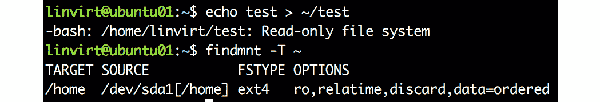

###### 图 6.24：登录失败，因为单元文件被更改为只读

### 限制对文件系统的访问

`ProtectHome`参数是一个非常有趣的参数。以下值可用：

+   `true`：`/home`、`/root`和`/run/user`目录对该单元不可访问，并且对于在该单元内启动的进程来说是空的。

+   `read-only`：这些目录是只读的。

另一个非常相似的参数是`ProtectSystem`：

+   `true`：`/usr`和`/boot`被挂载为只读。

+   `full`：`/etc`被挂载为只读，以及`/usr`和`/boot`。

+   `strict`：整个文件系统是只读的，除了`/proc`、`/dev`和`/sys`。

除了`ProtectHome`和`ProtectSystem`之外，还可以使用以下参数：`ReadWritePaths`来列出目录，`ReadOnlyPaths`和`InaccessiblePaths`。

一些守护进程使用`/tmp`目录进行临时存储。这个目录的问题在于它是可读的。`PrivateTmp=true`参数为进程设置了一个新的临时文件系统，只能被该进程访问。

还有与内核相关的参数：`ProtectKernelModules=true`参数使加载模块变得不可能，`ProtectKernelTunables=true`参数使使用`sysctl`命令或手动在`/proc`和`/sys`目录结构中更改内核参数变得不可能。

最后，`SELinuxContext`和`AppArmorProfile`参数强制了单元的上下文。

### 限制网络访问

systemd 也可以用于限制网络访问，例如可以列出可以允许或拒绝的 IP 地址。在版本 235 之后的新版本 systemd，例如 Ubuntu 18.04、SLE 15 SP1 和 RHEL 8，还支持 IP 账户和访问列表来限制网络访问。

`IPAccounting=yes`允许一个单元收集和分析网络数据。要查看结果，可以使用`systemctl`命令：

```
systemctl show <service name> -p IPIngressBytes \ 
 -p IPIngressPackets \ 
 -p IPEgressBytes -p IPEgressPackets 
```

与每个参数一样，您也可以在`systemd-run`中使用它：

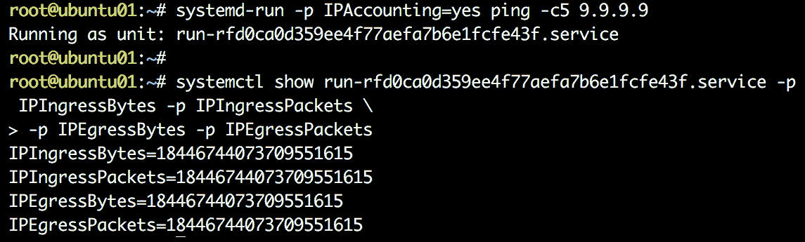

###### 图 6.25：使用 systemd-run 和 systemctl 收集和分析网络数据

您还可以使用`IPAddressDeny`来拒绝 IP 地址或 IP 范围。可以使用`IPAddressAllow`进行例外。甚至可以在系统范围内拒绝所有内容，并在每个服务的基础上进行白名单处理：

```
sudo systemctl set-property sshd.service IPAddressAllow=any 
sudo systemctl set-property waagent.service IPAddressAllow=10.0.0.1 
```

#### 注意

如果您使用的是 Ubuntu，服务名称是`walinuxagent`。

```
sudo systemctl set-property system.slice IPAddressAllow=localhost  
sudo systemctl set-property system.slice IPAddressAllow=10.0.0.1  
sudo systemctl set-property system.slice IPAddressDeny=any  
```

更改保存在`/etc/systemd/system.control`目录结构中：


###### 图 6.26：保存更改在 system.control 目录中

以下是一些备注：

+   当然，您必须将 IP 范围更改为您的虚拟子网，并且必须允许对您的子网的第一个 IP 地址进行访问，以供 Azure 代理和网络服务使用，例如**DHCP**（动态主机配置协议）。

+   将 SSH 访问限制为您自己网络的 IP 地址也是一个很好的主意。

+   非常仔细地查看 systemd 日志，以找出是否需要打开更多端口。

systemd 访问列表功能可能不像 firewalld 那样先进，但它是应用级别限制的一个很好的替代方法（在守护程序的配置文件中使用 hosts allow 指令，或者对于使用 libwrap 支持编译的应用程序，使用`/etc/hosts.allow`和`/etc/hosts.deny`）。在我们看来，在 Azure 中，您不需要更多。如果所有发行版都有最新版本的 systemd 就好了。

#### 注意

我们不会在本书中涵盖`libwrap`库，因为越来越多的应用程序不再使用这个选项，一些供应商，如 SUSE，正忙于删除对这个库的完全支持。

## Azure 中的身份和访问管理 - IAM

到目前为止，我们一直在讨论如何在 Linux 中管理安全性。由于我们在 Azure 中部署，Azure 还为我们的 Linux VM 提供了一些额外的安全性。例如，之前我们讨论了 Azure 防火墙和网络安全组，这有助于控制流量，限制对不需要的端口的访问，并过滤来自未知位置的流量。除此之外，Azure 还有其他服务，如 Azure AD 域服务，它将允许您将 Linux VM 加入到域中。最近，微软推出了一项选项，允许 Azure AD 用户登录 Linux VM。这样做的好处是您不必使用其他用户名；相反，您可以使用 Azure AD 凭据。让我们更仔细地了解这些服务，并了解如何利用它们来增加我们的 Linux VM 的安全性。

### Azure AD 域服务

到目前为止，我们一直在讨论 Linux VM 内部可以做什么。由于我们在 Azure 上，我们应该利用**Azure AD 域服务**，通过它可以将 Linux 机器加入域并强制执行组织的策略。Azure AD 域服务是一个作为服务的域控制器，为您提供 DNS 服务和身份管理。集中身份管理始终是安全解决方案的重要组成部分。它使用户能够访问资源。除此之外，您还可以强制执行策略并启用多因素身份验证。

在这一部分，我们将重点讨论如何设置服务和加入域。

### 设置 Azure AD 域服务

设置 Azure AD 域服务的最简单方法是通过 Azure 门户。在左侧栏中，选择**创建资源**并搜索*Domain Services*。选择**Azure AD 域服务**，然后单击**创建**按钮。

在向导中，您将被要求进行一些设置：

+   .onmicrosoft.com。对于本书的目的，这就足够了。

+   **虚拟网络**：创建一个新的虚拟网络和一个新的子网是一个好主意。标签并不重要。

+   AAD DC Administrators。要能够使用用户加入域，用户必须是该组的成员，在 Azure 门户中的左侧栏中使用**Active Directory**部分。

现在您已经准备好部署服务了。这将需要一些时间；根据我的个人经验，可能需要 20 到 30 分钟。

完成后，转到左侧栏中的**虚拟网络**部分，并输入新创建的虚拟网络。您将找到两个新创建的网络接口及其 IP 地址。您将需要这些信息，所以记下来。

在这个虚拟网络中创建一个新的子网是一个好主意，但不是必需的。

### Linux 配置

您必须在与部署 Azure AD 目录服务的相同虚拟网络或对等网络中部署 Linux VM。正如所述，最好将其附加到另一个子网。在这里，我们不遵循安全 LDAP。

### 主机名

使用`hostnamectl`实用程序将主机名更改为正确的`fqdn`：

```
sudo hostnamectl set-hostname ubuntu01.frederikvoslinvirt.onmicrosoft.com 
```

然后编辑`/etc/hosts`文件。添加以下条目：

```
127.0.0.1 ubuntu01.frederikvoslinvirt.onmicrosoft.com ubuntu01 
```

### DNS 服务器

在 Azure 门户的左侧栏中，转到**虚拟网络**，并导航到 Azure AD 域服务网络接口所在的子网。选择**DNS 服务器**并使用自定义选项设置 Azure AD 域服务网络接口的 IP 地址。通过这样做，每当需要主机名的 DNS 解析时，它将指向 Azure AD 域服务。

或者，如果您的 Azure AD 域服务是新部署的，在 Azure 门户的**概述**窗格中，它将要求您更改 DNS 服务器。只需点击**配置**按钮即可将虚拟网络中的 DNS 服务器更改为指向 Azure AD 域服务。

通常，重新启动 VM 中的网络应该就足够了，但最好现在重启。有时，旧设置和新设置都会生效。

在 RHEL、Ubuntu 和 SUSE 中，查看`/etc/resolv.conf`文件的内容以验证结果。然后，查看`eth0`的设置。

### 安装依赖项

有一些重要的组件和依赖项是必需的，才能使用 Azure AD 域服务：

+   用于授权的 Kerberos 客户端

+   SSSD，负责配置和利用功能，如使用和缓存凭据的后端

+   Samba 库，以兼容 Windows 功能/选项

+   一些用于加入和管理域的实用程序，如`realm`，`adcli`和`net`命令

安装必要的软件以便能够加入域。

对于基于 RHEL/CentOS 的发行版，执行以下命令：

```
sudo yum install realmd sssd krb5-workstation krb5-libs samba-common-tools 
```

在 Ubuntu 中，执行以下命令：

```
sudo apt install krb5-user samba sssd sssd-tools libnss-sss libpam-sss realmd adcli 
```

在 SLE/OpenSUSE LEAP 中，依赖项将由 YaST 处理。

### 加入域 - Ubuntu 和 RHEL/CentOS

在 Ubuntu 和基于 RHEL/CentOS 的发行版中，`realm`实用程序可用于加入域。首先，发现域：

```
sudo realm discover <your domain> 
```

输出应类似于以下内容：

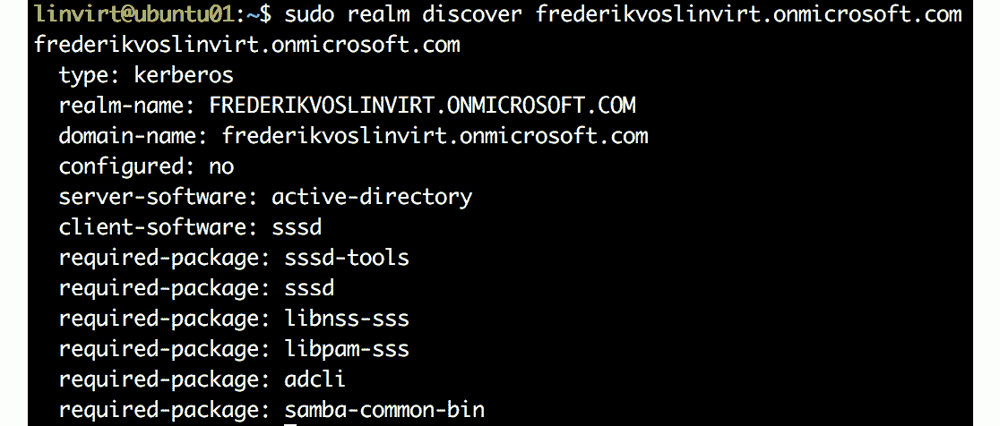

###### 图 6.27：发现域

现在，您已经准备好加入域：

```
sudo realm join <your domain> -U <username@domain>
```

使用您之前添加的用户名作为 Azure AD 域服务管理员组的成员。如果收到`未安装必要的软件包`的消息，但您确定已安装，可以在`realm`命令中添加`--install=/`参数。

要验证结果，请执行以下命令：

```
sudo realm list
```

输出应类似于以下内容：

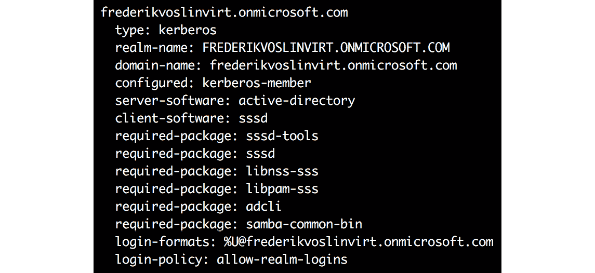

###### 图 6.28：加入域

您应该能够执行以下操作：

```
id <user>@<domain>
su <user>@<domain>
```

使用此用户远程登录`ssh`。

#### 注意

如果这不起作用，并且加入成功，请重新启动 VM。

### 加入域 - SUSE

在 SUSE SLE 和 LEAP 中，加入域的最佳方法是使用 YaST。

启动 YaST 实用程序：

```
sudo yast
```

从 YaST 主窗口开始**用户登录管理**模块，然后点击**更改设置**。点击**加入域**并填写域名。之后，您将能够成功加入域。如果需要，将安装依赖项。

将出现一个新窗口来管理域用户登录。您至少需要以下内容：**允许域用户登录**和**创建主目录**。在 Azure AD 域服务中，其他所有选项目前都不可能。

YaST 将为您在 shell 上提供一个类似 GUI 的彩色界面，使用它可以将机器加入域。运行`sudo yast`后，您将会得到如下所示的屏幕。从列表中，使用箭头键选择**网络服务**，然后选择**Windows 域成员资格**：

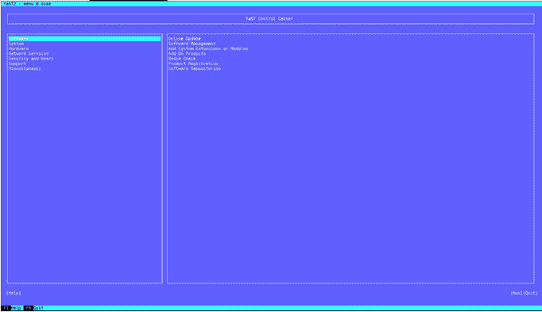

###### 图 6.29：在 Shell 上的 YaST 界面

最好的部分是，如果缺少任何依赖项，YaST 将提示您安装它们，因此请继续并完成依赖项安装。安装完成后，您可以输入您的域名，一旦保存，您将被提示输入用户名和密码，如下面的屏幕截图所示：

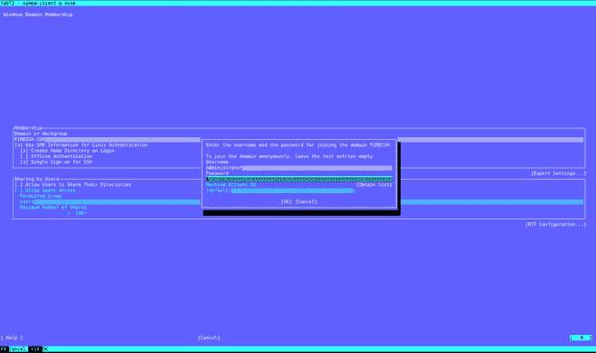

###### 图 6.30：提供注册机器的凭据

以`user@domain`格式输入您的凭据，然后输入您的密码。完成流程后，SUSE 机器将连接到 Azure AD 域服务并注册您的机器。如果加入成功，您将在屏幕上收到一条消息，如下所示：

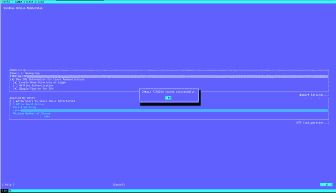

###### 图 6.31：域加入成功

您可以通过使用`su`命令将当前用户切换为您的 AD 用户名来进行验证，如下面的屏幕截图所示：


###### 图 6.32：验证域加入

最后，我们已经成功将我们的 Linux 机器加入了 Azure AD 域服务。最近，微软添加了对 Linux VM 进行 Azure AD 登录的支持，无需将机器加入域。将在下一节中讨论安装代理以完成授权。

### 使用 Azure AD 凭据登录到 Linux VM

Azure AD 还可以实现另一种形式的身份管理。这是一个完全不同的身份管理系统，没有 LDAP 和 Kerberos，正如前一节所讨论的。在 Linux 中，Azure AD 将允许您使用 Azure 凭据登录到您的 VM，但不支持应用程序级别。在撰写本书时，此功能仍处于预览阶段。此外，此功能在 SUSE 中不可用。

要使用 Azure AD，您必须部署一个 VM 扩展，例如使用 Azure CLI：

```
az vm extension set \ 
    --publisher Microsoft.Azure.ActiveDirectory.LinuxSSH \ 
    --name AADLoginForLinux \ 
    --resource-group myResourceGroup \ 
    --vm-name myVM 
```

之后，您必须为您的 Azure AD 帐户分配一个角色，可以是`虚拟机管理员登录`（具有 root 权限）或`虚拟机用户登录`（非特权用户）角色，并将范围限制在此 VM 上：

```
az role assignment create \ 
    --role "Virtual Machine Administrator Login" \ 
    --assignee <ad user name> \ 
    --scope <your vm> 
```

在这里，您可以在订阅级别设置范围，`--scope /subscriptions/<subcription ID>`。通过这样做，该角色将被订阅中的所有资源继承。

如果您只想对特定的 VM 进行细粒度访问控制，可以执行以下命令（在 PowerShell 中）：

```
$vm = Get-AzVM –Name <VM Name> -ResourceGroup <resource group> 
```

`$vm.Id` 将为您提供虚拟机的范围。

在 bash 中，执行以下命令：

```
 az vm show --name<name> --resource-group <resource group> --query id 
```

此命令将查询虚拟机的 ID，并且是角色分配的范围。

您可以使用您的 AD 凭据登录：

```
ssh <ad user>@<ad domain>@<ip address> 
```

最后，您将能够看到您正在使用 Azure AD 凭据登录到 Linux VM。

### Azure 中的其他安全解决方案

在本章中，我们已经讨论了如何提高 Linux 安全级别并整合某些 Azure 服务来提高安全性。话虽如此，可以用于提高安全性的 Azure 服务列表非常长。以下是其中一些重点：

+   Azure AD 托管身份：使用此功能，您可以为虚拟机创建托管身份，用于对支持 Azure AD 身份验证的任何服务进行身份验证。以前，此服务被称为**托管服务身份**（**MSI**），现在称为**Azure 资源的托管身份**。

+   密钥保管库：可用于安全存储密钥。例如，在 Azure 磁盘加密中，密钥将存储在密钥保管库中，并在需要时进行访问。

+   Azure 磁盘加密：磁盘加密将帮助您加密操作系统磁盘以及数据磁盘，从而为存储的数据提供额外的安全性。

+   RBAC：Azure 中的 RBAC 允许您为虚拟机分配细粒度权限。Azure 中有许多内置角色可用，您可以根据安全需求分配其中一个。此外，您可以创建自定义 RBAC 角色以提供更细粒度的权限。

+   **Azure 安全中心**（**ASC**）：ASC 是一个统一的基础设施安全管理系统，旨在 consolida 您的安全。

+   Azure 策略客户端配置：这可用于审核 Linux 虚拟机内部的设置。在*第八章* *探索持续配置自动化*中已经详细讨论过。

我们建议您阅读微软文档，以更好地了解这些服务如何在您的环境中使用，以加强整体安全性。

## 总结

安全是当今一个非常重要的话题。关于这个主题已经写了许多报告、书籍等。在本章中，我们介绍了 Linux 中增加安全级别的几种选项。所有这些选项都是在 Azure 通过网络安全组提供的基本安全性之上的。它们相对容易实施，并将产生重大影响！

中央身份管理不仅是为用户提供访问虚拟机的一种方式，也是减少安全风险的一部分。Azure AD 域服务通过 LDAP 和 Kerberos 为所有支持这些协议的操作系统和应用程序提供身份管理解决方案。

*第八章，探索持续配置自动化*，将涵盖自动化和编排。请注意，本章涵盖的所有安全措施都可以轻松进行编排。编排使得中央配置管理成为可能。其一个重要优势是防止错误和难以管理的配置。因此，即使编排也是您安全计划的一部分！

如果您要创建自己的虚拟机，尤其是如果您要构建自己的镜像，那将是很好的。我们将在下一章讨论如何构建自己的镜像。此外，我们将考虑推送这些镜像和在您的环境中部署它们的安全方面。

## 问题

1.  如果要实施 firewalld，有哪些配置此防火墙的方法？

1.  使用`--permanent`参数的`firewall-cmd`的原因是什么？

1.  还有哪些选项可用于限制网络访问？

1.  解释 DAC 和 MAC 之间的区别。

1.  在 Azure 上运行的 VM 中使用 Linux 安全模块为什么很重要？

1.  哪个 MAC 系统适用于哪个发行版？

1.  AppArmor 和 SELinux 之间的主要区别是什么？

1.  在依赖和 Linux 配置方面，加入 Azure AD 域服务的要求是什么？

## 进一步阅读

与上一章类似，我强烈建议您访问*第十一章*，“故障排除和监视工作负载”，以了解有关 Linux 日志记录的信息，因为通常`systemctl status`命令提供的信息不足够。我也已经指向了 Lennart Poettering 的博客和 systemd 网站。

对于 Linux 安全性，您可以开始阅读 Donald A. Tevault 的书*掌握 Linux 安全和加固*。本章涵盖的许多主题以及其他许多主题都有详细的解释。

firewalld 守护程序有一个项目网站，[`firewalld.org`](https://firewalld.org)，有博客和优秀的文档。对于较旧的发行版，Arch Linux 的维基是学习更多的好地方：[`wiki.archlinux.org/index.php/iptables`](https://wiki.archlinux.org/index.php/iptables)。由于 iptables 被 firewalld 使用，所以在深入研究`firewalld.richlanguage`的 man 页面之前，这是一个很好的开始。

有关 SELinux 的所有细节都在 Red Hat 提供的指南中有所涵盖：[`access.redhat.com/documentation/en-us/red_hat_enterprise_linux/7/html/selinux_users_and_administrators_guide/`](https://access.redhat.com/documentation/en-us/red_hat_enterprise_linux/7/html/selinux_users_and_administrators_guide/)虽然有点过时，但观看这个关于 SELinux 的 Red Hat 峰会的 YouTube 视频是一个很好的主意：[`www.youtube.com/watch?v=MxjenQ31b70`](https://www.youtube.com/watch?v=MxjenQ31b70)。

然而，要找到关于 AppArmor 的好信息更加困难。在[`gitlab.com/apparmor/apparmor/wikis/Documentation`](https://gitlab.com/apparmor/apparmor/wikis/Documentation)上有项目文档可用，Ubuntu 服务器指南是一个很好的起点。这可以在[`help.ubuntu.com/lts/serverguide/apparmor.html.en`](https://help.ubuntu.com/lts/serverguide/apparmor.html.en)找到。
