# 第七章：部署您的虚拟机

在 Azure 中部署单个虚拟机（VM）很容易，但一旦您想以一种单一的、可重复的方式部署更多的工作负载，您就需要某种自动化。

在 Azure 中，您可以使用 Azure 资源管理器（ARM）使用模板配置文件部署 VM，还可以使用 Azure CLI、PowerShell、Ruby 和 C#。本章后面将讨论用于创建 VM 映像的第三方工具，如 Packer 和 Vagrant。

所有这些部署方法或映像创建方法都使用 Azure 中的映像，但也可以创建自己的自定义 VM 并使用自定义映像。

在进入所有可能选项的配置之前，了解不同的部署选项以及为什么应该或不应该使用它们是很重要的。首先，您必须先问自己几个问题：

+   您何时打算部署您的应用程序？

+   工作负载的哪些部分应该是可重复的？

+   工作负载的配置的哪些部分应该在部署期间完成？

所有这些问题将在本章结束时得到解答。以下是本章的主要要点：

+   我们将讨论 Azure 中的自动化部署选项。

+   我们将看到如何使用 Azure CLI 和 PowerShell 自动化部署。

+   我们将介绍 Azure ARM 模板用于部署以及它们如何可以被重用于重新部署。

+   将讨论 VM 映像创建工具，如 Packer 和 Vagrant。

+   最后，我们将解释如何使用自定义映像并将我们自己的 VHD（虚拟硬盘）带入 Azure。

## 部署场景

介绍中提到的三个问题非常重要；这些可能因公司、应用程序和开发阶段而异。以下是一些部署场景的示例：

+   应用程序是内部开发的，甚至可能是在您的本地计算机上。完成后，应用程序将在 Azure 中部署。更新将应用于正在运行的工作负载。

+   这是相同的情景，但现在更新将通过部署新的 VM 来完成。

+   应用程序由另一个供应商提供。

这三个示例非常常见，可能会影响您想要部署工作负载的方式。

### 你需要什么？

在跳入部署之前，您应该知道您需要什么，或者换句话说，需要哪些资源才能使您的应用程序正常工作。此外，Azure 中的所有内容都有限制和配额。一些限制是硬性的，有些可以通过联系微软支持来增加。要查看完整的 Azure 限制和配额列表，请访问[`docs.microsoft.com/en-us/azure/azure-subscription-service-limits`](https://docs.microsoft.com/en-us/azure/azure-subscription-service-limits)。

在部署之前，我们需要计划并确保我们的订阅限制不会阻碍我们的项目。如果有限制或限制，请联系微软支持并增加配额。但是，如果您正在使用免费试用，配额请求将不会被批准。您可能需要将部署移至您有足够配额来完成部署的地区。这些是我们将要部署的关键资源：

+   一个资源组

+   一个存储账户（未管理）或托管磁盘

+   网络安全组

+   一个虚拟网络

+   虚拟网络的子网

+   连接到 VM 的网络接口

关于 VM，您需要指定并考虑以下内容：

+   VM 大小

+   存储

+   VM 扩展

+   操作系统

+   初始配置

+   应用程序的部署

如果您看一下这些列表，您可能会想知道自动化部署是否是必要的或必需的。答案并不容易找到。让我们再次看看这些情景，并尝试找到答案。我们可以决定做以下事情：

1.  创建一个 PowerShell 或 Bash 脚本来准备工作负载的 Azure 环境

1.  创建第二个脚本来部署基于 Azure 中的一个提供的 VM，并使用 Azure VM 扩展来配置初始配置

1.  使用像 Yum 这样的软件管理器部署应用程序

决定这样做没有错；这可能是您的最佳解决方案！然而，不管您喜不喜欢，都有依赖关系：

+   您的操作系统是基于一个镜像部署的。这个镜像是由发布者提供的。如果镜像更新到您的应用程序不支持的版本会发生什么？

+   这个镜像中已经完成了多少初始配置？还需要多少，谁控制这个镜像？

+   这个镜像是否符合您的安全策略？

+   如果出于任何原因您想离开 Azure，您能把您的应用程序迁移到其他地方吗？

## Azure 中的自动化部署选项

在这个漫长的介绍之后，是时候看一下功能选项了，这些选项使得自动化部署您的工作负载成为可能：

+   脚本编写

+   Azure 资源管理器

+   Ansible

+   Terraform

我们将在*第八章，探索持续配置自动化*中讨论 Ansible 和 Terraform。

### 脚本编写

自动化可以通过脚本完成。在 Azure 中，有许多由 Microsoft 支持的选项：

+   使用 Azure CLI 的 Bash

+   带有 Az 模块的 PowerShell

+   Python，完整的 SDK 可在[`docs.microsoft.com/en-us/azure/python/python-sdk-azure-install`](https://docs.microsoft.com/en-us/azure/python/python-sdk-azure-install )找到

+   Ruby，预览 SDK 可在[`azure.microsoft.com/en-us/develop/ruby`](https://azure.microsoft.com/en-us/develop/ruby )找到

+   Go，完整的 SDK 可在[`github.com/Azure/azure-sdk-for-go`](https://github.com/Azure/azure-sdk-for-go )找到

+   还有可用于 Node.js 的库

此外，您还可以使用 Java 和 C#等编程语言。也有社区项目；例如，[`github.com/capside/azure-sdk-perl`](https://github.com/capside/azure-sdk-perl) 是一个构建 Perl 的完整 Azure SDK 的尝试。

所有语言都是有效的选择；选择您已经熟悉的语言。请注意，Ruby SDK 在撰写本书时处于预览状态。在预览状态下，语法可能会发生变化。

脚本编写特别适用于准备 Azure 环境。您还可以使用脚本来部署您的 VM，并且甚至可以使用 VM 扩展来包含初始配置。这是否是一个好主意取决于您的脚本能力、操作系统的基本镜像以及其中安装的软件版本。

使用脚本的最大反对意见是编写脚本很耗时。以下是一些可以帮助您高效编写脚本的提示：

+   尽可能使用多个变量。这样，如果您需要在脚本中进行更改，您只需要更改变量的值。

+   在循环中使用可识别的变量名，而不是像`for i in`这样的东西。

+   特别是对于更大的脚本，声明可以重复使用的函数。

+   有时，将变量（例如提供身份验证的变量）和函数放在单独的文件中是有意义的。通常一个脚本执行一个任务是个好主意。

+   在您的代码中包含修改的时间戳，或者更好的是使用 Git 这样的版本控制系统。

+   包含测试。例如，只有在资源不存在时才创建此资源。使用可读的退出代码。如果脚本无法部署资源，请使用类似*无法创建$resource*的内容，这样运行脚本的人就会明白脚本无法创建资源。

+   包含足够的注释。如果您需要在一段时间后调试或重用脚本，您仍然会知道它的作用。不要忘记在标题中包含描述。

+   在布局上花一些时间；使用缩进使代码易读。使用两个空格进行缩进，而不是制表符！

现在是举一个简短示例的时候了。这个示例将让您了解在部署虚拟机之前如何创建脚本来提供 Azure 所需的东西。

首先，声明变量。您也可以将变量添加到一个文件中，并让 PowerShell 加载这些变量。建议将它们存储在同一个脚本中，这样您可以随时返回并在需要时更新它们。

```
#Declare Variables
$myResourceGroup = "LinuxOnAzure" 
$myLocation = "West Europe" 
$myNSG = "NSG_LinuxOnAzure" 
$mySubnet = "10.0.0.0/24"
$myVnet= "VNET_LinuxOnAzure"
```

接下来，编写一个脚本来创建一个资源组。如果资源已经存在，脚本将跳过创建部分。如前所述，添加注释是使脚本可读的最佳实践，因此请使用`#`标记的注释，以便您了解代码块的作用：

```
# Test if the Resource Group already exists, if not: create it. 
Get-AzResourceGroup -Name $myResourceGroup -ErrorVariable notPresent -ErrorAction SilentlyContinue | out-null  
if ($notPresent) 
  { 
    # ResourceGroup doesn't exist, create it: 
    New-AzResourceGroup -Name $myResourceGroup -Location $myLocation     
    Write-Host "The Resource Group $myResourceGroup is created in the location $myLocation" 
  }  
else 
  { 
    Write-Host "The Resource Group $myResourceGroup already exists in the location $myLocation" 
  }
```

创建虚拟网络并配置子网：

```
#Test if the vnet name not already exists: 
Get-AzVirtualNetwork -Name $myVnet -ResourceGroupName $myResourceGroup -ErrorVariable notPresent -ErrorAction SilentlyContinue | out-null 
if ($notPresent) 
  { 
    # vnet doesn't exist, create the vnet

    $virtualNetwork = New-AzVirtualNetwork -ResourceGroupName $myResourceGroup -Location $myLocation -Name $myVnet -AddressPrefix 10.0.0.0/16
    # add subnet configuration
    $subnetConfig = Add-AzVirtualNetworkSubnetConfig -Name default -AddressPrefix $mySubnet -VirtualNetwork $virtualNetwork
    # Associate the subnet to the virtual network
    $virtualNetwork | Set-AzVirtualNetwork
     Write-Host "The virtual network $myVnet with $mySubnet configured is created in the location $myLocation" 
  }
else 
  { 
    Write-Host "The Resource Group $myVnet already exists in the location $myLocation" 
  }
```

这是创建网络安全组的一个示例：

```
# Create NSG
# Test if the Network Security Group does not already exist:  

Get-AzNetworkSecurityGroup -ResourceGroupName $myResourceGroup -Name $myNSG -ErrorVariable notPresent -ErrorAction SilentlyContinue | out-null 
if ($notPresent) 
{ 
# create the NSG 
$nsg = New-AzNetworkSecurityGroup -ResourceGroupName $myResourceGroup -Location $myLocation -Name $myNSG
# create the rules for SSH and HTTP 
$nsg | Add-AzNetworkSecurityRuleConfig -Name "allow_http" -Description "Allow HTTP" -Access Allow '
    -Protocol "TCP" -Direction Inbound -Priority 1002 -SourceAddressPrefix "*" -SourcePortRange * '
    -DestinationAddressPrefix * -DestinationPortRange 80 
$nsg | Add-AzNetworkSecurityRuleConfig -Name "allow_ssh" -Description "Allow SSH" -Access Allow '
    -Protocol "TCP" -Direction Inbound -Priority 1001 -SourceAddressPrefix "*" -SourcePortRange * '
    -DestinationAddressPrefix * -DestinationPortRange 22 
# Update the NSG.
  $nsg | Set-AzNetworkSecurityGroup
Write-Host "The NSG: $myNSG is configured is created with rules for SSH and HTTP in the resource group $myResourceGroup" 
} 
else 
{ 
Write-Host "The NSG $myNSG already existed in the resource group $myResourceGroup"  
}
```

到目前为止，您应该已经对如何创建脚本和虚拟网络有了一个很好的想法。正如在本节开头提到的，脚本编写并不是自动化部署的唯一手段；还有其他方法。在下一节中，我们将讨论如何使用 Azure 资源管理器模板来自动化部署。

### 使用 Azure 资源管理器进行自动化部署

在*第二章，开始使用 Azure 云*中，我们将**Azure 资源管理器**（**ARM**）定义如下：

“基本上，Azure 资源管理器使您能够使用诸如存储和虚拟机之类的资源。为此，您必须创建一个或多个资源组，以便您可以执行生命周期操作，例如在单个操作中部署、更新和删除资源组中的所有资源。”

从 Azure 门户或使用脚本，您可以做到上述所有的事情。但这只是其中的一小部分。您可以通过 ARM 使用模板部署 Azure 资源。微软提供了数百个快速启动模板，可在[`azure.microsoft.com/en-us/resources/templates`](https://azure.microsoft.com/en-us/resources/templates)找到。

当您通过 Azure 门户创建虚拟机时，甚至在创建之前就可以将该虚拟机下载为模板。如果您参考以下截图，您会发现即使在创建虚拟机之前，我们也有一个下载自动化模板的选项：

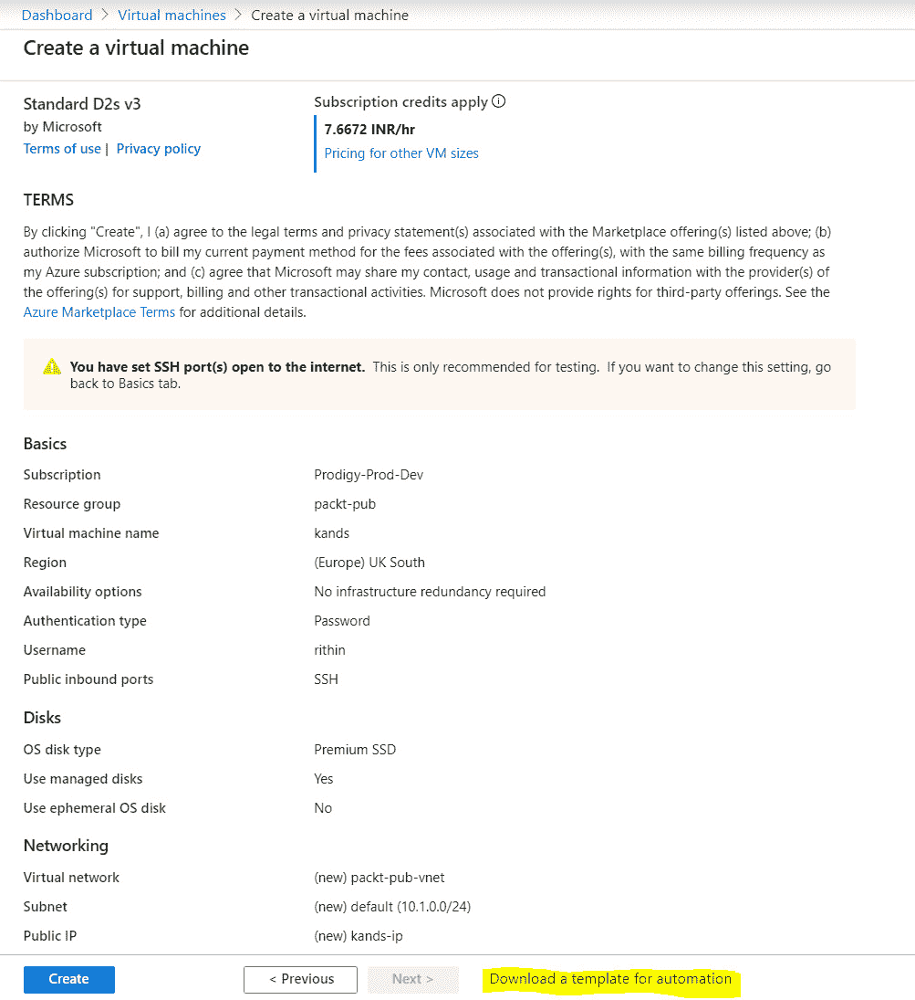

###### 图 7.1：将虚拟机下载为模板

如果您点击**下载自动化模板**，您将会看到以下屏幕：

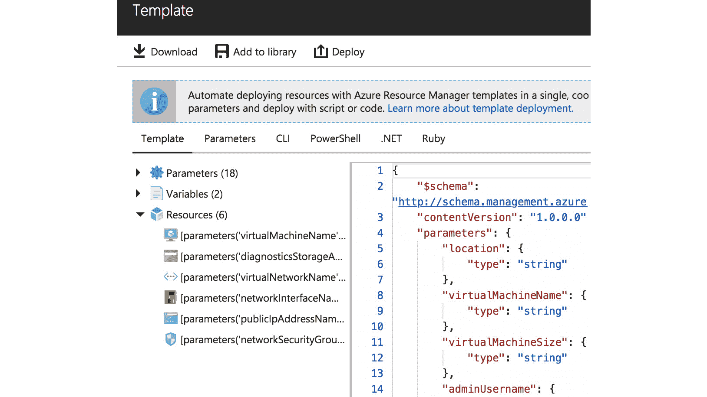

###### 图 7.2：VM 模板窗格

正如您所看到的，您可以将脚本添加到 Azure 的库中，或者将此文件下载到您的本地计算机。您还将获得一个**部署**选项，通过它您可以更改参数并直接部署到 Azure。

在**脚本**窗格中，Azure 给出了使用 PowerShell 和 CLI 进行部署的链接。

您可以轻松更改参数并部署新的虚拟机，或者重新部署完全相同的虚拟机。这与使用自己的脚本并没有太大的不同，但在开发方面更节省时间。

这并不是您可以使用 ARM 做的唯一事情；您可以配置 Azure 资源的每一个方面。例如，如果您通过 ARM 模板部署网络安全组，您可以像在 Azure 门户或通过 CLI 创建一样，定义一切，比如规则、端口范围和规则的优先级。创建自己的 ARM 模板并不那么困难。您需要 ARM 参考指南，可以在[`docs.microsoft.com/en-us/azure/templates`](https://docs.microsoft.com/en-us/azure/templates)找到。再加上这些示例，这是一个很好的入门资源。

另一种开始的方法是使用可在 Windows、Linux 和 macOS 上使用的 Visual Studio Code 编辑器，网址为[`code.visualstudio.com`](https://code.visualstudio.com)。**Azure 资源管理器工具**扩展是必不可少的，如果您要开始使用 ARM，还有其他一些扩展，如**Azure 帐户和登录**、**Azure 资源管理器片段**和**Azure CLI 工具**。您可以开始使用现有模板，甚至可以将它们上传到 Cloud Shell，执行它们并对其进行调试。

要安装 Azure 资源管理器工具扩展，请按照以下步骤进行：

1.  打开 Visual Studio Code。

1.  从左侧菜单中选择**扩展**。或者，从**查看**菜单中选择**扩展**以打开**扩展**窗格。

1.  搜索**资源管理器**。

1.  在**Azure 资源管理器工具**下选择**安装**。

这是您找到**安装**选项的屏幕：

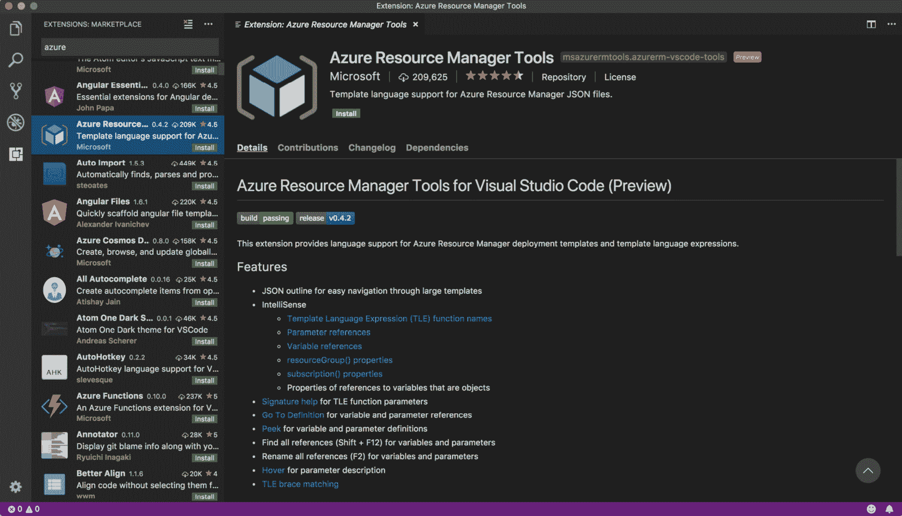

###### 图 7.3：安装 Azure 资源管理器工具

Azure 中的另一个不错的功能是 ARM Visualizer，您可以在[`armviz.io`](http://armviz.io)找到它。它仍处于早期开发阶段。这是一个可以帮助您快速了解从 Quickstart 模板网站下载的 ARM 模板目的的工具。

除了下载模板，还可以将其保存到库中：

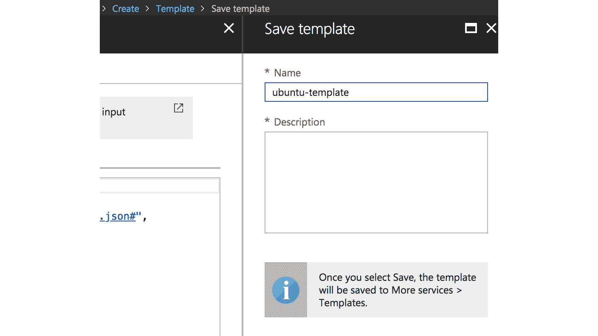

###### 图 7.4：将模板保存到库中

如此窗格所述，您可以通过在左侧导航栏中使用**所有资源**并搜索模板来轻松在 Azure 门户中导航：

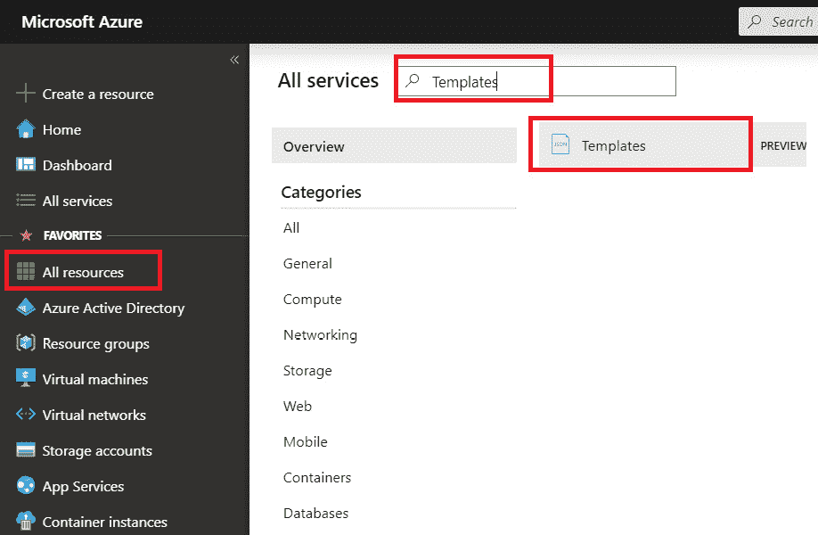

###### 图 7.5：在 Azure 门户上导航到模板

您仍然可以在这里编辑您的模板！另一个不错的功能是，您可以与您的租户的其他用户共享您的模板。这可能非常有用，因为您可以创建一个只允许使用此模板进行部署的用户。

现在我们知道了如何从 Azure 门户部署模板，让我们看看如何可以使用 PowerShell 和 Bash 部署 ARM 模板。

### 使用 PowerShell 部署 ARM 模板

首先，验证模板格式是否正确，执行以下命令：

```
Test-AzResourceGroupDeployment -ResourceGroupName ExampleResourceGroup' -TemplateFile c:\MyTemplates\azuredeploy.json '
-TemplateParameterFile  c:\MyTemplates\storage.parameters.json
```

然后继续部署：

```
New-AzResourceGroupDeployment -Name <deployment name> -ResourceGroupName <resource group name> -TemplateFile c:\MyTemplates\azuredeploy.json
-TemplateParameterFile c:\MyTemplates\storage.parameters.json
```

### 使用 Bash 部署 ARM 模板

您还可以在部署之前验证您的模板和参数文件，以避免任何意外错误：

```
az group deployment validate \  
--resource-group ResourceGroupName \
   --template-file template.json \
   --parameters parameters.json
```

要部署，请执行以下命令：

```
az group deployment create \
  --name DeploymentName \
  --resource-group ResourceGroupName \
  --template-file template.json \
  --parameters parameters.json
```

现在我们已经部署了一个新的 VM，我们可以保留`templates.json`和`parameters.json`，通过更改变量值可以重复使用它们。

假设我们已经删除了 VM，并且您希望重新部署它。您只需要 JSON 文件。如前所述，如果您已将模板存储在 Azure 中，您可以在那里找到重新部署的选项：

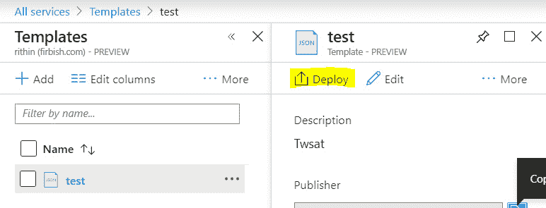

###### 图 7.6：使用 JSON 文件重新部署 VM

如果您希望通过 Azure CLI 或 PowerShell 完成相同的任务，请运行我们之前使用的命令，您的 VM 将准备好，配置与 ARM 模板中提到的相同。

## 初始配置

在部署工作负载之后，需要进行后部署配置。如果您想将其作为自动化解决方案的一部分来完成，那么有两个选项：

+   自定义脚本扩展可以在部署后的任何时间使用。

+   `cloud-init`在引导期间可用。

### 使用自定义脚本扩展进行初始配置

在 VM 部署后，可以使用自定义脚本扩展执行后部署脚本。在前面的示例中，我们使用 ARM 模板部署了 VM。如果您想在部署后运行脚本怎么办？这就是自定义脚本扩展的作用。例如，假设您想部署一个 VM，并且在部署后，您想在其中安装 Apache 而无需登录到 VM。在这种情况下，我们将编写一个脚本来安装 Apache，并且将使用自定义脚本扩展在部署后安装 Apache。

该扩展将适用于除 CoreOS 和 OpenSUSE LEAP 之外的所有 Microsoft 认可的 Linux 操作系统。如果您使用的是除 Debian 或 Ubuntu 之外的发行版，则将脚本中的`apt-get`命令更改为您的发行版支持的软件管理器。

您可以使用 PowerShell 来配置扩展：

```
$myResourceGroup = "<resource group name>"
$myLocation = "<location>"
$myVM = "<vm name>"
$Settings = @{ "commandToExecute" = "apt-get -y install nginx";};
Set-AzVMExtension -VMName $myVM '
-ResourceGroupName $myResourceGroup'
-Location $myLocation '
-Name "CustomscriptLinux" -ExtensionType "CustomScript" '
-Publisher "Microsoft.Azure.Extensions" '
-typeHandlerVersion "2.0" -InformationAction SilentlyContinue '
-Verbose -Settings $Settings
```

PowerShell 输出将在配置后给出状态，即是否正常或出现了问题。运行脚本后，您可以在 VM 的日志中验证安装是否成功。由于我们正在 Ubuntu VM 上进行此操作，您可以通过检查`/var/log/apt/history.log`文件来验证 nginx 的安装。输出确认了 nginx 和所有其他依赖项都已安装：

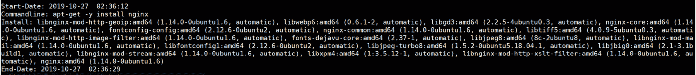

###### 图 7.7：检查日志以验证 nginx 安装

您还可以提供脚本而不是命令。

让我们创建一个非常简单的脚本：

```
#!/bin/sh
apt-get install -y nginx firewalld
firewall-cmd --add-service=http
firewall-cmd --add-service=http --permanent
```

现在，脚本必须使用`base64`命令进行编码。您可以在任何 Linux VM 上执行此操作，或者您可以使用`base64`字符串：

```
cat nginx.sh| base64
```

#### 注意

在某些版本的 base64 中，您必须添加`-w0`参数以禁用换行。只需确保它是一行！

`$Settings`变量将如下所示：

```
$Settings = @{"script" = "<base64 string>";};
```

由于我们已经使用第一个脚本安装了 nginx，您可以使用`apt purge nginx`来删除 ngnix，或者您可以完全创建一个新的 VM。与之前一样，我们可以去检查历史日志：

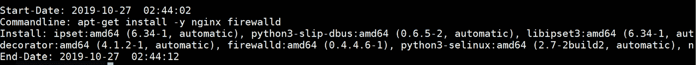

###### 图 7.8：检查历史日志

日志条目清楚地显示了`apt install –y nginx firewalld`已被执行。由于我们正在查看 apt 历史记录，我们将无法确认是否添加了 firewalld HTTP 规则。要确认这一点，您可以运行`firewall-cmd –list-services`：


###### 图 7.9：检查是否添加了 firewalld HTTP 规则

如果需要，脚本可以被压缩或上传到存储 blob 中。

当然，您可以使用 Azure CLI 进行初始配置。在这种情况下，您必须提供类似于此的 JSON 文件：

```
{
    "autoUpgradeMinorVersion": true,
    "location": "<location>",
    "name": "CustomscriptLinux",
    "protectedSettings": {},
    "provisioningState": "Failed",
    "publisher": "Microsoft.Azure.Extensions",
    "resourceGroup": "<resource group name>",
    "settings": {
      "script": "<base64 string"
    },
    "tags": {},
    "type": "Microsoft.Compute/virtualMachines/extensions",
    "typeHandlerVersion": "2.0",
    "virtualMachineExtensionType": "CustomScript"
  }
```

然后，执行以下`az`命令：

```
az vm extension set --resource-group <resource group> \
  --vm-name <vm name> \
  --name customScript --publisher Microsoft.Azure.Extensions \
  --settings ./nginx.json
```

#### 注意

JSON 文件可以包含在 ARM 模板中。

如果您正在使用 PowerShell 或 Azure CLI 进行调试目的，`/var/log/azure/custom-script`目录包含您的操作日志。

### 使用 cloud-init 进行初始配置

自定义 VM 扩展的问题在于脚本可能非常特定于发行版。您已经可以在使用的示例中看到这一点。如果使用不同的发行版，您将需要多个脚本，或者您将需要包含发行版检查。

在部署 VM 后进行一些初始配置的另一种方法是使用 cloud-init。

cloud-init 是一个由 Canonical 创建的项目，旨在为定制云映像提供云解决方案和 Linux 发行版不可知的方法。在 Azure 中，它可以与映像一起使用，以在第一次引导期间或创建 VM 时准备操作系统。

并非所有得到 Microsoft 认可的 Linux 发行版都受支持；Debian 和 SUSE 根本不受支持，而且在最新版本的发行版可以使用之前通常需要一些时间。

cloud-init 可用于运行 Linux 命令和创建文件。cloud-init 中有可用的模块来配置系统，例如安装软件或进行一些用户和组管理。如果有可用的模块，那么这是最好的方法。它不仅更容易（为您完成了艰苦的工作），而且还与发行版无关。

cloud-init 使用 YAML；请注意缩进很重要！脚本的目的是安装`npm`，`nodejs`和`nginx`软件包，然后配置 nginx，最后显示消息`Hello World from host $hostname`，其中`$hostname`是 VM 的名称。首先，让我们创建一个 YAML 文件，内容如下，并将其命名为`cloudinit.yml`：

```
#cloud-config
groups: users
users:
  - default
  - name: azureuser
  - groups: users
  - shell: /bin/bash
package_upgrade: true
packages:
  - nginx
  - nodejs
  - npm
write_files:
  - owner: www-data:www-data
  - path: /etc/nginx/sites-available/default
    content: |
      server {
        listen 80;
        location / {
          proxy_pass http://localhost:3000;
          proxy_http_version 1.1;
          proxy_set_header Upgrade $http_upgrade;
          proxy_set_header Connection keep-alive;
          proxy_set_header Host $host;
          proxy_cache_bypass $http_upgrade;
        }
      }
  - owner: azureuser:users
  - path: /home/azureuser/myapp/index.js
    content: |
      var express = require('express')
      var app = express()
      var os = require('os');
      app.get('/', function (req, res) {
        res.send('Hello World from host ' + os.hostname() + '!')
      })
      app.listen(3000, function () {
        console.log('Hello world app listening on port 3000!')
      })
runcmd:
  - systemctl restart nginx
  - cd "/home/azureuser/myapp"
  - npm init
  - npm install express -y
  - nodejs index.js
```

如果您查看此配置文件，您可以看到以下模块的一些使用情况：

+   `users`和`groups`：用户管理

+   `packages`和`package_upgrade`：软件管理

+   `write_files`：文件创建

+   `runcmd`：运行模块无法实现的命令

您还可以创建一个 VM：

```
az vm create --resource-group <resource group> \
  --name <vm name> --image UbuntuLTS \
  --admin-username linuxadmin \
  --generate-ssh-keys --custom-data cloudinit.txt
```

部署后，需要一些时间才能完成所有工作。日志记录在 VM 的`/var/log/cloud-init.log`和`/var/log/cloud-init-output.log`文件中。

更改网络安全组规则以允许端口`80`上的流量。之后，打开浏览器到 VM 的 IP 地址。如果一切正常，它将显示以下内容：`Hello World from host ubuntu-web!`

#### 注意

Az cmdlets 不支持 cloud-init。

## Vagrant

到目前为止，我们使用了 Microsoft 提供的解决方案；也许我们应该称它们为本地解决方案。这不是在 Azure 中部署工作负载的唯一方法。许多供应商已经创建了在 Azure 中自动化部署的解决方案。在本节中，我们想介绍来自名为 HashiCorp 的公司的解决方案（[`www.hashicorp.com`](https://www.hashicorp.com)）。在本章的后面，我们将介绍该公司的另一款产品：Packer。我们选择这些产品有几个原因：

+   这些产品非常受欢迎和知名。

+   Microsoft 和 HashiCorp 之间有着良好的关系；他们一起努力实现越来越多的功能。

+   而且最重要的原因是：HashiCorp 有不同的产品，可以用于不同的实施场景。这将让您再次考虑在不同的用例中选择什么方法。

Vagrant 是开发人员可以用来部署的工具。它可以帮助您以标准化的方式设置环境，以便您可以一遍又一遍地重新部署。

### 安装和配置 Vagrant

Vagrant 适用于多个 Linux 发行版、Windows 和 macOS，并可从[`www.vagrantup.com/downloads.html`](https://www.vagrantup.com/downloads.html)下载：

1.  要在 Ubuntu 中安装软件，请使用以下命令：

```
cd /tmp
wget \ https://releases.hashicorp.com/vagrant/2.1.2/vagrant_2.1.2_x86_64.deb
sudo dpkg -i vagrant_2.1.2_x86_64.deb
```

在 RHEL/CentOS 中，使用以下命令：

```
sudo yum install \
 https://releases.hashicorp.com/vagrant/2.1.2/ \
 vagrant_2.1.2_x86_64.rpm
```

如果您将其部署在单独的 VM 或工作站上，请确保您也安装了 Azure CLI。

登录到 Azure：

```
az login
```

创建一个服务主体帐户，Vagrant 可以用来进行身份验证：

```
az ad sp create-for-rbac --name vagrant
```

从输出中，您需要`appID`，也称为**客户端 ID**，以及密码，它与**客户端密钥**相同。

1.  执行以下命令以获取您的租户 ID 和订阅 ID：

```
az account show
```

在此命令的输出中，您可以看到您的租户 ID 和订阅 ID。

1.  创建一个具有以下内容的文件，并将其保存到`~/.azure/vagrant.sh`：

```
AZURE_TENANT_ID="<tenant id>"
AZURE_SUBSCRIPTION_ID="<account id>"
AZURE_CLIENT_ID="<app id>"
AZURE_CLIENT_SECRET="<password>"
export AZURE_TENANT_ID AZURE_SUBSCRIPTION_ID AZURE_CLIENT_ID\
  AZURE_CLIENT_SECRET
```

1.  在使用 Vagrant 之前，必须导出这些变量。在 macOS 和 Linux 中，您可以通过执行以下命令来实现：

```
source <file>
```

1.  必须有一个 SSH 密钥对可用。如果尚未完成此操作，请使用此命令创建密钥对：

```
ssh-keygen
```

1.  最后一步涉及安装 Vagrant 的 Azure 插件：

```
vagrant plugin install vagrant-azure
```

1.  验证安装：

```
vagrant version
```


###### 图 7.10：验证 vagrant 安装

现在我们已经确认 Vagrant 已经启动运行，让我们继续使用 Vagrant 部署一个 VM。

### 使用 Vagrant 部署虚拟机

要使用 Vagrant 部署虚拟机，你需要创建一个新的工作目录，在那里我们将创建`Vagrantfile`：

```
Vagrant.configure('2') do |config|  
config.vm.box = 'azure'  
# use local ssh key to connect to remote vagrant box  config.ssh.private_key_path = '~/.ssh/id_rsa'  
config.vm.provider :azure do |azure, override|       
azure.tenant_id = ENV['AZURE_TENANT_ID']    
azure.client_id = ENV['AZURE_CLIENT_ID']    
azure.client_secret = ENV['AZURE_CLIENT_SECRET']    azure.subscription_id = ENV['AZURE_SUBSCRIPTION_ID']  
end
end
```

配置文件以一个声明开始，我们需要之前安装的 Vagrant 的 Azure 插件。之后，VM 的配置开始。为了能够使用 Vagrant 提供工作负载，需要一个虚拟 box。它几乎是一个空文件：只注册 Azure 作为提供者。要获得这个虚拟 box，执行以下命令：

```
vagrant box add azure-dummy\
  https://github.com/azure/vagrant-azure/raw/v2.0/dummy.box\
  --provider azure
```

通常，很多选项，比如`vm_image_urn`，将被嵌入到一个 box 文件中，你只需要在`Vagrantfile`中提供最少的选项。由于我们使用的是一个虚拟 box，没有预先配置的默认值。`az.vm_image_urn`是 Azure 提供的实际镜像，语法如下：

```
 <publisher>:<image>:<sku>:<version>
```

除了使用标准镜像，还可以使用自定义**虚拟硬盘**（**VHD**）文件，使用这些指令：

+   `vm_vhd_uri`

+   `vm_operating_system`

+   `vm_vhd_storage_account_id`

在本章的后面，我们将更详细地讨论这些自定义 VHD 文件。

另一个重要的值是虚拟机的名称；它也被用作 DNS 前缀。这必须是唯一的！否则，你会得到这个错误：`DNS 记录<name>.<location>.cloudapp.azure.com 已经被另一个公共 IP 使用了`。

部署 Vagrant box，虚拟机：

```
vagrant up 
```

输出应该是这样的：

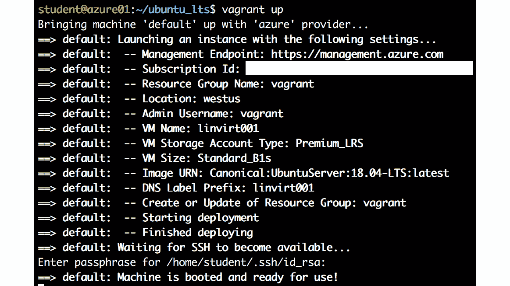

###### 图 7.11：部署 vagrant box

当机器准备好使用时，你可以使用这个命令登录：

```
vagrant ssh
```

你的工作目录的内容被复制到 VM 中的`/vagrant`。这可以是一个非常好的方式，让你的文件在 VM 中可用。

使用这个命令清理你的工作：

```
vagrant destroy
```

#### 注意

也可以创建多台虚拟机。

### Vagrant Provisioners

提供一种简单的方式来部署虚拟机并不是 Vagrant 最重要的特性。使用 Vagrant 的主要原因是让一个完整的环境运行起来；部署后，虚拟机需要配置。有 provisioners 来完成后续工作。provisioners 的目的是进行配置更改，自动安装软件包等。你可以使用 shell provisioner，在客户端 VM 中上传和执行脚本，以及文件 provisioner 来运行命令并将文件复制到 VM 中。

另一个可能性是使用 Vagrant provisioners 来进行编排工具，比如 Ansible 和 Salt。下一章将讨论这些工具。在本章中，连同 Vagrant 网站上的 provisioners 文档（[`www.vagrantup.com/docs/provisioning/`](https://www.vagrantup.com/docs/provisioning/)），我们将配置 shell provisioners 和文件 provisioner。让我们继续通过将以下代码块添加到`Vagrantfile`来配置 provisioners。

将这段代码添加到`Vagrantfile`的底部：

```
# Configure the Shell Provisioner
config.vm.provision "shell", path: "provision.sh"
end # Vagrant.config
```

我们在 shell provisioner 中引用了一个文件`provision.sh`。所以让我们创建一个简短的`provision.sh`脚本，包含一些简单的命令：

```
#!/bin/sh
touch /tmp/done
touch /var/lib/cloud/instance/locale-check.skip
```

再次部署 VM，你会看到 Vagrant 已经接受了我们创建的 SSH 密钥，并开始了配置：

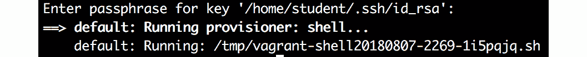

###### 图 7.12：Vagrant 已开始配置

执行这段代码来验证在 VM 中是否已经创建了`/tmp/done`目录，就像我们在`provision.sh`文件中指示的那样：

```
vagrant ssh -c "ls -al /tmp/done"
```

## Packer

对于开发人员来说，尤其是如果有许多人在同一应用上工作，拥有标准化的环境非常重要。如果您不使用容器技术（请参阅*第九章*，*Azure 中的容器虚拟化*，以及*第十章*，*使用 Azure Kubernetes 服务*，了解有关此技术的更多信息），Vagrant 是一个很好的工具，它可以帮助开发人员管理虚拟机的生命周期，以便以可重复的方式快速启动应用程序。它根据镜像提供或自定义 VHD 进行配置。如果您想在云中开发应用程序，这就是您所需要的一切。

但是，如果您想要更复杂的环境、构建自己的镜像、多机部署、跨云环境等，这并非完全不可能，但一旦尝试，您会发现 Vagrant 并不适用于这些场景。

这就是另一个 HashiCorp 产品 Packer 派上用场的地方。在本节中，我们将使用与之前与 Vagrant 相似的配置来使用 Packer。

### 安装和配置 Packer

Packer 可用于 macOS、Windows、多个 Linux 发行版和 FreeBSD。可在[`www.packer.io/downloads.html`](https://www.packer.io/downloads.html)下载软件包。

下载软件包，解压缩，然后就可以使用了。在 Linux 中，最好创建一个`~/.bin`目录并在那里解压缩：

```
mkdir ~/bin
cd /tmp
wget wget https://releases.hashicorp.com/packer/1.2.5/\
  packer_1.2.5_linux_amd64.zip
unzip /tmp/packer*zip
cp packer ~/bin 
```

注销并重新登录。几乎每个发行版都会在`~/bin`目录可用时将其添加到`PATH`变量中，但您必须注销并重新登录。

通过执行`$PATH`检查`PATH`变量。如果您无法看到`bin`文件夹添加到路径中，请执行以下操作：

```
export PATH=~/bin:$PATH
```

验证安装：

```
packer version
```

如果安装成功，该命令将返回 Packer 的版本，如图中所示：


###### 图 7.13：通过 Packer 版本验证 Packer 安装

对于 Packer 的配置，我们将需要与 Vagrant 相同的信息：

+   Azure 租户 ID（`az account show`）

+   Azure 订阅 ID（`az account show`）

+   服务主体帐户的 ID（如果要使用与 Vagrant 相同的帐户，请使用`az app list --display-name vagrant`命令）

+   此帐户的秘密密钥（如果需要，可以使用`az ad sp reset-credentials`命令生成新的密钥）

+   在正确的位置中存在的资源组；在此示例中，我们使用`LinuxOnAzure`作为资源组名称，`West Europe`作为位置（使用`az group create --location "West Europe" --name "LinuxOnAzure"`命令创建）

创建一个文件（例如`/packer/ubuntu.json`），其中包含以下内容：

```
{ 
    "builders": [{ 
      "type": "azure-arm", 
      "client_id": "<appId>", 
      "client_secret": "<appPassword>", 
      "tenant_id": "<tenantId>", 
      "subscription_id": "<subscriptionID>", 
      "managed_image_resource_group_name": "LinuxOnAzure", 
      "managed_image_name": "myPackerImage", 
      "os_type": "Linux", 
      "image_publisher": "Canonical",
      "image_offer": "UbuntuServer", 
      "image_sku": "18.04-LTS", 
      "location": "West Europe", 
      "vm_size": "Standard_B1s" 
    }], 
    "provisioners": [{ 
   "type": "shell", 
   "inline": [ 
   "touch /tmp/done", 
   "sudo touch /var/lib/cloud/instance/locale-check.skip" 
   ] 
    }] 
  }
```

验证语法：

```
packer validate ubuntu.json
```

然后，按以下方式构建镜像：

```
packer build ubuntu.json
```

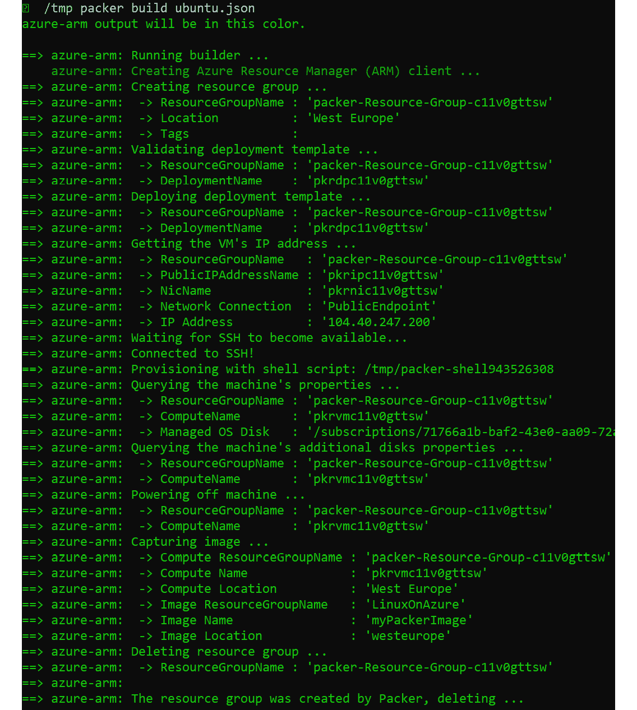

###### 图 7.14：使用 Packer 构建命令构建镜像

Packer 需要一些时间来构建虚拟机，运行配置程序并清理部署。

构建完成后，Packer 将为您提供构建的摘要，例如资源组、虚拟机部署位置、镜像名称和位置：

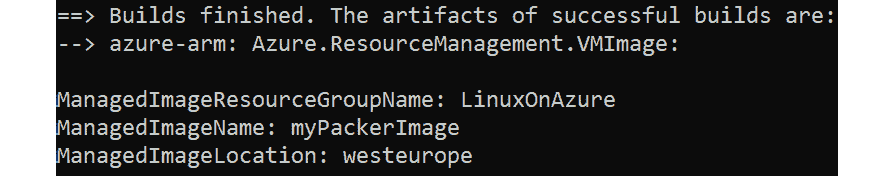

###### 图 7.15：镜像摘要

构建将创建一个镜像，但不会创建运行中的虚拟机。从 Packer 创建的镜像中，您可以使用以下命令部署虚拟机：

```
az vm create \ 
--resource-group LinuxOnAzure \
 --name mypackerVM \ 
--image myPackerImage \ 
--admin-username azureuser \ 
--generate-ssh-keys
```

要清理环境并删除 Packer 创建的镜像，请执行以下命令：

```
az resource delete --resource-group LinuxOnAzure --resource-type images \
  --namespace Microsoft.Compute --name myPackerImage
```

我在本章前面提供的 JSON 文件足以创建镜像。这与我们在 Vagrant 中所做的非常相似，但为了将其转换为可部署的镜像，我们必须将 VM 进行泛化，这意味着允许它为多个部署进行镜像化。将`/usr/sbin/waagent -force -deprovision+user & export HISTSIZE=0 && sync`添加到代码中将泛化 VM。不要担心这段代码-在下一节中，当我们通过 Azure CLI 泛化 VM 时，您将再次看到它。

找到以下代码：

```
 "provisioners": [{
    "type": "shell",
    "inline": [
      "touch /tmp/done",
      "sudo touch /var/lib/cloud/instance/locale-check.skip"
    ]
```

这需要用以下代码替换：

```
     "provisioners": [{
    "type": "shell",
    "execute_command": "echo '{{user 'ssh_pass'}}' | {{ .Vars }} sudo -S -E sh '{{ .Path }}'",
    "inline": [
     "touch /tmp/done",
     "touch /var/lib/cloud/instance/locale-check.skip",
     "/usr/sbin/waagent -force -deprovision+user && export HISTSIZE=0 && sync"
    ]
    }]
  }
```

`execute_command`是用于以正确用户身份执行脚本的命令。

使用`packer validate`命令验证模板，以避免任何错误并重新构建镜像。

到目前为止，我们已经使用 Packer 创建了镜像，但也可以使用 Azure CLI 和 Powershell 来完成。接下来的部分将详细介绍这一点。

## 自定义虚拟机和 VHD

在上一节中，我们在 Azure 中使用了标准 VM 提供，并使用了两种不同的方法进行了一些配置工作。然而，正如之前所述，存在一些原因使得默认镜像可能不适合您。让我们再次总结一下原因。

Azure 的本机镜像提供了部署 VM 的良好起点。使用本机镜像的一些好处如下：

+   由 Linux 发行版供应商或可信赖的合作伙伴创建和支持

+   快速部署，无论是手动还是编排，当然，您之后可以自定义它们

+   使用 Azure 扩展功能和选项轻松扩展

如果您选择使用本机提供的服务，那么也会有一些缺点或者说一些不足之处：

+   如果您需要比标准镜像更加安全的镜像，那么您必须依赖于市场上昂贵的加固镜像版本。

+   标准镜像不符合公司标准，尤其是在分区方面。

+   标准镜像并非针对特定应用进行了优化。

+   一些 Linux 发行版不受支持，例如 Alpine 和 ArchLinux。

+   关于可重现环境的问题：某个镜像版本可用多长时间？

因此，我们需要自定义镜像，以便我们可以自定义镜像并减轻问题或不足之处。我们并不是在暗示本机提供不安全或无法完成任务，但在企业环境中，存在一些情况，例如为 RHEL/SLES VMs 提供自己的订阅和作为镜像打包的第三方**独立软件供应商**（**ISV**）软件，您必须使用自定义镜像。让我们继续看看如何在 Azure 中使用自定义镜像。

### 创建托管镜像

在上一节中，我们调查了 Packer。创建了一个 VM，然后将其转换为镜像。此镜像可用于部署新的 VM。这种技术也称为**捕获 VM 镜像**。

让我们看看是否可以逐步使用 Azure CLI 手动进行操作：

1.  创建资源组：

```
myRG=capture
myLocation=westus
az group create --name $myRG --location $myLocation
```

1.  创建 VM：

```
myVM=ubuntudevel
AZImage=UbuntuLTS
Admin=linvirt
az vm create --resource-group $myRG  --name $myVM \
  --image $AZImage \
  --admin-username linvirt  --generate-ssh-keys
```

1.  登录到 VM 并使用 Azure VM Agent 取消配置它。它通过删除特定于用户的数据来泛化 VM：

```
sudo waagent -deprovision+user
```

执行命令后，输出将显示有关即将删除的数据的警告。您可以输入`y`继续，如下所示：

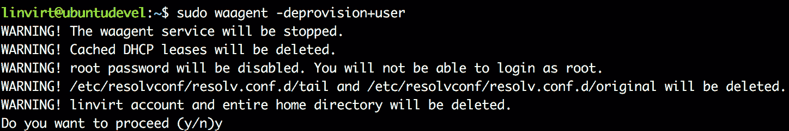

###### 图 7.16：取消配置 VM

输入`exit`退出 SSH 会话。

1.  释放 VM：

```
az vm deallocate --resource-group $myRG --name $myVM
```

1.  将其标记为泛化。这意味着允许它为多个部署进行镜像化：

```
az vm generalize --resource-group $myRG --name $myVM
```

1.  从此资源组中的 VM 创建镜像：

```
destIMG=customUbuntu
az image create --resource-group $myRG --name $destIMG --source $myVM
```

1.  验证结果：

```
az image list -o table
```

输出将以表格格式显示镜像列表：

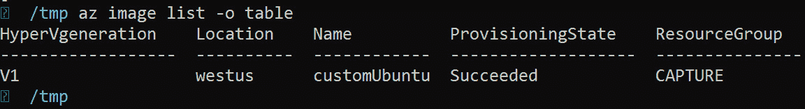

###### 图 7.17：Azure 镜像列表

1.  您可以使用此镜像部署新的 VM：

```
az vm create --resource-group <resource group> \
  --name <vm name> \ 
  --image $destIMG \    
  --admin-username <username> \    
  --generate-ssh-key
```

如果您在 PowerShell 中，这也是可能的。让我们非常快速地通过第一步。流程非常相似；唯一的区别是我们使用 PowerShell cmdlet：

```
$myRG="myNewRG" 
$myLocation="westus" 
$myVM="ubuntu-custom" 
$AZImage="UbuntuLTS"

#Create resource group
New-AzResourceGroup -Name $myRG -Location $myLocation 

#Create VM
New-AzVm '
-ResourceGroupName $myRG '
-Name $myVM '
-ImageName $AZimage '
-Location $myLocation '
-VirtualNetworkName "$myVM-Vnet" '
-SubnetName "$myVM-Subnet" '
-SecurityGroupName "$myVM-NSG" '
-PublicIpAddressName "$myVM-pip"
```

PowerShell 可能提示您输入凭据。继续输入凭据以访问您的 VM。之后，我们将继续对 VM 进行去配置：

```
Stop-AzureRmVM -ResourceGroupName <resource group>'
  -Name <vm name> 
```

与之前一样，现在我们必须将 VM 标记为通用化：

```
Set-AzVm -ResourceGroupName <resource group> -Name <vm name> '
 -Generalized
```

让我们捕获 VM 信息并将其保存到一个变量中，因为我们将需要它来创建图像的配置：

```
$vm = Get-AzVM –Name <vm name> -ResourceGroupName <resource group name>
```

现在让我们创建图像的配置：

```
$image = New-AzImageConfig -Location<location> -SourceVirtualMachineId $vm.Id
```

因为我们在`$image`中存储了配置，所以使用它来创建图像：

```
New-AzImage -Image $image -ImageName <image name> '
 -ResourceGroupName <resource group name>
```

验证图像是否已创建：

```
Get-AzImage –ImageName <Image Name>
```

运行上述命令将为您提供类似以下的输出，其中包含您创建的图像的详细信息：

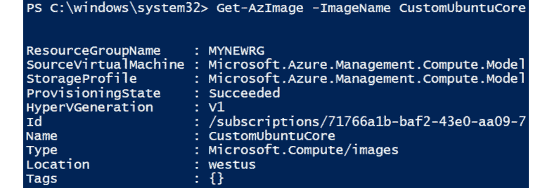

###### 图 7.18：获取图像详细信息

如果您想使用刚刚创建的图像创建 VM，请执行以下命令：

```
New-AzVm ' 
-ResourceGroupName "<resource group name>" ' 
-Name "<VM Name>" ' 
-ImageName "<Image Name>" ' 
-Location "<location>" ' 
-VirtualNetworkName "<vnet name>" ' 
-SubnetName "<subnet name>" ' 
-SecurityGroupName "<nsg name>" ' 
-PublicIpAddressName "<public IP name>"
```

总结我们所做的，我们创建了一个 VM，通用化了它，并创建了一个可以进一步用于部署多个 VM 的图像。还有一种从参考图像创建多个 VM 的替代方法，即使用''快照''。这将在下一节中介绍。

### 使用快照的备用方法

如果您想保留原始 VM，可以从快照创建 VM 图像。Azure 中的快照实际上是一个完整的 VM！

**使用 PowerShell**

1.  声明一个变量`$vm`，它将存储有关我们将要获取和创建快照的 VM 的信息：

```
$vm = Get-AzVm -ResourceGroupName <resource group> '
  -Name $vmName
$snapshot = New-AzSnapshotConfig '   
  -SourceUri $vm.StorageProfile.OsDisk.ManagedDisk.Id '   
  -Location <location> -CreateOption copy
New-AzSnapshot '    
  -Snapshot $snapshot -SnapshotName <snapshot name> '    
  -ResourceGroupName <resource group>
```

1.  因为我们需要快照 ID 用于后续步骤，所以我们将重新初始化快照变量：

```
$snapshot = Get-AzSnapshot –SnapshotName <Snapshot Name>
```

1.  下一步涉及从快照创建图像配置。

```
$imageConfig = New-AzImageConfig -Location <location>

$imageConfig = Set-AzImageOsDisk -Image $imageConfig '
 -OsState Generalized -OsType Linux -SnapshotId $snapshot.Id
```

1.  最后，创建图像：

```
New-AzImage -ImageName <image name> '
  -ResourceGroupName <resource group> -Image $imageConfig
```

**使用 Azure CLI**

在 Azure CLI 中，事情更容易；只需获取快照的 ID 并将其转换为磁盘：

1.  使用 Azure CLI 创建快照：

```
disk=$(az vm show --resource-group <resource group>\
  --name <vm name> --query "storageProfile.osDisk.name" -o tsv)
az snapshot create --resource-group <resource group>\
  --name <snapshot name> --source $disk
```

1.  创建图像：

```
snapshotId=$(az snapshot show --name <snapshot name>\
  --resource-group <resource group> --query "id" -o tsv)
az image create --resource-group <resource group> --name myImage \
  --source $snapshotID --os-type Linux 
```

在对 VM 进行快照之前不要忘记通用化 VM。如果您不想这样做，可以从快照创建磁盘，并将其用作 Azure CLI 中的`--attach-os-disk`命令的磁盘参数，或者在 PowerShell 中使用`Set-AzVMOSDisk`。

### 自定义 VHD

您可以完全从头开始构建自己的图像。在这种情况下，您必须构建自己的 VHD 文件。有多种方法可以做到这一点：

+   在 Hyper-V 或 VirtualBox 中创建一个 VM，它是 Windows、Linux 和 macOS 可用的免费 hypervisor。这两种产品都原生支持 VHD。

+   在 VMware Workstation 或 KVM 中创建您的 VM，并在 Linux `qemu-img`中使用它来转换图像。对于 Windows，可以在[`www.microsoft.com/en-us/download/details.aspx?id=42497`](https://www.microsoft.com/en-us/download/details.aspx?id=42497)下载 Microsoft Virtual Machine Converter。这包括一个 PowerShell cmdlet，`ConvertTo-MvmcVirtualHardDisk`，用于进行转换。

#### 注意

Azure 仅支持 Type-1 VHD 文件，并且应该具有与 1 MB 对齐的虚拟大小。在撰写本书时，Type-2 正在预览中（[`docs.microsoft.com/en-us/azure/virtual-machines/windows/generation-2`](https://docs.microsoft.com/en-us/azure/virtual-machines/windows/generation-2)）。

Azure 在 Hyper-V 上运行。Linux 需要特定的内核模块才能在 Azure 中运行。如果 VM 是在 Hyper-V 之外创建的，Linux 安装程序可能不包括 Hyper-V 驱动程序在初始 ramdisk（`initrd`或`initramfs`）中，除非 VM 检测到它正在运行在 Hyper-V 环境中。

当使用不同的虚拟化系统（如 VirtualBox 或 KVM）来准备您的 Linux 图像时，您可能需要重建`initrd`，以便至少`hv_vmbus`和`hv_storvsc`内核模块在初始 ramdisk 上可用。这个已知问题适用于基于上游 Red Hat 发行版的系统，可能也适用于其他系统。

重建`initrd`或`initramfs`映像的机制可能因发行版而异。请查阅您发行版的文档或支持以获取正确的操作步骤。以下是使用`mkinitrd`实用程序重建`initrd`的示例：

1.  备份现有的`initrd`映像：

```
cd /boot
sudo cp initrd-'uname -r'.img  initrd-'uname -r'.img.bak
```

1.  使用`hv_vmbus`和`hv_storvsc 内核`模块重建`initrd`：

```
sudo mkinitrd --preload=hv_storvsc --preload=hv_vmbus -v -f initrd-'uname -r'.img 'uname -r'
```

几乎不可能描述每个 Linux 发行版和每个 hypervisor 的所有可用选项。总的来说，您需要做的事情在这里列出。非常重要的是我们要准确地按照步骤进行，否则无法完成此任务。我们强烈建议按照 Microsoft 的文档进行操作（[`docs.microsoft.com/en-us/azure/virtual-machines/linux/create-upload-generic`](https://docs.microsoft.com/en-us/azure/virtual-machines/linux/create-upload-generic)）。

1.  修改 GRUB 或 GRUB2 中的内核引导行，以包括以下参数，以便所有控制台消息都发送到第一个串行端口。这些消息可以帮助 Azure 支持调试任何问题：

```
console=ttyS0,115200n8 earlyprintk=ttyS0,115200 rootdelay=300
```

1.  Microsoft 还建议删除以下参数（如果存在）：

```
rhgb quiet crashkernel=auto
```

1.  安装 Azure Linux 代理，因为代理是在 Azure 上为 Linux 映像进行配置所必需的。您可以使用`rpm`或`deb`文件安装它，或者您可以按照 Linux 代理指南中提供的步骤手动安装它（[`docs.microsoft.com/en-us/azure/virtual-machines/extensions/agent-linux`](https://docs.microsoft.com/en-us/azure/virtual-machines/extensions/agent-linux)）。

1.  确保安装了 OpenSSH 服务器并在启动时自动启动。

1.  不要创建交换。如果需要，稍后可以启用它，就像我们在前一章中讨论的那样。

1.  取消配置 VM，如*创建托管映像*部分所述。

1.  关闭 VM，您的 VHD 已准备好上传到 VM。

为简单起见，我们将跳过前面的步骤，并从 Ubuntu 的云映像存储库下载官方映像，因为最重要的部分是将映像上传到 Azure。从[`cloud-images.ubuntu.com/bionic/`](https://cloud-images.ubuntu.com/bionic/)下载云映像。此网页包含所有 Bionic 的版本，您可以浏览目录并下载 Azure 的 tar.gz 文件。文件名类似于`bionic-server-cloudimg-amd64-azure.vhd.tar.gz`；但是，这个名称可能会根据您查看的版本有所不同。

现在我们必须将 VHD 上传到 Azure：

1.  首先，为映像准备一个单独的存储帐户是个好主意，所以让我们创建一个新的存储帐户。在这里，我们选择`Premium_LRS`，但如果您愿意，也可以选择`Standard_LRS`以节省一些成本：

```
az storage account create --location <location> \
  --resource-group <resource group> --sku Premium_LRS \
  --name <account name> --access-tier Cool --kind StorageV2
```

1.  保存输出以备后用。列出访问密钥：

```
az storage account keys list --account-name <storage account name>\
  --resource-group <resource group>
```

1.  再次保存输出。我们需要的下一步是创建一个容器来存储文件：

```
 az storage container create \
  --account-name <storage account>\
  --account-key <storage account key 1>  
  --name <container name> 
```

1.  现在您可以上传 VHD：

```
az storage blob upload --account-name <storage account>\
  --account-key <storage account key> \
  --container-name <container name> \ 
  --type page --file ./bionic-server-cloudimg-amd64.vhd \
  --name bionic.vhd
```

#### 注意

您还可以使用 Azure 门户或 PowerShell 上传文件。其他方法包括 Azure 存储资源管理器（[`azure.microsoft.com/en-us/features/storage-explorer/`](https://azure.microsoft.com/en-us/features/storage-explorer/)）或 Azure VHD 工具（[`github.com/Microsoft/azure-vhd-utils`](https://github.com/Microsoft/azure-vhd-utils)）。最后一个方法速度非常快！

1.  接收 blob URL：

```
az storage blob url --account-name <storage account> \
  --account-key <storage account key> \
  --container-name <container name> \
  --name bionic.vhd
```

1.  现在可以从上传创建一个磁盘：

```
az disk create --resource-group <resoure group> \
 --name bionic --source <blob url> --Location <location>
```

1.  使用此磁盘创建 VM 映像：

```
az image create --resource-group <resource group> \
  --name bionic --source <blob url> --os-type linux 
  --location <location>
```

1.  最后，基于此映像创建一个 VM：

```
az vm create --resource-group <resource group> \
 --name <vm name> \ 
 --image bionic \    
 --admin-username <username> \    
 --generate-ssh-key \
 --location <location>
```

#### 注意

您可以将 VHD 映像设为公共；一个很好的例子是一个名为 NixOS 的鲜为人知的 Linux 发行版。在他们的网站上，[`nixos.org/nixos/download.html`](https://nixos.org/nixos/download.html)，他们描述了在 Azure 中部署其操作系统的方法！

让我们总结一下我们所做的。我们采取了两种方法。我们从现有的 VM 创建并上传了一个 Linux VHD，然后手动下载了一个 Ubuntu VHD 并使用它。无论哪种方式，我们都将把它上传到存储账户，并将使用它创建一个镜像。这个镜像是可重复使用的，你可以部署任意多个 VM。

自动化过程和可用工具是广泛的。在下一章中，我们将继续讨论自动化过程，并讨论最广泛使用的工具，即 Ansible 和 Terraform。

## 总结

在本章中，我们开始思考在 Azure 中为什么以及何时应该使用自动化。随后，我们添加了关于使用 Azure 提供的镜像的问题。

考虑到这些问题，我们探讨了自动化部署的选项：

+   脚本编写

+   ARM 模板

+   Vagrant

+   Packer

+   构建和使用自己的镜像

Vagrant 和 Packer 是第三方解决方案的例子，它们是非常受欢迎的工具，可以轻松地创建和重新创建环境，作为你的开发过程的重要部分。

重要的是要知道，本章中描述的所有技术都可以组合成一个完整的解决方案。例如，你可以将 cloud-init 与 ARM 一起使用，也可以与 Vagrant 一起使用。

自动化和编排是密切相关的。在本章中，我们讨论了自动化，特别是作为开发环境的一部分，用于自动化 VM 的部署。自动化通常是一个难以维护的解决方案，用于跟踪开发和部署的工作负载。这就是编排发挥作用的地方，下一章将涵盖这一点。

## 问题

1.  在 Azure 中使用自动化部署的主要原因是什么？

1.  在开发环境中自动化的目的是什么？

1.  你能描述脚本编写和自动化之间的区别吗？

1.  你能说出 Azure 中可用的一些自动化部署选项吗？

1.  Vagrant 和 Packer 有什么区别？

1.  为什么应该使用自己的镜像而不是 Azure 提供的镜像？

1.  有哪些选项可以创建自己的镜像？

也许你可以抽出一些时间来完成*脚本编写*部分的示例脚本，用你选择的语言。

## 进一步阅读

特别是关于 Azure CLI、PowerShell 和 ARM，Azure 文档包含大量有价值的信息和许多示例。我们在*第二章，开始使用 Azure 云*的*进一步阅读*部分中写的一切对本章也很重要。

微软提供的另一个资源是其博客。如果你访问[`blogs.msdn.microsoft.com/wriju/category/azure/`](https://blogs.msdn.microsoft.com/wriju/category/azure/)，你会发现许多关于自动化的有趣帖子，包括更详细的示例。

在他的博客[`michaelcollier.wordpress.com`](https://michaelcollier.wordpress.com)中，Michael S. Collier 提供了大量关于 Azure 的信息。几乎每篇帖子都包括脚本编写和自动化的可能性。

关于 Vagrant 并没有太多最近的书。我们相信你会喜欢一年前出版的*Infrastructure as Code (IAC) Cookbook*，作者是 Stephane Jourdan 和 Pierre Pomes。这本书不仅涉及 Vagrant；它还涵盖了其他解决方案，如 cloud-init 和 Terraform。作者创作了一本不仅是很好的介绍，而且还能用作参考指南的书。

我们可以推荐一本最近出版的书吗？*Hands-On DevOps with Vagrant: Implement End-to-End DevOps and Infrastructure Management Using Vagrant*，作者是 Alex Braunton。他在 YouTube 上关于这个主题的帖子也值得一看。
