# 第八章：探索持续配置自动化

到目前为止，我们一直在使用单个 VM，手动部署和配置它们。这对实验室和非常小的环境很好，但是如果您必须管理更大的环境，这是一项非常耗时甚至令人厌倦的工作。犯错误和遗漏事项也非常容易，例如 VM 之间的细微差异，更不用说相关的稳定性和安全风险了。例如，在部署过程中选择错误的版本将导致一致性问题，以后进行升级是一个繁琐的过程。

自动化部署和配置管理是缓解这项乏味任务的理想方式。然而，过一段时间，您可能会注意到这种方法存在一些问题。存在许多原因导致问题，以下是一些失败的原因：

+   脚本失败是因为有些东西发生了变化，例如软件更新引起的。

+   有一个稍有不同的基础镜像的新版本。

+   脚本可能很难阅读，难以维护。

+   脚本依赖于其他组件；例如，操作系统、脚本语言和可用的内部和外部命令。

+   总有那么一个同事——脚本对你有效，但是，由于某种原因，当他们执行时总是失败。

当然，随着时间的推移，事情已经有所改善：

+   许多脚本语言现在是多平台的，例如 Bash、Python 和 PowerShell。它们在 Windows、macOS 和 Linux 上都可用。

+   在`systemd`中，带有`-H`参数的`systemctl`实用程序可以远程执行命令，即使远程主机是另一个 Linux 发行版也可以执行。更新的`systemd`版本具有更多功能。

+   `firewalld`和`systemd`使用易于部署的配置文件和覆盖。

自动化很可能不是您部署、安装、配置和管理工作负载的答案。幸运的是，还有另一种方法：编排。

从音乐角度来看，编排是研究如何为管弦乐队谱写音乐的学问。您必须了解每种乐器，并知道它们可以发出什么声音。然后，您可以开始谱写音乐；为此，您必须了解乐器如何共同发声。大多数情况下，您从单个乐器开始，例如钢琴。之后，您可以扩展到包括其他乐器。希望结果将是一部杰作，管弦乐队的成员将能够开始演奏。成员如何开始并不重要，但最终指挥确保结果重要。

在计算中有许多与编排相似的地方。在开始之前，您必须了解所有组件的工作原理，它们如何配合以及组件的功能，以便完成工作。之后，您可以开始编写代码以实现最终目标：一个可管理的环境。

云环境最大的优势之一是环境的每个组件都是以软件编写的。是的，我们知道，在最后一行，仍然有许多硬件组件的数据中心，但作为云用户，您不必关心这一点。您需要的一切都是以软件编写的，并且具有 API 进行通信。因此，不仅可以自动化部署 Linux 工作负载，还可以自动化和编排 Linux 操作系统的配置以及应用程序的安装和配置，并保持一切更新。您还可以使用编排工具配置 Azure 资源，甚至可以使用这些工具创建 Linux VM。

在编排中，有两种不同的方法：

+   **命令式**：告诉编排工具如何达到这个目标

+   **声明性**：告诉编排工具您要实现的目标是什么

一些编排工具可以同时执行这两种方法，但总的来说，在云环境中，声明性方法是更好的方法，因为您有很多选项可以配置，并且可以声明每个选项并实现确切的目标。好消息是，如果这种方法变得太复杂，例如，当编排工具无法理解目标时，您总是可以使用一点命令方法来扩展这种方法，使用脚本。

本章的重点是 Ansible，但我们还将涵盖 PowerShell **期望状态配置**（**DSC**）和 Terraform 作为声明性实现的示例。本章的重点是理解编排并了解足够的知识以开始。当然，我们还将讨论与 Azure 的集成。

本章的主要要点是：

+   了解诸如 Ansible 和 Terraform 等第三方自动化工具以及它们在 Azure 中的使用方式。

+   使用 Azure 的本地自动化和 PowerShell DSC 来实现机器的期望状态。

+   如何在 Linux 虚拟机中实现 Azure 策略客户端配置并审计设置。

+   概述市场上其他可用的自动化部署和配置解决方案。

### 技术要求

在实践中，您至少需要一个虚拟机作为控制机，或者您可以使用运行 Linux 或 **Windows 子系统**（**WSL**）的工作站。除此之外，我们还需要一个节点，该节点需要是 Azure 虚拟机。但是，为了提供更好的解释，我们部署了三个节点。如果您的 Azure 订阅受到预算限制，请随时继续使用一个节点。您使用的 Linux 发行版并不重要。本节中的示例用于编排节点，是针对 Ubuntu 节点的，但很容易将其转换为其他发行版。

在本章中，将探讨多种编排工具。对于每个工具，您需要一个干净的环境。因此，在本章中完成 Ansible 部分后，进入 Terraform 之前，请删除虚拟机并部署新的虚拟机。

## 理解配置管理

在本章的介绍中，您可能已经读到了术语*配置管理*。让我们更深入地了解一下。配置管理是指您希望如何配置虚拟机。例如，您希望在 Linux 虚拟机中配置 Apache Web 服务器以托管网站；因此，虚拟机的配置部分涉及：

+   安装 Apache 软件包和依赖项

+   为 HTTP 流量或 HTTPS 流量打开防火墙端口（如果使用 SSL（安全套接字层）证书）

+   启用服务并引导它，以便 Apache 服务在启动时启动

这个例子是一个非常简单的 Web 服务器。想象一下一个复杂的场景，您有一个前端 Web 服务器和后端数据库，因此涉及的配置非常复杂。到目前为止，我们一直在谈论单个虚拟机；如果您想要具有相同配置的多个虚拟机怎么办？我们又回到了起点，您必须多次重复配置，这是一项耗时且乏味的任务。这就是编排的作用，正如我们在介绍中讨论的那样。我们可以利用编排工具部署我们想要的虚拟机状态。这些工具将负责配置。此外，在 Azure 中，我们有 Azure 策略客户端配置，可用于审计设置。使用此策略，我们可以定义虚拟机应该处于的条件。如果评估失败或条件未满足，Azure 将标记此计算机为不符合规定。

本章的重点是 Ansible，但我们还将涵盖 PowerShell DSC 和 Terraform 作为声明性实现的示例。本章的重点是理解编排并学习足够的知识以开始。当然，我们还将讨论与 Azure 的集成。

## 使用 Ansible

Ansible 在本质上是最小的，几乎没有依赖性，并且不会向节点部署代理。对于 Ansible，只需要 OpenSSH 和 Python。它也非常可靠：可以多次应用更改而不会改变初始应用的结果，并且不应该对系统的其余部分产生任何副作用（除非您编写了非常糟糕的代码）。它非常注重代码的重用，这使得它更加可靠。

Ansible 的学习曲线并不是很陡峭。您可以从几行代码开始，然后逐渐扩展，而不会破坏任何东西。在我们看来，如果您想尝试一个编排工具，可以从 Ansible 开始，如果您想尝试另一个编排工具，学习曲线会陡峭得多。

### 安装 Ansible

在 Azure Marketplace 中，有一个可用于 Ansible 的即用型 VM。目前 Azure Marketplace 中有三个版本的 Ansible：Ansible 实例、Ansible Tower 和 AWX，这是 Ansible Tower 的社区版。在本书中，我们将集中讨论这个免费提供的社区项目；这已经足够学习和开始使用 Ansible 了。之后，您可以转到 Ansible 网站，探索差异，下载企业版的试用版 Ansible，并决定是否需要企业版。

安装 Ansible 有多种方法：

+   使用您的发行版存储库

+   使用[`releases.ansible.com/ansible`](https://releases.ansible.com/ansible)上可用的最新版本

+   使用 GitHub：[`github.com/ansible`](https://github.com/ansible)

+   使用首选方法 Python 安装程序，该方法适用于每个操作系统：

```
pip install ansible[azure]
```

Red Hat 和 CentOS 的标准存储库中没有 Python 的`pip`可用于安装。您必须使用额外的 EPEL 存储库：

```
sudo yum install epel-release
sudo yum install python-pip
```

安装完 Ansible 后，检查版本：

```
ansible --version
```

如果您不想安装 Ansible，则无需安装：Azure Cloud Shell 中预安装了 Ansible。在撰写本书时，Cloud Shell 支持 Ansible 版本 2.9.0。但是，为了介绍安装过程，我们将选择在 VM 上本地安装 Ansible。要与 Azure 集成，您还需要安装 Azure CLI 以获取您需要提供给 Ansible 的信息。

### SSH 配置

您安装 Ansible 的机器现在被称为 ansible-master，换句话说，它只是一个带有 Ansible、Ansible 配置文件和编排指令的虚拟机。与节点的通信使用通信协议进行。对于 Linux，SSH 被用作通信协议。为了使 Ansible 能够以安全的方式与节点通信，使用基于密钥的身份验证。如果尚未完成此操作，请生成一个 SSH 密钥对并将密钥复制到要编排的虚拟机。

要生成 SSH 密钥，请使用此命令：

```
ssh-keygen
```

一旦生成密钥，默认情况下，它将保存在用户的主目录中的`.ssh`目录中。要显示密钥，请使用此命令：

```
cat ~/.ssh/id_rsa.pub
```

一旦我们有了密钥，我们必须将该值复制到节点服务器。按照以下步骤复制密钥：

1.  复制`id_rsa.pub`文件的内容。

1.  SSH 到您的节点服务器。

1.  使用`sudo`命令切换到超级用户。

1.  编辑`~/.ssh/`中的`authorized_keys`文件。

1.  粘贴我们从 Ansible 服务器复制的密钥。

1.  保存并关闭文件。

要验证过程是否成功，请返回到安装了 Ansible 的机器（从现在开始，我们将称其为 ansible-master）并`ssh`到节点。如果在生成密钥时使用了密码，它将要求输入密码。自动复制密钥的另一种方法是使用`ssh-copy-id`命令。

### 最低限度的配置

配置 Ansible，您将需要一个`ansible.cfg`文件。有不同的位置可以存储这个配置文件，Ansible 按以下顺序搜索：

```
ANSIBLE_CONFIG (environment variable if set)
ansible.cfg (in the current directory)
~/.ansible.cfg (in the home directory)
/etc/ansible/ansible.cfg
```

Ansible 将处理前面的列表，并使用找到的第一个文件；其他所有文件都将被忽略。

如果不存在，请在`/etc`中创建`ansible`目录，并添加一个名为`ansible.cfg`的文件。这是我们将保存配置的地方：

```
[defaults]
inventory = /etc/ansible/hosts
```

让我们试试以下：

```
ansible all -a "systemctl status sshd"
```

这个命令，称为临时命令，对`/etc/ansiblehosts`中定义的所有主机执行`systemctl status sshd`。如果每个主机有多个用户名，你也可以在以下 ansible 主机文件中指定这些节点的用户名：

```
<ip address>   ansible_ssh_user='<ansible user>'
```

因此，如果需要，你可以像以下截图中所示将用户添加到清单文件行项目，并且对于三个节点，文件将如下所示：


###### 图 8.1：将用户添加到清单文件行项目

再试一次。使用远程用户而不是本地用户名。现在你可以登录并执行命令了。

### 清单文件

Ansible 清单文件定义了主机和主机组。基于此，你可以调用主机或组（一组主机）并运行特定的 playbook 或执行命令。

在这里，我们将调用我们的组`nodepool`并添加我们节点的 IP。由于我们所有的 VM 都在同一个 Azure VNet 中，我们使用私有 IP。如果它们在不同的网络中，你可以添加公共 IP。在这里，我们使用三个 VM 来帮助解释。如果你只有一个节点，只需输入那一个。

你也可以使用 VM 的 DNS 名称，但它们应该添加到你的`/etc/hosts`文件中以进行解析：

```
[nodepool] 
10.0.0.5 
10.0.0.6
10.0.0.7
```

另一个有用的参数是`ansible_ssh_user`。你可以使用它来指定用于登录节点的用户名。如果你在 VMs 上使用多个用户名，这种情况就会出现。

在我们的示例中，不要使用`all`，你可以使用一个名为`ansible-nodes`的组名。还可以使用通用变量，这些变量对每个主机都有效，并且可以针对每个服务器进行覆盖；例如：

```
[all:vars]
ansible_ssh_user='student'
[nodepool]
<ip address> ansible_ssh_user='other user'
```

有时，你需要特权来执行命令：

```
ansible nodepool-a "systemctl restart sshd"
```

这会得到以下错误消息：

```
Failed to restart sshd.service: Interactive authentication required.
See system logs and 'systemctl status sshd.service' for details.non-zero return code.
```

对于临时命令，只需将`-b`选项作为 Ansible 参数添加，以启用特权升级。它将默认使用`sudo`方法。在 Azure 镜像中，如果你使用`sudo`，就不需要提供 root 密码。这就是为什么`-b`选项可以无问题地工作。如果你配置了`sudo`来提示输入密码，使用`-K`。

我们建议运行其他命令，比如`netstat`和`ping`，以了解这些命令在这些机器上是如何执行的。运行`netstat`并使用`sshd`进行 grep 将会得到类似于这样的输出：

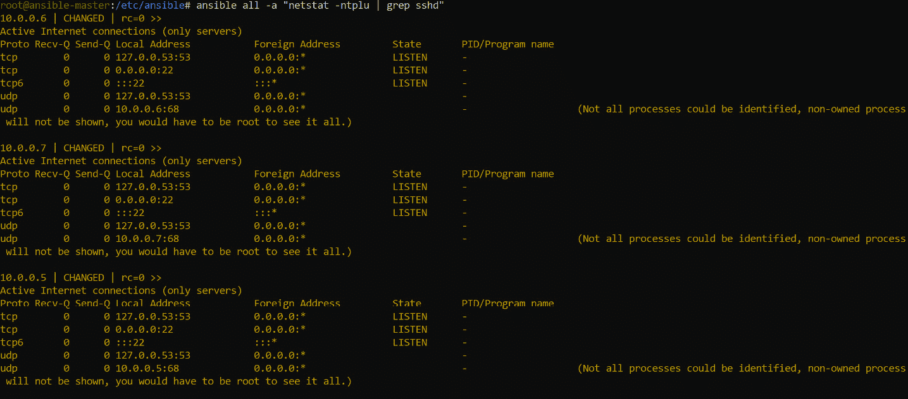

###### 图 8.2：运行 netstat 并使用 sshd 进行 grep

#### 注意

当运行`ansible all`命令时，你可能会收到弃用警告。为了抑制这个警告，在`ansible.cfg`中使用`deprecation_warnings=False`。

### Ansible Playbooks 和 Modules

使用临时命令是一种命令方法，不比只使用 SSH 客户端远程执行命令更好。

有两个组件，你需要将其变成真正的命令编排：一个 playbook 和一个模块。Playbook 是部署、配置和维护系统的基础。它可以编排一切，甚至在主机之间！Playbook 用于描述你想要达到的状态。Playbook 是用 YAML 编写的，可以用`ansible-playbook`命令执行：

```
ansible-playbook <filename>
```

第二个组件是模块。描述模块的最佳方式是：执行任务以达到期望的状态。它们也被称为任务插件或库插件。

所有可用的模块都有文档；你可以在网上和你的系统上找到文档。

要列出所有可用的插件文档，请执行以下命令：

```
ansible-doc -l
```

这会花一些时间。我们建议你将结果重定向到一个文件。这样，它会花费更少的时间，而且更容易搜索模块。

例如，让我们尝试创建一个 playbook，如果用户尚不存在，则使用**user**模块创建用户。换句话说，期望的状态是存在特定用户。

首先阅读文档：

```
ansible-doc user
```

在 Ansible 目录中创建一个文件，例如`playbook1.yaml`，内容如下。验证用户文档中的参数：

```
---
- hosts: all
  tasks:
  - name: Add user Jane Roe
    become: yes
    become_method: sudo
    user:
      state: present
      name: jane
      create_home: yes
      comment: Jane Roe
      generate_ssh_key: yes
      group: users
      groups:
        - sudo
        - adm
      shell: /bin/bash
      skeleton: /etc/skel
```

从输出中，您可以看到所有主机返回了`OK`，并且用户已创建：

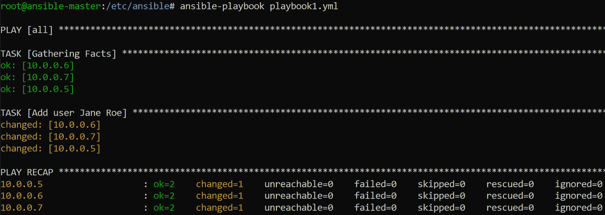

###### 图 8.3：运行 Ansible playbook

为了确保用户已创建，我们将检查所有主机上的`/etc/passwd`文件。从输出中，我们可以看到用户已经被创建：

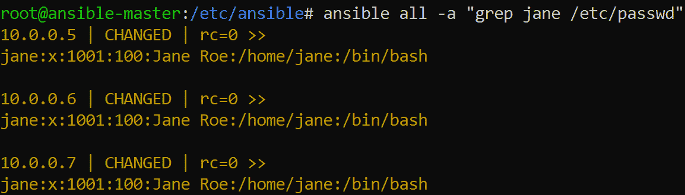

###### 图 8.4：使用/etc/passwd 验证用户创建

确保缩进正确，因为 YAML 在缩进和空格方面非常严格。使用支持 YAML 的编辑器，如 vi、Emacs 或 Visual Studio Code，确实有很大帮助。

如果需要运行命令特权提升，可以使用`become`和`become_method`或`-b`。

要检查 Ansible 语法，请使用以下命令：

```
ansible-playbook --syntax-check Ansible/example1.yaml
```

让我们继续看看如何在 Azure 进行身份验证并开始部署。

### 身份验证到 Microsoft Azure

要将 Ansible 与 Microsoft Azure 集成，您需要创建一个配置文件，为 Ansible 提供 Azure 的凭据。

凭据必须存储在您的主目录中的`~/.azure/credentials`文件中。首先，我们必须使用 Azure CLI 收集必要的信息。如下身份验证到 Azure：

```
az login
```

如果您成功登录，您将获得类似以下的输出：

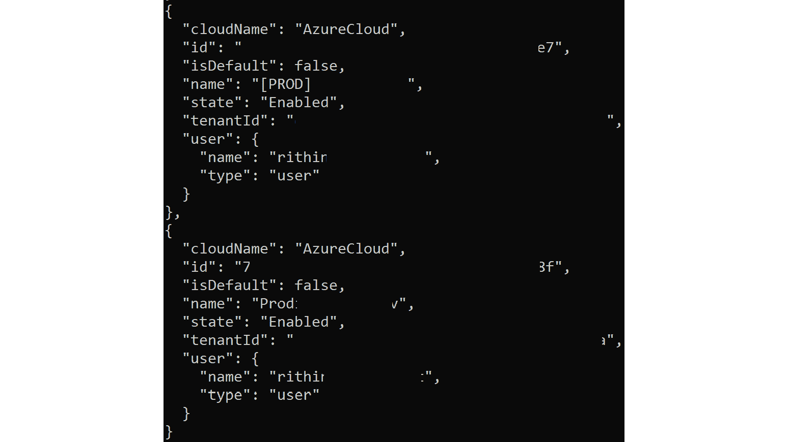

###### 图 8.5：使用 az 登录命令登录到 Azure

这已经是您需要的信息的一部分。如果您已经登录，请执行以下命令：

```
az account list
```

创建服务主体：

```
az ad sp create-for-rbac --name <principal> --password <password>
```

应用 ID 是您的`client_id`，密码是您的`secret`，将在我们即将创建的凭据文件中引用。

创建`~/.azure/credentials`文件，内容如下：

```
[default]
subscription_id=xxxxxxx-xxxx-xxxx-xxxx-xxxxxxxxxxxx 
client_id=xxxxxxx-xxxx-xxxx-xxxx-xxxxxxxxxxxx 
secret=xxxxxxxxxxxxxxxxx 
tenant=xxxxxxx-xxxx-xxxx-xxxx-xxxxxxxxxxxx 
```

使用`ansible-doc -l | grep azure`查找可用于 Azure 的 Ansible 模块。将内容重定向到文件以供参考。

### 资源组

让我们检查一切是否如预期那样工作。创建一个名为`resourcegroup.yaml`的新 playbook，内容如下：

```
---
- hosts: localhost
  tasks:
  - name: Create a resource group
    azure_rm_resourcegroup:
      name: Ansible-Group
      location: westus
```

请注意，主机指令是 localhost！执行 playbook 并验证资源组是否已创建：

```
az group show --name Ansible-Group
```

输出应该与以下非常相似：

```
{
 "id": "/subscriptions/xxxx/resourceGroups/Ansible-Group",
 "location": "westus",
 "managedBy": null,
 "name": "Ansible-Group",
 "properties": {
 "provisioningState": "Succeeded"
 },
 "tags": null
 }
```

### 虚拟机

让我们使用 Ansible 在 Azure 中创建一个虚拟机。为此，请创建一个`virtualmachine.yaml`文件，内容如下。检查每个块的`name`字段，以了解代码的作用：

```
- hosts: localhost
  tasks:
  - name: Create Storage Account
    azure_rm_storageaccount:
      resource_group: Ansible-Group
      name: ansiblegroupsa
      account_type: Standard_LRS
	 .
	 .
	 .	  - name: Create a CentOS VM
    azure_rm_virtualmachine:
      resource_group: Ansible-Group
      name: ansible-vm
      vm_size: Standard_DS1_v2
      admin_username: student
  admin_password:welk0mITG!
      image:
        offer: CentOS
        publisher: OpenLogic
        sku: '7.5'
        version: latest
```

考虑到代码的长度，我们只在这里展示了一小部分。您可以从本书的 GitHub 存储库中的`chapter 8`文件夹中下载整个`virtualmachine.yaml`文件。

在下面的截图中，您可以看到 Ansible 创建了 VM 所需的所有资源：

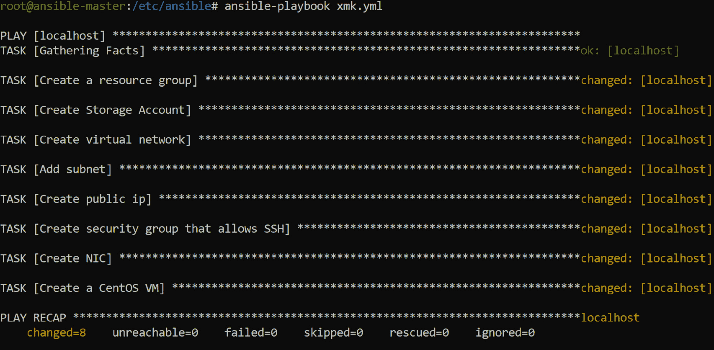

###### 图 8.6：使用 Ansible 创建 VM 所需的所有资源

您可以在 Ansible 的 Microsoft Azure 指南中找到使用 Ansible 部署 Azure VM 的完整示例（[`docs.ansible.com/ansible/latest/scenario_guides/guide_azure.html`](https://docs.ansible.com/ansible/latest/scenario_guides/guide_azure.html)）。

### Ansible 中的 Azure 清单管理

我们已经学会了两种在 Azure 中使用 Ansible 的方法：

+   在清单文件中使用 Ansible 连接到 Linux 机器。实际上，无论是在 Azure 中还是在其他地方运行都无关紧要。

+   使用 Ansible 管理 Azure 资源。

在本节中，我们将进一步进行。我们将使用动态清单脚本询问 Azure 在您的环境中运行了什么，而不是使用静态清单。

第一步是下载 Azure 的动态清单脚本。如果您不是 root 用户，请使用`sudo`执行：

```
cd /etc/ansible
wget https://raw.githubusercontent.com/ansible/ansible/devel/contrib/inventory/azure_rm.py
chmod +x /etc/ansible/azure_rm.py
```

编辑`/etc/ansible/ansible.cfg`文件并删除`inventory=/etc/ansible/hosts`行。

让我们进行第一步：

```
ansible -i /etc/ansible/azure_rm.py azure -m ping
```

它可能会因为身份验证问题而失败：

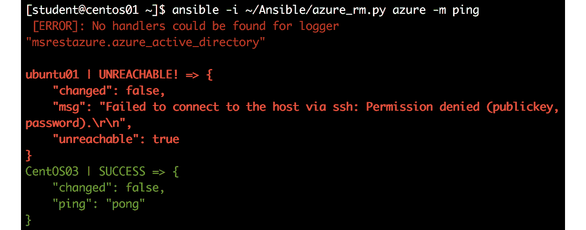

###### 图 8.7：由于身份验证问题导致主机连接失败

如果您对不同的 VM 有不同的登录，您可以始终在每个任务中使用用户指令。在这里，我们使用`azure`，这意味着所有 VM。您始终可以使用 VM 名称查询机器。例如，您可以使用用户凭据 ping`ansible-node3` VM：

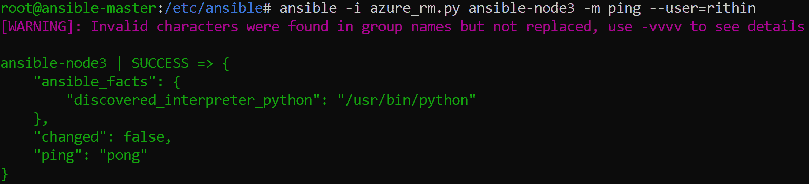

###### 图 8.8：查询 ansible-node3 VM

理想情况下，Ansible 希望您使用 SSH 密钥而不是密码。如果您想使用密码，可以使用`–extra-vars`并传递密码。请注意，为此您需要安装一个名为`sshpass`的应用程序。要通过 Ansible ping 使用密码的 Azure VM，请执行以下命令：

```
ansible -i azure_rm.py ansible-vm -m ping \
--extra-vars "ansible_user=<username> ansible_password=<password>"
```

让我们以前一个示例中使用 Ansible 创建的 VM 实例为例，其中用户名是`student`，密码是`welk0mITG!`。从屏幕截图中，您可以看到 ping 成功。您可能会看到一些警告，但可以安全地忽略它们。但是，如果 ping 失败，则需要进一步调查：

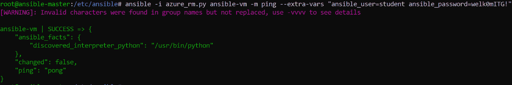

###### 图 8.9：发送 ping 给用户名 student

通过在与`azure_rm.py`目录相同的目录中创建一个`azure_rm.ini`文件，您可以修改清单脚本的行为。以下是一个示例`ini`文件：

```
[azure]
include_powerstate=yes
group_by_resource_group=yes
group_by_location=yes
group_by_security_group=yes
group_by_tag=yes
```

它的工作方式与`hosts`文件非常相似。`[azure]`部分表示所有 VM。您还可以为以下内容提供部分：

+   位置名称

+   资源组名称

+   安全组名称

+   标记键

+   标记键值

选择一个或多个 VM 的另一种方法是使用标记。要能够给 VM 打标记，您需要 ID：

```
az vm list --output tsv
```

现在，您可以给 VM 打标记：

```
az resource tag --resource-group <resource group> \
  --tags webserver --id </subscriptions/...>
```

您还可以在 Azure 门户中给 VM 打标记：

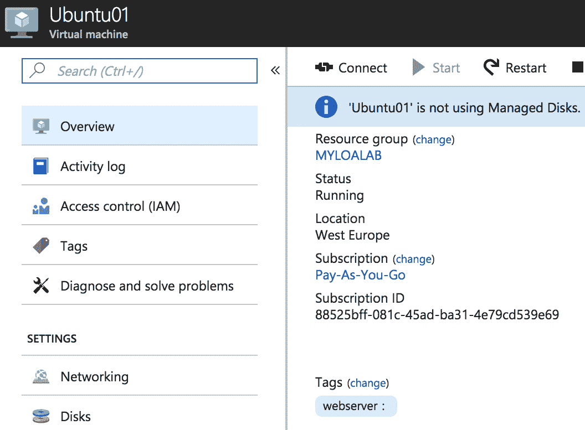

###### 图 8.10：在 Azure 门户中给 VM 打标记

单击**更改**并添加一个标记，带有或不带有值（您也可以使用该值来过滤该值）。要验证，请使用标记名称主机：

```
ansible -i /etc/ansible/azure_rm.py webserver -m ping
```

只有标记的 VM 被 ping。让我们为这个标记的 VM 创建一个 playbook，例如`/etc/ansible/example9.yaml`。标记再次在`hosts`指令中使用：

```
---
- hosts: webserver
  tasks:
  - name: Install Apache Web Server
    become: yes
    become_method: sudo
    apt:
      name: apache2
      install_recommends: yes
      state: present
      update-cache: yes
    when:
      - ansible_distribution == "Ubuntu"
      - ansible_distribution_version == "18.04"
```

执行 playbook：

```
ansible-playbook -i /etc/ansible/azure_rm.py /etc/ansible/example9.yaml
```

一旦 playbook 运行完毕，如果您检查 VM，您会看到 Apache 已安装。

如前所述，Ansible 并不是唯一的工具。还有另一个流行的工具叫做 Terraform。在下一节中，我们将讨论 Azure 上的 Terraform。

## 使用 Terraform

Terraform 是由 HashiCorp 开发的另一个**基础设施即代码**（**IaC**）工具。您可能想知道为什么它被称为 IaC 工具。原因是您可以使用代码定义基础设施的需求，而 Terraform 将帮助您部署它。Terraform 使用**HashiCorp 配置语言**（**HCL**）；但是，您也可以使用 JSON。Terraform 在 macOS、Linux 和 Windows 中都受支持。

Terraform 支持各种 Azure 资源，如网络、子网、存储、标记和 VM。如果您回忆一下，我们讨论了编写代码的命令式和声明式方式。Terraform 是声明式的，它可以维护基础设施的状态。一旦部署，Terraform 会记住基础设施的当前状态。

与每个部分一样，过程的第一部分涉及安装 Terraform。让我们继续进行 Terraform 的 Linux 安装。

### 安装

Terraform 的核心可执行文件可以从[`www.terraform.io/downloads.html`](https://www.terraform.io/downloads.html)下载，并且可以复制到添加到您的`$PATH`变量的目录之一。您还可以使用`wget`命令来下载核心可执行文件。要做到这一点，首先您必须从上述链接中找出 Terraform 的最新版本。在撰写本文时，最新版本为 0.12.16

现在我们已经有了版本，我们将使用以下命令使用`wget`下载可执行文件：

```
wget https://releases.hashicorp.com/terraform/0.12.17/terraform_0.12.17_linux_amd64.zip
```

ZIP 文件将被下载到当前工作目录。现在我们将使用解压工具来提取可执行文件：

```
unzip terraform_0.12.16_linux_amd64.zip
```

#### 注意

`unzip`可能不是默认安装的。如果它抛出错误，请使用`apt`或`yum`根据您使用的发行版进行安装`unzip`。

提取过程将为您获取 Terraform 可执行文件，您可以将其复制到`$PATH`中的任何位置。

要验证安装是否成功，您可以执行：

```
terraform --version
```

现在我们已经确认了 Terraform 已经安装，让我们继续设置 Azure 的身份验证。

### 连接到 Azure

有多种方法可以用来对 Azure 进行身份验证。您可以使用 Azure CLI、使用客户端证书的服务主体、服务主体和客户端密钥，以及许多其他方法。对于测试目的，使用`az`登录命令的 Azure CLI 是正确的选择。然而，如果我们想要自动化部署，这并不是一个理想的方法。我们应该选择服务主体和客户端密钥，就像我们在 Ansible 中所做的那样。

让我们从为 Terraform 创建一个服务主体开始。如果您已经为上一节创建了服务主体，请随意使用。要从 Azure CLI 创建一个新的服务主体，请使用以下命令：

```
az ad sp create-for-rbac -n terraform
```

此时，您可能已经熟悉了输出，其中包含`appID`、密码和租户 ID。

记下输出中的值，我们将创建变量来存储这个值：

```
export ARM_CLIENT_ID="<appID>"
export ARM_CLIENT_SECRET="<password>"
export ARM_SUBSCRIPTION_ID="<subscription ID>"
export ARM_TENANT_ID="<tenant ID>"
```

因此，我们已经将所有的值存储到变量中，这些值将被 Terraform 用于身份验证。由于我们已经处理了身份验证，让我们用 HCL 编写代码，以便在 Azure 中部署资源。

### 部署到 Azure

您可以使用任何代码编辑器来完成这个任务。由于我们已经在 Linux 机器上，您可以使用 vi 或 nano。如果您愿意，您也可以使用 Visual Studio Code，它具有 Terraform 和 Azure 的扩展，可以为您提供智能感知和语法高亮显示。

让我们创建一个 terraform 目录来存储我们所有的代码，在`terraform`目录中，我们将根据我们要部署的内容创建进一步的目录。在我们的第一个示例中，我们将使用 Terraform 在 Azure 中创建一个资源组。稍后，我们将讨论如何在这个资源组中部署一个 VM。

因此，要创建一个`terraform`目录，并在此目录中创建一个`resource-group`子文件夹，请执行以下命令：

```
mkdir terraform
cd terraform && mkdir resource-group
cd resource-group
```

接下来，创建一个包含以下内容的 main.tf 文件：

```
provider "azurerm" {
    version = "~>1.33"
}
resource "azurerm_resource_group" "rg" {
    name     = "TerraformOnAzure"
    location = "eastus"
}
```

代码非常简单。让我们仔细看看每个项目。

提供者指令显示我们想要使用`azurerm`提供者的 1.33 版本。换句话说，我们指示我们将使用 Terraform Azure 资源管理器提供者的 1.33 版本，这是 Terraform 可用的插件之一。

`resource`指令表示我们将部署一个`azurerm_resource_group`类型的 Azure 资源，具有`name`和`location`两个参数。

`rg`代表资源配置。每个模块中的资源名称必须是唯一的。例如，如果您想在同一个模板中创建另一个资源组，您不能再次使用`rg`，因为您已经使用过了；而是，您可以选择除`rg`之外的任何其他名称，比如`rg2`。

在使用模板开始部署之前，我们首先需要初始化项目目录，即我们的`resource-group`文件夹。要初始化 Terraform，请执行以下操作：

```
terraform init
```

在初始化期间，Terraform 将从其存储库下载`azurerm`提供程序，并显示类似以下的输出：

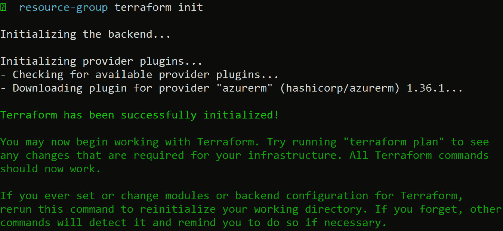

###### 图 8.11：初始化 Terraform 以下载 azurerm 提供程序

由于我们已经将服务主体详细信息导出到变量中，因此可以使用此命令进行部署：

```
terraform apply
```

此命令将连接 Terraform 到您的 Azure 订阅，并检查资源是否存在。如果 Terraform 发现资源不存在，它将继续创建一个执行计划以部署。您将获得以下截图中显示的输出。要继续部署，请键入`yes`：

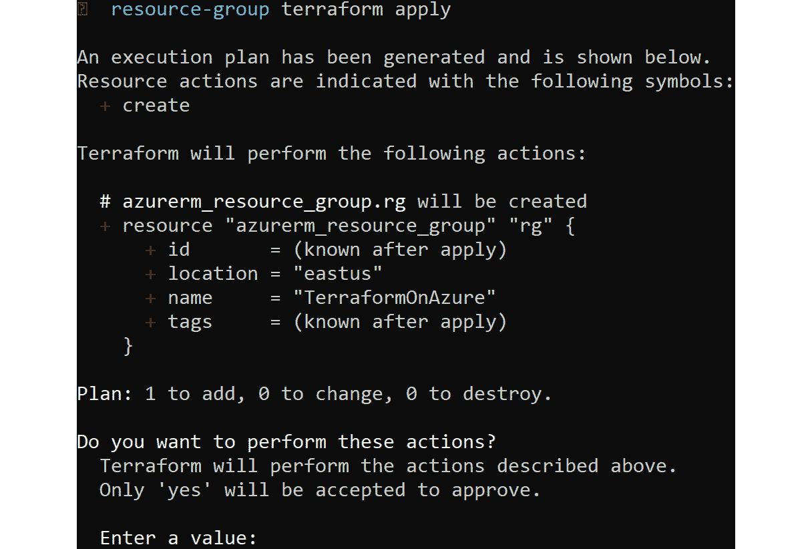

###### 图 8.12：连接 Terraform 到 Azure 订阅

一旦您提供了输入，Terraform 将开始创建资源。创建后，Terraform 将向您显示创建的所有内容的摘要以及添加和销毁的资源数量，如下所示：

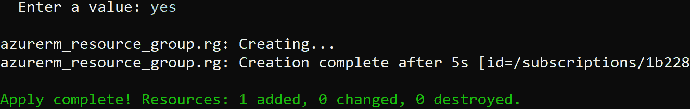

###### 图 8.13：创建的资源摘要

在我们初始化 Terraform 的项目目录中将生成一个名为`terraform.tfstate`的状态文件。该文件将包含状态信息，还将包含我们部署到 Azure 的资源列表。

我们已成功创建了资源组；在下一节中，我们将讨论如何使用 Terraform 创建 Linux VM。

### 部署虚拟机

在前面的示例中，我们创建了资源组，我们使用`azurerm_resource_group`作为要创建的资源。对于每个资源，都会有一个指令，例如对于 VM，它将是`azurerm_virtual_machine`。

此外，我们使用`terraform apply`命令创建了资源组。但是 Terraform 还提供了一种使用执行计划的方法。因此，我们可以先创建一个计划，看看将会做出什么更改，然后再部署。

首先，您可以返回到`terraform`目录并创建一个名为`vm`的新目录。为不同的项目单独创建目录总是一个好主意：

```
mkdir ../vm
cd ../vm
```

一旦您进入目录，您可以创建一个名为`main.tf`的新文件，其中包含以下代码块中显示的内容。使用添加的注释查看每个块的目的。考虑到代码的长度，我们显示了代码块的截断版本。您可以在本书的 GitHub 存储库的`第八章`文件夹中找到`main.tf`代码文件：

```
provider "azurerm" {
    version = "~>1.33"
}
#Create resource group
resource "azurerm_resource_group" "rg" {
    name     = "TFonAzure"
    location = "eastus"
}
.
.
.
#Create virtual machine, combining all the components we created so far
resource "azurerm_virtual_machine" "myterraformvm" {
    name                  = "tf-VM"
    location              = "eastus"
    resource_group_name   = azurerm_resource_group.rg.name
    network_interface_ids = [azurerm_network_interface.nic.id]
    vm_size               = "Standard_DS1_v2"
    storage_os_disk {
        name              = "tfOsDisk"
        caching           = "ReadWrite"
        create_option     = "FromImage"
        managed_disk_type = "Standard_LRS"
    }
    storage_image_reference {
        publisher = "Canonical"
        offer     = "UbuntuServer"
        sku       = "16.04.0-LTS"
        version   = "latest"
    }
    os_profile {
        computer_name  = "tfvm"
        admin_username = "adminuser"
        admin_password = "Pa55w0rD!@1234"
    }

    os_profile_linux_config {
    disable_password_authentication = false
  }
}
```

如果您查看`azurerm_virtual_network`部分，您会发现，我们没有写下资源名称，而是以`type.resource_configuration.parameter`的格式给出了一个引用。在这种情况下，我们没有写下资源组名称，而是给出了`azurerm_resource_group.rg.name`的引用。同样，在整个代码中，我们都采用了引用以使部署变得更加容易。

在开始部署规划之前，我们必须使用以下内容初始化项目：

```
terraform init
```

如前所述，我们将使用执行计划。要创建执行计划并将其保存到`vm-plan.plan`文件中，请执行：

```
terraform plan -out vm-plan.plan
```

您将收到很多警告；它们可以安全地忽略。确保代码没有显示任何错误。如果成功创建了执行计划，它将显示执行计划的下一步操作，如下所示：

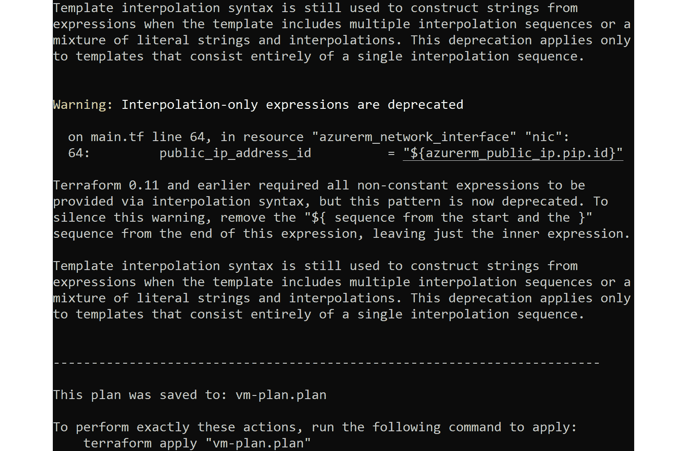

###### 图 8.14：显示执行计划

如输出所建议的，我们将执行：

```
terraform apply "vm-plan.plan"
```

现在，部署将开始，并显示正在部署的资源，已经经过了多少时间等等，如输出所示：

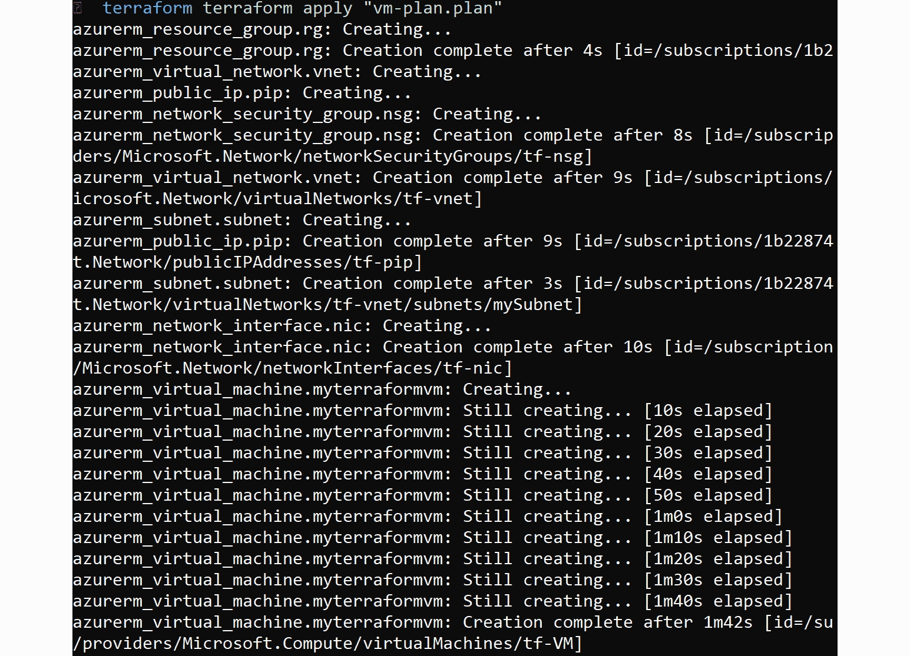

###### 图 8.15：资源部署详细信息

最后，Terraform 将提供部署的资源数量的摘要：

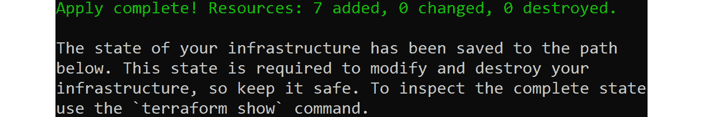

###### 图 8.16：部署的资源数量摘要

还有另一个命令，就是`show`命令。这将显示部署的完整状态，如下截图所示：

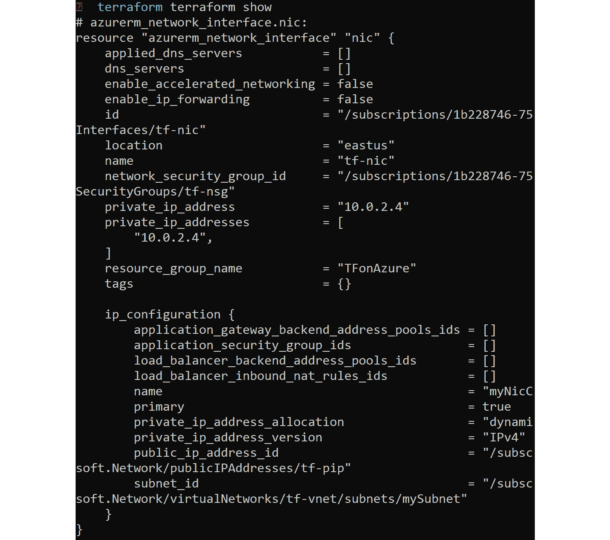

###### 图 8.17：显示部署的完整状态

我们编写了一小段代码，可以在 Azure 中部署一个 VM。但是，可以通过向代码添加许多参数来进行高级状态配置。所有参数的完整列表都可以在 Terraform 文档（[`www.terraform.io/docs/providers/azurerm/r/virtual_machine.html`](https://www.terraform.io/docs/providers/azurerm/r/virtual_machine.html)）和微软文档（[`docs.microsoft.com/en-us/azure/virtual-machines/linux/terraform-create-complete-vm`](https://docs.microsoft.com/en-us/azure/virtual-machines/linux/terraform-create-complete-vm)）中找到。

由于这些模板有点高级，它们将使用变量而不是重复的值。然而，一旦您习惯了这一点，您就会了解 Terraform 有多强大。

最后，您可以通过执行以下命令销毁整个部署或项目：

```
terraform destroy
```

这将删除项目的`main.tf`文件中提到的所有资源。如果您有多个项目，您必须导航到项目目录并执行`destroy`命令。执行此命令时，系统将要求您确认删除；一旦您说“是”，资源将被删除：

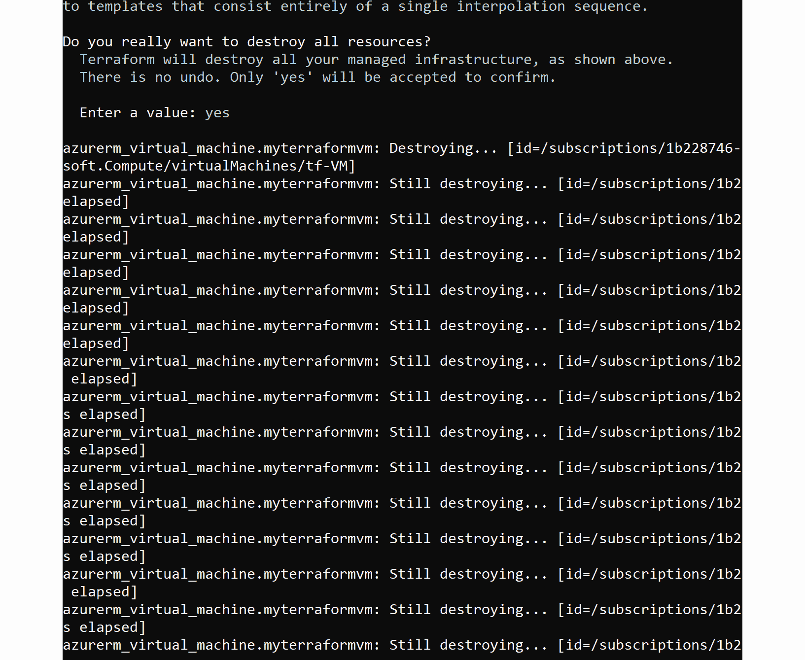

###### 图 8.18：使用 terraform destroy 命令删除所有资源

最后，您将得到一个摘要，如下所示：

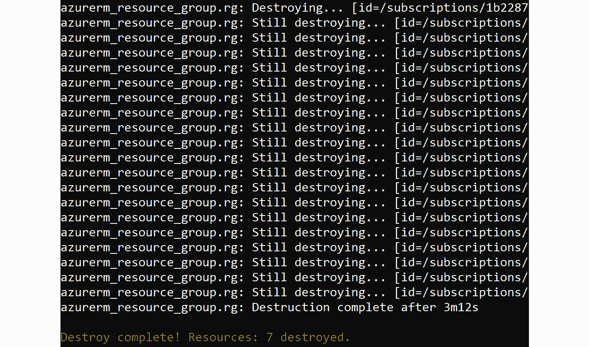

###### 图 8.19：被销毁资源的摘要

现在我们熟悉了在 Azure 上使用 Terraform 和部署简单的 VM。如今，由于 DevOps 的可用性和采用率，Terraform 正变得越来越受欢迎。 Terraform 使评估基础架构并重新构建它变得轻松无忧。

## 使用 PowerShell DSC

与 Bash 一样，PowerShell 是一个具有强大脚本功能的 shell。我们可能会认为 PowerShell 更像是一种脚本语言，可以用来执行简单的操作或创建资源，就像我们迄今为止所做的那样。但是，PowerShell 的功能远不止于此，还延伸到自动化和配置。

DSC 是 PowerShell 的一个重要但鲜为人知的部分，它不是用 PowerShell 语言自动化脚本，而是提供了 PowerShell 中的声明性编排。

如果将其与 Ansible 进行比较，对 Linux 的支持非常有限。但它非常适用于常见的管理任务，缺少的功能可以通过 PowerShell 脚本来补偿。微软非常专注于使其与 Windows Server 保持一致。一旦发生这种情况，它将被 PowerShell DSC Core 取代，这与他们以前使用 PowerShell | PowerShell Core 所做的非常相似。这将在 2019 年底完成。

另一个重要的注意事项是，由于某种原因，随 DSC 提供的 Python 脚本偶尔无法正常工作，有时会出现 401 错误甚至未定义的错误。首先确保您拥有最新版本的 OMI 服务器和 DSC，然后再试一次；有时，您可能需要尝试两到三次。

### Azure Automation DSC

使用 DSC 的一种方法是使用 Azure Automation DSC。这样，您就不必使用单独的机器作为控制节点。要使用 Azure Automation DSC，您需要一个 Azure Automation 帐户。

**自动化帐户**

在 Azure 门户中，选择左侧栏中的**所有服务**，导航到**管理+治理**，然后选择**自动化帐户**。创建一个自动化帐户，并确保选择**Run As Account**。

再次导航到**所有服务**，**管理工具**，然后选择**刚创建的帐户**：

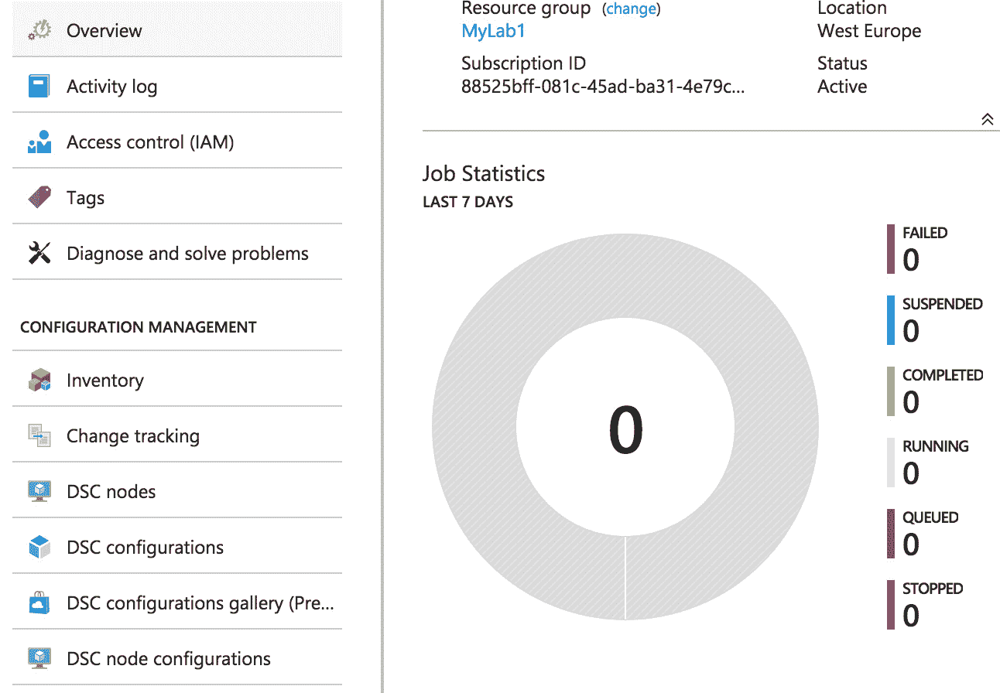

###### 图 8.20：在 Azure 门户中创建自动化帐户

在这里，您可以管理您的节点、配置等等。

请注意，此服务并非完全免费。流程自动化按作业执行分钟计费，而配置管理按受管节点计费。

要使用此帐户，您需要**Run As Account**的注册 URL 和相应的密钥。这两个值都可以在**帐户**和**密钥设置**下找到。

或者，在 PowerShell 中，执行以下命令：

```
Get-AzAutomationRegistrationInfo ' 
  -ResourceGroup <resource group> '
  -AutomationAccountName <automation account name>
```

Linux 有一个可用的 VM 扩展；这样，您可以部署 VM，包括它们的配置，完全编排。

有关更多信息，请访问[`github.com/Azure/azure-linux-extensions/tree/master/DSC`](https://github.com/Azure/azure-linux-extensions/tree/master/DSC)和[`docs.microsoft.com/en-us/azure/virtual-machines/extensions/dsc-linux`](https://docs.microsoft.com/en-us/azure/virtual-machines/extensions/dsc-linux)。

因为我们要使用 Linux 和 DSC，我们需要一个名为`nx`的 DSC 模块。该模块包含了 Linux 的 DSC 资源。在自动化帐户的设置中，选择`nx`并导入该模块。

### 在 Linux 上安装 PowerShell DSC

要在 Linux 上使用 PowerShell DSC，您需要 Open Management Infrastructure Service。支持的 Linux 发行版版本如下：

+   Ubuntu 12.04 LTS，14.04 LTS 和 16.04 LTS。目前不支持 Ubuntu 18.04。

+   RHEL/CentOS 6.5 及更高版本。

+   openSUSE 13.1 及更高版本。

+   SUSE Linux Enterprise Server 11 SP3 及更高版本。

该软件可在[`github.com/Microsoft/omi`](https://github.com/Microsoft/omi)下载。

在基于 Red Hat 的发行版上的安装如下：

```
sudo yum install \
  https://github.com/Microsoft/omi/releases/download/\
  v1.4.2-3/omi-1.4.2-3.ssl_100.ulinux.x64.rpm
```

对于 Ubuntu，您可以使用`wget`从 GitHub 存储库下载`deb`文件，并使用`dpkg`进行安装：

```
dpkg –i ./omi-1.6.0-0.ssl_110.ulinux.x64.deb 
```

#### 注意

确保下载与您的 SSL 版本匹配的文件。您可以使用`openssl version`命令来检查您的 SSL 版本。

安装后，服务会自动启动。使用以下命令检查服务的状态：

```
sudo systemctl status omid.service
```

要显示产品和版本信息，包括使用的配置目录，请使用以下命令：

```
/opt/omi/bin/omicli id
```

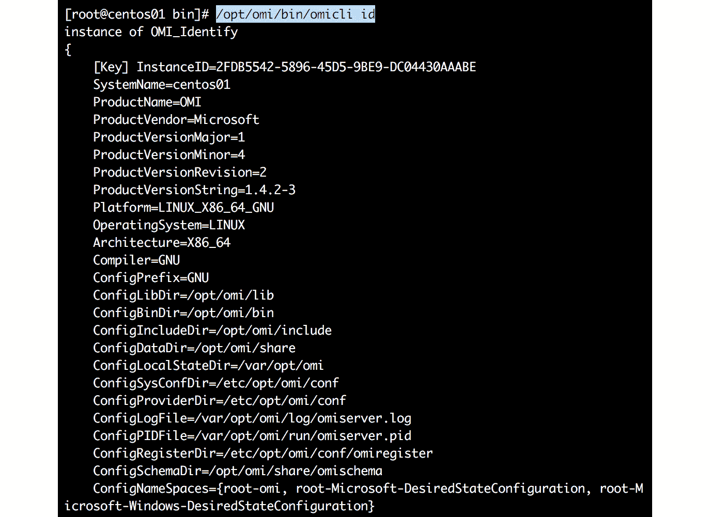

###### 图 8.21：显示产品和版本信息

### 创建期望状态

PowerShell DSC 不仅仅是一个带有参数的脚本或代码，就像在 Ansible 中一样。要开始使用 PowerShell DSC，您需要一个必须编译成**管理对象格式**（**MOF**）文件的配置文件。

但是，首先要做的是。让我们创建一个名为`example1.ps1`的文件，内容如下：

```
Configuration webserver {
Import-DscResource -ModuleName PSDesiredStateConfiguration,nx
Node "ubuntu01"{
    nxPackage apache2
    {
        Name = "apache2"
        Ensure = "Present"
        PackageManager = "apt"
    }
 }
}
webserver
```

让我们调查一下这个配置。正如所述，它与函数声明非常相似。配置得到一个标签，并在脚本末尾执行。必要的模块被导入，VM 的主机名被声明，配置开始。

### PowerShell DSC 资源

在这个配置文件中，使用了一个名为`nxPackage`的资源。有几个内置资源：

+   `nxArchive`：提供在特定路径解压归档（`.tar`，`.zip`）文件的机制。

+   `nxEnvironment`：管理环境变量。

+   `nxFile`：管理文件和目录。

+   `nxFileLine`：管理 Linux 文件中的行。

+   `nxGroup`：管理本地 Linux 组。

+   `nxPackage`：管理 Linux 节点上的软件包。

+   `nxScript`：运行脚本。大多数情况下，这是用来暂时切换到更命令式的编排方法。

+   `nxService`：管理 Linux 服务（守护进程）。

+   `nxUser`：管理 Linux 用户。

您还可以使用 MOF 语言、C#、Python 或 C/C++编写自己的资源。

您可以访问[`docs.microsoft.com/en-us/powershell/dsc/lnxbuiltinresources`](https://docs.microsoft.com/en-us/powershell/dsc/lnxbuiltinresources)来使用官方文档。

保存脚本并执行如下：

```
pwsh -file example1.ps
```

脚本的结果是创建一个与配置名称相同的目录。其中，有一个以 MOF 格式的 localhost 文件。这是用于描述 CIM 类的语言（**CIM**代表**通用信息模型**）。CIM 是用于管理完整环境（包括硬件）的开放标准。

我们认为这个描述足以理解为什么微软选择了这个模型和相应的编排语言文件！

您还可以将配置文件上传到 Azure，在**DSC Configurations**下。按下**Compile**按钮在 Azure 中生成 MOF 文件。

**在 Azure 中应用资源**

如果需要，您可以使用`/opt/microsoft/dsc/Scripts`中的脚本在本地应用所需的状态，但在我们看来，这并不像应该那样容易。而且，因为本章是关于 Azure 中的编排，我们将直接转向 Azure。

注册虚拟机：

```
sudo /opt/microsoft/dsc/Scripts/Register.py \
  --RegistrationKey <automation account key> \
  --ConfigurationMode ApplyOnly \
  --RefreshMode Push --ServerURL <automation account url>
```

再次检查配置：

```
sudo /opt/microsoft/dsc/Scripts/GetDscLocalConfigurationManager.py
```

现在，节点在**Automation Account**设置下的**DSC Nodes**窗格中可见。现在，您可以链接上传和编译的 DSC 配置。配置已应用！

另一种方法是使用**Add Node**选项，然后选择 DSC 配置。

总之，PowerShell DSC 的主要用例场景是编写、管理和编译 DSC 配置，以及导入和分配这些配置到云中的目标节点。在使用任何工具之前，您需要了解用例场景以及它们如何适用于您的环境以实现目标。到目前为止，我们一直在配置虚拟机；接下来的部分将介绍如何使用 Azure 策略来审计 Linux 虚拟机内部的设置。

## Azure 策略客户端配置

策略主要用于资源的治理。Azure 策略是 Azure 中的一个服务，您可以在其中创建、管理和分配策略。这些策略可用于审计和合规性。例如，如果您在东部美国位置托管一个安全的应用程序，并且希望仅限制在东部美国的部署，可以使用 Azure 策略来实现这一点。

假设您不希望在订阅中部署 SQL 服务器。在 Azure 策略中，您可以创建一个策略并指定允许的服务，只有它们可以在该订阅中部署。请注意，如果您将策略分配给已经存在资源的订阅，Azure 策略只能对分配后创建的资源进行操作。但是，如果任何现有资源在分配前不符合策略，它们将被标记为“不合规”，因此管理员可以在必要时进行更正。此外，Azure 策略只会在部署的验证阶段生效。

一些内置策略包括：

+   允许的位置：使用此功能，您可以强制执行地理合规性。

+   允许的虚拟机 SKU：定义一组虚拟机 SKU。

+   向资源添加标签：向资源添加标签。如果没有传递值，它将采用默认的标签值。

+   强制执行标签及其值：用于强制执行对资源所需的标签及其值。

+   不允许的资源类型：防止部署选定的资源。

+   允许的存储帐户 SKU：我们在上一章中讨论了可用于存储帐户的不同 SKU，如 LRS、GRS、ZRS 和 RA-GRS。您可以指定允许的 SKU，其余的将被拒绝部署。

+   允许的资源类型：正如我们在示例中提到的，您可以指定订阅中允许的资源。例如，如果您只想要 VM 和网络，您可以接受**Microsoft.Compute**和**Microsoft.Network**资源提供程序；所有其他提供程序都不允许部署。

到目前为止，我们已经讨论了 Azure Policy 如何用于审计 Azure 资源，但它也可以用于审计 VM 内部的设置。Azure Policy 通过使用 Guest Configuration 扩展和客户端来完成这项任务。扩展和客户端共同确认了客户操作系统的配置、应用程序的存在、状态以及客户操作系统的环境设置。

Azure Policy Guest Configuration 只能帮助您审计客户 VM。在撰写本文时，不支持应用配置。

### Linux 的 Guest Configuration 扩展

客户策略配置由 Guest Configuration 扩展和代理完成。VM 上的 Guest Configuration 代理通过使用 Linux 的 Guest Configuration 扩展进行配置。正如前面讨论的，它们共同工作，允许用户在 VM 上运行客户策略，从而帮助用户审计 VM 上的策略。Chef InSpec ([`www.inspec.io/docs/`](https://www.inspec.io/docs/))是 Linux 的客户策略。让我们看看如何将扩展部署到 VM 并使用扩展支持的命令。

**部署到虚拟机**

要做到这一点，您需要有一个 Linux VM。我们将通过执行以下操作将 Guest Configuration 扩展部署到 VM。

```
az vm extension set --resource-group <resource-group> \
--vm-name <vm-name> \
--name ConfigurationForLinux \
--publisher Microsoft.GuestConfiguration \
--version 1.9.0
```

您将获得类似于此的输出：

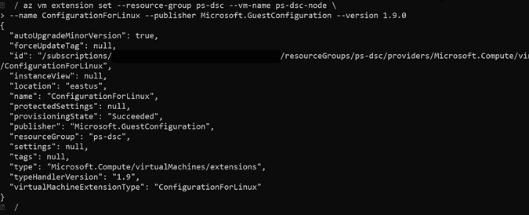

###### 图 8.22：将 Guest Configuration 扩展部署到 VM

### 命令

Guest Configuration 扩展支持`install`、`uninstall`、`enable`、`disable`和`update`命令。要执行这些命令，您需要切换当前工作目录到`/var/lib/waagent/Microsoft.GuestConfiguration.ConfigurationForLinux-1.9.0/bin`。之后，您可以使用`guest-configuration-shim`脚本链接可用的命令。

#### 注意

检查文件是否启用了执行位。如果没有，使用`chmod +x guest-configuration-shim`来设置执行权限。

执行任何命令的一般语法是`./guest-configuration-shim <command name>`。

例如，如果您想要安装 Guest Configuration 扩展，可以使用`install`命令。当扩展已安装时，将调用`enable`，这将提取代理程序包，安装并启用代理程序。

类似地，`update`将更新代理服务到新代理，`disable`禁用代理，最后，`uninstall`将卸载代理。

代理程序下载到路径，例如`/var/lib/waagent/Microsoft.GuestConfiguration.ConfigurationForLinux-<version>/GCAgent/DSC`，并且`agent`输出保存在此目录中的`stdout`和`stderr`文件中。如果遇到任何问题，请验证这些文件的内容。尝试理解错误，然后进行故障排除。

日志保存在`/var/log/azure/Microsoft.GuestConfiguration.ConfigurationForLinux`。您可以使用这些日志来调试问题。

目前，Azure Policy Guest Configuration 支持以下操作系统版本：

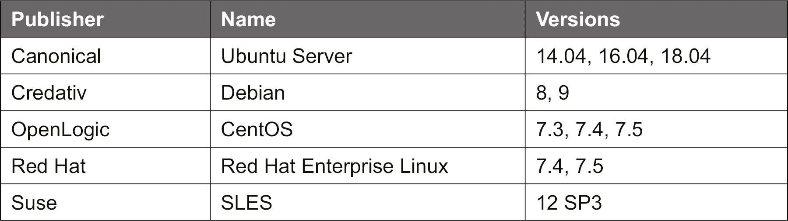

###### 图 8.23：Azure Policy Guest Configuration 支持的操作系统版本

Azure 策略以 JSON 清单的形式编写。编写策略不是本书的一部分；您可以参考 Microsoft 共享的示例策略（[`github.com/MicrosoftDocs/azure-docs/blob/master/articles/governance/policy/samples/guest-configuration-applications-installed-linux.md`](https://github.com/MicrosoftDocs/azure-docs/blob/master/articles/governance/policy/samples/guest-configuration-applications-installed-linux.md)）。此示例用于审计 Linux VM 中是否安装了特定应用程序。

如果您调查示例，您将了解组件是什么，以及如何在您的上下文中使用参数。

## 其他解决方案

编排市场中的另一个重要参与者是 Puppet。直到最近，Puppet 在 Azure 中的支持非常有限，但这种情况正在迅速改变。Puppet 模块`puppetlabs/azure_arm`仍然处于起步阶段，但`puppetlabs/azure`为您提供了所需的一切。这两个模块都需要 Azure CLI 才能工作。将 Azure CLI 集成到其商业 Puppet Enterprise 产品中的工作非常出色。Azure 有一个 VM 扩展，可用于将成为 Puppet 节点的 VM。

更多信息请访问[`puppet.com/products/managed-technology/microsoft-windows-azure`](https://puppet.com/products/managed-technology/microsoft-windows-azure)。

您还可以选择 Chef 软件，它提供了一个自动化和编排平台，已经存在很长时间了。它的开发始于 2009 年！用户编写“食谱”，描述 Chef 如何使用诸如刀具之类的工具管理“厨房”。在 Chef 中，许多术语都来自厨房。Chef 与 Azure 集成非常好，特别是如果您从 Azure Marketplace 使用 Chef Automate。还有一个 VM 扩展可用。Chef 适用于大型环境，学习曲线相对陡峭，但至少值得一试。

更多信息请访问[`www.chef.io/partners/azure/`](https://www.chef.io/partners/azure/)。

## 总结

我们从简要介绍编排、使用编排的原因以及不同的方法：命令式与声明式开始了本章。

之后，我们介绍了 Ansible、Terraform 和 PowerShell DSC 平台。关于以下内容涵盖了许多细节：

+   如何安装平台

+   在操作系统级别处理资源

+   与 Azure 集成

Ansible 是迄今为止最完整的解决方案，也可能是学习曲线最平缓的解决方案。但是，所有解决方案都非常强大，总是有办法克服它们的局限性。对于所有编排平台来说，未来在功能和能力方面都是充满希望的。

在 Azure 中创建 Linux VM 并不是在 Azure 中创建工作负载的唯一方法；您还可以使用容器虚拟化来部署应用程序的平台。在下一章中，我们将介绍容器技术。

## 问题

在本章中，让我们跳过常规问题。启动一些 VM 并选择您选择的编排平台。配置网络安全组以允许 HTTP 流量。

尝试使用 Ansible、Terraform 或 PowerShell DSC 配置以下资源：

1.  创建用户并将其设置为`wheel`组（基于 RH 的发行版）或`sudo`（Ubuntu）的成员。

1.  安装 Apache Web 服务器，从`/wwwdata`提供内容，使用 AppArmor（Ubuntu）或 SELinux（基于 RHEL 的发行版）进行安全保护，并在此 Web 服务器上提供一个漂亮的`index.html`页面。

1.  将 SSH 限制为您的 IP 地址。HTTP 端口必须对整个世界开放。您可以通过提供覆盖文件或 FirewallD 来使用 systemd 方法。

1.  部署一个新的 VM，选择您喜欢的发行版和版本。

1.  使用变量创建新的`/etc/hosts`文件。如果您使用 PowerShell DSC，您还需要 PowerShell 来完成此任务。对于专家：使用资源组中其他计算机的主机名和 IP 地址。

## 进一步阅读

我们真的希望你喜欢这个对编排平台的介绍。这只是一个简短的介绍，让你对更多的学习产生好奇。本章提到的编排工具的所有网站都是很好的资源，阅读起来很愉快。

还有一些额外的资源需要提到，包括以下内容：

+   詹姆斯·波格兰的《学习 PowerShell DSC-第二版》。

+   Ansible：我们确实认为 Russ McKendrick 的《学习 Ansible》以及同一作者关于 Ansible 的其他书籍都值得赞扬。如果你懒得读这本书，那么你可以参考 Ansible 的文档开始学习。如果你想要一些实践教程，你可以使用这个 GitHub 仓库：[`github.com/leucos/ansible-tuto`](https://github.com/leucos/ansible-tuto)。

+   Terraform：**在 Microsoft Azure 上使用 Terraform-第一部分：介绍**是由微软高级软件工程师 Julien Corioland 撰写的博客系列。该博客包括一系列讨论 Azure 上 Terraform 的主题。值得一读并尝试这些任务。博客地址为[`blog.jcorioland.io/archives/2019/09/04/terraform-microsoft-azure-introduction.html`](https://blog.jcorioland.io/archives/2019/09/04/terraform-microsoft-azure-introduction.html)。

+   Mayank Joshi 的《精通 Chef》

+   Jussi Heinonen 的《学习 Puppet》
