# 第十章：使用 Azure Kubernetes 服务。

在上一章中，我们探索了容器虚拟化的世界，特别是 Docker 容器。本章是关于使用**Azure Kubernetes 服务**（**AKS**）管理容器化工作负载的。

本章与本书中的所有其他章节都不同。到目前为止，每一章都是关于基础设施和提供平台：经典的云系统管理员。甚至*第九章*，*Azure 中的容器虚拟化*，也包含诸如“我们如何安装 Docker？”和“我们如何让容器运行起来？”的问题。本章将回答以下问题：

+   我们在开发阶段和之后如何部署和管理我们的工作负载？

+   我们如何进行扩展/缩减？

+   可用性选项是什么？

Kubernetes 为所有这些问题提供了重要的答案。它是一个解决方案，用于自动化重要任务，如部署、管理、扩展、网络和容器化应用程序的可用性管理。

Kubernetes 最初是由 Google 设计的，现在由 Cloud Native Computing Foundation（[`www.cncf.io`](https://www.cncf.io)）维护。微软是这个基金会的重要合作伙伴，并且在金钱和代码方面是 Kubernetes 项目的重要贡献者。实际上，Kubernetes 的联合创始人之一 Brendan Burns 就在微软工作，并领导着在微软内部从事容器编排工作的团队。此外，微软还启动了几个针对 Kubernetes 的开源项目，提供了额外的工具。

由于微软在 Kubernetes 中的重要参与，它能够在 Azure 中实现一个完全与上游兼容的 Kubernetes 版本。这对开发人员也很重要，因此他们可以使用本地 Kubernetes 安装来开发软件，当开发完成后，将其发布到 Azure 云。

AKS 为 Kubernetes 提供了一个完全托管的容器即服务解决方案。这意味着您不必考虑 Kubernetes 软件的配置、管理和升级。控制平面由 Azure 管理。

AKS 使得在 Azure 中部署和管理 Kubernetes 变得容易：它可以处理从供应到保持应用程序最新和根据您的需求进行扩展的完整维护过程。

甚至在不中断的情况下升级 Kubernetes 集群的过程也可以通过 AKS 完成。

最后但同样重要的是，监控对于 Kubernetes 集群的每个部分都是可用的。

在本章结束时，您将能够：

+   解释 Kubernetes 和 AKS 是什么。

+   使用 AKS 来部署和管理您的集群。

+   在 AKS 中维护应用程序的完整生命周期。

因此，在我们实际开始使用 AKS 之前，让我们首先了解技术要求是什么。

## 技术要求

正如本章介绍中所述，本章与所有其他章节都不同，这影响了技术要求。到目前为止，技术要求很简单：你只需要一堆虚拟机。

本章需要一个 DevOps 环境，在这个环境中，开发人员和运维人员在同一个团队中紧密合作，还有一个人既做开发又做运维相关的任务。

还必须做出选择：我们在哪里开发？本地还是在 Azure 云中？两者都可以，而且不应该有任何区别！从成本的角度来看，最好在工作站上进行。在本章中，假设您是在本地进行开发。因此，您需要一个工作站（或虚拟机）。我们需要以下内容：

+   Azure CLI。

+   Docker 和构建工具。

+   Kubernetes。

+   一些基本的开发人员工具，比如 Git。

+   一些其他工具，比如稍后介绍的 Helm。

+   一个很好的**集成开发环境**（**IDE**）。我们推荐使用 Microsoft **Visual Studio**（**VS**）Code 以及 Docker 和 Kubernetes 的 Microsoft 扩展（仅当有图形界面时；否则使用 Nano 编辑器）。

+   可选地，可以使用诸如 Ansible 之类的编排工具。请查看 Ansible `azure_rm_aks`和`8ks_raw`模块。

### 使用 WSL 和 VS Code

您可以使用**Windows 子系统**（**WSL**）和 VS Code 以及 VS Code 远程 WSL 扩展，在 Windows 桌面或笔记本电脑上获得 Linux 开发环境，而无需使用虚拟机。这将使您能够从 PowerShell 或 CMD 访问 Linux 文件，并从 Bash 访问 Windows 文件。VS Code 是一个可以在各种平台上运行并支持许多语言的源代码编辑器。您可以使用 WSL 和 VS Code 从您喜欢的 Windows 平台开发、运行和调试基于 Linux 的应用程序。可以使用 PowerShell 启用 WSL 功能，并从 Microsoft Store 安装 Linux。VS Code 适用于 Windows 和 Linux，并可从[`code.visualstudio.com/`](https://code.visualstudio.com/)下载。由于 VS Code 的配置设置在 Windows 和 Linux 平台上都是保持一致的，因此您可以轻松地在 Windows 和 Linux 之间切换。

您可以在[`docs.microsoft.com/en-us/learn/modules/get-started-with-windows-subsystem-for-linux/`](https://docs.microsoft.com/en-us/learn/modules/get-started-with-windows-subsystem-for-linux/)找到 WSL 的逐步教程，并在[`docs.microsoft.com/en-us/windows/wsl/install-win10`](https://docs.microsoft.com/en-us/windows/wsl/install-win10)找到详细的安装指南。在 Windows 上运行时，您可以配置默认 shell 并在 PowerShell 和 WSL 之间进行选择，在 Linux 上可以选择 Zsh 或 Bash。

### 安装依赖项

我们将使用 Ubuntu 18.04 LTS 桌面版。但是您也可以在 Azure 虚拟机中使用 Ubuntu 18.04 LTS 服务器。有了其他章节中获得的所有知识，很容易将我们将要做的事情转移到其他 Linux 发行版、macOS 甚至 Windows 上：

1.  首先，升级 Ubuntu：

```
sudo apt update &&sudo apt upgrade
```

1.  安装开发人员工具，包括其他一些依赖项和`openssh`：

```
sudo apt install build-essential git curl openssh-server \
ebtablesethtoolsocat
```

1.  首先，我们将安装 Azure CLI。

您可以通过运行单个命令安装 Azure CLI：

```
curl -sL https://aka.ms/InstallAzureCLIDeb | sudo bash 
```

或者，您可以使用以下说明进行手动安装。

获取所需的软件包：

```
sudo apt-get install ca-certificates curl apt-transport-https lsb-release gnupg
```

获取并安装签名密钥：

```
curl -sL https://packages.microsoft.com/keys/microsoft.asc | gpg --dearmor | 
sudo tee /etc/apt/trusted.gpg.d/microsoft.asc.gpg> /dev/null
sudo apt-add-repository \
  https://packages.microsoft.com/repos/azure-cli
curl -L https://packages.microsoft.com/keys/microsoft.asc \
  | sudo apt-key add -
sudo apt update 
sudo apt install azure-cli
```

1.  要安装 PowerShell 和 VS Code，我们使用的是 snaps，这是类似于 Windows 上的便携式应用程序的通用软件包：

```
sudo snap install --classic powershell
sudo snap install --classic vscode
```

或者，您可以使用以下命令安装 PowerShell Core：

```
curl https://packages.microsoft.com/keys/microsoft.asc | sudo apt-key add -
curl https://packages.microsoft.com/config/ubuntu/18.04/prod.list | sudo tee /etc/apt/sources.list.d/microsoft.list
sudo apt update
sudo apt install -y powershell
```

1.  键入`pwsh`以启动 PowerShell Core：

```
admin123@kubes:~$ pwsh
```

如果 PowerShell Core 成功启动，您将获得以下输出：

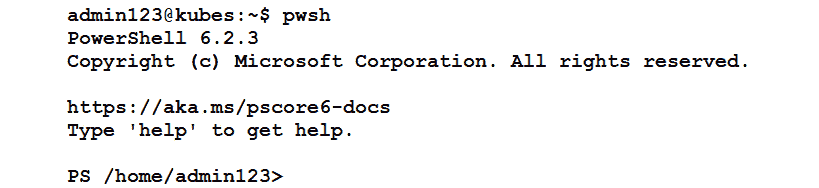

###### 图 10.1：启动 PowerShell Core

1.  安装 Azure 的 Azure cmdlet：

```
sudo pwsh -Command "Install-Module PowerShellGet -Force"
sudo pwsh -Command "Install-Module -Name AzureRM.Netcore \
 -AllowClobber"
sudo chown -R $USER ~/.local/
```

1.  安装 Docker：

```
curl -sSL https://get.docker.com/ | sudo sh
sudo usermod -aG docker $USER
```

您将获得 Docker 版本详细信息如下：

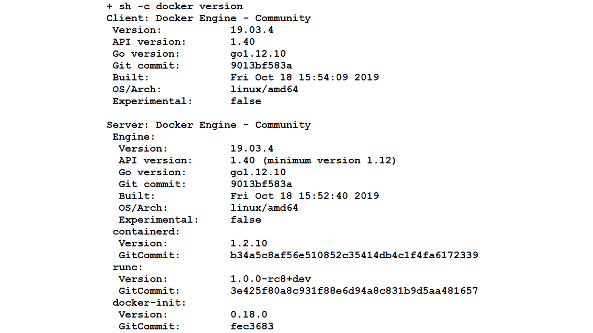

###### 图 10.2：Docker 版本详细信息

1.  暂时停止 Docker：

```
Sudo systemctl stop docker.service
```

### kubectl 安装

kubectl 是一个命令行界面，可用于管理 Kubernetes 集群。它可用于许多操作。例如，使用`kubectl create`创建一个或多个文件，并使用`kubectl delete`从文件中删除资源。我们将使用 Azure CLI 来安装`kubectl`，并以 root 身份执行以下命令以授予所需的权限：

```
sudo -i
az login
az aks install-cli
```

首先，您需要使用以下命令下载最新版本：

```
curl -LO https://storage.googleapis.com/kubernetes-release/release/v1.16.3/bin/linux/amd64/kubectl
```

接下来，使其可执行：

```
chmod +x ./kubectl
```

现在，将其移动到您的`PATH`：

```
Sudo mv ./kubectl /usr/local/bin/kubectl
```

通过请求版本信息来验证安装：

```
kubectl version
```

要启用自动补全，可以为 Bash 和 Zsh 在`kubectl`中执行以下命令：

```
kubectl completion bash > ~/.kube/completion.bash.inc
printf"
 # Kubectl shell completion
 source '$HOME/.kube/completion.bash.inc'
">> $HOME/.bash_profile
source $HOME/.bash_profile
```

对于 Zsh，请执行以下命令：

```
sudo -i
kubectl completion zsh>"${fpath[1]}/_kubectl"
exit
source <(kubectl completion zsh)
```

到目前为止，我们已经使用`curl`命令在 Linux 上安装了最新版本的 kubectl 二进制文件，并启用了 kubectl 的 shell 自动补全。现在我们准备使用 AKS 了。

#### 注意

如果你使用 kubectl 时收到类似`Error from server (NotAcceptable): unknown (get nodes)`的错误消息，使用`https://dl.k8s.io/v1.10.6/kubernetes-client-linux-amd64.tar.gz`降级你的客户端。

尽管这完全超出了本书的范围，但我们个人喜欢使用 Zsh shell，并使用一个名为 Spaceship 的漂亮定制。提示符可以让你更清楚地了解你在哪里以及在处理 AKS 时在做什么。

这是快速安装： 

```
sudo apt install zshnpm fonts-powerline
zsh # and create a .zshrc file with option 0 
npm install spaceship-prompt
chsh -s /bin/zsh
```

## 开始使用 AKS

Azure AKS 使得部署和管理容器应用变得容易。你可以快速定义、部署和调试 Kubernetes 应用程序，还可以使用 Azure AKS 自动将应用程序容器化。你可以自动化监控、升级、修复和扩展，从而减少手动基础设施维护。安装了 kubectl 后，现在是时候在 Azure 中设置和探索 Kubernetes 环境了：

1.  创建一个集群。

1.  查找有关集群的信息。

1.  部署一个简单的工作负载。

### 使用 Azure CLI 创建一个集群

在 Kubernetes 中，我们将使用集群。一个集群包含一个主节点或控制平面，它控制着一切，以及一个或多个工作节点。在 Azure 中，我们不需要关心主节点，只需要关心节点。

为了本章的目的，最好为其创建一个新的资源组：

```
az group create --location eastus--name MyKubernetes
```

在这个资源组中，我们将部署我们的集群：

```
az aks create --resource-group MyKubernetes \
  --name Cluster01 \
  --node-count 1 --generate-ssh-keys 
```

这个命令可能需要长达 10 分钟的时间。一旦你收到提示，用以下方法验证一下：

```
az aks list
```

在输出中，你会找到很多信息，比如完全合格的域名，集群的名称等等：

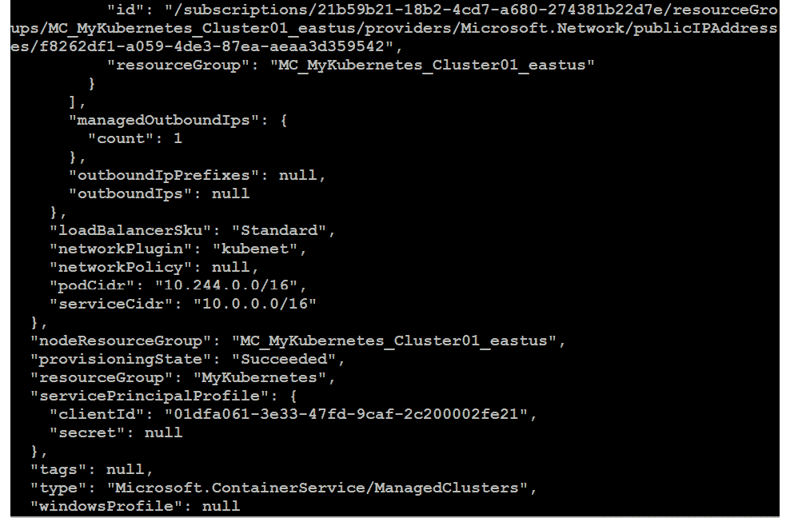

###### 图 10.3：部署集群的详细信息

有一个名为 Kubernetes Dashboard 的 Web 界面可供使用，你可以用它来访问集群。要使其可用，执行以下操作：

```
az aks browse --name Cluster01 --resource-group MyKubernetes
```

将你的浏览器指向`http://127.0.0.1:8001`：

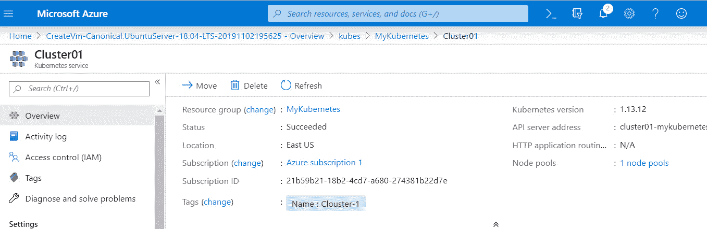

###### 图 10.4：Kubernetes Dashboard

`az`实用程序正在将门户隧道传输到你的本地主机。按*Ctrl* + *C*退出隧道。

为了能够使用`kubectl`实用程序，我们需要将配置合并到本地配置文件中：

```
az aks get-credentials --resource-group MyKubernetes \
 --name Cluster01
```

上述命令的输出如下：

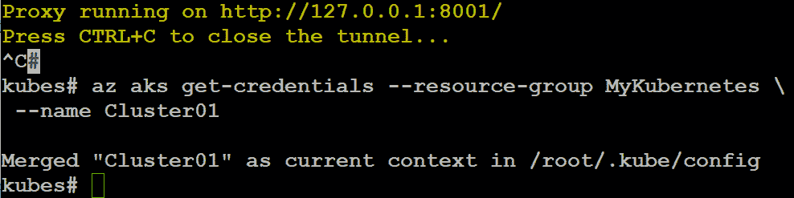

###### 图 10.5：将配置合并到本地配置文件

由于我们时髦的命令提示符，你可以看到我们从本地 Kubernetes 集群切换到了 Azure 中的集群。要查看可用的集群，执行以下操作：

```
kubectl config get-contexts
```

上述命令的输出如下：

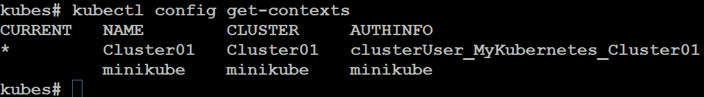

###### 图 10.6：查看可用的集群

你可以使用`kubectl config use-context <cluster>`切换到另一个集群。

你也可以使用`kubectl`找到有关你的集群的信息：

```
kubectl cluster-info
```

上述命令的输出如下：

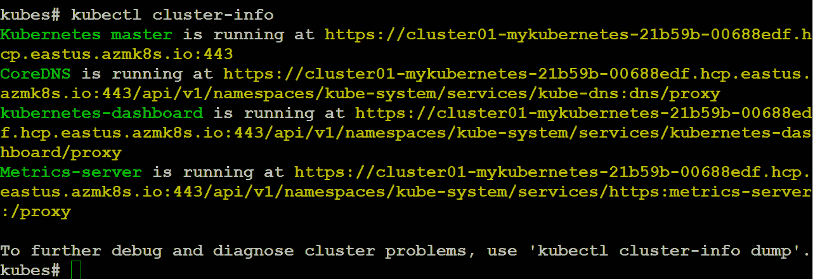

###### 图 10.7：有关集群的信息

我们在这里创建了一个名为`Cluster01`的 Kubernetes 集群，使用了`az aks create`命令。现在让我们列出节点，这些节点是 Kubernetes 的工作机器，并由主节点管理：

```
kubectl get nodes
```

上述命令的输出如下：

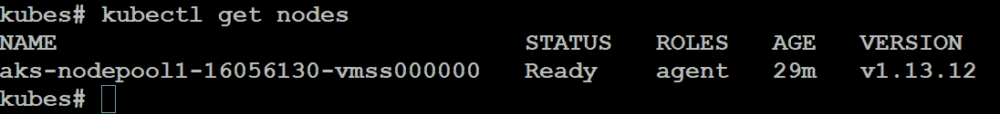

###### 图 10.8：列出节点

### 在 AKS 中的第一个部署

AKS 允许您构建和部署应用程序到托管的 Kubernetes 集群中，该集群管理容器化应用程序的连接和可用性。您可以使用简单的 `kubectl create` 命令在 AKS 中部署 Docker 容器：

```
Kubectl createnginx --image=nginx --port=80
```

几秒钟内，会出现消息：`deployment.apps/nginx created`。

使用以下命令验证部署：

```
kubectl get deployment
```

上述命令的输出如下：


###### 图 10.9：验证镜像部署

当我们执行 `run` 命令时，Docker 容器被部署到了集群中。更具体地说，一个 pod 被创建，并在其中运行容器。一个 pod 是一组共享资源的容器，比如存储和网络资源，它还包含了如何运行容器的规范。要查看创建的 pod，请执行以下命令：

```
kubectl get pods
```

上述命令的输出返回了 pod 名称、pod 状态（运行中、挂起、成功、失败或未知）、重启次数和正常运行时间，如下所示：

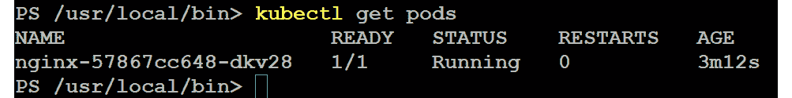

###### 图 10.10：pod 的详细信息

Pods 来来去去；它们是动态创建的，可以在扩展上/下进行。使用 `explain` 命令，您可以找到有关 pod 的各种信息：

```
kubectl explain pods/nginx-57867cc648-dkv28
```

让我们删除 pod：

```
kubectl delete pod nginx-57867cc648-dkv28 
```

再次执行 `kubectl get pods` 命令；您应该会看到一个新的 pod 可用。

### 创建服务

但实际上，您不应该关心 pod：服务才是重要的。服务是使应用程序对外界可访问的对象。在服务的背后，有一个或多个 pod。服务跟踪 pod 及其 IP 地址，并且它是一组逻辑 pod 及其策略的抽象。您可以使用以下命令列出命名空间中的所有服务：

```
kubectl get services
```

上述命令的输出如下：

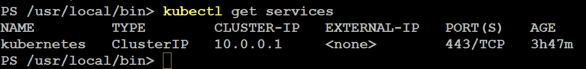

###### 图 10.11：列出命名空间中的所有服务

只找到一个服务，`CLUSTER-IP`。可以使用以下命令找到更多详细信息：

```
kubectl describe services/kubernetes
```

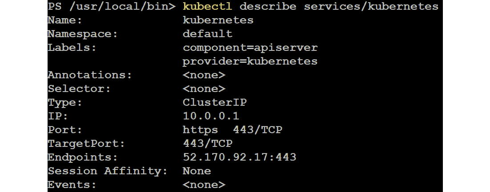

###### 图 10.12：获取 Kubernetes 服务的描述

让我们摆脱我们的第一个部署：

```
kubectl delete deployment nginx
```


###### 图 10.13：删除第一个部署

让我们创建一个新的：

```
kubectl run nginx --image=nginx
```

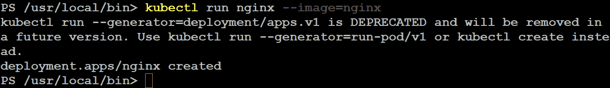

###### 图 10.14：创建一个新的 nginx 镜像

请注意，我们没有暴露端口。让我们使用 `kubectl get pods` 命令列出 pod。为了使资源可访问，我们添加了一个 `LoadBalancer` 类型的服务：

```
kubectl expose pod <pod name> --port=80 --target-port=80 \
  --type=LoadBalancer
```

输出应该类似于以下内容：

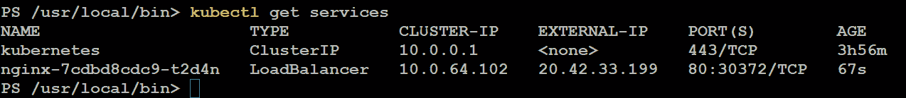

###### 图 10.15：列出 pod 并添加 LoadBalancer 类型的服务

在浏览器中使用 `EXTERNAL-IP` 地址。它会显示 `nginx` 的欢迎页面。

### 多容器 pod

一个 pod 也是 Kubernetes 用来维护容器的抽象层。有许多用例和真实场景需要在单个 pod 中有多个容器，以支持微服务容器应用程序之间的通信，如下图所示。此图中的持久存储显示了每个容器在 pod 的生命周期中进行读写操作的通信方式，当您删除 pod 时，共享的持久存储数据会丢失：

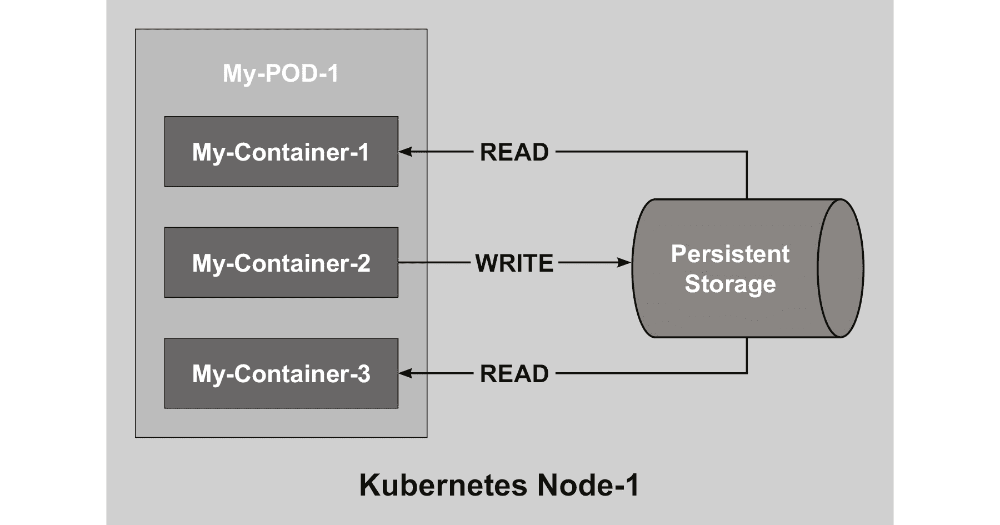

###### 图 10.16：多容器 pod 的架构

但是有一些用例是基于 pod 为 pod 内的容器提供共享资源的事实，比如：

+   带有辅助应用程序（如日志记录和监控）的容器

+   反向代理

到目前为止，我们使用`—image`参数创建了一个简单的 pod。对于更复杂的 pod，我们需要以 YAML 格式进行规范。创建一个名为`myweb.yaml`的文件，内容如下：

```
apiVersion: v1
kind: Pod
metadata:
  name: myweb
spec:
restartPolicy: Never
  volumes:
  - name: logger
emptyDir: {}
  containers:
  - name: nginx
    image: nginx
volumeMounts:
    - name: logger
mountPath: /var/log/nginx
readOnly: false
  - name: logmachine
    image: ubuntu
volumeMounts:
    - name: logger
mountPath: /var/log/nginxmachine
```

在这个文件中，创建了一个名为`journal`的共享卷。`emptydir`指令确保在创建 pod 时创建卷。

验证，执行以下命令：

```
kubectl exec myweb -c nginxfindmnt | grep logger
```

这个命令在`myweb` pod 中的`nginx`容器上执行`findmnt`命令。我们已经创建了容器、pod 和共享存储。现在让我们把注意力转移到 Helm 上，它是 Kubernetes 的包管理器。

#### 注意

前面的选项不能作为集群解决方案使用，您可能需要使用`mountOptions`标志将其中一个容器的文件系统挂载为只读。

## 使用 Helm 工作

Helm ([`helm.sh`](https://helm.sh)和[`github.com/helm`](https://github.com/helm))是 Kubernetes 的应用程序包管理器。您可以将其与 Linux 的`apt`和`yum`进行比较。它帮助使用图表管理 Kubernetes，这些图表定义、安装和升级您想要部署在 Kubernetes 上的应用程序。

Helm 的 GitHub 仓库和 Microsoft 提供了许多图表，Microsoft 是该项目最大的贡献者之一。

### 安装 Helm

如果您使用 Ubuntu 系统，有两种选择——您可以使用`snap`包安装 Helm，或者只需从[`github.com/kubernetes/helm/releases`](https://github.com/kubernetes/helm/releases)下载二进制文件。使用二进制文件适用于每个 Linux 发行版，而`snap`存储库并不总是有 Helm 的最新版本。因此，让我们使用[`github.com/helm/helm/releases`](https://github.com/helm/helm/releases)找到 Helm 的最新版本，并相应更改`helm-vx.x.x-linux-amd64.taz.gz`文件名中的`x`：

```
cd /tmp
wget https://storage.googleapis.com/kubernetes-helm/\
  helm-v2.9.1-linux-amd64.tar.gz
sudo tar xf helm-v2.9.1-linux-amd64.tar.gz --strip=1 -C \
  /usr/local/bin linux-amd64/helm
```

始终在网站上检查最新版本，并相应更改命令。

macOS 用户可以使用 Brew ([`brew.sh/`](https://brew.sh/))：

```
brew install kubernetes-helm
```

客户端已安装，有了这个客户端，我们可以将服务器部分 Tiller 部署到我们的 Kubernetes 集群中：

```
helm init
```

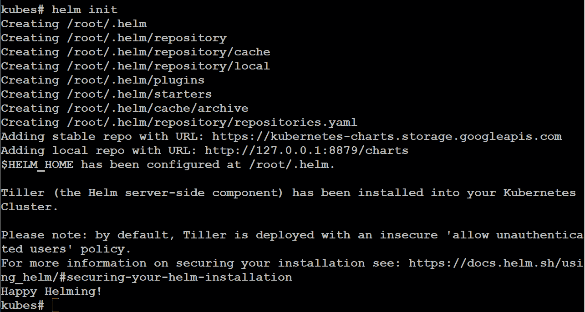

###### 图 10.17：将 Tiller 部署到 Kubernetes 集群中

验证版本：

```
helm version
```

输出应该类似于以下内容：

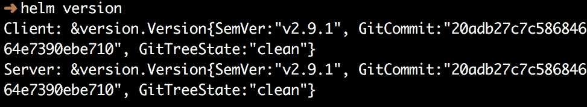

###### 图 10.18：验证 Helm 版本

为了让 Helm 能够访问 Kubernetes 集群，必须创建一个带有相应角色的服务账户：

```
kubectl create serviceaccount \
  --namespace kube-system tiller
```

如下截图所示，我们使用`kubectl create`命令在`kube-system`命名空间中创建了 Tiller 服务账户：

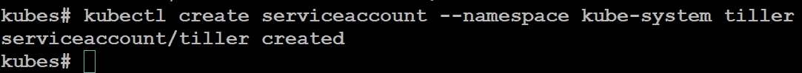

###### 图 10.19：在 kube-system 命名空间中创建 Tiller 服务账户

授予 Kubernetes 资源的集群管理员访问权限以执行管理任务：

```
kubectl create clusterrolebinding tiller-cluster-rule \
  --clusterrole=cluster-admin \
  --serviceaccount=kube-system:tiller
```

如下截图所示，您可以根据自己的需求创建自定义角色：

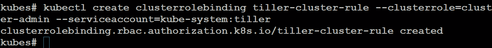

###### 图 10.20：创建自定义角色

Helm 是安装在本地计算机上的客户端，Tiller 是安装在 Kubernetes 上的服务器。要重新配置 Helm，即确保 Tiller 的版本与本地 Helm 匹配，执行：

```
helm init --service-account tiller --upgrade
```

### Helm 仓库管理

Helm 仓库是一个 HTTP 服务器，可以提供 YAML 文件，并包含托管在同一服务器上的打包图表和`index.yml`。在安装期间添加了两个仓库：

+   [`kubernetes-charts.storage.googleapis.com/`](https://kubernetes-charts.storage.googleapis.com/)

+   http://127.0.0.1:8879/charts

让我们从 Microsoft 添加仓库：

```
helm repo add azure \
  https://kubernetescharts.blob.core.windows.net/azure
```

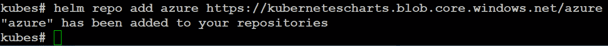

###### 图 10.21：从 Microsoft 添加存储库

检查可用的存储库：

```
helm repo list
```

输出应类似于以下内容：

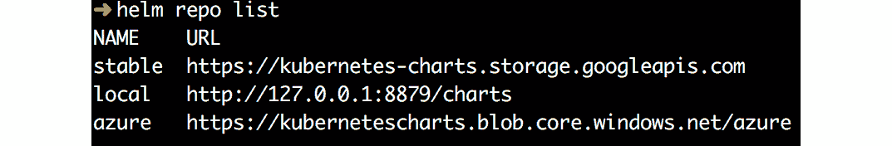

###### 图 10.22：检查可用的存储库

要更新存储库信息，请执行以下操作：

```
helm repo update
```

您还可以使用`remove`参数删除存储库。

### 使用 Helm 安装应用程序

让我们看看存储库中有什么可用的内容：

```
helm search wordpress
```

前面命令的输出如下：

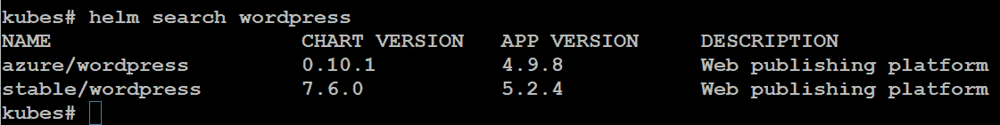

###### 图 10.23：搜索 wordpress 存储库

如果您想要有关图表的信息，如如何使用它、可用参数等，可以使用`helm inspect`命令。现在，我们只是要部署它：

```
helm install stable/wordpress
```

前面命令的安装输出日志包含访问`WordPress`实例所需的必要详细信息。

使用以下命令验证集群中 Helm 图表的状态：

```
helm ls
```

前面命令的输出返回修订名称、更新时间戳、状态、图表及其命名空间等信息：

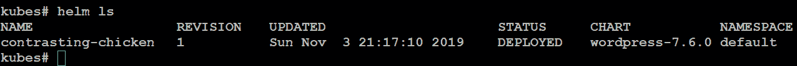

###### 图 10.24：验证 Helm 图表的状态

审查安装过程的先前输出：

```
helm status contrasting-chicken
```

该命令返回部署时间戳、命名空间和状态，以及资源详细信息，如`v1/PersistentVolumeClaim`、`v1/Service`、`extensions/Deployment`、`v1/Secret`以及数据库服务器的`connection`详细信息：


###### 图 10.25：审查 helm 状态

当然，`kubectl`也会向您显示以下结果：

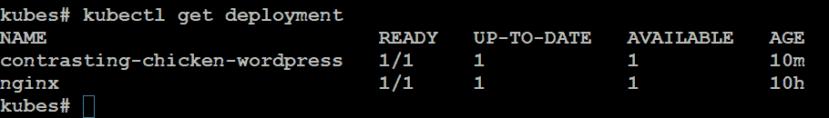

###### 图 10.26：使用 kubectl 获取部署详细信息

以下截图显示了`kubectl get service`命令的输出：

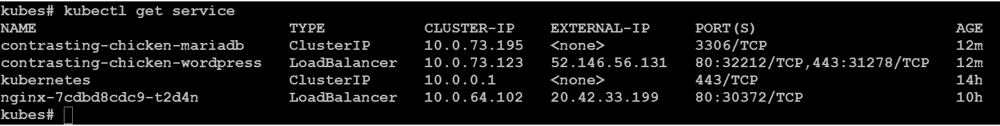

###### 图 10.27：kubectl get service 命令的输出

让我们删除我们的部署（名称可以使用`helm ls`找到）：

```
helm delete <NAME>
```


###### 图 10.28：使用 helm delete 命令删除部署

要自定义应用程序，请执行以下操作：

```
helm inspect stable/wordpress
```

然后，搜索 WordPress 设置：

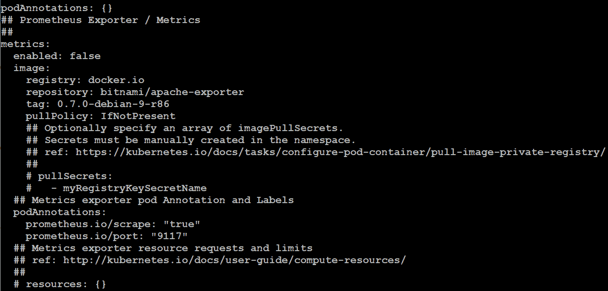

###### 图 10.29：搜索 WordPress 设置

创建一个 YAML 文件，例如`custom.yaml`，其中包含以下内容：

```
image:
  registry: docker.io
  repository: bitnami/wordpress
  tag: 4-ol-7
wordpressUsername: linuxstar01
wordpressEmail: linuxstar01@example.com
wordpressFirstName: Kamesh
wordpressLastName: Ganesan
wordpressBlogName: Linux on Azure – 2nd Edition!
```

然后，部署 WordPress 应用程序：

```
helm install stable/wordpress -f custom.yaml
```

您可以使用`kubectl`命令验证结果。首先，获取 Pod 的名称：

```
kubectl get pod
```

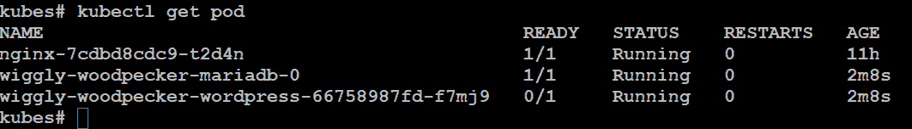

###### 图 10.30：验证 WordPress 应用程序的部署

之后，执行以下操作：

```
kubectl describe pod <podname>
```

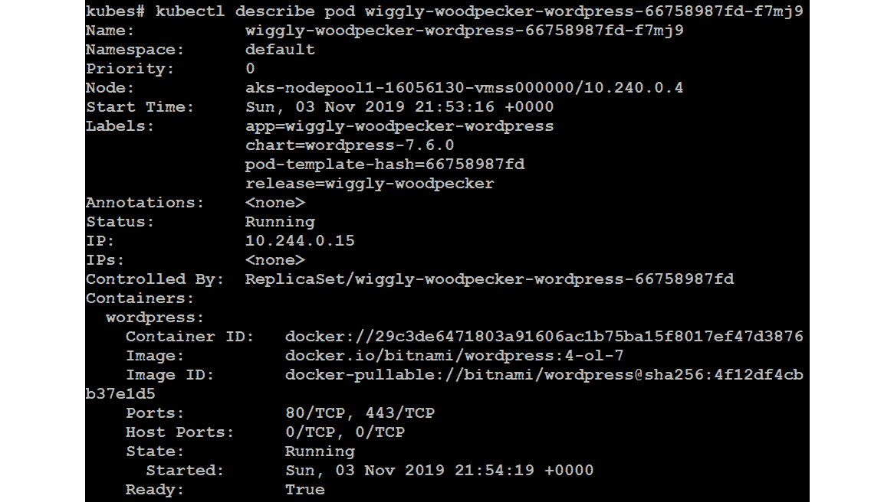

###### 图 10.31：获取 pod 描述

例如，在“事件”部分，您会看到拉取了`docker.io/bitnami/wordpress:4-ol-7`镜像。

清理一切：

```
helm delete stable/wordpress
kubectl scale sts --all --replicas=0
kubectl delete pod --all
kubectl delete sts --all --cascade=false
```

不要担心有状态的集合（`sts`）；它们是由该应用程序创建的，用于有序部署和共享持久存储。

### 创建 Helm 图表

Helm 图表类似于 Linux 发行版中使用的软件包，您可以使用 Helm 客户端浏览软件包存储库（图表）目录结构。有许多为您创建的图表，也可以创建自己的图表。

首先，创建一个工作目录，并准备好使用：

```
helm create myhelm
cd myhelm
```

前面的命令应该给出类似的输出：

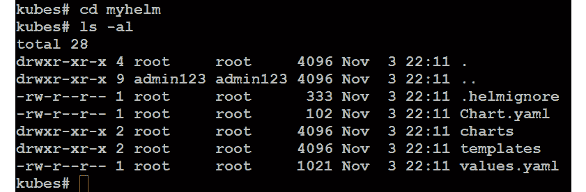

###### 图 10.32：创建工作目录

创建了一些文件和目录：

+   `Chart.yaml`文件：该文件包含有关图表的基本信息。

+   `values.yaml`文件：默认配置值。

+   `charts`目录：依赖图表。

+   `templates`目录：用于为 Kubernetes 创建清单文件

此外，您还可以添加一个`LICENSE`文件，一个`README.md`文件和一个带有要求的文件，`requirements.yaml`。

让我们稍微修改`Chart.yaml`：

```
apiVersion: v1
appVersion: 1.15.2
description: My First Nginx Helm
name: myhelm
version: 0.1.0
maintainers:
- name: Kamesh Ganesan
    email: kameshg@example.com
    url: http://packtpub.com
```

该文件或多或少是自解释的：维护者是可选的。`appVersion`是指，在这个例子中，nginx 的版本。

使用以下命令验证配置：

```
helm lint
```

花些时间来调查`templates`目录和`value.yaml`文件中的文件。当然，我们之所以使用 nginx 作为示例，是因为`helm create`创建的文件也使用 nginx 作为示例。

首先，执行干运行：

```
helm install --dry-run --debug ../myhelm
```

这样，您就可以看到将用于部署应用程序的清单。之后，您就可以安装它了：

```
helm install ../myhelm
```

安装后，我们意识到在干运行时，有一些不对劲：nginx 的版本是`nginx: stable`，即版本 1.14.0。打开`values.yaml`文件，将`tag: stable`更改为`tag: 1.15.2`。

使用`helm ls`查找名称并更新它：

```
helm upgrade <name> ../myhelm
```

将创建一个新的 pod；旧的将被删除：

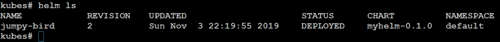

###### 图 10.33：更新 pod 版本

甚至有一个`rollback`选项，如果您想恢复到旧版本：

```
helm rollback <RELEASE> <REVISION>
```

您只需要指定要恢复的发布和修订版本。

## 使用草稿

作为开发人员，您通常会使用 Helm，用于准备就绪的应用程序，并且应该进行维护。您很可能还将代码托管在 GitHub 等版本控制系统上。

这就是草稿（[`github.com/Azure/draft`](https://github.com/Azure/draft)）的用武之地。它试图简化流程，从您的代码开始，在 Kubernetes 集群中进行。

该工具正在大力开发中。草稿变得越来越受欢迎和稳定，定期添加新的语言和功能。

如果开发阶段变成了似乎可用的东西，您仍然可以使用草稿，但更有可能的是您也会转向 Helm。

要了解草稿支持哪些编程语言，您可以在安装后执行以下命令：

```
draft pack list
Available Packs:
  github.com/Azure/draft/clojure
  github.com/Azure/draft/csharp
  github.com/Azure/draft/erlang
  github.com/Azure/draft/go
  github.com/Azure/draft/gradle
  github.com/Azure/draft/java
  github.com/Azure/draft/javascript
  github.com/Azure/draft/php
  github.com/Azure/draft/python
  github.com/Azure/draft/ruby
  github.com/Azure/draft/rust
  github.com/Azure/draft/swift
```

### 安装草稿

要使用草稿，必须安装和配置 Helm。

从[`github.com/Azure/draft/releases`](https://github.com/Azure/draft/releases)获取您的副本：

```
cd /tmp
wget https://azuredraft.blob.core.windows.net/draft/\
  draft-v0.15.0-linux-amd64.tar.gz
sudo tar xf draft-v0.15.0-linux-amd64.tar.gz --strip=1 \
  -C /usr/local/bin linux-amd64/draft
```

始终在网站上检查最新版本，并相应更改命令。

macOS 用户可以使用 Brew 安装它：

```
brew tap azure/draft && brew install draft
```

您可以看到，使用 Helm 的开发人员也参与了 Draft 的开发。在这两种情况下，其中许多人是微软的开发人员。与 Helm 类似，在安装客户端后，您必须初始化草稿：

```
draft init
```

这将安装一些默认插件并设置您可以在草稿中使用的存储库。

使用以下命令检查版本：

```
draft version
```

在撰写本文时，其版本为 0.16.0：

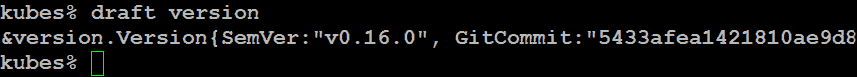

###### 图 10.34：检查草稿版本

最后一步涉及配置 Docker 存储库、Docker Hub 或 Azure。在本书的目的中，我们使用的是 Azure。

创建**Azure 容器注册表**（**ACR**）：

```
az acr create --resource-group MyKubernetes --name LinuxStarACR --sku Basic
```

登录到`LinuxStarACR`：

```
az acr login --name LinuxStarACR
```


###### 图 10.35：登录到 LinuxStarACR

配置存储库：

```
draft config set registry LinuxStarACR
```

登录到注册表：

```
az acr login --name LinuxStarACR
```

在草稿和 ACR 之间创建信任：

```
export AKS_SP_ID=$(azaks show \
 --resource-group <resource group> \
 --name <Kubernetes Cluster>
 --query "servicePrincipalProfile.clientId" -o tsv)
export ACR_RESOURCE_ID=$(azacr show \
 --resource-group <resource group>\
 --name <ACR Name> --query "id" -o tsv)
az role assignment create --assignee $AKS_SP_ID --scope $ACR_RESOURCE_ID --role contributor 
```

我们已成功安装了 Draft v0.16.0 并创建了 ACR。最后，我们在 Draft 和 ACR 之间创建了信任。现在是时候继续开始使用草稿了。

### 使用草稿

让我们开发一些简单的 Draft 代码。为此，我们将创建一个名为`mynode`的目录。在这个目录中，我们将创建一个名为`mynode.js`的文件，其中包含以下代码：

```
var http = require('http');
var server = http.createServer(function(req, res) {
res.writeHead(200);
res.end('Hello World!');
});
server.listen(8080);
```

这是一个简单的 Web 服务器，提供一个显示`Hello World!`的页面。我们处于开发过程的早期阶段。要创建一个`package.json`文件，请执行以下操作：

```
npminit
```

填写信息：

```
name: (mynode)
version: (1.0.0) 0.0.1
description: My first Node App
entry point: (mynode.js)
test command: node mynode.js
git repository:
keywords: webapp
author: Kamesh Ganesan
license: (ISC)
```

现在我们准备执行 Draft：

```
draft create
```

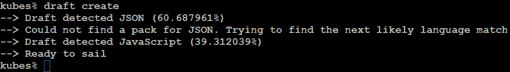

###### 图 10.36：使用 draft create 命令创建 Dockerfile

这将创建一个 Dockerfile 和所有 Helm 的信息。

输出的最后一行“准备启航”实际上意味着你已经准备好执行：

```
draft up
```

上述命令生成以下输出：

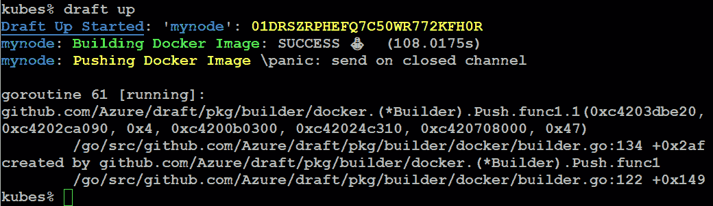

###### 图 10.37：构建和推送 Docker 镜像

这将构建镜像并发布应用程序。

执行`helm ls`将显示`mynode`应用程序：

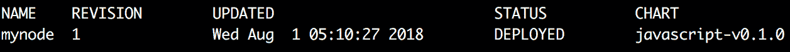

###### 图 10.38：获取 mynode 应用程序的详细信息

使用`kubectl get services`来显示服务：

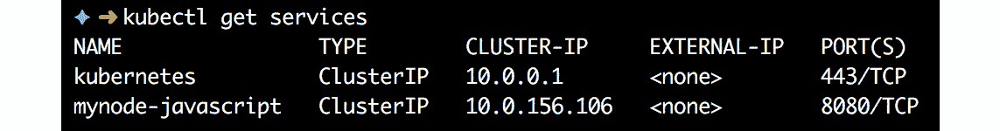

###### 图 10.39：使用 kubectl get services 显示服务

这里一切似乎都很正常，但`kubectl get pod`告诉我们情况并非如此：


###### 图 10.40：检查 pod 的状态

`draft logs`命令没有显示任何错误。因此，让我们看看 Kubernetes 认为什么：

```
kubectl logs <Pod Name>
```

它声明`npm ERR! missing script: start`。故意在`package.json`文件中制造了一个错误。根据以下示例修改内容，修改值：

```
{
"name": "mynode",
"version": "0.0.2",
"description": "My first Node App",
"main": "mynode.js",
"scripts": {
"start": "node mynode.js",
"test": "echo \"Error: no test specified\"& exit 1"
  },
"keywords": [
"webapp"
  ],
"author": "Kamesh Ganesan",
"license": "ISC"
}
```

通过再次执行以下操作来更新应用程序：

```
draft update
```

连接到应用程序：

```
draft connect
```


###### 图 10.41：连接到应用程序

打开另一个终端：

```
curl localhost:39053
```

输出必须是`Hello World!`。

在终端中按下*Ctrl* + *C*，运行`draft connect`，并删除部署：

```
draft delete
```

使用`kubectl get all`检查集群资源，并根据需要进行清理。

## 管理 Kubernetes

我们已经创建了一个 Kubernetes 集群，并且学习了`kubectl`实用程序以及一些可用于开发和维护 Kubernetes 集群中应用程序的工具。

因此，如果回顾一下本章开头的三个问题，我们已经回答了第一个问题。在本节中，我们将回答另外两个问题，并介绍如何更新 Kubernetes 版本。

### 更新应用程序

早些时候，我们使用 Helm 和 Draft 来管理我们的应用程序，这意味着所有的辛苦工作都已经为我们完成。但是你也可以借助`kubectl`来更新工作负载。

通常情况下，我们的集群现在应该是空的，所以让我们快速再次部署我们的`nginx` pod：

```
kubectl run nginx --image=nginx
```

仔细查看部署：


###### 图 10.42：部署 nginx pod

这实际上告诉我们，我们想要一个实例，有一个正在运行，它是最新的（已更新以匹配所需容量的实例数），并且它是可用的。运行的 nginx 版本不是最新的，所以我们想要将其更新到版本 1.17.5。执行以下操作：

```
kubectl edit deployment/nginx
```

将镜像更改为`nginx:1.17.5`：


###### 图 10.43：将镜像更改为 nginx:1.17.5

**kubectl rollout**命令可用于管理资源部署。一些有效的 rollout 选项包括 status、history、pause、restart、resume 和 undo。**kubectl rollout status**显示部署的当前状态，而**kubectl rollout history**列出以前的修订和配置。

```
kubectl rollout status deployment nginx
kubectl rollout history deployment nginx
```

或者，更好的是，您可以使用`describe`命令，它为您提供比前两个命令结合起来更详细的输出：

```
kubectl describe deployment nginx
```

使用 kubectl describe deployment 命令获取 nginx 部署的更详细输出

###### 图 10.44：nginx 部署的详细信息

更新部署的另一种方法是使用`set image`命令，通过更新映像来部署更新的 nginx 容器，新版本为 1.17.5，如下所示：

```
kubectl set image deployment/nginxnginx=nginx:1.17.5 --record
```

如前面的屏幕截图所示，nginx 容器映像已成功升级为版本 1.17.5。

### 扩展应用程序

目前有一个正在运行的 pod，但为了处理所有传入的负载，您可能需要更多实例并且需要负载平衡传入的流量。为此，您需要副本来定义任何给定时间运行的指定数量的 pod 副本。

让我们回到`kubectl`并获取当前的部署：

获取当前部署的状态

###### 图 10.45：获取当前部署的状态

此刻的期望（配置）状态是`1`。当前情况是`1`，有`1`个可用。

要扩展到三个实例，请执行以下操作：

```
kubectl scale deployment nginx --replicas=3
```

再次运行`kubectl get deployments`；然后查看可用的 pod：

```
kubectl get pods -o wide
```

显示扩展后可用 pod 的状态的输出

###### 图 10.46：扩展后检查可用的 pod

创建负载均衡器服务：

```
kubectl expose deployment nginx --type=LoadBalancer \
 --name=nginx-lb --port 80
kubectl get services
```

显示创建负载均衡器服务的输出

###### 图 10.47：创建负载均衡器服务

现在每个 HTTP 请求都由负载均衡器处理，并且流量分布在实例之间。

您还可以使用自动缩放。首先，安装 Metrics Server：

```
git clone https://github.com/kubernetes-incubator/metrics-server.git 
kubectl create -f metrics-server/deploy/1.8+/
```

配置自动缩放：如果负载超过`50`％，则会创建额外的实例，最多为`10`：

```
kubectl autoscale deployment nginx --cpu-percent=50 --min=3 --max=10
```

当然，在这种情况下，至少有两个节点在您的集群中是有意义的：

```
azaks scale --name Cluster01 \
  --resource-group MyKubernetes \
  --node-count 2
kubectl get nodes
```

请注意，此过程大约需要 10 分钟。要查看自动缩放的状态，请执行以下操作：

```
kubectl get hpa
```

使用 kubectl get hpa 命令查看自动缩放的状态

###### 图 10.48：列出自动缩放器

### 升级 Kubernetes

与任何软件或应用程序一样，您需要定期升级 Kubernetes 集群以使其保持最新状态。升级非常重要，可以获得最新的错误修复和所有关键的安全功能，以及最新的 Kubernetes 功能。如果要在不间断的情况下升级 Kubernetes 控制平面，则还需要有多个可用节点。以下步骤将向您展示如何快速升级 Kubernetes 集群。

首先查看当前版本：

```
az aks list --query "[].kubernetesVersion"
```

显示当前 Kubernetes 版本为 1.13.12 的输出

###### 图 10.49：查看当前 Kubernetes 版本

询问您位置的可用版本：

```
az aks get-versions --location eastus --output table | egrep "¹.13.12"
```

获取 East US 位置可用版本的输出

###### 图 10.50：East US 位置的可用版本

我们可以升级到版本 1.14.8：

```
az aks upgrade --resource-group MyKubernetes
  --name Cluster01 \
  --kubernetes-version 1.14.8 --yes --no-wait
```

添加`--no-wait`参数的效果是您几乎立即就能恢复提示符。

这样，大约 3 分钟后，您可以开始使用`kubectl`来获取节点和 pod 的状态（使用`-owide`参数，例如`kubectl get pods -o wide`），并了解已创建具有最新版本的新节点。工作负载在该节点上重新创建，并更新了另一个节点。之后，最后一个剩下的节点被清空并升级。

## 持久存储

在上一章中，我们提到了在容器中使用持久存储的多种方法，并且在本章中也提到了这一点。

Kubernetes 可以配置持久存储，但您必须提供它，例如通过 NFS 容器或通过实施 StorSimple iSCSI 虚拟阵列（如果您需要从多个容器进行读/写访问，这将特别有用）。即使您使用 Azure 存储，也有许多选择要做。您想使用磁盘还是 Azure 存储？您想动态创建它们还是使用现有的（静态）？大多数这些问题都是基于成本和对复制、备份和快照等服务需求来回答的。

在本节中，我们想要涵盖动态选项；在编排方面，这是一个更好的选择，因为您可以在 Kubernetes 内部完成所有操作（或使用其周围的工具）。

无论您使用 Azure 存储还是磁盘，您都需要在与 Kubernetes 相同的资源组中拥有一个存储账户：

```
az storage account create --resource-group MyKubernetes \
 --name mystorageest1 –sku Standard_LRS
```

请查看*第二章*，*开始使用 Azure 云*，以获取上述命令的语法。请记住，名称必须是唯一的。

### Kubernetes 的 Azure 磁盘

您可以动态或静态地为在 AKS 集群中的一个或多个 Kubernetes pod 使用的持久卷提供存储类。有两种存储类：标准 Azure 磁盘（默认）和高级 Azure 磁盘，这是一种托管的高级存储类：

1.  首先，创建一个 YAML 文件来创建存储类。这样可以自动提供存储：

```
kind: StorageClass
apiVersion: storage.k8s.io/v1
metadata:
  name: storageforapp
provisioner: kubernetes.io/azure-disk
parameters:
storageaccounttype: Standard_LRS
 location: eastus
 kind: shared
```

1.  使用以下内容应用它：

```
kubectlapply -f storageclass.yaml
```

用刚创建的文件名替换文件名。

1.  还需要另一个 YAML 文件来索赔持久卷，或者换句话说，创建它：

```
kind: PersistentVolumeClaim
apiVersion: v1
metadata:
  name: claim-storage-for-app
  annotations:
volume.beta.kubernetes.io/storage-class: storageforapp
spec:
accessModes:
  - ReadWriteOnce
  resources:
    requests:
      storage: 5Gi
```

1.  请注意，匹配是在注释中完成的。也要应用这个文件：

```
kubectlapply -f persistentvolume.yaml
```

1.  使用以下内容验证结果：

```
kubectl get sc
```

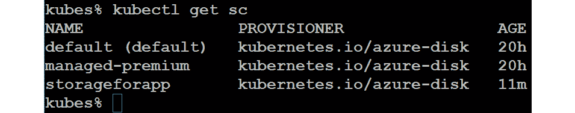

###### 图 10.51：验证存储类的创建

1.  要在 pod 中使用存储，可以像以下示例一样使用它：

```
kind: Pod
apiVersion: v1
metadata:
  name: my-web
spec:
  containers:
    - name: nginx
      image: nginx
volumeMounts:
      - mountPath: "/var/www/html"
        name: volume
  volumes:
    - name: volume
persistentVolumeClaim:
claimName: claim-storage-for-app
```

### Kubernetes 的 Azure 文件

当您以`ReadWriteOnce`访问模式类型挂载 Azure 磁盘时，它将仅对 AKS 中的单个 pod 可用。因此，您需要使用 Azure 文件来在多个 pod 之间共享持久卷。Azure 文件的配置与 Azure 磁盘并没有太大不同，如前一节所述。创建存储类的 YAML 文件如下：

```
kind: StorageClass
apiVersion: storage.k8s.io/v1
metadata:
  name: azurefile
provisioner: kubernetes.io/azure-file
mountOptions:
  - dir_mode=0888
  - file_mode=0888
  - uid=1000
  - gid=1000
  - mfsymlinks
  - nobrl
  - cache=none
parameters:
skuName: Standard_LRS
```

通过执行以下 YAML 文件使用持久卷索赔来提供 Azure 文件共享：

```
apiVersion: v1
kind: PersistentVolumeClaim
metadata:
  name: azurefile
spec:
accessModes:
    - ReadWriteMany
storageClassName: azurefile
  resources:
    requests:
      storage: 5Gi
```

按以下方式应用这两个 YAML 文件：

。


###### 图 10.52：使用持久卷索赔创建 Azure 文件

执行 Azure 文件存储创建 YAML 和存储卷索赔 YAML 的结果如下：

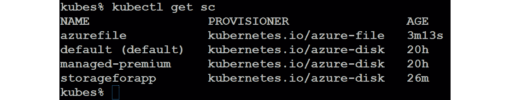

###### 图 10.53：验证 Azure 文件和 Azure 磁盘的创建

如您所见，pod 中的规范保持不变。通过这些逐步实施，我们成功地为持久存储需求创建了 Azure 磁盘和 Azure 文件。

## 总结

本章主要讨论了 Kubernetes。我们从描述开发人员可能的工作环境开始，即具有工具启动本地开发的良好工作站，即使在本地安装了 Kubernetes。我们以 Ubuntu Desktop 为例，但实际上，只要您对开发环境满意，就没有关系。

一切就绪后，我们使用 Azure CLI 和 PowerShell 覆盖了在 Azure 中配置 Kubernetes 集群。

在 Azure 中部署工作负载可以简单地执行`kubectl run`，但也探讨了更复杂的场景，如多容器应用程序。

作为开发人员，有两种工具可帮助简化您的开发流程：Draft 和 Helm。Draft 用于初始开发阶段，Helm 用于安装和维护应用程序之后。

Kubernetes 是一个管理容器的工具，使得部署、维护和更新工作负载变得容易。可伸缩性是使用 Kubernetes 的优势之一；甚至可以根据所需的 CPU 和内存资源自动扩展。

本章的最后一节涵盖了在 Kubernetes 中使用持久存储，实际上为您提供了比在容器中存储数据或直接将存储附加到容器中更好的方式。

在下一章中，我们将回到 DevOps 的 Ops 部分——即故障排除和监视您的工作负载，而工作负载指的是安装了 Linux 的虚拟机、容器和 AKS。

## 问题

1.  什么是 Pod？

1.  创建多容器 Pod 的一个好理由是什么？

1.  您可以使用哪些方法在 Kubernetes 中部署应用程序？

1.  您可以使用哪些方法来更新 Kubernetes 中的应用程序？

1.  如果您想要升级控制平面，是否需要在 Kubernetes 中创建额外的节点？

1.  您能想到为什么要使用 iSCSI 解决方案的原因吗？

1.  作为练习，重新创建使用持久存储的多容器 Pod。

## 进一步阅读

本章的目标是提供一个实用的方法，让您的工作负载在 Azure 云中运行。我们希望这是您进入 Kubernetes 世界的开始。还有很多东西等待您去发现！

Nigel Poulton 是一位已经写过关于 Docker 的优秀书籍的作者，他还写了一本关于 Kubernetes 的书籍*The Kubernetes Book*。如果您对 Kubernetes 真的很新，这是一个很好的起点。Gigi Sayfan 写了*Mastering Kubernetes*。确保购买第二版！不仅因为第一版不太好，而且因为它是必备的，并提供比第一版更多的信息。

作为开发人员，您应该尝试*Kubernetes for Developers*：Joseph Heck 可以告诉您更多关于使用 Kubernetes 的开发生命周期，使用 Node.js 和 Python 的示例。在他的书的最后一章中，他提到了 Helm 和 Brigade 等新兴项目。我们希望这将在以后的版本中更详细地探讨，甚至可能在另一本书中。

谈到 Brigade，[`brigade.sh`](https://brigade.sh)在其官方网站上被描述为“*在云中运行可编写脚本的自动化任务的工具——作为您的 Kubernetes 集群的一部分*。”这远远超出了本书的范围，而且它基本上还处于早期开发阶段。作为开发人员，您应该花一些时间阅读更多关于它并尝试它。

最后但同样重要的是，另一个值得一提的重要资源是 Azure 的开放服务经纪人（OSBA：[`osba.sh`](https://osba.sh)）。它没有出现在本章中，因为在撰写本文时它还不完全具备生产能力。OSBA 是与外部服务（如数据库和存储）通信的开放标准。这是另一种为容器提供数据和存储数据的解决方案。
