# 第十一章：故障排除和监视工作负载

故障排除和日志记录非常相关；当您遇到问题时，您开始分析事件、服务和系统日志。

在云环境中解决问题和修复问题可能与在更经典的部署中进行故障排除不同。本章解释了在 Azure 环境中故障排除 Linux 工作负载的差异、挑战和新可能性。

在本章结束时，您将能够：

+   使用不同工具在 Linux 系统中进行性能分析。

+   监视 CPU、内存、存储和网络等指标的详细信息。

+   使用 Azure 工具识别和解决问题。

+   使用 Linux 工具识别和解决问题。

## 技术要求

对于本章，您需要运行 Linux 发行版的一个或两个 VM。如果您愿意，可以使用最小的大小。必须安装`audit`守护程序，并且为了具有要分析和理解的审计系统日志，最好安装 Apache 和 MySQL/MariaDB 服务器。

以下是 CentOS 的一个示例：

```
sudo yum groups install ''Basic Web Server''
sudo yum install mariadbmariadb-server
sudo yum install setroubleshoot
sudosystemctl enable --now apache2
sudosystemctl enable --now mariadb
```

`auditd`通过使用可以根据您的需求进行修改的审计规则，提供关于服务器性能和活动的深入详细信息。要安装`audit`守护程序，请使用以下命令：

```
sudo yum list audit audit-libs
```

执行上述命令后，您将获得以下输出：

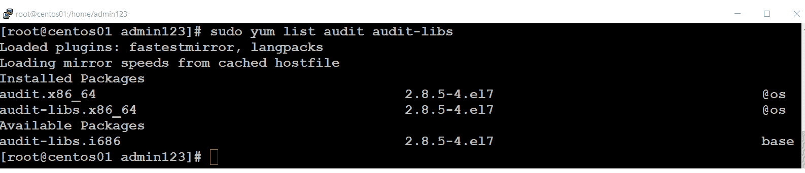

###### 图 11.1：安装审计守护程序

如果您可以看到如前所示的已安装的审计软件包列表，则已经安装了；如果没有，则运行以下命令：

```
sudo yum install audit audit-libs
```

成功安装`auditd`后，您需要启动`auditd`服务以开始收集审计日志，然后存储日志：

```
sudo systemctl start auditd
```

如果您想在启动时启动`auditd`，那么您必须使用以下命令：

```
sudo systemctl enable auditd
```

现在让我们验证`auditd`是否已成功安装并开始使用以下命令收集日志：

```
tail -f /var/log/audit/audit.log
```

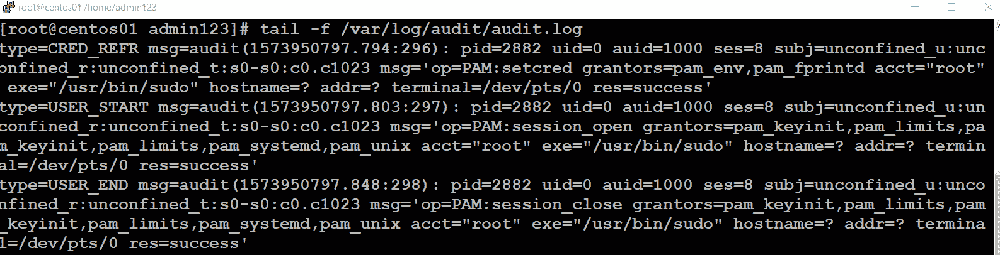

###### 图 11.2：验证成功安装 auditd 并收集日志

在本章中，我们将涵盖一般的 Azure 管理和 Azure Monitor。Linux 的 Log Analytics 代理，用于从 VM 收集信息，不受每个 Linux 发行版的支持；在决定要在本章中使用哪个发行版之前，请访问[`docs.microsoft.com/en-us/azure/virtual-machines/extensions/oms-linux`](https://docs.microsoft.com/en-us/azure/virtual-machines/extensions/oms-linux)。

#### 注意

**运营管理套件**（**OMS**）通常已停用，并过渡到 Azure，名称“OMS”不再在任何地方使用，除了一些变量名称。现在它被称为 Azure Monitor。有关命名和术语更改的更多信息，请参阅[`docs.microsoft.com/en-gb/azure/azure-monitor/terminology`](https://docs.microsoft.com/en-gb/azure/azure-monitor/terminology)，或者您也可以在[`docs.microsoft.com/en-us/azure/azure-monitor/platform/oms-portal-transition`](https://docs.microsoft.com/en-us/azure/azure-monitor/platform/oms-portal-transition)获取有关过渡的详细信息。

## 访问您的系统

学会排除工作负载将有助于您的日常工作。在 Azure 中进行故障排除与在其他环境中进行故障排除并无不同。在本节中，我们将看到一些技巧和窍门，这些将有助于您的日常工作。

### 无远程访问

当您无法通过 SSH 访问 Azure VM 时，可以通过 Azure 门户运行命令。

要在 Azure 门户上的 Azure VM 上运行命令，请登录到 Azure 门户，导航到您的 VM 并选择**运行命令**：

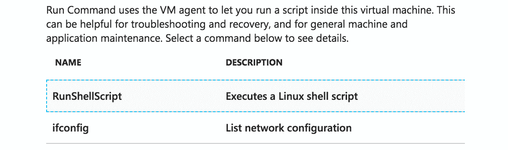

###### 图 11.3：导航到 Azure 门户中的 VM 部分

或者，您可以使用命令行，如下所示：

```
az vm run-command invoke --name <vm name> \
  --command-id RunShellScript \
  --scripts hostnamectl \
  --resource-group <resource group>
```

`az vm run`命令可用于在 VM 中运行 shell 脚本，用于一般机器或应用程序管理以及诊断问题。

无论是通过命令行还是通过 Azure 门户，只有在 Microsoft Azure Linux 代理仍在运行并可访问时，`az vm`命令才能正常工作。

#### 注意

您可以在[`github.com/Azure/azure-powershell`](https://github.com/Azure/azure-powershell)获取最新的 Microsoft Azure PowerShell 存储库，其中包含安装步骤及其用法。`az`正在取代 AzureRM，所有新的 Azure PowerShell 功能将只在`az`中提供。

根据安全最佳实践，您需要通过登录到 Azure 帐户并使用`az vm user`来重置密码来更改密码如下：

```
az vm user update \
  --resource-group myResourceGroup \
  --name myVM \
  --username linuxstar \
  --password myP@88w@rd
```

只有当您配置了具有密码的用户时才有效。如果您使用 SSH 密钥部署了 VM，那么您很幸运：同一部分中的**重置密码**选项将完成工作。

此选项使用 VMAccess 扩展（[`github.com/Azure/azure-linux-extensions/tree/master/VMAccess`](https://github.com/Azure/azure-linux-extensions/tree/master/VMAccess)）。与前面讨论的**运行命令**选项一样，它需要 Azure VM 代理。

### 处理端口

您无法远程访问的原因可能与网络有关。在*第五章*，*高级 Linux 管理*中，`ip`命令在*网络*部分中被简要介绍。您可以使用此命令验证 IP 地址和路由表。

在 Azure 站点上，必须检查网络和网络安全组，如*第三章*，*基本 Linux 管理*中所述。在 VM 中，您可以使用`ss`命令，例如`ip`，它是`iproute2`软件包的一部分，用于列出处于监听状态的 UPD（`-u`）和 TCP（`p`）端口，以及打开端口的进程 ID（`-p`）：

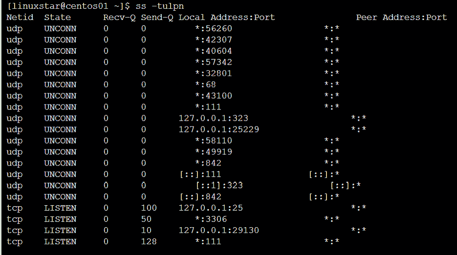

###### 图 11.4：使用 ss -tulpn 命令检查端口

可以使用`firewall-cmd --list-all --zone=public`快速检查防火墙规则；如果有多个区域和接口，您需要为每个区域执行此操作。要包括 Azure Service Fabric 创建的规则，可以使用`iptables-save`：

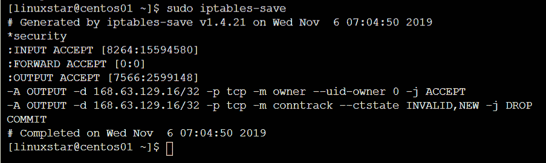

###### 图 11.5：包括 Azure Service Fabric 创建的规则

不幸的是，在`systemd`单元级别没有可用的注释来查看所有访问规则的配置。不要忘记验证它们，如*第六章*，*管理 Linux 安全和身份*中所讨论的那样。

### 使用 nftables

`nftables`比`iptables`更容易使用，并且它将整个`iptables`框架与简单的语法结合在一起。`nftables`建立在一个内核`netfilter`子系统上，可用于创建分组的复杂过滤规则。nftables 比`iptables`具有许多优点。例如，它允许您使用单个规则执行多个操作。它使用`nft`命令行工具，也可以使用`nft -i`命令以交互模式使用：

1.  使用以下命令安装`nftables`：

```
sudo apt install nftables
```

1.  然后安装`compat`，加载与`nftables`内核子系统的兼容性：

```
apt install iptables-nftables-compat
```

1.  最后，使用以下命令启用`nftables`服务：

```
sudo systemctl enable nftables.service
```

1.  您可以使用以下命令查看当前的`nft`配置：

```
nft list ruleset
```

1.  此外，您可以使用以下命令登录到`nft`交互模式：

```
nft –i
```

1.  现在，您可以使用以下`list`命令列出现有的规则集：

```
nft> list ruleset
```

1.  让我们创建一个新表，`rule_table1`：

```
nft>add table inet rule_table1
```

1.  现在，我们需要添加接受入站/出站流量的链命令如下：

```
nft>add chain inet rule_table1 input { type filter hook input priority 0 ; policy accept; }
nft>add chain inet rule_table1 output { type filter hook input priority 0 ; policy accept; }
```

1.  您可以使用以下命令添加规则以接受 TCP（传输控制协议）端口：

```
nft>add rule inet rule_table1 input tcpdport { ssh, telnet, https, http } accept
nft>add rule inet rule_table1 output tcpdport { https, http } accept
```

1.  这是我们新的`nftables`配置的输出：

```
nft> list ruleset
table inet rule_table1 {
        chain input {
                type filter hook input priority 0; policy accept;
tcpdport { ssh, telnet, http, https } accept
        }
        chain output {
                type filter hook input priority 0; policy accept;
tcpdport { http, https } accept
        }
}
```

### 引导诊断

假设您已经创建了您的 VM，可能是经过编排的，并且很可能是您自己的 VM，但它无法启动。

在启用 VM 的引导诊断之前，您需要一个存储账户来存储数据。您可以使用 `az storage account list` 列出已经可用的存储账户，如果需要，可以使用 `az storage account create` 命令创建一个存储账户。

现在让我们通过在 Azure CLI 中输入以下命令来启用引导诊断：

```
az vm boot-diagnostics enable --name <vm name>\
  --resource-group <resource group> \
  --storage <url>
```

区别在于您不需要存储账户的名称，而是需要存储 blob 的名称，可以通过 `az storage account list` 命令作为存储账户的属性找到。

在 Azure CLI 中执行以下命令以接收引导日志：

```
az vm boot-diagnostics get-boot-log \
--name <virtual machine> \
  --resource-group <resource group>
```

输出也会自动存储在一个文件中；在 Azure CLI 中，最好通过 `less` 进行管道处理或将其重定向到文件中。

### Linux 日志

典型的 Linux 系统上运行着许多进程、服务和应用程序，它们产生不同的日志，如应用程序、事件、服务和系统日志，可用于审计和故障排除。在早期的章节中，我们遇到了 `journalctl` 命令，用于查询和显示日志。在本章中，我们将更详细地讨论这个命令，并看看如何使用 `journalctl` 实用程序来切割和处理日志。

在使用 systemd 作为其 `init` 系统的 Linux 发行版中，如 RHEL/CentOS、Debian、Ubuntu 和 SUSE 的最新版本中，使用 `systemd-journald` 守护程序进行日志记录。该守护程序收集单元的标准输出、syslog 消息，并且（如果应用程序支持）将应用程序的消息传递给 systemd。

日志被收集在一个数据库中，可以使用 `journalctl` 进行查询。

**使用 journalctl**

如果您执行 `systemctl status <unit>`，您可以看到日志的最后条目。要查看完整的日志，`journalctl` 是您需要的工具。与 `systemctl` 不同的是：您可以使用 `-H` 参数在其他主机上查看状态。您不能使用 `journalctl` 连接到其他主机。这两个实用程序都有 `–M` 参数，用于连接到 `systemd-nspawn` 和 `Rkt` 容器。

要查看日志数据库中的条目，请执行以下操作：

```
Sudo journalctl --unit <unit>
```

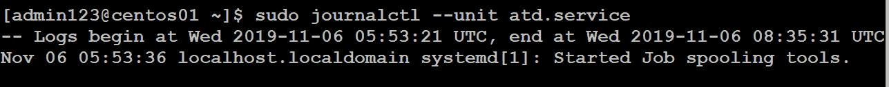

###### 图 11.6：查看日志数据库中的条目

默认情况下，日志使用 `less` 进行分页。如果您想要另一个分页器，比如 `more`，那么您可以通过 `/etc/environment` 文件进行配置。添加以下行：

```
SYSTEMD_PAGER=/usr/bin/more
```

以下是输出的示例：

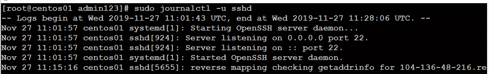

###### 图 11.7：使用 journalctl 命令获取进程的日志条目

让我们来看一下输出：

+   第一列是时间戳。在数据库中，它是以 EPOCH 时间定义的，因此如果您更改时区，没有问题：它会被转换。

+   第二列是主机名，由 `hostnamectl` 命令显示。

+   第三列包含标识符和进程 ID。

+   第四列是消息。

您可以添加以下参数来过滤日志：

+   `--dmesg`：内核消息，替代了旧的 `dmesg` 命令

+   `--identifier`：标识符字符串

+   `--boot`：当前引导过程中的消息；如果数据库在重启后是持久的，还可以选择以前的引导

**过滤器**

当然，您可以在标准输出上使用 `grep`，但 `journalctl` 有一些参数，可以帮助您过滤出所需的信息：

+   `--priority`：按 `alert`、`crit`、`debug`、`emerg`、`err`、`info`、`notice` 和 `warning` 进行过滤。这些优先级的分类与 syslog 协议规范中的相同。

+   `--since` 和 `--until`：按时间戳过滤。参考 `man systemd.time` 查看所有可能性。

+   `--lines`：行数，类似于 `tail`。

+   `--follow`：类似于 `tail -f` 的行为。

+   `--reverse`：将最后一行放在第一行。

+   `--output`：将输出格式更改为 JSON 等格式，或者向输出添加更多详细信息。

+   `--catalog`：如果有消息的解释，则添加消息的解释。

所有过滤器都可以组合，就像这里一样：

```
sudo journalctl -u sshd --since yesterday --until 10:00 \
  --priority err
```

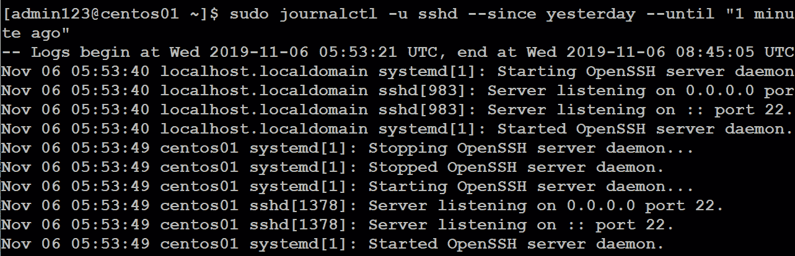

###### 图 11.8：使用 journalctl 使用多个过滤器过滤日志条目

**基于字段的过滤**

我们还可以根据字段进行过滤。键入此命令：

```
sudojournactl _
```

现在按两次*Ctrl* + *I*；您将看到所有可用字段。这些过滤器也适用于相同的原则；也就是说，您可以将它们组合起来：

```
sudo journalctl _UID=1000 _PID=1850
```

您甚至可以将它们与普通过滤器组合使用：

```
sudo journalctl _KERNEL_DEVICE=+scsi:5:0:0:0 -o verbose
```

**数据库持久性**

现在，您可能需要出于合规原因或审计要求存储日志一段时间。因此，您可以使用 Azure Log Analytics 代理从不同来源收集日志。默认情况下，日志数据库不是持久的。为了使其持久化，出于审计或合规原因（尽管最佳做法不是将日志存储在本地主机），您必须编辑配置文件`/etc/systemd/journald.conf`。

将`#Storage=auto`行更改为此：

```
Storage=persistent
```

使用`force`重新启动`systemd-journald`守护程序：

```
sudo systemctl force-reload systemd-journald
```

使用此查看记录的引导：

```
sudo journalctl --list-boots
```

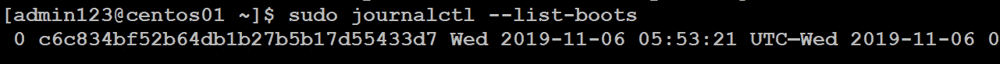

###### 图 11.9：查看记录的引导

您可以使用`--boot`参数将引导 ID 作为过滤器添加：

```
journalctl --priority err --boot <boot id>
```

通过这种方式，`hostnamectl`的输出显示当前的引导 ID。

日志数据库不依赖于守护程序。您可以使用`--directory`和`--file`参数查看它。

**Syslog 协议**

在实施 syslog 协议期间，Linux 和 Unix 家族的其他成员启用了日志记录。它仍然用于将日志发送到远程服务。

重要的是要理解该协议使用设施和严重性。这两者在 RFC 5424（[`tools.ietf.org/html/rfc5424`](https://tools.ietf.org/html/rfc5424)）中标准化。在这里，设施指定记录消息的程序类型；例如，内核或 cron。严重性标签用于描述影响，例如信息或关键。

程序员的 syslog 手册（`journald`能够获取有关程序输出的所有内容。

**添加日志条目**

您可以手动向日志添加条目。对于 syslog，`logger`命令可用：

```
logger -p <facility.severity> "Message"
```

对于`journald`，有`systemd-cat`：

```
systemd-cat --identifier <identifier> --priority <severity><command>
```

让我们看一个例子：

```
systemd-cat --identifier CHANGE --priority info \
  echo "Start Configuration Change"
```

作为标识符，您可以使用自由字符串或 syslog 设施。`logger`和`systemd-cat`都可以用于在日志中生成条目。如果应用程序不支持 syslog，则可以使用此功能；例如，在 Apache 配置中，您可以使用此指令：

```
errorlog  "tee -a /var/log/www/error/log  | logger -p local6.info"
```

您还可以将其作为变更管理的一部分使用。

**将 journald 与 RSYSLOG 集成**

为了为您自己的监控服务收集数据，您的监控服务需要 syslog 支持。这些监控服务的良好示例作为 Azure 中的现成 VM 提供：**Splunk**和**Elastic Stack**。

RSYSLOG 是当今最常用的 syslog 协议实现。它已经默认安装在 Ubuntu、SUSE 和 Red Hat 等发行版中。

RSYSLOG 可以使用`imjournal`模块与日志数据库很好地配合。在 SUSE 和 Red Hat 等发行版中，这已经配置好；在 Ubuntu 中，您必须对`/etc/rsyslog.conf`文件进行修改：

```
# module(load="imuxsock")
module(load="imjournal")
```

修改后，重新启动 RSYSLOG：

```
sudo systemctl restart rsyslog
```

使用`/etc/rsyslog.d/50-default.conf`中的设置，它记录到纯文本文件中。

要将来自本地 syslog 的所有内容发送到远程 syslog 服务器，您必须将以下内容添加到此文件中：

```
*. *  @<remote server>:514
```

#### 注意

这是 Ubuntu 中的文件名。在其他发行版中，请使用`/etc/rsyslog.conf`。

如果要使用 TCP 协议而不是 UDP 协议，请使用`@@`。

**其他日志文件**

您可以在`/var/log`目录结构中找到不支持 syslog 或`systemd-journald`的应用程序的日志文件。要注意的一个重要文件是`/var/log/waagent.log`文件，其中包含来自 Azure Linux VM 代理的日志记录。还有`/var/log/azure`目录，其中包含来自其他 Azure 代理（如 Azure Monitor）和 VM 扩展的日志记录。

## Azure Log Analytics

Azure Log Analytics 是 Azure Monitor 的一部分，它收集和分析日志数据并采取适当的操作。它是 Azure 中的一个服务，可以从多个系统中收集日志数据并将其存储在一个中心位置的单个数据存储中。它由两个重要组件组成：

+   Azure Log Analytics 门户，具有警报、报告和分析功能

+   需要在 VM 上安装的 Azure Monitor 代理

还有一个移动应用程序（在 iOS 和 Android 商店中，您可以在*Microsoft Azure*下找到它），如果您想在外出时查看工作负载的状态。

### 配置 Log Analytics 服务

在 Azure 门户中，从左侧栏选择**所有服务**，并搜索**Log Analytics**。选择**添加**并创建新的 Log Analytics 工作区。在撰写本文时，它并不是在所有地区都可用。使用该服务并不受地区限制；如果 VM 位于另一个地区，您仍然可以监视它。

#### 注意

此服务没有预付费用，您按使用量付费！阅读[`aka.ms/PricingTierWarning`](http://aka.ms/PricingTierWarning)获取更多详细信息。

另一种创建服务的方法是使用 Azure CLI：

```
az extension add -n application-insights
```

创建服务后，会弹出一个窗口，允许您导航到新创建的资源。或者，您可以在**所有服务**中再次搜索。

请注意，在资源窗格的右上角，Azure Monitor 和工作区 ID；您以后会需要这些信息。转到**高级设置**以找到工作区密钥。

在 Azure CLI 中，您可以使用以下命令收集此信息：

```
az monitor app-insights component create --app myapp
   --location westus1
   --resource-group my-resource-grp
```

要列出 Azure 订阅的所有工作区，可以使用以下 Azure CLI 命令：

```
az ml workspace list
```

您可以使用以下 Azure CLI 命令以 JSON 格式获取有关工作区的详细信息：

```
az ml workspace show -w my-workspace -g my-resource-grp
```

### 安装 Azure Log Analytics 代理

在安装 Azure Monitor 代理之前，请确保已安装`audit`包（在`auditd`中）。

要在 Linux VM 中安装 Azure Monitor 代理，您有两种可能性：启用 VM 扩展`OMSAgentforLinux`，或在 Linux 中下载并安装 Log Analytics 代理。

首先，设置一些变量以使脚本编写更容易：

```
$rg = "<resource group>"
$loc = "<vm location>"
$omsName = "<OMS Name>"
$vm = "<vm name">
```

您需要工作区 ID 和密钥。`Set-AzureVMExtension` cmdlet 需要以 JSON 格式的密钥，因此需要进行转换：

```
$omsID = $(Get-AzOperationalInsightsWorkspace '
 -ResourceGroupName $rg -Name $omsName.CustomerId) 
$omsKey = $(Get-AzOperationalInsightsWorkspaceSharedKeys '
 -ResourceGroupName $rg -Name $omsName).PrimarySharedKey
$PublicSettings = New-Object psobject | Add-Member '
 -PassThruNotePropertyworkspaceId $omsId | ConvertTo-Json
$PrivateSettings = New-Object psobject | Add-Member '
 -PassThruNotePropertyworkspaceKey $omsKey | ConvertTo-Json
```

现在您可以将扩展添加到虚拟机：

```
Set-AzureVMExtension -ExtensionName "OMS" '
  -ResourceGroupName $rg -VMName $vm '
  -Publisher "Microsoft.EnterpriseCloud.Monitoring" 
  -ExtensionType "OmsAgentForLinux" -TypeHandlerVersion 1.0 '
  -SettingString $PublicSettings
  -ProtectedSettingString $PrivateSettings -Location $loc
```

上述过程相当复杂并且需要一段时间。下载方法更简单，但您必须以访客身份通过 SSH 登录到 VM。当然，这两种方法都可以自动化/编排：

```
cd /tmp
wget \
https://github.com/microsoft/OMS-Agent-for-Linux \
/blob/master/installer/scripts/onboard_agent.sh
sudo -s 
sh onboard_agent.sh -w <OMS id> -s <OMS key> -d \
  opinsights.azure.com
```

如果在安装代理时遇到问题，请查看`/var/log/waagent.log`和`/var/log/azure/Microsoft.EnterpriseCloud.Monitoring.OmsAgentForLinux/*/extension.log`配置文件。

扩展的安装还会创建一个配置文件`rsyslog,/etc/rsyslogd.d/95-omsagent.conf`：

```
kern.warning @127.0.0.1:25224
user.warning @127.0.0.1:25224
daemon.warning @127.0.0.1:25224
auth.warning @127.0.0.1:25224
syslog.warning @127.0.0.1:25224
uucp.warning @127.0.0.1:25224
authpriv.warning @127.0.0.1:25224
ftp.warning @127.0.0.1:25224
cron.warning @127.0.0.1:25224
local0.warning @127.0.0.1:25224
local1.warning @127.0.0.1:25224
local2.warning @127.0.0.1:25224
local3.warning @127.0.0.1:25224
local4.warning @127.0.0.1:25224
local5.warning @127.0.0.1:25224
local6.warning @127.0.0.1:25224
local7.warning @127.0.0.1:25224
```

基本上意味着 syslog 消息（`facility.priority`）被发送到 Azure Monitor 代理。

在新资源的底部窗格中，有一个名为**开始使用 Log Analytics**的部分：

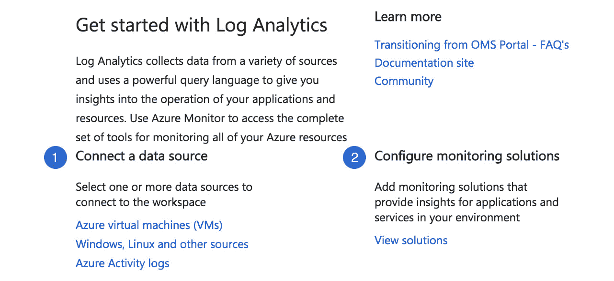

###### 图 11.10：在 Azure 门户中开始使用 Log Analytics 部分

单击**Azure 虚拟机（VMs）**。您将看到此工作区中可用的虚拟机：

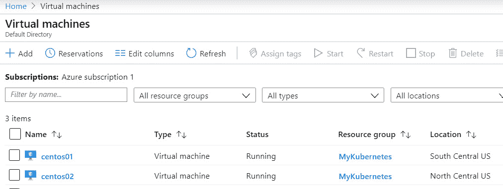

###### 图 11.11：工作区中可用的虚拟机

上述屏幕截图表示工作区中可用的虚拟机。它还显示我们已连接到数据源。

### 获取数据

在此资源的**高级设置**部分，您可以添加性能和 syslog 数据源。您可以使用特殊的查询语言通过日志搜索访问所有数据。如果您对这种语言不熟悉，您应该访问[`docs.loganalytics.io/docs/Learn/Getting-Started/Getting-started-with-queries`](https://docs.loganalytics.io/docs/Learn/Getting-Started/Getting-started-with-queries)和[`docs.loganalytics.io/index`](https://docs.loganalytics.io/index)。

现在，只需执行此查询：

```
search *
```

为了查看是否有可用的数据，将搜索限制为一个 VM：

```
search * | where Computer == "centos01"
```

或者，为了获取所有的 syslog 消息，作为一个测试，您可以重新启动您的 VM，或者尝试这个：

```
logger -t <facility>. <priority> "message"
```

在 syslog 中执行以下查询以查看结果：

```
Syslog | sort 
```

如果您点击**保存的搜索**按钮，还有许多示例可用。

监控解决方案提供了一个非常有趣的附加功能，使这个过程变得更加容易。在**资源**窗格中，点击**查看解决方案**：

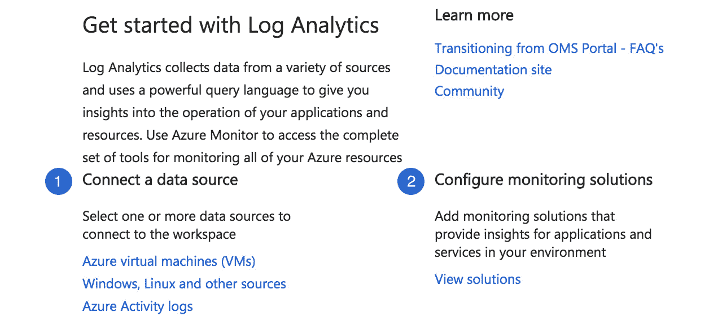

###### 图 11.12：导航到监控解决方案选项

选择所需的选项，然后点击**添加**：

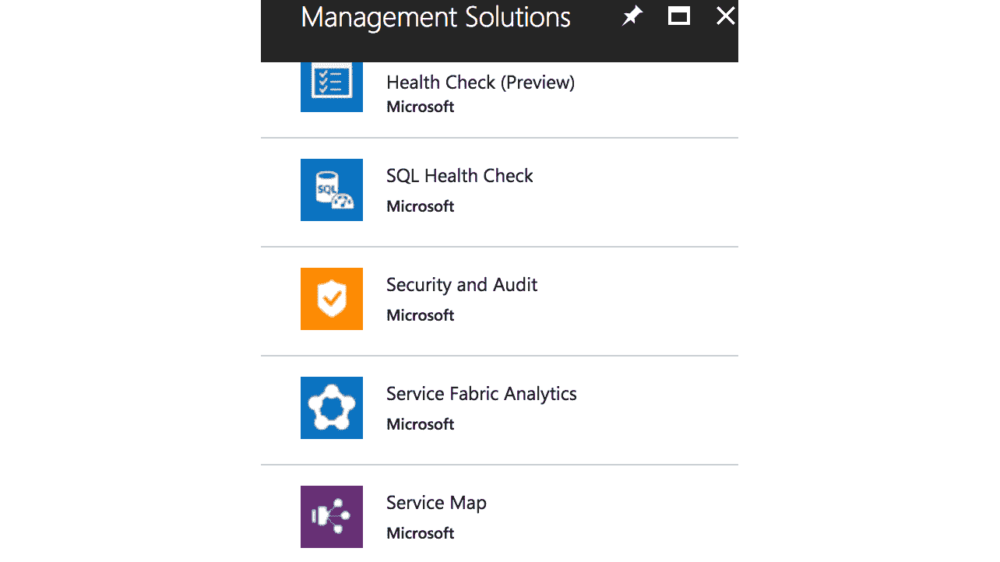

###### 图 11.13：日志分析中的管理解决方案

**服务地图**是一个重要的服务。它为您的资源提供了很好的概述，并提供了一个易于使用的界面，用于日志、性能计数器等。安装**服务地图**后，您必须在 Linux 机器上安装代理，或者您可以登录到门户并导航到 VM，它将自动为您安装代理：

```
cd /tmp
wget --content-disposition https://aka.ms/dependencyagentlinux \
-O InstallDependencyAgent-Linux64.bin
sudo sh InstallDependencyAgent-Linux64.bin -s
```

安装后，选择**虚拟机** > **监视** > **洞察** > **服务地图**。

现在，点击**摘要**：

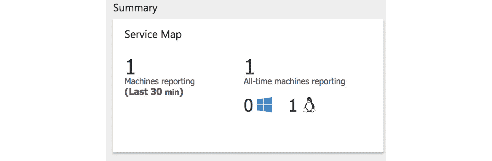

###### 图 11.14：服务地图摘要部分

您可以监视您的应用程序，查看日志文件等：

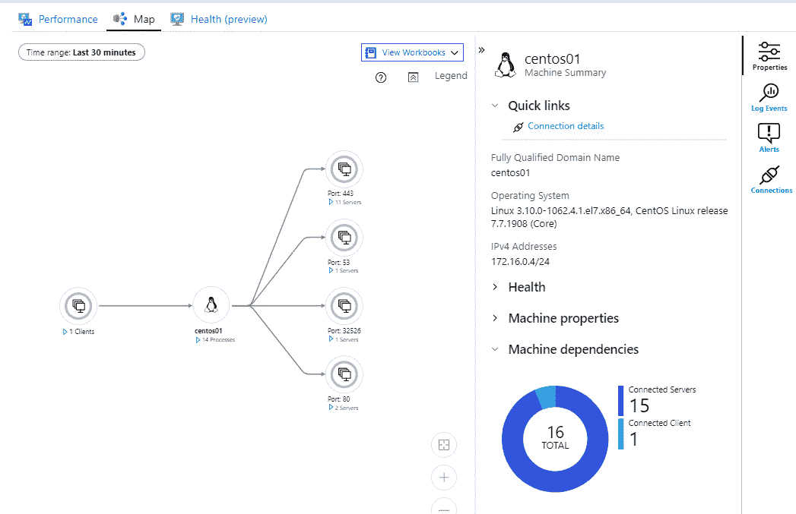

###### 图 11.15：服务地图概述

### 日志分析和 Kubernetes

为了管理您的容器，您需要对 CPU、内存、存储和网络使用情况以及性能信息有详细的了解。Azure 监视可以用于查看 Kubernetes 日志、事件和指标，允许从一个位置监视容器。您可以使用 Azure CLI、Azure PowerShell、Azure 门户或 Terraform 为您的新或现有的 AKS 部署启用 Azure 监视。

创建一个新的`az aks create`命令：

```
az aks create --resource-group MyKubernetes --name myAKS --node-count 1 --enable-addons monitoring --generate-ssh-keys
```

要为现有的 AKS 集群启用 Azure 监视，使用`az aks`命令进行修改：

```
az aks enable-addons -a monitoring -n myAKS -g MyKubernetes
```

您可以从 Azure 门户为您的 AKS 集群启用监视，选择**监视**，然后选择**容器**。在这里，选择**未监视的集群**，然后选择容器，点击**启用**：

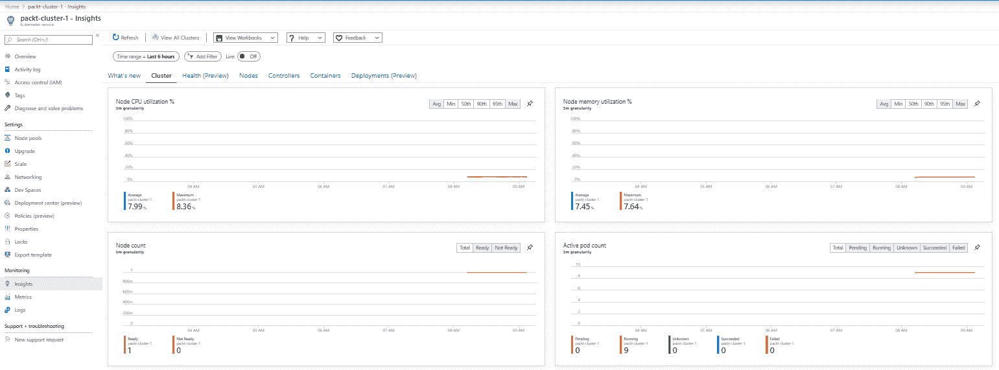

###### 图 11.16：从 Azure 门户监视 AKS 集群

### 您网络的日志分析

Azure Log Analytics 中的另一个解决方案是 Traffic Analytics。它可视化工作负载的网络流量，包括开放端口。它能够为安全威胁生成警报，例如，如果应用程序尝试访问其不允许访问的网络。此外，它提供了具有日志导出选项的详细监控选项。

如果您想使用 Traffic Analytics，首先您必须为您想要分析的每个区域创建一个网络监视器：

```
New-AzNetworkWatcher -Name <name> '
 -ResourceGroupName<resource group> -Location <location>
```

之后，您必须重新注册网络提供程序并添加 Microsoft Insights，以便网络监视器可以连接到它：

```
Register-AzResourceProvider -ProviderNamespace '
 "Microsoft.Network"
Register-AzResourceProvider -ProviderNamespaceMicrosoft.Insights
```

不能使用这个解决方案与其他提供商，如`Microsoft.ClassicNetwork`。

下一步涉及使用“网络安全组（NSG）”，它通过允许或拒绝传入流量来控制日志流量的流动。在撰写本文时，这只能在 Azure 门户中实现。在 Azure 门户的左侧栏中，选择“监视”>“网络观察程序”，然后选择“NSG 流日志”。现在你可以选择要为其启用“NSG 流日志”的 NSG。

启用它，选择一个存储账户，并选择你的 Log Analytics 工作空间。

信息收集需要一些时间。大约 30 分钟后，第一批信息应该可见。在 Azure 门户的左侧栏中选择“监视”，转到“网络观察程序”，然后选择“Traffic Analytics”。或者，从你的 Log Analytics 工作空间开始：

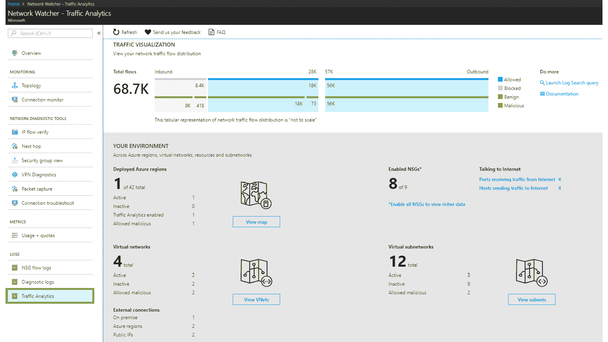

###### 图 11.17：使用 Traffic Analytics 查看网络流量分布

## 性能监控

在 Azure Monitor 中，有许多可用于监控的选项。例如，性能计数器可以让你深入了解你的工作负载。还有一些特定于应用程序的选项。

即使你不使用 Azure Monitor，Azure 也可以为每个 VM 提供各种指标，但不在一个中心位置。只需导航到你的 VM。在“概述”窗格中，你可以查看 CPU、内存和存储的性能数据。详细信息可在“监视”下的“指标”部分中找到。各种数据都可以获得，如 CPU、存储和网络数据：

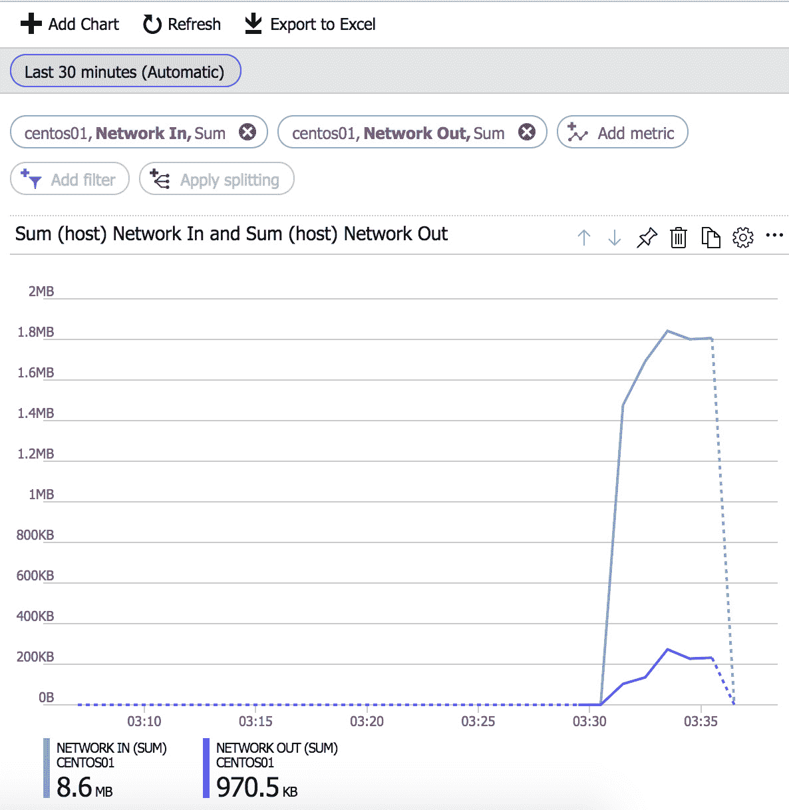

###### 图 11.18：查看 VM 的性能数据

许多解决方案的问题在于它们是特定于应用程序的，或者你只是看到了最终结果，却不知道原因是什么。如果你需要了解虚拟机所使用资源的一般性能信息，可以使用 Azure 提供的信息。如果你需要了解你正在运行的 Web 服务器或数据库的信息，可以看看是否有 Azure 解决方案。但在许多情况下，如果你也能在 VM 中进行性能故障排除，那将非常有帮助。在某种程度上，我们将从第三章《基本 Linux 管理》中的“进程管理”部分开始。

在我们开始之前，有多种方法和方式可以进行性能故障排除。这本书能提供你唯一应该使用的方法，或者告诉你唯一需要的工具吗？不，不幸的是！但它可以让你意识到可用的工具，并至少涵盖它们的基本用法。对于更具体的需求，你总是可以深入研究 man 页面。在这一部分，我们特别关注负载是什么，以及是什么导致了负载。

最后一点：这一部分被称为“性能监控”，但这可能不是完美的标题。它是平衡监控、故障排除和分析。然而，在每个系统工程师的日常生活中，这种情况经常发生，不是吗？

并非所有提到的工具都默认在 Red Hat/CentOS 存储库中可用。你需要配置`epel`存储库：`yum install epel-release`。

### 使用 top 显示 Linux 进程

如果你研究性能监控和 Linux 等主题，`top`总是被提到。它是用来快速了解系统上正在运行的内容的头号命令。

你可以用`top`显示很多东西，它带有一个很好的 man 页面，解释了所有的选项。让我们从屏幕顶部开始关注最重要的部分：

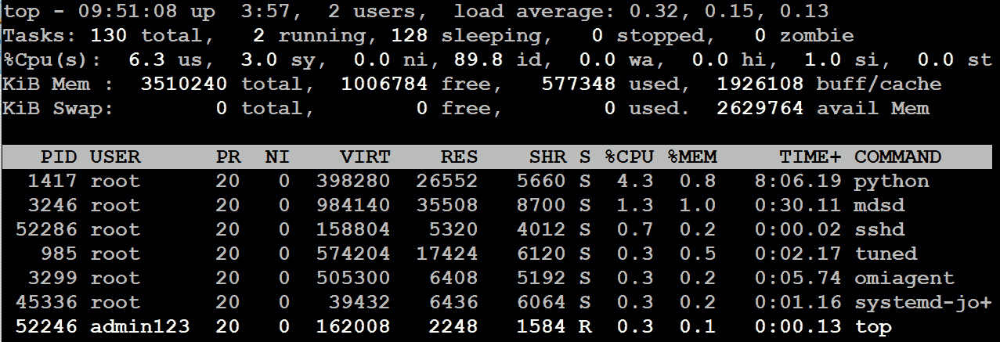

###### 图 11.19：使用 top 命令显示资源使用情况

让我们看看前面截图中提到的选项：

+   `wa`): 如果此值持续超过 10%，这意味着底层存储正在减慢服务器。此参数显示 CPU 等待 I/O 进程的时间。Azure VM 使用 HDD 而不是 SSD，使用多个 HDD 在 RAID 配置中可能有所帮助，但最好迁移到 SSD。如果这还不够，也有高级 SSD 解决方案可用。

+   `us`): 应用程序的 CPU 利用率；请注意，CPU 利用率是跨所有 CPU 总计的。

+   `sy`): CPU 在内核任务上花费的时间。

+   **Swap**：由于应用程序没有足够的内存而导致的内存分页。大部分时间应该为零。

`top` 屏幕底部还有一些有趣的列：

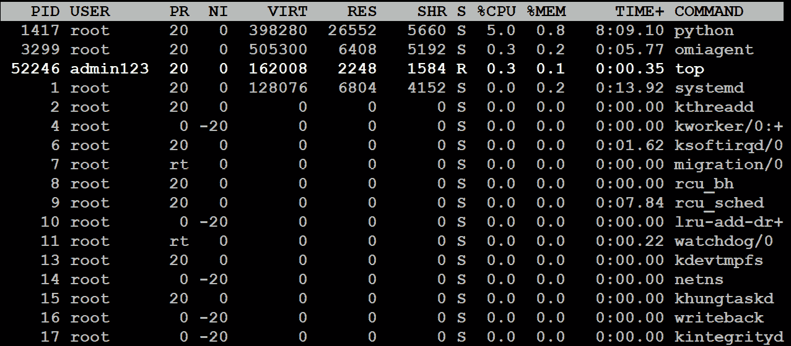

###### 图 11.20：从 top 命令获取的输出的底部条目

就个人而言，我们不建议现在担心优先级和 nice 值。对性能的影响很小。第一个有趣的字段是 `VIRT`（虚拟内存）。这指的是程序目前可以访问的内存量。它包括与其他应用程序共享的内存、视频内存、应用程序读入内存的文件等。它还包括空闲内存、交换内存和常驻内存。常驻内存是此进程实际使用的内存。`SHR` 是应用程序之间共享的内存量。这些信息可以让您对系统上应配置多少`swap`有一个概念：取前五个进程，加上 `VIRT`，然后减去 `RES` 和 `SHR`。这并不完美，但是是一个很好的指标。

在前面截图中的 **S** 列是机器的状态：

+   `D` 是不可中断的睡眠，大多数情况是由于等待存储或网络 I/O。

+   `R` 正在运行—消耗 CPU。

+   `S` 正在休眠—等待 I/O，没有 CPU 使用。等待用户或其他进程触发。

+   `T` 被作业控制信号停止，大多数情况是因为用户按下 *Ctrl* + *Z*。

+   `Z` 是僵尸—父进程已经死亡。在内核忙于清理时，它被内核标记为僵尸。在物理机器上，这也可能是 CPU 故障的迹象（由温度或糟糕的 BIOS 引起）；在这种情况下，您可能会看到许多僵尸。在 Azure 中，这不会发生。僵尸不会造成伤害，所以不要杀死它们；内核会处理它们。

### top 替代方案

有许多类似于 `top` 的实用程序，例如 `htop`，它看起来更漂亮，更容易配置。

非常相似但更有趣的是 `atop`。它包含所有进程及其资源使用情况，甚至包括在 `atop` 屏幕更新之间死亡的进程。这种全面的记账对于理解个别短暂进程的问题非常有帮助。`atop` 还能够收集有关运行容器、网络和存储的信息。

另一个是 `nmon`，它类似于 `atop`，但更专注于统计数据，并提供更详细的信息，特别是内存和存储方面的信息：

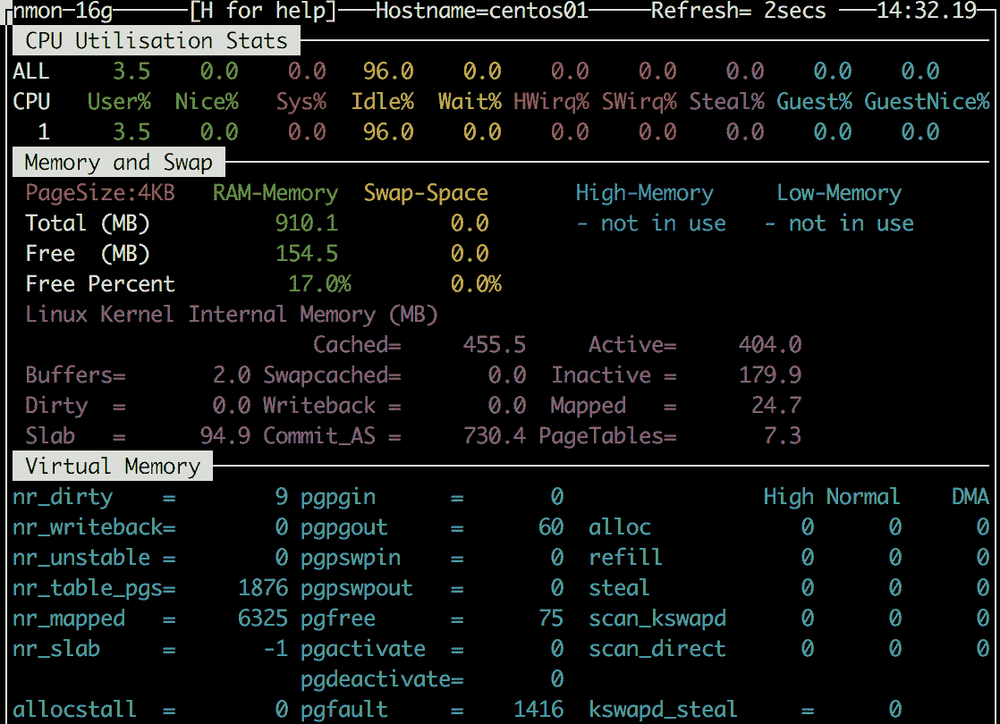

###### 图 11.21：内存、CPU 和存储性能详细信息

`nmon` 也可以用来收集数据：

```
nmon -f -s 60 -c 30
```

上述命令每分钟收集 30 轮信息，以逗号分隔的文件格式，易于在电子表格中解析。在 IBM 的开发者网站 [`nmon.sourceforge.net/pmwiki.php?n=Site.Nmon-Analyser`](http://nmon.sourceforge.net/pmwiki.php?n=Site.Nmon-Analyser) 上，您可以找到一个 Excel 电子表格，使这变得非常容易。它甚至提供了一些额外的数据分析选项。

`glances` 最近也变得非常受欢迎。它基于 Python，并提供有关系统、正常运行时间、CPU、内存、交换、网络和存储（磁盘 I/O 和文件）的当前信息：

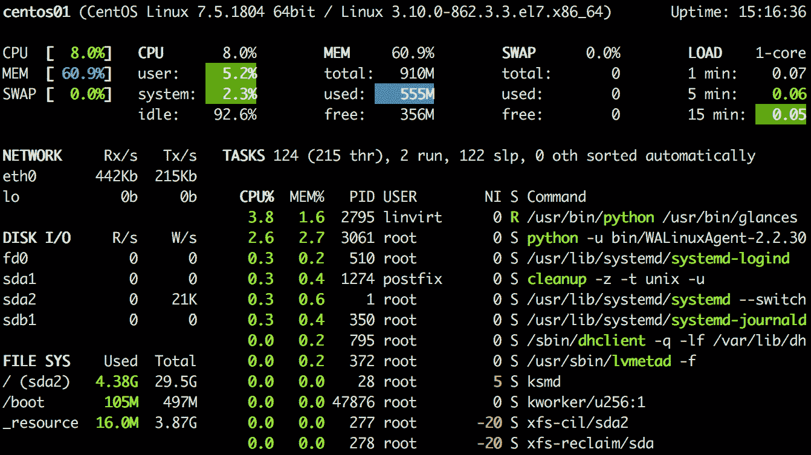

###### 图 11.22：使用 glances 实用程序查看性能

`glances`是`top`的最先进的替代品。它提供了所有替代品的功能，而且，您还可以远程使用它。您需要提供服务器的用户名和密码来启动`glances`：

```
glances --username <username> --password <password> --server 
```

在客户端上也执行以下操作：

```
glances --client @<ip address>
```

默认情况下，使用端口`61209`。如果使用`--webserver`参数而不是`--server`，甚至不需要客户端。端口`61208`上提供完整的 Web 界面！

`glances`能够以多种格式导出日志，并且可以使用 API 进行查询。对**SNMP**（简单网络管理协议）协议的实验性支持也正在进行中。

### Sysstat-一组性能监控工具

`sysstat`软件包包含性能监控实用程序。在 Azure 中最重要的是`sar`、`iostat`和`pidstat`。如果还使用 Azure Files，`cifsiostat`也很方便。

`sar`是主要实用程序。主要语法是：

```
sar -<resource> interval count
```

例如，使用以下命令报告 CPU 统计信息 5 次，间隔为 1 秒：

```
sar -u 1 5
```

要监视核心`1`和`2`，请使用此命令：

```
sar -P 1 2 1 5
```

（如果要单独监视所有核心，可以使用`ALL`关键字。）

以下是一些其他重要资源：

+   `-r`：内存

+   `-S`：交换

+   `-d`：磁盘

+   `-n <type>`：网络类型，例如：

`DEV`：显示网络设备统计

`EDEV`：显示网络设备故障（错误）统计

`NFS`：显示`SOCK`：显示 IPv4 中正在使用的套接字

`IP`：显示 IPv4 网络流量

`TCP`：显示 TCPv4 网络流量

`UDP`：显示 UDPv4 网络流量

`ALL`：显示所有前述信息

`pidstat`可以通过其进程 ID 从特定进程收集 CPU 数据。在下一个截图中，您可以看到每 5 秒显示 2 个样本。`pidstat`也可以对内存和磁盘执行相同的操作：

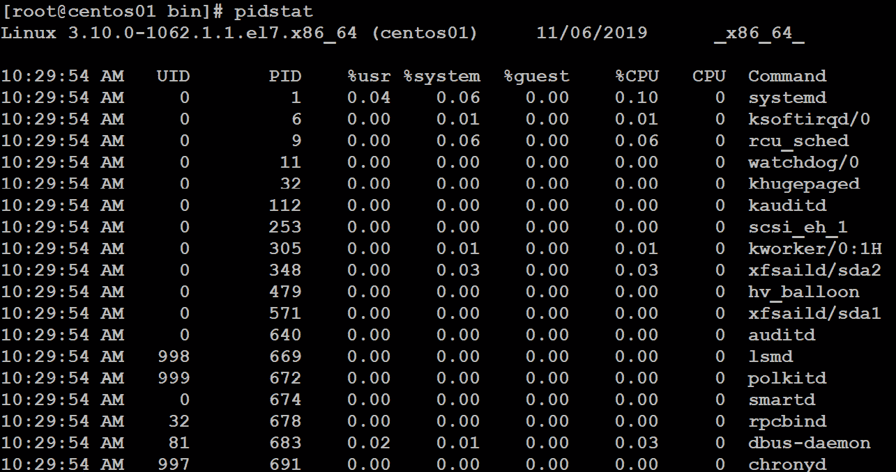

###### 图 11.23：使用 pidstat 显示 CPU 统计信息

`iostat`是一个实用程序，顾名思义，它可以测量 I/O，但也可以创建 CPU 使用情况报告：

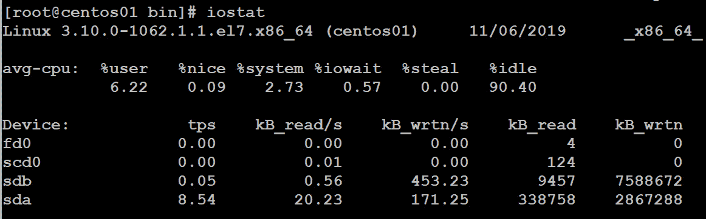

###### 图 11.24：使用 iostat 获取 CPU 和设备报告和统计信息

`tps`表示每秒向设备发出的传输次数。`kb_read/s`和`kB_wrtn/s`是在 1 秒内测得的千字节数；前面截图中的`avg-cpu`列是自 Linux 系统启动以来的统计总数。

在安装`sysstat`软件包时，在`/etc/cron.d/sysstat`文件中安装了一个 cron 作业。

#### 注意

在现代 Linux 系统中，`systemd-timers`和使用`cron`的旧方法都可用。`sysstat`仍然使用`cron`。要检查`cron`是否可用并正在运行，请转到`systemctl | grep cron`。

`cron`每 10 分钟运行一次`sa1`命令。它收集系统活动并将其存储在二进制数据库中。每天一次，执行`sa2`命令生成报告。数据存储在`/var/log/sa`目录中。您可以使用`sadf`查询该数据库：

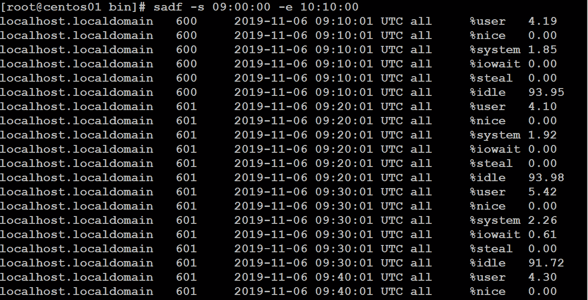

###### 图 11.25：使用 sadf 查询系统活动的数据库

此截图显示了 11 月 6 日`09:00:00`至`10:10:00`之间的数据。默认情况下，它显示 CPU 统计信息，但您可以使用与`sar`相同的参数进行自定义：

```
sadf /var/log/sa/sa03 -- -n DEV
```

这显示了 11 月 6 日每个网络接口的网络统计信息。

### dstat

`sysstat`用于历史报告，而`dstat`用于实时报告。虽然`top`是`ps`的监视版本，但`dstat`是`sar`的监视版本：

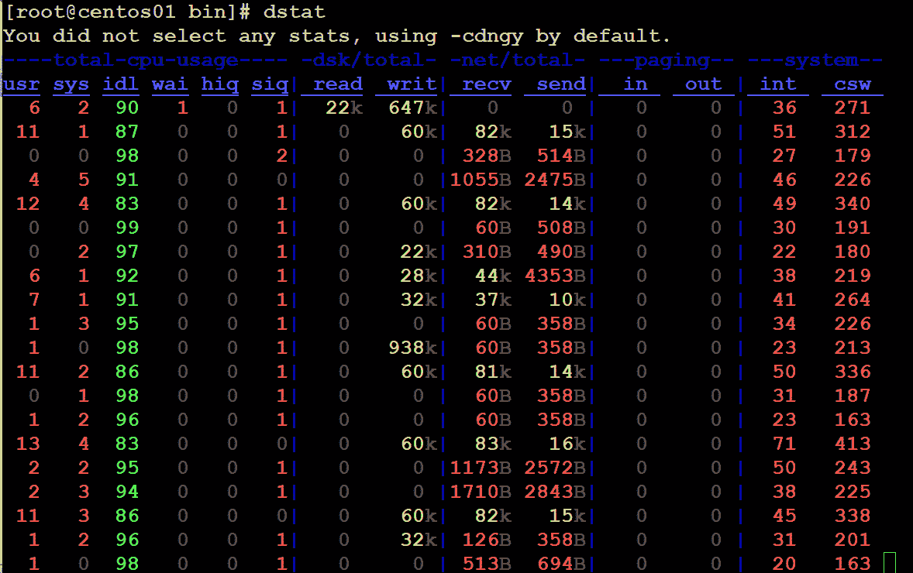

###### 图 11.26：使用 dstat 获取实时报告

如果您不想一次看到所有内容，可以使用以下参数：

+   `c`：CPU

+   `d`：磁盘

+   `n`：网络

+   `g`：分页

+   `s`：交换

+   `m`：内存

### 使用 iproute2 进行网络统计

在本章的前面，我们谈到了`ip`。这个命令还提供了一个选项，用于获取网络接口的统计信息：

```
ip -s link show dev eth0
```

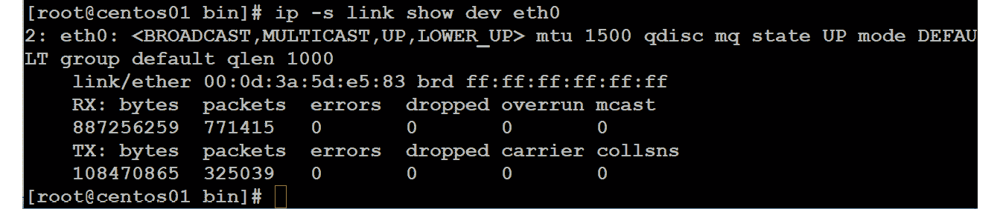

###### 图 11.27：获取网络接口的统计信息

它解析来自`/proc/net`目录的信息。另一个可以解析此信息的实用程序是`ss`。可以使用以下命令请求简单摘要：

```
ss -s
```

使用`-t`参数不仅可以显示处于监听状态的端口，还可以显示特定接口上的传入和传出流量。

如果您需要更多详细信息，`iproute2`软件包提供了另一个实用程序：`nstat`。使用`-d`参数，甚至可以在间隔模式下运行它：

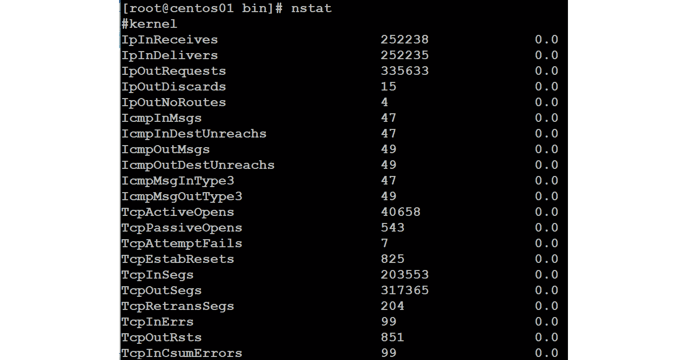

###### 图 11.28：获取有关处于监听状态的端口的详细报告

这已经比`ss`的简单摘要要多得多。但是`iproute2`软件包还有更多提供：`lnstat`。

这是提供网络统计信息的命令，如路由缓存统计：

```
lnstat––d
```

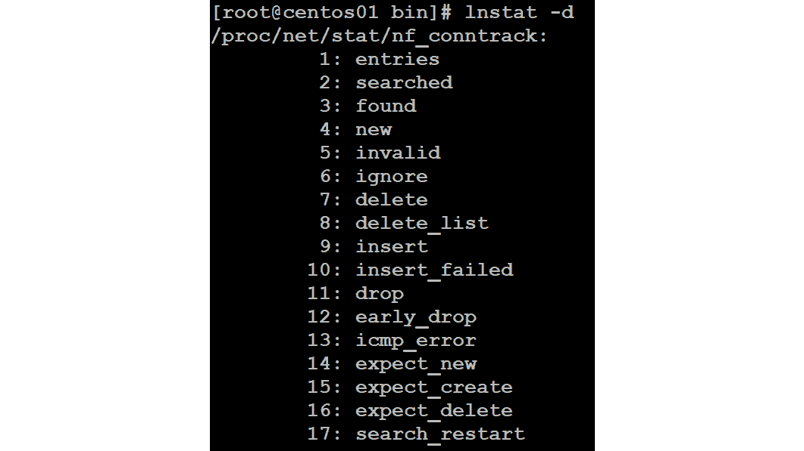

###### 图 11.29：使用 lnstat -d 获取网络统计信息

这显示了它可以显示或监视的所有内容。这相当低级，但我们使用`lnstat -f/proc/net/stat/nf_conntrack`解决了一些与防火墙性能相关的问题，同时监视`drops`计数器。

### 使用 IPTraf-NG 进行网络监控

您可以从`nmon`等工具获取网络详细信息，但如果您想要更多详细信息，那么 IPTraf-NG 是一个非常好的实时基于控制台的网络监控解决方案。它是一个基于控制台的网络监控实用程序，可以收集所有网络 IP、TCP、UDP 和 ICMP 数据，并能够根据 TCP/UDP 的大小来分解信息。还包括一些基本过滤器。

一切都在一个菜单驱动的界面中，所以没有必须记住的参数：

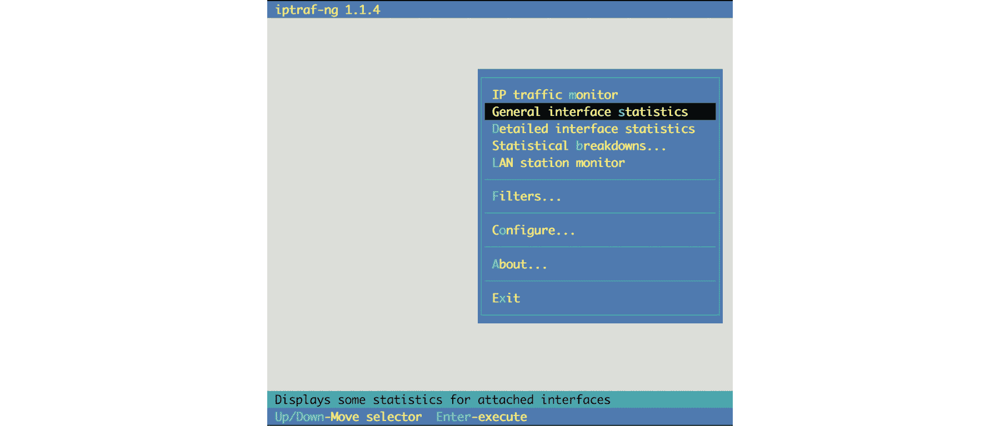

###### 图 11.30：IPTraf-NG 的菜单窗口

### tcpdump

当然，`tcpdump`不是性能监控解决方案。这个实用程序是监视、捕获和分析网络流量的好工具。

要查看所有网络接口上的网络流量，请执行以下操作：

```
tcpdump -i any 
```

对于特定接口，请尝试这个：

```
tcpdump -i eth0 
```

一般来说，最好不要解析主机名：

```
tcpdump -n -i eth0
```

通过重复`v`参数，可以添加不同级别的详细程度，最大详细程度为三：

```
tcpdump -n -i eth0 -vvv
```

您可以基于主机筛选流量：

```
tcpdump host <ip address> -n -i eth0 
```

或者，您可以基于源或目标 IP 进行筛选：

```
tcpdump src <source ip address> -n -i eth0 
tcpdump dst <destination ip address> -n -i eth0
```

还可以根据特定端口进行筛选：

```
tcpdump port 22 
tcpdumpsrc port 22
tcpdump not port 22
```

所有参数都可以组合使用：

```
tcpdump -n dst net <subnet> and not port ssh -c 5
```

添加了`-c`参数，因此只捕获了五个数据包。您可以将捕获的数据保存到文件中：

```
tcpdump -v -x -XX -w /tmp/capture.log       
```

添加了两个参数，以增加与其他可以读取`tcpdump`格式的分析器的兼容性：

+   `-XX`：以十六进制和 ASCII 格式打印每个数据包的数据

+   `-x`：为每个数据包添加标题

要以人类可读的完整时间戳格式读取数据，请使用此命令：

```
tcpdump -tttt -r /tmp/capture.log
```

#### 注意

另一个很棒的网络分析器是 Wireshark。这是一个图形工具，适用于许多操作系统。该分析器可以导入从`tcpdump`捕获的数据。它配备了一个很棒的搜索过滤器和分析工具，适用于许多不同的网络协议和服务。

在虚拟机中进行捕获并将其下载到工作站以便在 Wireshark 中进一步分析数据是有意义的。

我们相信您现在可以使用不同的工具在 Linux 系统中实现良好的性能分析，以监视 CPU、内存、存储和网络详细信息。

## 摘要

在本章中，我们涵盖了有关故障排除、日志记录、监控甚至分析的几个主题。从获取对虚拟机的访问开始，我们研究了在 Linux 中本地和远程进行日志记录。

性能监控和性能故障排除之间有一条细微的界限。有许多不同的实用工具可用于找出性能问题的原因。每个工具都有不同的目标，但也有很多重叠之处。我们已经介绍了 Linux 中最流行的实用工具以及一些可用的选项。

在第一章中，我们看到 Azure 是一个非常开放源代码友好的环境，微软已经付出了很大的努力，使 Azure 成为一个开放的、标准的云解决方案，并考虑了互操作性。在本章中，我们看到微软不仅在部署应用程序时支持 Linux，而且在 Azure Monitor 中也支持它。

## 问题

1.  为什么在虚拟机中至少应该有一个带密码的用户？

1.  `systemd-journald`守护进程的目的是什么？

1.  syslog 设施是什么？

1.  syslog 中有哪些可用的优先级？

1.  你如何向日志添加条目，以及为什么要这样做？

1.  在 Azure 中有哪些服务可用于查看指标？

1.  为什么`top`只能用于初步查看与性能相关的问题，以及哪个实用工具可以解决这个问题？

1.  `sysstat`和`dstat`实用程序之间有什么区别？

1.  为什么应该在工作站上安装 Wireshark？

## 进一步阅读

一个重要的信息来源是 Brendan D Gregg 的网站（[`www.brendangregg.com`](http://www.brendangregg.com)），他在那里分享了一份令人难以置信的长长的 Linux 性能文档、幻灯片、视频等清单。除此之外，还有一些不错的实用工具！他是 2015 年教会我的人，正确识别问题是很重要的。

+   是什么让你觉得有问题？

+   曾经有没有出现过问题？

+   最近有什么变化吗？

+   尝试寻找技术描述，比如延迟、运行时错误等。

+   只有应用程序受影响，还是其他资源也受到影响？

+   提出一个关于环境的确切描述。

你还需要考虑以下几点：

+   是什么导致负载（哪个进程、IP 地址等）？

+   为什么称之为负载？

+   负载使用了哪些资源？

+   负载是否发生变化？如果是，它是如何随时间变化的？

最后但同样重要的是，本书作者是 Benjamin Cane 的《Red Hat Enterprise Linux 故障排除指南》。我知道，这本书的一些部分已经过时，因为它是在 2015 年印刷的。当然，我希望有第二版，但是，特别是如果你是 Linux 的新手，买这本书。
