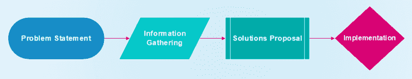
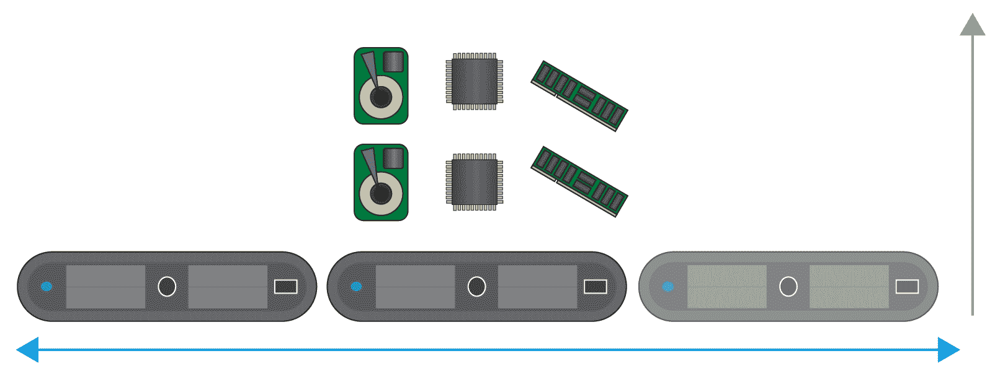
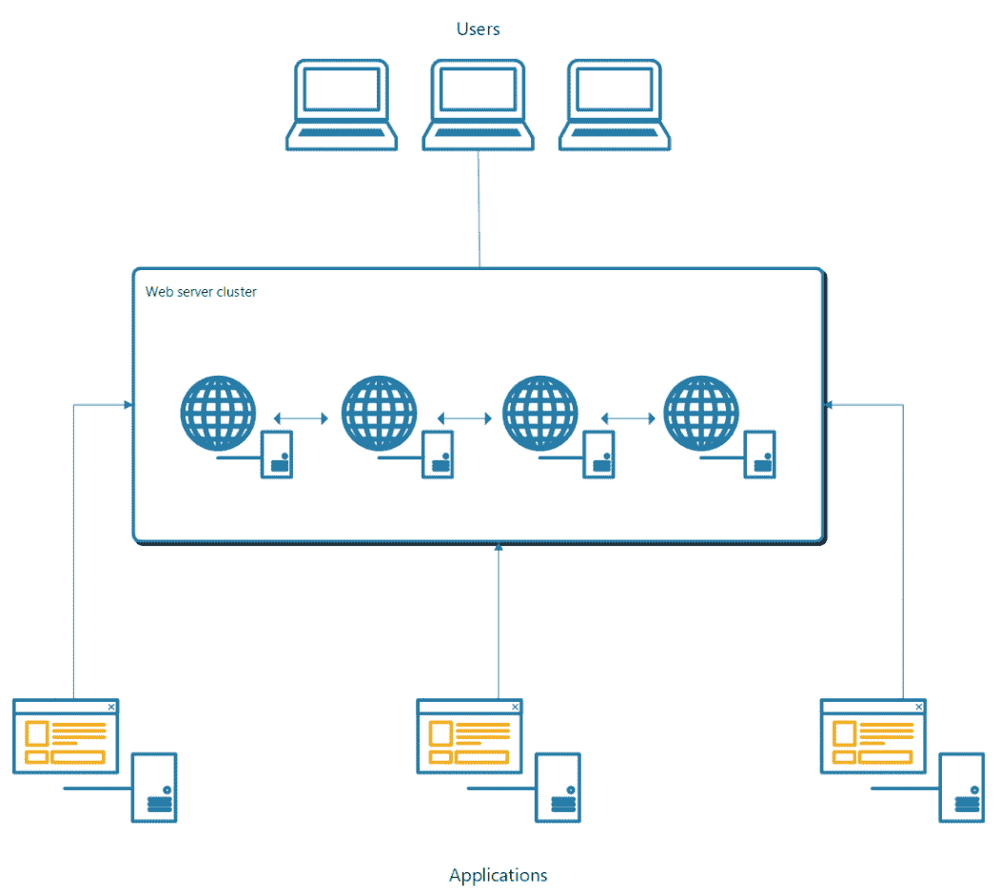
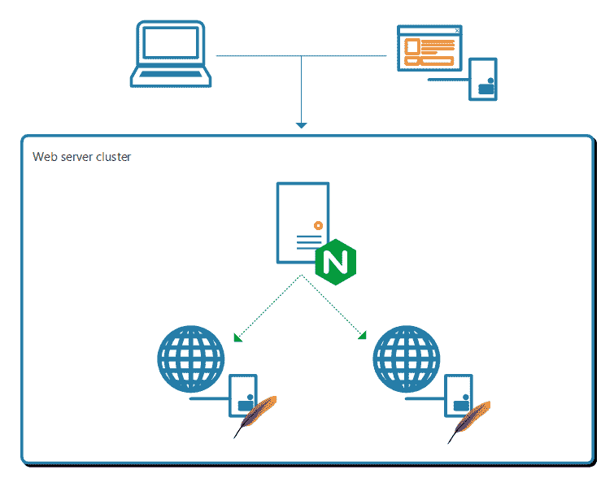

# 第一章：设计方法论简介

如今，IT 解决方案需要更高的性能和数据可用性，设计一个满足这些要求的强大实施方案是许多 IT 专家每天都要面对的挑战。

在本章中，你将学习从鸟瞰 IT 解决方案架构的基础知识，无论是在任何类型的环境中，还是虚拟化基础设施、裸金属甚至公共云，解决方案设计的基本概念都适用于任何环境。

你将探讨以下主题：

+   定义解决方案设计的阶段及其重要性

+   分析问题并提出正确的问题

+   考虑可能的解决方案

+   实施解决方案

充分理解在构建解决方案时需要考虑的方面对于项目的成功至关重要，因为这将决定哪些软件、硬件和配置将帮助你实现符合客户需求的期望状态。

# 定义解决方案设计的阶段及其重要性

像许多事情一样，设计解决方案是一个逐步的过程，不仅涉及技术方面，也不一定涉及技术方面的人员。通常情况下，你将受到一个客户经理、项目经理或者如果你很幸运的话，一个懂得技术需求的 CTO 的委托。他们正在寻找一个能够帮助他们向客户提供解决方案的专家。这些请求通常不包含你需要提供解决方案所需的所有信息，但这是了解你的目标的一个开始。

例如，想象一下，你收到了一个项目经理的电子邮件，其中包含以下陈述。

我们需要一个能够承受至少 10,000 个网站访问量并在更新期间保持可用以及在故障期间存活的解决方案。我们的预算相当有限，所以我们需要尽可能少地花费，几乎没有前期成本。我们还预计在项目的生命周期中这个解决方案会获得动力。

从上面的陈述中，你只能得到一个大致的要求，但没有给出具体的细节。因此，你只知道基本信息：我们需要一个能够承受至少 10,000 个网站访问量的解决方案，这对于设计来说是不够的，因为你需要尽可能多的信息来解决客户暴露出的问题。这就是你必须尽可能多地询问细节，以便为客户提供准确的提案，这将是客户对项目的第一印象。这部分非常关键，因为它将帮助你了解你是否理解了客户的愿景。

同样重要的是要理解，你需要为客户提供几种不同的解决方案，因为客户是决定哪种最符合他们业务需求的人。记住，每种解决方案都有其优点和缺点。客户决定后，你将有必要继续实施你的提案，这可能会引发更多的挑战。通常情况下，这将需要一些最终的定制调整或在最初的概念验证（POC）中没有考虑到的变化。

从我们之前的分析中，你可以看到你需要遵循的过程的四个明确定义的阶段，以达到下图所示的最终交付：

我们可以涵盖许多更多的阶段和设计方法，但由于它们不在本书的范围内，我们将专注于这四个一般阶段，以帮助你了解你将在其中构建解决方案的过程。

# 分析问题并提出正确的问题

在获得初始前提之后，您需要将其分解成较小的部分，以便了解所需的内容。每个部分都会引发不同的问题，您稍后将向客户提出这些问题。这些问题将有助于填补 POC 的空白，确保您的问题涵盖所有业务需求，从所有视角来看：业务视角、功能视角，最后是技术视角。跟踪出现的问题以及它们将解决的业务需求的一个好方法是拥有一个清单，询问问题是从哪个视角提出的，并解决或回答了什么。

重要的是要注意，随着问题变成答案，它们也可能伴随着约束或其他障碍，这些也需要在 POC 阶段进行解决和提及。客户将不得不同意这些约束，并在选择最终解决方案时起决定性作用。

从我们之前的例子中，您可以通过将其分解为不同的视角来分析前提。

我们需要一个可以承受至少 10,000 次网站点击并且在更新期间保持可用以及在停机期间幸存的解决方案。我们的预算相当有限，因此我们需要尽可能少地花费，几乎没有预付成本。我们还期望在项目的生命周期中获得动力。

# 技术视角

从这个角度来看，我们将分析前提的所有技术方面-这是您需要提供解决方案的初始技术要求。

我们将以以下方式进行分析：

+   您可以从前提中了解到，您的客户需要一种可以承受一定数量的网站点击的解决方案，但您无法确定 Web 服务器是否已经设置好，以及客户是否只需要一个负载平衡解决方案。或者，客户可能需要一个 Web 服务器，即 NGINX、Apache 或类似的服务器，以及负载平衡解决方案。

+   客户提到他们的网站至少有 10,000 次点击，但他们没有提到这些点击是每秒、每天、每周，甚至每月的并发点击。

+   您还可以看到，他们需要在更新期间保持可用，并且能够在公司出现故障时继续为其网站提供服务，但所有这些陈述都非常一般，因为可用性是以 9s 来衡量的。您拥有的 9s 越多，就越好（实际上，这是一年中停机时间的百分比测量；99%的可用性意味着每年只能有 526 分钟的停机时间）。停机也很难预测，几乎不可能说您永远不会出现停机，因此，您需要为此做好计划。在发生灾难时，您必须为您的解决方案设定**恢复点目标**（**RPO**）和**恢复时间目标**（**RTO**）。客户没有提到这一点，了解企业可以承受多长时间的停机时间至关重要。

+   在预算方面，这通常是从业务角度来看的，但技术方面受到直接影响。项目预算似乎很紧张，客户希望尽可能少地花费在他们的解决方案上，但他们没有提到确切的数字，您需要这些数字来调整您的提案。几乎没有预付成本？这是什么意思？我们是否正在重新利用现有资源并构建新的解决方案？如何实施没有预付成本的设计？克服低预算或没有预付成本的一种方法，至少在软件方面，是利用**开源软件**（**OSS**），但这是我们需要向客户询问的事情。

+   获得动力只能意味着他们预测他们的用户群最终会增长，但您需要估计他们预测这种增长的规模和速度，因为这将意味着您必须使解决方案准备好进行垂直或水平扩展。垂直扩展，通过留出空间最终增加资源，并考虑业务的采购流程，如果您需要购买更多资源，如 RAM、CPU 或存储。水平扩展也将涉及采购流程，并需要相当长的时间将新节点/服务器/VM/容器集成到解决方案中。这些都不包括在前提中，这是至关重要的信息。

这里我们对水平和垂直扩展进行了比较。水平扩展增加了更多的节点，而垂直扩展增加了现有节点的更多资源：

以下是一些示例问题的列表，您可以询问以澄清不清楚的地方：

+   这个解决方案是为新的/现有的网站或 Web 服务器吗？

+   当您说 10,000 次点击时，这是每秒同时发生的还是每天/每周/每月发生的？

+   您是否有关于用户群规模有多大的估计或当前数据？

+   考虑到预算有限，我们可以使用 OSS 吗？

+   您是否有技术资源来支持解决方案，如果我们使用 OSS？

+   您是否已经有任何更新基础设施，或者已经实施了版本控制软件？

+   当您说几乎没有前期成本时，这是否意味着您已经拥有硬件、资源或基础设施（虚拟或云）可供我们回收和/或重用于我们的新解决方案？

+   是否有任何灾难恢复站点可以使用，以提供高可用性？

+   如果您的用户群增长，这会产生更多的存储需求还是只需要计算资源？

+   您是否计划执行任何备份？您的备份方案是什么？

从技术角度来看，一旦开始设计您的 POC，将会根据解决方案中将使用的软件或硬件产生更多问题。您需要知道它们如何适应或需要什么来调整到客户的现有基础设施（如果有的话）。

# 业务角度

在这里，我们将从业务角度分析该声明，考虑可能影响我们设计的所有方面：

+   一个主要的要求是性能，因为这会影响解决方案可以承受多少点击。由于这是解决方案的主要目标之一，它需要根据业务期望进行规模化。

+   预算似乎是影响项目设计和范围的主要约束。

+   没有提及实际可用的预算。

+   可用性要求影响业务在发生故障时应该如何应对。由于没有具体的服务级别协议（SLA），这需要澄清以适应业务需求。

+   一个主要的问题是前期成本。通过利用 OSS，可以大大降低这一成本，因为没有许可费用。

+   已经提到解决方案需要在维护操作期间保持运行。这可能表明客户愿意投资于维护操作以进行进一步的升级或增强。

+   声明中提到，我们也希望这会带来动力，表明解决方案所需资源的数量将发生变化，从而直接影响其消耗的资金数量。

以下是澄清业务疑问时要问的问题：

+   根据性能要求，当性能低于预期基线时，业务会受到什么影响？

+   项目的实际预算是多少？

+   预算是否考虑了维护操作？

+   考虑到可能的非计划中断和维护，您的网站每年确切可以停机多长时间？这会影响业务连续性吗？

+   如果发生故障，应用程序可以容忍多长时间不接收数据？

+   我们是否有任何数据可以估计您的用户群体将增长多少？

+   您是否有任何采购流程？

+   批准新硬件或资源采购需要多长时间？

# 功能角度

在功能角度，您将审查解决方案的功能方面：

+   您知道客户需要 10,000 次点击，但是什么类型的用户将使用这个网站？

+   您可以看到它需要 10,000 次点击，但是假设并未指定用户将如何使用它。

+   假设陈述指出他们需要在更新期间可用的解决方案。由此，我们假设应用程序将被更新，但是如何更新？

为了澄清功能角度的差距，我们可以要求以下信息：

+   什么类型的用户将使用您的应用程序？

+   您的用户在您的网站上会做什么？

+   这个应用程序会经常更新或维护吗？

+   谁将维护和支持这个解决方案？

+   这个网站是为内部公司用户还是外部用户？

需要注意的是，功能角度与业务角度有很大的重叠，因为它们都试图解决类似的问题。

一旦我们收集了所有信息，您可以建立一个文件总结您解决方案的要求；确保您与客户一起审查，并且他们同意所需的内容，以便考虑此解决方案为完成。

# 考虑可能的解决方案

一旦消除了最初假设中出现的所有疑问，您可以继续构建一个更加详细和具体的陈述，其中包括所有收集到的信息。我们将继续使用我们之前的陈述，并假设我们的客户回答了我们之前的所有问题，我们可以构建一个更详细的陈述，如下所示。

我们需要一个新的 Web 服务器，用于我们的金融应用程序，可以每秒承受至少 10,000 次网页点击，来自大约 2,000 个用户，以及另外三个将使用其数据的应用程序。它将能够通过使用至少四个节点的高可用性实现来承受维护和故障。该项目的预算将为初始实施提供 20,000 美元，并且该项目将利用 OSS，从而降低前期成本。解决方案将部署在现有的虚拟环境中，其支持将由我们的内部 Linux 团队处理，并且更新将由我们自己的更新管理解决方案在内部进行。用户群体将每两个月增长一次，这在我们的采购流程范围内，允许我们相当快速地获取新资源，而不会产生资源争用的长时间。用户增长将主要影响计算资源。

正如您所看到的，这是一个更完整的陈述，您可以开始工作。您知道它将利用现有的虚拟基础设施。 OSS 是可行的，还需要高可用性，并且将通过已经存在的更新和版本控制基础设施进行更新，因此可能只需要为您的新解决方案添加监控代理。

一个非常简化的概述，没有太多细节的可能设计如下：

在图表中，您可以看到这是一个 Web 服务器集群，为使用解决方案的客户和应用程序提供高可用性和负载均衡。

由于您已经利用了大部分现有基础设施，可能的 POC 选项较少，因此这个设计将非常直接。尽管如此，我们可以玩一些变量，为我们的客户提供几种不同的选择。例如，对于 Web 服务器，我们可以有一个使用 Apache 的解决方案，另一个使用 NGINX，或者两者结合，Apache 托管网站，NGINX 提供负载均衡。

# POC

有了完整的陈述和已经定义的几个选项，我们可以继续提供基于可能路线之一的 POC。

POC 是演示一个想法或方法的过程，在我们的情况下是一个解决方案，旨在验证给定功能。此外，它提供了解决方案在环境中的行为的广泛概述，允许进一步测试以进行特定工作负载和用例的微调。

任何 POC 都有其优点和缺点，但主要重点是让客户和架构师探索实际工作环境的解决方案的不同概念。重要的是要注意，作为架构师，您对于使用哪个 POC 作为最终解决方案有很大的影响，但客户是选择哪些约束和优势更适合他们业务的人。

以选择 NGINX 作为负载均衡器以提供高可用性和性能改进给托管应用文件的 Apache Web 服务器为例，我们可以使用缩减资源来实现一个可行的解决方案。我们可以只部署两个节点来演示负载均衡功能，并故意关闭其中一个节点来演示高可用性。

以下是描述先前示例的图表：

这不需要在设计阶段设想的完整四节点集群，因为我们不测试整个解决方案的完整性能。对于性能或负载测试，可以通过较少的并发用户为应用程序提供接近实际工作负载。虽然较少的用户永远不会提供完整实施的精确性能数字，但它提供了一个基准数据，可以后续推断出实际性能的近似值。

例如，对于性能测试，我们可以只有四分之一的用户群和一半的资源来加载应用程序，而不是有 2,000 个用户。这将大大减少所需的资源量，同时提供足够的数据来分析最终解决方案的性能。

此外，在信息收集阶段，编写一个记录不同 POC 的文档是一个好主意，因为如果客户将来想构建类似的解决方案，它可以作为一个起点。

# 实施解决方案

一旦客户根据其业务需求选择了最佳路线，我们就可以开始构建我们的设计。在这个阶段，您将面临不同的障碍，因为在开发或 QA 环境中实施 POC 可能与生产环境不同。在 QA 或开发中有效的东西现在可能在生产中失败，并且可能存在不同的变量；所有这些问题只会在实施阶段出现，您需要意识到，在最坏的情况下，这可能意味着需要更改初始设计的大量内容。

这个阶段需要与客户和客户的环境进行实际操作，因此确保您所做的更改不会影响当前的生产是至关重要的。与客户合作也很重要，因为这将使他们的 IT 团队熟悉新解决方案；这样，当签署完成时，他们将对其及其配置有所了解。

在这个阶段，实施指南的制作是最重要的部分之一，因为它将记录解决方案的每一步和每一个小的配置。它还将有助于将来，如果出现问题，支持团队需要知道如何配置才能解决问题。

# 总结

设计解决方案需要不同的方法。本章介绍了设计阶段的基础知识以及它们的重要性。

第一阶段通过分析设计旨在解决的问题，同时提出正确的问题。这将有助于定义实际需求并将范围缩小到真正的业务需求。与初始问题陈述一起工作将在后续阶段带来问题，使得这个阶段非常重要，因为它将防止不必要地来回移动。

然后，我们考虑了解决已定义问题的可能路径或解决方案。通过在前一阶段提出正确的问题，我们应该能够构建几个选项供客户选择，并且稍后可以实施 POC。POC 有助于客户和架构师了解解决方案在实际工作环境中的行为。通常，POC 是最终解决方案的缩减版本，使实施和测试更加灵活。

最后，实施阶段涉及项目的实际配置和实际操作方面。根据 POC 期间的发现，可以进行更改以适应每个基础设施的具体情况。通过这个阶段提供的文档将有助于使各方保持一致，以确保解决方案得到预期的实施。

在下一章中，我们将着手解决影响每种实施的问题，无论是云提供商、软件还是设计，展示高性能冗余存储的必要性。

# 问题

1.  解决方案设计的阶段是什么？

1.  设计解决方案时提出正确问题为什么重要？

1.  为什么我们应该提供几种设计选项？

1.  可以提出哪些问题以获取有助于设计更好解决方案的信息？

1.  什么是 POC？

1.  实施阶段发生了什么？

1.  POC 如何帮助最终实施？

# 进一步阅读

在随后的章节中，我们将介绍为特定问题创建解决方案的过程。由于这些解决方案将在 Linux 中实施，我们建议阅读*Oliver Pelz*的*Linux 基础* [`www.packtpub.com/networking-and-servers/fundamentals-linux`](https://www.packtpub.com/networking-and-servers/fundamentals-linux)[.](https://www.packtpub.com/networking-and-servers/fundamentals-linux)
