# 第二章：定义 GlusterFS 存储

每天，应用程序需要更快的存储，可以支持成千上万个并发 I/O 请求。GlusterFS 是一个高度可扩展的冗余文件系统，可以同时向许多客户端提供高性能 I/O。我们将定义集群的核心概念，然后介绍 GlusterFS 如何发挥重要作用。

在前一章中，我们已经讨论了设计解决方案的不同方面，以提供高可用性和性能，以满足许多要求的应用程序。在本章中，我们将解决一个非常具体的问题，即存储。

在本章中，我们将涵盖以下主题：

+   理解集群的核心概念

+   选择 GlusterFS 的原因

+   解释**软件定义存储**（**SDS**）

+   探索文件、对象和块存储之间的区别

+   解释对高性能和高可用存储的需求

# 技术要求

本章将重点介绍定义 GlusterFS。您可以参考项目的主页[`github.com/gluster/glusterfs`](https://github.com/gluster/glusterfs)或[`www.gluster.org/`](https://www.gluster.org/)。

此外，项目的文档可以在[`docs.gluster.org/en/latest/`](https://docs.gluster.org/en/latest/)找到。

# 什么是集群？

我们可以利用 SDS 的许多优势，它允许轻松扩展和增强容错能力。GlusterFS 是一款软件，可以创建高度可扩展的存储集群，同时提供最大性能。

在我们解决这个特定需求之前，我们首先需要定义集群是什么，为什么它存在，以及集群可能能够解决什么问题。

# 计算集群

简而言之，集群是一组计算机（通常称为节点），它们协同工作在相同的工作负载上，并可以将负载分布到集群的所有可用成员上，以增加性能，同时允许自我修复和可用性。请注意，在现实中，任何计算机都可以添加到集群中，因此术语**服务器**之前并未使用。从简单的树莓派到多 CPU 服务器，集群可以由一个小型的双节点配置制成，也可以由数据中心中的数千个节点制成。

这是一个集群的例子：

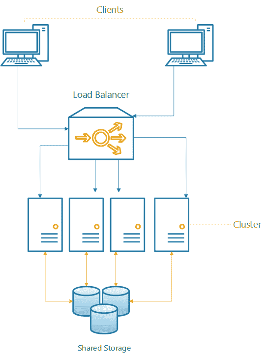

从技术上讲，集群允许工作负载通过添加具有相似资源特征的相同类型的服务器来扩展性能。理想情况下，集群将具有同质硬件，以避免节点具有不同性能特征的问题，并且同时使维护相对相同 - 这意味着具有相同 CPU 系列、内存配置和软件的硬件。向集群添加节点的想法允许您计算工作负载以减少其处理时间。根据应用程序，计算时间有时甚至可以线性减少。

为了进一步理解集群的概念，想象一下您有一个应用程序，它获取历史财务数据。然后，该应用程序接收这些数据并根据存储的信息创建预测。在单个节点上，预测过程（集群上的进程通常被称为作业）大约需要六天才能完成，因为我们处理了数 TB 的数据。添加具有相同特征的额外节点将处理时间缩短到四天。再添加第三个节点将进一步缩短完成时间至三天。

请注意，虽然我们增加了三倍的计算资源，但计算时间仅减少了大约一半。一些应用程序可以线性扩展性能，而其他应用程序则没有相同的可扩展性，需要更多的资源来获得更少的收益，直至收益递减的点。为了获得最小的时间收益，添加更多资源是不划算的。

考虑到所有这些，我们可以指出定义集群的几个特征：

+   它可以通过添加计算资源来帮助减少处理时间

+   它可以进行垂直和水平扩展

+   它可以是冗余的，也就是说，如果一个节点失败，其他节点应该接管工作负载

+   它可以允许增加资源以供应用程序使用

+   它是一个资源池，而不是单独的服务器

+   它没有单点故障

# 存储集群

现在我们已经了解了如何计算集群，让我们继续讨论集群的另一个应用。

存储集群的主要功能不是聚合计算资源以减少处理时间，而是聚合可用空间以提供最大的空间利用率，同时提供某种形式的冗余。随着存储大量数据的需求增加，需要以更低的成本进行存储，同时仍然保持增加的数据可用性。存储集群通过允许单个单片式存储节点一起工作，形成一个大型的可用存储空间池，来解决这个问题。因此，它允许存储解决方案在不需要部署专门的专有硬件的情况下达到 PB 级别。

例如，假设我们有一个单节点，可用空间为 500 TB，我们需要实现 1-**PB**标记，并提供冗余。这个单独的节点成为单点故障，因为如果它宕机，那么数据就无法访问。此外，我们已经达到了最大的**硬盘驱动器**（**HDD**）容量。换句话说，我们无法进行水平扩展。

为了解决这个问题，我们可以添加两个具有相同配置的节点，因为已经存在的节点提供了总共 1 PB 的可用空间。现在，让我们在这里做一些数学运算，500 TB 乘以 3 应该大约是 1.5 PB，对吗？答案绝对是肯定的。然而，由于我们需要为这个解决方案提供高可用性，第三个节点充当备份，使解决方案能够容忍单节点故障而不中断客户端的通信。这种允许节点故障的能力完全归功于 SDS 和存储集群的强大功能，比如 GlusterFS，接下来我们将探讨它。

# 什么是 GlusterFS？

GlusterFS 是 Gluster 的一个开源项目，该项目于 2011 年被 Red Hat 公司收购。这个收购并不意味着您必须获取 Red Hat 订阅或支付 Red Hat 才能使用它，因为正如前面提到的，它是一个开源项目；因此，您可以自由安装它，查看其源代码，甚至为项目做出贡献。尽管 Red Hat 提供基于 GlusterFS 的付费解决方案，但我们将在本章中讨论**开源软件**（**OSS**）和项目本身。

以下图表显示了 Gluster 项目中的**贡献者**和**提交**数量：


要理解 GlusterFS，我们必须了解它与传统存储的区别。为了做到这一点，我们需要了解 SDS 背后的概念，包括 GlusterFS 是什么。

传统存储是一个行业标准的存储阵列，其中包含专有软件，与硬件供应商绑定。所有这些都限制了您遵循存储提供商设定的一组规则：

1.  可扩展性限制

1.  硬件兼容性限制

1.  客户端操作系统限制

1.  配置限制

1.  供应商锁定

# SDS

有了 SDS，许多，如果不是所有，前面的限制都消失了，因为它通过不依赖于任何硬件提供了令人印象深刻的可扩展性。您基本上可以从任何供应商那里获取包含您所需存储的行业标准服务器，并将其添加到您的存储池中。只需执行这一简单步骤，您就已经克服了前面四个限制。

# 成本降低

*SDS*部分的示例大大降低了**运营费用**（**OPEX**）成本，因为你不必为现有供应商存储阵列购买昂贵的扩展架，这可能需要数周才能到货并安装。你可以快速获取存储在数据中心角落的服务器，并用它为现有应用程序提供存储空间。这个过程称为插件可扩展性，并且存在于大多数开源 SDS 项目中。从理论上讲，SDS 在可扩展性方面的潜力是无限的。

# 可扩展性

当你向存储池添加新服务器时，SDS 会扩展，并增加存储集群的弹性。根据你的配置，数据会分布在多个成员节点上，通过镜像或创建数据的奇偶校验提供额外的高可用性。

# 控制

你还需要明白，SDS 并不是从虚无中创造空间，也不会将存储的概念与硬件（如硬盘、**固态硬盘**（**SSD**）或任何旨在存储信息的硬件设备）分离。这些硬件设备将始终是实际数据存储的地方。SDS 添加了一个逻辑层，允许你控制数据的存储位置和方式。它利用了最基本的组件，即**应用程序编程接口**（**API**），允许你管理和维护存储集群和逻辑卷，为其他服务器、应用程序甚至自我修复集群的监控代理提供存储容量。

# 市场正在向 SDS 发展

SDS 是未来，这就是存储行业的发展方向。事实上，预测未来几年，大约 70%的当前存储阵列将作为纯软件解决方案或**虚拟存储设备**（**VSAs**）提供。传统的**网络附加存储**（**NAS**）解决方案比当前的 SDS 实施要贵 30%，中档磁盘阵列甚至更昂贵。考虑到每年企业数据消耗约增长 40%，成本仅下降 25%，你可以看到为什么我们在不久的将来会向 SDS 世界迈进。

随着在公共、私人和混合云中运行的应用数量不断增长，消费者和企业数据的消耗呈指数级增长。这些数据通常是使命关键的，并且需要高水平的弹性。以下是一些这些应用的列表：

+   电子商务和在线商店

+   金融应用

+   企业资源规划

+   医疗保健

+   大数据

+   客户关系管理

当公司存储这种类型的数据（称为**大数据**）时，他们不仅需要对其进行归档，还需要访问它，并且尽可能地降低延迟。想象一种情景，你在医生的预约中被要求进行 X 光检查，当你到达时，他们告诉你需要等一周才能得到你的扫描结果，因为他们没有存储空间来保存你的图像。当然，这种情况不会发生，因为每家医院都有一个高效的采购流程，他们可以根据存储消耗来预测使用情况，并决定何时开始购买和安装新的硬件，但你明白我的意思。在你的 SDS 层中安装一个符合 POSIX 标准的服务器并准备好使用，速度更快、更高效。

# 大规模存储

许多其他公司也需要数据湖作为辅助存储，主要是为了以原始形式存储数据以进行分析、实时分析、机器学习等。SDS 非常适合这种类型的存储，主要是因为所需的维护很少，还有我们之前讨论过的经济原因。

我们主要讨论了 SDS 的经济性和可扩展性，但也很重要提到它带来的高灵活性。SDS 可用于从存档数据和存储丰富媒体到为虚拟机（VM）提供存储，作为私有云中对象存储的端点，甚至在容器中。它可以部署在前面提到的任何基础设施上。它可以在您选择的公共云中运行，在您当前的本地虚拟基础设施中运行，甚至在 Docker 容器或 Kubernetes pod 中运行。事实上，它非常灵活，以至于您甚至可以使用称为 heketi 的 RESTful 管理接口将 Kubernetes 与 GlusterFS 集成，每当您需要为您的 pod 提供持久卷时，它都会动态分配卷。

# 块、文件和对象存储

现在我们已经了解了为什么 SDS 是下一代工作负载的未来，是时候深入了解使用 SDS 可以实现的存储类型了。

传统的存储区域网络（SAN）和 NAS 解决方案更常用的是使用诸如 Internet 小型计算机系统接口（iSCSI）、光纤通道（FC）、以太网上的光纤通道（FCoE）、网络文件系统（NFS）和服务器消息块（SMB）/通用互联网文件系统（CIFS）等协议提供存储。然而，由于我们更多地向云端迁移，我们的存储需求也发生变化，这就是对象存储发挥作用的地方。我们将探讨对象存储是什么，以及它与块和文件存储的比较。GlusterFS 也是一种文件存储解决方案，但它具有可以进一步配置的块和对象存储功能。

以下图表显示了块、文件和对象存储：

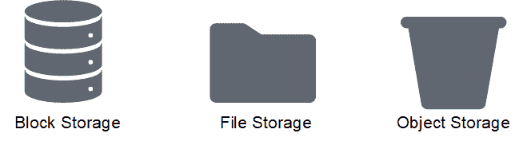

块存储、文件存储和对象存储在客户端存储数据的方式上有很大不同，因此它们的用途也完全不同。

# 块存储

SAN 主要是利用块存储的地方，使用诸如 FC 或 iSCSI 之类的协议，这些协议本质上是在 FC 和 TCP/IP 上映射 SCSI 协议。

典型的 FC SAN 如下图所示：

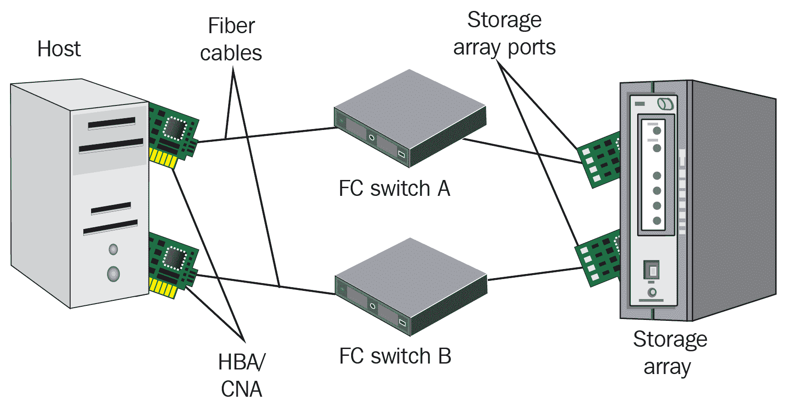

典型的 iSCSI SAN 如下图所示：

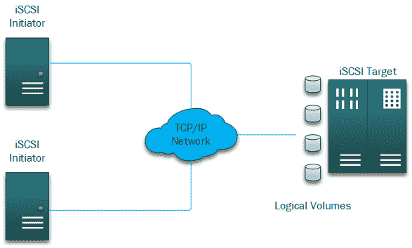

数据存储在逻辑块地址中。在检索数据时，应用程序通常会说：“我要从地址 XXYYZZZZ 获取 X 个块。”这个过程往往非常快（不到一毫秒），使得这种类型的存储在延迟上非常低，是一种非常事务性导向的存储形式，非常适合随机访问。然而，当涉及跨多个系统共享时，它也有其缺点。这是因为块存储通常以原始形式呈现，您需要在其上方使用一个文件系统，该文件系统可以支持在不同系统之间进行多次写入而不会损坏，换句话说，是一个集群文件系统。

当涉及到高可用性或灾难恢复时，这种类型的存储也有一些缺点；因为它以原始形式呈现，存储控制器和管理器因此不知道如何使用这种存储。因此，当涉及将其数据复制到恢复点时，它只考虑块，并且一些文件系统在回收或清零块时表现糟糕，这导致未使用的块也被复制，从而导致存储利用不足。

由于其优势和低延迟，块存储非常适合结构化数据库、随机读/写操作以及存储多个虚拟机镜像，这些镜像查询磁盘时可能有数百甚至数千次的 I/O 请求。为此，集群文件系统被设计为支持来自不同主机的多次读写。

然而，由于其优点和缺点，块存储需要相当多的维护和管理——您需要关注要放在块设备上的文件系统和分区。此外，您还需要确保文件系统保持一致和安全，具有正确的权限，并且在访问它的所有系统中没有损坏。虚拟机中还有其他文件系统存储在其虚拟磁盘中，这也增加了另一层复杂性——数据可以写入虚拟机的文件系统和超级管理程序的文件系统。两个文件系统都有文件的进出，它们需要适当地清零以便在薄量复制场景中回收块，正如我们之前提到的，大多数存储阵列并不知道实际写入它们的数据。

# 文件存储

另一方面，文件存储或 NAS 要简单得多。您不必担心分区，也不必担心选择和格式化适合多主机环境的文件系统。

NAS 通常使用 NFS 或 SMB/CIFS 协议，主要用于将数据存储在共享文件夹中作为非结构化数据。这些协议在扩展性或满足云中面临的高媒体需求方面并不是很好，比如社交媒体服务以及每天创建/上传成千上万张图片或视频。这就是对象存储发挥作用的地方，但我们将在本章后面讨论对象存储。

文件存储，顾名思义，是在文件级别的存储上工作，当您向 NAS 发出请求时，您请求的是文件或文件系统中的一部分，而不是一系列逻辑地址。对于 NAS，这个过程是从主机（存储被挂载的地方）中抽象出来的，您的存储阵列或 SDS 负责访问后端的磁盘并检索您请求的文件。文件存储还具有本地功能，如文件锁定、用户和组集成（当我们谈论 OSS 时，主要是指 NFS），安全性和加密。

尽管 NAS 为客户端提供了抽象和简化，但它也有其缺点，因为 NAS 在很大程度上，如果不是完全地，依赖于网络。它还有一个额外的文件系统层，延迟远高于块存储。许多因素可能导致延迟或增加往返时间（RTT）。您需要考虑诸如您的 NAS 距离客户端有多少跳、TCP 窗口缩放，或者设备访问文件共享时未启用巨帧。此外，所有这些因素不仅影响延迟，而且在涉及 NAS 解决方案的吞吐量时起着关键作用，这也是文件存储最擅长的地方。

以下图表展示了文件存储共享的多功能性：

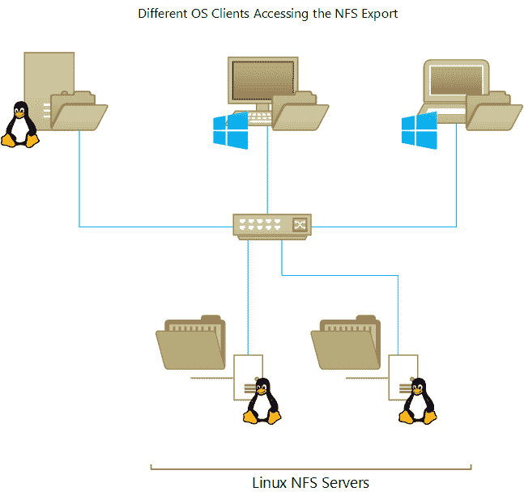

# 对象存储

对象存储与 NAS（文件存储）和 SAN（块存储）完全不同。尽管数据仍然通过网络访问，但数据检索的方式是独特不同的。您不会通过文件系统访问文件，而是通过使用 HTTP 方法的 RESTful API 访问。

对象存储在一个扁平的命名空间中存储，可以存储数百万甚至数十亿个对象；这是其高可扩展性的关键，因为它不受节点数量的限制，就像常规文件系统（如 XFS 和 EXT4）一样。重要的是要知道，命名空间可以有分区（通常称为存储桶），但它们不能像文件系统中的常规文件夹那样嵌套，因为命名空间是扁平的：

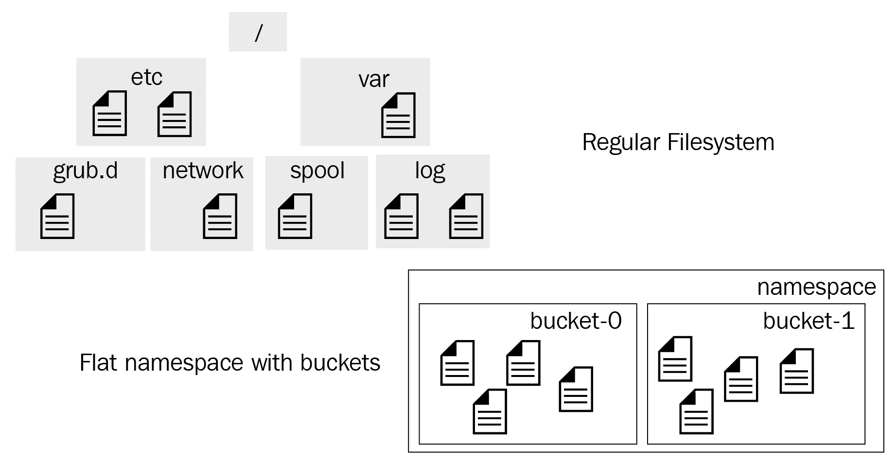

在将对象存储与传统存储进行比较时，经常使用自动停车与代客泊车的类比。为什么这类似呢？因为在传统文件系统中，当你存储文件时，你将其存储在一个文件夹或目录中，你需要记住文件存储的位置，就像把车停在一个停车位上一样，你需要记住你的车停在哪个号码和楼层。另一方面，使用对象存储时，当你上传数据或将文件放入一个存储桶时，你会得到一个唯一的标识符，以后可以用来检索它；你不需要记住它存储在哪里。就像代客泊车员会为你取车一样，你只需要给他们你离开车时收到的票。

继续使用代客泊车的比喻，通常你会给代客泊车提供关于他们需要为你取车的信息，不是因为他们需要，而是因为这样可以更好地识别你的车，比如车的颜色、车牌号或车型将对他们有很大帮助。对象存储的过程也是一样的。每个对象都有自己的元数据、唯一 ID 和文件本身，这些都是存储对象的一部分。

下图显示了对象存储中包含的对象的组成部分：

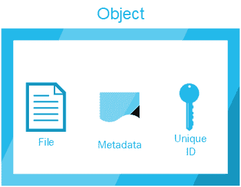

正如我们已经多次提到的，对象存储是通过 RESTful API 访问的。因此，理论上，任何支持 HTTP 协议的设备都可以通过 HTTP 方法（如 PUT 或 GET）访问你的对象存储桶。这听起来不安全，但事实上，大多数软件定义的对象存储都有某种类型的身份验证方法，你需要一个身份验证令牌才能检索或上传文件。使用 Linux 的 curl 工具的简单请求可能如下所示：

```
curl -X PUT -T "${path_to_file}" \
  -H "Host: ${bucket_name}.s3.amazonaws.com" \
  -H "Date: ${date}" \
  -H "Content-Type: ${contentType}" \
  -H "Authorization: AWS ${s3Key}:${signature}" \
  https://${bucket}.s3.amazonaws.com/${file}
```

在这里，我们可以看到多个不同的设备如何通过 HTTP 协议连接到云中的对象存储桶：

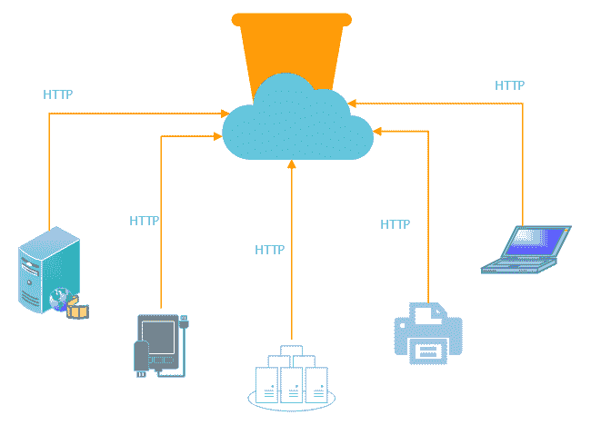

# 为什么选择 GlusterFS？

现在我们了解了 SDS、存储集群以及块、文件和对象存储之间的区别，我们可以看一下企业客户选择 GlusterFS 作为他们存储需求的一些原因。

正如之前所述，GlusterFS 是一个 SDS，它是一个位于传统本地存储挂载点之上的层，允许将多个节点之间的存储空间聚合成单个存储实体或存储集群。GlusterFS 可以在私有、公共或混合云上运行。尽管其主要用途是文件存储（NAS），但几个插件允许它通过 gluster-block 插件用作块存储的后端，通过 gluster-swift 插件用作对象存储的后端。

定义 GlusterFS 的一些主要特点如下：

+   商品硬件

+   可以部署在私有、公共或混合云上

+   没有单点故障

+   可扩展性

+   异步地理复制

+   性能

+   自愈

+   灵活性

# GlusterFS 特点

让我们逐个了解这些特点，以了解为什么 GlusterFS 对企业客户如此有吸引力。

# 商品硬件- GlusterFS 几乎可以运行在任何东西上

从树莓派上的 ARM（高级精简指令集计算机）到各种 x86 硬件，Gluster 只需要作为砖块使用的本地存储，为卷奠定基础存储。不需要专用硬件或专门的存储控制器。

在其最基本的配置中，可以使用单个格式为 XFS 的磁盘与单个节点一起使用。虽然不是最佳配置，但可以通过添加更多的砖块或更多的节点来实现进一步的增长。

# GlusterFS 可以部署在私有、公共或混合云上

从容器镜像到专用于 GlusterFS 的完整 VM，对云客户来说，一个主要的吸引点是，由于 GlusterFS 仅仅是软件，它可以部署在私有、公共或混合云上。因为没有供应商，跨不同云提供商的卷是完全可能的。允许使用高可用性设置的多云提供商卷，这样当一个云提供商出现问题时，卷流量可以转移到完全不同的提供商，几乎没有或没有停机时间，这取决于配置。

# 无单点故障

根据卷配置，数据分布在集群中的多个节点上，消除了单点故障，因为没有`head`或`master`节点控制集群。

# 可扩展性

GlusterFS 允许通过垂直添加新的砖块或通过水平添加新的节点来平稳扩展资源。

所有这些都可以在线完成，而集群提供数据，而不会对客户的通信造成任何中断。

# 异步地理复制

GlusterFS 采用无单点故障概念，提供地理复制，允许数据异步复制到完全不同地理数据中心的集群中。

以下图表显示了跨多个站点的地理复制：

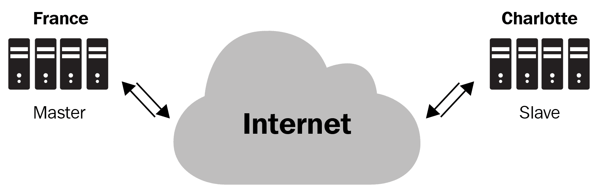

# 性能

由于数据分布在多个节点上，我们还可以同时有多个客户端访问集群。从多个来源同时访问数据的过程称为并行性，GlusterFS 通过将客户端指向不同的节点来实现增加性能。此外，通过添加砖块或节点，可以增加性能，有效地通过水平或垂直扩展。

# 自愈

在意外停机的情况下，剩余节点仍然可以提供流量服务。如果在其中一个节点宕机时向集群添加了新数据，则需要在节点恢复后同步这些数据。

GlusterFS 将在访问这些新文件时自动自愈，触发节点之间的自愈操作并复制丢失的数据。这对用户和客户是透明的。

# 灵活性

GlusterFS 可以部署在现有硬件或虚拟基础设施上，也可以作为 VM 在云上部署，或作为容器。它的部署方式并不受限制，客户可以决定最适合他们需求的方式。

# 远程直接内存访问（RDMA）

RDMA 允许 Gluster 服务器和 Gluster 客户端之间进行超低延迟和极高性能的网络通信。GlusterFS 可以利用 RDMA 进行高性能计算（HPC）应用和高并发工作负载。

# Gluster 卷类型

通过了解 GlusterFS 的核心特性，我们现在可以定义 GlusterFS 提供的不同类型的卷。这将有助于我们在接下来的章节中深入讨论 GlusterFS 解决方案的实际设计。

GlusterFS 提供了选择最适合工作负载需求的卷类型的灵活性；例如，对于高可用性要求，我们可以使用复制卷。这种类型的卷在两个或更多节点之间复制数据，导致每个节点的精确副本。

让我们快速列出可用的卷类型，稍后我们将讨论它们各自的优缺点：

+   分布式

+   复制

+   分布式复制

+   分散

+   分布式分散

# 分布式

顾名思义，数据分布在卷和节点的砖块之间。这种类型的卷允许可用空间的无缝和低成本增加。主要缺点是没有数据冗余，因为文件分配在可能在同一节点或不同节点上的砖块之间。它主要用于高存储容量和并发应用。

将这种卷类型视为**一堆磁盘**（JBOD）或线性**逻辑卷管理器**（LVM），其中空间只是聚合而没有任何分割或奇偶校验。

以下图表显示了一个分布式卷：

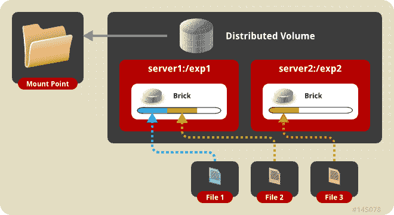

# 复制

在复制卷中，数据被复制到不同节点上的砖块上。扩展复制卷需要添加相同数量的副本。例如，如果我有一个带有两个副本的卷，我想要扩展它，我需要总共四个副本。

复制卷可以与 RAID1 相比，其中数据在所有可用节点之间进行镜像。它的缺点之一是可扩展性相对有限。另一方面，它的主要特点是高可用性，因为即使在意外停机的情况下，数据也可以被访问。

对于这种类型的卷，必须实施机制来避免脑裂情况。当新数据被写入卷时，不同的节点集被允许分别处理写入时就会发生脑裂。服务器仲裁是这样一种机制，因为它允许存在一个决胜者。

以下图表显示了一个复制卷：

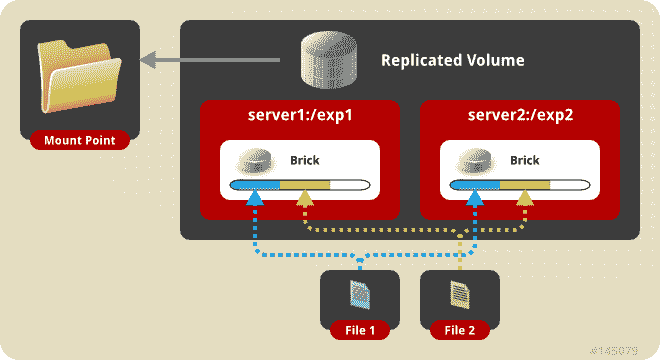

# 分布式复制

分布式复制卷类似于复制卷，其主要区别在于复制卷是分布式的。为了解释这一点，考虑有两个单独的复制卷，每个卷有 10TB 的空间。当两者都被分布时，卷最终拥有总共 20TB 的空间。

当需要高可用性和冗余性时，主要使用这种类型的卷，因为集群可以容忍节点故障。

以下图表显示了一个分布式复制卷：

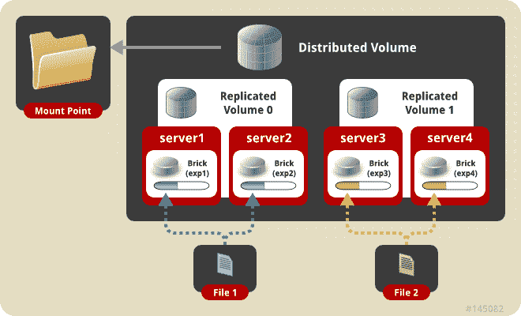

# 分散

分散卷通过在所有可用的砖块上分割数据，并同时允许冗余性，兼具分布式和复制卷的优点。砖块应该是相同大小的，因为一旦最小的砖块满了，卷就会暂停所有写入。例如，想象一个分散卷，比如 RAID 5 或 6，数据被分割并创建奇偶校验，允许从奇偶校验中重建数据。虽然这个类比帮助我们理解这种类型的卷，但实际过程完全不同，因为它使用了数据被分成片段的纠错码。分散卷提供了性能、空间和高可用性的正确平衡。

# 分布式分散

在分布式分散卷中，数据分布在分散类型的卷中。冗余性是在分散卷级别提供的，具有与分布式复制卷相似的优势。

想象一下在两个 RAID 5 阵列之上的 JBOD 上存储数据——扩展这种类型的卷需要额外的分散卷。虽然不一定是相同的大小，但理想情况下，它应该保持相同的特性以避免复杂性。

# 对高度冗余存储的需求

随着应用程序可用空间的增加，对存储的需求也在增加。应用程序可能需要随时访问它们的信息，而不会出现任何可能导致整个业务连续性受到威胁的中断。没有公司希望出现停机，更不用说中央基础设施的中断导致损失、客户无法服务和用户因错误决策而无法登录到他们的帐户。

让我们考虑将数据存储在传统的单片存储阵列上——这样做可能会带来重大风险，因为一切都集中在一个地方。一个包含公司所有信息的大型存储阵列意味着操作风险，因为该阵列容易出现故障。每一种硬件——无论多么好——都会在某个时候出现故障。

单体阵列倾向于通过在磁盘级别使用传统的 RAID 方法来提供某种形式的冗余来处理故障。虽然这对为数百用户提供服务的小型本地存储来说是不错的，但是当我们达到 PB 级别并且存储空间和活跃并发用户大幅增加时，这可能不是一个好主意。在特定情况下，RAID 恢复可能导致整个存储系统崩溃或性能下降到应用程序无法正常工作的程度。此外，随着磁盘容量的增加和单个磁盘性能在过去几年内保持不变，现在恢复单个磁盘需要更长的时间；重建 1TB 磁盘不同于重建 10TB 磁盘。

存储集群，如 GlusterFS，通过提供最适合工作负载的方法来处理冗余。例如，当使用复制卷时，数据从一个节点镜像到另一个节点。如果一个节点宕机，那么流量会无缝地转向剩余的节点，对用户来说完全透明。一旦问题节点得到处理，它可以迅速重新加入集群，在那里它将进行数据的自我修复。与传统存储相比，存储集群通过将数据分发到集群的多个成员来消除单点故障。

提高可用性意味着我们可以达到应用程序服务级别协议并保持所需的正常运行时间。

# 灾难恢复

逃不过灾难——无论是自然灾害还是人为错误。重要的是我们为此做好了多少准备，以及我们能多快多高效地恢复。

实施灾难恢复协议对业务连续性至关重要。在继续之前，有两个术语我们需要了解：**恢复时间目标**（**RTO**）和**恢复点目标**（**RPO**）。让我们快速浏览一下每个术语。RTO 是从故障或事件导致中断开始恢复所需的时间。简单地说，它指的是我们可以多快将应用程序恢复正常。另一方面，RPO 指的是数据可以在不影响业务连续性的情况下回溯多远的时间，也就是说，你可以丢失多少数据。

RPO 的概念看起来像这样：

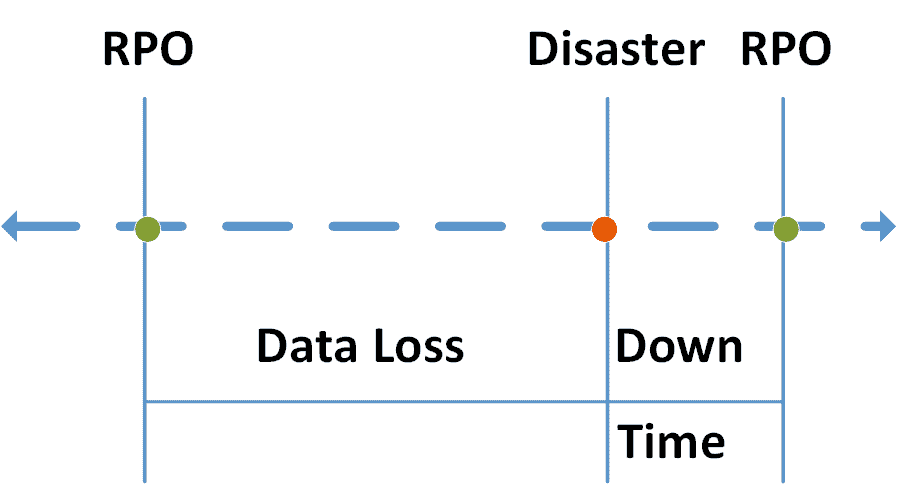

# RTO

如前所述，这是在故障后恢复功能所需的时间。根据解决方案的复杂性，RTO 可能需要相当长的时间。

根据业务需求，RTO 可能只有几个小时。这就是设计高度冗余解决方案的作用所在——通过减少恢复所需的时间。

# RPO

这是可以丢失的数据量，仍然可以返回到恢复点的时间，换句话说，这是恢复点被采取的频率；在备份的情况下，备份的频率（可以是每小时、每天或每周），以及在存储集群的情况下，更改的复制频率。

需要考虑的一点是变化可以被复制的速度，因为我们希望变化几乎可以立即被复制；然而，由于带宽限制，实时复制大多数时候是不可能的。

最后，需要考虑的一个重要因素是数据如何被复制。一般来说，有两种类型的复制：同步和异步。

# 同步复制

同步复制意味着数据在写入后立即复制。这对于最小化 RPO 是有用的，因为从一个节点到另一个节点的数据之间没有等待或漂移。GlusterFS 复制的卷提供了这种复制。带宽也应该被考虑，因为更改需要立即提交。

# 异步复制

异步复制意味着数据在时间片段内复制，例如，每 10 分钟。在设置过程中，根据业务需求和可用带宽等多个因素选择 RPO。

带宽是主要考虑因素；这是因为根据更改的大小，实时复制可能无法适应 RPO 窗口，需要更长的复制时间，直接影响 RPO 时间。如果有无限带宽可用，应选择同步复制。

回顾过去，作为 IT 架构师，我们花费了大量时间试图找出如何使我们的系统更具弹性。事实上，成功降低 RTO 和 RPO 时间可能标志着部分考虑周到的解决方案和完全设计良好的设计之间的差异。

# 高性能的需求

随着越来越多的用户访问相同的资源，响应时间变慢，应用程序开始处理时间变长。传统存储的性能在过去几年没有改变——单个 HDD 的吞吐量约为 150 MB/s，响应时间为几毫秒。随着闪存介质和诸如非易失性内存扩展（NVMe）之类的协议的引入，单个 SSD 可以轻松实现每秒几十亿字节的吞吐量和亚毫秒的响应时间；SDS 可以利用这些新技术提供增加的性能并显著减少响应时间。

企业存储被设计为处理数百个客户的多个并发请求，这些客户都希望尽快获取他们的数据，但当性能限制达到时，传统的单体存储开始变慢，导致应用程序失败，因为请求未能及时完成。提高这种类型存储的性能代价高，并且在大多数情况下，无法在存储仍在提供数据的情况下完成。

增加性能的需求来自存储服务器负载的增加；随着数据消费的激增，用户存储的信息量比以往更多，并且需要比以前更快地获取。

应用程序还需要尽快将数据传递给它们；例如，考虑股票市场，数千用户每秒多次请求数据。与此同时，另外一千用户不断地写入新数据。如果单个交易未能及时提交，人们将无法根据正确的信息做出买卖股票的决定。

前面的问题是架构师在设计能够提供应用所需性能的解决方案时必须面对的问题。花费适当的时间正确规划存储解决方案可以使整个流程更加顺畅，减少设计和实施之间的来回。

诸如 GlusterFS 之类的存储系统可以同时为数千个并发用户提供服务，而不会出现性能显著下降，因为数据分布在集群中的多个节点上。这种方法比访问单个存储位置（例如传统阵列）要好得多。

# 并行 I/O

I/O 是指向存储系统请求和写入数据的过程。该过程通过 I/O 流进行，数据一次请求一个块、文件或对象。

并行 I/O 是指多个流同时在同一存储系统上执行操作的过程。这增加了性能并减少了访问时间，因为各种文件或块同时读取或写入。

相比之下，串行 I/O 是执行单个 I/O 流的过程，这可能会导致性能降低和延迟或访问时间增加。

存储集群（如 GlusterFS）利用并行 I/O 的优势，因为数据分布在多个节点上，允许多个客户端同时访问数据，而不会出现延迟或吞吐量下降。

# 总结

在本章中，我们深入了解了集群的核心概念，并将其定义为一组计算机节点，它们一起处理相同类型的工作负载。计算集群的主要功能是执行运行 CPU 密集型工作负载的任务，旨在减少处理时间。存储集群的功能是将可用的存储资源聚合到一个单一的存储空间中，简化管理，并允许您有效地达到 PB 级别或超过 1PB 的可用空间。然后，我们探讨了 SDS 如何改变数据存储方式，以及 GlusterFS 是领导这一变革的项目之一。SDS 允许简化存储资源的管理，同时添加了传统的单片式存储阵列无法实现的功能。

为了进一步了解应用程序与存储的交互方式，我们定义了块、文件和对象存储之间的核心区别。主要地，块存储处理存储设备中的逻辑数据块，文件存储通过从存储空间读取或写入实际文件来工作，对象存储为每个对象提供元数据以进行进一步交互。有了这些不同存储交互方式的概念，我们继续指出了使 GlusterFS 对企业客户具有吸引力的特征，以及这些特性如何与 SDS 的定义联系起来。

最后，我们深入探讨了为什么高可用性和高性能对于每个存储设计都是必不可少的主要原因，以及如何执行并行或串行 I/O 会影响应用程序性能。

在下一章中，我们将深入探讨架构 GlusterFS 存储集群的实际过程。

# 问题

1.  我如何优化我的存储性能？

1.  GlusterFS 更适合哪种工作负载？

1.  哪些云提供商提供对象存储？

1.  GlusterFS 提供哪些类型的存储？

1.  红帽是否拥有 GlusterFS？

1.  我使用 GlusterFS 需要付费吗？

1.  Gluster 是否提供灾难恢复或复制？

# 进一步阅读

+   * Ceph Cookbook – Second Edition * by Vikhyat Umrao and Michael Hackett: [`prod.packtpub.com/in/virtualization-and-cloud/ceph-cookbook-second-edition`](https://prod.packtpub.com/in/virtualization-and-cloud/ceph-cookbook-second-edition)

+   * Mastering Ceph * by Nick Fisk: [`prod.packtpub.com/in/big-data-and-business-intelligence/mastering-ceph`](https://prod.packtpub.com/in/big-data-and-business-intelligence/mastering-ceph)

+   * Learning Ceph – Second Edition * by Anthony D'Atri and Vaibhav Bhembre: [`prod.packtpub.com/in/virtualization-and-cloud/learning-ceph-second-edition`](https://prod.packtpub.com/in/virtualization-and-cloud/learning-ceph-second-edition)
