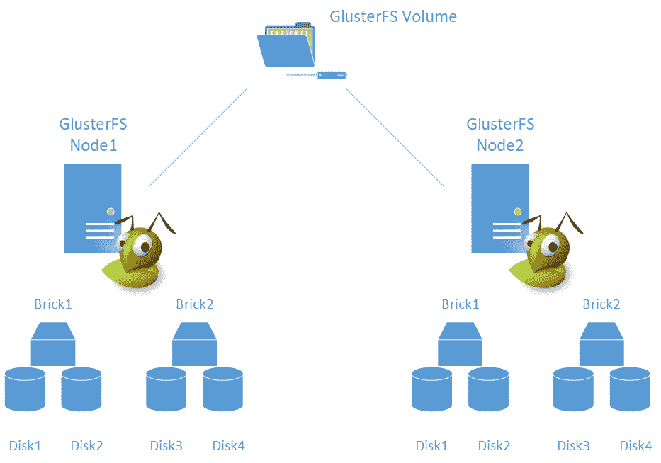
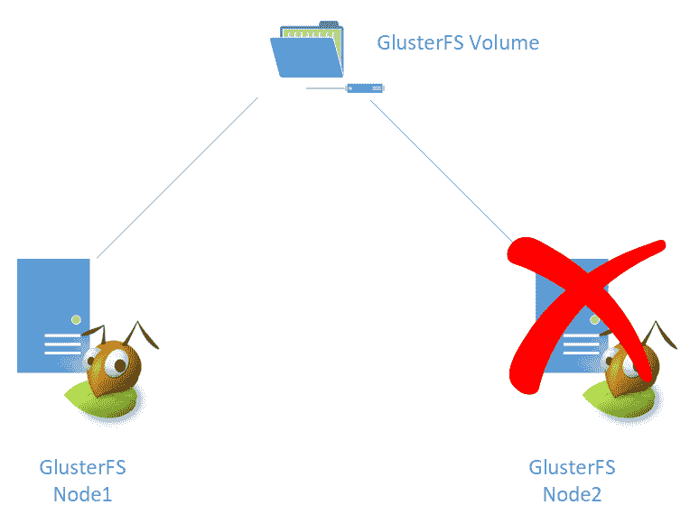
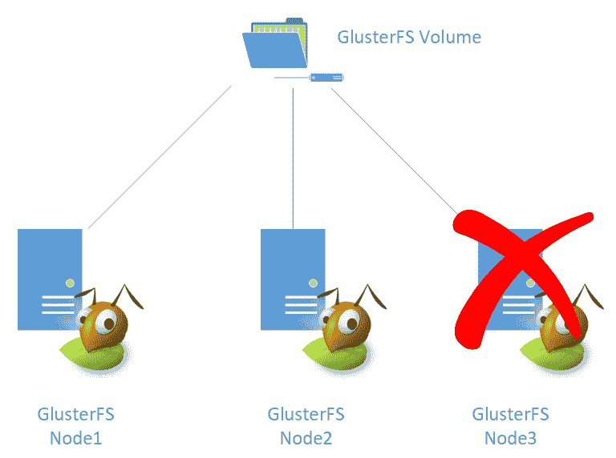
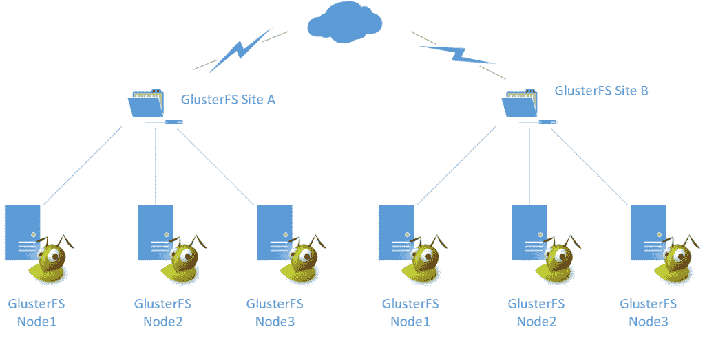
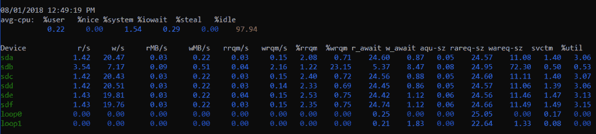

# 第三章：设计存储集群

软件定义的存储已经改变了我们存储数据的方式；随着功能的增加，设计正确解决方案时需要考虑的要求也在增加。在设计存储集群时需要考虑大量的变量。

本章探讨了使用 GlusterFS 及其各种组件实现软件定义存储解决方案的不同设计方面。

在本章中，我们将涵盖以下主题：

+   GlusterFS 计算需求

+   选择合适的存储大小

+   定义性能需求

+   决定高可用性的正确方法

+   确定工作负载如何联系在一起

# 技术要求

对于本章，我们将使用以下网址上提供的 GlusterFS 文档：

+   [`www.gluster.org/`](https://www.gluster.org/)

+   [`github.com/gluster/glusterfs`](https://github.com/gluster/glusterfs)

# GlusterFS 计算需求

与任何软件一样，GlusterFS 有一组由开发人员定义的要求，以确保其按预期工作。文档中描述的实际要求相对较低，几乎每台在过去 10 年中销售的计算机都可以运行 GlusterFS。这可能不是最佳性能水平，但它仍然显示了在混合条件下运行的灵活性。

对于计算需求，我们主要有以下两个资源需要考虑在设计使用 GlusterFS 的解决方案时：

+   内存

+   CPU

# 内存

对于内存，选择相对简单——尽可能多地使用。不幸的是，没有无限的内存，但尽可能多地使用内存这一说法是非常真实的，因为 GlusterFS 使用 RAM 作为每个节点的读取缓存，同时 Linux 内核使用内存作为预读缓存，以加快对频繁访问的文件的读取速度。

根据砖块布局和选择的文件系统，可用内存在读取性能中起着重要作用。以使用高级 ZFS 文件系统的砖块为例，它使用 RAM 作为其自适应替换缓存（ARC）。这增加了一个额外的缓存层，位于高速 RAM 上。缺点是它会消耗尽可能多的内存，因此选择提供大量内存的服务器会有很大帮助。

GlusterFS 并不需要大量的内存——每个节点拥有 32GB 或更多的内存可以确保缓存足够大，以分配频繁访问的文件，如果通过在每个节点上添加更多的砖块来扩展集群的规模，那么应该考虑增加更多的内存，以增加缓存的可用内存。

# 为什么缓存很重要？

考虑以下：即使是旧的 DDR2 内存技术也可以提供 GBps 级的吞吐量和几纳秒的延迟。另一方面，从常规旋转介质（硬盘驱动器）读取的吞吐量在大多数情况下峰值为 150MBps，延迟在几百毫秒。

从缓存中读取总是比访问磁盘快——等待磁盘移动其磁头，找到请求的数据块，然后将其发送回控制器并传递到应用程序。

需要记住的一件事是，缓存需要先预热；这是允许系统确定哪些文件经常被访问，然后将数据移动到缓存中的过程。在预热期间，请求会变慢，因为它们首先必须从磁盘中获取。

# CPU

任何软件都需要 CPU 周期，GlusterFS 也不例外。CPU 要求相对较低，并且取决于所使用的卷的类型，例如，**复制卷**比**分散卷**需要更少的 CPU。

CPU 需求也受到砖块使用的文件系统类型和其具有的功能的影响。回到 ZFS 的例子，如果启用了压缩，这会增加 CPU 的负载，而没有足够的 CPU 资源会大大降低性能。

对于简单的存储服务器和在 brick 级别没有高级功能的情况，任何四个 CPU 或更多的都足够了。当启用文件系统功能，比如压缩时，需要八个或更多的 CPU 以获得最佳性能。此外，更多的 CPU 允许对集群进行更多并发 I/O。这在为高性能计算（HPC）应用程序设计存储集群时至关重要，其中成千上万的用户同时进行 I/O 操作。

使用以下规则作为一般的经验法则：

+   对于高并发工作负载，选择更多的 CPU，超过八个 CPU，取决于并发级别

+   对于低性能要求和成本效益的解决方案，选择较少数量的 CPU，例如四个 CPU

# 云考虑

许多云提供商为其虚拟机大小提供了一组固定的资源，不允许自定义 vCPU 到 RAM 的比例。找到合适的平衡取决于哪种 VM 大小提供了必要的资源。

GlusterFS 在云中的概念将在接下来的章节中进一步探讨。然而，为了对这个概念有一个概述，让我们使用微软的 Azure 提供的 VM 大小来探索一下。

Azure VM 系列从通用计算到特定工作负载，如 GPU。对于 GlusterFS，我们真的很喜欢 L 系列 VM，这些 VM 针对存储工作负载进行了优化。这个 VM 系列具有良好的 vCPU 到 RAM 比例，并提供了任何系列中最高的存储性能与成本比。

这个一般的想法可以应用到其他云供应商。应选择提供优秀和具有成本效益的 vCPU 到 RAM 比例的 VM 大小。

# 你需要多少空间？

如果我们可以使用我们需要的空间，那不是很好吗？实际上，存储是有成本的，无限的存储是不存在的。

在确定可用存储空间时，必须考虑以下因素：

+   GlusterFS 卷类型

+   应用程序需要的空间

+   预期增长

# GlusterFS 卷类型

让我们从一些技术考虑开始。每个 GlusterFS 卷在可用空间方面都有特点。根据卷类型，最终可用空间可能比您最初计算的要少。我们将探讨我们在第二章中描述的每种卷类型的空间考虑，*定义 GlusterFS 存储*。

# 分布式

这种卷类型相当简单。每个节点的可用空间之和是全局命名空间（GlusterFS 卷挂载的另一个名称）上的总空间。

例如，一个 50TB 卷的请求，砖块所需的空间恰好是 50TB。这可以分成每个 10TB 的五个节点或每个 25TB 的两个节点。

# 复制

对于复制卷，一半的可用原始砖块空间用于数据的镜像或复制。这意味着在确定这种类型的卷的大小时，您需要至少将所请求的存储容量加倍。这取决于卷的具体配置。一个经验法则是可用容量是砖块上总空间的一半。

例如，如果请求的是 50TB 卷，节点配置应该至少在两个节点之间有 100TB 的砖块空间。

# 分散

分散卷的大小更难确定，因为它们的功能类似于 RAID 5，其中数据分布在节点上，并且一个节点的容量用于奇偶校验。这取决于卷的配置，但您可以预期随着节点数的增加，空间利用效率会提高。

进一步解释，对于一个 50 TB 的卷的请求，可以在 6 个节点上配置，每个节点有 10 TB。请注意额外考虑了一个节点。选择 5 个每个 10 TB 的节点会导致只有 40 TB 的卷，这不符合请求的大小。

# 应用程序所需的空间

每个应用程序都有自己的一套要求，存储要求和其他要求一样重要。

提供媒体文件需要的资源比用户较少且媒体文件不多的网站要多得多。准确了解存储系统的预期使用方式可以正确地确定解决方案的大小，并防止存储估算不足以满足最初需求的情况发生。

确保你了解应用程序开发人员推荐的最低要求，并了解它如何与存储交互，因为这有助于避免头疼的情况。

# 预期增长

作为架构师，你的工作是提出正确的问题。在涉及存储时，确保增长率或变化率被考虑在内。

考虑到数据增长是无法避免的，提前思考可以避免复杂的情况，即没有足够的空间，因此为未来的利用留出一些余地是一个好的做法。允许 10%或更多的空间应该是一个很好的起点，所以如果请求 50 TB 的空间，那么在解决方案中再增加 5 TB 的空间。

选择最具成本效益的路线。虽然 GlusterFS 允许无缝扩展，但尽量避免使用这个功能作为简单的解决方案，并确保从一开始就定义了正确的大小，并考虑了未来的增长。

# 性能考虑

性能差的应用程序可能比根本无法工作的应用程序更糟糕。让某些东西一半的时间工作是非常令人沮丧和对任何企业来说成本高昂的。

作为架构师，你需要设计满足规格或更好的解决方案，以避免由于性能不佳而导致问题的情况。

首先要做的是定义性能要求是什么。大多数情况下，应用程序开发人员在他们的文档中提到了性能要求。不满足这些最低要求意味着应用程序要么根本无法工作，要么几乎无法工作。这两种情况都是不可接受的。

设计面向性能的解决方案时需要注意以下几点：

+   吞吐量

+   延迟

+   IOPS

+   I/O 大小

# 吞吐量

吞吐量是在一定时间内传输的数据量的函数，通常以兆字节每秒（MBps）描述。这意味着每秒从存储系统发送或接收 X 数量的数据。

根据工作负载的不同，最高吞吐量可能无法实现，因为应用程序无法执行足够大或足够快的 I/O 操作。这里没有硬性建议的数字。尽量追求最高可能的吞吐量，并确保存储集群能够维持所需的并发级别所需的传输速率。

# 延迟

延迟是至关重要的，需要额外小心，因为一些应用程序对高延迟或响应时间非常敏感。

延迟是衡量 I/O 操作完成所需的时间的指标，通常以毫秒为单位（1 秒等于 1000 毫秒）。高延迟或响应时间会导致应用程序响应时间变长，甚至完全停止工作。

力求达到最低的延迟。这是一个情况，其中获得最低可能的数字总是最好的方法。在延迟方面，没有不够的情况，或者在这种情况下，响应时间不够短。考虑你使用的存储介质类型。传统的硬盘驱动器的响应时间（或寻道时间）在几百毫秒范围内，而新型固态硬盘可以达到亚毫秒甚至微秒的水平。

# IOPS

每秒输入/输出操作是一定时间内（在本例中是秒）的一定数量的操作的函数。这是衡量每秒可以执行多少操作的指标，许多应用程序提供了关于 IOPS 的最低要求。

大多数应用程序提供了其所需的最低 IOPS 要求。确保满足这些要求，否则应用程序可能无法按预期运行。

在设计存储解决方案时，确保 IOPS 被视为在制定大小决策时的主要决定因素。

# I/O 大小

I/O 大小是每个操作执行的数据量。这取决于工作负载类型，因为每个应用与存储系统的交互方式不同。I/O 大小直接影响了之前提到的性能方面。

较小的 I/O 会导致较低的吞吐量，但如果足够快，会导致更高的 IOPS 和较低的延迟。另一方面，较大的 I/O 提供更高的吞吐量，但通常会产生较低的 IOPS，因为在相同的时间内执行较少的操作。

关于 I/O 大小没有明确的建议。在理想的、不现实的世界中，I/O 足够大且足够快，这会导致高吞吐量和高 IOPS。但在现实中，要么是一个，要么是另一个。小的 I/O 在吞吐量方面较慢，但完成得足够快，因此 IOPS 似乎更高。而大的 I/O 则相反，吞吐量更高，但由于完成时间较长，IOPS 下降。

# GlusterFS 性能

在设计 GlusterFS 存储集群时，需要考虑以下方面，以便提高性能：

+   卷类型

+   砖块布局

+   节点数量

+   调整参数

# 卷类型

所选的卷以不同的方式影响性能，因为 GlusterFS 为每种类型分配数据方式不同。

例如，复制卷在节点之间镜像数据，而分散卷试图最大化节点使用并并行使用它们。

如果性能是分散或分布式卷的主要目标，请考虑分布卷不提供冗余，而分散卷则以性能降级为代价提供冗余。

# 砖块布局

将所有磁盘都放在一个大的砖块中的节点与将磁盘分组在较小数量的砖块中的节点性能表现不同。砖块布局是性能的最大贡献因素，因为这直接决定了磁盘的使用方式。

如果所有磁盘最终都放在一个砖块中，性能会受到影响。通常，更多的砖块和较少的磁盘会带来更好的性能和更低的延迟。

考虑为构成砖块的磁盘配置软件 RAID0。例如，您可以有 10 个可用的磁盘，并且为了简单起见，可以在单个砖块上配置所有 10 个磁盘的 RAID0。或者，您可以选择更高效的方式，配置五个砖块，其中每个砖块由 RAID0 中的两个磁盘组成。

这也可以实现更平稳的增长，因为添加更多砖块并不需要添加大量的磁盘。您应该以更少的磁盘组成更多的砖块为目标。

在下图中，我们可以看到每个砖块由两个不同的磁盘组成：



# 节点数量

增加集群中节点的数量可以实现更高的并发性。虽然性能增益可能不是线性的，但增加节点可以允许更多的用户和应用程序访问卷。

目标是拥有足够的节点以实现可用空间和并发性的平衡。这里没有固定的数量，但作为架构师，您的工作是通过测试来定义特定解决方案的正确节点数量。在 POC 阶段，使用较少的节点进行测试，并检查性能是否可接受。

# 调整参数

文件系统可调参数，如块大小，可以发挥重要作用，目标是使工作负载 I/O 大小、GlusterFS 卷块大小和文件系统块大小相匹配。

通常，4K 是最常用的块大小，适用于一般工作负载。对于大量的小文件，选择较小的块大小。对于大文件，选择较大的块大小，例如 1M。

# 实现高可用性的最佳方法

使用 GlusterFS，高可用性可以通过卷配置实现；决定如何实现取决于应用程序需求、可用空间和所需性能。

由于 GlusterFS 处理高可用性，因此无需在存储单元级别配置任何形式的冗余。特别是在云实例和虚拟机中，没有可以出问题的物理磁盘。对于物理安装，通过为本地磁盘配置 RAID5 或 RAID6 来增加额外的冗余层总是更好，以实现性能和弹性的平衡。现在，让我们继续使用云部署。

使用 GlusterFS 时，只有两种卷类型提供高可用性：复制和分散。复制卷相对较简单，因为数据只是从一个节点复制到另一个节点。这提供了较低的性能，但配置、部署和维护都相对容易。

# 复制

当不需要极端性能时，请选择复制卷。根据卷应该容忍的节点或存储单元数量选择副本的数量。请考虑使用更高的副本数量将减少可用空间的数量，但会增加卷的可用性。

以下示例显示，丢失复制卷中的一个节点不会中断卷的运行：



# 分散

分散卷在高可用性和性能之间提供了良好的平衡；当两者都是要求时，这应该是首选卷。配置分散卷是一个更复杂的过程，因为冗余是像 RAID5 设置一样处理的，其中一个节点被用作奇偶校验。冗余值可以在卷创建时选择，这允许更大的灵活性。

在下图中，您可以看到丢失一个节点不会中断卷的运行：



当存在特定需求时，请计划高可用性。请记住，卷类型可以混合使用。例如，分布式复制卷将具有良好的可用空间和冗余性的混合。

# 地理复制

地理复制允许通过本地网络或互联网在不同站点之间进行数据的异步复制。这通过在不同地理位置拥有数据的副本来提供高可用性，并确保在发生故障时进行灾难恢复。

当存在需要额外冗余层的特定用例时，考虑使用地理复制路线。请记住，这是异步复制，因此在发生灾难时，请考虑前几章中解释的 RPO 和 RTO 时间。

以下图表让您对地理复制的工作原理有一个大致的了解——**站点 A**通过广域网复制到**站点 B**：



# 工作负载如何定义需求

将视频文件传送到流媒体服务器与托管大型数据库不同。I/O 是以完全不同的方式进行的，了解工作负载与存储系统的交互方式对成功地确定和设计强大的存储解决方案至关重要。

# 文档

当尝试确定存储需求时，应用程序文档是您的最佳伙伴。当应用程序已经存在时，询问管理员软件对性能的期望以及当不满足最低要求时的反应。

# 系统工具

使用诸如`iostat`之类的工具可以很好地了解应用程序与存储的交互方式，例如通过使用以下命令：

```
iostat -dxctm 1
```

前面的代码显示了每个块设备的使用情况，`areq-sz`列（以前称为`avgrq-sz`）显示了以千字节为单位的平均请求大小，这是了解应用程序通常使用的 I/O 大小的良好起点。

输出看起来类似于以下截图：



在前面的图像中，我们可以欣赏到块设备及其相应的性能。

# 文件类型和大小

举例来说，为媒体流服务器设计存储解决方案需要使用大块大小，因为媒体文件往往比小文本文件大。如果你为砖块使用更大的块大小，GlusterFS 卷不仅会更有效地利用空间，还将允许更快的操作，因为事务大小与文件大小匹配。

另一方面，传感器日志记录的存储服务器通常会创建包含文本的大量小文件，因此需要较小的块大小来匹配正在创建的文件的大小。使用较小的块大小可以避免为仅有 1K 大小的文件分配整个块（例如 4K）。

# 提出正确的问题

作为架构师，您的目标是确保工作负载非常清晰。存储服务器的预期用途定义了需要分配多少资源。未能这样做可能导致资源浪费，这反过来意味着浪费金钱，或者在最坏的情况下，可能导致解决方案无法按规格执行，从而导致应用程序失败和用户无法工作。

从第一章中记住，*设计方法论简介*：提出正确的问题。在调整存储解决方案时，您可以问以下问题：

+   当前实施消耗了多少空间（如果已经有一个）？

+   应用程序的性能要求是什么？

+   有多少用户与应用程序交互？

+   是否需要高可用性？

+   应用程序如何存储其数据？

+   它是否创建大文件并向其附加数据？

+   它是否创建大量小文件？

这些问题的可能答案可能是以下内容：

+   目前，该应用程序消耗了 20TB，但我们预计每个月增长 5%，并稳定在 80TB。

+   该应用程序需要至少 100MB/s 的吞吐量和不超过 10ms 的延迟。

+   目前，大约有 300 个用户可以访问该应用程序；同时，我们已经看到了 150 个用户的高峰，但我们预计用户数量将显著增加。

+   我们可以忍受一段时间无法访问存储，但我们确实需要能够相对快速地从故障中恢复，并且可能在外部有数据的副本。

+   应用程序主要将其信息保存在小文件中。

+   它不附加数据，如果需要更多空间，它只是创建更多小文件。

+   是的，我们已经看到创建了数千个大小不超过 4KB 的文件。

从前面的例子中，您可以推断出该应用程序创建了大量小文件，并且可以容忍一段时间的停机，但需要外部复制以实现平稳的灾难恢复。性能要求似乎相对较高，因此我们可以选择启用地理复制的分散或分布式卷。

# 总结

设计存储解决方案的过程需要了解许多变量。在本章中，我们确定了决定需要多少空间取决于 GlusterFS 卷类型、应用程序要求和数据利用率的预估增长。

根据卷类型，可用空间会受到影响，分布式卷会聚合所有可用空间，使其成为最节省空间的卷，而复制卷使用一半可用原始空间进行镜像。

应用程序和用户群决定了需要多少空间。这是因为，根据所提供的数据类型，存储需求会发生变化。提前考虑并规划存储增长可以避免资源耗尽的潜在风险，并且在大小确定时至少留出 10%的缓冲区应该适应大多数情况。

通过性能要求，我们定义了吞吐量、延迟、IOPS 和 I/O 大小的概念，以及它们如何相互作用。我们定义了在为 GlusterFS 配置最佳性能时涉及的变量，每个卷都具有其性能特征，以及在尝试优化 GlusterFS 卷时砖块布局起着重要作用。

我们还定义了高可用性要求如何影响大小，以及每个卷提供不同级别的 HA。当需要灾难恢复时，GlusterFS 地理复制通过将数据复制到另一个物理区域提供所需的可用性级别，从而在发生灾难时平稳恢复服务。

最后，我们讨论了工作负载如何定义解决方案的设计，以及如何使用工具来验证应用程序与存储的交互方式，从而正确配置存储集群。我们还了解了文件类型和大小如何定义性能行为和空间利用率，以及如何提出正确的问题可以更好地理解工作负载，从而实现更高效和优化的解决方案。

最重要的是要始终询问应用程序和工作负载如何与其资源交互。这可以实现最高效的设计。

在下一章中，我们将介绍 GlusterFS 所需的实际配置。

# 问题

1.  GlusterFS 的计算要求是什么？

1.  GlusterFS 如何使用 RAM？

1.  什么是缓存？

1.  并发性如何影响 CPU 大小？

1.  GlusterFS 卷如何影响可用空间？

1.  应用程序需要多少空间？

1.  什么是预期增长？

1.  什么是吞吐量、延迟 IOPS 和 I/O 大小？

1.  什么是砖块布局？

1.  什么是地理复制？

# 进一步阅读

+   *架构数据密集型应用* by Anuj Kumar

+   *Microsoft Azure 存储基础* by Chukri Soueidi

+   *Ritesh Modi 的 Azure 架构师*
