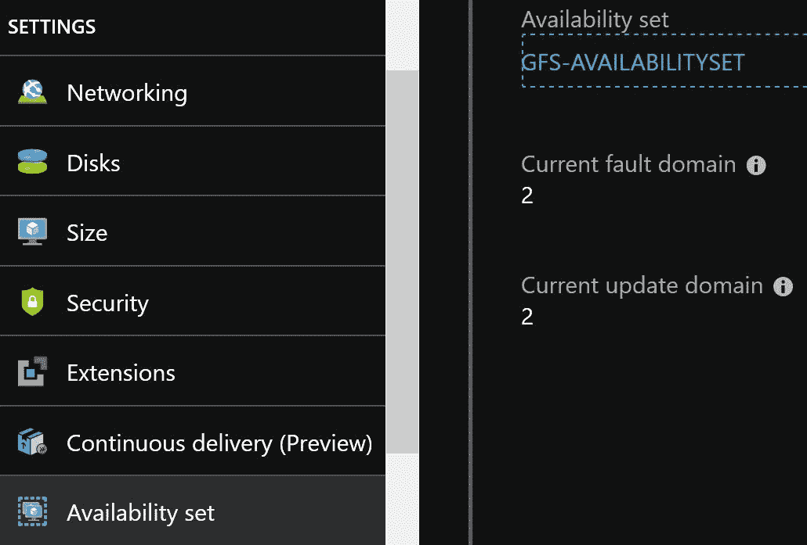
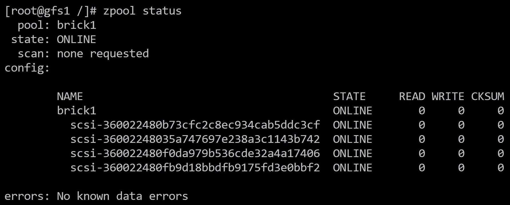
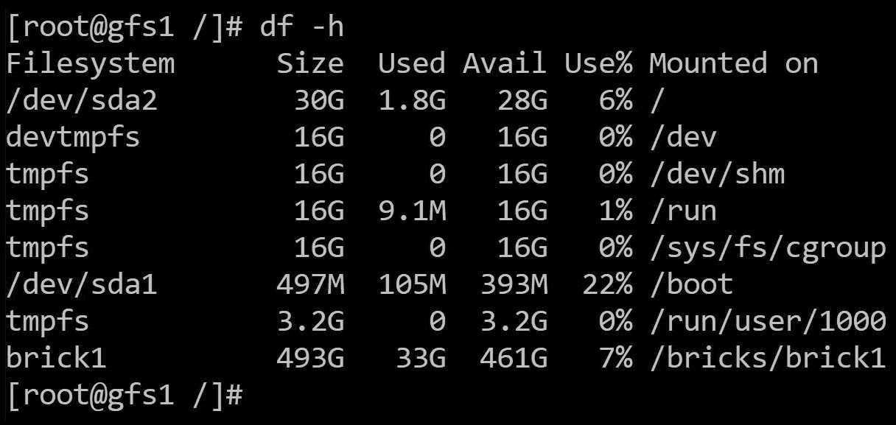
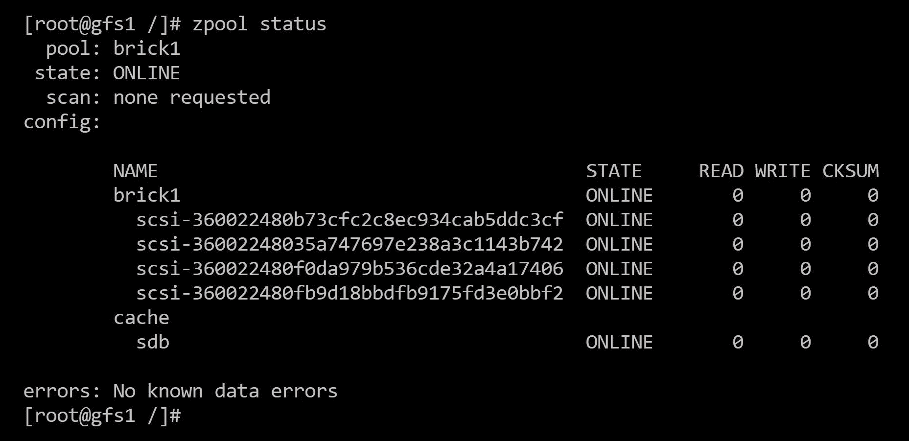
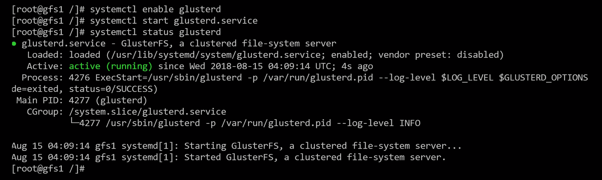
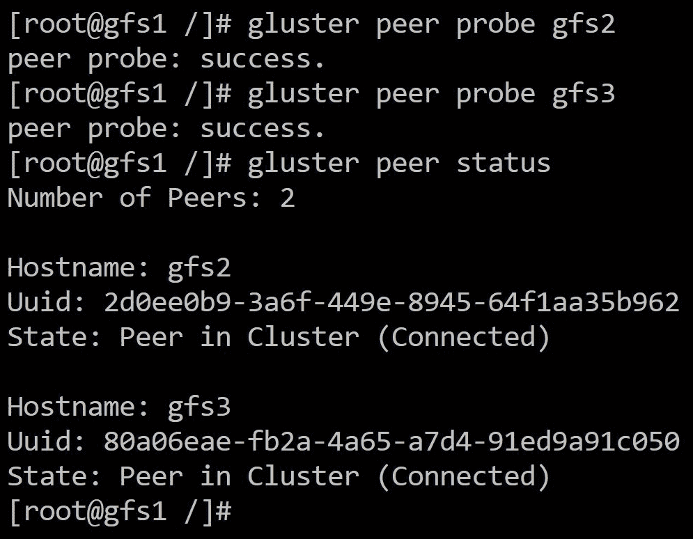
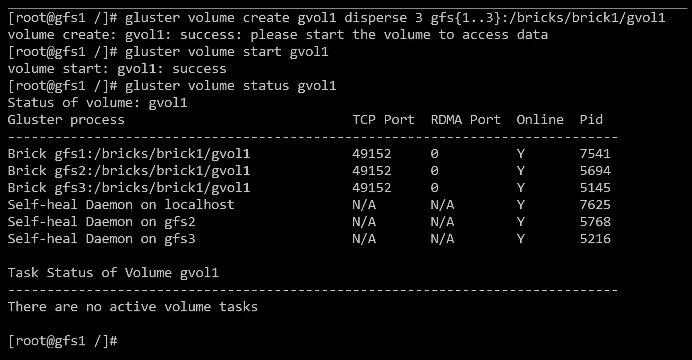

# 第四章：在云基础设施上使用 GlusterFS

在对 GlusterFS 的核心概念有了很好的理解之后，我们现在可以深入到存储集群的安装、配置和优化中。

我们将在 Azure 上使用云提供商搭建一个三节点集群的 GlusterFS，作为本示例的云提供商。然而，这些概念也可以应用于其他云提供商。

在本章中，我们将涵盖以下主题：

+   配置 GlusterFS 后端存储

+   安装和配置 GlusterFS

+   设置卷

+   优化性能

# 技术要求

本章的技术资源列表如下：

+   Azure 虚拟机（VM）大小的详细视图：

[`docs.microsoft.com/en-us/azure/virtual-machines/linux/sizes-storage`](https://docs.microsoft.com/en-us/azure/virtual-machines/linux/sizes-storage)

+   Azure 磁盘大小和类型的详细视图：

[`azure.microsoft.com/en-us/pricing/details/managed-disks/`](https://azure.microsoft.com/en-us/pricing/details/managed-disks/)

+   ZFS on Linux 项目的主页：

[`github.com/zfsonlinux/zfs/wiki/RHEL-and-CentOS`](https://github.com/zfsonlinux/zfs/wiki/RHEL-and-CentOS)

+   CentOS 上的 GlusterFS 安装指南：

[`wiki.centos.org/HowTos/GlusterFSonCentOS`](https://wiki.centos.org/HowTos/GlusterFSonCentOS)

+   GlusterFS 在 Gluster 网站上的快速入门指南：

[`docs.gluster.org/en/latest/Quick-Start-Guide/Quickstart/`](https://docs.gluster.org/en/latest/Quick-Start-Guide/Quickstart/)

+   在管理员指南上设置 GlusterFS 卷：

[`docs.gluster.org/en/latest/Administrator%20Guide/Setting%20Up%20Volumes/`](https://docs.gluster.org/en/latest/Administrator%20Guide/Setting%20Up%20Volumes/)

+   GlusterFS 调整卷以获得更好的性能：

[`docs.gluster.org/en/latest/Administrator%20Guide/Managing%20Volumes/#tuning-options`](https://docs.gluster.org/en/latest/Administrator%20Guide/Managing%20Volumes/#tuning-options)

# 设置用于后端存储的砖

以下是我们将使用的组件列表：

+   Azure L4s VM，具有 4 个 vCPU 和 32GB 的 RAM

+   每个 VM 有四个 S10 128GB 的磁盘

+   CentOS 7.5

+   ZFS on Linux 作为砖的文件系统

+   一个由四个磁盘组成的单个 RAID 0 组

+   GlusterFS 4.1

# Azure 部署

在深入讨论如何配置砖之前，我们首先需要在 Azure 中部署节点。在本示例中，我们使用存储优化的 VM 系列，即 L 系列。值得一提的是，Azure 提供了一个 30 天的免费试用期，可以用于在承诺任何部署之前进行测试。

在 Azure 中，性能在几个级别上进行定义。第一级是 VM 限制，即 VM 允许的最大性能。L 系列家族提供了价格与性能的正确平衡，因为这些 VM 经过优化，提供了更高的 IOPS 和吞吐量，而不是提供高计算或内存资源。性能定义的第二级是通过连接到 VM 的磁盘。在本示例中，我们将使用标准的硬盘驱动器作为一种经济实惠的解决方案。如果需要更高的性能，磁盘可以随时迁移到高级的固态硬盘存储。

本示例的确切 VM 大小将是 L4s，提供四个 vCPU 和 32GB 的 RAM，足够用于一般用途的小型存储集群。在正确配置时，最大可达 125MB/s 和 5k IOPS，仍然保持可观的性能。

最近推出了一代新的面向存储优化的 VM，提供了一个本地可访问的 2 TB NVMe SSD。此外，它提供了增加的核心数和内存，使这些新的 VM 成为 GlusterFS 设置与**Z 文件系统**（**ZFS**）的理想选择。新的 L8s_v2 VM 可以用于这个特定的设置，产品页面上可以看到大小和规格（[`docs.microsoft.com/en-us/azure/virtual-machines/linux/sizes-storage#lsv2-series`](https://docs.microsoft.com/en-us/azure/virtual-machines/linux/sizes-storage#lsv2-series)）。

以下截图显示了可用性集、当前故障域和当前更新域的设置：



在 Azure 中部署 GlusterFS 设置时，请确保每个节点都落在不同的更新和故障域上。这是通过使用可用性集来实现的（参考前面的截图）。这样做可以确保如果平台重新启动一个节点，其他节点仍然保持运行并提供数据。

最后，对于 Azure 设置，我们需要每个节点**512 GB**，总共 1.5 TB 原始空间，或 1 TB 可用空间。实现这一点的最具成本效益的方法是使用单个**S20 512 GB**磁盘，因为每月每千兆字节的价格约为**$0.04**。选择单个磁盘会影响性能，因为单个标准磁盘只提供最大 500 IOPS 和 60 MB/s。考虑性能并接受我们在成本方面会失去一些效率的事实，我们将使用四个**S10 128** GB 磁盘组成单个 RAID0 组。**S10**磁盘每月每千兆字节的价格为**$0.05**，而**S20**磁盘每月每千兆字节的价格为**$0.04**。您可以参考以下表格，其中计算是基于托管磁盘的成本除以其相应的大小进行的：


确保所有三个节点都部署在同一区域和相同的资源组中，以保持一致性。

# ZFS 作为砖的后端

我们在第三章中讨论了 ZFS，*构建存储集群*。ZFS 是由 Sun Microsystems 开发的文件系统，后来被 Oracle 收购。该项目后来被开源，并移植到了 Linux。尽管该项目仍处于测试阶段，但大多数功能都运行良好，大部分问题已经排除，该项目现在专注于添加新功能。

ZFS 是一个软件层，将磁盘管理、逻辑卷和文件系统合而为一。诸如压缩、**自适应替换缓存**（**ARC**）、重复数据删除和快照等高级功能使其成为与 GlusterFS 作为砖的后端一起使用的理想选择。

# 安装 ZFS

让我们从安装 ZFS 开始；有一些依赖项，比如**动态内核模块**（**DKMS**），它们存放在 EPEL 存储库中。

请注意，这里运行的大多数命令都假定是以 root 身份运行的；可以在每个命令之前加上`sudo`作为非 root 帐户运行命令。

要安装所需的组件，我们可以使用以下命令：

```
yum install -y epel-release
yum install -y http://download.zfsonlinux.org/epel/zfs-release.el7_5.noarch.rpm
```

接下来，我们将使用以下命令：

```
yum install -y zfs
```

以下命令用于启用 ZFS 组件：

```
systemctl enable zfs.target
systemctl enable --now zfs-import-scan.service
```

# 配置 zpools

安装并启用 ZFS 后，我们现在可以创建 zpools。Zpool 是在 ZFS 中创建的卷的名称。

由于我们将使用由四个磁盘组成的单个 RAID 0 组，我们可以创建一个名为`brick1`的 zpool；这需要在所有三个节点上完成。此外，让我们创建一个名为`bricks`的目录，位于根目录（`/`）下；这个目录包含了一个带有砖名称的目录下的砖。执行此操作所需的命令如下：

```
mkdir -p /bricks/brick1
```

这将创建目录树，如下所示：

```
zpool create brick1 /dev/disk/by-id/scsi-360022480f0da979b536cde32a4a17406 \
 /dev/disk/by-id/scsi-360022480fb9d18bbdfb9175fd3e0bbf2 \
/dev/disk/by-id/scsi-360022480fb9d18bbdfb9175fd3e0bae4 \
/dev/disk/by-id/scsi-360022480fb9d18bbdfb9175fd3e049f2
```

进一步解释该命令，`brick1`是 zpool 的名称。然后，我们指示磁盘的路径。在本例中，我们使用磁盘的 ID，因为这样可以避免磁盘更改顺序时出现问题。虽然 ZFS 不受磁盘顺序不同的影响，但最好通过使用永远不会更改的 ID 来避免问题。

ZFS 可以使用整个磁盘，因为它会自动创建所需的分区。

创建`zpool`实例后，我们可以使用`zpool status`命令检查是否已正确完成：



让我们启用压缩并将池的挂载点更改为先前创建的目录。要执行此操作，请运行以下命令：

```
zfs set compression=lz4 brick1
```

您还需要运行以下命令：

```
zfs set mountpoint=/bricks/brick1 brick1
```

第一个命令使用`lz4`算法启用压缩，其 CPU 开销较低。第二个命令更改了 zpool 的挂载点。在更改设置时，请确保使用正确的池名称。

完成此操作后，我们应该在`df`命令中看到 ZFS 卷已挂载在`/bricks/brick1`下：



我们需要在最近添加的挂载点上创建一个目录以用作 brick；共识是使用卷的名称。在这种情况下，我们将卷命名为`gvol1`，然后简单地创建目录：

```
mkdir -p /bricks/brick1/gvol1
```

这需要在所有节点上完成。

# 将 ZFS 缓存添加到池中（可选）

在 Azure 中，每个 VM 都有一个临时资源驱动器。这个临时资源驱动器的性能比添加到它的数据磁盘要高得多。这个驱动器是临时的，这意味着一旦 VM 被取消分配，数据就会被擦除；由于不需要在重新启动时持续保留数据，这应该非常适合作为读取缓存驱动器。

由于驱动器在每次`stop/deallocate/start`周期中都会被擦除，因此我们需要调整一些 ZFS 的单元文件，以允许在每次重新启动时添加磁盘。驱动器将始终是`/dev/sdb`，并且由于不需要在其上创建分区，因此我们可以简单地告诉 ZFS 在系统引导时每次将其添加为新磁盘。

可以通过编辑位于`/usr/lib/systemd/system/zfs-mount.service`下的`zfs-mount.service`的`systemd`单元来实现。这种方法的问题在于 ZFS 更新将覆盖对先前单元所做的更改。解决此问题的一种方法是运行`sudo systemctl edit zfs-mount`并添加以下代码：

```
[Service]
ExecStart=/sbin/zpool remove brick1 /dev/sdb
ExecStart=/sbin/zpool add brick1 cache /dev/sdb
```

要应用更改，请运行以下命令：

```
systemctl daemon-reload
```

现在，我们已确保缓存驱动器将在每次重新启动后添加，我们需要更改在 Azure VM 上运行的 Linux 代理的特定于 Azure 的配置。该代理负责创建临时资源驱动器，由于我们将用于其他目的，因此我们需要告诉代理不要创建临时磁盘。为实现此目的，我们需要编辑位于`/etc/waagent.conf`中的文件，并查找以下行：

```
ResourceDisk.Format=y
```

然后，您需要将其更改为以下行：

```
ResourceDisk.Format=n
```

完成此操作后，我们可以通过运行以下命令将缓存驱动器添加到池中：

```
zpool add brick1 cache /dev/sdb -f 
```

`-f`选项只能在第一次使用时使用，因为它会删除先前创建的文件系统。请注意，需要对 VM 进行`stop/deallocate/start`周期以阻止代理程序默认格式化资源磁盘，因为它默认会得到一个`ext4`文件系统。

先前的过程也可以应用于使用更快的 NVMe 驱动器的新 Ls_v2 VM，例如 L8s_v2；只需将`/dev /sdb`替换为`/dev/nvme0n1`。

您可以验证缓存磁盘是否已添加如下：



由于我们将使用单个 RAID 组，因此这将用作整个 brick 的读取缓存，从而在读取 GlusterFS 卷的文件时提供更好的性能。

# 在节点上安装 GlusterFS

每个节点已经配置了砖块后，我们最终可以安装 GlusterFS。安装相对简单，只需要几个命令。

# 安装软件包

我们将使用 CentOS 提供的软件包。要安装 GlusterFS，我们首先安装存储库如下：

```
yum install -y centos-release-gluster41
```

然后，我们安装`glusterfs-server`软件包：

```
yum install -y glusterfs-server
```

然后，确保启用并启动`glusterd`服务：



这些命令需要在将成为集群一部分的每个节点上运行；这是因为每个节点都需要启用软件包和服务。

# 创建受信任的池

最后，我们需要创建一个受信任的池。受信任的池是将成为集群一部分的节点列表，其中每个 Gluster 节点都信任其他节点，从而允许创建卷。

要创建受信任的池，请从第一个节点运行以下代码：

```
gluster peer probe gfs2
gluster peer probe gfs3
```

您可以按以下方式验证节点是否显示：



该命令可以从任何节点运行，并且主机名或 IP 地址需要修改以包括其他节点。在这种情况下，我已将每个节点的 IP 地址添加到`/etc/hosts`文件中，以便进行简单的配置。理想情况下，主机名应该在 DNS 服务器上注册，以便在网络内进行名称解析。

安装完成后，`gluster`节点应允许创建卷。

# 创建卷

我们现在已经到达可以创建卷的阶段；这是因为我们已经配置了砖块并且安装了 GlusterFS 所需的软件包。

# 创建分散卷

我们将在三个节点之间使用分散卷类型，以实现高可用性和性能的良好平衡。所有节点的原始空间总共约为 1.5 TB；但是，分布式卷的可用空间将约为 1 TB。

要创建分散卷，请使用以下代码：

```
gluster volume create gvol1 disperse 3 gfs{1..3}:/bricks/brick1/gvol1
```

然后，使用以下代码启动卷：

```
gluster volume start gvol1
```

确保使用以下代码正确启动：

```
gluster volume status gvol1
```

现在应该显示卷如下：



# 挂载卷

卷现在已创建，并且可以在客户端上挂载；最好的方法是使用本机的`glusterfs-fuse`客户端进行此操作，它允许在其中一个节点宕机时自动进行故障转移。

要安装`gluster-fuse`客户端，请使用以下代码：

```
yum install -y glusterfs-fuse
```

然后，在根目录下创建一个名为`gvol1`的目录：

```
mkdir /gvol1
```

最后，我们可以按以下方式在客户端上挂载 GlusterFS 卷：

```
mount -t glusterfs gfs1:/gvol1 /gvol1
```

您指定的节点并不重要，因为可以从任何节点访问卷。如果其中一个节点宕机，客户端将自动将 I/O 请求重定向到剩余的节点。

# 优化性能

创建和挂载卷后，我们可以调整一些参数以获得最佳性能。主要是在文件系统级别（在本例中为 ZFS）和 GlusterFS 卷级别上进行性能调整。

# GlusterFS 调优

在这里，主要变量是`performance.cache-size`。此设置指定要分配为 GlusterFS 卷的读取缓存的 RAM 量。默认情况下，它设置为 32 MB，这相当低。鉴于所选的 VM 具有足够的 RAM，可以使用以下命令将其提高到 4 GB：

```
gluster volume set gvol1 performance.cache-size 4GB
```

一旦集群开始增长，另一个重要的参数是`performance.io-thread-count`。这控制卷生成多少 I/O 线程。默认值为`16`个线程，对于中小型集群来说足够了。但是，一旦集群规模开始增大，可以将其加倍。要更改此设置，请使用以下命令：

```
gluster volume set gvol1 performance.io-thread-count 16
```

应该测试此设置，以检查增加计数是否改善性能。

# ZFS

我们将主要更改两个设置：ARC 和 L2ARC feed 性能。

# ARC

ZFS 的主要设置是其读取缓存，称为 ARC。允许分配更多的 RAM 给 ZFS 可以大大提高读取性能。由于我们已经为 Gluster 卷读取缓存分配了 4GB，并且 VM 有 32GB 可用，我们可以为 ZFS 分配 26GB 的 RAM，这将留下大约 2GB 给操作系统。

要更改 ARC 允许的最大大小，使用以下代码：

```
echo 27917287424 > /sys/module/zfs/parameters/zfs_arc_max
```

在这里，数字是以字节为单位的 RAM 数量，本例中为 26GB。这样做会即时更改设置，但不会使其持久化。要在引导时应用设置，创建一个名为`/etc/modprobe.d/zfs.conf`的文件，并添加以下值：

```
options zfs zfs_arc_max=27917287424
```

通过这样做，您可以使更改在引导时持久化。

# L2ARC

L2ARC 是指第二级读取缓存；这是先前添加到 zpools 的缓存磁盘。改变数据馈送到缓存的速度有助于减少将常访问文件填充到缓存中所需的时间。该设置以每秒字节为单位指定。要更改它，可以使用以下命令：

```
echo 2621440000 > /sys/module/zfs/parameters/l2arc_max_write
```

与前面的设置一样，这适用于运行的内核。要使其持久化，将以下行添加到`/etc/modprobe.d/zfs.conf`文件中：

```
options zfs l2arc_write_max=2621440000
```

此设置允许最大 256MB/s 的 L2ARC feed；如果 VM 大小更改为更高级别，则应将设置至少增加一倍。

最后，您应该在每个节点上得到一个类似这样的文件：


关于 ZFS，在其他类型的文件系统上，改变块大小有助于提高性能。ZFS 具有可变的块大小，允许小文件和大文件实现类似的结果，因此无需更改此设置。

# 总结

安装 ZFS、创建 zpools、安装 GlusterFS 和创建卷后，我们得到了一个性能可观的解决方案，可以承受节点故障并仍然为其客户端提供数据。

对于设置，我们使用 Azure 作为云提供商。虽然每个提供商都有自己的一套配置挑战，但核心概念也可以在其他云提供商上使用。

然而，这种设计有一个缺点。当向 zpools 添加新磁盘时，条带不对齐，导致新的读取和写入产生较低的性能。通过一次添加整套磁盘可以避免这个问题；较低的读取性能大部分由 RAM 上的读取缓存(ARC)和缓存磁盘(L2ARC)覆盖。

对于 GlusterFS，我们使用了一个平衡性能和高可用性的分散布局。在这个三节点集群设置中，我们可以承受一个节点故障，而不会阻止来自客户端的 I/O。

主要的要点是在设计解决方案时要有批判性的思维。在这个例子中，我们利用现有的资源来实现一个符合规格并利用我们提供的配置的解决方案。确保您始终问自己这个设置将如何影响结果，以及如何更改它以使其更有效。

在下一章中，我们将测试和验证设置的性能。

# 问题

+   什么是 GlusterFS 的 bricks？

+   什么是 ZFS？

+   什么是 zpool？

+   什么是缓存磁盘？

+   如何安装 GlusterFS？

+   什么是受信任的池？

+   如何创建 GlusterFS 卷？

+   什么是 performance.cache-size？

+   什么是 ARC？

# 进一步阅读

+   *通过 Geoff Webber-Cross 学习 Microsoft Azure*：[`www.packtpub.com/networking-and-servers/learning-microsoft-azure`](https://www.packtpub.com/networking-and-servers/learning-microsoft-azure)

+   *通过 Florian Klaffenbach、Jan-Henrik Damaschke 和 Oliver Michalski 实施 Azure 解决方案*：[`www.packtpub.com/virtualization-and-cloud/implementing-azure-solutions`](https://www.packtpub.com/virtualization-and-cloud/implementing-azure-solutions)

+   《Azure 架构师》作者 Ritesh Modi：[`www.packtpub.com/virtualization-and-cloud/azure-architects`](https://www.packtpub.com/virtualization-and-cloud/azure-architects)
