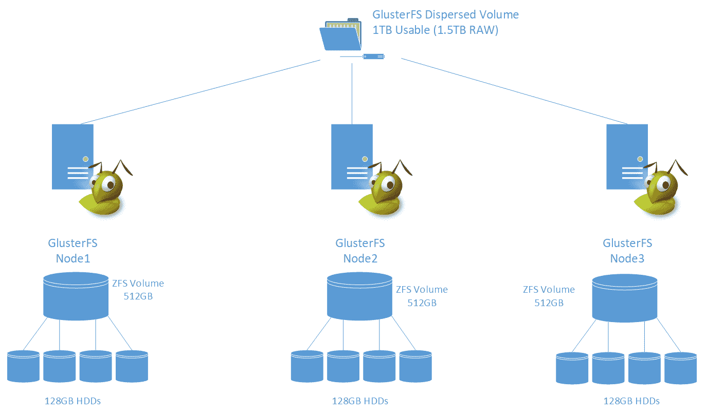
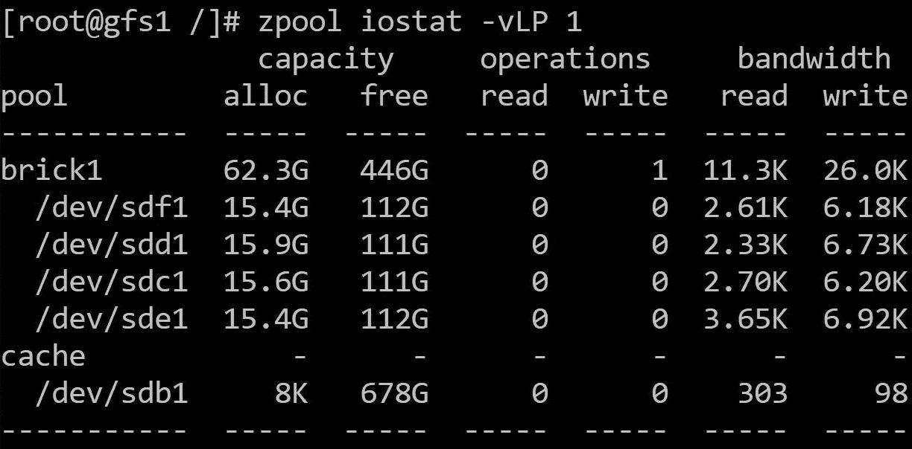
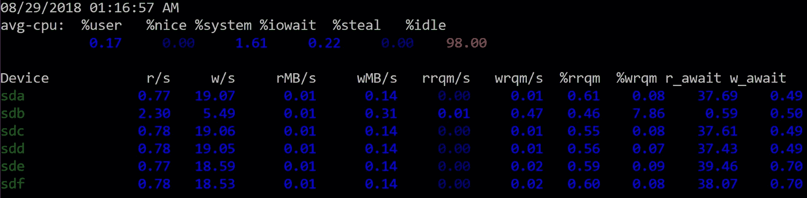
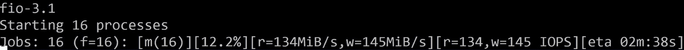
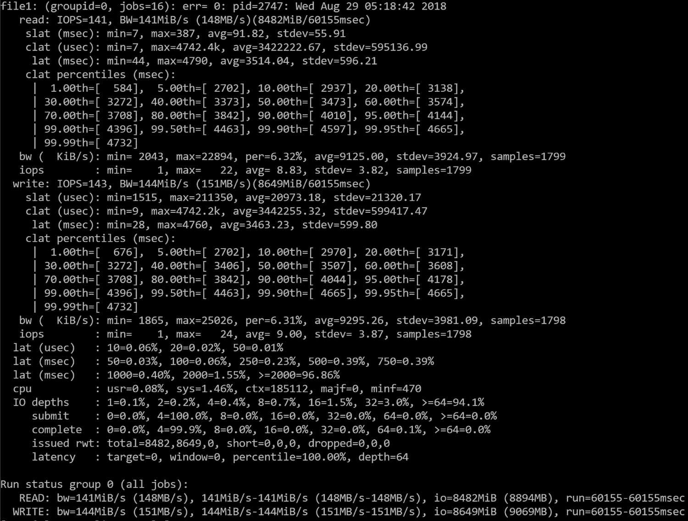
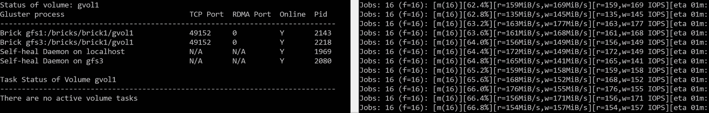

# 第五章：分析 Gluster 系统的性能

在第四章中，*在云基础设施上使用 GlusterFS*，我们已经完成了 GlusterFS 的工作实施，现在可以专注于解决方案的测试方面。我们将概述部署的情况，并解释选择组件背后的原因。

一旦配置被定义，我们可以通过测试性能来验证我们是否达到了预期的结果。然后，我们可以在执行 I/O 时故意关闭节点来进行可用性测试。

最后，我们将看到如何在垂直和水平两个方向上扩展解决方案。

在本章中，我们将涵盖以下主题：

+   实施的高级概述

+   进行性能测试

+   性能可用性测试

+   在垂直和水平两个方向上扩展解决方案

# 技术要求

本章的技术资源列表如下：

+   Zpool iostat-用于在 ZFS 上进行性能监控：[`docs.oracle.com/cd/E19253-01/819-5461/gammt/index.html`](https://docs.oracle.com/cd/E19253-01/819-5461/gammt/index.html)

+   Sysstat-用于实时块性能统计：[`github.com/sysstat/sysstat`](https://github.com/sysstat/sysstat)

+   iostat man 页面包含命令的不同选项：[`sebastien.godard.pagesperso-orange.fr/man_iostat.html`](http://sebastien.godard.pagesperso-orange.fr/man_iostat.html)

+   FIO 文档提供配置参数和用法：[`media.readthedocs.org/pdf/fio/latest/fio.pdf`](https://media.readthedocs.org/pdf/fio/latest/fio.pdf)

+   GlusterFS 监控工作负载文档，说明如何查看统计信息：[`gluster.readthedocs.io/en/latest/Administrator%20Guide/Monitoring%20Workload/`](https://gluster.readthedocs.io/en/latest/Administrator%20Guide/Monitoring%20Workload/)

# 实施概述

在第四章中部署和配置了解决方案后，*在云基础设施上使用 GlusterFS*，我们可以验证实施的性能。主要目标是了解如何实现以及可用的工具。

让我们先退一步，看看我们实施了什么。

# 集群的概述

在第四章中，*在云基础设施上使用 GlusterFS*，我们在 Azure 的**虚拟机**（**VM**）上部署了 GlusterFS 4.1 版本。我们使用 ZFS 作为砖块的存储后端，通过在三节点设置中每个节点使用四个磁盘。以下图表提供了这个分布的高级概述：



这个设置提供了 1TB 的可用空间。卷可以容忍整个节点宕机，同时仍然向客户端提供数据。

这个设置应该能够提供大约 375 **兆字节每秒**（**MB/s**），同时处理数百个客户端，并且应该相当容易在垂直和水平两个方向上扩展。

# 性能测试

现在我们需要验证理论性能是否可以通过实际实施来实现。让我们将这个分解成几个部分。

# 性能理论

让我们根据设置的规格来确定应该获得多少性能。考虑到每个节点应该提供最大 125MB/s。磁盘子系统完全能够提供性能，因为每个磁盘产生 60MB/s。

总体可实现的性能应该在 375MB/s 左右，假设客户端可以通过发送或请求足够的数据到卷来跟上。

# 性能工具

我们将使用三种主要工具来验证和测试解决方案的性能：

+   `zpool iostat`

+   `iostat`

+   **灵活 I/O 测试工具**（**FIO**）

这些工具每个都在不同的级别上工作。现在让我们详细说明每个工具的作用以及如何理解它们提供的信息。

# ZFS zpool iostat 命令

ZFS 在后端卷级别上工作；`zpool iostat -v`命令为 ZFS 卷中的每个成员提供性能统计信息，并为整个 ZFS 卷提供统计信息。

该命令可以通过传递秒数来提供实时数据，它将在经过该时间段后迭代。例如，`zpool iostat -v 1`每秒报告磁盘统计信息。这里，`-v`选项显示池的每个成员及其各自的数据。

该工具有助于以尽可能低的级别呈现性能，因为它显示了来自每个磁盘、每个节点的数据：



请注意，我们使用了额外的`-L`和`-P`选项，以便打印设备文件的绝对路径或**通用唯一标识符**（**UUID**）；这是因为我们使用每个磁盘的唯一标识符创建了池。

从前面的屏幕截图中，我们可以看到四个主要组，如下：

+   `pool`: 这是使用每个成员创建的。

+   `capacity`: 这是分配给每个设备的空间量。

+   `operations`: 这是在每个设备上执行的 IOPS 数量。

+   `bandwidth`: 这是每个设备的吞吐量。

在第一行中，该命令打印自上次启动以来的统计信息。请记住，该工具有助于从 ZFS 池级别呈现性能。

# iostat

作为`sysstat`软件包的一部分，`iostat`提供了来自每个设备的低级性能统计数据。`iostat`绕过文件系统和卷，并呈现系统中每个块设备的原始性能数据。

`iostat`工具可以使用选项运行，以更改在屏幕上打印的信息，例如，`iostat -dxctm 1`。让我们探讨每个部分的作用：

+   `iostat`: 这是主要命令。

+   `d`: 这打印设备利用率。

+   `x`: 这显示扩展设备统计信息。

+   `c`: 这显示了 CPU 利用率。

+   `t`: 这显示每个报告打印的时间。

+   `m`: 这确保统计数据以 MB/s 显示。

+   `1`: 这是`iostat`打印数据的时间，以秒为单位。

在下面的屏幕截图中，您可以看到`iostat`以不同的列显示信息：



没有必要浏览所有列，但最重要的列如下：

+   `Device`: 这显示系统上存在的块设备。

+   `r/s`: 这些是每秒的读取操作。

+   `w/s`: 这些是每秒的写入操作。

+   `rMB/s`: 这些是从设备读取的 MB/s。

+   `wMB/s`: 这些是写入设备的 MB/s。

+   `r_await`: 这是读取请求的平均时间（毫秒）。

+   `w_await`: 这是写请求的平均时间（毫秒）。

`r_await`和`w_await`列与`avg-cpu %iowait`时间一起是必不可少的；这是因为这些指标可以帮助确定是否有一个设备的延迟增加超过其他设备。高 CPU `iowait`时间意味着 CPU 不断等待 I/O 完成，这反过来可能意味着块设备具有较高的延迟。

`iostat`工具可以在集群中的每个节点上运行，为组成 GlusterFS 卷的每个磁盘提供低级别统计信息。

有关其他列的详细信息可以在`iostat`的 man 页面上找到。

# FIO 测试员

FIO 是一个基准测试工具，用于通过生成合成工作负载进行性能测试，并提供 I/O 指标摘要。

请注意，`fio`在 CentOS 上不是默认安装的，但它可以在基本存储库中找到，并且可以通过运行`sudo yum install -y fio`来安装。

这个工具非常有用，因为它允许我们执行接近系统实际工作负载的测试——通过允许用户更改块大小、文件大小和线程数量等参数。FIO 可以提供接近真实性能的数据。这种定制水平可能会让人感到困惑，因为它提供了许多工作负载模拟选项，一些选项一开始并不直观。

使用 FIO 进行测试的最简单方法是创建一个配置文件，告诉软件如何行为；配置文件看起来像这样：

```
[global]
name=rw-nocache-random
rw=randrw
rwmixread=50
rwmixwrite=50
group_reporting=1
bs=1M
direct=1
numjobs=4
time_based=1
runtime=180
ioengine=libaio
iodepth=64

[file1]
size=10G
filename=rw-nocache-random.1
```

让我们分解一下，以便了解配置文件的每个部分是如何工作的：

+   `[global]`：这表示影响整个测试的配置参数（可以设置单个文件的参数）。

+   `name=`：这是测试的名称；可以是任何有意义的名称。

+   `rw=randrw`：这告诉 FIO 要执行什么类型的 I/O；在这种情况下，它执行随机读写。

+   `rwmixread`和`rwmixwrite`：这告诉 FIO 执行读写的百分比或混合比例——在这种情况下，是 50-50 的混合比例。

+   `group_reporting=1`：这用于为整个测试提供统计信息，而不是为每个作业提供统计信息。

+   `bs=1M`：这是 FIO 在执行测试时使用的块大小；可以将其更改为模拟预期工作负载的值。

+   `numjobs=4`：这控制每个文件打开多少个线程。理想情况下，可以用来匹配将使用存储的用户或线程的数量。

+   `runtime=180`：这控制测试运行的时间，以秒为单位。

+   `ioengine=libaio`：这控制要使用的 I/O 引擎类型。最常见的是`libaio`，因为它最接近大多数工作负载。

+   `iodepth=64`：这控制测试的 I/O 深度；较高的数字允许存储设备充分利用。

最后，文件组控制创建测试文件的数量和它们的大小。可以向该组添加某些设置，例如`iodepth`，这些设置仅影响定义了该参数的文件。另一个考虑因素是，`fio`根据`numjobs`参数为每个文件打开一个线程。在前面的配置中，它将打开总共 16 个线程。

要运行 FIO，只需进入挂载点所在的目录，并将其指向配置文件，如下所示：

```
cd /gvol1
fio /root/test.fio
```

请注意，FIO 需要 root 权限，因此请确保使用`sudo`来运行 FIO。

在 FIO 运行时，它会显示吞吐量和 IOPS 等统计信息：



完成后，FIO 会在屏幕上报告测试统计信息。要查找的主要内容是读写操作的 IOPS 和带宽。



从测试结果中，我们可以看到 GlusterFS 卷可以同时维持约 150MB/s 的读写操作。我们与集群的理论最大性能相差 75MB/s；在这种特定情况下，我们达到了网络限制。

FIO 在验证性能和检测问题方面非常有效；`fio`可以在挂载 Gluster 卷的客户端上运行，也可以直接在每个节点的存储单元上运行。您可以使用 FIO 来测试现有解决方案，以验证性能需求；只需确保根据需要测试的内容更改 FIO 配置中的设置。

GlusterFS 提供了一些工具，可以从卷的角度监视性能。这些工具可以在 GlusterFS 的文档页面上找到，位于*监视工作负载*下。

# 可用性测试

确保集群能够容忍节点宕机是至关重要的，因为我们可以确认如果节点丢失，不会发生停机。

这可以通过强制关闭其中一个节点来完成，而其他节点继续提供数据。为了作为合成工作负载，我们可以使用 FIO 在关闭其中一个节点时执行连续测试。

在下面的屏幕截图中，我们可以看到`gfs2`节点不存在，但 FIO 测试继续按预期提供数据：



# 扩展

这种设置的扩展相对简单。如前所述，我们可以通过在每个节点上添加更多磁盘来纵向扩展，或者通过在集群中添加更多节点来横向扩展。

纵向扩展比横向扩展要简单得多，因为它需要更少的资源。例如，如果在每个节点上将单个磁盘添加到 ZFS 池中，则可以将可用空间增加 256 GB，如果添加了三个 128 GB 磁盘。

可以使用以下命令将磁盘添加到 ZFS 池中：

```
zpool add brick1 /dev/disk/by-id/<disk-id>
```

从前一个命令中，`brick1`是池的名称，`disk-id`是最近添加的磁盘的 UUID。

横向扩展需要在新节点上镜像完全相同的设置，然后将其添加到集群中。这需要一组新的磁盘。优点是可用空间和性能将相应增长。

# 摘要

在本章中，我们概述了前一章第四章中完成的实施，即*在云基础架构上使用 GlusterFS*，以便我们可以对实施的内容有一个新的理解，以便了解我们如何测试性能。根据先前的设置，实施应该能够实现理论上的 375 MB/s 吞吐量。我们可以使用几个在不同级别工作的工具来验证这个数字。

对于 ZFS 卷，我们可以使用`zpool iostat`命令，该命令提供 ZFS 卷的每个块设备的数据。`iostat`可用于确定系统中存在的所有块设备的性能。这些命令只能在集群的每个节点上运行。为了验证实现的实际性能，我们使用了 FIO 工具，该工具可以通过更改 I/O 执行方式的参数来模拟特定的工作负载。该工具可用于每个节点的砖级别，或者在 GlusterFS 卷上的每个 Gluster 客户端上，以获得集群可实现的性能的概述。

我们已经了解了如何通过有意关闭其中一个节点并通过 FIO 执行测试来执行可用性测试。最后，可以通过纵向扩展（在每个节点的每个卷中添加磁盘）或横向扩展（在集群中添加一个全新节点）来扩展解决方案。您从本章的主要收获是考虑如何使用广泛可用的工具来验证已实施的配置。这只是一组工具。可能还有许多其他工具可用，这些工具可能更适合您正在实施的解决方案。

在下一章中，我们将介绍创建高可用性自愈架构。

# 问题

1.  MB/s 是什么？

1.  `zpool iostat`是什么？

1.  我在哪里可以运行`zpool iostat`？

1.  `iostat`是什么？

1.  `r_await`是什么意思？

1.  CPU IOWAIT 时间是什么？

1.  FIO 是什么？

1.  我怎样才能运行 FIO？

1.  FIO 配置文件是什么？

1.  我怎样才能在 Gluster 集群中验证可用性？

1.  我怎样才能纵向扩展？

# 进一步阅读

+   * Mohamed Waly 的《学习 Microsoft Azure 存储》：[`www.packtpub.com/big-data-and-business-intelligence/learning-microsoft-azure-storage`](https://www.packtpub.com/big-data-and-business-intelligence/learning-microsoft-azure-storage)
