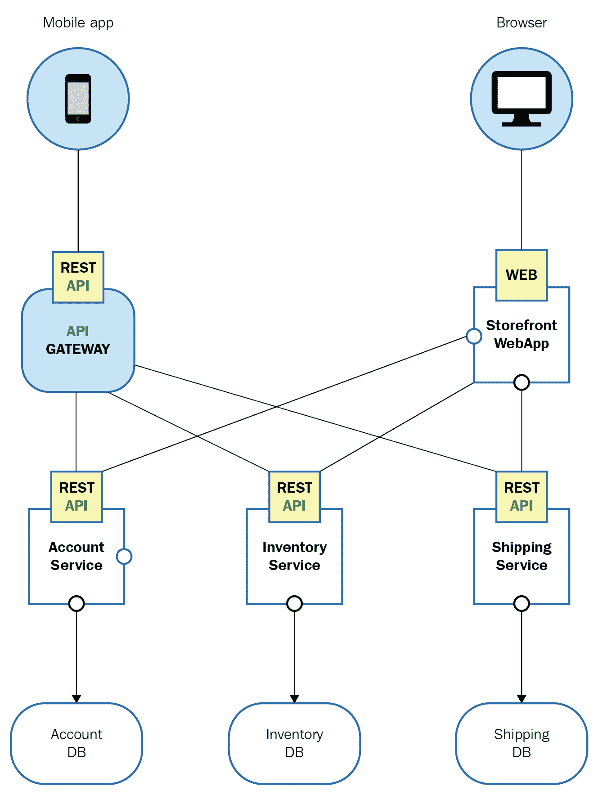
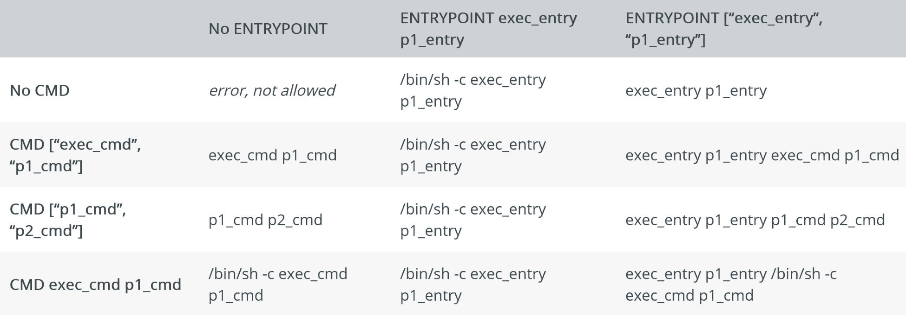
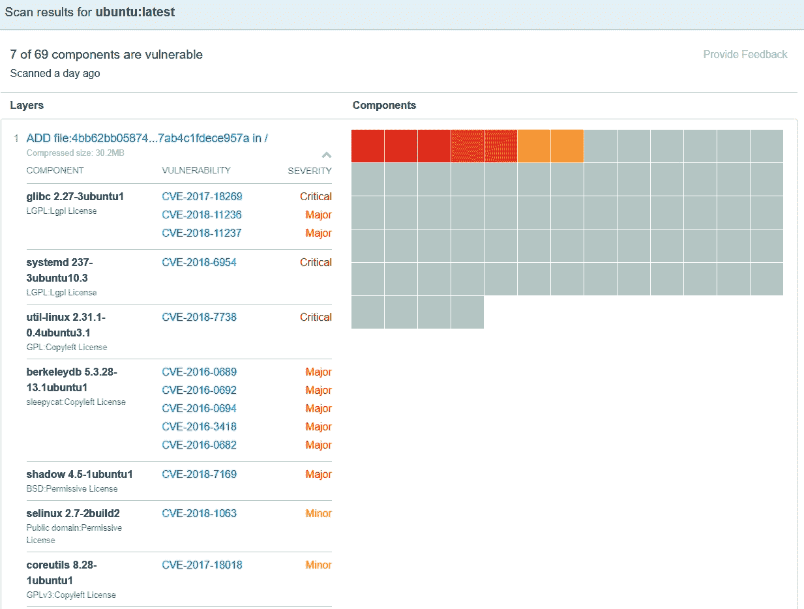
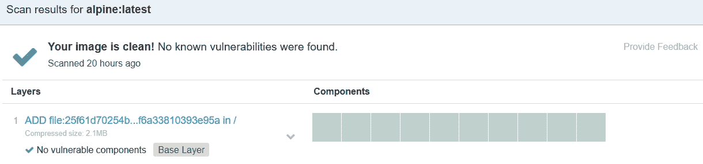
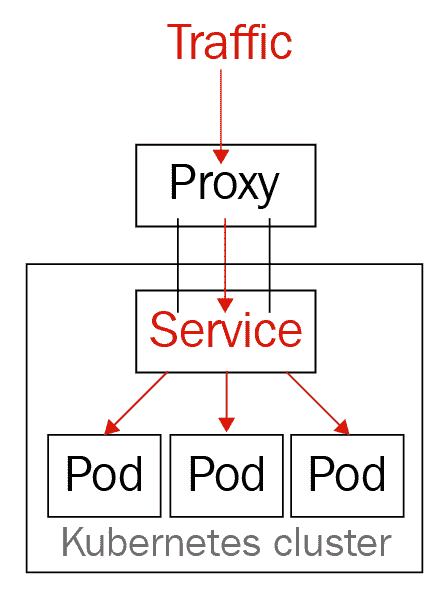
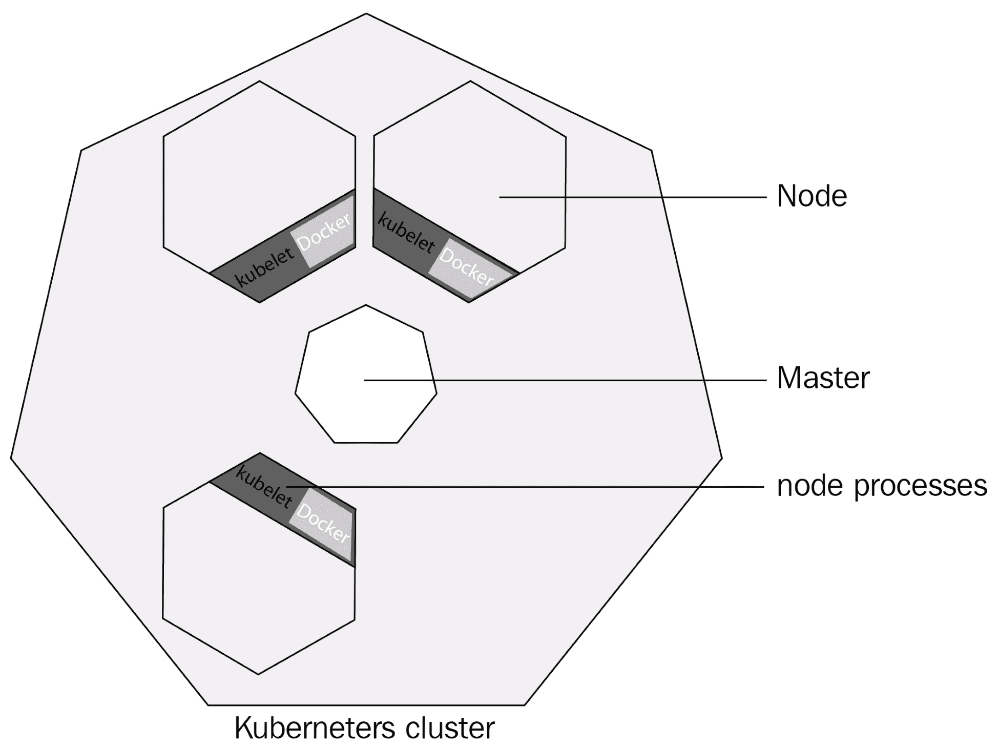

# 第六章：创建高可用的自愈架构

在本章中，我们将介绍 IT 行业是如何从使用单片应用程序发展到云原生、容器化和高可用的微服务的。

通过开源，我们可以提供解决方案，使我们能够根据用户消费量创建高可用性和按需扩展我们的应用程序。

我们将在本章中涵盖以下主题：

+   描述微服务

+   为什么容器是微服务的家园

+   我们如何可以编排我们的容器

+   探索开源中最常用的编排器 Kubernetes。

# 微服务

微服务用于以模块化方式设计应用程序，其中每个模块都独立部署，并通过 API 相互通信。所有这些模块共同工作，以交付一个单一应用程序，其中每个功能都有其自己的目的。

例如，让我们看看一个在线商店。我们只能看到主网站；然而，在后台有几个微服务起作用，一个服务用于接受订单，另一个根据您以前的浏览推荐物品，支付处理，评论处理等等。

以下图表是微服务应用程序的一个示例：



从本质上讲，微服务应用程序不需要一个庞大的团队来支持整个应用程序。一个团队只支持整体图景中的一个或两个模块，从而在支持和专业知识方面创造了更细粒度的方法。支持和开发不仅是细粒度的，还存在故障。在单个微服务故障的情况下，只有应用程序的那一部分会失败。

继续我们的在线商店示例，假设处理评论和评论的微服务失败了。这是因为我们的网站是使用微服务构建的，所以我们网站的只有那个组件将对我们的客户不可用。

然而，他们仍然可以继续购买和使用网站，而用户将无法看到他们感兴趣的产品的评论，这并不意味着我们整个网站的可用性受到损害。根据问题的原因，您可以修补微服务或重新启动它。不再需要为了修补或重新启动整个网站。

作为基础架构工程师，您可能会想，为什么我必须知道什么是微服务或它的好处？原因很简单。作为架构师或基础架构工程师，您正在为这种类型的应用程序构建基础架构。无论它们是在单个主机上运行的单片应用程序，还是在多个容器中分布的微服务，它肯定会影响您设计客户架构的方式。

Linux 将是您的好朋友，因为您将找到多个开源工具，将帮助您维护高可用性、负载平衡和**持续集成**（**CI**）/**持续交付**（**CD**），使用 Docker、Kubernetes、Jenkins、Salt 和 Puppet 等工具。因此，每当客户询问您应该从哪个操作系统环境开始设计他的微服务应用程序时，Linux 将是您的答案。

目前，Docker Swarm 和 Kubernetes 在容器编排方面处于领先地位。在微服务方面，当为客户设计基础架构时，容器也将是您的首选。

我们将在第七章中深入探讨 Kubernetes，*了解 Kubernetes 集群的核心组件*，并展示它如何帮助您编排和交付一个优雅而复杂的解决方案，用于托管微服务和其他类型的应用程序。

然而，在谈论 Kubernetes 或容器编排之前，我们需要解释容器的概念，以便理解为什么它们非常适合托管微服务应用程序。

Linux 中的容器已经有一段时间了，但直到几年前（随着 Docker Engine 的发布），它们才在所有技术社区中获得了动力和赞誉。容器在合适的时间出现了，并随着微服务架构的兴起而留了下来，并且正在塑造我们设计和执行它的方式。

让我们退一步，以便您了解这种技术的好处。想象一下，您有一个简单的单体应用程序，它正在运行一个 API，您可以从中查询用户列表以及他们从您托管的网站购买的商品。

过了一段时间，您的客户发现他们的 API 在其他应用程序中变得非常受欢迎，这些应用程序现在在高峰时段进行数千次 HTTP `GET`请求。当前的基础设施无法处理如此多的请求，因此您的客户要求您以一种可以处理更多请求的方式扩展他们的基础设施。问题在于，因为这是一个单体应用程序，您不仅需要计算 API 所需的资源，还需要考虑与 API 一起托管的网店前端，即使 API 是您实际上需要扩展的唯一内容。

这将是一种资源浪费，因为您还将包括不需要任何额外副本或资源的网店前端。您正在浪费宝贵的，有时是昂贵的（如果您在公共云中）存储、内存和 CPU 资源，用于一些实际上并不需要的东西。

因此，这就是微服务和为托管这种类型的应用程序而设计的容器发挥作用的地方。使用容器镜像中的微服务，您无需每次需要扩展服务以满足需求时都要提供新的服务器，也无需重新启动服务器，或者在执行应用程序或操作系统更新时每次都要处理软件包依赖关系。只需使用一个简单的命令（`docker container run companyreg.io/storeapi:latest`），您的应用程序就可以启动并准备好提供请求。同样，如果您的应用程序失败，只需重新启动容器或提供一个新的容器，您就可以继续进行。如果对微服务进行的更新存在错误，只需回滚到以前的镜像版本，您就可以重新启动；无需开始卸载更新的库或处理依赖关系问题。

容器还允许应用程序部署的一致性，因为您可能知道，有多种安装软件包的方式。您可以通过`apt`、`yum`和`apk`等软件包管理器进行安装，也可以通过`git`、`/curl/wget`、`pip`和`juju`进行安装，取决于您的安装方式，也将定义您的维护方式。

想象一下，开发人员将其软件包发送给**开放性分析标准**（**OPS**）团队进行部署，每个 OPS 工程师以不同的方式部署应用程序！这将变得难以支持和跟踪。具有您的应用程序的容器镜像将创建一致性，因为无论您将其部署为容器的位置在哪里，它都将在所有部署的地方具有相同的位置，用于所有配置文件、二进制文件、库和依赖项。所有内容都将被隔离到一个具有自己的**进程命名空间**（**PID 命名空间**）、网络命名空间和**挂载命名空间**（**MNT 命名空间**）的容器中。

将应用程序架构为微服务的目的是为了为应用程序中的每个微服务提供隔离，以便它们可以轻松管理和维护——容器正好实现了这一点。你甚至可以定义每次容器启动时如何启动应用程序——一致性在这里起着主导作用。

# 创建容器镜像

构建容器的方式是通过一个叫做**Dockerfile**的东西。Dockerfile 基本上是一组关于如何构建容器镜像的指令；一个典型的 Dockerfile 如下所示：

```
FROM ubuntu:latest
LABEL maintainer="WebAdmin@company.com"

RUN apt update
RUN apt install -y apache2
RUN mkdir /var/log/my_site

ENV APACHE_LOG_DIR /var/log/my_site
ENV APACHE_RUN_DIR /var/run/apache2
ENV APACHE_RUN_USER www-data
ENV APACHE_RUN_GROUP www-data

COPY /my_site/ /var/www/html/

EXPOSE 80

CMD ["/usr/sbin/apache2","-D","FOREGROUND"]
```

如你所见，这是一组非常易读的指令。即使不知道每个指令的作用，我们也可以假设它的功能，因为它非常类似于英语。这个 Dockerfile 只是一个例子，迄今为止是最有效的方法。

镜像本质上就像**虚拟机**（**VM**）世界中的模板；它是一组只读层，包含了部署容器所需的所有信息——从单个镜像中，你可以部署多个容器，因为它们都在自己的可写层上运行。

例如，每当你拉取一个镜像，你会看到以下输出：

```
[dsala@redfedora ~]# docker pull httpd:latest
latest: Pulling from library/httpd
d660b1f15b9b: Pull complete
aa1c79a2fa37: Pull complete
f5f6514c0aff: Pull complete
676d3dd26040: Pull complete
4fdddf845a1b: Pull complete
520c4b04fe88: Pull complete
5387b1b7893c: Pull complete
Digest: sha256:8c84e065bdf72b4909bd55a348d5e91fe265e08d6b28ed9104bfdcac9206dcc8
Status: Downloaded newer image for httpd:latest
```

你看到的每个`Pull complete`实例对应着镜像的一个层。那么，这些层是什么，它们来自哪里呢？

当我们构建镜像时，我们在 Dockerfile 中定义的一些指令将创建一个新的层。文件中的每个指令都在容器中的读写层中执行，在构建结束时，将提交到最终层堆栈，形成最终镜像。需要注意的是，即使构建过程中的每个指令都在容器中执行，并非所有命令都会创建数据，使得镜像在大小和层面上变得更大——其中一些只会写入到所谓的**镜像清单**中，这本质上是一个包含所有镜像元数据的文件。

让我们更深入地探讨每个命令。

# FROM

`FROM`指令指示了你的初始镜像是什么，基本上是你将开始构建自己镜像的基础。

你在这里放置的内容将取决于你的需求，例如，哪个镜像预先安装了我应用程序需要的库，哪个镜像已经安装了我需要编译应用程序的编译器，或者哪个镜像对我们最终大小的影响最小。例如，你的应用程序是基于 Python 2 构建的。你可以直接使用`python:2.7`镜像，而不是使用 CentOS 或 Ubuntu 作为初始镜像，然后手动安装 Python，因为它已经预先安装了 Python。

显然，这里还有更多需要考虑的事情，但我们将在本章后面讨论镜像构建的最佳实践时再详细介绍。

由于这个指令会使用另一个镜像作为基础，你的最终镜像将继承基础镜像的层；因此，最终层的总数将如下所示：

*最终镜像层 = 基础镜像层 + 你创建的层*

# LABEL

`LABEL`指令非常直观——它使用键值对为你的镜像添加元数据标签，稍后可以通过`docker inspect`命令检索。你可以使用它来添加用户需要知道的数据。通常用于添加镜像作者的信息，比如他们的电子邮件或公司：

```
LABEL maintener="john.doe@company.com"
```

由于这个指令只是元数据，不会为你的镜像添加额外的层。

# RUN

使用`RUN`，你将运行需要准备容器来运行你的应用程序的命令；例如，安装软件包、编译代码，创建用户或目录。`RUN`有两种运行命令的方式。

shell 形式如下：

```
 RUN <command>
```

在这种形式下，默认情况下所有命令都将使用`/bin/sh -c` shell 运行，尽管你可以使用`SHELL`指令来更改 shell，如下所示：

```
 SHELL ["/bin/bash", "-c"]
 RUN echo "Hello I'm using bash" 
```

`SHELL`关键字只能以 JSON 数组格式运行，这导致我们可以使用第二种形式来运行`RUN`指令。

执行形式如下：

```
RUN ["echo","hello world"]
```

这里的主要区别，除了格式之外，在执行形式中不会调用 shell，因此不会发生正常的变量替换——相反，您必须调用 shell 作为 shell 的命令，以便 shell 能够提供变量扩展：

```
 RUN ["/bin/bash","-c","echo $HOME"]
```

由于`RUN`关键字的性质，每个实例都将在新层上执行并提交到最终图像，因此，每次使用`RUN`都会向图像添加一个新层。

# ENV

对于`ENV`，没有太多可说的——这个指令为环境设置变量。它们将在构建时使用，并在容器运行时可用。`ENV`不会为容器生成额外的层，因为它将环境变量存储在图像清单中作为元数据：

```
 ENV <key>=<value>
```

`ENV`的参数以`<key>` /`<value>`对的形式处理，其中`<key>`参数是变量名，`<value>`参数是其内容或值。您可以使用`=`符号声明它们，也可以不使用。引号和反斜杠可用于转义值字段中的空格。

以下所有变体都是有效的：

```

ENV USER="Jane Doe"  

ENV USER=Jane\ Doe

ENV USER Jane Doe
```

# COPY

使用`COPY`，我们可以将文件或目录从本地主机（执行 Docker 构建的位置）复制到我们的图像中。这非常有用，因为您实际上正在将内容移动到图像中，以便您可以复制应用程序、文件或任何可能需要的内容以使容器工作。正如我们之前提到的，任何向容器添加实际数据的指令都将创建一个新层，因此会增加最终图像的存储占用。

此指令与`RUN`具有相同的形式；您可以使用 JSON 格式化，也可以将`<src>`源分开放置到`<dst>`目的地：

```
 COPY <src>  <dst>
 COPY ["<src1>","<src2>","<dst>"]
```

有几个陷阱我们需要经历。首先，如果任何文件名或目录名中有空格，您必须使用 JSON 数组格式。

其次，默认情况下，所有文件和目录都将以**用户标识符**（**UID**）和**组标识符**（**GID**）`0`（root）复制。要覆盖此设置，可以使用`--chown=<UID>:<GID>`标志，如下所示：

```
 COPY --chown=JANE:GROUP <src> <dst> 
```

`chown`接受数字 ID 或用户或组的名称。如果只有其中一个，则定义如下：

```
COPY --chown=JANE <src> <dst> 
```

`COPY`将假定用户和组都是相同的。

如果要复制名称相似的文件，则可以始终使用通配符——`COPY`将使用 Go 的`filepath.Match`规则，该规则可以在[`golang.org/pkg/path/filepath#Match`](http://golang.org/pkg/path/filepath#Match)找到。

定义`<src>`和`<dst>`条目的方式非常重要，因为它们遵循以下三条规则：

+   在`<src>`中定义的路径必须在构建的上下文中，基本上，所有位于您运行 Docker 构建`PATH`命令时指定的目录中的文件和目录。

+   如果要复制目录，则始终以`/`结尾。这样，Docker 就知道这是一个目录，而不是要复制的单个文件。此外，如果是目录，则其中的所有文件也将被复制。

+   `<dst>`中定义的路径将始终是绝对路径，除非您使用`WORKDIR`指令指定相对于的工作目录。

最后要说的是`COPY`指令，我必须补充的是`COPY`只支持复制本地文件。如果要使用 URL 从远程服务器复制文件，必须使用`ADD`指令，它遵循与`COPY`相同的规则，但对于 URL 还有一些其他注意事项。这超出了本章的范围，但您可以在[`docs.docker.com`](https://docs.docker.com)了解更多信息。

# EXPOSE

使用`EXPOSE`关键字，我们实际上并没有发布我们在这里指定的容器端口；相反，我们正在为容器的用户创建一个指南，让他们知道在启动容器时应该发布哪些端口。

因此，这只是在图像的清单中再次创建的元数据，稍后可以使用`docker inspect`检索。不会使用此关键字创建其他图层。

在`EXPOSE`指令中定义的端口可以是**用户数据报协议**（**UDP**）或**传输控制协议**（**TCP**），但是，默认情况下，如果未指定协议，则假定为 TCP。

以下是一些`EXPOSE`指令的示例：

```
 EXPOSE 80
  EXPOSE 53/udp
  EXPOSE 80/tcp
```

# CMD 和 ENTRYPOINT

这可能是 Dockerfile 中最重要的指令，因为它们告诉容器在启动时要运行什么。我们将逐个讨论它们，并探讨它们如何相互作用以及它们之间的区别。

让我们先从`ENTRYPOINT`开始。正如我们之前提到的，这个指令允许您定义启动容器时要运行的可执行文件。您可以在 Dockerfile 中添加多个`ENTRYPOINT`定义，但只有最后一个会在`docker container run`上执行。

当您使用`run`参数运行容器时，通常可以添加命令行参数。除非您在使用`docker container run`时使用`--entrypoint`标志覆盖`ENTRYPOINT`可执行文件，否则这些参数将被追加到`ENTRYPOINT`参数。

让我们看一些例子。假设我们正在使用一个具有以下 Dockerfile 的容器：

```
 FROM alpine
 ENTRYPOINT ["echo","Hello from Entrypoint"]
```

现在，假设我们构建了图像并将其标记为`entrypointexample`。当我们在不带额外命令行参数的情况下运行此容器时，它将显示如下：

```
[dsala@redfedora]# docker container run entrypointexample
Hello from Entrypoint
```

如果我们向`run`命令添加命令行参数，我们将看到类似这样的东西：

```
[dsala@redfedora]# docker container run entrypointexample /bin/bash
Hello from Entrypoint /bin/bash
```

正如您所看到的，它实际上并没有执行 BASH shell，而是将`/bin/bash`作为我们在 Dockerfile 中定义的`echo`命令的字符串。让我们考虑一个更明确的例子，因为前一个例子中，我只是想演示即使您传递了实际命令或尝试执行 shell，它仍然会将其作为`ENTRYPOINT`的参数传递。这是一个更清晰的例子，带有一个简单的字符串：

```
[dsala@redfedora]# docker container run entrypointexample I AM AN ARGUMENT
Hello from Entrypoint I AM AN ARGUMENT
```

现在，如果我们传递`--entrypoint`标志，我们将覆盖`ENTRYPOINT`可执行文件：

```
[dsala@redfedora]# docker container run --entrypoint /bin/ls entrypointexample -lath /var
total 0
drwxr-xr-x    1 root root           6 Aug 8 01:22 ..
drwxr-xr-x   11 root root         125 Jul 5 14:47 .
dr-xr-xr-x    2 root root           6 Jul 5 14:47 empty
drwxr-xr-x    5 root root          43 Jul 5 14:47 lib
drwxr-xr-x    2 root root           6 Jul 5 14:47 local
drwxr-xr-x    3 root root          20 Jul 5 14:47 lock
drwxr-xr-x    2 root root           6 Jul 5 14:47 log
drwxr-xr-x    2 root root           6 Jul 5 14:47 opt
lrwxrwxrwx    1 root root           4 Jul 5 14:47 run -> /run
drwxr-xr-x    3 root root          18 Jul 5 14:47 spool
drwxrwxrwt    2 root root           6 Jul 5 14:47 tmp
drwxr-xr-x    4 root root          29 Jul 5 14:47 cache
```

好的，那么为什么这个命令的格式是这样的呢？正如我们之前看到的，`--entrypoint`标志只替换可执行文件——所有额外的参数都必须作为参数传递。这就是为什么我们的`ls`在最后有`-lath /var`参数的原因。这里还有一些其他需要注意的地方，它们对应于`ENTRYPOINT`指令的形式。

与其他 Dockerfile 指令一样，`ENTRYPOINT`有两种形式，shell 和 exec：

```
 ENTRYPOINT command argument1 argument2 
 ENTRYPOINT ["executable", "param1", "param2"]
```

对于 exec 形式，适用于之前 Dockerfile 指令的相同规则也适用于这里。

在 exec 形式中不会调用 shell，因此`$PATH`变量不存在，您将无法在不提供完整路径的情况下使用可执行文件——这就是为什么我们使用`/bin/ls`而不是`ls`。此外，您可以看到您首先在 JSON 数组中定义可执行文件，然后是其参数，这个第一个字段是`--entrypoint`标志将替换的内容。在使用该标志时，任何额外的参数都必须作为`docker container run`命令参数传递，就像我们在示例中所做的那样。

另一方面，shell 形式将加载`/bin/sh`，以便环境变量可用。让我们看一个例子；这是一个使用 exec 形式的 Dockerfile 的容器：

```
FROM alpine
ENTRYPOINT ["echo", "$PATH"]
```

假设我们构建了图像并将其标记为`pathexampleexec`。当我们运行容器时，我们将看到以下内容：

```
[dsala@redfedora]#docker container run pathexampleexec
$PATH
```

这是一个使用 shell 形式的 Dockerfile 的容器：

```
FROM alpine
ENTRYPOINT echo $PATH
```

当我们运行容器时，我们将看到以下内容：

```
 [dsala@redfedora]# docker container run pathexampleshell
 /usr/local/sbin:/usr/local/bin:/usr/sbin:/usr/bin:/sbin:/bin
```

现在，假设您想为应用程序设置一些默认参数，但是您希望用户能够覆盖并使用不同的参数。这就是`CMD`的作用；使用`CMD`，您可以为可执行文件指定默认参数，但如果用户在`docker container run`上运行容器时使用命令参数，这些参数将被覆盖。您必须小心声明`ENTRYPOINT`，因为如果使用 shell 形式声明`ENTRYPOINT`，所有`CMD`定义将被忽略。

让我们看几个例子；以下是要运行的容器的 Dockerfile：

```
 FROM alpine
 ENTRYPOINT echo Hello
 CMD ["I'm Ignored"]
```

假设先前提到的容器已构建并标记为`cmdexample`，下面是其运行情况：

```
[dsala@redfedora]# docker container run cmdexample
Hello
```

现在，如果我们对`ENTRYPOINT`使用执行形式，CMD 参数将被附加到`ENTRYPOINT`。参考 Dockerfile：

```
 FROM alpine
  ENTRYPOINT ["echo", "hello from ENTRY"]
  CMD ["hello", "from CMD"]
```

假设镜像已构建并标记为`execcmdexample`，以下是输出：

```
[dsala@redfedora]# docker container run execcmdexmple
hello from ENTRY hello from CMD
```

请注意，这次`CMD`条目被附加到`ENTRYPOINT`作为参数。但是，请记住，`CMD`的内容只是默认值；如果我们在`docker container run`上指定参数，这些参数将覆盖`CMD`中的参数。

使用与前面示例相同的 Dockerfile，我们将得到类似以下的内容：

```
[dsala@redfedora]# docker container run execcmdexmple "hello" "from" "run"
 hello from ENTRY hello from run
```

`CMD`和`ENTRYPOINT`之间有几种组合，您可以在以下来自[`docs.docker.com`](https://docs.docker.com)的图表中看到所有这些组合：



# 使用最佳实践构建容器镜像

Dockerfiles are like recipes for your applications, but you can't just throw in the ingredients and hope for the best. Creating an efficient image requires you to be careful about how you utilize the tools at your disposal.

容器的整个目的是占用空间小 - 对于 100 MB 应用程序来说，拥有 1 GB 以上的镜像并不代表占用空间小，也不高效。微服务也是如此；为微服务拥有小的容器镜像不仅提高了性能，而且存储利用率降低了安全漏洞和故障点，并且还能节省金钱。

容器镜像在主机本地和容器注册表中存储。公共云提供商根据注册表的存储利用率收取费用，而不是根据您在其中存储的镜像数量收费。想象一下注册表就像容器的 GitHub。假设您必须从云提供商的注册表中拉取镜像；您认为拉取 1 GB 镜像还是 100 MB 镜像会更快？镜像大小很重要。

构建镜像时要考虑的第一件事是要使用的基础镜像。不要使用大型镜像（如完整的 Linux 发行版，Ubuntu，Debian 或 CentOS），因为这些镜像有很多工具和可执行文件，您的应用程序不需要运行，而是使用较小的镜像，例如 Alpine：

| **REPOSITORY ** | **SIZE** |
| --- | --- |
| `centos` | 200 MB |
| `ubuntu` | 83.5 MB |
| `debian` | 101 MB |
| `alpine ` | 4.41 MB |

您会发现大多数镜像都有自己的精简版本，例如`httpd`和`nginx`：

| **REPOSITORY** | **TAG** | **SIZE** |
| --- | --- | --- |
| `httpd` | `alpine` | 91.4 MB |
| `httpd` | `latest` | 178 MB |
| `nginx` | `alpine` | 18.6 MB |
| `nginx` | `latest` | 109 MB |

正如您所看到的，`httpd`:`alpine`几乎比`httpd`:`latest`小了 50%，而`nginx`:`alpine`小了 80%！

更小的镜像不仅会减少存储消耗，还会减少攻击面。这是因为较小的容器具有较小的攻击面；让我们看看最新的 Ubuntu 镜像与最新的 Alpine 镜像。

对于 Ubuntu，我们可以看到最新标签的漏洞数量增加了；以下是 Docker Hub 页面的截图：



对于 Alpine Linux，计数降至零，如下截图所示：



在上面的截图中，我们可以看到与 Ubuntu 相比的漏洞计数。即使在今天，最新的 Alpine 图像也没有任何漏洞。相比之下，Ubuntu 有七个不需要的组件存在漏洞，这些组件甚至不需要我们的应用程序运行。

另一件需要考虑的事情是图像的分层；每次在构建中运行`RUN`语句时，它都会添加一个更多的层和大小到最终图像中。减少`RUN`语句的数量以及在其中运行的内容将大大减少图像的大小。

让我们看看我们的第一个 Dockerfile，如下所示：

```
    FROM ubuntu:latest
    LABEL maintainer="WebAdmin@company.com"

    RUN apt update
    RUN apt install -y apache2
    RUN mkdir /var/log/my_site

    ENV APACHE_LOG_DIR /var/log/my_site
    ENV APACHE_RUN_DIR /var/run/apache2
    ENV APACHE_RUN_USER www-data
    ENV APACHE_RUN_GROUP www-data

    COPY /my_site/ /var/www/html/

    EXPOSE 80

    CMD ["/usr/sbin/apache2","-D","FOREGROUND"]
```

我们可以将`RUN`指令修改为以下方式：

```
RUN apt update && \
      apt install -y apache2 --no-install-recommends && \
      apt clean && \
      mkdir /var/my_site/ /var/log/my_site
```

现在，我们将不再创建三个层，而是通过在单个语句中运行所有命令来产生一个层。

请记住，在`RUN`中执行的所有操作都是使用`/bin/sh -c`或您在`SHELL`中指定的任何其他 shell 来执行的，因此`&`、`;`和`\`都会被接受，就像在常规 shell 中一样。

然而，我们不仅删除了额外的`RUN`指令；我们还添加了`apt clean`来清理容器的缓存，然后使用了`--no-install-recommend`标志来避免安装任何不必要的软件包，从而减少了存储空间和攻击面：

以下是原始图像的详细信息：

| **仓库** | **大小** |
| --- | --- |
| `bigimage` | 221 MB |

以下是较小图像的详细信息：

| **仓库** | **大小** |
| --- | --- |
| `smallerimage` | 214 MB |

当然，这并不是一个巨大的差异，但这只是一个例子，没有安装任何真正的应用程序。在生产图像中，您将不得不做的不仅仅是安装`apache2`。

现在让我们使用我们学到的两种技术，来精简我们的图像：

```
FROM alpine

RUN apk update && \
      apk add mini_httpd && \
       mkdir /var/log/my_site

COPY /my_site/ /var/www/localhost/htdocs/
EXPOSE 80

CMD ["/usr/sbin/mini_httpd", "-D", "-d", "/var/www/localhost/htdocs/"]
```

这是图像的最终大小：

| **仓库** | **大小** |
| --- | --- |
| `finalimage` | 5.79 MB |

现在，您可以看到大小上有很大的差异——我们从 221 MB 减少到 217 MB，最终得到了一个 5.79 MB 的图像！这两个图像都完成了完全相同的任务，即提供网页服务，但占用的空间完全不同。

# 容器编排

现在我们知道如何创建我们的图像，我们需要一种方法来维护我们应用程序的期望状态。这就是容器编排器的作用。容器编排器回答了以下问题：

+   如何维护我的应用程序，使其具有高可用性？

+   如何根据需求扩展每个微服务？

+   如何在多个主机之间负载均衡我的应用程序？

+   如何限制我的应用程序在主机上的资源消耗？

+   如何轻松部署多个服务？

使用容器编排器，管理您的容器从未像现在这样简单或高效。有几种编排器可用，但最常用的是 Docker Swarm 和 Kubernetes。我们将在本章后面讨论 Kubernetes，并深入了解第七章中的核心组件。

所有编排器共同之处在于它们的基本架构是一个由一些主节点组成的集群，这些主节点监视您的期望状态，并将其保存在数据库中。主节点将根据工作节点的状态启动或停止容器，工作节点负责容器工作负载。每个主节点还负责根据您预定义的要求来指示哪个容器必须在哪个节点上运行，并根据需要扩展或重新启动任何失败的实例。

然而，编排器不仅通过重新启动和按需启动容器来提供高可用性，Kubernetes 和 Docker Swarm 还具有控制流量到后端容器的机制，以便为应用程序服务的传入请求提供负载均衡。

以下图表展示了流向编排集群的流量：



让我们更深入地探索 Kubernetes。

# Kubernetes

Kubernetes 目前是迄今为止最受欢迎的容器编排器。许多公共云提供商现在将其作为事实上的容器编排器采用；例如，Azure 的**Azure Kubernetes Services**（**AKS**），亚马逊网络服务的**弹性容器服务 for Kubernetes**（**EKS**），以及谷歌云的**Google Kubernetes Engine**（**GKE**）。这些解决方案大多是托管的，为用户抽象出管理平面，以便使用，并采用与公共云负载均衡器和 DNS 服务集成的云原生解决方案。

Kubernetes 处于**平台即服务**（**PaaS**）解决方案和**基础设施即服务**（**IaaS**）解决方案之间，因为它为您提供了一个运行容器和管理数据的平台，但它仍然允许您提供软件定义的基础设施，如负载均衡器、网络管理、入口控制和资源分配。

通过 Kubernetes，我们可以自动化部署容器的过程，并在控制资源消耗的同时保持所需的状态，同时为不同的应用程序提供高可用性和隔离。

Kubernetes 具有我们之前提到的基本编排器组件；它有工作节点、主节点和保存集群状态的数据库。我们将在第七章中深入探讨 Kubernetes 的概念，*理解 Kubernetes 集群的核心组件*。

以下图表显示了 Kubernetes 的基本架构：



# 总结

在本章中，我们讨论了 IT 是如何从单块设计演变为微服务的，并且容器如何帮助我们通过允许模块化基础架构来实现这种架构。我们以在线商店为例，演示了微服务如何允许特定组件的可伸缩性，而无需关闭整个应用程序。此外，我们探讨了相同示例如何通过讨论微服务方法允许应用程序的一部分失败而不影响整个解决方案的高可用性设计（即，只有评论部分失败而不会导致整个在线商店崩溃）。

随后，我们学习了容器是如何通过 Dockerfile 从镜像创建的，Dockerfile 使用可读的一组指令来创建基础镜像。在 VM 的背景下，镜像可以被视为模板的对应物。

从这个 Dockerfile 中，我们学到了`FROM`语句表示初始镜像是什么，`LABEL`指令如何向容器添加元数据，`RUN`如何执行需要准备容器运行应用程序的命令，以及`ENV`如何设置用于构建容器的环境变量。

此外，我们讨论了构建容器镜像时的一些最佳实践，例如使用更小的镜像（如 Alpine），以及选择更小的镜像如何帮助减少构建容器中存在的漏洞数量。

最后，我们简要地介绍了一些更受欢迎的编排工具，如 Docker Swarm 和 Kubernetes。

在下一章中，我们将深入探讨 Kubernetes 集群的核心组件。

# 问题

1.  Kubernetes 的组件是什么？

1.  GKE、EKS 和 AKS 之间有什么区别？

1.  容器免受利用的安全性有多高？

1.  在容器中部署应用程序有多容易？

1.  Docker 容器和 Kubernetes 是否专属于 Linux？

# 进一步阅读

+   Gigi Sayfan 的《精通 Kubernetes》：[`www.packtpub.com/virtualization-and-cloud/mastering-kubernetes`](https://www.packtpub.com/virtualization-and-cloud/mastering-kubernetes)

+   Joseph Heck 的《面向开发人员的 Kubernetes》：[`www.packtpub.com/virtualization-and-cloud/kubernetes-developers`](https://www.packtpub.com/virtualization-and-cloud/kubernetes-developers)

+   Gigi Sayfan 的《使用 Kubernetes 进行微服务实践》：[`www.packtpub.com/virtualization-and-cloud/hands-microservices-kubernetes`](https://www.packtpub.com/virtualization-and-cloud/hands-microservices-kubernetes)

+   Jonathan Baier，Jesse White 的《Kubernetes 入门-第三版》：[`www.packtpub.com/virtualization-and-cloud/getting-started-kubernetes-third-edition`](https://www.packtpub.com/virtualization-and-cloud/getting-started-kubernetes-third-edition)

+   Russ McKendrick，Scott Gallagher 的《精通 Docker-第二版》：[`www.packtpub.com/virtualization-and-cloud/mastering-docker-second-edition`](https://www.packtpub.com/virtualization-and-cloud/mastering-docker-second-edition)

+   Russ McKendrick 等人的《Docker Bootcamp》：[`www.packtpub.com/virtualization-and-cloud/docker-bootcamp`](https://www.packtpub.com/virtualization-and-cloud/docker-bootcamp)

# 参考文献/来源

+   什么是微服务？：[`microservices.io/`](http://microservices.io/)

+   Docker Hub：[`hub.docker.com/`](https://hub.docker.com/)

+   生产级容器编排：[`kubernetes.io/`](http://kubernetes.io/)
