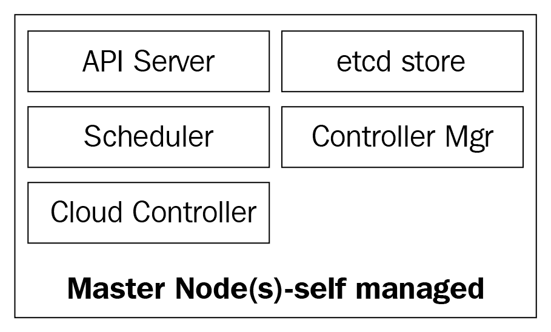
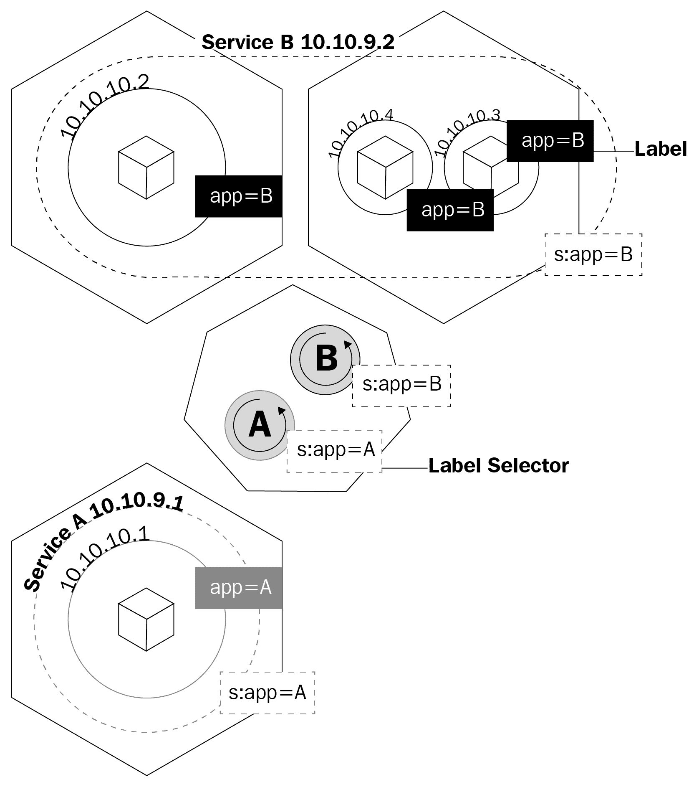

# 第七章：理解 Kubernetes 集群的核心组件

在本章中，我们将从每个控制器的组成到如何部署和调度 pod 中的容器，对主要的 Kubernetes 组件进行一个全面的了解。了解 Kubernetes 集群的方方面面对于能够基于 Kubernetes 作为容器化应用程序的编排器部署和设计解决方案至关重要：

+   控制平面组件

+   Kubernetes 工作节点的组件

+   Pod 作为基本构建块

+   Kubernetes 服务、负载均衡器和 Ingress 控制器

+   Kubernetes 部署和 DaemonSets

+   Kubernetes 中的持久存储

# Kubernetes 控制平面

Kubernetes 主节点是核心控制平面服务所在的地方；并非所有服务都必须驻留在同一节点上；然而，出于集中和实用性的考虑，它们通常以这种方式部署。这显然引发了服务可用性的问题；然而，通过拥有多个节点并提供负载平衡请求，可以轻松克服这些问题，从而实现高度可用的**主节点**集。

主节点由四个基本服务组成：

+   kube-apiserver

+   kube-scheduler

+   kube-controller-manager

+   etcd 数据库

主节点可以在裸金属服务器、虚拟机或私有或公共云上运行，但不建议在其上运行容器工作负载。我们稍后会详细了解更多。

以下图表显示了 Kubernetes 主节点的组件：



# kube-apiserver

API 服务器是将所有内容联系在一起的东西。它是集群的前端 REST API，接收清单以创建、更新和删除诸如服务、pod、Ingress 等 API 对象。

**kube-apiserver**是我们应该与之交谈的唯一服务；它也是唯一一个写入并与`etcd`数据库交谈以注册集群状态的服务。通过`kubectl`命令，我们将发送命令与其交互。这将是我们在处理 Kubernetes 时的瑞士军刀。

# kube-controller-manager

**kube-controller-manager**守护程序，简而言之，是一组无限控制循环，以简单的单个二进制文件的形式进行交付。它监视集群的定义期望状态，并确保通过移动实现所需的所有组件来实现和满足它。kube-controller-manager 不仅仅是一个控制器；它包含了集群中监视不同组件的几个不同循环。其中一些是服务控制器、命名空间控制器、服务账户控制器等。您可以在 Kubernetes GitHub 存储库中找到每个控制器及其定义：

[`github.com/kubernetes/kubernetes/tree/master/pkg/controller`](https://github.com/kubernetes/kubernetes/tree/master/pkg/controller)。

# kube-scheduler

**kube-scheduler**将您新创建的 pod 调度到具有足够空间满足 pod 资源需求的节点上。它基本上监听 kube-apiserver 和 kube-controller-manager，以获取新创建的 pod，并将其放入队列，然后由调度程序安排到可用节点上。kube-scheduler 的定义可以在这里找到：

[`github.com/kubernetes/kubernetes/blob/master/pkg/scheduler`](https://github.com/kubernetes/kubernetes/blob/master/pkg/scheduler/scheduler.go)。

除了计算资源外，kube-scheduler 还会读取节点的亲和性和反亲和性规则，以确定节点是否能够运行该 pod。

# etcd 数据库

**etcd**数据库是一个非常可靠的一致性键值存储，用于存储 Kubernetes 集群的状态。它包含了节点正在运行的 pod 的当前状态，集群当前有多少个节点，这些节点的状态是什么，部署有多少个副本正在运行，服务名称等。

正如我们之前提到的，只有 kube-apiserver 与 etcd 数据库通信。如果 kube-controller-manager 需要检查集群的状态，它将通过 API 服务器获取 etcd 数据库的状态，而不是直接查询 etcd 存储。kube-scheduler 也是如此，如果调度程序需要通知某个 pod 已停止或分配到另一个节点，它将通知 API 服务器，API 服务器将在 etcd 数据库中存储当前状态。

通过 etcd，我们已经涵盖了 Kubernetes 主节点的所有主要组件，因此我们已经准备好管理我们的集群。但是，集群不仅由主节点组成；我们仍然需要执行重型工作并运行我们的应用程序的节点。

# Kubernetes 工作节点

在 Kubernetes 中执行此任务的工作节点简单地称为节点。在 2014 年左右，它们曾被称为 minions，但后来这个术语被替换为节点，因为这个名称与 Salt 的术语混淆，并让人们认为 Salt 在 Kubernetes 中扮演了重要角色。

这些节点是您将运行工作负载的唯一位置，因为不建议在主节点上运行容器或负载，因为它们需要可用于管理整个集群。

节点在组件方面非常简单；它们只需要三个服务来完成任务：

+   kubelet

+   kube-proxy

+   容器运行时

让我们更深入地探讨这三个组件。

# 容器运行时

为了能够启动容器，我们需要一个容器运行时。这是将在节点内核中为我们的 pod 创建容器的基本引擎。kubelet 将与此运行时进行通信，并根据需要启动或停止我们的容器。

目前，Kubernetes 支持任何符合 OCI 规范的容器运行时，例如 Docker、rkt、runc、runsc 等。

您可以从 OCI GitHub 页面了解有关所有规范的更多信息：[`github.com/opencontainers/runtime-spec`](https://github.com/opencontainers/runtime-spec)。

# kubelet

kubelet 是 Kubernetes 的一个低级组件，是继 kube-apiserver 之后最重要的组件之一；这两个组件对于在集群中提供 pod/容器至关重要。kubelet 是在 Kubernetes 节点上运行的一个服务，它监听 API 服务器以创建 pod。kubelet 只负责启动/停止并确保 pod 中的容器健康；kubelet 将无法管理未由其创建的任何容器。

kubelet 通过与容器运行时进行通信来实现目标，这是通过所谓的容器运行时接口（CRI）实现的。CRI 通过 gRPC 客户端为 kubelet 提供可插拔性，可以与不同的容器运行时进行通信。正如我们之前提到的，Kubernetes 支持多个容器运行时来部署容器，这就是它如何实现对不同引擎的多样化支持的方式。

您可以通过以下 GitHub 链接检查 kubelet 的源代码：[`github.com/kubernetes/kubernetes/tree/master/pkg/kubelet`](https://github.com/kubernetes/kubernetes/tree/master/pkg/kubelet)。

# kube-proxy

kube-proxy 是集群中每个节点上的一个服务，它使得 pod、容器和节点之间的通信成为可能。该服务监视 kube-apiserver 以获取定义的服务的更改（服务是 Kubernetes 中一种逻辑负载均衡器；我们将在本章后面更深入地了解服务），并通过 iptables 规则保持网络最新，以将流量转发到正确的端点。Kube-proxy 还在 iptables 中设置规则，对服务后面的 pod 进行随机负载平衡。

以下是 kube-proxy 创建的一个 iptables 规则的示例：

```
-A KUBE-SERVICES -d 10.0.162.61/32 -p tcp -m comment --comment "default/example: has no endpoints" -m tcp --dport 80 -j REJECT --reject-with icmp-port-unreachable
```

这是一个没有端点的服务（没有 pod 在其后面）。

现在我们已经了解了构成集群的所有核心组件，我们可以谈谈我们可以如何使用它们以及 Kubernetes 将如何帮助我们编排和管理我们的容器化应用程序。

# Kubernetes 对象

**Kubernetes 对象**就是这样：它们是逻辑持久对象或抽象，将代表您集群的状态。您负责告诉 Kubernetes 您对该对象的期望状态，以便它可以努力维护它并确保该对象存在。

要创建一个对象，它需要具备两个要素：状态和规范。状态由 Kubernetes 提供，并且它是对象的当前状态。Kubernetes 将根据需要管理和更新该状态，以符合您的期望状态。另一方面，`spec`字段是您提供给 Kubernetes 的内容，并且是您告诉它描述您所需对象的内容，例如，您希望容器运行的图像，您希望运行该图像的容器数量等。每个对象都有特定的`spec`字段，用于执行其任务类型，并且您将在发送到 kube-apiserver 的 YAML 文件中提供这些规范，该文件将使用`kubectl`将其转换为 JSON 并将其发送为 API 请求。我们将在本章后面更深入地了解每个对象及其规范字段。

以下是发送到`kubectl`的 YAML 的示例：

```
cat << EOF | kubectl create -f -
kind: Service
apiVersion: v1
metadata:
 Name: frontend-service
spec:
 selector:
   web: frontend
 ports:
 - protocol: TCP
   port: 80
   targetPort: 9256
EOF
```

对象定义的基本字段是最初的字段，这些字段不会因对象而异，并且非常直观。让我们快速浏览一下它们：

+   `kind`：`kind`字段告诉 Kubernetes 您正在定义的对象类型：pod、服务、部署等

+   `apiVersion`：因为 Kubernetes 支持多个 API 版本，我们需要指定一个 REST API 路径，以便将我们的定义发送到该路径

+   `metadata`：这是一个嵌套字段，这意味着您有更多的子字段可以写入 metadata，您可以在其中编写基本定义，例如对象的名称，将其分配给特定命名空间，并为其标记一个标签，以将您的对象与其他 Kubernetes 对象相关联

因此，我们现在已经了解了最常用的字段及其内容；您可以在以下 GitHub 页面了解有关 Kuberntes API 约定的更多信息：

[`github.com/kubernetes/community/blob/master/contributors/devel/api-conventions.md`](https://github.com/kubernetes/community/blob/master/contributors/devel/api-conventions.md)。

对象的某些字段在创建对象后可以进行修改，但这将取决于对象和您要修改的字段。

以下是您可以创建的各种 Kubernetes 对象的简短列表：

+   Pod

+   卷

+   服务

+   部署

+   入口

+   秘钥

+   配置映射

还有许多其他内容。

让我们更仔细地看看这些项目中的每一个。

# Pods - Kubernetes 的基础

Pod 是 Kubernetes 中最基本且最重要的对象。一切都围绕它们展开；我们可以说 Kubernetes 是为了 pod！所有其他对象都是为了服务它们，它们所做的所有任务都是为了使 pod 达到您期望的状态。

那么，什么是 pod，为什么 pod 如此重要？

Pod 是一个逻辑对象，在同一网络命名空间上运行一个或多个容器，相同的**进程间通信**（**IPC**），有时，根据 Kubernetes 的版本，还在相同的**进程 ID**（**PID**）命名空间上运行。这是因为它们将运行我们的容器，因此将成为关注的中心。Kubernetes 的整个目的是成为一个容器编排器，而通过 pod，我们使编排成为可能。

正如我们之前提到的，同一 pod 上的容器生活在一个“泡泡”中，它们可以通过 localhost 相互通信，因为它们彼此之间是本地的。一个 pod 中的一个容器与另一个容器具有相同的 IP 地址，因为它们共享网络命名空间，但在大多数情况下，您将以一对一的方式运行，也就是说，一个 pod 中只有一个容器。在非常特定的情况下才会在一个 pod 中运行多个容器，比如当一个应用程序需要一个数据推送器或需要以快速和有弹性的方式与主要应用程序通信的代理时。

定义 pod 的方式与定义任何其他 Kubernetes 对象的方式相同：通过包含所有 pod 规范和定义的 YAML：

```
kind: Pod
apiVersion: v1
metadata:
name: hello-pod
labels:
  hello: pod
spec:
  containers:
    - name: hello-container
      image: alpine
      args:
      - echo
      - "Hello World"
```

让我们来看看在`spec`字段下创建我们的 pod 所需的基本 pod 定义：

+   **容器：**容器是一个数组；因此，在它下面有一系列子字段。基本上，它定义了将在 pod 上运行的容器。我们可以为容器指定一个名称，要从中启动的图像，以及我们需要它运行的参数或命令。参数和命令之间的区别与我们在第六章中讨论的`CMD`和`ENTRYPOINT`的区别相同，当时我们讨论了创建 Docker 镜像。请注意，我们刚刚讨论的所有字段都是针对`containers`数组的。它们不是 pod 的`spec`的直接部分。

+   **restartPolicy:** 这个字段就是这样：它告诉 Kubernetes 如何处理容器，在零或非零退出代码的情况下，它适用于 pod 中的所有容器。您可以从 Never、OnFailure 或 Always 中选择。如果未定义 restartPolicy，Always 将是默认值。

这些是您将在 pod 上声明的最基本的规范；其他规范将要求您对如何使用它们以及它们如何与各种其他 Kubernetes 对象进行交互有更多的背景知识。我们将在本章后面重新讨论它们，其中一些如下：

+   卷

+   Env

+   端口

+   dnsPolicy

+   initContainers

+   nodeSelector

+   资源限制和请求

要查看当前在集群中运行的 pod，可以运行`kubectl get pods`：

```
dsala@MININT-IB3HUA8:~$ kubectl get pods
NAME      READY STATUS    RESTARTS AGE
busybox   1/1 Running   120 5d
```

或者，您可以运行`kubectl describe pods`，而不指定任何 pod。这将打印出集群中运行的每个 pod 的描述。在这种情况下，只会有`busybox` pod，因为它是当前唯一正在运行的 pod：

```
dsala@MININT-IB3HUA8:~$ kubectl describe pods
Name:               busybox
Namespace:          default
Priority:           0
PriorityClassName:  <none>
Node:               aks-agentpool-10515745-2/10.240.0.6
Start Time:         Wed, 19 Sep 2018 14:23:30 -0600
Labels:             <none>
Annotations:        <none>
Status:             Running
IP:                 10.244.1.7
Containers:
 busybox:
[...] (Output truncated for readability)
Events:
Type    Reason Age                 From      Message
----    ------ ----                ----      -------
Normal  Pulled 45s (x121 over 5d)  kubelet, aks-agentpool-10515745-2  Container image "busybox" already present on machine
Normal  Created 44s (x121 over 5d)  kubelet, aks-agentpool-10515745-2  Created container
Normal  Started 44s (x121 over 5d)  kubelet, aks-agentpool-10515745-2  Started container
```

Pods 是有生命期的，这是了解如何管理应用程序的关键。您必须明白，一旦 pod 死亡或被删除，就无法将其恢复。它的 IP 和在其上运行的容器将消失；它们是完全短暂的。作为卷挂载的 pod 上的数据可能会存活，也可能不会，这取决于您如何设置；然而，这是我们将在本章后面讨论的问题。如果我们的 pod 死亡并且我们失去它们，我们如何确保所有的微服务都在运行？嗯，部署就是答案。

# 部署

单独的 pod 并不是很有用，因为在单个 pod 中运行我们的应用程序的实例超过一个是不太有效率的。在没有一种方法来查找它们的情况下，在不同的 pod 上为我们的应用程序提供数百个副本将会很快失控。

这就是部署发挥作用的地方。通过部署，我们可以使用控制器来管理我们的 pod。这不仅允许我们决定要运行多少个，还可以通过更改容器正在运行的图像版本或图像本身来管理更新。部署是您大部分时间将要处理的内容。除了 pod 和我们之前提到的任何其他对象，它们在 YAML 文件中都有自己的定义：

```
apiVersion: apps/v1
kind: Deployment
metadata:
 name: nginx-deployment
 labels:
   deployment: nginx
spec:
 replicas: 3
 selector:
   matchLabels:
     app: nginx
 template:
   metadata:
     labels:
       app: nginx
   spec:
     containers:
     - name: nginx
       image: nginx:1.7.9
       ports:
       - containerPort: 80
```

让我们开始探索它们的定义。

在 YAML 的开头，我们有更一般的字段，如`apiVersion`，`kind`和`metadata`。但在`spec`下，我们将找到此 API 对象的特定选项。

在`spec`下，我们可以添加以下字段：

+   **选择器**：使用选择器字段，部署将知道在应用更改时要针对哪些 pod。在选择器下有两个字段：`matchLabels`和`matchExpressions`。使用`matchLabels`，选择器将使用 pod 的标签（键/值对）。重要的是要注意，您在这里指定的所有标签都将被`ANDed`。这意味着 pod 将要求具有您在`matchLabels`下指定的所有标签。`matchExpressions`很少使用，但您可以通过阅读我们在*进一步阅读*部分推荐的书籍来了解更多信息。

+   **副本**：这将说明部署需要通过复制控制器保持运行的 pod 数量；例如，如果指定了三个副本，并且其中一个 pod 死亡，复制控制器将监视副本规范作为期望的状态，并通知调度程序安排一个新的 pod，因为当前状态现在是 2，因为 pod 死亡。

+   **RevisionHistoryLimit**：每次对部署进行更改，此更改都将保存为部署的修订版本，您稍后可以恢复到以前的状态，或者保留更改的记录。您可以使用`kubectl` rollout history deployment/<部署名称>来查看历史记录。使用`revisionHistoryLimit`，您可以设置一个数字，指定要保存多少条记录。

+   **策略**：这将让您决定如何处理任何更新或水平 pod 扩展。要覆盖默认值（即`rollingUpdate`），您需要编写`type`键，您可以在两个值之间进行选择：`recreate`或`rollingUpdate`。虽然`recreate`是更新部署的快速方式，它将删除所有 pod 并用新的替换它们，但这意味着您必须考虑到这种策略将导致系统停机。另一方面，`rollingUpdate`更加平稳和缓慢，非常适合可以重新平衡其数据的有状态应用程序。`rollingUpdate`为另外两个字段打开了大门，这些字段是`maxSurge`和`maxUnavailable`。第一个字段将是在执行更新时您希望超出总数的 pod 数量；例如，具有 100 个 pod 和 20%`maxSurge`的部署将在更新时增长到最多 120 个 pod。下一个选项将让您选择在 100 个 pod 场景中愿意杀死多少百分比的 pod 以用新的替换它们。在存在 20%`maxUnavailable`的情况下，只有 20 个 pod 将被杀死并用新的替换，然后继续替换部署的其余部分。

+   **模板**：这只是一个嵌套的 pod spec 字段，您将在其中包含部署将要管理的 pod 的所有规范和元数据。

我们已经看到，通过部署，我们管理我们的 pod，并帮助我们将它们保持在我们期望的状态。所有这些 pod 仍然处于所谓的**集群网络**中，这是一个封闭的网络，其中只有 Kubernetes 集群组件可以相互通信，甚至有自己的一组 IP 范围。我们如何从外部与我们的 pod 通信？我们如何访问我们的应用程序？这就是服务发挥作用的地方。

# 服务

名称*service*并不能完全描述 Kubernetes 中服务的实际作用。Kubernetes 服务是将流量路由到我们的 pod 的东西。我们可以说服务是将 pod 联系在一起的东西。

假设我们有一个典型的前端/后端类型的应用程序，其中我们的前端 pod 通过 pod 的 IP 地址与我们的后端 pod 进行通信。如果后端的 pod 死掉，我们知道 pod 是短暂的，因此我们失去了与后端的通信，现在我们陷入了困境。这不仅是因为新的 pod 将不具有与死掉的 pod 相同的 IP 地址，而且现在我们还必须重新配置我们的应用程序以使用新的 IP 地址。这个问题和类似的问题都可以通过服务来解决。

服务是一个逻辑对象，告诉 kube-proxy 根据服务后面的哪些 pod 创建 iptables 规则。服务配置它们的端点，这是服务后面的 pod 的称呼方式，与部署了解要控制哪些 pod 一样，选择器字段和 pod 的标签。

这张图展示了服务如何使用标签来管理流量：



服务不仅会让 kube-proxy 创建路由流量的规则；它还会触发一些称为**kube-dns**的东西。

Kube-dns 是一组在集群上运行的`SkyDNS`容器的 pod，提供 DNS 服务器和转发器，它将为服务和有时为了方便使用而创建的 pod 创建记录。每当您创建一个服务时，将创建一个指向服务内部集群 IP 地址的 DNS 记录，形式为`service-name.namespace.svc.cluster.local`。您可以在 Kubernetes GitHub 页面上了解更多关于 Kubernetes DNS 规范的信息：[`github.com/kubernetes/dns/blob/master/docs/specification.md`](https://github.com/kubernetes/dns/blob/master/docs/specification.md)。

回到我们的例子，现在我们只需要配置我们的应用程序以与服务的**完全合格的域名**（**FQDN**）通信，以便与我们的后端 pod 通信。这样，无论 pod 和服务具有什么 IP 地址都无关紧要。如果服务后面的 pod 死掉，服务将通过使用 A 记录来处理一切，因为我们将能够告诉我们的前端将所有流量路由到 my-svc。服务的逻辑将处理其他一切。

在声明要在 Kubernetes 中创建的对象时，您可以创建几种类型的服务。让我们逐个了解它们，看看哪种类型最适合我们需要的工作：

+   **ClusterIP**：这是默认服务。每当您创建 ClusterIP 服务时，它将创建一个仅在 Kubernetes 集群内可路由的集群内部 IP 地址的服务。这种类型非常适合只需要彼此交谈而不需要离开集群的 pod。

+   **NodePort**：当您创建这种类型的服务时，默认情况下将分配一个从`30000`到`32767`的随机端口来转发流量到服务的端点 pod。您可以通过在`ports`数组中指定节点端口来覆盖此行为。一旦定义了这一点，您将能够通过`<Nodes-IP>`:`<Node-Port>`访问您的 pod。这对于通过节点 IP 地址从集群外部访问您的 pod 非常有用。

+   **LoadBalancer**：大多数情况下，您将在云提供商上运行 Kubernetes。在这些情况下，LoadBalancer 类型非常理想，因为您将能够通过云提供商的 API 为您的服务分配公共 IP 地址。这是当您想要与集群外部的 pod 通信时的理想服务。使用 LoadBalancer，您不仅可以分配公共 IP 地址，还可以使用 Azure 从您的虚拟专用网络中分配私有 IP 地址。因此，您可以从互联网或在您的私有子网上内部与您的 pod 通信。

让我们回顾一下服务的 YAML 定义：

```
apiVersion: v1
kind: Service
metadata:  
 name: my-service
spec:
 selector:    
   app: front-end
 type: NodePort
 ports:  
 - name: http
   port: 80
   targetPort: 8080
   nodePort: 30024
   protocol: TCP
```

服务的 YAML 非常简单，规范会有所不同，取决于您正在创建的服务类型。但您必须考虑的最重要的事情是端口定义。让我们来看看这些：

+   `port`：这是暴露的服务端口

+   `targetPort`：这是服务发送流量到 Pod 的端口

+   `nodePort`：这是将被暴露的端口。

虽然我们现在了解了如何与集群中的 Pods 进行通信，但我们仍然需要了解每次 Pod 终止时我们如何管理丢失数据的问题。这就是**持久卷**（**PV**）发挥作用的地方。

# Kubernetes 和持久存储

在容器世界中，**持久存储**是一个严重的问题。当我们学习 Docker 镜像时，我们了解到唯一持久跨容器运行的存储是镜像的层，而且它们是只读的。容器运行的层是读/写的，但当容器停止时，该层中的所有数据都会被删除。对于 Pods 来说也是一样的。当容器死掉时，写入其中的数据也会消失。

Kubernetes 有一组对象来处理跨 Pod 的存储。我们将讨论的第一个对象是卷。

# 卷

**卷**解决了持久存储时的最大问题之一。首先，卷实际上不是对象，而是 Pod 规范的定义。当您创建一个 Pod 时，您可以在 Pod 规范字段下定义一个卷。此 Pod 中的容器将能够在其挂载命名空间上挂载卷，并且卷将在容器重新启动或崩溃时可用。但是，卷与 Pod 绑定，如果删除 Pod，卷也将消失。卷上的数据是另一回事；数据持久性将取决于该卷的后端。

Kubernetes 支持多种类型的卷或卷源以及它们在 API 规范中的称呼，这些类型包括来自本地节点的文件系统映射、云提供商的虚拟磁盘以及软件定义的存储支持的卷。当涉及到常规卷时，本地文件系统挂载是最常见的。需要注意的是使用本地节点文件系统的缺点是数据将不会在集群的所有节点上可用，而只在调度 Pod 的节点上可用。

让我们来看一下如何在 YAML 中定义一个带有卷的 Pod：

```
apiVersion: v1
kind: Pod
metadata:
 name: test-pd
spec:
 containers:
 - image: k8s.gcr.io/test-webserver
   name: test-container
   volumeMounts:
   - mountPath: /test-pd
     name: test-volume
 volumes:
 - name: test-volume
   hostPath:
     path: /data
   type: Directory
```

请注意`spec`下有一个名为`volumes`的字段，然后另一个名为`volumeMounts`。

第一个字段（`volumes`）是您为该 Pod 定义要创建的卷的位置。该字段将始终需要一个名称，然后是一个卷源。根据源的不同，要求也会有所不同。在这个例子中，源将是`hostPath`，这是节点的本地文件系统。`hostPath`支持多种类型的映射，从目录、文件、块设备，甚至 Unix 套接字。

在第二个字段`volumeMounts`下，我们有`mountPath`，这是您在容器内定义要将卷挂载到的路径。`name`参数是您指定给 Pod 要使用哪个卷的方式。这很重要，因为您可以在`volumes`下定义多种类型的卷，而名称将是 Pod 知道哪些卷挂载到哪个容器的唯一方式。

我们不会详细介绍所有不同类型的卷，因为除非你要使用特定的卷，否则了解它们是无关紧要的。重要的是要知道它们的存在以及我们可以拥有什么类型的来源。

您可以在 Kubernetes 网站的卷定义中了解更多关于不同类型的卷（[`kubernetes.io/docs/concepts/storage/volumes/#types-of-volumes`](https://kubernetes.io/docs/concepts/storage/volumes/#types-of-volumes)）以及 Kubernetes API 参考文档中的卷定义（[`kubernetes.io/docs/reference/generated/kubernetes-api/v1.11/#volume-v1-core`](https://kubernetes.io/docs/reference/generated/kubernetes-api/v1.11/#volume-v1-core)）。

让卷随 Pod 一起消失并不理想。我们需要持久存储，这就是 PV 的需求产生的原因。

# 持久卷、持久卷索赔和存储类别

卷和 PV 之间的主要区别在于，与卷不同，PV 实际上是 Kubernetes API 对象，因此您可以像单独的实体一样单独管理它们，因此它们甚至在删除 pod 后仍然存在。

您可能想知道为什么这个小节中混合了 PV、持久卷索赔（PVC）和存储类别。这是因为我们不能谈论其中一个而不谈论其他；它们都彼此依赖，了解它们如何相互作用以为我们的 pod 提供存储是至关重要的。

让我们从 PV 和 PVC 开始。与卷一样，PV 具有存储源，因此卷具有的相同机制在这里也适用。您可以有一个软件定义的存储集群提供**逻辑单元号**（**LUNs**），云提供商提供虚拟磁盘，甚至是本地文件系统提供给 Kubernetes 节点，但是这里，它们被称为**持久卷类型**而不是卷源。

PV 基本上就像存储阵列中的 LUN：您创建它们，但没有映射；它们只是一堆已分配的存储，等待使用。这就是 PVC 发挥作用的地方。PVC 就像 LUN 映射：它们支持或绑定到 PV，也是您实际定义、关联和提供给 pod 以供其容器使用的东西。

您在 pod 上使用 PVC 的方式与普通卷完全相同。您有两个字段：一个用于指定要使用的 PVC，另一个用于告诉 pod 要在哪个容器上使用该 PVC。

PVC API 对象定义的 YAML 应该包含以下代码：

```
apiVersion: v1
kind: PersistentVolumeClaim
metadata:
 name: gluster-pvc  
spec:
 accessModes:
 - ReadWriteMany      
 resources:
    requests:
      storage: 1Gi    
```

`pod`的 YAML 应该包含以下代码：

```
kind: Pod
apiVersion: v1
metadata:
 name: mypod
spec:
 containers:
   - name: myfrontend
     image: nginx
     volumeMounts:
     - mountPath: "/mnt/gluster"
       name: volume
 volumes:
   - name: volume
     persistentVolumeClaim:
       claimName: gluster-pvc
```

当 Kubernetes 管理员创建 PVC 时，有两种方式可以满足此请求：

+   **静态**：已经创建了几个 PV，然后当用户创建 PVC 时，可以满足要求的任何可用 PV 都将绑定到该 PVC。

+   **动态**：某些 PV 类型可以根据 PVC 定义创建 PV。创建 PVC 时，PV 类型将动态创建 PV 对象并在后端分配存储；这就是动态配置。动态配置的关键在于您需要第三种 Kubernetes 存储对象，称为**存储类别**。

存储类别就像是对存储进行**分层**的一种方式。您可以创建一个类别，用于提供慢速存储卷，或者另一个类别，其中包含超快速 SSD 驱动器。但是，存储类别比仅仅分层要复杂一些。正如我们在创建 PVC 的两种方式中提到的，存储类别是使动态配置成为可能的关键。在云环境中工作时，您不希望手动为每个 PV 创建每个后端磁盘。存储类别将设置一个称为**提供程序**的东西，它调用必要的卷插件以与您的云提供商的 API 进行通信。每个提供程序都有自己的设置，以便它可以与指定的云提供商或存储提供商进行通信。

您可以按以下方式配置存储类别；这是一个使用 Azure-disk 作为磁盘提供程序的存储类别的示例：

```
kind: StorageClass
apiVersion: storage.k8s.io/v1
metadata:
 name: my-storage-class
provisioner: kubernetes.io/azure-disk
parameters:
 storageaccounttype: Standard_LRS
 kind: Shared
```

每个存储类别的提供程序和 PV 类型都有不同的要求和参数，以及卷，我们已经对它们的工作原理和用途有了一个总体概述。了解特定的存储类别和 PV 类型将取决于您的环境；您可以通过点击以下链接了解它们中的每一个：

+   [`kubernetes.io/docs/concepts/storage/storage-classes/#provisioner`](https://kubernetes.io/docs/concepts/storage/storage-classes/#provisioner)

+   [`kubernetes.io/docs/concepts/storage/persistent-volumes/#types-of-persistent-volumes`](https://kubernetes.io/docs/concepts/storage/persistent-volumes/#types-of-persistent-volumes)

# 摘要

在本章中，我们了解了 Kubernetes 是什么，它的组件，以及使用编排的优势。

现在，您应该能够识别每个 Kubernetes API 对象，它们的目的和用例。您应该能够理解主节点如何控制集群以及工作节点中容器的调度。

# 问题

1.  什么是 Kubernetes？

1.  Kubernetes 的组件是什么？

1.  Kubernetes 的 API 对象是什么？

1.  我们可以用 Kubernetes 做什么？

1.  什么是容器编排器？

1.  什么是 Pod？

1.  什么是部署？

# 进一步阅读

+   *精通 Kubernetes*，由 Packt Publishing 出版：[`prod.packtpub.com/in/virtualization-and-cloud/mastering-kubernetes`](https://prod.packtpub.com/in/virtualization-and-cloud/mastering-kubernetes)

+   *面向开发人员的 Kubernetes*，由 Packt Publishing 出版：[`prod.packtpub.com/in/virtualization-and-cloud/kubernetes-developers`](https://prod.packtpub.com/in/virtualization-and-cloud/kubernetes-developers)

+   *开始使用 Kubernetes*，由 Packt Publishing 出版：[`prod.packtpub.com/in/virtualization-and-cloud/getting-started-kubernetes-third-edition`](https://prod.packtpub.com/in/virtualization-and-cloud/getting-started-kubernetes-third-edition)
