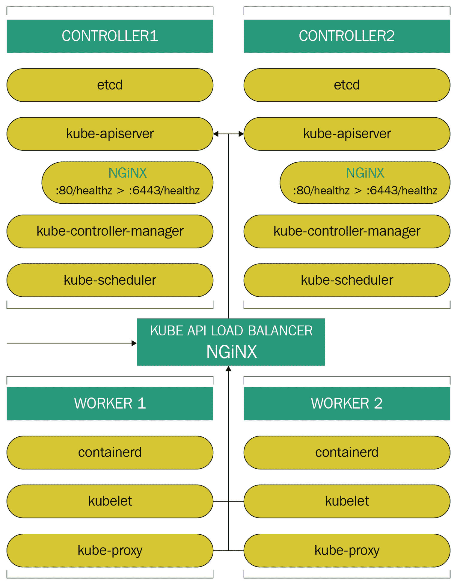

# 第八章：设计 Kubernetes 集群

现在我们了解了组成 Kubernetes 集群的基础知识，我们仍然需要了解如何将所有 Kubernetes 组件放在一起，以及如何满足它们的要求来提供一个可用于生产的 Kubernetes 集群。

在这一章中，我们将研究如何确定这些要求以及它们将如何帮助我们维持稳定的工作负载并实现成功的部署。

在本章中，我们将探讨以下主题：

+   Kube-sizing

+   确定存储考虑因素

+   确定网络要求

+   自定义 kube 对象

# Kube-sizing

在设计 Kubernetes 集群时，我们不仅需要担心如何配置部署对象来托管我们的应用程序，或者如何配置服务对象来提供跨我们的 pod 的通信，还需要考虑托管所有这些的位置。因此，我们还需要考虑所需的资源，以平衡我们的应用程序工作负载和控制平面。

# etcd 考虑因素

我们将需要至少一个三节点的 `etcd` 集群，以便在一个节点失败的情况下能够支持自身。因为 `etcd` 使用一种称为 **Raft** 的分布式普查算法，所以建议使用奇数个集群。这是因为，为了允许某个操作，集群的成员超过 50% 必须同意。例如，在一个两节点集群的情况下，如果其中一个节点失败，另一个节点的投票只占集群的 50%，因此，集群失去了法定人数。现在，当我们有一个三节点集群时，单个节点的故障只代表了 33.33% 的投票损失，而剩下的两个节点的投票仍然占 66.66%，以允许该操作。

以下链接是一个很棒的网站，您可以在其中学习 Raft 算法的工作原理：[`thesecretlivesofdata.com/raft/`](http://thesecretlivesofdata.com/raft/)。

对于 `etcd`，我们可以为我们的集群选择两种部署模型。我们可以将其运行在与我们的 kube-apiserver 相同的节点上，或者我们可以有一组单独的集群来运行我们的键值存储。无论哪种方式，这都不会改变 `etcd` 如何达成法定人数，因此您仍然需要在控制平面管理节点上安装奇数个 `etcd`。

对于 Kubernetes 的使用情况，`etcd` 不会消耗大量的计算资源，如 CPU 或内存。尽管 `etcd` 会积极地缓存键值数据并使用大部分内存来跟踪观察者，但两个核心和 8 GB 的内存将是绰绰有余的。

当涉及到磁盘时，这就需要更加严格。`etcd` 集群严重依赖磁盘延迟，因为共识协议以日志的方式持久存储元数据。`etcd` 集群的每个成员都必须存储每个请求，任何延迟的重大波动都可能触发集群领导者选举，这将导致集群不稳定。`etcd` 的 **硬盘驱动器**（**HDD**）是不可能的，除非您在 Raid 0 磁盘上运行 15k RPM 磁盘以从磁性驱动器中挤出最高性能。**固态硬盘**（**SSD**）是最佳选择，具有极低的延迟和更高的 **每秒输入/输出操作**（**IOPS**），它们是托管您的键值存储的理想候选者。值得庆幸的是，所有主要的云提供商都提供 SSD 解决方案来满足这种需求。

# kube-apiserver 大小

控制平面组件所需的剩余资源将取决于它们将管理的节点数量以及您将在其上运行的附加组件。需要考虑的另一件事是，您可以将这些主节点放在负载均衡器后面，以减轻负载并提供高可用性。此外，您还可以在争用期间始终水平扩展您的主节点。

考虑到所有这些，并考虑到`etcd`将与我们的主节点一起托管，我们可以说，具有 2 到 4 个 vCPU 和 8 到 16 GB RAM 的**虚拟机**（**VMs**）的三个主节点集群将足以处理大于或等于 100 个工作节点。

# 工作节点

另一方面，工作节点将承担繁重的工作——这些节点将运行我们的应用工作负载。标准化这些节点的大小将是不可能的，因为它们属于*假设发生什么*的情景。我们需要确切地知道我们将在节点上运行什么类型的应用程序，以及它们的资源需求，以便我们能够正确地对其进行规模化。节点不仅将根据应用程序的资源需求进行规模化，而且我们还必须考虑在其中运行超过我们计划的 pod 的时期。例如，您可以对部署执行滚动更新以使用新的镜像，具体取决于您如何配置您的`maxSurge`；这个节点将不得不处理 10%到 25%的额外负载。

容器非常轻量级，但当编排器开始运行时，您可以在单个节点上运行 30、40 甚至 100 个容器！这会大幅增加每个主机的资源消耗。虽然 pod 具有资源限制功能和规范来限制容器的资源消耗，但您仍然需要考虑这些容器所需的资源。

在资源需求高和争用期间，节点始终可以进行水平扩展。然而，始终可以使用额外的资源来避免任何不良的**内存不足**（**OOMs**）杀手。因此，通过拥有额外的资源池来规划未来和*假设发生什么*的情景。

# 负载均衡器考虑

我们的节点仍然需要与我们的 API 服务器通信，并且正如我们之前提到的，拥有多个主节点需要一个负载均衡器。当涉及到从我们的节点到主节点的负载均衡请求时，我们有几个选项可供选择，具体取决于您运行集群的位置。如果您在公共云中运行 Kubernetes，可以选择使用云提供商的负载均衡器选项，因为它们通常是弹性的。这意味着它们会根据需要自动扩展，并提供比您实际需要的更多功能。基本上，负载均衡请求到 API 服务器将是负载均衡器执行的唯一任务。这将导致我们的场景——因为我们在这里坚持使用开源解决方案，所以您可以配置运行 HAProxy 或 NGINX 的 Linux 框来满足您的负载均衡需求。在选择 HAProxy 和 NGINX 之间没有错误答案，因为它们提供了您所需的功能。

到目前为止，基本架构将如下截图所示：



# 存储考虑

存储需求并不像常规主机或虚拟化程序那样直截了当。我们的节点和 pod 将使用几种类型的存储，我们需要适当地对它们进行分层。由于您正在运行 Linux，将存储分层到不同的文件系统和存储后端将非常容易——没有**逻辑卷管理器**（**LVM**）或不同的挂载点无法解决的问题。

基本的 Kubernetes 二进制文件，如`kubelet`和`kube-proxy`，可以在基本存储上运行，与操作系统文件一起；不需要非常高端的存储，任何 SSD 都足以满足它们的需求。

另一方面，我们有存储，容器镜像将存储和运行。回到[第六章]（6da53f60-978c-43a4-9dc9-f16b14405709.xhtml），*创建高可用的自愈架构*，我们了解到容器由只读层组成。这意味着当磁盘在单个节点上运行数十甚至数百个容器时，它们将受到读取请求的严重打击。用于此的存储后端将必须以非常低的延迟提供读取请求。在 IOPS 和延迟方面的具体数字将因环境而异，但基础将是相同的。这是因为容器的性质——提供更高读取性能而非写入的磁盘将更可取。

存储性能并不是唯一需要考虑的因素。存储空间也非常重要。计算所需空间将取决于以下两个因素：

1.  你将要运行的镜像有多大？

1.  你将运行多少不同的镜像，它们的大小是多少？

这将直接消耗`/var/lib/docker`或`/var/lib/containerd`中的空间。考虑到这一点，为`/var/lib/docker`或`containerd/`设置一个单独的挂载点，具有足够的空间来存储你将在 pod 上运行的所有镜像，将是一个不错的选择。请注意，这些镜像是临时的，不会永远存在于你的节点上。Kubernetes 确实在 kubelet 中嵌入了垃圾收集策略，当达到指定的磁盘使用阈值时，将删除不再使用的旧镜像。这些选项是`HighThresholdPercent`和`LowThresholdPercent`。你可以使用 kubelet 标志进行设置：`--eviction-hard=imagefs.available`或`--eviction-soft=imagefs.available`。这些标志已经默认配置为在可用存储空间低于 15%时进行垃圾收集，但是你可以根据需要进行调整。`eviction-hard`是需要达到的阈值，以开始删除镜像，而`eviction-soft`是需要达到的百分比或数量，以停止删除镜像。

一些容器仍将需要某种读/写卷以用于持久数据。如[第七章]（d89f650b-f4ea-4cda-9111-a6e6fa6c2256.xhtml）中所讨论的，Kubernetes 集群的核心组件，有几种存储供应商，它们都适用于不同的场景。你需要知道的是，由于 Kubernetes 存储类别的存在，你有一系列可用的选项。以下是一些值得一提的开源软件定义存储解决方案：

+   Ceph

+   GlusterFS

+   OpenStack Cinder

+   **网络文件系统**（**NFS**）

每个存储供应商都有其优势和劣势，但详细介绍每个存储供应商已超出了本书的范围。我们在之前的章节中对 Gluster 进行了很好的概述，因为在后续章节中我们将用它来进行示例部署。

# 网络要求

为了了解我们集群的网络要求，我们首先需要了解 Kubernetes 网络模型以及它旨在解决的问题。容器网络可能很难理解；然而，它有三个基本问题：

1.  容器如何相互通信（在同一台主机上和在不同的主机上）？

1.  容器如何与外部世界通信，外部世界如何与容器通信？

1.  谁分配和配置每个容器的唯一 IP 地址？

同一主机上的容器可以通过虚拟桥相互通信，您可以使用`bridge-utils`软件包中的`brctl`实用程序看到这一点。这由 Docker 引擎处理，称为 Docker 网络模型。容器通过分配 IP 来附加到名为`docker0`的虚拟桥上的`veth`虚拟接口。这样，所有容器都可以通过它们的`veth`虚拟接口相互通信。Docker 模型的问题出现在容器分配在不同主机上，或者外部服务想要与它们通信时。为解决这个问题，Docker 提供了一种方法，其中容器通过主机的端口暴露给外部世界。请求进入主机 IP 地址的某个端口，然后被代理到该端口后面的容器。

这种方法很有用，但并非理想。您无法将服务配置为特定端口或在动态端口分配方案中—我们的服务将需要标志每次部署时连接到正确的端口。这可能会很快变得非常混乱。

为了避免这种情况，Kubernetes 实现了自己的网络模型，必须符合以下规则：

1.  所有 pod 可以在没有网络地址转换（NAT）的情况下与所有其他 pod 通信

1.  所有节点可以在没有 NAT 的情况下与所有 pod 通信

1.  pod 看到的 IP 与其他人看到的 IP 相同

有几个开源项目可以帮助我们实现这个目标，最适合您的项目将取决于您的情况。以下是其中一些：

+   Project Calico

+   Weave Net

+   Flannel

+   Kube-router

为 pod 分配 IP 并使它们相互通信并不是唯一需要注意的问题。Kubernetes 还提供基于 DNS 的服务发现，因为通过 DNS 记录而不是 IP 进行通信的应用程序更有效和可扩展。

# 基于 Kubernetes 的 DNS 服务发现

Kubernetes 在其 kube-system 命名空间中部署了一个部署，我们将在本章后面重新讨论命名空间。该部署由一个包含一组容器的 pod 组成，形成一个负责在集群中创建所有 DNS 记录并为服务发现提供 DNS 请求的 DNS 服务器。

Kubernetes 还将创建一个指向上述部署的服务，并告诉 kubelet 默认配置每个 pod 的容器使用服务的 IP 作为 DNS 解析器。这是默认行为，但您可以通过在 pod 规范上设置 DNS 策略来覆盖此行为。您可以从以下规范中进行选择：

+   **默认**：这个是反直觉的，因为实际上并不是默认的。使用此策略，pod 将继承运行该 pod 的节点的名称解析。例如，如果一个节点配置为使用`8.8.8.8`作为其 DNS 服务器，那么`resolv.conf`中的 pod 也将被配置为使用相同的 DNS 服务器。

+   **ClusterFirst**：这实际上是默认策略，正如我们之前提到的，任何使用 ClusterFirst 运行的 pod 都将使用`kube-dns`服务的 IP 配置`resolv.conf`。不是本地集群的任何请求都将转发到节点配置的 DNS 服务器。

并非所有 Kubernetes 对象都具有 DNS 记录。只有服务和在某些特定情况下，pod 才会为它们创建记录。DNS 服务器中有两种类型的记录：**A 记录**和**服务记录**（**SRV**）。A 记录是根据创建的服务类型创建的；我们这里指的不是`spec.type`。有两种类型的服务：**普通服务**，我们在第七章中进行了修订，*理解 Kubernetes 集群的核心组件*，并对应于`type`规范下的服务；和**无头服务**。在解释无头服务之前，让我们探讨普通服务的行为。

对于每个普通服务，将创建指向服务的集群 IP 地址的 A 记录；这些记录的结构如下：

```
<service-name>.<namespace>.svc.cluster.local
```

与服务运行在相同命名空间的任何 pod 都可以通过其`shortname: <service-name>`字段解析服务。这是因为命名空间之外的任何其他 pod 都必须在 shortname 实例之后指定命名空间：

```
<service-name>.<namespace>
```

对于无头服务，记录的工作方式有些不同。首先，无头服务是一个没有分配集群 IP 的服务。因此，无法创建指向服务 IP 的 A 记录。要创建无头服务，您以这种方式定义`.spec.clusterIP`命名空间为`none`，以便不为其分配 IP。然后，Kubernetes 将根据此服务的端点创建 A 记录。基本上，通过`selector`字段选择 pod，尽管这不是唯一的要求。由于 A 记录的创建格式，pod 需要几个新字段，以便 DNS 服务器为它们创建记录。

Pods 将需要两个新的规范字段：`hostname`和`subdomain`。`hostname`字段将是 pod 的`hostname`字段，而`subdomain`将是您为这些 pod 创建的无头服务的名称。这将指向每个 pod 的 IP 的 A 记录如下：

```
<pod hostname>.<subdomian/headless service name>.<namespace>.svc.cluster.local
```

此外，将创建另一个仅包含无头服务的记录，如下所示：

```
<headless service>.<namespace>.svc.cluster.local
```

此记录将返回服务后面所有 pod 的 IP 地址。

我们现在已经有了开始构建我们的集群所需的东西。但是，还有一些设计特性不仅包括 Kubernetes 二进制文件及其配置，还可以调整 Kubernetes API 对象。我们将在下一节中介绍一些您可以执行的调整。

# 自定义 kube 对象

在涉及 Kubernetes 对象时，一切都将取决于您尝试为其构建基础架构的工作负载或应用程序的类型。因此，与其设计或构建任何特定的自定义，我们将介绍如何在每个对象上配置最常用和有用的规范。

# 命名空间

Kubernetes 提供命名空间作为将集群分割成多个**虚拟集群**的一种方式。将其视为一种将集群资源和对象进行分割并使它们在逻辑上相互隔离的方式。

命名空间只会在非常特定的情况下使用，但 Kubernetes 带有一些预定义的命名空间：

+   **默认**：这是所有没有命名空间定义的对象将放置在其中的默认命名空间。

+   **kube-system**：由 Kubernetes 集群创建的和为其创建的任何对象都将放置在此命名空间中。用于集群基本功能的必需对象将放置在这里。例如，您将找到`kube-dns`，`kubernetes-dashboard`，`kube-proxy`或任何外部应用程序的其他组件或代理，例如`fluentd`，`logstash`，`traefik`和入口控制器。

+   **kube-public**：为任何人可见的对象保留的命名空间，包括非经过身份验证的用户。

创建命名空间非常简单直接；您可以通过运行以下命令来执行：

```
kubectl create namespace <name>
```

就是这样——现在您有了自己的命名空间。要将对象放置在此命名空间中，您将使用`metadata`字段并添加`namespace`键值对；例如，考虑来自 YAML pod 的这段摘录：

```
    apiVersion: v1
    kind: Pod
    metadata:
        namespace: mynamespace
        name: pod1    
```

您将发现自己为通常非常庞大并且有相当数量的用户或不同团队在使用资源的集群创建自定义命名空间。对于这些类型的场景，命名空间非常完美。命名空间将允许您将一个团队的所有对象与其余对象隔离开来。名称甚至可以在相同的类对象上重复，只要它们在不同的命名空间中。

命名空间不仅为对象提供隔离，还可以为每个命名空间设置资源配额。假设您有几个开发团队在集群上工作——一个团队正在开发一个非常轻量级的应用程序，另一个团队正在开发一个非常占用资源的应用程序。在这种情况下，您不希望第一个开发团队从资源密集型应用程序团队那里消耗任何额外的计算资源——这就是资源配额发挥作用的地方。

# 限制命名空间资源

资源配额也是 Kubernetes API 对象；但是，它们被设计为专门在命名空间上工作，通过在每个分配的空间上创建计算资源的限制，甚至限制对象的数量。

`ResourceQuota` API 对象与 Kubernetes 中的任何其他对象一样，通过传递给`kubectl`命令的`YAML`文件声明。

基本资源配额定义如下：

```
apiVersion: v1
kind: ResourceQuota
Metadata:
  Namespace: devteam1 
  name: compute-resources
spec:
  hard:
    pods: "4"
    requests.cpu: "1"
    requests.memory: 1Gi
    limits.cpu: "2"
    limits.memory: 2Gi
```

我们可以设置两种基本配额：计算资源配额和对象资源配额。如前面的例子所示，`pods`是对象配额，其余是计算配额。

在这些领域中，您将指定提供的资源的总和，命名空间不能超过。例如，在此命名空间中，运行的`pods`的总数不能超过`4`，它们的资源总和不能超过`1`个 CPU 和`2Gi` RAM 内存。

可以为任何可以放入命名空间的 kube API 对象分配的每个命名空间的最大对象数；以下是可以使用命名空间限制的对象列表：

+   **持久卷索赔**（**PVCs**）

+   服务

+   秘密

+   配置映射

+   复制控制器

+   部署

+   副本集

+   有状态集

+   作业

+   定期作业

在计算资源方面，不仅可以限制内存和 CPU，还可以为存储空间分配配额——但是这些配额仅适用于 PVCs。

为了更好地理解计算配额，我们需要更深入地了解这些资源是如何在 pod 基础上管理和分配的。这也是一个很好的时机来了解如何更好地设计 pod。

# 自定义 pod

在非受限命名空间上没有资源限制的 pod 可以消耗节点的所有资源而不受警告；但是，您可以在 pod 的规范中使用一组工具来更好地处理它们的计算分配。

当您为 pod 分配资源时，实际上并不是将它们分配给 pod。相反，您是在容器基础上进行分配。因此，具有多个容器的 pod 将为其每个容器设置多个资源约束；让我们考虑以下示例：

```
apiVersion: v1
 kind: Pod
 metadata:
  name: frontend
 spec:
  containers:
  - name: db
    image: mysql
    env:
    - name: MYSQL_ROOT_PASSWORD
      value: "password"
    resources:
      requests:
        memory: "64Mi"
        cpu: "250m"
      limits:
        memory: "128Mi"
        cpu: "500m"
  - name: wp
    image: wordpress
    resources:
      requests:
        memory: "64Mi"
        cpu: "250m"
      limits:
        memory: "128Mi"
        cpu: "500m"
```

在此 pod 声明中，在`containers`定义下，我们有两个尚未涵盖的新字段：`env`和`resources`。`resources`字段包含我们的`containers`的计算资源限制和要求。通过设置`limits`，您告诉容器它可以要求该资源类型的最大资源数量。如果容器超过限制，将重新启动或终止。

`request`字段指的是 Kubernetes 将向该容器保证的资源量。为了使容器能够运行，主机节点必须有足够的空闲资源来满足请求。

CPU 和内存以不同的方式进行测量。例如，当我们分配或限制 CPU 时，我们使用 CPU 单位进行讨论。设置 CPU 单位有几种方法；首先，您可以指定圆整或分数，例如 1、2、3、0.1 和 1.5，这将对应于您要分配给该容器的虚拟核心数。另一种分配的方法是使用**milicore**表达式。一个 milicore（1m），是您可以分配的最小 CPU 数量，相当于 0.001 CPU 核心；例如，您可以进行以下分配：

```
cpu: "250m"
```

这将与编写以下内容相同：

```
cpu: 0.25
```

分配 CPU 的首选方式是通过 Millicores，因为 API 会将整数转换为 Millicores。

对于内存分配，您可以使用普通的内存单位，如千字节或基字节；其他内存单位也是如此，如 E、P、T、G 和 M。

回到资源配额，我们可以看到单个容器资源管理将如何与命名空间中的资源配额一起发挥作用。这是因为资源配额将告诉我们在容器中每个命名空间中可以设置多少限制和请求。

我们没有修改的第二个字段是`env`字段。通过`env`，我们为容器配置环境变量。通过变量声明，我们可以将设置、参数、密码和更多配置传递给我们的容器。在 pod 中声明变量的最简单方式如下：

```
...
env:
-  name: VAR
  value: “Hello World”
```

现在容器将可以在其 shell 中访问`VAR`变量内容，称为`$VAR`。正如我们之前提到的，这是声明变量并为其提供值的最简单方式。然而，这并不是最有效的方式——当您以这种方式声明值时，该值将仅存在于 pod 声明中。

如果我们需要编辑值或将该值传递给多个 pod，这将变得很麻烦，因为您需要在每个需要它的 pod 上键入相同的值。这就是我们将介绍另外两个 Kubernetes API 对象：`Secrets`和`ConfigMaps`的地方。

通过`ConfigMaps`和`Secrets`，我们可以以持久且更模块化的形式存储变量的值。实质上，`ConfigMaps`和`Secrets`是相同的，但是 secrets 中包含的值是以`base64`编码的。Secrets 用于存储诸如密码或私钥等敏感信息，基本上是任何类型的机密数据。您不需要隐藏的所有其他数据都可以通过`ConfigMap`传递。

创建这两种类型的对象的方式与 Kubernetes 中的任何其他对象相同——通过`YAML`。您可以按以下方式创建`ConfigMap`对象：

```
apiVersion: v1
 kind: ConfigMap
 metadata:
  name: my-config
 data:
 super.data: much-data
 very.data: wow
```

在这个定义上唯一的区别，与本章中的所有其他定义相比，就是我们缺少了`specification`字段。相反，我们有`data`，在其中我们将放置包含我们想要存储的数据的键值对。

对于`Secrets`，这个过程有点不同。这是因为我们需要存储的密钥的值必须进行编码。为了将值存储在秘密的键中，我们将值传递给`base64`，如下所示：

```
[dsala@RedFedora]$ echo -n “our secret” | base64
WW91IEhhdmUgRGVjb2RlZCBNeSBTZWNyZXQhIENvbmdyYXR6IQ==
```

当我们有字符串的`base64`哈希时，我们就可以创建我们的秘密了。

以下代码块显示了一个使用`base64`配置了秘密值的`YAML`文件：

```
apiVersion: v1
 kind: Secret
 metadata:
  name: kube-secret
 type: Opaque
 data:
  password: WW91IEhhdmUgRGVjb2RlZCBNeSBTZWNyZXQhIENvbmdyYXR6IQ==
```

使用我们的`ConfigMaps`和`Secrets`对象在 pod 中，我们在`env`数组中使用`valueFrom`字段：

```
apiVersion: v1
 kind: Pod
 metadata:
  name: secret-pod
 spec:
  containers:
  - name: secret-container
    image: busybox
    env:
      - name: SECRET_VAR
        valueFrom:
          secretKeyRef:
            name: kube-secret
            key: password
```

在这里，`secretKeyRef`下的名称对应于`Secret` API 对象的名称，而`key`是`Secret`中`data`字段中的`key`。

对于`ConfigMaps`，它看起来几乎一样；但是，在`valueFrom`字段中，我们将使用`configMapKeyRef`而不是`secretKeyRef`。

`ConfigMap`声明如下：

```
    …
    env:
            -   name: CONFMAP_VAR
                valueFrom:
                   configMapKeyRef:
                      name: my-config
                      key: very.data
```

现在您已经了解了定制 pod 的基础知识，您可以查看一个真实的示例，网址为[`kubernetes.io/docs/tutorials/configuration/configure-redis-using-configmap/`](https://kubernetes.io/docs/tutorials/configuration/configure-redis-using-configmap/)。

# 摘要

在本章中，我们学习了如何确定 Kubernetes 集群的计算和网络要求。我们还涉及了随之而来的软件要求，比如`etcd`，以及为什么奇数编号的集群更受青睐（由于人口普查算法），因为集群需要获得超过 50%的选票才能达成共识。

`etcd`集群可以在 kube-apiserver 上运行，也可以有一个专门用于`etcd`的独立集群。在资源方面，2 个 CPU 和 8GB 的 RAM 应该足够了。在决定`etcd`的存储系统时，选择延迟较低、IOPS 较高的存储，如 SSD。然后我们开始调整 kube-apiserver 的大小，它可以与`etcd`一起运行。鉴于这两个组件可以共存，每个节点的资源应该在 8 到 16GB 的 RAM 和 2 到 4 个 CPU 之间。

为了正确调整工作节点的大小，我们必须记住这是实际应用工作负载将要运行的地方。这些节点应根据应用程序要求进行调整，并且在可能会运行超过计划数量的 pod 的时期，例如在滚动更新期间，应考虑额外的资源。继续讨论集群的要求，我们提到负载均衡器如何通过在集群中平衡请求来帮助主节点的通信。

Kubernetes 的存储需求可能会非常庞大，因为许多因素可能会影响整体设置，倾向于选择有利于读取而不是写入的存储系统更可取。此外，Kubernetes 的一些最常见的存储提供者如下：

+   Ceph

+   GlusterFS（在第二章中涵盖，*定义 GlusterFS 存储*到第五章，*分析 Gluster 系统的性能*）

+   OpenStack Cinder

+   NFS

然后我们转向网络方面，了解了 Kubernetes 如何提供诸如基于 DNS 的服务发现之类的服务，负责在集群中创建所有 DNS 记录并为服务发现提供 DNS 请求。Kubernetes 中的对象可以定制以适应每个工作负载的不同需求，而诸如命名空间之类的东西被用作将您的集群分成多个虚拟集群的一种方式。资源限制可以通过资源配额来实现。

最后，可以定制 pod 以允许分配绝对最大的资源，并避免单个 pod 消耗所有工作节点的资源。我们详细讨论了各种存储考虑和要求，包括如何定制 kube 对象和 pod。

在下一章中，我们将介绍如何部署 Kubernetes 集群并学习如何配置它。

# 问题

1.  为什么奇数编号的`etcd`集群更受青睐？

1.  `etcd`可以与 kube-apiserver 一起运行吗？

1.  为什么建议`etcd`的延迟较低？

1.  什么是工作节点？

1.  在调整工作节点大小时应考虑什么？

1.  Kubernetes 的一些存储提供者是什么？

1.  为什么需要负载均衡器？

1.  命名空间如何使用？

# 进一步阅读

+   *掌握 Kubernetes* 作者 Gigi Sayfan：[`www.packtpub.com/virtualization-and-cloud/mastering-kubernetes`](https://www.packtpub.com/virtualization-and-cloud/mastering-kubernetes)

+   *面向开发人员的 Kubernetes* 作者 Joseph Heck：[`www.packtpub.com/virtualization-and-cloud/kubernetes-developers`](https://www.packtpub.com/virtualization-and-cloud/kubernetes-developers)

+   *使用 Kubernetes 进行微服务实践* 作者 Gigi Sayfan：[`www.packtpub.com/virtualization-and-cloud/hands-microservices-kubernetes`](https://www.packtpub.com/virtualization-and-cloud/hands-microservices-kubernetes)

+   *开始使用 Kubernetes-第三版* 作者 Jonathan Baier，Jesse White：[`www.packtpub.com/virtualization-and-cloud/getting-started-kubernetes-third-edition`](https://www.packtpub.com/virtualization-and-cloud/getting-started-kubernetes-third-edition)

+   *掌握 Docker-第二版* 作者 Russ McKendrick，Scott Gallagher：[`www.packtpub.com/virtualization-and-cloud/mastering-docker-second-edition`](https://www.packtpub.com/virtualization-and-cloud/mastering-docker-second-edition)

+   《Docker Bootcamp》由 Russ McKendrick 等人编写：[`www.packtpub.com/virtualization-and-cloud/docker-bootcamp`](https://www.packtpub.com/virtualization-and-cloud/docker-bootcamp)
