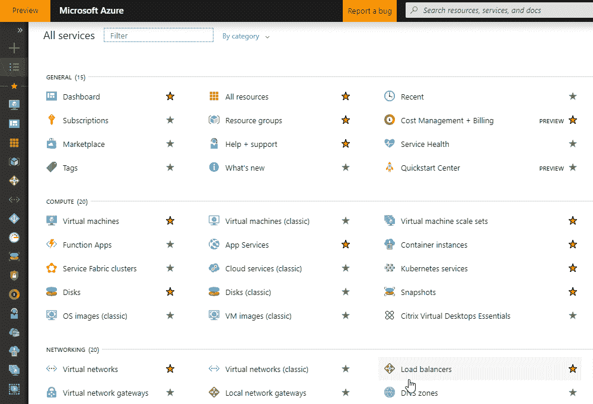
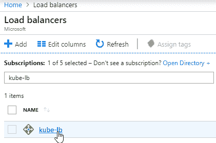
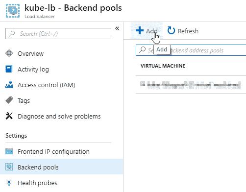
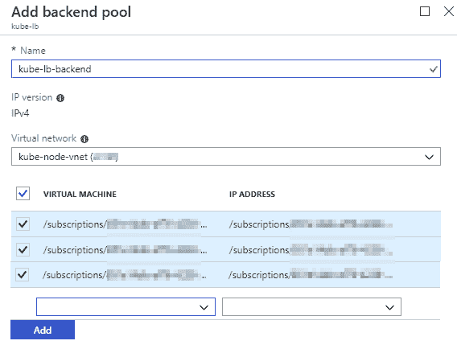
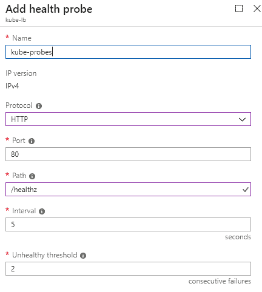
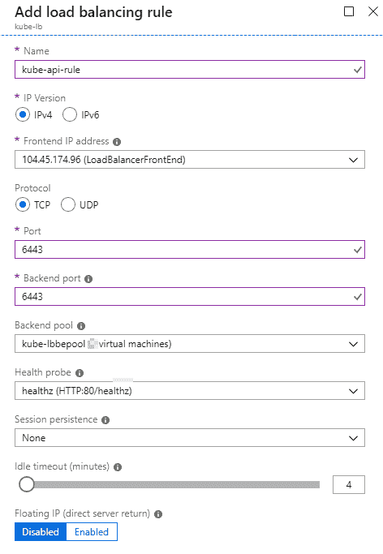

# 第九章：部署和配置 Kubernetes

在了解了 Kubernetes 内部组件及其相互作用方式之后，现在是时候学习如何设置它们了。手动安装 Kubernetes 集群可能是一个非常痛苦和微妙的过程，但通过完成所需的步骤，我们可以更好地学习和理解其内部组件。在执行手动安装后，我们还可以探索其他可用于自动化此过程的替代方案和工具。以下是本章将学习的内容的摘要：

+   创建我们的计算环境

+   引导控制平面

+   引导工作节点

+   配置集群网络和 DNS 设置

+   托管 Kubernetes 服务的示例

通过每一步，我们将更接近完成 Kubernetes 的完整安装，并准备在开发环境中进行测试。

# 基础设施部署

为了部署将运行我们的 Kubernetes 集群的基础设施，我们将使用 Microsoft Azure。您可以通过创建免费试用或使用任何其他公共云提供商，或者您自己的本地 IT 基础设施来跟随。具体步骤将取决于您的选择。

# 安装 Azure CLI

在使用 Linux 时，在 Azure 中部署资源有两种方式：您可以从门户或通过 Azure CLI 进行。我们将两者都使用，但用于不同的场景。

让我们开始在我们的 Linux 工作站或 Windows 子系统上安装 Azure CLI。

请注意，所有命令都假定由具有 root 权限的帐户或 root 帐户本身发出（但这并不推荐）。

对于基于 RHEL/Centos 的发行版，您需要执行以下步骤：

1.  下载并`import`存储库密钥，如下命令所示：

```
rpm --import https://packages.microsoft.com/keys/microsoft.asc
```

2. 创建存储库配置文件，如下命令所示：

```
cat << EOF > /etc/yum.repos.d/azure-cli.repo
[azure-cli]
name=Azure CLI
baseurl=https://packages.microsoft.com/yumrepos/azure-cli
enabled=1
gpgcheck=1
gpgkey=https://packages.microsoft.com/keys/microsoft.asc
EOF
```

3. 使用以下命令安装`azure-cli`：

```
yum install azure-cli
```

4. 使用以下命令登录到您的 Azure 订阅：

```
az login
```

如果您不在桌面环境中，您可以使用：az login --use-device-code，因为常规的“az login”需要通过 Web 浏览器执行登录。

安装 Azure CLI 后，我们仍然需要设置一些默认值，这样我们就不必一遍又一遍地输入相同的标志选项。

# 配置 Azure CLI

Azure 上的每个资源都位于资源组和地理位置中。因为我们所有的资源都将位于同一个资源组和位置中，让我们将它们配置为默认值。要做到这一点，请运行以下命令：

```
az configure --defaults location=eastus group=Kube_Deploy
```

对于我们的示例，我们将使用“东部”作为位置，因为这是离我们最近的位置。组名将取决于您将如何命名您的资源组-在我们的情况下，是`Kube_Deploy`。

配置了默认值后，让我们继续实际创建包含我们资源的资源组，使用以下命令：

```
az group create -n “Kube_Deploy”
```

# 高级设计概述

创建了我们的资源组并选择了我们的位置后，让我们通过以下代码高层次地查看我们将要创建的设计：

```
<design picture>
```

我们现在需要注意的重要事项是 VM 的数量、网络架构和防火墙规则，因为这些是我们将直接在我们的第一步中配置的元素。

在我们开始配置资源之前，让我们先看一下我们的网络需求。

我们有以下要求：

+   以下三组不同的、不重叠的子网：

+   VM 子网

+   Pod 子网

+   服务子网

+   以下资源的静态分配的 IP 地址：

+   主节点

+   工作节点

+   管理 VM

+   负载均衡器的公共 IP

+   DNS 服务器

对于我们的 VM 子网，我们将使用以下地址空间：

```
192.168.0.0/24
```

服务 CIDR 将如下：

```
10.20.0.0/24
```

最后，我们的 POD CIDR 将会更大一些，以便它可以分配更多的 POD，如下面的代码所示：

```
10.30.0.0/16
```

现在让我们开始配置我们需要使这种架构成为可能的网络资源。

# 配置网络资源

首先，我们将创建包含 VM 子网的虚拟网络。要做到这一点，运行以下命令：

```
az network vnet create -n kube-node-vnet \
 --address-prefix 192.168.0.0/16 \
 --subnet-name node-subnet \
 --subnet-prefix 192.168.0.0/24
```

这个命令中的两个关键点是`address-prefix`标志和`subnet-prefix`标志。

使用`address-prefix`标志，我们将指定定义 VNET 上可以放置哪些子网的地址空间。例如，我们的 VNET 前缀是`192.16.0.0/16`。这意味着我们不能在这个 CIDR 之外放置任何地址；例如，`10.0.0.0/24`是行不通的。

子网前缀将是分配给连接到我们子网的 VM 的地址空间。现在我们已经创建了我们的 VNET 和子网，我们需要一个静态的公共 IP 地址。在 Azure 和任何公共云提供商中，公共 IP 是与 VM 分开的资源。

通过运行以下命令来创建我们的公共 IP：

```
az network public-ip create -n kube-api-pub-ip \
 --allocation-method Static \
 --sku Standard
```

创建后，可以通过运行以下查询来记录 IP：

```
az network public-ip show -n kube-api-pub-ip --query "ipAddress"
```

有了我们的 VNET、子网和公共 IP 分配完毕，我们只需要最后一个资源，一个防火墙，为我们的 VMS 提供安全保障。在 Azure 中，防火墙称为**网络安全组**（**NSG**）。创建 NSG 的过程非常简单，如下命令所示：

```
az network nsg create -n kube-nsg
```

创建 NSG 后，我们使用以下命令将 NSG 分配给我们的子网：

```
az network vnet subnet update -n node-subnet \
 --vnet-name kube-node-vnet \
 --network-security-group kube-nsg
```

# 配置计算资源

网络设置完成后，我们准备开始创建一些 VM。但在创建任何 VM 之前，我们需要创建用于访问我们的 VM 的 SSH 密钥。

我们将创建的第一对密钥是用于我们的管理 VM。这个 VM 将是唯一一个可以从外部世界访问 SSH 的 VM。出于安全原因，我们不希望暴露任何集群节点的`22`端口。每当我们想要访问我们的任何节点时，我们都将从这个 VM 中进行访问。

要创建 SSH 密钥，请在您的 Linux 工作站上运行`ssh-keygen`：

```
ssh-keygen
```

现在让我们使用以下命令创建管理 VM：

```
az vm create -n management-vm \
 --admin-username <USERNAME> \
 --size Standard_B1s \
 --image CentOS \
 --vnet-name kube-node-vnet \
 --subnet node-subnet \
 --private-ip-address 192.168.0.99 \
 --nsg kube-nsg \
 --ssh-key-value ~/.ssh/id_rsa.pub
```

记得用所需的用户名替换`<USERNAME>`字段。

下一步是我们需要配置第一个 NSG 规则的地方。这个规则将允许来自我们自己网络的流量进入我们的管理 VM 的`22`端口，这样我们就可以通过 SSH 连接到它。让我们使用以下命令设置这个规则：

```
az network nsg rule create --nsg-name kube-nsg \
 -n mgmt_ssh_allow \
 --direction Inbound \
 --priority 100 \
 --access Allow \
 --description "Allow SSH From Home" \
 --destination-address-prefixes '192.168.0.99' \
 --destination-port-ranges 22 \
 --protocol Tcp \
 --source-address-prefixes '<YOUR IP>' \
 --source-port-ranges '*' \
 --direction Inbound
```

`source-address-prefixes`是您的 ISP 提供的公共 IP 地址，因为这些 IP 可能是动态的，如果发生变化，您可以在 Azure 门户中的网络安全组规则中编辑 IP。

现在让我们连接到我们的 VM，创建 SSH 密钥，以便我们可以连接到我们的集群 VM。要检索我们管理 VM 的公共 IP 地址，运行以下查询：

```
az vm show -d -n management-vm --query publicIps
```

现在让我们使用之前创建的私钥 SSH 进入我们的 VM，如下所示：

```
ssh <username>@<public ip> -i <path to private key>
```

只有在您使用与创建密钥对的用户不同的用户登录时，才需要指定私钥。

现在我们在管理 VM 中，再次运行`ssh-keygen`，最后退出 VM。

为了在 Azure 数据中心发生灾难时提供高可用性，我们的主节点将位于可用性集上。让我们创建可用性集。

如果您不记得可用性集是什么，您可以回到我们的 Gluster 章节，重新了解它的功能。

要创建可用性集，请运行以下命令：

```
az vm availability-set create -n control-plane \
 --platform-fault-domain-count 3 \
 --platform-update-domain-count 3
```

现在我们可以继续创建我们的第一个控制平面节点。让我们首先将我们管理 VM 的公共 SSH 密钥保存到一个变量中，以便将密钥传递给主节点，如下命令所示：

```
MGMT_KEY=$(ssh <username>@<public ip> cat ~/.ssh/id_rsa.pub)
```

要创建三个控制器节点，请运行以下`for`循环：

```

for i in 1 2 3; do
az vm create -n kube-controller-${i} \
 --admin-username <USERNAME> \
 --availability-set control-plane \
 --size Standard_B2s \
 --image CentOS \
 --vnet-name kube-node-vnet \
 --subnet node-subnet \
 --private-ip-address 192.168.0.1${i} \
 --public-ip-address "" \
 --nsg kube-nsg \
 --ssh-key-value ${MGMT_KEY};
done

```

我们在这些 VM 上使用的大小很小，因为这只是一个测试环境，我们实际上不需要很多计算资源。在真实环境中，我们会根据我们在第八章中探讨的考虑因素来确定 VM 的大小，*设计一个 Kubernetes 集群*。

最后但并非最不重要的，我们使用以下命令创建我们的工作节点：

```

for i in 1 2; do
az vm create -n kube-node-${i} \
 --admin-username <USERNAME>\
 --size Standard_B2s \
 --image CentOS \
 --vnet-name kube-node-vnet \
 --subnet node-subnet \
 --private-ip-address 192.168.0.2${i} \
 --public-ip-address "" \
 --nsg kube-nsg \
 --ssh-key-value ${MGMT_KEY}
done

```

# 准备管理 VM

创建了控制器和工作节点后，我们现在可以登录到我们的管理 VM 并开始安装和配置我们将需要引导我们的 Kubernetes 集群的工具。

从现在开始，我们大部分时间将在管理 VM 上工作。让我们 SSH 到 VM 并开始安装我们的工具集。

首先，我们需要下载工具来创建我们集群服务之间通信所需的证书。

首先使用以下命令安装依赖项：

```
johndoe@management-vm$ sudo yum install git gcc 

johndoe@management-vm$ sudo wget -O golang.tgz  https://dl.google.com/go/go1.11.1.linux-amd64.tar.gz 

johndoe@management-vm$ sudo tar -C /usr/local -xzvf golang.tgz
```

安装了**Go lang**后，您需要更新您的`PATH`变量并创建一个名为`GOPATH`的新变量。您的 TLS 证书生成工具 CFFSL 将安装在此路径下。为此，您可以执行以下操作：

```
johndoe@management-vm$ sudo cat << EOF > /etc/profile.d/paths.sh
export PATH=$PATH:/usr/local/go/bin:/usr/local/bin
export GOPATH=/usr/local/
EOF
```

然后运行以下命令在当前 shell 中加载变量：

```
johndoe@management-vm$ sudo source /etc/profile.d/paths.sh
```

变量设置好后，现在我们准备好使用以下命令获取我们的`cffsl`工具包：

```
johndoe@management-vm$ go get -u github.com/cloudflare/cfssl/cmd/cfssl

johndoe@management-vm$ go get -u github.com/cloudflare/cfssl/cmd/cfssljson
```

这两个二进制文件将保存在我们的`GOPATH`变量下。

# 生成证书

安装了 CFSSL 二进制文件并加载到我们的`PATH`中后，我们可以开始生成我们的证书文件。在此安装的这一部分中，我们将生成大量文件，因此最好创建一个目录结构来适当存储它们。

# 证书颁发机构

我们需要生成的第一个文件是用于签署其余组件证书的证书颁发机构文件。

我们将把所有证书存储在`~/certs/`目录下，但首先我们需要创建该目录。让我们使用以下命令设置这个目录：

```
johndoe@management-vm$ mkdir ~/certs
```

现在我们有了目录，让我们从以下命令开始生成 CA 配置文件，其中将包含由我们的 CA 签发的证书的到期日期以及 CA 将用于什么目的的信息：

```
johndoe@management-vm$ cd ~/certs

johndoe@management-vm$ cat << EOF > ca-config.json
{
 "signing": {
 "default": {
 "expiry": "8760h"
 },
 "profiles": {
 "kubernetes": {
 "usages": [
 "signing",
 "key encipherment",
 "server auth",
 "client auth"
 ],
 "expiry": "8760h"
 }
 }
 }
}
EOF
```

有了我们的 CA 配置，现在我们可以开始签发证书签名请求。

我们要生成的第一个 CSR 是用于我们的 CA 的。让我们使用以下命令设置这个：

```
johndoe@management-vm$ cat << EOF > ca-csr.json 
{
 "CN": "Kubernetes",
 "key": {
 "algo": "rsa",
 "size": 2048
 },
 "names": [
 {
 "C": "US",
 "L": "New York",
 "O": "Kubernetes",
 "OU": "CA",
 "ST": "NY"
 }
 ]
}
EOF
```

现在我们有了两个`JSON`文件，我们实际上可以使用`cffsl`并使用以下命令生成我们的证书：

```
johndoe@management-vm$ cfssl gencert -initca ca-csr.json | cfssljson -bare ca
```

如下命令所示，将生成三个文件，`ca.csr`，`ca.pem`和`ca-key.pem`。第一个`ca.csr`是证书签名请求。另外两个分别是我们的公共证书和私钥：

```
johndoe@management-vm$ ls
ca-config.json  ca.csr ca-csr.json  ca-key.pem ca.pem
```

从现在开始，我们生成的任何证书都将是这种情况。

# 客户端证书

现在我们的 CA 已配置并生成了其证书文件，我们可以开始为我们的管理员用户和每个工作节点上的 kubelet 签发证书。

我们要创建的过程和文件与 CA 的非常相似，但在生成它们所使用的命令中有轻微的差异。

使用以下命令创建我们的`admin certs`目录：

```
johndoe@management-vm$ mkdir ~/certs/admin/

johndoe@management-vm$ cd ~/certs/admin/
```

首先，创建管理员用户证书。此证书是供我们的管理员通过`kubectl`管理我们的集群使用的。

同样，我们将使用以下命令生成`csr`的`json`：

```
johndoe@management-vm$ cat << EOF > admin-csr.json 
{
 "CN": "admin",
 "key": {
 "algo": "rsa",
 "size": 2048
 },
 "names": [
 {
 "C": "US",
 "L": "New York",
 "O": "system:masters",
 "OU": "Kubernetes",
 "ST": "NY"
 }
 ]
}
EOF
```

有了我们的 JSON 准备好了，现在让我们使用以下命令签名并创建管理员证书：

```
johndoe@management-vm$ cfssl gencert \
 -ca=../ca.pem \
 -ca-key=../ca-key.pem \
 -config=../ca-config.json \
 -profile=kubernetes \
 admin-csr.json | cfssljson -bare admin
```

与管理员和 CA 证书相比，创建`kubelet`证书的过程有些不同。`kubelet`证书要求我们在证书中填写主机名字段，因为这是它的标识方式。

使用以下命令创建目录：

```
johndoe@management-vm$ mkdir ~/certs/kubelet/

johndoe@management-vm$ cd ~/certs/kubelet/
```

然后使用以下命令创建`json` `csr`，其中没有太多变化：

```
johndoe@management-vm$ cat << EOF > kube-node-1-csr.json
{
 "CN": "system:node:kube-node-1",
 "key": {
 "algo": "rsa",
 "size": 2048
 },
 "names": [
 {
 "C": "US",
 "L": "New York",
 "O": "system:nodes",
 "OU": "Kubernetes",
 "ST": "NY"
 }
 ]
}
EOF
```

然而，当生成`certs`时，过程有些不同，如下命令所示：

```
johndoe@management-vm$ cfssl gencert \
 -ca=../ca.pem \
 -ca-key=../ca-key.pem \
 -config=../ca-config.json \
 -hostname=192.168.0.21,kube-node-1 \
 -profile=kubernetes \
 kube-node-1-csr.json | cfssljson -bare kube-node-1
```

如您所见，主机名字段将包含节点将具有的任何 IP 或 FQDN。现在为每个工作节点生成证书，填写与生成证书的节点对应的信息。

# 控制平面证书

让我们开始为我们的 kube 主要组件创建证书。

与之前的步骤一样，创建一个包含主节点组件证书的目录，并按以下方式为每个组件生成证书文件：

```
johndoe@management-vm$ mkdir ~/certs/control-plane/

johndoe@management-vm$ cd ~/certs/control-plane/
```

对于`kube-controller-manager`，使用以下命令：

```
johndoe@management-vm$ cat << EOF > kube-controller-manager-csr.json
{
 "CN": "system:kube-controller-manager",
 "key": {
 "algo": "rsa",
 "size": 2048
 },
 "names": [
 {
 "C": "US",
 "L": "New York",
 "O": "system:kube-controller-manager",
 "OU": "Kubernetes",
 "ST": "NY"
 }
 ]
}
EOF

johndoe@management-vm$ cfssl gencert \
 -ca=../ca.pem \
 -ca-key=../ca-key.pem \
 -config=../ca-config.json \
 -profile=kubernetes \
 kube-controller-manager-csr.json | cfssljson -bare kube-controller-manager
```

对于`kube-proxy`，使用以下命令：

```
johndoe@management-vm$ cat << EOF > kube-proxy-csr.json
{
 "CN": "system:kube-proxy",
 "key": {
 "algo": "rsa",
 "size": 2048
 },
 "names": [
 {
 "C": "US",
 "L": "New York",
 "O": "system:node-proxier",
 "OU": "Kubernetes",
 "ST": "NY"
 }
 ]
}
EOF

johndoe@management-vm$ cfssl gencert \
 -ca=../ca.pem \
 -ca-key=../ca-key.pem \
 -config=../ca-config.json \
 -profile=kubernetes \
 kube-proxy-csr.json | cfssljson -bare kube-proxy
```

对于`kube-scheduler`，使用以下命令：

```
johndoe@management-vm$ cat << EOF > kube-scheduler-csr.json
{
 "CN": "system:kube-scheduler",
 "key": {
 "algo": "rsa",
 "size": 2048
 },
 "names": [
 {
 "C": "US",
 "L": "New York",
 "O": "system:kube-scheduler",
 "OU": "Kubernetes",
 "ST": "NY"
 }
 ]
}
EOF

johndoe@management-vm$ cfssl gencert \
 -ca=../ca.pem \
 -ca-key=../ca-key.pem \
 -config=../ca-config.json \
 -profile=kubernetes \
 kube-scheduler-csr.json | cfssljson -bare kube-scheduler
```

现在我们需要创建 API 服务器。您会注意到它与我们在`kubelets`中使用的过程类似，因为这个证书需要主机名参数。但是对于`kube-api`证书，我们不仅会提供单个节点的主机名和 IP 地址，还会提供 API 服务器将使用的所有可能的主机名和 IP 地址：负载均衡器的公共 IP，每个主节点的 IP，以及一个特殊的 FQDN，`kubernetes.default`。所有这些将包含在一个单独的证书中。

首先使用以下命令创建一个单独的目录：

```
johndoe@management-vm$ mkdir ~/certs/api/

johndoe@management-vm$ cd ~/certs/api/
```

现在，让我们使用以下命令为主机名创建一个变量：

```
johndoe@management-vm$API_HOSTNAME=10.20.0.1,192.168.0.11,kube-controller-1,192.168.0.12,kube-controller-2,<PUBLIC_IP>,127.0.0.1,localhost,kubernetes.default
```

请注意，您应该用您的公共 IP 地址替换`<PUBLIC_IP>`。

现在，让我们使用以下命令创建证书：

```
johndoe@management-vm$ cat << EOF > kubernetes-csr.json 
{
 "CN": "kubernetes",
 "key": {
 "algo": "rsa",
 "size": 2048
 },
 "names": [
 {
 "C": "US",
 "L": "New York",
 "O": "Kubernetes",
 "OU": "Kubernetes",
 "ST": "NY"
 }
 ]
}
EOF

johndoe@management-vm$ cfssl gencert \
 -ca=../ca.pem \
 -ca-key=../ca-key.pem \
 -config=../ca-config.json \
 -hostname=${API_HOSTNAME} \
 -profile=kubernetes \
 kubernetes-csr.json | cfssljson -bare kubernetes
```

此时，只缺少一个证书——服务账户证书。这个证书不是为任何普通用户或 Kubernetes 组件特定的。服务账户证书由 API 服务器用于签署用于服务账户的令牌。

我们将把这些密钥对存储在与 API 证书相同的目录中，所以我们只需创建`json`并运行`cfssl` `gencert`命令，如下命令所示：

```
johndoe@management-vm$ cat << EOF > service-account-csr.json 
{
 "CN": "service-accounts",
 "key": {
 "algo": "rsa",
 "size": 2048
 },
 "names": [
 {
 "C": "US",
 "L": "New York",
 "O": "Kubernetes",
 "OU": "Kubernetes",
 "ST": "NY"
 }
 ]
}
EOF

johndoe@management-vm$ cfssl gencert \
 -ca=../ca.pem \
 -ca-key=../ca-key.pem \
 -config=../ca-config.json \
 -profile=kubernetes \
 service-account-csr.json | cfssljson -bare service-account
```

# 发送我们的证书回家

所有证书生成完毕后，是时候将它们移动到相应的节点上了。Microsoft Azure 可以通过 VM 名称内部解析，所以我们可以轻松地移动证书。

使用以下命令将证书移动到`kubelets`：

```
johndoe@management-vm$ cd ~/certs/kubelets

johndoe@management-vm$ scp ../ca.pem \
kube-node-1.pem \
kube-node-1-key.pem \
johndoe@kube-node-1:~/
```

对于其余的节点重复以上步骤。

使用以下命令将证书移动到控制平面：

```
johndoe@management-vm$ cd ~/certs/api

johndoe@management-vm$ scp ../ca.pem \
../ca-key.pem \
kubernetes.pem \
kubernetes-key.pem \
service-account.pem \
service-account-key.pem \
johndoe@kube-controller-1:~/
```

对最后的控制器重复以上步骤。

# Kubeconfigs

要能够与 Kubernetes 通信，您需要知道 API 的位置。您还需要告诉 API 您是谁以及您的凭据是什么。所有这些信息都包含在`kubeconfigs`中。这些配置文件包含了您到达和对集群进行身份验证所需的所有信息。用户不仅将使用`kubeconfig`文件来访问集群，还将使用它来访问其他服务。这就是为什么我们将为每个组件和用户生成多个`kubeconfig`文件。

# 安装 kubectl

要能够创建`kubeconfig`文件，我们需要`kubectl`。您将首先在管理 VM 中安装`kubectl`以生成配置文件，但稍后我们还将使用它来管理我们的集群。

首先，添加我们将获取`kubectl`的存储库，如下命令所示：

```
johndoe@management-vm$ sudo cat << EOF > /etc/yum.repos.d/kubernetes.repo
[kubernetes]
name=Kubernetes
baseurl=https://packages.cloud.google.com/yum/repos/kubernetes-el7-x86_64
enabled=1
gpgcheck=1
repo_gpgcheck=1
gpgkey=https://packages.cloud.google.com/yum/doc/yum-key.gpg https://packages.cloud.google.com/yum/doc/rpm-package-key.gpg
EOF
```

最后，使用`yum`进行安装，如下命令所示：

```
johndoe@management-vm$sudo yum install kubectl
```

# 控制平面 kubeconfigs

我们将要生成的第一个 kubeconfigs 是我们的控制平面组件。

为了保持秩序，我们将继续将文件组织到目录中。所有我们的`kubeconfigs`将放在同一个目录中，如下命令所示：

```
johndoe@management-vm$ mkdir ~/kubeconfigs

johndoe@management-vm$ cd ~/kubeconfigs
```

有了我们创建的目录，让我们开始生成`kubeconfigs`！

# Kube-controller-manager

`kube-controller-manager` `kubeconfig`：

```
johndoe@management-vm$ kubectl config set-cluster kubernetes \
 --certificate-authority=../certs/ca.pem \
 --embed-certs=true \
 --server=https://127.0.0.1:6443 \
 --kubeconfig=kube-controller-manager.kubeconfig

johndoe@management-vm$ kubectl config set-credentials \
system:kube-controller-manager \
 --client-certificate=../certs/control-plane/kube-controller-manager.pem \
 --client-key=../certs/control-plane/kube-controller-manager-key.pem \
 --embed-certs=true \
 --kubeconfig=kube-controller-manager.kubeconfig

johndoe@management-vm$ kubectl config set-context default \
 --cluster=kubernetes \
 --user=system:kube-controller-manager \
 --kubeconfig=kube-controller-manager.kubeconfig

johndoe@management-vm$ kubectl config use-context default --kubeconfig=kube-controller-manager.kubeconfig
```

# Kube-scheduler

`Kube-scheduler` `kubeconfig`：

```
johndoe@management-vm$ kubectl config set-cluster kubernetes \
 --certificate-authority=../certs/ca.pem \
 --embed-certs=true \
 --server=https://127.0.0.1:6443 \
 --kubeconfig=kube-scheduler.kubeconfig

johndoe@management-vm$ kubectl config set-credentials system:kube-scheduler \
 --client-certificate=../certs/control-plane/kube-scheduler.pem \
 --client-key=../certs/control-plane/kube-scheduler-key.pem \
 --embed-certs=true \
 --kubeconfig=kube-scheduler.kubeconfig

johndoe@management-vm$ kubectl config set-context default \
 --cluster=kubernetes \
 --user=system:kube-scheduler \
 --kubeconfig=kube-scheduler.kubeconfig

johndoe@management-vm$ kubectl config use-context default --kubeconfig=kube-scheduler.kubeconfig
```

# Kubelet 配置

对于我们的`kubelets`，我们将需要每个节点一个`kubeconfig`。为了简化操作，我们将使用 for 循环为每个节点创建一个配置，如下命令所示。请注意，您需要用您自己的公共 IP 地址替换`<KUBE_API_PUBLIC_IP>`：

```
johndoe@management-vm$ for i in 1 2; do
kubectl config set-cluster kubernetes \
--certificate-authority=../certs/ca.pem \
--embed-certs=true \
--server=https://<KUBE_API_PUBLIC_IP>:6443 \
--kubeconfig=kube-node-${i}.kubeconfig

kubectl config set-credentials system:node:kube-node-${i} \
--client-certificate=../certs/kubelets/kube-node-${i}.pem \
--client-key=../certs/kubelets/kube-node-${i}-key.pem \
--embed-certs=true \
--kubeconfig=kube-node-${i}.kubeconfig

kubectl config set-context default \
--cluster=kubernetes \
--user=system:node:kube-node-${i} \
--kubeconfig=kube-node-${i}.kubeconfig

kubectl config use-context default --kubeconfig=kube-node-${i}.kubeconfig
done
```

最后，我们的工作节点将需要的最后一个`kubeconfig`是`kube-proxy kubeconfig`。我们只会生成一个，因为它不包含任何特定的节点配置，我们可以将相同的配置复制到所有节点。

# Kube-proxy

`kube-proxy` `kubeconfig`：

```
 johndoe@management-vm$ kubectl config set-cluster kubernetes \
 --certificate-authority=../certs/ca.pem \
 --embed-certs=true \
 --server=https://<PUBLIC_IP>:6443 \
 --kubeconfig=kube-proxy.kubeconfig

johndoe@management-vm$ kubectl config set-credentials system:kube-proxy \
 --client-certificate=../certs/controllers/kube-proxy.pem \
 --client-key=../certs/controllers/kube-proxy-key.pem \
 --embed-certs=true \
 --kubeconfig=kube-proxy.kubeconfig

johndoe@management-vm$ kubectl config set-context default \
 --cluster=kubernetes \
 --user=system:kube-proxy \
 --kubeconfig=kube-proxy.kubeconfig

johndoe@management-vm$ kubectl config use-context default \ --kubeconfig=kube-proxy.kubeconfig
```

现在我们有了控制平面 kubeconfigs 和工作节点，我们现在将使用以下命令为管理员用户创建`kubeconfig`。这个`kubeconfig`文件是我们将用来连接到集群并管理其 API 对象的文件：

```
johndoe@management-vm$ kubectl config set-cluster kubernetes \
 --certificate-authority=../certs/ca.pem \
 --embed-certs=true \
 --server=https://127.0.0.1:6443 \
 --kubeconfig=admin.kubeconfig

johndoe@management-vm$ kubectl config set-credentials admin \
 --client-certificate=../certs/admin/admin.pem \
 --client-key=../certs/admin/admin-key.pem \
 --embed-certs=true \
 --kubeconfig=admin.kubeconfig

johndoe@management-vm$ kubectl config set-context default \
 --cluster=kubernetes \
 --user=admin \
 --kubeconfig=admin.kubeconfig

johndoe@management-vm$ kubectl config use-context default \ --kubeconfig=admin.kubeconfig
```

# 移动配置文件

现在我们的 kubeconfigs 需要传输到它们各自的 VM。为此，我们将遵循与移动证书相同的过程。

首先，让我们使用以下命令移动进入工作节点的 kubeconfigs：

```
johndoe@management-vm$ scp kube-node-1.kubeconfig kube-proxy.kubeconfig johndoe@kube-node-1:~/
```

对每个节点重复。

在节点上放置了 kubeconfigs 后，我们现在可以使用以下命令移动`kube-api`服务器配置：

```
johndoe@management-vm$ scp admin.kubeconfig kube-controller-manager.kubeconfig \
kube-scheduler.kubeconfig johndoe@kube-controller-1:~/
```

对每个控制器重复。

# 安装控制平面

现在我们将安装控制平面所需的二进制文件。

# ETCD

在这个设计中，我们决定将`etcd`与我们的`kube-apiserver`一起运行。我们将开始下载二进制文件并为我们的数据库配置`systemd`单元。

# 安装 etcd

现在是时候在我们的控制器节点中开始安装`etcd`集群了。要安装`etcd`，我们将从管理 VM 中 SSH 到每个控制器并运行以下程序。

我们将通过以下命令下载和提取二进制文件：

```
johndoe@kube-controller-1$ wget -O etcd.tgz \ 
https://github.com/etcd-io/etcd/releases/download/v3.3.10/etcd-v3.3.10-linux-amd64.tar.gz

johndoe@kube-controller-1$ tar xzvf etcd.tgz

johndoe@kube-controller-1$ sudo mv etcd-v3.3.10-linux-amd64/etcd* /usr/local/bin/

johndoe@kube-controller-1$ sudo mkdir -p /etc/etcd /var/lib/etcd
```

在提取了二进制文件之后，我们需要使用以下命令将 kubernetes API 和 CA 证书复制到我们的`etcd`目录中：

```
johndoe@kube-controller-1$ cp /home/johndoe/ca.pem \
/home/johndoe/kubernetes-key.pem \
/home/johndoe/kubernetes.pem /etc/etcd
```

在创建`systemd`单元文件之前，让我们设置一些变量，以使事情变得更容易一些。

这两个变量将是唯一的，如以下命令所示：

```
johndoe@kube-controller-1$ ETCD_NAME=$(hostname)

johndoe@kube-controller-1$ I_IP=192.168.0.11
```

下一个和最后一个变量将在所有节点上相同；它将包含每个`ectd`集群成员的主机名和 IP，如以下命令所示：

```
I_CLUSTER=kube-controller-1=https://192.168.0.11:2380,kube-controller-2=https://192.168.0.12:2380,kube-controller-3=https://192.168.0.13:2380
```

现在我们有了变量，让我们创建`systemd`单元文件，如以下命令所示：

```
johndoe@kube-controller-1$sudo cat << EOF | sudo tee /etc/systemd/system/etcd.service
[Unit]
Description=etcd
Documentation=https://github.com/coreos

[Service]
ExecStart=/usr/local/bin/etcd \\
 --name ${ETCD_NAME} \\
 --cert-file=/etc/etcd/kubernetes.pem \\
 --key-file=/etc/etcd/kubernetes-key.pem \\
 --peer-cert-file=/etc/etcd/kubernetes.pem \\
 --peer-key-file=/etc/etcd/kubernetes-key.pem \\
 --trusted-ca-file=/etc/etcd/ca.pem \\
 --peer-trusted-ca-file=/etc/etcd/ca.pem \\
 --peer-client-cert-auth \\
 --client-cert-auth \\
 --initial-advertise-peer-urls https://${I_IP}:2380 \\
 --listen-peer-urls https://${I_IP}:2380 \\
 --listen-client-urls https://${I_IP}:2379,https://127.0.0.1:2379 \\
 --advertise-client-urls https://${I_IP}:2379 \\
 --initial-cluster-token etcd-cluster-0 \\
 --initial-cluster ${I_CLUSTER} \\
 --initial-cluster-state new \\
 --data-dir=/var/lib/etcd
Restart=on-failure
RestartSec=5

[Install]
WantedBy=multi-user.target
EOF
```

现在我们重新加载、启用并启动守护进程，使用以下命令：

```
johndoe@kube-controller-1$ systemctl daemon-reload && \
systemctl enable etcd && \
systemctl start etcd && \
systemctl status etcd
```

一旦您为每个节点重复了这个过程，您可以通过运行以下命令来检查集群的状态：

```
johndoe@kube-controller-3$ ETCDCTL_API=3 etcdctl member list \
--endpoints=https://127.0.0.1:2379 \
--cacert=/etc/etcd/ca.pem \
--cert=/etc/etcd/kubernetes.pem \
--key=/etc/etcd/kubernetes-key.pem
```

# 加密 etcd 数据

API 服务器可以加密存储在`etcd`中的数据。为此，我们将在创建`kube-apiserver systemd`单元文件时使用一个名为`--experimental-encryption-provider-config`的标志。但在传递该标志之前，我们需要创建一个包含我们加密密钥的 YAML。

我们只会创建一个 YAML 定义并将其复制到每个控制器节点。您应该从管理 VM 执行此操作，以便可以轻松地将文件传输到所有控制器。让我们使用以下命令设置这一点：

```
johndoe@management-vm$ CRYPT_KEY=$(head -c 32 /dev/urandom | base64)
```

输入 YAML 定义如下：

```
johndoe@management-vm$ cat << EOF > crypt-config.yml
kind: EncryptionConfig
apiVersion: v1
resources:
 - resources:
 - secrets
 providers:
 - aescbc:
 keys:
 - name: key1
 secret: ${CRYPT_KEY}
 - identity: {}
EOF
```

最后，使用以下命令将密钥移动到每个节点：

```
johndoe@management-vm$ for i in 1 2 3; do
scp crypt-config.yml johndoe@kube-controller-${i}:~/
done
```

# 安装 Kubernetes 控制器二进制文件

现在`etcd`已经就位，我们可以开始安装`kube-apiserver`、`kube-controller-manager`和`kube-scheduler`。

# Kube-apiserver

让我们从第一个控制器节点 SSH 并使用以下命令下载所需的二进制文件：

```
johndoe@management-vm$ ssh johndoe@kube-controller-1

johndoe@kube-controller-1$ wget "https://storage.googleapis.com/kubernetes-release/release/v1.12.0/bin/linux/amd64/kube-apiserver" \
"https://storage.googleapis.com/kubernetes-release/release/v1.12.0/bin/linux/amd64/kubectl["](https://storage.googleapis.com/kubernetes-release/release/v1.12.0/bin/linux/amd64/kubectl)
```

现在使用以下命令将二进制文件移动到`/usr/local/bin/`：

```
johndoe@kube-controller-1$ sudo mkdir -p /etc/kubernetes/config

johndoe@kube-controller-1$ sudo chmod +x kube*

johndoe@kube-controller-1$ sudo mv kube-apiserver kubectl /usr/local/bin/
```

接下来，我们将使用以下命令创建和移动所有 API 服务器所需的目录和证书：

```
johndoe@kube-controller-1$ sudo mkdir -p /var/lib/kubernetes/

johndoe@kube-controller-1$ sudo cp /home/johndoe/ca.pem \
/home/johndoe/ca-key.pem \
/home/johndoe/kubernetes-key.pem \
/home/johndoe/kubernetes.pem \
/home/johndoe/service-account-key.pem \
/home/johndoe/service-account.pem \
/home/johndoe/crypt-config.yml \
/var/lib/kubernetes/
```

在创建`systemd`单元文件之前，让我们使用以下命令声明一些变量：

```
johndoe@kube-controller-1$ I_IP=192.168.0.11

johndoe@kube-controller-1$ CON1_IP=192.168.0.11

johndoe@kube-controller-1$ CON2_IP=192.168.0.12

johndoe@kube-controller-1$ CON2_IP=192.168.0.13
```

只有`I_IP`变量在每个节点上是唯一的，它将取决于您正在执行该过程的节点的 IP。其他三个变量在所有节点上都是相同的。

现在变量设置好了，我们可以开始创建单元文件，如以下命令所示：

```
johndoe@kube-controller-1$ sudo cat << EOF | sudo tee /etc/systemd/system/kube-apiserver.service
[Unit]
Description=Kubernetes API Server
Documentation=https://github.com/kubernetes/kubernetes

[Service]
ExecStart=/usr/local/bin/kube-apiserver \\
 --advertise-address=${I_IP} \\
 --allow-privileged=true \\
 --apiserver-count=3 \\
 --audit-log-maxage=30 \\
 --audit-log-maxbackup=3 \\
 --audit-log-maxsize=100 \\
 --audit-log-path=/var/log/audit.log \\
 --authorization-mode=Node,RBAC \\
 --bind-address=0.0.0.0 \\
 --client-ca-file=/var/lib/kubernetes/ca.pem \\
 --enable-admission-plugins=Initializers,NamespaceLifecycle,NodeRestriction,LimitRanger,ServiceAccount,DefaultStorageClass,ResourceQuota \\
 --enable-swagger-ui=true \\
 --etcd-cafile=/var/lib/kubernetes/ca.pem \\
 --etcd-certfile=/var/lib/kubernetes/kubernetes.pem \\
 --etcd-keyfile=/var/lib/kubernetes/kubernetes-key.pem \\
 --etcd-servers=https://$CON1_IP:2379,https://$CON2_IP:2379 \\
 --event-ttl=1h \\
 --experimental-encryption-provider-config=/var/lib/kubernetes/crypt-config.yml \\
 --kubelet-certificate-authority=/var/lib/kubernetes/ca.pem \\
 --kubelet-client-certificate=/var/lib/kubernetes/kubernetes.pem \\
 --kubelet-client-key=/var/lib/kubernetes/kubernetes-key.pem \\
 --kubelet-https=true \\
 --runtime-config=api/all \\
 --service-account-key-file=/var/lib/kubernetes/service-account.pem \\
 --service-cluster-ip-range=10.20.0.0/24 \\
 --service-node-port-range=30000-32767 \\
 --tls-cert-file=/var/lib/kubernetes/kubernetes.pem \\
 --tls-private-key-file=/var/lib/kubernetes/kubernetes-key.pem \\
 --v=2 \\
 --kubelet-preferred-address-types=InternalIP,InternalDNS,Hostname,ExternalIP,ExternalDNS
Restart=on-failure
RestartSec=5

[Install]
WantedBy=multi-user.target
EOF
```

# Kube-controller-manager

要安装`kube-controller-manager`，步骤将非常相似，只是在这一点上，我们将开始使用 kubeconfigs。

首先，使用以下命令下载`kube-controller-manager`：

```
johndoe@kube-controller-1$ wget "https://storage.googleapis.com/kubernetes-release/release/v1.12.0/bin/linux/amd64/kube-controller-manager"

johndoe@kube-controller-1$sudo chmod +x kube-controller-manager

johndoe@kube-controller-1$sudo mv kube-controller-manager /usr/local/bin/
```

使用以下命令移动`kubeconfig`并创建`kube-controller-manager`的单元文件：

```
johndoe@kube-controller-1$ sudo cp \
/home/johndoe/kube-controller-manager.kubeconfig /var/lib/kubernetes/

johndoe@kube-controller-1$ cat << EOF | sudo tee \ /etc/systemd/system/kube-controller-manager.service
[Unit]
Description=Kubernetes Controller Manager
Documentation=https://github.com/kubernetes/kubernetes

[Service]
ExecStart=/usr/local/bin/kube-controller-manager \\
 --address=0.0.0.0 \\
 --cluster-cidr=10.30.0.0/16 \\
 --cluster-name=kubernetes \\
 --cluster-signing-cert-file=/var/lib/kubernetes/ca.pem \\
 --cluster-signing-key-file=/var/lib/kubernetes/ca-key.pem \\
 --kubeconfig=/var/lib/kubernetes/kube-controller-manager.kubeconfig \\
 --leader-elect=true \\
 --root-ca-file=/var/lib/kubernetes/ca.pem \\
 --service-account-private-key-file=/var/lib/kubernetes/service-account-key.pem \\
 --service-cluster-ip-range=10.20.0.0/24 \\
 --use-service-account-credentials=true \\
 --v=2
Restart=on-failure
RestartSec=5

[Install]
WantedBy=multi-user.target
EOF
```

# Kube-scheduler

在控制平面中安装的最后一个组件是`kube-scheduler`。除了创建`systemd`单元文件外，我们还将创建一个包含调度程序基本配置的 YAML 文件。

首先，让我们下载二进制文件。使用以下命令下载`kube-scheduler`并将其移动到`/usr/local/bin/`：

```
johndoe@kube-controller-1$ wget \
"https://storage.googleapis.com/kubernetes-release/release/v1.12.0/bin/linux/amd64/kube-scheduler"

johndoe@kube-controller-1$ chmod +x kube-scheduler

johndoe@kube-controller-1$ sudo mv kube-scheduler /usr/local/bin/
```

使用以下命令将`kubeconfig`文件移动到`kubernetes`文件夹中：

```
johndoe@kube-controller-1$sudo cp /home/johndoe/kube-scheduler.kubeconfig /var/lib/kubernetes/
```

`kube-scheduler.yml`如下所示：

```
johndoe@kube-controller-1$sudo cat << EOF | sudo tee /etc/kubernetes/config/kube-scheduler.yml
apiVersion: componentconfig/v1alpha1
kind: KubeSchedulerConfiguration
clientConnection:
 kubeconfig: "/var/lib/kubernetes/kube-scheduler.kubeconfig"
leaderElection:
 leaderElect: true
EOF
```

`kube-scheduler.service`如下所示：

```
johndoe@kube-controller-1$ sudo cat << EOF | sudo tee /etc/systemd/system/kube-scheduler.service
[Unit]
Description=Kubernetes Scheduler
Documentation=https://github.com/kubernetes/kubernetes
[Service]
ExecStart=/usr/local/bin/kube-scheduler \\
 --config=/etc/kubernetes/config/kube-scheduler.yml \\
 --v=2
Restart=on-failure
RestartSec=5

[Install]
WantedBy=multi-user.target
EOF
```

在继续下一步之前，重复在每个控制器节点上的*安装控制平面*部分中的所有步骤。

# 启动控制平面

在每个控制器节点上完成每个组件的安装后，我们准备启动和测试服务。

为此，首先使用以下命令启用和启动所有`systemd`单元：

```
johndoe@kube-controller-1$ sudo systemctl daemon-reload

johndoe@kube-controller-1$ sudo systemctl enable kube-apiserver kube-controller-manager kube-scheduler

johndoe@kube-controller-1$ sudo systemctl start kube-apiserver kube-controller-manager kube-scheduler

johndoe@kube-controller-1$ sudo systemctl status kube-apiserver kube-controller-manager kube-scheduler
```

最后，为了能够自己使用`kubectl`，我们需要设置要连接的集群的上下文，并将`kubeconfig`管理员设置为默认值。我们目前设置的`kubeconfig`管理员指向`localhost`作为`kube-apiserver`端点。这暂时没问题，因为我们只想测试我们的组件。

在`kube-controller-1`中输入以下命令：

```
johndoe@kube-controller-1$ mkdir /home/johndoe/.kube/

johndoe@kube-controller-1$ cat /home/johndoe/admin.kubeconfig > /home/johndoe/.kube/config

johndoe@kube-controller-1$ kubectl get cs
```

输出应如下所示：

```
NAME                       STATUS     MESSAGE              ERROR
controller-manager         Healthy     ok
scheduler                  Healthy     ok
etcd-0                     Healthy     {"health": "true"}
etcd-1                     Healthy     {"health": "true"}
etcd-2                     Healthy     {"health": "true"}
```

# 为 kubelets 设置 RBAC 权限。

我们的 API 服务器将需要权限与`kubelets` API 进行通信。为此，我们创建将绑定到 Kubernetes 用户的集群角色。我们将在一个控制器节点上执行此操作，因为我们将使用`kubectl`，并且更改将应用于整个集群。

# 集群角色

使用以下命令创建包含权限的集群角色：

```
johndoe@kube-controller-1$ cat << EOF | kubectl apply -f -
apiVersion: rbac.authorization.k8s.io/v1beta1
kind: ClusterRole
metadata:
 annotations:
 rbac.authorization.kubernetes.io/autoupdate: "true"
 labels:
 kubernetes.io/bootstrapping: rbac-defaults
 name: system:kube-apiserver-to-kubelet
rules:
 - apiGroups:
 - ""
 resources:
 - nodes/proxy
 - nodes/stats
 - nodes/log
 - nodes/spec
 - nodes/metrics
 verbs:
 - "*"
EOF
```

# 集群角色绑定

现在使用以下命令将角色绑定到 Kubernetes 用户：

```
johndoe@kube-controller-1$ cat << EOF | kubectl apply -f -
apiVersion: rbac.authorization.k8s.io/v1beta1
kind: ClusterRoleBinding
metadata:
 name: system:kube-apiserver
 namespace: ""
roleRef:
 apiGroup: rbac.authorization.k8s.io
 kind: ClusterRole
 name: system:kube-apiserver-to-kubelet
subjects:
 - apiGroup: rbac.authorization.k8s.io
 kind: User
 name: kubernetes
EOF
```

# 负载均衡器设置

我们需要将请求负载均衡到所有 kube-controller 节点。因为我们在云上运行，我们可以创建一个负载均衡器对象，该对象将在所有节点上负载均衡请求。不仅如此，我们还可以配置健康探测，以监视控制器节点的状态，看它们是否可用来接收请求。

# 创建负载均衡器

负载均衡器是我们一直在保存公共 IP 的地方。LB 将成为我们从外部访问集群的入口。我们需要创建规则来健康检查端口`80`，并将`kubectl`请求重定向到`6443`。

让我们按照以下步骤来实现这一点。

# Azure 负载均衡器

我们将不得不回到我们安装了 Azure CLI 的工作站，以完成接下来的一系列步骤。

在您的工作站上创建负载均衡器并为其分配公共 IP，请运行以下命令：

```
az network lb create -n kube-lb \
--sku Standard \
--public-ip-address kube-api-pub-ip
```

现在我们已经创建了负载均衡器，我们仍然需要配置三件事：

+   后端池

+   健康探测

+   负载均衡规则

# 后端池

到目前为止，我们一直在通过 Azure CLI 进行与 Azure 相关的一切。让我们通过 Azure 门户按照以下步骤，以便您也可以熟悉门户：



要创建后端池，请转到 kube-lb 对象，如下面的屏幕截图所示：



当您在负载均衡器对象内时，请转到后端池并单击添加，如下面的屏幕截图所示：



当您单击“添加”时，将出现一个菜单。将您的后端池命名为`kube-lb-backend`，并确保选择所有 kube-controller 节点及其各自的 IP，如下截图所示：



示例

单击“添加”以完成。我们已成功设置了后端 VM。

# 健康探测

在我们创建负载均衡规则之前，我们需要创建健康探测，告诉我们的 LB 哪些节点可以接收流量。因为在撰写本章时，Azure 中的负载均衡器不支持 HTTPS 健康探测，我们需要通过 HTTP 公开`/healthz`端点。为此，我们将在我们的控制节点上安装 Nginx，并将传入到端口`80`的代理请求传递到端口`6443`。

通过 SSH 返回到您的控制节点，并在每个节点上执行以下过程：

```
johndoe@kube-controller-1$ sudo yum install epel-release && yum install nginx
```

安装 Nginx 后，在`/etc/nginx/nginx.conf`中替换`server`条目为以下内容：

```
server {
 listen 80;
 server_name kubernetes.default.svc.cluster.local;

 location /healthz {
 proxy_pass https://127.0.0.1:6443/healthz;
 proxy_ssl_trusted_certificate /var/lib/kubernetes/ca.pem;
 }
}
```

因为我们正在运行基于 RHEL 的发行版，默认情况下启用了 SELINUX；因此，它将阻止 Nginx 访问端口`6443`上的 TCP 套接字。为了允许这种行为，我们需要运行以下命令。

首先，我们安装所需的软件包来管理 SELINUX，如下命令所示：

```
johndoe@kube-controller-1$ sudo yum install policycoreutils-python
```

安装软件包后，我们运行以下命令允许连接到端口`6443`：

```
johndoe@kube-controller-1$ sudo semanage port -a -t http_port_t -p tcp 6443
```

最后，我们使用以下命令启动`nginx`：

```
johndoe@kube-controller-1$ sudo systemctl daemon-reload && \
systemctl enable nginx --now
```

如果您想测试这个，您可以随时在`localhost`上运行`curl`，就像这样：

```
johndoe@kube-controller-1$ curl -v http://localhost/healthz
```

如果一切配置正确，将生成以下输出：

```
* About to connect() to localhost port 80 (#0)
*   Trying 127.0.0.1...
* Connected to localhost (127.0.0.1) port 80 (#0)
> GET /healthz HTTP/1.1
> User-Agent: curl/7.29.0
> Host: localhost
> Accept: */* < HTTP/1.1 200 OK
< Server: nginx/1.12.2
< Date: Sun, 28 Oct 2018 05:44:35 GMT
< Content-Type: text/plain; charset=utf-8
< Content-Length: 2
< Connection: keep-alive
<
* Connection #0 to host localhost left intact
Ok
```

请记住为每个控制节点重复所有这些过程。

现在健康端点已暴露，我们已准备好在负载均衡器中创建健康探测规则。

回到`kube-lb`菜单，在设置下，与我们配置后端池的地方相同，选择健康探测，然后单击“添加”。

菜单出现后，填写字段，如下截图所示：



# 负载均衡规则

我们已经准备好创建负载均衡规则，并使我们的负载均衡器准备就绪。

该过程与我们在后端池和健康探测中使用的过程相同。转到 kube-lb 下的设置菜单，选择负载均衡规则。单击“添加”并填写出现的对话框，如下截图所示：



一切准备就绪后，我们只需要打开我们的网络安全组，允许在端口`6443`上进行连接。

在 Azure CLI 工作站上运行以下命令以创建规则：

```
az network nsg rule create --nsg-name kube-nsg \
 -n pub_https_allow \
 --direction Inbound \
 --priority 110 \
 --access Allow \
 --description "Allow HTTPS" \
 --destination-address-prefixes '*' \
 --destination-port-ranges 6443 \
 --protocol Tcp \
 --source-address-prefixes '*' \
 --source-port-ranges '*' \
 --direction Inbound
```

等待几分钟生效，然后在浏览器中导航至`https://<LB_IP>:6443/version`。

您应该看到类似以下内容：

```
{
 "major": "1",
 "minor": "12",
 "gitVersion": "v1.12.0",
 "gitCommit": "0ed33881dc4355495f623c6f22e7dd0b7632b7c0",
 "gitTreeState": "clean",
 "buildDate": "2018-09-27T16:55:41Z",
 "goVersion": "go1.10.4",
 "compiler": "gc",
 "platform": "linux/amd64"
}
```

这将表明您可以通过 LB 访问 API 服务器。

# 工作节点设置

现在是配置和安装我们的工作节点的时候了。在这些节点上，我们将安装`kubelet`、kube 代理、容器运行时和容器网络接口插件。

从管理 VM 中的第一个工作节点 SSH 登录，如下命令所示：

```
johndoe@management-vm$ ssh johndoe@kube-node-1
```

# 下载和准备二进制文件

在配置任何服务之前，我们需要下载任何依赖项并设置所需的存储库。之后，我们可以开始下载二进制文件并将它们移动到它们各自的位置。

# 添加 Kubernetes 存储库

我们需要配置的存储库是 Kubernetes 存储库。通过这样，我们将能够下载`kubectl`。让我们使用以下命令设置：

```
johndoe@kube-node-1$ sudo cat << EOF > /etc/yum.repos.d/kubernetes.repo
[kubernetes]
name=Kubernetes
baseurl=https://packages.cloud.google.com/yum/repos/kubernetes-el7-x86_64
enabled=1
gpgcheck=1
repo_gpgcheck=1
gpgkey=https://packages.cloud.google.com/yum/doc/yum-key.gpg https://packages.cloud.google.com/yum/doc/rpm-package-key.gpg
EOF
```

# 安装依赖项和 kubectl

通过配置`repo`，我们可以开始下载`kubectl`和我们将下载的二进制文件所需的任何依赖项。让我们使用以下命令设置：

```
johndoe@kube-node-1$ sudo yum install -y kubectl socat conntrack ipset libseccomp
```

# 下载和存储工作节点二进制文件

现在我们的依赖项准备好了，我们可以使用以下命令下载所需的工作节点二进制文件：

```
johndoe@kube-node-1$ wget \
https://github.com/kubernetes-sigs/cri-tools/releases/download/v1.12.0/crictl-v1.12.0-linux-amd64.tar.gz \
https://storage.googleapis.com/kubernetes-release/release/v1.12.0/bin/linux/amd64/kubelet \
https://github.com/containernetworking/plugins/releases/download/v0.6.0/cni-plugins-amd64-v0.6.0.tgz \
https://github.com/opencontainers/runc/releases/download/v1.0.0-rc5/runc.amd64 \
https://storage.googleapis.com/kubernetes-release/release/v1.12.0/bin/linux/amd64/kube-proxy \
https://github.com/containerd/containerd/releases/download/v1.1.2/containerd-1.1.2.linux-amd64.tar.gz
```

现在让我们使用以下命令创建最近下载的二进制文件的文件夹结构：

```
johndoe@kube-node-1$ sudo mkdir -p \
/etc/cni/net.d \
/opt/cni/bin \
/var/lib/kube-proxy \
/var/lib/kubelet \
/var/lib/kubernetes \
/var/run/kubernetes
```

我们将名称更改为`runc`以方便使用并符合约定，如以下命令所示：

```
johndoe@kube-node-1$ mv runc.amd64 runc
```

我们使用以下命令为其余的二进制文件授予可执行权限：

```
johndoe@kube-node-1$ chmod +x kube-proxy kubelet runc
```

给予它们可执行权限后，我们可以使用以下命令将它们移动到`/usr/local/bin/`：

```
johndoe@kube-node-1$ sudo mv kube-proxy kubelet runc /usr/local/bin/
```

一些下载的文件是 TAR 存档文件，我们需要使用以下命令`untar`并将其存储在各自的位置：

```
johndoe@kube-node-1$ tar xvzf crictl-v1.12.0-linux-amd64.tar.gz

johndoe@kube-node-1$ sudo mv crictl /usr/local/bin/

johndoe@kube-node-1$ sudo tar xvzf cni-plugins-amd64-v0.6.0.tgz -C /opt/cni/bin/

johndoe@kube-node-1$ tar xvzf containerd-1.1.2.linux-amd64.tar.gz

johndoe@kube-node-1$ sudo mv ./bin/* /bin/
```

# Containerd 设置

现在我们准备好开始配置每个服务了。第一个是`containerd`。

使用以下命令创建配置目录：

```
johndoe@kube-node-1$ sudo mkdir -p /etc/containerd/
```

现在我们创建`toml`配置文件，告诉`containerd`要使用哪个容器运行时。让我们使用以下命令进行设置：

```
johndoe@kube-node-1$ sudo cat << EOF | sudo tee /etc/containerd/config.toml
[plugins]
[plugins.cri.containerd]
snapshotter = "overlayfs"
[plugins.cri.containerd.default_runtime]
runtime_type = "io.containerd.runtime.v1.linux"
runtime_engine = "/usr/local/bin/runc"
runtime_root = ""
EOF
```

最后，让我们使用以下命令设置`systemd`单元文件：

```
johndoe@kube-node-1$ sudo cat << EOF | sudo tee /etc/systemd/system/containerd.service
[Unit]
Description=containerd container runtime
Documentation=https://containerd.io
After=network.target

[Service]
ExecStartPre=/sbin/modprobe overlay
ExecStart=/bin/containerd
Restart=always
RestartSec=5
Delegate=yes
KillMode=process
OOMScoreAdjust=-999
LimitNOFILE=1048576
LimitNPROC=infinity
LimitCORE=infinity

[Install]
WantedBy=multi-user.target
EOF
```

# kubelet

我们工作节点中的主要服务是`kubelet`。让我们创建它的配置文件。

首先，我们需要使用以下命令将`kubelet`证书移动到它们的位置：

```
johndoe@kube-node-1$ sudo mv /home/johndoe/${HOSTNAME}-key.pem /home/johndoe/${HOSTNAME}.pem /var/lib/kubelet/

johndoe@kube-node-1$ sudo mv /home/johndoe/${HOSTNAME}.kubeconfig /var/lib/kubelet/kubeconfig

johndoe@kube-node-1$ sudo mv /home/johndoe/ca.pem /var/lib/kubernetes/
```

现在我们创建 YAML 配置文件，其中包含 DNS 服务器 IP 地址、集群域和证书文件的位置等内容。让我们使用以下命令进行设置：

```
johndoe@kube-node-1$ sudo cat << EOF | sudo tee /var/lib/kubelet/kubelet-config.yaml
kind: KubeletConfiguration
apiVersion: kubelet.config.k8s.io/v1beta1
authentication:
 anonymous:
 enabled: false
 webhook:
 enabled: true
 x509:
 clientCAFile: "/var/lib/kubernetes/ca.pem"
authorization:
 mode: Webhook
clusterDomain: "cluster.local"
clusterDNS: 
 - "10.20.0.10"
runtimeRequestTimeout: "15m"
tlsCertFile: "/var/lib/kubelet/${HOSTNAME}.pem"
tlsPrivateKeyFile: "/var/lib/kubelet/${HOSTNAME}-key.pem"
EOF
```

最后，我们使用以下命令创建服务单元文件：

```
johndoe@kube-node-1$ sudo cat << EOF | sudo tee /etc/systemd/system/kubelet.service
[Unit]
Description=Kubernetes Kubelet
Documentation=https://github.com/kubernetes/kubernetes
After=containerd.service
Requires=containerd.service

[Service]
ExecStart=/usr/local/bin/kubelet \\
 --config=/var/lib/kubelet/kubelet-config.yaml \\
 --container-runtime=remote \\
 --container-runtime-endpoint=unix:///var/run/containerd/containerd.sock \\
 --image-pull-progress-deadline=2m \\
 --kubeconfig=/var/lib/kubelet/kubeconfig \\
 --network-plugin=cni \\
 --register-node=true \\
 --v=2 \\
 --hostname-override=${HOSTNAME} \\
 --allow-privileged=true
Restart=on-failure
RestartSec=5

[Install]
WantedBy=multi-user.target
EOF
```

# kube-proxy

下一个要创建的服务是`kube-proxy`。

我们使用以下命令移动先前创建的`kubeconfigs`：

```
johndoe@kube-node-1$ sudo mv /home/johndoe/kube-proxy.kubeconfig /var/lib/kube-proxy/kubeconfig
```

与`kubelet`一样，`kube-proxy`还需要一个配置`YAML`，其中包含集群 CIDR 和`kube-proxy`将运行的模式。让我们使用以下命令进行设置：

```
johndoe@kube-node-1$ sudo cat << EOF | sudo tee /var/lib/kube-proxy/kube-proxy-config.yaml
kind: KubeProxyConfiguration
apiVersion: kubeproxy.config.k8s.io/v1alpha1
clientConnection:
 kubeconfig: "/var/lib/kube-proxy/kubeconfig"
mode: "iptables"
clusterCIDR: "10.30.0.0/16"
EOF
```

最后，我们使用以下命令为`kube-proxy`创建一个单元文件：

```
johndoe@kube-node-1$ sudo cat << EOF | sudo tee /etc/systemd/system/kube-proxy.service
[Unit]
Description=Kubernetes Kube Proxy
Documentation=https://github.com/kubernetes/kubernetes

[Service]
ExecStart=/usr/local/bin/kube-proxy \\
 --config=/var/lib/kube-proxy/kube-proxy-config.yaml
Restart=on-failure
RestartSec=5

[Install]
WantedBy=multi-user.target
EOF
```

# 启动服务

完成所有 kube 节点上的这些步骤后，您可以使用以下命令在每个节点上启动服务：

```
johndoe@kube-node-1$ sudo systemctl daemon-reload && \
systemctl enable containerd kubelet kube-proxy && \
systemctl start containerd kubelet kube-proxy && \
systemctl status containerd kubelet kube-proxy
```

# Kubernetes 网络

在我们的集群中还有一些事情要做：我们需要安装网络提供程序并配置 DNS。

# 准备节点

我们的节点必须能够转发数据包，以便我们的 pod 能够与外部世界通信。Azure VM 默认情况下未启用 IP 转发，因此我们必须手动启用它。

为此，请转到 Azure CLI 工作站并运行以下命令：

```
for i in 1 2; do 
az network nic update \
-n $(az vm show --name kube-node-${i} --query [networkProfile.networkInterfaces[*].id] --output tsv | sed 's:.*/::') \
--ip-forwarding true
done
```

这将在 VM 的 NIC 上启用 IP 转发功能。

现在我们必须在工作节点上启用 IP 转发内核参数。

从管理 VM 登录到每个工作节点，并使用以下命令启用 IPv4 转发：

```
johndoe@kube-node-1$ sudo sysctl net.ipv4.conf.all.forwarding=1

johndoe@kube-node-1$ sudo echo "net.ipv4.conf.all.forwarding=1" | tee -a /etc/sysctl.conf
```

# 配置远程访问

现在，为了从管理 VM 运行`kubectl`命令，我们需要创建一个使用集群的管理员证书和公共 IP 地址的`kubeconfig`。让我们使用以下命令进行设置：

```
johndoe@management-vm$ kubectl config set-cluster kube \
 --certificate-authority=/home/johndoe/certs/ca.pem \
 --embed-certs=true \
 --server=https://104.45.174.96:6443

johndoe@management-vm$ kubectl config set-credentials admin \
 --client-certificate=/home/johndoe/certs/admin/admin.pem \
 --client-key=~/certs/admin/admin-key.pem

johndoe@management-vm$ kubectl config set-context kube \
 --cluster=kube \
 --user=admin

johndoe@management-vm$ kubectl config use-context kube
```

# 安装 Weave Net

配置了管理 VM 上的远程访问后，我们现在可以在不必登录到控制节点的情况下运行`kubectl`命令。

要安装 Weave Net，请从管理 VM 运行以下`kubectl`命令：

```
johndoe@management-vm$ kubectl apply -f "https://cloud.weave.works/k8s/net?k8s-version=$(kubectl version | base64 | tr -d '\n')&env.IPALLOC_RANGE=10.30.0.0/16"
```

安装了 Weave Net 后，现在我们的 pod 将有 IP 分配。

# DNS 服务器

现在我们将配置我们的 DNS 服务器，它将由 Core DNS 提供，这是一个基于插件的开源 DNS 服务器。让我们使用以下命令进行设置：

```
johndoe@management-vm$ kubectl create -f https://raw.githubusercontent.com/dsalamancaMS/CoreDNSforKube/master/coredns.yaml
```

使用以下命令检查 DNS pod：

```
johndoe@management-vm$  kubectl get pods -n kube-system
```

创建了 DNS 服务器 pod 后，我们已成功完成了 Kubernetes 集群的安装。如果您愿意，您可以创建以下部署来再次测试集群：

```
apiVersion: apps/v1
kind: Deployment
metadata:
 name: nginx-deployment
 labels:
 app: nginx
spec:
 replicas: 3
 selector:
 matchLabels:
 app: nginx
 template:
 metadata:
 labels:
 app: nginx
 spec:
 containers:
 - name: nginx
 image: nginx:1.7.9
 ports:
 - containerPort: 80
```

现在我们已经看到了从头开始创建集群所需的步骤，我想谈谈托管的 Kubernetes 解决方案。

# 在云上管理 Kubernetes

像你在本章中看到的那样，安装和使 Kubernetes 集群可用并为生产做好准备是一个非常漫长和复杂的过程。如果有任何一步出错，您的整个部署可能会变得毫无意义。因此，许多云提供商提供了托管的 Kubernetes 解决方案——以某种方式作为服务的 Kubernetes。在这种托管解决方案中，云提供商或服务提供商将管理集群的主节点，其中包括所有 Kubernetes 控制器、API 服务器，甚至`etcd`数据库。这是一个重大优势，因为使用托管服务意味着您不必担心主节点的维护，因此您不必担心以下问题：

+   更新 SSL 证书

+   更新/升级`etcd`数据库

+   更新/升级每个主节点二进制文件

+   向集群注册额外节点

+   如果出现问题，缺乏支持

+   与云基础设施的透明集成

+   操作系统补丁和维护

通过忘记这些，我们可以专注于重要的事情，比如在我们的集群上配置 pod 和创建工作负载。有了托管服务，学习曲线大大降低，因为我们的员工可以主要专注于 Kubernetes 的功能，而不是它的工作原理，以便他们维护它。

在撰写本文时，一些值得一提的托管 Kubernetes 服务来自以下三个最大的云提供商：

+   Azure Kubernetes 服务（AKS）

+   亚马逊网络服务弹性容器服务（EKS）

+   谷歌 Kubernetes 引擎（GKE）

除了托管的 Kubernetes 服务外，还有几个基于 Kubernetes 的开源项目和非开源项目。这些项目并非完全托管，而是在后台使用 Kubernetes 来实现其目标。以下是一些更知名的项目：

+   Okd（红帽 OpenShift 的上游社区项目）

+   红帽 OpenShift

+   SUSE 容器即服务（Caas）平台

+   Mesosphere Kubernetes 引擎

# 总结

在本章中，我们学习了配置 Kubernetes 集群的基本步骤。我们还了解了 Azure 命令行界面以及如何在 Azure 中配置资源。我们还尝试了整个部署过程中的不同工具，如 CFSSL 和 Nginx。

我们学习了并配置了`kubectl`配置文件，使我们能够访问我们的集群，并部署了一个虚拟部署来测试我们的集群。最后，我们看了运行托管集群的好处以及主要公共云提供商中可以找到的不同类型的托管服务。

下一章将解释每个组件的作用。读者将了解不同组件及其目的。

# 问题

1.  如何安装 Kubernetes？

1.  什么是`kubeconfig`？

1.  我们如何创建 SSL 证书？

1.  什么是 AKS？

1.  我们如何使用 Azure CLI？

1.  我们如何在 Azure 中配置资源组？

1.  我们如何安装`etcd`？

# 进一步阅读

+   Packt Publishing 的《精通 Kubernetes》：[`prod.packtpub.com/in/application-development/mastering-kubernetes-second-edition`](https://prod.packtpub.com/in/application-development/mastering-kubernetes-second-edition)

+   Packt Publishing 的《面向开发人员的 Kubernetes》：[`prod.packtpub.com/in/virtualization-and-cloud/kubernetes-developers`](https://prod.packtpub.com/in/virtualization-and-cloud/kubernetes-developers)

+   Packt Publishing 的《使用 Kubernetes 进行微服务实践》：[`prod.packtpub.com/in/virtualization-and-cloud/hands-microservices-kubernetes`](https://prod.packtpub.com/in/virtualization-and-cloud/hands-microservices-kubernetes)

# 参考文献/来源：

+   生成自签名证书：[`coreos.com/os/docs/latest/generate-self-signed-certificates.html`](https://coreos.com/os/docs/latest/generate-self-signed-certificates.html)

+   CloudFlare 的 PKI/TLS 工具包：[`github.com/cloudflare/cfssl`](https://github.com/cloudflare/cfssl)

+   **Go 编程语言**：[`golang.org/doc/install`](https://golang.org/doc/install)
