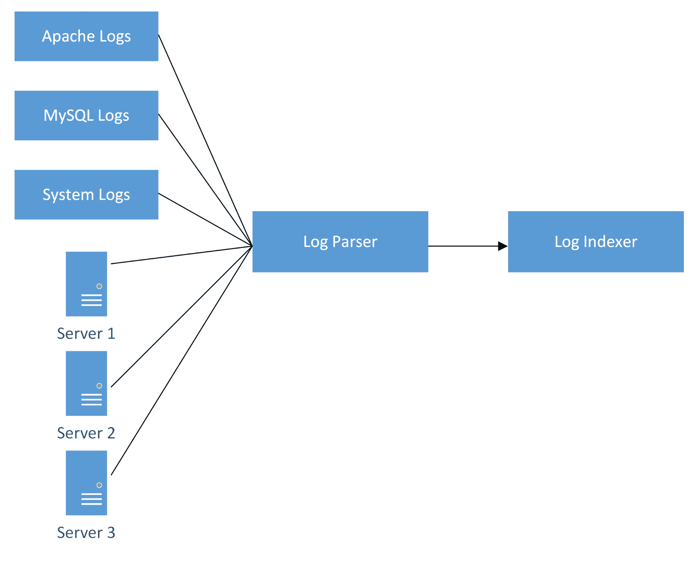
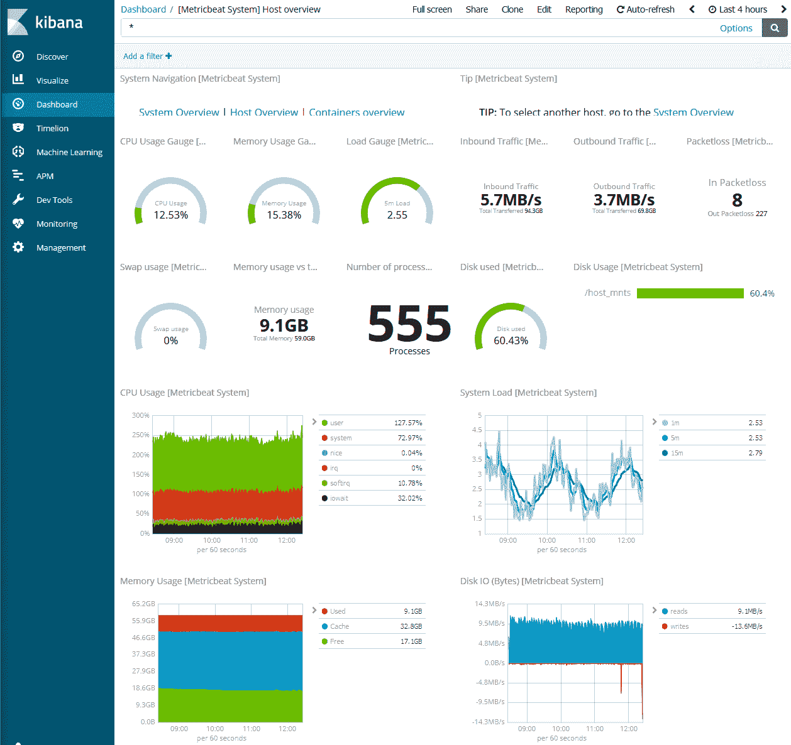

# 第十章：使用 ELK Stack 进行监控

监控是任何环境的重要组成部分，无论是生产、QA 还是开发；**Elastic Stack**（**ELK Stack**）通过允许来自不同来源的日志、指标和事件聚合到一个可索引的位置：Elasticsearch，有助于简化这一任务。

ELK Stack 是三种不同软件的集合：

+   Elasticsearch

+   Logstash

+   Kibana

在这一章中，我们将解释每个组件的作用。

在本章中，我们将涵盖以下主题：定义 Elasticsearch 的主要功能

+   探索集中日志的概念

+   Kibana 如何帮助整合其他组件

# 技术要求

以下是本章的技术要求列表：

+   Elasticsearch 产品页面：[`www.elastic.co/products/elasticsearch`](https://www.elastic.co/products/elasticsearch)

+   Logstash 概述：[`www.elastic.co/products/logstash`](https://www.elastic.co/products/logstash)

+   Logstash 的可用输入插件：[`www.elastic.co/guide/en/logstash/current/input-plugins.html`](https://www.elastic.co/guide/en/logstash/current/input-plugins.html)

+   Grok 模式匹配：[`www.elastic.co/guide/en/logstash/current/plugins-filters-grok.html`](https://www.elastic.co/guide/en/logstash/current/plugins-filters-grok.html)

+   Kibana 用户指南：[`www.elastic.co/guide/en/kibana/current/index.html`](https://www.elastic.co/guide/en/kibana/current/index.html)

# 了解监控的必要性

想象一下，您被要求向 CIO 提供历史数据，因为一个正在进行的项目需要了解整个生态系统平均使用多少 CPU，但企业从未花时间实施良好的监控系统。因此，您唯一的选择是登录到每个系统并运行本地命令，将结果记录到电子表格中，进行一些数学运算以获得平均结果，之后您意识到数据已不再有效，必须重新进行所有操作。这正是为什么我们有 Elasticsearch 等监控系统的原因。同样的过程可能只需要几分钟。不仅如此，您将获得准确的数据和实时报告。让我们更多地了解监控是什么，以及为什么您作为架构师应该认为它是有史以来最好的东西。

监控是指从任何给定环境中获取原始数据，对其进行聚合、存储和分析，以一种可理解的方式。

所有环境都应该有某种形式的监控，从用于跟踪登录失败的简单日志文件到负责分析来自数千台主机的数据的更健壮的系统。监控数据使系统管理员能够在问题发生之前检测到问题，并使架构师能够基于数据为未来或正在进行的项目做出决策。

您可能还记得第一章中对*设计方法论的介绍*，我们谈到了如何提出正确的问题可以帮助设计更好的解决方案，并且同时给出正确的答案；例如，它可以帮助基于历史使用数据做出大小决策。提供使用数据给架构师有助于正确地确定解决方案的大小。他们不仅利用未来的使用统计数据，还利用过去的实例，例如在周末等高峰时段记录的使用高峰。

让我们试着将为什么我们需要监控压缩成四个主要领域：

+   通过历史数据做出决策

+   主动检测问题

+   了解环境性能

+   预算计划

# 通过历史数据做出决策

监控能够让我们回到过去并分析使用趋势，以帮助识别机会领域。例如，在第一章中提到的情景，客户需要一个能够每秒维持 10,000 次点击量的 Web 服务器解决方案。作为架构师，你请求访问他们现有解决方案的使用数据，并在查看他们的使用趋势后，确定每个月的第一周使用量增加了十倍。

虽然用户在这些日子里可能不会抱怨问题，但你应该考虑到在这些时间内高使用量往往会消耗资源。从监控系统中获取的数据可能会导致一个决定，即服务器需要分配更多资源（例如更多的 CPU 和 RAM）比之前计算的，或者需要向集群中添加更多的服务器（如果可能的话）。

没有这些数据，没有人会知道由于激增而需要更多资源。能够区分正常使用和激增有助于在设计和规模化解决方案时做出正确选择。

从同样的情景中，我们可以从历史数据使用中得出结论，即当前解决方案在过去几个月一直能够维持每秒 10,000 次的点击量。这可能意味着客户一直能够实现期望的性能，但实际上他们需要的是一个能够处理使用激增的解决方案，正如前面提到的。

# 主动检测问题

想象一下，当你准备下班时，突然有人报告数据库服务器无法接收连接。你登录服务器后发现问题比最初报告的严重得多。数据库所在的磁盘现在都被报告为损坏。你仔细查看系统日志，发现过去四个月一直报告磁盘错误；然而，由于没有健壮的监控系统，没有人知道这些错误。现在数据丢失了，你不得不恢复一个旧的备份，需要数小时才能恢复到生产状态。

不幸的是，这种情况并不罕见，大多数时候，IT 工作是被动的，这意味着如果出现问题，有人会报告问题，然后有人会去修复问题。如果实施了监控系统并配置为报告错误，这种情况本来可以完全避免。在磁盘彻底损坏之前就可以更换磁盘。

能够在问题发生之前主动检测问题，在我们看来，是监控系统中最关键的方面之一。在问题发生之前预测问题可能发生的地方有助于通过采取行动来减少停机时间。例如，在前面的情景中，更换磁盘可以防止数据丢失。预测变化还有助于通过防止因停机或故障而导致的业务损失，以及增加生产（或正常运行时间）来降低运营成本。

# 了解环境性能

在第五章中，*在 Gluster 系统中分析性能*，我们对 GlusterFS 实施进行了性能测试。通过监控系统，可以通过汇总历史数据和平均统计数据来简化性能基线的获取过程。

通过查看历史数据，我们可以看到在一定时间内任何给定系统的平均性能，从而让架构师定义什么是正常的，什么是不正常的。通过获得基线，我们可以更深入地了解环境在一天、一周甚至一个月内的行为。例如，我们可以确定存储服务器在一天内的吞吐量大约为 200 MB/s，当用户在一天的开始登录时，吞吐量会增加到 300 MB/s。起初，100 MB/s 的增加可能看起来像是一个问题，但是通过查看数据，这似乎是一个趋势，并且是标准行为。

有了这些信息，我们知道基线大约是 200 MB/s，峰值为 300 MB/s。当解决方案进行基准测试时，预期的性能应该符合这个规格。如果我们得到低于这个数字的结果，我们知道存在问题，需要进行调查以确定性能不佳的原因。这可能是解决方案的重新设计，也可能是配置的实际问题。另一方面，高数字表明解决方案即使在负载高峰时也能按规格运行。

没有这些数据，我们将不知道异常行为是什么样子，也无法确认这是否是一个实际问题，或者了解环境的正常情况。了解解决方案的性能和使用情况可以帮助发现可能看起来并不存在问题的问题。例如，考虑先前的数字情况，用户通常与存储服务器进行正常交互并且具有平均响应时间；然而，通过监控数据，我们观察到即使在正常用户负载下，我们只能获得 50 MB/s 的吞吐量。从用户的角度来看，一切似乎都很好，但当询问时，他们确实报告说即使响应时间良好，传输时间也比平常长，进一步调查发现一个节点需要维护。

在前面的例子中，仅通过查看性能数据，就可以识别出解决方案性能不佳的情况，并采取措施避免业务中断和损失。这就是通过使用数据来理解环境的力量。

# 预算规划

数据使用趋势可以更精细地控制预算规划，因为了解需要多少存储空间可以帮助避免未能提供足够空间的情况。

在第一章中，*设计方法论简介*，我们谈到了企业的采购流程，以及如何坚持时间表对于不同公司来说是至关重要的。了解空间需求和使用情况对于这个过程至关重要，因为它可以帮助预测例如解决方案何时会耗尽空间，并且可以帮助做出关于获取新存储空间的决策。

通过监控系统，了解业务每天消耗的存储量（也称为每日变化率），可以让系统管理员和架构师预测业务可以利用当前可用空间运行多长时间。这也可以让他们预测解决方案何时会耗尽空间，以便在存储空间耗尽之前采取行动，这是每个 IT 部门都应该避免的情况。

了解资源利用率对任何业务都至关重要，因为它可以防止不必要的设备采购。使用数据来决定是否应该向现有环境添加更多资源可以通过选择适当的设备数量来减少成本。当应用由于资源不足（或过时的硬件）而性能不佳时，与当前环境按预期工作并且仍有一些增长空间的数据是不同的。

如今，监控的需求比以往任何时候都更为关键。随着 IT 环境中数据的近乎指数级增长，通过基于数据的决策来预测行为并采取积极的行动只有通过监控系统才能实现，比如 ELK Stack。

# 集中式日志

在深入探讨 ELK Stack 的组成之前，让我们先探讨一下集中式日志的概念。

想象一下以下情景；环境中似乎存在安全漏洞，并且在一些服务器上发现了一些奇怪的文件。查看`/var/log/secure`文件，您会发现来自多个地址的 root 登录，并且您想知道哪些系统受到了影响。只有一个问题——环境中有 5000 多台 Linux 服务器，您必须登录到每个系统并查看日志。每个主机可能需要大约一分钟来 grep；这将需要连续 83 个小时查看系统日志。

这种必须去每个节点的问题可以通过聚合和将日志放在一个集中的位置来解决。虽然其他行业似乎正在走去中心化服务的路线，但将所有环境的日志放在一个位置可以帮助简化任务，比如调查可能影响多个系统的事件。在一个单一位置查找可以减少故障排除所需的时间，并同时允许管理员更有效地在环境中寻找问题。

集中式日志架构如下：



来自多个应用程序的日志被发送到日志解析器（如 Logstash），然后移动到索引器（如 Elasticsearch）。每个主机都有一个代理负责将日志发送到解析器。

解析器的工作是将数据转换为易于索引的形式，然后将数据发送到索引器。

在下一部分中，我们将看看组成 ELK Stack 的组件。

# Elasticsearch 概述

现在，我们将深入探讨 ELK Stack 的组件，我们将从最重要的组件 Elasticsearch 开始。

Elasticsearch 基于一个名为 Lucene 的 Apache 项目。它的作用是对数据进行索引并存储以便以后检索。Elasticsearch 接收来自不同来源的数据并将其存储在一个集中的位置，或者如果设置为集群，则存储在多个节点上。对于这种设置，我们将使用 Logstash 作为数据源；但是，Elasticsearch 也可以直接从 Beats 接收数据，这是我们稍后将讨论的。在其核心，Elasticsearch 是一个能够非常快速地检索数据的分析和搜索引擎；由于数据一旦存储就被索引，Elasticsearch 将数据存储为 JSON 文档。

定义 Elasticsearch 的一些特点如下：

+   快速

+   可扩展

+   高度可用

# 快速

搜索几乎是实时的；这意味着，当您输入搜索词时，Elasticsearch 几乎立即返回结果。这要归功于索引和数据存储为 JSON。

# 可扩展

通过简单地向集群添加更多节点，可以快速扩展 Elasticsearch 集群。

# 高度可用

当配置为集群时，Elasticsearch 在多个节点之间分配分片，并在一个或多个节点失败时创建分片的副本。

分片是 JSON 文档的一个片段。Elasticsearch 创建分片的副本并将它们分配到集群节点上。这使得集群能够承受灾难性故障，因为数据仍然存在作为副本。

# Logstash

大多数时候，例如日志文件之类的数据是为了让人类能够轻松理解事件的含义而设计的。这种类型的数据是非结构化的，因为机器无法轻松地索引事件，因为它们不遵循相同的结构或格式。例如，系统日志和 Apache。虽然每个日志提供不同类型的事件，但都不遵循相同的格式或结构，对于索引系统来说，这就成了一个问题。这就是 Logstash 的用武之地。

Logstash 数据处理解析器能够同时从多个来源接收数据，然后通过解析将数据转换为结构化形式，然后将其作为索引的易搜索数据发送到 Elasticsearch。

Logstash 的主要特点之一是可用于过滤器的大量插件，例如 Grok，可以更灵活地解析和索引各种类型的数据。

# Grok

Grok 是 Logstash 中可用的插件；它从诸如系统日志、MySQL、Apache 和其他 Web 服务器日志之类的来源获取非结构化数据，并将其转换为结构化和可查询的数据，以便轻松地摄入到 Elasticsearch 中。

Grok 将文本模式组合成与日志匹配的内容，例如数字或 IP 地址。其模式如下：

```
%{SYNTAX:SEMANTIC}
```

在这里，`SYNTAX`是匹配文本的模式的名称，“SEMANTIC”是给文本段落的标识符。

HTTP 的事件示例如下：

```
55.3.244.1 GET /index.html 15824 0.043
```

这可能是用于此的一个模式匹配：

```
%{IP:client} %{WORD:method} %{URIPATHPARAM:request} %{NUMBER:bytes} %{NUMBER:duration}
```

因此，通过将所有内容放在实际的过滤器配置中，它看起来像这样：

```
input {
  file {
    path => "/var/log/http.log"
  }
}
filter {
  grok {
    match => { "message" => "%{IP:client} %{WORD:method} %{URIPATHPARAM:request} %{NUMBER:bytes} %{NUMBER:duration}" }
  }
}
```

# 自定义模式

在运行自定义应用程序时，Logstash 可能没有正确的模式来匹配语法和语义。Logstash 允许创建可以匹配自定义数据的自定义模式。前面示例中的相同逻辑可以用来匹配数据。

# Kibana 将所有内容整合在一起

虽然 Elasticsearch 是 ELK Stack 的重要组成部分，Logstash 是解析和处理部分，但 Kibana 是将所有其他内容聚合在一起的工具。

可视化数据的能力使用户能够赋予其数据意义。仅仅查看原始数据，很难理解其含义。Kibana 通过图表、地图和其他方法来可视化存储在 Elasticsearch 中的数据。

以下是从实时演示中获取的 Kibana 界面的快速浏览：



Kibana 仪表板

我们可以看到使用多个模块显示不同指标来解释数据是多么容易。

Kibana 能够轻松理解大型数据集。作为一个基于浏览器的应用程序，它可以从任何地方访问。这也允许轻松与他人共享仪表板和报告。它可以与 Elasticsearch 一起安装；但是，对于更大的部署，将主机分配给 Kibana 是一个很好的做法。此外，Kibana 在 Node.js 上运行，因此几乎可以安装在可以运行 Node.js 的所有系统上，从各种 Linux 到 Windows 和 MacOS。

# 总结

在本章中，我们探讨了监控的需求，并了解了从环境中获取数据、汇总数据并存储数据的过程，以便以后进行进一步分析。通过仅仅瞥一眼数据就能够塑造数据并了解环境行为，有助于提高运营效率。

监控使我们能够在问题发生或变成更大问题之前主动检测问题。这是通过观察趋势来实现的，这绝对是实施和设计监控解决方案的最关键原因之一。我们还谈到了能够主动采取行动，以及这如何有助于减少停机时间和解决问题上的浪费金钱；通过塑造数据可以实现这一点。

性能也是受益于数据分析的领域。您可能还记得之前章节提到的，能够基线和测量性能使得在设计解决方案时能够进行细粒度控制。拥有历史数据可以帮助做出影响设计性能的决策，同时还可以根据来自运行环境的真实数据来规划预算。

我们介绍了拥有集中式日志系统的主要原因，它可以帮助简化管理任务；而不是连接到环境中的每个系统，从单个位置查看所有日志可以节省时间，并且可以进行更快，更高效的调查。

我们还概述了 ELK Stack 的每个组件。 Elasticsearch 是主要组件，用于存储和分析数据。我们注意到它非常快，因为数据存储为 JSON 文档；解决方案可扩展，因为可以轻松添加节点；并且高度可用，因为数据分布在节点之间。

Logstash 通过插件提供数据转换和过滤，例如 GROK，它可以将`SYNTAX`与`SEMANTIC`进行匹配，例如将 IP 与客户端进行匹配。

最后，我们看了 Kibana 如何通过允许数据可视化和通过全面的图形进行分析来连接所有其他组件。

在下一章中，我们将介绍每个组件的要求。

# 问题

1.  监控是什么？

1.  监控如何帮助做出业务决策？

1.  如何主动检测问题？

1.  监控如何允许性能基线？

1.  监控如何帮助识别异常行为？

1.  集中日志的主要需求是什么？

1.  Elasticsearch 是什么？

1.  Elasticsearch 以什么格式存储数据？

1.  Logstash 是什么？

1.  Kibana 是什么？

# 进一步阅读

+   *James Lee, Tao Wei 的《实战大数据建模》：*[`www.packtpub.com/big-data-and-business-intelligence/hands-big-data-modeling`](https://www.packtpub.com/big-data-and-business-intelligence/hands-big-data-modeling)

+   *Hector Cuesta, Dr. Sampath Kumar 的《实用数据分析-第二版》：*[`www.packtpub.com/big-data-and-business-intelligence/practical-data-analysis-second-edition`](https://www.packtpub.com/big-data-and-business-intelligence/practical-data-analysis-second-edition)
