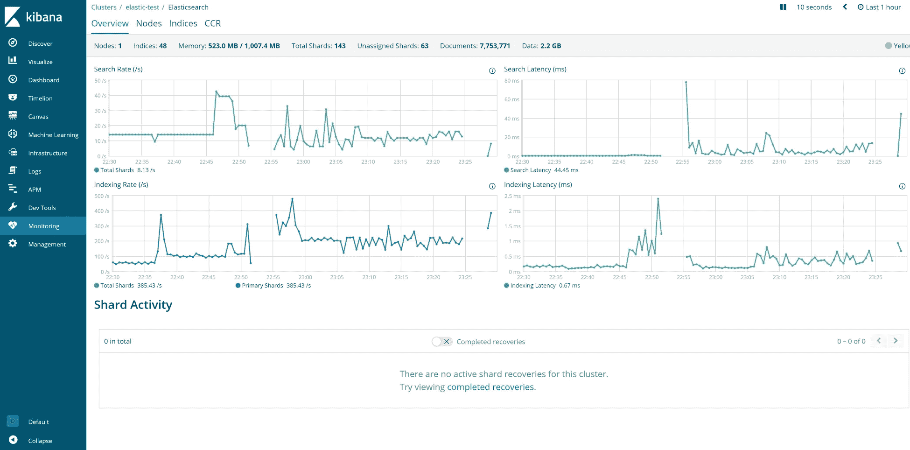
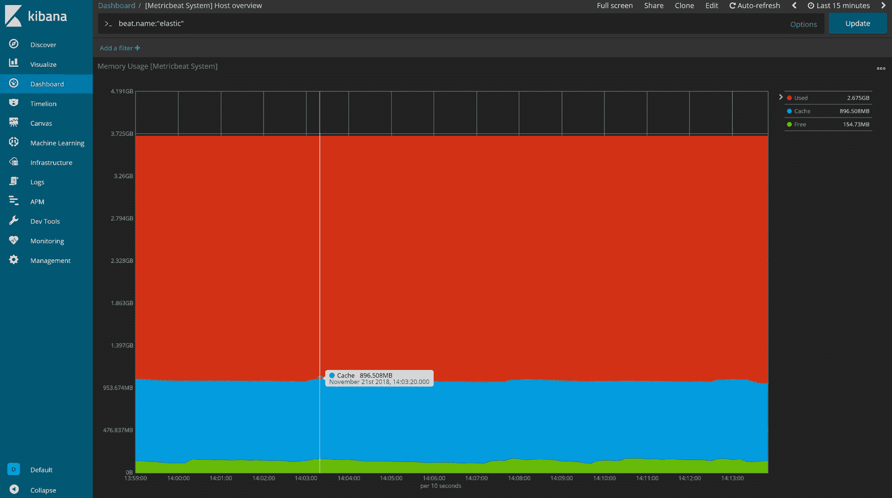
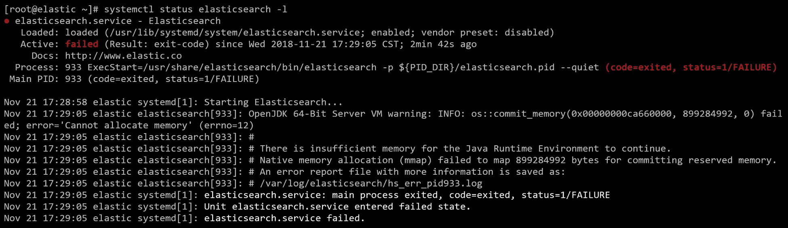
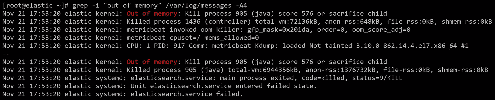

# 第十一章：设计一个 ELK Stack

设计一个符合要求规格的**Elastic Stack**需要特别注意。**Elasticsearch，Logstash 和 Kibana**（**ELK**）的每个组件都有特定的要求。正确的大小对于最佳性能和功能至关重要。

本章将介绍在部署 Elastic Stack 时的设计考虑因素，考虑到每个组件的需求以及特定的设置细节。在本章中，我们将描述每个组件如何受不同资源影响，如何处理资源约束，以及如何计划和为不同场景进行大小调整。

在本章中，我们将讨论以下主题：

+   Elasticsearch CPU 大小要求

+   内存大小如何影响 Elasticsearch 性能

+   Elasticsearch 中数据的存储方式以及如何为性能进行大小调整

+   Logstash 和 Kibana 的要求

# 技术要求

尽管在[`www.elastic.co/guide/en/elasticsearch/guide/current/hardware.html`](https://www.elastic.co/guide/en/elasticsearch/guide/current/hardware.html)找到的文档已经过时，但硬件要求可以作为 CPU 大小的起点。有关更有用的文档，请访问以下链接：

+   **索引速度设置指南：**[`www.elastic.co/guide/en/elasticsearch/reference/current/tune-for-indexing-speed.html`](https://www.elastic.co/guide/en/elasticsearch/reference/current/tune-for-indexing-speed.html)

+   **更改 Elasticsearch 的堆配置：**[`www.elastic.co/guide/en/elasticsearch/reference/current/heap-size.html`](https://www.elastic.co/guide/en/elasticsearch/reference/current/heap-size.html)

+   **平均系统内存延迟：**[`www.crucial.com/usa/en/memory-performance-speed-latency`](http://www.crucial.com/usa/en/memory-performance-speed-latency)

+   **Elasticsearch 系统路径：**[`www.elastic.co/guide/en/elasticsearch/reference/master/path-settings.html`](https://www.elastic.co/guide/en/elasticsearch/reference/master/path-settings.html)

+   **Logstash 持久队列：**[`www.elastic.co/guide/en/logstash/current/persistent-queues.html`](https://www.elastic.co/guide/en/logstash/current/persistent-queues.html)

+   **Logstash 目录路径：**[`www.elastic.co/guide/en/logstash/current/dir-layout.html`](https://www.elastic.co/guide/en/logstash/current/dir-layout.html)

# Elasticsearch CPU 要求

与任何软件一样，为正确的 CPU 要求进行大小调整决定了整体应用程序的性能和处理时间。错误的 CPU 配置可能导致应用程序无法使用，因为处理时间太长而使用户感到沮丧，更不用说慢处理时间可能导致应用程序完全失败。

虽然 Elasticsearch 在索引和搜索时并不严重依赖 CPU，但在设计一个性能良好且及时返回结果的 Elastic Stack 时需要考虑几件事情。

尽管 Elastic 没有发布 CPU 的硬性要求，但有一些可以作为经验法则的事情。

# CPU 数量

通常，拥有更多的核心更好，对于大多数工作负载来说可能是这样。Elasticsearch 通过在多个 CPU 上调度任务来利用系统上可用的多个核心；然而，它并不需要大量的 CPU 处理能力，因为大部分操作是在已经索引的文件上执行的。

大多数云提供商（如果您在云上部署）对高 CPU 数量的虚拟机有提高的费率，为了避免不必要的成本，应该选择一个内存比 CPU 更多的 VM 类型。

在为足够的 CPU 资源进行调整时，应允许一定的增长空间，而无需在中途更改设置。对于小型设置，至少需要两个 CPU。对于测试目的和少量索引/来源，甚至一个 CPU 就足够了，但性能会受到影响，特别是如果所有组件（Elasticsearch、Logstash 和 Kibana）都部署在同一系统上。

# CPU 速度

虽然没有关于最低 CPU 速度（时钟速度）要求的硬性文件，但现在很难找到低于 2 GHz 的 CPU。这个低水位似乎是 Elasticsearch 避免问题的最低要求。

即使只有一个 CPU，超过 2 GHz 的性能也是可以接受的；这对于测试目的是足够的。对于生产环境，寻找时钟速度超过 2 GHz 或 2.3 GHz 的 CPU 以避免问题。

# CPU 性能影响

如果在 CPU 方面配置不正确，Elasticsearch 主要会在以下三个方面受到影响：

+   启动时间

+   每秒索引

+   搜索延迟

# 启动

在启动时，CPU 使用率可能会急剧上升，因为 JVM 启动并且 Elasticsearch 从集群中读取数据。较慢的 CPU 配置将导致 Elasticsearch 启动时间较长。

如果 Elasticsearch 节点需要不断重启，正确的 CPU 配置将有助于减少达到运行状态所需的时间。

# 每秒索引

CPU 配置直接影响 Elasticsearch 能够处理的每秒索引数量，因为一旦索引更多文档，CPU 就会耗尽。理想情况下，具有多个核心的 Elasticsearch 可以利用多个 CPU 进行索引，允许更多客户端发送数据而不会丢失任何指标或事件。

# 搜索延迟

性能可能会在搜索返回结果所需的时间方面受到最大影响。请记住，Elasticsearch 的主要特点之一是它可以多快地检索数据并显示数据。

CPU 配置不足会导致搜索时间超出预期，这可能导致用户体验不佳。

在下面的截图中，我们可以看到搜索延迟急剧上升到近 80 毫秒，并在 20 毫秒左右徘徊：



在 Kibana 中监控延迟

请注意，上述截图是从一个只有一个低于 2 GHz 运行的 CPU 的配置不足的系统中获取的。延迟可能会更糟，但这是从一个运行在快速 NVMe 驱动器上的系统中获取的，这可以使延迟低至 100 微秒。

# 建议

为了获得最佳结果，需要实施正确的 CPU 设置。以下两种主要情况影响 CPU 大小：

+   测试/开发

+   生产

# 测试/开发

对于测试，任何超过一个 CPU 和 2 GHz 的东西对于小型测试都足够了，有几个客户端向 Elasticsearch 发送数据。搜索结果可能会有点慢，但不会出现任何问题。

# 生产

对于生产环境，请确保使用至少 2.3 GHz 或更高的 CPU。CPU 数量并不会对性能产生很大影响，但至少需要两个 CPU 才能确保最佳运行。一旦添加了更多客户端，CPU 数量可能需要进行修改以满足额外需求；如果 CPU 成为约束，可以添加更多的 Elasticsearch 节点。

最后，在核心数量与时钟速度之间进行选择时，Elasticsearch 利用具有多个核心。较少但更快的核心的性能优势并不像拥有更多较慢核心那样令人印象深刻。

在 Azure 上部署时，可以使用 DS2v3 VM 类型进行小型设置，因为它提供了两个 CPU 和足够的 RAM 以满足基本需求。

一旦正确调整了 CPU 大小，我们可以专注于系统内存（RAM）如何影响 Elasticsearch 的性能和可用性。

# Elasticsearch 的内存大小

为 Elasticsearch 分配足够的 RAM 可能是要考虑的最重要的资源因素，以避免问题和性能不佳的设置。

内存是一种资源，拥有大量内存从来不是问题。作为架构师，在调整内存大小时需要考虑几件事情。与 CPU 资源类似，没有关于最低内存要求的硬性文件。

# 文件系统缓存

拥有大量 RAM 总是一个好主意，因为文件系统缓存或 Linux 页面缓存。

内核使用空闲系统内存来缓存、读取或写入请求，通过将一部分 RAM 分配给 I/O 请求，大大加快了 Elasticsearch 的搜索或索引速度。

如下截图所示，内核已分配大约 1.2GB 作为页面缓存：


利用页面缓存可以帮助减少搜索或传入索引时的响应时间；确保尽可能调整 RAM 大小。有一个点会平衡缓存使用，不会再有更多的 RAM 用于页面缓存。在这一点上，值得监控进程，以尝试识别这个阈值，避免不必要的费用。举个例子，如果一个虚拟机（VM）被调整为 32GB 的 RAM，但只使用大约 10GB 用于缓存，从未超过这个数字，那么调整为更小的 VM 可能是值得的，因为剩余的 RAM 将被闲置。

如下截图所示，在 Kibana 仪表板中，您可以监控 Elasticsearch 的缓存使用情况，这可能有助于确定是否有资源被闲置：



监控 Elasticsearch 的缓存使用情况

# 禁用交换

交换是一种机制，允许内核在不经常访问或内存压力（即系统内存不足）时将内存页面移动到磁盘上。交换的主要问题之一是，当内存页面移动到磁盘时，其访问时间比在 RAM 中要慢得多。

DDR4 内存的平均传输速率约为 10GB/s，更令人印象深刻的是，平均响应时间（或延迟）仅为 13 纳秒。将其与市场上甚至最快的 NVMe SSD 驱动器进行比较，后者的传输速率仅为 3.5GB/s，延迟约为 400 微秒。您很快就会意识到这成为一个问题：并非所有的云提供商或本地设置都使用 NVMe 驱动器，甚至交换到速度更慢的旋转介质都可能产生非常糟糕的结果。

因此，Elasticsearch 建议禁用所有形式的交换，而是依赖于正确的系统内存大小。

# 内存不足

错误的内存配置将导致不同的行为。可以归结为两种不同的情况：内存不足但足够运行系统，以及内存不足以至于 Elasticsearch 甚至无法启动。

在第一种情况下，存在内存约束，但有足够的内存让 Elasticsearch 启动和运行，主要问题是没有足够的内存用于页面缓存，导致搜索缓慢，每秒索引减少。在这种情况下，Elasticsearch 能够运行，但整体性能有所降低。

另一种情况可以分为两种不同的情况：一种是没有足够的内存启动 Elasticsearch，另一种是 Elasticsearch 能够启动，但一旦添加了一些索引，就会耗尽内存。为了避免系统崩溃，Linux 有一个称为“内存不足杀手”的机制。

# 无法启动

Elasticsearch 使用 JVM，默认情况下设置为使用至少 1GB 的堆内存。这意味着 Java 需要为 JVM 分配至少 1GB 的 RAM，因此要使 Elasticsearch 以最低配置启动，需要大约 2.5GB 的 RAM。

最简单的方法是通过使用`systemctl status elasticsearch`来验证 Elasticsearch 服务的状态，它将返回类似于以下的错误消息：



在进一步检查错误日志时，我们可以清楚地看到 JVM 未能分配所需的内存，如下面的代码所示：

```
# There is insufficient memory for the Java Runtime Environment to continue.
# Native memory allocation (mmap) failed to map 899284992 bytes for committing reserved memory.
# Possible reasons:
#   The system is out of physical RAM or swap space
#   In 32 bit mode, the process size limit was hit
# Possible solutions:
#   Reduce memory load on the system
#   Increase physical memory or swap space
#   Check if swap backing store is full
#   Use 64 bit Java on a 64 bit OS
#   Decrease Java heap size (-Xmx/-Xms)
#   Decrease number of Java threads
#   Decrease Java thread stack sizes (-Xss)
#   Set larger code cache with -XX:ReservedCodeCacheSize=
# This output file may be truncated or incomplete.
#
#  Out of Memory Error (os_linux.cpp:2760), pid=933, tid=0x00007f1471c0e700
```

使用默认的 1 GB 堆进行测试已经足够。对于生产环境，请确保将堆大小增加到至少 2 GB，并根据需要进行调整。

要增加堆大小，请编辑`/etc/elasticsearch/jvm.options`文件并找到以下选项：

```
-Xms1g
-Xmx1g
```

将这两个选项更改为以下内容：

```
-Xms2g
-Xmx2g
```

`-Xms2g`短语表示 Java 应具有 2 GB 的最小堆，`-Xmx2g`表示 2 GB 的最大堆。

# OOM 杀手

**内存不足杀手**（**OOM killer**）机制的主要目的是通过杀死正在运行的进程来避免系统崩溃。每个进程都有一个`oom_score`值。OOM killer 根据这个分数决定要杀死哪个进程；分数越高，进程在内存饥饿情况下被杀死的可能性就越大。这个分数是根据进程如果被杀死会释放多少内存来计算的。

如果我们以前的情景作为起点，Elasticsearch 能够以最少 2.5 GB 启动，一旦更多的索引/源添加到 Elasticsearch，它将开始需要更多的系统内存，直到没有更多的内存，并且系统接近完全崩溃。在那一刻，OOM killer 将跳入并杀死占用最多内存的进程（或进程）—在我们的情况下，是 Elasticsearch。

当查看`/var/log/messages`下的事件时，我们可以看到 OOM killer 何时启动并杀死 Java 进程，然后 Elasticsearch 服务失败，如下面的截图所示：



# 建议

理想情况下，应为 Elasticsearch 分配足够的内存。内存的最低要求约为 2.5 GB，但这可能会导致系统很快耗尽内存。

对于测试目的，2.5 GB 对于一些源/索引可能足够。性能无疑会受到影响，但它仍然可以使用。

对于生产环境，请确保至少有 4 GB 或更多的系统内存。这应该允许 Elasticsearch 正常启动并运行多个配置的源/索引。确保相应增加 JVM 的堆大小，并考虑为页面缓存留出一些 RAM，以便在与文件系统交互时获得更快的响应时间。

接下来，我们将看一下 Elasticsearch 所需的存储配置。

# Elasticsearch 的存储配置

Elasticsearch 的存储需求相对简单，可以分为两个主要类别：

+   存储容量

+   存储性能

让我们一起看看这两个选项，以及这里做出的决定如何影响整体性能。

# 容量

存储容量直接影响 Elasticsearch 能够存储多少数据。与许多其他情况一样，这是一个需要考虑的重要和复杂的要求，因为它取决于许多其他影响空间利用的变量。

主要变量将是发送到 Elasticsearch 的日志/指标的大小。这取决于每天（或每月）生成的日志数量。例如，如果每天的日志速率为 100 MB，那么这意味着至少需要 3 GB 的可用空间才能存储一个月的日志（100 MB x 30 天 = 3 GB）。

请注意，这是单个来源所需的最小空间。理想情况下，应该考虑一些额外空间，因为数据会经常变化，每天的 100MB 可能不是每个月的所有天都是恒定的，或者其他月份可能由于负载增加而有更高的速率。此外，一旦添加更多来源（或客户端），数据使用量将相应增长。

默认情况下，Elasticsearch 将其数据存储在`/var/lib/elasticsearch`目录下。

# 性能

Elasticsearch 的主要特点之一是其能够非常快速地检索数据。虽然这是通过使用增强的存储文档的机制来实现的，但正确的性能设置肯定有助于实现几乎实时的搜索结果。

Elastic 没有提供存储需求的硬性数字，但在`/var/lib/elasticsearch`目录中使用固态硬盘（SSD）有助于减少搜索时的延迟，因为与 HDD 相比，SSD 的延迟显著较低。SSD 还有助于数据摄入，因为写入会更快得到确认，从而允许更多并发的传入索引。这反映在 Kibana 监控仪表板上可以看到的每秒索引数中。

在云端进行大小设置，这实际上取决于提供商，因为有些提供商将磁盘的性能基于其大小，但其他提供商允许手动配置性能（如 IOPS 和吞吐量）。

拥有较慢的设置将导致搜索时间比预期的长，以及数据摄入速度较慢，因为磁盘设置不可靠且较慢。

# 考虑事项

对于空间，考虑一个大小，可以为意外的数据增长提供足够的空间。例如，如果整个月的预期数据使用量为 500GB，那么至少考虑 700GB 的大小；这样可以给您一个缓冲区，并避免出现没有足够空间留给 Elasticsearch 索引的情况。500GB 是一个很好的起点，因为它为测试/生产提供了足够的空间，同时可以计算实际数据使用量和数据变化（如果之前未知）。

为了提高性能，考虑使用更快的存储解决方案，如 SSD，以实现低延迟搜索和更快的索引。对于云端，大多数提供商都有一些可以与 Elasticsearch 一起使用的 SSD 产品。确保至少为了获得最佳性能而配置了至少 500 IOPS。

对于 Azure，您可以使用 P10 磁盘——这是一种 SSD，可以提供高达 500 IOPS 的性能——或者选择成本更低的 E10 作为替代方案，以达到相同的效果。

现在我们将看看 Logstash 和 Kibana 需要考虑的内容。

# Logstash 和 Kibana 的要求

对于 Logstash 和 Kibana 没有特定的要求，但在设计 Elastic Stack 时要考虑一些事项总是一个好方法。

# Logstash

Logstash 对 CPU 和内存的要求不高，但这完全取决于有多少来源在向 Logstash 提供数据，因为 Logstash 解析每个事件都需要一些额外的开销来完成这个过程。如果 Logstash 要单独安装（没有其他组件在同一系统上），那么一个 vCPU 和 2GB 的 RAM 应该足够小型/测试部署。理想情况下，应该监控实际使用情况并相应地调整系统。Logstash 默认具有用于临时存储事件的内存队列；当处理事件时，这种行为可以更改为使用持久队列。这样可以实现持久一致性，并避免在故障期间丢失数据。此外，持久队列有助于吸收事件的突发增长，充当客户端和 Logstash 之间的缓冲区。

在使用持久队列进行存储容量时，`/var/lib/logstash`目录需要能够在 Logstash 处理事件时存储事件。空间量取决于两个因素：将数据发送到 Elasticsearch 的出口速度和发送到 Logstash 的事件数量。最低要求为 1GB，当来源数量增加时，空间需要相应增加。

# Kibana

Kibana 的要求完全取决于同时访问仪表板的用户数量。分配给 Kibana 的资源量需要根据预期的使用情况来确定，例如，预期的用户群是什么？这些用户中有多少人会同时访问 Kibana？

对于小型部署/测试，最低要求由 JVM 决定。一个 vCPU 和 2GB 的 RAM 对于几个用户来说足够了，但一旦更多用户开始使用仪表板，RAM 将成为第一个资源瓶颈。

一般来说，Elastic Stack 有相当宽松的要求，主要由使用和来源数量决定。在软件方面，主要要求是 Java；由于所有组件都使用 JVM，因此可以使用 open JDK 或官方 JDK。

# 摘要

在本章中，我们介绍了在设计使用 Elasticsearch、Logstash 和 Kibana 的 Elastic Stack 时所需的要求。对于 Elasticsearch，我们确定了小型设置的最低 CPU 要求为两个 vCPU，CPU 速度应保持在 2 GHz 以上。如果不满足这些最低要求，Elasticsearch 将需要更长的时间启动，并且性能将更慢。这表现为每秒索引数量的减少和搜索延迟的增加，这两者都是需要避免的，以便我们能够充分利用 Elasticsearch 提供的几乎即时搜索。

在设计 Elasticsearch 设置时，内存大小可能是最重要的规格。系统内存的一部分将用于文件系统缓存（也称为页面缓存），这有助于搜索和每秒索引。不建议交换，因为与实际的 RAM 访问相比，它被认为是非常慢的，因此应该在 Elasticsearch 节点上禁用交换。如果未满足正确的内存要求，Elasticsearch 将无法启动，因为 JVM 启动时没有足够的内存。另一方面，如果有足够的内存来启动 JVM，但随着时间的推移负载增加，系统耗尽内存，OOM 或内存耗尽杀手将被启用，以避免导致应用程序失败的系统崩溃。所需的最小 RAM 量为 2.5 GB，但资源限制将相对快速地被看到。

在设置 Elasticsearch 时，存储容量和性能起着重要作用。容量取决于需要保留的数据量和配置的来源数量。延迟需要保持在最低水平，以便我们的搜索速度快。理想情况下，应该使用 SSD。

最后，对于 Logstash 和 Kibana，每个组件的最低要求是一个 vCPU 和 2GB 的 RAM。对于 Logstash，持久队列有空间要求。

在下一章中，我们将利用本章学到的知识，跳入使用 Elasticsearch、Logstash 和 Kibana 部署 Elastic Stack。

# 问题

1.  Elasticsearch 建议使用多少个 CPU？

1.  Elasticsearch 的推荐最低 CPU 速度是多少？

1.  拥有错误的 CPU 配置会如何影响 Elasticsearch 的性能？

1.  什么是页面缓存？

1.  为什么建议在 Elasticsearch 节点上禁用交换？

1.  内存不足会如何影响 Elasticsearch？

1.  Elasticsearch 的最低内存要求是多少？

1.  Elasticsearch 默认存储数据的位置在哪里？

1.  为什么建议使用 SSD 来进行 Elasticsearch？

1.  Logstash 的最低要求是什么？

1.  什么是持久队列？

1.  什么影响了 Kibana 的资源使用？

# 进一步阅读

想要了解更多信息，您可以阅读以下书籍：

+   《Linux：强大的服务器管理》，作者 Uday R. Sawant 等人：[`www.packtpub.com/networking-and-servers/linux-powerful-server-administration`](https://www.packtpub.com/networking-and-servers/linux-powerful-server-administration)
