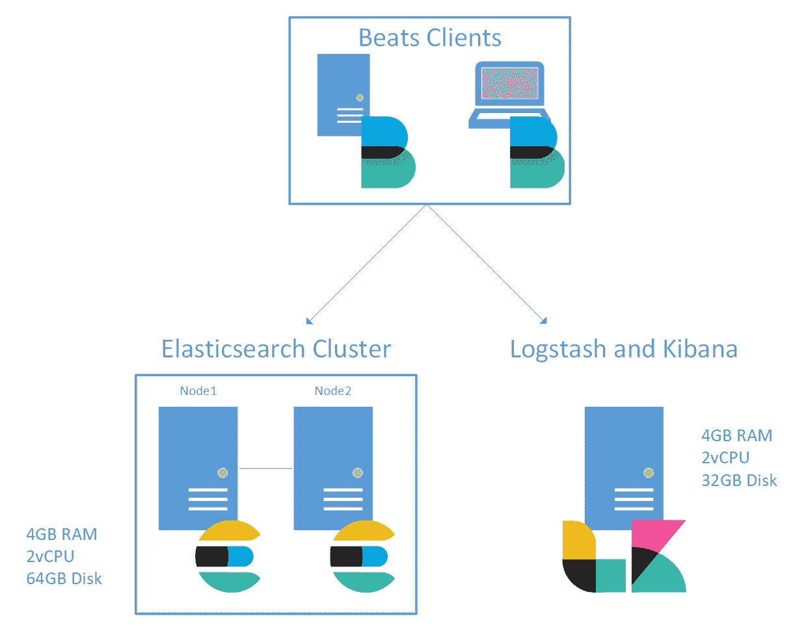
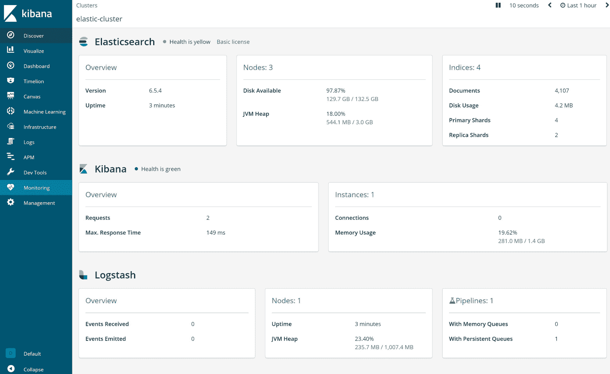
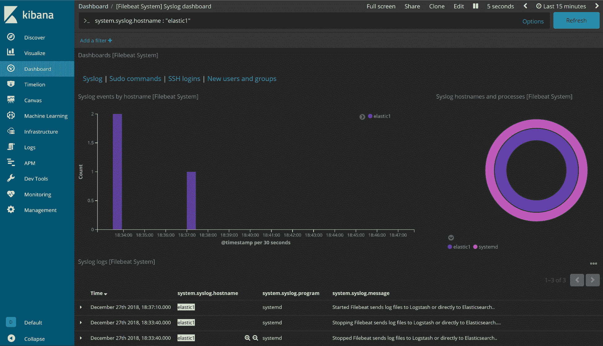
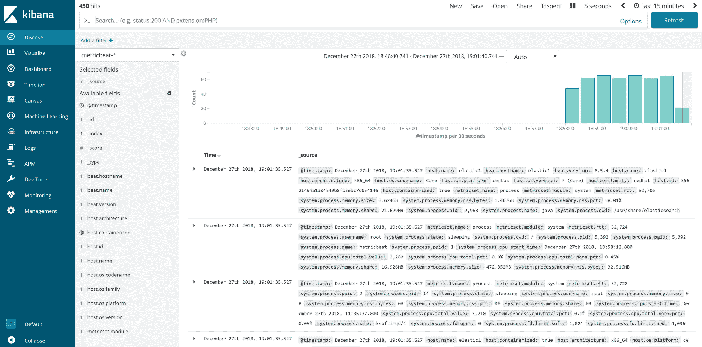

# 第十二章：使用 Elasticsearch、Logstash 和 Kibana 管理日志

部署 Elasticsearch、Logstash 和 Kibana（ELK Stack）相对简单，但在安装这些组件时需要考虑几个因素。虽然这不会是 Elastic Stack 的深入指南，但主要的收获将是实施方面、在过程中做出的决策以及作为架构师在做出这些决策时应该考虑的方式。

本章将帮助您作为架构师定义部署 ELK Stack 所需的方面，以及在使用组成 Elastic Stack 的组件时要使用的配置。

在本章中，我们将讨论以下主题：

+   安装和配置 Elasticsearch

+   安装和配置 Logstash 和 Kibana

+   安装和解释 Beats

+   配置 Kibana 仪表板

# 技术要求

本章将使用以下工具和安装：

+   **Elasticsearch 安装指南**: [`www.elastic.co/guide/en/elasticsearch/reference/current/_installation.html`](https://www.elastic.co/guide/en/elasticsearch/reference/current/_installation.html)

+   **XFS 条带大小和条带单元“如何”**: [`xfs.org/index.php/XFS_FAQ#Q:_How_to_calculate_the_correct_sunit.2Cswidth_values_for_optimal_performance`](http://xfs.org/index.php/XFS_FAQ#Q:_How_to_calculate_the_correct_sunit.2Cswidth_values_for_optimal_performance)

+   **XFS 写屏障**: [`access.redhat.com/documentation/en-us/red_hat_enterprise_linux/7/html/storage_administration_guide/writebarrieronoff`](https://access.redhat.com/documentation/en-us/red_hat_enterprise_linux/7/html/storage_administration_guide/writebarrieronoff)

+   **Elasticsearch 配置细节**: [`www.elastic.co/guide/en/elasticsearch/reference/current/settings.html`](https://www.elastic.co/guide/en/elasticsearch/reference/current/settings.html)

+   **避免 Elasticsearch 中的脑裂**: [`www.elastic.co/guide/en/elasticsearch/reference/current/modules-node.html#split-brain`](https://www.elastic.co/guide/en/elasticsearch/reference/current/modules-node.html#split-brain)

+   **Elasticsearch 集群状态 API**: [`www.elastic.co/guide/en/elasticsearch/reference/current/cluster-state.html`](https://www.elastic.co/guide/en/elasticsearch/reference/current/cluster-state.html)

+   **Logstash 安装指南**: [`www.elastic.co/guide/en/logstash/current/installing-logstash.html`](https://www.elastic.co/guide/en/logstash/current/installing-logstash.html)

+   **Kibana 用户指南和安装方法**: [`www.elastic.co/guide/en/kibana/current/rpm.html`](https://www.elastic.co/guide/en/kibana/current/rpm.html)

+   **Beats 模块的 Logstash 过滤器示例**: [`www.elastic.co/guide/en/logstash/current/logstash-config-for-filebeat-modules.html`](https://www.elastic.co/guide/en/logstash/current/logstash-config-for-filebeat-modules.html)

+   **Logstash 配置文件的结构**: [`www.elastic.co/guide/en/logstash/current/configuration-file-structure.html`](https://www.elastic.co/guide/en/logstash/current/configuration-file-structure.html)

+   **Filebeat 安装过程**: [`www.elastic.co/guide/en/beats/filebeat/current/filebeat-installation.html`](https://www.elastic.co/guide/en/beats/filebeat/current/filebeat-installation.html)

+   **Metricbeat 安装概述和细节**: [`www.elastic.co/guide/en/beats/metricbeat/current/metricbeat-installation.html`](https://www.elastic.co/guide/en/beats/metricbeat/current/metricbeat-installation.html)

# 部署概述

对于此部署，我们将使用 Elasticsearch 版本 6.5（这是撰写时的最新版本）。这意味着所有后续组件必须是相同的版本。基本操作系统将是 CentOS 7.6。虽然此特定部署将在本地虚拟机（VM）设置上实施，但这些概念仍然可以应用于云。

Elasticsearch 将使用 2 个节点在 2 个 vCPU VM 上部署，每个节点配备 4 GB 的 RAM（在第十一章中，*设计 ELK 堆栈*，我们确定了所需的最小 RAM 约为 2.5 GB）。VM 的底层存储为**非易失性内存表达**（**NVMe**），因此在其他地方复制设置时需要考虑一些因素。就空间而言，Elasticsearch 节点将分别具有 64 GB 的磁盘空间；节点将把 64 GB 磁盘挂载到`/var/lib/elasticsearch`目录。

Logstash 和 Kibana 将在相同的 VM 上部署，使用 2 个 vCPU 和 4 GB 的 RAM。如第十一章所示，*设计 ELK 堆栈*，Logstash 需要持久存储队列。因此，我们将使用一个 32 GB 的专用磁盘。该磁盘将挂载到`/var/lib/logstash`目录以进行持久排队。

我们可以总结部署所需的内容如下：

+   基本操作系统是 CentOS 7.6

+   Elasticsearch v6.5

+   Logstash v6.5

+   Kibana v6.5

+   Elasticsearch 使用 2 个节点在 2 个 vCPU VM 上，每个节点配备 4 GB 的 RAM

+   在单个 VM 上使用 2 个 vCPU 和 4 GB 的 RAM 部署 Logstash 和 Kibana

+   Elasticsearch 节点使用 64 GB 磁盘

+   32 GB 磁盘用于 Logstash 持久队列

以下图表说明了整个实施过程，并将让您了解事物是如何连接的：



# 安装 Elasticsearch

从无到有的功能性 Elasticsearch 设置需要安装软件；这可以通过多种方式和不同平台完成。以下是一些安装选项：

+   从源代码安装

+   为基于 Debian 的 Linux 发行版安装`deb`

+   为**Red Hat Enterprise Linux**（**RHEL**）、CentOS、**嵌入式系统的声音库**（**SLES**）、OpenSLES 和基于 RPM 的发行版安装`rpm`

+   为 Windows 安装`msi`

+   部署 Docker 镜像

对于此设置，我们将使用 RPM 存储库以保持版本一致，并在更新可用时简化目的。

# RPM 存储库

要安装 RHEL 和 CentOS 的 RPM 存储库，我们需要在`/etc/yum.repos.d`目录中创建一个文件。在这里，文件的名称并不重要，但实际上，它需要有意义。文件的内容指示了`yum`将如何搜索软件。

创建一个名为`/etc/yum.repos.d/elastic.repo`的文件，其中包含以下代码细节：

```
[elasticsearch-6.x]
name=Elasticsearch repository for 6.x packages
baseurl=https://artifacts.elastic.co/packages/6.x/yum
gpgcheck=1
gpgkey=https://artifacts.elastic.co/GPG-KEY-elasticsearch
enabled=1
autorefresh=1
type=rpm-md
```

创建了存储库文件后，只需运行以下命令：

```
yum makecache
```

这将刷新所有配置的存储库的元数据。在安装 Elasticsearch 之前，我们需要安装 OpenJDK 版本`1.8.0`；为此，我们可以运行以下命令：

```
yum install java-1.8.0-openjdk
```

接下来，确认已安装`java`，如下所示：

```
java -version
```

然后，您应该看到类似以下输出：

```
[root@elastic1 ~]# java -version
openjdk version "1.8.0_191"
OpenJDK Runtime Environment (build 1.8.0_191-b12)
OpenJDK 64-Bit Server VM (build 25.191-b12, mixed mode)
```

然后，我们可以继续安装`elasticsearch`，如下所示：

```
yum install elasticsearch
```

在启动 Elasticsearch 之前，需要进行一些配置。

# Elasticsearch 数据目录

Elasticsearch 的默认配置将数据目录设置为`/var/lib/elasticsearch`路径。这是通过`/etc/elasticsearch/elasticsearch.yml`文件中的`path.data`配置选项控制的：

```
# ---------------------------------Paths-------------------------------
#
# Path to directory where to store the data (separate multiple locations by comma):
#
path.data: /var/lib/elasticsearch
```

在此设置中，将挂载一个 64 GB 的磁盘到此位置。

在 Azure 部署时，请确保`path.data`选项配置为使用数据磁盘而不是操作系统磁盘。

# 磁盘分区

在创建文件系统之前，需要对磁盘进行分区。为此，我们可以使用`parted`实用程序。

首先，我们需要将磁盘初始化为`gpt`；为此，我们可以使用以下命令：

```
sudo parted /dev/sdX mklabel gpt
```

然后，我们创建分区：

```
sudo parted /dev/sdX mkpart xfs 0GB 64GB
```

在这里，我们告诉`parted`从`0GB`到`64GB`创建一个分区，或者从磁盘的开始到结束。此外，我们使用了`xfs`签名，因为这是将用于数据目录的文件系统。

最后，通过运行以下命令验证分区是否已成功创建并具有正确的边界：

```
sudo parted /dev/sdX print
```

输出应类似于以下代码块：

```
[root@elastic1 ~]# parted /dev/sdb print
Model: ATA VBOX HARDDISK (scsi)
Disk /dev/sdb: 68.7GB
Sector size (logical/physical): 512B/512B
Partition Table: gpt
Disk Flags:
Number  Start End     Size    File system  Name Flags
1      1049kB  64.0GB 64.0GB               xfs
```

# 格式化文件系统

要能够在新创建的分区上存储数据，我们首先需要创建一个文件系统。对于此设置，我们将使用 XFS 文件系统。

要格式化磁盘，请运行`mkfs.xfs`命令，如下所示：

```
[root@elastic1]# mkfs.xfs /dev/sdb1
meta-data=/dev/sdb1              isize=512    agcount=4, agsize=3906176 blks
         =                       sectsz=512   attr=2, projid32bit=1
         =                       crc=1        finobt=0, sparse=0
data     =                       bsize=4096   blocks=15624704, imaxpct=25
         =                       sunit=0      swidth=0 blks
naming   =version 2              bsize=4096   ascii-ci=0 ftype=1
log      =internal log           bsize=4096   blocks=7629, version=2
         =                       sectsz=512   sunit=0 blks, lazy-count=1
realtime =none                   extsz=4096   blocks=0, rtextents=0
```

默认情况下，XFS 使用与内存页大小匹配的 4K 块大小；这也适用于相对较小的文件。

请注意，指定了设备文件的分区，而不是整个磁盘。虽然可以使用磁盘本身，但建议在分区上创建文件系统。此外，如果文件系统将用于 RAID 设置，则更改条带单元和条带大小通常有助于提高性能。

# 使用 fstab 进行持久挂载

现在文件系统已经创建，我们需要确保它在每次重启后都能正确挂载到正确的位置。

通常情况下，不建议使用设备文件挂载文件系统，特别是在云中。这是因为磁盘顺序可能会改变，导致磁盘的设备文件混乱。为了解决这个问题，我们可以使用磁盘的 UUID，这是一个唯一的标识符，即使磁盘移动到另一个系统，它也会持续存在。

获取磁盘的 UUID，请运行`blkid`命令：

```
[root@elastic1 ~]# blkid
/dev/sda1: UUID="58c91edb-c361-470e-9805-a31efd85a472" TYPE="xfs"
/dev/sda2: UUID="H3KcJ3-gZOS-URMD-CD1J-8wIn-f7v9-mwkTWn" TYPE="LVM2_member"
/dev/sdb1: UUID="561fc663-0b63-4d2a-821e-12b6caf1115e" TYPE="xfs" PARTLABEL="xfs" PARTUUID="7924e72d-15bd-447d-9104-388dd0ea4eb0"
```

在这种情况下，`/dev/sdb1`是我们将用于 Elasticsearch 的 64GB 磁盘。有了 UUID，我们可以将其添加到控制在启动时挂载的文件系统的`/etc/fstab`文件中。只需编辑文件并添加以下条目：

```
UUID=561fc663-0b63-4d2a-821e-12b6caf1115e       /var/lib/elasticsearch  xfs     defaults,nobarrier,noatime,nofail       0 0
```

以下是从上述命令中需要注意的一些重要细节：

+   `nobarrier`：这有助于写入性能，因为它禁用了 XFS 用于确认写入是否已经到达持久存储的机制。这通常用于物理存储系统，其中没有电池备份写缓存。

+   `noatime`：当文件被访问或修改时，这会禁用记录机制。启用`atime`时，每次读取都会导致一小部分写入，因为访问时间需要更新。禁用可以帮助读取，因为它不会产生任何不必要的写入。

+   `nofail`：这允许系统在支持挂载点的磁盘丢失时正常启动。这在部署在云上且无法访问控制台时特别有帮助。

接下来，在启动 Elasticsearch 服务之前，验证磁盘是否已挂载到正确的位置：

```
[root@elastic1 /]# df -h
Filesystem               Size  Used Avail Use% Mounted on
/dev/mapper/centos-root   14G  1.6G   12G  12% /
devtmpfs                 1.9G     0  1.9G   0% /dev
tmpfs                    1.9G     0  1.9G   0% /dev/shm
tmpfs                    1.9G  8.5M  1.9G   1% /run
tmpfs                    1.9G     0  1.9G   0% /sys/fs/cgroup
/dev/sdb1                 60G   33M   60G   1% /var/lib/elasticsearch
/dev/sda1               1014M  184M  831M  19% /boot
tmpfs                    379M     0  379M   0% /run/user/0
```

最后，确保正确配置了`/var/lib/elasticsearch`目录的所有权：

```
chown elasticsearch: /var/lib/elasticsearch
```

# 配置 Elasticsearch

在启动 Elasticsearch 服务之前，我们需要定义控制 Elasticsearch 行为的几个参数。配置文件以 YAML 格式存储在`/etc/elasticsearch/elasticsearch.yml`中。让我们探讨需要更改的主要参数。

# Elasticsearch YAML

Elasticsearch 的中央控制是通过`/etc/elasticsearch/elasticsearch.yml`文件完成的，该文件以 YAML 格式存储。默认配置文件有相当完整的文档说明每个参数控制的内容，但作为配置过程的一部分，有一些条目应该被更改。

要查找的主要参数如下：

+   集群名称

+   发现设置

+   节点名称

+   网络主机

+   路径设置

# 集群名称

只有当 Elasticsearch 节点在其配置中指定了相同的集群名称时，它们才能加入集群。这是通过`cluster.name`参数处理的；对于此设置，我们将使用`elastic-cluster`：

```
# --------------------------------Cluster------------------------------
#
# Use a descriptive name for your cluster:
#
cluster.name: elastic-cluster
#
```

应该在两个节点上配置此设置，以便它们具有相同的值。否则，第二个节点将无法加入集群。

# 发现设置

发现参数控制 Elasticsearch 如何管理用于集群和主节点选举的节点内通信。

关于发现的两个主要参数是`discovery.zen.ping.unicast.hosts`和`discovery.zen.minimum_master_nodes`。

`discovery.zen.ping.unicast.hosts`设置控制将用于集群的节点。由于我们的设置将使用两个节点，因此`node1`的配置应具有`node2`的 DNS 名称，而`node2`应具有`node1`的 DNS 名称。

`discovery.zen.minimum_master_nodes`设置控制集群中主节点的最小数量；这用于避免出现多个活动主节点的分裂脑场景。可以根据简单的方程式计算此参数的数量，如下所示：


在这里，*N*是集群中节点的数量。对于此设置，由于只需配置`2`个节点，设置应为`2`。两个参数应如下所示：

```
# -----------------------------Discovery-------------------------------
#
# Pass an initial list of hosts to perform discovery when new node is started:
# The default list of hosts is ["127.0.0.1", "[::1]"]
#
discovery.zen.ping.unicast.hosts: ["elastic2"]
#
# Prevent the "split brain" by configuring the majority of nodes (total number of master-eligible nodes / 2 + 1):
#
discovery.zen.minimum_master_nodes: 2
#
# For more information, consult the zen discovery module documentation.
```

对于`node2`，将`discovery.zen.ping.unicast.hosts: ["elastic2"]`更改为`discovery.zen.ping.unicast.hosts: ["elastic1"]`。

# 节点名称

默认情况下，Elasticsearch 使用随机生成的 UUID 作为其节点名称，这不太用户友好。该参数相对简单，因为它控制特定节点的名称。对于此设置，我们将使用`elasticX`，其中`X`是节点编号；`node1`应如下所示：

```
#------------------------------Node---------------------------------
#
# Use a descriptive name for the node:
#
node.name: elastic1
```

将`node2`更改为符合命名约定，因此它是`elastic2`。

# 网络主机

这控制 Elasticsearch 将绑定到哪个 IP 地址并监听请求。默认情况下，它绑定到回环 IP 地址；需要更改此设置以允许来自集群的其他节点或允许其他服务器上的 Kibana 和 Logstash 发送请求。此设置还接受特殊参数，例如网络接口。对于此设置，我们将通过将`network.host`参数设置为`0.0.0.0`来使 Elasticsearch 监听所有地址。

在两个节点上，确保设置如下：

```
#-----------------------------Network-------------------------------
#
# Set the bind address to a specific IP (IPv4 or IPv6):
#
network.host: 0.0.0.0
```

# 路径设置

最后，路径参数控制 Elasticsearch 存储其数据和日志的位置。

默认情况下，它配置为将数据存储在`/var/lib/elasticsearch`下，并将日志存储在`/var/log/elasticsearch`下：

```
#-------------------------------Paths---------------------------------
#
# Path to directory where to store the data (separate multiple locations by comma):
#
path.data: /var/lib/elasticsearch
#
# Path to log files:
#
path.logs: /var/log/elasticsearch
```

该参数的一个关键方面是，在`path.data`设置下，可以指定多个路径。Elasticsearch 将使用此处指定的所有路径来存储数据，从而提高整体性能和可用空间。对于此设置，我们将保留默认设置，即在前面的步骤中挂载数据磁盘到`/var/lib/elasticsearch`目录下。

# 启动 Elasticsearch

现在我们已经配置了 Elasticsearch，我们需要确保服务在启动时能够自动正确地启动。

启动并启用 Elasticsearch 服务，如下所示：

```
systemctl start elasticsearch && systemctl enable elasticsearch
```

然后，通过运行以下命令验证 Elasticsearch 是否正确启动：

```
curl -X GET "elastic1:9200"
```

输出应类似于以下代码块：

```
[root@elastic1 /]# curl -X GET "elastic1:9200"
{
 "name" : "elastic1",
 "cluster_name" : "elastic-cluster",
 "cluster_uuid" : "pIH5Z0yAQoeEGXcDuyEKQA",
 "version" : {
 "number" : "6.5.3",
 "build_flavor" : "default",
 "build_type" : "rpm",
 "build_hash" : "159a78a",
 "build_date" : "2018-12-06T20:11:28.826501Z",
 "build_snapshot" : false,
 "lucene_version" : "7.5.0",
 "minimum_wire_compatibility_version" : "5.6.0",
 "minimum_index_compatibility_version" : "5.0.0"
 },
 "tagline" : "You Know, for Search"
}
```

# 添加 Elasticsearch 节点

此时，我们可以将第二个节点添加到 Elasticsearch 集群中。

应将相同的配置应用于先前的步骤，确保更改设置以反映`node2`的 DNS 名称。

要将节点添加到集群，我们只需简单地启动 Elasticsearch 服务。

服务启动时，消息被记录在`/var/log/elasticsearch`，这表明节点已成功添加到集群中：

```
[2018-12-23T01:39:03,834][INFO ][o.e.c.s.ClusterApplierService] [elastic2] detected_master {elastic1}{XVaIWexSQROVVxYuSYIVXA}{fgpqeUmBRVuXzvlf0TM8sA}{192.168.1.150}{192.168.1.150:9300}{ml.machine_memory=3973599232, ml.max_open_jobs=20, xpack.installed=true, ml.enabled=true}, added {{elastic1}{XVaIWexSQROVVxYuSYIVXA}{fgpqeUmBRVuXzvlf0TM8sA}{192.168.1.150}{192.168.1.150:9300}{ml.machine_memory=3973599232, ml.max_open_jobs=20, xpack.installed=true, ml.enabled=true},}, reason: apply cluster state (from master [master {elastic1}{XVaIWexSQROVVxYuSYIVXA}{fgpqeUmBRVuXzvlf0TM8sA}{192.168.1.150}{192.168.1.150:9300}{ml.machine_memory=3973599232, ml.max_open_jobs=20, xpack.installed=true, ml.enabled=true} committed version [1]])
```

您可以使用以下代码来确认集群正在运行：

```
curl -X GET "elastic1:9200/_cluster/state?human&pretty"
```

输出应类似于以下代码块：

```
{
  "cluster_name" : "elastic-cluster",
  "compressed_size" : "10kb",
  "compressed_size_in_bytes" : 10271,
  "cluster_uuid" : "pIH5Z0yAQoeEGXcDuyEKQA",
  "version" : 24,
  "state_uuid" : "k6WuQsnKTECeRHFpHDPKVQ",
  "master_node" : "XVaIWexSQROVVxYuSYIVXA",
  "blocks" : { },
  "nodes" : {
    "XVaIWexSQROVVxYuSYIVXA" : {
      "name" : "elastic1",
      "ephemeral_id" : "fgpqeUmBRVuXzvlf0TM8sA",
      "transport_address" : "192.168.1.150:9300",
      "attributes" : {
        "ml.machine_memory" : "3973599232",
        "xpack.installed" : "true",
        "ml.max_open_jobs" : "20",
        "ml.enabled" : "true"
      }
    },
    "ncVAbF9kTnOB5K9pUhsvZQ" : {
      "name" : "elastic2",
      "ephemeral_id" : "GyAq8EkiQGqG9Ph-0RbSkg",
      "transport_address" : "192.168.1.151:9300",
      "attributes" : {
        "ml.machine_memory" : "3973599232",
        "ml.max_open_jobs" : "20",
        "xpack.installed" : "true",
        "ml.enabled" : "true"
      }
    }
  },
  "metadata" : {
...(truncated)
```

对于需要添加到集群的任何后续节点，应遵循先前的步骤，确保`cluster.name`参数设置为正确的值。

# 安装 Logstash 和 Kibana

有了 Elasticsearch 集群正在运行，我们现在可以继续安装 Logstash 和 Kibana。

在前面步骤中使用的存储库对于剩余的组件是相同的。因此，应该将之前用于添加存储库的相同过程应用于 Logstash 和 Kibana 节点。

这是一个总结，之前已经探讨过相同的过程：

1.  将存储库添加到`/etc/yum.repos.d/elastic.repo`

1.  更新`yum`缓存为`sudo yum makecache`

1.  使用`sudo yum install logstash kibana`安装 Logstash 和 Kibana

1.  为`/var/lib/logstash`初始化磁盘和`sudo parted /dev/sdX mklabel gpt`

1.  创建`sudo parted /dev/sdX mkpart xfs 0GB 32GB`分区（注意这是一个 32GB 磁盘）

1.  创建`sudo mkfs.xfs /dev/sdX1`文件系统

1.  更新`fstab`

1.  更新`sudo chown logstash: /var/lib/logstash`目录权限

Logstash `systemd`单元默认情况下不会被添加；要这样做，运行 Logstash 提供的脚本：

```
sudo /usr/share/logstash/bin/system-install
```

最后，一个特定的组件是必需的，那就是一个协调的 Elasticsearch 节点。这将作为 Elasticsearch 集群的负载均衡器，Kibana 用于安装 Elasticsearch。

```
sudo yum install elasticsearch
```

有关协调节点配置的更多信息在*配置 Kibana*部分提供。

# 配置 Logstash

与 Elasticsearch 类似，Logstash 的主配置文件位于`/etc/logstash/logstash.yml`下，并且某些设置需要更改以实现所需的功能。

# Logstash YAML

首先，应调整`node.name`参数，以便正确标识 Logstash 节点。默认情况下，它使用机器的主机名作为`node.name`参数。然而，由于我们在同一系统上运行 Logstash 和 Kibana，值得改变这个设置以避免混淆。

接下来，我们需要考虑排队设置；这些控制 Logstash 如何管理队列类型以及它存储队列数据的位置。

第一个设置是`queue.type`，它定义了 Logstash 使用的队列类型。对于这个设置，我们使用持久队列：

```
# ------------ Queuing Settings --------------
#
# Internal queuing model, "memory" for legacy in-memory based queuing and
# "persisted" for disk-based acked queueing. Defaults is memory
#
queue.type: persisted
#
```

由于排队设置为持久，事件需要存储在临时位置，然后再发送到 Elasticsearch；这由`path.queue`参数控制：

```
# If using queue.type: persisted, the directory path where the data files will be stored.
# Default is path.data/queue
#
# path.queue:
#
```

如果保持默认设置，Logstash 将使用`path.data/queue`目录来存储队列中的事件。`path.data`目录默认为`/var/lib/logstash`，这是我们配置 32GB 磁盘的位置；这是期望的配置。如果需要指定另一个位置用于排队，应调整此设置以匹配正确的路径。

在`logstash.yml`文件中需要更改的最后一个设置是`queue.max_bytes`设置，它控制队列允许的最大空间。对于这个设置，由于我们为此目的添加了一个专用的 32GB 磁盘，可以将设置更改为 25GB，以便在需要更多空间时提供缓冲。设置应如下所示：

```
# If using queue.type: persisted, the total capacity of the queue in number of bytes.
# If you would like more unacked events to be buffered in Logstash, you can increase the
# capacity using this setting. Please make sure your disk drive has capacity greater than
# the size specified here. If both max_bytes and max_events are specified, Logstash will pick
# whichever criteria is reached first
# Default is 1024mb or 1gb
#
queue.max_bytes: 25gb
```

作为一个选项，`xpack.monitoring.enabled`设置可以设置为 true，以通过 Kibana 启用监视。

确保`yaml`文件中的参数在行首没有空格，否则可能无法加载配置。

# Logstash 管道

Logstash 输出由通过放置在`/etc/logstash/conf.d/`下的文件配置的管道控制；这些文件控制 Logstash 如何摄取数据，处理数据，然后将其作为 Elasticsearch 的输出返回。管道配置类似于以下代码：

```
# The # character at the beginning of a line indicates a comment. Use
 # comments to describe your configuration.
 input {
 }
 # The filter part of this file is commented out to indicate that it is
 # optional.
 # filter {
 #
 # }
 output {
 }
```

在这里，`input`部分定义要接受的数据以及来源；在这个设置中，我们将使用`beats`作为输入。过滤器部分控制数据在发送到输出之前的转换方式，输出部分定义数据发送到哪里。在这种情况下，我们将数据发送到 Elasticsearch 节点。

让我们为`syslog`消息创建一个配置文件，以便通过 Logstash 进行过滤，然后发送到 Elasticsearch 集群。该文件需要放置在`/etc/logstash/conf.d`中，因为输入将来自`beats`模块；让我们称之为`beats-syslog.conf`文件：

```
sudo vim /etc/logstash/conf.d/beats-syslog.conf
```

文件的内容如下：

```
input {
  beats {
    port => 5044
  }
}
filter {
  if [fileset][module] == "system" {
    if [fileset][name] == "auth" {
      grok {
        match => { "message" => ["%{SYSLOGTIMESTAMP:[system][auth][timestamp]} %{SYSLOGHOST:[system][auth][hostname]} sshd(?:\[%{POSINT:[system][auth][pid]}\])?: %{DATA:[system][auth][ssh][event]} %{DATA:[system][auth][ssh][method]} for (invalid user )?%{DATA:[system][auth][user]} from %{IPORHOST:[system][auth][ssh][ip]} port %{NUMBER:[system][auth][ssh][port]} ssh2(: %{GREEDYDATA:[system][auth][ssh][signature]})?",
                  "%{SYSLOGTIMESTAMP:[system][auth][timestamp]} %{SYSLOGHOST:[system][auth][hostname]} sshd(?:\[%{POSINT:[system][auth][pid]}\])?: %{DATA:[system][auth][ssh][event]} user %{DATA:[system][auth][user]} from %{IPORHOST:[system][auth][ssh][ip]}",
                  "%{SYSLOGTIMESTAMP:[system][auth][timestamp]} %{SYSLOGHOST:[system][auth][hostname]} sshd(?:\[%{POSINT:[system][auth][pid]}\])?: Did not receive identification string from %{IPORHOST:[system][auth][ssh][dropped_ip]}",
                  "%{SYSLOGTIMESTAMP:[system][auth][timestamp]} %{SYSLOGHOST:[system][auth][hostname]} sudo(?:\[%{POSINT:[system][auth][pid]}\])?: \s*%{DATA:[system][auth][user]} :( %{DATA:[system][auth][sudo][error]} ;)? TTY=%{DATA:[system][auth][sudo][tty]} ; PWD=%{DATA:[system][auth][sudo][pwd]} ; USER=%{DATA:[system][auth][sudo][user]} ; COMMAND=%{GREEDYDATA:[system][auth][sudo][command]}",
                  "%{SYSLOGTIMESTAMP:[system][auth][timestamp]} %{SYSLOGHOST:[system][auth][hostname]} groupadd(?:\[%{POSINT:[system][auth][pid]}\])?: new group: name=%{DATA:system.auth.groupadd.name}, GID=%{NUMBER:system.auth.groupadd.gid}",
                  "%{SYSLOGTIMESTAMP:[system][auth][timestamp]} %{SYSLOGHOST:[system][auth][hostname]} useradd(?:\[%{POSINT:[system][auth][pid]}\])?: new user: name=%{DATA:[system][auth][user][add][name]}, UID=%{NUMBER:[system][auth][user][add][uid]}, GID=%{NUMBER:[system][auth][user][add][gid]}, home=%{DATA:[system][auth][user][add][home]}, shell=%{DATA:[system][auth][user][add][shell]}$",
                  "%{SYSLOGTIMESTAMP:[system][auth][timestamp]} %{SYSLOGHOST:[system][auth][hostname]} %{DATA:[system][auth][program]}(?:\[%{POSINT:[system][auth][pid]}\])?: %{GREEDYMULTILINE:[system][auth][message]}"] }
        pattern_definitions => {
          "GREEDYMULTILINE"=> "(.|\n)*"
        }
        remove_field => "message"
      }
      date {
        match => [ "[system][auth][timestamp]", "MMM  d HH:mm:ss", "MMM dd HH:mm:ss" ]
      }
      geoip {
        source => "[system][auth][ssh][ip]"
        target => "[system][auth][ssh][geoip]"
      }
    }
    else if [fileset][name] == "syslog" {
      grok {
        match => { "message" => ["%{SYSLOGTIMESTAMP:[system][syslog][timestamp]} %{SYSLOGHOST:[system][syslog][hostname]} %{DATA:[system][syslog][program]}(?:\[%{POSINT:[system][syslog][pid]}\])?: %{GREEDYMULTILINE:[system][syslog][message]}"] }
        pattern_definitions => { "GREEDYMULTILINE" => "(.|\n)*" }
        remove_field => "message"
      }
      date {
        match => [ "[system][syslog][timestamp]", "MMM  d HH:mm:ss", "MMM dd HH:mm:ss" ]
      }
    }
  }
}
output {
  elasticsearch {
    hosts => ["elastic1", "elastic2"]
    manage_template => false
    index => "%{[@metadata][beat]}-%{[@metadata][version]}-%{+YYYY.MM.dd}"
  }
}

```

确保`output`部分具有 Elasticsearch 节点的 DNS 名称或 IP 地址：

```
output {
 elasticsearch {
    hosts => ["elastic1", "elastic2"]
    manage_template => false
    index => "%{[@metadata][beat]}-%{[@metadata][version]}-%{+YYYY.MM.dd}"
 }
}
```

在此管道配置中，`beats`模块将日志发送到 Logstash 节点。然后 Logstash 将处理数据并在 Elasticsearch 节点之间进行负载均衡输出。现在我们可以继续配置 Kibana。

# 配置 Kibana

Elastic Stack 的最后一部分是 Kibana；配置方式与 Elasticsearch 和 Logstash 类似，由`/etc/kibana/kibana.yml`处理。

# Kibana YAML

默认情况下，Kibana 侦听端口`5601`；这由`server.port`参数控制，如果需要在不同端口访问 Kibana，则可以更改。对于此设置，将使用默认设置。

`server.host`设置控制 Kibana 将侦听请求的地址。由于需要从外部来源（即`localhost`之外）访问，我们可以使用以下设置：

```
# Specifies the address to which the Kibana server will bind. IP addresses and host names are both valid values.
 # The default is 'localhost', which usually means remote machines will not be able to connect.
 # To allow connections from remote users, set this parameter to a non-loopback address.
 server.host: "0.0.0.0"
```

`server.name`参数默认为 Kibana 运行的主机名，但由于 Logstash 与 Kibana 一起运行，我们可以更改此参数以标识 Kibana 部分：

```
# The Kibana server's name.  This is used for display purposes.
server.name: "kibana"
```

最后，`elasticsearch.url`指定了 Kibana 将连接到哪个 Elasticsearch 节点。正如我们之前提到的，我们将使用一个 Elasticsearch 协调节点来充当其他两个节点之间的负载均衡器。

以下是用于所有查询的 Elasticsearch 实例的 URL：

```
elasticsearch.url: "http://localhost:9200"
```

# 协调节点

协调节点是一个 Elasticsearch 节点，不接受输入，不存储数据，也不参与主节点或从节点的选举。

该节点的目标是在集群中的不同 Elasticsearch 节点之间负载均衡 Kibana 的请求。安装过程与之前使用的相同，即确保 Java（open JDK）也已安装。

配置将不同，因为我们想要实现一些目标：

+   禁用主节点角色

+   禁用摄入节点角色

+   禁用数据节点角色

+   禁用跨集群搜索

为此，我们需要在`/etc/elasticsearch/elasticsearch.yml`文件中设置以下设置：

```
cluster.name: elastic-cluster
node.name: coordinate
network.host: 0.0.0.0
node.master: false
node.data: false
node.ingest: false
cluster.remote.connect: false
discovery.zen.ping.unicast.hosts: ["elastic1", "elastic2"]
```

# 启动 Logstash 和 Kibana

所有组件已配置完成后，我们可以启动 Logstash、Kibana 和协调 Elasticsearch 节点。

Logstash 可以首先启动，因为它不需要其他组件中的任何一个处于运行状态：

```
sudo systemctl start logstash && sudo systemctl enable logstash
```

然后，我们可以启动和启用`elasticsearch`协调节点：

```
sudo systemctl start elasticsearch && sudo systemctl enable elasticsearch
```

最后，`kibana`可以通过相同的过程进行：

```
sudo systemctl start kibana && sudo systemctl enable kibana
```

要验证所有内容是否正确启动，请将浏览器指向端口`5601`上的`kibana`地址`http://kibana:5601`。单击监控，然后单击启用监控；几秒钟后，您将看到类似以下屏幕截图的内容：



您应该看到所有组件都在线；**黄色**状态是由于未复制的系统索引，但这是正常的。

有了这些，集群已经运行起来，准备好接受来自日志和指标的传入数据。我们将使用 Beats 向集群提供数据，我们将在下一节中探讨。

# Beats 是什么？

Beats 是 Elastic.co（Elasticsearch 背后的公司）的轻量级数据发货人。Beats 旨在易于配置和运行。

Beats 是方程式的客户端部分，驻留在要监视的系统上。Beats 从环境中的服务器捕获指标、日志等，并将它们发送到 Logstash 进行进一步处理，或者发送到 Elasticsearch 进行索引和分析。

有多个官方 Beats（由 Elastic 开发和维护），社区还开发了大量的开源 Beats。

我们将在此设置中使用的主要 Beats 是**Filebeat**和**Metricbeat**。

# Filebeat

Filebeat 功能从来源（如 syslog、Apache 和 Nginx）收集日志，然后将其发送到 Elasticsearch 或 Logstash。

需要在需要数据收集的每台服务器上安装 Filebeat 客户端才能启用。该组件允许将日志发送到集中位置进行无缝搜索和索引。

# Metricbeat

Metricbeat 收集指标，如 CPU 使用率、内存使用率、磁盘 IO 统计和网络统计，然后将其发送到 Elasticsearch 或 Logstash。

实际上，没有必要进一步转换度量数据，因此直接将数据馈送到 Elasticsearch 更有意义。

应在需要监视资源使用情况的所有系统中安装 Metricbeat；在 Elasticsearch 节点上安装 Metricbeat 可以让您更密切地控制资源使用情况，以避免问题。

还有其他 Beats，例如以下内容：

+   **Packetbeat**：用于网络流量监控

+   **Journalbeat**：用于`systemd`日志

+   **Auditbeat**：用于审计数据，如登录

此外，Beats 可以通过模块进一步适应特定需求。例如，Metricbeat 具有一个模块用于收集 MySQL 性能统计信息。

# 让我们不要错过一拍-安装 Beats

通过 Elasticsearch 提供的 Beats 的安装可以通过之前用于安装 Elasticsearch、Logstash 和 Kibana 的 Elastic 存储库来完成。

首先，在 Elasticsearch 节点中安装 Filebeat：

```
sudo yum install -y filebeat
```

安装后，通过运行以下代码确认已完成：

```
filebeat version
```

输出应类似于以下命令块：

```
[root@elastic1 ~]# filebeat version
filebeat version 6.5.4 (amd64), libbeat 6.5.4 [bd8922f1c7e93d12b07e0b3f7d349e17107f7826 built 2018-12-17 20:22:29 +0000 UTC]
```

要安装`metricbeat`，过程与它位于同一存储库相同：

```
sudo yum install metricbeat
```

要在其他客户端上安装 Beats，只需像之前解释的那样添加 Elastic 存储库并通过`yum`安装即可。如果分发中没有可用的存储库，Beats 也可以作为独立软件包提供。

# 配置 Beats 客户端

在 Elasticsearch 节点上安装了 Filebeat 和 Metricbeat 后，我们可以继续配置它们将数据馈送到 Logstash 和 Elasticsearch。

# Filebeat YAML

现在，毫无疑问，大多数 Elastic 组件都是通过 YAML 文件进行配置的。Filebeat 也不例外，其配置由`/etc/filebeat/filebeat.yml`文件处理。

首先，我们需要告诉`filebeat`在哪里查找要发送到 Logstash 的日志文件。在`yaml`文件中，这在`filebeat.inputs`部分中；将`enabled: false`更改为`enabled: true`，如下所示：

```
#=========================== Filebeat inputs =============================
filebeat.inputs:
# Each - is an input. Most options can be set at the input level, so
# you can use different inputs for various configurations.
# Below are the input specific configurations.
- type: log
 # Change to true to enable this input configuration.
 enabled: true
 # Paths that should be crawled and fetched. Glob based paths.
 paths:
    - /var/log/*.log
```

Filebeat 附带了 Kibana 仪表板，便于可视化发送的数据。这允许 Filebeat 加载仪表板，然后将 Kibana 地址添加到`setup.kibana`部分：

```
#==============================Kibana================================
# Starting with Beats version 6.0.0, the dashboards are loaded via the Kibana API.
# This requires a Kibana endpoint configuration.
setup.kibana:
 # Kibana Host
 # Scheme and port can be left out and will be set to the default (http and 5601)
 # In case you specify and additional path, the scheme is required: http://localhost:5601/path
# IPv6 addresses should always be defined as: https://[2001:db8::1]:5601
 host: "kibana:5601"
```

加载`dashboards`，如下所示：

```
filebeat setup --dashboards
```

此配置只需要针对每个新的 Beat 安装执行一次；在进一步安装 Filebeat 时无需更改此设置，因为仪表板已经加载。

由于我们将要将数据发送到 Logstash，因此注释掉`output.elasticsearch`部分；然后取消注释`output.logstash`部分并添加 Logstash 的详细信息：

```
#------------------------ Elasticsearch output ----------------------------
#output.elasticsearch:
 # Array of hosts to connect to.
 # hosts: ["localhost:9200"]
 # Optional protocol and basic auth credentials.
 #protocol: "https"
 #username: "elastic"
 #password: "changeme"
#-------------------------- Logstash output -------------------------------
output.logstash:
 # The Logstash hosts
 hosts: ["logstash:5044"]

```

接下来，我们将使用 Filebeat 的系统模块将输出发送到 Logstash；要启用此功能，只需运行以下命令：

```
filebeat modules enable system
```

然后，加载索引模板到`elasticsearch`，如下所示：

```
filebeat setup --template -E output.logstash.enabled=false -E 'output.elasticsearch.hosts=["elastic1:9200", "elastic2"]'
```

最后，启动并启用`filebeat`，如下所示：

```
sudo systemctl enable filebeat && sudo systemctl start filebeat
```

要验证数据是否已发送，可以使用提供的仪表板之一来可视化`syslog`事件。在 Kibana 上，转到仪表板并在搜索栏中键入`Syslog Dashboard`；您将看到类似以下截图的内容：



Kibana 仪表板显示了`Syslog Dashboard`的搜索结果

# Metricbeat YAML

Metricbeat 遵循与 Filebeat 类似的过程，需要编辑`/etc/metricbeat/metricbeat.yml`文件以将输出发送到 Elasticsearch，并加载 Kibana 仪表板（即，它们需要运行一次）。

为此，编辑`metricbeat.yml`文件以允许 Metricbeat 加载 Kibana 仪表板：

```
setup.kibana:
 host: "kibana:5601"
```

接下来，指定`Elasticsearch`集群：

```
#------------------------ Elasticsearch output ----------------------------
output.elasticsearch:
 # Array of hosts to connect to.
 hosts: ["elastic1:9200", "elastic2:9200"]
```

加载 Kibana `仪表板`，如下：

```
metricbeat setup --dashboards
```

默认情况下，`metricbeat`启用了系统模块，它将捕获 CPU、系统负载、内存和网络的统计信息。

启动并启用`metricbeat`服务，如下：

```
sudo systemctl enable metricbeat && sudo systemctl start metricbeat
```

要确认数据是否被发送到集群，请转到 kibana 屏幕上的`Discover`，然后选择`metricbeat-*`索引模式并验证事件是否被发送：



使用`metricbeat-*`索引模式过滤的事件

# 下一步

此时，集群现在已经完全可用。剩下的就是在集群的其他节点上安装 Metricbeat 和 Filebeat，以确保完全可见集群的健康和资源使用情况。

向集群添加更多客户端只是安装适当的 Beat，具体取决于需要监视什么以及需要索引哪些日志。

如果集群的负载增加，可以选择多种选项——要么向集群添加更多节点以平衡负载请求，要么增加每个节点的可用资源数量。在某些情况下，简单地增加更多资源是一种更具成本效益的解决方案，因为它不需要配置新节点。

这样的实现可以用于监视 Kubernetes 设置的性能和事件（例如第十一章中描述的设置，*设计 ELK Stack*）。一些 Beats 具有特定的模块，用于从 Kubernetes 集群中提取数据。

最后，可以对此设置进行的一个增强是让 Beat 客户端指向协调 Elasticsearch 节点，以充当节点之间的负载均衡器；这样可以避免在 Beats 的输出配置中硬编码每个 Elasticsearch 节点，只需要一个单一的地址。

# 总结

在本章中，我们经历了许多步骤来配置 Elastic Stack，这是四个主要组件的集合——Elasticsearch、Logstash、Kibana 和 Beats。对于这个设置，我们使用了三个虚拟机；我们托管了两个 Elasticsearch 节点，然后在单个系统上安装了 Logstash 和 Kibana，每个组件都使用了 6.5 版本。我们使用 Elastic Stack 提供的 RPM 存储库安装了 Elasticsearch；使用`yum`安装了所需的软件包。Elasticsearch 配置是使用`elasticsearch.yml`文件完成的，该文件控制`elasticsearch`的行为。我们定义了一些对于功能性集群是必需的设置，比如`cluster.name`参数和`discovery.zen.minimum_master_nodes`。

通过配置集群名称和发现设置，我们添加了一个新的 Elasticsearch 节点，这允许节点自动加入集群。然后，我们开始安装 Kibana 和 Logstash，它们都在用于 Elasticsearch 的相同 RPM 存储库中提供；通过它们各自的`.yml`文件进行配置 Logstash 和 Kibana。

一旦所有三个主要组件都启动，并且操作准备好接受传入数据，我们就开始安装 Beats，这些是 Elasticsearch 和 Logstash 用来摄取数据的数据传输器。对于日志和事件，我们使用 Filebeat，对于内存使用和 CPU 等系统指标，我们使用 Metricbeat。

在下一章中，我们将学习系统管理的挑战和 Salt 的架构。

# 问题

1.  如何安装 Elasticsearch？

1.  如何分区磁盘？

1.  如何持久地挂载文件系统？

1.  哪个文件控制 Elasticsearch 配置？

1.  `cluster.name` 设置是做什么的？

1.  Elasticsearch 集群中推荐的节点数量是多少？

1.  如何将 Elasticsearch 节点添加到现有集群中？

1.  安装 Logstash 和 Kibana 需要哪些步骤？

1.  什么是持久性排队？

1.  什么是协调节点？

1.  Beats 是什么？

1.  Filebeat 用于什么？

# 进一步阅读

+   **《Linux 基础》作者 Oliver Pelz**: [`www.packtpub.com/networking-and-servers/fundamentals-linux`](https://www.packtpub.com/networking-and-servers/fundamentals-linux)
