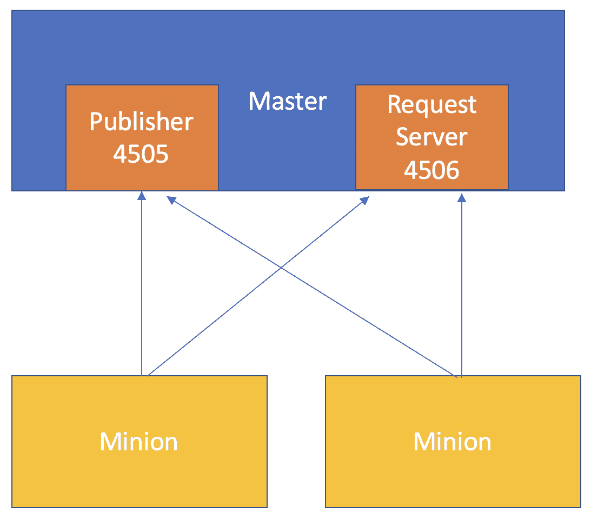
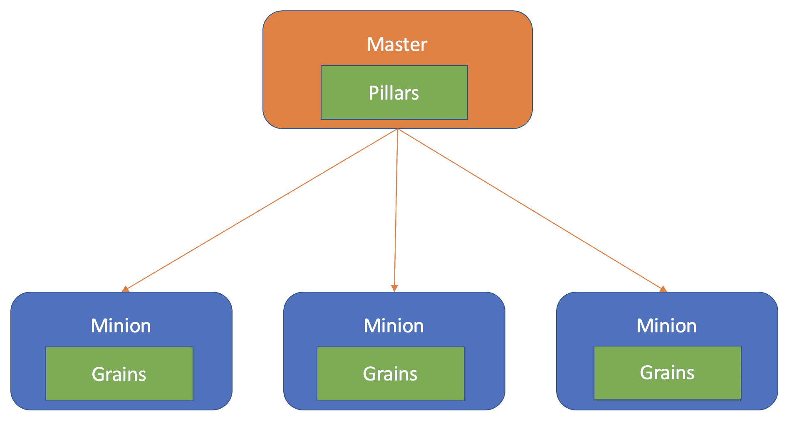

# 第十三章：用 Salty 解决管理问题

在本章中，我们将发现并讨论为什么企业需要为其基础设施拥有集中管理工具，包括异构环境带来的高复杂性。我们将讨论解决这个问题的解决方案，以及以下内容：

+   新技术给我们的业务带来复杂性

+   我们如何集中化系统管理。

+   **基础设施即代码**（IaC）如何帮助我们维护系统状态

+   利用 IaC 的工具

+   SaltStack 平台及其组件

让我们开始我们的系统管理之旅。

# 集中化系统管理

理解系统管理背后的原因很容易被忽视。我们经常假设，只因为一个企业拥有庞大的 IT 基础设施，就需要解决其清单管理的问题。虽然这显然是真的，但其中还有更多。我们作为架构师的工作包括倾听客户的问题，并理解他们究竟在寻找什么。

# 新技术和系统管理

在这个不断发展的 IT 世界中，变化迅速。几乎每天都会出现新技术。虚拟化、物联网和云等技术正在塑造和改变我们使用 IT 的方式，通过不断扩大我们的基础设施，这是裸金属时代从未见过的。

所有这些变化和指数级增长意味着 IT 经理有更多的东西要管理，但时间更少来培训他们的员工支持这些技术，因此许多企业几乎无法跟上步伐。这可能导致他们不愿意采用新技术。但许多企业别无选择，只能采用这些技术，因为他们担心变得无关紧要，无法满足客户的需求。如果他们的竞争对手占据优势并提供更好更快的服务，他们很可能会破产。

公司希望尽快采用这些技术，以在竞争对手之上取得优势，但新技术往往伴随着陡峭的学习曲线。在此期间，IT 人员需要学习如何管理和维护新系统，这导致保持关键系统和工作负载可用性成为一项挑战。不遵守我们的 SLA 成为真正的威胁；想象一下，开发人员需要运维团队在我们的开发环境系统中应用库补丁以测试新版本，因为我们的运维人员（或至少一半）正在接受培训，开发人员很容易绕过标准化的变更请求流程并自行应用更新。在这种情况下，影子 IT 非常普遍，我们需要尽一切努力避免。影子 IT 可能使我们的公司不符合监管标准。

虽然 IT 领导者推动采用新技术，但他们往往面临非常有限且日益减少的预算来进行这种转型。这也直接影响我们的关键系统和工作负载，因为对系统管理的投资减少并转向创新。迈向创新并不是坏事，因为最终它将使我们能够提供更好的服务，但重要的是要理解，这也会对我们现有环境的维护产生后果。

随着新技术的出现，新基础设施也随之而来；混合环境变得越来越普遍，了解如何以最佳和最有效的方式管理这些混合环境至关重要。

# 重新掌控我们自己的基础设施

掌控我们的基础设施是系统管理的主要目标。但是拥有控制权意味着什么？清单清单、版本控制、自动打补丁和软件分发都是系统管理的一部分。所有这些都是更大格局的一部分，IT 可以重新掌控其基础设施，并确保无论他们正在运行什么 Linux 发行版，都可以确保其系统的合规性和标准化。

通常我们的系统是分开的；这种分离是因为它们可能在特征上有所不同。我们可能有基于 Red Hat Enterprise Linux 的发行版或基于 Debian 的发行版的系统，具有不同架构的系统，如 x86、功率服务器，甚至 ARM。所有这些系统甚至可能不会相互通信或为相同的目的服务；它们都成为 IT 必须维护和管理的存储。

想象一下，在没有工具来集中和自动化任务的情况下，手动在每个独立的存储中执行系统管理的各种任务。人为错误是这种情况最直接的威胁，其次是 IT 业务必须承担的大量复杂性、时间和成本，包括培训员工、雇佣员工以及为每种不同的系统类型购买特定的管理工具。

# 集中工具分散问题

集中配置管理可以帮助我们以受控、一致和稳定的方式控制系统的变更。对于运行集群或配置为高可用性的系统来说，这是完美的，因为集群中的所有节点都必须具有完全相同的配置。通过配置管理，我们还可以理解某些文件的权限背后的原因，所有系统上安装的软件包，甚至配置文件中的一行代码。

通过配置管理工具实施的这些变更或配置也可以回滚，因为市场上大多数工具都带有版本控制，任何拼写错误、人为错误或不兼容的更新都可以轻松回滚。

随着我们慢慢过渡到云环境，虚拟机和资源变得越来越成为商品和服务。可以帮助我们管理、配置和维护云基础设施的配置管理工具变得非常有价值。通过这些类型的工具，我们可以以更具弹性的方式处理基础设施，并以描述性的方式定义它，这意味着我们可以拥有部署相同基础设施的模板或根据定义实施更改；这就是我们所说的**基础设施即代码**（**IaC**）。

# 编码实现期望状态

IaC 背后的整个理念是在我们的环境中实现一致性和版本控制。IaC 寻求一种更具描述性和标准的资源配置方式，避免独特和特殊的部署，以防止由于每个组件的独特性而重新创建环境变得非常复杂的情况。

IaC 工具通过特定语言或现有语言（如 YAML 或 JSON）定义配置；以下是一个从 Terraform 模板中提取的示例，该模板定义了 Microsoft Azure 中的虚拟机：

```
resource "azurerm_resource_group" "test" {
 name = "example"
 location = "East US 2"
}

resource "azurerm_kubernetes_cluster" "test" {
 name = "exampleaks"
 location = "${azurerm_resource_group.test.location}"
 resource_group_name = "${azurerm_resource_group.test.name}"
 dns_prefix = "acctestagent1"

 agent_pool_profile {
 name = "default"
 count = 1
 vm_size = "Standard_B1_ls"
 os_type = "Linux"
 os_disk_size_gb = 30
 }

 service_principal {
 client_id = "00000000-0000-0000-0000-000000000000"
 client_secret = "00000000000000000000000000000000"
 }

 tags = {
 Environment = "Production"
 }
}

output "client_certificate" {
 value = "${azurerm_kubernetes_cluster.test.kube_config}"
}

output "kube_config" {
 value = "${azurerm_kubernetes_cluster}"
}
```

在云基础设施世界中，弹性是关键。现在我们没有在数据中心等待使用的现有资源。在云中，我们按需付费，拥有虚拟机或存储空间会增加我们的月度账单，这并不理想。通过 IaC，我们可以根据需求扩展或缩减这些环境。例如，我们知道我们有一个应用程序，只在工作时间内消耗最大，并需要额外的实例来支持负载。但在工作时间之外，一个实例就足以支持负载。通过 IaC，我们可以编写脚本在早上创建额外的实例，并在一天结束时减少实例。每个实例都不是唯一的，我们可以利用通过 IaC 使用描述性文件的配置管理工具来实现这一点。

有几种工具可以完成上述示例，但许多工具不仅可以在云中或虚拟化环境中提供基础设施。其他配置管理工具甚至可以做得更多；它们可以推送配置文件，安装软件包，创建用户，甚至文件系统。这些工具执行配置的方式和方法有几种。许多工具需要代理，但还有一些是无代理的。

配置管理工具执行其更改的方式基本上是通过推送或拉取。这将取决于（但并非总是）工具是否使用代理或无代理。大多数无代理工具将您在 IaC 文件中声明的配置更改推送到云中的 API，或者通过 SSH 发送更改，当您通过命令行或脚本执行工具时。

另一方面，拉取几乎总是通过代理进行。代理不断地向配置管理服务器查询定义，验证所需状态，以防有所更改，然后从服务器拉取这些更改并应用到其主机上。

推送和拉取可以以两种不同的方式应用：声明式和命令式。声明式方式指定所需状态是什么，并且更改将按照 IaC 规范文件中定义的方式应用。命令式方式包括按特定顺序运行一组指令或命令，告诉系统如何达到所需状态。

通过 IaC 进行配置管理的一些开源工具如下：

+   Puppet

+   Chef

+   Ansible

+   Terraform

+   盐

+   Vagrant

我们将在第十四章《Getting Your Hands Salty》中深入了解盐及其组件。

# 理解 NaCl

我们了解了 IaC 是什么，以及系统管理背后的困难。但作为未来解决方案的架构师，我们需要知道并了解哪些工具可以帮助我们的客户面对配置管理带来的挑战。

在本节中，我们将讨论如何使用盐，或者称为盐堆平台，来帮助我们实现集中、灵活和弹性的管理基础设施。

# 介绍盐

盐是一个由 Tomas S Hatch 于 2011 年开发的 Python 开源项目。最初，它并不是一个配置管理工具，而是一个数据收集工具和远程命令执行软件，利用了 ZeroMQ 库。同年晚些时候，通过状态添加了配置管理功能，我们稍后将进行审查。

由于盐是用 Python 编写的，因此它具有高度的可扩展性和模块化，可以轻松编写自定义模块以进一步扩展其功能。

理解盐不仅是一个配置管理工具至关重要，但在这些章节中，我们将专注于其配置管理能力，因为这是当前主题的性质。在“进一步阅读”部分，我将添加几本其他书籍推荐，如果您想了解更多关于盐的其他功能。

在盐中定义所需状态的方式，或者换句话说，盐支持的语言是多种多样的。主要和默认语言是 YAML，支持 Jinja 模板。 

创建新用户的 YAML 定义示例如下：

```
doge:
 user.present:
 - fullname: much doge 
 - shell: /bin/bash
 - home: /home/doge
```

YAML 是盐的数据渲染语言；数据渲染将文件中的定义转换为盐消耗的 Python 数据结构。

以下是盐支持的其他数据渲染语言：

+   dson

+   hjson

+   json5

+   json

+   pydsl

+   pyobjects

+   py

+   stateconf

+   yamlex

Salt 有两种渲染类型。第一种是我们刚刚讨论的：数据渲染。第二种是文本渲染，这是`Jinja`所属的类别。这些**文本渲染**不是返回 Python 数据结构，而是返回文本，稍后会为数据渲染进行翻译。

文本渲染对于设置变量或循环非常有用，如果我们需要重复几个具有不同值但相同结构的定义。例如，我们可以创建一个`Jinja`模板，并使用相同的文件创建多个用户，而不是为每个用户创建一个 YAML 文件，如下所示：

```

{{ user }}:
user.present:
 - home: /home/{{ user }}
 - shell: /bin/bash
```

上面的示例将创建三个用户，而不是通过文件或定义创建一个用户。这种方式更有效，因为我们不仅节省了时间和工作，而且不需要一遍又一遍地输入相同的定义，如果需要在数组中添加更多用户，也可以轻松实现，而不必为额外的用户创建全新的文件或定义。

除了`Jinja`，Salt 文本渲染还支持其他模板引擎，例如以下：

+   `Cheetah`

+   `Genshi`

+   `GPG`

+   `Jinja`

+   `Mako`

+   `NaCl`

+   `Pass`

+   `Py`

+   `Wempy`

在接下来的章节中，我们将专注于`Jinja`和 YAML。

# SaltStack 平台

我们之前讨论了 IaC 的不同方法和途径。Salt 非常适合我们理解所有这些，因为 Salt 既使用推送和拉取方法，也同时使用**声明式**和**命令式**的方法。

让我们简要了解一下 Salt 的基本功能：



与任何其他客户端/服务器集群一样，Salt 由两种基本类型的节点组成：

+   **Master**：这个服务器或服务器组负责协调 minion，并在 minion 查询其所需状态时。主服务器也是发送要在 minion 上执行的命令的服务器。

+   **Minion**：由主服务器管理的服务器。

主服务器从两个 TCP 端口监听：`4505`和`4506`。这两个端口具有非常不同的角色和非常不同的连接类型。

`4505`端口或**发布者**是所有 minion 监听主服务器消息的地方。`4506`端口或**请求服务器**是 minion 通过安全方式直接请求特定文件或数据的地方。Salt 的网络传输利用 ZeroMQ 消息队列系统，该系统使用**椭圆曲线加密**，使用在主服务器和 minion 中生成的 4,096 位 RSA 密钥，我们将在本章后面看到。

Salt 是一种基于代理的工具，主服务器和 minion 之间的所有通信都是通过安装在 minion 上的代理实现的。Minion 负责与主服务器发起通信。

这很重要，因为在可能或可能没有互联网的分段网络中，您的主服务器和 minion 之间会有许多安全边界，并且每个 minion 可能没有为其定义的唯一地址。在主服务器发起通信的情况下，您的堆栈中的所有 minion 可能都必须具有公共 IP 地址，或者每次添加要管理的 minion 时都必须实现大量的网络配置和**网络地址转换**（**NAT**）。

由于 Salt 通信的方式，您可以将主服务器放在 DMZ 区域，具有公共可寻址的 IP 地址，并且所有 minion 连接到这些 IP。您的主服务器将始终少于 minion，因此需要实现的网络配置将大大减少。Salt 是一个高度可扩展的平台，一些堆栈包含数千个 minion；想象一下，必须配置网络以便三四个主服务器可以连接数千个 minion。

拥有公共 IP 的主服务器可能会让人感到害怕，但请记住，只要验证 RSA 密钥指纹，您就可以确保节点之间的所有通信都得到了保护，这要归功于 ZeroMQ 的加密机制。

# Salt 功能

在对 Salt 的架构进行简要概述之后，现在是时候了解其不同的功能和能力了。

# 远程命令执行模块

记住我们说过 Salt 同时使用推送和拉取方法以及声明性和命令性方法。远程命令执行功能是我们如何以命令性方式利用 Salt 的推送方法。

如果你需要在多个随从或特定随从上远程运行命令，你将使用**执行模块**。让我们看一个简单的例子：

```
dsala@master1:~$ salt ‘*’  cmd.run ‘ls /home’
minion-1:
 jdoe
 dev1
master:
 dsala 
 eflores
```

前面的命令向注册到主服务器的随从推送了`ls`。让我们更仔细地看看这些命令：

+   `salt`：这是 Salt 在远程随从上并行执行命令的最基本命令。

+   `'*'`：表示我们将在所有由我们的主服务器管理的服务器上运行该命令；你也可以定义特定的目标。

+   `cmd.run`：要调用的执行模块。

+   `'ls /home'`：执行模块的参数。

+   **输出**：按随从名称排序，后跟该服务器的输出。

执行模块是 Salt 使用其远程执行框架的最基本形式。还记得我们说过 Salt 是用 Python 编写的吗？嗯，执行模块实际上是具有一组服务于共同目的的函数的 Python 模块。Salt 附带了几个预构建模块，你可以使用它们，甚至可以编写自己的模块并将它们添加到你的 SaltStack 平台上。所有执行模块都应该是与发行版无关的，但你可能会遇到一些在某些发行版中不可用的模块。以`win_`开头的函数大多是特定于 Windows 的模块。

在我们之前的例子中，我们使用了`cmd`模块的`run`函数。我们使用模块中的函数的格式涉及定义要导入的模块，后跟一个句点和函数。每当调用一个函数时，Salt 都会按照以下方式进行：

1.  从执行命令的主服务器发送到指定目标的发布者端口（`4505`）。

1.  目标随从评估命令并决定是否要运行该命令。

1.  运行命令的随从格式化输出并将其发送到主服务器的请求服务器端口（`4506`）。

了解执行模块是不够的，我们还需要知道我们可以使用什么。许多预定义模块是最常用的，值得一看它们的主要功能是什么。

# sys 模块

这个模块相当于`man`命令。使用`sys`，我们可以查询、列出，甚至检查每个函数接受哪些参数。你会发现自己主要使用`sys`模块的以下函数：

+   `list_modules`：此函数将列出目标随从可用的模块。重要的是要注意，执行模块是在随从自身上执行的，而不是在执行命令的主服务器上。

+   `list_functions`：使用`list_functions`，你可以列出某个模块可用的函数。

+   `argspec`：列出所需函数的可用参数和默认值。

现在我们可以运行`sys`模块的前述函数之一，看一个真实的例子：

```
dsala@master1:~$ sudo salt 'minion1' sys.argspec pkg.install
minion1:
 ----------
 pkg.install:
 ----------
 args:
 - name
 - refresh
 - fromrepo
 - skip_verify
 - debconf
 - pkgs
 - sources
 - reinstall
 - ignore_epoch
 defaults:
 - None
 - False
 - None
 - False
 - None
 - None
 - None
 - False
 - False
 kwargs:
 True
 varargs:
 None
```

# pkg 模块

现在我们已经使用了`pkg`函数作为`sys`模块的示例，我想谈谈`pkg`模块。这是 Salt 提供的另一个最常用的模块。该模块处理与包相关的所有任务，从安装和升级到删除包。由于 Salt 试图尽可能与发行版无关，`pkg`模块实际上在底层调用一组不同的模块和函数，这些模块和函数特定于调用模块的发行版。例如，如果`pkg.install`针对的是基于 Ubuntu 的系统，当随从收到消息时，实际上会调用`aptpkg`模块。这就是为什么`pkg`被称为**虚拟模块**。

`pkg`调用的一些不同模块如下：

+   `aptpkg`：对于使用`apt-get`软件包管理的 Debian 发行版。

+   `brew`：适用于使用 Homebrew 软件包管理的 macOS。

+   `yumpkg`：使用`yum`或`dnf`作为软件包管理器的基于 Red Hat 的发行版。

+   `zypper`：对于使用`zypper`作为软件包管理器的基于 SUSE 的发行版。

以下是使用`pkg`安装`nginx` web 服务器的示例：

```
dsala@master1:~$ sudo salt 'minion1' pkg.install nginx
minion1:
 ----------
 nginx:
 ----------
 new:
 1.15.10
old:
```

# 测试模块

最后，但同样重要的是，我想和你谈谈**测试模块**。测试模块将允许我们测试我们的 SaltStack 平台。例如，检查 minions 的健康状态、它们正在运行的 Salt 版本，甚至只是让它们发送一个回声，都是可能的。

可以使用`sys.list_functions`函数找到测试模块的不同功能，但值得一提的是，您可能会经常使用一些最常见的功能：

+   **ping**：ping 函数测试 minions 的响应；这不是一个 ICMP ping 命令。

+   **version**：返回您的 minions 的 Salt 版本。

+   **versions_information**：返回所有 Salt 依赖项、内核版本、发行版版本和 Salt 版本的完整列表。

# 盐状态

现在我们已经了解了远程执行框架，我们可以开始探索 Salt 提供的其他系统。远程执行框架是所谓的**状态系统**的基础。状态系统是一种声明性和幂等的方式，利用 IaC 文件来配置 minion 的期望状态。状态系统利用状态模块，这些模块与执行模块非常相似，但不同之处在于 Salt 状态实际上会检查 minion 中是否已经存在所需的配置。例如，让我们看一下以下状态定义：

```
dsala@master:/srv/salt/httpd $ cat httpd.sls
 httpd_package:
 pkg.installed:
 -  name: httpd
```

上述状态将在运行时在目标服务器上安装`httpd`（Apache）软件包，但仅当软件包不存在时。如果软件包不存在，状态模块将调用本地的`pkg.install`执行函数，并在 minion(s)中安装软件包。

看一下我们从`/srv/salt`目录中`cat`文件的事实。这个目录是盐状态目录树的默认位置，状态定义放在这里。在这个目录中，您将创建包含公式的文件夹，这些公式是一组包含部署应用程序所需的所有必要配置的盐状态。例如，我们不仅可以安装`httpd`，还可以配置虚拟主机并下载包含实际网站的 Git 存储库，这些网站将在 Apache web 服务器上运行。

目录树遵循一组规则，以便您调用状态模块并运行公式，但这将是第十四章“Getting Your Hands Salty”的主题，届时我们将深入探讨配置和实际用法。

# 盐的特征

我们已经学会了可以通过定义 minion 名称或通过`*`在所有 minions 上运行执行模块。但是，当您的主服务器管理数百甚至数千个 minions 时，在整个堆栈上或在单个 minions 上运行 Salt 状态和执行模块并不理想。

在这里，Salt 引入了`grains`接口，它允许我们通过特定特征识别 minions，甚至为共享相同目的或特征的 minions 设置自己的标签或角色类型，因此我们可以执行更有针对性的配置管理。

我们可以利用`grains`接口，使用与在 Salt 中执行任何命令相同的语法：

```
dsala@master:~$ salt “minion1” grains.items
```

通过上述命令，我们列出了我们所针对的系统的所有不同的硬件和软件特征。在输出中，我们可以看到诸如操作系统系列、系统架构，甚至我们用来运行 VM 的 hypervisor 等信息。

这将帮助我们创建通过所谓的`top`文件定位特定系统的状态定义，我们将在第十四章中讨论这一点。使用`grains`并定位所有`Debian`系列 VM 的 Salt 状态顶部文件定义示例如下：

```
 base:
 'os_family:Debian:
 - match: grain
 - httpd
```

如前所述，我们还可以在从属服务器中创建自定义的`grains`来定义角色，并使用唯一值对标记我们的从属服务器。这对于将从属服务器分组到特定任务非常有用；例如，所有 QA 团队的 VM 可以使用键值对`departement: qa`进行标记。另一种分组方式可能是按角色，例如`appfoo: frontend`等。有许多使用谷物定位的方法，所有这些都取决于我们想要如何管理或推送和维护所需的状态。

# 盐柱

通过**谷物**，我们可以定位特定的从属服务器，但最终，我们定义了那些在顶层文件中的定位策略，这些文件是公式的一部分。公式通常存储在 Git 存储库中，有时甚至是公共的。这就是为什么我们不能，或者更确切地说，我们不应该在 Salt 状态中声明敏感信息。在我们之前的章节中，Dockerfile 也是如此，Kubernetes 通过**Secrets** API 对象解决了这个问题。Salt 有自己的秘密版本，称为**Pillars**。

与谷物不同，盐柱存储在主服务器中，而不是从属服务器。只有被盐柱定位的从属服务器才能访问盐柱中的信息。这使得它非常适合存储敏感信息。在存储敏感信息时，盐柱也可以在静止状态下加密，而且由于盐的渲染系统，盐柱将在盐柱编译期间解密。

盐柱通过仅在主服务器中存储敏感数据来减少敏感数据的暴露面：



通过 Salt 柱，我们完成了对 SaltStack 平台提供的基本组件的简要概述。我们将在第十四章中更深入地讨论它们，并通过实际示例进行操作，以便通过 Salt 开始管理系统。

# 摘要

在本章中，我们讨论了企业在维护基础设施时面临的不同问题。我们介绍了不同的技术，如 IaC 和集中式系统管理。我们介绍了 IaC 如何将更改**推送**或**拉取**到受控系统中，并了解了几个利用 IaC 的应用程序。

我们还讨论了盐是什么，以及它的不同组件如何帮助我们实现集中式的受控基础设施。

在下一章中，我们将学习如何设计一个 Salt 解决方案并安装软件。

# 问题

1.  什么是系统管理？

1.  系统管理背后的挑战是什么？

1.  什么应用程序可以帮助我们进行系统管理？

1.  什么是基础设施即代码？

1.  我们可以用哪些不同类型的方法来管理我们的系统？

1.  盐是什么？

1.  盐有哪些不同的组件？

# 进一步阅读

+   **Gartner**：'每个预算都是 IT 预算'

+   **Forrester**：[`www.forrester.com/report/Cloud+Investments+Will+Reconfigure+Future+IT+Budgets/-/E-RES83041#`](https://www.forrester.com/report/Cloud+Investments+Will+Reconfigure+Future+IT+Budgets/-/E-RES83041#)

+   **声明式与命令式配置管理模型**：[`www.upguard.com/blog/articles/declarative-vs.-imperative-models-for-configuration-management`](https://www.upguard.com/blog/articles/declarative-vs.-imperative-models-for-configuration-management)

+   **SALTSTACK**：[`s.saltstack.com/beyond-configuration-management/`](https://s.saltstack.com/beyond-configuration-management/)

+   Salt 配置管理：[`red45.wordpress.com/2011/05/29/salt-configuration-management/`](https://red45.wordpress.com/2011/05/29/salt-configuration-management/)

+   渲染器：[`docs.saltstack.com/en/latest/ref/renderers/`](https://docs.saltstack.com/en/latest/ref/renderers/)

+   远程执行：[`docs.saltstack.com/en/getstarted/system/execution.html`](https://docs.saltstack.com/en/getstarted/system/execution.html)

+   使用 grains 进行目标定位：[`docs.saltstack.com/en/latest/topics/targeting/grains.html`](https://docs.saltstack.com/en/latest/topics/targeting/grains.html)

+   Grains：[`docs.saltstack.com/en/latest/topics/grains/`](https://docs.saltstack.com/en/latest/topics/grains/)

+   函数：[`docs.saltstack.com/en/getstarted/config/functions.html`](https://docs.saltstack.com/en/getstarted/config/functions.html)
