# 第十四章：变得更加熟悉 Salt

在经过**Salt**的基本概念后，我们最终将在本章中开始实践 Salt。我们将有机会在真实情景下工作，并为潜在客户设计和安装概念验证基础设施。我们将做一些如下的事情：

+   通过 Terraform 配置云基础设施

+   安装和配置 Salt 主服务器

+   安装和配置 minions

+   为 minions 创建状态和公式

+   通过 Salt 配置负载均衡器

执行这些任务后，您应该具备基本知识和实践经验，可以开始更深入地学习 Salt。

# 使用 Salt 进行实践

我们已经了解了 Salt 的不同组件和软件的功能，以及它如何帮助我们控制我们的基础设施。但我们还没有使用任何组件来实际维护任何系统，甚至安装 Salt。因此，让我们开始使用 Salt，并开始利用我们新获得的知识。 

在开始之前，我们将设置一个情景，以便更清楚地了解本章中我们将要做的事情，它将与一个真实情景相关。

# 情景

您已被 Don High 先生聘用，为他的公司设计系统管理平台。他希望在 Azure **虚拟机**（**VMs**）上运行他的 Web 服务器工作负载，采用**基础设施即服务**（**IaaS**）模型。

他的设置非常简单：他希望有两台虚拟机运行一个用`Node.js`编写的网站，位于 nginx 负载均衡器前面，将流量路由到网站的虚拟机中。他的所有基础设施都必须通过配置管理解决方案进行管理，以便每次他们提供新的虚拟机时，应用程序都会加载，并且可能需要运行其网站所需的任何配置。

他还告诉你的另一件事是，公司的员工在 Azure 中没有部署任何资源，并且他们希望看到**基础设施即代码**（**IaC**）如何在云中部署，以便他们的开发人员将来能够使用它。

# 构建我们的初始基础设施

我们在上一章中提到了**Terraform**，并且我们希望利用我们的客户要求我们通过 IaC 软件部署他的基础设施的事实，所以这是使用这个伟大工具的绝佳机会。

在执行每一步之前，我们将简要解释每一步，但如果您想了解更多，我们将在*进一步阅读*部分建议更多关于 Terraform 的深入讨论的书籍。

# 设置 Terraform

我们假设您将从类 Unix 工作站执行以下步骤。安装 Terraform 非常简单。Terraform 只是一个可以从`terraform.io`网站下载的二进制文件。

[`www.terraform.io/downloads.html`](https://www.terraform.io/downloads.html)

在我的情况下，我将使用 macOS 终端安装 Terraform：

！[](img/feabe7e2-a66a-428a-931c-9ccbbdb755bb.png)

下载后，您可以继续并在路径的一部分解压缩二进制文件：

！[](img/5d5c9321-527e-4c2d-98d9-8bb819acce1b.png)

通过运行`terraform version`检查 Terraform 版本：

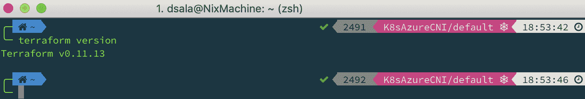

安装了 Terraform 后，我们需要安装 Azure CLI 以配置访问客户的 Azure 订阅。您可以在我们的*安装 Kubernetes*章节中找到安装 Azure CLI 和设置订阅的步骤。

安装了 Azure CLI 并设置了默认帐户后，我们可以配置 Terraform 以使用适当的凭据，以便它能够部署基础设施。

首先，我们将创建一个目录来存储我们的 Terraform 文件：

```
dsala@NixMachine: ~ $ mkdir terrafiles
```

接下来，我们将通过 Azure CLI 创建一个服务主体 ID，该 ID 将用于验证 Terraform 与我们的订阅。

将此命令的输出中的订阅 ID 保存到`$SUB_ID`变量中：

```
dsala@NixMachine: ~ $ az account show --query "{subscriptionId:id}"

dsala@NixMachine: ~ $ SUB_ID=<subscription id>
```

现在，运行以下命令来创建服务主体：

```
dsala@NixMachine: ~ $ az ad sp create-for-rbac \
--role="Contributor" \
--scopes="/subscriptions/${SUB_ID}"
```

注意从上一个命令返回的`appId`、`password`和`tenant`的值。

现在，在`terrafiles`目录中，创建一个名为`terraform.tfvars`的文件。

这个文件很特殊，因为当我们执行 Terraform 时，Terraform 会自动加载默认情况下存在的任何具有这个名称的文件。

这个文件应包含以下信息：

```
subscription_id = "azure-subscription-id"
tenant_id = "tenant-from-service-principal"
client_id = "appId-from-service-principal"
client_secret = "password-from-service-principal"
```

当你准备好文件后，创建另一个名为`az_creds.tf`的文件，其中包含以下内容：

```
variable subscription_id {}
variable tenant_id {}
variable client_id {}
variable client_secret {}

provider "azurerm" {
 subscription_id = "${var.subscription_id}"
 tenant_id = "${var.tenant_id}"
 client_id = "${var.client_id}"
 client_secret = "${var.client_secret}"
}
```

这个文件将是我们的变量文件，并且它将把凭据变量加载到 Azure 资源管理器 Terraform 提供程序中。

# 创建 IaC

现在我们准备开始创建我们的 IaC 声明文件。Terraform 使用自己的语言称为**Hashicorp 配置语言**（**HCL**）。你可以在以下链接找到更多信息：[`www.terraform.io/docs/configuration/index.html`](https://www.terraform.io/docs/configuration/index.html)。

让我们开始定义我们的资源。创建一个名为`main.tf`的文件。这将是我们的主模块文件。一个模块是一组共享共同目标或属于同一应用程序的资源。

`main.tf`的名称是 Hashicorp 推荐的名称，Hashicorp 是 Terraform 开源项目的公司所有者，用于最小模块。

你可以在 Terraform 文档中了解更多关于模块的信息：[`www.terraform.io/docs/modules/index.html`](https://www.terraform.io/docs/modules/index.html)。

我们的文件应包含接下来我们将声明的所有资源。

这是将包含我们 Azure 资源的资源组：

```
resource "azurerm_resource_group" "salt" {
name     = "Salt"
location = "East US"
}
```

这是我们子网的虚拟网络：

```
resource "azurerm_virtual_network" "salt" {
name                = "saltnet"
address_space       = ["10.0.0.0/16"]
location            = "${azurerm_resource_group.salt.location}"
resource_group_name = "${azurerm_resource_group.salt.name}"
}
```

请注意，我们通过以下语法从先前的资源中获取值：

```
"resource_type.local_name.value".
```

这是我们 VM 的地址空间的子网(s)：

```
resource "azurerm_subnet" "salt" {
name                 = "saltsubnet"
resource_group_name  = "${azurerm_resource_group.salt.name}"
virtual_network_name = "${azurerm_virtual_network.salt.name}"
address_prefix       = "10.0.0.0/24"
}
```

在这里，我们只创建一个包含我们的主节点和 minions 的子网，但只要它们在 VNET 地址空间内，你可以随时创建单独的子网，以便主节点和 minions 进行网络隔离。

创建了虚拟网络和子网后，我们需要为虚拟机创建防火墙规则。Azure 中的防火墙称为**网络安全组**，我们将继续使用网络安全组提供程序来创建防火墙及其规则。

这是我们负载均衡器的网络安全组：

```
resource "azurerm_network_security_group" "saltlb" {
 name                = "lb-nsg"
 location            = "${azurerm_resource_group.salt.location}"
 resource_group_name = "${azurerm_resource_group.salt.name}"
}
```

以下是用于访问负载均衡器 VM 的网络安全组规则。

`https`的端口：

```
resource "azurerm_network_security_rule" "httpslb" {
 name = "https"
 priority = 100
 direction = "inbound"
 access = "Allow"
 protocol = "Tcp"
 source_port_range = "*"
 destination_port_range = "8443"
 source_address_prefix = "*"
 destination_address_prefix = "*"
 resource_group_name = "${azurerm_resource_group.salt.name}"
 network_security_group_name = "${azurerm_network_security_group.saltlb.name}"
}
```

`http`端口：

```
resource "azurerm_network_security_rule" "httplb" {
 name                        = "http"
 priority                    = 101
 direction                   = "inbound"
 access                      = "Allow"
 protocol                    = "Tcp"
 source_port_range           = "*"
 destination_port_range      = "8080"
 source_address_prefix       = "*"
 destination_address_prefix  = "*"
 resource_group_name         = "${azurerm_resource_group.salt.name}"
 network_security_group_name = "${azurerm_network_security_group.saltlb.name}"
}
```

`access`的 SSH 端口：

```
resource "azurerm_network_security_rule" "sshlb" {
 name                        = "sshlb"
 priority                    = 103 direction                   = "inbound"
 access                      = "Allow"
 protocol                    = "Tcp"
 source_port_range           = "*" destination_port_range = "22"
 source_address_prefix       = "*"
 destination_address_prefix  = "*"
 resource_group_name         = "${azurerm_resource_group.salt.name}"
 network_security_group_name = "${azurerm_network_security_group.saltlb.name}"
}
```

主 VM 的第二个网络安全组如下：

```
resource "azurerm_network_security_group" "saltMaster" {
 name                = "masternsg"
 location            = "${azurerm_resource_group.salt.location}"
 resource_group_name = "${azurerm_resource_group.salt.name}"
}
```

以下是主 VM 的网络安全组规则。

以下是 Salt 的`publisher`端口：

```
resource "azurerm_network_security_rule" "publisher" {
 name                        = "publisher"
 priority                    = 100
 direction                   = "inbound"
 access                      = "Allow"
 protocol                    = "Tcp"
 source_port_range           = "*"
 destination_port_range      = "4505"
 source_address_prefix       = "*"
 destination_address_prefix  = "*"
 resource_group_name         = "${azurerm_resource_group.salt.name}"
 network_security_group_name = "${azurerm_network_security_group.saltMaster.name}"
}
```

以下是 Salt 的请求服务器端口：

```
resource "azurerm_network_security_rule" "requestsrv" {
 name                        = "requestsrv"
 priority                    = 101
 direction                   = "inbound"
 access                      = "Allow"
 protocol                    = "Tcp"
 source_port_range           = "*"
 destination_port_range      = "4506"
 source_address_prefix       = "*"
 destination_address_prefix  = "*"
 resource_group_name         = "${azurerm_resource_group.salt.name}"
 network_security_group_name = "${azurerm_network_security_group.saltMaster.name}"
}
```

主机的`ssh`端口如下：

```
resource "azurerm_network_security_rule" "sshmaster" {
 name                        = "ssh"
 priority                    = 103
 direction                   = "inbound"
 access                      = "Allow"
 protocol                    = "Tcp"
 source_port_range           = "*"
 destination_port_range      = "22"
 source_address_prefix       = "*"
 destination_address_prefix  = "*"
 resource_group_name         = "${azurerm_resource_group.salt.name}"
 network_security_group_name = "${azurerm_network_security_group.saltMaster.name}"
}
```

minions 的网络安全组如下：

```
resource "azurerm_network_security_group" "saltMinions" {
 name                = "saltminions"
 location            = "${azurerm_resource_group.salt.location}"
 resource_group_name = "${azurerm_resource_group.salt.name}"
}
```

这个最后的网络安全组很特殊，因为我们不会为它创建任何规则。Azure 提供的默认规则只允许 VM 与 Azure 资源通信，这正是我们这些 VM 所希望的。

我们 Nginx 负载均衡器 VM 的公共 IP 地址如下：

```

resource "azurerm_public_ip" "saltnginxpip" {
 name                         = "lbpip"
 location                     = "${azurerm_resource_group.salt.location}"
 resource_group_name          = "${azurerm_resource_group.salt.name}"
 public_ip_address_allocation = "static"
}
```

我们负载均衡器的虚拟网络接口如下：

```
resource "azurerm_network_interface" "saltlb" {
 name                = "lbnic"
 location            = "${azurerm_resource_group.salt.location}"
 resource_group_name = "${azurerm_resource_group.salt.name}"
 network_security_group_id  = "${azurerm_network_security_group.saltlb.id}"

 ip_configuration {
 name                          = "lbip"
 subnet_id                     = "${azurerm_subnet.salt.id}"
 private_ip_address_allocation = "dynamic"
 public_ip_address_id          = "${azurerm_public_ip.saltnginxpip.id}"
 }
}
```

我们的 Web 服务器 VM 的虚拟网络接口如下：

```
resource "azurerm_network_interface" "saltminions" {
 count               = 2
 name                = "webnic${count.index}"
 location            = "${azurerm_resource_group.salt.location}"
 resource_group_name = "${azurerm_resource_group.salt.name}"
 network_security_group_id  = "${azurerm_network_security_group.saltMinions.id}"

 ip_configuration {
 name                          = "web${count.index}"
 subnet_id                     = "${azurerm_subnet.salt.id}"
 private_ip_address_allocation = "dynamic"
 }
}
```

以下是我们主 VM 的公共 IP 地址：

```
resource "azurerm_public_ip" "saltmasterpip" {
 name                    = "masterpip"
 location                = "${azurerm_resource_group.salt.location}"
 resource_group_name     = "${azurerm_resource_group.salt.name}"
 allocation_method       = "Dynamic"
}
```

这个公共 IP 地址将用于我们 SSH 到主 VM；这就是为什么我们要动态分配它。

主 VM 的虚拟网络接口如下：

```
resource "azurerm_network_interface" "saltmaster" {
 name                = "masternic"
 location            = "${azurerm_resource_group.salt.location}"
 resource_group_name = "${azurerm_resource_group.salt.name}"
 network_security_group_id     = "${azurerm_network_security_group.saltMaster.id}"

 ip_configuration {
 name                          = "masterip"
 subnet_id                     = "${azurerm_subnet.salt.id}"
 private_ip_address_allocation = "static"
 private_ip_address            = "10.0.0.10"
 public_ip_address_id          = "${azurerm_public_ip.saltmasterpip.id}"
 }
}
```

以下是 Web 服务器 VMs：

```
resource "azurerm_virtual_machine" "saltminions" {
count                 = 2
name                  = "web-0${count.index}"
location              = "${azurerm_resource_group.salt.location}"
resource_group_name   = "${azurerm_resource_group.salt.name}"
network_interface_ids = ["${element(azurerm_network_interface.saltminions.*.id, count.index)}"]
vm_size               = "Standard_B1s"
storage_image_reference {
 publisher = "Canonical"
 offer     = "UbuntuServer"
 sku       = "16.04-LTS"
 version   = "latest"
}
storage_os_disk {
 name              = "webosdisk${count.index}"
 caching           = "ReadWrite"
 create_option     = "FromImage"
 managed_disk_type = "Standard_LRS"
}
os_profile {
 computer_name  = "web-0${count.index}"
 admin_username = "dsala"
}
os_profile_linux_config {
 disable_password_authentication = true
 ssh_keys = {
 path   = "/home/dsala/.ssh/authorized_keys"
 key_data = "${file("~/.ssh/id_rsa.pub")}"
 }
 }
}
```

用你自己的信息替换`os_profile.admin_username`和`os_profile_linux_config.key_data`。

主 VM 如下：

```
resource "azurerm_virtual_machine" "saltmaster" {
name                  = "salt"
location              = "${azurerm_resource_group.salt.location}"
resource_group_name   = "${azurerm_resource_group.salt.name}"
network_interface_ids = ["${azurerm_network_interface.saltmaster.id}"]
vm_size               = "Standard_B1ms"

storage_image_reference {
 publisher = "OpenLogic"
 offer     = "CentOS"
 sku       = "7.5"
 version   = "latest"
}

storage_os_disk {
 name              = "saltos"
 caching           = "ReadWrite"
 create_option     = "FromImage"
 managed_disk_type = "Standard_LRS"
}

os_profile {
 computer_name  = "salt"
 admin_username = "dsala"
}

os_profile_linux_config {
 disable_password_authentication = true
 ssh_keys = {
 path   = "/home/dsala/.ssh/authorized_keys"
 key_data = "${file("~/.ssh/id_rsa.pub")}"
 }
 }
}
```

以下是 Nginx 负载均衡器 VM：

```
resource "azurerm_virtual_machine" "saltlb" {
name                  = "lb-vm"
location              = "${azurerm_resource_group.salt.location}"
resource_group_name   = "${azurerm_resource_group.salt.name}"
network_interface_ids = ["${azurerm_network_interface.saltlb.id}"]
vm_size               = "Standard_B1ms"

storage_image_reference {
 publisher = "OpenLogic"
 offer     = "CentOS"
 sku       = "7.5"
 version   = "latest"
}

storage_os_disk {
 name              = "lbos"
 caching           = "ReadWrite"
 create_option     = "FromImage"
 managed_disk_type = "Standard_LRS"
}

os_profile {
 computer_name  = "lb-vm"
 admin_username = "dsala"
}

os_profile_linux_config {
 disable_password_authentication = true
 ssh_keys = {
 path   = "/home/dsala/.ssh/authorized_keys"
 key_data = "${file("~/.ssh/id_rsa.pub")}"
 }
 }
}
```

保存了所有先前创建的资源的文件后，运行`terraform init`命令；这将使用 Terraform 文件初始化当前目录并下载 Azure Resource Manager 插件：

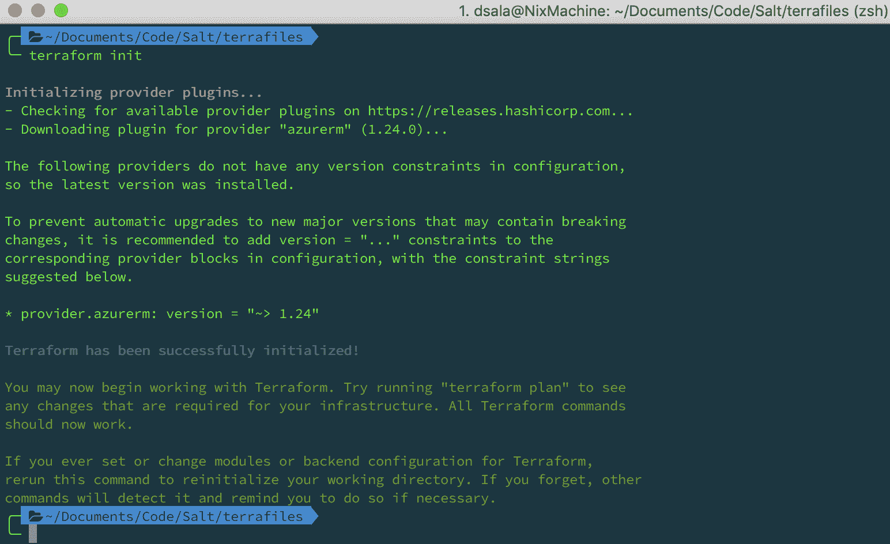

如果您想了解更多关于`init`命令的信息，您可以访问[`www.terraform.io/docs/commands/init.html`](https://www.terraform.io/docs/commands/init.html)。

运行`init`命令后，我们将继续运行`terraform plan`命令，该命令将计算实现我们在`tf`文件中定义的所需状态的所有必要更改。

在运行`terraform apply`命令之前，这不会对现有基础设施进行任何更改：

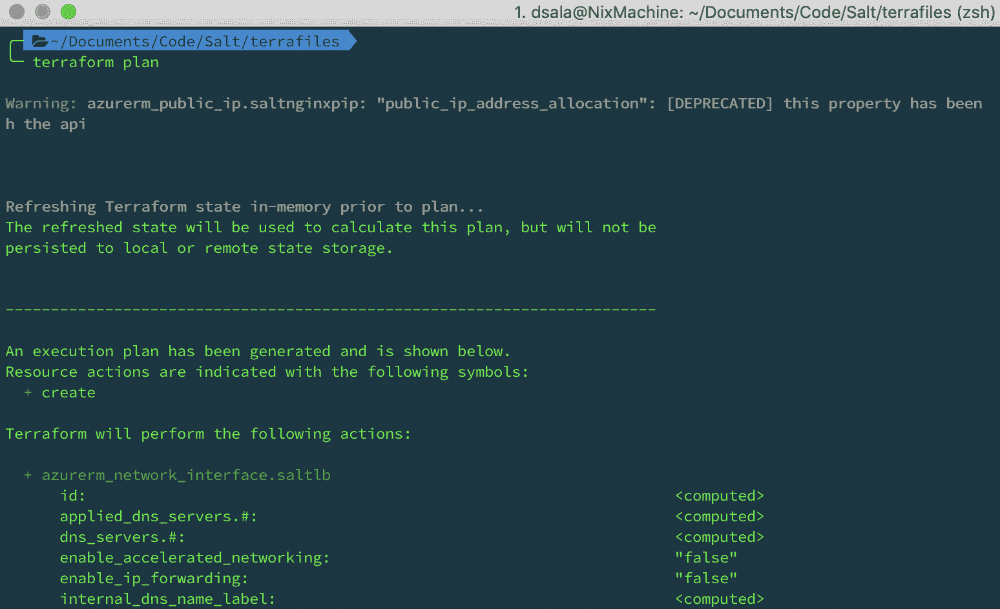

有关`plan`命令的更多信息，请访问[`www.terraform.io/docs/commands/plan.html`](https://www.terraform.io/docs/commands/plan.html)。

完成`plan`命令后，您可以继续运行`terraform apply`，然后会提示您确认应用更改：

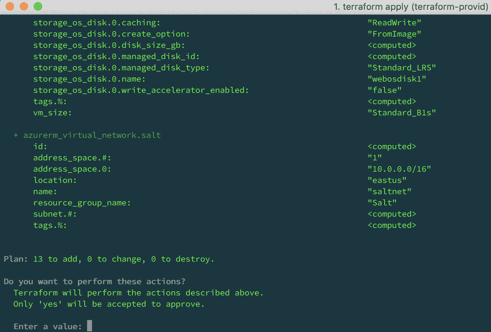

完成后，您应该能够看到以下消息：

```
Apply complete! Resources: 18 added, 0 changed, 0 destroyed.
 Installing, Configuring and Managing Salt
```

安装 Salt 有两种方式：您可以使用引导脚本安装主服务器和 minions，也可以通过 Salt 存储库手动安装和配置它们。

我们将覆盖两种方式，以便熟悉安装过程。

# 使用软件包管理器安装 Salt

在我们当前的基础设施中，我们有一个主服务器和三个 minions。我们的主服务器和一个 minion 正在运行 CentOS 7.5，其余的 VM 都在 Ubuntu 16.04 上。在这两个发行版上，流程会有所不同，但在两者上有一些相同的步骤。

# 安装 CentOS yum

以前，Salt 只能通过 EPEL 存储库获得。但现在 SaltStack 有自己的存储库，我们可以从那里导入并执行安装。

首先，在主 VM 中安装 SSH，然后运行以下命令导入 SaltStack 存储库：

```
[dsala@salt ~]$ sudo yum install \
https://repo.saltstack.com/yum/redhat/salt-repo-latest.el7.noarch.rpm
```

可选的，您可以运行`yum clean expire-cache`，但由于这是一个新的虚拟机，这是不必要的。

完成后，我们将继续安装`salt-master`包：

```
[dsala@salt ~]$ sudo yum install salt-master -y
```

继续启用`systemd` salt-master 服务单元：

```
[dsala@salt ~]$ sudo systemctl enable salt-master --now
```

检查服务是否正在运行：

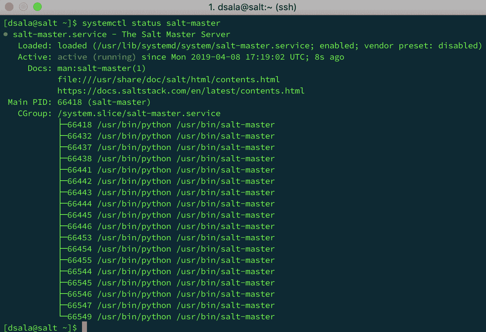

一旦服务正常运行，请通过运行以下命令检查 VM 的私有 IP 是否与我们在 Terraform 定义中配置的 IP 一致：

```
[dsala@salt ~]$ ifconfig eth0 | grep inet | head -1 | awk '{print $2}'
```

确认了 IP 地址后，打开另一个终端并 SSH 到负载均衡器 minion。重复在主 VM 中添加存储库的过程。

添加存储库后，运行以下命令安装`salt-minion`包：

```
[dsala@lb-vm ~]$ sudo yum install salt-minion -y
```

通过运行以下命令启用和启动`systemd`服务单元：

```
[dsala@lb-vm ~]$ sudo systemctl enable salt-minion --now
```

在我们对其进行任何更改之前，让我们检查服务是否成功启动：

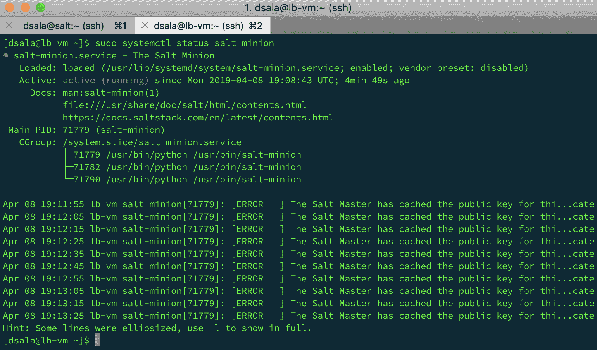

我们可以看到服务上出现错误，说主服务器已更改公钥，我们无法连接到 Salt 主服务器。现在我们需要配置 minion 与主服务器通信。但首先，让我们安装剩下的两个 Ubuntu minions，因为在两个发行版上注册 minions 的过程是相同的。

# Ubuntu apt-getting Salt

这唯一复杂的部分是，由于我们的 Web 服务器没有分配给它们的公共 IP 地址，您必须从主 VM 或负载均衡器 VM 对它们进行 SSH。为此，您可以从这两个 VM 中的任何一个设置 SSH 密钥认证到 minions。如果您正在阅读本书，您将熟悉如何执行此任务。

登录到 Web 服务器 VM 后，在两个 VM 中执行以下任务。

导入 Salt 存储库的`gpg`密钥：

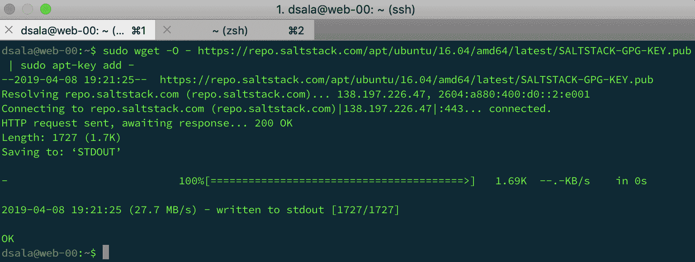

运行以下命令创建存储库：

```
dsala@web-00:~$ echo "deb http://repo.saltstack.com/apt/ubuntu/16.04/amd64/latest xenial main" \
| sudo tee /etc/apt/sources.list.d/saltstack.list
```

添加了存储库后，运行`apt update`，您应该能够看到存储库已列出：

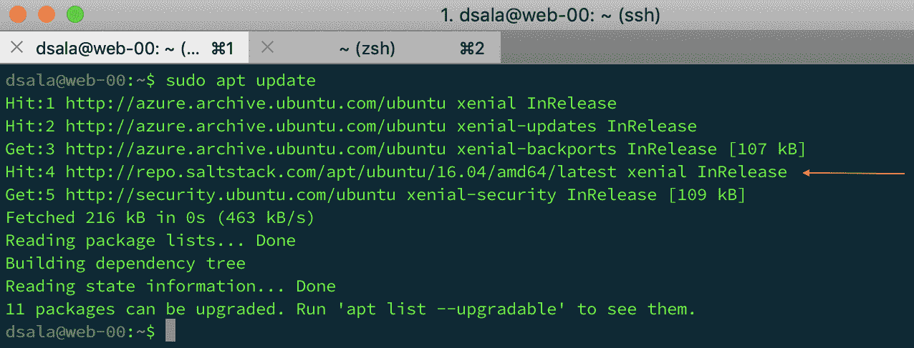

继续安装`salt-minion`软件包：

```
dsala@web-00:~$ sudo apt install salt-minion -y
```

通过运行以下命令启用并检查`salt-minion`服务的状态：

```
dsala@web-00:~$ sudo systemctl enable salt-minion --now && systemctl status salt-minion
```

您应该看到与 CentOS LB 虚拟机中看到的相同的消息。

# 通过引导脚本安装 Salt

通过**引导脚本**安装 Salt 的第二种方法。此脚本会自动检测我们的发行版并下载定义的软件包。该脚本还为我们提供了`-A`标志，该标志将主机的地址添加到我们的 minions 中。

要获取脚本，您可以使用`wget`或`curl`；官方 SaltStack 使用`curl`：

```
user@master:~$ curl -L https://bootstrap.saltstack.com -o install_salt.sh
```

此脚本适用于主机和 minions；运行脚本时使用的标志不同。

要安装主机组件，请使用`-M`标志运行脚本，用于主机和`-P`允许安装任何 Python `pip`软件包。我们还可以使用`-A`指定主机地址，并告诉脚本不要使用`-N`标志在主机中安装 minion 服务：

```
user@master:~$ sudo sh install_salt.sh -P -M
```

要安装 minion，只需运行此命令：

```
user@master:~$ sudo sh install_salt.sh -P -A <salt master IP>
```

# 主机和 minion 握手

在安装的这个阶段，我们将允许我们的 minions 与主机通信，验证它们的指纹，并设置配置文件。

首先，我们将 SSH 到主机 VM 并编辑主机的配置文件，告诉 salt-master 守护程序要绑定到哪个 IP。

编辑`/etc/salt/master`文件，查找`interface:`行，并添加主机的 IP 地址：

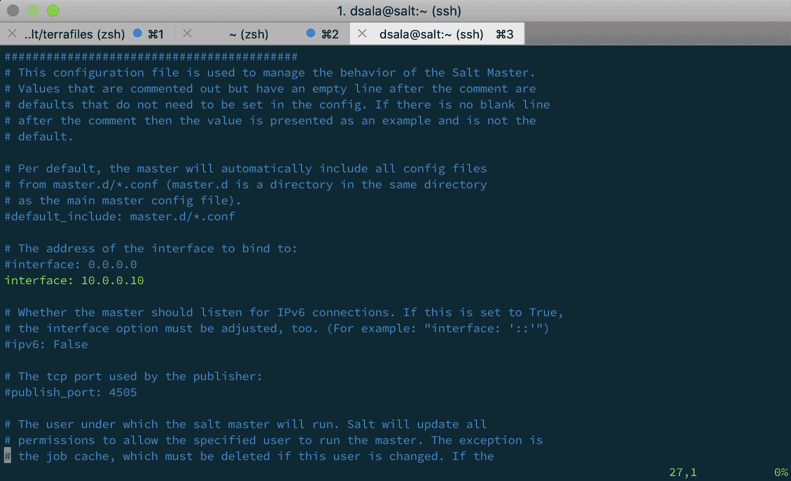

修改文件后，运行`daemon-reload`和`restart`命令，以便服务确认更改：

```
[dsala@salt ~]$ sudo systemctl daemon-reload && sudo systemctl restart  salt-master
```

您可以通过运行`ss`命令来验证 Salt 主机是否在正确的 IP 地址上监听：

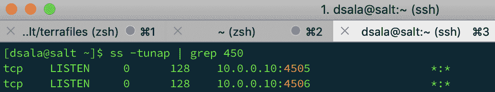

现在我们的主机正在监听我们需要的 IP 地址，是时候配置我们的 minions 了。

让我们开始修改 minion 的配置文件。请记住，这些步骤需要在所有 minions 上执行，而不管它们的发行版如何。

查找`/etc/salt/minion`文件，并通过在`master:`下添加主机的 IP 地址来编辑它。我们将找到一个已配置的值：`master: salt`*；*这是因为 Salt 默认情况下通过对主机名`salt`进行 DNS 查询来查找主机，但是因为我们打算在将来拥有多个主机，所以我们将使用我们主机 VM 的静态 IP 地址设置此文件：

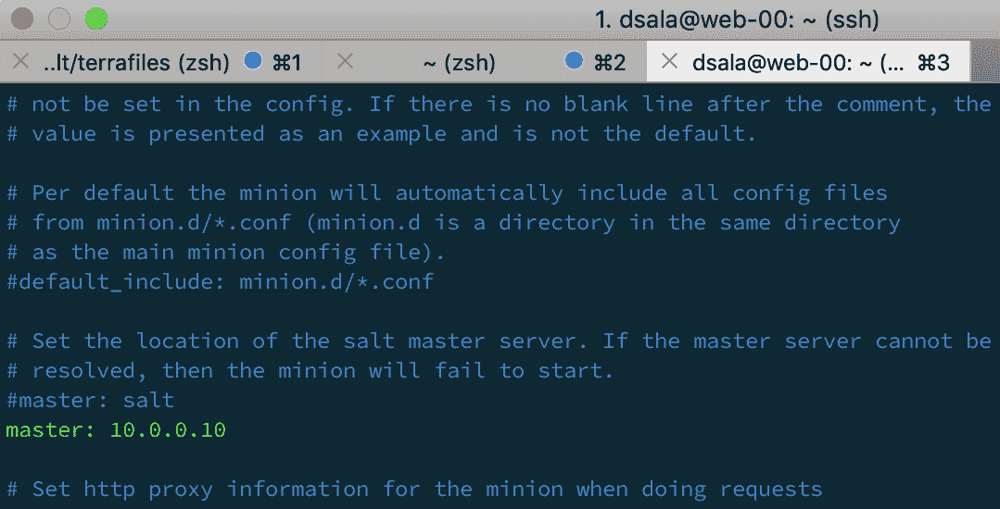

在我们的 minions 可以交换密钥之前，我们需要将主机的指纹添加到我们 minions 的配置文件中。

SSH 回到主机并运行以下命令以获取主机的公共指纹：

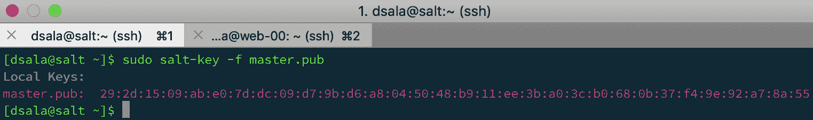

复制`master.pub`的值，并返回编辑 minion 的配置文件。在 minion 的配置文件中，使用在前一步中获得的主机公钥编辑`master_finger: ' '`行：

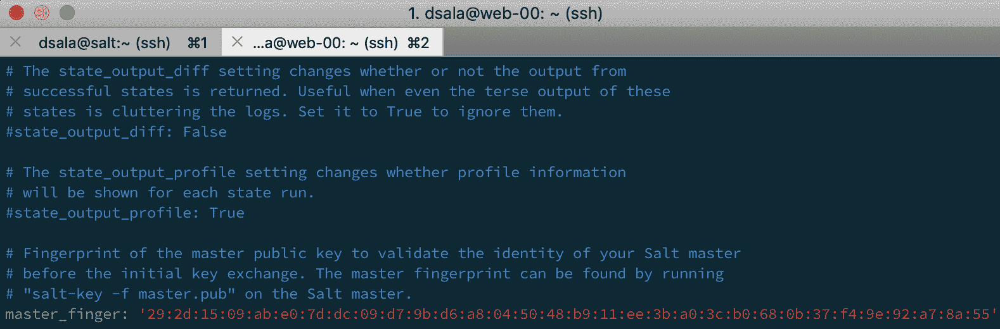

完成最后一个任务后，重新加载并重新启动 minion 守护程序：

```
[dsala@web-00 ~]$ sudo systemctl daemon-reload && sudo systemctl restart salt-master
```

在退出每个 minion 之前，运行以下命令并注意 minion 的指纹：

```
[dsala@web-00 ~]$ sudo salt-call --local key.finger
```

一旦您注意到所有 minions 的指纹，请继续登录到主机。

在主机上，我们将比较主机看到的指纹与我们在每个 minion 本地看到的指纹。通过这种方式，我们将确定我们将接受的 minions 确实是我们的 minions。

要做到这一点，在主机上运行以下命令：`salt-key -F`。这将打印所有密钥，因此您不必逐个打印每个密钥：

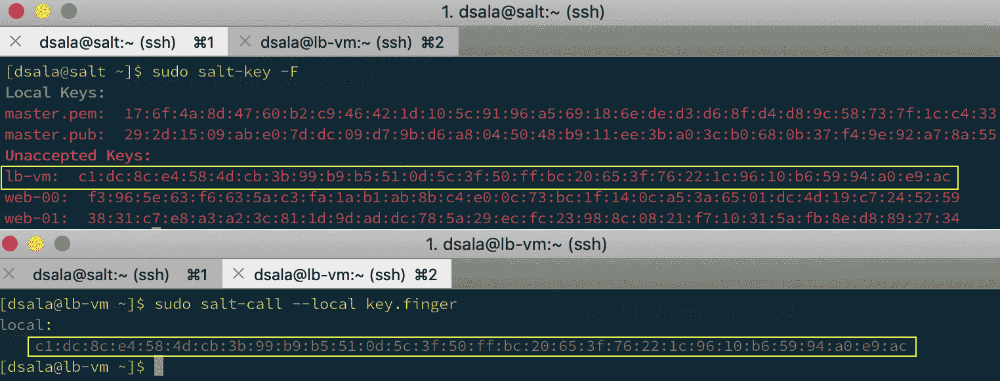

确保密钥相同，然后我们将继续接受密钥。

在`salt-key -F`命令下，我们看到有未接受的密钥需要验证；我们将运行`salt-key -A`来接受所有待处理的密钥，然后可以运行`salt-key -L`来验证这些密钥是否被接受：

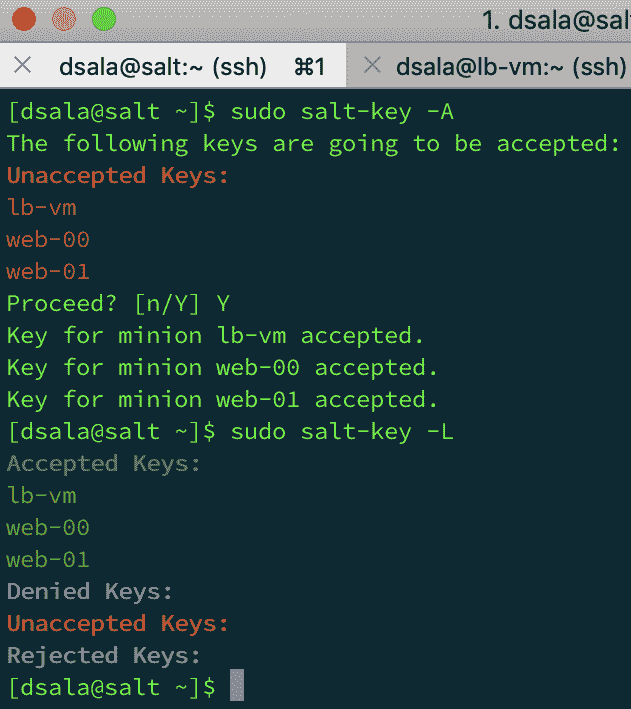

现在我们的 minion 已经经过身份验证，我们可以继续从 master 发出命令。

为了测试我们的 minion，我们将从测试模块调用`ping`函数：

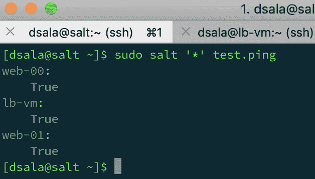

所有 minion 应该回应`True`，表示 Salt minion 守护程序正在响应，我们准备开始管理我们的基础设施。

# 使用 Salt 工作

我们的 SaltStack 已经运行起来了，我们准备开始为我们的虚拟机创建公式和定制配置。

# 创建 WebServer 公式

我们现在将创建必要的状态文件来创建安装和配置我们的 web 服务器的公式。

在开始之前，我们需要首先创建我们的状态树，其中将包含所有状态文件：

```
[dsala@salt ~]$ sudo mkdir /srv/salt
```

在这个目录中，我们将创建一个名为`top.sls`的文件。这个文件告诉 Salt 要应用哪些状态到哪些 minion 上。和 Salt 中的每个定义一样，`top.sls`是一个基于 YAML 的文件，其中包含要定位的 minion 和应用到这些 minion 的状态文件。

在`/srv/salt`目录中创建一个名为`top.sls`的文件，内容如下：

```
base:
    'web*':
       - webserver.nodejs
```

`base:`表示我们正在工作的环境；由于这是一个简单的环境，我们只需要基本环境；如果要处理多个环境，可以参考我们在*进一步阅读*部分建议的一本书。

接下来，我们有`web*`条目；这个条目告诉 Salt 要应用状态的 minion IDs。正如你所看到的，你可以使用 globbing 来定位 minion IDs。

最后，`- webserver.nodejs`是我们指示要应用的状态；`webserver`表示`nodejs.sls`文件所在的文件夹。由于 YAML 是由 Python 解释器读取的，我们需要用句点（.）而不是斜杠（/）来定义路径。最后一个词将是要加载的`.sls`文件的名称。

因为我们定义了`Node.js`文件在一个名为`webserver`的目录中，这个目录将存储我们所有的 web 服务器状态文件，我们需要创建这样一个目录：

```
[dsala@salt ~]$ sudo mkdir /srv/salt/webserver
```

现在我们有了存储状态定义的目录，让我们创建我们的第一个状态定义，安装`node.js`包和`npm`。在`/srv/salt/webserver/`目录中创建一个名为`nodejs.sls`的文件，内容如下：

```
nodejs:
    pkg.installed

npm:
    pkg.installed
```

`nodejs`字段是要安装的包，后面是要调用的`pkg.installed`函数。

创建了`state`文件后，将`state`文件应用到 web 服务器 minion 上：

```
[dsala@salt ~]$ sudo salt 'web*' state.apply
```

过一会儿，你将收到应用更改和持续时间的输出：

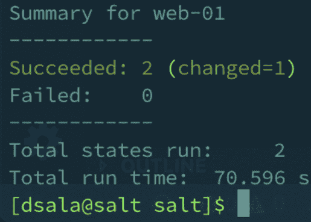

以下示例的输出已经被截断以提高可读性。

安装了 Node.JS 后，我们现在需要为 Node.JS 网站创建用户。

我们将创建另一个状态文件来定义用户配置。

在`/srv/salt/webserver/`目录下创建另一个名为`webuser.sls`的文件，内容如下声明：

```
webuser:
  user.present:
    - name: webuser
    - uid: 4000
    - home: /home/webuser
```

在执行状态之前，修改`top.sls`文件以反映新添加的状态文件：

```
base:
   'web*':
     - webserver.nodejs
     - webserver.webuser   
```

再次执行`salt '*' state.apply`命令，你应该会收到用户创建的输出：

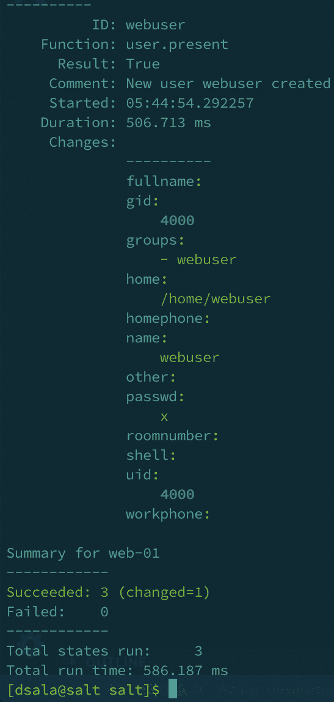

现在我们有了将运行网站的用户，是时候将网站文件复制到我们的网站服务器上了。为此，我们将创建另一个状态文件，使用 Git 下载网站文件并加载到 VM 中。

修改你的`top.sls`文件，并在同一个 web 服务器目录下添加另一个名为`gitfetch`的状态：

```
base:
   'web*':
     - webserver.nodejs
     - webserver.webuser
     - webserver.gitfetch
```

现在，继续使用`git.latest`函数创建`gitfetch.sls`文件，以从 Git 存储库下载代码并在每次下载存储库时安装`Node.js`依赖项：

```
node-app:
     git.latest:
       - name: https://github.com/dsalamancaMS/SaltChap.git
       - target: /home/webuser/app
       - user: webuser

dep-install:
     cmd.wait:
       - cwd: /home/webuser/app
       - runas: webuser
       - name: npm install
       - watch:
         - git: node-app
```

继续运行`state.apply`函数，以在两台 Web 服务器上下载应用程序。运行命令后，您应该能够看到类似于以下内容的输出：

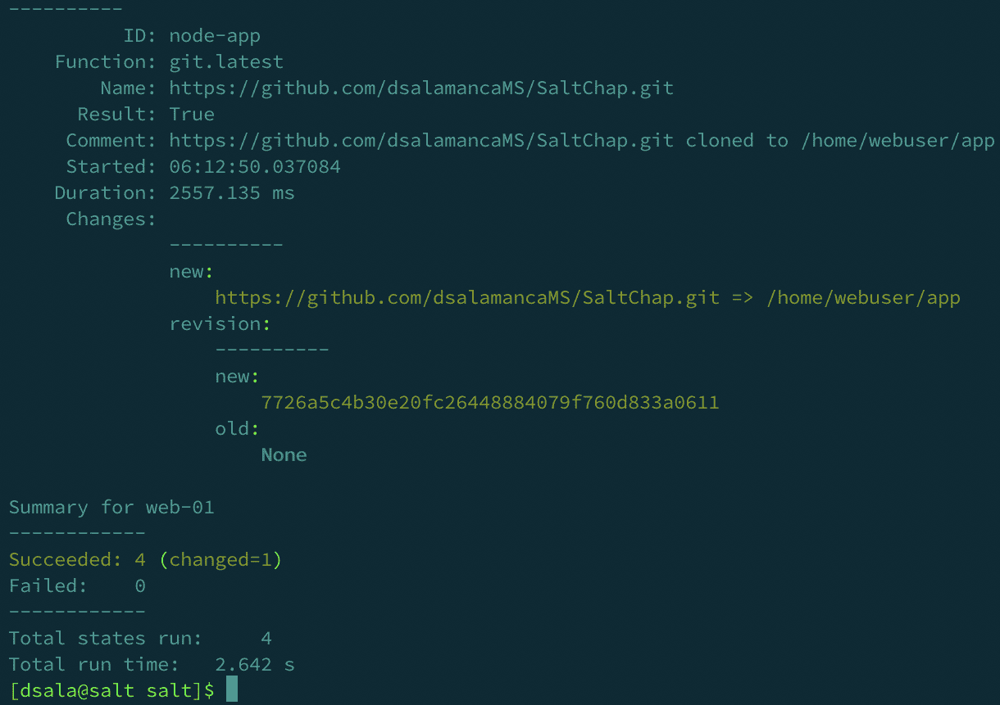

有了我们的 Web 服务器中的代码，我们几乎完成了我们的 Ubuntu minions 的配置。

现在我们需要将我们的 Node.JS 应用程序作为守护程序运行。

为此，我们将使用 Supervisor 开源项目：[`github.com/Supervisor/supervisor`](https://github.com/Supervisor/supervisor)。

现在，让我们配置 Salt，使`Supervisor`监视我们的 Node.JS Web 应用程序。编辑`top.sls`文件，添加以下行，就像我们以前做过的那样：

```
- webserver.suppkg
```

在创建`supervisor`状态文件之前，我们首先需要创建要推送到我们 minions 的`supervisor`配置文件。在 Web 服务器目录中创建一个名为`supervisor.conf`的文件，内容如下：

```
[program:node-app]
command=nodejs .
directory=/home/webuser/app
user=webuser
```

现在创建`suppkg.sls`状态文件，负责管理之前的配置文件，在 Web 服务器文件夹下：

```
supervisor:
  pkg.installed:
    - only_upgrade: False
  service.running:
    - watch:
       - file: /etc/supervisor/conf.d/node-app.conf

/etc/supervisor/conf.d/node-app.conf:
 file.managed:
  - source: salt://webserver/supervisor.conf
```

创建文件后，继续运行`salt 'web*' state.apply`命令以应用最新状态。

应用了最后一个状态后，我们的 Web 应用程序应该已经启动运行。您可以尝试通过`curl`命令访问它：

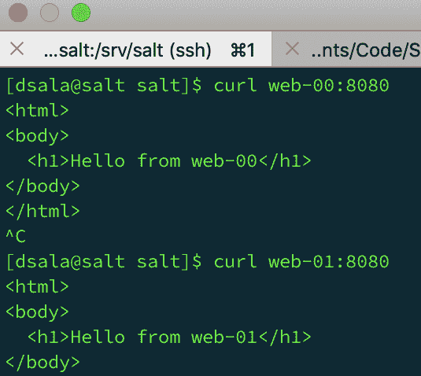

现在我们的 Web 服务器已经准备好了，我们将对它们进行标记。还记得上一章我们谈到的 grains 吗。这就是我们接下来要做的事情。

让我们继续为我们的`web-00`和`web-01`服务器打上适当的角色标签。

要做到这一点，为每台服务器运行以下命令：

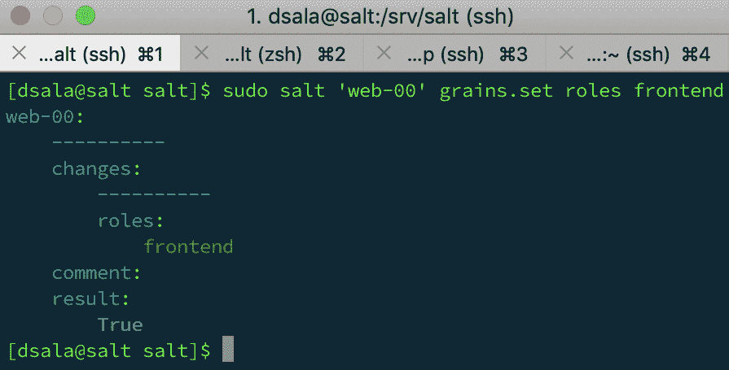

您可以通过运行以下`grep`来检查角色是否成功应用：

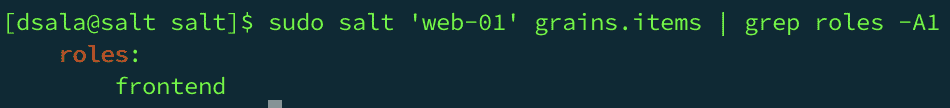

# 创建负载均衡公式

现在我们的两台 Web 服务器已经正确设置，我们可以配置我们的最后一个 minion。这个 minion 将运行 Nginx，以便在负载均衡器后面平衡和代理请求到我们的 Web 服务器。

让我们创建一个目录，我们将在其中存储我们的负载均衡器的所有状态：

```
[dsala@salt ~]$ sudo mkdir /srv/salt/nginxlb
```

创建目录后，让我们继续最后一次编辑我们的`top.sls`文件，以包括`负载均衡器`状态文件。`top.sls`文件应该如下所示：

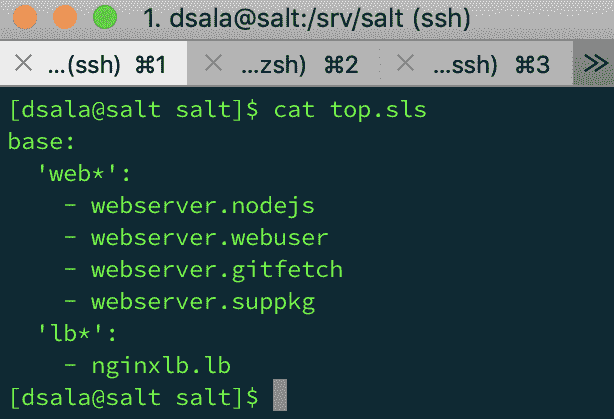

在创建我们的`负载均衡器`状态文件之前，我们将创建要推送到我们`负载均衡器`VM 的 Nginx 配置文件。创建一个名为`nginx.conf`的文件，内容如下：

```
events { }
http {
 upstream webapp {
   server web-00:8080;
   server web-01:8080;
 }
 server {
   listen 8080;
   location / {
     proxy_pass http://webapp;
   }
 }
}
```

现在，让我们继续创建我们的最终状态文件。在`/srv/salt/`的`nginxlb`目录下创建一个名为`lb.sls`的文件，内容如下：

```
epel-release:
 pkg.installed

nginx:
 pkg.installed:
 - only_upgrade: False
 service.running:
 - watch:
    - file: /etc/nginx/nginx.conf

/etc/nginx/nginx.conf:
 file.managed:
  - source: salt://nginxlb/nginx.conf
```

应用最终更改，您可以运行`state.apply`命令。

完成后，您可以继续测试负载均衡器，运行 cURL 到其公共 IP 地址：

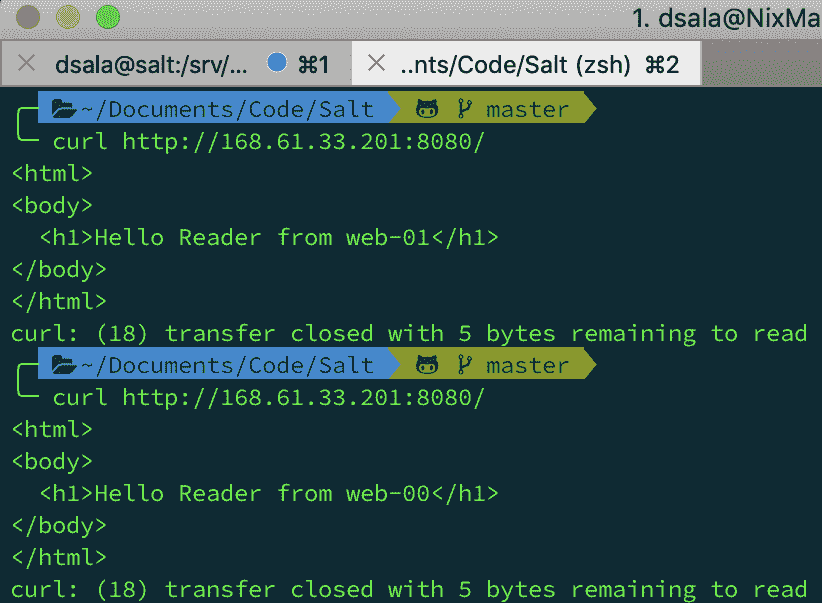

通过这个最终配置，我们已经完成了对 Don High 先生的概念验证。一个非常重要的事实要注意的是，这个例子还远远没有准备好投入生产；这只是一个例子，展示了 Salt Stack 的基本功能和可能性。

# 总结

在本章中，我们最终通过 IaC 部署了 Salt，与 Salt 进行了互动。我们使用 Terraform 设置了我们的初始环境，并且要开始使用 Terraform，我们只需从`terraform.io`下载二进制文件。可以通过`terraform version`命令检查 Terraform 的版本。安装了 Terraform 后，我们获取了连接到我们的 Azure 订阅的正确详细信息，使用 AZ CLI。

一旦 Terraform 能够连接到 Azure，我们就开始创建 IaC 声明文件，其中包含了在 Azure 中正确部署我们想要的资源的必要信息，以我们想要的方式。

通过 Terraform 部署完成后，我们开始安装 Salt。这可以通过操作系统的软件包管理器（`yum`和`apt`）或引导脚本的两种不同方式来完成。

在通过软件包管理器安装时，我们需要添加 Salt 存储库，因为它在基本存储库中不可用；我们通过从`saltstack`网站下载`rpm`来完成这一点。

为了安装 master，我们运行了`sudo yum install salt-master`，为了安装 minions，我们运行了`sudo yum install salt-minion -y`。对于 Ubuntu，过程类似，只是使用了`apt`软件包管理器。

在 Salt 完成安装后，我们启用了`systemctl`单元。一旦 Salt 运行起来，我们需要允许 minions 与 master 通信；这是通过 SSH 指纹完成的。

在这一点上，Salt 正在运行，minions 正在与 master 通信，所以我们开始创建 web 服务器公式，运行必要的定义来部署应用程序。

在下一章中，本书的最后一章，我们将介绍设计解决方案时的一些最佳实践。
