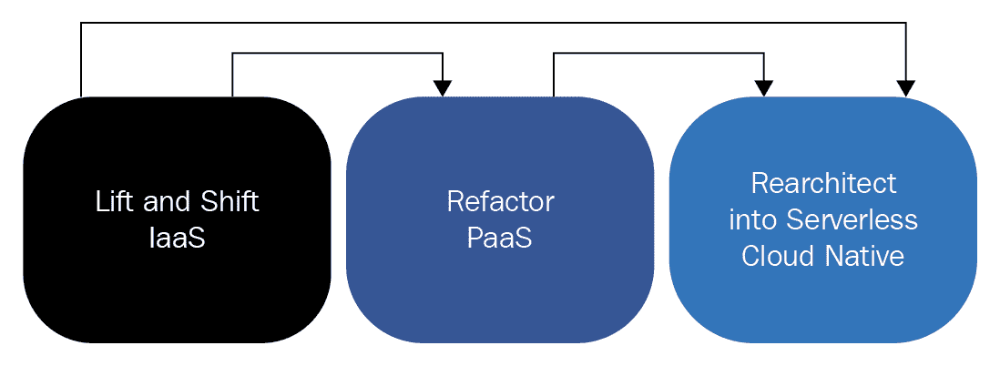
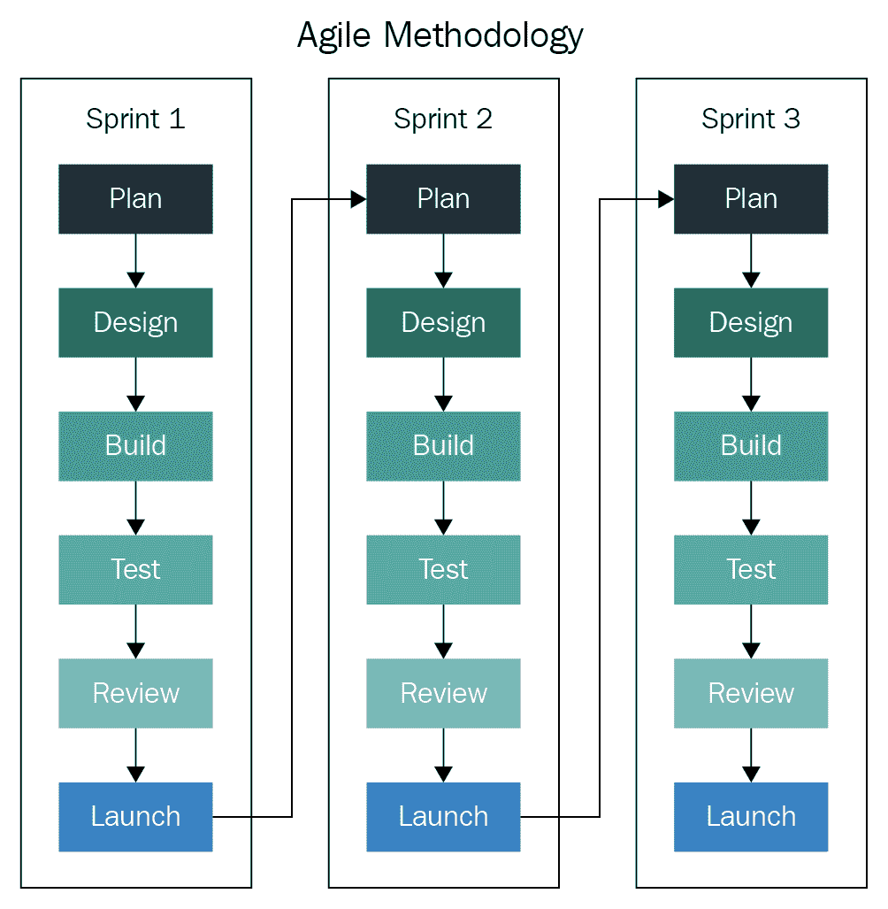
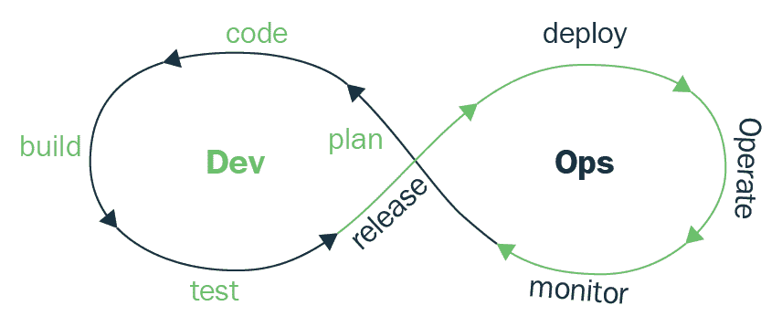

# 第十五章：设计最佳实践

总结这本书时，我们的最后一章将讨论你必须遵循的不同最佳实践，以设计一个具有弹性和防故障的解决方案。尽管这是本书的最后一章，但它将作为一个起点，帮助你考虑在迁移到云端时需要考虑哪些事项。

我们将涵盖以下主题的基础知识：

+   转移到云端

+   容器设计

+   持续集成流水线

+   持续部署流水线

+   自动化测试

我们将在本章中涵盖的主题和实践远非详尽，我们将进行一个宏观概述。有了这些基础知识，你可以开始加强你在每个领域的知识，为你的客户做出最终的设计决策。

# 根据场合设计

在之前的章节中，我们学到了针对非常具体的解决方案所需的一切。在这里，我们将讨论一般性的内容，你需要遵循或至少尝试遵循的基本规则或建议，以便你创建的每个设计。但不要被我接下来要说的所困惑；最佳实践本身并不存在。每个解决方案都将有其自己的特性、目标和独特的特点。始终努力满足你所处的情况和客户的业务需求。

然而，许多解决方案将不得不遵守某些行业标准，因为它们可能处理敏感信息。在这些类型的场景中，我们已经有了一套非常明确定义的规则和政策，我们的设计必须满足这些规则。这打破了我们所有设计都是不同的说法，但再次强调，这些是非常特定的行业的非常特定的场景。在处理敏感数据时，我们需要遵守的一些标准包括：

+   《健康保险可携带性和责任法案》（HIPAA）

+   《支付卡行业数据安全标准》（PCI-DSS）

+   《通用数据保护条例》（GDPR）

这些标准是固定的，无论是在本地还是国际上，并由各自的管理机构监管。但并非所有的设计模式或满足特定解决方案要求的方式都像这些那样清晰明了。

作为解决方案架构师，你将发现自己处于许多场景中，这将帮助你扩展你的作品集并将其应用于不同的解决方案。你创建的每个设计只有其最薄弱的环节才能够强大。在设计时，始终尝试看看你如何能够打破你的设计：

+   它在哪些地方存在故障点？

+   它在哪些地方存在瓶颈？

+   我的服务器能够承受负荷吗？

这些是你需要问自己的一些问题的几个例子。我们需要塑造我们的思维方式，并更经常地问自己“为什么？”为什么我们要以这种方式或那种方式做某事？质疑我们所做的每一个决定是至关重要的。

改变我们的思维方式是我们可以做的最好的事情，因为现在的技术发展速度比以往任何时候都要快。技术可能会随着时间的推移而发生变化，而我们今天实施的东西明天可能完全无法使用，但我们的思维方式将使我们能够适应并从所有必要的角度进行分析，以便我们取得成功。

每种情况和环境都是不同的，但在撰写本文时，我们可以说你将会处理两种主要类型的环境：

+   本地/裸金属环境

+   云环境

在本章中，我们将讨论你在这些环境中工作时需要处理的基本考虑因素。

# 本地环境

Linux 是适应性强的；它几乎可以在任何地方运行。如果未来几年我在割草机上发现 Linux 内核，我也不会感到惊讶。在 IT 变得越来越重要的当今世界，随着物联网的兴起，Linux 的存在前所未有地增加。因此，作为 Linux 架构师，我们需要准备几乎可以应对任何情况的设计。

在本地环境中，我们很可能面临两种情况：

+   裸金属服务器

+   **虚拟机**（**VMs**）

两者将非常不同，因为我们将有各种选项来使我们的解决方案更具弹性。

# 裸金属服务器

裸金属服务器非常适合需要大量资源运行的工作负载。小型工作负载不适合放在单个服务器上；例如，一个不会提供大量用户请求的小型网络应用在 64 核 1TB 内存的物理服务器上没有位置。这是对资源的浪费和糟糕的经济决策。大部分时间，这台服务器的 90%将是完全空闲的，浪费了宝贵的资源，可以用于其他用途。这些类型的应用应该放入虚拟机或完全容器化。

在将基础架构移至裸金属上或在裸金属上创建基础架构之前，我们应该了解所构建基础架构的应用程序的资源需求。

需要大量资源进行数据处理和高性能计算的系统将充分利用可用资源。以下解决方案是裸金属服务器上运行的示例：

+   Type 1/ Type 2 虚拟化监控器（**基于内核的虚拟机**（**KVM**），**Linux 容器**（**LXC**），XEN）

+   Linux 用于 SAP HANA

+   Apache Hadoop

+   Linux 用于 Oracle DB

+   大规模的 MongoDB 部署用于内存缓存

+   **高性能计算**（**HPC**）

内部应用程序规定其内存需求超过数百 GB 或数百 CPU 核心的所有应用程序都更适合在裸金属服务器上运行，因为 RAM/CPU 不会被用于不属于您为其设计服务器的工作负载的任何其他开销过程。

# 虚拟机

虚拟化监控器在裸金属服务器上也更好；因为它们将在多个托管的虚拟机之间共享资源，所以需要大量资源。需要注意的一点是，监控器的一些资源将被监控器本身消耗，这会在硬件中断和其他操作上产生资源开销。

有时，在构建物理服务器时，我们会非常关注应用程序所需的 CPU 核心。对于虚拟化监控器，CPU 时间优先分配给虚拟机，或者按照可用核心的先到先服务的原则分配给虚拟机；根据配置方式，CPU 资源在运行的虚拟机之间共享。相反，RAM 内存不会在虚拟机之间共享，我们需要在实施资源平衡时小心谨慎。部署具有必要 CPU 核心但具有足够 RAM 的服务器，可以满足我们可能面临的任何争用期的需求是需要考虑的。在单个主机上运行数百个虚拟机时，我们可能会很快耗尽内存并开始交换，这是我们要避免的情况。

在资源配置方面，我们还需要考虑的是，如果我们运行一组虚拟化监控器，可能会出现集群节点需要进行维护或由于意外故障而宕机的情况。正是因为这样的情况，我们应该始终留出一些资源，以便能够处理由于上述原因可能发生故障转移的虚拟机的额外意外工作负载。

在处理虚拟化程序时，你必须小心，因为你不会只在一个物理主机上运行单个工作负载。虚拟机的数量和虚拟机本身将始终变化，除非你配置了某种亲和规则。诸如你的网络接口卡支持多少网络带宽之类的事情至关重要。根据主机虚拟化程序的资源量，数十甚至数百个虚拟机将共享相同的网络硬件来执行它们的 I/O。例如，这就是决定是否需要 10GbE 网络卡而不是 1GbE 网络卡的地方。

在选择物理主机的网络接口时，还有一件事需要考虑，那就是你将使用的存储类型；例如，如果你正在考虑使用**网络文件系统**（NFS）解决方案或 iSCSI 解决方案，你必须记住，很多时候它们将共享与常规网络流量相同的接口。如果你知道你正在设计的基础架构将有非常拥挤的网络并且需要良好的存储性能，最好选择另一种方法，比如选择一个拥有专门用于存储 I/O 的独立硬件的光纤通道存储区域网络。

网络分割对于虚拟化环境、管理流量、应用程序网络流量和存储网络流量至关重要，这些流量应始终进行分割。你可以通过多种方式实现这一点，比如为每个目的分配专用的网络接口卡，或者通过 VLAN 标记。每个虚拟化程序都有自己的一套工具来实现分割，但其背后的思想是相同的。

# 云环境

与**云环境**合作为设计 IT 解决方案提供了大量选择。无论云服务提供商如何，你都可以从这些服务中进行选择：

+   **基础设施即服务**（IaaS）

+   **平台即服务**（PaaS）

+   **软件即服务**（SaaS）

你的选择将取决于你的客户在云架构模型方面的成熟度。但在我们甚至能谈论云环境的设计模式或最佳实践之前，我们需要讨论如何将你的本地环境迁移到云端，或者你如何开始将云作为客户基础架构的一部分。

# 通往云的旅程

这些迁移策略源自 Gartner 的研究。Gartner 还提出了第五种策略，称为**用 SaaS 替代**。

本节讨论了以下研究论文：

*通过回答五个关键问题制定有效的云计算策略，*Gartner，David W Cearley，2015 年 11 月，更新于 2017 年 6 月 23 日。

当迁移到云端时，我们不必把云看作目的地，而是看作一个旅程。尽管听起来有点俗套，但确实如此。每个客户通往云的道路都会不同；有些道路会很容易，而其他一些则会非常艰难。这将取决于是什么促使客户做出迁移决定，以及他们决定如何迁移他们的基础架构。一些客户可能决定不仅将基础架构迁移到 IaaS 模型，还要利用这次迁移，将一些工作负载现代化为 PaaS 甚至无服务器模型。无论选择哪种道路，每条道路都需要不同程度的准备工作。典型的过渡可能如下所示：

每一步都需要对应用程序或基础架构进行更大程度的变更。

我们可以将上述步骤视为一个更大旅程的一部分，该旅程始于对要迁移的资产的评估。

让我们更详细地探讨迁移的每一步。

# 评估

在这一步中，我们将评估我们想要迁移的工作负载。在确定迁移候选项后，我们应该始终对我们的虚拟机或物理服务器进行清点，并计算维护基础设施的**总拥有成本**（**TCO**）。硬件成本、支持维护合同、电费，甚至空间租金等都会在这里起作用。这将帮助我们了解在迁移到云上时我们将节省多少成本。这些数据对于说服管理层和任何可能对将基础设施迁移到云服务提供商的成本优势产生疑虑的 C 级决策者至关重要。

开始迁移的理想情况是寻找那些不需要整个基础架构迁移就可以投入生产的较小的应用程序。具有少量依赖关系的应用程序是开始评估的完美选择。需要考虑的依赖关系包括需要一起迁移的服务器、应用程序的网络需求（如端口和 IP 操作范围）。以下问题将帮助我们为成功迁移做好准备：

+   我使用的 Linux 发行版是否得到我要迁移到的云服务提供商的认可？

+   我是否正在运行云服务提供商支持的内核版本？

+   我是否需要安装任何额外的内核模块？

+   我的云服务提供商是否需要在我的操作系统上运行任何类型的代理？

有了这些问题的答案，我们可以开始执行实际的迁移。

# 迁移

在将基础架构迁移到云上时，有四种基本的方法：

+   **提取和迁移**

+   **重构**

+   **重新架构**

+   **重建**

这些方法中的每一种都将利用云的不同服务和不同功能。选择使用哪种方法将取决于许多因素，例如您需要多快迁移、您愿意为迁移付出多少努力，以及您是否希望在迁移过程中利用迁移并使您的工作负载现代化。

# 提取和迁移

这种方法实际上是重新托管，因为您将把您的本地物理服务器或虚拟机迁移到您云服务提供商的虚拟机中。这种方法是所有方法中最简单和最快的，因为您将按照本地环境将您的环境和应用程序迁移过去。对于这种方法，不需要进行代码更改或重新架构您的应用程序。在这里，您只需要利用您选择的云服务提供商的 IaaS 优势。

如果需要按需增加存储或计算资源的灵活性，以及无需硬件维护和管理，都是这种模式中可以利用的优势。

# 重构

通过**重构**，您的应用程序需要最少或不需要任何代码更改。通过这种方法，我们可以利用 IaaS 和 PaaS 功能的混合。将三层 Web 应用程序迁移到托管中间件和托管数据库是这种迁移模型的完美示例。

使用托管数据库或托管中间件，我们无需担心诸如操作系统管理、数据库引擎安装和管理、框架更新、安全补丁，甚至为负载平衡配置额外实例等问题，因为这一切都已经为我们处理好了。我们只需要上传我们的代码并选择我们需要运行的框架。我们仍然可以运行单片应用程序，只需要进行很少的代码更改；这种方法的主要目的是通过摆脱管理和配置等事务来进行迁移，从而增加我们工作负载的灵活性。

# 重新架构

**重新架构**在迁移时确实涉及对我们的应用程序进行重大更改，但这个阶段是我们现代化业务的阶段。

我们可以通过利用容器和 Kubernetes 等技术，将一个庞大的应用程序拆分成微服务。我们将使我们的应用程序更具可移植性、可扩展性、灵活性，并准备通过 DevOps 等方法交付。有了微服务、容器和 DevOps 带来的自动化，你不仅可以更快地将应用程序交付到生产环境，还可以更有效地利用应用程序运行的计算资源。

重新架构可能并不容易，也不是将工作负载迁移到云的最快方式，但从长远来看，它将为您带来实质性的优势和成本节约。

# 重建

重新架构需要进行重大的代码更改，但这种迁移模型的最终目标是充分利用迁移到云的机会，并创建所谓的**云原生应用**。

云原生应用是利用 PaaS 和 SaaS 等云服务的应用程序，这些应用程序旨在在云上运行。其中一些甚至可以完全在无服务器计算上运行。无服务器计算是直接在云服务上运行代码，或者使用云提供商已经提供的 API 或服务。将几个相互消耗并共同努力实现共同目标或结果的服务组合在一起，这就是我们所说的云原生应用。

迁移到云的整个理念是为了节省：在经济上节省，在维护上节省，在通过迁移到更具弹性和韧性的平台上节省恢复时间。但我们并不总是能自动地充分利用所有这些好处。迁移后，我们仍然需要做一些工作，以使我们的新云工作负载完全优化。

# 优化

也许如果您通过搬迁和转移来迁移您的基础设施，那么这个过程可能会很容易，而且在那个虚拟机上运行的任何工作负载可能已经在生产环境中，几乎没有任何变化。问题在于，您的虚拟机仍然与在本地环境中一样大。您仍然让虚拟机只使用其实际总计算资源的一小部分。在云中，这是在浪费金钱，因为您支付虚拟机运行的时间，但您支付这些时间的价格是基于该虚拟机的总资源量，无论您是否使用了其中的 100%。

这个阶段是我们实际开始进行适当的大小调整和优化我们的基础设施，以实际使用我们真正需要的资源，以充分利用云的弹性。所有云服务提供商都有工具和服务，您可以使用这些工具来监视虚拟机和其他服务的资源消耗。有了这些工具，我们可以轻松地识别和解决我们的大小需求，以一种成本有效的方式。

云的弹性不仅允许我们根据需求调整资源，而且无需等待 IT 运维团队在我们的虚拟化主机或专用物理服务器资源不足时分配或购买新硬件。

我们还可以根据我们设定的资源阈值按需为我们正在使用的服务提供额外的虚拟机或实例。对这些资源的请求会自动地负载均衡到我们的额外实例，这样我们只需要在资源争用期间支付额外的资源。

优化并不仅仅是为了获得更好的价格而减少虚拟机的大小。我们可以优化的其他领域包括管理和上市时间。采用 PaaS 和 SaaS 等方法可以帮助我们实现这一点。

一旦我们的应用程序在云上的虚拟机上运行，我们可以轻松地开始过渡到这些更受管理的服务。受管理的服务帮助我们忘记操作系统的维护或中间件配置，我们的开发人员可以花更多时间实际开发和部署应用程序，而不是与运维团队争论库需要更新以使最新版本的生产应用程序运行，这最终使我们的上市时间更快，管理或操作系统支持合同的花费更少。

更快的上市时间，更少的管理，以及运维和开发之间更少的冲突，这就是 DevOps 所关注的。我们在迁移阶段的几个阶段中提到了 DevOps，但让我们更深入地了解一下 DevOps 是什么，以及它试图在更接近的层面上实现什么。

# DevOps

综合而言，DevOps 是开发和运维的结合。它是开发人员和系统管理员之间的联合和协作，使得 DevOps 成为可能。请注意我们说的是协作；重要的是要理解协作是 DevOps 的核心。与 Scrum 框架等有权威的方法不同，DevOps 没有标准，但它遵循一套实践，这些实践源自这两个团队之间的文化交流，以实现更短的开发周期和更频繁的部署，采用敏捷方法。

你经常会看到 DevOps 这个术语被错误使用，例如：

+   **职位（DevOps 工程师）**：DevOps 的性质是跨运维和开发团队的协作，因此 DevOps 不是一个职位或一个专门从事 DevOps 的团队。

+   **一套工具**：用于帮助实现 DevOps 背后目标的工具也经常被混淆。Kubernetes、Docker 和 Jenkins 经常被误解为 DevOps，但它们只是达到目的的手段。

+   **标准**：正如我们之前提到的，DevOps 运动没有任何管理其实践和流程的权威；实施和遵循一套基本实践，并根据自身业务需求进行调整的是人们。

我们现在知道 DevOps 是一种文化运动，这给我们带来了更频繁的开发周期、频率和运维与开发之间的整合。现在，让我们了解采用 DevOps 的好处背后的问题。

# 整体瀑布

传统的软件应用程序开发方法称为**瀑布**。瀑布是一种线性顺序的软件开发方式；基本上，你只能朝一个方向前进。它是从制造业和建筑业中被软件工程采用的。瀑布模型的步骤如下：

1.  需求

1.  设计

1.  实施

1.  验证

1.  维护

主要问题在于，由于这种方法是为制造业和建筑业而发明的，它根本不具备敏捷性。在这些行业中，你面临的每一个变化或问题都可能让你付出很大的代价，因此在进入下一个阶段之前，必须考虑所有的预防措施。因此，每个阶段都需要相当长的时间，因此上市时间大大缩短。

在这种方法中，在甚至开始创建应用程序之前，开发人员必须设计所有的特性，并且在编写一行代码之前就花费了大量时间进行讨论和规划。这种情况对这种方法的起源来说是有意义的，因为如果你正在建造一座摩天大楼或者一座住宅，你希望在开始建造之前就知道它将如何设计和结构。在软件开发中，你获得反馈越快，就能越快地适应并进行必要的更改以满足客户的需求。在瀑布模型中，直到产品几乎准备好并且更改更难实施时才提供反馈。

瀑布模型本质上是庞大而笨重的，即使我们有不同的团队在产品的不同特性上工作，最终所有这些特性都会被编译在一起，以交付一个单一的大版本。对于这种类型的单体应用，如果有质量保证（QA）团队，他们必须测试该版本的所有特性。这需要很长时间，甚至会进一步增加产品上市的时间。最糟糕的情况是需要进行更改或者一个错误通过了 QA 进入生产。回滚将意味着整个版本的发布，而不仅仅是带有错误的版本，这在进行大版本发布时会带来很大的风险。

# 敏捷解决庞大的问题

瀑布模型让我们太晚才意识到我们认为会起作用的事情在安装阶段或者甚至在生产阶段并没有按计划进行。进行这些更改涉及很多步骤，而且调整速度缓慢而痛苦。

软件发展迅速，客户的需求可能会在设计过程中发生变化。这就是为什么我们需要比瀑布模型更敏捷和灵活的方法。我们获得反馈越快，就能越快地适应并交付客户的确切期望。

这正是敏捷方法的用途。敏捷旨在通过多次发布软件，每次都经过一系列测试和反馈，以便更快地获得并以更敏捷的方式进行更改和调整。

敏捷是一个改变游戏规则的方法，但它在运维和开发之间产生了冲突。

部署更频繁可能会变得不规范，并且每次都会有所不同，如果不同的工程师执行部署。比如说你在晚上部署，第二天早上负责部署的人和上次部署的工程师可能会有完全不同的部署方式。这种情况会产生差异，并可能导致问题。例如，如果发生了什么事情需要回滚，负责回滚的人可能不知道部署时采取的步骤，以便回滚更改。

这些发布可能会不可预测地影响系统的可用性。运维工程师的绩效评估是他们管理的系统的稳定性，他们有兴趣保持系统的稳定。将不可预测的更改部署到生产环境是他们想要避免的。另一方面，开发人员的绩效评估是他们能够多快地将新的更改、功能和发布投入生产。你可以看到这两个团队有完全相反的目标，他们几乎必须互相斗争来实现这些目标。

团队之间不同的目标使每个团队都处于孤立状态。这会产生信息孤岛，并把问题或应用程序抛到另一个团队那里。这会导致非协作的工作环境，每个人都互相指责，事情进展得更慢，而不是解决问题。

# 持续的 CI/CD 文化

到目前为止，我觉得你已经注意到我们还没有谈论任何使 DevOps 成为可能的工具。这是因为工具不会解决所有这些类型的问题。它们将帮助您和您的客户强化 DevOps 文化，但并不是使 DevOps 成为可能的原因。

在我们交付产品之前进行标准化和测试对于敏捷和 DevOps 至关重要，工具将帮助我们实现这两个目标。让我们来看看敏捷工作流程和 DevOps 工作流程：

以下是敏捷工作流程的概述：

以下是与 DevOps 的比较：

很明显，它们两者是相辅相成的，它们彼此重叠，因为它们追求相同的目标。DevOps 有额外的步骤，比如操作和监控，这些步骤发生在代码部署之后。这些步骤非常直观；监控包括监视我们的应用在生产环境中的行为，检查它是否存在任何错误，或者它是否正在使用分配给它的所有资源。操作硬件、虚拟机或 PaaS 的部署位置。

**持续部署**（CD）和**持续集成**（CI）的理念是为了给我们带来标准化和确保变更和发布尽快进入生产并且失败最少的手段。如果发生故障，我们也可以快速轻松地回滚。CI/CD 的整个目的是自动化手动流程，许多公司仍然手动编译发布，并且通过电子邮件发送二进制文件和部署代码的说明给运维人员。为了实现 CI/CD，我们有工具可以帮助我们自动化整个构建、测试、部署和发布周期。

典型的 CI/CD 流水线是由对 Git 存储库的提交触发的，然后触发自动化构建过程，通常生成一个构件或一个发布，然后触发应用程序的自动化测试和自动化部署。

让我们来看看一些不同的开源工具，对每个工具进行简要解释，并说明它属于 DevOps 周期的哪个阶段。

这还远远不是一个详尽的清单，解释只是它们用途的简要总结：

+   **代码**：

+   **Git**：一个版本控制系统，允许开发人员拥有他们的代码分布式存储库，并跟踪开发周期中的变更。

+   **GitHub、GitLab、Bitbucket**：这三个都是 Git 类型的存储库而不是工具。然而，它们值得一提，因为它们是行业中最常用的公共和私有 Git 存储库。

+   **Apache 子版本**（SVN）：这是另一个版本控制系统。尽管自从 Git 发布以来它不再像以前那样受欢迎，但它值得一提，因为您可能会在传统环境中遇到它。

+   **构建**：

+   **Docker**：Docker，正如我们在第十四章中讨论的那样，*Getting Your Hands Salty*，是一个工具，您可以使用它来构建您的容器镜像，而不受应用程序使用的语言的限制。Docker 在底层使用**Buildkit**，它也可以作为一个独立产品用于构建 Docker 镜像。

+   **Apache Ant**：这个工具是第一个取代为 Java 应用程序制作的著名 Unix 构建二进制文件的工具。它使用`xml`来定义构建的步骤。这个工具主要用于 Java 应用程序。

+   **Apache Maven**：Apache Maven 也是另一个 Java 构建工具，但它解决了 Apache Ant 缺乏的依赖管理等问题。

+   **Gradle**：Gradle 是基于 Apache Ant 和 Apache Maven 构建的，但 Gradle 使用自己基于 Groovy 的特定语言来定义所需的步骤。Gradle 是最模块化的，几乎所有功能都是通过插件添加的。

+   **Grunt**：这是 JavaScript 的 Ant 或 Maven 等效工具；它自动化并运行任务，如 linting、单元测试、最小化和编译。Grunt 高度模块化，因为有成千上万的插件可用。

+   **测试**：

+   **Selenium**：这主要是一个 Web 应用程序测试工具，可以运行在大多数现代 Web 浏览器上。使用 Selenium，您不一定需要了解测试编程语言，因为它提供了一个 IDE 和使用几种最流行的编程语言的选项。

+   **Apache JMeter**：这基本上是一个负载性能工具，它在服务器上生成大量负载，以测试静态和动态内容，以便您可以分析其在不同负载类型下的性能。

+   **Appium**：另一方面，Appium 不仅可以测试 Web 应用程序，还可以对移动和桌面应用程序进行测试。

+   **发布、部署、管理、编排、操作**：

+   **Jenkins**：这可能是 DevOps 文化中使用最广泛的工具。Jenkins 是一个自动化服务器，通过调用构建和发布过程的自动化触发器，以及在管道中配置的任何自动化测试，使所有步骤都成为可能。

+   **Ansible**：这主要是一个配置管理工具，但它也可以通过其模块化帮助我们发布我们的应用程序，并提供一种便捷的方式来开发您自己的 playbooks 以运行在一组服务器上。

+   **Puppet**：这是另一个配置管理工具，它帮助我们维护配置并管理环境服务器上的软件包补丁安装。

+   **Helm**：将 Helm 视为 Kubernetes 的`yum`或`apt`：它本身无法自动化任何部署过程，但借助诸如 Jenkins 之类的工具，您可以使用它将自定义图表部署到 Kubernetes，并在需要回滚时保留发布历史。

+   **Monitor**：

+   **Nagios**：这是经典的监控集中工具，监控从系统性能到服务状态等各种内容。

+   **Prometheus**：这是云原生计算基金会旗下的一个项目。它允许我们创建自己的指标和警报。

+   **Fluentbit**：这允许您收集多个日志和/或数据，并将其发送到多个目的地以进行日志收集或处理。

# 总结

作为最后一章，我们总结了在设计解决方案时需要考虑的一些因素。在本章中，我们介绍了在处理不同场景时应该牢记的事项。

了解我们将在哪里以及如何部署我们的解决方案有助于我们了解可能存在的要求类型；例如，某些行业将有无法忽视的硬性要求，如 HIPAA、PCI 和 GDPR。

然后，我们谈到了部署本地解决方案以及不同的工作负载对裸金属的更好适用性，以及在实施虚拟机时需要考虑的因素。

我们提到了如何转移到云端并不像点击一个门户网站然后等待那样简单，而是一个旅程，因为它允许根据云端提供的众多选项对工作负载进行现代化。

此外，我们提到了迁移现有工作负载的不同方法，如提升和转移、重构、重新架构和重建。

最后，我们描述了 DevOps 如何通过统一开发和运营方面来帮助塑造行业，以及这如何与 CI/CD 改变了软件部署和使用方式相关联。

# 问题

1.  HIPAA 是什么？

1.  哪些工作负载更适合在裸金属上运行？

1.  虚拟化监视器应该在裸金属上运行吗？

1.  虚拟机共享资源吗？

1.  什么是网络分割？

1.  什么是提升和转移？

1.  什么是重构？

1.  什么是重新架构？

# 进一步阅读

**大型计算机程序的生产**：[`sunset.usc.edu/csse/TECHRPTS/1983/usccse83-501/usccse83-501.pdf`](http://sunset.usc.edu/csse/TECHRPTS/1983/usccse83-501/usccse83-501.pdf)

管理大型软件系统的开发：[`www-scf.usc.edu/~csci201/lectures/Lecture11/royce1970.pdf`](http://www-scf.usc.edu/~csci201/lectures/Lecture11/royce1970.pdf)

Azure 迁移中心：[`azure.microsoft.com/en-gb/migration/get-started/`](https://azure.microsoft.com/en-gb/migration/get-started/)

将数据中心迁移到云 IaaS 的 3 条路径：[`www.gartner.com/smarterwithgartner/3-journeys-for-migrating-a-data-center-to-cloud-iaas/`](https://www.gartner.com/smarterwithgartner/3-journeys-for-migrating-a-data-center-to-cloud-iaas/)
