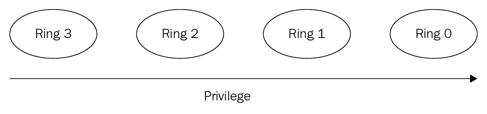
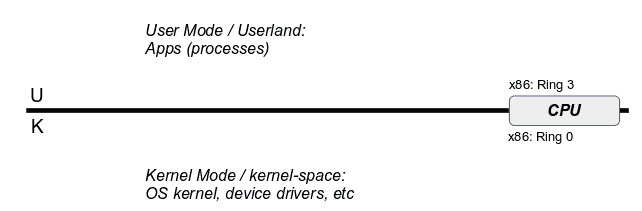
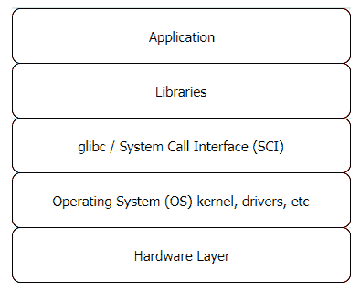
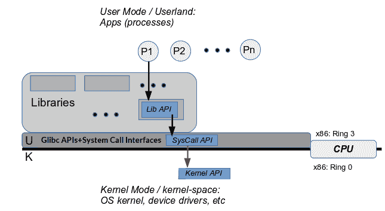
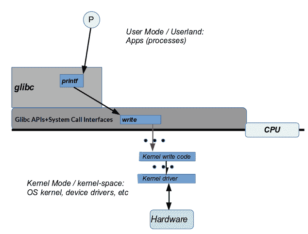
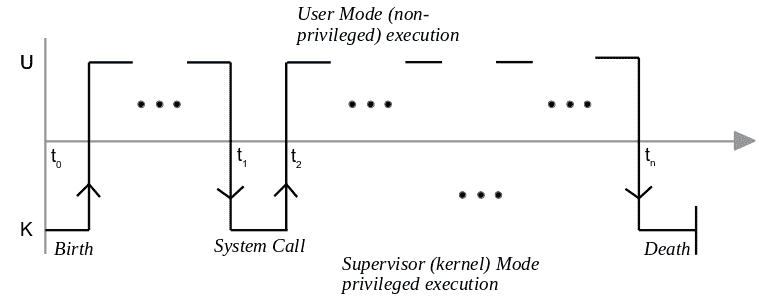

# 第一章：Linux 系统架构

本章介绍了 Linux 生态系统的系统架构。首先介绍了优雅的 Unix 哲学和设计基础，然后深入探讨了 Linux 系统架构的细节。将涵盖 ABI 的重要性、CPU 特权级别以及现代操作系统如何利用它们，以及 Linux 系统架构的分层和 Linux 是一个单体架构。还将介绍系统调用 API 的（简化的）流程以及内核代码执行上下文等关键点。

在本章中，读者将学习以下主题：

+   Unix 哲学简介

+   架构初步

+   Linux 架构层

+   Linux——单体操作系统

+   内核执行上下文

在这个过程中，我们将使用简单的例子来阐明关键的哲学和架构观点。

# 技术要求

需要一台现代台式电脑或笔记本电脑；Ubuntu 桌面版指定以下为安装和使用该发行版的推荐系统要求：

+   2GHz 双核处理器或更好

+   RAM

+   **在物理主机上运行**：2GB 或更多系统内存

+   **作为客户操作系统运行**：主机系统应至少具有 4GB RAM（内存越大，体验越好，更加流畅）

+   25GB 的可用硬盘空间

+   安装介质需要 DVD 驱动器或 USB 端口

+   互联网访问肯定是有帮助的

我们建议读者使用以下 Linux 发行版（可以安装为 Windows 或 Linux 主机系统的客户操作系统，如前所述）：

+   Ubuntu 18.04 LTS 桌面版（Ubuntu 16.04 LTS 桌面版也是一个不错的选择，因为它也有长期支持，几乎所有功能都应该可以使用）

+   Ubuntu 桌面版下载链接：[`www.ubuntu.com/download/desktop`](https://www.ubuntu.com/download/desktop)

+   Fedora 27（工作站）

+   下载链接：[`getfedora.org/en_GB/workstation/download/`](https://getfedora.org/en_GB/workstation/download/)

请注意，这些发行版在默认情况下是开源软件和非专有软件，可以免费使用。

有时书中并未包含完整的代码片段。因此，GitHub 链接可用于参考代码：[`github.com/PacktPublishing/Hands-on-System-Programming-with-Linux`](https://github.com/PacktPublishing/Hands-on-System-Programming-with-Linux)。

此外，在*进一步阅读*部分，请参考上述 GitHub 链接。

# Linux 和 Unix 操作系统

摩尔定律著名地指出，集成电路中的晶体管数量将每两年（大约）翻一番（并附带成本将以几乎相同的速度减半）。这个定律在很多年内保持相当准确，这是清楚地表明了人们对电子和信息技术行业的创新和技术范式转变的速度的认识和庆祝；这里创新和技术范式转变的速度是无与伦比的。以至于现在，每年，甚至在某些情况下每几个月，新的创新和技术出现，挑战并最终淘汰旧的技术，几乎没有仪式感。

在这个快速变化的背景下，有一个引人入胜的反常现象：一个操作系统的基本设计、哲学和架构在近五十年来几乎没有发生任何变化。是的，我们指的是古老的 Unix 操作系统。

Unix 起源于 AT&T 贝尔实验室的一个注定失败的项目（Multics），大约在 1969 年。Unix 曾一度风靡全球。至少在一段时间内是如此。

但是，你可能会说，这是一本关于 Linux 的书；为什么要提供这么多关于 Unix 的信息？简单地说，因为在本质上，Linux 是古老 Unix 操作系统的最新化身。Linux 是一种类 Unix 操作系统（还有其他几种）。出于法律需要，代码是独特的；然而，Linux 的设计、哲学和架构与 Unix 的几乎完全相同。

# Unix 哲学简介

要理解任何人（或任何事物），必须努力首先理解他们（或它的）基本哲学；要开始理解 Linux 就是开始理解 Unix 哲学。在这里，我们不打算深入到每一个细节；相反，我们的目标是对 Unix 哲学的基本要点有一个整体的理解。此外，当我们使用术语 Unix 时，我们也非常指的是 Linux！

软件（特别是工具）在 Unix 上的设计、构建和维护方式慢慢演变成了一种被称为 Unix 设计哲学的模式。在其核心，这里是 Unix 哲学、设计和架构的支柱：

+   一切都是一个进程；如果不是进程，就是一个文件

+   一个工具做一件事

+   三个标准 I/O 通道

+   无缝地组合工具

+   首选纯文本

+   命令行界面，而不是图形界面

+   模块化，设计为供他人重新利用

+   提供机制，而不是策略

让我们更仔细地检查这些支柱，好吗？

# 一切都是一个进程 - 如果不是进程，就是一个文件

进程是正在执行的程序的一个实例。文件是文件系统上的一个对象；除了具有纯文本或二进制内容的常规文件之外；它还可以是一个目录、一个符号链接、一个设备特殊文件、一个命名管道或者一个（Unix 域）套接字。

Unix 设计哲学将外围设备（如键盘、显示器、鼠标、传感器和触摸屏）抽象为文件 - 它称之为设备文件。通过这样做，Unix 允许应用程序员方便地忽略细节，只是将（外围）设备视为普通的磁盘文件。

内核提供了一个处理这种抽象的层 - 它被称为**虚拟文件系统开关**（**VFS**）。因此，有了这个层，应用程序开发人员可以打开设备文件并对其进行 I/O（读取和写入），所有这些都使用提供的通常 API 接口（放心，这些 API 将在后续章节中介绍）。

实际上，每个进程在创建时都会继承三个文件：

+   **标准输入**（`stdin`**：fd** **0**）：默认情况下是键盘设备

+   **标准输出**（`stdout`**：fd 1**）：默认情况下是监视器（或终端）设备

+   **标准错误**（`stderr`**：fd 2**）：默认情况下是监视器（或终端）设备

**fd**是**文件描述符**的常见缩写，特别是在代码中；它是一个指向所讨论的打开文件的整数值。

另外，注意我们提到默认情况下是某个设备 - 这意味着默认值可以被更改。事实上，这是设计的一个关键部分：改变标准输入、输出或错误通道被称为**重定向**，通过使用熟悉的<、>和 2> shell 操作符，这些文件通道被重定向到其他文件或设备。

在 Unix 上，存在一类被称为过滤器的程序。

过滤器是一个从其标准输入读取的程序，可能修改输入，并将过滤后的结果写入其标准输出。

Unix 上的过滤器是非常常见的实用工具，比如`cat`、`wc`、`sort`、`grep`、`perl`、`head`和`tail`。

过滤器允许 Unix 轻松地规避设计和代码复杂性。如何做到的？

让我们以`sort`过滤器作为一个快速的例子。好的，我们需要一些数据来排序。假设我们运行以下命令：

```
$ cat fruit.txt
orange
banana
apple
pear
grape
pineapple
lemon
cherry
papaya
mango
$
```

现在我们考虑使用`sort`的四种情况；根据我们传递的参数，我们实际上正在执行显式或隐式的输入、输出和/或错误重定向！

**场景 1**：对文件进行字母排序（一个参数，输入隐式重定向到文件）：

```
$ sort fruit.txt
 apple
 banana
 cherry
 grape
 lemon
 mango
 orange
 papaya
 pear
 pineapple
$
```

好的！

不过，等一下。如果`sort`是一个过滤器（它是），它应该从其`stdin`（键盘）读取，并将其写入`stdout`（终端）。它确实是写入终端设备，但它是从一个文件`fruit.txt`中读取的。

这是故意的；如果提供了参数，sort 程序会将其视为标准输入，这一点显而易见。

另外，注意`sort fruit.txt`和`sort < fruit.txt`是相同的。

**情景 2**：按字母顺序对任何给定的输入进行排序（无参数，输入和输出从 stdin/stdout 进行）：

```
$ sort 
mango 
apple
pear
^D 
apple
mango
pear
$
```

一旦输入`sort`并按下*Enter*键，排序过程就开始运行并等待。为什么？它在等待你，用户，输入。为什么？回想一下，默认情况下，每个进程都从标准输入或 stdin - 键盘设备读取输入！所以，我们输入一些水果名称。当我们完成时，按下*Ctrl* + *D*。这是表示**文件结束**（**EOF**）的默认字符序列，或者在这种情况下，表示输入结束。哇！输入已经排序并写入。写到哪里？写到`sort`进程的 stdout - 终端设备，因此我们可以看到它。

**情景 3**：按字母顺序对任何给定的输入进行排序，并将输出保存到文件中（显式输出重定向）：

```
$ sort > sorted.fruit.txt
mango 
apple
pear
^D
$ 
```

与情景 2 类似，我们输入一些水果名称，然后按*Ctrl* + *D*告诉 sort 我们已经完成了。不过这次要注意的是，输出是通过`>`元字符重定向到`sorted.fruits.txt`文件！

因此，预期的输出如下：

```
$ cat sorted.fruit.txt
apple
mango 
pear
$ 
```

**情景 4**：按字母顺序对文件进行排序，并将输出和错误保存到文件中（显式输入、输出和错误重定向）：

```
$ sort < fruit.txt > sorted.fruit.txt 2> /dev/null
$ 
```

有趣的是，最终结果与前一个情景中的结果相同，还有一个额外的优势，即将任何错误输出重定向到错误通道。在这里，我们将错误输出重定向（回想一下，文件描述符 2 总是指向`stderr`）到`/dev/null`特殊设备文件；`/dev/null`是一个设备文件，其作用是充当一个接收器（一个黑洞）。写入空设备的任何内容都将永远消失！（谁说 Unix 上没有魔法？）此外，它的补充是`/dev/zero`*；*零设备是一个源 - 一个无限的零源。从中读取将返回零（第一个 ASCII 字符，而不是数字 0）；它没有文件结束！

# 一个工具做一件事

在 Unix 设计中，人们试图避免创建一把瑞士军刀；相反，人们为一个非常具体的指定目的创建一个工具，只为这一个目的。没有如果，没有但是；没有杂物，没有混乱。这就是设计的简单性。

“简单是终极的复杂。”

- 列奥纳多·达·芬奇

举个常见的例子：在 Linux **CLI**（命令行界面）上工作时，您可能想知道您本地挂载的文件系统中哪个有最多的可用（磁盘）空间。

我们可以通过适当的开关获取本地挂载的文件系统的列表（只需`df`也可以）：

```
$ df --local
Filesystem                1K-blocks    Used Available Use% Mounted on
rootfs                     20640636 1155492  18436728   6% /
udev                          10240       0     10240   0% /dev
tmpfs                         51444     160     51284   1% /run
tmpfs                          5120       0      5120   0% /run/lock
tmpfs                        102880       0    102880   0% /run/shm
$ 
```

要对输出进行排序，首先需要将其保存到一个文件中；可以使用临时文件进行此操作，tmp，然后使用`sort`实用程序进行排序。最后，我们删除这个临时文件。（是的，有一个更好的方法，管道；请参考*无缝组合工具*部分）

请注意，可用空间是第四列，因此我们相应地进行排序：

```
$ df --local > tmp
$ sort -k4nr tmp
rootfs                     20640636 1155484  18436736   6% /
tmpfs                        102880       0    102880   0% /run/shm
tmpfs                         51444     160     51284   1% /run
udev                          10240       0     10240   0% /dev
tmpfs                          5120       0      5120   0% /run/lock
Filesystem                1K-blocks    Used Available Use% Mounted on
$ 
```

哎呀！输出包括标题行。让我们首先使用多功能的`sed`实用程序 - 一个强大的非交互式编辑工具 - 从`df`的输出中消除第一行，即标题行：

```
$ df --local > tmp
$ sed --in-place '1d' tmp
$ sort -k4nr tmp
rootfs                     20640636 1155484  18436736   6% /
tmpfs                        102880       0    102880   0% /run/shm
tmpfs                         51444     160     51284   1% /run
udev                          10240       0     10240   0% /dev
tmpfs                          5120       0      5120   0% /run/lock
$ rm -f tmp
```

那又怎样？关键是，在 Unix 上，没有一个实用程序可以同时列出挂载的文件系统并按可用空间进行排序。

相反，有一个用于列出挂载的文件系统的实用程序：`df`。它做得很好，有选择的选项开关。（如何知道哪些选项？学会使用 man 页面，它们非常有用。）

有一个用于对文本进行排序的实用程序：`sort`。同样，它是对文本进行排序的最后一个单词，有很多选项开关可供选择，几乎可以满足每一个可能需要的排序。

Linux man 页面：**man**是**manual**的缩写；在终端窗口上，输入`man man`以获取有关使用 man 的帮助。请注意，手册分为 9 个部分。例如，要获取有关 stat 系统调用的手册页，请输入`man 2 stat`，因为所有系统调用都在手册的第二部分。使用的约定是 cmd 或 API；因此，我们称之为`stat(2)`。

正如预期的那样，我们获得了结果。那么到底是什么意思呢？就是这个：我们使用了三个实用程序*，*而不是一个。`df`，用于列出已挂载的文件系统（及其相关的元数据），`sed`，用于消除标题行，以及`sort`，以任何可想象的方式对其给定的输入进行排序。

`df`可以查询和列出已挂载的文件系统，但它不能对它们进行排序。`sort`可以对文本进行排序；它不能列出已挂载的文件系统。

想一想这一刻。

将它们组合起来，你会得到比其各部分更多的东西！ Unix 工具通常只做一项任务，并且他们会把它做到逻辑上的结论；没有人做得比他们更好！

说到这一点，我想有点羞怯地指出，备受推崇的工具 Busybox。 Busybox（`http://busybox.net`）被宣传为嵌入式 Linux 的瑞士军刀。它确实是一个非常多才多艺的工具；它在嵌入式 Linux 生态系统中有其位置 - 正是因为在嵌入式盒子上为每个实用程序都有单独的二进制可执行文件太昂贵（而且会消耗更多的 RAM）。 Busybox 通过具有单个二进制可执行文件（以及从其每个 applet（如 ls、ps、df 和 sort）到它的符号链接）来解决这个问题。

因此，除了嵌入式场景和它所暗示的所有资源限制之外，确实要遵循*一个工具只做一项任务*的规则！

# 三个标准 I/O 通道

再次，一些流行的 Unix 工具（技术上称为过滤器）是故意设计为从称为**标准输入**（**stdin**）的标准文件描述符读取它们的输入 - 可能修改它，并将它们的结果输出写入称为**标准输出**（**stdout**）的标准文件描述符。任何错误输出都可以写入一个名为**标准错误**（**stderr**）的单独错误通道。

与 shell 的重定向操作符（`>`用于输出重定向和`<`用于输入重定向，`2>`用于 stderr 重定向）以及更重要的是管道（参见章节，*无缝组合工具*），这使得程序设计师能够高度简化。不需要硬编码（或者甚至软编码，无论如何）输入和输出源或接收器。它就像预期的那样工作。

让我们回顾一些快速示例，以说明这一重要观点。

# 字数统计

我下载的 C `netcat.c`源文件中有多少行源代码？（在这里，我们使用了流行的开源`netcat`实用程序代码库的一小部分。）我们使用`wc`实用程序。在我们进一步之前，`wc`是什么？**word count**（**wc**）是一个过滤器：它从 stdin 读取输入，计算输入流中的行数、单词数和字符数，并将结果写入其 stdout。此外，作为一种便利，可以将文件名作为参数传递给它；传递`-l`选项开关使 wc 只打印行数：

```
$ wc -l src/netcat.c
618 src/netcat.c
$ 
```

在这里，输入是作为参数传递给`wc`的文件名。

有趣的是，我们现在应该意识到，如果我们不向它传递任何参数，`wc`将从 stdin 读取其输入，默认情况下是键盘设备。例如如下所示：

```
$ wc -l
hey, a small
quick test
 of reading from stdin
by wc!
^D
4
$ 
```

是的，我们在 stdin 中输入了`4`行；因此结果是 4，写入 stdout - 默认情况下是终端设备。

这就是它的美丽之处：

```
$ wc -l < src/netcat.c > num
$ cat num
618
$ 
```

正如我们所看到的，wc 是 Unix 过滤器的一个很好的例子。

# 猫

Unix，当然还有 Linux，用户学会快速熟悉日常使用的`cat`实用程序。乍一看，cat 所做的就是将文件的内容输出到终端。

例如，假设我们有两个纯文本文件，`myfile1.txt`和`myfile2.txt`：

```
$ cat myfile1.txt
Hello,
Linux System Programming,
World.
$ cat myfile2.txt
Okey dokey,
bye now.
$ 
```

好的。现在看看这个：

```
$ cat myfile1.txt myfile2.txt
Hello,
Linux System Programming,
World.
Okey dokey,
bye now.
$
```

我们只需要运行`cat`一次，通过将两个文件名作为参数传递给它。

理论上，可以向 cat 传递任意数量的参数：它将一个接一个地使用它们！

不仅如此，还可以使用 shell 通配符（`*`和`?`；实际上，shell 将首先扩展通配符，并将结果路径名作为参数传递给被调用的程序）：

```
$ cat myfile?.txt
Hello,
Linux System Programming,
World.
Okey dokey,
bye now.
$
```

事实上，这实际上说明了另一个关键点：任何数量的参数或没有参数都被认为是设计程序的正确方式。当然，每个规则都有例外：有些程序要求强制参数。

等等，还有更多。`cat`也是 Unix 过滤器的一个很好的例子（回想一下：过滤器是一个从其标准输入读取的程序，以某种方式修改其输入，并将结果写入其标准输出的程序）。

那么，快速测验，如果我们只是运行`cat`而没有参数，会发生什么？

好吧，让我们试一试看看：

```
$ cat
hello, 
hello, 
oh cool
oh cool
it reads from stdin,
it reads from stdin,
and echoes whatever it reads to stdout!
and echoes whatever it reads to stdout!
ok bye
ok bye
^D
$
```

哇，看看：`cat`在其标准输入处阻塞（等待），用户输入一个字符串并按 Enter 键，`cat`通过将其标准输入复制到其标准输出来做出响应-毫不奇怪，因为这就是猫的工作要点！

我们意识到以下命令如下所示：

+   `cat fname`等同于`cat < fname`

+   `cat > fname`创建或覆盖`fname`文件

没有理由我们不能使用 cat 将几个文件追加在一起：

```
$ cat fname1 fname2 fname3 > final_fname
$ 
```

这不一定要使用纯文本文件；也可以合并二进制文件。

事实上，这就是这个实用程序所做的-它连接文件。因此它的名字；与 Unix 上的规范一样，高度缩写-从 concatenate 到 cat。再次，干净而优雅-Unix 的方式。

猫将文件内容输出到标准输出，按顺序。如果想要以相反的顺序（最后一行先）显示文件的内容怎么办？使用 Unix 的`tac`实用程序-是的，就是猫的拼写反过来！

另外，FYI，我们看到 cat 可以用来高效地连接文件。猜猜：`split (1)`实用程序可以用来将文件分割成多个部分。

# 无缝地组合工具

我们刚刚看到，常见的 Unix 实用程序通常被设计为过滤器，这使它们能够从它们的标准输入读取，并将结果写入它们的标准输出。这个概念被优雅地扩展到无缝地组合多个实用程序，使用一个叫做**管道**的 IPC 机制。

此外，我们还记得 Unix 哲学拥抱只做一项任务的设计。如果我们有一个执行任务 A 的程序和另一个执行任务 B 的程序，我们想要将它们组合起来怎么办？啊，这正是管道所做的！参考以下代码：

`prg_does_taskA | prg_does_taskB`

管道本质上是重定向执行两次：左侧程序的输出成为右侧程序的输入。当然，这意味着左侧的程序必须写入 stdout，右侧的程序必须从 stdin 读取。

例如：按可用空间（以相反顺序）对挂载的文件系统列表进行排序。

正如我们已经在*一个工具只做一项任务*部分讨论过的例子一样，我们不会重复相同的信息。

**选项 1**：使用临时文件执行以下代码（参考部分，*一个工具只做一项任务*）：

```
$ df --local | sed '1d' > tmp
$ sed --in-place '1d' tmp
$ sort -k4nr tmp
rootfs 20640636 1155484 18436736 6% /
tmpfs 102880 0 102880 0% /run/shm
tmpfs 51444 160 51284 1% /run
udev 10240 0 10240 0% /dev
tmpfs 5120 0 5120 0% /run/lock
$ rm -f tmp
```

**选项 2**：使用管道-干净而优雅：

```
$ df --local | sed '1d' | sort -k4nr
rootfs                     20640636 1155492  18436728   6% /
tmpfs                        102880       0    102880   0% /run/shm
tmpfs                         51444     160     51284   1% /run
udev                          10240       0     10240   0% /dev
tmpfs                          5120       0      5120   0% /run/lock
$ 
```

这不仅优雅，而且在性能上也更加出色，因为写入内存（管道是一个内存对象）比写入磁盘要快得多。

一个可以扩展这个概念，并通过多个管道组合多个工具；实际上，可以通过组合它们来构建一个超级工具。

例如：显示占用最多（物理）内存的三个进程；仅显示它们的 PID，虚拟大小（VSZ），驻留集大小（RSS）（RSS 是对物理内存使用的相当准确的度量），以及名称：

```
$ ps au | sed '1d' | awk '{printf("%6d %10d %10d %-32s\n", $2, $5, $6, $11)}' | sort -k3n | tail -n3
 10746    3219556     665252 /usr/lib64/firefox/firefox 
 10840    3444456    1105088 /usr/lib64/firefox/firefox 
 1465    5119800    1354280 /usr/bin/gnome-shell 
$ 
```

在这里，我们通过四个管道组合了五个实用程序，`ps`，`sed`，`awk`，`sort`和`tail`。不错！

另一个例子：显示占用最多内存（RSS）的进程，不包括守护进程*：

```
ps aux | awk '{if ($7 != "?") print $0}' | sort -k6n | tail -n1
```

守护进程是系统后台进程；我们将在*守护进程*这里介绍这个概念：[`www.packtpub.com/sites/default/files/downloads/Daemon_Processes.pdf`](https://www.packtpub.com/sites/default/files/downloads/Daemon_Processes.pdf)。

# 纯文本优先

Unix 程序通常设计为使用文本，因为它是一个通用接口。当然，有一些实用程序确实操作二进制对象（如对象和可执行文件）；我们在这里不是指它们。重点是：Unix 程序设计为在文本上工作，因为它简化了程序的设计和架构。

一个常见的例子：一个应用程序在启动时解析配置文件。配置文件可以格式化为二进制数据块。另一方面，将其作为纯文本文件使其易于阅读（无价！），因此更容易理解和维护。有人可能会认为解析二进制会更快。也许在某种程度上是这样，但考虑以下情况：

+   在现代硬件上，差异可能并不显著

+   标准化的纯文本格式（如 XML）将优化代码以解析它，从而产生双重好处

记住，简单是关键！

# CLI，而不是 GUI

Unix 操作系统及其所有应用程序、实用程序和工具都是为了从**命令行界面**（**CLI**）而构建的，通常是 shell。从 20 世纪 80 年代开始，对**图形用户界面**（**GUI**）的需求变得明显。

麻省理工学院的 Robert Scheifler 被认为是 X Window 系统的首席设计架构师，他构建了一个非常干净和优雅的架构，其中的一个关键组成部分是：GUI 形成了 OS 上方的一层（实际上是几层），为 GUI 客户端即应用程序提供库。

GUI 从来不是设计为应用程序或操作系统的固有部分 - 它始终是可选的。

这种架构今天仍然有效。话虽如此，尤其是在嵌入式 Linux 上，出于性能原因，新架构的出现，比如帧缓冲区和 Wayland。此外，尽管使用 Linux 内核的 Android 需要为最终用户提供 GUI，但系统开发人员与 Android 的接口 ADB 是 CLI。

大量的生产嵌入式和服务器 Linux 系统纯粹依靠 CLI 界面运行。GUI 几乎就像是一个附加功能，为最终用户的操作方便。

在适当的地方，设计您的工具以在 CLI 环境中工作；稍后将其适应 GUI 就变得简单了。

清晰而谨慎地将项目或产品的业务逻辑与其 GUI 分离是良好设计的关键。

# 模块化，设计为他人重新利用

从 Unix 操作系统的早期开始，它就被有意地设计和编码，假定多个程序员将在系统上工作。因此，编写干净、优雅和易于理解的代码的文化，以便其他有能力的程序员阅读和使用，已经根深蒂固。

后来，随着 Unix 战争的出现，专有和法律上的关注超越了这种共享模式。有趣的是，历史表明 Unix 在相关性和行业使用方面逐渐失去了地位，直到及时出现了 Linux 操作系统 - 这是一个开源生态系统的最佳体现！今天，Linux 操作系统被广泛认为是最成功的 GNU 项目。确实讽刺！

# 提供机制，而不是政策

让我们用一个简单的例子来理解这个原则。

在设计应用程序时，您需要用户输入登录`name`和`password`。执行获取和检查密码工作的函数称为，比如说，`mygetpass()`。它由`mylogin()`函数调用：`mylogin() → mygetpass()`。

现在，要遵循的协议是：如果用户连续三次输入错误密码，程序不应允许访问（并应记录该情况）。好吧，但我们在哪里检查这个？

Unix 哲学：如果密码在`mygetpass()`函数中被错误指定三次，不要实现逻辑，而是让`mygetpass()`返回一个布尔值（密码正确时为 true，密码错误时为 false），并让调用`mylogin()`函数实现所需的逻辑。

# 伪代码

以下是错误的方法：

```
mygetpass()
{
    numtries=1

    <get the password>

    if (password-is-wrong) {
         numtries ++
         if (numtries >= 3) {
            <write and log failure message>
            <abort>
         }
 }
 <password correct, continue>
} 
mylogin()
{
    mygetpass()
}
```

现在让我们来看看正确的方法：Unix 的方式！参考以下代码：

```
mygetpass()
{
   <get the password>

   if (password-is-wrong)
      return false;

   return true;
}
mylogin()
{
    maxtries = 3

    while (maxtries--) {
       if (mygetpass() == true)
           <move along, call other routines>
    }

    // If we're here, we've failed to provide the 
    // correct password
    <write and log failure message>
    <abort>
}
```

`mygetpass()`的工作是从用户那里获取密码并检查它是否正确；它将成功或失败的结果返回给调用者-就是这样。这就是机制。它的工作不是决定如果密码错误该怎么办-这是策略，留给调用者决定。

现在我们已经简要介绍了 Unix 哲学，那么对于你作为 Linux 系统开发者来说，重要的要点是什么呢？

在设计和实现 Linux 操作系统上的应用程序时，从 Unix 哲学中学习并遵循将会带来巨大的回报。你的应用程序将会做到以下几点：

+   成为系统的自然适应部分；这一点非常重要

+   大大减少了复杂性

+   拥有一个干净而优雅的模块化设计

+   更易于维护

# Linux 系统架构

为了清楚地理解 Linux 系统架构，首先需要了解一些重要的概念：处理器**应用二进制接口**（**ABI**）、CPU 特权级别以及这些如何影响我们编写的代码。因此，在几个代码示例中，我们将在这里深入探讨这些内容，然后再深入了解系统架构的细节。

# 准备工作

如果有人问“CPU 是用来做什么的？”，答案显而易见：CPU 是机器的核心，它读取、解码和执行机器指令，处理内存和外围设备。它通过各种阶段来实现这一点。

简单来说，在指令获取阶段，它从内存（RAM）或 CPU 缓存中读取机器指令（我们以各种人类可读的方式表示，如十六进制、汇编和高级语言）。然后，在指令解码阶段，它继续解析指令。在此过程中，它利用控制单元、寄存器集、ALU 和内存/外围接口。

# ABI

让我们想象一下，我们编写了一个 C 程序，并在机器上运行它。

等一下。C 代码不可能直接被 CPU 解析；它必须被转换成机器语言。因此，我们了解到在现代系统上我们将安装一个工具链 - 这包括编译器、链接器、库对象和各种其他工具。我们编译和链接 C 源代码，将其转换为可在系统上运行的可执行格式。

处理器**指令集架构**（**ISA**）- 记录了机器的指令格式、支持的寻址方案和寄存器模型。事实上，CPU**原始设备制造商**（**OEMs**）发布了一份描述机器工作原理的文档；这份文档通常被称为 ABI。ABI 不仅描述了 ISA，还描述了机器指令格式、寄存器集细节、调用约定、链接语义和可执行文件格式，比如 ELF。尝试在谷歌上搜索 x86 ABI - 这应该会显示出有趣的结果。

出版商在他们的网站上提供了本书的完整源代码；我们建议读者在以下 URL 上进行快速的 Git 克隆。构建并尝试它：[`github.com/PacktPublishing/Hands-on-System-Programming-with-Linux`](https://github.com/PacktPublishing/Hands-on-System-Programming-with-Linux)。

让我们试一试。首先，我们编写一个简单的`Hello, World`类型的 C 程序：

```
 $ cat hello.c /*
 * hello.c
 *
 ****************************************************************
 * This program is part of the source code released for the book
 *  "Linux System Programming"
 *  (c) Kaiwan N Billimoria
 *  Packt Publishers
 *
 * From:
 *  Ch 1 : Linux System Architecture
 ****************************************************************
 * A quick 'Hello, World'-like program to demonstrate using 
 * objdump to show the corresponding assembly and machine 
 * language.
 */
#include <stdio.h>
#include <unistd.h>
#include <stdlib.h>

int main(void)
{
    int a;

    printf("Hello, Linux System Programming, World!\n");
    a = 5;
    exit(0);
} $ 
```

我们通过`Makefile`和`make`构建应用程序。理想情况下，代码必须在没有警告的情况下编译通过。

```
$ gcc -Wall -Wextra hello.c -o hello
hello.c: In function ‘main':
hello.c:23:6: warning: variable ‘a' set but not used [-Wunused-but-set-variable]
 int a;
 ^
$ 
```

重要！不要忽略生产代码中的编译器警告。努力消除所有警告，即使看似微不足道的警告也是如此；这将对正确性、稳定性和安全性有很大帮助。

在这个简单的示例代码中，我们理解并预期了`gcc`发出的未使用变量警告，并且只是为了演示目的而忽略它。

您在系统上看到的确切警告和/或错误消息可能与您在此处看到的不同。这是因为我的 Linux 发行版（和版本）、编译器/链接器、库版本，甚至可能是 CPU，可能与您的不同。我在运行 Fedora 27/28 Linux 发行版的 x86_64 框上构建了这个。

同样，我们构建了`hello`程序的调试版本（暂时忽略警告），并运行它：

```
$ make hello_dbg
[...]
$ ./hello_dbg 
Hello, Linux System Programming, World!
$ 
```

我们使用强大的**`objdump`**实用程序来查看程序的源代码、汇编语言和机器语言的混合（`objdump`的--source 选项开关）

` -S, --source 将源代码与反汇编混合`）：

```
$ objdump --source ./hello_dbg ./hello_dbg:     file format elf64-x86-64

Disassembly of section .init:

0000000000400400 <_init>:
  400400:    48 83 ec 08              sub    $0x8,%rsp

[...]

int main(void)
{
  400527:    55                       push   %rbp
  400528:    48 89 e5                 mov    %rsp,%rbp
  40052b:    48 83 ec 10              sub    $0x10,%rsp
    int a;

    printf("Hello, Linux System Programming, World!\n");
  40052f:    bf e0 05 40 00           mov    $0x4005e0,%edi
  400534:    e8 f7 fe ff ff           callq  400430 <puts@plt>
    a = 5;
  400539:    c7 45 fc 05 00 00 00     movl   $0x5,-0x4(%rbp)
    exit(0);
  400540:    bf 00 00 00 00           mov    $0x0,%edi
  400545:    e8 f6 fe ff ff           callq  400440 <exit@plt>
  40054a:    66 0f 1f 44 00 00        nopw   0x0(%rax,%rax,1)

[...]

$ 
```

您在系统上看到的确切汇编和机器代码很可能与您在此处看到的不同；这是因为我的 Linux 发行版（和版本）、编译器/链接器、库版本，甚至可能是 CPU，可能与您的不同。我在运行 Fedora Core 27 的 x86_64 框上构建了这个。

好吧。让我们看一下源代码行`a = 5;`，`objdump`显示了相应的机器和汇编语言：

```
    a = 5;
  400539:    c7 45 fc 05 00 00 00     movl   $0x5,-0x4(%rbp)
```

我们现在可以清楚地看到以下内容：

| **C 源代码** | **汇编语言** | **机器指令** |
| --- | --- | --- |
| **`a = 5;`** | **`movl $0x5,-0x4(%rbp)`** | `c7 45 fc 05 00 00 00` |

因此，当进程运行时，它将在某个时刻获取并执行机器指令，产生期望的结果。确实，这正是可编程计算机的设计目的！

虽然我们已经展示了显示（甚至写了一点）英特尔 CPU 的汇编和机器代码的示例，但是这个讨论背后的概念和原则对其他 CPU 架构，如 ARM、PPC 和 MIPS，也同样适用。涵盖所有这些 CPU 的类似示例超出了本书的范围；然而，我们建议感兴趣的读者研究处理器数据表和 ABI，并尝试一下。

# 通过内联汇编访问寄存器的内容

现在我们已经编写了一个简单的 C 程序并看到了它的汇编和机器代码，让我们继续进行一些更具挑战性的工作：一个带有内联汇编的 C 程序，以访问 CPU 寄存器的内容。

有关汇编语言编程的详细信息超出了本书的范围；请参阅 GitHub 存储库上的*进一步阅读*部分。

x86_64 有几个寄存器；让我们就以普通的 RCX 寄存器为例。我们确实使用了一个有趣的技巧：x86 ABI 调用约定规定函数的返回值将是放在累加器中的值，也就是 x86_64 的 RAX。利用这个知识，我们编写一个使用内联汇编将我们想要的寄存器内容放入 RAX 的函数。这确保了这是它将返回给调用者的内容！

汇编微基础包括以下内容：

`at&t 语法：`

`       movq <src_reg>, <dest_reg>`

`寄存器：前缀名称为%`

`立即值：前缀为$`

有关更多信息，请参阅 GitHub 存储库上的*进一步阅读*部分。

让我们来看一下以下代码：

```
$ cat getreg_rcx.c
/*
 * getreg_rcx.c
 *
 ****************************************************************
 * This program is part of the source code released for the book
 *  "Linux System Programming"
 *  (c) Kaiwan N Billimoria
 *  Packt Publishers
 *
 * From:
 *  Ch 1 : Linux System Architecture
 ****************************************************************
 * Inline assembly to access the contents of a CPU register.
 * NOTE: this program is written to work on x86_64 only.
 */
#include <stdio.h>#include <unistd.h>
#include <stdlib.h>

typedef unsigned long u64;

static u64 get_rcx(void)
{
    /* Pro Tip: x86 ABI: query a register's value by moving its value into RAX.
     * [RAX] is returned by the function! */
    __asm__ __volatile__(
            "push %rcx\n\t" 
            "movq $5, %rcx\n\t" 
            "movq %rcx, %rax"); 
                   /* at&t syntax: movq <src_reg>, <dest_reg> */
    __asm__ __volatile__("pop %rcx");
}

int main(void)
{
    printf("Hello, inline assembly:\n [RCX] = 0x%lx\n",  
                get_rcx());
    exit(0);}
$ gcc -Wall -Wextra getreg_rcx.c -o getreg_rcx
getreg_rcx.c: In function ‘get_rcx':
getreg_rcx.c:32:1: warning: no return statement in function returning non-void [-Wreturn-type]
 }
 ^
$ ./getreg_rcx Hello, inline assembly:
 [RCX] = 0x5
$ 
```

在这里；它按预期工作。

# 通过内联汇编访问控制寄存器的内容

在 x86_64 处理器上有许多引人入胜的寄存器，其中有六个控制寄存器，命名为 CR0 到 CR4 和 CR8。没有必要详细讨论它们；可以说它们对系统控制至关重要。

为了举例说明，让我们暂时考虑一下 CR0 寄存器。英特尔的手册指出：CR0-包含控制处理器操作模式和状态的系统控制标志。

英特尔的手册可以从这里方便地下载为 PDF 文档（包括英特尔® 64 和 IA-32 体系结构软件开发人员手册，第 3 卷（3A、3B 和 3C）：系统编程指南）：

[`software.intel.com/en-us/articles/intel-sdm`](https://software.intel.com/en-us/articles/intel-sdm)

显然，CR0 是一个重要的寄存器！

我们修改了之前的程序以访问并显示其内容（而不是普通的`RCX`寄存器）。唯一相关的代码（与之前的程序不同）是查询`CR0`寄存器值的函数：

```
static u64 get_cr0(void)
{
    /* Pro Tip: x86 ABI: query a register's value by moving it's value into RAX.
     * [RAX] is returned by the function! */
    __asm__ __volatile__("movq %cr0, %rax"); 
        /* at&t syntax: movq <src_reg>, <dest_reg> */
}
```

构建并运行它：

```
$ make getreg_cr0
[...]
$ ./getreg_cr0 
Segmentation fault (core dumped)
$ 
```

它崩溃了！

嗯，这里发生了什么？继续阅读。

# CPU 特权级别

正如本章前面提到的，CPU 的基本工作是从内存中读取机器指令，解释并执行它们。在计算机的早期，这几乎是处理器所做的全部工作。但后来，工程师们更深入地思考了这个问题，意识到其中存在一个关键问题：如果程序员可以向处理器提供任意的机器指令流，而处理器又盲目地、顺从地执行它们，那么就存在损害、黑客攻击机器的可能性！

如何？回想一下前一节中提到的英特尔处理器的 CR0 控制寄存器：包含控制处理器操作模式和状态的系统控制标志。如果有无限（读/写）访问 CR0 寄存器的权限，就可以切换位，从而可以做到以下几点：

+   打开或关闭硬件分页

+   禁用 CPU 缓存

+   更改缓存和对齐属性

+   禁用操作系统标记为只读的内存（技术上是页面）上的 WP（写保护）

哇，黑客确实可以造成严重破坏。至少，只有操作系统应该被允许这种访问。

正是出于安全、健壮性和操作系统及其控制的硬件资源的正确性等原因，所有现代 CPU 都包括特权级别的概念。

现代 CPU 将支持至少两个特权级别或模式，通常称为以下内容：

+   管理员

+   用户

您需要了解的是，即机器指令在 CPU 上以给定的特权级别或模式运行。设计和实现操作系统的人可以利用处理器特权级别。这正是现代操作系统的设计方式。看一下以下表格通用 CPU 特权级别：

| **特权级别或模式名称** | **特权级别** | **目的** | **术语** |
| --- | --- | --- | --- |
| 管理员 | 高 | 操作系统代码在这里运行 | 内核空间 |
| 用户 | 低 | 应用程序代码在这里运行 | 用户空间（或用户区） |

表 1：通用 CPU 特权级别

# x86 特权级或环

为了更好地理解这个重要概念，让我们以流行的 x86 架构作为一个真实的例子。从 i386 开始，英特尔处理器支持四个特权级别或环：Ring 0、Ring 1、Ring 2 和 Ring 3。在英特尔 CPU 上，这就是这些级别的工作方式：



图 1：CPU 环级别和特权

让我们将*图 1*以*表 2：x86 特权或环级别*的形式进行可视化：

| **特权或环级别** | **特权** | **目的** |
| --- | --- | --- |
| 环 0 | 最高 | 操作系统代码在这里运行 |
| 环 1 | <环 0 | <未使用> |
| 环 2 | <环 1 | <未使用> |
| 环 3 | 最低 | 应用程序代码在这里运行（用户空间） |

表 2：x86 特权或环级别

最初，环级别 1 和 2 是为设备驱动程序而设计的，但现代操作系统通常在环 0 中运行驱动程序代码。一些虚拟化程序（例如 VirtualBox）曾经使用环 1 来运行客户机内核代码；在没有硬件虚拟化支持（如 Intel VT-x、AMD SV）时，这是早期的情况。

ARM（32 位）处理器有七种执行模式；其中六种是特权的，只有一种是非特权模式。在 ARM 上，相当于英特尔的 Ring 0 是 Supervisor（SVC）模式，相当于英特尔的 Ring 3 是用户模式。

对于感兴趣的读者，在 GitHub 存储库的*进一步阅读*部分中有更多链接。

以下图表清楚地显示了所有现代操作系统（Linux、Unix、Windows 和 macOS）在 x86 处理器上利用处理器特权级别：



图 2：用户-内核分离

重要的是，处理器 ISA 为每条机器指令分配了一个特权级别或允许执行的多个特权级别。允许在用户特权级别执行的机器指令自动意味着它也可以在监管特权级别执行。对于寄存器访问，也适用于区分在哪种模式下可以做什么和不能做什么。

用英特尔的术语来说，**当前特权级别**（**CPL**）是处理器当前执行代码的特权级别。

例如，在给定的处理器上，如下所示：

+   foo1 机器指令的允许特权级别为监管者（或 x86 的 Ring 0）

+   foo2 机器指令的允许特权级别为用户（或 x86 的 Ring 3）

因此，对于执行这些机器指令的运行应用程序，出现了以下表格：

| **机器指令** | **允许的模式** | **CPL（当前特权级别）** | **可行？** |
| --- | --- | --- | --- |
| foo1 | 监管者（0） | 0 | 是 |
| 3 | 否 |
| foo2 | 用户（3） | 0 | 是 |
| 3 | 是 |

表 3：特权级别示例

因此，考虑到 foo2 在用户模式下被允许执行，也将被允许以任何 CPL 执行。换句话说，如果 CPL <= 允许的特权级别，则可以执行，否则不行。

当在 Linux 上运行应用程序时，应用程序作为一个进程运行（稍后会详细介绍）。但应用程序代码运行在什么特权级别（或模式或环）下？参考前面的表格：用户模式（x86 上的 Ring 3）。

啊哈！现在我们明白了。前面的代码示例`getreg_rcx.c`之所以能够工作，是因为它试图访问通用寄存器`RCX`的内容，在用户模式（Ring 3）下是允许的，当然在其他级别也是允许的！

但`getreg_cr0.c`的代码失败了；它崩溃了，因为它试图访问`CR0`控制寄存器的内容，在用户模式（Ring 3）下是不允许的，只有在 Ring 0 特权级别下才允许！只有操作系统或内核代码才能访问控制寄存器。这对其他一些敏感的汇编语言指令也是适用的。这种方法非常有道理。

从技术上讲，它崩溃是因为处理器引发了**通用保护故障**（**GPF**）。

# Linux 架构

Linux 系统架构是分层的。以一种非常简单的方式来说，但是理想的开始我们理解这些细节的路径，以下图表说明了 Linux 系统架构：



图 3：Linux - 简化的分层架构

层有助于减少复杂性，因为每一层只需要关注它的上一层和下一层。这带来了许多优势：

+   清晰的设计，减少复杂性

+   标准化，互操作性

+   能够在堆栈中轻松地切换层

+   能够根据需要轻松引入新的层

在最后一点上，存在 FTSE。直接引用维基百科的话：

“**软件工程的基本定理**（**FTSE**）”是由安德鲁·科尼格创造的术语，用来描述对已故的大卫·J·惠勒所做的评论。

我们可以通过引入额外的间接层来解决任何问题。

现在我们理解了 CPU 模式或特权级别的概念，以及现代操作系统如何利用它们，Linux 系统架构的更好的图表（在前一个图表的基础上扩展）如下所示：



图 4：Linux 系统架构

在上图中，P1、P2、…、Pn 只是用户空间进程（进程 1、进程 2）或者换句话说，正在运行的应用程序。例如，在 Linux 笔记本上，我们可能有 vim 编辑器、一个网页浏览器和终端窗口（gnome-terminal）正在运行。

# 库

当然，库是代码的存档（集合）；正如我们所知，使用库对于代码的模块化、标准化、防止重复发明轮子综合症等方面有很大帮助。Linux 桌面系统可能有数百个库，甚至可能有几千个！

经典的 K&R `hello, world` C 程序使用`printf` API 将字符串写入显示器：

```
printf(“hello, world\n”);
```

显然，`printf`的代码不是`hello, world`源代码的一部分。那它是从哪里来的？它是标准 C 库的一部分；在 Linux 上，由于其 GNU 起源，这个库通常被称为**GNU libc**（**glibc**）。

Glibc 是 Linux 盒子上的一个关键和必需的组件。它不仅包含通常的标准 C 库例程（APIs），事实上，它是操作系统的编程接口！如何？通过它的较低层，系统调用。

# 系统调用

系统调用实际上是可以通过 glibc 存根例程从用户空间调用的内核功能。它们提供了关键功能；它们将用户空间连接到内核空间。如果用户程序想要请求内核的某些东西（从文件中读取，写入网络，更改文件权限），它会通过发出系统调用来实现。因此，系统调用是用户空间进入内核的唯一合法入口。用户空间进程没有其他方法可以调用内核。

有关所有可用 Linux 系统调用的列表，请参阅 man 页面的第二部分（[`linux.die.net/man/2/`](https://linux.die.net/man/2/)）。也可以执行：man 2 syscalls 来查看所有支持的系统调用的 man 页面

另一种思考方式：Linux 内核内部实际上有成千上万的 API（或函数）。其中，只有很小一部分是可见或可用的，也就是暴露给用户空间的；这些暴露的内核 API 就是系统调用！同样，作为一个近似值，现代 Linux glibc 大约有 300 个系统调用。

在运行 4.13.16-302.fc27.x86_64 内核的 x86_64 Fedora 27 盒子上，有接近 53000 个内核 API！

系统调用与所有其他（通常是库）API 非常不同。由于它们最终调用内核（操作系统）代码，它们有能力跨越用户-内核边界；实际上，它们有能力从普通的非特权用户模式切换到完全特权的监督员或内核模式！

如何？不深入了解细节，系统调用基本上是通过调用具有内置能力从用户模式切换到监督员的特殊机器指令来工作的。所有现代 CPU ABI 都将提供至少一条这样的机器指令；在 x86 处理器上，实现系统调用的传统方式是使用特殊的 int 0x80 机器指令。是的，这确实是一个软件中断（或陷阱）。从奔腾 Pro 和 Linux 2.6 开始，使用 sysenter/syscall 机器指令。请参阅 GitHub 存储库上的*进一步阅读*部分。

从应用程序开发人员的角度来看，关于系统调用的一个关键点是，系统调用似乎是可以被开发人员调用的常规函数（APIs）；这种设计是故意的。实际情况：开发人员调用的系统调用 API（如`open()`、`read()`、`chmod()`、`dup()`和`write()`）只是存根。它们是一种很好的机制，可以访问内核中的实际代码（通过在 x86 上将累加器寄存器填充为系统调用编号，并通过其他通用寄存器传递参数）来执行内核代码路径，并在完成后返回到用户模式。参考以下表格：

| CPU | 用于从用户模式陷入监督员（内核）模式的机器指令 | 用于系统调用编号的分配寄存器 |
| --- | --- | --- |
| `x86[_64]` | `int 0x80 或 syscall` | `EAX / RAX` |
| `ARM` | `swi / svc` | R0 到 R7 |
| `Aarch64` | `svc` | `X8` |
| `MIPS` | `syscall` | `$v0` |

表 4：各种 CPU 架构上的系统调用，以便更好地理解

# Linux - 一个单体操作系统

操作系统通常被认为遵循两种主要的架构风格之一：单体或微内核。

Linux 显然是一个单体操作系统。

# 这是什么意思？

英语单词 monolith 字面上意味着一个大的单立的石块：


图 5：科林斯柱 - 它们是单体的！

在 Linux 操作系统上，应用程序作为独立实体称为**进程**运行。一个进程可以是单线程（原始 Unix）或多线程。不管怎样，现在，我们将进程视为 Linux 上的执行单元；进程被定义为正在执行的程序的一个实例。

当用户空间进程发出库调用时，库 API 可能会或可能不会发出系统调用。例如，发出`atoi(3)`API 并不会导致 glibc 发出系统调用，因为它不需要内核支持来实现将字符串转换为整数。`<api-name>(n)` *;* n 是 man 手册部分。

为了帮助澄清这些重要概念，让我们再次看看著名的经典 K&R `Hello, World` C 程序：

```
#include <stdio.h>
main()
{
    printf(“hello, world\n”);
}
```

好的，应该可以。确实可以。

但问题是，`printf(3)`API 究竟如何写入监视器设备？

简短的答案：不是这样的。

事实上，`printf(3)`只有智能来格式化指定的字符串；就是这样。一旦完成，`printf`实际上调用了`write(2)`API - 一个系统调用。写系统调用确实有能力将缓冲区内容写入到一个特殊的设备文件 - 监视器设备，被写入视为标准输出。回到我们关于*Unix 哲学的核心*的讨论：如果不是一个进程，那就是一个文件！当然，在内核下面它变得非常复杂；长话短说，写的内核代码最终切换到正确的驱动程序代码；设备驱动程序是唯一可以直接与外围硬件交互的组件。它执行实际的写入到监视器，并且返回值一直传播回应用程序。

在下图中，**P**是`hello, world`在运行时的进程：



图 6：代码流程：printf 到内核

此外，从图中我们可以看到，glibc 被认为由两部分组成：

+   **与架构无关的 glibc**：常规的 libc API（如[s|sn|v]printf，memcpy，memcmp，atoi）

+   **与架构相关的 glibc**：系统调用存根

在这里，arch 指的是 CPU。

另外，省略号（...）代表内核空间中我们没有展示或深入探讨的额外逻辑和处理。

现在`hello, world`的代码流路径更清晰了，让我们回到单体的东西！

很容易假设它是这样工作的：

1.  这个`hello, world`应用程序（进程）发出了`printf(3)`库调用。

1.  `printf`发出了`write(2)`系统调用。

1.  我们从用户模式切换到监管者（内核）模式。

1.  内核接管 - 它将`hello, world`写入监视器。

1.  切换回非特权用户模式。

实际上，情况并非如此。

事实上，在单体设计中，没有内核；换句话说，内核实际上是进程本身的一部分。它的工作方式如下：

1.  这个`hello, world`应用程序（进程）发出了`printf(3)`库调用。

1.  printf 发出了`write(2)`系统调用。

1.  发出系统调用的进程现在从用户模式切换到监管者（内核）模式。

1.  进程运行底层内核代码，底层设备驱动程序代码，因此，将`hello, world`写入监视器！

1.  然后进程被切换回非特权用户模式。

总之，在单片内核中，当一个进程（或线程）发出系统调用时，它会切换到特权的监督者或内核模式，并运行系统调用的内核代码（处理内核数据）。完成后，它会切换回非特权的用户模式，并继续执行用户空间代码（处理用户数据）。

这一点非常重要要理解：



图 7：进程的特权模式生命周期

前面的图尝试说明 X 轴是时间线，Y 轴代表用户模式（顶部）和监督者（内核）模式（底部）：

+   **时间 t[0]**：一个进程在内核模式下诞生（当然，创建进程的代码在内核中）。一旦完全诞生，它就会切换到用户（非特权）模式，并运行其用户空间代码（同时处理其用户空间数据项）。

+   **时间 t[1]**：进程直接或间接（可能通过库 API）调用系统调用。现在它陷入内核模式（参考表格*CPU 架构上的系统调用*显示了根据 CPU 的机器指令）并在特权监督者模式下执行内核代码（处理内核数据项）。

+   **时间 t[2]**：系统调用完成；进程切换回非特权用户模式并继续执行其用户空间代码。这个过程会一直持续，直到未来的某个时间点。

+   **时间 t[n]**：进程死亡，要么是通过调用退出 API 故意退出，要么是被信号杀死。现在它切换回监督者模式（因为 exit(3)库 API 调用 _exit(2)系统调用），执行 _exit()的内核代码，并终止。

事实上，大多数现代操作系统都是单片内核的（尤其是类 Unix 的操作系统）。

从技术上讲，Linux 并不被认为是 100%的单片内核。它被认为是大部分单片内核，但也是模块化的，因为 Linux 内核支持模块化（通过一种称为**可加载内核模块**（**LKM**）的技术插入和拔出内核代码和数据）。

有趣的是，MS Windows（特别是从 NT 内核开始）遵循了既是单片内核又是微内核的混合架构。

# 内核内的执行上下文

内核代码总是在两种上下文中的一种中执行：

+   进程

+   中断

在这里很容易混淆。请记住，这个讨论适用于内核代码执行的上下文，而不是用户空间代码。

# 进程上下文

现在我们明白了可以通过发出系统调用来调用内核服务。当这种情况发生时，调用进程以内核模式运行系统调用的内核代码。这被称为**进程上下文** - 内核代码现在在调用系统调用的进程的上下文中运行。

进程上下文代码具有以下属性：

+   总是由进程（或线程）发出系统调用来触发

+   自上而下的方法

+   进程通过同步执行内核代码

# 中断上下文

乍一看，似乎没有其他方式可以执行内核代码。好吧，想想这种情况：网络接收路径。一个发送到您以太网 MAC 地址的网络数据包到达硬件适配器，硬件检测到它是为它而来的，收集它并缓冲它。现在它必须让操作系统知道；更准确地说，它必须让**网络接口卡**（**NIC**）设备驱动程序知道，以便它可以在到达时获取和处理数据包。它通过断言硬件中断来激活 NIC 驱动程序。

回想一下，设备驱动程序驻留在内核空间，因此它们的代码在特权或内核模式下运行。现在（内核特权）驱动程序代码**中断服务例程**（**ISR**）执行，获取数据包，并将其发送到操作系统网络协议栈进行处理。

网卡驱动程序的 ISR 代码是内核代码，但它在什么上下文中运行？显然不是在任何特定进程的上下文中。实际上，硬件中断可能中断了某个进程。因此，我们只是称之为*中断上下文*。

中断上下文代码具有以下属性：

+   始终由硬件中断触发（不是软件中断、故障或异常；那仍然是进程上下文）

+   自下而上的方法

+   通过中断异步执行内核代码

如果在某个时候报告内核错误，指出执行上下文会有所帮助。

从技术上讲，在中断上下文中，我们有进一步的区分，比如硬中断和软中断，底半部分和任务。然而，这个讨论超出了本书的范围。

# 总结

本章首先解释了 Unix 的设计哲学，包括 Unix 哲学、设计和架构的核心原则或支柱。然后我们描述了 Linux 系统架构，其中涵盖了 CPU-ABI（应用程序二进制接口）、ISA 和工具链的含义（使用`objdump`来反汇编一个简单的程序，并使用内联汇编访问 CPU 寄存器）。讨论了 CPU 特权级别及其在现代操作系统中的重要性，引出了 Linux 系统架构的层次 - 应用程序、库、系统调用和内核。本章以讨论 Linux 是一个单片操作系统开始，然后探讨了内核执行上下文。

在下一章中，读者将深入探讨虚拟内存的奥秘，并对其有一个扎实的理解 - 它到底意味着什么，为什么它存在于所有现代操作系统中，以及它提供的关键好处。我们将讨论进程虚拟地址空间的相关细节。
