# 第二章：虚拟内存

回到这一章，我们将探讨**虚拟内存**（**VM**）的含义和目的，以及为什么它是一个关键概念和必需的概念。我们将涵盖 VM、分页和地址转换的含义和重要性，使用 VM 的好处，进程在执行中的内存布局，以及内核所看到的进程的内部布局。我们还将深入探讨构成进程虚拟地址空间的各个段。在难以调试的情况下，这些知识是不可或缺的。

在本章中，我们将涵盖以下主题：

+   虚拟内存

+   进程虚拟地址空间

# 技术要求

需要现代台式机或笔记本电脑；Ubuntu 桌面指定以下作为安装和使用发行版的推荐系统要求：

+   2 GHz 双核处理器或更好

+   RAM

+   **在物理主机上运行**：2 GB 或更多系统内存

+   **作为客人运行**：主机系统应至少具有 4 GB RAM（越多越好，体验越流畅）

+   25 GB 的空闲硬盘空间

+   安装介质需要 DVD 驱动器或 USB 端口

+   互联网访问肯定是有帮助的

我们建议读者使用以下 Linux 发行版之一（可以安装为 Windows 或 Linux 主机系统上的客户操作系统，如前所述）：

+   Ubuntu 18.04 LTS 桌面（Ubuntu 16.04 LTS 桌面也是一个不错的选择，因为它也有长期支持，并且几乎所有功能都应该可以使用）

+   Ubuntu 桌面下载链接：[`www.ubuntu.com/download/desktop`](https://www.ubuntu.com/download/desktop)

+   Fedora 27（工作站）

+   下载链接：[`getfedora.org/en_GB/workstation/download/`](https://getfedora.org/en_GB/workstation/download/)

请注意，这些发行版在其默认形式下是开源的，非专有的，并且作为最终用户可以免费使用。

有时整个代码片段并未包含在书中。因此，GitHub URL 可以参考代码：[`github.com/PacktPublishing/Hands-on-System-Programming-with-Linux`](https://github.com/PacktPublishing/Hands-on-System-Programming-with-Linux)。

另外，关于进一步阅读的部分，请参考前面的 GitHub 链接。

# 虚拟内存

现代操作系统基于称为 VM 的内存模型。这包括 Linux、Unix、MS Windows 和 macOS。要真正理解现代操作系统在底层是如何工作的，需要对 VM 和内存管理有深入的理解 - 这些并不是我们在本书中深入讨论的主题；然而，对 VM 概念的扎实掌握对于 Linux 系统开发人员至关重要。

# 没有 VM - 问题

让我们想象一下，如果 VM 以及它携带的所有复杂负担不存在。因此，我们正在使用一个（虚构的）纯平面物理内存平台，比如说，64 MB RAM。这实际上并不那么不寻常 - 大多数旧的操作系统（比如 DOS）甚至现代的**实时操作系统**（RTOS）都是这样运行的：

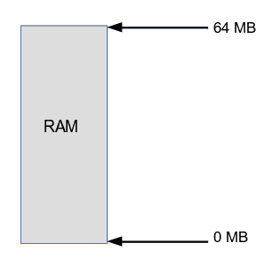

图 1：64 MB 的平面物理地址空间

显然，运行在这台机器上的所有东西都必须共享这个物理内存空间：操作系统、设备驱动程序、库和应用程序。我们可以这样想象（当然，这并不是要反映一个实际的系统 - 这只是一个极为简化的例子，帮助你理解事情）：一个操作系统，几个设备驱动程序（驱动硬件外围设备），一组库和两个应用程序。这个虚构的（64 MB 系统）平台的物理内存映射（比例不准确）可能是这样的：

| **对象** | **占用空间** | **地址范围** |
| --- | --- | --- |
| 操作系统（OS） | 3 MB | 0x03d0 0000 - 0x0400 0000 |
| 设备驱动程序 | 5 MB | 0x02d0 0000 – 0x0320 0000 |
| 库 | 10 MB | 0x00a0 0000 – 0x0140 0000 |
| 应用程序 2 | 1 MB | 0x0010 0000 – 0x0020 0000 |
| 应用程序 1 | 0.5 MB | 0x0000 0000 – 0x0008 0000 |
| 总体空闲内存 | 44.5 MB | <各种> |

表 1：物理内存映射

同样的虚构系统在下图中表示：

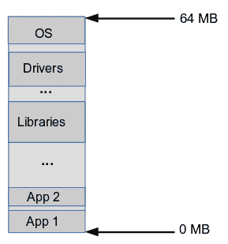

图 2：我们虚构的 64MB 系统的物理内存映射

当然，系统在发布之前会经过严格的测试，并且会按预期运行；除了，我们行业中可能会出现的问题，你可能听说过，叫做 bug。是的，确实。

但是，让我们想象一下，一个危险的 bug 潜入了 Application 1，比如说在使用普遍的`memcpy(3)` glibc API 时，由于以下原因之一：

+   无意的编程错误

+   故意的恶意意图

作为一个快速提醒，`memcpy`库 API 的使用如下所示：

`void *memcpy(void *dest, const void *src, size_t n).`

# 目标

以下 C 程序片段意图使用通常的`memcpy(3)` glibc API 复制一些内存，比如说 1,024 字节，从程序中的源位置 300KB 到程序中的目标位置 400KB。由于 Application 1 是物理内存低端的程序（参见前面的内存映射），它从`0x0`物理偏移开始。

我们知道，在现代操作系统上，没有什么会从地址`0x0`开始；那是经典的 NULL 内存位置！请记住，这只是一个用于学习目的的虚构示例

首先，让我们看看正确的使用情况。

参考以下伪代码：

```
phy_offset = 0x0;
src = phy_offset + (300*1024);       /* = 0x0004 b000 */
dest = phy_offset + (400*1024);      /* = 0x0006 4000 */
n = 1024;
memcpy(dest, src, n);
```

上述代码的效果如下图所示：

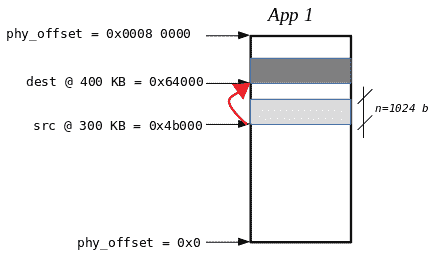

图 3：放大到 App 1：正确的 memcpy()

如前图所示，这是有效的！（大）箭头显示了从源到目的地的复制路径，共 1,024 字节。很好。

现在来看看有 bug 的情况。

一切都一样，只是这一次，由于一个 bug（或者恶意意图），`dest`指针被修改如下：

```
phy_offset = 0x0;
src = phy_offset + (300*1024);       /* = 0x0004 b000 */
dest = phy_offset + (400*1024*156);  /* = 0x03cf 0000 *!*BUG*!* */
n = 1024;
memcpy(dest, src, n);
```

目标位置现在大约在 64KB（0x03cf0000 - 0x03d00000）进入操作系统！最好的部分是：代码本身并没有失败*。* `memcpy()`完成了它的工作。当然，现在操作系统可能已经损坏，整个系统将（最终）崩溃。

请注意，这里的意图不是为了调试原因（我们知道）；这里的意图是要清楚地意识到，尽管有这个 bug，memcpy 仍然成功。

为什么？这是因为我们在用 C 语言编程 - 我们可以自由地读写物理内存，任何意外的错误都是我们的问题，而不是语言的问题！

那现在呢？啊，这就是 VM 系统出现的一个关键原因之一。

# 虚拟内存

不幸的是，**虚拟内存**（**VM**）这个术语经常被工程师大部分人误解或模糊地理解。在本节中，我们试图澄清这个术语及其相关术语（如内存金字塔、寻址和分页）的真正含义；开发人员清楚地理解这一关键领域是很重要的。

首先，什么是进程？

进程是正在执行的程序的一个实例*。*

程序是一个二进制可执行文件：一个死的、磁盘上的对象。例如，拿`cat`程序来说：`$ ls -l /bin/cat`

`-rwxr-xr-x 1 root root 36784 Nov 10 23:26 /bin/cat`

`$`

当我们运行`cat`时，它变成了一个可以运行的实体，我们在 Unix 宇宙中称之为进程。

为了更清楚地理解更深层次的概念，我们从一个小的、简单的、虚构的机器开始。想象一下，它有一个带有 16 个地址线的微处理器。因此，很容易看出，它将可以访问总共潜在的内存空间（或地址空间）为 2¹⁶ = 65,536 字节 = 64KB：

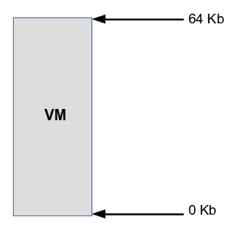

图 4：64KB 的虚拟内存

但是，如果机器上的物理内存（RAM）少得多，比如 32KB 呢？

显然，前图描述的是虚拟内存，而不是物理内存。

同时，物理内存（RAM）如下所示：

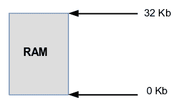

图 5：32KB 的物理内存

尽管系统向每个活动的进程做出了承诺：每个进程都将有整个 64KB 的虚拟地址空间可用。听起来很荒谬，对吧？是的，直到人们意识到内存不仅仅是 RAM；事实上，内存被视为一个层次结构 - 通常被称为存储金字塔：

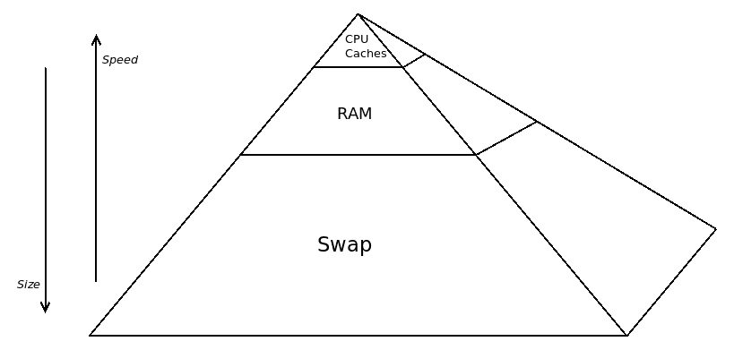

图 6：存储金字塔

就像生活一样，一切都是一种权衡。在金字塔的顶端，我们在**速度**方面获得了优势，但代价是尺寸；在金字塔的底部，情况正好相反：**尺寸**以牺牲速度为代价。人们也可以认为 CPU 寄存器位于金字塔的顶端；由于其尺寸几乎微不足道，因此没有显示。

*交换*是一种文件系统类型 - 系统安装时，原始磁盘分区被格式化为交换。它被操作系统视为第二级 RAM。当操作系统的 RAM 用完时，它使用交换。作为一个粗略的启发式方法，系统管理员有时会将交换分区的大小配置为可用 RAM 的两倍。

为了帮助量化这一点，根据《计算机体系结构，定量方法，第 5 版》（Hennessy & Patterson）提供了相当典型的数字：

| **类型** | **CPU 寄存器** | **CPU 缓存** | **RAM** | **交换/存储** |
| --- | --- | --- | --- | --- |
| L1 | L2 | L3 |
| 服务器 | 1000 字节 | 64KB | 256KB | 2-4MB | 4-16GB | 4-16TB |
| 300ps | 1ns | 3-10ns | 10-20ns | 50-100ns | 5-10ms |
| 嵌入式 | 500 字节 | 64KB | 256KB | - | 256-512MB | 4-8GB 闪存 |
| 500ps | 2ns | 10-20ns | - | 50-100ns | 25-50us |

表 2：存储器层次结构数字

许多（如果不是大多数）嵌入式 Linux 系统不支持交换分区；原因很简单：嵌入式系统主要使用闪存作为辅助存储介质（而不是像笔记本电脑、台式机和服务器那样使用传统的 SCSI 磁盘）。写入闪存芯片会使其磨损（它有限制的擦写周期）；因此，嵌入式系统设计者宁愿牺牲交换，只使用 RAM。（请注意，嵌入式系统仍然可以是基于虚拟内存的，这在 Linux 和 Win-CE 等系统中是常见情况）。

操作系统将尽最大努力将页面的工作集保持在尽可能高的金字塔位置，以优化性能。

读者需要注意，在接下来的章节中，虽然本书试图解释一些高级主题的内部工作，比如虚拟内存和寻址（分页），但我们故意没有描绘完整、真实世界的视图。

原因很简单：深入和血腥的技术细节远远超出了本书的范围。因此，读者应该记住，以下几个领域中的一些是以概念而不是实际情况来解释的。*进一步阅读*部分提供了对这些问题感兴趣的读者的参考资料。请在 GitHub 存储库上查看。

# 寻址 1 - 简单的有缺陷的方法

好的，现在来看看存储金字塔；即使我们同意虚拟内存现在是可能的，一个关键且困难的障碍仍然存在。要解释这一点，请注意，每个活动的进程都将占用整个可用的虚拟地址空间（VAS）。因此，每个进程在 VAS 方面与其他每个进程重叠。但这会怎么样？它本身不会。为了使这个复杂的方案工作，系统必须以某种方式将每个进程中的每个虚拟地址映射到物理地址！参考以下虚拟地址到物理地址的映射：

**进程 P：虚拟地址（va）→ RAM：物理地址（pa）**

因此，现在的情况是这样的：

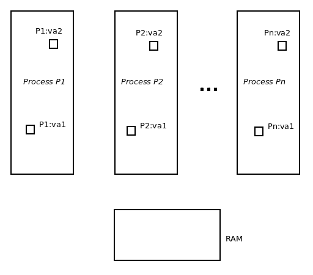

图 7：包含虚拟地址的进程

进程 P1、P2 和 Pn 在虚拟内存中活跃。它们的虚拟地址空间覆盖 0 到 64KB，并相互重叠。在这个（虚构的）系统上存在 32KB 的物理内存 RAM。

例如，每个进程的两个虚拟地址以以下格式显示：

`P'r':va'n'`；其中`r`是进程编号，`n`是 1 和 2。

如前所述，现在的关键是将每个进程的虚拟地址映射到物理地址。因此，我们需要映射以下内容：

```
P1:va1 → P1:pa1
P1:va2 → P1:pa2
...

P2:va1 → P2:pa1
P2:va2 → P2:pa2
...

[...]

Pn:va1 → Pn:pa1
Pn:va2 → Pn:pa2
...
```

我们可以让操作系统执行这种映射；然后操作系统将维护每个进程的映射表来执行此操作。从图解和概念上看，它如下所示：

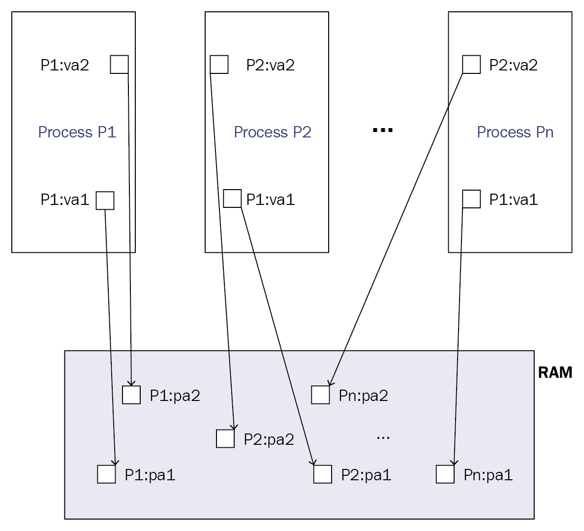

图 8：将虚拟地址直接映射到物理 RAM 地址

那就这样了？实际上似乎相当简单。嗯，不，实际上不会这样：要将每个进程的所有可能的虚拟地址映射到 RAM 中的物理地址，操作系统需要维护每个地址每个进程的 va-to-pa 翻译条目！这太昂贵了，因为每个表可能会超过物理内存的大小，使该方案无用。

快速计算表明，我们有 64KB 的虚拟内存，即 65,536 字节或地址。这些虚拟地址中的每一个都需要映射到一个物理地址。因此，每个进程都需要：

+   65536 * 2 = 131072 = 128 KB，用于每个进程的映射表。

实际情况更糟糕；操作系统需要存储一些元数据以及每个地址转换条目；假设 8 字节的元数据。所以现在，每个进程都需要：

+   65536 * 2 * 8 = 1048576 = 1 MB，用于每个进程的映射表。

哇，每个进程需要 1 兆字节的 RAM！这太多了（想象一下嵌入式系统）；而且在我们的虚构系统中，总共只有 32KB 的 RAM。哎呀。

好吧，我们可以通过不映射每个字节而映射每个字来减少这种开销；比如，将 4 个字节映射到一个字。所以现在，每个进程都需要：

+   （65536 * 2 * 8）/ 4 = 262144 = 256 KB，用于每个进程的映射表。

更好，但还不够好。如果只有 20 个进程在运行，我们需要 5MB 的物理内存来存储映射元数据。在 32KB 的 RAM 中，我们做不到这一点。

# 地址 2-简要分页

为了解决这个棘手的问题，计算机科学家提出了一个解决方案：不要试图将单个虚拟字节（甚至单词）映射到它们的物理对应物；这太昂贵了。相反，将物理和虚拟内存空间分割成块并进行映射。

有两种广义的方法来做到这一点：

+   硬件分段

+   硬件分页

硬件分段：将虚拟和物理地址空间分割成称为段的任意大小块。最好的例子是英特尔 32 位处理器。

硬件分页：将虚拟和物理地址空间分割成称为页面的等大小块。大多数现实世界的处理器都支持硬件分页，包括英特尔、ARM、PPC 和 MIPS。

实际上，甚至不是由操作系统开发人员选择使用哪种方案：选择由硬件 MMU 决定。

再次提醒读者：这本书的复杂细节超出了范围。请参阅 GitHub 存储库上的“进一步阅读”部分。

假设我们采用分页技术。关键要点是，我们停止尝试将每个进程的所有可能的虚拟地址映射到 RAM 中的物理地址，而是将虚拟页（称为页）映射到物理页（称为页框）。

常见术语

虚拟地址空间：VAS

进程 VAS 中的虚拟页：页

RAM 中的物理页：页框（pf）

不起作用：虚拟地址（va）→物理地址（pa）

起作用：（虚拟）页→页框

左到右的箭头表示映射。

作为一个经验法则（和通常被接受的规范），页面的大小为 4 千字节（4,096 字节）。再次强调，是处理器的内存管理单元（MMU）决定页面的大小。

那么这种方案如何以及为什么有帮助呢？

想一想；在我们的虚构机器中，我们有：64 KB 的虚拟内存，即 64K/4K =  16 页，和 32 KB 的 RAM，即 32K/4K = 8 页帧。

将 16 页映射到相应的页面帧需要每个进程只有 16 个条目的表；这是可行的！

就像我们之前的计算一样：

16 * 2 * 8 = 256 字节，每个进程的映射表。

非常重要的一点，值得重复：我们将（虚拟）页映射到（物理）页面帧！

这是由操作系统基于每个进程进行的。因此，每个进程都有自己的映射表，用于在运行时将页面转换为页面帧；通常称为**分页表**（**PT**）：

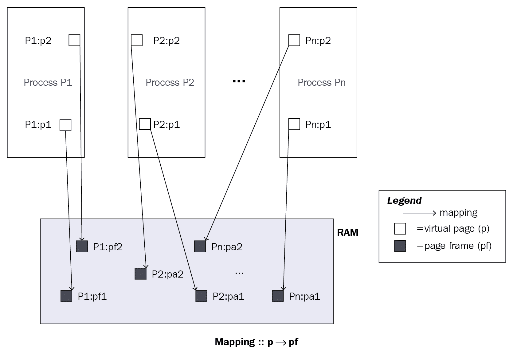

图 9：将（虚拟）页映射到（物理）页面帧

# 分页表--简化

同样，在我们的虚构机器中，我们有：64 KB 的虚拟内存，即 64K/4K = 16 页，和 32 KB 的 RAM，即 32K/4K = 8 页帧。

将 16 个（虚拟）页映射到相应的（物理）页面帧只需要每个进程一个只有 16 个条目的表，这使得整个交易可行。

非常简单地说，单个进程的操作系统创建的页表如下所示：

| **（虚拟）页** | **（物理）页面帧** |
| --- | --- |
| `0` | `3` |
| `1` | `2` |
| `2` | `5` |
| `[...]` | `[...]` |
| `15` | `6` |

表 3：操作系统创建的页表

当然，敏锐的读者会注意到我们有一个问题：我们有 16 页，只有 8 页帧可以映射到它们中--剩下的八页怎么办？

好吧，考虑一下：

+   实际上，每个进程都不会使用每个可用的页面来存储代码或数据或其他内容；虚拟地址空间的几个区域将保持空白（稀疏），

+   即使我们需要它，我们也有办法：不要忘记内存金字塔。当我们用完 RAM 时，我们使用交换。因此，进程的（概念性）页表可能如下所示（例如，页面 13 和 14 驻留在交换中）：

| **（虚拟）页** | **（物理）页面帧** |
| --- | --- |
| `0` | `3` |
| `1` | `2` |
| `2` | `5` |
| `[...]` | `[...]` |
| `13` | `<交换地址>` |
| `14` | `<交换地址>` |
| `15` | `6` |

表 4：概念性页表

请注意，这些页表的描述纯粹是概念性的；实际的页表更复杂，且高度依赖于体系结构（CPU/MMU）。

# 间接

通过引入分页，我们实际上引入了一级间接：我们不再将（虚拟）地址视为从零的绝对偏移，而是作为相对数量：`va = (page, offset)`。

我们将每个虚拟地址视为与页号和从该页开头的偏移相关联。这被称为使用一级间接。

因此，每当进程引用虚拟地址时（当然，几乎一直在发生），系统必须根据该进程的页表将虚拟地址转换为相应的物理地址。

# 地址转换

因此，在运行时，进程查找一个虚拟地址，比如说，距离 0 有 9,192 字节，也就是说，它的虚拟地址：**`va = 9192 = 0x000023E8`**。如果每页大小为 4,096 字节，这意味着 va 地址在第三页（第 2 页），从该页的开头偏移 1,000 字节。

因此，通过一级间接，我们有：**`va = (page, offset) = (2, 1000)`**。

啊哈！现在我们可以看到地址转换是如何工作的：操作系统看到进程想要一个地址在第 2 页。它在该进程的页表上查找，并发现第 2 页映射到第 5 页帧。计算如下所示的物理地址：

```
pa = (pf * PAGE_SIZE) + offset
   = (5 * 4096) + 1000
   = 21480 = 0x000053E8
```

哇！

系统现在将物理地址放在总线上，CPU 像往常一样执行其工作。看起来很简单，但再次强调，这并不现实，请参见下面的信息框。

分页模式带来的另一个优势是，操作系统只需要存储页到页框的映射。这自动让我们能够通过添加偏移量将页面中的任何字节转换为页面框中对应的物理字节，因为页面和页面框之间存在一对一的映射（两者大小相同）。

实际上，执行地址转换的并不是操作系统。这是因为在软件中执行这个操作会太慢（记住，查找虚拟地址是一个几乎一直在进行的活动）。事实是，地址查找和转换是由硅片——CPU 内的硬件**内存管理单元**（MMU）来完成的！

记住以下几点：

• 操作系统负责为每个进程创建和维护页表。

• MMU 负责执行运行时地址转换（使用操作系统的页表）。

• 此外，现代硬件支持硬件加速器，如 TLB、CPU 缓存的使用和虚拟化扩展，这在很大程度上有助于获得良好的性能。

# 使用虚拟内存的好处

乍一看，由于虚拟内存和相关的地址转换引入的巨大开销似乎不值得使用它。是的，开销很大，但事实如下：

+   现代硬件加速（通过 TLB/CPU 缓存/预取）减轻了这种开销，并提供了足够的性能。

+   从虚拟内存中获得的好处超过了性能问题。

在基于虚拟内存的系统上，我们获得以下好处：

+   进程隔离

+   程序员不需要担心物理内存

+   内存区域保护

更好地理解这些是很重要的。

# 进程隔离

有了虚拟内存，每个进程都在一个沙盒中运行，这是它的虚拟地址空间的范围。关键规则：它不能窥视到盒子外面。

因此，想想看，一个进程不可能窥视或篡改任何其他进程的虚拟地址空间的内存。这有助于使系统安全稳定。

例如：我们有两个进程 A 和 B。进程 A 想要写入进程 B 中的虚拟地址`0x10ea`。它不能，即使它试图写入该地址，它实际上只是写入自己的虚拟地址`0x10ea`！读取也是一样的。

因此我们得到了进程隔离——每个进程完全与其他进程隔离。

对于进程 A 的虚拟地址 X 来说，它与进程 B 的虚拟地址 X 并不相同；很可能它们会通过它们的页表转换为不同的物理地址。

利用这一特性，Android 系统被设计得非常有意识地使用进程模型来进行 Android 应用程序：当一个 Android 应用程序启动时，它成为一个 Linux 进程，它存在于自己的虚拟地址空间中，被隔离并因此受到保护，不受其他 Android 应用程序（进程）的影响！

+   再次强调，不要误以为给定进程中的每个（虚拟）页面都对该进程本身有效。只有在映射了页面的情况下，页面才是有效的，也就是说，它已经被分配并且操作系统对它有有效的转换（或者有办法获取它）。事实上，特别是对于庞大的 64 位虚拟地址空间，进程的虚拟地址空间被认为是稀疏的。

+   如果进程隔离是如此描述的，那么如果进程 A 需要与进程 B 通信会怎样呢？实际上，这是许多真实的 Linux 应用程序的频繁设计要求——我们需要一些机制来能够读取/写入另一个进程的虚拟地址空间。现代操作系统提供了实现这一点的机制：**进程间通信**（IPC）机制。（有关 IPC 的简要介绍可以在第十五章中找到，*使用 Pthreads 进行多线程编程第二部分-同步*。）

# 程序员不需要担心物理内存

在旧的操作系统甚至现代的实时操作系统中，程序员需要详细了解整个系统的内存布局，并相应地使用内存（回想一下*图 1*）。显然，这给开发人员带来了很大的负担；他们必须确保他们在系统的物理限制内工作良好。

大多数在现代操作系统上工作的现代开发人员甚至从不这样思考：如果我们想要，比如说，512 Kb 的内存，我们不是只需动态分配它（使用`malloc(3)`，稍后在第四章中详细介绍，*动态内存分配*），将如何和在哪里完成的精确细节留给库和操作系统层？事实上，我们可以做这种事情数十次而不必担心诸如“是否有足够的物理 RAM？应该使用哪些物理页框？碎片化/浪费怎么办？”之类的问题。

我们得到的额外好处是系统返回给我们的内存是保证连续的；当然，它只是虚拟连续的，不一定是物理上连续的，但这种细节正是虚拟内存层要处理的！

所有这些都由库层和操作系统中的底层内存管理系统高效处理。

# 内存区域保护

也许 VM 最重要的好处就是：能够在虚拟内存上定义保护，并且这些保护会被操作系统遵守。

Unix 和其它类似系统（包括 Linux），允许在内存页面上有四个保护或权限值：

| **保护或权限类型** | **意义** |
| --- | --- |
| 无 | 无权限在页面上执行任何操作 |
| 读取 | 页面可以读取 |
| 写入 | 页面可以写入 |
| 执行 | 页面（代码）可以执行 |

表 5：内存页面上的保护或权限值

让我们考虑一个小例子：我们在我们的进程中分配了四个页面的内存（编号为 0 到 3）。默认情况下，页面的默认权限或保护是**RW**（**读-写**），这意味着页面既可以读取又可以写入。 

有了虚拟内存操作系统级别的支持，操作系统提供了 API（`mmap(2)`和`mprotect(2)`系统调用），可以更改默认的页面保护！请看下表：

| **内存页＃** | **默认保护** | **更改后的保护** |
| --- | --- | --- |
| 0 | RW- | -无- |
| 1 | RW- | 只读（R--） |
| 2 | RW- | 仅写入（-W-） |
| 3 | RW- | 读取-执行（R-X） |

有了这样强大的 API，我们可以将内存保护设置到单个页面的粒度！

应用程序（甚至操作系统）可以利用这些强大的机制；事实上，这正是操作系统在进程地址空间的特定区域所做的（正如我们将在下一节学到的那样，*侧边栏::测试 memcpy() 'C'程序*）。

好的，很好，我们可以在某些页面上设置某些保护，但是如果应用程序违反了它们怎么办？例如，在设置页面＃3（如前表所示）为读取-执行后，如果应用程序（或操作系统）尝试写入该页面会怎样？

这就是虚拟内存（和内存管理）的真正威力所在：事实上，在启用了虚拟内存的系统上，操作系统（更确切地说是 MMU）能够陷入每个内存访问，并确定最终用户进程是否遵守规则。如果是，访问将成功进行；如果不是，MMU 硬件会引发异常（类似但不完全相同于中断）。操作系统现在会跳转到一个称为异常（或故障）处理程序的代码例程。操作系统的异常处理例程确定访问是否确实非法，如果是，操作系统立即终止尝试进行此非法访问的进程。

这就是内存保护吗？事实上，这几乎就是段错误或段错误的定义；在第十二章中会更详细地介绍这一点，*信号-第二部分*。异常处理例程称为操作系统的故障处理程序。

# 侧边栏：测试`memcpy()` C 程序

现在我们更好地理解了虚拟内存系统的*什么*和*为什么*，让我们回到本章开头考虑的有 bug 的伪代码示例：我们使用`memcpy(3)`来复制一些内存，但指定了错误的目标地址（在我们虚构的仅物理内存的系统中，它会覆盖操作系统本身）。

一个在 Linux 上运行的概念上类似的 C 程序，一个完整的虚拟内存启用的操作系统，被展示并在这里尝试。让我们看看这个有 bug 的程序在 Linux 上是如何工作的：

```
$ cat mem_app1buggy.c /*
 * mem_app1buggy.c
 *
 ***************************************************************
 * This program is part of the source code released for the book
 *  "Linux System Programming"
 *  (c) Kaiwan N Billimoria
 *  Packt Publishers
 *
 * From:
 *  Ch 2 : Virtual Memory
 ****************************************************************
 * A simple demo to show that on Linux - full-fledged Virtual 
 * Memory enabled OS - even a buggy app will _NOT_ cause system
 * failure; rather, the buggy process will be killed by the 
 * kernel!
 * On the other hand, if we had run this or a similar program in a flat purely 
 * physical address space based OS, this seemingly trivial bug 
 * can wreak havoc, bringing the entire system down.
 */
#define _GNU_SOURCE
#include <stdio.h>
#include <unistd.h>
#include <stdlib.h>
#include <string.h>
#include "../common.h"

int main(int argc, char **argv)
{
    void *ptr = NULL;
    void *dest, *src = "abcdef0123456789";
    void *arbit_addr = (void *)0xffffffffff601000;
    int n = strlen(src);

    ptr = malloc(256 * 1024);
    if (!ptr)
          FATAL("malloc(256*1024) failed\n");

    if (argc == 1)
        dest = ptr;           /* correct */
    else
        dest = arbit_addr;    /* bug! */
    memcpy(dest, src, n);

    free(ptr);
    exit(0);
}
```

`malloc(3)` API 将在下一章中详细介绍；现在，只需了解它用于为进程动态分配 256 KB 的内存。当然，`memcpy(3)`也用于将内存从源指针复制到目标指针，共 n 个字节：

```
void *memcpy(void *dest, const void *src, size_t n);
```

有趣的是我们有一个名为`arbit_addr`的变量；它被设置为一个任意的无效（虚拟）地址。从代码中可以看出，当用户向程序传递任何参数时，我们将目标指针设置为`arbit_addr`，从而使其成为有 bug 的测试用例。让我们尝试运行这个程序，看看正确和错误的情况。 

这是正确的情况：

```
$ ./mem_app1buggy
$ 
```

它运行良好，没有错误。

这是错误的情况：

```
$ ./mem_app1buggy buggy-case pass-params forcing-argc-to-not-be-1
Segmentation fault (core dumped)
$ 
```

它崩溃了！正如前面所述，有 bug 的 memcpy 导致 MMU 出现故障；操作系统的故障处理代码意识到这确实是一个 bug，于是杀死了有问题的进程！进程死于自己的过错，而不是系统的过错。这不仅是正确的，而且*段错误*也提醒开发人员他们的代码有 bug，必须修复。

1. 到底什么是核心转储？

核心转储是进程在崩溃时某些动态区域（段）的快照（从技术上讲，至少是数据和堆栈段的快照）。核心转储可以在崩溃后使用诸如 GDB 之类的调试器进行分析。我们在本书中不涵盖这些领域。

2. 嘿，它说（核心已转储），但我没有看到任何核心文件？

嗯，为什么没有核心文件呢？这可能有几个原因，细节超出了本书的范围。请参考`core(5)`的 man 页面获取详细信息：[`linux.die.net/man/5/core`](https://linux.die.net/man/5/core)。

稍微详细地考虑一下这里发生了什么：目标指针的值是`0xffffffffff601000;`在 x86_64 处理器上，这实际上是一个内核虚拟地址。现在我们，一个用户模式进程，试图向这个目标区域写入一些内存，这个区域受到了来自用户空间的访问保护。从技术上讲，它位于内核虚拟地址空间，这对用户模式进程不可用（回想一下我们在第一章中对*CPU 特权级别*的讨论，*Linux 系统架构*）。所以当我们——一个用户模式进程——试图写入内核虚拟地址空间时，保护机制会启动并阻止我们这样做，从而导致我们死亡。

高级：系统如何知道这个区域受到保护以及它有什么样的保护？这些细节被编码到进程的**分页表项**（**PTEs**）中，并且在每次访问时由 MMU 进行检查！

这种高级内存保护在硬件和软件中都没有支持是不可能的：

+   通过所有现代微处理器中的 MMU 提供的硬件支持

+   通过操作系统的软件支持

虚拟内存提供了许多其他好处，包括（但不限于）使强大的技术成为可能，例如需求分页、**写时复制**（**COW**）处理、碎片整理、内存过度承诺、内存压缩、**内核同页合并**（**KSM**）和**超然内存**（**TM**）。在本书的范围内，我们将在以后的章节中涵盖其中的一些。

# 进程内存布局

进程是正在执行的程序的实例。它被操作系统视为一个活动的、可调度的实体。换句话说，当我们启动一个程序时，运行的是进程。

操作系统或内核在内核内存中的数据结构中存储有关进程的元数据；在 Linux 上，这个结构通常被称为**进程描述符**，尽管术语*任务结构*更准确。进程属性存储在任务结构中；进程**PID**（进程标识符）- 用于标识进程的唯一整数，进程凭证，打开文件信息，信号信息等等，都驻留在这里。

从之前的讨论中，*虚拟内存*，我们了解到进程除了许多其他属性外，还有一个 VAS*。VAS 是它可能可用的总空间。就像我们之前的例子，使用 16 个地址线的虚构计算机，每个进程的 VAS 将是 2¹⁶ = 64 KB。

现在，让我们考虑一个更现实的系统：一个具有 32 位寻址的 32 位 CPU。显然，每个进程的 VAS 为 2³²，相当大的 4 GB。

16 进制格式的 4 GB 是`0x100000000;`所以 VAS 从低地址`0x0`到高地址`4GB - 1 = 0xffff ffff`。

然而，我们还需要了解更多细节（参见*高级：VM 分割*）关于 VAS 高端的确切使用。因此，至少目前，让我们将其称为高地址，而不给它一个特定的数值。

这是它的图示表示：

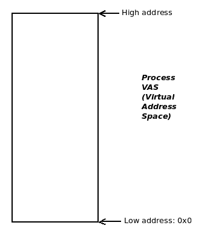

图 10：进程虚拟地址空间（VAS）

因此，现在要理解的是，在 32 位 Linux 上，每个活动的进程都有这个映像：**0x0**到 0xffff ffff = 4 GB 的虚拟地址空间*.*

# 段或映射

当创建一个新进程（详细信息见第十章，*进程创建*）时，其 VAS 必须由操作系统设置。所有现代操作系统都将进程 VAS 划分为称为**段**的同质区域（不要将这些段与硬件分段方法混淆，该方法在*地址 2 - 简要分页*部分中提到）。

段是进程 VAS 的同质或统一区域；它由虚拟页面组成。段具有属性，如起始和结束地址，保护（RWX/none）和映射类型。现在的关键点是：属于段的所有页面共享相同的属性。

从技术上讲，从操作系统的角度来看，段被称为**映射**。

从现在开始，当我们使用“segment”这个词时，我们也指的是 mapping，反之亦然。

简而言之，从低到高端，每个 Linux 进程都会有以下段（或映射）：

+   文本（代码）

+   数据

+   库（或其他）

+   堆栈

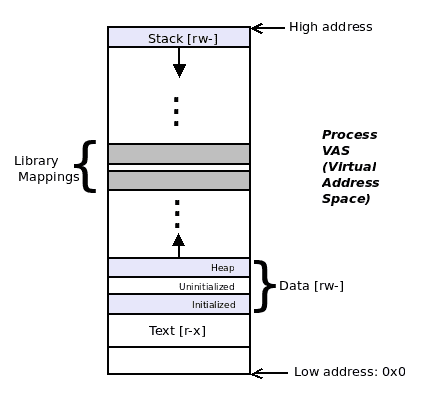

图 11：带有段的进程 VAS 的整体视图

继续阅读有关这些段的更多详细信息。

# 文本段

文本就是代码：构成馈送给 CPU 消耗的机器指令的实际操作码和操作数。读者可能还记得我们在第一章，*Linux 系统架构*中所做的`objdump --source ./hello_dbg`，显示 C 代码转换为汇编和机器语言。这个机器代码驻留在进程 VAS 中，称为**文本**段。例如，假设一个程序有 32 KB 的文本；当我们运行它时，它变成一个进程，文本段占用 32 KB 的虚拟内存；这是 32K/4K = 8（虚拟）页。

为了优化和保护，操作系统标记，即保护，所有这八页文本都标记为**读-执行**（**r-x**）。这是有道理的：代码将从内存中读取并由 CPU 执行，而不是写入它。

在 Linux 上，文本段总是朝着进程 VAS 的低端。请注意，它永远不会从`0x0`地址开始。

作为一个典型的例子，在 IA-32 上，文本段通常从`0x0804 8000`开始。尽管这在架构上是非常特定的，而且在 Linux 安全机制如**地址空间布局随机化**（**ASLR**）存在时会发生变化。

# 数据段

文本段的上方是数据段，这是进程保存程序的全局和静态变量（数据）的地方。

实际上，这不是一个映射（段）；数据段由三个不同的映射组成。从低地址开始，它包括：初始化数据段，未初始化数据段和堆段。

我们知道，在 C 程序中，未初始化的全局和静态变量会自动初始化为零。那么初始化的全局变量呢？初始化数据段是一个地址空间的区域，用于存储显式初始化的全局和静态变量。

未初始化的数据段是地址空间的一个区域，当然，未初始化的全局和静态变量驻留在这里。关键是：这些变量会被隐式初始化为零（实际上是 memset 为零）。此外，旧的文献经常将这个区域称为 BSS。BSS 是一个旧的汇编指令-由符号开始的块-可以忽略；今天，BSS 区域或段仅仅是进程 VAS 的未初始化数据段。

堆应该是大多数 C 程序员熟悉的一个术语；它指的是为动态内存分配（和随后的释放）保留的内存区域。把堆想象成一个在启动时为进程提供的免费内存页面的礼物。

一个关键点：文本、初始化数据和未初始化数据段的大小是固定的；堆是一个动态段-它可以在运行时增长或缩小。重要的是要注意，堆段向更高的虚拟地址增长。有关堆及其用法的更多细节可以在下一章中找到。

# 库段

在链接程序时，我们有两个广泛的选择：

+   静态链接

+   动态链接

静态链接意味着任何和所有库文本（代码）和数据都保存在程序的二进制可执行文件中（因此它更大，加载速度更快）。

动态链接意味着任何和所有共享库文本（代码）和数据都不保存在程序的二进制可执行文件中；相反，它被所有进程共享，并在运行时映射到进程 VAS 中（因此二进制可执行文件要小得多，尽管加载速度可能会慢一些）。动态链接始终是默认的。

想想`Hello, world` C 程序。你调用了`printf(3)`，但你有写它的代码吗？当然没有；我们知道它在 glibc 中，并且会在运行时链接到我们的进程中。这正是动态链接的发生方式：在进程加载时，程序依赖（使用）的所有库文本和数据段都会*内存映射*到进程 VAS 中。在哪里？在堆的顶部和栈的底部之间的区域：库段（参见前面的图表）。

另一件事：除了库文本和数据之外，其他映射可能会进入这个地址空间的区域。一个典型的情况是开发人员进行的显式内存映射（使用`mmap(2)`系统调用），隐式映射，比如 IPC 机制所做的映射，比如共享内存映射，以及 malloc 例程（参见第四章，*动态内存分配*）。

# 栈段

这一节解释了进程栈：什么，为什么，以及如何。

# 栈内存是什么？

你可能记得被教过，栈内存只是内存，但具有特殊的推/弹出语义；你最后推入的内存位于栈的顶部，如果执行弹出操作，那个内存就会从栈中弹出-从中移除。

将晚餐盘子堆叠的教学示例是一个很好的例子：你最后放置的盘子在顶部，你从顶部取下盘子给你的晚餐客人（当然，你可以坚持说你从堆栈的中间或底部给他们盘子，但我们认为顶部的盘子最容易取下）。

一些文献还将这种推送/弹出行为称为**后进先出**（**LIFO**）。好吧。

进程 VAS 的高端用于堆栈段（参见*图 11*）。好吧，但它到底是用来做什么的？它如何帮助？

# 为什么需要进程堆栈？

我们被教导要编写良好的模块化代码：将工作分解为子例程，并将其实现为小型、易读、易维护的 C 函数。这很好。

然而，CPU 实际上并不了解如何调用 C 函数，如何传递参数，存储局部变量，并将结果返回给调用函数。我们的救世主，编译器接管，将 C 代码转换为能够使整个函数工作的汇编语言。

编译器生成汇编代码来调用函数，传递参数，为局部变量分配空间，最后将返回结果发回给调用者。为了做到这一点，它使用堆栈！因此，类似于堆，堆栈也是一个动态段。

每次调用函数时，在堆栈区域（或段或映射）中分配内存来保存具有函数调用、参数传递和函数返回机制的元数据。每个函数的这个元数据区域称为堆栈帧*。*

堆栈帧保存了实现函数调用-参数使用-返回值机制所需的元数据。堆栈帧的确切布局高度依赖于 CPU（和编译器）；这是 CPU ABI 文档涵盖的关键领域之一。

在 IA-32 处理器上，堆栈帧布局基本上如下：

`[ <-- 高地址`

`  [ 函数参数 ... ]`

`  [ 返回地址 ]`

`  [ 保存的帧指针 ] (可选)`

`  [ 局部变量 ... ]`

`]  <-- SP: 最低地址  `

考虑一些伪代码：

```
bar() { jail();}
foo() { bar();}
main() { foo();}
```

调用图相当明显：

`main --> foo --> bar --> jail`

箭头绘制为 --> 表示调用；所以，main 调用 foo，依此类推。

要理解的是：每次函数调用在进程的堆栈中都由一个堆栈帧表示。

如果处理器发出了推送或弹出指令，它将继续执行。但是，想想看，CPU 如何知道确切地在哪里 - 在哪个堆栈内存位置或地址 - 它应该推送或弹出内存？答案是：我们保留一个特殊的 CPU 寄存器，**堆栈指针**（通常缩写为**SP**），用于确切地这个目的：SP 中的值始终指向堆栈顶部。

下一个关键点：堆栈段向较低的虚拟地址增长。这通常被称为堆栈向下增长的语义。还要注意，堆栈增长的方向是由该 CPU 的 ABI 规定的 CPU 特定特性；大多数现代 CPU（包括英特尔、ARM、PPC、Alpha 和 Sun SPARC）都遵循堆栈向下增长的语义。

SP 始终指向堆栈顶部；由于我们使用的是向下增长的堆栈，这是堆栈上的最低虚拟地址！

为了清楚起见，让我们看一张图，它展示了在调用`main()`之后的进程堆栈（`main()`由一个`__libc_start_main()` glibc 例程调用）：

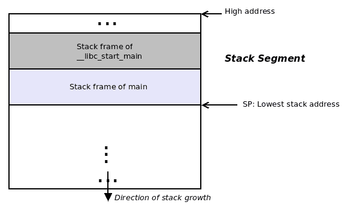

图 12：调用`main()`后的进程堆栈

进入`jail()`函数时的进程堆栈：

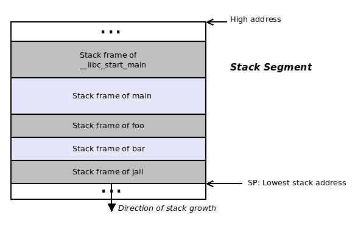

图 13：调用`jail()`后的进程堆栈

# 窥视堆栈

我们可以以不同的方式窥视进程堆栈（技术上来说，是`main()`的堆栈）。这里，我们展示了两种可能性：

+   通过`gstack(1)`实用程序自动

+   通过 GDB 调试器手动

首先，通过`gstack(1)`查看用户模式堆栈：

警告！Ubuntu 用户，你们可能会在这里遇到问题。在撰写时（Ubuntu 18.04），`gstack`似乎对 Ubuntu 不可用（它的替代方法`pstack`也不太好用！）。请使用第二种方法（通过 GDB），如下。

作为一个快速的例子，我们查看`bash`的堆栈（参数是进程的 PID）：

```
$ gstack 14654
#0  0x00007f3539ece7ea in waitpid () from /lib64/libc.so.6
#1  0x000056474b4b41d9 in waitchld.isra ()
#2  0x000056474b4b595d in wait_for ()
#3  0x000056474b4a5033 in execute_command_internal ()
#4  0x000056474b4a52c2 in execute_command ()
#5  0x000056474b48f252 in reader_loop ()
#6  0x000056474b48dd32 in main ()
$ 
```

堆栈帧编号出现在左边，前面有`#`符号；请注意，帧`#0`是堆栈的顶部（最低的帧）。以自下而上的方式读取堆栈，即从帧`#6`（`main()`函数的帧）到帧`#0`（`waitpid()`函数的帧）。还要注意，如果进程是多线程的，`gstack`将显示*每个*线程的堆栈。

接下来，通过 GDB 查看用户模式堆栈。

**G****NU Deb****ugger** (**GDB**)是一个著名的、非常强大的调试工具（如果你还没有使用它，我们强烈建议你学习一下；请查看*进一步阅读*部分中的链接）。在这里，我们将使用 GDB 来附加到一个进程，并且一旦附加，就可以查看它的进程堆栈。

一个小的测试 C 程序，进行了几个嵌套的函数调用，将作为一个很好的例子。基本上，调用图将如下所示：

```
main() --> foo() --> bar() --> bar_is_now_closed() --> pause()
```

`pause(2)`系统调用是一个阻塞调用的很好的例子 - 它让调用进程进入睡眠状态，等待（或阻塞）事件的发生；这里它所阻塞的事件是向进程传递任何信号。（耐心点；我们将在第十一章中学到更多，*信号 - 第一部分*，和第十二章，*信号 - 第二部分*）。

这里是相关的代码`(ch2/stacker.c)`：

```
static void bar_is_now_closed(void)
{
     printf("In function %s\n"
     "\t(bye, pl go '~/' now).\n", __FUNCTION__);
     printf("\n Now blocking on pause()...\n"
         " Connect via GDB's 'attach' and then issue the 'bt' command"
         " to view the process stack\n");
     pause(); /*process blocks here until it receives a signal */
}
static void bar(void)
{
     printf("In function %s\n", __FUNCTION__);
     bar_is_now_closed();
}
static void foo(void)
{
     printf("In function %s\n", __FUNCTION__);
     bar();
}
int main(int argc, char **argv)
{
     printf("In function %s\n", __FUNCTION__);
     foo();
     exit (EXIT_SUCCESS);
}
```

请注意，为了让 GDB 看到符号（函数名称、变量、行号），必须使用`-g`开关编译代码（生成调试信息）。

现在，我们在后台运行进程：

```
$ ./stacker_dbg &
[2] 28957
In function main
In function foo
In function bar
In function bar_is_now_closed
 (bye, pl go '~/' now).
 Now blocking on pause()...
 Connect via GDB's 'attach' and then issue the 'bt' command to view the process stack
$ 
```

接下来，打开 GDB；在 GDB 中，附加到进程（PID 在前面的代码中显示），并使用**backtrace**（**bt**）命令查看其堆栈：

```
$ gdb --quiet
(gdb) attach 28957 *# parameter to 'attach' is the PID of the process to attach to*
Attaching to process 28957
Reading symbols from <...>/Hands-on-System-Programming-with-Linux/ch2/stacker_dbg...done.
Reading symbols from /lib64/libc.so.6...Reading symbols from /usr/lib/debug/usr/lib64/libc-2.26.so.debug...done.
done.
Reading symbols from /lib64/ld-linux-x86-64.so.2...Reading symbols from /usr/lib/debug/usr/lib64/ld-2.26.so.debug...done.
done.
0x00007fce204143b1 in __libc_pause () at ../sysdeps/unix/sysv/linux/pause.c:30
30 return SYSCALL_CANCEL (pause);
(gdb) bt
#0 0x00007fce204143b1 in __libc_pause () at ../sysdeps/unix/sysv/linux/pause.c:30
#1 0x00000000004007ce in bar_is_now_closed () at stacker.c:31
#2 0x00000000004007ee in bar () at stacker.c:36
#3 0x000000000040080e in foo () at stacker.c:41
#4 0x0000000000400839 in main (argc=1, argv=0x7ffca9ac5ff8) at stacker.c:47
(gdb) 
```

在 Ubuntu 上，由于安全原因，GDB 不允许附加到任何进程；可以通过以 root 身份运行 GDB 来克服这一问题；然后它就可以正常工作了。

通过`gstack`查看相同的进程如何？（在撰写时，Ubuntu 用户，你们没那么幸运）。这是在 Fedora 27 上的情况：

```
$ gstack 28957
#0 0x00007fce204143b1 in __libc_pause () at ../sysdeps/unix/sysv/linux/pause.c:30
#1 0x00000000004007ce in bar_is_now_closed () at stacker.c:31
#2 0x00000000004007ee in bar () at stacker.c:36
#3 0x000000000040080e in foo () at stacker.c:41
#4 0x0000000000400839 in main (argc=1, argv=0x7ffca9ac5ff8) at stacker.c:47
$ 
```

你猜怎么着？原来`gstack`实际上是一个包装的 shell 脚本，它以非交互方式调用 GDB，并发出了我们刚刚使用的`backtrace`命令！

作为一个快速的学习练习，查看一下`gstack`脚本。

# 高级 - VM 分割

到目前为止，我们所看到的实际上并不是完整的画面；实际上，这个地址空间需要在用户空间和内核空间之间*共享*。

这一部分被认为是高级的。我们把决定是否深入了解接下来的细节留给读者。虽然它们非常有用，特别是从调试的角度来看，但严格来说并不是跟随本书其余部分所必需的。

回想一下我们在*库段*部分提到的内容：如果一个`Hello, world`应用程序要工作，它需要将`printf(3)` glibc 例程映射到它。这是通过在运行时将动态或共享库内存映射到进程 VAS 中（由加载程序）来实现的。

对于进程发出的任何系统调用，都可以提出类似的论点：我们从第一章中了解到，系统调用代码实际上位于内核地址空间内。因此，如果发出系统调用成功，我们需要将 CPU 的**指令指针**（**IP**或 PC 寄存器）重新定位到系统调用代码的地址，这当然是在内核地址空间内。现在，如果进程 VAS 只包括文本、数据、库和栈段，正如我们迄今所暗示的那样，它将如何工作？回想一下虚拟内存的基本规则：你不能看到盒子外面（可用地址空间）。

因此，为了使整个方案成功，即使内核虚拟地址空间 - 是的，请注意，即使内核地址空间也被认为是虚拟的 - 也必须以某种方式映射到进程 VAS 中。

正如我们之前看到的，在 32 位系统上，进程可用的总 VAS 为 4 GB。到目前为止，隐含的假设是 32 位系统上进程 VAS 的顶部是 4 GB。没错。同样，再次暗示的假设是栈段（由栈帧组成）位于这里 - 在顶部的 4 GB 点。嗯，那是不正确的（请参阅*图 11*）。

事实是：操作系统创建了进程 VAS，并为其中的段进行了安排；但是，它在顶端保留了一定量的虚拟内存供内核或 OS 映射使用（即内核代码、数据结构、堆栈和驱动程序）。顺便说一句，这个包含内核代码和数据的段通常被称为内核段。

内核段保留了多少 VM？啊，这是一个可调整的或可配置的参数，由内核开发人员（或系统管理员）在内核配置时间设置；它被称为**VMSPLIT**。这是 VAS 中我们在 OS 内核和用户模式内存之间分割地址空间的点 - 文本、数据、库和栈段！

实际上，为了清晰起见，让我们再次重现图 11（作为图 14），但这次明确显示 VM 分割：

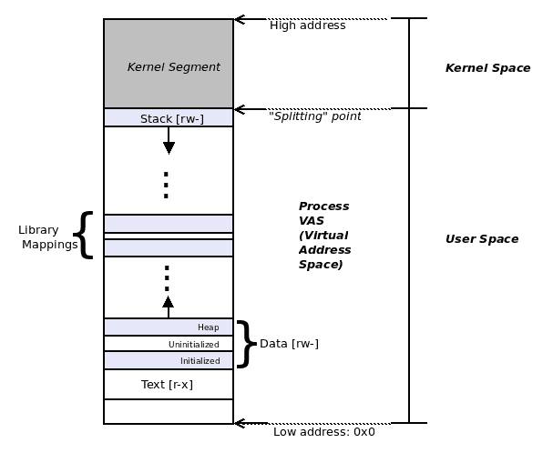

图 14：进程 VM 分割

让我们不要在这里深入细节：可以说在 IA-32（Intel x86 32 位）上，分割点通常是 3 GB 点。因此，我们有一个比例：*用户空间 VAS：内核 VAS :: 3 GB：1 GB；在 IA-32 上*。

请记住，这是可调的。在其他系统上，例如典型的 ARM-32 平台，分割可能是这样的：*用户空间 VAS：内核 VAS :: 2 GB：2 GB；在 ARM-32 上*。

在具有庞大的`2⁶⁴` VAS（这是一个令人难以置信的 16 艾字节！）的 x86_64 上，它将是：*用户空间 VAS：内核 VAS :: 128 TB：128 TB；在 x86_64 上*。

现在可以清楚地看到为什么我们使用术语“单片式”来描述 Linux OS 架构 - 每个进程确实就像一块单一的大石头！

每个进程都包含以下两者：

+   用户空间映射

+   文本（代码）

+   数据

+   初始化数据

+   未初始化的数据（BSS）

+   堆

+   库映射

+   其他映射

+   堆栈

+   内核段

每个活动进程都映射到内核 VAS（或内核段，通常被称为）的顶端。

这是一个关键点。让我们看一个现实世界的例子：在运行 Linux OS 的 Intel IA-32 上，`VMSPLIT`的默认值为 3 GB（即`0xc0000000`）。因此，在这个处理器上，每个进程的 VM 布局如下：

+   **0x0**到**0xbfffffff**：用户空间映射，即文本、数据、库和栈。

+   **0xc0000000**到**0xffffffff**：内核空间或内核段。

这在下图中清楚地表示出来：

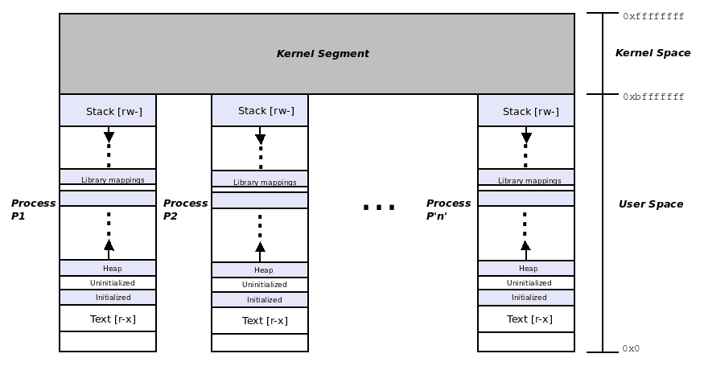

图 15：IA-32 上的完整进程 VAS

注意每个进程的顶部 1GB 的 VAS 都是相同的 - 内核段。还要记住，这种布局在所有系统上都不相同 - VMSPLIT 和用户和内核段的大小因 CPU 架构而异。

自 Linux 3.3 特别是 3.10（当然是内核版本）以来，Linux 支持`prctl(2)`系统调用。查阅其手册页面会发现各种有趣的，尽管不可移植（仅限于 Linux）的事情。例如，`prctl(2)`与`PR_SET_MM`参数一起使用，让一个进程（具有 root 权限）基本上可以指定其 VAS 布局，其段，以文本、数据、堆和栈的起始和结束虚拟地址为单位。这对于普通应用程序当然是不需要的。

# 总结

本章深入解释了 VM 概念，为什么 VM 很重要，以及对现代操作系统和在其上运行的应用程序的许多好处。然后我们介绍了 Linux OS 上进程虚拟地址空间的布局，包括一些关于文本、（多个）数据和堆栈段的信息。还介绍了堆栈的真正原因及其布局。

在下一章中，读者将了解每个进程的资源限制：为什么需要它们，它们如何工作，当然还有与它们一起工作所需的程序员接口。
