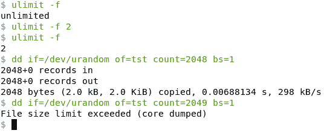
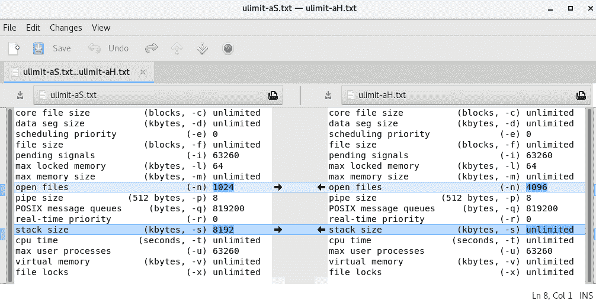
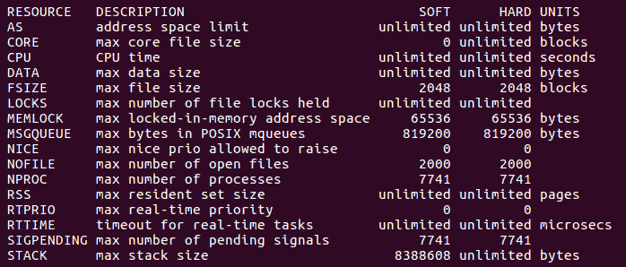

# 第三章：资源限制

在本章中，我们将研究每个进程的资源限制——它们是什么，以及为什么我们需要它们。我们将继续描述资源限制的粒度和类型，区分软限制和硬限制。将介绍用户（或系统管理员）如何使用适当的 CLI 前端（`ulimit`，`prlimit`）查询和设置每个进程的资源限制的详细信息。

编程接口（API）——实际上是关键的`prlimit(2)`系统调用 API——将被详细介绍。两个详细的代码示例，查询限制和设置 CPU 使用限制，将使读者有机会亲自体验资源限制的工作。

在本章中，关于资源限制，我们将涵盖以下主题：

+   必要性

+   粒度

+   类型——软限制和硬限制

+   资源限制 API，带有示例代码

# 资源限制

一种常见的黑客攻击是**（分布式）拒绝服务**（**（D）DoS**）攻击。在这种攻击中，恶意攻击者试图消耗、甚至超载目标系统的资源，以至于系统要么崩溃，要么至少变得完全无响应（挂起）。

有趣的是，在一个未调整的系统上，执行这种类型的攻击是非常容易的；例如，让我们想象一下，我们在服务器上有 shell 访问权限（当然不是 root，而是普通用户）。我们可以通过操纵无处不在的`dd(1)`（磁盘转储）命令很容易地使其耗尽磁盘空间（或至少变得短缺）。`dd`的一个用途是创建任意长度的文件。

例如，要创建一个填满随机内容的 1GB 文件，我们可以这样做：

```
$ dd if=/dev/urandom of=tst count=1024 bs=1M
1024+0 records in
1024+0 records out
1073741824 bytes (1.1 GB, 1.0 GiB) copied, 15.2602 s, 70.4 MB/s
$ ls -lh tst 
-rw-rw-r-- 1 kai kai 1.0G Jan  4 12:19 tst
$ 
```

如果我们将块大小（`bs`）的值增加到`1G`，就像这样：

```
dd if=/dev/urandom of=tst count=1024 bs=1G
```

`dd`现在将尝试创建一个大小为 1,024GB—即一太字节—的文件！如果我们在循环中运行这行代码（在脚本中）会发生什么？你懂的。

为了控制资源使用，Unix（包括 Linux）有一个资源限制，即操作系统对资源施加的人为限制。

首先要明确的一点是：这些资源限制是基于每个进程而不是系统范围的全局限制——关于这一点我们将在下一节详细介绍。

在深入更多细节之前，让我们继续我们的黑客示例，耗尽系统的磁盘空间，但这次在之前设置了文件最大大小的资源限制。

查看和设置资源限制的前端命令是一个内置的 shell 命令（这些命令称为**bash 内置**）：**`ulimit`**。要查询由 shell 进程（及其子进程）写入的文件的最大可能大小，我们将`-f`选项开关设置为`ulimit`：

```
$ ulimit -f
unlimited
$ 
```

好的，它是无限的。真的吗？不，无限只意味着操作系统没有特定的限制。当然它是有限的，受到盒子上实际可用磁盘空间的限制。

让我们通过传递`-f`选项开关和实际限制来设置最大文件大小的限制。但是大小的单位是什么？字节、KB、MB？让我们查看它的手册页：顺便说一句，`ulimit`的手册页是`bash(1)`的手册页。这是合理的，因为`ulimit`是一个内置的 shell 命令。在`bash(1)`手册页中，搜索`ulimit`；手册告诉我们，单位（默认情况下）是 1,024 字节的增量。因此，`2`意味着*1,024*2 = 2,048*字节。或者，要在`ulimit`上获得一些帮助，只需在 shell 上输入`help ulimit`。

所以，让我们试一试：将文件大小资源限制减少到只有 2,048 字节，然后用`dd`进行测试：



图 1：使用 ulimit -f 进行简单的测试案例

从前面的截图中可以看出，我们将文件大小资源限制减少到`2`，意味着 2,048 字节，然后用`dd`进行测试。只要我们创建的文件大小在或低于 2,048 字节，它就可以工作；一旦我们尝试超过限制，它就会失败。

顺便说一句，注意`dd`并*没有*尝试使用一些聪明的逻辑来测试资源限制，如果它尝试创建超出此限制的文件，它会显示错误。不，它只是失败了。回想一下第一章，*Linux 系统架构*，Unix 哲学原则：提供机制，而不是策略！

# 资源限制的粒度

在前面的`dd(1)`的例子中，我们看到我们确实可以对最大文件大小施加限制。一个重要的问题是：资源限制的*范围*或*粒度*是什么？它是系统范围的吗？

简短的回答：不，它不是系统范围的，它是*进程范围*，这意味着资源限制适用于进程的粒度而不是系统。为了澄清这一点，考虑两个 shell——仅仅是`bash`进程——shell A 和 shell B。我们修改了 shell A 的最大文件大小资源限制（使用通常的`ulimit -f <new-limit>`命令），但保持了 shell B 的最大文件大小资源限制不变。如果现在它们都使用`dd`（就像我们做的那样），我们会发现在 shell A 中调用的`dd`进程可能会因为超出文件大小限制而死亡，并显示`'文件大小限制超出（核心已转储）'`的失败消息，而在 shell B 中调用的`dd`进程可能会继续并成功（当然，前提是有足够的磁盘空间）。

这个简单的实验证明了资源限制的粒度是每个进程*。

当我们深入研究多线程的内部细节时，我们将重新讨论资源限制的粒度以及它们如何应用于单个线程。对于急躁的人来说，除了堆栈大小之外，所有资源限制都是由进程内的所有线程共享的

# 资源类型

到目前为止，我们只检查了最大文件大小资源限制；难道没有其他的吗？是的，确实还有其他几个。

# 可用资源限制

以下表格列举了典型 Linux 系统上可用的资源限制（按`ulimit 选项开关`列按字母顺序排列）：

| **资源限制** | **ulimit 选项开关** | **默认值** | **单位** |
| --- | --- | --- | --- |
| 最大核心文件大小 | -c | 无限制 | KB |
| 最大数据段大小 | -d | 无限制 | KB |
| 最大调度优先级（nice） | -e | 0 | 未缩放 |
| 最大文件大小 | -f | 无限制 | KB |
| 最大（实时）挂起信号 | -i | <varies> | 未缩放 |
| 最大锁定内存 | -l | <varies> | KB |
| 最大内存大小 | -m | 无限制 | KB |
| 最大打开文件数 | -n | 1024 | 未缩放 |
| 最大管道大小 | -p | 8 | 以 512 字节递增 |
| 最大 POSIX 消息队列 | -q | <varies> | 未缩放 |
| 最大实时调度优先级 | -r | 0 | 未缩放 |
| 最大堆栈段大小 | -s | 8192 | KB |
| 最大 CPU 时间 | -t | 无限制 | 秒 |
| 最大用户进程数 | -u | <varies> | 未缩放 |
| 地址空间限制或最大虚拟内存 | -v | 无限制 | KB |
| 最大文件锁定数 | -x | 无限制 | 未缩放 |

有几点需要注意：

+   乍一看，一些资源限制的含义是相当明显的；有些可能不是。这里没有解释大部分资源限制，一些将在后续章节中涉及。

+   第二列是传递给`ulimit`的选项开关，用于显示该行中特定资源限制的当前值；例如，`ulimit -s`打印出堆栈大小资源限制的当前值（单位：KB）。

+   第三列是**默认值**。当然，这可能会因 Linux 平台而异。特别是，企业级服务器可能会调整它们的默认值，使其比嵌入式 Linux 系统的默认值高得多。而且，通常默认值是一个计算（基于，比如，安装在盒子上的 RAM 数量）；因此，在某些情况下会有*<varies>*的条目。另外，正如前面提到的，`unlimited`并不意味着无限——它意味着没有强加的人工上限。

+   关于第四列，**单位**，(`bash(1)`)的 man 页面（来源：[`linux.die.net/man/1/bash`](https://linux.die.net/man/1/bash)）中如下所述：

```
[...] If limit is given, it is the new value of the specified resource (the -a option is display only). If no option is given, then -f is assumed. Values are in 1024-byte increments, except for -t, which is in seconds, -p, which is in units of 512-byte blocks, and -T, -b, -n, and -u, which are unscaled values. The return status is 0 unless an invalid option or argument is supplied, or an error occurs while setting a new limit. [...]
```

此外，`unscaled` 意味着它只是一个数字。

可以通过`-a`选项开关显示所有资源限制；我们留给您尝试`ulimit -a`命令。

请注意，`ulimit -a`按选项开关的字母顺序排列资源限制，就像我们在表中所做的那样。

此外，非常重要的是要理解这些资源限制是针对单个进程的——调用`ulimit`命令的 shell 进程（Bash）。

# 硬限制和软限制

Unixes 有一个进一步的区别：实际上（在底层），给定类型的资源限制不是一个数字，而是两个：

+   硬限制的值

+   软限制的值

硬限制是真正的最大值；作为普通用户，不可能超过这个限制。如果一个进程尝试这样做会发生什么？简单：它会被操作系统杀死。

另一方面，软限制可以被突破：在某些资源限制的情况下，进程（超过软限制的进程）将被内核发送一个信号。把这看作是一个警告：你接近限制了。再次强调，不用担心，我们将在第十一章中深入探讨信号处理，*信号-第一部分*，以及第十二章，*信号-第二部分*。例如，如果一个进程超过了文件大小的软限制，操作系统会通过传递`SIGXFSZ`信号—`信号：超出文件大小`—来响应它！超过 CPU 的软限制又会怎样呢？你将成为`SIGXCPU`信号的骄傲接收者。

嗯，还有更多：`prlimit(2)`的 man 页面显示，在 Linux 上，关于 CPU 限制，会在通过`SIGXCPU`发送多个警告后发送`SIGKILL`。正确的行为是：应用程序应该在收到第一个`SIGXCPU`信号时进行清理和终止。我们将在第十一章中查看信号处理，*信号-第一部分*！

将硬限制视为软限制的上限值是很有启发性的；实际上，给定资源的软限制范围是[0，硬限制]。

要查看 shell 进程的硬限制和软限制，请分别使用`ulimit`的`-S`和`-H`选项开关。以下是我们可靠的 Fedora 28 桌面系统上`ulimit -aS`的输出：

```
$ ulimit -aS
core file size          (blocks, -c) unlimited
data seg size           (kbytes, -d) unlimited
scheduling priority             (-e) 0
file size               (blocks, -f) unlimited
pending signals                 (-i) 63260
max locked memory       (kbytes, -l) 64
max memory size         (kbytes, -m) unlimited
open files                      (-n) 1024
pipe size            (512 bytes, -p) 8
POSIX message queues     (bytes, -q) 819200
real-time priority              (-r) 0
stack size              (kbytes, -s) 8192
cpu time               (seconds, -t) unlimited
max user processes              (-u) 63260
virtual memory          (kbytes, -v) unlimited
file locks                      (-x) unlimited
$ 
```

当我们同时运行`ulimit`和以下命令时：

+   `-aS`: 显示所有软资源限制值

+   `-aH`: 显示所有硬资源限制值

一个问题出现了：软限制和硬限制（对于 Bash 进程）究竟在哪里不同？我们可以使用一个超级 GUI 前端`meld`来进行比较（实际上，它不仅仅是一个`diff`前端）：

```
$ ps
  PID TTY          TIME CMD
23843 pts/6    00:00:00 bash
29305 pts/6    00:00:00 ps
$ $ ulimit -aS > ulimit-aS.txt $ ulimit -aH > ulimit-aH.txt $ meld ulimit-aS.txt ulimit-aH.txt & 
```

显示 meld 比较软限制和硬限制资源值的屏幕截图如下：



图 2：屏幕截图显示 meld 比较软限制和硬限制资源值

请注意我们运行`ps`；这是为了重申我们看到的资源限制值是关于它（PID `23843`）的。因此，meld 清楚地显示，在典型的 Linux 系统上，默认情况下只有两个资源限制在软限制和硬限制的值上有所不同：最大打开文件数（soft=1024，hard=4096），和最大堆栈大小（soft=8192 KB = 8 MB，hard=无限）。

`meld`对开发人员非常有价值；我们经常用它来（同行）审查代码并进行更改（通过右箭头和左箭头进行合并）。事实上，强大的 Git SCM 使用`meld`作为可用工具之一（使用`git mergetool`命令）。使用适合您的发行版的适当软件包管理器在 Linux 上安装`meld`并尝试一下。

# 查询和更改资源限制值

我们现在明白了，是内核（操作系统）为每个进程设置资源限制并跟踪使用情况，甚至在必要时终止进程——如果它试图超过资源的硬限制。这引发了一个问题：有没有办法改变软限制和硬限制的值？实际上我们已经看到了：`ulimit`。不仅如此，更深层次的问题是：我们被允许设置任何硬/软限制吗？

内核对更改资源限制有一些预设规则。查询或设置进程的资源限制只能由调用进程自身或拥有的进程进行；更准确地说，对于除自身之外的任何其他进程，进程必须设置`CAP_SYS_RESOURCE`能力位（不用担心，关于进程能力的详细覆盖可以在第八章中找到，*进程能力*）：

+   **查询**：任何人都可以查询他们拥有的进程的资源限制硬限制和软（当前）值。

+   **设置**：

+   一旦设置了硬限制，就不能进一步增加（对于该会话）。

+   软限制只能增加到硬限制值，即软限制范围= [0, 硬限制]。

+   当使用`ulimit`设置资源限制时，系统在内部设置*软限制和硬限制*。这具有重要的后果（参见前面的要点）。

设置资源限制的权限如下：

+   特权进程（如`superuser/root/sysadmin`，或者具有前述`CAP_SYS_RESOURCE`能力的进程）可以增加或减少硬限制和软限制。

+   非特权进程（非 root）：

+   可以将资源的软限制设置在[0, 硬限制]的范围内。

+   可以不可逆地减少资源的硬限制（一旦减少，就不能再增加，但只能继续减少）。更准确地说，硬限制可以减少到大于或等于当前软限制的值。

每个好的规则都有例外：非特权用户*可以*减少和/或增加*核心文件*资源限制。这通常是为了允许开发人员生成*核心转储*（随后可以通过 GDB 进行分析）。

为了演示这一点，需要一个快速的测试案例；让我们操纵*最大打开文件*资源限制：

```
$ ulimit -n
1024
$ ulimit -aS |grep "open files"
open files                      (-n) 1024
$ ulimit -aH |grep "open files"
open files                      (-n) 4096
$ 
$ ulimit -n 3000
$ ulimit -aS |grep "open files"
open files                      (-n) 3000
$ ulimit -aH |grep "open files"
open files                      (-n) 3000
$ ulimit -n 3001
bash: ulimit: open files: cannot modify limit: Operation not permitted
$ ulimit -n 2000
$ ulimit -n
2000
$ ulimit -aS |grep "open files"
open files                      (-n) 2000
$ ulimit -aH |grep "open files"
open files (-n) 2000
$ ulimit -n 3000
bash: ulimit: open files: cannot modify limit: Operation not permitted
$ 
```

上述命令的解释如下：

+   当前软限制为 1,024（默认值）

+   软限制为 1,024，硬限制为 4,096

+   使用`ulimit`，我们将限制设置为 3,000；这在内部导致软限制和硬限制都设置为 3,000

+   尝试将值设置得更高（至 3,001）失败

+   减小值（至 2,000）成功

+   不过要意识到，软限制和硬限制都已经设置为 2,000

+   尝试返回到先前有效的值失败（3,000）；这是因为现在的有效范围是[0, 2,000]

测试 root 访问权限留给读者练习；不过，可以查看下面的*注意事项*部分。

# 注意事项

考虑的事项和适用的例外情况：

+   即使可以，增加资源限制可能会带来更多的危害；要考虑你在这里试图实现什么。将自己置于恶意黑客的心态中（回想（DDoS 攻击）。在服务器类和高度资源受限的系统（通常是嵌入式系统）上，适当设置资源限制可以帮助减轻风险。

+   将资源限制设置为更高的值需要 root 权限。例如：我们希望将*最大打开文件*资源限制从 1,024 增加到 2,000。人们可能会认为使用`sudo`应该可以完成任务。然而，最初令人惊讶的是，诸如`sudo ulimit -n 2000`这样的命令不起作用！为什么？当你运行它时，`sudo`期望`ulimit`是一个二进制可执行文件，因此在`PATH`中搜索它；但当然，事实并非如此：`ulimit`是一个内置的 shell 命令，因此无法启动。因此，请尝试以下方式：

```
$ ulimit -n
1024
$ sudo bash -c "ulimit -n 2000 && exec ulimit -n"
[sudo] password for kai: xxx
2000
$ 
Chapter 9, *Process Execution.*
```

+   例外情况——似乎无法更改最大管道大小资源限制。

高级：默认的最大管道大小实际上在`/proc/sys/fs/pipe-max-size`中，默认为 1MB（从 Linux 2.6.35 开始）。如果程序员必须更改管道大小怎么办？为此，可以使用`fcntl(2)`系统调用，通过`F_GETPIPE_SZ`和`F_SETPIPE_SZ`参数。有关详细信息，请参阅*fcntl(2)*man 页面。

# 关于 prlimit 实用程序的快速说明

除了使用`ulimit`，查询和显示资源限制的另一个前端是`prlimit`实用程序。`prlimit`与`ulimit`不同的地方在于：

+   这是一个更新的、现代的接口（从 Linux 内核版本 2.6.36 开始）

+   它可以用于根据需要修改限制*并*启动另一个将继承新限制的程序（一个有用的功能；请参见以下示例）

+   它本身是一个二进制可执行程序，不像`ulimit`那样是内置的

没有任何参数，`prlimit`会显示调用进程（自身）的资源限制。可以选择传递资源限制`<name=value>`对来设置相同的资源限制，要查询/设置资源限制的进程的 PID，或者要使用新设置的资源限制启动的命令。以下是它的 man 页面中的概要：

```
prlimit [options] [--resource[=limits] [--pid PID]
prlimit [options] [--resource[=limits] command [argument...]
```

请注意，`--pid`和`command`选项是互斥的。

# 使用 prlimit(1) - 示例

示例 1-查询限制：

```
$ prlimit 
```

上述命令的输出如下：



```
$ ps
  PID TTY          TIME CMD
 2917 pts/7    00:00:00 bash
 3339 pts/7    00:00:00 ps
$ prlimit --pid=2917
RESOURCE   DESCRIPTION                             SOFT      HARD UNITS
AS         address space limit                unlimited unlimited bytes
CORE       max core file size                 unlimited unlimited bytes
CPU        CPU time                           unlimited unlimited seconds
[...]
$ 
```

在这里，我们已经缩短了输出以便更好地阅读。

示例 2-设置（前面的）shell 进程的最大文件大小和最大堆栈大小的资源限制：

```
$ prlimit --pid=2917 --fsize=2048000 --stack=12582912 
$ prlimit --pid=2917 | egrep -i "fsize|stack"
FSIZE    max file size    2048000   2048000  bytes
STACK    max stack size   12582912  12582912 bytes
$ 
```

示例 3-一个名为`rlimit_primes`的程序，用于生成质数；让它生成大量的质数，但只给它两秒的 CPU 时间来完成。

请注意，`rlimit_primes`程序及其源代码的详细描述在*API 接口*部分中。

目前，我们只在内置的`prlimit`程序范围内运行它，确保`rlimit_primes`进程只获得我们通过`prlimit --cpu=`选项开关传递的 CPU 带宽（以秒为单位）。在这个示例中，我们确保以下内容：

+   我们给我们的质数生成器进程两秒（通过`prlimit`）

+   我们将-2 作为第二个参数传递；这将导致`rlimit_primes`程序跳过设置 CPU 资源限制

+   我们要求它生成小于 800 万的质数：

```
$ ./rlimit_primes 
Usage: ./rlimit_primes limit-to-generate-primes-upto CPU-time-limit
 arg1 : max is 10000000
 arg2 : CPU-time-limit:
  -2 = don't set
  -1 = unlimited
   0 = 1s
$ prlimit --cpu=2 ./rlimit_primes 8000000 -2
  2, 3, 5, 7, 11, 13, 17, 19, 23, 29, 31, 37, 41, 43, 47, 53, 
  59, 61, 67, 71, 73, 79, 83, 89, 97, 101, 103, 107, 109, 113, 127, 131, 

  [...]

  18353, 18367, 18371, 18379, 18397, 18401, 18413, 18427, 18433, 18439, 
  18443, 18451, 18457, 18461, 18481, 18493, 18503, 18517, 18521, 18523,  
  18539, 18541, 18553, 18583, 18587, 18593, 
Killed
$ 
```

请注意，一旦它超出了其新的受限 CPU 时间资源（在前面的示例中为两秒），它就会被内核杀死！（技术上，是通过`SIGKILL`信号；关于信号的更多内容请参见第十一章，*信号-第 I 部分*和第十二章，*信号-第 II 部分*）。请注意**`Killed`**这个词的出现，表明操作系统已经杀死了该进程。

有关更多详细信息，请参阅`prlimit(1)`的 man 页面。

一个实际案例：当运行像 Eclipse 和 Dropbox 这样的相当重的软件时，我发现有必要提高它们的资源限制（如建议的）；否则，它们会因资源耗尽而中止。

高级：从 Linux 内核版本 2.6.24 开始，可以通过强大的`proc`文件系统查找给定进程 PID 的资源限制：`/proc/<PID>/limits`。

# API 接口

可以通过以下 API 来查询和/或以编程方式设置资源限制-系统调用：

+   `getrlimit`

+   `setrlimit`

+   `prlimit`

其中，我们只关注`prlimit(2)`；`[get|set]rlimit(2)`是一个较旧的接口，存在一些问题（错误），通常被认为已过时。

要使`prlimit(2)`正常工作，必须在 Linux 内核版本 2.6.36 或更高版本上运行。

如何确定正在运行的 Linux 内核版本？

简单：使用`uname`实用程序查询内核版本：

`$ uname -r`

`4.14.11-300.fc27.x86_64`

`$`

让我们回到`prlimit(2)`系统调用 API：

```
#include <sys/time.h>
#include <sys/resource.h>

int prlimit(pid_t pid, int resource, 
            const struct rlimit *new_limit, struct rlimit *old_limit);
```

`prlimit()`系统调用可用于查询和设置给定进程的给定资源限制，每次调用只能设置一个资源限制。它接收四个参数；第一个参数`pid`是要操作的进程的 PID。特殊值`0`表示它作用于调用进程本身。第二个参数，资源，是我们希望查询或设置的资源限制的名称（请参阅以下表格以获取完整列表）。第三和第四个参数都是指向`struct rlimit`的指针；如果第三个参数非 NULL，则是我们要设置的新值（这就是为什么它被标记为`const`）；如果第四个参数非 NULL，则是我们将接收到的先前（或旧的）限制的结构。

有经验的 C 程序员会意识到创建错误有多么容易。程序员有责任确保*rlimit*结构（第三和第四个参数）的内存（如果使用）必须被分配；操作系统肯定不会为这些结构分配内存。

`rlimit`结构包含两个成员，软限制和硬限制（`rlim_cur`和`rlim_max`）：

```
struct rlimit {
     rlim_t rlim_cur;  /* Soft limit */
     rlim_t rlim_max;  /* Hard limit (ceiling for rlim_cur) */
};
```

回到第二个参数，资源，这是我们希望查询或设置的资源限制的编程名称。以下表列出了所有资源限制：

| **资源限制** | **编程名称（在 API 中使用）** | **默认值** | **单位** |
| --- | --- | --- | --- |
| `max core file size` | `RLIMIT_CORE` | `unlimited` | KB |
| `max data segment size` | `RLIMIT_DATA` | `unlimited` | KB |
| `max scheduling priority (*nice*)` | `RLIMIT_NICE` | `0` | 未缩放 |
| `max file size` | `RLIMIT_FSIZE` | `unlimited` | KB |
| `max (real-time) pending signals` | `RLIMIT_SIGPENDING` | `<varies>` | 未缩放 |
| `max locked memory` | `RLIMIT_MEMLOCK` | `<varies>` | KB |
| `max open files` | `RLIMIT_NOFILE` | `1024` | 未缩放 |
| `max POSIX message queues` | `RLIMIT_MSGQUEUE` | `<varies>` | 未缩放 |
| `max real-time priority` | `RLIMIT_RTTIME` | `0` | 微秒 |
| `max stack segment size` | `RLIMIT_STACK` | `8192` | KB |
| `max CPU time` | `RLIMIT_CPU` | `unlimited` | 秒 |
| `max user processes` | `RLIMIT_NPROC` | `<varies>` | 未缩放 |
| `address space limit or max virtual memory` | `RLIMIT_AS  `（AS = 地址空间） | `unlimited` | KB |
| `max file locks held` | `RLIMIT_LOCKS` | `*unlimited*` | *unscaled* |

需要注意的要点如下：

+   对于资源值，`RLIM_INFINITY`表示没有限制。

+   细心的读者会注意到在上一个表中没有`max pipe size`的条目；这是因为这个资源不能通过`prlimit(2)` API 进行修改。

+   从技术上讲，要修改资源限制值，进程需要`CAP_SYS_RESOURCE`能力（能力在第八章中有详细解释，*进程能力*）。现在，让我们只使用传统方法，并说为了改变进程的资源限制，需要拥有该进程（或者是 root；成为 root 或超级用户基本上是所有规则的捷径）。

# 代码示例

以下两个 C 程序用于演示`prlimit(2)` API 的用法：

+   第一个程序`rlimits_show.c`查询当前进程或调用进程的所有资源限制，并打印出它们的值。

+   第二个程序给定 CPU 资源限制（以秒为单位），在该限制的影响下运行一个简单的素数生成器。

为了便于阅读，只显示了代码的相关部分。要查看并运行它，整个源代码可在[`github.com/PacktPublishing/Hands-on-System-Programming-with-Linux`](https://github.com/PacktPublishing/Hands-on-System-Programming-with-Linux)上找到。

参考以下代码：

```
/* From ch3/rlimits_show.c */
#define ARRAY_LEN(arr) (sizeof((arr))/sizeof((arr)[0]))
static void query_rlimits(void)
{
    unsigned i;
    struct rlimit rlim;
    struct rlimpair {
        int rlim;
        char *name;
    };
    struct rlimpair rlimpair_arr[] = {
        {RLIMIT_CORE, "RLIMIT_CORE"},
        {RLIMIT_DATA, "RLIMIT_DATA"},
        {RLIMIT_NICE, "RLIMIT_NICE"},
        {RLIMIT_FSIZE, "RLIMIT_FSIZE"},
        {RLIMIT_SIGPENDING, "RLIMIT_SIGPENDING"},
        {RLIMIT_MEMLOCK, "RLIMIT_MEMLOCK"},
        {RLIMIT_NOFILE, "RLIMIT_NOFILE"},
        {RLIMIT_MSGQUEUE, "RLIMIT_MSGQUEUE"},
        {RLIMIT_RTTIME, "RLIMIT_RTTIME"},
        {RLIMIT_STACK, "RLIMIT_STACK"},
        {RLIMIT_CPU, "RLIMIT_CPU"},
        {RLIMIT_NPROC, "RLIMIT_NPROC"},
        {RLIMIT_AS, "RLIMIT_AS"},
        {RLIMIT_LOCKS, "RLIMIT_LOCKS"},
    };
    char tmp1[16], tmp2[16];

    printf("RESOURCE LIMIT                 SOFT              HARD\n");
    for (i = 0; i < ARRAY_LEN(rlimpair_arr); i++) {
        if (prlimit(0, rlimpair_arr[i].rlim, 0, &rlim) == -1)
              handle_err(EXIT_FAILURE, "%s:%s:%d: prlimit[%d] failed\n",
                        __FILE__, __FUNCTION__, __LINE__, i);

        snprintf(tmp1, 16, "%ld", rlim.rlim_cur);
        snprintf(tmp2, 16, "%ld", rlim.rlim_max);
        printf("%-18s:  %16s  %16s\n",
               rlimpair_arr[i].name,
               (rlim.rlim_cur == -1 ? "unlimited" : tmp1),
               (rlim.rlim_max == -1 ? "unlimited" : tmp2)
            );
    }
} 
```

让我们试一试：

```
$ make rlimits_show
[...]
$ ./rlimits_show
RESOURCE LIMIT                 SOFT              HARD
RLIMIT_CORE       :         unlimited         unlimited
RLIMIT_DATA       :         unlimited         unlimited
RLIMIT_NICE       :                 0                 0
RLIMIT_FSIZE      :         unlimited         unlimited
RLIMIT_SIGPENDING :             63229             63229
RLIMIT_MEMLOCK    :             65536             65536
RLIMIT_NOFILE     :              1024              4096
RLIMIT_MSGQUEUE   :            819200            819200
RLIMIT_RTTIME     :         unlimited         unlimited
RLIMIT_STACK      :           8388608         unlimited
RLIMIT_CPU        :         unlimited         unlimited
RLIMIT_NPROC      :             63229             63229
RLIMIT_AS         :         unlimited         unlimited
RLIMIT_LOCKS      :         unlimited         unlimited
$ ulimit -f
unlimited
$ ulimit -f 512000
$ ulimit -f
512000
$ ./rlimits_show | grep FSIZE
RLIMIT_FSIZE      :         524288000         524288000
$ 
```

我们首先使用程序来转储所有资源限制。然后，我们查询文件大小资源限制，修改它（使用`ulimit`将其从无限制降低到约 512 KB），然后再次运行程序，这反映了更改。

现在到第二个程序；给定 CPU 资源限制（以秒为单位），我们在该 CPU 资源限制的影响下运行一个简单的质数生成器。

为了便于阅读，源代码的相关部分（相关源文件是`ch3/rlimit_primes.c`）被展示出来。

这是一个简单的质数生成函数：

```
#define MAX    10000000         // 10 million
static void simple_primegen(int limit)
{
    int i, j, num = 2, isprime;

    printf("  2,  3, ");
    for (i = 4; i <= limit; i++) {
        isprime = 1;
        for (j = 2; j < limit / 2; j++) {
            if ((i != j) && (i % j == 0)) {
                isprime = 0;
                break;
            }
        }
        if (isprime) {
            num++;
            printf("%6d, ", i);
         /* Wrap after WRAP primes are printed on a line;
          * this is crude; in production code, one must query
          * the terminal window's width and calculate the column
          * to wrap at.
          */
#define WRAP 16
            if (num % WRAP == 0)
                printf("\n");
        }
    }
    printf("\n");
}
```

这是设置 CPU 资源限制为传递的参数（以秒为单位的时间）的函数：

```
/* 
 * Setup the CPU resource limit to 'cpulimit' seconds
 */
static void setup_cpu_rlimit(int cpulimit)
{
    struct rlimit rlim_new, rlim_old;

    if (cpulimit == -1)
        rlim_new.rlim_cur = rlim_new.rlim_max = RLIM_INFINITY;
    else
        rlim_new.rlim_cur = rlim_new.rlim_max = (rlim_t)cpulimit;

    if (prlimit(0, RLIMIT_CPU, &rlim_new, &rlim_old) == -1)
          FATAL("prlimit:cpu failed\n");
    printf
        ("CPU rlimit [soft,hard] new: [%ld:%ld]s : old [%ld:%ld]s (-1 = unlimited)\n",
         rlim_new.rlim_cur, rlim_new.rlim_max, rlim_old.rlim_cur,
         rlim_old.rlim_max);
}
```

在下面的代码中，我们首先进行了一个快速测试运行——我们打印了前 100 个质数，并且没有改变 CPU 资源限制的值（它通常默认为无限）。然后我们调用它来打印前 90,000 个质数，只允许它使用五秒的 CPU 时间。正如预期的那样（在现代硬件上），两者都成功了：

```
$ prlimit | grep "CPU time"
CPU     CPU time         unlimited unlimited seconds
$ ./rlimit_primes
Usage: ./rlimit_primes limit-to-generate-primes-upto CPU-time-limit
 arg1 : max is 10000000
 arg2 : CPU-time-limit:
  -2 = don't set
  -1 = unlimited
   0 = 1s
$ ./rlimit_primes 100 -2
  2, 3, 5, 7, 11, 13, 17, 19, 23, 29, 31, 37, 41, 43, 47, 53, 
    59, 61, 67, 71, 73, 79, 83, 89, 97, 
$ 
$ ./rlimit_primes 90000 5 CPU rlimit [soft,hard] new: [5:5]s : old [-1:-1]s (-1 = unlimited)  2, 3, 5, 7, 11, 13, 17, 19, 23, 29, 31, 37, 41, 43, 47, 53, 59, 61, 67, 71, 73, 79, 83, 89, 97, 101, 103, 107, 109, 113, 127,
[...]

89753, 89759, 89767, 89779, 89783, 89797, 89809, 89819, 89821, 89833, 89839, 89849, 89867, 89891, 89897, 89899, 89909, 89917, 89923, 89939, 89959, 89963, 89977, 89983, 89989,
$ 
```

现在到了有趣的部分：我们调用`rlimit_primes`来打印前 200,000 个质数，只允许它使用一秒的 CPU 时间；这次它失败了（请注意，我们将标准输出重定向到临时文件，以免被所有输出分散注意力）：

```
$ prlimit | grep "CPU time" CPU          CPU time          unlimited unlimited seconds
$ ./rlimit_primes 200000 1 > /tmp/prm
Killed
$ tail -n1 /tmp/prm
 54727, 54751, 54767, 54773, 54779, 54787, 54799, 54829, 54833, 54851, 54869, 54877, 54881, $
```

为什么它失败了？显然，CPU 资源限制——只有一秒——对于完成给定任务来说时间太短了；当进程试图超过这个限制时，它被内核终止。

对于高级读者的一点提示：可以使用非常强大和多功能的`perf(1)` Linux 实用程序来查看这一切：

`$ sudo **perf stat** ./rlimit_primes 200000 1 >/tmp/prm`

`./rlimit_primes: **被终止**`

`./rlimit_primes 200000 1`的性能计数器统计：

`  1001.917484   任务时钟（毫秒）  # 0.999 个 CPU 被利用`

`           17   上下文切换   # 0.017 K/秒`

`            1   cpu 迁移     # 0.001 K/秒`

`           51   页面错误        # 0.051 K/秒`

`3,018,577,481   周期         # 3.013 GHz`

`5,568,202,738   指令       # 每个周期 1.84 条指令`

`  982,845,319   分支           # 980.964 百万/秒`

`       88,602   分支失效      # 所有分支的 0.01%`

`**1.002659905 秒的时间流逝**`

`$`

# 永久性

我们已经证明，在其操作框架内，确实可以使用前端（如`ulimit, prlimit(1)`）以及通过库和系统调用 API 以编程方式查询和设置每个进程的资源限制。然而，我们所做的更改是临时的——只在该进程的生命周期或会话的生命周期内有效。如何使资源限制值的更改变得永久？

Unix 的方式是使用（ASCII 文本）配置文件，这些文件驻留在文件系统上。特别是在大多数 Linux 发行版上，编辑`/etc/security/limits.conf`配置文件是答案。我们不会在这里进一步探讨细节；如果感兴趣，请查看`limits.conf(5)`的 man 页面。

# 总结

本章首先深入探讨了每个进程资源限制背后的动机以及我们为什么需要它们。我们还解释了资源限制的粒度和类型，区分了软限制和硬限制。然后我们看了用户（或系统管理员）如何使用适当的 CLI 前端（`ulimit(1)`，`prlimit(1)`）查询和设置每个进程的资源限制。

最后，我们详细探讨了编程接口（API）——实际上是`prlimit(2)`系统调用。两个详细的代码示例，查询限制和设置 CPU 使用限制，为讨论画上了句号。

在下一章中，我们将学习关键的动态内存管理 API 及其正确的使用方法。我们将远远超越使用典型的`malloc()` API 的基础知识，深入一些微妙而重要的内部细节。
