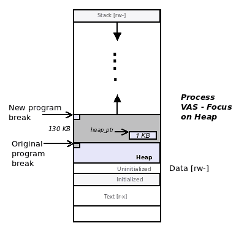
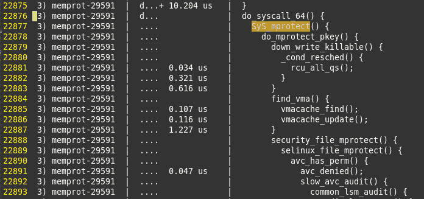

# 第四章：动态内存分配

在本章中，我们将深入探讨现代操作系统上的系统编程的一个关键方面 – 动态（运行时）内存分配和释放的管理。我们将首先介绍用于动态分配和释放内存的基本 glibc API。然后，我们将超越这些基础，研究 VAS 中的程序中断和`malloc(3)`在不同情况下的行为。

然后，我们将使读者沉浸在一些高级讨论中：需求分页、内存锁定和保护，以及`alloca`API 的使用。

代码示例为读者提供了一个探索这些主题的机会。

在本章中，我们将涵盖以下主题：

+   基本的 glibc 动态内存管理 API 及其在代码中的正确使用

+   程序中断（及其通过`sbrk(3)`API 的管理）

+   `malloc(3)`在分配不同数量的内存时的内部行为

+   高级特性：

+   需求分页概念

+   内存锁定

+   内存区域保护

+   使用`alloca (3)`API 的替代方案

# glibc malloc(3) API 系列

在第二章中，*虚拟内存*，我们了解到在**虚拟地址空间**（**VAS**）的进程中有用于动态内存分配的区域或段。**堆段**就是这样一个动态区域 – 一个为进程的运行时消耗提供的免费内存礼物。

开发人员究竟如何利用这份内存的礼物？不仅如此，开发人员还必须非常小心地匹配内存*分配*和后续内存*释放*，否则系统将不会喜欢它！

**GNU C 库**（**glibc**）提供了一组小而强大的 API，使开发人员能够管理动态内存；它们的使用细节是本节的内容。

正如你将会看到的，内存管理 API 实际上只有几个：`malloc(3)`、`calloc`、`realloc`和`free`。然而，正确地使用它们仍然是一个挑战！接下来的章节（和章节）将揭示为什么会出现这种情况。继续阅读！

# malloc(3) API

也许应用程序开发人员最常用的 API 之一是著名的`malloc(3)`*。*

`foo(3)`的语法表示`foo`函数在手册（man 页面）的第三部分中 – 一个库 API，而不是系统调用。我们建议您养成阅读 man 页面的习惯。man 页面可以在线获取，您可以在[`linux.die.net/man/`](https://linux.die.net/man/)找到它们*。*

我们使用`malloc(3)`在运行时动态分配一块内存。这与静态 – 或编译时 – 内存分配相反，我们做出了一个声明，比如：

```
char buf[256];
```

在前面的情况下，内存是静态分配的（在编译时）。

那么，究竟如何使用`malloc(3)`？让我们来看看它的签名：

```
#include <stdlib.h>
void *malloc(size_t size);
```

`malloc(3)`的参数是要分配的字节数。但是`size_t`数据类型是什么？显然，它不是 C 原始数据类型；它是在典型的 64 位平台上的`typedef – long unsigned int`（确切的数据类型会随着平台的不同而变化；重要的是它总是无符号的 – 它不能是负数。在 32 位 Linux 上，它将是`unsigned int`）。确保您的代码与函数签名和数据类型精确匹配对于编写健壮和正确的程序至关重要。顺便说一句，确保您包含 API 签名所显示的头文件。

要在`printf`中打印`size_t`类型的变量，请使用**`%zu`**格式说明符：

`size_t sz = 4 * getpagesize();`

`[...]`

`printf("size = %zu bytes\n", sz);`

在本书中，我们不会深入探讨`malloc(3)`和其它内部实现细节，实际上是如何存储、分配和释放内存的（请参阅 GitHub 存储库上的*进一步阅读*部分）。可以说，内部实现力求尽可能高效；通常认为使用这些 API 是执行内存管理的正确方式。

成功时返回值是指向新分配的内存区域的第一个字节的指针，失败时返回 NULL。

你会遇到，我们可以说是*乐观主义者*，他们会说诸如“不要费心检查`malloc`是否失败，它从不失败”。好吧，对这个明智的建议要持保留态度。虽然`malloc`很少会失败，但事实是（正如你将看到的），它可能会失败。编写防御性代码——立即检查失败情况的代码——是编写坚固、健壮程序的基石。

因此，使用这个 API 非常简单：例如，动态分配 256 字节的内存，并将指向新分配区域的指针存储在`ptr`变量中：

```
void *ptr;
ptr = malloc(256);
```

作为另一个典型的例子，程序员需要为一个数据结构分配内存；我们称之为`struct sbar`。你可以这样做：

```
    struct sbar {
        int a[10], b[10];
        char buf[512];
    } *psbar;

 psbar = malloc(sizeof(struct sbar));
    // initialize and work with it
    [...]
    free(psbar);
```

嘿，敏锐的读者！那么检查失败情况呢？这是一个关键点，所以我们将像这样重写前面的代码（当然，对于`malloc(256)`的代码片段也是如此）：

```
struct [...] *psbar;
sbar = malloc(sizeof(struct sbar));
if (!sbar) {
 *<... handle the error ...>*
}
```

让我们使用强大的跟踪工具`ltrace`来检查这是否按预期工作；`ltrace`用于显示进程执行路径中的所有库 API（类似地，使用`strace`来跟踪所有系统调用）。假设我们编译了前面的代码，生成的二进制可执行文件名为`tst`：

```
$ ltrace ./tst 
malloc(592)           = 0xd60260
free(0xd60260)        = <void>
exit(0 <no return ...>
+++ exited (status 0) +++
$ 
```

我们可以清楚地看到`malloc(3)`（以及我们使用的示例结构在 x86_64 上占用了 592 字节），以及它的返回值（跟在`=`符号后面）。接着是`free` API，然后简单地退出。

重要的是要理解`malloc(3)`分配的内存块的*内容*被认为是随机的。因此，程序员有责任在从中读取之前初始化内存；如果未能这样做，将导致一个称为**未初始化内存读取**（UMR）的错误（在下一章中会更详细介绍）。

`malloc(3)`总是返回一个按 8 字节边界对齐的内存区域。需要更大的对齐值吗？使用`posix_memalign(3)` API。像通常一样使用`free(3)`释放其内存。

有关`posix_memalign(3)`的详细信息可以在 man 页面上找到[`linux.die.net/man/3/posix_memalign`](https://linux.die.net/man/3/posix_memalign)。使用`posix_memalign(3)` API 的示例可以在*锁定内存*和*内存保护*部分找到。

# malloc(3) – 一些常见问题

以下是一些常见问题，这些问题将帮助我们更多地了解`malloc(3)`：

+   常见问题 1：`malloc(3)`可以一次分配多少内存？

在实际情况下是一个相当无意义的问题，但经常被问到！

`malloc(3)`的参数是`size_t`数据类型的整数值，因此，从逻辑上讲，我们可以作为参数传递给`malloc(3)`的最大数字是平台上`size_t`可以取的最大值。从实际上来说，在 64 位 Linux 上，`size_t`将是 8 字节，当然，以位来说是 8*8 = 64。因此，在单次`malloc(3)`调用中可以分配的最大内存量是`2⁶⁴`！

那么，它是多少呢？让我们来实证（在第十九章中阅读很重要，*故障排除和最佳实践*，以及关于*实证方法*的简要讨论）。并实际尝试一下（请注意，以下代码片段必须使用`-lm`开关链接数学库）：

```
    int szt = sizeof(size_t);
    float max=0;
    max = pow(2, szt*8);
    printf("sizeof size_t = %u; " 
            "max value of the param to malloc = %.0f\n", 
            szt, max);
```

在 x86_64 上的输出：

**`sizeof size_t = 8; max param to malloc = 18446744073709551616`**

啊哈！这是一个非常大的数字；更易读地说，如下所示：

`2⁶⁴ = 18,446,744,073,709,551,616 = 0xffffffffffffffff`

这是 16EB（EB，即 16384PB，即 1600 万 TB）！

因此，在 64 位操作系统上，`malloc(3)`可以在一次调用中分配最多 16EB。理论上。

通常情况下，还有更多：请参见*常见问题 2*；它将揭示这个问题的*理论*答案是**8EB**（8EB）。

实际上，这是不可能的，因为这当然是进程本身的整个用户模式 VAS。实际上，可以分配的内存量受堆上连续可用的空闲内存量的限制。实际上，还有更多。正如我们很快将了解的那样（在*malloc(3)的真正行为*部分），`malloc(3)`的内存也可以来自 VAS 的其他区域。不要忘记数据段大小有资源限制；默认情况下通常是无限的，这意味着没有操作系统施加的人为限制，正如我们在本章中讨论的那样。

因此，在实践中，最好是明智一点，不要假设任何事情，并检查返回值是否为 NULL。

顺便说一下，在 32 位操作系统上，`size_t`可以取的最大值是多少？因此，我们通过向编译器传递`-m32`开关在 x86_64 上编译 32 位：

```
$ gcc -m32 mallocmax.c -o mallocmax32 -Wall -lm
$ ./mallocmax32
*** max_malloc() ***
sizeof size_t = 4; max value of the param to malloc = 4294967296
[...]
$ 
```

显然，这是 4GB（千兆字节）- 再次，32 位进程的整个 VAS。

+   常见问题 2：如果我传递`malloc(3)`一个负参数会怎么样？

`malloc(3)`的参数数据类型`size_t`是一个无符号整数量-它不能是负数。但是，人是不完美的，**整数溢出**（**IOF**）错误确实存在！你可以想象一个程序试图计算要分配的字节数的情况，就像这样：

`num = qa * qb;`

如果`num`声明为有符号整数变量，`qa`和`qb`足够大，使得乘法操作的结果导致溢出，`num`的结果将会变成负数！`malloc(3)`当然应该失败。但是等等：如果`num`变量声明为`size_t`（这应该是情况），负数将变成一些正数！

mallocmax 程序有一个针对此的测试用例。

在 x86_64 Linux 系统上运行时的输出如下：

```
*** negative_malloc() ***
size_t max    = 18446744073709551616
ld_num2alloc  = -288225969623711744
szt_num2alloc = 18158518104085839872
1\. long int used:  malloc(-288225969623711744) returns (nil)
2\. size_t used:    malloc(18158518104085839872) returns (nil)
3\. short int used: malloc(6144) returns 0x136b670
4\. short int used: malloc(-4096) returns (nil)
5\. size_t used:    malloc(18446744073709547520) returns (nil)
```

以下是相关的变量声明：

```
const size_t onePB    = 1125899907000000; /* 1 petabyte */
int qa = 28*1000000;
long int ld_num2alloc = qa * onePB;
size_t szt_num2alloc  = qa * onePB;
short int sd_num2alloc;
```

现在，让我们尝试 32 位版本的程序。

请注意，在默认安装的 Ubuntu Linux 系统上，32 位编译可能会失败（出现诸如`fatal error: bits/libc-header-start.h: No such file or directory`*）*的错误。不要惊慌：这通常意味着默认情况下没有编译 32 位二进制文件的编译器支持。要获得它（如在*硬件-软件列表*文档中提到的），安装`multilib`编译器包：`sudo apt-get install gcc-multilib`。

为 32 位编译并运行它：

```
$ ./mallocmax32 
*** max_malloc() ***
sizeof size_t = 4; max param to malloc = 4294967296
*** negative_malloc() ***
size_t max    = 4294967296
ld_num2alloc  = 0
szt_num2alloc = 1106247680
1\. long int used:  malloc(-108445696) returns (nil)
2\. size_t used:    malloc(4186521600) returns (nil)
3\. short int used: malloc(6144) returns 0x85d1570
4\. short int used: malloc(-4096) returns (nil)
5\. size_t used:    malloc(4294963200) returns (nil)
$ 
```

公平地说，编译器确实警告我们：

```
gcc -Wall   -c -o mallocmax.o mallocmax.c
mallocmax.c: In function ‘negative_malloc’:
mallocmax.c:87:6: warning: argument 1 value ‘18446744073709551615’ exceeds maximum object size 9223372036854775807 [-Walloc-size-larger-than=]
  ptr = malloc(-1UL);
  ~~~~^~~~~~~~~~~~~~
In file included from mallocmax.c:18:0:
/usr/include/stdlib.h:424:14: note: in a call to allocation function ‘malloc’ declared here
 extern void *malloc (size_t __size) __THROW __attribute_malloc__ __wur;
              ^~~~~~ 
[...]
```

有趣！编译器现在回答了我们的*常见问题 1*：

```
[...] warning: argument 1 value ‘18446744073709551615’ *exceeds maximum object size* *9223372036854775807* [-Walloc-size-larger-than=] [...]
```

编译器允许分配的最大值似乎是 9223372036854775807。

哇。简单的计算时间表明这是 8192PB = 8EB！因此，我们必须得出结论：对于上一个问题的正确答案是：*`malloc`一次调用可以分配多少内存？*答案：*8EB*。再次，理论上。

+   常见问题 3：如果我使用`malloc(0)`会怎么样？

不多；根据实现的不同，`malloc(3)`将返回 NULL，或者一个可以传递给 free 的非 NULL 指针。当然，即使指针是非 NULL 的，也没有内存，所以不要尝试使用它。

让我们试一试：

```
    void *ptr;
    ptr = malloc(0);
    free(ptr);
```

我们编译然后通过`ltrace`运行它：

```
$ ltrace ./a.out 
malloc(0)                                  = 0xf50260
free(0xf50260)                                = <void>
exit(0 <no return ...>
+++ exited (status 0) +++
$ 
```

在这里，`malloc(0)`确实返回了一个非 NULL 指针。

+   常见问题 4：如果我使用`malloc(2048)`并尝试读/写超出 2048 字节会怎么样？

当然，这是一个错误-一个越界内存访问错误，进一步定义为读取或写入缓冲区溢出。请稍等，关于内存错误的详细讨论（以及随后如何找到和修复它们）是第五章的主题，*Linux 内存问题*，以及第六章，*内存问题的调试工具*。

# malloc(3) - 快速总结

因此，让我们总结一下关于`malloc(3)` API 使用的关键点：

+   `malloc(3)`在运行时从进程堆中动态分配内存

+   正如我们很快将了解的那样，这并不总是情况

+   `malloc(3)`的单个参数是一个无符号整数值-要分配的字节数。

+   成功时返回值是指向新分配的内存块开头的指针，失败时返回 NULL：

+   您必须检查失败的情况；不要假设它会成功

+   `malloc(3)`总是返回一个按 8 字节边界对齐的内存区域

+   新分配的内存区域的内容被认为是随机的

+   在从中读取任何部分之前，您必须对其进行初始化

+   您必须释放您分配的内存

# free API

在这个生态系统中开发的黄金规则之一是程序员分配的内存必须被释放。

未能这样做会导致糟糕的情况-一个错误，真的-称为**内存泄漏**；这在下一章中有比较深入的介绍。仔细匹配您的分配和释放是至关重要的。

然而，在较小的实际项目（实用程序）中，您会遇到只分配一次内存的情况；在这种情况下，释放内存是迂腐的，因为整个虚拟地址空间在进程终止时被销毁。此外，使用`alloca(3)` API 意味着您不需要释放内存区域（稍后在*高级特性*部分中看到）。尽管如此，建议您谨慎行事！

使用`free(3)` API 很简单：

`void free(void *ptr);`

它接受一个参数：要释放的内存块的指针。`ptr`必须是`malloc(3)`系列例程（`malloc(3)`，`calloc`或`realloc[array]`）返回的指针。

`free`不返回任何值；甚至不要尝试检查它是否起作用；如果您使用正确，它就起作用了。有关 free 的更多信息，请参阅*释放的内存去哪里了？*部分。一旦释放了内存块，您显然不能尝试再次使用该内存块的任何部分；这样做将导致错误（或者所谓的**UB-未定义行为**）。

关于`free()`的一个常见误解有时会导致其以错误的方式使用；看一下这个伪代码片段：

```
void *ptr = NULL;
[...] 
while(*<some-condition-is-true>*) {
    if (!ptr)
        ptr = malloc(n);

    [...
   * <use 'ptr' here>*
    ...]

    free(ptr);
}
```

这个程序可能会在循环中崩溃（在`<use 'ptr' here>`代码内）。为什么？因为`ptr`内存指针被释放并且正在尝试被重用。但是为什么？啊，仔细看：代码片段只有在`ptr`当前为 NULL 时才会`malloc(3)`指针，也就是说，其程序员假设一旦我们`free()`内存，我们刚刚释放的指针就会被设置为 NULL。这并不是事实！

在编写代码时要谨慎并且要有防御性。不要假设任何事情；这是一个错误的丰富来源。重要的是，我们的第十九章，*故障排除和最佳实践*，涵盖了这些要点）

# free - 快速总结

因此，让我们总结一下关于*free* API 使用的关键点：

+   传递给`free(3)`的参数必须是`malloc(3)`系列 API（`malloc(3)`，`calloc`或`realloc[array]`）返回的值。

+   `free`没有返回值。

+   调用`free(ptr)`不会将`ptr`设置为`NULL`（尽管这样做会很好）。

+   一旦释放，不要尝试使用已释放的内存。

+   不要尝试多次*free*相同的内存块（这是一个错误-UB）。

+   目前，我们将假设释放的内存返回给系统。

+   天哪，不要忘记释放先前动态分配的内存。被遗忘的内存被称为*泄漏*，这是一个非常难以捕捉的错误！幸运的是，有一些工具可以帮助我们捕捉这些错误。更多内容请参阅第五章，*Linux 内存问题*，和第六章，*内存问题的调试工具*。

# calloc API

`calloc(3)` API 与`malloc(3)`几乎相同，主要有两个不同之处：

+   它将分配的内存块初始化为零值（即 ASCII 0 或 NULL，而不是数字`0`）

+   它接受两个参数，而不是一个

`calloc(3)`函数签名如下：

` void *calloc(size_t nmemb, size_t size);`

第一个参数`nmemb`是 n 个成员；第二个参数`size`是每个成员的大小。实际上，`calloc(3)`分配了一个大小为`(nmemb*size)`字节的内存块。因此，如果你想为一个包含 1,000 个整数的数组分配内存，你可以这样做：

```
    int *ptr;
    ptr = calloc(1000, sizeof(int));
```

假设整数的大小为 4 字节，我们将总共分配了（1000*4）= 4000 字节。

每当需要为一组项目分配内存（在应用程序中经常使用的一种情况是结构数组），`calloc`是一种方便的方式，既可以分配内存，又可以同时初始化内存。

需求分页（本章后面介绍），是程序员使用`calloc`而不是`malloc(3)`的另一个原因（在实践中，这对实时应用程序非常有用）。在即将到来的部分中了解更多信息。

# realloc API

`realloc` API 用于*调整*现有内存块的大小——增大或缩小。这种调整只能在先前使用`malloc(3)`系列 API 之一（通常的嫌疑犯：`malloc(3)`，`calloc`或`realloc[array]`）分配的内存块上执行。以下是其签名：

` void *realloc(void *ptr, size_t size);`

第一个参数`ptr`是先前使用`malloc(3)`系列 API 之一分配的内存块的指针；第二个参数`size`是内存块的新大小——它可以比原来的大或小，从而增大或缩小内存块。

一个快速的示例代码片段将帮助我们理解`realloc`：

```
void *ptr, *newptr;
ptr = calloc(100, sizeof(char)); // error checking code not shown here
newptr = realloc(ptr, 150);
if (!newptr) {
    fprintf(stderr, "realloc failed!");
 free(ptr);
    exit(EXIT_FAILURE);
}
*< do your stuff >*
free(newptr);
```

`realloc`返回的指针是新调整大小的内存块的指针；它可能与原始`ptr`的地址相同，也可能不同。实际上，你现在应该完全忽略原始指针`ptr`，并将`realloc`返回的`newptr`指针视为要处理的指针。如果失败，返回值为 NULL（检查它！），原始内存块将保持不变。

一个关键点：`realloc(3)`返回的指针`newptr`是随后必须释放的指针，*而不是*指向（现在调整大小的）内存块的原始指针（`ptr`）。当然，不要尝试释放两个指针，因为那是一个错误。

刚刚调整大小的内存块的内容呢？它们保持不变，直到`MIN(original_size, new_size)`。因此，在前面的例子中，`MIN(100, 150) = 100`，100 字节的内存内容将保持不变。剩下的部分（50 字节）呢？它被视为随机内容（就像`malloc(3)`一样）。

# `realloc(3)——边界情况`

考虑以下代码片段：

```
void *ptr, *newptr;
ptr = calloc(100, sizeof(char)); // error checking code not shown here
newptr = realloc(NULL, 150);
```

`realloc`传递的指针是`NULL`？库将其视为等同于新分配的`malloc(150)`；以及`malloc(3)`的所有含义。就是这样。

现在，考虑以下代码片段：

```
void *ptr, *newptr;
ptr = calloc(100, sizeof(char)); // error checking code not shown here
newptr = realloc(ptr, 0);
```

传递给`realloc`的大小参数是`0`？库将其视为等同于`free(ptr)`*.*就是这样。

# reallocarray API

一种情况：你使用`calloc(3)`为一个数组分配内存；后来，你想将其调整大小为更大。我们可以使用`realloc(3)`来做到；例如：

```
struct sbar *ptr, *newptr;
ptr = calloc(1000, sizeof(struct sbar)); // array of 1000 struct sbar's
[...]
// now we want 500 more!
newptr = realloc(ptr, 500*sizeof(struct sbar));
```

好的。不过，有一种更简单的方法——使用`reallocarray(3)` API。其签名如下：

` void *reallocarray(void *ptr, size_t nmemb, size_t size);`

有了它，代码变得更简单：

```
[...]
// now we want 500 more!
newptr = reallocarray(ptr, 500, sizeof(struct sbar));
```

`reallocarray`的返回值与`realloc` API 非常相似：成功时调整大小的新内存块的新指针（可能与原始指针不同），失败时为`NULL`。如果失败，原始内存块将保持不变。

`reallocarray`相对于`realloc`有一个真正的优势——安全性。从*realloc(3)*的手册页上看到这段代码：

```
... However, unlike that realloc() call, reallocarray() fails safely in the case where the  multiplication  would  overflow.   If  such  an  overflow occurs, reallocarray() returns NULL, sets errno to ENOMEM, and leaves the original block of memory unchanged.
```

还要意识到，`reallocarray`API 是 GNU 的扩展；它将在现代 Linux 上工作，但不应被认为在其他操作系统上是可移植的。

最后，请考虑：一些项目对其数据对象有严格的对齐要求；使用`calloc`（甚至通过`malloc(3)`分配这些对象）可能导致微妙的错误！在本章后面，我们将使用`posix_memalign(3)`API——它保证按给定的字节对齐分配内存（您指定字节数）！例如，要求内存分配对齐到页面边界是相当常见的情况（请回忆，malloc 总是返回一个按 8 字节边界对齐的内存区域）。

底线：小心。阅读文档，思考，并决定在特定情况下哪个 API 更合适。在 GitHub 存储库的*进一步阅读*部分中有更多信息。

# 基础之外

在本节中，我们将深入探讨`malloc(3)`API 系列的动态内存管理。了解这些领域，以及第五章的内容，*Linux 内存问题*，以及第六章，*内存问题的调试工具*，将有助于开发人员有效地调试常见的内存错误和问题。

# 程序中断

当进程或线程需要内存时，它调用动态内存例程之一——通常是`malloc(3)`或`calloc(3)`；这段内存（通常）来自**堆段**。如前所述，堆是一个动态段——它可以增长（朝着更高的虚拟地址）。显然，但是，在任何给定的时间点，堆都有一个终点或顶部，超过这个顶部就不能再取内存了。这个终点——堆上最后一个合法可引用的位置——称为**程序中断**。

# 使用 sbrk() API

那么，你如何知道当前程序中断在哪里？这很容易——当使用参数值为零的`sbrk(3)`API 时，它会返回当前程序中断！让我们快速查找一下：

```
#include <unistd.h>
[...]
    printf("Current program break: %p\n", sbrk(0));
```

当前面的代码行运行时，您将看到以下示例输出：

```
$ ./show_curbrk 
Current program break: 0x1bb4000
$ ./show_curbrk 
Current program break: 0x1e93000
$ ./show_curbrk 
Current program break: 0x1677000
$ 
```

它有效，但为什么程序中断值保持改变（看起来是随机的）？嗯，它确实是随机的：出于安全原因，Linux 随机化了进程的虚拟地址空间布局（我们在第二章中介绍了进程 VAS 布局，*虚拟内存*）。这种技术称为**地址空间布局随机化**（**ASLR**）。

让我们再做一点：我们将编写一个程序，如果没有任何参数运行，仅显示当前程序中断并退出（就像我们刚才看到的那样）；如果传递一个参数——动态分配内存的字节数，它将这样做（使用`malloc(3)`），然后打印返回的堆地址以及原始和当前程序中断。在这里，您只能请求少于 128KB 的内存，稍后将会解释原因。

参考`ch4/show_curbrk.c`：

```
int main(int argc, char **argv)
{
    char *heap_ptr;
    size_t num = 2048;

    /* No params, just print the current break and exit */
    if (argc == 1) {
        printf("Current program break: %p\n", sbrk(0));
        exit(EXIT_SUCCESS);
    }

    /* If passed a param - the number of bytes of memory to
     * dynamically allocate - perform a dynamic alloc, then
     * print the heap address, the current break and exit.
     */
    num = strtoul(argv[1], 0, 10);
    if ((errno == ERANGE && num == ULONG_MAX)
         || (errno != 0 && num == 0))
         handle_err(EXIT_FAILURE, "strtoul(%s) failed!\n", argv[1]);
    if (num >= 128 * 1024)
         handle_err(EXIT_FAILURE, "%s: pl pass a value < 128 KB\n",
         argv[0]);

    printf("Original program break: %p ; ", sbrk(0));
    heap_ptr = malloc(num);
    if (!heap_ptr)
        handle_err(EXIT_FAILURE, "malloc failed!");
    printf("malloc(%lu) = %16p ; curr break = %16p\n",
            num, heap_ptr, sbrk(0));
    free(heap_ptr);

    exit(EXIT_SUCCESS);
}
```

让我们试一试：

```
$ make show_curbrk && ./show_curbrk [...]
Current program break: 0x1247000
$ ./show_curbrk 1024
Original program break: 0x1488000 ; malloc(1024) =        0x1488670 ; 
curr break =        0x14a9000
$ 
```

有趣（见下图）！使用 1024 字节的分配，返回到该内存块开头的堆指针是`0x1488670`；这是从原始中断的`0x1488670 - 0x1488000 = 0x670 = 1648`字节。

还要意识到，新的中断值是`0x14a9000`，即`(0x14a9000 - 0x1488670 = 133520)`，大约从新分配的块增加了 130KB。为什么堆为了仅仅 1KB 的分配而增长了这么多？耐心等待；这个问题以及更多内容将在下一节*malloc(3)的真正行为*中进行探讨。同时，请参考下图：



堆和程序中断

关于前面的图表：

```
Original program break = 0x1488000
heap_ptr               = 0x1488670
New program break      = 0x14a9000
```

请注意，`sbrk(2)`可以用于增加或减少程序断点（通过传递整数参数）。乍一看，这似乎是分配和释放动态内存的一种好方法；实际上，最好使用经过充分记录和可移植的 glibc 实现，即`malloc(3)`家族的 API。

`sbrk`是对`brk(2)`系统调用的一个方便的库包装。

# malloc(3)的真正行为

普遍的共识是，`malloc(3)`（以及`calloc(3)`和`reallocarray`）从堆段获取其内存。这确实是事实，但深入挖掘会发现这并非*总是*如此。现代的 glibc `malloc(3)`引擎使用一些微妙的策略来最优化地利用可用的内存区域和进程 VAS——尤其是在当今的 32 位系统上，这已经成为一种相当稀缺的资源。

那么，它是如何工作的呢？库使用预定义的`MMAP_THRESHOLD`变量–其默认值为 128 KB–来确定从哪里分配内存。让我们想象一下，我们正在使用 malloc(n)分配*n*字节的内存：

+   如果*n < MMAP_THRESHOLD*，则使用堆段来分配请求的*n*字节

+   如果*n >= MMAP_THRESHOLD*，并且堆的空闲列表中没有 n 字节可用，则使用虚拟地址空间的任意空闲区域来满足请求的*n*字节分配。

第二种情况下内存是如何分配的？啊，`malloc(3)`在内部调用`mmap(2)`——内存映射系统调用。`mmap`系统调用非常灵活。在这种情况下，它被用来保留调用进程的虚拟地址空间中的 n 字节的空闲区域！

为什么使用`mmap(2)`？关键原因是 mmap 的内存总是可以在需要时以独立的方式释放（归还给系统）；这在使用`free(3)`时并非总是如此。

当然，也有一些缺点：`mmap`分配可能很昂贵，因为内存是页面对齐的（因此可能是浪费的），而且内核会将内存区域清零（这会影响性能）。

`mallopt(3)`手册页（截至 2016 年 12 月）还指出，现在的 glibc 使用动态 mmap 阈值；最初的值是通常的 128 KB，但如果在当前阈值和`DEFAULT_MMAP_THRESHOLD_MAX`之间释放了一个大内存块，阈值就会增加到与释放块的大小相同。

# 代码示例– malloc(3)和程序断点

我们亲眼看到`malloc(3)`分配对堆和进程虚拟地址空间的影响是有趣且富有教育意义的。查看以下代码示例的输出（源代码可在本书的 Git 存储库中找到）：

```
$ ./malloc_brk_test -h
Usage: ./malloc_brk_test [option | --help]
 option = 0 : show only mem pointers [default]
 option = 1 : opt 0 + show malloc stats as well
 option = 2 : opt 1 + perform larger alloc's (over MMAP_THRESHOLD)
 option = 3 : test segfault 1
 option = 4 : test segfault 2
-h | --help : show this help screen
$ 
```

在这个应用程序中有几种情景正在运行；现在让我们来检查其中的一些。

# 情景 1–默认选项

我们以默认方式运行`malloc_brk_test`程序，即不使用任何参数：

```
$ ./malloc_brk_test
                              init_brk =        0x1c97000
 #: malloc(       n) =        heap_ptr           cur_brk   delta  
                                                      [cur_brk-init_brk]
 0: malloc(       8) =        0x1c97670         0x1cb8000 [135168]
 1: malloc(    4083) =        0x1c97690         0x1cb8000 [135168]
 2: malloc(       3) =        0x1c98690         0x1cb8000 [135168]
$ 
```

进程打印出其初始程序断点值：`0x1c97000`。然后它只分配了 8 字节（通过`malloc(3)`API）；在幕后，glibc 分配引擎调用了*sbrk(2)*系统调用来增加堆；新的断点现在是`0x1cb8000`，比之前的断点增加了 135,168 字节= 132 KB（在前面的代码中的`delta`列中清楚可见）！

为什么？优化：glibc 预期，将来进程将需要更多的堆空间；而不是每次调用系统调用（*`sbrk/brk`)*的开销，它执行一次相当大的堆增长操作。左侧列中的下两个`malloc(3)`API（编号为 1 和 2）证明了这一点：我们分别分配了 4,083 和 3 字节，你注意到了什么？程序断点*没有*改变–堆已经足够大，可以容纳这些请求。 

# 情景 2–显示 malloc 统计信息

这一次，我们传递了`1`参数，要求它也显示`malloc(3)`的统计信息（使用`malloc_stats(3)`API 实现）：

```
$ ./malloc_brk_test 1
                              init_brk =   0x184e000
 #: malloc(       n) =        heap_ptr     cur_brk   delta   
                                            [cur_brk-init_brk]
 0: malloc(       8) =        0x184e670    0x186f000 [135168]
Arena 0:
system bytes     =     135168
in use bytes     =       1664
Total (incl. mmap):
system bytes     =     135168
in use bytes     =       1664
max mmap regions =          0
max mmap bytes   =          0

 1: malloc(    4083) =        0x184e690    0x186f000 [135168]
Arena 0:
system bytes     =     135168
in use bytes     =       5760
Total (incl. mmap):
system bytes     =     135168
in use bytes     =       5760
max mmap regions =          0
max mmap bytes   =          0

 2: malloc(       3) =        0x184f690    0x186f000 [135168]
Arena 0:
system bytes     =     135168
in use bytes     =       5792
Total (incl. mmap):
system bytes     =     135168
in use bytes     =       5792
max mmap regions =          0
max mmap bytes   =          0              
```

输出类似，除了程序调用有用的`malloc_stats(3)` API，该 API 查询并打印`malloc(3)`的状态信息到`stderr`（顺便说一句，arena 是`malloc(3)`引擎内部维护的分配区域）。从这个输出中，注意到：

+   可用的空闲内存-系统字节-为 132 KB（在执行一个小的 8 字节`malloc(3)`之后）

+   每次分配时，正在使用的字节都会增加，但系统字节保持不变

+   `mmap`区域和`mmap`字节数为零，因为没有发生基于 mmap 的分配。

# 情景 3-大分配选项

这次，我们传递了`2`参数，要求程序执行更大的分配（大于`MMAP_THRESHOLD`）：

```
$ ./malloc_brk_test 2
                              init_brk =        0x2209000
 #: malloc(       n) =        heap_ptr           cur_brk   delta 
                                                      [cur_brk-init_brk]
[...]

 3: malloc(  136168) =   0x7f57288cd010         0x222a000 [135168]
Arena 0:
system bytes     =     135168
in use bytes     =       5792
Total (incl. mmap):
system bytes     =     274432
in use bytes     =     145056
max mmap regions =          1
max mmap bytes   =     139264

 4: malloc( 1048576) =   0x7f57287c7010         0x222a000 [135168]
Arena 0:
system bytes     =     135168
in use bytes     =       5792
Total (incl. mmap):
system bytes     =    1327104
in use bytes     =    1197728
max mmap regions =          2
max mmap bytes   =    1191936

$                     
```

（请注意，我们已经剪辑了前两个小分配的输出，并且只显示了相关的大分配）。

现在，我们分配 132 KB（前面输出的第 3 点）；需要注意的是：

+   分配（＃3 和＃4）分别为 132 KB 和 1 MB - 都超过了`MMAP_THRESHOLD`（值为 128 KB）

+   （arena 0）堆*正在使用的字节*（5,792）在这两个分配中完全没有改变，表明堆内存*没有*被使用

+   最大的 mmap 区域和最大的 mmap 字节数已经改变为正值（从零开始），表示使用了 mmap 内存

稍后将检查剩下的几种情况。

# 释放的内存去哪了？

`free(3)`，当然，是一个库例程，所以可以推断，当我们释放内存，之前由动态分配例程之一分配的内存不会被释放回系统，而是被释放到进程堆（当然，这是虚拟内存）。

然而，至少有两种情况下可能不会发生这种情况：

+   如果分配是通过*mmap*而不是通过堆段内部满足的，它会立即被释放回系统。

+   在现代的 glibc 上，如果释放的堆内存量非常大，这会触发将至少一些内存块返回给操作系统。

# 高级功能

现在将介绍一些高级功能：

+   需求分页

+   锁定内存在 RAM 中

+   内存保护

+   使用*alloca(3)*进行分配

# 需求分页

我们大多数人都知道，如果一个进程动态分配内存，使用`malloc`，比如它做了`ptr = malloc(8192) ;`，然后，假设成功，进程现在分配了 8 KB 的物理 RAM。这可能会让人感到惊讶，但是，在现代的操作系统如 Linux 上，实际上并不是这样。

那么，情况是什么？（在本书中，我们不深入研究内核级细节。另外，正如你可能知道的，操作系统分配器的内存粒度是*页面*，通常为 4 KB。）

在编写健壮的软件时，假设任何事情都不是一个好主意。那么，如何正确确定操作系统的页面大小？使用`sysconf(3)` API；例如，`printf("page size = %ld\n", **sysconf(_SC_PAGESIZE)**);`，输出`page size = 4096`。

或者，使用`getpagesize(2)`系统调用来检索系统页面大小。（重要的是，参见第十九章，*故障排除和最佳实践*，在*程序员的清单：7 条规则*部分涵盖了类似的观点）。

实际上，所有的 malloc 只是从进程 VAS 中保留虚拟页面的内存。

那么，进程何时获得实际的物理页面呢？啊，当进程实际上窥视或触及页面中的任何字节时，实际上是在任何页面上进行任何访问（尝试读取/写入/执行它）时，进程会陷入操作系统 - 通过称为页面错误的硬件异常 - 并且在操作系统的错误处理程序中，如果一切正常，操作系统会为虚拟页面分配一个物理页帧。这种高度优化的向进程分配物理内存的方式称为**需求分页** - 只有在实际需要时才会分配物理页面！这与操作系统人员所称的内存或虚拟内存超额分配功能密切相关；是的，这是一个功能，而不是一个错误。

如果要保证在虚拟分配后分配物理页帧，可以：

+   在所有页面的所有字节上执行`malloc(3)`，然后执行`memset(3)`

+   只需使用`calloc(3)`；它会将内存设置为零，从而引发错误

在许多实现中，第二种方法 - 使用`calloc(3)` - 比第一种方法更快。

正是因为需求分页，我们才能编写一个 malloc 大量内存并且从不释放它的应用程序；只要进程不尝试读取、写入或执行分配区域的任何（虚拟）页面的任何字节，它就可以正常工作。显然，有许多现实世界的应用程序设计得非常糟糕，确实做了这种事情 - 通过`malloc(3)`分配大量内存，以防万一需要。需求分页是操作系统对浪费大量实际上很少使用的物理内存的一种保护。

当然，聪明的读者会意识到每个优势可能都有一个劣势。在这种情况下，可能会同时进行几个进程执行大内存分配。如果它们都分配了大量的虚拟内存，并且想要在大致相同的时间实际上占用这些页面，这将给操作系统带来巨大的内存压力！而且，操作系统绝对不保证它能成功为每个进程提供服务。事实上，在最坏的情况下，Linux 操作系统将缺乏物理内存，以至于必须调用一个有争议的组件 - **Out-of-Memory** (**OOM**) Killer - 其工作是识别占用内存的进程并将其及其后代杀死，从而回收内存并保持系统运行。这让你想起黑手党了，是吧。

再次，`malloc(3)`的 man 页面清楚地指出了以下内容：

```
By  default, Linux follows an optimistic memory allocation strategy. This means that when malloc() returns non-NULL there is no guarantee that the memory really is available.  In case it turns out that the system is out of memory, one or more processes will be killed by the OOM  killer.
[...]
```

如果感兴趣，可以在 GitHub 存储库的*进一步阅读*部分中查看参考资料。

# 驻留还是不驻留？

现在我们清楚地了解了由*malloc*和朋友分配的页面是虚拟的，不能保证由物理页框支持（至少起初是这样），想象一下我们有一个指向（虚拟）内存区域的指针，并且知道它的长度。我们现在想知道相应的页面是否在 RAM 中，也就是说，它们是*驻留*还是不驻留。

事实证明，有一个系统调用可以提供精确的信息：`mincore(2)`。

`mincore(2)`系统调用的发音是 m-in-core，而不是 min-core。*Core*是一个用来描述物理内存的古老词语。

让我们看一下以下代码：

```
#include <unistd.h>
#include <sys/mman.h>

int mincore(void *addr, size_t length, unsigned char *vec);
```

给定起始虚拟地址和长度，`mincore(2)`会填充第三个参数 - 一个向量数组。调用成功返回后，对于向量数组的每个字节，如果最低有效位（LSB）被设置，那么意味着相应的页面*是*驻留（在 RAM 中），否则不是（可能未分配或在交换中）。

使用`mincore(2)` man 页面可以获取使用详细信息：[`linux.die.net/man/2/mincore`](https://linux.die.net/man/2/mincore)。

当然，您应该意识到页面驻留返回的信息只是内存页面状态的一个快照：它可能在我们之下发生变化，也就是说，它（或可能）在性质上非常瞬态。

# 锁定内存

我们知道，在基于虚拟内存的操作系统（如 Linux）上，用户模式页面可以在任何时候被交换；Linux 内核内存管理代码做出这些决定。对于常规应用程序进程来说，这不应该有关系：每当它尝试访问（读取、写入或执行）页面内容时，内核将其分页回 RAM，并允许其像没有发生任何事情一样使用。这种处理通常称为*服务页面错误*（还有很多其他内容，但就本讨论的目的而言，这就足够了），对用户模式应用程序进程完全透明。

然而，有一些情况下，内存页面被分页写入 RAM 到交换空间，反之亦然是不希望的：

+   实时应用程序

+   加密（安全）应用程序

在实时应用程序中，关键因素（至少在其关键代码路径中）是确定性*——*铁一般的保证工作将花费一定的最坏情况时间，不会超过这个时间，无论系统的负载如何。

想象一下，实时进程正在执行关键代码路径，并且在那一刻必须从交换分区中分页数据页面——引入的延迟可能会破坏应用程序的特性，导致惨败（或更糟）。在这些情况下，我们，开发人员，需要一种方法来保证所述内存页面可以保证驻留在 RAM 中，从而避免任何页面错误。

在某些类型的安全应用程序中，它们可能会在内存中存储一些机密信息（密码、密钥）；如果包含这些信息的内存页面被写入磁盘（交换空间），则始终存在它在应用程序退出后仍然留在磁盘上的可能性——这就是所谓的信息泄漏，这是攻击者等待发动攻击的一个漏洞！在这里，再次需要保证这些页面不能被交换出去。

输入`mlock(2)`（以及相关的：*mlock2*和*mlockall*）系统调用；这些 API 的明确目的是锁定调用进程虚拟地址空间中的内存页面。让我们来看看如何使用`mlock(2)`。这是它的签名：

`int mlock(const void *addr, size_t len);`

第一个参数`addr`是指向要锁定的（虚拟）内存区域的指针；第二个参数`len`是要锁定到 RAM 中的字节数。举个简单的例子，看看下面的代码（这里为了保持易读性，我们不显示错误检查代码；在实际应用中，请务必这样做！）：

```
long pgsz = sysconf(_SC_PAGESIZE);
size_t len = 3*pgsz;

void *ptr = malloc(len);

[...]       // initialize the memory, etc

// Lock it!
if (mlock(ptr, len) != 0) {
     // mlock failed, handle it
     return ...;
}

[...]   /* use the memory, confident it is resident in RAM & will stay  
           there until unlocked */

munlock(ptr, len);   // it's now unlocked, can be swapped
```

# 限制和特权

特权进程，无论是通过以*root*身份运行，还是更好地通过设置`CAP_IPC_LOCK`能力位来锁定内存（我们将在它们自己的章节中详细描述进程凭据和能力——第七章，*进程凭据*，和第八章，*进程能力*），可以锁定无限量的内存。

从 Linux 2.6.9 开始，对于非特权进程，它受`RLIMIT_MEMLOCK`软资源限制的限制（通常不设置得很高）。以下是在 x86_64 Fedora 盒子（以及 Ubuntu）上的一个示例：

```
$ prlimit | grep MEMLOCK
MEMLOCK   max locked-in-memory address space   65536   65536 bytes
$ 
```

这只是 64 KB（在嵌入式 ARM Linux 上也是如此，默认情况下）。

在撰写本书时，最近在 x86_64 上运行的*Fedora 28*发行版上，最大锁定内存的资源限制似乎已经提升到 16 MB！以下*prlimit(1)*输出显示了这一点：

`$ prlimit | grep MEMLOCK`

`MEMLOCK     最大锁定内存地址空间     16777216  16777216 字节`

$

然而，当使用 mlock(2)时，POSIX 标准要求`addr`对齐到页面边界（即，如果你将内存起始地址除以系统页面大小，余数将为零，即，`(addr % pgsz) == 0`）。你可以使用`posix_memalign(3)`API 来保证这一点；因此，我们可以稍微改变我们的代码以适应这个对齐要求：

参考以下内容（`ch4/mlock_try.c`）：

```
[...]
#define CMD_MAX  256
static void disp_locked_mem(void)
{
    char *cmd = malloc(CMD_MAX);
    if (!cmd)
        FATAL("malloc(%zu) failed\n", CMD_MAX);
    snprintf(cmd, CMD_MAX-1, "grep Lck /proc/%d/status", getpid());
    system(cmd);
    free(cmd);
}

static void try_mlock(const char *cpgs)
{
    size_t num_pg = atol(cpgs);
    const long pgsz = sysconf(_SC_PAGESIZE);
    void *ptr= NULL;
    size_t len;

    len = num_pg * pgsz;
    if (len >= LONG_MAX)
        FATAL("too many bytes to alloc (%zu), aborting now\n", len);

/* ptr = malloc(len); */
/* Don't use the malloc; POSIX wants page-aligned memory for mlock */
    posix_memalign(&ptr, pgsz, len);
    if (!ptr)
        FATAL("posix_memalign(for %zu bytes) failed\n", len);

    /* Lock the memory region! */
    if (mlock(ptr, len)) {
        free(ptr);
        FATAL("mlock failed\n");
    }
    printf("Locked %zu bytes from address %p\n", len, ptr);
    memset(ptr, 'L', len);
    disp_locked_mem();
    sleep(1);

    /* Now unlock it.. */
    if (munlock(ptr, len)) {
        free(ptr);
        FATAL("munlock failed\n");
    }
    printf("unlocked..\n");
    free(ptr);
}

int main(int argc, char **argv)
{
    if (argc < 2) {
        fprintf(stderr, "Usage: %s pages-to-alloc\n", argv[0]);
        exit(EXIT_FAILURE);
    }
    disp_locked_mem();
    try_mlock(argv[1]);
    exit (EXIT_SUCCESS);
}
```

让我们试一试：

```
$ ./mlock_try Usage: ./mlock_try pages-to-alloc $ ./mlock_try 1 VmLck:           0 kB
Locked 4096 bytes from address 0x1a6e000
VmLck:           4 kB
unlocked.. $ ./mlock_try 32 VmLck:           0 kB mlock_try.c:try_mlock:79: mlock failed
perror says: Cannot allocate memory
$ 
$ ./mlock_try 15 VmLck:           0 kB
Locked 61440 bytes from address 0x842000
VmLck:          60 kB
unlocked.. $ sudo ./mlock_try 32 [sudo] password for <user>: xxx 
VmLck:           0 kB
Locked 131072 bytes from address 0x7f6b478db000
VmLck:         128 kB
unlocked..
$ prlimit | grep MEMLOCK MEMLOCK    max locked-in-memory address space     65536     65536 bytes
$ 
```

请注意，在成功的情况下，`posix_memalign(3)`*返回的地址；*它在页面边界上。我们可以通过查看地址的最后三位数字（从右边开始）来快速判断*–*如果它们都是零，那么它可以被页面大小整除，因此在页面边界上。这是因为页面大小通常为 4,096 字节，而 4096 十进制=0x1000 十六进制！

我们请求 32 页；分配成功，但*mlock*失败，因为 32 页=32*4K=128 KB；锁定内存的资源限制只有 64 KB。然而，当我们使用*sudo*（因此以 root 访问运行）时，它可以工作。

# 锁定所有页面

*mlock*基本上允许我们告诉操作系统将某个内存范围锁定到 RAM 中。然而，在一些实际情况下，我们无法准确预测我们将提前需要哪些内存页面（实时应用程序可能需要各种或所有内存页面始终驻留）。

为了解决这个棘手的问题，还有另一个系统调用*mlockall(2)*存在；正如你所猜测的，它允许你锁定所有进程内存页面：

`int mlockall(int flags);`

如果成功（记住，*mlockall*和*mlock*都受到相同的特权限制），进程的所有内存页面*–*如文本、数据段、库页面、堆栈和共享内存段*–*都保证保持驻留在 RAM 中，直到解锁。

*flags*参数为应用程序开发人员提供了进一步的控制；它可以是以下内容的按位或：

+   `MCL_CURRENT`

+   `MCL_FUTURE`

+   `MCL_ONFAULT（Linux 4.4 及以上版本）`

使用`MCL_CURRENT`要求操作系统将调用进程 VAS 中的所有当前页面锁定到内存中。

但是如果你在初始化时发出*mlockall(2)*系统调用，但是实时进程将在 5 分钟后执行一个 200 千字节的*malloc*呢？我们需要保证这 200 KB 的内存（即 50 页，假设页面大小为 4 KB）始终驻留在 RAM 中（否则，实时应用程序将因可能的未来页面故障而遭受太大的延迟）。这就是`MCL_FUTURE`标志的目的：它保证成为调用进程 VAS 的一部分的内存页面将始终保持驻留在内存中，直到解锁。

我们在*需求分页*部分学到，执行*malloc*只是保留虚拟内存，而不是物理内存。例如，如果一个（非实时）应用程序执行了一个相当大的分配，比如 1 兆字节（即 512 页），我们知道只有 512 个虚拟页面被保留，而物理页面框架实际上并没有被分配*–*它们将按需故障进入。因此，一个典型的实时应用程序需要以某种方式保证这 512 页一旦故障进入就会保持锁定（驻留）在 RAM 中。使用`MCL_ONFAULT`标志来实现这一点。

这个标志必须与`MCL_CURRENT`或`MCL_FUTURE`标志，或两者一起使用。其思想是，物理内存消耗保持极其高效（因为在*malloc*时没有进行物理分配），但一旦应用程序开始访问虚拟页面（即读取、写入或执行页面内的数据或代码），物理页面框架就会被故障进入，然后被锁定。换句话说，我们不预先故障内存，因此我们可以兼得两全其美。

另一面是，完成后，应用程序可以通过发出对应的 API：*munlockall(2)*来解锁所有内存页面。

# 内存保护

一个应用程序动态分配了四页内存。默认情况下，这块内存既可读又可写；我们称之为页面的*内存保护*。

如果应用程序开发人员能够动态修改每页的内存保护，那不是很好吗？例如，保持第一页的默认保护，将第二页设置为*只读*，将第三页设置为*读+执行*，并且在第四页上不允许任何访问（可能是一个守卫页？）。

这个特性正是`mprotect(2)`系统调用的设计目的。让我们深入研究如何利用它来实现所有这些。这是它的签名：

```
#include <sys/mman.h>
int mprotect(void *addr, size_t len, int prot);
```

这实际上非常简单：从（虚拟）地址`addr`开始，对`len`字节（即从`addr`到`addr+len-1`），应用*prot*位掩码指定的内存保护。由于*mprotect*的粒度是一页，因此预期第一个参数*addr*应该是页面对齐的（在页面边界上；回想一下，这正是`mlockall`所期望的）。

第三个参数`prot`是您指定实际保护的地方；它是一个位掩码，可以是`PROT_NONE`位，也可以是其余位的按位或：

| **保护位** | **内存保护的含义** |
| --- | --- |
| `PROT_NONE` | 页面上不允许任何访问 |
| `PROT_READ` | 页面上允许读取 |
| `PROT_WRITE` | 页面上允许写入 |
| `PROT_EXEC` | 页面上允许执行访问 |

在*mprotect(2)*的 man 页面中，*NOTES*部分有几个其他相当神秘的保护位和有用的信息。如果需要（或只是好奇），可以在这里阅读：[`man7.org/linux/man-pages/man2/mprotect.2.html`](http://man7.org/linux/man-pages/man2/mprotect.2.html)。

# 内存保护 - 代码示例

让我们考虑一个示例程序，其中进程动态分配了四页内存，并希望设置它们的内存保护，如下表所示：

| **页码** | **页 0** | **页 1** | **页 2** | **页 3** |
| --- | --- | --- | --- | --- |
| 保护位 | `rw-` | `r--` | `rwx` | `---` |

代码的相关部分如下所示：

首先，*main*函数使用`posix_memalign(3)`API 动态分配页面对齐的内存（四页），然后依次调用内存保护和内存测试函数：

```
[...]
    /* Don't use the malloc; POSIX wants page-aligned memory for mprotect(2) */
    posix_memalign(&ptr, gPgsz, 4*gPgsz);
    if (!ptr)
        FATAL("posix_memalign(for %zu bytes) failed\n", 4*gPgsz);
    protect_mem(ptr);
    test_mem(ptr, atoi(argv[1]));
[...]
```

这是内存保护函数：

```
int okornot[4];
static void protect_mem(void *ptr)
{
    int i;
    u64 start_off=0;
    char str_prots[][128] = {"PROT_READ|PROT_WRITE", "PROT_READ",
                             "PROT_WRITE|PROT_EXEC", "PROT_NONE"};
    int prots[4] = {PROT_READ|PROT_WRITE, PROT_READ,
 PROT_WRITE|PROT_EXEC, PROT_NONE};

    printf("%s():\n", __FUNCTION__);
    memset(okornot, 0, sizeof(okornot));

    /* Loop over each page, setting protections as required */
    for (i=0; i<4; i++) {
        start_off = (u64)ptr+(i*gPgsz);
        printf("page %d: protections: %30s: "
               "range [0x%llx:0x%llx]\n",
               i, str_prots[i], start_off, start_off+gPgsz-1);

        if (mprotect((void *)start_off, gPgsz, prots[i]) == -1)
            WARN("mprotect(%s) failed\n", str_prots[i]);
        else
            okornot[i] = 1;
    }
}
```

设置完内存保护后，`main()`函数调用内存测试函数`test_mem`。第二个参数确定我们是否尝试在只读内存上进行写入（我们需要这个测试用例来测试第 1 页，因为它是只读保护的）：

```
static void test_mem(void *ptr, int write_on_ro_mem)
{
    int byte = random() % gPgsz;
    char *start_off;

    printf("\n----- %s() -----\n", __FUNCTION__);

    /* Page 0 : rw [default] mem protection */
    if (okornot[0] == 1) {
        start_off = (char *)ptr + 0*gPgsz + byte;
        TEST_WRITE(0, start_off, 'a');
        TEST_READ(0, start_off);
    } else
        printf("*** Page 0 : skipping tests as memprot failed...\n");

    /* Page 1 : ro mem protection */
    if (okornot[1] == 1) {
        start_off = (char *)ptr + 1*gPgsz + byte;
        TEST_READ(1, start_off);
        if (write_on_ro_mem == 1) {
            TEST_WRITE(1, start_off, 'b');
        }
    } else
        printf("*** Page 1 : skipping tests as memprot failed...\n");

    /* Page 2 : RWX mem protection */
    if (okornot[2] == 1) {
        start_off = (char *)ptr + 2*gPgsz + byte;
        TEST_READ(2, start_off);
        TEST_WRITE(2, start_off, 'c');
    } else
        printf("*** Page 2 : skipping tests as memprot failed...\n");

    /* Page 3 : 'NONE' mem protection */
    if (okornot[3] == 1) {
        start_off = (char *)ptr + 3*gPgsz + byte;
        TEST_READ(3, start_off);
        TEST_WRITE(3, start_off, 'd');
    } else
        printf("*** Page 3 : skipping tests as memprot failed...\n");
}
```

在尝试测试之前，我们检查页面是否确实已经被`mprotect`调用（通过我们简单的`okornot[]`数组）。另外，为了便于阅读，我们构建了简单的`TEST_READ`和`TEST_WRITE`宏：

```
#define TEST_READ(pgnum, addr) do { \
    printf("page %d: reading: byte @ 0x%llx is ", \
    pgnum, (u64)addr); \
    fflush(stdout); \
    printf(" %x", *addr); \
    printf(" [OK]\n"); \
} while (0)

#define TEST_WRITE(pgnum, addr, byte) do { \
    printf("page %d: writing: byte '%c' to address 0x%llx now ...", \
            pgnum, byte, (u64)addr); \
    fflush(stdout); \
    *addr = byte; \
    printf(" [OK]\n"); \
} while (0)
```

如果进程违反了任何内存保护，操作系统将通过通常的*segfault*机制（在第十二章*，*第二部分信号*中有详细解释）立即终止它。

让我们在`memprot`程序上进行一些测试运行；首先（出于很快就会变得清楚的原因），我们将在一个通用的 Ubuntu Linux 系统上尝试它，然后在一个 Fedora 系统上，最后在一个（模拟的）ARM-32 平台上！

案例#1.1：在标准 Ubuntu 18.04 LTS 上使用参数 0 运行`memprot`程序（输出重新格式化以便阅读）：

```
$ cat /etc/issue Ubuntu 18.04 LTS \n \l $ uname -r 4.15.0-23-generic $ 

$ ./memprot
Usage: ./memprot test-write-to-ro-mem [0|1]
$ ./memprot 0
----- protect_mem() -----
page 0: protections: PROT_READ|PROT_WRITE: range [0x55796ccd5000:0x55796ccd5fff]
page 1: protections: PROT_READ: range [0x55796ccd6000:0x55796ccd6fff]
page 2: protections: PROT_READ|PROT_WRITE|PROT_EXEC: range [0x55796ccd7000:0x55796ccd7fff]
page 3: protections: PROT_NONE: range [0x55796ccd8000:0x55796ccd8fff]

----- test_mem() -----
page 0: writing: byte 'a' to address 0x55796ccd5567 now ... [OK]
page 0: reading: byte @ 0x55796ccd5567 is 61 [OK]
page 1: reading: byte @ 0x55796ccd6567 is 0 [OK]
page 2: reading: byte @ 0x55796ccd7567 is 0 [OK]
page 2: writing: byte 'c' to address 0x55796ccd7567 now ... [OK]
page 3: reading: byte @ 0x55796ccd8567 is Segmentation fault
$ 
```

好吧，`memprot`的参数是`0`或`1`；`0`表示我们不执行写入只读内存的测试，而`1`表示我们执行。这里，我们使用了`0`参数来运行它。

在前面的输出中需要注意的一些事情如下：

+   `protect_mem()`函数按页设置内存保护。我们已经分配了 4 页，因此我们循环 4 次，并在每次循环迭代`i`上执行`mprotect(2)`。

+   正如您在代码中清楚地看到的那样，它是以这种方式完成的，每次循环迭代

+   页面`0：rw-`：将页面保护设置为`PROT_READ | PROT_WRITE`

+   页面`1：r--`：将页面保护设置为`PROT_READ`

+   页面`2：rwx`：将页面保护设置为`PROT_READ| PROT_WRITE | PROT_EXEC`

+   页面`3：---`：将页面保护设置为`PROT_NONE`，即使页面无法访问

+   在上面的输出中，*mprotect*之后显示的输出格式如下：

`page <#>: protections: <PROT_xx|[...]> range [<start_addr>:<end_addr>]`

+   一切顺利；四个页面都得到了所需的新保护。

+   接下来，调用`test_mem()`函数，该函数测试每个页面的保护（页面的内存保护以通常的[`rwx`]格式显示在方括号内）：

+   在页面 0 [默认：`rw-`]上：它在页面内写入和读取一个随机字节

+   在页面 1 [`r--`]上：它在页面内读取一个随机字节，如果用户将参数传递为`1`（这里不是这种情况，但在下一个案例中会是这种情况），它会尝试在该页面内写入一个随机字节

+   在页面 2 [`rwx`]上：如预期的那样，读取和写入一个随机字节成功

+   在页面 3 [`---`]上：它尝试在页面内部读取和写入一个随机字节。

+   第一次访问-一个*读取*-失败了，出现了*段错误*；这当然是预期的-页面根本没有任何权限（我们为这种情况重现了输出）：`**page 3: reading: byte @ 0x55796ccd8567 is Segmentation fault**`

+   总之，参数为`0`时，页面 0、1 和 2 的测试用例都成功了；如预期的那样，对页面 3 的任何访问都会导致操作系统终止进程（通过分段违规信号）。

案例＃1.2：在标准 Ubuntu 18.04 LTS 上使用参数 1 运行`memprot`程序（输出重新格式化以便阅读）。

现在让我们将参数设置为`1`重新运行程序，因此尝试写入*只读*页面`1`：

```
$ ./memprot 1 ----- protect_mem() -----
page 0: protections: PROT_READ|PROT_WRITE: range [0x564d74f2d000:0x564d74f2dfff]
page 1: protections: PROT_READ: range [0x564d74f2e000:0x564d74f2efff]
page 2: protections: PROT_READ|PROT_WRITE|PROT_EXEC: range [0x564d74f2f000:0x564d74f2ffff]
page 3: protections: PROT_NONE: range [0x564d74f30000:0x564d74f30fff]

----- test_mem() -----
page 0: writing: byte 'a' to address 0x564d74f2d567 now ... [OK]
page 0: reading: byte @ 0x564d74f2d567 is 61 [OK]
page 1: reading: byte @ 0x564d74f2e567 is 0 [OK]
page 1: writing: byte 'b' to address 0x564d74f2e567 now ...Segmentation fault
$ 
```

确实，当违反只读页面权限时，它会*段错误*。

案例＃2：在标准* Fedora 28 *系统上的`memprot`程序。

在撰写本书时，最新和最伟大的* Fedora *工作站发行版是版本 28：

```
$ lsb_release -a
LSB Version: :core-4.1-amd64:core-4.1-noarch
Distributor ID: Fedora
Description: Fedora release 28 (Twenty Eight)
Release: 28
Codename: TwentyEight
$ uname -r
4.16.13-300.fc28.x86_64
$ 
```

我们在标准* Fedora 28 *工作站系统上构建和运行我们的`memprot`程序（将`0`作为参数传递-这意味着我们不尝试写入只读内存页）：

```
$ ./memprot 0
----- protect_mem() -----
page 0: protections: PROT_READ|PROT_WRITE: range [0x15d8000:0x15d8fff]
page 1: protections: PROT_READ: range [0x15d9000:0x15d9fff]
page 2: protections: PROT_READ|PROT_WRITE|PROT_EXEC: range [0x15da000:0x15dafff]
!WARNING! memprot.c:protect_mem:112:  
            mprotect(PROT_READ|PROT_WRITE|PROT_EXEC) failed
perror says: Permission denied
page 3: protections: PROT_NONE: range [0x15db000:0x15dbfff]

----- test_mem() -----
page 0: writing: byte 'a' to address 0x15d8567 now ... [OK]
page 0: reading: byte @ 0x15d8567 is 61 [OK]
page 1: reading: byte @ 0x15d9567 is 0 [OK]
*** Page 2 : skipping tests as memprot failed...
page 3: reading: byte @ 0x15db567 is Segmentation fault (core dumped)
$ 
```

我们如何解释上面的输出？以下是相同的解释：

+   页面 0、1 和 3 都很好：*mprotect* API 成功地设置了页面的保护，就像所示的那样

+   然而，当我们尝试在页面 2 上使用`PROT_READ | PROT_WRITE | PROT_EXEC`属性进行`mprotect(2)`系统调用时，我们会收到失败（和*警告*消息）。*为什么？*

+   通常的操作系统安全是**自主访问控制**（**DAC**）层。许多现代 Linux 发行版，包括 Fedora，都配备了一个强大的安全功能-操作系统内部的额外安全层-**强制访问控制**（**MAC**）层。这些在 Linux 上实现为**Linux 安全模块**（**LSM**）。流行的 LSM 包括 NSA 的 SELinux（安全增强型 Linux），AppArmor，Smack，TOMOYO 和 Yama。

+   Fedora 使用 SELinux，而 Ubuntu 变体倾向于使用 AppArmor。无论哪种情况，通常这些 LSM 在违反安全策略时可能会失败用户空间发出的系统调用。这正是我们的 mprotect(2)系统调用在第三页上发生的情况（当尝试将页面保护设置为[`rwx`]时）！

+   作为一个快速的概念验证，并且为了让它现在正常工作，我们暂时**禁用** *SELinux*并重试：

```
$ getenforce 
Enforcing
$ setenforce 
usage: setenforce [ Enforcing | Permissive | 1 | 0 ]
$ sudo setenforce 0
[sudo] password for <username>: xxx
$ getenforce 
Permissive
$ 
```

*SELinux*现在处于宽容模式；重试应用程序：

```
$ ./memprot 0
----- protect_mem() -----
page 0: protections: PROT_READ|PROT_WRITE: range [0x118e000:0x118efff]
page 1: protections: PROT_READ: range [0x118f000:0x118ffff]
page 2: protections: PROT_READ|PROT_WRITE|PROT_EXEC: range [0x1190000:0x1190fff]
page 3: protections: PROT_NONE: range [0x1191000:0x1191fff]

----- test_mem() -----
page 0: writing: byte 'a' to address 0x118e567 now ... [OK]
page 0: reading: byte @ 0x118e567 is 61 [OK]
page 1: reading: byte @ 0x118f567 is 0 [OK]
page 2: reading: byte @ 0x1190567 is 0 [OK]
page 2: writing: byte 'c' to address 0x1190567 now ... [OK]
page 3: reading: byte @ 0x1191567 is Segmentation fault (core dumped)
$ 
```

现在它按预期工作！不要忘记重新启用 LSM：

```
$ sudo setenforce 1
$ getenforce 
Enforcing
$ 
```

# 一旁-LSM 日志，Ftrace

（如果您对此不感兴趣，请随意跳过此部分）。敏锐的读者可能会想知道：如何意识到是操作系统安全层（LSM）最终导致了系统调用失败？大体上有两种方法：检查给定的 LSM 日志，或使用内核的`Ftrace`功能。第一种方法更简单，但第二种方法可以让我们在操作系统的层面上获得洞察。

# LSM 日志

现代 Linux 系统使用强大的 systemd 框架进行进程初始化、日志记录等。日志记录设施称为 journal，并通过`journalctl(1)`实用程序访问。我们使用它来验证确实是 SELinux LSM 导致了问题：

```
$ journalctl --boot | grep memprot
[...]
<timestamp> <host> python3[31861]: SELinux is preventing memprot from using the execheap access on a process.
 If you do not think memprot should need to map heap memory that is both writable and executable.
 If you believe that memprot should be allowed execheap access on processes labeled unconfined_t by default.
 # ausearch -c 'memprot' --raw | audit2allow -M my-memprot
 # semodule -X 300 -i my-memprot.pp
```

它甚至向我们显示了如何允许访问。

# Ftrace

Linux 内核有一个非常强大的内置跟踪机制（它是其中之一）- *Ftrace*。使用`ftrace`，您可以验证确实是*LSM*代码，尽管遵守其安全策略，导致用户空间发出的系统调用返回失败。我运行了一个跟踪（使用`ftrace`）：



ftrace 输出片段

`SyS_mprotect`函数是内核中的*mprotect(2)*系统调用；`security_file_mprotect`是导致实际的 SELinux 函数`selinux_file_mprotect`的 LSM 挂钩函数；显然，它拒绝了访问。

有趣的是，Ubuntu 18.04 LTS 也使用了 LSM-AppArmor。然而，似乎它没有配置来捕获这种*write+execute*（堆）页面保护情况。

当然，这些主题（LSMs，ftrace）超出了本书的范围。对于好奇的读者（我们喜欢的那种），请在 GitHub 存储库的*进一步阅读*部分查看更多关于*LSMs*和*Ftrace*的内容。

# 一个实验-在 ARM-32 上运行 memprot 程序

作为一个有趣的实验，我们将为**ARM 系统**交叉编译我们之前的*memprot*程序。我使用了一种方便的方法来做到这一点，而不需要真正的硬件：使用强大的**自由开源软件**（**FOSS**）**Quick Emulator**（**QEMU**）项目，来模拟 ARM Versatile Express Cortex-A9 平台！

交叉编译代码确实很简单：请注意，我们的`Makefile`中现在有一个`CROSS_COMPILE`变量；它是交叉编译器的前缀-用于标识工具链的前缀字符串（所有工具通用）。它实际上是添加到`CC`（对于`gcc`或`CL`对于 clang）变量的前缀，这是用于构建目标的编译器。不幸的是，更详细地讨论交叉编译和根文件系统构建超出了本书的范围；有关帮助，请参阅本示例输出后面的*提示*。此外，为了保持简单，我们将使用直接的方法-在`Makefile`中为 ARM 版本设置一个单独的目标。让我们来看看`Makefile`的相关部分：

```
$ cat Makefile
[...]
CROSS_COMPILE=arm-linux-gnueabihf-
CC=gcc
CCARM=${CROSS_COMPILE}gcc
[...]
common_arm.o: ../common.c ../common.h
    ${CCARM} ${CFLAGS} -c ../common.c -o common_arm.o
memprot_arm: common_arm.o memprot_arm.o
    ${CCARM} ${CFLAGS} -o memprot_arm memprot_arm.c common_arm.o
[...]
```

因此，如图所示，我们交叉编译`memprot_arm`程序：

```
$ make clean [...] $ make memprot_arm
arm-linux-gnueabihf-gcc -Wall -c ../common.c -o common_arm.o gcc -Wall -c -o memprot_arm.o memprot_arm.c arm-linux-gnueabihf-gcc -Wall -o memprot_arm memprot_arm.c common_arm.o $ file ./memprot_arm ./memprot_arm: ELF 32-bit LSB executable, ARM, EABI5 version 1 (SYSV), dynamically linked, interpreter /lib/ld-linux-armhf.so.3, for GNU/Linux 3.2.0, BuildID[sha1]=3c720<...>, with debug_info, not stripped $ 
```

啊哈，它生成了一个 ARM 可执行文件！我们将其复制到我们的嵌入式根文件系统中，启动（模拟的）ARM 板，并尝试运行它：

```
$ qemu-system-arm -m 512 -M vexpress-a9 \
   -kernel <...>/images/zImage \
   -drive file=<...>/images/rfs.img,if=sd,format=raw \
   -append \
    "console=ttyAMA0 rootfstype=ext4 root=/dev/mmcblk0 init=/sbin/init " \
   -nographic -dtb <...>/images/vexpress-v2p-ca9.dtb

[...]
Booting Linux on physical CPU 0x0
Linux version 4.9.1-crk (xxx@yyy) (gcc version 4.8.3 20140320 (prerelease) (Sourcery CodeBench Lite 2014.05-29) ) #16 SMP Wed Jan 24 10:09:17 IST 2018
CPU: ARMv7 Processor [410fc090] revision 0 (ARMv7), cr=10c5387d
CPU: PIPT / VIPT nonaliasing data cache, VIPT nonaliasing instruction cache

[...]

smsc911x 4e000000.ethernet eth0: SMSC911x/921x identified at 0xa1290000, IRQ: 31
/bin/sh: can't access tty; job control turned off
ARM / $ 
```

我们在（模拟的）ARM-32 系统提示符上；让我们尝试运行我们的程序：

```
ARM # ./memprot_arm Usage: ./memprot_arm test-write-to-ro-mem [0|1] ARM # ./memprot_arm 0 ----- protect_mem() -----
page 0: protections: PROT_READ|PROT_WRITE: range [0x24000, 0x24fff]
page 1: protections: PROT_READ: range [0x25000, 0x25fff]
page 2: protections: PROT_READ|PROT_WRITE|PROT_EXEC: range [0x26000, 0x26fff]
page 3: protections: PROT_NONE: range [0x27000, 0x27fff]

----- test_mem() -----
page 0: writing: byte 'a' to address 0x24567 now ... [OK]
page 0: reading: byte @ 0x24567 is 61 [OK]
page 1: reading: byte @ 0x25567 is 0 [OK]
page 2: reading: byte @ 0x26567 is 0 [OK]
page 2: writing: byte 'c' to address 0x26567 now ... [OK]
page 3: reading: byte @ 0x27567 is Segmentation fault (core dumped)
ARM # 
```

读者会注意到，与我们之前在 x86_64 系统上运行的*Fedora 28*发行版不同，我们尝试将第 2 页的内存保护设置为[`rwx`]的测试用例（用粗体标出）确实成功了！当然，没有安装 LSM。

如果您想尝试类似的实验，在模拟的 ARM-32 上运行代码，请考虑使用**Simple Embedded ARM Linux System**（**SEALS**）项目，再次纯开源，轻松构建一个非常简单但有效的 ARM/Linux 嵌入式系统：[`github.com/kaiwan/seals`](https://github.com/kaiwan/seals)。

类似的内存保护-在一段内存上设置保护属性（rwx 或无）-可以通过强大的`mmap(2)`系统调用实现（我们在第十八章中涵盖了关于文件 I/O 的`mmap(2)`）。

# 内存保护密钥 - 简要说明

最近的英特尔 64 位处理器引入了一个名为**内存保护密钥**（**MPK**）的功能。简而言之，MPK（或在 Linux 上称为*pkeys*）允许用户空间以页面粒度设置权限。因此，如果它和*mprotect*或*mmap*做同样的事情，它带来了什么好处？请看以下内容：

+   这是一个硬件特性，因此将大量页面（比如说，几十亿字节的内存）设置为某些特定的内存权限将比`mprotect(2)`快得多；这对某些类型的应用程序很重要

+   应用程序（例如内存数据库）可以通过在绝对需要之前关闭内存区域的写入来受益，减少了错误写入。

如何利用 MPK？首先要知道的是，它目前只在最近的 Linux 内核和 x86_64 处理器架构上实现。要使用它，阅读关于*pkeys*的 man 页面（第七部分）；它有解释说明以及示例代码：[`man7.org/linux/man-pages/man7/pkeys.7.html`](http://man7.org/linux/man-pages/man7/pkeys.7.html)。

# 使用 alloca 来分配自动内存

glibc 库提供了一个动态内存分配的替代方案，使用 malloc（和其他函数）；`alloca(3)` API。

alloca 可以被认为是一种便利程序：**它在堆栈上分配内存**（在调用它的函数内）。展示特点是不需要`free`，并且一旦函数返回，内存就会自动释放。实际上，不能调用`free(3)`。这是有道理的：在堆栈上分配的内存称为自动内存 - 在函数返回时将被释放。

像往常一样，使用`alloca(3)`有好处和坏处 - 折衷：

以下是`alloca(3)`的优点：

+   不需要释放；这可以使编程、可读性和可维护性更简单。因此，我们可以避免危险的内存泄漏 bug - 这是一个重大的收获！

+   它被认为非常快，内部碎片为零。

+   使用它的主要原因：有时，程序员使用非局部退出，通常通过`longjmp(3)`和`siglongjmp(3)`的 API。如果程序员使用`malloc(3)`来分配内存区域，然后突然通过非局部退出离开函数，将会发生内存泄漏。使用*alloca*将防止这种情况发生，并且代码易于实现和理解。

以下是 alloca 的缺点：

+   alloca 的主要缺点是，当传递一个足够大的值导致堆栈溢出时，不能保证它返回失败；因此，如果在运行时实际发生了这种情况，进程现在处于**未定义行为**（**UB**）状态，并且（最终）会崩溃。换句话说，检查`alloca`是否返回 NULL，就像你在`malloc(3)`系列中所做的那样，是没有用的！

+   可移植性并非一定存在。

+   通常，alloca 被实现为内联函数；这可以防止它被第三方库覆盖。

看一下以下代码（`ch4/alloca_try.c`）：

```
[...]
static void try_alloca(const char *csz, int do_the_memset)
{
    size_t sz = atol(csz);
    void *aptr;

    aptr = alloca(sz);
    if (!aptr)
        FATAL("alloca(%zu) failed\n", sz);
    if (1 == do_the_memset)
        memset(aptr, 'a', sz);

    /* Must _not_ call free(), just return;
     * the memory is auto-deallocated!
     */
}

int main(int argc, char **argv)
{
  [...]
    if (atoi(argv[2]) == 1)
        try_alloca(argv[1], 1);
    else if (atoi(argv[2]) == 0)
        try_alloca(argv[1], 0);
    else {
        fprintf(stderr, "Usage: %s size-to-alloca do_the_memset[1|0]\n", 
                     argv[0]);
        exit(EXIT_FAILURE);
    }
    exit (EXIT_SUCCESS);
}
```

让我们构建它并试一试：

```
$ ./alloca_try
Usage: ./alloca_try size-to-alloca do_the_memset[1|0]
$ ./alloca_try 50000 1
$ ./alloca_try 50000 0
$ 
```

`alloca_try`的第一个参数是要分配的内存量（以字节为单位），而第二个参数，如果为`1`，则在该内存区域上调用`memset`；如果为`0`，则不调用。

在前面的代码片段中，我们尝试了一个 50,000 字节的分配请求 - 对于`memset`的两种情况都成功了。

现在，我们故意将`-1`作为第一个参数传递，这将被视为一个无符号数量（因此在 64 位操作系统上变为巨大的值`0xffffffffffffffff`！），这当然应该导致`alloca(3)`失败。令人惊讶的是，它并没有报告失败；至少它认为一切都很好：

```
$ ./alloca_try -1 0
$ echo $?
0
$ ./alloca_try -1 1
Segmentation fault (core dumped)
$
```

但是，通过进行`memset`（将第二个参数传递为`1`）会导致错误出现；没有它，我们将永远不会知道。

为了进一步验证这一点，尝试在库调用跟踪软件`ltrace`的控制下运行程序；我们将`1`作为第一个参数传递，强制进程在`alloca(3)`之后调用`memset`：

```
$ ltrace ./alloca_try -1 1
atoi(0x7ffcd6c3e0c9, 0x7ffcd6c3d868, 0x7ffcd6c3d888, 0)         =  1
atol(0x7ffcd6c3e0c6, 1, 0, 0x1999999999999999)                  = -1
memset(0x7ffcd6c3d730, 'a', -1 <no return ...>
--- SIGSEGV (Segmentation fault) ---
+++ killed by SIGSEGV +++
$ 
```

啊哈！我们可以看到，在 memset 之后，进程接收到致命信号并死亡。但为什么`alloca(3)` API 没有出现在`ltrace`中呢？因为它是一个内联函数-咳咳，它的缺点之一。

但是请看；在这里，我们将`0`作为第一个参数传递，绕过了`alloca(3)`之后对 memset 的调用：

```
$ ltrace ./alloca_try -1 0
atoi(0x7fff9495b0c9, 0x7fff94959728, 0x7fff94959748, 0)     =  0
atoi(0x7fff9495b0c9, 0x7fff9495b0c9, 0, 0x1999999999999999) =  0
atol(0x7fff9495b0c6, 0, 0, 0x1999999999999999)              = -1
exit(0 <no return ...>
+++ exited (status 0) +++
$ 
```

它正常退出，就好像没有错误一样！

此外，你会回忆起第三章中所述，进程的默认堆栈大小为 8 MB。我们可以通过我们的`alloca_try`程序来测试这个事实：

```
$ ./alloca_try 8000000 1
$ ./alloca_try 8400000 1
Segmentation fault (core dumped)
$ ulimit -s
8192
$ 
```

一旦超过 8 MB，`alloca(3)`分配了太多的空间，但并不会触发崩溃；相反，`memset(3)`导致段错误发生。此外，ulimit 验证了堆栈资源限制为 8,192 KB，即 8 MB。

总之，一个非常非常关键的观点：你经常会发现自己编写的软件看起来是正确的，但实际上并不是。唯一获得软件信心的方法是费力地进行 100%的代码覆盖，并对其运行测试用例！这很难做到，但质量很重要。只管去做吧。

# 总结

本章重点介绍了 Linux 操作系统上 C 应用程序开发人员动态内存管理的简单和更高级的方面。在初始部分，讨论了基本的 glibc 动态内存管理 API 及其在代码中的正确使用。

然后，我们转向更高级的主题，如程序断点（和`sbrk(3)`API）、`malloc(3)`在分配不同大小的内存时的内部行为，以及需求分页的关键概念。然后，我们深入研究了执行内存锁定和内存区域保护的 API 以及使用它们的原因。最后，我们看了`alloca(3)`，这个替代 API。使用了几个代码示例来巩固所学的概念。下一章将涵盖一个非常重要的主题-由于内存 API 的不良编程实践而在 Linux 上可能出现的各种内存问题（缺陷）。
