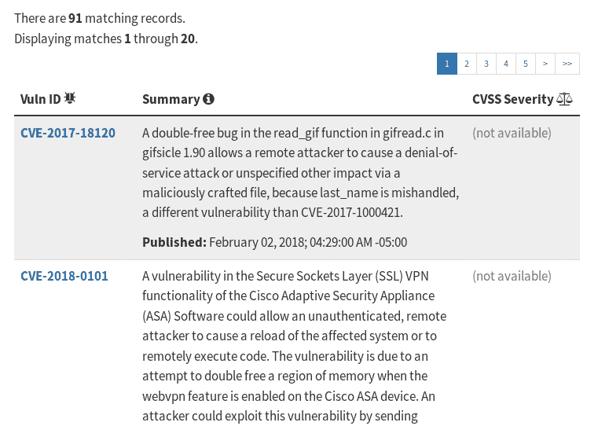

# 第五章：Linux 内存问题

一个简单的真理：内存问题存在。我们使用 C（和 C++）等语言编程的事实本身就隐含着无限类型的问题！在某个时候，人们意识到（或许有点悲观地认识到），在一个受管理的内存安全语言中小心编程最终是避免内存问题的（唯一？）现实方式。

然而，在这里，我们正在使用我们选择的强大工具：卓越而古老的 C 编程语言！因此，我们可以做些什么来减轻，如果不能消除，常见的内存问题，这就是本章的主题。最终，目标是真正的内存安全；好吧，说起来容易做起来难！

尽管如此，我们将尝试通过阐明开发人员可能会遇到的常见内存问题，成功地完成这项任务。在接下来的章节中，我们将探讨一些强大的内存调试工具如何在这方面提供巨大帮助。

在本章中，开发人员将了解到，尽管动态内存管理 API（在第四章，*动态内存分配*中涵盖）很少，但当使用不慎时，它们可能会引起看似无穷无尽的麻烦和错误！

具体来说，本章将阐明导致现场软件中难以检测的错误的常见内存问题：

+   不正确的内存访问问题（其中有几种类型）

+   内存泄漏

+   未定义行为

# 常见内存问题

如果要对细粒度的内存错误进行分类（通常是由 C 或 C++编程引起的），将会很困难——存在数百种类型！相反，让我们把讨论控制在可管理的范围内，看看什么被认为是我们这些可怜的 C 程序员经常遭遇的典型或常见内存错误：

+   不正确的内存访问

+   使用未初始化的变量

+   越界内存访问（读/写下溢/溢出错误）

+   释放后使用/返回后使用（超出范围）错误

+   双重释放

+   泄漏

+   未定义行为（UB）

+   数据竞争

+   碎片化（内部实现）问题

+   内部

+   外部

所有这些常见的内存问题（除了碎片化）都被归类为 UB；尽管如此，我们将 UB 作为一个单独的条目，因为我们将更深入地探讨它。此外，虽然人们口头上使用*bug*这个词，但一个人应该真正（并更正确地）将其视为*defect*。

我们在本章不涵盖数据竞争（请等到第十五章，*使用 Pthreads 的多线程 Part II - 同步*）。

为了帮助测试这些内存问题，`membugs`程序是每个问题的一系列小测试用例。

**侧边栏 :: Clang 编译器**

LLVM/Clang 是一个用于 C 的开源编译器。我们确实使用 Clang 编译器，特别是在本章和下一章中，特别是在下一章中涵盖的 sanitizer 编译器工具集。它在整本书中都很有用（事实上，在我们的许多 Makefile 中都使用它），因此在 Linux 开发系统上安装 Clang 是一个好主意！再次强调，这并非完全必要，人们也可以继续使用熟悉的 GCC——只要愿意在必要时编辑 Makefile(s)以切换回 GCC！

在 Ubuntu 18.04 LTS 桌面上安装 Clang 很容易：`sudo apt install clang`

Clang 文档可以在[`clang.llvm.org/docs/index.html`](https://clang.llvm.org/docs/index.html)找到。

当编译`membugs`程序（使用 GCC 进行正常情况以及使用 Clang 编译器进行 sanitizer 变体）时，你会看到大量的编译器警告被发出！这是预期的；毕竟，它的代码充满了错误。放松心情，继续阅读。

此外，我们提醒您，本章的目的是了解（和分类）典型的 Linux 内存问题；使用强大的工具来识别和修复它们是下一章的主题。两者都是必需的，所以请继续阅读。

构建的一些示例输出如下所示（为了可读性，输出被剪切了）。现在，我们不会尝试分析它；这将在我们通过本章时发生（*记住，您也需要安装 Clang！*）：

```
$ make
gcc -Wall -c ../common.c -o common.o
gcc -Wall -c membugs.c -o membugs.o
membugs.c: In function ‘uar’:
membugs.c:143:9: warning: function returns address of local variable [-Wreturn-local-addr]
 return name;
 ^~~~
 [...]

gcc -Wall -o membugs membugs.o common.o

[...]
clang -g -ggdb -gdwarf-4 -O0 -Wall -Wextra -fsanitize=address -c membugs.c -o membugs_dbg_asan.o
membugs.c:143:9: warning: address of stack memory associated with local variable 'name' returned [-Wreturn-stack-address]
 return name;
 ^~~~

gcc -g -ggdb -gdwarf-4 -O0 -Wall -Wextra -o membugs_dbg membugs_dbg.o common_dbg.o
[...]
$ 
```

我们还强调，在我们将运行的所有测试案例中，我们使用由 GCC 生成的*membugs*二进制可执行文件（而不是 Clang；我们将在后面使用 sanitizer 工具时使用 Clang）。

在构建过程中，可以将所有输出捕获到文件中，如下所示：

`make >build.txt 2>&1`

使用`--help`开关运行`membugs`程序以查看所有可用的测试案例：

```
$ ./membugs --help

Usage: ./membugs test_case [ -h | --help]
 test case  1 : uninitialized var test case
 test case  2 : out-of-bounds : write overflow [on compile-time memory]
 test case  3 : out-of-bounds : write overflow [on dynamic memory]
 test case  4 : out-of-bounds : write underflow
 test case  5 : out-of-bounds : read overflow [on compile-time memory]
 test case  6 : out-of-bounds : read overflow [on dynamic memory]
 test case  7 : out-of-bounds : read underflow
 test case  8 : UAF (use-after-free) test case
 test case  9 : UAR (use-after-return) test case
 test case 10 : double-free test case
 test case 11 : memory leak test case 1: simple leak
 test case 12 : memory leak test case 2: leak more (in a loop)
 test case 13 : memory leak test case 3: "lib" API leak
-h | --help : show this help screen
$ 
```

您将注意到写入和读取上溢各有两个测试案例：一个是在编译时内存上，一个是在动态分配的内存上。区分这些情况很重要，因为工具在检测哪些类型的缺陷时有所不同。

# 不正确的内存访问

通常，这个类别中的错误和问题是如此常见，以至于被轻率地忽视！请注意，它们仍然非常危险；请注意找到、理解和修复它们。

所有内存缓冲区上溢和下溢错误的类别都经过仔细记录和跟踪，通过**通用漏洞和暴露（CVE）**和**通用弱点枚举（CWE）**网站。与我们讨论的相关的是，CWE-119 是*内存缓冲区边界内操作的不当限制*（[`cwe.mitre.org/data/definitions/119.html`](https://cwe.mitre.org/data/definitions/119.html)）。

# 访问和/或使用未初始化的变量

为了让读者对这些内存问题的严重性有所了解，我们编写了一个测试程序`membugs.c`。这个测试程序允许用户测试各种常见的内存错误，这将帮助他们更好地理解潜在的问题。

每个内存错误测试案例都被赋予一个测试案例编号。这样读者可以很容易地跟随源代码和解释材料，我们也会指定测试案例如下。

# 测试案例 1：未初始化内存访问

这些也被称为**未初始化内存读取**（**UMR**）错误。一个经典案例：本地（或自动）变量根据定义是未初始化的（不像全局变量，它们总是预设为零*）*：

```
/* test case 1 : uninitialized var test case */
static void uninit_var()
{
   int x; /* static mem */

    if (x)
        printf("true case: x=%d\n", x);
    else
        printf("false case\n");
}
```

在前面的代码中，由于`x`未初始化并且将具有随机内容，因此在运行时会发生未定义的情况。现在，我们按以下方式运行这个测试案例：

```
$ ./membugs 1
true case: x=32604
$ ./membugs 1
true case: x=32611
$ ./membugs 1
true case: x=32627
$ ./membugs 1
true case: x=32709
$ 
```

值得庆幸的是，现代版本的编译器（`gcc`和`clang`）会对这个问题发出警告：

```
$ make 
[...]
gcc -Wall -c membugs.c -o membugs.o
[...]
membugs.c: In function ‘uninit_var’:
membugs.c:272:5: warning: ‘x’ is used uninitialized in this function [-Wuninitialized]
 if (x) 
 ^ 

[...]
clang -g -ggdb -gdwarf-4 -O0 -Wall -Wextra -fsanitize=address -c membugs.c -o membugs_dbg_asan.o
[...]
membugs.c:272:6: warning: variable 'x' is uninitialized when used here [-Wuninitialized]
 if (x)
 ^
membugs.c:270:7: note: initialize the variable 'x' to silence this warning
 int x; /* static mem */
 ^
 = 0
[...]
```

# 越界内存访问

这个类别再次属于更常见但致命的内存访问错误。它们可以被分类为不同类型的错误：

+   **写入上溢**：尝试向内存缓冲区的最后一个合法可访问位置之后写入的错误

+   **写入下溢**：在第一个合法可访问位置之前尝试向内存缓冲区写入

+   **读取下溢**：在第一个合法可访问位置之前尝试读取内存缓冲区的错误

+   **读取上溢**：在第一个合法可访问位置之后尝试读取内存缓冲区的错误

让我们通过我们的`membugs.c`程序的源代码来检查这些。

# 测试案例 2

编写或缓冲区溢出在编译时分配的内存。请参见以下代码片段：

```
/* test case 2 : out-of-bounds : write overflow [on compile-time memory] */
static void write_overflow_compilemem(void)
{
    int i, arr[5], tmp[8];
    for (i=0; i<=5; i++) {
       arr[i] = 100;  /* Bug: 'arr' overflows on i==5,
                         overwriting part of the 'tmp' variable
                         - a stack overflow! */
    }
}
```

这导致了堆栈溢出（也称为堆栈破坏或**缓冲区溢出**（**BOF**））错误；这是一类严重的漏洞，攻击者已经成功地多次利用，从 1988 年的 Morris Worm 病毒开始！在 GitHub 存储库的*进一步阅读*部分中，了解更多关于这个漏洞的信息。

有趣的是，在我们的*Fedora 28*工作站 Linux 系统上编译和运行代码的这一部分（通过传递适当的参数），显示默认情况下既没有编译时也没有运行时检测到这种（和其他类似的）危险错误（稍后详细介绍！）：

```
$ ./membugs 2
$ ./membugs_dbg 2
$ 
```

这些错误有时也被称为一次性错误。

当然还有更多（像往常一样）；让我们进行一个快速实验。在`membugs.c:write_overflow_compilemem()`函数中，将我们循环的次数从 5 更改为 50：

```
 for (i = 0; i <= 50; i++) {
    arr[i] = 100;
}
```

重新构建并重试；现在在*Ubuntu 18.04 LTS*桌面 Linux 系统上查看输出（在 Fedora 上也是如此，但使用原始内核）：

```
$ ./membugs 2
*** stack smashing detected ***: <unknown> terminated
Aborted
$ 
```

事实上，现代编译器使用堆栈保护功能来检测堆栈溢出错误，更重要的是，攻击。当值足够大时，溢出被检测到；但是使用默认值时，错误却未被检测到！我们强调在下一章中使用工具（包括编译器）来检测这些隐藏的错误的重要性。

# 测试案例 3

在动态分配的内存上写入或 BOF。请参阅以下代码片段：

```
/* test case 3 : out-of-bounds : write overflow [on dynamic memory] */
static void write_overflow_dynmem(void)
{
    char *dest, src[] = "abcd56789";

    dest = malloc(8);
    if (!dest) 

    FATAL("malloc failed\n");

    strcpy(dest, src); /* Bug: write overflow */
    free(dest);
}
```

同样，没有发生错误的编译或运行时检测：

```
$ ./membugs 3
$ ./membugs 3           *<< try once more >>*
$ 
```

不幸的是，与 BOF 相关的错误和漏洞在行业中往往相当常见。根本原因并不为人所知，因此导致编写不良代码；这就是我们作为开发人员必须提高自己水平的地方！

有关安全漏洞的真实世界示例，请参阅 2017 年 Linux 上 52 个文档化的安全漏洞（由各种 BOF 错误引起）的表格：[`www.cvedetails.com/vulnerability-list/vendor_id-33/year-2017/opov-1/Linux.html`](https://www.cvedetails.com/vulnerability-list/vendor_id-33/year-2017/opov-1/Linux.html)。

# 测试案例 4

写入下溢。我们使用`malloc(3)`动态分配一个缓冲区，将指针减小，然后写入该内存位置——写入或缓冲区下溢错误：

```
/* test case 4 : out-of-bounds : write underflow */
static void write_underflow(void)
{
    char *p = malloc(8);
    if (!p)
        FATAL("malloc failed\n");
    p--;
    strncpy(p, "abcd5678", 8); /* Bug: write underflow */
    free(++p);
}
```

在这个测试案例中，我们不希望`free(3)`失败，所以我们确保传递给它的指针是正确的。编译器在这里没有检测到任何错误；尽管在运行时，现代的 glibc 确实会崩溃，检测到错误（在这种情况下是内存损坏）：

```
$ ./membugs 4
double free or corruption (out)
Aborted
$
```

# 测试案例 5

读取溢出，编译时分配的内存。我们尝试在编译时分配的内存缓冲区的最后一个合法可访问位置之后进行读取：

```
/* test case 5 : out-of-bounds : read overflow [on compile-time memory] */
static void read_overflow_compilemem(void)
{
    char arr[5], tmp[8];

    memset(arr, 'a', 5);
    memset(tmp, 't', 8);
    tmp[7] = '\0';

    printf("arr = %s\n", arr); /* Bug: read buffer overflow */
}
```

这个测试案例的设计方式是，我们在内存中顺序排列了两个缓冲区。错误在于：我们故意没有对第一个缓冲区进行空终止（但对第二个缓冲区进行了空终止），因此，`printf(3)`将会继续读取`arr`中的内容，直到`tmp`缓冲区。如果`tmp`缓冲区包含秘密呢？

当然，问题是编译器无法捕捉到这个看似明显的错误。还要意识到，这里我们编写的是小型、简单、易于阅读的测试案例；在一个有几百万行代码的真实项目中，这样的缺陷很容易被忽视。

以下是示例输出：

```
$ ./membugs 2>&1 | grep -w 5
 option =  5 : out-of-bounds : read overflow [on compile-time memory]
$ ./membugs 5
arr = aaaaattttttt
$ 
```

嘿，我们读取了`tmp`的秘密内存。

实际上，诸如 ASan（地址消毒剂，在下一章中介绍）之类的工具将此错误分类为堆栈缓冲区溢出。

顺便说一句，在我们的*Fedora 28*工作站上，我们在这个测试案例中从第二个缓冲区中只得到了垃圾：

```
$ ./membugs 5
arr = aaaaa0<5=�
$ ./membugs 5
arr = aaaaa�:��
$ 
```

这向我们表明，这些错误可能会因编译器版本、glibc 版本和机器硬件的不同而表现出不同的特征。

一个始终有用的测试技术是尽可能在多种硬件/软件变体上运行测试案例。隐藏的错误可能会暴露出来！考虑到诸如字节序问题、编译器优化（填充、打包）和特定平台的对齐等情况。

# 测试案例 6

读取溢出，动态分配的内存。再次尝试读取；这次是在动态分配的内存缓冲区的最后一个合法可访问位置之后：

```
/* test case 6 : out-of-bounds : read overflow [on dynamic memory] */
static void read_overflow_dynmem(void)
{
    char *arr;

    arr = malloc(5);
    if (!arr)
        FATAL("malloc failed\n",);
    memset(arr, 'a', 5);

    /* Bug 1: Steal secrets via a buffer overread.
     * Ensure the next few bytes are _not_ NULL.
     * Ideally, this should be caught as a bug by the compiler,
     * but isn't! (Tools do; seen later).
     */
    arr[5] = 'S'; arr[6] = 'e'; arr[7] = 'c';
    arr[8] = 'r'; arr[9] = 'e'; arr[10] = 'T';
    printf("arr = %s\n", arr);

    /* Bug 2, 3: more read buffer overflows */
    printf("*(arr+100)=%d\n", *(arr+100));
    printf("*(arr+10000)=%d\n", *(arr+10000));

    free(arr);
}
```

测试案例与前一个测试案例（编译时内存的读取溢出*）*基本相同，只是我们动态分配了内存缓冲区，并且为了好玩插入了一些其他错误：

```
$ ./membugs 2>&1 |grep -w 6
 option =  6 : out-of-bounds : read overflow [on dynamic memory]
$ ./membugs 6
arr = aaaaaSecreT
*(arr+100)=0
*(arr+10000)=0
$  
```

嘿，妈妈，看！我们得到了秘密！

它甚至不会导致崩溃。乍一看，这样的错误可能看起来相当无害——但事实上，这是一个非常危险的错误！

著名的 OpenSSL Heartbleed 安全漏洞（CVE-2014-0160）是利用读取溢出的一个很好的例子，或者通常被称为缓冲区过读取漏洞。

简而言之，这个错误允许一个恶意客户端进程向 OpenSSL 服务器进程发出一个看似正确的请求；实际上，它可以请求并接收比应该允许的更多的内存，因为存在缓冲区过读取漏洞。实际上，这个错误使得攻击者可以轻松地绕过安全性并窃取秘密[[`heartbleed.com`](http://heartbleed.com/)]。

如果感兴趣，在 GitHub 存储库的*进一步阅读*部分中找到更多信息。

# 测试案例 7

读取下溢。我们尝试在动态分配的内存缓冲区上进行读取，而在其第一个合法可访问的位置之前：

```
/* test case 7 : out-of-bounds : read underflow */
static void read_underflow(int cond)
{
    char *dest, src[] = "abcd56789", *orig;

    printf("%s(): cond %d\n", __FUNCTION__, cond);
    dest = malloc(25);
    if (!dest)
        FATAL("malloc failed\n",);
    orig = dest;

    strncpy(dest, src, strlen(src));
    if (cond) {
 *(orig-1) = 'x';
 dest --;
 }
    printf(" dest: %s\n", dest);

    free(orig);
}
```

测试案例设计了一个运行时条件；我们两种方式测试它：

```
 case 7:
     read_underflow(0);
     read_underflow(1);
     break;
```

如果条件为真，则缓冲区指针会减少，从而导致后续`printf`的读取缓冲区下溢：

```
$ ./membugs 7
read_underflow(): cond 0
 dest: abcd56789
read_underflow(): cond 1
 dest: xabcd56789
double free or corruption (out)
Aborted (core dumped)
$ 
```

同样，glibc 通过显示双重释放或损坏来帮助我们——在这种情况下，它是内存损坏。

# 释放后使用/返回后使用错误

**使用-** **释放后使用**（UAF）和**返回后使用**（UAR）是危险的、难以发现的错误。查看以下每个测试案例。

# 测试案例 8

**释放后使用（UAF）**。在释放内存指针后对其进行操作显然是一个错误，会导致 UB。这个指针有时被称为悬空指针。这里是一个快速测试案例：

```
/* test case 8 : UAF (use-after-free) test case */
static void uaf(void)
{
    char *arr, *next;
    char name[]="Hands-on Linux Sys Prg";
    int n=512;

    arr = malloc(n);
    if (!arr)
        FATAL("malloc failed\n");
    memset(arr, 'a', n);
    arr[n-1]='\0';
    printf("%s():%d: arr = %p:%.*s\n", __FUNCTION__, __LINE__, arr,
                32, arr);

    next = malloc(n);
    if (!next) {
        free(arr);
        FATAL("malloc failed\n");
    }
    free(arr);
    strncpy(arr, name, strlen(name));  /* Bug: UAF */ 
    printf("%s():%d: arr = %p:%.*s\n", __FUNCTION__, __LINE__, arr,
                32, arr);
    free(next);
}
```

同样，无论在编译时还是在运行时都无法检测到 UAF 错误，也不会导致崩溃：

```
$ ./membugs 2>&1 |grep -w 8
 option =  8 : UAF (use-after-free) test case
$ ./membugs 8
uaf():158: arr = 0x558012280260:aaaaaaaaaaaaaaaaaaaaaaaaaaaaaaaa
uaf():166: arr = 0x558012280260:Hands-on Linux Sys Prgaaaaaaaaaa
$  
```

你注意到了巧妙的`printf(3)`格式说明符`%.*s`吗？这种格式用于打印特定长度的字符串（不需要终止空字符！）。首先，指定要打印的字节数，然后是字符串的指针。

# 测试案例 9

**返回后使用**（**UAR**）。另一个经典的错误，这个错误涉及将存储项（或指向它的指针）返回给调用函数。问题在于存储是局部的或自动的，因此一旦返回受影响，存储对象现在就超出了范围。

这里显示了一个经典的例子：我们为一个局部变量分配了`32`字节，初始化它，并将其返回给调用者：

```
/* test case 9 : UAR (use-after-return) test case */
static void * uar(void)
{
    char name[32];

    memset(name, 0, 32);
    strncpy(name, "Hands-on Linux Sys Prg", 22);

    return name;
}
```

这是调用者调用前面的错误函数的方式：

```
[...]
    case 9:
            res = uar();
            printf("res: %s\n", (char *)res);
            break;
[...]
```

当然，一旦`uar()`函数中的`return`语句生效，`name`变量就会自动超出范围！因此，指向它的指针是无效的，运行时会失败：

```
$ ./membugs 2>&1 |grep -w 9
 option = 9 : UAR (use-after-return) test case
$ ./membugs 9
res: (null)
$ 
```

幸运的是，现代 GCC（我们使用的是 GCC ver 7.3.0）会警告我们这个常见的错误：

```
$ make membugs
gcc -Wall -c membugs.c -o membugs.o
membugs.c: In function ‘uar’:
membugs.c:143:9: warning: function returns address of local variable [-Wreturn-local-addr]
 return name;
 ^~~~
[...]
```

如前所述（但值得重申），请注意并修复所有警告！

实际上，有时这个错误会被忽视——看起来它工作正常，没有错误。这是因为没有实际的保证在函数返回时立即销毁堆栈内存帧——内存和编译器优化可能会保留帧（通常是为了重用）。然而，这是一个危险的错误，必须修复！

在下一章中，我们将介绍一些内存调试工具。事实上，Valgrind 和 Sanitizer 工具都无法捕捉到这个可能致命的错误。但是，适当使用 ASan 工具集确实可以捕捉到 UAR！继续阅读。

# 测试案例 10

双重释放。一旦释放了`malloc`系列缓冲区，就不允许再使用该指针。尝试再次释放相同的指针（而不是通过`malloc`系列 API 之一再次分配内存）是一个错误：双重释放。它会导致堆损坏；攻击者经常利用这样的错误来造成**拒绝服务**（**DoS**）攻击或更糟糕的情况（权限提升）。

这是一个简单的测试案例：

```
/* test case 10 : double-free test case */
static void doublefree(int cond)
{
    char *ptr;
    char name[]="Hands-on Linux Sys Prg";
    int n=512;

    printf("%s(): cond %d\n", __FUNCTION__, cond);
    ptr = malloc(n);
    if (!ptr)
        FATAL("malloc failed\n");
    strncpy(ptr, name, strlen(name));
    free(ptr);

    if (cond) {
        bogus = malloc(-1UL); /* will fail! */
        if (!bogus) {
            fprintf(stderr, "%s:%s:%d: malloc failed\n",
                       __FILE__, __FUNCTION__, __LINE__);
            free(ptr); /* Bug: double-free */
            exit(EXIT_FAILURE);
        }
    }
}
```

在前面的测试案例中，我们模拟了一个有趣且相当现实的场景：一个运行时条件（通过`cond`参数模拟）导致程序执行一个调用，让我们说，失败了——`malloc(-1UL)`几乎可以保证这种情况发生。

为什么？因为在 64 位操作系统上，`-1UL = 0xffffffffffffffff = 18446744073709551615 字节 = 16 EB`。这是 64 位虚拟地址空间的全部范围。

回到重点：在我们的 malloc 错误处理代码中，发生了一个错误的双重释放——之前释放的`ptr`指针——导致了双重释放错误。

真正的问题是，作为开发人员，我们经常不为错误处理代码路径编写（负面的）测试案例；然后一个缺陷就会逃脱检测进入现场：

```
$ ./membugs 10
doublefree(): cond 0
doublefree(): cond 1
membugs.c:doublefree:56: malloc failed
$ 
```

有趣的是，编译器确实警告我们关于错误（有缺陷）的第二次 malloc（但没有关于双重释放的警告！）；请参见以下内容：

```
$ make
[...]
membugs.c: In function ‘doublefree’:
membugs.c:125:9: warning: argument 1 value ‘18446744073709551615’ exceeds maximum object size 9223372036854775807 [-Walloc-size-larger-than=]
 bogus = malloc(-1UL); /* will fail! */
 ~~~~~~^~~~~~~~~~~~~~
In file included from membugs.c:18:0:
/usr/include/stdlib.h:539:14: note: in a call to allocation function ‘malloc’ declared here
 extern void *malloc (size_t __size) __THROW __attribute_malloc__ __wur;
 ^~~~~~
[...]
```

为了强调检测和修复此类错误的重要性——记住，这只是一个例子——我们展示了*国家漏洞数据库*（NVD）在过去 3 年内（在此写作时）关于双重释放错误的一些信息：[`nvd.nist.gov/vuln/search/results?adv_search=false&form_type=basic&results_type=overview&search_type=last3years&query=double+free`](https://nvd.nist.gov/vuln/search/results?adv_search=false&form_type=basic&results_type=overview&search_type=last3years&query=double+free)

在*国家漏洞数据库*（NVD）上执行的双重释放错误的搜索结果的部分截图（在此写作时）如下：



完整的截图没有在这里显示。

# 泄漏

动态内存的黄金法则是释放你分配的内存。

内存泄漏是用来描述未能释放内存的情况。程序员认为内存区域确实已经被释放了。但实际上没有——这就是错误。因此，这使得认为已释放的内存区域对进程和系统不可用；实际上，它是不可用的，尽管它本应该是可用的。

据说内存已经泄漏了。那么为什么程序员不能在代码的其他地方通过调用 free 来处理这个内存指针呢？这实际上是问题的关键：在典型情况下，由于代码的实现方式，基本上不可能重新访问泄漏的内存指针。

一个快速的测试案例将证明这一点。

`amleaky`函数被故意编写成每次调用时泄漏`mem`字节的内存——它的参数。

# 测试案例 11

内存泄漏 - 情况 1：（简单的）内存泄漏测试案例。请参见以下代码片段：

```
static const size_t BLK_1MB = 1024*1024;
[...]
static void amleaky(size_t mem)
{
    char *ptr;

    ptr = malloc(mem);
    if (!ptr)
        FATAL("malloc(%zu) failed\n", mem);

    /* Do something with the memory region; else, the compiler
     * might just optimize the whole thing away!
     * ... and we won't 'see' the leak.
     */
    memset(ptr, 0, mem);

    /* Bug: no free, leakage */
}

[...]
/* test case 11 : memory leak test case 1: simple leak */
static void leakage_case1(size_t size)
{
 printf("%s(): will now leak %zu bytes (%ld MB)\n",
     __FUNCTION__, size, size/(1024*1024));
 amleaky(size);
}

[...]

 case 11:
     leakage_case1(32);
     leakage_case1(BLK_1MB);
     break;
[...]
```

正如大家可以清楚地看到的，在`amleaky`函数中，`ptr`内存指针是一个局部变量，因此一旦我们从有缺陷的函数返回，它就会丢失；这使得以后无法释放它。还要注意——注释解释了它——我们需要`memset`来强制编译器生成代码并使用内存区域。

对前面测试案例的快速构建和执行将显示，再次没有明显的编译时或运行时检测到泄漏的发生：

```
$ ./membugs 2>&1 | grep "memory leak"
 option = 11 : memory leak test case 1: simple leak
 option = 12 : memory leak test case 2: leak more (in a loop)
 option = 13 : memory leak test case 3: lib API leak
$ ./membugs 11
leakage_case1(): will now leak 32 bytes (0 MB)
leakage_case1(): will now leak 1048576 bytes (1 MB)
$ 
```

# 测试案例 12

内存泄漏情况 2 - 泄漏更多（在循环中）。很多时候，有缺陷的泄漏代码可能只会泄漏少量内存，几个字节。问题是，如果这个有泄漏的函数在进程执行期间被调用了数百次，甚至数千次，现在泄漏就变得显著了，但不幸的是，不会立即显现出来。

为了精确模拟这一点以及更多内容，我们执行两个测试案例（选项 12）：

+   我们分配并泄漏了少量内存（32 字节），但在循环中重复了 10 万次（因此，是的，我们最终泄漏了超过 3 MB）。

+   我们在循环中分配并泄漏了大量内存（1 MB），循环了 12 次（因此，我们最终泄漏了 12 MB）。

以下是相关代码：

```
[...]

/* test case 12 : memory leak test case 2: leak in a loop */
static void leakage_case2(size_t size, unsigned int reps)
{
    unsigned int i, threshold = 3*BLK_1MB;
    double mem_leaked;

    if (reps == 0)
        reps = 1;
    mem_leaked = size * reps;
    printf("%s(): will now leak a total of %.0f bytes (%.2f MB)"
            " [%zu bytes * %u loops]\n",
            __FUNCTION__, mem_leaked, mem_leaked/(1024*1024),
            size, reps);

    if (mem_leaked >= threshold)
        system("free|grep \"^Mem:\"");

    for (i=0; i<reps; i++) {
        if (i%10000 == 0)
            printf("%s():%6d:malloc(%zu)\n", __FUNCTION__, i, size);
        amleaky(size);
    }

    if (mem_leaked >= threshold)
       system("free|grep \"^Mem:\""); printf("\n");
}

[...]

  case 12:
 leakage_case2(32, 100000);
 leakage_case2(BLK_1MB, 12);
 break;
[...]
```

这个逻辑确保在每 10,000 次循环迭代时才显示泄漏循环中的`printf(3)`。

另外，我们想要看看内存是否确实泄漏了。为了以一种近似的方式来做到这一点，我们使用`free`实用程序：

```
$ free
 total     used       free    shared   buff/cache  available
Mem:  16305508   5906672   348744   1171944   10050092   10248116
Swap:  8000508         0  8000508
$ 
```

`free(1)`实用程序以千字节为单位显示系统整体上当前（近似）使用的内存量、空闲内存量和可用内存量。它进一步将已使用的内存分为共享、缓冲/页面缓存；它还显示`Swap`分区统计信息。我们还应该注意，使用`free(1)`来检测内存泄漏的方法并不被认为是非常准确的；这最多是一种粗略的方法。操作系统报告的已使用内存、空闲内存、缓存等等可能会有所不同。对于我们的目的来说，这是可以接受的。

我们感兴趣的是`Mem`行和`free`列的交集；因此，我们可以看到在总共可用的 16 GB 内存（RAM）中，当前空闲的内存量约为 348744 KB ~= 340 MB。

我们可以快速尝试一个一行脚本，只显示感兴趣的区域——`Mem`行：

```
$ free | grep "^Mem:"
Mem:  16305508   5922772   336436   1165960   10046300   10237452
$ 
```

在`Mem`之后的第三列是`free`内存（有趣的是，它已经从上一次的输出中减少了；这并不重要）。

回到程序；我们使用`system(3)`库 API 在 C 程序中运行前面的管道化的 shell 命令（我们将在第十章中构建我们自己的`system(3)`API 的小型模拟，*进程创建*）：

```
if (mem_leaked >= threshold) system("free|grep \"^Mem:\");
```

`if`语句确保只有在泄漏量大于等于 3 MB 时才会出现这个输出。

在执行后，这是输出：

```
$ ./membugs 12
leakage_case2(): will now leak a total of 3200000 bytes (3.05 MB) 
 [32 bytes * 100000 loops]
Mem:   16305508     5982408   297708   1149648   10025392   10194628
leakage_case2():     0:malloc(32)
leakage_case2(): 10000:malloc(32)
leakage_case2(): 20000:malloc(32)
leakage_case2(): 30000:malloc(32)
leakage_case2(): 40000:malloc(32)
leakage_case2(): 50000:malloc(32)
leakage_case2(): 60000:malloc(32)
leakage_case2(): 70000:malloc(32)
leakage_case2(): 80000:malloc(32)
leakage_case2(): 90000:malloc(32)
Mem:   16305508     5986996   293120   1149648   10025392   10190040

leakage_case2(): will now leak a total of 12582912 bytes (12.00 MB) 
 [1048576 bytes * 12 loops]
Mem:   16305508     5987500   292616   1149648   10025392   10189536
leakage_case2():     0:malloc(1048576)
Mem:   16305508     5999124   280992   1149648   10025392   10177912
$ 
```

我们看到两种情况正在执行；查看`free`列的值。我们将它们相减以查看泄漏的内存量：

+   我们在循环中分配并泄漏了一小部分内存（32 字节），但是循环了 100,000 次：`泄漏内存 = 297708 - 293120 = 4588 KB ~= 4.5 MB`

+   我们在循环中分配并泄漏了大量内存（1 MB），共 12 次：`泄漏内存 = 292616 - 280992 = 11624 KB ~= 11.4 MB`

当然，要意识到一旦进程死掉，它的所有内存都会被释放回系统。这就是为什么我们在进程还活着的时候执行了这个一行脚本。

# 测试案例 13

复杂情况——包装器 API。有时，人们会原谅地认为所有程序员都被教导：在调用 malloc（或 calloc、realloc）之后，调用 free。malloc 和 free 是一对！这有多难？如果是这样，为什么会有这么多隐蔽的泄漏错误呢？

泄漏缺陷发生并且难以准确定位的一个关键原因是因为一些 API——通常是第三方库 API——可能在内部执行动态内存分配，并期望调用者释放内存。API（希望）会记录这一重要事实；但是谁（半开玩笑地）会去读文档呢？

这实际上是现实世界软件中的问题的关键所在；它很复杂，我们在大型复杂项目上工作。很容易忽略的一个事实是，底层 API 分配内存，调用者负责释放它。这种情况确实经常发生。

在复杂的代码库（尤其是那些有意大利面代码的代码库）中，深度嵌套的层次结构使代码纠缠在一起，要执行所需的清理工作，包括释放内存，在每种可能的错误情况下都变得特别困难。

Linux 内核社区提供了一种干净但颇具争议的方式来保持清理代码路径的干净和良好运行，即使用本地跳转来执行集中的错误处理！这确实有帮助。想要了解更多吗？查看[`www.kernel.org/doc/Documentation/process/coding-style.rst`](https://www.kernel.org/doc/Documentation/process/coding-style.rst)中的第七部分，*函数的集中退出*。

# 测试案例 13.1

这是一个简单的例子。让我们用以下测试案例代码来模拟这个：

```
/* 
 * A demo: this function allocates memory internally; the caller
 * is responsible for freeing it!
 */
static void silly_getpath(char **ptr)
{
#include <linux/limits.h>
    *ptr = malloc(PATH_MAX);
    if (!ptr)
        FATAL("malloc failed\n");

    strcpy(*ptr, getenv("PATH"));
    if (!*ptr)
        FATAL("getenv failed\n");
}

/* test case 13 : memory leak test case 3: "lib" API leak */
static void leakage_case3(int cond)
{
    char *mypath=NULL;

    printf("\n## Leakage test: case 3: \"lib\" API"
        ": runtime cond = %d\n", cond);

    /* Use C's illusory 'pass-by-reference' model */
    silly_getpath(&mypath);
    printf("mypath = %s\n", mypath);

    if (cond) /* Bug: if cond==0 then we have a leak! */
        free(mypath);
}
```

我们这样调用它：

```
[...]
case 13:
     leakage_case3(0);
     leakage_case3(1);
     break;
```

和往常一样，没有编译器或运行时警告。这是输出（注意第一次调用是有 bug 的情况，因为`cond`的值为`0`，因此不会调用`free(3)`）：

```
$ ./membugs 13

## Leakage test: case 3: "lib" API: runtime cond = 0
mypath = /usr/local/bin:/usr/local/sbin:/usr/bin:/usr/sbin:/sbin:/usr/sbin:/usr/local/sbin:/home/kai/MentorGraphics/Sourcery_CodeBench_Lite_for_ARM_GNU_Linux/bin/:/mnt/big/scratchpad/buildroot-2017.08.1/output/host/bin/:/sbin:/usr/sbin:/usr/local/sbin

## Leakage test: case 3: "lib" API: runtime cond = 1
mypath = /usr/local/bin:/usr/local/sbin:/usr/bin:/usr/sbin:/sbin:/usr/sbin:/usr/local/sbin:/home/kai/MentorGraphics/Sourcery_CodeBench_Lite_for_ARM_GNU_Linux/bin/:/mnt/big/scratchpad/buildroot-2017.08.1/output/host/bin/:/sbin:/usr/sbin:/usr/local/sbin
$ 
```

通过查看输出看不出有 bug，这也是这些 bug 如此危险的部分原因！

这种情况对开发人员和测试人员来说非常关键；它值得检查一些真实世界的例子。

# 测试案例 13.2

例子——*Motif*库**。***Motif*是 X Window 系统的一部分的传统库；它被用于（也许仍在用）为 Unix（和类 Unix）系统开发 GUI。

为了举例说明，我们将专注于其中一个 API：`XmStringCreateLocalized(3)`。GUI 开发人员使用这个函数来创建 Motif 称之为“复合字符串”的东西——本质上，就是一个以特定区域设置（用于国际化 I18N）的文本为内容的字符串。这是它的签名：

```
#include <Xm/Xm.h>
XmString XmStringCreateLocalized(char *text);
```

所以，让我们想象一下，开发人员使用它来生成复合字符串（用于各种目的；很多时候是用于标签或按钮小部件的标签）。

那么问题出在哪里呢？

内存泄漏！怎么回事？从`XmStringCreateLocalized(3)`的 man 页面（[`linux.die.net/man/3/xmstringcreatelocalized`](https://linux.die.net/man/3/xmstringcreatelocalized)）上阅读文档：

```
[...]

The function will allocate space to hold the returned compound string. The application is responsible for managing the allocated space. The application can recover the allocated space by calling XmStringFree. 
[...]
```

显然，开发人员不仅必须调用`XmStringCreateLocalized(3)`，还必须记得通过调用`XmStringFree(3)`释放由它内部分配的复合字符串的内存！

如果不这样做，就会导致内存泄漏。我有这种情况的亲身经历——一个有 bug 的应用程序调用了`XmStringCreateLocalized(3)`，但没有调用它的对应函数`XmStringFree(3)`。更糟糕的是，这段代码经常运行，因为它是外部循环的一部分！所以，内存泄漏不断增加。

# 测试案例 13.3

例子——Nortel 移植项目。有一个关于 Nortel（加拿大一家大型电信和网络设备跨国公司）的开发人员在调试一个内存泄漏问题时遇到了很大困难的故事。问题的关键在于：在将 Unix 应用程序移植到 VxWorks 时，在测试过程中，他们注意到发生了一个小的 18 字节的内存泄漏，最终导致应用程序崩溃。找到内存泄漏的源头是一场噩梦——无休止地审查代码没有提供任何线索。最终，改变游戏规则的是使用了一个内存泄漏检测工具（我们将在接下来的第六章中介绍，*内存问题调试工具*）。几分钟内，他们发现了内存泄漏的根本原因：一个看似无害的 API，`inet_ntoa(3)`（参见信息框），在 Unix 上和 VxWorks 上都是正常工作的。问题在于，在 VxWorks 的实现中，它在幕后分配了内存——调用者有责任释放！这个事实是有文档记录的，但这是一个移植项目！一旦意识到这一点，问题很快就解决了。

文章：嵌入式调试的十个秘密，Schneider 和 Fraleigh：[`www.embedded.com/design/prototyping-and-development/4025015/The-ten-secrets-of-embedded-debugging`](https://www.embedded.com/design/prototyping-and-development/4025015/The-ten-secrets-of-embedded-debugging)

`inet_ntoa(3)`的 man 页面条目指出：`inet_ntoa()`函数将以网络字节顺序给出的 Internet 主机地址转换为 IPv4 点分十进制表示的字符串。字符串以静态分配的缓冲区返回，后续调用将覆盖它。

关于有内存泄漏 bug 的程序的一些观察：

+   程序在很长一段时间内表现正常；突然之间，比如说，运行一个月后，它突然崩溃了。

+   根源的内存泄漏可能非常小——每次只有几个字节；但可能经常被调用。

+   通过仔细匹配你的`malloc(3)`和`free(3)`的实例来寻找泄漏错误是行不通的；库 API 包装器通常在后台分配内存，并期望调用者释放它。

+   泄漏通常会被忽视，因为它们在大型代码库中很难被发现，一旦进程死掉，泄漏的内存就会被释放回系统。

底线：

+   不要假设任何事情

+   仔细阅读 API 文档

+   使用工具（在即将到来的第六章中涵盖的*内存问题调试工具*）

不能过分强调使用工具检测内存错误的重要性！

# 未定义行为

我们已经涵盖了相当多的内容，并看到了一些常见的内存错误，包括：

+   不正确的内存访问

+   使用未初始化的变量

+   越界内存访问（读/写下溢/溢出错误）

+   释放后使用/返回后使用（超出范围）错误

+   双重释放

+   泄漏

+   数据竞争（详细信息将在后面的章节中介绍）

如前所述，所有这些都属于一个通用的分类——UB。正如短语所暗示的，一旦发生这些错误中的任何一个，进程（或线程）的行为就会变得*未定义*。更糟糕的是，其中许多错误并不显示任何直接可见的副作用；但进程是不稳定的，并且最终会崩溃。特别是泄漏错误在其中是主要的破坏者：泄漏可能在崩溃实际发生之前存在很长时间。不仅如此，留下的痕迹（开发人员将气喘吁吁地追踪）往往可能是一个误导——与错误根本原因无关紧要的事情，没有真正影响错误根本原因的事情。当然，所有这些都使得调试 UB 成为大多数人都愿意避免的经历！

好消息是，只要开发人员了解 UB 的根本原因（我们在前面的章节中已经涵盖了），并且有能力使用强大的工具来发现并修复这些错误，UB 是可以避免的，这也是我们下一个话题领域。

要深入了解许多可能的 UB 错误，请查看：*附录 J.2：未定义行为*：C 中未定义行为的非规范、非穷尽列表：[`www.open-std.org/jtc1/sc22/wg14/www/docs/n1548.pdf#page=571`](http://www.open-std.org/jtc1/sc22/wg14/www/docs/n1548.pdf#page=571)。

来自深入的 C 编程语言标准——ISO/IEC 9899:201x 委员会草案，日期为 2010 年 12 月 2 日。

同样，还请参阅*CWE VIEW：C 编写的软件中的弱点*：[`cwe.mitre.org/data/definitions/658.html`](https://cwe.mitre.org/data/definitions/658.html)。

# 碎片

碎片问题通常指的是主要由内存分配引擎的内部实现面临的问题，而不是典型的应用程序开发人员所面临的问题。碎片问题通常有两种类型：内部和外部。

外部碎片通常指的是这样一种情况：在系统运行了几天后，即使系统上的空闲内存为 100MB，物理上连续的空闲内存可能少于 1MB。因此，随着进程获取和释放各种大小的内存块，内存变得碎片化。

内部碎片通常指的是由于使用低效的分配策略而导致的内存浪费；然而，这通常是无法避免的，因为浪费往往是许多基于堆的分配器的副作用。现代的 glibc 引擎使用内存池，大大减少了内部碎片。

我们不打算在本书中深入探讨碎片问题。

可以说，如果在一个大型项目中你怀疑存在碎片问题，你应该尝试使用一个显示进程运行时内存映射的工具（在 Linux 上，可以查看`/proc/<PID>/maps`作为起点）。通过解释它，你可能可以重新设计你的应用程序以避免这种碎片。

# 杂项

同时，要意识到，除非已经分配了内存，否则尝试仅使用指针来访问内存是一个错误。记住指针本身没有内存；它们必须分配内存（无论是在编译时静态分配还是在运行时动态分配）。

例如，有人编写了一个使用参数作为返回值的 C 函数——这是一种常见的 C 编程技巧（这些通常被称为值-结果或输入-输出参数）：

```
unsigned long *uptr; 
[...] 
    my_awesome_func(uptr); // bug! value to be returned in 'uptr'
[...]
```

这是一个错误；`uptr`变量只是一个指针——它没有内存。修复这个问题的一种方法如下：

```
unsigned long *uptr; 
[...]
    uptr = malloc(sizeof(unsigned long));
    if (!uptr) {
        [...handle the error...]
    }
    my_awesome_func(uptr); // value returned in 'uptr'
    [...]
    free(uptr);
```

或者，更简单地说，为什么不在这种情况下使用编译时内存：

```
unsigned long uptr; // compile-time allocated memory
[...] 
    my_awesome_func(&uptr); // value returned in 'uptr'
[...]
```

# 总结

在本章中，我们深入研究了一个关键领域：看似简单的动态内存管理 API 在实际应用系统中可能引发深层次且难以检测的错误。

我们讨论了内存错误的常见类别，比如未初始化的内存使用（UMR），越界访问（读取|写入下溢|溢出错误）和双重释放。内存泄漏是一种常见且危险的内存错误——我们看了三种不同的情况。

提供的`membugs`程序帮助读者通过小型测试案例实际看到并尝试各种内存错误。在下一章中，我们将深入使用工具来帮助识别这些危险的缺陷。
