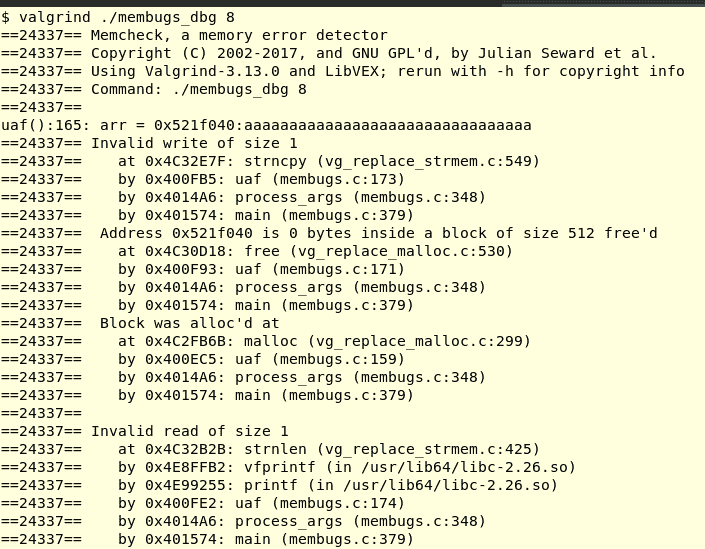
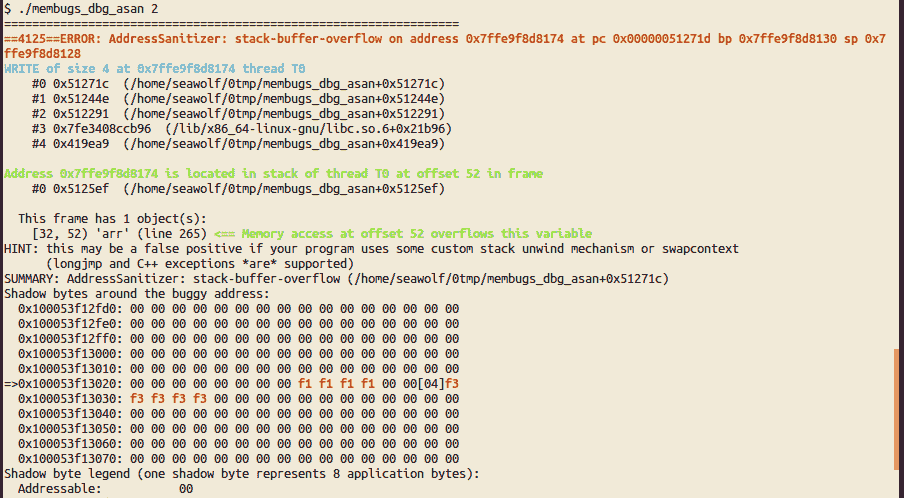

# 第六章：内存问题调试工具

我们人类（我们假设是人类在阅读这本书，而不是某种形式的人工智能，尽管，谁知道现在）擅长许多复杂的任务；但是，我们也擅长许多平凡的任务。这就是为什么我们发明了计算机——配备了驱动它们的软件！

嗯。我们并不擅长发现深藏在 C（或汇编）代码中的细节——内存错误是我们人类可以使用帮助的典型案例。所以，猜猜看：我们发明了软件工具来帮助我们——它们做乏味的工作，检查我们数以百万计甚至数十亿行代码和二进制代码，并且在捕捉我们的错误方面非常有效。当然，说到底，最好的工具仍然是你的大脑，但是人们可能会问：谁和什么来调试我们用于调试的工具？答案当然是更多的工具，以及你，作为人类程序员。

在本章中，读者将学习如何使用两种最佳的内存调试工具：

+   Valgrind 的 Memcheck

+   Sanitizer 工具（ASan）

提供了有用的表格，总结和比较它们的特性。还可以看到通过`mallopt(3)`调整 glibc 的 malloc。

这一章没有自己的源代码；相反，我们使用了上一章的源代码，即第五章，*Linux 内存问题*。我们的`membugs`程序测试案例将在 Valgrind 和 ASan 下进行测试，以查看它们是否能捕捉到我们的*memugs*程序的测试案例努力提供的内存错误。因此，我们强烈建议您复习前一章和`membugs.c`源代码，以重新熟悉我们将要运行的测试案例。

# 工具类型

总的来说，在这些领域范围内，有两种工具：

+   动态分析工具

+   静态分析工具

动态分析工具基本上通过对运行时进程进行仪器化来工作。因此，为了充分利用它们，必须要花费大量精力来确保工具实际上覆盖了所有可能的代码路径；通过仔细而费力地编写测试案例来确保完整的代码覆盖。这是一个关键点，将在后面提到（重要的是，第十九章，*故障排除和最佳实践*，涵盖了这些要点）。虽然非常强大，但动态分析工具通常会导致显著的运行时性能损失和更多的内存使用。

另一方面，静态分析工具是针对源代码进行工作的；在这个意义上，它们类似于编译器。它们通常远远超出了典型的编译器，帮助开发人员发现各种潜在的错误。也许最初的 Unix *lint*程序可以被认为是今天强大的静态分析器的前身。如今，存在着非常强大的商业静态分析器（带有花哨的图形用户界面），并且值得花费在它们上的金钱和时间。缺点是这些工具可能会引发许多错误的警报；更好的工具可以让程序员执行有用的过滤。我们不会在本文中涵盖静态分析器（请参阅 GitHub 存储库上的*进一步阅读*部分，了解 C/C++的静态分析器列表）。

现在，让我们来看看一些现代内存调试工具；它们都属于动态分析工具类。确实要学会如何有效地使用它们——它们是对各种**未定义行为**（**UB**）的必要武器。

# Valgrind

Valgrind（发音为*val-grinned*）是一套强大工具的仪器化框架。它是**开源软件**（OSS），根据 GNU GPL ver. 2 的条款发布；它最初由 Julian Seward 开发。Valgrind 是一套用于内存调试和性能分析的获奖工具。它已经发展成为创建动态分析工具的框架。事实上，它实际上是一个虚拟机；Valgrind 使用一种称为**动态二进制仪器化**（DBI）的技术来对代码进行检测。在其主页上阅读更多信息：[`valgrind.org/`](http://valgrind.org/)。

Valgrind 的巨大优势在于其工具套件，主要是**Memory Checker**工具（**Memcheck**）。还有其他几个检查器和性能分析工具，按字母顺序列在下表中：

| **Valgrind 工具名称** | **目的** |
| --- | --- |
| cachegrind | CPU 缓存性能分析器。 |
| callgrind | cachegrind 的扩展；提供更多的调用图信息。KCachegrind 是 cachegrind/callgrind 的良好 GUI 可视化工具。 |
| drd | Pthreads 错误检测器。 |
| helgrind | 多线程应用程序（主要是 Pthreads）的数据竞争检测器。 |
| massif | 堆分析器（堆使用情况图表，最大分配跟踪）。 |
| Memcheck | 内存错误检测器；包括**越界**（**OOB**）访问（读取 | 写入 | 溢出），未初始化数据访问，UAF，UAR，内存泄漏，双重释放和重叠内存区域错误。这是默认工具。 |

请注意，一些较少使用的工具（如 lackey、nulgrind、none）和一些实验性工具（exp-bbv、exp-dhat、exp-sgcheck）没有在表中显示。

通过`--tool=`选项选择 Valgrind 要运行的工具（将前述任何一个作为参数）。在本书中，我们只关注 Valgrind 的 Memcheck 工具。

# 使用 Valgrind 的 Memcheck 工具

Memcheck 是 Valgrind 的默认工具；你不需要显式传递它，但可以使用`valgrind --tool=memcheck <要执行的程序及参数>`语法来执行。

作为一个简单的例子，让我们在 Ubuntu 上运行 Valgrind 对`df(1)`实用程序进行检测：

```
$ lsb_release -a
No LSB modules are available.
Distributor ID:    Ubuntu
Description:    Ubuntu 17.10
Release:    17.10
Codename:    artful
$ df --version |head -n1
df (GNU coreutils) 8.26
$ valgrind df
==1577== Memcheck, a memory error detector
==1577== Copyright (C) 2002-2017, and GNU GPL'd, by Julian Seward et al.
==1577== Using Valgrind-3.13.0 and LibVEX; rerun with -h for copyright info
==1577== Command: df
==1577== 
Filesystem     1K-blocks    Used Available Use% Mounted on
udev              479724       0    479724   0% /dev
tmpfs             100940   10776     90164  11% /run
/dev/sda1       31863632 8535972  21686036  29% /
tmpfs             504692       0    504692   0% /dev/shm
tmpfs               5120       0      5120   0% /run/lock
tmpfs             504692       0    504692   0% /sys/fs/cgroup
tmpfs             100936       0    100936   0% /run/user/1000
==1577== 
==1577== HEAP SUMMARY:
==1577==     in use at exit: 3,577 bytes in 213 blocks
==1577==   total heap usage: 447 allocs, 234 frees, 25,483 bytes allocated
==1577== 
==1577== LEAK SUMMARY:
==1577==    definitely lost: 0 bytes in 0 blocks
==1577==    indirectly lost: 0 bytes in 0 blocks
==1577==      possibly lost: 0 bytes in 0 blocks
==1577==    still reachable: 3,577 bytes in 213 blocks
==1577==         suppressed: 0 bytes in 0 blocks
==1577== Rerun with --leak-check=full to see details of leaked memory
==1577== 
==1577== For counts of detected and suppressed errors, rerun with: -v
==1577== ERROR SUMMARY: 0 errors from 0 contexts (suppressed: 0 from 0)
$ 
```

Valgrind 实际上接管并在其中运行`df`进程，对所有动态内存访问进行检测。然后打印出其报告。在前面的代码中，这些行都以`==1577==`为前缀；那只是`df`进程的 PID 而已。

没有发现运行时内存错误，因此没有输出（当我们在 Valgrind 的控制下运行我们的`membugs`程序时，很快你就会看到差异）。就内存泄漏而言，报告指出：

```
definitely lost: 0 bytes in 0 blocks
```

所有这些都是零值，所以没问题。如果`definitely lost`下的值为正数，那么这确实会表明存在必须进一步调查和修复的内存泄漏错误。其他标签——`indirectly`/`possibly lost`，`still reachable`——通常是由于代码库中复杂或间接的内存处理而产生的（实际上，它们通常是可以忽略的假阳性）。

`still reachable`通常表示在进程退出时，一些内存块未被应用程序显式释放（但在进程死亡时被隐式释放）。以下语句显示了这一点：

+   **退出时使用**：213 个块中的 3,577 字节

+   **总堆使用情况**：447 次分配，234 次释放，25,483 字节

在总共的 447 次分配中，只有 234 次释放，剩下了 447 - 234 = 213 个未释放的块。

好了，现在来看有趣的部分：让我们运行我们的`membugs`程序测试用例（来自前面的第五章，*Linux 内存问题*）在 Valgrind 下运行，并看看它是否能捕捉到测试用例努力提供的内存错误。

我们强烈建议您回顾前一章和`membugs.c`源代码，以便重新熟悉我们将要运行的测试用例。

membugs 程序共有 13 个测试用例；我们不打算在书中展示所有测试用例的输出；我们把这留给读者作为一个练习，尝试在 Valgrind 下运行程序并解密其输出报告。

大多数读者可能会对本节末尾的摘要表感兴趣，该表显示了在每个测试用例上运行 Valgrind 的结果。

**测试用例＃1：未初始化内存访问**

```
$ ./membugs 1
true: x=32568
$ 
```

为了便于阅读，我们删除了以下显示的部分并截断了程序路径名。

现在处于 Valgrind 的控制之下：

```
$ valgrind ./membugs 1
==19549== Memcheck, a memory error detector
==19549== Copyright (C) 2002-2017, and GNU GPL'd, by Julian Seward et al.
==19549== Using Valgrind-3.13.0 and LibVEX; rerun with -h for copyright info
==19549== Command: ./membugs 1
==19549== 
==19549== Conditional jump or move depends on uninitialised value(s)
==19549==    at 0x40132C: uninit_var (in <...>/ch3/membugs)
==19549==    by 0x401451: process_args (in <...>/ch3/membugs)
==19549==    by 0x401574: main (in <...>/ch3/membugs)
==19549==  

[...] 

==19549== Conditional jump or move depends on uninitialised value(s)
==19549==    at 0x4E9101C: vfprintf (in /usr/lib64/libc-2.26.so)
==19549==    by 0x4E99255: printf (in /usr/lib64/libc-2.26.so)
==19549==    by 0x401357: uninit_var (in <...>/ch3/membugs)
==19549==    by 0x401451: process_args (in <...>/ch3/membugs)
==19549==    by 0x401574: main (in <...>/ch3/membugs)
==19549== 
false: x=0
==19549== 
==19549== HEAP SUMMARY:
==19549==     in use at exit: 0 bytes in 0 blocks
==19549==   total heap usage: 1 allocs, 1 frees, 1,024 bytes allocated
==19549== 
==19549== All heap blocks were freed -- no leaks are possible
==19549== 
==19549== For counts of detected and suppressed errors, rerun with: -v
==19549== Use --track-origins=yes to see where uninitialised values come from
==19549== ERROR SUMMARY: 6 errors from 6 contexts (suppressed: 0 from 0)
$ 
```

显然，Valgrind 捕捉到了未初始化的内存访问错误！粗体突出显示的文本清楚地揭示了这种情况。

但是，请注意，尽管 Valgrind 可以向我们显示调用堆栈（包括进程路径名），但似乎无法向我们显示源代码中存在错误的行号。不过，我们可以通过使用程序的启用调试版本来精确地实现这一点：

```
$ make membugs_dbg
gcc -g -ggdb -gdwarf-4 -O0 -Wall -Wextra -c membugs.c -o membugs_dbg.o

[...]

membugs.c: In function ‘uninit_var’:
membugs.c:283:5: warning: ‘x’ is used uninitialized in this function [-Wuninitialized]
  if (x > MAXVAL)
     ^

[...] 

gcc -g -ggdb -gdwarf-4 -O0 -Wall -Wextra -c ../common.c -o common_dbg.o
gcc -o membugs_dbg membugs_dbg.o common_dbg.o

[...]
```

用于调试的常见 GCC 标志

有关详细信息，请参阅`gcc(1)`的 man 页面。简而言之：`-g`：生成足够的调试信息，使得诸如**GNU 调试器**（GDB）之类的工具必须使用符号信息来进行调试（现代 Linux 通常会使用 DWARF 格式）。

`-ggdb`：使用操作系统可能的最表达格式。

`-gdwarf-4`：调试信息以 DWARF-<version>格式（版本 4 适用）。

`-O0`：优化级别`0`；用于调试。

在以下代码中，我们重试了使用启用调试版本的二进制可执行文件`membugs_dbg`运行 Valgrind：

```
$ valgrind --tool=memcheck ./membugs_dbg 1
==20079== Memcheck, a memory error detector
==20079== Copyright (C) 2002-2017, and GNU GPL'd, by Julian Seward et al.
==20079== Using Valgrind-3.13.0 and LibVEX; rerun with -h for copyright info
==20079== Command: ./membugs_dbg 1
==20079== 
==20079== Conditional jump or move depends on uninitialised value(s)
==20079== at 0x40132C: uninit_var (membugs.c:283)
==20079== by 0x401451: process_args (membugs.c:326)
==20079== by 0x401574: main (membugs.c:379)
==20079== 
==20079== Conditional jump or move depends on uninitialised value(s)
==20079== at 0x4E90DAA: vfprintf (in /usr/lib64/libc-2.26.so)
==20079== by 0x4E99255: printf (in /usr/lib64/libc-2.26.so)
==20079== by 0x401357: uninit_var (membugs.c:286)
==20079== by 0x401451: process_args (membugs.c:326)
==20079== by 0x401574: main (membugs.c:379)
==20079== 
==20079== Use of uninitialised value of size 8
==20079== at 0x4E8CD7B: _itoa_word (in /usr/lib64/libc-2.26.so)
==20079== by 0x4E9043D: vfprintf (in /usr/lib64/libc-2.26.so)
==20079== by 0x4E99255: printf (in /usr/lib64/libc-2.26.so)
==20079== by 0x401357: uninit_var (membugs.c:286)
==20079== by 0x401451: process_args (membugs.c:326)
==20079== by 0x401574: main (membugs.c:379) 

[...]

==20079== 
false: x=0
==20079== 
==20079== HEAP SUMMARY:
==20079== in use at exit: 0 bytes in 0 blocks
==20079== total heap usage: 1 allocs, 1 frees, 1,024 bytes allocated
==20079== 
==20079== All heap blocks were freed -- no leaks are possible
==20079== 
==20079== For counts of detected and suppressed errors, rerun with: -v
==20079== Use --track-origins=yes to see where uninitialised values come from
==20079== ERROR SUMMARY: 6 errors from 6 contexts (suppressed: 0 from 0)
$
```

像往常一样，以自下而上的方式阅读调用堆栈，它就会有意义！

重要提示：请注意，不幸的是，输出中显示的精确行号可能与书中 GitHub 存储库中最新版本的源文件中的行号不完全匹配。

以下是源代码（此处使用`nl`实用程序显示所有行编号的代码）：

```
$  nl --body-numbering=a membugs.c [...]  

   278    /* option =  1 : uninitialized var test case */
   279    static void uninit_var()
   280    {
   281        int x;
   282    
 283        if (x)   284            printf("true case: x=%d\n", x);
   285        else
   286           printf("false case\n");
   287    } 

[...]

   325            case 1:
   326                uninit_var();
   327                 break; 

[...]

   377    int main(int argc, char **argv)
   378    {
   379        process_args(argc, argv);
   380         exit(EXIT_SUCCESS);
   381    }
```

我们现在可以看到 Valgrind 确实完美地捕捉到了错误的情况。

**测试用例＃5：** 编译时内存读取溢出：

```
$ valgrind ./membugs_dbg 5
==23024== Memcheck, a memory error detector
==23024== Copyright (C) 2002-2017, and GNU GPL'd, by Julian Seward et al.
==23024== Using Valgrind-3.13.0 and LibVEX; rerun with -h for copyright info
==23024== Command: ./membugs_dbg 5
==23024== 
arr = aaaaa����
==23024== 
==23024== HEAP SUMMARY:
==23024==     in use at exit: 0 bytes in 0 blocks
==23024==   total heap usage: 1 allocs, 1 frees, 1,024 bytes allocated
==23024== 
==23024== All heap blocks were freed -- no leaks are possible
==23024== 
==23024== For counts of detected and suppressed errors, rerun with: -v
==23024== ERROR SUMMARY: 0 errors from 0 contexts (suppressed: 0 from 0)
$ 
```

看看！Valgrind 未能捕捉到读取溢出内存错误。为什么？这是一个限制：Valgrind 只能对动态分配的内存进行插装和捕捉 UB（错误）。前面的测试用例使用了静态编译时分配的内存。

因此，让我们尝试相同的测试，但这次使用动态分配的内存；这正是测试用例＃6 的设计目的。

**测试用例＃6：** 动态内存上的读取溢出（为了便于阅读，我们截断了部分输出）：

```
$ ./membugs_dbg 2>&1 |grep 6
 option =  6 : out-of-bounds : read overflow [on dynamic memory]
$ valgrind ./membugs_dbg 6
[...]
==23274== Command: ./membugs_dbg 6
==23274== 
==23274== Invalid write of size 1
==23274==    at 0x401127: read_overflow_dynmem (membugs.c:215)
==23274==    by 0x401483: process_args (membugs.c:341)
==23274==    by 0x401574: main (membugs.c:379)
==23274==  Address 0x521f045 is 0 bytes after a block of size 5 alloc'd
==23274==    at 0x4C2FB6B: malloc (vg_replace_malloc.c:299)
==23274==    by 0x4010D9: read_overflow_dynmem (membugs.c:205)
==23274==    by 0x401483: process_args (membugs.c:341)
==23274==    by 0x401574: main (membugs.c:379)
[...]
==23274== Invalid write of size 1
==23274==    at 0x40115E: read_overflow_dynmem (membugs.c:216)
==23274==    by 0x401483: process_args (membugs.c:341)
==23274==    by 0x401574: main (membugs.c:379)
==23274==  Address 0x521f04a is 5 bytes after a block of size 5 alloc'd
==23274==    at 0x4C2FB6B: malloc (vg_replace_malloc.c:299)
==23274==    by 0x4010D9: read_overflow_dynmem (membugs.c:205)
==23274==    by 0x401483: process_args (membugs.c:341)
==23274==    by 0x401574: main (membugs.c:379)
==23274== 
==23274== Invalid read of size 1
==23274==    at 0x4C32B94: strlen (vg_replace_strmem.c:458)
==23274==    by 0x4E91955: vfprintf (in /usr/lib64/libc-2.26.so)
==23274==    by 0x4E99255: printf (in /usr/lib64/libc-2.26.so)
==23274==    by 0x401176: read_overflow_dynmem (membugs.c:217)
==23274==    by 0x401483: process_args (membugs.c:341)
==23274==    by 0x401574: main (membugs.c:379)
==23274==  Address 0x521f045 is 0 bytes after a block of size 5 alloc'd
==23274==    at 0x4C2FB6B: malloc (vg_replace_malloc.c:299)
==23274==    by 0x4010D9: read_overflow_dynmem (membugs.c:205)
==23274==    by 0x401483: process_args (membugs.c:341)
==23274==    by 0x401574: main (membugs.c:379)
[...]
arr = aaaaaSecreT
==23274== Conditional jump or move depends on uninitialised value(s)
==23274==    at 0x4E90DAA: vfprintf (in /usr/lib64/libc-2.26.so)
==23274==    by 0x4E99255: printf (in /usr/lib64/libc-2.26.so)
==23274==    by 0x401195: read_overflow_dynmem (membugs.c:220)
==23274==    by 0x401483: process_args (membugs.c:341)
==23274==    by 0x401574: main (membugs.c:379)
==23274== 
==23274== Use of uninitialised value of size 8
==23274==    at 0x4E8CD7B: _itoa_word (in /usr/lib64/libc-2.26.so)
==23274==    by 0x4E9043D: vfprintf (in /usr/lib64/libc-2.26.so)
==23274==    by 0x4E99255: printf (in /usr/lib64/libc-2.26.so)
==23274==    by 0x401195: read_overflow_dynmem (membugs.c:220)
==23274==    by 0x401483: process_args (membugs.c:341)
==23274==    by 0x401574: main (membugs.c:379)
[...]
==23274== ERROR SUMMARY: 31 errors from 17 contexts (suppressed: 0 from 0)
$ 
```

这一次，大量的错误被捕捉到，显示了源代码中的确切位置（因为我们使用了`-g`进行编译）。

**测试用例＃8：** **UAF**（释放后使用）：

```
$ ./membugs_dbg 2>&1 |grep 8
 option =  8 : UAF (use-after-free) test case
$ 
```



当 Valgrind 捕捉到 UAF 错误时的（部分）屏幕截图

Valgrind 确实捕捉到了 UAF！

**测试用例＃8：** **UAR**（返回后使用）：

```
$ ./membugs_dbg 9
res: (null)
$ valgrind ./membugs_dbg 9
==7594== Memcheck, a memory error detector
==7594== Copyright (C) 2002-2017, and GNU GPL'd, by Julian Seward et al.
==7594== Using Valgrind-3.13.0 and LibVEX; rerun with -h for copyright info
==7594== Command: ./membugs_dbg 9
==7594== 
res: (null)
==7594== 
==7594== HEAP SUMMARY:
==7594==     in use at exit: 0 bytes in 0 blocks
==7594==   total heap usage: 1 allocs, 1 frees, 1,024 bytes allocated
==7594== 
==7594== All heap blocks were freed -- no leaks are possible
==7594== 
==7594== For counts of detected and suppressed errors, rerun with: -v
==7594== ERROR SUMMARY: 0 errors from 0 contexts (suppressed: 0 from 0)
$ 
```

哎呀！Valgrind 没有捕捉到 UAR 错误！

**测试用例＃13：** 内存泄漏案例＃3—lib API 泄漏。我们通过选择 13 作为*membugs*的参数来运行内存泄漏测试用例＃3。值得注意的是，只有在使用`--leak-check=full`选项运行时，Valgrind 才会显示泄漏的来源（通过显示的调用堆栈）：

```
$ valgrind --leak-resolution=high --num-callers=50 --leak-check=full ./membugs_dbg 13
==22849== Memcheck, a memory error detector
==22849== Copyright (C) 2002-2017, and GNU GPL'd, by Julian Seward et al.
==22849== Using Valgrind-3.13.0 and LibVEX; rerun with -h for copyright info
==22849== Command: ./membugs_dbg 13
==22849== 

## Leakage test: case 3: "lib" API: runtime cond = 0
mypath = /usr/local/bin:/usr/local/sbin:/usr/bin:/usr/sbin:/sbin:/usr/sbin:/usr/local/sbin:/home/kai/MentorGraphics/Sourcery_CodeBench_Lite_for_ARM_GNU_Linux/bin/:/mnt/big/scratchpad/buildroot-2017.08.1/output/host/bin/:/sbin:/usr/sbin:/usr/local/sbin

## Leakage test: case 3: "lib" API: runtime cond = 1
mypath = /usr/local/bin:/usr/local/sbin:/usr/bin:/usr/sbin:/sbin:/usr/sbin:/usr/local/sbin:/home/kai/MentorGraphics/Sourcery_CodeBench_Lite_for_ARM_GNU_Linux/bin/:/mnt/big/scratchpad/buildroot-2017.08.1/output/host/bin/:/sbin:/usr/sbin:/usr/local/sbin
==22849== 
==22849== HEAP SUMMARY:
==22849==     in use at exit: 4,096 bytes in 1 blocks
==22849==   total heap usage: 3 allocs, 2 frees, 9,216 bytes allocated
==22849== 
==22849== 4,096 bytes in 1 blocks are definitely lost in loss record 1 of 1
==22849==    at 0x4C2FB6B: malloc (vg_replace_malloc.c:299)
==22849==    by 0x400A0C: silly_getpath (membugs.c:38)
==22849==    by 0x400AC6: leakage_case3 (membugs.c:59)
==22849==    by 0x40152B: process_args (membugs.c:367)
==22849==    by 0x401574: main (membugs.c:379)
==22849== 
==22849== LEAK SUMMARY:
==22849==    definitely lost: 4,096 bytes in 1 blocks
==22849==    indirectly lost: 0 bytes in 0 blocks
==22849==      possibly lost: 0 bytes in 0 blocks
==22849==    still reachable: 0 bytes in 0 blocks
==22849==         suppressed: 0 bytes in 0 blocks
==22849== 
==22849== For counts of detected and suppressed errors, rerun with: -v
==22849== ERROR SUMMARY: 1 errors from 1 contexts (suppressed: 0 from 0)
$ 
```

Valgrind 的 man 页面建议设置`--leak-resolution=high`和`--num-callers=`为 40 或更高。

`valgrind(1)`的 man 页面涵盖了它提供的许多选项（如日志和工具（Memcheck）选项）；请查看以更深入地了解此工具的用法。

# Valgrind 摘要表

关于我们的测试用例（并入我们的`membugs`程序），以下是 Valgrind 的报告卡和内存错误如下：

| **测试用例＃** | **测试用例** | **Valgrind 检测到了吗？** |
| --- | --- | --- |
| 1 | **未初始化内存读取**（UMR） | 是 |
| 2 | **越界**（**OOB**）：写入溢出[在编译时内存上] | 否 |
| 3 | OOB：写入溢出[在动态内存上] | 是 |
| 4 | OOB：写入下溢[在动态内存上] | 是 |
| 5 | OOB：读取溢出[在编译时内存上] | 否 |
| 6 | OOB：读取溢出[在动态内存上] | 是 |
| 7 | OOB：读取下溢[在动态内存上] | 是 |
| 8 | UAF，也称为悬空指针 | 是 |
| 9 | UAR，也称为**use-after-scope**(**UAS**) | 否 |
| 10 | 重复释放 | 是 |
| 11 | 内存泄漏测试案例 1：简单泄漏 | 是 |
| 12 | 内存泄漏测试案例 1：泄漏更多（循环中） | 是 |
| 13 | 内存泄漏测试案例 1：库 API 泄漏 | 是 |

# Valgrind 优点和缺点：快速总结

Valgrind 优点*：*

+   捕获动态分配内存区域上的常见内存错误（UB）

+   使用未初始化的变量

+   越界内存访问（读取/写入下溢/溢出错误）

+   释放后使用/返回后使用（超出范围）错误

+   重复释放

+   泄漏

+   无需修改源代码

+   无需重新编译

+   无需特殊的编译器标志

Valgrind 缺点：

+   性能：在 Valgrind 下运行目标软件可能会慢 10 到 30 倍。

+   内存占用：目标程序中的每个分配都需要 Valgrind 进行内存分配（在高资源约束的嵌入式 Linux 系统上运行 Valgrind 变得困难）。

+   无法捕获静态（编译时）分配的内存区域上的错误。

+   为了查看带有行号信息的调用堆栈，需要使用`-g`标志重新编译/构建。

事实上，Valgrind 仍然是对抗错误的有力武器。有许多真实世界的项目使用 Valgrind；在[`valgrind.org/gallery/users.html`](http://valgrind.org/gallery/users.html)上查看长列表*.*

总是有更多可以学习和探索的：Valgrind 提供了 GDB 监视器模式，允许您通过**GNU 调试器**（**GDB**）对程序进行高级调试。这对于在从不终止的程序上使用 Valgrind 特别有用（守护进程是典型案例）。

Valgrind 手册的第三章在这方面非常有帮助：[`valgrind.org/docs/manual/manual-core-adv.html`](http://valgrind.org/docs/manual/manual-core-adv.html)

# Sanitizer 工具

Sanitizer 是来自 Google 的一套开源工具；与其他内存调试工具一样，它们解决了通常的常见内存错误和 UB 问题，包括 OOB（越界访问：读取/写入下溢/溢出）、UAF、UAR、重复释放和内存泄漏。其中一个工具还处理 C/C++代码中的数据竞争。

一个关键区别是，Sanitizer 工具通过编译器向代码引入了插装。它们使用一种称为**编译时插装**（CTI）的技术以及影子内存技术。截至目前，ASan 是 GCC ver 4.8 和 LLVM（Clang）ver. 3.1 及以上的一部分并支持它。

# Sanitizer 工具集

要使用给定的工具，需要使用 Usage 列中显示的标志编译程序：

| **Sanitizer 工具（简称）** | **目的** | **使用（编译器标志）** | **Linux 平台[+注释]** |
| --- | --- | --- | --- |
| **AddressSanitizer** (**ASan**) | 检测通用内存错误[堆栈全局缓冲区溢出、UAF、UAR、初始化顺序错误] | `-fsanitize=address` | x86、x86_64、ARM、Aarch64、MIPS、MIPS64、PPC64\. [不能与 TSan 组合] |
| **Kernel AddressSanitizer** (**KASAN**) | 用于 Linux 内核空间的 ASan | `-fsanitize=kernel-address` | x86_64 [内核版本>=4.0]，Aarch64 [内核版本>= 4.4] |
| **MemorySanitizer** (**MSan**) | UMR 检测器 | `-fsanitize=memory -fPIE -pie [-fno-omit-frame-pointer]`  | 仅适用于 Linux x86_64 |
| **ThreadSanitizer** (**TSan**) | 数据竞争检测器 | `-fsanitize=thread` | 仅适用于 Linux x86_64。[不能与 ASan 或 LSan 标志组合] |
| **LeakSanitizer** (**LSan**)（ASan 的子集） | 内存泄漏检测器 | `-fsanitize=leak` | Linux x86_64 和 OS X [不能与 TSan 组合] |
| **UndefinedBehaviorSanitizer** (**UBSan**) | UB 检测器 | `-fsanitize=undefined` | x86, x86_64, ARM, Aarch64, PPC64, MIPS, MIPS64 |

额外的文档 Google 维护着一个 GitHub 页面，其中包含有关 sanitizer 工具的文档：

+   [`github.com/google/sanitizers`](https://github.com/google/sanitizers)

+   [`github.com/google/sanitizers/wiki`](https://github.com/google/sanitizers/wiki)

+   [`github.com/google/sanitizers/wiki/SanitizerCommonFlags`](https://github.com/google/sanitizers/wiki/SanitizerCommonFlags)

每个工具的个别 wiki（文档）页面都有链接。建议您在使用工具时仔细阅读它们（例如，每个工具可能具有用户可以利用的特定标志和/或环境变量）。

`gcc(1)`的 man 页面是关于`-fsanitize=`sanitizer 工具 gcc 选项的复杂信息的丰富来源。有趣的是，大多数 sanitizer 工具也支持 Android（>=4.1）平台。

Clang 文档还记录了使用 sanitizer 工具的方法：[`clang.llvm.org/docs/index.html`](https://clang.llvm.org/docs/index.html)。

在本章中，我们专注于使用 ASan 工具。

# 为 ASan 构建程序

正如前表所示，我们需要使用适当的编译器标志来编译我们的目标应用程序 membugs。此外，建议使用`clang`而不是`gcc`作为编译器。

`clang`被认为是几种编程语言的编译器前端，包括 C 和 C++；后端是 LLVM 编译器基础设施项目。关于 Clang 的更多信息可以在其维基百科页面上找到。

您需要确保在您的 Linux 系统上安装了 Clang 软件包；使用您的发行版的软件包管理器（`apt-get`，`dnf`，`rpm`）是最简单的方法。

我们的 Makefile 片段显示了我们如何使用`clang`来编译 membugs sanitizer 目标：

```
CC=${CROSS_COMPILE}gcc
CL=${CROSS_COMPILE}clang

CFLAGS=-Wall -UDEBUG
CFLAGS_DBG=-g -ggdb -gdwarf-4 -O0 -Wall -Wextra -DDEBUG
CFLAGS_DBG_ASAN=${CFLAGS_DBG} -fsanitize=address
CFLAGS_DBG_MSAN=${CFLAGS_DBG} -fsanitize=memory
CFLAGS_DBG_UB=${CFLAGS_DBG} -fsanitize=undefined

[...]

#--- Sanitizers (use clang): <foo>_dbg_[asan|ub|msan]
membugs_dbg_asan.o: membugs.c
    ${CL} ${CFLAGS_DBG_ASAN} -c membugs.c -o membugs_dbg_asan.o
membugs_dbg_asan: membugs_dbg_asan.o common_dbg_asan.o
    ${CL} ${CFLAGS_DBG_ASAN} -o membugs_dbg_asan membugs_dbg_asan.o common_dbg_asan.o

membugs_dbg_ub.o: membugs.c
    ${CL} ${CFLAGS_DBG_UB} -c membugs.c -o membugs_dbg_ub.o
membugs_dbg_ub: membugs_dbg_ub.o common_dbg_ub.o
    ${CL} ${CFLAGS_DBG_UB} -o membugs_dbg_ub membugs_dbg_ub.o common_dbg_ub.o

membugs_dbg_msan.o: membugs.c
    ${CL} ${CFLAGS_DBG_MSAN} -c membugs.c -o membugs_dbg_msan.o
membugs_dbg_msan: membugs_dbg_msan.o common_dbg_msan.o
    ${CL} ${CFLAGS_DBG_MSAN} -o membugs_dbg_msan membugs_dbg_msan.o common_dbg_msan.o
[...]
```

# 使用 ASan 运行测试用例

为了提醒我们，这是我们的 membugs 程序的帮助屏幕：

```
$ ./membugs_dbg_asan 
Usage: ./membugs_dbg_asan option [ -h | --help]
 option =  1 : uninitialized var test case
 option =  2 : out-of-bounds : write overflow [on compile-time memory]
 option =  3 : out-of-bounds : write overflow [on dynamic memory]
 option =  4 : out-of-bounds : write underflow
 option =  5 : out-of-bounds : read overflow [on compile-time memory]
 option =  6 : out-of-bounds : read overflow [on dynamic memory]
 option =  7 : out-of-bounds : read underflow
 option =  8 : UAF (use-after-free) test case
 option =  9 : UAR (use-after-return) test case
 option = 10 : double-free test case
 option = 11 : memory leak test case 1: simple leak
 option = 12 : memory leak test case 2: leak more (in a loop)
 option = 13 : memory leak test case 3: "lib" API leak
-h | --help : show this help screen
$ 
```

membugs 程序共有 13 个测试用例；我们不打算在本书中显示所有这些测试用例的输出；我们把它留给读者来尝试使用 ASan 构建和运行所有测试用例的程序，并解密其输出报告。读者有兴趣看到本节末尾的摘要表，显示在每个测试用例上运行 ASan 的结果。

**测试用例＃1：** UMR

让我们尝试第一个——未初始化变量读取测试用例：

```
$ ./membugs_dbg_asan 1
false case
$ 
```

它没有捕获到错误！是的，我们已经发现了 ASan 的限制：AddressSanitizer 无法捕获静态（编译时）分配的内存上的 UMR。Valgrind 可以。

MSan 工具已经处理了这个问题；它的具体工作是捕获 UMR 错误。文档说明 MSan 只能捕获动态分配的内存上的 UMR。我们发现它甚至捕获了一个在静态分配的内存上的 UMR 错误，而我们的简单测试用例使用了：

```
$ ./membugs_dbg_msan 1
==3095==WARNING: MemorySanitizer: use-of-uninitialized-value
    #0 0x496eb8 (<...>/ch5/membugs_dbg_msan+0x496eb8)
    #1 0x494425 (<...>/ch5/membugs_dbg_msan+0x494425)
    #2 0x493f2b (<...>/ch5/membugs_dbg_msan+0x493f2b)
    #3 0x7fc32f17ab96 (/lib/x86_64-linux-gnu/libc.so.6+0x21b96)
    #4 0x41a8c9 (<...>/ch5/membugs_dbg_msan+0x41a8c9)
 SUMMARY: MemorySanitizer: use-of-uninitialized-value (<...>/ch5/membugs_dbg_msan+0x496eb8) Exiting $ 
```

它已经捕获了错误；然而，这一次，尽管我们使用了带有`-g -ggdb`标志构建的调试二进制可执行文件，但在堆栈跟踪中缺少通常的`filename:line_number`信息。实际上，下一个测试用例中演示了一种获得这种信息的方法。

现在，不管怎样：这给了我们一个学习另一种有用的调试技术的机会：`objdump(1)`是可以极大帮助的工具链实用程序之一（我们可以使用诸如`readelf(1)`或`gdb(1)`之类的工具获得类似的结果）。我们将使用`objdump(1)`（`-d`开关，并通过`-S`开关提供源代码），并在其输出中查找 UMR 发生的地址：

```
SUMMARY: MemorySanitizer: use-of-uninitialized-value (<...>/ch5/membugs_dbg_msan+0x496eb8)
```

由于`objdump`的输出非常庞大，我们截断它，只显示相关部分：

```
$ objdump -d -S ./membugs_dbg_msan > tmp 

<< Now examine the tmp file >>

$ cat tmp

./membugs_dbg_msan: file format elf64-x86-64

Disassembly of section .init:

000000000041a5b0 <_init>:
  41a5b0: 48 83 ec 08 sub $0x8,%rsp
  41a5b4: 48 8b 05 ad a9 2a 00 mov 0x2aa9ad(%rip),%rax # 6c4f68 <__gmon_start__>
  41a5bb: 48 85 c0 test %rax,%rax
  41a5be: 74 02 je 41a5c2 <_init+0x12>

[...]

0000000000496e60 <uninit_var>:
{
  496e60: 55 push %rbp
  496e61: 48 89 e5 mov %rsp,%rbp
  int x; /* static mem */
  496e64: 48 83 ec 10 sub $0x10,%rsp
 [...]
  if (x)
  496e7f: 8b 55 fc mov -0x4(%rbp),%edx
  496e82: 8b 31 mov (%rcx),%esi
  496e84: 89 f7 mov %esi,%edi
  [...]
  496eaf: e9 00 00 00 00 jmpq 496eb4 <uninit_var+0x54>
  496eb4: e8 a7 56 f8 ff callq 41c560 <__msan_warning_noreturn>
  496eb9: 8a 45 fb mov -0x5(%rbp),%al
  496ebc: a8 01 test $0x1,%al
[...]
```

在`objdump`输出中与 MSan 提供的`0x496eb8`错误点最接近的是`0x496eb4`。没问题：只需查看代码的第一行之前的内容；它是以下一行：

```
   if (x)
```

完美。这正是 UMR 发生的地方！

**测试案例＃2：**写溢出[在编译时内存上]

我们运行`membugs`程序，同时在 Valgrind 和 ASan 下运行，只调用`write_overflow_compilemem()`函数来测试编译时分配的内存的越界写溢出错误。

**案例 1：**使用 Valgrind

请注意，Valgrind 没有捕获越界内存错误：

```
$ valgrind ./membugs_dbg 2 ==8959== Memcheck, a memory error detector
==8959== Copyright (C) 2002-2017, and GNU GPL'd, by Julian Seward et al.
==8959== Using Valgrind-3.13.0 and LibVEX; rerun with -h for copyright info
==8959== Command: ./membugs_dbg 2
==8959== 
==8959== 
==8959== HEAP SUMMARY:
==8959==     in use at exit: 0 bytes in 0 blocks
==8959==   total heap usage: 0 allocs, 0 frees, 0 bytes allocated
==8959== 
==8959== All heap blocks were freed -- no leaks are possible
==8959== 
==8959== For counts of detected and suppressed errors, rerun with: -v
==8959== ERROR SUMMARY: 0 errors from 0 contexts (suppressed: 0 from 0)
$ 
```

这是因为 Valgrind 仅限于处理动态分配的内存；它无法插装和处理编译时分配的内存。

**案例 2：**地址消毒剂

ASan 确实捕获了 bug：



AddressSanitizer（ASan）捕获了 OOB 写溢出 bug

以下是一个类似的文本版本：

```
$ ./membugs_dbg_asan 2
=================================================================
==25662==ERROR: AddressSanitizer: stack-buffer-overflow on address 0x7fff17e789f4 at pc 0x00000051271d bp 0x7fff17e789b0 sp 0x7fff17e789a8
WRITE of size 4 at 0x7fff17e789f4 thread T0
    #0 0x51271c (<...>/membugs_dbg_asan+0x51271c)
    #1 0x51244e (<...>/membugs_dbg_asan+0x51244e)
    #2 0x512291 (<...>/membugs_dbg_asan+0x512291)
    #3 0x7f7e19b2db96 (/lib/x86_64-linux-gnu/libc.so.6+0x21b96)
    #4 0x419ea9 (<...>/membugs_dbg_asan+0x419ea9)

Address 0x7fff17e789f4 is located in stack of thread T0 at offset 52 in frame
    #0 0x5125ef (/home/seawolf/0tmp/membugs_dbg_asan+0x5125ef)
[...]
SUMMARY: AddressSanitizer: stack-buffer-overflow (/home/seawolf/0tmp/membugs_dbg_asan+0x51271c) 
[...]
==25662==ABORTING
$ 
```

然而，请注意，在堆栈回溯中，没有`filename:line#信息`。这令人失望。我们能获取它吗？

确实—诀窍在于确保几件事情：

+   使用`-g`开关编译应用程序（包括调试符号信息；我们对所有*_dbg 版本都这样做）。

+   除了 Clang 编译器，还必须安装一个名为`llvm-symbolizer`的工具。安装后，您必须找出它在磁盘上的确切位置，并将该目录添加到路径中。

+   在运行时，必须将`ASAN_OPTIONS`环境变量设置为`symbolize=1`值。

在这里，我们使用`llvm-symbolizer`重新运行有 bug 的案例：

```
$ export PATH=$PATH:/usr/lib/llvm-6.0/bin/
$ ASAN_OPTIONS=symbolize=1 ./membugs_dbg_asan 2
=================================================================
==25807==ERROR: AddressSanitizer: stack-buffer-overflow on address 0x7ffd63e80cf4 at pc 0x00000051271d bp 0x7ffd63e80cb0 sp 0x7ffd63e80ca8
WRITE of size 4 at 0x7ffd63e80cf4 thread T0
 #0 0x51271c in write_overflow_compilemem <...>/ch5/membugs.c:268:10
    #1 0x51244e in process_args <...>/ch5/membugs.c:325:4
    #2 0x512291 in main <...>/ch5/membugs.c:375:2
    #3 0x7f9823642b96 in __libc_start_main /build/glibc-OTsEL5/glibc-2.27/csu/../csu/libc-start.c:310
    #4 0x419ea9 in _start (<...>/membugs_dbg_asan+0x419ea9)
[...]
$ 
```

现在`filename:line#信息`显示出来了！

显然，ASan 可以并且确实插装编译时分配的内存以及动态分配的内存区域，从而捕获内存类型的错误。

另外，正如我们所看到的，它显示了一个调用堆栈（当然是从底部到顶部）。我们可以看到调用链是：

```
_start --> __libc_start_main --> main --> process_args --> 
             write_overflow_compilemem
```

AddressSanitizer 还显示了“在有 bug 的地址周围的影子字节”；在这里，我们不试图解释用于捕获此类错误的内存阴影技术；如果感兴趣，请参阅 GitHub 存储库上的*进一步阅读*部分。

**测试案例＃3：**写溢出（在动态内存上）

正如预期的那样，ASan 捕获了 bug：

```
$ ./membugs_dbg_asan 3
=================================================================
==25848==ERROR: AddressSanitizer: heap-buffer-overflow on address 0x602000000018 at pc 0x0000004aaedc bp 0x7ffe64dd2cd0 sp 0x7ffe64dd2480
WRITE of size 10 at 0x602000000018 thread T0
    #0 0x4aaedb in __interceptor_strcpy.part.245 (<...>/membugs_dbg_asan+0x4aaedb)
    #1 0x5128fd in write_overflow_dynmem <...>/ch5/membugs.c:258:2
    #2 0x512458 in process_args <...>/ch5/membugs.c:328:4
    #3 0x512291 in main <...>/ch5/membugs.c:375:2
    #4 0x7f93abb88b96 in __libc_start_main /build/glibc-OTsEL5/glibc-2.27/csu/../csu/libc-start.c:310
    #5 0x419ea9 in _start (<...>/membugs_dbg_asan+0x419ea9)

0x602000000018 is located 0 bytes to the right of 8-byte region [0x602000000010,0x602000000018) allocated by thread T0 here:
    #0 0x4d9d60 in malloc (<...>/membugs_dbg_asan+0x4d9d60)
    #1 0x512896 in write_overflow_dynmem <...>/ch5/membugs.c:254:9
    #2 0x512458 in process_args <...>/ch5/membugs.c:328:4
    #3 0x512291 in main <...>/ch5/membugs.c:375:2
    #4 0x7f93abb88b96 in __libc_start_main /build/glibc-OTsEL5/glibc-2.27/csu/../csu/libc-start.c:310
[...]
```

有了`llvm-symbolizer`在路径中，`filename:line#信息`再次显示出来。

尝试为消毒剂插装编译（通过`-fsanitize=`GCC 开关）并尝试在 Valgrind 上运行二进制可执行文件是不受支持的；当我们尝试这样做时，Valgrind 报告如下：

```
$ valgrind ./membugs_dbg 3
==8917== Memcheck, a memory error detector
==8917== Copyright (C) 2002-2017, and GNU GPL'd, by Julian Seward et al.
==8917== Using Valgrind-3.13.0 and LibVEX; rerun with -h for copyright info
==8917== Command: ./membugs_dbg 3
==8917== 
==8917==ASan runtime does not come first in initial library list; you should either link runtime to your application or manually preload it with LD_PRELOAD.
[...]
```

**测试案例＃8：**UAF（释放后使用）。看看以下代码：

```
$ ./membugs_dbg_asan 8 uaf():162: arr = 0x615000000080:aaaaaaaaaaaaaaaaaaaaaaaaaaaaaaaa
=================================================================
==25883==ERROR: AddressSanitizer: heap-use-after-free on address 0x615000000080 at pc 0x000000444b14 bp 0x7ffde4315390 sp 0x7ffde4314b40
WRITE of size 22 at 0x615000000080 thread T0
    #0 0x444b13 in strncpy (<...>/membugs_dbg_asan+0x444b13)
    #1 0x513529 in uaf <...>/ch5/membugs.c:172:2
    #2 0x512496 in process_args <...>/ch5/membugs.c:344:4
    #3 0x512291 in main <...>/ch5/membugs.c:375:2
    #4 0x7f4ceea9fb96 in __libc_start_main /build/glibc-OTsEL5/glibc-2.27/csu/../csu/libc-start.c:310
    #5 0x419ea9 in _start (<...>/membugs_dbg_asan+0x419ea9)

0x615000000080 is located 0 bytes inside of 512-byte region [0x615000000080,0x615000000280)
freed by thread T0 here:
    #0 0x4d9b90 in __interceptor_free.localalias.0 (<...>/membugs_dbg_asan+0x4d9b90)
    #1 0x513502 in uaf <...>/ch5/membugs.c:171:2
    #2 0x512496 in process_args <...>/ch5/membugs.c:344:4
    #3 0x512291 in main <...>/ch5/membugs.c:375:2
    #4 0x7f4ceea9fb96 in __libc_start_main /build/glibc-OTsEL5/glibc-2.27/csu/../csu/libc-start.c:310

previously allocated by thread T0 here:
    #0 0x4d9d60 in malloc (<...>/membugs_dbg_asan+0x4d9d60)
    #1 0x513336 in uaf <...>/ch5/membugs.c:157:8
    #2 0x512496 in process_args <...>/ch5/membugs.c:344:4
    #3 0x512291 in main <...>/ch5/membugs.c:375:2
    #4 0x7f4ceea9fb96 in __libc_start_main /build/glibc-OTsEL5/glibc-2.27/csu/../csu/libc-start.c:310

SUMMARY: AddressSanitizer: heap-use-after-free (<...>/membugs_dbg_asan+0x444b13) in strncpy
[...]
```

太棒了。ASan 不仅报告了 UAF bug，甚至还报告了缓冲区的确切分配和释放位置！强大的东西。

**测试案例＃9：**UAR

为了举例，假设我们以通常的方式使用`gcc`编译`membugs`程序。运行测试案例：

```
$ ./membugs_dbg 2>&1 | grep -w 9
 option =  9 : UAR (use-after-return) test case
$ ./membugs_dbg_asan 9
res: (null)
$ 
```

ASan 本身并没有捕获这个危险的 UAR bug！正如我们之前看到的，Valgrind 也没有。但是，编译器确实发出了警告！

不过，消毒剂文档提到，如果：

+   `clang`（版本从 r191186 开始）用于编译代码（而不是 gcc）

+   设置了一个特殊标志`detect_stack_use_after_return`为`1`

因此，我们通过 Clang 重新编译可执行文件（再次，我们假设已安装 Clang 软件包）。实际上，我们的 Makefile 确实对所有`membugs_dbg_*`构建使用了`clang`。因此，请确保我们使用 Clang 重新构建编译器并重试：

```
$ ASAN_OPTIONS=detect_stack_use_after_return=1 ./membugs_dbg_asan 9
=================================================================
==25925==ERROR: AddressSanitizer: stack-use-after-return on address 0x7f7721a00020 at pc 0x000000445b17 bp 0x7ffdb7c3ba10 sp 0x7ffdb7c3b1c0
READ of size 23 at 0x7f7721a00020 thread T0
    #0 0x445b16 in printf_common(void*, char const*, __va_list_tag*) (<...>/membugs_dbg_asan+0x445b16)
    #1 0x4465db in vprintf (<...>/membugs_dbg_asan+0x4465db)
    #2 0x4466ae in __interceptor_printf (<...>/membugs_dbg_asan+0x4466ae)
    #3 0x5124b9 in process_args <...>/ch5/membugs.c:348:4
    #4 0x512291 in main <...>/ch5/membugs.c:375:2
    #5 0x7f7724e80b96 in __libc_start_main /build/glibc-OTsEL5/glibc-2.27/csu/../csu/libc-start.c:310
    #6 0x419ea9 in _start (/home/seawolf/0tmp/membugs_dbg_asan+0x419ea9)

Address 0x7f7721a00020 is located in stack of thread T0 at offset 32 in frame
    #0 0x5135ef in uar <...>/ch5/membugs.c:141

  This frame has 1 object(s):
    [32, 64) 'name' (line 142) <== Memory access at offset 32 is inside this variable
[...]
```

它确实有效。正如我们在*测试案例＃1：UMR*中所展示的，可以进一步利用`objdump(1)`来找出 bug 发生的确切位置。我们把这留给读者作为一个练习。

有关 ASan 如何检测堆栈 UAR 的更多信息，请访问[`github.com/google/sanitizers/wiki/AddressSanitizerUseAfterReturn`](https://github.com/google/sanitizers/wiki/AddressSanitizerUseAfterReturn)。

**测试案例＃10：**双重释放

这个错误的测试用例有点有趣（参考`membugs.c`源代码）；我们执行`malloc`，释放指针，然后用一个如此大的值（`-1UL`，它变成了无符号，因此太大）执行另一个`malloc`，这是保证会失败的。在错误处理代码中，我们（故意）释放了之前已经释放过的指针，从而生成了双重释放的测试用例。在更简单的伪代码中：

```
ptr = malloc(n);
strncpy(...);
free(ptr);

bogus = malloc(-1UL); /* will fail */
if (!bogus) {
     free(ptr);  /* the Bug! */
     exit(1);
}
```

重要的是，这种编码揭示了另一个非常关键的教训：开发人员通常不够重视错误处理代码路径；他们可能或可能不编写负面测试用例来彻底测试它们。这可能导致严重的错误！

通过 ASan 的插装运行，一开始并没有产生预期的效果：你会看到由于明显巨大的`malloc`失败，ASan 实际上中止了进程执行；因此，它没有检测到我们真正想要的双重释放的真正错误：

```
$ ./membugs_dbg_asan 10 doublefree(): cond 0
doublefree(): cond 1
==25959==WARNING: AddressSanitizer failed to allocate 0xffffffffffffffff bytes
==25959==AddressSanitizer's allocator is terminating the process instead of returning 0
==25959==If you don't like this behavior set allocator_may_return_null=1
==25959==AddressSanitizer CHECK failed: /build/llvm-toolchain-6.0-QjOn7h/llvm-toolchain-6.0-6.0/projects/compiler-rt/lib/sanitizer_common/sanitizer_allocator.cc:225 "((0)) != (0)" (0x0, 0x0)
    #0 0x4e2eb5 in __asan::AsanCheckFailed(char const*, int, char const*, unsigned long long, unsigned long long) (<...>/membugs_dbg_asan+0x4e2eb5)
    #1 0x500765 in __sanitizer::CheckFailed(char const*, int, char const*, unsigned long long, unsigned long long) (<...>/membugs_dbg_asan+0x500765)
    #2 0x4e92a6 in __sanitizer::ReportAllocatorCannotReturnNull() (<...>/membugs_dbg_asan+0x4e92a6)
    #3 0x4e92e6 in __sanitizer::ReturnNullOrDieOnFailure::OnBadRequest() (<...>/membugs_dbg_asan+0x4e92e6)
    #4 0x424e66 in __asan::asan_malloc(unsigned long, __sanitizer::BufferedStackTrace*) (<...>/membugs_dbg_asan+0x424e66)
    #5 0x4d9d3b in malloc (<...>/membugs_dbg_asan+0x4d9d3b)
    #6 0x513938 in doublefree <...>/ch5/membugs.c:129:11
    #7 0x5124d2 in process_args <...>/ch5/membugs.c:352:4
    #8 0x512291 in main <...>/ch5/membugs.c:375:2
    #9 0x7f8a7deccb96 in __libc_start_main /build/glibc-OTsEL5/glibc-2.27/csu/../csu/libc-start.c:310
    #10 0x419ea9 in _start (/home/seawolf/0tmp/membugs_dbg_asan+0x419ea9)

$  
```

是的，但是，请注意前一行输出，它说：

```
[...] If you don't like this behavior set allocator_may_return_null=1 [...]
```

我们如何告诉 ASan 呢？一个环境变量`ASAN_OPTIONS`使得可以传递运行时选项；查找它们（回想一下我们已经提供了卫生器工具集的文档链接），我们像这样使用它（可以同时传递多个选项，用`:`分隔选项；为了好玩，我们还打开了冗长选项，但修剪了输出）：

```
$ ASAN_OPTIONS=verbosity=1:allocator_may_return_null=1 ./membugs_dbg_asan 10
==26026==AddressSanitizer: libc interceptors initialized
[...]
SHADOW_OFFSET: 0x7fff8000
==26026==Installed the sigaction for signal 11
==26026==Installed the sigaction for signal 7
==26026==Installed the sigaction for signal 8
==26026==T0: stack 0x7fffdf206000,0x7fffdfa06000) size 0x800000; local=0x7fffdfa039a8
==26026==AddressSanitizer Init done
doublefree(): cond 0
doublefree(): cond 1
==26026==WARNING: AddressSanitizer failed to allocate 0xffffffffffffffff bytes
membugs.c:doublefree:132: malloc failed
=================================================================
==26026==ERROR: AddressSanitizer: attempting double-free on 0x615000000300 in thread T0:
    #0 0x4d9b90 in __interceptor_free.localalias.0 (<...>/membugs_dbg_asan+0x4d9b90)
    #1 0x5139b0 in doublefree <...>/membugs.c:133:4
    #2 0x5124d2 in process_args <...>/ch5/membugs.c:352:4
    #3 0x512291 in main <...>/ch5/membugs.c:375:2
    #4 0x7fd41e565b96 in __libc_start_main /build/glibc-OTsEL5/glibc-2.27/csu/../csu/libc-start.c:310
    #5 0x419ea9 in _start (/home/seawolf/0tmp/membugs_dbg_asan+0x419ea9)

0x615000000300 is located 0 bytes inside of 512-byte region [0x615000000300,0x615000000500) freed by thread T0 here:
    #0 0x4d9b90 in __interceptor_free.localalias.0 (<...>/membugs_dbg_asan+0x4d9b90)
    #1 0x51391f in doublefree <...>/ch5/membugs.c:126:2
    #2 0x5124d2 in process_args <...>/ch5/membugs.c:352:4
    #3 0x512291 in main <...>/ch5/membugs.c:375:2
    #4 0x7fd41e565b96 in __libc_start_main /build/glibc-OTsEL5/glibc-2.27/csu/../csu/libc-start.c:310

previously allocated by thread T0 here:
    #0 0x4d9d60 in malloc (<...>/membugs_dbg_asan+0x4d9d60)
    #1 0x51389d in doublefree <...>/ch5/membugs.c:122:8
    #2 0x5124d2 in process_args <...>/ch5/membugs.c:352:4
    #3 0x512291 in main <...>/ch5/membugs.c:375:2
    #4 0x7fd41e565b96 in __libc_start_main /build/glibc-OTsEL5/glibc-2.27/csu/../csu/libc-start.c:310

SUMMARY: AddressSanitizer: double-free (<...>/membugs_dbg_asan+0x4d9b90) in __interceptor_free.localalias.0
==26026==ABORTING
$ 
```

这次，即使遇到分配失败，ASan 也会继续运行，因此找到了真正的错误-双重释放。

**测试用例＃11：**内存泄漏测试用例 1-简单泄漏。参考以下代码：

```
$ ./membugs_dbg_asan 11
leakage_case1(): will now leak 32 bytes (0 MB)
leakage_case1(): will now leak 1048576 bytes (1 MB)

=================================================================
==26054==ERROR: LeakSanitizer: detected memory leaks

Direct leak of 1048576 byte(s) in 1 object(s) allocated from:
    #0 0x4d9d60 in malloc (<...>/membugs_dbg_asan+0x4d9d60)
    #1 0x513e34 in amleaky <...>/ch5/membugs.c:66:8
    #2 0x513a79 in leakage_case1 <...>/ch5/membugs.c:111:2
    #3 0x5124ef in process_args <...>/ch5/membugs.c:356:4
    #4 0x512291 in main <...>/ch5/membugs.c:375:2
    #5 0x7f2dd5884b96 in __libc_start_main /build/glibc-OTsEL5/glibc-2.27/csu/../csu/libc-start.c:310

Direct leak of 32 byte(s) in 1 object(s) allocated from:
    #0 0x4d9d60 in malloc (<...>/membugs_dbg_asan+0x4d9d60)
    #1 0x513e34 in amleaky <...>/ch5/membugs.c:66:8
    #2 0x513a79 in leakage_case1 <...>/ch5/membugs.c:111:2
    #3 0x5124e3 in process_args <...>/ch5/membugs.c:355:4
    #4 0x512291 in main <...>/ch5/membugs.c:375:2
    #5 0x7f2dd5884b96 in __libc_start_main /build/glibc-OTsEL5/glibc-2.27/csu/../csu/libc-start.c:310

SUMMARY: AddressSanitizer: 1048608 byte(s) leaked in 2 allocation(s).
$ 
```

它确实找到了泄漏，并指出了它。还要注意，LeakSanitizer（LSan）实际上是 ASan 的一个子集。

**测试用例＃13****：**内存泄漏测试用例 3- libAPI 泄漏

这是一个截图，展示了 ASan（在幕后，LSan）捕获泄漏时的操作：

![

很好地抓住了！

# AddressSanitizer（ASan）摘要表

关于我们的测试用例（并入我们的`membugs`程序），这是 ASan 的报告卡：

| **测试用例＃** | **测试用例** | **由 Address Sanitizer 检测到？** |
| --- | --- | --- |
| 1 | UMR | 否[1] |
| 2 | OOB（越界）：写入溢出[在编译时内存] | 是 |
| 3 | OOB（越界）：写入溢出[在动态内存上] | 是 |
| 4 | OOB（越界）：写入下溢[在动态内存上] | 是 |
| 5 | OOB（越界）：读取溢出[在编译时内存] | 是 |
| 6 | OOB（越界）：读取溢出[在动态内存上] | 是 |
| 7 | OOB（越界）：读取下溢[在动态内存上] | 是 |
| 8 | UAF（释放后使用）也称为悬空指针 | 是 |
| 9 | UAR 也称为 UAS（返回后使用） | 是[2] |
| 10 | 双重释放 | 是 |
| 11 | 内存泄漏测试用例 1：简单泄漏 | 是 |
| 12 | 内存泄漏测试用例 1：泄漏更多（循环中） | 是 |
| 13 | 内存泄漏测试用例 1：lib API 泄漏 | 是 |

表 4：AddressSanitizer 和内存错误

[1] **MemorySanitizer**（**MSan**）正好实现了这个目的-它确实检测到 UMR。但是，有两件事需要注意：

+   UMR 只能由 MSan 在动态分配的内存上检测到

+   成功使用 MSan 需要使用 Clang 编译器（它不能与 GCC 一起工作）

[2]这适用的前提是代码使用 Clang 编译，并通过`ASAN_OPTIONS`传递`detect_stack_use_after_return=1`标志。

# AddressSanitizer 的优缺点-快速总结

ASan 的优点：

+   捕获常见的内存错误（UB）在静态（编译时）和动态分配的内存区域上

+   越界（OOB）内存访问（读/写下溢/溢出错误）

+   释放后使用（UAF）错误

+   返回后使用（UAR）错误

+   双重释放

+   泄漏

+   性能远远优于其他工具（如 Valgrind）；最坏情况下性能下降似乎是 2 倍

+   不需要修改源代码

+   完全支持多线程应用程序

ASan 的缺点：

+   ASan 无法检测到某些类型的错误：

+   UMR（如前所述，带有一些警告，MSan 可以）

+   无法检测所有 UAF 错误

+   IOF（整数下溢/上溢）错误

+   一次只能使用一个特定的工具；不能总是组合多个消毒剂工具（参见前表）；这意味着通常必须为 ASan、TSan、LSan 编写单独的测试用例

+   编译器：

+   通常，需要使用 LLVM 前端 Clang 和适当的编译器标志重新编译程序。

+   为了查看带有行号信息的调用堆栈，需要使用`-g`标志重新编译/构建。

在这里，我们已经合并了前面的两个表。请参考以下表格，内存错误 - Valgrind 和地址消毒剂之间的快速比较：

| **测试用例＃** | **测试用例** | **Valgrind 检测到？** | **地址消毒剂检测到？** |
| --- | --- | --- | --- |
| 1 | UMR | 是 | 否[1] |
| 2 | OOB（越界）：写入溢出[在编译时内存上] | 否 | 是 |
| 3 | OOB（越界）：写入溢出[在动态内存上] | 是 | 是 |
| 4 | OOB（越界）：写入下溢[在动态内存上] | 是 | 是 |
| 5 | OOB（越界）：读取溢出[在编译时内存上] | 否 | 是 |
| 6 | OOB（越界）：读取溢出[在动态内存上] | 是 | 是 |
| 7 | OOB（越界）：读取下溢[在动态内存上] | 是 | 是 |
| 8 | UAF（释放后使用）也称为悬空指针 | 是 | 是 |
| 9 | UAR（返回后使用）也称为 UAS（作用域后使用） | 否 | 是[2] |
| 10 | 重复释放 | 是 | 是 |
| 11 | 内存泄漏测试用例 1：简单泄漏 | 是 | 是 |
| 12 | 内存泄漏测试用例 1：泄漏更多（循环中） | 是 | 是 |
| 13 | 内存泄漏测试用例 1：lib API 泄漏 | 是 | 是 |

[1]MSan 正好实现了这个目的-它确实检测 UMR（也请参见警告）。

它与警告一起使用，即代码使用 Clang 编译，并通过`ASAN_OPTIONS`传递了`detect_stack_use_after_return=1`标志。

# Glibc mallopt

对程序员有时很有用，glibc 提供了一种通过传递一些特定参数来更改 malloc 引擎默认值的方法。API 是`mallopt(3)`：

```
#include <malloc.h>
int mallopt(int param, int value);
```

请参阅`mallopt(3)`的 man 页面，了解所有可怕的细节（可在[`man7.org/linux/man-pages/man3/mallopt.3.html`](http://man7.org/linux/man-pages/man3/mallopt.3.html)上找到）。

作为一个有趣的例子，可以调整的参数之一是**`M_MMAP_THRESHOLD`**；回想一下，在之前的第五章中，*Linux 内存问题*，我们已经讨论过在现代 glibc 上，malloc 并不总是从堆段获取内存块。如果分配请求的大小大于或等于`MMAP_THRESHOLD`，则在底层通过强大的`mmap(2)`系统调用（设置请求大小的任意虚拟地址空间区域）来服务请求。`MMAP_THRESHOLD`的默认值为 128 KB；可以通过使用`mallopt(3)`的`M_MMAP_THRESHOLD`参数进行更改！

再次强调，这并不意味着您应该更改它；只是您可以。默认值经过精心设计，可能最适合大多数应用程序工作负载。

另一个有用的参数是`M_CHECK_ACTION`；此参数确定在检测到内存错误时 glibc 的反应（例如，写入溢出或重复释放）。还要注意，该实现*不*检测所有类型的内存错误（例如，泄漏不会被注意到）。

在运行时，glibc 解释参数值的最低三位（LSB）以确定如何做出反应：

+   **位 0**：如果设置，将在`stderr`上打印一行错误消息，提供有关原因的详细信息；错误行格式为：

```
*** glibc detected *** <program-name>: <function where error was detected> : <error description> : <address>
```

+   **位 1**：如果设置了，在打印错误消息后，将调用`abort(3)`导致进程终止。根据库的版本，还可能打印堆栈跟踪和进程内存映射的相关部分（通过 proc）。

+   **位 2**：如果设置，并且设置了位 0，则简化错误消息格式。

从 glibc ver。2.3.4 开始，`M_CHECK_ACTION`的默认值为 3（意味着二进制 011；之前是 1）。

将`M_CHECK_ACTION`设置为非零值非常有用，因为它将导致出现错误的进程在命中错误时崩溃，并显示有用的诊断信息。如果值为零，进程可能会进入未定义状态（UB），并在将来的某个任意点崩溃，这将使调试变得更加困难。

作为一个快速的参考者，这里有一些有用的`M_CHECK_ACTION`值及其含义：

+   1 (001b)：打印详细的错误消息，但继续执行（进程现在处于 UB 状态！）。

+   3 (011b)：打印详细的错误消息、调用堆栈、内存映射，并中止执行[默认]。

+   5 (101b)：打印简单的错误消息并继续执行（进程现在处于 UB 状态！）。

+   7 (111b)：打印简单的错误消息、调用堆栈、内存映射，并中止执行。

`mallopt(3)`的 man 页面提供了一个使用`M_CHECK_ACTION`的 C 程序示例。

# 通过环境设置 Malloc 选项

一个有用的功能：系统允许我们通过环境变量方便地调整一些分配参数，而不是通过编程方式使用`mallopt(3)` API。也许最有用的是，从调试和测试的角度来看，`MALLOC_CHECK_`变量是与先前描述的`M_CHECK_ACTION`参数对应的环境变量；因此，我们只需设置值，运行我们的应用程序，然后亲自查看结果！

以下是一些示例，使用我们通常的 membugs 应用程序来检查一些测试用例：

**测试用例＃10：**在设置`MALLOC_CHECK_`的情况下，使用`double free`：

```
$ MALLOC_CHECK_=1 ./membugs_dbg 10
doublefree(): cond 0
doublefree(): cond 1
membugs.c:doublefree:134: malloc failed
*** Error in `./membugs_dbg': free(): invalid pointer: 0x00005565f9f6b420 ***
$ MALLOC_CHECK_=3 ./membugs_dbg 10
doublefree(): cond 0
doublefree(): cond 1
membugs.c:doublefree:134: malloc failed
*** Error in `./membugs_dbg': free(): invalid pointer: 0x0000562f5da95420 ***
Aborted
$ MALLOC_CHECK_=5 ./membugs_dbg 10
doublefree(): cond 0
doublefree(): cond 1
membugs.c:doublefree:134: malloc failed
$ MALLOC_CHECK_=7 ./membugs_dbg 10
doublefree(): cond 0
doublefree(): cond 1
membugs.c:doublefree:134: malloc failed
$ 
```

请注意，当`MALLOC_CHECK_`的值为 1 时，错误消息被打印，但进程没有中止；这就是当环境变量的值设置为`3`时发生的情况。

**测试用例＃7：**在设置`MALLOC_CHECK_`的情况下，进行越界（读取下溢）：

```
$ MALLOC_CHECK_=3 ./membugs_dbg 7
read_underflow(): cond 0
 dest: abcd56789
read_underflow(): cond 1
 dest: xabcd56789
*** Error in `./membugs_dbg': free(): invalid pointer: 0x0000562ce36d9420 ***
Aborted
$ 
```

**测试用例＃11：**内存泄漏测试用例 1——在设置`MALLOC_CHECK_`的情况下，进行简单泄漏：

```
$ MALLOC_CHECK_=3 ./membugs_dbg 11
leakage_case1(): will now leak 32 bytes (0 MB)
leakage_case1(): will now leak 1048576 bytes (1 MB)
$ 
```

注意泄漏错误测试用例未被检测到。

前面的示例是在 Ubuntu 17.10 x86_64 上执行的；由于某种原因，在 Fedora 27 上对`MALLOC_CHECK_`的解释似乎并不像广告中描述的那样有效。

# 一些关键点

我们已经介绍了一些强大的内存调试工具和技术，但归根结底，这些工具本身是不够的。今天的开发人员必须保持警惕——还有一些关键点需要简要提及，这将为本章画上一个圆满的句号。

# 测试时的代码覆盖率

要记住使用动态分析工具（我们介绍了使用 Valgrind 的 Memcheck 工具和 ASan/MSan）的一个关键点是，只有在运行工具时实现了完整的代码覆盖率，它才真正有助于我们的工作！

这一点无法强调得足够。如果代码的错误部分实际上没有运行，那么运行一个奇妙的工具或编译器插装（例如 Sanitizers）有什么用呢！错误仍然潜伏，未被捕获。作为开发人员和测试人员，我们必须自律地编写严格的测试用例，确保实际上执行了完整的代码覆盖，以便通过这些强大的工具测试所有代码，包括库中的项目代码。

这并不容易：记住，任何值得做的事情都值得做好。

# 现代 C/C++开发人员该怎么办？

面对 C/C++复杂软件项目中潜在的 UB 问题，关注的开发人员可能会问，我们该怎么办？

来源：[`blog.regehr.org/archives/1520`](https://blog.regehr.org/archives/1520)。这是一篇来自优秀博客文章《2017 年的未定义行为》的摘录，作者是 Cuoq 和 Regehr。

**现代 C 或 C++开发人员该怎么办？**

+   熟悉一些易于使用的 UB 工具——通常可以通过调整 makefile 来启用的工具，例如编译器警告和 ASan 和 UBSan。尽早并经常使用这些工具，并（至关重要）根据它们的发现采取行动。

+   熟悉一些难以使用的 UB 工具——例如 TIS Interpreter 通常需要更多的努力来运行——并在适当的时候使用它们。

+   在进行广泛的测试（跟踪代码覆盖率，使用模糊器）以便充分利用动态 UB 检测工具。

+   进行 UB 意识的代码审查：建立一个文化，我们共同诊断潜在危险的补丁并在其落地之前修复它们。

+   要了解 C 和 C++标准中实际包含的内容，因为这是编译器编写者所遵循的。避免重复的陈词滥调，比如 C 是一种可移植的汇编语言，相信程序员。

# 提到了 malloc API 辅助程序

有很多`malloc`API 辅助程序。在调试困难的情况下，这些可能会很有用；了解有哪些可用的是个好主意。

在 Ubuntu Linux 系统中，我们通过 man 检查与关键字`malloc`匹配的内容：

```
$ man -k malloc
__after_morecore_hook (3) - malloc debugging variables
__free_hook (3)      - malloc debugging variables
__malloc_hook (3)    - malloc debugging variables
__malloc_initialize_hook (3) - malloc debugging variables
__memalign_hook (3)  - malloc debugging variables
__realloc_hook (3)   - malloc debugging variables
malloc (3)           - allocate and free dynamic memory
malloc_get_state (3) - record and restore state of malloc implementation
malloc_hook (3)      - malloc debugging variables
malloc_info (3)      - export malloc state to a stream
malloc_set_state (3) - record and restore state of malloc implementation
malloc_stats (3)     - print memory allocation statistics
malloc_trim (3)      - release free memory from the top of the heap
malloc_usable_size (3) - obtain size of block of memory allocated from heap
mtrace (1)           - interpret the malloc trace log
mtrace (3)           - malloc tracing
muntrace (3)         - malloc tracing
$
```

这些`malloc`API 中有相当多的（提醒：括号内的数字三（3）表示这是一个库例程）与 malloc 挂钩的概念有关。基本思想是：可以用自己的`hook`函数替换库的`malloc(3)`、`realloc(3)`、`memalign(3)`和`free(3)`API，当应用程序调用 API 时将调用该函数。

然而，我们不会进一步深入这个领域；为什么呢？glibc 的最新版本记录了这样一个事实，即这些挂钩函数是：

+   不是 MT-Safe（在第十六章中有介绍，*使用 Pthreads 进行多线程编程第三部分*）

+   从 glibc ver. 2.24 开始弃用

最后，这可能是显而易见的，但我们更愿意明确指出：必须意识到，使用这些工具只在测试环境中有意义；它们不应该在生产中使用！一些研究已经揭示了在生产中运行 ASan 时可能会被利用的安全漏洞；请参阅 GitHub 存储库上的*进一步阅读*部分。

# 总结

在本章中，我们试图向读者展示几个关键点、工具和技术；其中包括：

+   人会犯错误；这在内存未受管理的语言（C、C++）中尤其如此。

+   在非平凡的代码库中，确实需要强大的内存调试工具。

+   我们详细介绍了这两种最佳动态分析工具中的两种：

+   Valgrind 的 Memcheck

+   消毒剂（主要是 ASan）

+   通过`mallopt(3)`API 和环境变量，glibc 允许对`malloc`进行一些调整。

+   在构建测试用例时确保完整的代码覆盖率对项目的成功至关重要。

下一章与文件 I/O 的基本方面有关，这对于组件读者来说是必不可少的。它向您介绍了如何在 Linux 平台上执行高效的文件 I/O。我们请求读者阅读这一章，可在此处找到：[`www.packtpub.com/sites/default/files/downloads/File_IO_Essentials.pdf`](https://www.packtpub.com/sites/default/files/downloads/File_IO_Essentials.pdf)。我们强烈建议读者阅读系统调用层的 Open，文件描述符和 I/O - 读/写系统调用，这有助于更容易理解下一章，即第七章，*进程凭证*。
