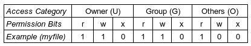
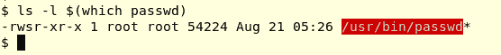
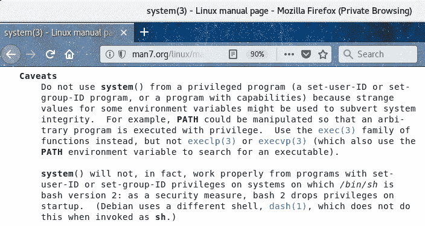
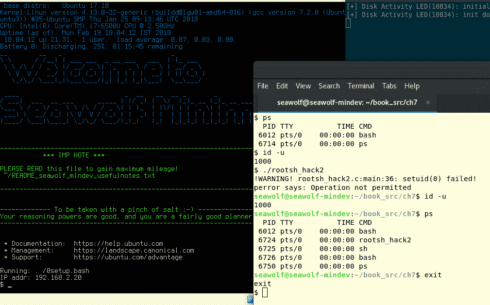
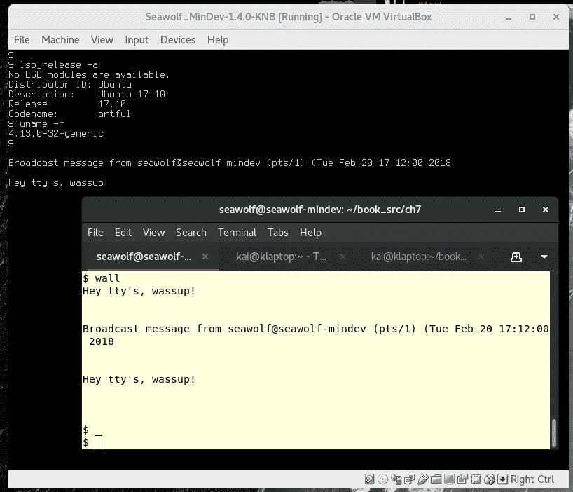
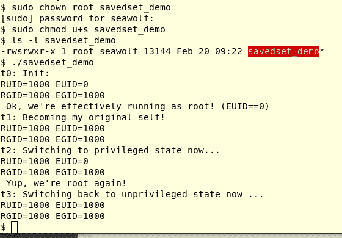

# 第七章：进程凭证

在本章和下一章中，读者将学习有关进程凭证和能力的概念和实践。除了在 Linux 应用程序开发中具有实际重要性之外，本章本质上更深入地探讨了一个经常被忽视但极其关键的方面：安全性。本章和下一章的内容非常相关。

我们将这一关键领域的覆盖分为两个主要部分，每个部分都是本书的一个章节：

+   在本章中，详细讨论了传统风格的 Unix 权限模型，并展示了在不需要根密码的情况下以 root 权限运行程序的技术。

+   在第八章 *进程能力*中，讨论了现代方法，POSIX 能力模型的一些细节。

我们将尝试清楚地向读者表明，虽然重要的是了解传统机制及其运作方式，但了解现代安全性方法也同样重要。无论如何看待它，安全性都是非常重要的，尤其是在当今。Linux 在各种设备上运行——从微小的物联网和嵌入式设备到移动设备、台式机、服务器和超级计算平台——使安全性成为所有利益相关者的关键关注点。因此，在开发软件时应使用现代能力方法。

在本章中，我们将广泛介绍传统的 Unix 权限模型，它究竟是什么，以及它是如何提供安全性和稳健性的。一点黑客攻击总是有趣的！

您将了解以下内容：

+   Unix 权限模型的运行

+   真实和有效的身份证

+   强大的系统调用来查询和设置进程凭证

+   黑客攻击（一点点）

+   `sudo(8)`实际上是如何工作的

+   保存的身份证

+   关于安全性的重要思考

在这个过程中，几个示例允许您以实际操作的方式尝试概念，以便真正理解它们。

# 传统的 Unix 权限模型

从 1970 年初开始，Unix 操作系统通常具有一个优雅而强大的系统，用于管理系统上共享对象的安全性。这些对象包括文件和目录——也许是最常考虑的对象。文件、目录和符号链接是文件系统对象；还有其他几个，包括内存对象（任务、管道、共享内存区域、消息队列、信号量、密钥、套接字）和伪文件系统（proc、sysfs、debugfs、cgroupfs 等）及其对象。重点是所有这些对象都以某种方式共享，因此它们需要某种保护机制，以防止滥用；这种机制称为 Unix 权限模型。

您可能不希望其他人读取、写入和删除您的文件；Unix 权限模型使这在各种粒度级别上成为可能；再次，以文件和目录作为常见目标，您可以在目录级别设置权限，或者在该目录中的每个文件（和目录）上设置权限。

为了明确这一点，让我们考虑一个典型的共享对象——磁盘上的文件。让我们创建一个名为`myfile`的文件：

```
$ cat > myfile
This is my file.
It has a few lines of not
terribly exciting content.

A blank line too! WOW.

You get it...
Ok fine, a useful line: we shall keep this file in the book's git repo.
Bye.
$ ls -l myfile
-rw-rw-r-- 1 seawolf seawolf 186 Feb 17 13:15 myfile
$
```

所有显示的输出都来自 Ubuntu 17.10 x86_64 Linux 系统；用户以`seawolf`登录。

# 用户级别的权限

之前我们对之前的`myfile`文件进行了快速的`ls -l`；第一个字符`-`当然显示它是一个常规文件；接下来的九个字符`rw-rw-r--`是文件权限。如果您记得，这些被分成三组——**所有者**（**U**）、**组**（**G**）和**其他人**（**O**）（或公共）权限，每个组包含三个权限位：**r**、**w**和**x**（读取、写入和执行访问）。这张表总结了这些信息：



解释一下，我们可以看到文件的所有者可以读取和写入它，组成员也可以，但其他人（既不是所有者也不属于文件所属的组）只能对`myfile`执行读操作。这就是安全性！

因此，让我们举个例子：我们尝试使用`echo`命令写入文件`myfile`：

```
echo "I can append this string" >> myfile
```

它会起作用吗？嗯，答案是，这取决于：如果文件的所有者或组成员（在本例中是 seawolf）正在运行 echo(1)进程，那么访问类别将相应地设置为 U 或 G，是的，它将成功（因为 U|G 对文件具有写访问权限）。但是，如果进程的访问类别是其他或公共，它将失败。

# Unix 权限模型是如何工作的

关于这个主题的一个非常重要的理解点是：正在处理的共享对象（这里是`myfile`文件）和正在对对象执行某些访问（rwx）的进程（这里是 echo 进程）都很重要。更正确地说，它们的权限属性很重要。下一次讨论将有助于澄清这一点。

让我们一步一步地考虑这个问题：

1.  使用登录名`seawolf`的用户登录到系统。

1.  成功后，系统会生成一个 shell；用户现在处于 shell 提示符下。（在这里，我们考虑的是登录到**命令行界面**（CLI）控制台的传统情况，而不是 GUI 环境。）

每个用户都有一条记录；它存储在`/etc/passwd`文件中。让我们为这个用户`grep`文件：

```
$ grep seawolf /etc/passwd
seawolf:x:1000:1000:Seawolf,,,:/home/seawolf:/bin/bash
$ 
```

通常，只需这样做：`grep $LOGNAME /etc/passwd`

`passwd`条目是一个有七列的行，它们是以冒号分隔的字段；它们如下：

```
username:<passwd>:UID:GID:descriptive_name:home_dir:program
```

有几个字段需要解释一下：

+   第二个字段`<passwd>`在现代 Linux 系统上总是显示为`x`；这是为了安全。即使加密密码也不会显示出来（黑客很可能可以通过暴力算法破解它；它在一个只有 root 用户才能访问的文件`/etc/shadow`中）。

+   第三和第四个字段是用户的**用户标识符**（UID）和**组标识符**（GID）。

+   第七个字段是成功登录时要运行的程序；通常是 shell（如前所述），但也可以是其他任何东西。

要以编程方式查询`/etc/passwd`，请查看`getpwnam_r`，`getpwent_r`库层 API。

最后一点是关键的：系统为登录的用户生成一个 shell。shell 是 CLI 环境中人类用户和系统之间的**用户界面**（UI）。毕竟，它是一个进程；在 Linux 上，bash 通常是我们使用的 shell。当您登录时收到的 shell 称为您的登录 shell。这很重要，因为它的特权决定了它启动的所有进程的特权——实际上，您在系统上工作时拥有的特权是从您的登录 shell 派生的。

让我们查找我们的 shell 进程：

```
$ ps
  PID  TTY          TIME  CMD
13833 pts/5     00:00:00  bash
30500 pts/5     00:00:00  ps
$ 
```

这就是了；我们的 bash 进程有一个**进程标识符**（PID——一个唯一的整数标识进程）为 13833。现在，进程还有其他与之关联的属性；对于我们当前的目的来说，关键的是进程**用户标识符**（UID）和进程**组标识符**（GID）。

可以查找进程的 UID、GID 值吗？让我们尝试使用`id(1)`命令：

```
$ id
uid=1000(seawolf) gid=1000(seawolf) groups=1000(seawolf),4(adm),24(cdrom),27(sudo),[...]
$ 
```

`id(1)`命令向我们显示，进程 UID 是 1000，进程 GID 也恰好是 1000。（用户名是`seawolf`，这个用户属于几个组。）在前面的例子中，我们已经以用户`seawolf`的身份登录；`id`命令反映了这一事实。请注意，我们现在从这个 shell 运行的每个进程都将继承这个用户帐户的特权，也就是说，它将以与登录 shell 相同的 UID 和 GID 运行！

您可能会合理地问：进程的 UID 和 GID 值是从哪里获取的？嗯，想想看：我们以用户`seawolf`的身份登录，这个帐户的`/etc/passwd`条目的第三个和第四个字段是进程 UID 和 GID 的来源。

因此，每次我们从这个 shell 运行一个进程，该进程将以 UID 1000 和 GID 1000 运行。

我们想要了解操作系统如何准确地检查我们是否可以执行以下操作：

```
echo "I can append this string" >> myfile
```

因此，这里的关键问题是：在运行时，当前的 echo 进程尝试写入`myfile`文件时，内核如何确定写入访问是否被允许。为了做到这一点，操作系统必须确定以下内容：

+   所讨论的文件的所有权和组成员资格是什么？

+   进程尝试访问的访问类别是什么（例如，是 U|G|O）？

+   对于该访问类别，权限掩码是否允许访问？

回答第一个问题：文件的所有权和组成员信息（以及关于文件的更多信息）作为文件系统的关键数据结构的属性进行传递——**信息节点**（**inode**）。inode 数据结构是一个每个文件的结构，并且存在于内核中（文件系统；当文件首次被访问时，它被读入内存）。用户空间当然可以通过系统调用访问这些信息。因此，文件所有者 ID 存储在 inode 中——让我们称之为`file_UID`。类似地，`file_GID`也将存在于 inode 对象中。

对于好奇的读者：您可以使用强大的`stat(2)`系统调用自己查询任何文件对象的 inode。（像往常一样，查阅它的手册页）。事实上，我们在[附录 A](https://www.packtpub.com/sites/default/files/downloads/File_IO_Essentials.pdf)中使用了`stat(2)`，*文件 I/O 基础*。

# 确定访问类别

先前提出的第二个问题：它将以哪种访问类别运行？这是很重要的问题。

访问类别将是**所有者**（**U**）、**组**（**G**）或**其他**（**O**）中的一个；它们是互斥的。操作系统用于确定访问类别的算法大致如下：

```
if process_UID == file_UID
then
     access_category = U
else if process_GID == file_GID
then
     access_category = G
else
     access_category = O
fi
```

实际上，情况要复杂一些：一个进程可以同时属于多个组。因此，在检查权限时，内核会检查所有组；如果进程属于其中任何一个组，访问类别就设置为 G。

最后，对于该访问类别，检查权限掩码（rwx）；如果相关位被设置，进程将被允许进行操作；如果没有，就不会被允许。

让我们看看以下命令：

```
$ ls -l myfile
-rw-rw-r-- 1 seawolf seawolf 186 Feb 17 13:15 myfile
$ 
```

另一种澄清的方法——`stat(1)`命令（当然是`stat(2)`系统调用的包装器）显示了文件`myfile`的 inode 内容，就像这样：

```
$ stat myfile 
  File: myfile
  Size: 186           Blocks: 8          IO Block: 4096   regular file
Device: 801h/2049d    Inode: 1182119     Links: 1
Access: (0664/-rw-rw-r--)  Uid: ( 1000/ seawolf)   Gid: ( 1000/ seawolf)
Access: 2018-02-17 13:15:52.818556856 +0530
Modify: 2018-02-17 13:15:52.818556856 +0530
Change: 2018-02-17 13:15:52.974558288 +0530
 Birth: -
$ 
```

显然，我们正在强调`file_UID == 1000`和`file_GID == 1000`。

在我们的 echo 示例中，我们发现，根据谁登录，组成员资格和文件权限，可以出现一些情景。

因此，为了正确理解这一点，让我们设想一些情景（从现在开始，我们将只是将进程 UID 称为`UID`，将进程 GID 值称为`GID`，而不是`process_UID|GID`）：

+   **用户以 seawolf 身份登录**：[UID 1000，GID 1000]

+   **用户以 mewolf 身份登录**：[UID 2000，GID 1000]

+   **用户以 cato 身份登录**：[UID 3000，GID 3000]

+   **用户以 groupy 身份登录**：[UID 4000，GID 3000，GID 2000，GID 1000]

一旦登录，用户尝试执行以下操作：

```
echo "I can append this string" >> <path/to/>myfile
```

发生了什么？哪个会起作用（权限允许），哪个不会？通过先前的算法运行先前的情景，确定关键的访问类别，你会看到；以下表总结了这些情况：

| **案例＃** | **登录为** | **（进程）UID** | **（进程）GID** | **访问类别** **（U&#124;G&#124;O）** | **Perm** **bitmask** | **允许写入？** |
| --- | --- | --- | --- | --- | --- | --- |
| 1 | seawolf | 1000 | 1000 | U | `r**w**-` | Y |
| 2 | mewolf | 2000 | 1000 | G | `r**w**-` | Y |
| 3 | cato | 3000 | 3000 | O | `r**-**-` | N |
| 4 | groupy | 4000 | 4000,3000, 2000,1000 | G | `r**w**-` | Y |

前面的描述仍然有点太简单了，但是作为一个很好的起点。实际上，在幕后发生了更多的事情；接下来的部分将阐明这一点。

在此之前，我们将稍微偏离一下：`chmod(1)`命令（当然会变成`chmod(2)`系统调用）用于设置对象的权限。因此，如果我们这样做：`chmod g-w myfile`来从组类别中删除写权限，那么之前的表将会改变（获得 G 访问权限的行现在将不允许写入）。

这里有一个有趣的观察：渴望获得 root 访问权限的进程是那些`UID = 0`的进程；这是一个特殊的值！

接下来，严谨地说，echo 命令实际上可以以两种不同的方式运行：一种是作为一个进程，当二进制可执行文件（通常是`/bin/echo`）运行时，另一种是作为一个内置的 shell 命令；换句话说，没有新的进程，shell 进程本身——通常是`bash`——运行它。

# 真实和有效 ID

我们从前面的部分了解到，正在处理的共享对象（这里是文件 myfile）和执行某些访问操作的进程（这里是 echo 进程）在权限方面都很重要。

让我们更深入地了解与权限模型相关的进程属性。到目前为止，我们已经了解到每个进程都与一个 UID 和一个 GID 相关联，从而允许内核运行其内部算法，并确定是否应该允许对资源（或对象）的访问。

如果我们深入研究，我们会发现每个进程 UID 实际上不是一个单一的整数值，而是两个值：

+   **真实用户 ID**（**RUID**）

+   **有效用户 ID**（**EUID**）

同样，组信息不是一个整数 GID 值，而是两个整数：

+   **真实组 ID**（**RGID**）

+   **有效组 ID**（**EGID**）

因此，关于特权，每个进程都有与之关联的四个整数值：

{RUID, EUID, RGID, EGID}；这些被称为**进程凭证**。

严格来说，进程凭证还包括其他几个进程属性——进程 PID、PPID、PGID、会话 ID 以及真实和有效用户和组 ID。在我们的讨论中，为了清晰起见，我们将它们的含义限制在最后一个——真实和有效用户和组 ID。

但它们究竟是什么意思呢？

每个进程都必须在某人的所有权和组成员身份下运行；这个某人当然是登录的用户和组 ID。

真实 ID 是与登录用户关联的原始值；实际上，它们只是来自该用户的`/etc/passwd`记录的 UID:GID 对。回想一下，`id(1)`命令恰好显示了这些信息：

```
$ id
uid=1000(seawolf) gid=1000(seawolf) groups=1000(seawolf),4(adm), [...]
$ 
```

显示的`uid`和`gid`值是从`/etc/passwd`记录中的 seawolf 获取的。实际上，`uid/gid`值分别成为运行进程的 RUID/RGID 值！

真实数字反映了你最初的身份——以整数标识符的登录帐户信息。另一种说法是：真实数字反映了谁拥有该进程。

那么有效值呢？

有效值是为了通知操作系统，当前进程正在以什么样的特权（用户和组）运行。以下是一些关键点：

+   在执行权限检查时，操作系统使用进程的有效值，而不是真实（原始）值。

+   `EUID = 0`是操作系统实际检查的内容，以确定进程是否具有 root 特权。

默认情况下如下：

+   EUID = RUID

+   EGID = RGID

这意味着，对于前面的例子，以下是正确的：

```
{RUID, EUID, RGID, EGID} = {1000, 1000, 1000, 1000}
```

是的。这引发了一个问题（你不觉得吗？）：如果真实和有效 ID 是相同的，那么为什么我们需要四个数字呢？两个就够了，对吧？

嗯，事实是：它们通常（默认情况下）是相同的，但它们可以改变。让我们看看这是如何发生的。

再次强调一下：在 Linux 上，文件系统操作的权限检查是基于另一个进程凭证-文件系统 UID（或 fsuid；类似地，fsgid）。然而，总是情况是 fsuid/fsgid 对遮蔽了 EUID/EGID 对的凭证-从而有效地使它们相同。这就是为什么在我们的讨论中我们忽略`fs[u|g]id`并专注于通常的真实和有效的用户和组 ID。

在那之前，想想这种情况：一个用户登录并在 shell 上；他们有什么特权？好吧，只需运行`id(1)`程序；输出将显示 UID 和 GID，我们现在知道实际上是{RUID，EUID}和{RGID，EGID}对，具有相同的值。

为了更容易阅读的例子，让我们随便将 GID 值从 1000 更改为 2000。所以，现在，如果值是 UID=1000 和 GID=2000，用户现在运行，我们应该说，vi 编辑器，现在情况是这样的，参考给定的表，进程凭证 - 正常情况：

| **进程凭证** **/ 进程** | **RUID** | **EUID** | **RGID** | **EGID** |
| --- | --- | --- | --- | --- |
| bash | 1000 | 1000 | 2000 | 2000 |
| vi | 1000 | 1000 | 2000 | 2000 |

# 一个谜题-普通用户如何更改他们的密码？

假设你以`seawolf`登录。出于安全原因，你想要将你的弱密码（`hello123`，哎呀！）更新为一个强密码。我们知道密码存储在`/etc/passwd`文件中。好吧，我们也知道在现代 Unix 系统（包括 Linux）中，为了更好的安全性，密码是*shadowed*：实际上存储在一个名为`/etc/shadow`的文件中。让我们来看看：

```
$ ls -l /etc/shadow
-rw-r----- 1 root shadow 891 Jun  1  2017 /etc/shadow
$ 
```

（请记住，我们在 Ubuntu 17.10 x86_64 系统上；我们经常指出这一点，因为在不同的发行版上，确切的输出可能会有所不同，如果安装了诸如 SELinux 之类的内核安全机制。）

正如上面所强调的，你可以看到文件所有者是 root，组成员是 shadow，UGO 的权限掩码为`[rw-][r--][---]`。这意味着以下内容：

+   所有者（root）可以执行读/写操作

+   组（shadow）可以执行只读操作

+   其他人无法对文件进行任何操作

你可能也知道，你用来更改密码的实用程序叫做`passwd(1)`（当然，它是一个二进制可执行程序，并且不应与`/etc/passwd(5)`数据库混淆）。

所以，想一想，我们有一个谜题：要更改你的密码，你需要对`/etc/shadow`有写访问权限，但是，显然，只有 root 有对`/etc/shadow`的写访问权限。那么，它是如何工作的呢？（我们知道它是如何工作的。你以普通用户身份登录，而不是 root。你可以使用`passwd(1)`实用程序来更改你的密码-试一试看。）所以，这是一个很好的问题。

线索就在二进制可执行实用程序本身-`passwd`。让我们来看看；首先，磁盘上的实用程序在哪里？参考以下代码：

```
$ which passwd
/usr/bin/passwd
$ 
```

让我们深入挖掘-引用前面的命令并进行长列表：



你能发现任何异常吗？

这是所有者执行位：它不是你可能期望的`x`，而是一个`s`！（实际上，这就是在前面的长列表中可执行文件名字的漂亮红色背后的原因。）

这是一个特殊的权限位：对于一个二进制可执行文件，当所有者的执行位中有一个`s`时，它被称为 setuid 二进制文件。这意味着每当执行 setuid 程序时，生成的进程的**有效用户 ID**（**EUID**）会改变（从默认值：原始 RUID 值）变为等于二进制可执行文件的所有者；在前面的例子中，EUID 将变为 root（因为`/usr/bin/passwd`文件的所有者是 root）。

现在，我们根据手头的新信息重新绘制上一个表（进程凭证-正常情况），关于 setuid passwd 可执行文件：

| **进程凭证** **/ 进程** | **RUID** | **EUID** | **RGID** | **EGID** |
| --- | --- | --- | --- | --- |
| bash | 1000 | 1000 | 2000 | 2000 |
| vi | 1000 | 1000 | 2000 | 2000 |
| /usr/bin/passwd | 1000 | 0 | 2000 | 2000 |

表：进程凭据 - setuid-root 情况（第三行）

因此，这回答了它是如何工作的：EUID 是特殊值**`0`**（root），操作系统现在将进程视为 root 进程，并允许其写入`/etc/shadow`数据库。

例如`/usr/bin/passwd`这样的程序，通过 setuid 位继承了 root 访问权限，并且文件所有者是 root：这些类型的程序称为 setuid root 二进制文件（它们也被称为 set-user-ID-root 程序）。

引用一个受挫的开发人员对所有测试人员的反应：*这不是一个 bug；这是一个功能！* 好吧，它就是：setuid 功能非常了不起：完全不需要编程，您就能够提高进程的特权级别，持续一段时间。

想想这个。如果没有这个功能，非 root 用户（大多数用户）将无法更改他们的密码。要求系统管理员执行此操作（想象一下拥有几千名员工具有 Linux 账户的大型组织）不仅会让系统管理员考虑自杀，还必须向系统管理员提供您的新密码，这可能并不是一个明智的安全实践。

# setuid 和 setgid 特殊权限位

我们可以看到 setuid 程序二进制文件是前面讨论的一个重要内容；让我们再次总结一下：

+   拥有所有者执行位设置为`s`的二进制可执行文件称为**setuid 二进制文件**。

+   如果该可执行文件的所有者是 root，则称为**setuid-root 二进制文件**。

+   当您执行 setuid 程序时，关键点在于 EUID 设置为二进制可执行文件的所有者：

+   因此，使用 setuid-root 二进制文件，进程将以 root 身份运行！

+   当进程死掉后，您将回到具有常规（默认）进程凭据或特权的 shell。

在概念上类似于 setuid 的是 setgid 特殊权限位的概念：

+   拥有组执行位设置为`s`的二进制可执行文件称为 setgid 二进制文件。

+   当您执行 setgid 程序时，关键点在于 EGID 设置为二进制可执行文件的组成员身份。

+   当进程死掉后，您将回到具有常规（默认）进程凭据或特权的 shell。

如前所述，请记住，`set[u|g]id`特殊权限位只对二进制可执行文件有意义，对于脚本（bash、Perl 等）尝试设置这些位将完全没有效果。

# 使用`chmod`设置 setuid 和 setgid 位

也许到现在为止，您已经想到了，但是我到底如何设置这些特殊权限位呢？

这很简单：您可以使用`chmod(1)`命令（或系统调用）；此表显示了如何使用 chmod 设置`setuid/setgid`权限位：

| 通过`chmod`： | 设置 setuid 的符号 | 设置 setgid 的符号 |
| --- | --- | --- |
| 符号表示 | `u+s` | `g+s` |
| 八进制符号 | `4<八进制 #> (例如 4755)` | `2<八进制 #> (例如 2755)` |

举个简单的例子，拿一个简单的`Hello, world` C 程序并编译它：

```
gcc hello.c -o hello
```

现在我们设置了 setuid 位，然后删除它，并设置了 setgid 位（通过`u-s,g+s`参数进行一次操作：通过`chmod`），然后删除了 setgid 位，同时长时间列出二进制可执行文件以便查看权限：

```
$ ls -l hello
-rwxrwxr-x 1 seawolf seawolf 8336 Feb 17 19:02 hello
$ chmod u+s hello ; ls -l hello
-rwsrwxr-x 1 seawolf seawolf 8336 Feb 17 19:02 hello
$ chmod u-s,g+s hello ; ls -l hello
-rwxrwsr-x 1 seawolf seawolf 8336 Feb 17 19:02 hello
$ chmod g-s hello ; ls -l hello
-rwxrwxr-x 1 seawolf seawolf 8336 Feb 17 19:02 hello
$
```

（由于这个`Hello, world`程序只是简单地打印到 stdout，没有其他作用，因此 setuid/setgid 位没有任何感知效果。）

# 黑客尝试 1

嗯，嗯，对于您这位像黑客一样思考的读者（干得好！），为什么不这样做以获得最终奖励，即 root shell！

+   编写一个生成 shell 的 C 程序（`system(3)`库 API 使这变得简单）；我们将代码称为`rootsh_hack1.c`。我们希望得到一个 root shell 作为结果！

+   编译它，得到`a.out`。如果我们现在运行`a.out`，没什么大不了的；我们将得到一个具有我们已经拥有的相同特权的 shell。所以尝试这个：

+   使用`chmod(1)`更改权限以设置`setuid`位。

+   使用`chown(1)`将`a.out`的所有权更改为 root。

+   运行它：我们现在应该得到一个 root shell。

哇！让我们试试这个！

代码很简单（我们这里不显示头文件的包含）*：*

```
$ cat rootsh_hack1.c
[...]
int main(int argc, char **argv)
{
    /* Just spawn a shell.
     * If this process runs as root,
     * then, <i>Evil Laugh</i>, we're now root!
     */
    system("/bin/bash");
    exit (EXIT_SUCCESS);
}
```

现在编译并运行：

```
$ gcc rootsh_hack1.c -Wall
$ ls -l a.out 
-rwxrwxr-x 1 seawolf seawolf 8344 Feb 20 10:15 a.out
$ ./a.out 
seawolf@seawolf-mindev:~/book_src/ch7$ id -u
1000
seawolf@seawolf-mindev:~/book_src/ch7$ exit
exit
$
```

如预期的那样，当没有特殊的`set[u|g]id`权限位运行时，a.out 进程以普通特权运行，生成一个与相同所有者（seawolf）的 shell——正是`id -u`命令证明的。

现在，我们尝试我们的黑客行为：

```
$ chmod u+s a.out 
$ ls -l a.out 
-rwsrwxr-x 1 seawolf seawolf 8344 Feb 20 10:15 a.out
$ 
```

成功了！好吧，不要太兴奋：我们已经将其变成了一个 setuid 二进制文件，但所有者仍然是`seawolf`；因此在运行时不会有任何区别：进程 EUID 将变为二进制可执行文件的所有者`seawolf`本身：

```
$ ./a.out 
seawolf@seawolf-mindev:~/book_src/ch7$ id -u
1000
seawolf@seawolf-mindev:~/book_src/ch7$ exit
exit
$
```

嗯。是的，所以我们现在需要做的是将所有者更改为 root：

```
$ chown root a.out 
chown: changing ownership of 'a.out': Operation not permitted
$ 
```

抱歉要打破你的幻想，新手黑客：这行不通。这就是安全性；使用`chown(1)`，你只能更改你拥有的文件（或对象）的所有权，猜猜？只能更改为你自己的帐户！只有 root 可以使用`chown`将对象的所有权设置为其他任何人。

从安全性方面来看这是有道理的。它甚至更进一步；看看这个：我们将成为 root 并运行`chown`（当然只是通过`sudo`）：

```
$ sudo chown root a.out 
[sudo] password for seawolf: xxx
$ ls -l a.out 
-rwxrwxr-x 1 root seawolf 8344 Feb 20 10:15 a.out*
$ 
```

你注意到了吗？即使`chown`成功了，setuid 位也被清除了！这就是安全性。

好吧，让我们甚至通过手动在 root-owned a.out 上设置 setuid 位来颠覆这一点（请注意，除非我们已经拥有 root 访问权限或密码，否则这是不可能的）：

```
$ sudo chmod u+s a.out 
$ ls -l a.out 
-rwsrwxr-x 1 root seawolf 8344 Feb 20 10:15 a.out
$ 
```

啊！现在它是一个 setuid-root 二进制可执行文件（确实，你在这里看不到，但 a.out 的颜色变成了红色）。没有人会阻止我们！看看这个：

```
$ ./a.out 
seawolf@seawolf-mindev:~/book_src/ch7$ id -u
1000
seawolf@seawolf-mindev:~/book_src/ch7$ exit
exit
$ 
```

生成的 shell 的（R）UID 为 1000，而不是 0。发生了什么？

真是个惊喜！即使拥有 root 所有权和 setuid 位，我们也无法获得 root shell。怎么回事？当然是因为安全性：当通过`system(3)`运行时，现代版本的 bash 拒绝在启动时以 root 身份运行。这张截图显示了`system(3)`的 man 页面上相关部分，显示了我们正在讨论的警告（[`man7.org/linux/man-pages/man3/system.3.html`](http://man7.org/linux/man-pages/man3/system.3.html)）：



第二段总结了这一点：

```
... as a security measure, bash 2 drops privileges on startup. 
```

# 系统调用

我们从之前的讨论中了解到，每个活动进程都有一组四个整数值，有效确定其特权，即真实和有效的用户和组 ID；它们被称为进程凭证。

如前所述，我们将它们称为{RUID，EUID，RGID，EGID}。

有效的 ID 以粗体字显示，以重申这样一个事实，即当涉及实际检查权限时，内核使用有效的 ID。

进程凭证存储在哪里？操作系统将这些信息作为相当大的进程属性数据结构的一部分（当然是每个进程）保存在内核内存空间中。

在 Unix 上，这种每个进程的数据结构称为**进程控制块**（**PCB**）；在 Linux 上，它被称为进程描述符或简单地称为任务结构。

重点是：如果数据在内核地址空间中，那么获取（查询或设置）的唯一方法是通过系统调用。

# 查询进程凭证

如何在 C 程序中以编程方式查询真实和有效的 UID / GID？以下是用于这样做的系统调用：

```
#include <unistd.h>
#include <sys/types.h>

uid_t getuid(void);
uid_t geteuid(void);

gid_t getgid(void);
gid_t getegid(void);
```

这很简单：

+   `getuid(2)`返回真实 UID；`geteuid(2)`返回有效 UID

+   `getgid(2)`返回真实 GID；`getegid(2)`返回有效 GID

+   `uid_t`和`gid_t`是 glibc 对无符号整数的 typedef

这是一个很好的提示，可以找出任何给定数据类型的 typedef：你需要知道包含定义的头文件。只需这样做：

`$ echo | gcc -E -xc -include 'sys/types.h' - | grep uid_t`

`typedef unsigned int __uid_t;`

`typedef __uid_t uid_t;`

`$`

来源*：[`stackoverflow.com/questions/2550774/what-is-size-t-in-c`](https://stackoverflow.com/questions/2550774/what-is-size-t-in-c)。

一个问题出现了：前面的系统调用没有带任何参数；它们返回真实或有效的[U|G]ID，是的，但是为哪个进程？答案当然是调用进程，发出系统调用的进程。

# 代码示例

我们编写了一个简单的 C 程序（`ch7/query_creds.c`）；运行时，它会将其进程凭证打印到标准输出（我们展示了相关代码）：

```
#define SHOW_CREDS() do {        \
  printf("RUID=%d EUID=%d\n"    \
         "RGID=%d EGID=%d\n",    \
        getuid(), geteuid(),    \
        getgid(), getegid());   \
} while (0)

int main(int argc, char **argv)
{
    SHOW_CREDS();
    if (geteuid() == 0) {
        printf("%s now effectively running as root! ...\n", argv[0]);
        sleep(1);
    }
    exit (EXIT_SUCCESS);
}
```

构建并尝试运行它：

```
$ ./query_creds
RUID=1000 EUID=1000
RGID=1000 EGID=1000
$ sudo ./query_creds
[sudo] password for seawolf: xxx 
RUID=0 EUID=0
RGID=0 EGID=0
./query_creds now effectively running as root! ...
$ 
```

注意以下内容：

+   在第一次运行时，四个进程凭证的值是通常的值（在我们的例子中是 1000）。还要注意，默认情况下 EUID = RUID，EGID = RGID。

+   但在第二次运行时我们使用了`sudo`：一旦我们输入正确的密码，进程就以 root 身份运行，这当然可以从这里直接看到：四个进程凭证的值现在都是零，反映了 root 权限。

# Sudo - 它是如何工作的

`sudo(8)`实用程序允许您以另一个用户的身份运行程序；如果没有进一步的限定，那么另一个用户就是 root。当然，出于安全考虑，您必须正确输入 root 密码（或者像一些发行版允许桌面计算那样，如果用户属于 sudo 组，可以输入用户自己的密码）。

这带来了一个非常有趣的问题：`sudo(8)`程序究竟是如何工作的？它比你想象的要简单！参考以下代码：

```
$ which sudo
/usr/bin/sudo
$ ls -l $(which sudo)
-rwsr-xr-x 1 root root 145040 Jun 13  2017 /usr/bin/sudo
$ 
```

我们注意到，可执行文件 sudo 实际上是一个设置了 setuid-root 权限的程序！所以想一想：每当您使用 sudo 运行一个程序时，sudo 进程就会立即以 root 权限运行——不需要密码，也不需要麻烦。但是，出于安全考虑，用户必须输入密码；一旦他们正确输入密码，sudo 就会继续执行并以 root 身份执行您想要的命令。如果用户未能正确输入密码（通常在三次尝试内），sudo 将中止执行。

# 保存的 ID 是什么？

所谓的保存的 ID 是一个方便的功能；操作系统能够保存进程的初始有效用户 ID（EUID）的值。它有什么作用呢？这允许我们从进程启动时的原始 EUID 值切换到一个非特权的普通值（我们马上就会详细介绍），然后从当前特权状态切换回保存的 EUID 值（通过`seteuid(2)`系统调用）；因此，最初保存的 EUID 被称为**保存的 ID**。

实际上，我们可以随时在我们的进程之间切换特权和非特权状态！

在我们涵盖了更多的材料之后，一个例子将有助于澄清事情。

# 设置进程凭证

我们知道，从 shell 中，查看当前运行的用户是谁的一个方便的方法是运行简单的`id(1)`命令；它会显示真实的 UID 和真实的 GID（以及我们所属的所有附加组）。就像我们之前做的那样，让我们在用户`seawolf`登录时尝试一下：

```
$ id
uid=1000(seawolf) gid=1000(seawolf) groups=1000(seawolf),4(adm),24(cdrom),27(sudo), [...]
$ 
```

再次考虑`sudo(8)`实用程序；要以另一个用户而不是 root 身份运行程序，我们可以使用`-u`或`--user=`开关来使用`sudo`。例如，让我们以用户`mail`的身份运行`id(1)`程序：

```
$ sudo -u mail id
[sudo] password for seawolf: xxx
uid=8(mail) gid=8(mail) groups=8(mail)
$ 
```

预期的是，一旦我们提供正确的密码，`sudo`就会以邮件用户的身份运行`id`程序，`id`的输出现在显示我们的（真实）用户和组 ID 现在是邮件用户账户的！（而不是 seawolf），这正是预期的效果。

但`sudo(8)`是如何做到的呢？我们从前一节了解到，当运行`sudo`（无论带有什么参数），它至少最初总是以 root 身份运行。现在的问题是，它如何以另一个用户账户的凭证运行？

答案是：存在几个系统调用可以改变进程的特权（RUID、EUID、RGID、EGID）：`setuid(2)`、`seteuid(2)`、`setreuid(2)`、`setresuid(2)`以及它们的 GID 对应的函数。

让我们快速看一下 API 签名：

```
#include <sys/types.h>
#include <unistd.h>

int setuid(uid_t uid);
int setgid(gid_t gid);

int seteuid(uid_t euid);
int setegid(gid_t egid);

int setreuid(uid_t ruid, uid_t euid);
int setregid(gid_t rgid, gid_t egid);
```

`setuid(2)`系统调用允许进程将其 EUID 设置为传递的值。如果进程具有 root 权限（稍后在下一章中，当我们了解 POSIX 能力模型时，我们将更好地限定这样的陈述），那么 RUID 和保存的 setuid（稍后解释）也将设置为这个值。

所有的`set*gid()`调用都类似于它们的 UID 对应物。

在 Linux 操作系统上，seteuid 和 setegid API，虽然被记录为系统调用，实际上是`setreuid(2)`和`setregid(2)`系统调用的包装器。

# 黑客攻击尝试 2

啊，黑客攻击！好吧，至少让我们试一试。

我们知道`EUID 0`是一个特殊值——它意味着我们拥有 root 权限。想想看——我们有一个`setuid(2)`系统调用。所以，即使我们没有特权，为什么不快速地做一个

`setuid(0);`变得特权，并像 root 一样黑客攻击！

嗯，如果上面的黑客攻击真的奏效，Linux 就不会成为一个非常强大和受欢迎的操作系统。它不会奏效，朋友们：上面的系统调用调用将失败返回`-1`；`errno`将被设置为`EPERM`，错误消息（来自`perror(3)`或`strerror(3)`）将是这样的：操作不允许。

为什么呢？在内核中有一个简单的规则：一个非特权进程可以将其有效 ID 设置为其真实 ID，不允许其他值。换句话说，一个非特权进程可以设置以下内容：

+   它的 EUID 到它的 RUID

+   它的 EGID 到它的 RGID

就是这样。

当然，（root）特权进程可以将其四个凭据设置为任何它选择的值。这并不奇怪——这是作为 root 的权力的一部分。

`seteuid(2)`将进程的有效用户 ID 设置为传递的值；对于一个非特权进程，它只能将其 EUID 设置为其 RUID，EUID 或保存的 setuid。

`setreuid(2)`将真实和有效的 UID 分别设置为传递的值；如果传递了`-1`，则相应的值将保持不变。（这可能间接影响保存的值。）`set[r]egid(2)`调用在组 ID 方面是相同的。

让我们实际操作一下我们刚刚谈到的内容：

```
$ cat rootsh_hack2.c
[...]
int main(int argc, char **argv)
{
    /* Become root */
    if (setuid(0) == -1)
        WARN("setuid(0) failed!\n");

    /* Now just spawn a shell;
     * <i>Evil Laugh</i>, we're now root!
     */
    system("/bin/bash");
    exit (EXIT_SUCCESS);
}
```

构建并运行它。这个屏幕截图显示了一个名为 seawolf 的虚拟机，以及右下角的一个`ssh`连接的终端窗口（我们以用户 seawolf 的身份登录）；看到`rootsh_hack2`程序正在那里运行：



研究前面屏幕截图中`ssh`终端窗口的输出，我们可以看到以下内容：

+   原始的 bash 进程（shell）的 PID 是 6012。

+   id 命令显示我们正在以（真实的）UID = 1000（即 seawolf 用户）运行。

+   我们运行`rootsh_hack2`；显然，`setuid(0)`失败了；显示了错误消息：操作不允许。

+   尽管如此，这只是一个警告消息；执行继续进行，进程生成另一个 bash 进程，实际上是另一个 shell。

+   它的 PID 是 6726（证明它与原始 shell 不同）。

+   id(1)仍然是 1000，证明我们并没有真正取得什么重大成就。

+   我们退出，回到我们最初的 shell。

但是，如果我们（或者更糟糕的是，一个黑客）能够欺骗这个进程以 root 身份运行呢！？怎么做？当然是将其设置为 setuid-root 可执行文件；然后我们就麻烦了：

```
$ ls -l rootsh_hack2
-rwxrwxr-x 1 seawolf seawolf 8864 Feb 19 18:03 rootsh_hack2
$ sudo chown root rootsh_hack2
[sudo] password for seawolf: 
$ sudo chmod u+s rootsh_hack2
$ ls -l rootsh_hack2
-rwsrwxr-x 1 root seawolf 8864 Feb 19 18:03 rootsh_hack2
$ ./rootsh_hack2
root@seawolf-mindev:~/book_src/ch7# id -u
0
root@seawolf-mindev:~/book_src/ch7# ps
  PID TTY          TIME CMD
 7049 pts/0    00:00:00 rootsh_hack2
 7050 pts/0    00:00:00 sh
 7051 pts/0    00:00:00 bash
 7080 pts/0    00:00:00 ps
root@seawolf-mindev:~/book_src/ch7# exit
exit
$ 
```

所以，我们只是模拟被欺骗：在这里我们使用 sudo(8);我们输入密码，从而将二进制可执行文件更改为 setuid-root，一个真正危险的程序。它运行，并生成了一个现在被证明是 root shell 的进程（注意，`id(1)`命令证明了这一事实）；我们执行`ps`然后`exit`。

我们也意识到，我们之前的黑客尝试失败了——当 shell 作为运行参数时，系统（3）API 拒绝提升权限，这在安全方面是很好的。但是，这次黑客尝试（＃2）证明你可以轻松地颠覆这一点：只需在调用 system（`/bin/bash`）之前发出`setuid（0）`的调用，它就成功地提供了一个 root shell——当然，只有在进程首先以 root 身份运行时才会成功：要么通过 setuid-root 方法，要么只是使用 sudo（8）。

# 一边——一个用于识别 setuid-root 和 setgid 安装程序的脚本

我们现在开始理解，`setuid/setgid`程序可能很方便，但从安全的角度来看，它们可能是潜在的危险，并且必须仔细审计。这种审计的第一步是找出 Linux 系统上这些二进制文件是否存在以及确切存在的位置。

为此，我们编写一个小的 shell（bash）脚本；它将识别并显示系统上安装的`setuid-root`和`setgid`程序（通常情况下，您可以从书的 Git 存储库下载并尝试该脚本）。

脚本基本上执行其工作，如下所示（它实际上循环遍历一个目录数组；为简单起见，我们显示了扫描`/bin`目录的直接示例）：

```
 echo "Scanning /bin ..."
 ls -l /bin/ | grep "^-..s" | awk '$3=="root" {print $0}'
```

`ls -l`的输出被管道传输到`grep（1）`，它使用一个正则表达式，如果第一个字符是`-`（一个常规文件），并且所有者执行位是 s——换句话说，是一个 setuid 文件；`awk（1）`过滤器确保只有所有者是 root 时，我们才将结果字符串打印到 stdout。

我们在两个 Linux 发行版上运行 bash 脚本。

在 x86_64 上的 Ubuntu 17.10 上：

```
$ ./show_setuidgid.sh
------------------------------------------------------------------
System Information (LSB):
------------------------------------------------------------------
No LSB modules are available.
Distributor ID:    Ubuntu
Description:    Ubuntu 17.10
Release:    17.10
Codename:    artful
kernel: 4.13.0-32-generic
------------------------------------------------------------------
Scanning various directories for (traditional) SETUID-ROOT binaries ...
------------------------------------------------------------------
Scanning /bin            ...
-rwsr-xr-x 1 root root   30800 Aug 11  2016 fusermount
-rwsr-xr-x 1 root root   34888 Aug 14  2017 mount
-rwsr-xr-x 1 root root  146128 Jun 23  2017 ntfs-3g
-rwsr-xr-x 1 root root   64424 Mar 10  2017 ping
-rwsr-xr-x 1 root root   40168 Aug 21  2017 su
-rwsr-xr-x 1 root root   26696 Aug 14  2017 umount
------------------------------------------------------------------
Scanning /usr/bin        ...
-rwsr-xr-x 1 root root       71792 Aug 21  2017 chfn
-rwsr-xr-x 1 root root       40400 Aug 21  2017 chsh
-rwsr-xr-x 1 root root       75344 Aug 21  2017 gpasswd
-rwsr-xr-x 1 root root       39944 Aug 21  2017 newgrp
-rwsr-xr-x 1 root root       54224 Aug 21  2017 passwd
-rwsr-xr-x 1 root root      145040 Jun 13  2017 sudo
-rwsr-xr-x 1 root root       18448 Mar 10  2017 traceroute6.iputils
------------------------------------------------------------------
Scanning /sbin           ...
------------------------------------------------------------------
Scanning /usr/sbin       ...
------------------------------------------------------------------
Scanning /usr/local/bin  ...
------------------------------------------------------------------
Scanning /usr/local/sbin ...
------------------------------------------------------------------

Scanning various directories for (traditional) SETGID binaries ...
------------------------------------------------------------------
Scanning /bin            ...
------------------------------------------------------------------
Scanning /usr/bin        ...
-rwxr-sr-x 1 root tty        14400 Jul 27  2017 bsd-write
-rwxr-sr-x 1 root shadow     62304 Aug 21  2017 chage
-rwxr-sr-x 1 root crontab    39352 Aug 21  2017 crontab
-rwxr-sr-x 1 root shadow     22808 Aug 21  2017 expiry
-rwxr-sr-x 1 root mlocate    38992 Apr 28  2017 mlocate
-rwxr-sr-x 1 root ssh       362640 Jan 16 18:58 ssh-agent
-rwxr-sr-x 1 root tty        30792 Aug 14  2017 wall
------------------------------------------------------------------
Scanning /sbin           ...
-rwxr-sr-x 1 root shadow   34816 Apr 22  2017 pam_extrausers_chkpwd
-rwxr-sr-x 1 root shadow   34816 Apr 22  2017 unix_chkpwd
------------------------------------------------------------------
Scanning /usr/sbin       ...
------------------------------------------------------------------
Scanning /usr/local/bin  ...
------------------------------------------------------------------
Scanning /usr/local/sbin ...
------------------------------------------------------------------
$
```

显示系统信息横幅（以便我们可以获取系统详细信息，主要是使用`lsb_release`实用程序获得的）。然后，脚本扫描各种系统目录，打印出它找到的所有`setuid-root`和`setgid`二进制文件。熟悉的例子，`passwd`和`sudo`被突出显示。

# setgid 示例- wall

作为`setgid`二进制文件的一个很好的例子，看看 wall（1）实用程序，从脚本的输出中复制：

```
-rwxr-sr-x 1 root tty        30792 Aug 14  2017 wall
```

wall（1）程序用于向所有用户控制台（tty）设备广播任何消息（通常由系统管理员执行）。现在，要写入`tty`设备（回想一下，朋友们，第一章，*Linux 系统架构*，以及如果不是一个进程，它就是一个文件 Unix 哲学），我们需要什么权限？让我们以第二个终端`tty2`设备为例：

```
$ ls -l /dev/tty2
crw--w---- 1 root tty 4, 2 Feb 19 18:04 /dev/tty2
$ 
```

我们可以看到，要写入前面的设备，我们要么需要 root，要么必须是`tty`组的成员。再次查看 wall（1）实用程序的长列表；它是一个 setgid 二进制可执行文件，组成员是`tty`；因此，当任何人运行它时，wall 进程将以`tty`的有效组 ID（EGID）运行！这解决了问题——没有代码。没有麻烦。

这是一个截图，显示了 wall 的使用：



在前台，有一个连接的`ssh`（到 Ubuntu VM；您可以在后台看到它）终端窗口。它以常规用户的身份发出`wall`命令：由于`setgid tty`*，*它有效！

现在你可以在 x86_64 上的 Fedora 27 上运行之前的脚本：

```
$ ./show_setuidgid.sh 1
------------------------------------------------------------------
System Information (LSB):
------------------------------------------------------------------
LSB Version:    :core-4.1-amd64:core-4.1-noarch
Distributor ID:    Fedora
Description:    Fedora release 27 (Twenty Seven)
Release:    27
Codename:    TwentySeven
kernel: 4.14.18-300.fc27.x86_64
------------------------------------------------------------------
Scanning various directories for (traditional) SETUID-ROOT binaries ...
------------------------------------------------------------------
Scanning /bin            ...
------------------------------------------------------------------
Scanning /usr/bin        ...
-rwsr-xr-x.   1 root root       52984 Aug  2  2017 at
-rwsr-xr-x.   1 root root       73864 Aug 14  2017 chage
-rws--x--x.   1 root root       27992 Sep 22 14:07 chfn
-rws--x--x.   1 root root       23736 Sep 22 14:07 chsh
-rwsr-xr-x.   1 root root       57608 Aug  3  2017 crontab
-rwsr-xr-x.   1 root root       32040 Aug  7  2017 fusermount
-rwsr-xr-x.   1 root root       31984 Jan 12 20:36 fusermount-glusterfs
-rwsr-xr-x.   1 root root       78432 Aug 14  2017 gpasswd
-rwsr-xr-x.   1 root root       36056 Sep 22 14:07 mount
-rwsr-xr-x.   1 root root       39000 Aug 14  2017 newgidmap
-rwsr-xr-x.   1 root root       41920 Aug 14  2017 newgrp
-rwsr-xr-x.   1 root root       39000 Aug 14  2017 newuidmap
-rwsr-xr-x.   1 root root       27880 Aug  4  2017 passwd
-rwsr-xr-x.   1 root root       27688 Aug  4  2017 pkexec
-rwsr-xr-x.   1 root root       32136 Sep 22 14:07 su
---s--x--x.   1 root root      151416 Oct  4 18:55 sudo
-rwsr-xr-x.   1 root root       27880 Sep 22 14:07 umount
------------------------------------------------------------------
Scanning /sbin           ...
------------------------------------------------------------------
Scanning /usr/sbin       ...
-rwsr-xr-x. 1 root root    114840 Jan 19 23:25 mount.nfs
-rwsr-xr-x. 1 root root     89600 Aug  4  2017 mtr
-rwsr-xr-x. 1 root root     11256 Aug 21  2017 pam_timestamp_check
-rwsr-xr-x. 1 root root     36280 Aug 21  2017 unix_chkpwd
-rws--x--x. 1 root root     40352 Aug  5  2017 userhelper
-rwsr-xr-x. 1 root root     11312 Jan  2 21:06 usernetctl
------------------------------------------------------------------
Scanning /usr/local/bin  ...
------------------------------------------------------------------
Scanning /usr/local/sbin ...
------------------------------------------------------------------

Scanning various directories for (traditional) SETGID binaries ...
------------------------------------------------------------------
Scanning /bin            ...
------------------------------------------------------------------
Scanning /usr/bin        ...
-rwxr-sr-x.   1 root cgred      15640 Aug  3  2017 cgclassify
-rwxr-sr-x.   1 root cgred      15600 Aug  3  2017 cgexec
-rwx--s--x.   1 root slocate    40528 Aug  4  2017 locate
-rwxr-sr-x.   1 root tty        19584 Sep 22 14:07 write
------------------------------------------------------------------
Scanning /sbin           ...
------------------------------------------------------------------
Scanning /usr/sbin       ...
-rwx--s--x. 1 root lock     15544 Aug  4  2017 lockdev
-rwxr-sr-x. 1 root root      7144 Jan  2 21:06 netreport
------------------------------------------------------------------
Scanning /usr/local/bin  ...
------------------------------------------------------------------
Scanning /usr/local/sbin ...
------------------------------------------------------------------
$ 
```

似乎出现了更多的 setuid-root 二进制文件；此外，在 Fedora 上，`write（1）`是等效于`wall（1）`的`setgid tty`实用程序。

# 放弃特权

从先前的讨论中，似乎`set*id()`系统调用（`setuid(2)`，`seteuid(2)`，`setreuid(2)`，`setresuid(2)`）只对 root 有用，因为只有具有 root 权限的进程才能使用这些系统调用来更改进程凭据。嗯，这并不是完全的真相；还有另一个重要的情况，适用于非特权进程。

考虑这种情况：我们的程序规范要求初始化代码以 root 权限运行；其余代码则不需要。显然，我们不希望为了运行我们的程序而给最终用户 root 访问权限。我们该如何解决这个问题呢？

将程序设置为 setuid-root 会很好地解决问题。正如我们所看到的，setuid-root 进程将始终以 root 身份运行；但在初始化工作完成后，我们可以切换回非特权正常状态。我们如何做到这一点？通过`setuid(2)`：回想一下，对于特权进程，setuid 会将 EUID 和 RUID 都设置为传递的值；因此我们将其传递给进程的 RUID，这是通过 getuid 获得的。

```
setuid(getuid());    // make process unprivileged
```

这是一个有用的语义（通常，`seteuid(getuid()`)就是我们需要的）。我们使用这个语义来再次成为我们真正的自己——相当哲学，不是吗？

在**信息安全**（**infosec**）领域，有一个重要的原则是：减少攻击面。将根特权进程转换为非特权（一旦其作为根完成工作）有助于实现这一目标（至少在某种程度上）。

# 保存的 UID - 一个快速演示

在前一节中，我们刚刚看到了有用的`seteuid(getuid()`)语义如何用于将 setuid 特权进程切换到常规非特权状态（这是很好的设计，更安全）。但是如果我们有这个要求呢：

```
Time t0: initialization code: must run as root
Time t1: func1(): must *not* run as root
Time t2: func2(): must run as root
Time t3: func3(): must *not* run as root
[...]
```

为了实现最初必须以 root 身份运行的语义，我们当然可以创建程序为 setuid-root 程序。然后，在 t1 时，我们发出`setuid(getuid()`)放弃 root 权限。

但是我们如何在 t2 时重新获得 root 权限呢？啊，这就是保存的 setuid 功能变得宝贵的地方。而且，这样做很容易；以下是实现这种情况的伪代码：

```
t0: we are running with root privilege due to *setuid-root* binary  
    executable being run
 saved_setuid = geteuid()   // save it
t1: seteuid(getuid())      // must *not* run as root
t2: seteuid(saved_setuid)  // switch back to the saved-set, root
t3: seteuid(getuid())      // must *not* run as root
```

我们接下来用实际的 C 代码来演示相同的情况。请注意，为了使演示按预期工作，用户必须通过以下方式将二进制可执行文件变成 setuid-root 二进制文件：

```
make savedset_demo
sudo chown root savedset_demo
sudo chmod u+s savedset_demo
```

以下代码检查了在开始时，进程确实是以 root 身份运行的；如果不是，它将中止并显示一条消息，要求用户将二进制文件设置为 setuid-root 二进制文件：

```
int main(int argc, char **argv)
{
    uid_t saved_setuid;

    printf("t0: Init:\n");
    SHOW_CREDS();
    if (0 != geteuid())
        FATAL("Not a setuid-root executable,"
            " aborting now ...\n"
            "[TIP: do: sudo chown root %s ;"
            " sudo chmod u+s %s\n"
            " and rerun].\n"
            , argv[0], argv[0], argv[0]);
    printf(" Ok, we're effectively running as root! (EUID==0)\n");

    /* Save the EUID, in effect the "saved set UID", so that
     * we can switch back and forth
     */
    saved_setuid = geteuid();

    printf("t1: Becoming my original self!\n");
    if (seteuid(getuid()) == -1)
        FATAL("seteuid() step 2 failed!\n");
    SHOW_CREDS();

    printf("t2: Switching to privileged state now...\n");
    if (seteuid(saved_setuid) == -1)
        FATAL("seteuid() step 3 failed!\n");
    SHOW_CREDS();
    if (0 == geteuid())
        printf(" Yup, we're root again!\n");

    printf("t3: Switching back to unprivileged state now ...\n");
    if (seteuid(getuid()) == -1)
        FATAL("seteuid() step 4 failed!\n");
    SHOW_CREDS();

    exit (EXIT_SUCCESS);
}
```

这是一个样本运行：

```
$ make savedset_demo
gcc -Wall -o savedset_demo savedset_demo.c common.o
#sudo chown root savedset_demo
#sudo chmod u+s savedset_demo
$ ls -l savedset_demo
-rwxrwxr-x 1 seawolf seawolf 13144 Feb 20 09:22 savedset_demo*
$ ./savedset_demo
t0: Init:
RUID=1000 EUID=1000
RGID=1000 EGID=1000
FATAL:savedset_demo.c:main:48: Not a setuid-root executable, aborting now ...
[TIP: do: sudo chown root ./savedset_demo ; sudo chmod u+s ./savedset_demo
 and rerun].
$ 
```

程序失败了，因为它检测到在开始时并没有有效地以 root 身份运行，这意味着它一开始就不是一个 setuid-root 二进制可执行文件。因此，我们必须通过`sudo chown ...`然后`sudo chmod ...`来使其成为 setuid-root 二进制可执行文件。（请注意，我们已经将执行此操作的代码放在了 Makefile 中，但已经将其注释掉，这样你作为读者就可以练习一下）。

这个截图显示了一旦我们这样做，它会按预期运行，在特权和非特权状态之间来回切换：



请注意，真正关键的系统调用来回切换，毕竟是 setuid(2)；还要注意 EUID 在不同时间点的变化（从 t0 的 0 到 t1 的 1000，再到 t2 的 0，最后在 t3 回到 1000）。

还要注意，为了提供有趣的例子，我们大多数情况下使用的是 setuid-root 二进制文件。你不需要这样做：将文件所有者更改为其他人（比如邮件用户），实际上会使其成为一个 setuid-mail 二进制可执行文件，这意味着当运行时，进程 RUID 将是通常的 1000（seawolf），但 EUID 将是邮件用户的 RUID。

# setres[u|g]id(2)系统调用

这里有一对包装调用 - `setresuid(2)`和`setresgid(2)`；它们的签名：

```
#define _GNU_SOURCE         /* See feature_test_macros(7) */
#include <unistd.h>

int setresuid(uid_t ruid, uid_t euid, uid_t suid);
int setresgid(gid_t rgid, gid_t egid, gid_t sgid);
```

这对系统调用就像是早期的`set*id()`API 的超集。使用`setresuid(2)`系统调用，进程可以一次性设置 RUID、EUID 和保存的 set-id，只需一个系统调用（系统调用名称中的**res**代表**real**、**effective**和**saved**-set-ID）。

非特权（即非 root）进程只能使用此系统调用将三个 ID 之一设置为当前 RUID、当前 EUID 或当前保存的 UID，没有其他选项（通常的安全原则在起作用）。传递`-1`意味着保持相应的值不变。特权（root）进程当然可以使用调用将三个 ID 设置为任何值。（通常情况下，`setresgid(2)`系统调用是相同的，只是它设置组凭据）。

一些真实的开源软件项目确实使用了这个系统调用；OpenSSH 项目（Linux 端口称为 OpenSSH-portable）和著名的 sudo(8)实用程序就是很好的例子。

OpenSSH：来自其 git 存储库：[`github.com/openssh/openssh-portable/`](https://github.com/openssh/openssh-portable/)：

`uidswap.c`：`permanently_drop_suid():`

```
void permanently_drop_suid(uid_t uid)
[...]
debug("permanently_drop_suid: %u", (u_int)uid);
if (setresuid(uid, uid, uid) < 0)
    fatal("setresuid %u: %.100s", (u_int)uid, strerror(errno));

[...]

/* Verify UID drop was successful */
    if (getuid() != uid || geteuid() != uid) {
        fatal("%s: euid incorrect uid:%u euid:%u (should be %u)",
            __func__, (u_int)getuid(), (u_int)geteuid(), (u_int)uid);
}
```

有趣的是注意到确保 UID 降级成功所付出的努力——接下来会更多地讨论这一点！

对 sudo(8)执行`strace(1)`（请注意，我们必须以 root 身份跟踪它，因为尝试以普通用户身份跟踪 setuid 程序时不起作用，因为在跟踪时，setuid 位被故意忽略；此输出来自 Ubuntu Linux 系统）：

```
$ id mail uid=8(mail) gid=8(mail) groups=8(mail) $ sudo strace -e trace=setuid,setreuid,setresuid sudo -u mail id
[...]
setresuid(-1, 0, -1)                    = 0
setresuid(-1, -1, -1)                   = 0
setresuid(-1, 8, -1)                    = 0
setresuid(-1, 0, -1)                    = 0
[...]
```

显然，sudo 使用`setresuid(2)`系统调用来设置权限、凭据，确实是适当的（在上面的示例中，进程 EUID 被设置为邮件用户的 EUID，RUID 和保存的 ID 被保持不变）。

# 重要的安全注意事项

以下是一些关于安全性的关键要点：

+   如果设计不当，使用 setuid 二进制文件是一种安全风险。特别是对于 setuid-root 程序，它们应该被设计和测试，以确保在进程处于提升的特权状态时，它永远不会生成一个 shell 或盲目接受用户命令（然后在内部执行）。

+   您必须检查任何`set*id()`系统调用（`setuid(2)`、`seteuid(2)`、`setreuid(2)`、`setresuid(2)`）的失败情况。

考虑这个伪代码：

```
run setuid-root program; EUID = 0
  do required work as root
switch to 'normal' privileges: setuid(getuid())
  do remaining work as non-root
  [...]
```

思考一下：如果前面的`setuid(getuid())`调用失败了（无论什么原因），而我们没有检查呢？剩下的工作将继续以 root 访问权限运行，很可能会招致灾难！（请参阅 OpenSSH-portable Git 存储库中的示例代码，了解仔细检查的真实示例。）让我们看看以下几点：

+   `setuid(2)`系统调用在某种意义上是有缺陷的：如果真实 UID 是 root，那么保存的 UID 也是 root；因此，您无法放弃权限！显然，这对于 setuid-root 应用程序等来说是危险的。作为替代方案，使用`setreuid(2)` API 使根进程暂时放弃权限，并稍后重新获得（通过交换它们的 RUID 和 EUID 值）。

+   即使您拥有系统管理员（root）访问权限，也不应该以 root 身份登录！您可能会（非常容易地）被欺骗以 root 身份运行危险程序（黑客经常使用这种技术在系统上安装 rootkit；一旦成功，确实会考虑您的系统已被入侵）。

+   当一个进程创建一个共享对象（比如一个文件）时，它将由谁拥有，组将是什么？换句话说，内核将在文件的 inode 元数据结构中设置什么值作为 UID 和 GID？答案是：文件的 UID 将是创建进程的 EUID，文件的 GID（组成员资格）将是创建进程的 EGID。这将对权限产生后续影响。

我们建议您，读者，一定要阅读第九章，*进程执行*！在其中，我们展示了传统权限模型在许多方面存在缺陷，以及为什么以及如何使用更优越的 Linux Capabilities 模型。

# 总结

在本章中，读者已经了解了关于传统 Unix 安全模型设计和实施的许多重要观念。除此之外，我们还涵盖了传统 Unix 权限模型、进程真实和有效 ID 的概念、用于查询和设置它们的 API、`sudo(8)`、保存的 ID 集。

再次强调：我们强烈建议您也阅读以下内容[第八章]，*进程能力*！在其中，我们展示了传统权限模型存在缺陷，以及您应该使用更优越、现代的 Linux 能力模型。
