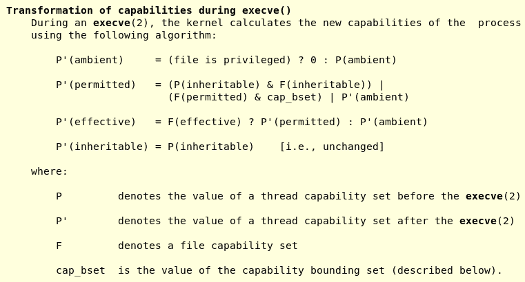
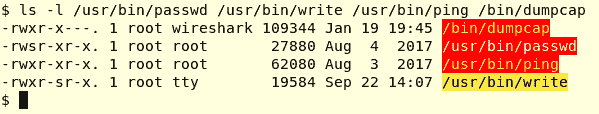

# 第八章：进程功能

在两章中，您将学习有关进程凭据和功能的概念和实践。除了在 Linux 应用程序开发中具有实际重要性之外，本章本质上深入探讨了一个经常被忽视但极为重要的方面：安全性。

我们将这一关键领域的覆盖分为两个主要部分，每个部分都是本书的一个章节：

+   在第七章中，*进程凭据*，传统风格的 Unix 权限模型被详细讨论，并展示了以 root 权限运行程序但不需要 root 密码的技术。

+   在第八章中，*进程功能*，*现代*方法，POSIX 功能模型，被详细讨论。

我们将尝试清楚地向读者展示，虽然了解传统机制及其运作方式很重要，但就*安全*而言，这成为了一个经典的弱点。无论如何看待它，安全性都是至关重要的，尤其是在当今这个时代；Linux 运行在各种设备上——从微型物联网和嵌入式设备到移动设备、台式机、服务器和超级计算平台——使安全成为所有利益相关者的关键关注点。因此，在开发软件时应该使用现代功能方法。

在本章中，我们将详细介绍*现代方法*——POSIX 功能模型。我们将讨论它究竟是什么，以及它如何提供安全性和健壮性。读者将了解以下内容：

+   现代 POSIX 功能模型究竟是什么

+   为什么它优于旧的（传统的）Unix 权限模型

+   如何在 Linux 上使用功能

+   将功能嵌入到进程或二进制可执行文件中

+   安全提示

在此过程中，我们将使用代码示例，让您尝试其中一些功能，以便更好地理解它们。

# 现代 POSIX 功能模型

考虑这个（虚构的）情景：Vidya 正在为 Alan 和他的团队开发 Linux 应用程序的项目。她正在开发一个捕获网络数据包并将其保存到文件中的组件（以供以后分析）。该程序名为**packcap**。然而，为了成功捕获网络数据包，packcap 必须以*root*权限运行。现在，Vidya 明白以*root*身份运行应用程序不是一个好的安全实践；不仅如此，她知道客户不会接受这样的说法：哦，它没用？你必须以 root 登录或通过 sudo 运行它。通过 sudo(8)运行它可能听起来合理，但是，当你停下来想一想，这意味着 Alan 的每个团队成员都必须被给予*root*密码，这是完全不可接受的。

那么，她如何解决这个问题呢？答案突然出现在她脑海中：将*packcap*二进制文件设置为*setuid-*root 文件可执行；这样，当它被启动时，进程将以*root*权限运行，因此不需要 root 登录/密码或 sudo。听起来很棒。

# 动机

这种 setuid-root 方法——正是传统的解决上面简要描述的问题的方式。那么，今天有什么变化（好吧，现在已经有好几年了）？简而言之：*对黑客攻击的安全关注*。现实情况是：所有真实世界的非平凡程序都有缺陷（错误）——隐藏的、潜伏的、未发现的，也许，但确实存在。现代真实世界软件项目的广泛范围和复杂性使这成为一个不幸的现实。某些错误导致*漏洞*“泄漏”到软件产品中；这正是黑客寻求*利用*的内容。众所周知，但令人畏惧的**缓冲区溢出**（***BoF***）攻击是基于几个广泛使用的库 API 中的软件漏洞！（我们强烈建议阅读 David Wheeler 的书*安全编程* *HOWTO - 创建安全软件*——请参阅 GitHub 存储库的*进一步阅读*部分。）

**在代码级别上，安全问题就是错误；一旦修复，问题就消失了。**（在 GitHub 存储库的*进一步阅读*部分中查看 Linux 对此的评论链接。）

那么重点是什么？简而言之，重点就是：您交付给客户的 setuid-root 程序（packcap）可能包含不幸的、目前未知的软件漏洞，黑客可能会发现并利用它们（是的，这有一个专门的工作描述——**白帽黑客**或**渗透测试**）。

如果进程*被黑客入侵*以普通特权—非 root—运行，那么损害至少被限制在该用户帐户中，不会进一步扩散。但是，如果进程以 root 特权运行并且攻击成功，黑客可能最终会在系统上获得*root shell*。系统现在已经受到损害——任何事情都可能发生（秘密可能被窃取，后门和 rootkit 被安装，DoS 攻击变得微不足道）。

不仅仅是关于安全，通过限制特权，您还会获得损坏控制的好处；错误和崩溃将会造成有限的损害——情况比以前要好得多。

# POSIX 功能

那么，回到我们虚构的 packcap 示例应用程序，我们如何运行该进程——似乎需要 root——而不具备 root 特权（不允许 root 登录，setuid-root*或 sudo(8)）并且使其正确执行任务？

进入 POSIX 功能模型：在这个模型中，与其像 root（或其他）用户一样给予进程*全面访问*，不如将特定功能*嵌入到进程和/或二进制文件中*。 Linux 内核从很早开始就支持 POSIX 功能模型——2.2 Linux 内核（在撰写本文时，我们现在处于 4.x 内核系列）。从实际的角度来看，我们将描述的功能从 Linux 内核版本 2.6.24（2008 年 1 月发布）开始可用。

这就是它的工作原理：每个进程——实际上，每个*线程*——作为其操作系统元数据的一部分，包含一个位掩码。这些被称为*功能位*或*功能集*，因为*每个* *位代表一个功能***。**通过仔细设置和清除位，内核（以及用户空间，如果具有该功能）因此可以在每个线程基础上设置*细粒度权限*（我们将在以后的第十四章中详细介绍多线程，现在，将术语*线程*视为可互换使用*进程*）。

更现实的是，正如我们将在接下来看到的，内核保持*每个线程活动的多个功能集（capsets）*；每个 capset 由两个 32 位无符号值的数组组成。

例如，有一个称为`CAP_DAC_OVERRIDE`的功能位**；**它通常会被清除（0）。如果设置，那么进程将绕过内核的所有文件权限检查——无论是读取、写入还是执行！（这被称为**DAC**：**自主访问控制**。）

在这一点上，查看一些功能位的更多示例将是有用的（完整列表可在这里的*功能（7）*功能页面上找到：[`linux.die.net/man/7/capabilities`](https://linux.die.net/man/7/capabilities)）。以下是一些片段：

```
[...]
CAP_CHOWN
              Make arbitrary changes to file UIDs and GIDs (see chown(2)).

CAP_DAC_OVERRIDE
              Bypass file read, write, and execute permission checks.  (DAC is an abbreviation of "discretionary access control".)
[...]

CAP_NET_ADMIN
              Perform various network-related operations:
              * interface configuration;
              * administration of IP firewall, masquerading, and accounting;
              * modify routing tables;
[...]

CAP_NET_RAW
              * Use RAW and PACKET sockets;
              * bind to any address for transparent proxying.
[...]

CAP_SETUID
              * Make arbitrary manipulations of process UIDs (setuid(2),
                setreuid(2), setresuid(2), setfsuid(2));

[...]

 CAP_SYS_ADMIN
              Note: this capability is overloaded; see Notes to kernel
              developers, below.

              * Perform a range of system administration operations
                including: quotactl(2), mount(2), umount(2), swapon(2),
                setdomainname(2);
              * perform privileged syslog(2) operations (since Linux 2.6.37,
                CAP_SYSLOG should be used to permit such operations);
              * perform VM86_REQUEST_IRQ vm86(2) command;
              * perform IPC_SET and IPC_RMID operations on arbitrary 
                System V IPC objects;
              * override RLIMIT_NPROC resource limit;
              * perform operations on trusted and security Extended
                Attributes (see xattr(7));
              * use lookup_dcookie(2);
*<< a lot more follows >>*
[...]
```

*实际上，功能模型提供了细粒度的权限；一种将 root 用户的（过度）巨大的权限切割成可管理的独立部分的方法。*

因此，在我们虚构的 packcap 示例的背景下理解重要的好处，考虑这一点：使用传统的 Unix 权限模型，最好的情况下，发布的二进制文件将是一个 setuid-root 二进制可执行文件；进程将以 root 权限运行。在最好的情况下，没有错误，没有安全问题（或者如果有，它们没有被发现），一切都会顺利进行-幸运的是。但是，我们不相信运气，对吧？（用李·查德的主角杰克·里彻的话来说，“希望最好，为最坏做准备”）。在最坏的情况下，代码中潜在的漏洞可以被利用，有黑客会不知疲倦地工作，直到他们找到并利用它们。整个系统可能会受到威胁。

另一方面，使用现代 POSIX 功能模型，packcap 二进制可执行文件将*不需要*设置 setuid，更不用说 setuid-root；进程将以普通权限运行。工作仍然可以完成，因为我们嵌入了*能力*来精确完成这项工作（在这个例子中，是网络数据包捕获），绝对没有其他东西。即使代码中存在可利用的漏洞，黑客可能也不会有动力去找到并利用它们；这个简单的原因是，即使他们设法获得访问权限（比如，任意代码执行赏金），他们可以利用的只是运行进程的非特权用户的帐户。这对黑客来说是没有动力的（好吧，这是一个玩笑，但其中蕴含着真理）。

想想看：Linux 功能模型是实现一个被广泛接受的安全实践的一种方式：*最小特权原则（PoLP）*：产品（或项目）中的每个模块只能访问其合法工作所需的信息和资源，而不多。

# 功能-一些血腥的细节

Linux 功能是一个相当复杂的主题。对于本书的目的，我们深入讨论了系统应用开发人员从讨论中获益所需的深度。要获取完整的详细信息，请查看这里的功能手册（7）：[`man7.org/linux/man-pages/man7/capabilities.7.html`](http://man7.org/linux/man-pages/man7/capabilities.7.html)，以及这里的内核文档：[`github.com/torvalds/linux/blob/master/Documentation/security/credentials.rst`](https://github.com/torvalds/linux/blob/master/Documentation/security/credentials.rst)

# 操作系统支持

**功能位掩码**（**s**）通常被称为**功能集**-我们将这个术语缩写为**capset**。

要使用 POSIX 功能模型的功能，首先，操作系统本身必须为其提供“生命支持”；完全支持意味着以下内容：

+   每当进程或线程尝试执行某些操作时，内核能够检查线程是否被允许这样做（通过检查线程有效 capset 中设置适当位）-请参见下一节。

+   必须提供系统调用（通常是包装器库 API），以便线程可以查询和设置其 capsets。

+   Linux 内核文件系统代码必须具有一种设施，以便可以将功能嵌入（或附加）到二进制可执行文件中（以便当文件“运行”时，进程会获得这些功能）。

现代 Linux（特别是 2.6.24 版本及以后的内核）支持所有三种，因此完全支持功能模型。

# 通过 procfs 查看进程功能

为了更详细地了解，我们需要一种快速的方法来“查看”内核并检索信息；Linux 内核的**proc 文件系统**（通常缩写为**procfs**）就提供了这个功能（以及更多）。

Procfs 是一个伪文件系统，通常挂载在/proc 上。探索 procfs 以了解更多关于 Linux 的信息是一个好主意；在 GitHub 存储库的*进一步阅读*部分中查看一些链接。

在这里，我们只关注手头的任务：要了解详细信息，procfs 公开了一个名为`/proc/self`的目录（它指的是当前进程的上下文，有点类似于 OOP 中的*this*指针）；在它下面，一个名为*status*的伪文件揭示了有关所讨论的进程（或线程）的有趣细节。进程的 capsets 被视为“Cap*”，所以我们只需按照这个模式进行 grep。在下一段代码中，我们对一个常规的非特权进程（*grep*本身通过*self*目录）以及一个特权（root）进程（*systemd/init PID 1*）执行此操作，以查看差异：

进程/线程 capsets：常规进程（如 grep）：

```
$ grep -i cap /proc/self/status 
CapInh:    0000000000000000
CapPrm:    0000000000000000
CapEff:    0000000000000000
CapBnd:    0000003fffffffff
CapAmb:    0000000000000000
```

进程/线程 capsets：特权（root）进程（如 systemd/init PID 1）：

```
$ grep -i cap /proc/1/status 
CapInh:    0000000000000000
CapPrm:    0000003fffffffff
CapEff:    0000003fffffffff
CapBnd:    0000003fffffffff
CapAmb:    0000000000000000
$ 
```

在一个表中列举：

| **线程能力集（capset）** | **非特权任务的典型值** | **特权任务的典型值** |
| --- | --- | --- |
| CapInh（继承） | `0x0000000000000000` | `0x0000000000000000` |
| CapPrm（允许） | `0x0000000000000000` | `0x0000003fffffffff` |
| CapEff（有效） | `0x0000000000000000` | `0x0000003fffffffff` |
| CapBnd（有界） | `0x0000003fffffffff` | `0x0000003fffffffff` |
| CapAmb（环境） | `0x0000000000000000` | `0x0000000000000000` |

（此表描述了 Fedora 27/Ubuntu 17.10 Linux 在 x86_64 上的输出）。

广义上，有两种类型的*能力集*：

+   线程能力集

+   文件能力集

# 线程能力集

在线程 capsets 中，实际上有几种类型。

Linux 每个**线程**的能力集：

+   **允许（Prm）：**线程的有效能力的整体限制*超集*。如果一个能力被丢弃，它就永远无法重新获得。

+   **可继承（Inh）：**这里的继承是指在*exec*操作中吸收 capset 属性。当一个进程执行另一个进程时，capsets 会发生什么？（关于 exec 的详细信息将在后面的章节中处理。现在，可以说如果 bash 执行 vi，那么我们称 bash 为前任，vi 为继任）。

继任进程是否会继承前任的 capsets？是的，继承的是*可继承的 capset*。从前面的表中，我们可以看到对于非特权进程，继承的 capset 都是零，这意味着在执行操作中没有能力被继承。因此，如果一个进程想要执行另一个进程，并且（继任）进程必须以提升的特权运行，它应该使用环境能力。

+   **有效（Eff）：**这些是内核在检查给定线程的权限时实际使用的能力。

+   **环境（Amb）：**（从 Linux 4.3 开始）。这些是在执行操作中继承的能力。位必须同时存在（设置为 1）在允许和可继承的 capsets 中，只有这样它才能是“环境”。换句话说，如果一个能力从 Prm 或 Inh 中清除，它也会在 Amb 中清除。

如果执行了一个*set[u|g]id*程序或者一个带有*文件能力*（我们将会看到）的程序，环境集会被清除。通常，在执行期间，环境 capset 会被添加到 Prm 并分配给继任进程的 Eff。

+   **边界（Bnd）：**这个 capset 是在执行期间赋予进程的能力的一种*限制*方式。它的效果是：

+   当进程执行另一个进程时，允许的集合是原始允许和有界 capset 的 AND 运算：*Prm = Prm* AND *Bnd.* 这样，你可以限制继任进程的允许 capset。

+   只有在边界集中的能力才能被添加到可继承的 capset 中。

+   此外，从 Linux 2.6.25 开始，能力边界集是一个每个线程的属性。

执行程序不会对 capsets 产生影响，除非以下情况之一成立：

+   继承者是一个 setuid-root 或 setgid 程序

+   文件能力设置在被执行的二进制可执行文件上

这些线程 capsets 如何以编程方式查询和更改？这正是*capget(2)*和*capset(2)*系统调用的用途。然而，我们建议使用库级别的包装 API *cap_get_proc(3)*和*cap_set_proc(3)*。

# 文件能力集

有时，我们需要能力将能力“嵌入”到二进制可执行文件中（关于这一点的讨论在下一节中）。这显然需要内核文件系统支持。在早期的 Linux 中，这个系统是一个内核可配置选项；从 Linux 内核 2.6.33 开始，文件能力总是编译到内核中，因此总是存在。

文件 capsets 是一个强大的安全功能——你可以说它们是旧的*set[u|g]id*功能的现代等价物。首先，要使用它们，操作系统必须支持它们，并且进程（或线程）需要`CAP_FSETCAP`能力。这是关键：（之前的）线程 capsets 和（即将到来的）文件 capsets 最终确定了*exec*操作后线程的能力。

以下是 Linux 文件能力集：

+   允许（Prm）：自动允许的能力

+   可继承（Inh）

+   有效（Eff）：这是一个单一的位：如果设置，新的 Prm capset 会在 Eff 集中提升；否则，不会。

再次理解上述信息提供的警告：这不是完整的细节。要获取它们，请在这里查看关于 capabilities(7)的 man 页面：[`linux.die.net/man/7/capabilities`](https://linux.die.net/man/7/capabilities)。

这是来自该 man 页面的截图片段，显示了*exec*操作期间确定能力的算法：



# 将能力嵌入程序二进制文件

我们已经了解到，能力模型的细粒度是与旧式的仅限 root 或 setuid-root 方法相比的一个主要安全优势。因此，回到我们的虚构的 packcap 程序：我们想要使用*能力*，而不是 setuid-root。因此，经过仔细研究可用的能力，我们得出结论，我们希望将以下能力赋予我们的程序：

+   `CAP_NET_ADMIN`

+   `CAP_NET_RAW`

查看 credentials(7)的 man 页面会发现，第一个给予进程执行所有必需的网络管理请求的能力；第二个给予使用“原始”套接字的能力。

但是开发人员如何将这些所需的能力嵌入到编译后的二进制可执行文件中呢？啊，这很容易通过`getcap(8)`和`setcap(8)`实用程序实现。显然，你使用`getcap(8)`来查询给定文件的能力，使用`setcap(8)`*在给定文件上设置它们*。

“如果尚未安装，请在系统上安装 getcap(8)和 setcap(8)实用程序（本书的 GitHub 存储库提供了必需和可选软件包的列表）”

警惕的读者会注意到这里有些可疑：如果你能够任意设置二进制可执行文件的能力，那么安全在哪里？（我们可以在文件/bin/bash 上设置`CAP_SYS_ADMIN`，它现在将以 root 身份运行。）因此，事实是，只有在文件上已经具有`CAP_FSETCAP`能力时，才能在文件上设置能力；从手册中得知：

```
CAP_SETFCAP (since Linux 2.6.24)
              Set file capabilities.
```

实际上，实际上，你会以 root 身份通过 sudo(8)执行 setcap(8)；这是因为只有在以 root 权限运行时才能获得 CAP_SETFCAP 能力。

因此，让我们做一个实验：我们构建一个简单的`hello world`程序（`ch8/hello_pause.c`）；唯一的区别是这样：我们在`printf`之后调用`pause(2)`系统调用；`pause`会使进程休眠（永远）：

```
int main(void)
{
    printf("Hello, Linux System Programming, World!\n");
    pause();
    exit(EXIT_SUCCESS);
}
```

然后，我们编写另一个 C 程序来*查询*任何给定进程上的功能；`ch8/query_pcap.c`的代码：

```
[...]
#include <sys/capability.h>

int main(int argc, char **argv)
{
    pid_t pid;
    cap_t pcaps;
    char *caps_text=NULL;

    if (argc < 2) {
        fprintf(stderr, "Usage: %s PID\n"
                " PID: process to query capabilities of\n"
                , argv[0]);
        exit(EXIT_FAILURE);
    }
    pid = atoi(argv[1]);

    [...]
    pcaps = cap_get_pid(pid);
    if (!pcaps)
        FATAL("cap_get_pid failed; is process %d valid?\n", pid);

    caps_text = cap_to_text(pcaps, NULL);
    if (!caps_text)
        FATAL("caps_to_text failed\n", argv[1]);

    printf("\nProcess %6d : capabilities are: %s\n", pid, caps_text);
    cap_free(caps_text);
    exit (EXIT_SUCCESS);
}
```

很简单：`cap_get_pid(3)` API 返回功能状态，基本上是目标进程的`capsets`。唯一的麻烦是它是通过一个叫做`cap_t`的内部数据类型表示的；要读取它，我们必须将其转换为人类可读的 ASCII 文本；你猜对了，`cap_to_text (3)`*.* API 正好有这个功能。我们使用它并打印结果。（嘿，注意我们必须在使用后`cap_free(3)`释放变量；手册告诉我们这一点。）

这些与功能有关的 API 中的一些（广义上的`cap_*`）需要在系统上安装`libcap`库。如果尚未安装，请使用您的软件包管理器进行安装（正确的软件包通常称为`libcap-dev[el*]`）。显然，您必须链接`libcap`库（我们在 Makefile 中使用`-lcap`来这样做）。

让我们试一试：

```
$ ./query_pcap 
Usage: ./query_pcap PID
 PID: process to query capabilities of
$ ./query_pcap 1
Process      1 : capabilities are: = cap_chown,cap_dac_override,cap_dac_read_search,cap_fowner,cap_fsetid,cap_kill,cap_setgid,cap_setuid,cap_setpcap,cap_linux_immutable,cap_net_bind_service,cap_net_broadcast,cap_net_admin,cap_net_raw,cap_ipc_lock,cap_ipc_owner,cap_sys_module,cap_sys_rawio,cap_sys_chroot,cap_sys_ptrace,cap_sys_pacct,cap_sys_admin,cap_sys_boot,cap_sys_nice,cap_sys_resource,cap_sys_time,cap_sys_tty_config,cap_mknod,cap_lease,cap_audit_write,cap_audit_control,cap_setfcap,cap_mac_override,cap_mac_admin,cap_syslog,cap_wake_alarm,cap_block_suspend,cap_audit_read+ep
$ 
```

进程 PID 1，传统上（Sys V）是*init*，但现在是`systemd`，以*root*权限运行；因此，当我们使用我们的程序查询其 capsets（实际上，我们得到的是有效的 capset 返回），我们得到了一个相当长的功能列表！（如预期的那样。）

接下来，我们在后台构建和运行`hello_pause`进程；然后我们查询它的功能：

```
$ make hello_pause
gcc -Wall   -c -o hello_pause.o hello_pause.c
gcc -Wall -o hello_pause hello_pause.c common.o
$ ./hello_pause &
[1] 14303
Hello, Linux System Programming, World!
$ ./query_pcap 14303
Process  14303 : capabilities are: =
$ 
```

我们的`hello_pause`进程当然是没有特权的，也没有任何功能嵌入其中；因此，如预期的那样，我们看到它*没有*功能。

现在是有趣的部分：首先，我们使用`setcap(8)`实用程序将功能嵌入到我们的`hello_pause`二进制可执行文件中：

```
$ setcap cap_net_admin,cap_net_raw+ep ./hello_pause
unable to set CAP_SETFCAP effective capability: Operation not permitted
$ sudo setcap cap_net_admin,cap_net_raw+ep ./hello_pause
[sudo] password for <xyz>: xxx
$ 
```

这是有道理的：作为`root`（从技术上讲，现在我们明白了，具有`CAP_SYS_ADMIN`功能），我们当然具有`CAP_SETFCAP`功能，因此成功使用`setcap(8)`。从语法上讲，我们需要指定给`setcap(8)`一个功能列表，后面跟着一个操作列表；以前，我们已经指定了`cap_net_admin,cap_net_raw`功能，以及*添加到有效和允许*作为操作列表（使用`+ep`语法）。

现在，我们重新尝试我们的小实验：

```
$ ./hello_pause &
[2] 14821
Hello, Linux System Programming, World!
$ ./query_pcap 14821
Process  14821 : capabilities are: = cap_net_admin,cap_net_raw+ep
$ 
```

是的！*新的*`hello_pause`进程确实具有我们希望它具有的功能。

如果传统的 setuid-root 和现代（文件）功能都嵌入到一个二进制可执行文件中会发生什么？嗯，在这种情况下，运行时*只有文件中嵌入的功能*会生效；进程的 EUID 为 0，但*不会*具有完整的*root*功能。

# 功能愚蠢的二进制

不过，注意一下：上面的`hello_pause`程序*实际上并不知道*它实际上具有这些功能；换句话说，它在程序上并没有做任何事情来查询或设置自己的 POSIX 功能。然而，通过文件功能模型（和 setcap(8)实用程序），我们已经“注入”了功能。*这种类型的二进制因此被称为* **功能愚蠢的二进制***。*

从安全性的角度来看，这仍然远远优于使用笨拙的 setuid-root，但如果应用程序本身在运行时使用 API 来查询和设置功能，它可能会变得更加“智能”。我们可以将这种类型的应用程序视为**功能智能二进制*****。

通常，在移植传统的 setuid-root（或更糟糕的，只是*root*）类型的应用程序时，开发人员会剥离它的 setuid-root 位，从二进制文件中删除*root*所有权，然后通过运行 setcap(8)将其转换为*功能愚蠢*二进制。这是迈向更好安全性（或“加固”）的第一步。

# Getcap 和类似的实用程序

`getcap(8)`实用程序可用于查找嵌入在（二进制）*文件*中的功能。作为一个快速的例子，让我们在 shell 程序和 ping 实用程序上运行`getcap`：

```
$ getcap /bin/bash
$ getcap /usr/bin/ping
/usr/bin/ping = cap_net_admin,cap_net_raw+p
$ 
```

很明显，bash 没有任何文件 capsets——这正是我们所期望的。另一方面，Ping 有，因此它可以在不需要 root 特权的情况下执行其职责。

通过一个 bash 脚本（类似于我们在上一章中看到的）充分演示了`getcap`实用程序的用法：`ch8/show_caps.sh`。运行它以查看系统上安装的各种嵌入文件能力的程序（留作读者的一个简单练习）。

与`getcap(8)`类似的是`capsh(1)`实用程序——一个**capability shell wrapper**；查看其手册页以获取详细信息。

与我们编写的`query_pcap`程序类似的是`getpcaps(1)`实用程序。

# Wireshark——一个典型案例

因此：我们在本主题开头编写的故事并非完全虚构——好吧，它确实是，但它有一个引人注目的现实世界平行：著名的*Wireshark*（以前称为 Ethereal）网络数据包嗅探器和协议分析器应用程序。

在旧版本中，Wireshark 曾作为`setuid-root`进程运行，以执行数据包捕获。

现代版本的 Wireshark 将数据包捕获分离到一个名为**dumpcap1**的程序中。它不作为 setuid-root 进程运行，而是嵌入了所需的能力位，使其具有执行其工作所需的特权——数据包捕获。

现在黑客成功攻击它的潜在回报大大降低了——黑客最多只能获得运行 Wireshark 的用户和 wireshark 组的特权（EUID，EGID）而不是*root*！我们使用*ls(1)*和*getcap(1)*来查看这一点，如下所示：

```
$ ls -l /bin/dumpcap
-rwxr-x---. 1 root wireshark 107K Jan 19 19:45 /bin/dumpcap
$ getcap /bin/dumpcap
/bin/dumpcap = cap_net_admin,cap_net_raw+ep
$ 
```

请注意，在上面的长列表中，其他（O）访问类别没有权限；只有 root 用户和 Wireshark 成员可以执行 dumpcap(1)。（不要以 root 身份执行它；那样你将打败整个安全性的目的）。

FYI，实际的数据包捕获代码在一个名为`pcap—packet` capture 的库中：

```
# ldd /bin/dumpcap | grep pcap
    libpcap.so.1 => /lib64/libpcap.so.1 (0x00007f9723c66000)
# 
```

供您参考：Red Hat 发布的安全公告详细介绍了 wireshark 的安全问题：[`access.redhat.com/errata/RHSA-2012:0509`](https://access.redhat.com/errata/RHSA-2012:0509)。以下摘录证明了一个重要观点：

...在 Wireshark 中发现了几个缺陷。如果 Wireshark 从网络上读取了格式不正确的数据包或打开了恶意的转储文件，它可能会崩溃，甚至可能**以运行 Wireshark 的用户的身份执行任意代码**。（CVE-2011-1590，CVE-2011-4102，CVE-2012-1595）...

突出显示的文本很关键：即使黑客成功执行任意代码，它也将以运行 Wireshark 的用户的特权而不是 root 特权执行！

关于如何使用 POSIX 功能设置 W*ireshark*的详细信息在这里（在名为*GNU/Linux distributions*的部分下）：[`wiki.wireshark.org/CaptureSetup/CapturePrivileges`](https://wiki.wireshark.org/CaptureSetup/CapturePrivileges)。

现在应该很清楚了：**dumpcap**是一个*capability-dumb*二进制文件；Wireshark 进程（或文件）本身没有任何特权。安全性胜出，两全其美。

# 以编程方式设置能力

我们已经看到了如何构建一个*capability-dumb*二进制文件；现在让我们弄清楚如何在程序内部在运行时添加或删除进程（线程）能力。

getcap 的另一面当然是 setcap——我们已经在命令行上使用过这个实用程序。现在让我们使用相关的 API。

要理解的是：要使用进程 capsets，我们需要在内存中拥有所谓的“能力状态”。为了获得这个能力状态，我们使用`cap_get_proc(3)`API（当然，正如前面提到的，所有这些 API 都来自`libcap`库，我们将将其链接到其中）。一旦我们有了一个工作上下文，即能力状态，我们将使用`cap_set_flag(3)`API 来设置事务：

```
 #include <sys/capability.h>
       int cap_set_flag(cap_t cap_p, cap_flag_t flag, int ncap,
                       const cap_value_t *caps, cap_flag_value_t value);
```

第一个参数是我们从`cap_get_proc()`*得到的功能状态；*第二个参数是我们希望影响的功能集之一：有效的、允许的或继承的。第三个参数是我们用这个 API 调用操作的功能数量。第四个参数——这是我们如何识别我们希望添加或删除的功能的地方，但是如何？我们传递一个`cap_value_t`数组的指针。当然，我们必须初始化数组；每个元素都持有一个功能。最后，第五个参数`value`可以是两个值之一：`CAP_SET`用于*设置*功能，`CAP_CLEAR`用于*删除*它。

到目前为止，所有的工作都是在内存上下文中进行的——功能状态变量；它实际上并没有影响到进程（或线程）的功能集。为了实际设置进程的功能集，我们使用*cap_set_proc(3)* API：

`int cap_set_proc(cap_t cap_p);`

它的参数是我们仔细设置的功能状态变量。*现在*功能将被设置。

还要意识到，除非我们以*root*身份运行它（当然我们不会这样做——这确实是整个重点），我们不能只提高我们的功能。因此，在`Makefile`内部，一旦程序二进制文件构建完成，我们就对二进制可执行文件本身（`set_pcap`）执行`sudo setcap`，增强它的功能；我们赋予它的允许和有效功能集中的`CAP_SETUID`和`CAP_SYS_ADMIN`功能位。

下一个程序简要演示了一个进程如何添加或删除功能（当然是*在*它的允许功能集内）。当选项 1 运行时，它添加了`CAP_SETUID`功能，并通过一个简单的测试函数（`test_setuid()`）“证明”了它。这里有一个有趣的地方：由于二进制*文件*已经在其中嵌入了两个功能（我们在`Makefile`中进行了`setcap(8)`），我们实际上*需要删除*`CAP_SYS_ADMIN`功能（从它的有效集中）。

当选项 2 运行时，我们希望有两个功能——`CAP_SETUID`和`CAP_SYS_ADMIN`；它会工作，因为这些功能已经嵌入到有效和允许的功能集中。

这是`ch8/set_pcap.c`的相关代码***:***

```
int main(int argc, char **argv)
{
    int opt, ncap;
    cap_t mycaps;
 cap_value_t caps2set[2];

    if (argc < 2)
        usage(argv, EXIT_FAILURE);

    opt = atoi(argv[1]);
    if (opt != 1 && opt != 2)
        usage(argv, EXIT_FAILURE);

    /* Simple signal handling for the pause... */
    [...]

    //--- Set the required capabilities in the Thread Eff capset
    mycaps = cap_get_proc();
    if (!mycaps)
        FATAL("cap_get_proc() for CAP_SETUID failed, aborting...\n");

    if (opt == 1) {
        ncap = 1;
        caps2set[0] = CAP_SETUID;
    } else if (opt == 2) {
        ncap = 2;
        caps2set[1] = CAP_SYS_ADMIN;
    }
    if (cap_set_flag(mycaps, CAP_EFFECTIVE, ncap, caps2set,
               CAP_SET) == -1) {
        cap_free(mycaps);
        FATAL("cap_set_flag() failed, aborting...\n");
    }

/* For option 1, we need to explicitly CLEAR the CAP_SYS_ADMIN capability; this is because, if we don't, it's still there as it's a file capability embedded into the binary, thus becoming part of the process Eff+Prm capsets. Once cleared, it only shows up in the Prm Not in the Eff capset! */
    if (opt == 1) {
        caps2set[0] = CAP_SYS_ADMIN;
        if (cap_set_flag(mycaps, CAP_EFFECTIVE, 1, caps2set, 
                CAP_CLEAR) == -1) {
            cap_free(mycaps);
            FATAL("cap_set_flag(clear CAP_SYS_ADMIN) failed, aborting...\n");
        }
    }

  /* Have the caps take effect on the process.
  * Without sudo(8) or file capabilities, it fails - as expected.
  * But, we have set the file caps to CAP_SETUID (in the Makefile),
  * thus the process gets that capability in it's effective and
  * permitted capsets (as we do a '+ep'; see below):"
     *  sudo setcap cap_setuid,cap_sys_admin+ep ./set_pcap
     */
    if (cap_set_proc(mycaps) == -1) {
        cap_free(mycaps);
        FATAL("cap_set_proc(CAP_SETUID/CAP_SYS_ADMIN) failed, aborting...\n",
                (opt==1?"CAP_SETUID":"CAP_SETUID,CAP_SYS_ADMIN"));
    }
    [...]

    printf("Pausing #1 ...\n");
    pause();
    test_setuid();
    cap_free(mycaps);

    printf("Now dropping all capabilities and reverting to original self...\n");
    drop_caps_be_normal();
    test_setuid();

    printf("Pausing #2 ...\n");
    pause();
    printf(".. done, exiting.\n");
    exit (EXIT_SUCCESS);
}
```

让我们构建它：

```
$ make set_pcap
gcc -Wall -o set_pcap set_pcap.c common.o -lcap
sudo setcap cap_setuid,cap_sys_admin+ep ./set_pcap
$ getcap ./set_pcap
./set_pcap = cap_setuid,cap_sys_admin+ep
$ 
```

注意`setcap(8)`已经将文件功能嵌入到二进制可执行文件`set_pcap`中（由`getcap(8)`验证）。

试一下；我们首先用选项`2`运行它：

```
$ ./set_pcap 2 &
[1] 3981
PID   3981 now has CAP_SETUID,CAP_SYS_ADMIN capability.
Pausing #1 ...
$ 
```

`pause(2)`系统调用使进程进入睡眠状态；这是故意这样做的，以便我们可以尝试一些东西（见下一个代码）。顺便说一句，为了使用这个，程序已经设置了一些最小的信号处理；然而，这个主题将在后续章节中详细讨论。现在，只要理解暂停（和相关的信号处理）允许我们真正“暂停”进程，检查东西，一旦完成，发送一个信号继续它：

```
$ ./query_pcap 3981
Process   3981 : capabilities are: = cap_setuid,cap_sys_admin+ep
$ grep -i cap /proc/3981/status 
Name:    set_pcap
CapInh:    0000000000000000
CapPrm:    0000000000200080
CapEff:    0000000000200080
CapBnd:    0000003fffffffff
CapAmb:    0000000000000000
$ 
```

上面，我们通过我们自己的`query_pcap`程序和 proc 文件系统检查了进程。`CAP_SETUID`和`CAP_SYS_ADMIN`功能都存在于*允许*和*有效*功能集中。

为了继续这个过程，我们发送一个信号；一个简单的方法是通过`kill(1)`命令（详细内容见后面的第十一章，*信号-第一部分*）。现在有很多东西要看：

```
$ kill %1
*(boing!)*
test_setuid:
RUID = 1000 EUID = 1000
RUID = 1000 EUID = 0
Now dropping all capabilities and reverting to original self...
test_setuid:
RUID = 1000 EUID = 1000
!WARNING! set_pcap.c:test_setuid:55: seteuid(0) failed...
perror says: Operation not permitted
RUID = 1000 EUID = 1000
Pausing #2 ...
$ 
```

有趣的**(boing!)**只是过程通知我们发生了信号处理。(忽略它。)我们调用`test_setuid()`函数，函数代码：

```
static void test_setuid(void)
{
    printf("%s:\nRUID = %d EUID = %d\n", __FUNCTION__, 
        getuid(), geteuid());
    if (seteuid(0) == -1)
        WARN("seteuid(0) failed...\n");
    printf("RUID = %d EUID = %d\n", getuid(), geteuid());
}
```

我们尝试用`seteuid(0)`代码行成为*root*（有效）。输出显示我们已经成功做到了，因为 EUID 变成了`0`。之后，我们调用`drop_caps_be_normal()`函数，它“删除”了所有功能*并*使用之前看到的`setuid(getuid())`语义将我们恢复为“我们的原始自己”；函数代码：

```
static void drop_caps_be_normal(void)
{
    cap_t none;

    /* cap_init() guarantees all caps are cleared */
    if ((none = cap_init()) == NULL)
        FATAL("cap_init() failed, aborting...\n");
    if (cap_set_proc(none) == -1) {
        cap_free(none);
        FATAL("cap_set_proc('none') failed, aborting...\n");
    }
    cap_free(none);

    /* Become your normal true self again! */
    if (setuid(getuid()) < 0)
        FATAL("setuid to lower privileges failed, aborting..\n");
}
```

程序输出确实显示我们的 EUID 现在恢复为非零（`1000`的 RUID），并且`seteuid(0)`失败，正如预期的那样（现在我们已经删除了功能和 root 权限）。

然后进程再次调用`pause(2)`（输出中的“暂停#2…”语句），以使进程保持活动状态；现在我们可以看到这个：

```
$ ./query_pcap 3981
Process   3981 : capabilities are: =
$ grep -i cap /proc/3981/status 
Name:    set_pcap
CapInh:    0000000000000000
CapPrm:    0000000000000000
CapEff:    0000000000000000
CapBnd:    0000003fffffffff
CapAmb:    0000000000000000
$ 
```

确实，所有的能力都已经被放弃了。（我们把用选项`1`运行程序的测试案例留给读者。）

这里有一个有趣的观点：你可能会遇到这样的说法`CAP_SYS_ADMIN`是新的 root。真的吗？让我们来测试一下：如果我们只将`CAP_SYS_ADMIN`能力嵌入到二进制文件中，并修改代码在选项`1`下运行时不丢弃它会发生什么？乍一看，似乎这并不重要 - 我们仍然能够成功执行`seteuid(0)`，因为我们实际上是以这种能力作为根用户运行的。但是猜猜看？它不起作用！底线是：这教会我们，虽然这个说法听起来不错，但它并不完全正确！我们仍然需要`CAP_SETUID`能力来执行`set*id()`系统调用的任意使用。

我们把这个案例的代码编写和测试留给读者作为练习。

# 杂项

还有一些其他杂项，但仍然有用的观察和提示：

# ls 显示不同的二进制文件

Fedora 27（x86_64）的屏幕截图显示了`*ls* -l`在显示不同的二进制可执行文件类型时显示的漂亮颜色：



这些二进制文件到底是什么？让我们按照上面显示的顺序列出：

+   `dumpcap`：一个文件功能二进制可执行文件

+   `passwd`：一个`setuid-root`二进制可执行文件

+   `ping`：一个文件功能二进制可执行文件

+   `write`：一个`setgid-tty`二进制可执行文件

注意：精确的含义和着色在 Linux 发行版之间肯定会有所不同；所显示的输出来自 Fedora 27 x86_64 系统。

# 权限模型分层

现在我们已经在上一章中看到了传统的 UNIX 权限和本章中的现代 POSIX 能力模型的细节，我们对其进行了概述。现代 Linux 内核的现实情况是，传统模型实际上是建立在更新的能力模型之上的；以下表格显示了这种“分层”：

| **优缺点** | **模型/属性** |
| --- | --- |
| 更简单，更不安全 | UNIX 权限进程和带有 UID、GID 值的文件 |
|  | 进程凭证：{RUID, RGID, EUID, EGID} |
| 更复杂，更安全 | POSIX 能力 |
|  | 线程 Capsets，文件 Capsets |
|  | 每个线程：{继承的，允许的，有效的，有界的，环境的} capsets 二进制文件：{继承的，允许的，有效的} capsets |

由于这种分层，有一些观察结果需要注意：

+   在上层：看起来像一个单一的整数，进程 UID 和 GID，实际上在底层是两个整数 - 真实和有效的用户|组 ID。

+   中间层：产生四个进程凭证：{RUID, EUID, RGID, EGID}。

+   底层：这又集成到现代 Linux 内核中 POSIX 能力模型中：

+   所有内核子系统和代码现在都使用能力模型来控制和确定对对象的访问。

+   现在*root* - 实际上是“新”root - 取决于（过载的）能力位`CAP_SYS_ADMIN`的设置。

+   一旦存在`CAP_SETUID`能力，set*id()系统调用可以任意用于设置真实/有效 ID：

+   因此，您可以使 EUID = 0，依此类推。

# 安全提示

关于安全性的关键点的快速总结如下：

+   显然，尽可能不再使用过时的 root 模式；这包括（不）使用 setuid-root 程序。相反，您应该使用能力，并且只为进程分配所需的能力：

+   直接或通过`libcap(3)`API（“能力智能”二进制文件）进行编程。

+   通过二进制文件的`setcap(8)`文件功能间接设置。

+   如果上述是通过 API 路线完成的，那么一旦需要该能力，您应立即考虑放弃该能力（并且只在需要时提高它）。

+   容器：一种“热门”的相当新的技术（本质上，容器在某种意义上是轻量级虚拟机），它们被认为是“安全”的，因为它们有助于隔离运行的代码。然而，现实并不那么乐观：容器部署通常缺乏对安全性的考虑，导致高度不安全的环境。您可以通过明智地使用 POSIX 能力模型在安全方面获得很大的好处。有关如何要求 Docker（一种流行的容器技术产品）放弃能力并从而大大提高安全性的有趣的 RHEL 博客在这里详细介绍：[`rhelblog.redhat.com/2016/10/17/secure-your-containers-with-this-one-weird-trick/`](https://rhelblog.redhat.com/2016/10/17/secure-your-containers-with-this-one-weird-trick/)。

# FYI - 在内核层面

（以下段落仅供参考，如果对更深入的细节感兴趣，请查看，或者随意跳过。）

在 Linux 内核中，所有任务（进程和线程）元数据都保存在一个称为*task_struct*（也称为*进程描述符*）的数据结构中。关于 Linux 所谓的*任务的安全上下文*的信息保存在这个任务结构中，嵌入在另一个称为**cred**（缩写为**凭证**）的数据结构中。这个结构*cred*包含了我们讨论过的一切：现代 POSIX 能力位掩码（或能力集）以及传统风格的进程特权：RUID、EUID、RGID、EGID（以及 set[u|g]id 和 fs[u|g]id 位）。

我们之前看到的`procfs`方法实际上是从这里查找凭据信息。黑客显然对访问凭据结构并能够在运行时修改它感兴趣：在适当的位置填充零可以让他们获得 root 权限！这听起来离谱吗？在 GitHub 存储库的*进一步阅读*部分中查看*(一些) Linux 内核利用*。不幸的是，这种情况经常发生。

# 总结

在本章中，读者已经了解了关于现代 POSIX 能力模型（在 Linux 操作系统上）的设计和实现的重要思想。除其他事项外，我们已经介绍了什么是 POSIX 能力，以及为什么它们很重要，特别是从安全的角度来看。还介绍了将能力嵌入运行时进程或二进制可执行文件。

讨论的整个目的，始于上一章，是让应用程序开发人员认识到在开发代码时出现的关键安全问题。我们希望我们已经让您，读者，感到紧迫，当然还有处理现代安全性的知识和工具。今天的应用程序不仅仅是要工作；它们必须以安全性为考量来编写！否则……
