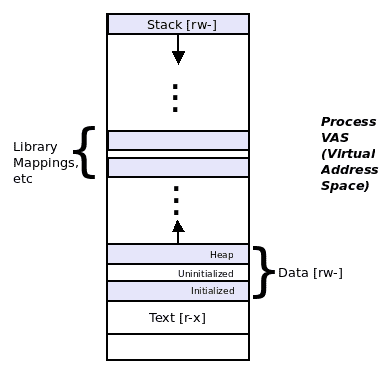
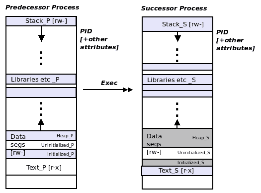
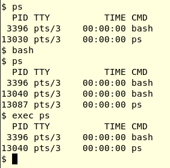
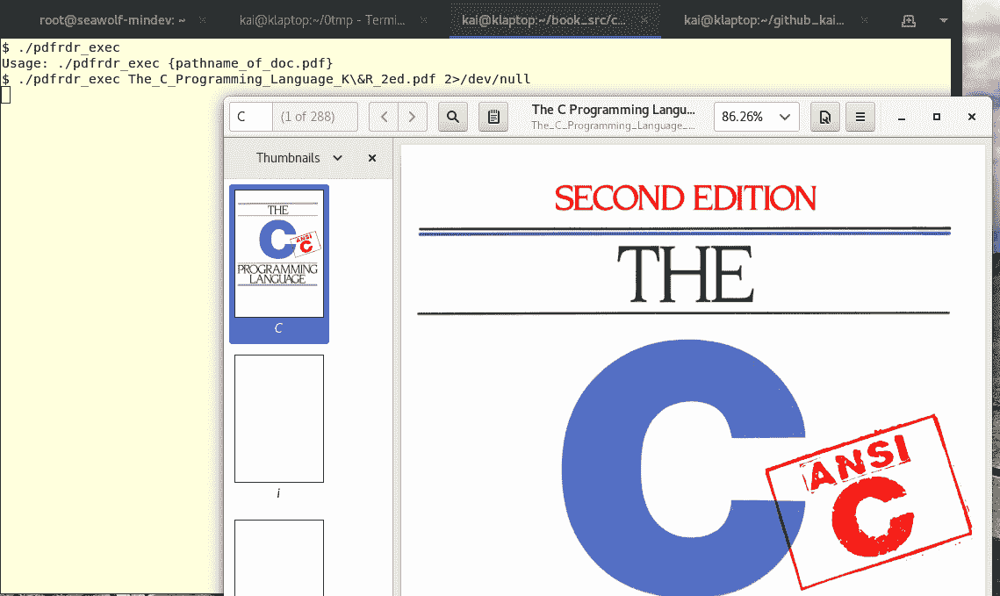

# 第九章：进程执行

想象这样的情景：作为一个系统程序员（在 Linux 上使用 C 语言）在一个项目上工作时，有一个要求，即在图形用户界面（GUI）前端应用程序中，当最终用户点击某个按钮时，应用程序必须显示系统生成的 PDF 文档的内容。我们可以假设有一个 PDF 阅读器软件应用程序可供我们使用。但是，你要如何在 C 代码中运行它？

本章将教你如何执行这一重要任务。在这里，我们将学习一些核心的 Unix/Linux 系统编程概念：Unix `exec`模型的工作原理，前身/后继术语，以及如何使用多达七个`exec`系列 API 来使整个过程在代码中实际运行。当然，在这个过程中，会使用代码示例来清楚地说明这些概念。

简而言之，读者将学习以下关键领域：

+   `exec`操作的含义及其语义

+   测试`exec`操作

+   使用`exec`的错误和正确方式

+   使用`exec`进行错误处理

+   七个`exec`系列 API 及其在代码中的使用方法。

# 技术要求

本章的一个练习要求安装 Poppler 软件包（PDF 工具）；可以按以下方式安装：

在 Ubuntu 上：`sudo apt install poppler-utils`

在 Fedora 上：`sudo dnf install poppler-utils-<version#>`

关于 Fedora 案例：要获取版本号，只需输入上述命令，然后在输入`poppler-utils-`后按两次*Tab*键；它将自动完成并提供一个选择列表。选择最新版本并按*Enter*。

# 进程执行

在这里，我们研究 Unix/Linux 操作系统在系统程序员级别上如何执行程序。首先，我们将教你理解重要的`exec`语义；一旦这清楚了，你就可以使用`exec`系列 API 来编程。

# 将程序转换为进程

如前所述，程序是存储介质上的二进制文件；它本身是一个死对象。要运行它，使其成为一个进程，我们必须执行它。当你从 shell 中运行程序时，它确实会变得活跃并成为一个进程。

这里是一个快速示例：

```
$ ps
 PID TTY          TIME CMD
 3396 pts/3    00:00:00 bash
21272 pts/3    00:00:00 ps
$ 
```

从前面的代码中可以看出，从 shell（本身就是一个进程：bash）中运行或执行`ps(1)`程序；`ps`确实运行了；它现在是一个进程；它完成了它的工作（在这里打印出当前在这个终端会话中活动的进程），然后礼貌地死去，让我们回到 shell 的提示符。

稍加思考就会发现，要使`ps(1)`程序成为`ps`进程，操作系统可能需要做一些工作。确实如此：操作系统通过一个名为`execve(2)`的 API，一个系统调用，执行程序并最终使其成为运行中的进程。不过，现在让我们暂时把 API 放在一边，专注于概念。

# exec Unix 公理

我们在第二章中学到，即虚拟内存，一个进程可以被视为一个盒子（一个矩形），具有虚拟地址空间（VAS）；VAS 由称为段的同质区域（技术上称为映射）组成。基本上，一个进程的 VAS 由几个段组成：文本（代码）段、数据段、库（和其他）映射以及栈。为了方便起见，这里再次呈现了表示进程 VAS 的图表：



图 1：进程虚拟地址空间（VAS）

底端的虚拟地址为`0`，地址随着向上增加；我们有一个向上增长的堆和一个向下增长的栈。

机器上的每个进程都有这样的进程 VAS；因此，可以推断出，我们之前的小例子中的 shell，bash，也有这样的进程 VAS（以及所有其他属性，如进程标识符（PID）、打开的文件等）。

所以，让我们想象一下，shell 进程 bash 的 PID 是 3,396。现在，当我们从 shell 运行`ps`时，实际上发生了什么？

显然，作为第一步，shell 会检查`ps`是否是一个内置命令；如果是，它会运行它；如果不是，也就是我们的情况，它会继续到第二步。现在，shell 解析`PATH`环境变量，并且在`/bin`中找到了`ps`。第三步，有趣的一步！，是 shell 进程现在通过 API 执行`/bin/ps`。我们将把确切的 API 讨论留到以后；现在，我们只是把可能的 API 称为`exec`API。

不要为了树木而忘记了森林；我们现在要谈到的一个关键点是：当`exec`发生时，调用进程（bash）通过让（除其他设置外）`ps`覆盖其虚拟地址空间（VAS）来执行被调用的进程（`ps`）。是的，你没看错——Unix 和因此 Linux 上的进程执行是通过一个进程——“调用者”——被要执行的进程——“被调用者”——覆盖来实现的。

术语

这里有一些重要的术语可以帮助我们：调用`exec`（在我们的例子中是 bash）的进程被称为“前任”；被调用和执行的进程（在我们的例子中是 ps）被称为“继任”。

# exec 操作期间的关键点

以下总结了前任进程执行继任进程时需要注意的重要点：

+   继任进程覆盖（或叠加）了前任的虚拟地址空间。

+   实际上，前任的文本、数据、库和堆栈段现在被继任的替换了。

+   操作系统将负责大小调整。

+   没有创建新进程——继任现在在旧前任的上下文中运行。

+   前任属性（包括但不限于 PID 和打开文件）因此被继任者自动继承。

（敏锐的读者可能会问，为什么在我们之前的例子中，`ps`的 PID 不是 3,396？请耐心等待，我们将在 GitHub 存储库中得到确切的答案）。

+   在成功的 exec 中，没有可能返回到前任；它已经消失了。口头上说，执行 exec 就像对前任自杀一样：成功执行后，继任就是唯一留下的；返回到前任是不可能的：

*图 2：exec 操作*

# 测试 exec 公理

你能测试上面描述的`exec`公理吗？当然。我们可以用三种不同的方式来尝试。

# 实验 1 - 在 CLI 上，不花俏

按照以下简单的步骤：

1.  启动一个 shell（通常是一个基于 GUI 的 Linux 上的终端窗口）

1.  在窗口中，或者更准确地说，在 shell 提示符中，输入这个：

```
 $ exec ps
```

你注意到了什么？你能解释一下吗？

嘿，请先试一下，然后再继续阅读。

是的，终端窗口进程在这里是前任；在 exec 之后，它被继任进程`ps`覆盖，完成它的工作并退出（你可能没有看到输出，因为它消失得太快了）。`ps`是继任进程，当然，我们不能返回到前任（终端窗口）——`ps`已经完全替换了它的 VAS。因此，终端窗口实际上消失了。

# 实验 2 - 在 CLI 上，再次

这一次，我们会让你更容易！按照给定的步骤进行：

1.  启动一个 shell（通常是一个基于 GUI 的 Linux 上的终端窗口）。

1.  在窗口中，或者更准确地说，在 shell 提示符中，先运行`ps`，然后是`bash`——是的，我们在这里生成一个子 shell，然后再次运行`ps`。（查看下一个截图；注意原始和子 shell Bash 进程的 PID - 3,396 和 13,040）。

1.  在子 shell 中，`exec` `ps`命令；这个`ps`继任进程覆盖（或叠加）了前任进程——bash 子 shell 的进程镜像。

1.  观察输出：在`exec ps`命令输出中，`ps`的 PID 是 bash 子 shell 进程的 PID：13,040！这表明它是在该进程的上下文中运行。

1.  还要注意，现在我们又回到了原始的 bash shell 进程 PID 3,396，因为当然，我们无法返回到前身：



第三次实验运行很快就会开始，一旦我们有了一些`exec`API 来玩耍。

# 不归路

对于系统程序员来说，重要的是要理解，一旦`exec`操作成功，就不会返回到前身进程。为了说明这一点，考虑这里的粗略调用图：

```
main()
         foo()
              exec(something)
         bar()
```

`main()`调用`foo()`*，*它调用`exec(something)`；一旦`exec`成功，`bar()`就永远不会运行了！

为什么不呢？我们无法在前身的执行路径中到达它，因为整个执行上下文现在已经改变 - 到了后继进程的上下文（某个东西）。PID 仍然保持不变。

只有在`exec`失败时，函数`bar()`才会获得控制（当然，我们仍然会处于前身的上下文中）。

作为进一步的细节，注意`exec()`操作本身可能成功，但被执行的进程`something`失败。没关系；这不会改变语义；`bar()`仍然不会执行，因为后继者已经接管了。

# 家庭时间 - exec 家族 API

现在我们已经理解了`exec`的语义，是时候看看如何在程序中执行`exec`操作了。Unix 和 Linux 提供了几个 C API，实际上有七个，最终都是做同样的工作：它们让前身进程`exec`后继进程。

所以，有七个 API 都做同样的事情？大多数是的；因此它们被称为`exec`家族 API。

让我们来看看它们：

```
#include <unistd.h>
extern char **environ;

int execl(const char *path, const char *arg, ...);
int execlp(const char *file, const char *arg, ...);
int execle(const char *path, const char *arg, ...,
            char * const envp[]);
int execv(const char *path, char *const argv[]);
int execvp(const char *file, char *const argv[]);
int execvpe(const char *file, char *const argv[],
             char *const envp[]);
    execvpe(): _GNU_SOURCE
```

等等，虽然我们说有七个 API，但上面的列表只有六个；确实：第七个在某种意义上是特殊的，没有显示在上面。像往常一样，耐心等待一下；我们会介绍的！

事实上，尽管每个 API 最终都会执行相同的工作，但根据您所处的情况（方便性），使用特定的 API 会有所帮助。让我们不要挑剔，至少现在，忽略它们的差异；相反，让我们专注于理解第一个；其余的将自动而轻松地跟随。

看看第一个 API，`execl(3)`：

```
int execl(const char *path, const char *arg, ...);
```

它需要两个、三个还是更多的参数？如果你对此还不熟悉，省略号`...`表示可变参数列表或`varargs`，这是编译器支持的一个特性。

第一个参数是您想要执行的应用程序的路径名。

从第二个参数开始，`varargs`，传递给后继进程的参数包括`argv[0]`。想想，在上面的简单实验中，我们通过 shell 进程在命令行上传递了参数；实际上，真正传递给后继进程所需参数的是前身，也就是 shell 进程。这是有道理的：除了前身，谁还会传递参数给后继者呢？

编译器如何知道你何时传递参数？简单：你必须用空指针终止参数列表：`execl(const char *pathname_to_successor_program, const char *argv0, const char *argv1, ..., const char *argvn, (char *)0);`

现在你可以看到为什么它被命名为`execl`：当然，`execl` API 执行`exec`；最后一个字母`l`表示长格式；后继进程的每个参数都传递给它。

为了澄清这一点，让我们写一个简单的示例 C 程序；它的工作是调用`uname`进程：

为了可读性，这里只显示了代码的相关部分；要查看和运行它，整个源代码在这里可用：[`github.com/PacktPublishing/Hands-on-System-Programming-with-Linux`](https://github.com/PacktPublishing/Hands-on-System-Programming-with-Linux)。

```
int main(int argc, char **argv)
{
    if (argc < 2) {
        [...]
    }

    /* Have us, the predecessor, exec the successor! */
    if (execl("/bin/uname", "uname", argv[1], (char *)0) == -1)
        FATAL("execl failed\n");

    printf("This should never get executed!\n");
    exit (EXIT_SUCCESS);
}
```

以下是一些需要注意的要点：

+   `execl` API 的第一个参数是继承者的路径名。

+   第二个参数是程序的名称。小心：一个相当典型的新手错误是漏掉它！

+   在这种简单的情况下，我们只传递用户发送的参数`argv[1]`：`-a`或`-r`；我们甚至没有进行健壮的错误检查，以确保用户传递了正确的参数（我们把它留给你作为练习）。

+   如果我们只尝试用一个单独的`0`来进行空终止，编译器会抱怨，警告如下（这可能取决于你使用的`gcc`编译器版本）：

`warning: missing sentinel in function call [-Wformat=]`。

为了消除警告，你必须像代码中所示的那样用`(char *)`对`0`进行强制转换。

+   最后，我们使用`printf()`来演示控制永远不会到达它。为什么呢？嗯，想想看：

+   要么`execl`成功；因此继承者进程（`uname`）接管。

+   或者`execl`失败；`FATAL`宏执行错误报告并终止前身。

让我们构建并尝试一下：

```
$ ./execl_eg
Usage: ./execl_eg {-a|-r}
 -a : display all uname info
 -r : display only kernel version
$
```

传递一个参数；我们在这里展示一些例子：

```
$ ./execl_eg -r
4.13.0-36-generic
$ ./execl_eg -a
Linux seawolf-mindev 4.13.0-36-generic #40-Ubuntu SMP Fri Feb 16 20:07:48 UTC 2018 x86_64 x86_64 x86_64 GNU/Linux
$ ./execl_eg -eww
uname: invalid option -- 'e'
Try 'uname --help' for more information.
$ 
```

它确实有效（尽管，正如从最后一个案例中可以看到的那样，`execl_eg`程序的参数错误检查并不好）。

我们鼓励你自己尝试这个简单的程序；事实上，多做一些实验：例如，将第一个参数更改为一些未知的内容（例如`/bin/oname`）并看看会发生什么。

# 错误的方法

有时，为了展示正确的做法，首先看看错误的做法是有用的！

# 错误处理和 exec

一些程序员炫耀：他们不使用*if*条件来检查`exec` API 是否失败；他们只是在`exec`后写下一行代码作为失败情况！

例如，拿前面的程序，但将代码更改为这样，这是错误的做法：

```
execl("/bin/uname", "uname", argv[1], (char *)0);
FATAL("execl failed\n");
```

它有效，是的：控制将永远到达`'FATAL()'`行的唯一原因是 exec 操作失败。这听起来很酷，但请不要这样编码。要专业一点，遵循规则和良好的编码风格指南；你会成为一个更好的程序员并为此感到高兴！（一个无辜的新手程序员甚至可能没有意识到上面的`execl`之后是实际的错误处理；谁能怪他呢？他可能会尝试在那里放一些业务逻辑！）

# 传递零作为参数

假设我们有一个（虚构的）要求：从我们的 C 代码中，我们必须执行程序`/projectx/do_this_now`并传递三个参数：`-1`，`0`和`55`。就像这样：

`/projectx/do_this_now -1 0 55`

回想一下`exec` API 的语法：

`execl(const char *pathname_to_successor_program, const char *argv0, const char *argv1, ..., const char *argvn, (char *)0);`

所以，这似乎相当琐碎；让我们做吧：

`execl("/projectx/do_this_now", "do_this_now", -1, 0, 55, (char *)0);`

哎呀！编译器会，或者*可能*会，将继承者的第二个参数`0`（在`-1`之后）解释为`NULL`终结符，因此不会看到后面的参数`55`。

修复这很容易；我们只需要记住*每个传递给继承者进程的参数都是字符指针类型*，而不是整数；`NULL`终结符本身是一个整数（尽管为了让编译器满意，我们将其强制转换为`(char *)`），就像这样：

`execl("/projectx/do_this_now", "do_this_now", "-1", "0", "55", (char *)0);`

# 指定继承者的名称

不，我们这里不是在讨论如何黑掉谁将继承伊丽莎白二世王位的问题，抱歉。我们所指的是：如何正确指定继承进程的名称；也就是说，我们是否可以以编程方式将其更改为我们喜欢的任何内容？

乍一看，它看起来确实很琐碎：`execl`的第二个参数是要传递给后继的`argv[0]`参数；实际上，它看起来像是它的名称！所以，让我们试一试：我们编写了一对 C 程序；第一个程序，前身（`ch9/predcs_name.c`）从用户那里传递一个名称参数。然后通过`execl`执行我们的另一个程序`successor_setnm`，并将用户提供的名称作为第一个参数传递给后继（在 API 中，它将后继的`argv[0]`参数设置为前身的`argv[1]`），如下所示：`execl("./successor_setnm", argv[1], argv[1], (char *)0);`

回想一下`execl`的语法：`execl(pathname_to_successor_program, argv0, argv1, ..., argvn, 0);`

因此，这里的想法是：前身已将后继的`argv[0]`值设置为`argv[1]`，因此后继的名称应该是前身的`argv[1]`。然而，它并没有成功；请看一次运行的输出：

```
$ ./predcs_name 
Usage: ./predcs_name {successor_name} [do-it-right]
$ ./predcs_name UseThisAsName &
[1] 12571
UseThisAsName:parameters received:
argv[0]=UseThisAsName
argv[1]=UseThisAsName
UseThisAsName: attempt to set name to 1st param "UseThisAsName" [Wrong]
UseThisAsName: pausing now...
$ 
$ ps
 PID TTY          TIME CMD
 1392 pts/0    00:00:01 Bash
12571 pts/0    00:00:00 successor_setnm
12576 pts/0    00:00:00 ps
$ 
```

我们故意让后继进程调用`pause(2)`系统调用（它只是导致它休眠，直到它收到一个信号）。这样，我们可以在后台运行它，然后运行`ps`来查找后继 PID 和名称！

有趣的是：我们发现，虽然在`ps`输出中名称不是我们想要的（上面），但在`printf`中是正确的；这意味着`argv[0]`已经正确接收并设置为后继。

好的，我们必须清理一下；现在让我们杀死后台进程：

```
$ jobs
[1]+  Running                 ./predcs_name UseThisAsName &
$ kill %1
[1]+  Terminated              ./predcs_name UseThisAsName
$ 
```

因此，现在显而易见的是，我们之前所做的还不够：为了在操作系统层面反映我们想要的名称，我们需要一种替代的 API；这样的 API 之一是`prctl(2)`系统调用（甚至是`pthread_setname_np(3)`线程 API）。在这里不详细介绍，我们使用`PR_SET_NAME`参数（通常，请参阅`prctl(2)`的 man 页面以获取完整详情）。因此，使用`prctl(2)`系统调用的正确代码（仅显示`successor_setnm.c`中的相关代码片段）如下：

```
[...]
    if (argc == 3) { /* the "do-it-right" case! */
        printf("%s: setting name to \"%s\" via prctl(2)"
                " [Right]\n", argv[0], argv[2]);
        if (prctl(PR_SET_NAME, argv[2], 0, 0, 0) < 0)
            FATAL("prctl failed\n");
    } else { /* wrong way... */
        printf("%s: attempt to implicitly set name to \"%s\""
            " via the argv[0] passed to execl [Wrong]\n",
            argv[0], argv[1]);
    }
[...]
$ ./predcs_name 
Usage: ./predcs_name {successor_name} [do-it-right]
$ 
```

所以，我们现在以正确的方式运行它（逻辑涉及传递一个可选的第二个参数，该参数将用于“正确”设置后继进程的名称）：

```
$ ./predcs_name NotThis ThisNameIsRight &
[1] 12621
ThisNameIsRight:parameters received:
argv[0]=ThisNameIsRight
argv[1]=NotThis
argv[2]=ThisNameIsRight
ThisNameIsRight: setting name to "ThisNameIsRight" via prctl(2) [Right]
ThisNameIsRight: pausing now...
$ ps
 PID TTY          TIME CMD
 1392 pts/0    00:00:01 Bash
12621 pts/0    00:00:00 ThisNameIsRight
12626 pts/0    00:00:00 ps
$ kill %1
[1]+  Terminated              ./predcs_name NotThis ThisNameIsRight
$ 
```

这次它的工作完全符合预期。

# 剩下的 exec 系列 API

很好，我们已经详细介绍了如何正确和不正确地使用`exec` API 系列中的第一个`execl(3)`。剩下的呢？让我们来看看它们；为了方便读者，以下是列表：

```
#include <unistd.h>
extern char **environ;

int execl(const char *path, const char *arg, ...);
int execlp(const char *file, const char *arg, ...);
int execle(const char *path, const char *arg, ...,
            char * const envp[]);
int execv(const char *path, char *const argv[]);
int execvp(const char *file, char *const argv[]);
int execvpe(const char *file, char *const argv[],
             char *const envp[]);
    execvpe(): _GNU_SOURCE
```

正如多次提到的，`execl`的语法是这样的：`execl(const char *pathname_to_successor_program, const char *argv0, const char *argv1, ..., const char *argvn, (char *)0);`

记住，它的名字是`execl`；`l`意味着长格式可变参数列表：后继进程的每个参数依次传递给它。

现在让我们看看家族中的其他 API。

# execlp API

`execlp`是`execl`的一个小变体：

`int **execlp**(const char ***file**, const char *arg, ...);`

与之前一样，`execlp`中的`l`意味着长格式可变参数列表；`p`意味着环境变量`PATH`用于搜索要执行的程序。您可能知道，PATH 环境变量由一组以冒号（`:`）分隔的目录组成，用于搜索要运行的程序文件；第一个匹配项是要执行的程序。

例如，在我们的 Ubuntu VM 上（我们以用户`seawolf`登录）：

```
$ echo $PATH
/home/seawolf/bin:/home/seawolf/.local/bin:/usr/local/sbin:/usr/local/bin:/usr/sbin:/usr/bin:/sbin:/bin:/usr/games:/usr/local/games
$ 
```

因此，如果您通过`execlp`执行一个进程，您不需要给出绝对或完整的路径名作为第一个参数，而只需要给出程序名；看看以下两个示例的区别：

`execl("/bin/uname", "uname", argv[1], (char *)0);`

`**execlp**("uname", "uname", argv[1], (char *)0);`

使用`execl`，您必须指定`uname`的完整路径名；使用`execlp`，您不需要；库例程将执行查找 PATH 和找到`uname`的匹配的工作！（它会在`/bin`中找到第一个匹配项）。

使用`which`工具来定位一个程序，实际上是在路径中找到它的第一个匹配项。例如：

`$ which uname`

`/bin/uname`

`$`

这个`execlp`自动搜索路径的事实确实很方便；但需要注意的是，这可能会牺牲安全性！

黑客编写称为特洛伊木马的程序——基本上是假装成其他东西的程序；这显然是危险的。如果黑客能够在你的家目录中放置一个`uname`的特洛伊木马版本，并修改 PATH 环境变量以首先搜索你的家目录，那么当你（以为）运行`uname`时，他们就可以控制你。

出于安全原因，最好在执行程序时指定完整的`pathname`（因此，避免使用`execlp`、`execvp`和`execvpe`API）。

如果 PATH 环境变量未定义会怎么样？在这种情况下，API 会默认搜索进程的当前工作目录（`cwd`）以及一个叫做`confstr`路径，通常默认为目录`/bin`，然后是`/usr/bin`。

# execle API

现在是关于`execle(3)`的 API；它的签名是：

`int **execle**(const char *path, const char *arg, ...,char * const envp[]);`

和之前一样，`execle`中的`l`表示长格式可变参数列表；`e`表示我们可以传递一个环境变量数组给后续进程。

进程环境由一组`<name>=<value>`变量对组成。环境实际上对每个进程都是唯一的，并存储在进程堆栈段中。你可以通过`printenv`、`env`或`set`命令（`set`是一个 shell 内置命令）来查看整个列表。在程序中，使用`extern char **environ`来访问进程的环境。

默认情况下，后继进程将继承前驱进程的环境。如果这不是所需的，该怎么办；例如，我们想要执行一个进程，但更改 PATH 的值（或者引入一个新的环境变量）。为此，前驱进程将复制环境，根据需要修改它（可能添加、编辑、删除变量），然后将指向新环境的指针传递给后继进程。这正是最后一个参数`char * const envp[]`的用途。

旧的 Unix 程序曾经接受`main()`的第三个参数：`char **arge`，表示进程环境。现在这被认为是不推荐的；应该使用`extern environ`代替。

没有机制只传递一些环境变量给后续进程；整个一堆环境变量——以字符串的二维数组形式（本身是`NULL`结尾）必须被传递。

# execv API

*execv(3)* API 的签名是：

`int **execv**(const char *path, char *const argv[]);`

可以看到，第一个参数是后继进程的路径名。第二个参数与上面的环境列表类似，是一个二维字符串数组（每个字符串都以`NULL`结尾），保存所有要传递给后继进程的参数，从`argv[0]`开始。想想看，这与我们 C 程序员如此习惯的东西是一样的；这就是 C 中`main()`函数的签名：

`int main(int argc, char *argv[]);`

`argc`，当然，是接收到的参数数量，包括程序名称本身（保存在`argv[0]`中），而**`argv`**是指向一个二维字符串数组的指针（每个字符串都以`NULL`结尾），保存从`argv[0]`开始的所有参数。

因此，我们口头上称之为短格式（与之前使用的长格式`l`风格相对）。当你看到`v`（代表 argv）时，它代表短格式参数传递风格。

现在，剩下的两个 API 很简单：

+   `execvp(3)`：短格式参数，以及被搜索的路径。

+   `execvpe(3)`：短格式参数，正在搜索的路径，以及显式传递给后继的环境列表。此外，这个 API 要求定义特性测试宏`_GNU_SOURCE`（顺便说一句，在本书的所有源代码中我们都这样做）。

带有`p`的`exec`函数——搜索`PATH`的函数——`execlp`、`execvp`和`execvpe`具有一个额外的特性：如果它们正在搜索的文件被找到但没有权限打开它，它们不会立即失败（就像其他`exec` API 会失败并将`errno`设置为`EACCESS`一样）；相反，它们将继续搜索`PATH`的其余部分以寻找文件。

# 在操作系统级别执行

到目前为止，我们已经涵盖了七个*exec API 家族*中的六个。最后，第七个是`execve(2)`。你注意到了吗？括号中的`2`表示它是一个系统调用（回想一下第一章中关于系统调用的细节）。

事实上，所有前面的六个`exec` API 都在`glibc`库层内；只有`execve(2)`是一个系统调用。你会意识到，最终，要使一个进程能够执行另一个程序——从而启动或运行一个后继程序——将需要操作系统级别的支持。所以，是的，事实是，所有上述六个`exec` API 只是包装器；它们转换它们的参数并调用`execve`系统调用。

这是`execve(2)`的签名：

`int execve(const char *filename, char *const argv[], char *const envp[]);`

看一下 exec API 家族的总结表。

# 总结表 - exec API 家族

这是一个总结所有七个`exec`家族 API 的表：

| **Exec API** | **参数：长格式（l）** | **参数：短格式（v）** | **搜索路径？（p）** | **传递环境？（e）** | **API 层** |
| --- | --- | --- | --- | --- | --- |
| `execl` | Y | N | N | N | Lib |
| `execlp` | Y | N | Y | N | Lib |
| `execle` | Y | N | N | Y | Lib |
| `execv` | N | Y | N | N | Lib |
| `execvp` | N | Y | Y | N | Lib |
| `execvpe` | N | Y | Y | Y | Lib |
| `execve` | N | Y | N | Y | SysCall |

exec API 的格式：`exec<foo>`，其中`<foo>`是`{l,v,p,e}`的不同组合。

所有列出的 API，在成功时，正如我们所学的那样，都不会返回。只有在失败时，你才会看到一个返回值；根据通常的规范，全局变量`errno`将被设置以反映错误的原因，可以方便地通过`perror(3)`或`strerror(3)`API 来查找（例如，在本书提供的源代码中，查看`common.h`头文件中的`FATAL`宏）。

# 代码示例

在本章的介绍中，我们提到了一个要求：从 GUI 前端，显示系统生成的 PDF 文档的内容。让我们在这里做这个。

为此，我们需要一个 PDF 阅读器应用程序；我们可以假设我们有一个。事实上，在许多 Linux 发行版中，evince 应用程序是一个很好的 PDF 阅读器应用程序，通常预装（在 Ubuntu 和 Fedora 等发行版上是真的）。

在这里，我们不会使用 GUI 前端应用程序，我们将使用老式的 C 语言编写一个 CLI 应用程序，给定一个 PDF 文档的`路径名`，执行 evince PDF 阅读器应用程序。我们要显示哪个 PDF 文档？啊，这是一个惊喜！（看一下）：

为了可读性，只显示代码的相关部分如下；要查看和运行它，整个源代码在这里可用：

[`github.com/PacktPublishing/Hands-on-System-Programming-with-Linux`](https://github.com/PacktPublishing/Hands-on-System-Programming-with-Linux)。

```
const char *pdf_reader_app="/usr/bin/evince";
static int exec_pdf_reader_app(char *pdfdoc)
{
    char * const pdf_argv[] = {"evince", pdfdoc, 0};

    if (execv(pdf_reader_app, pdf_argv) < 0) {
        WARN("execv failed");
        return -1;
    }
    return 0; /* never reached */
}
```

我们从`main()`中调用前面的函数如下：

```
   if (exec_pdf_reader_app(argv[1]) < 0)
        FATAL("exec pdf function failed\n");
```

我们构建它，然后执行一个示例运行：

```
$ ./pdfrdr_exec
Usage: ./pdfrdr_exec {pathname_of_doc.pdf}
$ ./pdfrdr_exec The_C_Programming_Language_K\&R_2ed.pdf 2>/dev/null 
$ 
```

这是一个动作的截图！



如果我们只在控制台上运行 Linux（没有 GUI）？那么，当然，前面的应用程序将无法工作（而且 evince 甚至可能没有安装）。这是这种情况的一个例子：

```
$ ./pdfrdr_exec ~/Seawolf_MinDev_User_Guide.pdf 
!WARNING! pdfrdr_exec.c:exec_pdf_reader_app:33: execv failed
perror says: No such file or directory
FATAL:pdfrdr_exec.c:main:48: exec pdf function failed
perror says: No such file or directory
$ 
```

在这种情况下，为什么不尝试修改上述应用程序，改用 CLI PDF 工具集呢；其中一个这样的工具集来自 Poppler 项目（见下面的注释）。其中一个有趣的实用工具是`pdftohtml`。为什么不使用它来从 PDF 文档生成 HTML 呢？我们把这留给读者作为一个练习（请参阅 GitHub 存储库上的*问题*部分）。

这些有用的 PDF 实用程序是由一个名为 Poppler 的开源项目提供的。您可以在 Ubuntu 上轻松安装这些 PDF 实用程序：`sudo apt install poppler-utils`

我们可以很容易地跟踪`pdfrdr_exec`程序中发生的情况；在这里，我们使用`ltrace(1)`来查看发出的库调用：

```
$ ltrace ./pdfrdr_exec The_C_Programming_Language_K\&R_2ed.pdf 
execv("/usr/bin/evince", 0x7ffcd861fc00 <no return ...>
--- Called exec() ---
g_static_resource_init(0x5575a5aff400, 0x7ffc5970f888, 0x7ffc5970f8a0, 32) = 0
ev_get_locale_dir(2, 0x7ffc5970f888, 0x7ffc5970f8a0, 32)                  = 0x7fe1ad083ab9
[...]
```

关键调用：当然可以看到`execv`；有趣的是，`ltrace`友好地告诉我们它没有返回值...。然后我们看到了 evince 软件本身的库 API。

如果我们使用`strace(1)`来查看发出的系统调用呢？

```
$ strace ./pdfrdr_exec The_C_Programming_Language_K\&R_2ed.pdf 
execve("./pdfrdr_exec", ["./pdfrdr_exec", "The_C_Programming_Language_K&R_2"...], 0x7fff7f7720f8 /* 56 vars */) = 0
brk(NULL)                               = 0x16c0000
access("/etc/ld.so.preload", R_OK)      = 0
openat(AT_FDCWD, "/etc/ld.so.preload", O_RDONLY|O_CLOEXEC) = 3
fstat(3, {st_mode=S_IFREG|0644, st_size=0, ...}) = 0
[...]
```

是的，第一个是`execve(2)`，证明了`execv(3)`库 API 调用了`execve(2)`系统调用。当然，输出的其余部分是 evince 进程执行时发出的系统调用。

# 总结

本章介绍了 Unix/Linux 的`exec`编程模型；前身和后继进程的关键概念，以及后继进程（或多或少地）如何覆盖前身。介绍了七个`exec`家族 API，以及几个代码示例。还介绍了错误处理、后继名称规范等内容。系统程序员现在将有足够的知识来编写正确执行给定程序的 C 代码。
