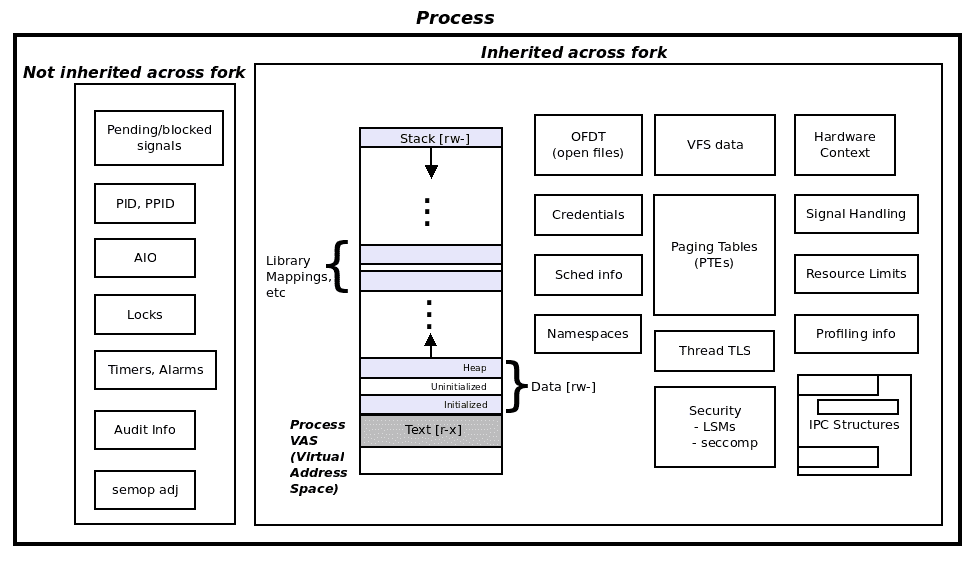
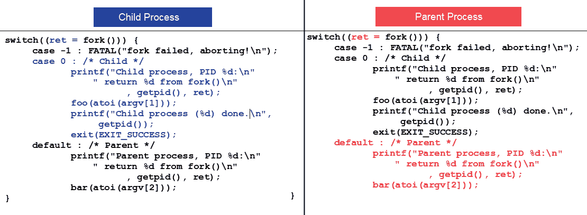
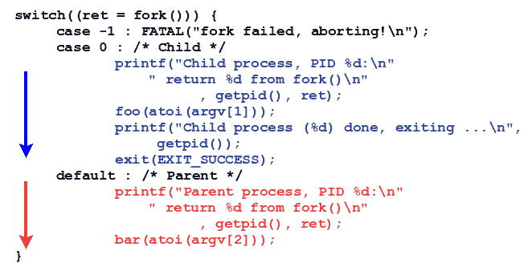
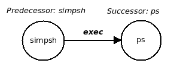
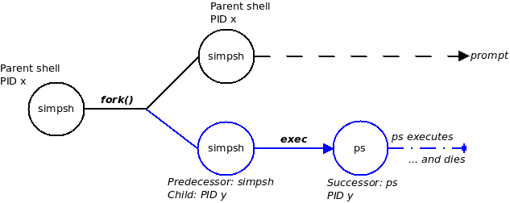
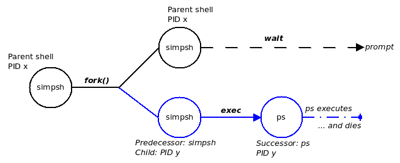

# 第十章：进程创建

在上一章中，我们学习了如何处理（虚构的）应用程序设计和实现需求：让我们的 C 程序执行（`exec`）另一个完全不同的程序。然而，现实情况是讨论仍然不完整；这一章关于进程创建将填补一些空白，并且更多。

在本章中，您将学习一些核心的 Unix/Linux 系统编程概念：正确编程关键的`fork(2)`系统调用所需的细节。在这个过程中，Unix 爱好者术语如阻塞调用、孤儿和僵尸也将得到澄清。这些材料将仔细呈现出微妙的要点，将普通开发人员变成熟练的开发人员。同时，读者将学会编写 C 代码，以在 Linux 系统应用程序中实现前述关键概念。和往常一样，我们将使用多个代码示例来清楚地说明和巩固所教授的概念。

本章的目的是指导 Linux 系统开发人员进入 Unix 的核心系统编程世界，包括`fork-exec-wait`语义和相关领域。简而言之，我们将重点关注以下几个方面，帮助读者学习：

+   Unix 进程创建模型

+   其中的原因和方法

+   更深入的细节，包括：

+   `fork`如何影响内存分配、打开文件等，以及安全性影响

+   `wait` API 的几种形式

+   这些 API 如何实际使用

+   `fork`的规则

+   孤儿和僵尸进程

# 进程创建

除非 Unix/Linux 系统程序员一直生活在某个地方的岩石下，他们肯定听说过，如果不是直接使用过`fork(2)`系统调用。为什么它如此著名和重要？原因很简单：Unix 是一个多任务操作系统；程序员必须利用操作系统的能力。要使应用程序多任务，我们需要创建多个任务或进程；`fork`是 Unix 创建进程的方式。事实上，对于典型的系统程序员来说，`fork`是创建进程的唯一可用方式。

还有另一个用于创建进程或线程的系统调用：`clone(2)`。它也创建一个自定义进程。它通常不被 Linux 应用程序开发人员使用；库（通常是线程库）开发人员更多地使用它。在本书中，我们不探讨`clone`；首先，它非常特定于 Linux 且不可移植；其次，它更像是一个隐藏的 API。

另一种多任务的方式是通过多线程，当然，这将在后面的章节中详细介绍。

# `fork`的工作原理

理论上，`fork(2)`系统调用的工作描述可以简化为一个简单的语句：*创建一个调用进程的相同副本*。我们将反复遇到的术语如下：调用`fork`的进程称为**父进程**，而新创建的、新生的进程称为**子进程**。

请注意，起初，我们将保持对`fork`工作方式的讨论纯粹概念化和简单；稍后，我们将深入探讨并澄清操作系统执行的几项必要优化。

`fork`是一个系统调用；因此，进程创建的实际工作是由操作系统在后台完成的。回想一下第二章中的*虚拟内存*，一个进程的**虚拟地址空间**（**VAS**）是由称为**段**（或**映射**）的同质区域构建而成。因此，当创建一个子进程时，操作系统将父进程的文本、数据（三个）、库（和其他映射），以及堆栈段复制到子进程中。

然而，不止于此：进程不仅仅是它的虚拟地址空间。这包括打开的文件，进程凭证，调度信息，文件系统结构，分页表，命名空间（PID 等），审计信息，锁，信号处理信息，定时器，警报，资源限制，IPC 结构，性能（perf）信息，安全（LSM）指针，seccomp，线程栈和 TLS，硬件上下文（CPU 和其他寄存器），等等。

许多早期提到的属性远远超出了本书的范围，我们不会尝试深入研究它们。想要表明进程不仅仅是虚拟地址空间。

呼！因此，在 fork 中涉及内核从父进程复制多个东西到子进程。但是，想一想：并非所有属性都直接从父进程继承到子进程（许多是，但肯定不是所有的）。例如，进程 PID 和 PPID（父进程 PID）不会被继承（你能想出原因吗？）。

作为第一级枚举，以下进程属性在 fork（意思是，新生的孩子-获得父进程的属性副本与相同的内容）时被子进程继承：

+   虚拟地址空间（VAS）：

+   文本

+   数据：

+   初始化

+   未初始化（bss）

+   堆

+   库段

+   其他映射（例如，共享内存区域，mmap 区域等）

+   栈

+   打开的文件

+   进程凭证

+   调度信息

+   文件系统（VFS）结构

+   分页表

+   命名空间

+   信号处理

+   资源限制

+   IPC 结构

+   性能（perf）信息

+   安全信息：

+   +   安全（LSM）指针

+   Seccomp

+   线程栈和 TLS

+   硬件上下文

父进程的以下属性在 fork 时不会被子进程继承：

+   PID，PPID

+   锁

+   待处理和阻塞信号（为子进程清除）

+   定时器，警报（为子进程清除）

+   审计信息（CPU/时间计数器为子进程重置）

+   通过`semop(2)`进行信号量调整

+   异步 IO（AIO）操作和上下文

以图表形式看到这一点很有用：



可以看到，`fork(2)`确实是一个繁重的操作！

如果感兴趣，您可以在`fork(2)`的 man 页面中找到更多关于继承/非继承特性的详细信息。

# 使用 fork 系统调用

fork 的签名本身就是简单的：

```
pid_t fork(void);
```

这看起来微不足道，但你知道那句话“魔鬼藏在细节中”！的确，我们将提出几个关于正确使用此系统调用的微妙和不那么微妙的指针。

为了开始理解 fork 的工作原理，让我们编写一个简单的 C 程序（`ch10/fork1.c`*）*：

```
int main(int argc, char **argv)
{
    fork();
    printf("Hello, fork.\n");
    exit (EXIT_SUCCESS);
}
```

构建并运行它：

```
$ make fork1
gcc -Wall -c ../../common.c -o common.o
gcc -Wall   -c -o fork1.o fork1.c
gcc -Wall -o fork1 fork1.c common.o
$ ./fork1 
Hello, fork.
Hello, fork.
$ 
```

fork 将在成功时创建一个新的子进程。

一个关键的编程规则：永远不要假设 API 成功，总是检查失败的情况！！！

这一点无法过分强调。

好的，让我们修改代码以检查失败的情况；任何系统调用（可能除了大约 380 个系统调用中的两个例外）在失败时返回`-1`。检查它；这是相关的代码片段（`ch10/fork1.c`）：

```
    if (fork() == -1)
        FATAL("fork failed!\n");
    printf("Hello, fork.\n");
    exit(EXIT_SUCCESS);
```

输出与之前看到的完全相同（当然，因为 fork 没有失败）。所以，`printf`似乎被执行了两次。确实是这样：一次是由父进程执行的，一次是由新的子进程执行的。这立即教会我们一些关于 fork 工作方式的东西；在这里，我们将尝试将这些东西编码为 fork 的规则。在本书中，我们将最终将 fork(2)的七条规则编码。

# Fork 规则＃1

Fork 规则＃1：*成功 fork 后，父进程和子进程中的执行都将继续在 fork 后的指令处进行*。

为什么会这样呢？嗯，想一想：`fork`的工作是在子进程中创建父进程的（几乎）相同的副本；这包括硬件上下文（前面提到的），当然也包括**指令指针**（**IP**）寄存器（有时称为**程序计数器**（**PC**））本身！因此，子进程也将在与父进程相同的位置执行用户模式代码。由于`fork`成功，控制不会转到错误处理代码（`FATAL()`宏）；相反，它将转到`printf`。*关键是：这将在（原始）父进程和（新的）子进程中都发生。*因此输出。

为了加强这一点，我们编写了这个简单的 C 程序的第三个版本（`ch10/fork3.c`）。在这里，我们只显示`printf`语句，因为这是唯一一行代码发生了变化（从`ch10/fork3.c`）：

```
    printf("PID %d: Hello, fork.\n", getpid());
```

构建并运行它：

```
$ ./fork3 
PID 25496: Hello, fork.
PID 25497: Hello, fork.
$ 
```

啊！现在我们实际上可以看到两个进程都运行了`printf`！可能（但不确定），PID `25496`是父进程，另一个当然是子进程。之后，两个进程都执行`exit(3)`API，因此都会终止。

# Fork 规则＃2 - 返回

让我们来看看我们迄今为止使用的代码：

```
    if (fork() == -1)
        FATAL("fork failed!\n");
    printf("PID %d: Hello, fork.\n", getpid());
    exit(EXIT_SUCCESS);
```

好的，现在我们从第一条规则中了解到`printf`将被父进程和子进程并行运行两次。

但是，想一想：这真的有用吗？现实世界的应用程序能从中受益吗？不。我们真正追求的，有用的是分工，也就是说，让子进程执行一些任务，父进程执行一些其他任务，以并行方式。这使得`fork`变得有吸引力和有用。

例如，在`fork`之后，让子进程运行某个函数`foo`的代码，父进程运行某个其他函数`bar`的代码（当然，这些函数也可以内部调用任意数量的其他函数）。那将是有趣和有用的。

为了安排这一点，我们需要一些方法在`fork`之后*区分父进程和子进程*。同样，乍一看，似乎查询它们的 PID（通过`getpid(2)`）是这样做的方法。嗯，你可以，但这是一种粗糙的方法。区分进程的正确方法内置在框架本身中：它是——猜猜——基于`fork`返回的值。

一般来说，您可能会正确地说，如果一个函数被调用一次，它就会返回一次。嗯，`fork`是特殊的——当您调用`fork(3)`时，它会返回*两次*。怎么做？想一想，`fork`的工作是创建父进程的副本，子进程；一旦完成，两个进程现在都必须从内核模式返回到用户空间；因此`fork`只被调用一次，但返回两次；一次在父进程中，一次在子进程上下文中。

然而，关键是内核保证父进程和子进程的返回值不同；以下是关于`fork`返回值的规则：

+   成功时：

+   子进程中的返回值为零（`0`）

+   父进程中的返回值是一个正整数，新子进程的 PID

+   失败时，返回`-1`并相应地设置`errno`（请检查！）

所以，我们开始吧：

**Fork 规则＃2**：*要确定您是在父进程还是子进程中运行，请使用 fork 返回值：在子进程中始终为 0，在父进程中为子进程的 PID*。

另一个细节：暂时看一下`fork`的签名：

```
pid_t fork(void);
```

返回值的数据类型是`pid_t`，肯定是一个`typedef`。它是什么？让我们找出来：

```
$ echo | gcc -E -xc -include 'unistd.h' - | grep "typedef.*pid_t"
typedef int __pid_t;
typedef __pid_t pid_t;
$ 
```

我们找到了：它只是一个整数。但这不是重点。这里的重点是，在编写代码时，不要假设它是整数；只需根据手册指定的数据类型声明数据类型；在`fork`的情况下，为`pid_t`。这样，即使在将来库开发人员将`pid_t`更改为，比如，`long`，我们的代码也只需要重新编译。我们未来证明了我们的代码，使其具有可移植性。

现在我们了解了三个 fork 规则，让我们编写一个小巧但更好的基于 fork 的应用程序来演示相同的内容。在我们的演示程序中，我们将编写两个简单的函数`foo`和`bar`；它们的代码是相同的，它们将发出打印并使进程休眠传递给它们的秒数作为参数。睡眠是为了模拟真实程序的工作（当然，我们可以做得更好，但现在我们只是保持简单）。

`main`函数如下（通常情况下，在 GitHub 存储库`ch10/fork4.c`上找到完整的源代码）：

```
int main(int argc, char **argv)
{
    pid_t ret;

    if (argc != 3) {
        fprintf(stderr,
            "Usage: %s {child-alive-sec} {parent-alive-sec}\n",
            argv[0]);
        exit(EXIT_FAILURE);
    }
    /* We leave the validation of the two parameters as a small
     * exercise to the reader :-)
     */

    switch((ret = fork())) {
    case -1 : FATAL("fork failed, aborting!\n");
    case 0 : /* Child */
          printf("Child process, PID %d:\n"
                 " return %d from fork()\n"
                        , getpid(), ret);
          foo(atoi(argv[1]));
          printf("Child process (%d) done, exiting ...\n",
               getpid());
          exit(EXIT_SUCCESS);
    default : /* Parent */
          printf("Parent process, PID %d:\n"
                 " return %d from fork()\n"
                      , getpid(), ret);
          bar(atoi(argv[2]));
    }
    printf("Parent (%d) will exit now...\n", getpid());
    exit(EXIT_SUCCESS);
}
```

首先，有几点需要注意：

+   返回变量已声明为`pid_t`。

+   规则＃1-父进程和子进程中的执行都在 fork 后的指令继续进行。在这里，跟在 fork 后的指令不是`switch`（通常被误解为），而是变量`ret`的初始化！想一想：这将保证`ret`被初始化两次：一次在父进程中，一次在子进程中，但值不同。

+   规则＃2-要确定您是在父进程还是子进程中运行，请使用 fork 返回值：在子进程中始终为`0`，在父进程中为子进程的 PID。啊，因此我们看到两条规则的效果都是确保`ret`得到正确初始化，因此我们可以正确地进行切换

+   有点不相关的事情-需要输入验证。看看我们传递给`fork4`程序的参数：

```
$ ./fork4 -1 -2
Parent process, PID 6797 :: calling bar()...
 fork4.c:bar :: will take a nap for 4294967294s ...
Child process, PID 6798 :: calling foo()...
 fork4.c:foo :: will take a nap for 4294967295s ...
[...]
```

我们还需要说什么（看输出）？这是一个缺陷（一个错误）。如源代码注释中所述，我们将两个参数的验证留给读者作为一个小练习。

+   我们更喜欢使用`switch-case`语法而不是`if`条件；在作者看来，这使得代码更易读，因此更易维护。

+   正如我们在规则 2 中学到的，fork 在子进程中返回 0，在父进程中返回子进程的 PID；我们在`switch-case`中使用这个知识，因此在代码中有效地、非常易读地区分子进程和父进程。

+   当子进程 ID 完成时，我们不让它调用`break`；相反，我们让它退出。原因显而易见：清晰。让子进程在其业务逻辑（`foo()`）中做它需要做的事情，然后简单地让它离开。不麻烦；清晰的代码。（如果我们使用`break`，我们将需要在`switch`语句之后再使用另一个`if`条件；这将很难理解，且难看。）

+   父进程通过`switch-case`，只是发出打印并退出。

因为函数`foo`和`bar`是相同的，所以我们只在这里展示`foo`的代码：

```
static void foo(unsigned int nsec)
{
    printf(" %s:%s :: will take a nap for %us ...\n",
            __FILE__, __FUNCTION__, nsec);
    sleep(nsec);
}
```

好的，让我们运行它：

```
$ ./fork4
Usage: ./fork4 {child-alive-sec} {parent-alive-sec}
$ ./fork4 3 7
Parent process, PID 8228:
 return 8229 from fork()
 fork4.c:bar :: will take a nap for 7s ...
Child process, PID 8229:
 return 0 from fork()
 fork4.c:foo :: will take a nap for 3s ...
Child process (8229) done, exiting ...
Parent (8228) will exit now...
$ 
```

正如您所看到的，我们选择让子进程保持活动状态三秒，父进程分别保持活动状态七秒。研究输出：fork 的返回值如预期的那样。

现在让我们再次在后台运行它（此外，我们给子进程和父进程分别更多的睡眠时间，10 秒和 20 秒）。回到 shell 上，我们将使用`ps(1)`来查看父进程和子进程：

```
$ ./fork4 10 20 &
[1] 308
Parent process, PID 308:
 return 312 from fork()
 fork4.c:bar :: will take a nap for 20s ...
Child process, PID 312:
 return 0 from fork()
 fork4.c:foo :: will take a nap for 10s ...
$ ps
  PID TTY          TIME CMD
  308 pts/0    00:00:00 fork4
  312 pts/0    00:00:00 fork4
  314 pts/0    00:00:00 ps
32106 pts/0    00:00:00 bash
$ ps -l
F S   UID   PID  PPID  C PRI  NI ADDR SZ WCHAN  TTY          TIME CMD
0 S  1000   308 32106  0  80   0 -  1111 hrtime pts/0    00:00:00 fork4
1 S  1000   312   308  0  80   0 -  1111 hrtime pts/0    00:00:00 fork4
0 R  1000   319 32106  0  80   0 -  8370 -      pts/0    00:00:00 ps
0 S  1000 32106 32104  0  80   0 -  6003 wait   pts/0    00:00:00 bash
$ 
$ Child process (312) done, exiting ...            *<< after 10s >>*
Parent (308) will exit now...                      *<< after 20s >>*
<Enter>
[1]+  Done                    ./fork4 10 20
$ 
```

`ps -l`（l：长列表）显示了每个进程的更多细节。（例如，我们可以看到 PID 和 PPID。）

在前面的输出中，您是否注意到`fork4`父进程的 PPID（父进程 ID）恰好是值`32106`，PID 是`308`。这不奇怪吗？通常您期望 PPID 比 PID 小。这通常是正确的，但并非总是如此！事实是内核从最早可用的值开始回收 PID。

**模拟子进程和父进程中的工作的实验**。

让我们这样做：我们创建`fork4.c`程序的副本，将其命名为`ch10/fork4_prnum.c`。然后，我们稍微修改代码：我们消除了`foo`和`bar`函数，而不是只是睡觉，我们让进程通过调用一个简单的宏`DELAY_LOOP`来模拟一些真正的工作。（代码在头文件`common.h`中。）这个宏根据输入参数打印给定字符给定次数，我们将这些参数作为输入参数传递给`fork4_prnum`。这是一个示例运行：

```
$ ./fork4_prnum 
Usage: ./fork4_prnum {child-numbytes-to-write} {parent-numbytes-to-write}
$ ./fork4_prnum 20 100
Parent process, PID 24243:
 return 24244 from fork()
pChild process, PID 24244:
 return 0 from fork()
ccpcpcpcpcpcpcpcpcpcpcpcpcpcpcpcpcpcpcpChild process (24244) done, exiting ...
ppppppppppppppppppppppppppppppppppppppppppppppppppppppppppppppppppppppppppppppppParent (24243) will exit now...
$ 
```

`DELAY_LOOP`宏被编码为打印字符`p`（代表父）和`c`（代表子）；它打印的次数作为参数传递。你可以很清楚地看到调度程序在父进程和子进程之间进行上下文切换！（交错的`p`和`c`表明它们各自何时拥有 CPU）。

要严谨一点，我们应该确保两个进程都在同一个 CPU 上运行；这可以通过 Linux 上的`taskset(1)`实用程序轻松实现。我们运行`taskset`指定一个 CPU 掩码为`0`，意味着作业只能在 CPU `0`上运行。（再次留给读者一个简单的查找练习：查看`taskset(1)`的手册页，学习如何使用它：

```
$ taskset -c 0 ./fork4_prnum 20 100
Parent process, PID 24555:
 return 24556 from fork()
pChild process, PID 24556:
 return 0 from fork()
ccppccpcppcpcpccpcpcppcpccpcppcpccppccppChild process (24556) done, exiting ...
pppppppppppppppppppppppppppppppppppppppppppppppppppppppppppppppppppppppppppppppParent (24555) will exit now...
$ 
```

我们建议您实际在系统上尝试这些程序，以了解它们的工作方式。

# Fork 规则＃3

**Fork 规则＃3**：*成功 fork 后，父进程和子进程都并行执行代码*。

乍一看，这个规则看起来与第一个规则几乎一样。但不，这里强调的是并行性。父进程和子进程的执行路径与彼此并行运行。

你可能会想知道在单处理器系统上，这是怎么可能的？是的，没错：现代处理器的一个基本属性是在任何给定时间只能运行一条机器指令。因此，如果我们在一个单处理器的机器上，这意味着进程将在 CPU 上进行时间切片（或时间共享）。因此，这是伪并行；然而，由于现代 CPU 的速度，人类用户会感知执行是并行的。在多核（SMP）系统上，它们可以真正地并行运行。因此，单处理器的细节只是一个细节。关键点是我们应该将父进程和子进程都视为并行执行代码。

因此，在上一个代码示例中，这个规则告诉我们父进程和子进程的整个代码路径将并行运行；可视化这种并行性对于新手来说确实是 fork 的初始困难！为了帮助准确理解，看下面的图表（尽管我们只显示了 switch-case 的代码以简洁为目的）：父进程的代码路径用一种颜色（红色）突出显示，子进程的代码路径用另一种颜色（蓝色）突出显示：



这是关键点：蓝色的代码和红色的代码，子进程和父进程并行运行！



在第二个图表中，蓝色和红色的时间轴箭头再次用来描述这种并行性。

# 原子执行？

在看到前面的代码流程图时，你可能会误以为一旦进程开始执行其代码，它就会一直不受干扰地执行直到完成。这并不一定会发生；实际上，进程在运行时经常会被上下文切换出 CPU，然后再切换回来。

这带我们来到一个重要的观点：*原子执行*。如果一段代码总是在没有中断的情况下运行完成，那么这段代码被认为是原子的。特别是在用户空间，原子性是不被保证的：通常，进程（或线程）的执行会被中断或抢占（中断/抢占的来源包括硬件中断、故障或异常，以及调度程序上下文切换）。在内核中保持代码段的原子性是可以安排的。

# Fork 规则＃4 - 数据

当父进程*分叉*时，我们知道子进程被创建；它是父进程的副本。这将包括 VAS，因此也包括数据和堆栈段。记住这个事实，看看下面的代码片段（`ch10/fork5.c`）：

```
static int g=7;
[...]
int main(int argc, char **argv)
    [...]
    int loc=8;
    switch((ret = fork())) {
    case -1 : FATAL("fork failed, aborting!\n");
    case 0 : /* Child */
          printf("Child process, PID %d:\n", getpid());
          loc ++;
 g --;
 printf( " loc=%d g=%d\n", loc, g);
          printf("Child (%d) done, exiting ...\n", getpid());
          exit(EXIT_SUCCESS);
    default : /* Parent */
    #if 1
          sleep(2); /* let the child run first */
    #endif
          printf("Parent process, PID %d:\n", getpid());
          loc --;
 g ++;
 printf( " loc=%d g=%d\n", loc, g);
    }
    printf("Parent (%d) will exit now...\n", getpid());
    exit(EXIT_SUCCESS);
```

前面的程序（`ch10/fork5`）有一个初始化的全局变量`g`和一个初始化的局部变量`loc`。父进程在分叉后睡了两秒，因此更多或更少地保证了子进程先运行（这种同步在生产质量代码中是不正确的；我们将在本章后面详细讨论这一点）。子进程和父进程都在全局和局部变量上工作；这里的关键问题是这样的*：*数据会被破坏吗？

让我们运行一下看看：

```
$ ./fork5
Child process, PID 17271:
 loc=9 g=6
Child (17271) done, exiting ...
Parent process, PID 17270:               *<< after 2 sec >>*
 loc=7 g=8
Parent (17270) will exit now...
$ 
```

嗯，数据变量没有被破坏。再次强调这里的关键点是：由于子进程有父进程变量的副本，一切都进行得很顺利。它们彼此独立地改变；它们不会互相干扰。所以，请考虑这一点：

**分叉规则＃4**：*数据在分叉时被复制，而不是共享*。

# 分叉规则＃5-赛车

注意前面代码（`ch10/fork5.c`）中`sleep(2);`语句周围的`#if 1`和`#endif`？这当然意味着代码将被编译并运行。

如果我们将`#if 1`改为`#if 0`？很明显，`sleep(2);`语句被有效地编译掉了。让我们这样做：重新构建和重新运行`fork5`程序。现在会发生什么？

想想这个：分叉规则＃4 告诉了我们这个故事。在分叉后，我们仍然有子进程和父进程在数据变量的分开副本上工作；因此，我们之前看到的值不会改变。

然而，这一次没有`sleep`来粗略地同步父进程和子进程；因此，问题出现了，`printf`对于子进程还是父进程的代码（显示变量值）会先运行？换句话说，我们真正要问的问题是：在没有任何同步原语的情况下，在`fork(2)`之后，哪个进程会先获得处理器：父进程还是子进程？简短的答案是下一个规则：

**分叉规则＃5**：*分叉后，父进程和子进程之间的执行顺序是不确定的*。

不确定？嗯，这是一种花哨的说法，意思是*我们真的不知道*或者*它是不可预测的*。所以问题就是这样：系统开发人员不应该试图预测执行顺序。现在运行修改后的`fork5`（`没有 sleep(2)`语句）：

```
$ ./fork5 
Parent process, PID 18620:
 loc=7 g=8
Parent (18620) will exit now...
Child process, PID 18621:
 loc=9 g=6
Child (18621) done, exiting ...
$ 
```

啊，父进程先运行。这并不意味着什么！父进程可能在你尝试了下一次 50,000 次后仍然先运行，但在第 50,001 次试运行时，子进程可能会先运行。别管它：这是不可预测的。

这引出了另一个关键点（在软件中常见）：我们这里有一个叫做**竞争条件**的东西。竞争就是字面上的意思：我们无法确定谁会是赢家。在前面的程序中，我们真的不在乎父进程还是子进程赢得了比赛（先运行）：这被称为良性竞争条件。但在软件设计中经常我们确实在乎；在这种情况下，我们需要一种方法来保证赢家。换句话说，打败竞争。这就是所谓的同步。（正如前面提到的，我们将在本章后面详细讨论这一点。）

# 进程和打开的文件

为了清楚地理解分叉对打开文件的影响，我们需要稍微偏离一下，并简要了解一些背景信息。

实际上，对于那些在 Unix 范式中对文件进行 I/O 非常新手的读者，最好先阅读[附录 A](https://www.packtpub.com/sites/default/files/downloads/File_IO_Essentials.pdf)，*文件 I/O 基础*，然后再着手阅读本节。

Unix/Linux 进程在启动时，默认会分配三个打开文件；我们在本书的前面已经讨论过这些基本要点。为了方便起见，这三个打开文件被称为进程的`stdin`、`stdout`和`stderr`；它们自动默认为键盘、显示器和再次显示器，分别用于`stdin`、`stdout`和`stderr`。不仅如此，真实的应用程序在执行任务时肯定会打开其他文件。回想一下分层系统架构；如果 Linux 应用程序使用`fopen(3)`库 API 打开文件，最终将归结为`open(2)`系统调用，该调用返回一个称为**文件描述符**的打开文件句柄。（想一想：考虑一个在 Linux 上运行的 Java 应用程序打开文件：最终，通过 JVM，这次工作将通过相同的`open(2)`系统调用完成！）

这里的重点是：内核在一个数据结构中存储每个进程的打开文件（在经典的 Unix 术语中，它被称为**打开文件描述符表**（**OFDT**）。我们在前面的部分中看到，子进程继承了父进程的特性，其中包括打开的文件。为了便于讨论，考虑以下伪代码片段：

```
main
...
    foo
        fd = open("myfile", O_RDWR);
        ...
        fork()
            // Child code
 *... work_on_file(fd) ...*
            // Parent code
 *... work_on_file(fd) ...*
 ...
```

在这里，文件`myfile`现在对两个进程都可用，并且可以通过文件描述符`fd`进行操作！但是要注意：很明显，父进程和子进程同时对同一个文件进行操作肯定会损坏文件；或者如果不是文件内容，至少会损坏应用程序。为了理解这一点，考虑函数`work_on_file`（伪代码）：

```
work_on_file(int fd)
{   /* perform I/O */
    lseek(fd, 0, SEEK_SET);
    read(fd, buf, n);
    lseek(...);
    write(fd, buf2, x);
    ...
}
```

# Fork 规则＃6 - 打开文件

你可以看到，如果没有任何同步，将会造成混乱！因此下一个 fork 规则：

**Fork 规则＃6**：*打开文件（松散地）在 fork 中共享。***

所有这些的要点是：系统程序员必须明白，如果父进程打开了一个文件（或文件），在没有同步的情况下进行文件操作（记住 fork 规则＃3！）很可能会导致错误。一个关键原因是：尽管进程是不同的，但它们操作的对象，即打开的文件，更确切地说是它的 inode，是一个独立的对象，因此是共享的。事实上，文件的*seek* *position*是 inode 的一个属性；在没有同步的情况下盲目地重新定位父进程和子进程的寻位指针几乎肯定会导致问题。

有两种选择可以使事情顺利运行：

+   让其中一个进程关闭文件

+   同步对打开文件的访问

第一个方法保持简单，但在现实应用中的用途有限；它们通常要求文件保持打开。因此，第二种选择：如何确切地同步对打开文件的访问？

再次强调，本书没有涵盖这些细节，但是，非常简单地说，你可以这样在进程之间同步文件 I/O：

+   通过 SysV IPC 或 POSIX 信号量

+   通过文件锁定

第一个方法可以工作，但很粗糙。这不被认为是正确的方法。第二种解决方案，使用文件锁定，绝对是首选。（文件锁定在这里没有详细介绍，请参考*进一步阅读*部分，链接到 GitHub 存储库上的一篇优秀教程。）

还要意识到，当父进程或子进程关闭打开文件时，它对打开文件的访问就关闭了；文件在另一个进程中仍然是打开的。这就是所谓的“松散共享”的含义。

为了快速演示这个问题，我们编写一个简单的程序`ch10/fork_r6_of.c`（这里，**of**代表**打开文件**）。我们留给读者去阅读源代码；接下来是解释和示例输出。

首先，我们让进程打开一个名为 tst 的常规文件；然后，我们让子进程执行这个操作：定位到偏移量 10，并写入`numlines`（等于 100）行的`c`。与此同时，我们让父进程执行这个操作：定位到偏移量 10+(80*100)，并写入`numlines`行的 p。因此，当我们完成并检查文件时，我们期望有 100 行`c`和 100 行`p`。但是，嘿，实际上并不是这样发生的。以下是实际运行的情况：

```
$ ./fork_r6_of
Parent process, PID 5696:
 in fork_r6_of.c:work_on_file now...
   context: parent process
Child process, PID 5697:
 in fork_r6_of.c:work_on_file now...
   context: child process
Parent (5696) will exit now...
Child (5697) done, exiting ...
$ 
```

这是运行后测试文件的内容：

```
$ vi tst
^@^@^@^@^@^@^@^@^@^@ppppppppppppppppppppppppppppppppppppppppppppppppppppppppppppppppppppppppppppppp
ccccccccccccccccccccccccccccccccccccccccccccccccccccccccccccccccccccccccccccccc
ppppppppppppppppppppppppppppppppppppppppppppppppppppppppppppppppppppppppppppppp
ccccccccccccccccccccccccccccccccccccccccccccccccccccccccccccccccccccccccccccccc
ppppppppppppppppppppppppppppppppppppppppppppppppppppppppppppppppppppppppppppppp
ccccccccccccccccccccccccccccccccccccccccccccccccccccccccccccccccccccccccccccccc
[...]
:q
$ 
```

`p`和`c`交错！是的，确实，因为进程在并行运行时没有任何形式的同步。（通过检查文件内容，我们可以清楚地看到内核 CPU 调度程序在父进程和子进程之间进行了上下文切换）。通过不使用同步，我们设置了一个竞争。那么我们如何解决这个问题呢？前面提到过：文件锁定实际上是答案（注意：不要尝试使用我们使用的父进程中的愚蠢的`sleep(2)`进行同步；那只是为了演示；此外，我们将很快介绍正确的方法来同步子进程和父进程。）

# 打开文件和安全性

关于安全性的一个关键点，适用于 exec 和 fork 的情况。

当执行`exec`操作时，前任进程的 VAS 实质上被继任进程的 VAS 覆盖。但是，请意识到，前任进程的打开文件（在先前提到的 OS 中的每个进程结构中称为 OFDT）保持不变，并且实际上被继任进程继承。这可能构成严重的安全威胁。想一想：如果前任正在使用的安全敏感文件没有关闭并执行了`exec`，那么继任者现在可以通过其文件描述符访问它，无论它是否利用了这种知识。

对于 fork，同样的论点也成立；如果父进程打开了一个安全敏感的文件，然后 fork，子进程也可以访问该文件（fork 规则＃6）。

为了对抗这个问题，从 Linux 2.6.23 内核开始，`open(2)`系统调用包括一个新标志：`O_CLOEXEC`。当在`open(2)`中指定了这个标志时，相应的文件将在该进程执行的任何未来`exec`操作时关闭。（在早期内核中，开发人员必须通过`fcntl(2)`执行显式的`F_SETFD`来设置`FD_CLOEXEC`位）。

在使用 fork 时，程序员必须包含逻辑，以在 fork 之前关闭父进程中的任何安全敏感文件。

# Malloc 和 fork

程序员可能会遇到或犯的一个常见错误是：考虑在进程中成功分配内存，比如，`p = malloc(2048)`。假设变量`p`是全局的。一段时间后，进程 fork。开发人员现在希望父进程向子进程传递一些信息；所以，她说，让我们只是写入共享缓冲区`p`，工作就完成了。不，这不起作用！让我们详细说明一下：malloc 的缓冲区对两个进程都是可见的，但不是以他们认为的方式。错误的假设是 malloc 的缓冲区在父进程和子进程之间是共享的；它不是共享的，它被复制到子进程的 VAS。请回忆 fork 规则＃4：数据不共享；在 fork 中被复制。

我们必须测试这种情况；看一下以下代码片段（源文件：`ch10/fork_malloc_test.c`）：

为了便于阅读，这里只显示了代码的相关部分；要查看并运行它，整个源代码在这里可用：[`github.com/PacktPublishing/Hands-on-System-Programming-with-Linux`](https://github.com/PacktPublishing/Hands-on-System-Programming-with-Linux)。

```
const int memsz=2048;
static char *gptr;
[...]
main(int argc, char **argv)
{
    gptr = malloc(memsz);
    [...]
    printf("Init: malloc gptr=%p\n", gptr);
    [...]
    switch ((ret = fork())) {
    case -1: [...]
    case 0:        /* Child */
        printf("\nChild process, PID %d:\n", getpid());
        memset(gptr, 'c', memsz);
 disp_few(gptr);
        [...]
        printf("Child (%d) done, exiting ...\n", getpid());
        exit(EXIT_SUCCESS);
    default:        /* Parent */
#if 1
        sleep(2);    /* let the child run first */
#endif
        printf("\nParent process, PID %d:\n", getpid());
        memset(gptr, 'p', memsz);
 disp_few(gptr);
        [...]
    }
    free(gptr);
[...]
```

`disp_few`函数用于显示内存缓冲区的前几个（16）字节很简单：

```
static inline void disp_few(char *p)
{
    int i;
    printf(" malloc gptr=%p\n ", p);
    for (i=0; i<16; i++)
        printf("%c", *(p+i));
    printf("\n");
}
```

我们构建并运行它：

```
$ ./fork_malloc_test 
Init: malloc gptr=0x1802260

Child process, PID 13782:
 malloc gptr=0x1802260
 cccccccccccccccc
Child (13782) done, exiting ...

Parent process, PID 13781:
 malloc gptr=0x1802260
 pppppppppppppppp
Parent (13781) will exit now...
$ 
```

立即要注意的第一件事是：父进程和子进程中指向内存缓冲区（`0x1802260`）的指针是相同的，这导致人们得出结论，它指向的是同一个内存缓冲区。嗯，事实并非如此；这是一个容易犯的错误。查看父进程和子进程中分配的缓冲区的*内容*；父进程中是`p`，子进程中是`c`；如果它们真的是同一个缓冲区，内容应该是相同的。那么，到底发生了什么？

正如现在已经提到了好几次，数据在 fork 时被复制，而不是共享（*我们的 fork 规则＃4）。好吧，那么为什么地址是相同的呢？有两个原因：

+   地址是一个虚拟地址（不是物理地址，我们应该从第二章的讨论中知道，这是虚拟内存）

+   实际上，这是相同的虚拟地址；现代操作系统如 Linux 在 fork 时并不会立即复制数据和堆栈段；它们使用一种优化的语义称为**写时复制**（**COW**）。

# COW 的要点

这需要一点解释。到目前为止，为了保持讨论在概念上的简单，我们说在 fork 时，内核会将所有父进程的 VAS 段（以及所有其他继承的进程属性）复制到新的子进程中。这是夸大其词的；事实上，试图这样做会使`fork(2)`在实践中不可行，因为这将需要太多的 RAM 和太多的时间。（事实上，即使有几个优化，fork 仍然被认为是重量级的。）

让我们岔开一下：在 fork 时的优化之一是，内核不会将文本（代码）段复制到子进程中；它只是与子进程共享父进程的文本段（虚拟）页面。这很有效，因为文本无论如何只能读取和执行（r-x）；因此，它永远不会改变，为什么要复制呢？

但是数据和堆栈段呢？它们的页面毕竟是读写（rw-），所以操作系统怎么能与子进程共享它们呢？啊，这就是 COW 语义派上用场的地方。要理解 COW，考虑一个由操作系统标记为 COW 的单个虚拟页面。这基本上意味着：只要两个进程（父进程和子进程）将页面视为只读，它们可以共享它；不需要复制。但是一旦它们中的一个修改了页面（甚至是一个字节），操作系统就会介入并创建页面的副本，然后将其交给执行写入操作的进程。

因此，如果我们有一个全局变量`g=5`并且`fork(2)`，包含`g`的页面由操作系统标记为 COW；父进程和子进程共享它，直到其中一个写入`g`。在那时，操作系统会创建包含（更新的）变量的页面的副本，并将其交给写入者。因此，COW 的粒度是一个页面。

事实上，Linux 积极地执行 COW 以最大程度地优化。不仅是数据和堆栈段，我们之前讨论的大多数其他可继承的进程属性实际上都没有复制到子进程中，它们是 COW 共享的，有效地使 Linux 的 fork 非常高效。

通过注意到相同的效果，COW 优化也应用在数据变量（全局和局部）上；只需用任何参数运行我们的测试程序，它就会在两个变量上运行一个小的测试用例：一个全局变量和一个局部变量。

```
$ ./fork_malloc_test anyparameter
Init: malloc gptr=0xabb260
Init: loc=8, g=5

Child process, PID 17285:
 malloc gptr=0xabb260
 cccccccccccccccc
 loc=9, g=4
 &loc=0x7ffc8f324014, &g=0x602084
Child (17285) done, exiting ...

Parent process, PID 17284:
 malloc gptr=0xabb260
 pppppppppppppppp
 loc=7, g=6
 &loc=0x7ffc8f324014, &g=0x602084
Parent (17284) will exit now...
$ 
```

注意父进程和子进程中全局变量`g`和局部变量`loc`的地址是相同的。但是为什么呢？COW 在它们被写入时已经执行了。是的，但是要想一想：这都是虚拟寻址；在底层，物理地址实际上是不同的。

有时候你会觉得现代操作系统似乎费尽心思来困惑和迷惑可怜的系统程序员！我们之前提到的两个重要观点似乎相互矛盾：

+   Fork 规则＃4：数据在 fork 时被复制，而不是共享

+   数据/堆栈（以及许多其他内容）实际上并没有在 fork 时复制，而是 COW 共享

我们如何解决这种情况？实际上很容易：第一个（我们的 fork 规则＃4）是在使用 fork 时正确的思考方式；第二个陈述是在操作系统层面下真正发生的事情。这只是关于优化的问题。

这里有一个建议：当扮演应用程序开发人员的角色时，不要过于关注底层操作系统的 COW 优化细节；更重要的是理解意图而不是优化。因此，就 Linux 应用程序开发人员使用`fork(2)`而言，仍然保持的关键概念点是 fork 规则＃4：数据在 fork 时被复制，而不是共享。

# 等待和我们的 simpsh 项目

让我们设定一个有趣的学习练习：一个小项目。我们想要使用 C 在 Linux 操作系统上实现一个非常简单的 shell。让我们称它为我们的 simpsh——simple shell——项目。

注意：simpsh 是一个非常小的、最小功能的 shell。它只能处理单词命令。它不支持重定向、管道、shell 内置等功能。它的目的是作为一个学习练习。

目前的规范是：显示一个提示符（比如`>>`），在提示符下接受用户命令，并执行它。这是停止条件：如果用户输入`quit`，则终止（类似于在实际 shell 进程上输入`logout`、`exit`或`Ctrl + D`）。

看起来非常简单：在我们的 C 程序中，您进入一个循环，显示所需的提示，接受用户输入（让我们使用`fgets(3)`来做到这一点）到一个`cmd`变量中，然后使用`exec family`API 之一（一个简单的`execl(3)`听起来很有前途）来执行它。

好吧，是的，除了，你怎么能忘记，前任进程在 exec 操作成功后实际上已经丢失了！我们的 shell 在执行任何东西后都会丢失（就像我们之前的实验 1：在 CLI 上和实验 2 一样）。

例如，如果我们尝试用我们的 shell simpsh 执行`ps(1)`，它会像这样：



# Unix 的 fork-exec 语义

所以，这样是行不通的。实际上，我们需要的是让我们的简单 shell simpsh 在 exec 操作之后保持存活和正常运行，但我们如何实现呢？

fork 就是答案！我们要做的是：在用户提供输入（命令）之后，我们的 shell 进行 fork。现在我们有两个相同的 shell 存活：原始父进程（假设它的 PID 为 x）和全新的子 shell（PID 为 y）。子 shell 被用作牺牲品：我们让它执行用户命令。所以，是的，子进程是不可能返回的前任进程；但没关系，因为我们有父 shell 进程存活正常！

这种众所周知的技术被称为*fork-exec*语义。它将一些其他操作系统称为生成的内容组合成了两个离散的操作：进程创建（fork）和进程执行（exec）。再次展示了 Unix 设计的精彩之处。



在上图中，将时间线想象为（水平）x 轴。此外，我们使用蓝色来显示子进程的执行路径。

一旦父 shell 检测到 exec 的子进程已经完成，它会再次显示 shell 提示符。

# 等待的需要

`fork-exec`真的很有趣，但等一下：当子进程对用户命令执行`exec`时，继任者正在运行（在前面的图表中用点划线表示），父进程应该做什么？显然，它应该等待，但要等多久？我们应该让它睡觉吗？不，因为`sleep`的参数是要睡觉的秒数。我们事先不知道继任者需要多长时间（可能是毫秒，可能是几个月）。正确的做法是：让父进程等待子进程（现在是继任者）死亡。

这正是`wait(2)`API 的设计目的。当父进程发出`wait(2)`API 时，它被置于睡眠状态；在它的子进程死亡时，它被唤醒！

# 执行等待

`wait(2)`API 是一个典型的阻塞调用的例子：调用进程被置于睡眠状态，直到它等待（或阻塞）的事件发生。当事件发生时，它被唤醒并继续运行。

所以，想一想：一个进程 fork；然后父进程发出`wait(2)`API，它阻塞的事件是子进程的死亡！当然，子进程继续运行；当子进程死亡时，内核唤醒或解除阻塞父进程；现在它继续执行它的代码。这是`wait(2)`的签名：

```
#include <sys/types.h>
#include <sys/wait.h>
pid_t wait(int *wstatus);
```

现在，我们将忽略`wait(2)`；我们将只传递 NULL（或`0`）（当然，我们很快会涵盖它）。

# 在 fork 后打败竞争

回想一下我们在第十章中看到的示例代码`ch10/fork5.c`。在这个程序中，我们通过在父进程的代码中引入一个`sleep(2);`语句来人为地、粗糙地等待子进程：

```
[...]   
   default: /* Parent */
#if 1
   sleep(2); /* let the child run first */
#endif
   printf("Parent process, PID %d:\n", getpid());
[...]
```

这是不够的：如果子进程花费的时间超过两秒来完成它的工作怎么办？如果只花了几毫秒，那么我们就浪费了时间。

这就是我们解决的竞争：谁会先运行，父进程还是子进程？显然，`fork 规则＃5`告诉我们这是不确定的。但是，在现实世界的代码中，我们需要一种方法来保证其中一个确实首先运行——比如说，子进程。有了`wait API`，我们现在有了一个合适的解决方案！我们将前面的代码片段更改为这样：

```
[...]   
   default: /* Parent */
 wait(0);    /* ensure the child runs first */
   printf("Parent process, PID %d:\n", getpid());
[...]
```

想想这是如何工作的：在`fork`之后，这是一场竞赛：如果子进程确实首先运行，那么没有任何伤害。然而，在不久的将来，父进程将获得 CPU；这没问题，因为它所做的就是通过调用`wait`来阻塞子进程。如果父进程在`fork`后首先运行，同样的事情发生：它通过调用`wait`来阻塞子进程。我们有效地打败了竞争！通过在父进程在`fork`后的第一件事就是发出`wait`，我们有效地保证了子进程首先运行。

# 将其整合在一起 - 我们的 simpsh 项目

所以，现在我们已经把所有的部分都放在了一起——即`fork-exec`语义和`wait`API，我们可以看到我们的简单 shell 应该如何设计。

在 C 程序中，进入循环，显示所需的提示，接受用户输入（让我们使用`fgets(3)`来做这个——为什么？请阅读即将到来的提示），将用户输入到一个`cmd`变量中，然后 fork。在子代码中（使用`fork 规则＃2`来区分父进程和子进程），使用许多`exec family`API 之一（这里简单的`execlp(3)`听起来很有希望）来执行用户提供的命令。同时（回想`fork 规则＃3`），让父进程调用`wait`API；父进程现在睡眠直到子进程死亡。现在再次循环并重复整个过程，直到用户输入`'quit'`退出。大家都很高兴！



实际上，我们现在有了一个被利用的`fork-exec-wait`语义！

`fgets(3)`：出于安全原因，不要使用传统教授的 API，如`gets(3)`或`scanf(3)`来接收用户输入；它们实现很差，也不提供任何边界检查功能。`fgets(3)`提供了；因此，使用它，或者`getline(3)`，从安全性的角度来看要好得多。（再次提到，黑客利用这些常用 API 中的漏洞来执行堆栈破坏或其他类型的攻击。）

当然，我们的 simpsh shell 的范围相当有限：它只能处理单词命令（如`ps`，`ls`，`vi`，`w`等）。阅读代码，思考为什么会这样。

我们开始吧（源代码：`ch10/simpsh_v1.c`）：

为了可读性，这里只显示了代码的相关部分；要查看和运行它，整个源代码在这里可用：[`github.com/PacktPublishing/Hands-on-System-Programming-with-Linux`](https://github.com/PacktPublishing/Hands-on-System-Programming-with-Linux)。

```
static void do_simpsh(void)
{
[...]
 while (1) {
     if (!getcmd(cmd)) {
         free(cmd);
         FATAL("getcmd() failed\n");
     }
     /* Stopping condition */
     if(!strncmp(cmd, "quit", 4))
         break;
[...]
```

正如您所看到的，我们进入循环，通过我们编写的`getcmd`函数接受用户的命令（`fgets`在其中发出），然后检查用户是否输入了`quit`，在这种情况下我们退出。

真正的工作，`fork-exec-wait`语义，发生在这里，在循环内：

```
[...]
 /* Wield the powerful fork-exec-wait semantic ! */
 switch ((ret = fork())) {
 case -1:
     free(cmd);
     FATAL("fork failed, aborting!\n");
 case 0: /* Child */
     VPRINT
     (" Child process (%7d) exec-ing cmd \"%s\" now..\n",
         getpid(), cmd);
     if (execlp(cmd, cmd, (char *)0) == -1) {
         WARN("child: execlp failed\n");
         free(cmd);
         exit(EXIT_FAILURE);
     }
     /* should never reach here */
     exit(EXIT_FAILURE); // just to avoid gcc warnings
 default: /* Parent */
     VPRINT("Parent process (%7d) issuing the wait...\n",
         getpid());
     /* sync: child runs first, parent waits for child's death */
     if (wait(0) < 0) 
         FATAL("wait failed, aborting..\n");
     } // switch
 } // while(1)
```

（关于参数传递的逻辑——显示帮助屏幕，详细开关，实际的`fgets`，`calloc/free`等等，并没有明确显示；请参考源文件`simpsh_v1.c`）。

让我们试一试：

```
$ ./simpsh_v1 --help
Usage: ./simpsh_v1 [-v]|[--help]
 -v : verbose mode
 --help : display this help screen.
$ ./simpsh_v1 -v
>> ps
  Parent process ( 1637) issuing the wait...
  Child process ( 1638) exec-ing cmd "ps" now..
 PID TTY TIME CMD
 1078 pts/0 00:00:00 bash
 1637 pts/0 00:00:00 simpsh_v1
 1638 pts/0 00:00:00 ps
>> uname
  Parent process ( 1637) issuing the wait...
  Child process ( 1639) exec-ing cmd "uname" now..
Linux
>> uname -a
  Parent process ( 1637) issuing the wait...
  Child process ( 1640) exec-ing cmd "uname -a" now..
!WARNING! simpsh_v1.c:do_simpsh:90: child: execlp failed
perror says: No such file or directory
>> www
  Parent process ( 1648) issuing the wait...
  Child process ( 1650) exec-ing cmd "www" now..
!WARNING! simpsh_v1.c:do_simpsh:90: child: execlp failed
perror says: No such file or directory
>> quit
  Parent process ( 1637) exiting...
$ 
```

我们以详细模式运行程序；您可以看到 shell 提示字符串`>>`以及每个详细打印；它们都以`[v]：`为前缀。请注意，它适用于单词命令；一旦我们传递一些未知的或超过一个单词的内容（例如`www`和`uname -a`），`execlp(3)`就会失败；我们捕获失败并发出警告消息；程序会继续，直到用户退出。

这里是另一个快速实验：我们可以使用我们的`simpsh_v1`程序生成另一个 shell（`/bin/sh`）：

```
$ ./simpsh_v1 -v
>> sh
[v]: Parent process ( 12945) issuing the wait...
[v]: Child process ( 12950) exec-ing cmd "sh" now..
$ ps
 PID TTY TIME CMD
 576 pts/3 00:00:00 git-credential-
 3127 pts/3 00:00:01 bash
12945 pts/3 00:00:00 simpsh_v1
12950 pts/3 00:00:00 sh                      *<< the newly spawned sh >>*
12954 pts/3 00:00:00 ps
31896 pts/3 00:00:40 gitg
$ exit
exit
>> ps
[v]: Parent process ( 12945) issuing the wait...
[v]: Child process ( 12960) exec-ing cmd "ps" now..
 PID TTY TIME CMD
 576 pts/3 00:00:00 git-credential-
 3127 pts/3 00:00:01 bash
12945 pts/3 00:00:00 simpsh_v1
12960 pts/3 00:00:00 ps
31896 pts/3 00:00:40 gitg
>> 
```

它的工作正如预期的那样（嘿，你甚至可以尝试生成相同的进程`simpsh_v1`）。所以，我们有了一个非常简单但功能齐全的 shell。

为什么超过一个单词的命令会失败？答案在于我们如何执行后继操作，使用`execlp(3)`API。回想一下，对于`execlp`，我们需要传递程序名称（当然会自动搜索路径），以及从`argv[0]`开始的所有参数。在我们的简单实现中，我们只传递了第一个参数`argv[0]`之外的任何内容；这就是为什么。

那么，我们如何使其能够处理任意数量的参数的命令？嗯，这实际上涉及一定量的字符串处理工作：我们将需要将参数标记为单独的字符串，初始化一个指向它们的`argv`指针数组，并通过`execv[pe]`API 使用该`argv`。我们将其留作一个稍微具有挑战性的练习给读者！（提示：C 库提供了用于标记字符串的 API；`strtok(3)`，`strtok_r(3)`；查找它们）。

实际上，我们的 simpsh 项目是`system(3)`库 API 的简单实现。请注意，从安全的角度来看，始终建议使用经过验证和测试的 API，如`system(3)`，而不是自行编写的`fork-exec-wait`代码。当然，这里我们编写它是为了学习目的。

# 等待 API - 详细信息

在我们的 simpsh 程序中，我们确实使用了`wait(2)`API，但并没有深入研究细节：

```
pid_t wait(int *wstatus);
```

要理解的是：`wait(2)`是一个阻塞调用；它会导致调用进程阻塞，直到子进程死亡。

从技术上讲，`wait(2)`（以及我们稍后将看到的相关 API）实际上是在子进程经历状态改变时阻塞；嗯，状态改变就是子进程的死亡，对吧？是的，但非常重要的是要理解，不仅仅是这样：可能的状态改变如下：

+   子进程终止如下：

+   正常（通过从`main`中退出，或调用`[_]exit()`）。

+   异常（被信号杀死）。

+   子进程收到了一个停止它的信号（通常是`SIGSTOP`或`SIGTSTP`）。

+   被停止后，它收到了一个信号，继续（恢复）了它（通常是`SIGCONT`；我们将在下一章详细介绍信号）。

然而，通用的`wait(2)`系统调用会在子进程死亡（终止）时阻塞，而不是之前提到的任何其他与信号相关的状态更改。（可以吗？是的，确实可以，我们将在本章后面介绍`waitpid(2)`系统调用）。

wait 的参数是一个指向整数`wstatus`的指针。实际上，它更像是一个返回值，而不是要传递的参数；这是一种相当常见的 C 编程技术：将参数视为返回值。Linux 上的系统调用经常使用它；这种技术通常被称为值-结果或输入-输出参数。想想这个：我们传递变量的地址；API 在内部，有了地址，就可以更新它（poke it）。

关于参数`wstatus`的下一件事是：这个整数被视为一个位掩码，而不是一个绝对值。这又是一种常见的 C 优化技巧，程序员们使用：我们可以通过将其视为位掩码来将多个信息存储到一个整数中。那么，如何解释这个返回的位掩码呢？出于可移植性的考虑，C 库提供了预定义的宏来帮助我们解释位掩码（通常在`<sys/wait.h>`中）。这些宏是成对工作的：第一个宏返回一个布尔值；如果它返回 true，查找第二个宏的结果；如果它返回 false，完全忽略第二个宏。

一个离题：一个进程可以以两种方式死亡：正常或异常。正常终止意味着进程是自愿死亡的；它只是从`main()`中掉下来，或者调用`exit(3)`或`_exit(2)`并将退出状态作为参数传递（退出状态的约定：零表示成功，非零表示失败并被视为失败代码）。另一方面，异常终止意味着进程是非自愿死亡的——它被杀死，通常是通过信号。

以下是 wait 宏对及其含义：

| **第一个宏** | **第二个宏** | **含义** |
| --- | --- | --- |

| `WIFEXITED` | `WEXITSTATUS` | 子进程正常死亡：`WIFEXITED`为 true；然后，`WEXITSTATUS`——子进程的退出状态。子进程异常死亡：`WIFEXITED`为 false

|

| `WIFSIGNALED` | `WTERMSIG` | 子进程因信号而死亡：`WIFSIGNALED`为 true；然后，`WTERMSIG`是杀死它的信号。 |
| --- | --- | --- |
|  | `WCOREDUMP` | 如果在死亡时，子进程产生了核心转储，则为 true。 |
| `WIFSTOPPED` | `WSTOPSIG` | 如果子进程被信号停止，则`WIFSTOPPED`为 true；然后，`WSTOPSIG`是停止它的信号。 |
| `WIFCONTINUED` | - | 如果子进程被停止然后后来恢复（继续）通过信号（`SIGCONT`）则为 true。 |

（在包含`WCOREDUMP`的行中，缩进意味着您可以知道`WCOREDUMP`仅在`WIFSIGNALED`为 true 时才有意义）。

那么`wait(2)`的实际返回值是什么？很明显，`-1`表示失败（当然内核会设置`errno`以反映失败的原因）；否则，在成功时，它是死亡进程的 PID，从而解除了父进程的等待。

为了尝试我们刚刚学到的东西，我们复制了`simpsh_v1`程序并将其命名为`ch10/simpsh_v2.c`*。*再次强调，我们这里只展示相关的片段；完整的源代码文件在书的 GitHub 存储库中。

```
[...]
 default: /* Parent */
     VPRINT("Parent process (%7d) issuing the wait...\n",
         getpid());
     /* sync: child runs first, parent waits for child's death */
     if ((cpid = wait(&wstat)) < 0) {
         free(cmd);
         FATAL("wait failed, aborting..\n");
     }
     if (gVerbose)
         interpret_wait(cpid, wstat);
 } // switch
} // while(1)
[...]
```

正如您所看到的，我们现在捕获了`wait(2)`的返回值（改变状态的子进程的 PID），如果我们在详细模式下运行，我们将调用我们自己的`interpret_wait`函数；它将提供详细的输出，说明发生了什么状态变化；这就是它：

```
static void interpret_wait(pid_t child, int wstatus)
{
     VPRINT("Child (%7d) status changed:\n", child);
     if (WIFEXITED(wstatus))
         VPRINT(" normal termination: exit status: %d\n",
             WEXITSTATUS(wstatus));
     if (WIFSIGNALED(wstatus)) {
         VPRINT(" abnormal termination: killer signal: %d",
                 WTERMSIG(wstatus));
         if (WCOREDUMP(wstatus))
             VPRINT(" : core dumped\n");
         else
             VPRINT("\n");
     }
     if (WIFSTOPPED(wstatus))
         VPRINT(" stopped: stop signal: %d\n",
             WSTOPSIG(wstatus));
     if (WIFCONTINUED(wstatus))
         VPRINT(" (was stopped), resumed (SIGCONT)\n");
}
```

`VPRINT`宏很简单；如果进程处于详细模式，则会导致`printf(3)`。我们尝试运行程序（版本 2）：

```
$ ./simpsh_v2 -v
>> ps
  Parent process ( 2095) issuing the wait...
  Child process ( 2096) exec-ing cmd "ps" now..
 PID TTY TIME CMD
 1078 pts/0 00:00:00 bash
 2095 pts/0 00:00:00 simpsh_v2
 2096 pts/0 00:00:00 ps
 Child ( 2096) status changed:
 normal termination: exit status: 0
>> quit
  Parent process ( 2095) exiting...
$ 
```

正如你所看到的，我们以详细模式运行它；我们可以看到子进程`ps(1)`的状态发生了变化：它以正常的方式死亡，退出状态为零，表示成功。

有趣的是：这就是 bash 如何知道刚刚运行的进程成功与否；它将退出状态（通过类似于`wait`的 API 获取）插入到变量**`?`**中（您可以使用`$?`访问）。

# 等待的场景

到目前为止，我们已经涵盖了通用的`wait(2)`API；但是，我们只讨论了关于`wait`的一个可能的场景；还有其他几种。让我们来看看它们。

# 等待场景＃1

这是一个简单的情况（我们已经遇到过的）：一个进程 fork，创建一个子进程。父进程随后发出*wait*API；现在它在其子进程的状态变化上阻塞；回想一下，子进程可能经历的可能状态变化是这些：

+   从运行状态（R）转换为死亡状态；也就是说，子进程终止（正常/异常）

+   从运行/睡眠状态（R|S|D）到停止状态（T）的状态转换；也就是说，它接收到一个信号导致它被停止

+   从停止状态（T）到准备运行状态（R）的状态转换；也就是说，从停止状态到准备运行状态的状态转换

（关于状态转换和表示进程状态的字母在第十七章中有所涵盖，*Linux 上的 CPU 调度*，关于调度）。无论发生什么，事实是父进程被解除阻塞并继续执行其代码路径；`wait(2)`API 返回（以及我们接收到死亡或被信号中断的子进程的 PID），以及详细的状态位掩码。

# 等待场景＃2

考虑这种情况：一个进程 fork（创建）两个子进程；让我们称父进程为 P，子进程为 C1 和 C2。回想一下 fork 规则＃3-父进程和子进程将继续并行运行。现在，P 调用`wait`；会发生什么？

这就是答案：进程 P 将保持阻塞，直到其中一个子进程死亡（或停止），但是哪一个？任何一个；任何一个首先改变状态的。那么系统程序员如何知道哪个进程死亡或停止？很简单：返回值是死亡或停止的进程的 PID。

换句话说，我们得出一个推论：一个`wait`会阻塞一个子进程；要阻塞 n 个子进程需要 n 个`wait`。

一个有趣的练习是在代码中构建前面的场景；确保父进程确实等待两个子进程（这个练习在 GitHub 存储库中被称为`fork2c`）。

要让父进程等待所有可能的子进程，将`wait`API 作为 while 循环的条件调用；只要存在可等待的子进程，它将阻塞并返回正值；一旦没有可等待的子进程，`wait`返回`-1`；检查这个条件以跳出循环。但请注意，有些情况需要设置非阻塞等待；我们也将涵盖这些情况。

# fork 炸弹和创建多个子进程

假设我们想编写代码来创建三个子进程；下面显示的代码会实现吗？

```
main() 
{
    [...]
    fork();
    fork();
    fork();
    [...]
}
```

当然不！（试一下就知道了）。

回想 fork 规则＃1：父进程和子进程中的执行都在 fork 后的指令处继续。因此，正如你所看到的，第一个 fork 后，父进程和子进程都运行第二个 fork（所以现在我们总共有四个进程），然后所有四个都将运行第三个 fork（给我们总共八个进程），依此类推（混乱！）。

如果在这种不受控制的方式下调用 fork，它最终会创建*2³ = 8*个子进程！换句话说，这是指数增长；n 个 fork 意味着将创建*2^n*个子进程。

想象一下这段代码可能造成的损害：

```
int main(void)
{ 
    while(1)
        fork();
}
```

这被称为 fork 炸弹！-一种**拒绝服务**（**DoS**）攻击**。**

有趣的是，由于现代 Unix（包括 Linux）具有基于 COW 的复制语义，所以产生的内存开销可能并不那么大。当然，它仍然消耗大量的 CPU；此外，while 循环中的一个简单的 calloc 也会导致内存被耗尽。

顺便说一下，精心调整的资源限制（我们在之前的章节中详细研究过）可以帮助减轻 fork 炸弹（以及类似的）DoS 攻击风险。更好的是，通过 cgroups 进行资源带宽控制的仔细调整。这是 fork 炸弹维基百科链接：[`en.wikipedia.org/wiki/Fork_bomb`](https://en.wikipedia.org/wiki/Fork_bomb)。

好吧，`fork(); fork();`不是创建两个子进程的方法。（在 GitHub 存储库上尝试练习`Smallbomb`。）

如何正确地做到这一点？很简单：考虑父进程和子进程的执行路径，区分它们（fork 规则＃2），并让父进程创建第二个子进程。这段代码片段演示了同样的情况：

```
static void createChild(int sleep_time)
{
     pid_t n;
     switch (n = fork()) {
     case -1:
         perror("fork");
         exit(1);
     case 0: // Child
         printf("Child 2 PID %d sleeping for %ds...\n", getpid(),
         sleep_time);
         sleep(sleep_time);
         exit(0);
     default: ; // Parent returns..
     }
}
int main(void)
{
[...]
switch (n = fork()) {  // create first child
 case -1:
     perror("fork");
     exit(1);
 case 0: // Child
     printf("Child 1 PID %d sleeping for %ds...\n", getpid(),
         c1_slptm);
     sleep(c1_slptm);
     exit(0);
 default: // Parent
 createChild(c2_slptm); // create second child
     /* Wait until all children die (typically) */
 while ((cpid = wait(&stat)) != -1) {
         printf("Child %d changed state\n", cpid);
     }
 }
```

# 等待场景＃3

如果一个进程没有子进程，从来没有子进程（单身汉），并且发出`wait(2)`API，会发生什么？乍一看，这似乎是一个问题，因为它可能导致死锁；但是，内核比那更聪明。`wait`的内核代码检查，并在发现调用进程没有子进程（无论是死的还是活的还是停止的），它就会简单地*失败*这个*等待*。（FYI，`errno`被设置为`ECHILD`，表示进程没有未等待的子进程）。

再次回想我们的一个黄金法则：*永远不要假设任何事情；总是检查失败的情况*。重要的是，我们的第十九章，*故障排除和最佳实践*，涵盖了这些要点。

还有一个`wait`场景；但是，我们需要先了解更多信息。

# 等待的变体 - API

还有一些额外的系统调用来执行*等待子进程*的工作；我们接下来会介绍它们。

# waitpid(2)

假设我们有一个有三个子进程的进程；要求父进程等待（阻塞）特定子进程的终止。如果我们使用通用的`wait`API，我们已经看到它会在任何一个子进程的状态改变时解除阻塞。这个难题的答案：`waitpid(2)`系统调用：

```
pid_t waitpid(pid_t pid, int *wstatus, int options);
```

第一个参数`pid`设置为要等待的子进程的 PID。但是，也可能有其他值；如果传递`-1`，它会通用地等待任何可等待的子进程。（还有其他更深奥的情况；我们建议您参考 man 页面）。换句话说，发出这个等同于通用的`wait(&stat);`API 调用：

```
waitpid(-1, &stat, 0);
```

第二个参数是我们在`wait`API 中详细看到的通常状态整数位掩码。

第三个参数称为`options`；之前，我们将其设置为零，表示没有特殊行为。它还可以采用哪些其他值？嗯，你可以传递零或以下位或的按位或（它也是一个位掩码）：

| **Options 参数值** | **含义** |
| --- | --- |
| `0` | 默认，与`wait(2)`相同 |
| `WNOHANG` | 只在有活的子进程时阻塞；如果没有，立即返回 |
| `WUNTRACED` | 当子进程停止（并不一定终止）时也解除阻塞 |
| `WCONTINUED` | 当一个停止的子进程恢复（通过传递`SIGCONT`信号）时也解除阻塞 |

起初，`WNOHANG`选项可能听起来很奇怪；除了活的子进程，你怎么能阻塞？好吧，稍微耐心一点，我们很快就会解决这个奇怪的问题。

为了测试`waitpid(2)`，我们再次复制我们的`simpsh_v2.c`，并将其命名为`ch10/simpsh_v3.c`；代码中唯一有意义的区别是我们现在使用`waitpid(2)`而不是通用的`wait`API，并根据需要传递选项；来自`ch10/simpsh_v3.c`：

```
[...] default: /* Parent */
     VPRINT("Parent process (%7d) issuing the waitpid...\n",
         getpid());
     /* sync: child runs first, parent waits
      * for child's death.
     * This time we use waitpid(2), and will therefore also get
 * unblocked on a child stopping or resuming!
     */
 if ((cpid = waitpid(-1, &wstat, 
 WUNTRACED|WCONTINUED)) < 0) {
             free(cmd);
             FATAL("wait failed, aborting..\n");
     }
     if (gVerbose)
         interpret_wait(cpid, wstat);
[...]
```

现在我们运行它：

```
$ ./simpsh_v3 -v
 >> read
  Parent process ( 15040) issuing the waitpid...
  Child process ( 15058) exec-ing cmd "read" now..
```

我们发出`read`（一个 bash 内置）命令，因为它本身是一个阻塞调用，所以我们知道子进程`read`会活着并处于睡眠状态。在另一个终端窗口中，我们查看了我们的`simpsh_v3`进程和我们从中运行的命令（`read`）的 PID：

```
$ pgrep simpsh
 15040
$ pstree -A -h 15040 -p
 simpsh_v3(15040)---read(15058)
$
```

（有用的`pstree(1)`实用程序显示了进程树的父子层次结构。查阅它的 man 手册以获取详细信息）。

现在我们发送`SIGTSTP`（终端停止信号）给`read`进程；它被停止了：

```
$ kill -SIGTSTP 15058
```

被停止是我们正在寻找的状态变化！回想一下，我们现在的等待代码是这样的：

```
waitpid(-1, &wstat, WUNTRACED|WCONTINUED))
```

因此，一旦子进程停止，`WUNTRACED`选项就会生效，在原始终端窗口中我们会看到这个：

```
 Child ( 15058) status changed:
  stopped: stop signal: 20
>> 
```

现在我们通过发送信号`SIGCONT`来继续子进程：

```
$ kill -SIGCONT 15058
$ 
```

由于我们（父进程）的`waitpid(2)`也使用了`WIFCONTINUED`选项，在原始终端窗口中，我们看到了这个（尽管似乎需要用户按下*Enter*键）：

```
 Child ( 15058) status changed:
  (was stopped), resumed (SIGCONT)
```

我们对子进程有更多的控制。（年轻的父母，请注意！）

`fork-exec-wait` Unix 框架确实很强大。

# `waitid(2)`

为了进一步微调和控制，也有`waitid(2)`系统调用（从 Linux 2.6.9）：

`int **waitid**(idtype_t idtype, id_t id, siginfo_t *infop, int options);`

前两个参数实际上会指定要等待的子进程：

| **waitid(2)：第一个参数：idtype** | **第二个参数：id** |
| --- | --- |
| `P_PID` | 设置为要等待（阻塞）的子进程的 PID |
| `P_PGID` | 等待任何进程组 ID（PGID）与此数字匹配的子进程 |
| `P_ALL` | 等待任何子进程（此参数将被忽略） |

第四个`options`参数与`waitpid(2)`的使用方式类似，但不完全相同；还有一些额外的选项可以传递；同样，它是一个位掩码，而不是绝对值：`WNOHANG`和`WCONTINUED`选项的含义与`waitpid(2)`系统调用相同。

此外，以下选项可以进行按位或操作：

+   `WEXITED`：阻塞在已经终止的子进程上（我们很快会解释为什么这个选项存在）

+   `WSTOPPED`：阻塞在将进入`stopped`状态的子进程上（类似于`WUNTRACED`选项）

+   `WNOWAIT`：阻塞在子进程上，但一旦解除阻塞，将其保持在可等待状态，以便稍后可以使用`wait*`API 再次等待它们。

第三个参数是一个`siginfo_t`类型的（大型）数据结构；（我们将在第十一章中详细介绍，*信号-第一部分*）。在`waitid(2)`返回时，内核将填充这个数据结构。操作系统会设置各种字段，其中包括改变状态的子进程的 PID（`si_pid`）、`si_signo`设置为`SIGCHLD`、`si_status`、`si_code`。我们打算在后面的章节中介绍这些（现在，请参考 man 手册）。

也有 BSD 版本的`wait`API：`wait3`和`wait4`。然而，这些现在被认为是过时的；请使用`waitpid(2)`或`waitid(2)`API。

# 实际的系统调用

我们已经看到了几个 API，它们执行了让父进程等待子进程改变状态（死亡、停止或在停止后恢复）的工作：

+   `wait`

+   `waitpid`

+   `waitid`

+   `wait3`

+   `wait4`

有趣的是，与`exec`系列 API 的情况类似，Linux 的实现是大多数前面的 API 都是库（`glibc`）包装器：事实上，在 Linux 操作系统上，所有前面的 API 中，`wait4(2)`是实际的系统调用 API。

对使用`wait`API 之一的程序执行`strace(1)`证明了这一点（我们对调用`wait`的`simpsh_v1`程序进行了`strace`）：

```
$ strace -e trace=process -o strc.txt ./simpsh_v1 
>> ps
 PID TTY TIME CMD
14874 pts/6 00:00:00 bash
27248 pts/6 00:00:00 strace
27250 pts/6 00:00:00 simpsh_v1
27251 pts/6 00:00:00 ps
>> quit
$ 
```

这是`strace`的输出：

```
execve("./simpsh_v1", ["./simpsh_v1"], 0x7fff79a424e0 /* 56 vars */) = 0 
arch_prctl(ARCH_SET_FS, 0x7f47641fa4c0) = 0 
clone(child_stack=NULL,       
 flags=CLONE_CHILD_CLEARTID|CLONE_CHILD_SETTID|SIGCHLD, 
 child_tidptr=0x7f47641fa790) = 27251
wait4(-1, NULL, 0, NULL) = 27251
[...]
```

在讨论执行`strace`时，另一个有趣的问题出现了：如果你`strace`一个调用`fork(2)`的应用程序，那么在`fork`API 之后，`strace`会跟踪子进程的执行路径吗？默认情况下不会，但只需传递`-f`选项，它就会跟踪！

`strace(1)`的 man 手册上说：

```
-f           Trace child processes as they are created by currently traced processes as a result of the fork(2), vfork(2) and clone(2) system calls. ...
```

类似地，系统程序员可能知道强大的 GNU 调试器-GDB。如果使用`gdb(1)`调试多进程应用程序，如何请求 GDB 在遇到指令流中的 fork 后跟随哪个进程的执行路径？这个设置称为`follow-fork-mode`：在`gdb`中；这里，我们展示了将模式设置为`child`的示例：

```
​(gdb) show follow-fork-mode 
Debugger response to a program call of fork or vfork is "parent".
(gdb) set follow-fork-mode child
(gdb) 
```

关于 GDB：使用 GDB 的`attach <PID>`命令对多进程应用程序进行调试是有用的，可以`attach`到另一个进程（比如子进程）。GDB 还提供了一个强大的`catch`命令；在 GDB 中查看`help catch`以获取更多详细信息。

# 关于 vfork 的说明

几十年前，BSD Unix 开发人员提出了一个高效的特殊情况系统调用-`vfork(2)`*。当时的想法是在子进程中执行一些优化，几乎立即在子进程中执行`fork`和`exec`（也就是`fork-exec`）。正如我们所知，使用`fork-exec`是一个非常常见和有用的语义（shell 和网络服务器大量使用它）。当调用`vfork`而不是`fork`时，内核不会进行通常需要的大量复制操作；它会优化事情。

底线是：当时，`vfork(2)`在 Unix 上很有用；但今天的 Linux`fork(2)`已经优化到了极致，使`vfork`成为了后门。它仍然存在，可能有两个原因：

+   兼容性-帮助将 BSD 应用程序移植到 Linux

+   在一些奇特的特殊 Linux 系统上显然很有用，这些系统在没有 MMU 的处理器上运行（如 uClinux）

在今天的常规 Linux 平台上，不建议使用`vfork(2)`；只需使用`fork(2)`。

# 更多 Unix 怪异现象

从 fork 规则＃3，我们了解到父进程和子进程并行运行。如果其中一个终止会怎么样？另一个会死吗？当然不会；它们是独立的实体。但是，会有副作用。

# 孤儿

考虑这种情况：一个进程分叉，父进程和子进程同时在并行运行它们各自的代码路径。假设父进程的 PID 是 100，子进程的 PID 是 102，这意味着子进程的 PPID 当然是 100。

父进程出于任何原因死亡。子进程继续进行而没有任何问题，除了一个副作用：父进程（PID 100）死亡时，子进程的 PPID（100）现在无效！因此，内核介入，将子进程的 PPID 设置为整体母舰-所有用户空间任务的祖先，进程树的根-`init`，或者在最近的 Linux 上是`systemd`进程！根据古老的 Unix 惯例，它的 PID 始终是数字`1`。

术语：失去其直接父进程的子进程现在被称为由`systemd（或 init）`重新父化，并且其 PPID 因此为`1`；这个子进程现在是一个孤儿。

有可能整体祖先进程（init 或 systemd）*不*具有 PID 1，因此孤立进程的 PPID 可能不是 1；例如，在 Linux 容器或自定义命名空间中可能会发生这种情况。

我们注意到子进程的 PPID 值突然改变了；因此，系统程序员必须确保他们不依赖于 PPID 值相同（可以通过`getppid(2)`系统调用查询）的任何原因！

# 僵尸

孤立的进程不会造成任何问题；还有另一种可能性，可能会出现一个严重的问题。

考虑这种情况：一个进程分叉，父进程和子进程同时在并行运行它们各自的代码路径。假设父进程的 PID 是 100，子进程的 PID 是 102，这意味着子进程的 PPID 当然是 100。

现在我们深入到更深层次的细节：父进程应该等待其子进程的终止（当然可以通过任何可用的`wait*(2)`API 来实现）；如果它没有怎么办？啊，这真的是一个糟糕的情况。

想象一下这种情况：子进程终止，但父进程没有等待（阻塞）它；因此它继续执行它的代码。然而，内核并不高兴：Unix 规则是父进程必须阻塞在它的子进程上！因为父进程没有阻塞，内核无法完全清理刚刚死去的子进程；它释放整个 VAS，释放所有内存，刷新和关闭所有打开的文件，以及其他数据结构，但它不清除内核进程表中的子进程条目。因此，死去的子进程仍然有一个完全有效的 PID 和一些杂项信息（它的退出状态，退出位掩码等）。内核保留这些细节是因为这是 Unix 的方式：父进程必须等待它的子进程并收割它们，也就是在它们死后获取它们的终止状态信息。父进程如何收割子进程？简单：通过执行等待！

所以，请想一想：子进程已经死了；父进程没有等待它；内核在某种程度上清理了子进程。但从技术上讲，它仍然存在，因为它是半死半活的；这就是我们所说的***僵尸进程***。事实上，这是 Unix 上的一个进程状态：僵尸（你可以在`ps -l`的输出中看到这一点；此外，该进程被标记为*defunct*）。

那么为什么不干脆杀死僵尸？嗯，他们已经死了；我们不能杀死他们。读者可能会问，那又怎样？让他们待着吧。好吧，有两个原因使得僵尸在生产系统上造成了真正的麻烦：

+   他们占用了宝贵的 PID

+   僵尸占用的内核内存量并不可忽视（基本上是浪费）

因此，问题的关键是：几个僵尸可能还好，但是几十个、几百个，甚至更多，肯定不行。你可能会达到一个程度，系统被僵尸堵塞得无法运行其他进程——`fork(2)`失败，`errno`设置为`EAGAIN`（稍后重试），因为没有可用的 PID！这是一个危险的情况。

Linux 内核开发人员有迅速解决的见解：如果你在系统上发现了僵尸，你可以至少暂时通过杀死它们的父进程来摆脱它们！（一旦父进程死了，留着僵尸有什么用呢？问题是，它们仍然存在，以便父进程可以通过`wait`来收割它们）。请注意，这只是一个临时措施，而不是一个解决方案；解决方案是修复代码（参见下一个规则）。

这是一个关键点；事实上，我们称之为`wait`场景＃4：`wait`被已经终止的子进程解除阻塞，实际上就是僵尸。换句话说，你不仅应该，而且必须等待所有子进程；否则，会出现僵尸（请注意，僵尸是 Unix/Linux 操作系统上的一个有效进程状态；每个进程，在“死亡”的过程中都会经过**僵尸**（Z）状态。对于大多数进程来说，这是短暂的；它不应该在这种状态下停留很长时间）。

# fork 规则＃7

所有这些都很好地引出了我们的下一个 fork 规则。

**Fork 规则＃7**：*父进程必须等待（阻塞）每个子进程的终止（死亡），直接或间接*。

事实上，就像`malloc-free`一样，`fork-wait`是一起的。在现实项目中会有一些情况，我们可能认为不可能强制父进程在`fork`之后阻塞在`wait`上；我们将解决这些看似困难的情况如何轻松解决（这就是为什么我们也提到了一种间接方法；提示：这与信号有关，是下一章的主题）。

# fork 的规则-总结

为了方便起见，这个表格总结了我们在本章中编码的 fork 规则：

| **规则** | **fork 的规则** |
| --- | --- |
| 1 | 成功 fork 后，父进程和子进程的执行都在 fork 后的指令处继续进行 |
| 2 | 要确定当前是在父进程还是子进程中运行，使用 fork 的返回值：在子进程中始终为`0`，在父进程中为子进程的 PID |
| 3 | 成功 fork 后，父进程和子进程同时执行代码 |
| 4 | 数据在 fork 时被复制，而不是共享 |
| 5 | 在 fork 之后，父进程和子进程之间的执行顺序是不确定的 |
| 6 | 打开的文件在 fork 时（松散地）被共享 |
| 7 | 父进程必须等待（阻塞）每个子进程的终止（死亡），直接或间接地 |

# 总结

Unix/Linux 系统编程的核心领域之一是学习如何正确处理重要的`fork(2)`系统调用，以在系统上创建一个新进程。正确使用`fork(2)`需要深刻的见解。本章通过提供几个 fork 的关键规则来帮助系统开发人员。通过几个代码示例揭示了学到的概念——规则、处理数据、打开文件、安全问题等。还讨论了如何正确等待子进程的许多细节。还讨论了孤儿进程和僵尸进程的确切含义，以及为什么以及如何避免僵尸进程。
