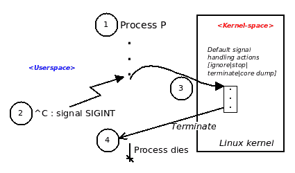
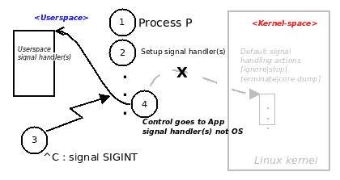
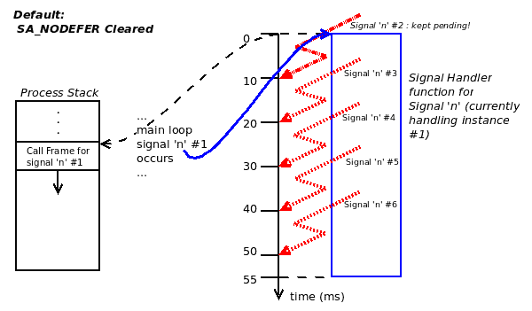
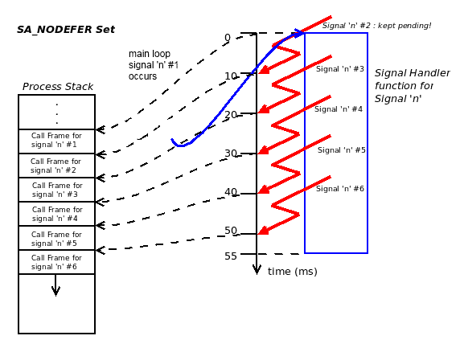

# 第十一章：信号-第一部分

信号对于 Linux 系统开发人员来说是一个至关重要的机制，需要理解和利用。我们在本书的两章中涵盖了这个相当大的主题，即本章和下一章。

在这一章中，读者将了解信号是什么，为什么它们对系统开发人员很有用，最重要的当然是开发人员如何处理和利用信号机制。

我们将在下一章中继续探讨这个问题。

在这一章中，读者将学习以下内容：

+   信号到底是什么。

+   为什么它们很有用。

+   可用的信号。

+   如何在应用程序中处理信号，这实际上涉及许多事情——阻塞或解除信号、编写安全处理程序、一劳永逸地摆脱讨厌的僵尸进程、处理信号量很高的应用程序等等。

# 为什么需要信号？

有时，系统程序员需要操作系统提供异步设施——某种方式让你知道某个事件或条件已经发生。信号在 Unix/Linux 操作系统上提供了这个特性。进程可以捕获或订阅信号；当这发生时，操作系统将异步通知进程，并且运行一个函数的代码作为响应：信号处理程序。

举个例子：

+   一个 CPU 密集型进程正在忙于进行科学或数学计算（为了便于理解，我们假设它正在生成素数）；回想一下（来自第三章，*资源限制*）CPU 使用率有一个上限，并且已经设置为特定值。如果超出了呢？进程将被默认杀死。我们能阻止这种情况发生吗？

+   开发人员想要执行一个常见的任务：设置一个定时器，并在 1.5 秒后让它到期。操作系统将如何通知进程定时器已经到期？

+   在一些 Sys V Unix 系统（通常在企业级服务器上运行），如果突然断电会发生什么？一个事件会广播给所有进程（那些对事件表示兴趣或订阅了事件的进程），通知它们相同的情况：它们可以刷新缓冲区并保存数据。

+   一个进程有一个无意的缺陷（一个错误）；它进行了无效的内存访问。内存子系统（技术上来说，是 MMU 和操作系统）决定必须将其杀死。它将如何被杀死？

+   Linux 的异步 IO（AIO）框架，以及许多其他类似的场景。

所有这些示例场景都由同一机制服务：信号。

# 简要介绍信号机制

信号可以定义为传递给目标进程的异步事件。信号可以由另一个进程或操作系统（内核）本身传递给目标进程。

在代码级别，信号只是一个整数值；更准确地说，它是位掩码中的一位。重要的是要理解，尽管信号可能看起来像是中断，但它并不是中断。中断是硬件特性；信号纯粹是软件机制。

好的，让我们尝试一个简单的练习：运行一个进程，将其放在一个无限循环中，然后通过键盘手动发送一个信号给它。在（`ch11/sig1.c`）中找到代码：

```
int main(void)
{
     unsigned long int i=1;
     while(1) {
         printf("Looping, iteration #%02ld ...\n", i++);
         (void)sleep(1);
     }
     exit (EXIT_SUCCESS);
}
```

为什么`sleep(1);`代码被强制转换为`(void)`？这是我们告诉编译器（可能是任何静态分析工具）我们不关心它的返回值的方式。事实上，我们应该关心；稍后会有更多内容。

它的工作是很明显的：让我们构建并运行它，在第三次循环迭代后，我们在键盘上按下*Ctrl* + *C*组合键。

```
$ ./sig1 
Looping, iteration #01 ...
Looping, iteration #02 ...
Looping, iteration #03 ...
^C
$ 
```

是的，如预期的那样，进程终止了。但这到底是如何发生的呢？

这是简要的答案：信号。更详细地说，这是发生的情况（尽管仍然保持简单）：当用户按下*Ctrl* + *C*键组合（在输出中显示为`^C`）时，内核的`tty`层代码处理此输入，将输入键组合处理成信号，并将其传递给 shell 上的前台进程。

但是，等一下。记住，信号只是一个整数值。那么，是哪个整数？哪个信号？*Ctrl* + *C*键组合映射到`SIGINT`信号，整数值为`2`，因此导致其传递给进程。（下一节开始解释不同的信号；现在，让我们不要太担心它）。

所以，好吧，`SIGINT`信号，值为`2`，已传递给我们的`sig1`进程。但是接下来呢？这里再次是一个关键点：每个信号都与一个在其传递时运行的函数相关联；这个函数称为**信号处理程序**。如果我们不改变它，将运行默认的信号函数。那么，这带来了一个问题：由于我们没有编写任何默认（或其他）信号处理代码，那么是谁提供了这个默认信号处理程序函数？简短的答案是：操作系统（内核）处理所有情况，即进程接收到应用程序没有安装任何处理程序的信号；换句话说，对于默认情况。

信号处理函数或底层内核代码执行的操作将决定信号到达目标进程时会发生什么。因此，现在我们可以更好地理解：`SIGINT`信号的默认信号处理程序（实际上是内核代码）执行的操作是终止进程，实际上导致接收进程死亡。

我们将其以以下图表的形式显示：



通过键盘传递信号，默认处理程序导致进程死亡

从这个图表中，我们可以看到以下步骤：

1.  进程**P**启动并运行其代码。

1.  用户按下`^C`，实际上导致`SIGINT`信号被发送到进程。

1.  由于我们没有设置任何信号处理程序，因此 OS 的默认信号处理操作将被调用。

1.  操作系统中的默认信号处理代码导致进程死亡。

FYI，对于默认情况，也就是所有应用程序开发人员没有安装特定信号处理例程的情况（我们将很快学习如何安装我们自己的信号处理程序），处理这些情况的操作系统代码会做什么？根据正在处理的信号，操作系统将执行以下五种可能的操作之一（有关详细信息，请参见以下表格）：

+   忽略信号

+   停止进程

+   继续（先前停止的）进程

+   终止进程

+   终止进程并发出核心转储

真正有趣和强大的是：程序员有能力改变-重新定向信号处理到他们自己的函数！实际上，我们可以使用某些 API 来捕获信号。一旦我们这样做，当信号发生时，控制将不会转到默认的信号处理（操作系统）代码，而是转到我们想要的函数。通过这种方式，程序员可以控制并利用强大的信号机制。

当然，这还有更多：细节确实隐藏在其中！继续阅读。

# 可用信号

Unix/Linux 操作系统总共提供了 64 个信号。它们大致分为两种类型：标准或 Unix 信号和实时信号。我们将发现，虽然它们共享共同的属性，但也有一些重要的区别；在这里，我们将调查 Unix（或标准）信号，稍后再调查后者。

除了键盘键组合（如*Ctrl* + *C*）之外，用户空间的通用通信接口是`kill(1)`实用程序（因此也是`kill(2)`系统调用）。

除了 kill，还有几个其他 API 可以传递信号；我们将在本章的后面部分详细介绍这一点。

使用`kill(1)`实用程序的`-l`或列表选项在平台上列出可用的信号：

```
$ kill -l
 1) SIGHUP 2) SIGINT 3) SIGQUIT 4) SIGILL 5) SIGTRAP
 6) SIGABRT 7) SIGBUS 8) SIGFPE 9) SIGKILL 10) SIGUSR1
11) SIGSEGV 12) SIGUSR2 13) SIGPIPE 14) SIGALRM 15) SIGTERM
16) SIGSTKFLT 17) SIGCHLD 18) SIGCONT 19) SIGSTOP 20) SIGTSTP
21) SIGTTIN 22) SIGTTOU 23) SIGURG 24) SIGXCPU 25) SIGXFSZ
26) SIGVTALRM 27) SIGPROF 28) SIGWINCH 29) SIGIO 30) SIGPWR
31) SIGSYS    34) SIGRTMIN 35) SIGRTMIN+1 36) SIGRTMIN+2 37) SIGRTMIN+3
38) SIGRTMIN+4 39) SIGRTMIN+5 40) SIGRTMIN+6 41) SIGRTMIN+7 42) SIGRTMIN+8
43) SIGRTMIN+9 44) SIGRTMIN+10 45) SIGRTMIN+11 46) SIGRTMIN+12 
47) SIGRTMIN+13 48) SIGRTMIN+14 49) SIGRTMIN+15 50) SIGRTMAX-14 
51) SIGRTMAX-13 52) SIGRTMAX-12  53) SIGRTMAX-11 54) SIGRTMAX-10 
55) SIGRTMAX-9 56) SIGRTMAX-8 57) SIGRTMAX-7 58) SIGRTMAX-6 59) SIGRTMAX-5 60) SIGRTMAX-4 61) SIGRTMAX-3 62) SIGRTMAX-2 63) SIGRTMAX-1 64) SIGRTMAX 
$ 
```

也许`kill(1)`这个名字是个误称：kill 实用程序只是向给定的进程（或作业）发送一个信号。因此（至少对于您的作者来说），`sendsig`这个名字可能是更好的选择。

一个常见问题：信号 32 和 33 的编号在哪里？

它们由 Linux Pthreads 实现（称为 NPTL）内部使用，因此不可用于应用程序开发人员。

# 标准或 Unix 信号

从 kill 的输出中可以看出，平台上支持的所有信号都显示出来；其中前 31 个（在典型的 Linux 系统上）被称为标准或 Unix 信号。与随后的实时信号不同，每个标准/Unix 信号都有一个非常具体的名称和目的。

（不用担心；我们将在下一章讨论实时信号，即 34 到 64 的数字）。

您很快将看到的表格，基本上是从`signal(7)`的 man 页面中复制的，总结了标准（Unix）信号，列顺序如下：信号的符号名称，整数值，传递给进程时采取的默认操作，以及描述信号的注释。

默认操作列有以下类型：信号处理程序的默认操作是：

+   **终止**：终止进程。

+   **终止和生成核心转储**：终止进程并生成核心转储。（核心转储实质上是进程的动态段，即数据和堆栈段，在传递（致命）信号时的快照）。当内核向进程发送致命信号时，会发生这种终止和核心转储操作。这意味着进程已经做了一些非法的事情（有 bug）；一个例外是`SIGQUIT`信号：当`SIGQUIT`传递给进程时，我们会得到一个核心转储。

+   **忽略**：忽略该信号。

+   **停止**：进程进入停止（冻结/暂停）状态（在`ps -l`输出中用`T`表示）。

+   **继续**：继续执行先前停止的进程。

参考标准或 Unix 信号表：

| **信号** | **整数值** | **默认操作** | **注释** |
| --- | --- | --- | --- |
| `SIGHUP` | `1` | 终止 | 在控制终端检测到挂机或控制进程死亡​ |
| `SIGINT` | `2` | 终止 | 从键盘中断：`**^**C` |
| `SIGQUIT` | `3` | 终止和生成核心转储 | 从键盘退出：`**^\**` |
| `SIGILL` | `4` | 终止和生成核心转储 | 非法指令 |
| `SIGABRT` | `6` | 终止和生成核心转储 | 来自 abort(3)的中止信号​ |
| `SIGFPE` | `8` | 终止和生成核心转储 | 浮点异常 |
| `SIGKILL` | `9` | 终止 | （强制）终止信号 |
| `SIGSEGV` | `11` | 终止和生成核心转储 | 无效的内存引用 |
| `SIGPIPE` | `13` | 终止 | 管道中断：向没有读取者的管道写入；参见 pipe(7) |
| `SIGALRM` | `14` | 终止 | 来自 alarm(2)的定时器信号 |
| `SIGTERM` | `15` | 终止 | 终止信号（软终止） |
| `SIGUSR1` | `30,10,16` | 终止 | 用户定义的信号 1 |
| `SIGUSR2` | `31,12,17` | 终止 | 用户定义的信号 2 |
| `SIGCHLD` | `20,17,18` | 忽略 | 子进程停止或终止 |
| `SIGCONT` | `19,18,25` | 继续 | 如果停止则继续 |
| `SIGSTOP` | `17,19,23` | 停止 | 停止进程 |
| `SIGTSTP` | `18,20,24` | 停止 | 在终端上停止输入：`^Z` |
| `SIGTTIN` | `21,21,26` | 停止 | 后台进程的终端输入 |
| `SIGTTOU` | `22,22,27` | 停止 | 后台进程的终端输出 |

有时，第二列，信号的整数值，有三个数字。嗯，就是这样：这些数字是与架构（即 CPU）相关的；中间列代表 x86 架构的值。

在代码中始终使用信号的符号名称（如`SIGSEGV`），包括脚本，而不是数字（如`11`）。您可以看到数字值随 CPU 而变化，这可能导致不可移植的错误代码！

如果系统管理员需要紧急终止进程怎么办？是的，很可能，在交互式 shell 中，时间非常宝贵，多出来的几秒钟可能会有所不同。在这种情况下，键入 kill `-9`比 kill `-SIGKILL`或者 kill `-KILL`更好。（前面的观点是关于编写源代码）。

将信号编号传递给 kill `-l`会导致它打印信号的符号名称（尽管是简写形式）。例如：

`$ kill -l 11`

`SEGV`

`$ `

前面的表格（实际上后面的表格也是如此）显示，除了两个例外，所有信号都有特殊用途。扫描注释列可以发现这一点。例外是`SIGUSR1`和`SIGUSR2`，这些是通用信号；它们的使用完全取决于应用程序设计者的想象力。

此外，手册页告诉我们，以下信号（在此表中显示）是较新的，并包括在`SUSv2`和`POSIX.1-2001`标准中：

| **信号** | **整数值** | **默认操作** | **注释** |
| --- | --- | --- | --- |
| `SIGBUS` | `10,7,10` | Term&Core | 总线错误（内存访问错误） |
| `SIGPOLL` |  | 终止 | 可轮询事件（Sys V）。SIGIO 的同义词 |
| `SIGPROF` | `27,27,29` | 终止 | 分析计时器已过期 |
| `SIGSYS` | `12,31,12` | Term&Core | 系统调用错误（SVr4）；另请参阅 seccomp(2) |
| `SIGTRAP` | `5` | Term&Core | 跟踪/断点陷阱 |
| `SIGURG` | `16,23,21` | 忽略 | 套接字上的紧急情况（4.2BSD） |
| `SIGVTALRM` | `26,26,28` | 终止 | 虚拟警报时钟（4.2BSD） |
| `SIGXCPU` | `24,24,30` | Term&Core | CPU 时间限制超出（4.2BSD）；参见 prlimit(2) |
| `SIGXFSZ` | `25,25,31` | Term&Core | 文件大小限制超出（4.2BSD）；参见 prlimit(2) |

较新的标准或 Unix 信号

同一手册页还进一步提到了一些剩余的（不太常见的）信号（`signal(7)`）。如果感兴趣，可以看一下。

重要的是要注意，所有提到的信号中，只有两个信号不能被捕获、忽略或阻塞：`SIGKILL`和`SIGSTOP`。这是因为操作系统必须保证一种方法来终止和/或停止进程。

# 处理信号

在本节中，我们将详细讨论应用程序开发人员如何以编程方式处理信号（当然是使用 C 代码）。

回顾*图 1*。您可以看到操作系统如何执行默认的信号处理，当未捕获的信号传递给进程时运行。这似乎很好，直到我们意识到，默认操作很常见的是简单地杀死（或终止）进程。如果应用程序要求我们做其他事情怎么办？或者，实际上，应用程序崩溃了，而不仅仅是突然死亡（可能留下重要文件和其他元数据处于不一致的状态）。也许我们可以通过执行一些必要的清理，刷新缓冲区，关闭打开的文件，记录状态/调试信息等，通知用户糟糕的情况（也许是一个漂亮的对话框），然后优雅而平静地让进程死去。

捕获或陷阱信号的能力是实现这些目标的关键。如前所述，重新定向控制流，使其不是默认的信号处理内核代码，而是我们自定义的信号处理代码在信号到达时执行。

那么，我们如何实现这一点呢？通过使用 API 来注册对信号的兴趣，从而处理信号。广义上说，有三种可用的 API 来捕获或陷阱信号：

+   `sigaction(2)`系统调用

+   `signal(2)`系统调用

+   `sigvec(3)`库 API

嗯，这三个 API 中，`sigvec`现在被认为是已弃用的。此外，除非工作真的很简单，您应该放弃`signal(2)`API，转而使用`sigaction`API。实际上，处理信号的强大方法是通过`sigaction(2)`系统调用；这是我们将深入讨论的方法。

# 使用 sigaction 系统调用来捕获信号

`sigaction(2)`系统调用是捕获或捕捉信号的正确方法；它功能强大，符合 POSIX，并且可以用来优化应用程序的信号处理。

在高层次上，`sigaction`系统调用用于为给定信号注册信号处理程序。如果信号的处理函数是`foo`，我们可以使用`sigaction`将其信号处理程序更改为`bar`。通常情况下，我们还可以指定更多内容，这对信号处理产生了强大的影响，我们很快就会讨论到所有这些。这是签名：

```
#include <signal.h>
int sigaction(int signum, const struct sigaction *act,
 struct sigaction *oldact);
```

`glibc`的特性测试宏要求（参见`feature_test_macros(7)`）：`sigaction()`: `_POSIX_C_SOURCE`

`siginfo_t`: `_POSIX_C_SOURCE >= 199309L`

`sigaction(2)`的 man 页面告诉我们（通过特性测试宏要求部分；稍后会有更多细节），使用`sigaction`需要定义`_POSIX_C_SOURCE`宏；这在现代 Linux 上几乎总是如此。此外，使用`siginfo_t`数据结构（稍后在本章中解释）需要您拥有`POSIX`版本`199309L`或更高版本。（格式为`YYYYMM`；因此，这是 1993 年 9 月的`POSIX`标准草案；同样，在任何相当现代的 Linux 平台上都是如此）。

# 侧边栏 - 特性测试宏

一个快速的离题：特性测试宏是`glibc`的一个特性；它允许开发人员在源代码中定义这些宏，从而在编译时指定确切的特性集。手册（man）页面总是指定（如有必要）要求存在的特性测试宏，以支持某个 API 或特性。

关于这些特性测试宏，在 Ubuntu（17.10）和 Fedora（27）Linux 发行版上，我们已经测试了本书的源代码，`_POSIX_C_SOURCE`的值为`200809L`。该宏在头文件`<features.h>`中定义，该头文件本身包含在头文件`<unistd.h>`中。

书中的 GitHub 源代码树中提供了一个简单的测试程序，用于打印一些特性测试宏：[`github.com/PacktPublishing/Hands-on-System-Programming-with-Linux/tree/master/misc`](https://github.com/PacktPublishing/Hands-on-System-Programming-with-Linux/tree/master/misc)。为什么不在您的 Linux 平台上试一试呢？

`glibc`文档中有关特性测试宏的更多信息：[`www.gnu.org/software/libc/manual/html_node/Feature-Test-Macros.html`](http://www.gnu.org/software/libc/manual/html_node/Feature-Test-Macros.html)。

# sigaction 结构

`sigaction(2)`系统调用有三个参数，其中第二个和第三个参数的数据类型相同。

第一个参数`int signum`是要捕获的信号。这立即揭示了一个重要的观点：信号是要逐个捕获的 - 您只能使用单个`sigaction`调用捕获一个信号。不要试图过于聪明，做一些诸如一起传递信号的位掩码（按位或）之类的事情；那是一个错误。当然，您可以多次调用`sigaction`或在循环中调用。

第二个和第三个参数的数据类型是指向一个名为`sigaction`的结构的指针。`sigaction`结构的定义如下（来自头文件`/usr/include/bits/sigaction.h`）：

```
/* Structure describing the action to be taken when a signal arrives. */
struct sigaction
  {
    /* Signal handler. */
#ifdef __USE_POSIX199309
    union
      {
        /* Used if SA_SIGINFO is not set. */
        __sighandler_t sa_handler;
        /* Used if SA_SIGINFO is set. */
        void (*sa_sigaction) (int, siginfo_t *, void *); 
      } 
    __sigaction_handler;
# define sa_handler __sigaction_handler.sa_handler
# define sa_sigaction __sigaction_handler.sa_sigaction
#else
    __sighandler_t sa_handler;
#endif

    /* Additional set of signals to be blocked. */
    __sigset_t sa_mask;

    /* Special flags. */
    int sa_flags;

    /* Restore handler. */
    void (*sa_restorer) (void);
  };
```

第一个成员，一个函数指针，指的是信号处理程序函数本身。在现代 Linux 发行版上，`__USE_POSIX199309`宏确实会被定义；因此，可以看到，信号处理程序值是两个元素的联合，这意味着在运行时，将准确使用其中一个。先前的评论清楚地表明：默认情况下，使用`sa_handler`原型函数；然而，如果传递了标志`SA_SIGINFO`（在第三个成员`sa_flags`中），那么将使用`sa_sigaction`样式的函数。我们将很快用示例代码来说明这一点。

C 库将`__sighandler_t`指定为：`typedef void (*__sighandler_t) (int);`

如前所述，它是一个指向函数的指针，将接收一个参数：一个整数值（是的，你猜对了：传递的信号）。

在深入了解数据结构之前，编写并尝试一个简单的 C 程序来处理一对信号，对于先前提到的`sigaction`结构的大多数成员使用默认值将是有益的。

`ch11/sig2.c`的`main()`函数的源代码：

```
int main(void)
{
 unsigned long int i = 1;
 struct sigaction act;

 /* Init sigaction to defaults via the memset,
  * setup 'siggy' as the signal handler function,
  * trap just the SIGINT and SIGQUIT signals.
  */
 memset(&act, 0, sizeof(act));
 act.sa_handler = siggy;
 if (sigaction(SIGINT, &act, 0) < 0)
     FATAL("sigaction on SIGINT failed");
 if (sigaction(SIGQUIT, &act, 0) < 0)
     FATAL("sigaction on SIGQUIT failed");

 while (1) {
     printf("Looping, iteration #%02ld ...\n", i++);
     (void)sleep(1);
 } [...]
```

我们故意将`sigaction`结构的所有成员都设置为零，以初始化它（在任何情况下初始化都是良好的编码实践！）。然后，我们将信号处理程序初始化为我们自己的信号处理函数`siggy`。

请注意，为了捕获两个信号，我们需要两个`sigaction(2)`系统调用。第二个参数，指向结构`sigaction`的指针，由程序员填充，被认为是信号的新设置。第三个参数再次是指向结构`sigaction`的指针；然而，它是一个值-结果类型：如果非空且已分配，内核将用信号的先前设置填充它。这是一个有用的特性：如果设计要求您执行一些信号处理的保存和恢复。在这里，作为一个简单的情况，我们只是将第三个参数设置为`NULL`，意味着我们对先前的信号状态不感兴趣。

然后我们进入与`sig1.c`相同的无限循环...我们简单的信号处理程序函数`siggy`如下所示：

```
static void siggy(int signum)
{
  const char *str1 = "*** siggy: handled SIGINT ***\n";
  const char *str2 = "*** siggy: handled SIGQUIT ***\n";

  switch (signum) {
  case SIGINT:
    if (write(STDOUT_FILENO, str1, strlen(str1)) < 0)
        WARN("write str1 failed!");
    return;
  case SIGQUIT:
    if (write(STDOUT_FILENO, str2, strlen(str2)) < 0)
        WARN("write str2 failed!");
    return;
  }
}
```

信号处理程序接收一个整数值作为参数：导致控制到达此处的信号。因此，我们可以对多个信号进行多路复用：设置一个公共信号处理程序，并执行一个简单的`switch-case`来处理每个特定的信号。

信号处理函数的返回类型当然是`void`。问问自己：它会返回到哪里？这是未知的。记住，信号可以异步到达；我们不知道处理程序何时会运行。

让我们试一试：

```
$ make sig2
gcc -Wall -c ../common.c -o common.o
gcc -Wall -c -o sig2.o sig2.c
gcc -Wall -o sig2 sig2.c common.o
$ ./sig2
Looping, iteration #01 ...
Looping, iteration #02 ...
Looping, iteration #03 ...
^C*** siggy: handled SIGINT ***
Looping, iteration #04 ...
Looping, iteration #05 ...
^\*** siggy: handled SIGQUIT ***
Looping, iteration #06 ...
Looping, iteration #07 ...
^C*** siggy: handled SIGINT ***
Looping, iteration #08 ...
Looping, iteration #09 ...
^\*** siggy: handled SIGQUIT ***
Looping, iteration #10 ...
Looping, iteration #11 ...
^Z
[1]+ Stopped ./sig2
$ kill %1
[1]+ Terminated ./sig2
$ 
```

您可以看到，这次，应用程序正在处理`SIGINT`（通过键盘`^C`）和`SIGQUIT`（通过键盘`**^\**`组合键）信号。

那么我们如何终止应用程序呢？好吧，一种方法是打开另一个终端窗口，并通过`kill`实用程序杀死应用程序。不过，现在，我们使用另一种方法：我们向进程发送`SIGTSTP`信号（通过键盘`**^Z**`组合键）将其置于停止状态；我们返回 shell。现在，我们只需通过`kill(1)`杀死它。(`[1]`是进程的作业号；您可以使用`jobs`命令查看会话中的所有当前作业)。

我们以以下形式的图表显示：



图 2：处理信号

显然，正如我们简单的`sig2`应用程序和*图 2*所示，一旦捕获到信号（通过`sigaction(2)`（或`signal`）系统调用），当它传递给进程时，控制现在重新定向到新的特定于应用程序的信号处理程序函数，而不是默认的操作系统信号处理代码。

在程序`sig2`中，一切看起来都很好，除了你，细心的读者，可能已经注意到一个谜题：在信号处理程序函数的代码中，为什么不只使用一个简单的`printf(3)`来发出消息。为什么要使用`write(2)`系统调用？实际上，这背后有一个非常好的原因。这还有更多内容即将呈现。

尽可能早地在应用程序初始化时捕获所有必需的信号。这是因为信号可以在任何时刻到达；我们越早准备好处理它们，就越好。

# 屏蔽信号

当一个进程正在运行时，如果它想要屏蔽（或者屏蔽）某些信号怎么办？通过 API 接口确实是可能的；事实上，`sigaction(2)`结构的第二个成员就是信号掩码，即在信号处理程序函数运行时要屏蔽的信号的掩码。掩码通常意味着信号的按位或运算：

```
...
/* Additional set of signals to be blocked. */
    __sigset_t sa_mask;
...
```

请注意前面的评论；它暗示着某个信号已经被屏蔽。是的，确实；假设一个进程通过`sigaction`系统调用捕获了一个信号`n`。在稍后的某个时间点，该信号 n 被传递给它；当我们的进程处理该信号时——也就是运行其信号处理程序代码时——该信号 n 被屏蔽，不会传递给进程。它被屏蔽多久？直到我们从信号处理程序返回。换句话说，操作系统自动屏蔽当前正在处理的信号。这通常正是我们想要的，并且对我们有利。

# 使用 sigprocmask API 进行信号屏蔽

如果我们想要在执行过程中屏蔽（或者屏蔽）一些其他信号。例如，在处理关键代码区域时？`sigprocmask(2)`系统调用就是为此设计的：`int sigprocmask(int how, const sigset_t *set, sigset_t *oldset);`

信号集本质上是所讨论信号的位掩码。set 是要屏蔽的新信号集，而`oldset`实际上是一个返回值（参数的值-结果类型），或者是信号掩码的先前（或当前）值。`how`参数决定了行为，并且可以取这些值：

+   `SIG_BLOCK`：另外，屏蔽（掩码）信号集 set 中指定的信号（以及已经被屏蔽的信号）

+   `SIG_UNBLOCK`：解除（取消屏蔽）信号集 set 中指定的信号

+   `SIG_SETMASK`：信号集 set 中指定的信号被屏蔽，覆盖先前的值

# 查询信号掩码

因此，我们了解到可以在`sigaction(2)`时（通过`sa_mask`成员）或通过`*s*igprocmask(2)`系统调用（如前所述）设置进程的信号掩码。但是在任意时间点上如何查询进程信号掩码的状态呢？

好吧，再次通过`sigprocmask(2)`系统调用。但是，逻辑上，这个 API 设置一个掩码，对吧？这就是诀窍：如果第一个参数设置为`NULL`，那么第二个参数就会被有效地忽略，而在第三个参数`oldset`中，当前的信号掩码值就会被填充，因此我们可以查询信号掩码而不改变它。

`ch11/query_mask`程序演示了这一点，代码是建立在我们之前的例子`sig2.c`之上。因此，我们不需要展示整个源代码；我们只展示相关的代码，在`main()`中：

```
[...]
/* Init sigaction:
 * setup 'my_handler' as the signal handler function,
 * trap just the SIGINT and SIGQUIT signals.
 */
 memset(&act, 0, sizeof(act));
 act.sa_handler = my_handler;
 /* This is interesting: we fill the signal mask, implying that
 * _all_ signals are masked (blocked) while the signal handler
 * runs! */
 sigfillset(&act.sa_mask);

 if (sigaction(SIGINT, &act, 0) < 0)
     FATAL("sigaction on SIGINT failed");
 if (sigaction(SIGQUIT, &act, 0) < 0)
     FATAL("sigaction on SIGQUIT failed");
[...]
```

正如你所看到的，这一次我们使用了`sigfillset(3)`（`POSIX`信号集操作或`sigsetops(3)`操作符中有用的一个）来用所有 1 填充信号掩码，这意味着，在信号处理程序代码运行时，所有信号都将被屏蔽。

这是信号处理程序代码的相关部分：

```
static void my_handler(int signum)
{
    const char *str1 = "*** my_handler: handled SIGINT ***\n";
    const char *str2 = "*** my_handler: handled SIGQUIT ***\n";

    show_blocked_signals();
    switch (signum) {
    [...]
```

啊！这里，智能在`show_blocked_signals`函数中；我们在我们的公共代码源文件`../common.c`中有这个函数。这是函数：

```
/*
 * Signaling: Prints (to stdout) all signal integer values that are
 * currently in the Blocked (masked) state.
 */
int show_blocked_signals(void)
{
     sigset_t oldset;
     int i, none=1;

     /* sigprocmask: 
      * int sigprocmask(int how, const sigset_t *set, sigset_t *oldset);
      * if 'set' is NULL, the 'how' is ignored, but the
      * 'oldset' sigmask value is populated; thus we can query the
      * signal mask without altering it.
      */
      sigemptyset(&oldset);
      if (sigprocmask(SIG_UNBLOCK, 0, &oldset) < 0)
          return -1;

      printf("\n[SigBlk: ");
      for (i=1; i<=64; i++) {
          if (sigismember(&oldset, i)) {
              none=0;
              printf("%d ", i);
            }
      }
      if (none)
          printf("-none-]\n");
      else
          printf("]\n");
      fflush(stdout);
      return 0;
}
```

关键在于：`sigprocmask(2)`与 NULL 第二个参数（要设置的掩码）一起使用；因此，正如前面所述，`how`参数被忽略，值-结果第三个参数`oldset`将保存当前进程的信号掩码。

我们可以再次使用`sigsetops:` `sigismember(3)`方便方法查询掩码中的每个信号位。现在剩下的就是迭代掩码中的每个位并打印信号编号，如果该位被设置，则忽略它。

这是一个测试运行的输出：

```
$ make query_mask 
gcc -Wall -c ../common.c -o common.o
gcc -Wall -c -o query_mask.o query_mask.c
gcc -Wall -o query_mask query_mask.c common.o
$ ./query_mask 
Looping, iteration #01 ...
Looping, iteration #02 ...
Looping, iteration #03 ...
^C
[SigBlk: 1 2 3 4 5 6 7 8 10 11 12 13 14 15 16 17 18 20 21 22 23 24 25 26 27 28 29 30 31 34 35 36 37 38 39 40 41 42 43 44 45 46 47 48 49 50 51 52 53 54 55 56 57 58 59 60 61 62 63 64 ]
*** my_handler: handled SIGINT ***
Looping, iteration #04 ...
Looping, iteration #05 ...
^\
[SigBlk: 1 2 3 4 5 6 7 8 10 11 12 13 14 15 16 17 18 20 21 22 23 24 25 26 27 28 29 30 31 34 35 36 37 38 39 40 41 42 43 44 45 46 47 48 49 50 51 52 53 54 55 56 57 58 59 60 61 62 63 64 ]
*** my_handler: handled SIGQUIT ***
Looping, iteration #06 ...
Looping, iteration #07 ...
^Z
[2]+ Stopped ./query_mask
$ kill %2
[2]+ Terminated ./query_mask
$ 
```

注意打印出的被阻塞的信号。嘿，你能发现缺失的信号吗？

`SIGKILL(#9)`和`SIGSTOP(#19)`不能被屏蔽；另外，信号 32 和 33 是内部保留并由`Pthreads`实现使用的。

# 侧边栏 - 操作系统内的信号处理 - 轮询而不是中断

在这里，我们不打算深入探讨 Linux 内核信号处理的内部细节；相反，我们想澄清之前提到的一个常见误解：处理信号根本不像处理硬件中断。信号不是中断，也不是故障或异常；所有这些——中断、陷阱、异常、故障——都是由计算机上的 PIC/MMU/CPU 硬件引发的。信号纯粹是软件功能。

向进程发送信号意味着在任务的任务结构（在内核内存中）中设置一些成员，即所谓的`TIF_SIGPENDING`位，以及任务的`sigpending`集中表示信号的特定位；这样，内核就知道是否有信号待传递给进程，以及是哪些信号。

事实是，在适当的时间点（定期发生），内核代码会检查是否有信号待传递，如果有，就会传递它，运行或消耗进程的信号处理程序（在用户空间上下文中）。因此，信号处理被认为更像是一种轮询机制，而不是中断机制。

# 可重入安全和信号传递

在信号处理期间，使用不安全的可重入（也称为异步信号不安全）函数时，存在一个重要的问题。

当然，要理解这个问题，你必须首先了解什么是可重入函数，以及随后什么是可重入安全或异步信号安全函数。

# 可重入函数

可重入函数是指在仍在运行的调用中可以重新进入的函数。比听起来简单；看看这段伪代码片段：

```
signal_handler(sig) 
{ 
    my_foo();
    < ... > 
}

my_foo()
{
    char mybuf[MAX];
    <...>
}

do_the_work_mate()
{
    my_foo();
    <...>
}
```

现在想象一下这个活动序列：

+   函数`my_foo()`由业务逻辑函数`do_the_work_mate()`调用；它在本地缓冲区`mybuf`上操作

+   在这个仍在运行时，一个信号被发送到这个进程

+   信号处理程序代码会抢占发生时正在执行的任何内容并运行

+   重新调用函数`my_foo()`

因此，我们看到了：函数`my_foo()`被重新进入。单独来说，这没问题；这里重要的问题是：它是安全的吗？

回想一下（从我们在第二章中的覆盖中），进程堆栈用于保存函数调用帧和任何局部变量。在这里，可重入函数`my_foo()`只使用一个局部变量。它被调用了两次；每次调用都会在进程堆栈上创建一个单独的调用帧。关键点：`my_foo()`的每次调用都在局部变量`mybuf`的副本上工作；因此，它是安全的。因此，它被记录为`可重入安全`。在信号处理上下文中，它被称为`异步信号安全`：在先前的调用仍在运行时从信号处理程序中调用该函数是安全的。

好的，让我们给之前的伪代码加点变化：将函数`my_foo()`的局部变量`mybuf`改为全局（或静态）变量。现在想想当它被重新进入时会发生什么；这次，不同的堆栈调用帧不能拯救我们。由于`mybuf`是全局的，只有一个副本存在，它将处于不一致状态，从第一个函数调用（由`do_the_work_mate()`）开始。当第二次调用`my_foo()`发生时，我们将在这个不一致的全局`mybuf`上工作，从而破坏它。因此，显然，这是不安全的。

# 异步信号安全函数

一般规则是，只使用局部变量的函数是可重入安全的；任何使用全局或静态数据的用法都会使它们变得不安全。这是一个关键点：你只能在信号处理程序中调用那些被记录为可重入安全或信号异步安全的函数。

`signal-safety(7)`手册页[`man7.org/linux/man-pages/man7/signal-safety.7.html`](http://man7.org/linux/man-pages/man7/signal-safety.7.html)提供了详细信息。

在 Ubuntu 上，这个名字的 man 手册（`signal-safety(7)`）只在最近的版本中安装；它在 Ubuntu 18.04 上可以使用。

其中，它发布了一个（按字母顺序排列的）函数列表，`POSIX.1`标准要求实现保证实现为异步信号安全的（参见 2017-03-13 日期的 man 页版本 4.12）

所以底线是：在信号处理程序中，你只能调用以下内容：

+   C 库函数或系统调用在信号安全（7）手册页中（确实查找一下）

+   在第三方库中，明确记录为异步信号安全的函数

+   你自己的库或其他明确编写为异步信号安全的函数

此外，不要忘记你的信号处理程序函数本身必须是可重入安全的。不要在其中访问应用程序的全局或静态变量。

# 在信号处理程序中保持安全的替代方法

如果我们必须在信号处理程序例程中访问一些全局状态呢？确实存在一些使其信号安全的替代方法：

+   在必须访问这些变量的时候，确保所有信号被阻塞（或屏蔽），一旦完成，恢复信号状态（取消屏蔽）。

+   在访问共享数据时进行某种形式的锁定。

+   在多进程应用程序中（我们在这里讨论的情况），（二进制）信号量可以用作锁定机制，以保护跨进程共享的数据。

+   在多线程应用程序中，使用适当的锁定机制（可能是互斥锁；当然，我们将在后面的章节中详细介绍）。

+   如果你的需求只是对全局整数进行操作（这是信号处理的常见情况！），使用特殊的数据类型（`sig_atomic_t`）。稍后再看。

现实是，第一种方法，在需要时阻塞信号，实际上很难在复杂项目中实现（尽管你当然可以通过将信号掩码设置为全 1 来安排在处理信号时屏蔽所有信号，如前一节所示，*查询信号掩码*）。

第二种方法，锁定，对于多进程和多线程应用程序来说是现实的，尽管对性能敏感。

在这里和现在，讨论信号时，我们将涵盖第三种方法。另一个原因是因为在信号处理程序中处理（查询和/或设置）整数是一个非常常见的情况。

在本书中我们展示的代码中，偶尔会在信号处理程序中使用异步信号不安全的函数（通常是`[f|s|v]printf(3)`系列中的一个）。我们强调这仅仅是为了演示目的而做的；请不要在生产代码中使用异步信号不安全的函数！

# 信号安全的原子整数

想象一个多进程应用程序。一个进程 A 必须完成一定量的工作（比如说它必须完成运行函数`foo()`），并让另一个进程 B 知道它已经这样做了（换句话说，我们希望这两个进程之间实现同步；也请参见下一个信息框）。

实现这一点的一个简单方法是：当进程 A 达到所需点时，让进程 A 发送一个信号（比如`SIGUSR1`）给进程 B。反过来，进程 B 捕获`SIGUSR1`，当它到达时，在它的信号处理程序中，它将全局缓冲区设置为适当的消息字符串，以让应用程序的其余部分知道我们已经到达了这一点。

在下面的表格中，将时间线纵向（*y*轴）向下可视化。

伪代码-错误的方式：

| **进程 A** | **进程 B** |
| --- | --- |
| 做工作 | 为`SIGUSR1`设置信号处理程序 |
| 对`foo()`进行处理 | `char gMsg[32];   // 全局` 做工作 |
| `foo()`完成；向进程`B`发送`SIGUSR1` |  |
|  | `signal_handler()`函数异步进入 |
|  | `strncpy(gMsg, "chkpointA", 32);` |
| [...] | [...] |

这看起来不错，只是请注意，对消息缓冲区`gMsg`的全局更新不能保证是原子的。完全有可能尝试这样做会导致竞争-一种我们无法确定全局变量的最终结果的情况。正是这种数据竞争是一类难以发现和解决的竞争性错误的理想滋生地。您必须通过使用适当的编程实践来避免它们。

解决方案：从使用全局缓冲区切换到使用数据类型为**`sig_atomic_t`**的全局整数变量，并且重要的是将其标记为`volatile`（以便编译器在其周围禁用优化）。

伪代码-正确的方式：

| **进程 A** | **进程 B** |
| --- | --- |
| 做工作 | 为`SIGUSR1`设置信号处理程序 |
| 对`foo()`进行处理 | **`volatile sig_atomic_t gFlag=0;`** 做工作 |
| `foo()`完成；向进程`B`发送`SIGUSR1` |  |
|  | `signal_handler()`函数异步进入 |
|  | **`gFlag = 1;`** |
| [...] | [...] |

这次它将正常工作，没有任何竞争。（建议读者将前一个程序的完整工作代码编写为练习）。

重要的是要意识到，使用`sig_atomic_t`使（整数）变量只能在异步信号中安全，而不是线程安全。（线程安全将在以后的第十四章中详细介绍，*使用 Pthreads 的多线程编程第 I 部分-基础知识*）。

真正的进程同步应该使用适用于该目的的 IPC 机制来执行。信号确实可以作为原始的 IPC 机制；根据您的项目，其他 IPC 机制（套接字，消息队列，共享内存，管道和信号量）可能更适合这样做。

根据卡内基梅隆大学软件工程研究所（CMU SEI）CERT C 编码标准：

SIG31-C：不要在信号处理程序中访问共享对象*（[`wiki.sei.cmu.edu/confluence/display/c/SIG31-C.+Do+not+access+shared+objects+in+signal+handlers`](https://wiki.sei.cmu.edu/confluence/display/c/SIG31-C.+Do+not+access+shared+objects+in+signal+handlers)）*

类型`sig_atomic_t`是可以在异步中断的情况下作为原子实体访问的对象的整数类型。

附加说明：

查看最后一个链接中提供的代码示例也是值得的。此外，在相同的上下文中，CMU SEI 的 CERT C 编码标准*，*关于执行信号处理的正确方式有以下几点需要注意：

+   `SIG30-C`。在信号处理程序中只调用异步安全函数。

+   `SIG31-C`：不要在信号处理程序中访问共享对象。

+   `SIG34-C`。不要在可中断的信号处理程序中调用`signal()`。

+   `SIG35-C`。不要从计算异常信号处理程序返回。

最后一个要点可能更好地由`POSIX.1`委员会来表达：

进程在从未由`kill(2)`，`sigqueue(3)`或`raise(2)`生成的`SIGBUS`，`SIGFPE`，`SIGILL`或`SIGSEGV`信号的信号捕获函数正常返回后的行为是未定义的。

换句话说，一旦您的进程从操作系统接收到任何先前提到的致命信号，它可以在信号处理程序中执行清理，但然后必须终止。（请允许我们开个玩笑：英雄呼喊“今天不是，死神！”在电影中是很好的，但当 SIGBUS，SIGFPE，SIGILL 或 SIGSEGV 来临时，是时候清理并优雅地死去了！）。事实上，我们将在下一章中详细探讨这一方面。

# 强大的 sigaction 标志

从前一节的`sigaction`结构中，回想一下`sigaction`结构的成员之一如下：

```
/* Special flags. */
    int sa_flags;
```

这些特殊标志非常强大。有了它们，开发人员可以精确指定信号语义，否则很难或不可能获得。零的默认值意味着没有特殊行为。

我们首先将在本表中列举`sa_flags`的可能值，然后继续使用它们：

| `sa_flag` | 它提供的行为或语义（来自`sigaction(2)`的 man 页面）。 |
| --- | --- |
| `SA_NOCLDSTOP` | 如果`signum`是`SIGCHLD`，则当子进程停止或停止的子进程继续时不生成`SIGCHLD`。 |
| `SA_NOCLDWAIT` | （Linux 2.6 及更高版本）如果`signum`是`SIGCHLD`，则当它们终止时不将子进程转换为僵尸。 |
| `SA_RESTART` | 通过使某些系统调用在信号中可重启，提供与 BSD 信号语义兼容的行为。 |
| `SA_RESETHAND` | 在进入信号处理程序时将信号动作恢复为默认值。 |
| `SA_NODEFER` | 不要阻止信号在其自己的信号处理程序中被接收。 |
| `SA_ONSTACK` | 在由`sigaltstack(2)`提供的备用信号堆栈上调用信号处理程序。如果备用堆栈不可用，则将使用默认（进程）堆栈。 |
| `SA_SIGINFO` | 信号处理程序需要三个参数，而不是一个。在这种情况下，应该设置`sa_sigaction`而不是`sa_handler`。 |

请记住，`sa_flags`是由操作系统解释为位掩码的整数值；将几个标志进行按位或运算以暗示它们的组合行为的做法确实很常见。

# 不邀请僵尸

让我们从标志`SA_NOCLDWAIT`开始。首先，一个快速的离题：

正如我们在第十章中学到的*进程创建*，一个进程可以 fork，导致一个创造的行为：一个新的子进程诞生了！从那一章开始，现在回想起我们的 Fork**规则＃7**：父进程必须等待（阻塞）每个子进程的终止（死亡），直接或间接地。

父进程可以通过`wait`系统调用 API 集等待（阻塞）子进程的终止。正如我们之前学到的那样，这是必不可少的：如果子进程死亡而父进程没有等待它，子进程就会成为僵尸状态——这是一个不希望出现的状态。最坏的情况下，它可能会严重阻塞系统资源。

然而，通过`wait`API(s)阻塞在子进程（或子进程）的死亡上会导致父进程变成同步；它会阻塞，因此，在某种意义上，它会击败多处理的整个目的，即并行化。我们不能在我们的子进程死亡时异步通知吗？这样，父进程可以继续执行处理，与其子进程并行运行。

啊！信号来拯救：每当其任何子进程终止或进入停止状态时，操作系统将向父进程传递`SIGCHLD`信号。

注意最后的细节：即使子进程停止（因此并非死亡），`SIGCHLD`也将被传递。如果我们不想要这样怎么办？换句话说，我们只希望在子进程死亡时向我们发送信号。这正是`SA_NOCLDSTOP`标志执行的操作：停止时不产生子进程死亡。因此，如果您不希望被子进程的停止所欺骗以为它们已经死亡，请使用此标志。（当通过`SIGCONT`继续停止的子进程时，也适用）。

# 没有僵尸！-经典方式

前面的讨论也应该让你意识到，嘿，我们现在有了一个整洁的异步方式来摆脱任何讨厌的僵尸：捕获`SIGCHLD`，并在其信号处理程序中发出`wait`调用（使用第九章中涵盖的任何等待 API，最好使用`WNOHANG`选项参数，这样我们进行非阻塞等待；因此，我们不会在任何活着的子进程上阻塞，只会成功清除任何僵尸。

这是清除僵尸的经典 Unix 方式：

```
static void child_dies(int signum)
{
    while((pid = wait3(0, WNOHANG, 0)) != -1);
}
```

在现代 Linux 上深入研究这里只会产生学术兴趣（在您的作者看来，现代 Linux 是指 2.6.0 及更高版本的 Linux 内核，顺便说一下，它于 2003 年 12 月 18 日发布）。

# 没有僵尸进程！- 现代的方式

所以，对于现代 Linux 来说，避免僵尸进程变得更加容易：只需使用`sigaction(2)`捕获`SIGCHLD`信号，并在信号标志位掩码中指定`SA_NOCLDWAIT`位。就是这样：僵尸进程的担忧永远消失了！在 Linux 平台上，`SIGCHLD`信号仍然会传递给父进程 - 您可以使用它来跟踪子进程，或者您可能想到的任何会计目的。

顺便说一下，`POSIX.1`标准还指定了另一种摆脱麻烦的僵尸进程的方法：只需忽略`SIGCHLD`信号（使用`SIG_IGN`）。好吧，您可以使用这种方法，但要注意，这样您将永远不会知道子进程确实死亡（或停止）。

所以，有用的东西：让我们把我们的新知识付诸实践：我们设置一个小型的多进程应用程序，它生成僵尸进程，但也以现代方式清除它们（`ch11/zombies_clear_linux26.c`）：

为了可读性，只显示了代码的相关部分；要查看和运行它，整个源代码在这里可用：[`github.com/PacktPublishing/Hands-on-System-Programming-with-Linux`](https://github.com/PacktPublishing/Hands-on-System-Programming-with-Linux)。

```
int main(int argc, char **argv)
{
  struct sigaction act;
  int opt=0;

  if (argc != 2)
      usage(argv[0]);

  opt = atoi(argv[1]);
  if (opt != 1 && opt != 2)
      usage(argv[0]);

  memset(&act, 0, sizeof(act));
  if (opt == 1) {
        act.sa_handler = child_dies;
        /* 2.6 Linux: prevent zombie on termination of child(ren)! */
        act.sa_flags = SA_NOCLDWAIT;
  }
  if (opt == 2)
        act.sa_handler = SIG_IGN;
  act.sa_flags |= SA_RESTART | SA_NOCLDSTOP; /* no SIGCHLD on stop of child(ren) */

  if (sigaction(SIGCHLD, &act, 0) == -1)
      FATAL("sigaction failed");

  printf("parent: %d\n", getpid());
  switch (fork()) {
  case -1:
      FATAL("fork failed");
  case 0: // Child
      printf("child: %d\n", getpid());
      DELAY_LOOP('c', 25);
      exit(0);
  default: // Parent
      while (1)
          pause();
  }
  exit(0);
}
```

（暂时忽略代码中的`SA_RESTART`标志；我们很快会解释）。这是`SIGCHLD`的信号处理程序：

```
#define DEBUG
//#undef DEBUG
/* SIGCHLD handler */
static void child_dies(int signum)
{
#ifdef DEBUG
   printf("\n*** Child dies! ***\n");
#endif
}
```

请注意，当处于调试模式时，我们只在信号处理程序中发出`printf(3)`（因为它是异步信号不安全的）。

让我们试一下：

```
$ ./zombies_clear_linux26 
Usage: ./zombies_clear_linux26 {option-to-prevent-zombies}
 1 : (2.6 Linux) using the SA_NOCLDWAIT flag with sigaction(2)
 2 : just ignore the signal SIGCHLD
$ 
```

好的，首先我们尝试使用选项`1`；也就是使用`SA_NOCLDWAIT`标志：

```
$ ./zombies_clear_linux26 1 &
[1] 10239
parent: 10239
child: 10241
c $ cccccccccccccccccccccccc
*** Child dies! ***

$ ps 
 PID TTY TIME CMD
 9490 pts/1 00:00:00 bash
10239 pts/1 00:00:00 zombies_clear_l
10249 pts/1 00:00:00 ps
$ 
```

重要的是，使用`ps(1)`检查后发现没有僵尸进程。

现在使用选项`2`运行它：

```
$ ./zombies_clear_linux26 2
parent: 10354
child: 10355
ccccccccccccccccccccccccc
^C
$ 
```

请注意，我们在上一次运行中得到的`*** Child dies! ***`消息没有出现，证明我们从未进入`SIGCHLD`的信号处理程序。当然不会；我们忽略了信号。虽然这确实可以防止僵尸进程，但也会阻止我们知道子进程已经死亡。

# SA_NOCLDSTOP 标志

关于`SIGCHLD`信号，有一个重要的要意识到的地方：默认行为是，无论进程是死亡还是停止，或者一个已停止的子进程继续执行（通常是通过向其发送`SIGCONT`信号），内核都会向其父进程发送`SIGCHLD`信号。

也许这很有用。父进程被通知所有这些事件 - 子进程的死亡、停止或继续。另一方面，也许我们不希望被欺骗，认为我们的子进程已经死亡，而实际上它只是被停止（或继续）。

对于这种情况，使用`SA_NOCLDSTOP`标志；它的字面意思是子进程停止（或恢复）时不发送`SIGCHLD`。现在只有在子进程死亡时才会收到`SIGCHLD`。

# 中断的系统调用以及如何使用 SA_RESTART 修复它们

传统（较旧的）Unix 操作系统在处理阻塞系统调用时存在一个问题。

阻塞 API

当发出 API 时，调用进程（或线程）处于睡眠状态时，API 被称为阻塞。为什么？这是因为底层的操作系统或设备驱动程序知道调用者需要等待的事件尚未发生；因此，它必须等待。一旦事件（或条件）发生，操作系统或驱动程序唤醒进程；进程现在继续执行其代码路径。

阻塞 API 的例子很常见：`read`、`write`、`select`、`wait`（及其变体）、`accept`等等。

花点时间来想象这种情况：

+   一个进程捕获一个信号（比如`SIGCHLD`）。

+   稍后，进程发出一个阻塞系统调用（比如`accept(2)`系统调用）。

+   当它处于睡眠状态时，信号被传递给它。

以下伪代码说明了相同的情况：

```
[...]
sigaction(SIGCHLD, &sigact, 0);
[...]
sd = accept( <...> );
[...]
```

顺便说一下，`accept(2)`系统调用是网络服务器进程在客户端连接到它时阻塞（等待）的方式。

现在，信号被传递后应该发生什么？正确的行为是：进程应该唤醒，处理信号（运行其信号处理程序的代码），然后再次进入睡眠状态，继续阻塞在它正在等待的事件上。

在旧的 Unix 系统（作者在旧的 SunOS 4.x 上遇到过这种情况），信号被传递，信号处理程序代码运行，但在此之后，阻塞系统调用失败，返回-1。`errno`变量设置为**`EINTR`**，这意味着系统调用被中断。

当然，这被认为是一个 bug。可怜的 Unix 应用程序开发人员不得不求助于一些临时修复措施，通常是在循环中包装每个系统调用（在这个例子中是 foo），如下所示：

```
while ((foo() == -1) && (errno == EINTR));
```

这不容易维护。

`POSIX`委员会随后修复了这个问题，要求实现提供一个信号标志`SA_RESTART`。当使用此标志时，内核将自动重新启动任何由信号中断的阻塞系统调用。

因此，当注册信号处理程序时，只需在`sigaction(2)`中使用有用的`SA_RESTART`标志，这个问题就会消失。

一般来说，在编程`sigaction(2)`时使用`SA_RESTART`标志是一个好主意。不过，并不总是；第十三章，*定时器*，向我们展示了一些情况下我们故意远离这个标志。

# 一次性的 SA_RESETHAND 标志

`SA_RESETHAND`信号标志有点奇怪。在旧的 Unix 平台上，存在一个 bug，即捕获信号（通过`signal(2)`函数），信号被分发，然后进程处理信号。但是，一旦进入信号处理程序，内核立即将信号动作重置为原始的操作系统默认处理代码。因此，第二次信号到达时，默认处理程序代码会运行，通常会导致进程被终止。 （再次，Unix 开发人员有时不得不求助于一些糟糕的竞争性代码来尝试解决这个问题）。

因此，信号实际上只会被传递一次。在今天的现代 Linux 系统中，信号处理程序保持原样；默认情况下不会被重置为原始处理程序。当然，如果你想要这种一次性的行为，可以使用`SA_RESETHAND`标志（你可能会觉得这并不是非常流行）。`SA_ONESHOT`也是同一个标志的一个较旧的不推荐使用的名称。

# 推迟还是不推迟？使用 SA_NODEFER

让我们回顾一下信号的默认处理方式：

+   一个进程捕获了一个信号 n。

+   信号 n 被传递给进程（可以是另一个进程或操作系统）。

+   信号处理程序被调度；也就是说，它是作为对信号的响应而运行的。

+   信号 n 现在被自动屏蔽；也就是说，被阻止传递给进程。

+   信号处理已完成。

+   信号 n 现在被自动解除屏蔽，也就是说，可以传递给进程。

这是合理的：在处理特定信号时，该信号被屏蔽。这是默认行为。

但是，如果你正在编写一个嵌入式实时应用程序，其中信号传递意味着发生了一些真实世界的事件，并且应用程序必须立即（尽快）做出响应。在这种情况下，我们可能希望禁用信号的自动屏蔽，从而允许信号处理程序在到达时被重新进入。通过使用`SA_NODEFER`信号标志可以实现这一点。

英语单词 defer 的意思是延迟或推迟；推迟到以后。

这是默认行为，当指定了该标志时可以更改。

# 信号被屏蔽时的行为

为了更好地理解这一点，让我们举一个虚构的例子：假设我们捕获了一个信号 n，并且我们的信号处理程序的执行时间为 55 毫秒。此外，想象一种情况，通过一个定时器（至少一段时间），信号 n 以 10 毫秒的间隔不断地传递给进程。现在让我们来看看在默认情况下会发生什么，以及在使用`SA_NODEFER`标志的情况下会发生什么。

# 情况 1：默认：SA_NODEFER 位清除

在这里，我们*不*使用`SA_NODEFER`信号标志。因此，当信号 n 的第一个实例到达时，我们的进程会跳转到信号处理代码（需要 55 毫秒才能完成）。然而，第二个信号将在信号处理代码进行 10 毫秒时到达。但是，等一下，它被自动屏蔽了！因此，我们不会处理它。实际上，简单的计算将显示，在 55 毫秒的信号处理时间内，最多会有五个信号 n 的实例到达我们的进程：



图 3：默认行为：SA_NODEFER 位清除：没有队列，一个信号实例待处理，对堆栈没有实质影响

那么，到底会发生什么？这五个信号会在处理程序完成后排队等待传递吗？啊！这是一个重要的观点：标准的或 Unix 信号*不会排队*。然而，内核确实知道*一个或多个信号正在等待传递给进程*；因此，一旦信号处理完成，将传递*一个*待处理信号实例（并且随后清除待处理信号掩码）。

因此，在我们的例子中，即使有五个信号待处理，信号处理程序也只会被调用一次。换句话说，没有信号被排队，但是一个信号实例被处理了。这就是默认情况下信号的工作方式。

*图 3*显示了这种情况：虚线信号箭头代表进入信号处理程序后传递的信号；因此，只保留一个实例待处理。注意进程堆栈：当调用信号处理程序时，信号 n 的信号实例＃1（显然）在堆栈上得到一个调用帧，没有更多。

问题：如果情况如图所示，但另一个信号，信号`m`，被传递了呢？

回答：如果信号 m 已被捕获并且当前未被屏蔽，它将立即被处理；换句话说，它将*抢占*一切，并且其处理程序将运行。当然，操作系统保存了上下文，以便稍后可以恢复被抢占的内容。这使我们得出以下结论：

+   信号是*对等的*；它们没有与之相关的优先级。

+   对于标准信号，如果传递了相同整数值的多个实例，并且该信号当前被屏蔽（阻塞），那么只保留一个实例待处理；不会排队。

# 情况 2：SA_NODEFER 位设置

现在让我们重新考虑完全相同的情况，只是这次我们使用了`SA_NODEFER`信号标志。因此，当信号 n 的第一个实例到达时，我们的进程会跳转到信号处理代码（需要 55 毫秒才能完成）。与以前一样，第二个信号将在信号处理代码进行 10 毫秒时到达，但是等一下，这次它没有被屏蔽；它没有被推迟。因此，我们将立即重新进入信号处理程序函数。然后，20 毫秒后（信号 n 实例＃1 首次进入信号处理程序后），第三个信号实例到达。同样，我们将重新进入信号处理程序函数。是的，这将发生五次。

图 4 向我们展示了这种情况：



图 4：设置了 SA_NODEFER 位：没有队列；所有信号实例在传递时处理，堆栈密集

这看起来不错，但请意识到以下情况：

+   在这种情况下，信号处理程序代码本身必须编写为*可重入安全*（不使用全局或静态变量；仅在其中调用*异步信号安全*函数），因为在这种情况下它将不断地被重新进入。

+   堆栈使用：每次重新进入信号处理程序时，都要意识到已经为进程堆栈分配（推送）了一个额外的调用帧。

第二点值得思考：如果有这么多信号到达（在处理先前的调用时），我们会不会过载，甚至溢出堆栈？嗯，灾难。堆栈溢出是一个严重的错误；实际上几乎不可能进行异常处理（我们无法有信心捕获或陷入堆栈溢出问题）。

接下来是一个有趣的代码示例`ch11/defer_or_not.c`，用于演示这两种情况：

为了便于阅读，只显示了代码的关键部分；要查看完整的源代码，请构建并运行它；整个树可在书的 GitHub 存储库中克隆：[`github.com/PacktPublishing/Hands-on-System-Programming-with-Linux`](https://github.com/PacktPublishing/Hands-on-System-Programming-with-Linux)

```
static volatile sig_atomic_t s=0, t=0;
[...]
int main(int argc, char **argv)
{
 int flags=0;
 struct sigaction act;
[...]
 flags = SA_RESTART;
 if (atoi(argv[1]) == 2) {
     flags |= SA_NODEFER;
     printf("Running with the SA_NODEFER signal flag Set\n");
 } else {
     printf("Running with the SA_NODEFER signal flag Cleared [default]\n");
 }

 memset(&act, 0, sizeof(act));
 act.sa_handler = sighdlr;
 act.sa_flags = flags;
 if (sigaction(SIGUSR1, &act, 0) == -1)
     FATAL("sigaction failed\n");
 fprintf(stderr, "\nProcess awaiting signals ...\n");

 while (1)
     (void)pause();
 exit(EXIT_SUCCESS);
}
```

以下是信号处理程序函数：

```
/* 
 * Strictly speaking, should not use fprintf here as it's not
 * async-signal safe; indeed, it sometimes does not work well!
 */
static void sighdlr(int signum)
{
  int saved;
  fprintf(stderr, "\nsighdlr: signal %d,", signum);
  switch (signum) {
  case SIGUSR1:
 s ++; t ++;
    if (s >= MAX)
          s = 1;
    saved = s;
    fprintf(stderr, " s=%d ; total=%d; stack %p :", s, t, stack());
 DELAY_LOOP(saved+48, 5); /* +48 to get the equivalent ASCII value */
 fprintf(stderr, "*");
    break;
  default:;
  }
}
```

我们故意让信号处理代码花费相当长的时间（通过我们使用的`DELAY_LOOP`宏），以便我们可以模拟在处理信号时多次传递相同信号的情况。在现实世界的应用中，始终努力使您的信号处理尽可能简短。

内联汇编`stack()`函数是获取寄存器值的有趣方法。阅读以下评论以了解其工作原理：

```
/* 
 * stack(): return the current value of the stack pointer register.
 * The trick/hack: on x86 CPU's, the ABI tells us that the return
 * value is always in the accumulator (EAX/RAX); so we just initialize
 * it to the stack pointer (using inline assembly)!
 */
void *stack(void)
{
 if (__WORDSIZE == 32) {
     __asm__("movl %esp, %eax");
 } else if (__WORDSIZE == 64) {
     __asm__("movq %rsp, %rax");
 }
/* Accumulator holds the return value */
}
```

处理器 ABI - 应用程序二进制接口 - 文档是严肃系统开发人员需要熟悉的重要领域；在 GitHub 存储库的*进一步阅读*部分中查看更多信息。

为了正确测试此应用程序，我们编写了一个名为`bombard_sig.sh`的小型 shell 脚本，它会向给定进程（相同）信号轰炸（这里我们使用 SIGUSR1）。用户应该传递进程 PID 和要发送的信号实例数作为参数；如果第二个参数给定为`-1`，则脚本将不断轰炸该进程。以下是脚本的关键代码：

```
SIG=SIGUSR1
[...]
NUMSIGS=$2
n=1
if [ ${NUMSIGS} -eq -1 ] ; then
  echo "Sending signal ${SIG} continually to process ${1} ..."
  while [ true ] ; do
    kill -${SIG} $1
    sleep 10e-03    # 10 ms
  done
else
  echo "Sending ${NUMSIGS} instances of signal ${SIG} to process ${1} ..."
  while [ ${n} -le ${NUMSIGS} ] ; do
    kill -${SIG} $1
    sleep 10e-03    # 10 ms
    let n=n+1
  done
fi
```

# 运行案例 1 - 清除 SA_NODEFER 位[默认]

接下来，我们执行测试用例，其中`SA_NODEFER`标志被清除；这是默认行为：

```
$ ./defer_or_not 
Usage: ./defer_or_not {option}
option=1 : don't use (clear) SA_NODEFER flag (default sigaction style)
option=2 : use (set) SA_NODEFER flag (will process signal immd)
$ ./defer_or_not 1
PID 3016: running with the SA_NODEFER signal flag Cleared [default]
Process awaiting signals ...
```

现在，在另一个终端窗口中，我们运行 shell 脚本：

```
$ ./bombard_sig.sh $(pgrep defer_or_not) 12
```

`pgrep`找出`defer_or_not`进程的 PID：有用！只需确保以下内容：

(a) 您发送信号的进程只有一个实例，或者`pgrep`返回多个 PID 并且脚本失败。

(b) 传递给`pgrep`的名称为 15 个字符或更少。

脚本一运行，向进程发送（12）个信号，就会出现以下输出：

```
​sighdlr: signal 10, s=1 ; total=1; stack 0x7ffc8d021a70 :11111*
sighdlr: signal 10, s=2 ; total=2; stack 0x7ffc8d021a70 :22222*
```

研究前面的输出，我们注意到如下内容：

+   `SIGUSR1`被捕获并且其信号处理程序运行；它发出一系列数字（在每个信号实例上递增）。

+   为了正确地执行此操作，我们使用了一对`volatile sig_atomic_t`全局变量（一个用于在`DELAY_LOOP`宏中打印的值，另一个用于跟踪传递给进程的信号总数）。

+   数字末尾的星号`*`意味着，当您看到它时，信号处理程序已经执行完成。

+   尽管已传递了 12 个`SIGUSR1`信号实例，但在剩余的 11 个信号到达时，进程正在处理第一个信号实例；因此，只有一个信号保持挂起，并在处理程序完成后处理。当然，在不同的系统上，您可能会看到处理多个信号实例。

+   最后，注意我们在每次信号处理程序调用时打印堆栈指针值；当然，这是用户空间虚拟地址（回想我们在第二章中的讨论，*虚拟内存*）；更重要的是，它是相同的，这意味着相同的堆栈帧被重用于信号处理程序函数（这经常发生）。

# 运行案例 2 - 设置 SA_NODEFER 位

接下来，我们执行测试用例，其中设置了`SA_NODEFER`标志（首先确保你已经杀死了`defer_or_not`进程的任何旧实例）：

```
$ ./defer_or_not 2 PID 3215: running with the SA_NODEFER signal flag Set
Process awaiting signals ...
```

现在，在另一个终端窗口中，我们运行 shell 脚本：

```
$ ./bombard_sig.sh $(pgrep defer_or_not) 12
```

脚本运行后，向进程发送（12）个信号，输出如下：

```
sighdlr: signal 10, s=1 ; total=1; stack 0x7ffe9e17a0b0 :
sighdlr: signal 10, s=2 ; total=2; stack 0x7ffe9e1799b0 :2
sighdlr: signal 10, s=3 ; total=3; stack 0x7ffe9e1792b0 :3
sighdlr: signal 10, s=4 ; total=4; stack 0x7ffe9e178bb0 :4
sighdlr: signal 10, s=5 ; total=5; stack 0x7ffe9e1784b0 :5
sighdlr: signal 10, s=6 ; total=6; stack 0x7ffe9e177db0 :6
sighdlr: signal 10, s=7 ; total=7; stack 0x7ffe9e1776b0 :7
sighdlr: signal 10, s=8 ; total=8; stack 0x7ffe9e176fb0 :8
sighdlr: signal 10, s=9 ; total=9; stack 0x7ffe9e1768b0 :9
sighdlr: signal 10, s=1 ; total=10; stack 0x7ffe9e1761b0 :1
sighdlr: signal 10, s=2 ; total=11; stack 0x7ffe9e175ab0 :22222*1111*9999*8888*7777*6666*5555*4444*3333*2222*11111*
sighdlr: signal 10, s=3 ; total=12; stack 0x7ffe9e17adb0 :33333*
```

这一次，请注意以下事项：

+   `SIGUSR1`被捕获并且它的信号处理程序运行；它发出一系列数字（每个信号实例递增）。

+   为了正确地做到这一点，我们使用一个`volatile sig_atomic_t`全局变量（一个用于在`DELAY_LOOP`中打印的值，一个用于跟踪传递给进程的信号总数）。

+   数字末尾的星号`*`表示，当你看到它时，信号处理程序已经执行完成；请注意，这一次，*直到很晚才出现。

+   连续传递了 12 个`SIGUSR1`信号实例：这一次，每个实例都会抢占前一个实例（在进程堆栈上设置一个新的调用帧；请注意独特的堆栈指针地址）。

+   请注意，在所有信号实例处理完毕后，控制被恢复到原始上下文；我们确实可以看到堆栈展开。

+   最后，仔细观察堆栈指针的值；它们是逐渐减少的。当然，这是因为在`x86[_64]` CPU 上（大多数现代 CPU 都是如此），堆栈是向下增长的。

自己试试这个程序。它很有趣而且功能强大，但是请记住，这是以非常大的堆栈为代价的！

它（在堆栈内存使用方面）有多昂贵？我们实际上可以计算每个堆栈（调用）帧的大小；取任意两个不同的实例，从较小的中减去较大的。例如，让我们看看前面的情况`s=6`和`s=5`：`s=5: 0x7ffe9e1784b0` `s=6: 0x7ffe9e177db0`

因此，调用帧`大小 = 0x7ffe9e1784b0 - 0x7ffe9e177db0 = 0x700 = 1792`字节。

在这种特定的应用用例中，每个信号处理调用帧占用了高达 1792 字节的内存。

现在，让我们考虑一个最坏的情况：在嵌入式实时应用中，如果我们在上一个实例运行时非常快地接收到，比如说，5000 个信号（当然设置了`SA_NODEFER`标志）：我们将在进程堆栈上创建 5000 个额外的调用帧，这将花费大约 5000 x 1,792 = 8,960,000 = ~ 8.5 MB！

为什么不实际测试一下这种情况呢？（以实证为价值 - 尝试事物而不是仅仅假设它们，是至关重要的。参见第十九章，*故障排除和最佳实践*）。我们可以这样做：

```
$ ./defer_or_not 2
PID 7815: running with the SA_NODEFER signal flag Set
Process awaiting signals ...
```

在另一个终端窗口中，运行`bombard_sig.sh`脚本，要求它生成 5000 个信号实例。参考以下命令：

```
$ ./bombard_sig.sh $(pgrep defer_or_not) 5000
Sending 5000 instances of signal SIGUSR1 to process 7815 ...
```

这是第一个终端窗口中的输出：

```
<...>
sighdlr: signal 10, s=1 ; total=1; stack 0x7ffe519b3130 :1
sighdlr: signal 10, s=2 ; total=2; stack 0x7ffe519b2a30 :2
sighdlr: signal 10, s=3 ; total=3; stack 0x7ffe519b2330 :3
sighdlr: signal 10, s=4 ; total=4; stack 0x7ffe519b1c30 :4
sighdlr: signal 10, s=5 ; total=5; stack 0x7ffe519b1530 :5
sighdlr: signal 10, s=6 ; total=6; stack 0x7ffe519b0e30 :6
sighdlr: signal 10, s=7 ; total=7; stack 0x7ffe519b0730 :7
sighdlr: signal 10, s=8 ; total=8; stack 0x7ffe519b0030 :8
sighdlr: signal 10, s=9 ; total=9; stack 0x7ffe519af930 :9
sighdlr: signal 10, s=1 ; total=10; stack 0x7ffe519af230 :1
sighdlr: signal 10, s=2 ; total=11; stack 0x7ffe519aeb30 :2

*--snip--*

sighdlr: signal 10, s=8 ; total=2933; stack 0x7ffe513a2d30 :8
sighdlr: signal 10, s=9 ; total=2934; stack 0x7ffe513a2630 :9
sighdlr: signal 10, s=1 ; total=2935; stack 0x7ffe513a1f30 :1
sighdlr: signal 10, s=2 ; total=2936; stack 0x7ffe513a1830 :2
sighdlr: signal 10, s=3 ; total=2937; stack 0x7ffe513a1130 :Segmentation fault
$ 
```

当它耗尽堆栈空间时，它当然会崩溃。（在不同的系统上，结果可能会有所不同；如果你没有经历过堆栈溢出导致的崩溃，尝试增加脚本发送的信号数量并观察...）。

正如我们在第三章中学到的，*资源限制*，典型的进程堆栈资源限制为 8 MB；因此，我们真的有可能溢出堆栈，这将导致致命的突然崩溃。所以，请小心！如果你打算使用`SA_NODEFER`标志，请费点功夫在大负载下对你的应用进行压力测试，看看是否使用了比安全更多的堆栈。

# 使用备用信号堆栈

注意我们之前的测试用例，向设置了`SA_NODEFER`的`defer_or_not`应用程序发送了 5,000 个`SIGUSR1`信号，导致它崩溃并出现段错误（通常缩写为 segfault）。当进程进行无效的内存引用时，操作系统向进程发送了`SIGSEGV`（段错误）信号；换句话说，这是与内存访问相关的错误。捕获`SIGSEGV`可能非常有价值；我们可以获得关于应用程序崩溃的原因和方式的信息（实际上，我们将在下一章中做到这一点）。

然而，仔细想一想：在最后一个测试用例中（发送 5,000 个信号...），进程崩溃的原因是它的栈溢出。因此，操作系统发送了`SIGSEGV`信号；我们希望捕获这个信号并处理它。但是栈上没有空间，那么信号处理程序本身如何被调用？这是一个问题。

有一个有趣的解决方案：我们可以为信号处理分配（虚拟）内存空间，并设置一个单独的备用栈仅用于信号处理。如何做到？通过`sigaltstack(2)`系统调用。它用于这种情况：你需要处理`SIGSEGV`，但是你的栈空间不够了。想想我们之前的实时高容量信号处理应用：也许我们可以重新设计它，为单独的信号栈分配更多的空间，这样在实践中就可以工作了。

# 使用备用信号栈处理高容量信号的实现

这是一个精确的尝试：`ch11/altstack.c`的代码和运行时测试。此外，我们还添加了一个新功能（对于之前的版本：`defer_or_not`程序）：发送进程`SIGUSR2`信号将使其打印出第一个和最近的堆栈指针地址。它还将计算并显示增量——实际上是应用程序到目前为止使用的堆栈内存量。

从`ch11/defer_or_not.c`中的更改：

+   我们也捕获了信号。

+   `SIGUSR2`：显示第一个和最近的堆栈指针地址以及它们之间的差值。

+   `SIGSEGV`：这在现实世界的应用中很重要。捕获`segfault`允许我们在进程崩溃时（这里，可能是由于栈溢出）接管控制，并且也许显示（或在实际应用中，写入日志）相关信息，执行清理，然后调用`abort(3)`退出。要意识到，毕竟，我们必须退出：一旦这个信号从操作系统到达，进程就处于一个未定义的状态。（请注意，有关处理`SIGSEGV`的更多细节将在下一章中介绍）。

+   为了避免输出中的噪音过多，我们用一个静默版本的`DELAY_LOOP`宏替换它。

为了可读性，只显示了代码的关键部分；要查看完整的源代码，构建并运行它，整个树都可以从 GitHub 克隆：[`github.com/PacktPublishing/Hands-on-System-Programming-with-Linux`](https://github.com/PacktPublishing/Hands-on-System-Programming-with-Linux)。

在`ch11/altstack.c:main()`中：

```
<...>
altstacksz = atoi(argv[1])*1024;
setup_altsigstack(altstacksz);
<...>
```

`setup_altsigstack()`函数的代码如下：

```
static void setup_altsigstack(size_t stack_sz)
{
     stack_t ss;
     printf("Alt signal stack size = %zu\n", stack_sz);
     ss.ss_sp = malloc(stack_sz);
     if (!ss.ss_sp)
         FATAL("malloc(%zu) for alt sig stack failed\n", stack_sz);
     ss.ss_size = stack_sz;
     ss.ss_flags = 0;
     if (sigaltstack(&ss, NULL) == -1)
         FATAL("sigaltstack for size %zu failed!\n", stack_sz);
}
```

信号处理代码如下：

```
static volatile sig_atomic_t s=0, t=0;
static volatile unsigned long stk_start=0, stk=0;

static void sighdlr(int signum)
{
     if (t == 0)
         stk_start = (unsigned long)stack();
     switch (signum) {
     case SIGUSR1:
         stk = (unsigned long)stack();
         s ++; t ++;
         if (s >= MAX)
         s = 1;
         fprintf(stderr, " s=%d ; total=%d; stack %p\n", s, t, stack());
    /* Spend some time inside the signal handler ... */
         DELAY_LOOP_SILENT(5);
         break;
 case SIGUSR2:
         fprintf(stderr, "*** signal %d:: stack@: t0=%lx last=%lx :               delta=%ld ***\n", signum, stk_start, stk, (stk_start-stk));
         break;
 case SIGSEGV:
         fprintf(stderr, "*** signal %d:: stack@: t0=%lx last=%lx :     
          delta=%ld ***\n", signum, stk_start, stk, (stk_start-stk));
         abort();
     }
}
```

让我们进行一些测试，并考虑以下情况运行它们。

# 情况 1 - 非常小（100KB）的备用信号栈

我们故意为备用信号栈分配了非常少的空间——只有 100 千字节。不用说，它很快就溢出并且出现段错误；我们的`SIGSEGV`处理程序运行，打印出一些统计信息：

```
$ ./altstack 100
Alt signal stack size = 102400
Running: signal SIGUSR1 flags: SA_NODEFER | SA_ONSTACK | SA_RESTART
Process awaiting signals ...
```

在另一个终端窗口中，运行 shell 脚本：

```
$ ./bombard_sig.sh $(pgrep altstack) 120
Sending 120 instances of signal SIGUSR1 to process 12811 ...
```

现在，在原始窗口中的输出：

```
<...>
 s=1 ; total=1; stack 0xa20ff0
 s=2 ; total=2; stack 0xa208f0
 s=3 ; total=3; stack 0xa201f0

*--snip--*

 s=1 ; total=49; stack 0xa0bff0
 s=2 ; total=50; stack 0xa0b8f0
 s=3 ; total=51; stack 0xa0b1f0
*** signal 11:: stack@: t0=a20ff0 last=a0aaf0 : delta=91392 ***
Aborted
$ 
```

可以看到，根据我们的度量标准，备用信号栈的总使用量为 91,392 字节，接近 100KB，在溢出时。

shell 脚本以预期的方式终止：

```
<...>
./bombard_sig.sh: line 30: kill: (12811) - No such process
bombard_sig.sh: kill failed, loop count=53
$
```

# 情况 2：一个大（16MB）备用信号栈

这一次，我们故意为备用信号栈分配了大量空间——16 兆字节。现在它可以处理几千个连续的信号。但是，当然，在某个时候它也会溢出：

```
$ ./altstack 16384
Alt signal stack size = 16777216
Running: signal SIGUSR1 flags: SA_NODEFER | SA_ONSTACK | SA_RESTART
Process awaiting signals ...
```

在另一个终端窗口中运行 shell 脚本：

```
$ ./bombard_sig.sh $(pgrep altstack) 12000
Sending 12000 instances of signal SIGUSR1 to process 13325 ...
```

现在原始窗口中的输出：

```
<...>
 s=1 ; total=1; stack 0x7fd7339239b0
 s=2 ; total=2; stack 0x7fd7339232b0
 s=3 ; total=3; stack 0x7fd733922bb0

*--snip--*

 s=2 ; total=9354; stack 0x7fd732927ab0
 s=3 ; total=9355; stack 0x7fd7329273b0
*** signal 11:: stack@: t0=7fd7339239b0 last=7fd732926cb0 : delta=16764160 ***
Aborted
$ 
```

shell 脚本以预期的方式终止：

```
./bombard_sig.sh: line 30: kill: (13325) - No such process
bombard_sig.sh: kill failed, loop count=9357
$ 
```

这一次，在堆栈耗尽之前，它成功处理了大约九千个信号。备用信号堆栈的总使用量为 16,764,160 字节，或接近 16 MB，在溢出时。

# 处理高容量信号的不同方法

总之，如果您遇到一个场景，其中大量相同类型的多个信号（以及其他信号）以快速的速度传递给进程，我们使用通常的方法就有丢失（或丢弃）信号的风险。正如我们所看到的，我们可以以几种方式成功处理所有信号，每种方式都有其自己的处理高容量信号的方法 - 优缺点如下表所示：

| **方法** | **优点** | **缺点/限制** |
| --- | --- | --- |
| 在调用`sigaction(2)`之前使用`sigfillset(3)`来确保在处理信号时，所有其他信号都被阻塞。 | 简单直接的方法。 | 可能导致处理和/或丢弃信号出现显著（不可接受的）延迟。 |
| 设置`SA_NODEFER`信号标志并在信号到达时处理所有信号。 | 简单直接的方法。 | 在负载下，堆栈使用量大，存在堆栈溢出的危险。 |
| 使用备用信号堆栈，设置`SA_NODEFER`信号标志，并在信号到达时处理所有信号。 | 可以根据需要指定备用堆栈大小。 | 设置更多工作；必须在负载下进行仔细测试以确定要使用的（最大）堆栈大小。 |
| 使用实时信号（在下一章中介绍）。 | 操作系统会自动排队待处理的信号，堆栈使用低，可以对信号进行优先级排序。 | 系统范围内对可以排队的最大数量有限制（可以作为 root 进行调整）。 |

# 总结

在本章中，读者首先介绍了 Linux 操作系统上的信号概念，信号的作用，以及如何在应用程序中有效处理信号的详细内容。

当然，还有更多内容，下一章将继续讨论这一重要内容。到那里见。
