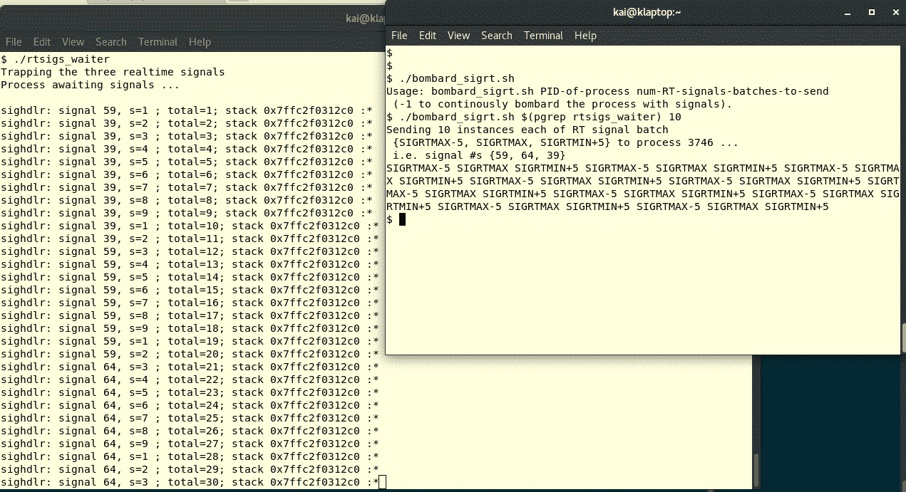
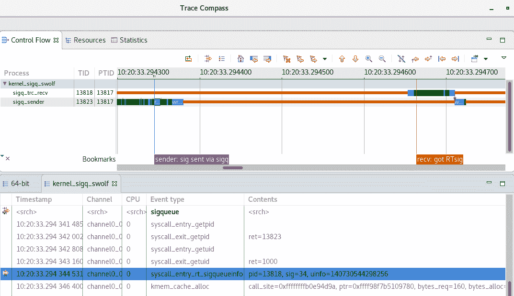

# 第十二章：信号处理 - 第 II 部分

如前一章所述，信号是 Linux 系统开发人员理解和利用的关键机制。前一章涵盖了几个方面：介绍，为什么信号对系统开发人员有用，以及最重要的是，开发人员如何处理和利用信号机制。

本章将继续探讨这一问题。在这里，我们将深入研究使用信号处理进程崩溃的内部细节，如何识别和避免处理信号时的常见问题，处理实时信号，发送信号，以及最后，执行信号处理的替代方法。

在本章中，读者将学到以下内容：

+   优雅地处理进程崩溃，并在那时收集有价值的诊断信息

+   处理与信号相关的常见陷阱——errno 竞争，正确的睡眠方式（是的，你没看错！）

+   处理强大的实时信号

+   向其他进程发送信号，并通过信号执行 IPC

+   替代信号处理技术

# 优雅地处理进程崩溃

应用程序中导致运行时崩溃的错误？天啊，这怎么可能？

不幸的是，对于经验丰富的软件老手来说，这并不是一个大惊喜。错误存在；它们有时可以很好地隐藏多年；有一天，它们会出现，然后*砰！*进程崩溃了。

在这里，我们的意图不是讨论调试技术或工具（也许我们可以把这个留到另一本书中吧？）；相反，关键是：如果我们的应用程序进程崩溃了，我们能做些什么？当然可以：在上一章中，我们已经详细学习了如何捕获信号。为什么不设计我们的应用程序，使我们捕获典型的致命信号——SIGBUS、SIGFPE、SIGILL 和 SIGSEGV，并在它们的信号处理程序中执行有用的任务，比如：

+   执行关键应用程序清理——例如，释放内存区域，刷新和关闭打开的文件等

+   将相关详细信息写入日志文件（导致崩溃的信号，信号的来源，原因，CPU 寄存器值等）

+   通知最终用户，嘿，太糟糕了，我们崩溃了

+   请允许我们收集崩溃详细信息，我们下次会做得更好，我们保证！

这不仅为我们提供了有价值的信息，可以帮助您调试崩溃的根本原因，而且还可以使应用程序优雅地退出。

# 使用 SA_SIGINFO 详细信息

让我们回顾一下我们在上一章中看到的`sigaction`结构的第一个成员，*信号处理 - 第 I 部分*，*sigaction 结构*部分；它是一个函数指针，它指定了信号处理程序：

```
struct sigaction
  {
    /* Signal handler. */
#ifdef __USE_POSIX199309
    union
      {
        /* Used if SA_SIGINFO is not set. */
 __sighandler_t sa_handler;
 /* Used if SA_SIGINFO is set. */
 void (*sa_sigaction) (int, siginfo_t *, void *); 
      } 
    __sigaction_handler;
# define sa_handler __sigaction_handler.sa_handler
# define sa_sigaction __sigaction_handler.sa_sigaction
#else
    __sighandler_t sa_handler;
#endif
 *--snip--* };
```

前面突出显示的代码突出显示了，由于它在一个联合中，信号处理程序可以是以下之一：

+   `sa_handler`：当清除`SA_SIGINFO`标志时

+   `sa_sigaction`：当设置了`SA_SIGINFO`标志时

到目前为止，我们已经使用了`sa_handler`风格的信号处理程序原型：

`void (*sa_handler)(int);`

它只接收一个参数：发生的信号的整数值。

如果您设置了**`SA_SIGINFO`**标志（当然，在发出`sigaction(2)`系统调用时），信号处理程序函数原型现在变成了这样：`void (*sa_sigaction)(int, siginfo_t *, void *);`

参数如下：

+   发生的信号的整数值

+   一个指向`siginfo_t`类型的结构的指针（显然是一个 typedef）

+   一个仅供内部使用的（未记录的）指针称为**ucontext**

第二个参数是关键所在！

# siginfo_t 结构

当您使用`SA_SIGINFO`信号标志并发生受困信号时，内核会填充一个数据结构：`siginfo_t`结构。

下面显示了`siginfo_t`结构定义（稍微简化；在前几个成员周围有一些`#if`包装，我们在这里不需要担心）（在 Ubuntu 的头文件`/usr/include/x86_64-linux-gnu/bits/types/siginfo_t.h`中，Fedora 的头文件为`/usr/include/bits/types/siginfo_t.h`）：

```
typedef struct {
    int si_signo; /* Signal number. */
    int si_code;  
    int si_errno; /* If non-zero, an errno value associated with
           this signal, as defined in <errno.h>. */

    union
    {
         int _pad[__SI_PAD_SIZE];
        /* kill(). */
         struct
         {
             __pid_t si_pid; /* Sending process ID. */
             __uid_t si_uid; /* Real user ID of sending process. */
         } _kill;

        /* POSIX.1b timers. */
         struct
         {
             int si_tid; /* Timer ID. */
             int si_overrun; /* Overrun count. */
             __sigval_t si_sigval; /* Signal value. */
         } _timer;

        /* POSIX.1b signals. */
         struct
         {
             __pid_t si_pid; /* Sending process ID. */
             __uid_t si_uid; /* Real user ID of sending process. */
             __sigval_t si_sigval; /* Signal value. */
         } _rt;

        /* SIGCHLD. */
         struct
         {
             __pid_t si_pid; /* Which child. */
             __uid_t si_uid; /* Real user ID of sending process. */
             int si_status; /* Exit value or signal. */
             __SI_CLOCK_T si_utime;
             __SI_CLOCK_T si_stime;
         } _sigchld;

        /* SIGILL, SIGFPE, SIGSEGV, SIGBUS. */
         struct
         {
           void *si_addr; /* Faulting insn/memory ref. */
           __SI_SIGFAULT_ADDL
           short int si_addr_lsb; /* Valid LSB of the reported address. */
           union
           {
              /* used when si_code=SEGV_BNDERR */
              struct
              {
                 void *_lower;
                 void *_upper;
              } _addr_bnd;
              /* used when si_code=SEGV_PKUERR */
              __uint32_t _pkey;
           } _bounds;
         } _sigfault;

        /* SIGPOLL. */
        struct
        {
             long int si_band; /* Band event for SIGPOLL. */
             int si_fd;
         } _sigpoll;

        /* SIGSYS. */
#if __SI_HAVE_SIGSYS
         struct
         {
             void *_call_addr; /* Calling user insn. */
             int _syscall; /* Triggering system call number. */
             unsigned int _arch; /* AUDIT_ARCH_* of syscall. */
         } _sigsys;
#endif
    } _sifields;
} siginfo_t ;
```

前三个成员是整数：

+   `si_signo` : 信号编号 - 传递给进程的信号

+   `si_code` : 信号来源；一个枚举；典型值如下：

`SI_QUEUE` : 由`sigqueue(3)`发送

`SI_USER` : 由`kill(2)`发送

`SI_KERNEL` : 由内核发送

`SI_SIGIO` : 由排队的 SIGIO 发送

`SI_ASYNCIO` : 由 AIO 完成发送

`SI_MESGQ` : 由实时消息队列状态更改发送

`SI_TIMER` : 由定时器到期发送

+   `si_errno` : （如果非零）errnovalue

这里真正有趣的部分是：结构的第四个成员是七个结构的`union`（`_sifields`）。我们知道`union`意味着在运行时将实例化任何一个成员：它将是七个结构中的一个，具体取决于接收到哪个信号！

看一下之前显示的`siginfo_t`结构中的`union`；`union`中的注释非常清楚地指出了哪些信号将导致在运行时实例化哪个数据结构。

例如，我们在`union`中看到，当接收到`SIGCHLD`信号时，将填充此结构（也就是说，当子进程死亡、停止或继续时）：

```
 /* SIGCHLD. */
 struct
 {
     __pid_t si_pid; /* Which child. */
     __uid_t si_uid; /* Real user ID of sending process. */
     int si_status; /* Exit value or signal. */
     __SI_CLOCK_T si_utime;
     __SI_CLOCK_T si_stime;
 } _sigchld;
```

信息是关于子进程的；因此，我们接收到了进程的 PID 和真实 UID（除非使用了`SA_NOCLDWAIT`标志，当然）。此外，我们接收到整数位掩码`si_status`告诉我们子进程究竟是如何死亡的（等等）。还有一些审计信息，`si_utime`和`si_stime`，子进程在用户空间和内核空间中所花费的时间。

回想一下我们在第十章中的详细讨论，*进程创建*，*等待 API - 详细信息*部分*，*我们可以通过（任何）`wait`API 获取子进程终止状态信息。好吧，在这里，我们可以看到，更简单：使用`SA_SIGINFO`标志，捕获`SIGCHLD`信号，并且在处理程序函数中，只需从`union`中查找相关值！

`sigaction(2)`的手册详细描述了`siginfo_t`结构的成员，提供了详细信息。务必仔细阅读。

# 在进程崩溃时获取系统级细节

当进程通过`SIGSEGV`死亡时，可以从内核中获取大量信息：内存错误或缺陷，这是一个常见情况，正如我们在第四章中讨论的那样，*动态内存分配*，第五章，*Linux 内存问题*和第六章，*内存问题的调试工具*。（本节也适用于致命信号`SIGBUS`，`SIGILL`和`SIGFPE`。顺便说一句，`SIGFPE`不仅在除以零错误时发生，而且在任何与算术相关的异常中都会发生）。

在`sigaction(2)`的手册中揭示了以下信息：

```
...
The following values can be placed in si_code for a SIGSEGV signal:

SEGV_MAPERR
    Address not mapped to object.
SEGV_ACCERR
    Invalid permissions for mapped object.
SEGV_BNDERR (since Linux 3.19)
    Failed address bound checks.
SEGV_PKUERR (since Linux 4.6)
    Access was denied by memory protection keys. See pkeys(7). The  
    protection key which applied to this access is available via si_pkey.
...
```

`SEGV_MAPERR`表示进程试图访问的地址（读取、写入或执行）无效；要么没有可用于它的**页表项**（**PTE**）条目，要么它拒绝映射到任何有效地址。

`SEGV_ACCERR`很容易理解：尝试访问（读取、写入或执行）无法执行，因为缺少权限（例如，尝试写入只读内存页）。

奇怪的是，`SEGV_BNDERR`和`SEGV_PKUERR`宏无法编译；我们不会在这里尝试使用它们。

glibc 库提供了辅助例程`psignal(3)`和`psiginfo(3)`；传递一个信息字符串，它们会打印出来，然后是实际发生的信号以及有关信号传递和故障地址的信息（分别从 siginfo_t 结构中查找）。我们在示例代码中使用`psiginfo(3)`如下。

# 捕获并提取崩溃信息

接下来，我们将看到一个测试程序`ch12/handle_segv.c`，其中包含故意的错误，以帮助我们理解可能的用例。所有这些都将导致 OS 生成`SIGSEGV`信号。应用程序开发人员如何处理这个信号很重要：我们演示了如何使用它来收集重要的细节，例如发生崩溃的内存位置的地址以及那时所有寄存器的值。这些细节通常提供有用的线索，可以解释内存错误的根本原因。

为了帮助理解我们如何构建这个程序，可以不带任何参数运行它：

```
$ ./handle_segv 
Usage: ./handle_segv u|k r|w
u => user mode
k => kernel mode
 r => read attempt
 w => write attempt
$ 
```

可以看到，我们可以执行四种类型的无效内存访问：实际上，有四种错误情况：

+   无效用户[u]模式读[r]

+   无效用户[u]模式写[w]

+   内核无效[k]模式读[r]

+   无效内核[k]模式写[w]

我们使用的一些 typedef 和宏如下：

```
typedef unsigned int u32;
typedef long unsigned int u64;

#define ADDR_FMT "%lx"
#if __x86_64__ /* 64-bit; __x86_64__ works for gcc */
 #define ADDR_TYPE u64
 static u64 invalid_uaddr = 0xdeadfaceL;
 static u64 invalid_kaddr = 0xffff0b9ffacedeadL;
#else
 #define ADDR_TYPE u32
 static u32 invalid_uaddr = 0xfacedeadL;
 static u32 invalid_kaddr = 0xdeadfaceL;
#endif
```

`main`函数如下所示：

```
int main(int argc, char **argv)
{
 struct sigaction act;
 if (argc != 3) {
     usage(argv[0]);
     exit(1);
 }

 memset(&act, 0, sizeof(act));
 act.sa_sigaction = myfault;
 act.sa_flags = SA_RESTART | SA_SIGINFO;
 sigemptyset(&act.sa_mask);
 if (sigaction(SIGSEGV, &act, 0) == -1)
     FATAL("sigaction SIGSEGV failed\n");

if ((tolower(argv[1][0]) == 'u') && tolower(argv[2][0] == 'r')) {
   ADDR_TYPE *uptr = (ADDR_TYPE *) invalid_uaddr;
   printf("Attempting to read contents of arbitrary usermode va uptr = 0x" 
             ADDR_FMT ":\n", (ADDR_TYPE) uptr);
   printf("*uptr = 0x" ADDR_FMT "\n", *uptr); // just reading

 } else if ((tolower(argv[1][0]) == 'u') && tolower(argv[2][0] == 'w')) {
    ADDR_TYPE *uptr = (ADDR_TYPE *) & main;
    printf
    ("Attempting to write into arbitrary usermode va uptr (&main actually) = 0x" ADDR_FMT ":\n", (ADDR_TYPE) uptr);
    *uptr = 0x2A; // writing 
 } else if ((tolower(argv[1][0]) == 'k') && tolower(argv[2][0] == 'r')) {
    ADDR_TYPE *kptr = (ADDR_TYPE *) invalid_kaddr;
    printf
 ("Attempting to read contents of arbitrary kernel va kptr = 0x" ADDR_FMT ":\n", (ADDR_TYPE) kptr);
    printf("*kptr = 0x" ADDR_FMT "\n", *kptr); // just reading

 } else if ((tolower(argv[1][0]) == 'k') && tolower(argv[2][0] == 'w')) {
    ADDR_TYPE *kptr = (ADDR_TYPE *) invalid_kaddr;
    printf
 ("Attempting to write into arbitrary kernel va kptr = 0x" ADDR_FMT ":\n",
      (ADDR_TYPE) kptr);
    *kptr = 0x2A; // writing
 } else
     usage(argv[0]);
 exit(0);
}
```

va = 虚拟地址。

这是关键部分：SIGSEGV 的信号处理程序：

```
static void myfault(int signum, siginfo_t * si, void *ucontext)
{
  fprintf(stderr,
    "%s:\n------------------- FATAL signal ---------------------------\n",
    APPNAME);
    fprintf(stderr," %s: received signal %d. errno=%d\n"
 " Cause/Origin: (si_code=%d): ",
         __func__, signum, si->si_errno, si->si_code);

 switch (si->si_code) {
     /* Possible values si_code can have for SIGSEGV */
 case SEGV_MAPERR:
     fprintf(stderr,"SEGV_MAPERR: address not mapped to object\n");
     break;
 case SEGV_ACCERR:
     fprintf(stderr,"SEGV_ACCERR: invalid permissions for mapped object\n");
     break;
 /* SEGV_BNDERR and SEGV_PKUERR result in compile failure? */

 /* Other possibilities for si_code; here just to show them... */
 case SI_USER:
     fprintf(stderr,"user\n");
     break;
 case SI_KERNEL:
     fprintf(stderr,"kernel\n");
     break;
 *--snip--*

 default:
     fprintf(stderr,"-none-\n");
 }
<...>

    /* 
     * Placeholders for real-world apps:
     * crashed_write_to_log();
     * crashed_perform_cleanup();
     * crashed_inform_enduser();
     *
     * Now have the kernel generate the core dump by:
     *  Reset the SIGSEGV to (kernel) default, and,
     *  Re-raise it!
     */
    signal(SIGSEGV, SIG_DFL);
    raise(SIGSEGV);
}
```

这里有很多要观察的地方：

+   我们打印出信号编号和原始值

+   我们通过`switch-case`解释信号的原始值

+   特别是对于 SIGSEGV，SEGV_MAPERR 和 SEGV_ACCERR

接下来是有趣的部分：以下代码打印出故障指令或地址！不仅如此，我们设计了一种方法，通过它我们可以通过我们的`dump_regs`函数打印出大部分 CPU 寄存器。正如前面提到的，我们还使用辅助例程`psiginfo(3)`如下：

```
fprintf(stderr," Faulting instr or address = 0x" ADDR_FMT "\n",
         (ADDR_TYPE) si->si_addr);
fprintf(stderr, "--- Register Dump [x86_64] ---\n");
dump_regs(ucontext); fprintf(stderr,
     "------------------------------------------------------------\n");
psiginfo(si, "psiginfo helper");
fprintf(stderr,
     "------------------------------------------------------------\n");
```

然后，我们只保留了一些虚拟存根，用于处理这种致命信号在真实世界应用程序中可能需要的功能（在这里，我们实际上没有编写任何代码，因为这当然是非常特定于应用程序的）：

```
/* 
 * Placeholders for real-world apps:
 * crashed_write_to_log();
 * crashed_perform_cleanup();
 * crashed_inform_enduser();
 */
```

最后，调用`abort(3)`使进程终止（因为它现在处于未定义状态，无法继续）是一种结束的方式。然而，请思考一下：如果我们现在`abort()`，进程将在内核有机会生成核心转储的情况下死亡。（如前所述，核心转储实质上是进程在崩溃时的动态内存段的快照；对于开发人员来说，它非常有用，可以用于调试和确定崩溃的根本原因）。因此，让内核生成核心转储确实是有用的。我们如何安排这个呢？这其实非常简单：我们需要做以下几点：

+   将`SIGSEGV`信号的处理程序重置为（内核）默认值

+   在进程上重新引发信号

这段代码片段实现了这一点：

```
[...]
 * Now have the kernel generate the core dump by:
 * Reset the SIGSEGV to glibc default, and,
 * Re-raise it!
 */
 signal(SIGSEGV, SIG_DFL);
 raise(SIGSEGV);
```

由于这是一个简单的情况，我们只需使用更简单的`signal(2)` API 将信号的操作恢复为默认值。然后，我们再次使用库 API `raise(3)` 来在调用进程上引发给定的信号。（出于易读性的考虑，错误检查代码已被省略。）

# 寄存器转储

如前所述，`dump_regs`函数打印出 CPU 寄存器的值；以下是关于此的一些需要注意的事项：

+   这是非常特定于 CPU 的（下面显示的示例情况仅适用于 x86_64 CPU）。

+   为了实际访问 CPU 寄存器，我们利用信号处理程序函数的未记录的第三个参数（注意：当与`SA_SIGINFO`一起使用时），即所谓的用户上下文指针。它是可能解释的（正如我们在这里展示的），但是，当然，由于它在 glibc 系统调用（或其他）接口中没有正式可见，您不能依赖这个功能。谨慎使用（并进行大量测试）。

说到这里，让我们来看看代码：

```
/* arch - x86[_64] - specific! */
static inline void dump_regs(void *ucontext)
{
#define FMT "%016llx"
ucontext_t *uctx = (ucontext_t *)ucontext;

 fprintf(stderr,
 " RAX = 0x" FMT " RBX = 0x" FMT " RCX = 0x" FMT "\n"
 " RDX = 0x" FMT " RSI = 0x" FMT " RDI = 0x" FMT "\n"
 " RBP = 0x" FMT " R8 = 0x" FMT  " R9  = 0x" FMT "\n"

 " R10 = 0x" FMT " R11 = 0x" FMT " R12 = 0x" FMT "\n"
 " R13 = 0x" FMT " R14 = 0x" FMT " R15 = 0x" FMT "\n"
 " RSP = 0x" FMT "\n"

 "\n RIP = 0x" FMT " EFLAGS = 0x" FMT "\n"
 " TRAP# = %02lld ERROR = %02lld\n"
 /* CR[0,1,3,4] unavailable */
 " CR2 = 0x" FMT "\n"
 , uctx->uc_mcontext.gregs[REG_RAX]
 , uctx->uc_mcontext.gregs[REG_RBX]
 , uctx->uc_mcontext.gregs[REG_RCX]
 , uctx->uc_mcontext.gregs[REG_RDX]
 , uctx->uc_mcontext.gregs[REG_RSI]
 , uctx->uc_mcontext.gregs[REG_RDI]
 , uctx->uc_mcontext.gregs[REG_RBP]
 , uctx->uc_mcontext.gregs[REG_R8]
 , uctx->uc_mcontext.gregs[REG_R9]
 , uctx->uc_mcontext.gregs[REG_R10]
 , uctx->uc_mcontext.gregs[REG_R11]
 , uctx->uc_mcontext.gregs[REG_R12]
 , uctx->uc_mcontext.gregs[REG_R13]
 , uctx->uc_mcontext.gregs[REG_R14]
 , uctx->uc_mcontext.gregs[REG_R15]
 , uctx->uc_mcontext.gregs[REG_RSP]
 , uctx->uc_mcontext.gregs[REG_RIP]
 , uctx->uc_mcontext.gregs[REG_EFL]
 , uctx->uc_mcontext.gregs[REG_TRAPNO]
 , uctx->uc_mcontext.gregs[REG_ERR]
 , uctx->uc_mcontext.gregs[REG_CR2]
 );
}
```

现在，让我们运行两个测试用例：

```
*Test Case: Userspace, Invalid Read*
$ ./handle_segv u r
Attempting to read contents of arbitrary usermode va uptr = 0xdeadface:
handle_segv:
------------------- FATAL signal ---------------------------
 myfault: received signal 11. errno=0
 Cause/Origin: (si_code=1): SEGV_MAPERR: address not mapped to object
 Faulting instr or address = 0xdeadface
 --- Register Dump [x86_64] ---
RAX = 0x00000000deadface RBX = 0x0000000000000000 RCX = 0x0000000000000000
RDX = 0x0000000000000000 RSI = 0x0000000001e7b260 RDI = 0x0000000000000000
RBP = 0x00007ffc8d842110 R8  = 0x0000000000000008 R9  = 0x0000000000000000
R10 = 0x0000000000000000 R11 = 0x0000000000000246 R12 = 0x0000000000400850
R13 = 0x00007ffc8d8421f0 R14 = 0x0000000000000000 R15 = 0x0000000000000000
RSP = 0x00007ffc8d842040
RIP = 0x0000000000400e84 EFLAGS = 0x0000000000010202
TRAP# = 14 ERROR = 04
CR2 = 0x00000000deadface
------------------------------------------------------------
psiginfo helper: Segmentation fault (Address not mapped to object [0xdeadface])
------------------------------------------------------------
Segmentation fault (core dumped)
$
```

以下是一些需要注意的事项：

+   原始值是`SEGV_MAPERR`：是的，我们尝试读取的任意用户空间虚拟地址（`0xdeadface`）不存在（或映射），因此发生了段错误！

+   故障地址被显示为我们尝试读取的无效任意用户空间虚拟地址（`0xdeadface`）：

+   另外：一个重要的值——故障指令或地址——实际上是保存在 x86 的**控制寄存器 2**（**CR2**）中，如下所示。

+   TRAP 号显示为 14；在 x86[_64]上的 trap 14 是页面故障。事实上：当进程尝试读取无效虚拟地址（`0xdeadface`）时，错误访问导致了 x86[_64] MMU 引发了一个坏页故障异常，进而导致了操作系统故障处理程序的运行，并通过 SIGSEGV 杀死了进程。

+   CPU 寄存器也被转储。

好奇的读者也许会想知道每个寄存器究竟用来做什么。这超出了本书的范围；然而，读者可以通过查找 CPU OEM 的**应用二进制接口**（**ABI**）文档来找到有用的信息；其中包括函数调用、返回、参数传递等的寄存器使用。在 GitHub 存储库的*进一步阅读*部分查看 ABI 文档的更多内容。

+   `psiginfo(3)`也生效，打印出信号的原因和故障地址

+   消息`Segmentation fault (core dumped)`告诉我们我们的策略奏效了：我们将 SIGSEGV 的信号处理重置为默认值，然后重新引发了信号，导致操作系统（内核）生成了一个核心转储。生成的核心文件（在 Fedora 28 x86_64 上生成）如下所示：

```
$ ls -l corefile*
-rw-------. 1 kai kai 389120 Jun 24 14:23 'corefile:host=<hostname>:gPID=2413:gTID=2413:ruid=1000:sig=11:exe=<!<path>!<to>!<executable>!ch13!handle_segv.2413'
$
```

以下是一些要提到的要点：

+   对核心转储的详细分析和解释超出了本书的范围。使用 GDB 分析核心转储很容易；稍微搜索一下就会有结果。

+   核心文件的名称因发行版而异；现代的 Fedora 发行版设置名称非常描述性（如您所见）；实际上，核心文件名是通过`proc`文件系统中的内核可调参数来控制的。有关详细信息，请参阅`core(5)`的手册页。

我们运行内核空间的无效写入测试用例，为我们的`handle_segv`程序如下：

```
*Test Case: Kernel-space, Invalid* ***Write*** $ ./handle_segv k w
Attempting to write into arbitrary kernel va kptr = 0xffff0b9ffacedead:
handle_segv:
------------------- FATAL signal ---------------------------
 myfault: received signal 11. errno=0
 Cause/Origin: (si_code=128): kernel
 Faulting instr or address = 0x0
 --- Register Dump [x86_64] ---
RAX = 0xffff0b9ffacedead RBX = 0x0000000000000000 RCX = 0x0000000000000000
RDX = 0x0000000000000000 RSI = 0x00000000023be260 RDI = 0x0000000000000000
RBP = 0x00007ffcb5b5ff60 R8  = 0x0000000000000010 R9  = 0x0000000000000000
R10 = 0x0000000000000000 R11 = 0x0000000000000246 R12 = 0x0000000000400850
R13 = 0x00007ffcb5b60040 R14 = 0x0000000000000000 R15 = 0x0000000000000000
RSP = 0x00007ffcb5b5fe90

RIP = 0x0000000000400ffc EFLAGS = 0x0000000000010206
TRAP# = 13 ERROR = 00
CR2 = 0x0000000000000000
------------------------------------------------------------
psiginfo helper: Segmentation fault (Signal sent by the kernel [(nil)])
------------------------------------------------------------
Segmentation fault (core dumped)$
```

请注意，这次陷阱值为 13；在 x86[_64] MMU 上，这是**通用保护故障**（**GPF**）。再次，这次错误访问导致了 x86[_64] MMU 引发了 GPF 异常，进而导致了操作系统故障处理程序的运行，并通过 SIGSEGV 杀死了进程。陷阱是 GPF 是一个线索：我们违反了保护规则；回想一下第一章中所述的内容：运行在更高、更特权级别的进程（或线程）总是可以访问更低特权级别的内存，但反之则不行。在这里，运行在第三特权级的进程尝试访问第零特权级的内存；因此，MMU 引发了 GPF 异常，操作系统将其杀死（通过`SIGSEGV`）。

这一次，不幸的是，CR2 值和因此故障地址为 0x0（在崩溃发生在内核空间的情况下）。然而，我们仍然可以从其他寄存器中获得有价值的细节（指令和堆栈指针值等），接下来我们将看到。

# 在源代码中找到崩溃位置

RIP（指令指针**；**IA-32 上的 EIP，ARM 上的 PC）是有用的：使用它的值和一些实用程序，我们几乎可以确定进程崩溃时代码的位置。如何？有几种方法；其中一些如下：

+   使用工具链实用程序`objdump`（带有`-d` `-S`开关）

+   更简单的方法是使用`gdb(1)`（请参阅下文）

+   使用`addr2line(1)`实用程序

使用 GDB：

使用程序的调试版本（使用`-g`开关编译）加载`gdb(1)`，然后使用如下所示的`list`命令：

```
$ gdb -q ./handle_segv_dbg
Reading symbols from ./handle_segv_dbg...done.
(gdb) list *0x0000000000400ffc
<< 0x0000000000400ffc is the RIP value >>
0x400ffc is in main (handle_segv.c:212).
207 } else if ((tolower(argv[1][0]) == 'k') && tolower(argv[2][0] == 'w')) {
208 ADDR_TYPE *kptr = (ADDR_TYPE *) invalid_kaddr; // arbitrary kernel virtual addr
209 printf
210 ("Attempting to write into arbitrary kernel va kptr = 0x" ADDR_FMT ":\n",
211 (ADDR_TYPE) kptr);
212 *kptr = 0x2A; // writing
213 } else
214 usage(argv[0]);
215 exit(0);
216 }
(gdb) 
```

`list * <address>`命令确切地指出了导致崩溃的代码，为了清晰起见，这里再次重现：

```
(gdb) l *0x0000000000400ffc
0x400ffc is in main (handle_segv.c:212).
```

第 212 行如下：

```
212: *kptr = 0x2A; // writing
```

这完全正确。

使用`addr2line`：

`addr2line(1)`实用程序提供了类似的功能；再次运行它针对使用`-g`编译的二进制可执行文件的`-e`开关版本（用于调试构建）：

```
$ addr2line -e ./handle_segv_dbg 0x0000000000400ffc
<...>/handle_segv.c:212
$ 
```

另外，想想：我们之前的`ch12/altstack.c`程序在其备用信号栈溢出时可能会遭受段错误；我们留给读者的练习是编写一个类似于此处所示的`SIGSEGV`处理程序来正确处理这种情况。

最后，我们已经表明处理段错误 SIGSEGV 对于找出崩溃原因非常有益；简单的事实仍然是，一旦此信号在进程上生成，该进程被认为处于未定义的，实际上是不稳定的状态。因此，不能保证我们在其信号处理程序中执行的任何工作实际上会按预期进行。因此，建议将信号处理代码保持最少。

# 信号 - 注意事项和陷阱

信号作为异步事件，可能以不立即显而易见的方式导致错误和错误（或者对程序员来说）。某些功能或行为直接或间接受到一个或多个信号到达的影响；您需要警惕可能的微妙竞争和类似条件。

我们已经涵盖的一个重要领域是：在信号处理程序内，您只能调用已记录为（或已设计为）异步信号安全的函数。其他领域也值得一些思考；继续阅读。

# 优雅地处理 errno

在使用系统调用和信号的程序中可能会出现与未初始化的全局整数`errno`的竞争。

# errno 的作用是什么？

记住 errnoglobal；它是进程未初始化数据段中的未初始化全局整数（进程布局在第二章中已经涵盖，*虚拟内存*）。

errno 是用来做什么的？每当系统调用失败时，它会向用户空间返回`-1`。但是它为什么失败？啊，错误诊断，它失败的原因，以这种方式返回给用户空间：glibc 与内核一起，用正整数值 poke 全局 errno。这个值实际上是一个英文错误消息的二维数组的索引（它是以 NULL 结尾的）；它被称为`_sys_errlist`。因此，查找`_sys_errlist`[errno]会显示英文错误消息：系统调用失败的原因。

开发人员不再执行所有工作，而是设计了方便的例程，如`perror(3)`、`strerror(3)`和`error(3)`，通过查找`_sys_errlist[errno]`来发出错误消息。程序员经常在系统调用错误处理代码中使用这样的例程（事实上，我们确实这样做：查看我们的宏`WARN`和`FATAL`的代码 - 它们调用`handle_err`函数，该函数又调用`perror(3)`作为其处理的一部分）。

这是一个有用的查找项目 - 所有可能的`errno`值列表位于头文件`/usr/include/asm-generic/errno-base.h`中。

# errno 竞争

考虑这种情况：

1.  进程为几个信号设置了信号处理程序：

+   假设`SIGUSR1`的信号处理程序称为`handle_sigusr`。

1.  现在进程正在运行其代码的一部分，一个名为`foo`的函数。

+   foo 发出一个系统调用，比如`open(2)`。

+   系统调用失败返回`-1`。

+   errno 设置为正整数`13`，反映了错误的权限被拒绝（errno 宏 EACCES）。

+   系统调用的错误处理代码调用`perror(3)`来发出英文错误消息。

所有这些似乎都很无辜，是的。但是，现在让我们考虑信号的情况；查看以下情景：

+   *<...>*

+   foo 发出一个系统调用，比如`open(2)`。

+   系统调用失败返回`-1`。

+   errno 设置为正整数`13`，反映了错误的权限被拒绝（errno 宏 EACCES）。

+   信号`SIGUSR1`此刻传递给进程。

+   控制转移到信号处理程序`handle_sigusr`。

+   这里的代码发出另一个系统调用，比如`stat(2)`**。**

+   `stat(2)`系统调用失败，返回`-1`。

+   现在`errno`被设置为正整数`9`，反映了错误的坏文件号（errno 宏 EBADF）。

+   信号处理程序返回。

+   系统调用的错误处理代码调用`perror(3)`来发出英文错误消息。

可以看到，由于事件序列，`errno`的值从 13 被覆盖为 9。结果是应用程序开发人员（以及项目中的其他人）现在被奇怪的错误报告所困扰（错误的坏文件号可能被报告两次！）。竞争——程序员的悲哀！

# 修复 errno 竞争

修复之前的竞争实际上非常简单。

每当你有一个信号处理程序，其中的代码可能导致`errno`值发生变化时，要在函数进入时保存`errno`，并在处理程序返回之前恢复它。

通过包含其头文件来简单地访问`errno`变量。以下是一个快速示例代码片段，显示了如何在信号处理程序中实现这一点：

```
<...>
include <errno.h>
<...>

static void handle_sigusr(int signum)
{
    int myerrno = errno;
    <... do the handling ...>
    <... syscalls, etc ...>
    errno = myerror;
}
```

# 正确睡眠

是的，即使睡眠也需要足够的知识才能正确执行！

通常，你的进程必须进入睡眠状态。我们都可能学会了使用`sleep(3)`API 来实现：

```
#include <unistd.h>
unsigned int sleep(unsigned int seconds);
```

举个简单的例子，假设进程必须以这种方式工作（伪代码如下）：

```
<...>
func_a();
sleep(10);
func_b();
<...>
```

很明显：进程必须睡眠`10`秒；所示的代码应该可以工作。有问题吗？

嗯，是的，信号：如果进程进入睡眠状态，但是在睡眠三秒钟后收到一个信号呢？默认行为（也就是说，除非信号被屏蔽）是处理信号，你会想象，然后回到睡眠状态，剩下的时间（七秒）。但是，不，事实并非如此：睡眠被中止了！敏锐的读者可能会争辩说可以通过使用`SA_RESTART`标志来修复这种行为（被信号中断的阻塞系统调用）；的确，这听起来是合理的，但现实是即使使用了该标志也没有帮助（睡眠必须手动重新启动）。

此外，重要的是要意识到`sleep(3)`API 文档规定其返回值是剩余的睡眠时间；因此，除非`sleep(3)`返回`0`，否则睡眠没有完成！实际上，开发人员期望在循环中调用`sleep(3)`，直到返回值为`0`。

让进程（或线程）"进入睡眠"到底意味着什么？

关键点在于：处于睡眠状态的进程（或线程）在该状态下无法在 CPU 上运行；它甚至不是 OS 调度程序的候选对象（从技术上讲，从状态转换

运行->睡眠是从运行队列出队并进入 OS 的等待队列，反之亦然）。有关更多信息，请参阅第十七章，*Linux 上的 CPU 调度*。

因此，我们得出结论，仅仅在代码中使用`sleep(3)`并不是一个好主意，因为：

+   一旦被信号传递中断，睡眠必须手动重新启动。

+   `sleep(3)`的粒度非常粗糙：一秒。（对于现代微处理器来说，一秒是非常非常长的时间！许多现实世界的应用程序依赖于至少毫秒到微秒级的粒度。）

那么，解决方案是什么？

# nanosleep 系统调用

Linux 提供了一个系统调用`nanosleep(2)`，理论上可以提供纳秒级的粒度，也就是说，可以睡眠一纳秒。（实际上，粒度还取决于板上硬件定时器芯片的分辨率。）这是该 API 的原型：

```
#include <time.h>
int nanosleep(const struct timespec *req, struct timespec *rem);
```

系统调用有两个参数，都是指向数据类型为 struct `timespec`的结构的指针；该结构定义如下：

```
struct timespec {
    time_t tv_sec; /* seconds */
    long tv_nsec;  /* nanoseconds */
};
```

显然，这允许您以秒和纳秒为单位指定睡眠时间；第一个参数`req`是所需时间（`s.ns`），第二个参数`rem`是剩余的睡眠时间。看，操作系统在这里帮了我们：如果睡眠被信号（任何非致命的信号）中断，`nanosleep`系统调用失败，返回`-1`，并将`errno`设置为值`EINTR`（中断的系统调用）。不仅如此，操作系统会计算并返回（到这第二个指针，一个值-结果类型的参数），准确到纳秒的剩余睡眠时间。这样，我们检测到这种情况，将`req`设置为`rem`，并手动重新发出`nanosleep(2)`，使睡眠继续进行直到完全完成。

为了演示，我们接下来展示一个小应用程序（源代码：`ch12/sleeping_beauty.c`）；用户可以调用通常的`sleep(3)`睡眠方法，也可以使用高度优越的`nanosleep(2)`API，以便睡眠时间准确：

```
static void sig_handler(int signum)
{
     fprintf(stderr, "**Signal %d interruption!**\n", signum);
}

int main(int argc, char **argv)
{
     struct sigaction act;
     int nsec = 10, ret;
     struct timespec req, rem;

    if (argc == 1) {
         fprintf(stderr, "Usage: %s option=[0|1]\n"
            "0 : uses the sleep(3) function\n"
            "1 : uses the nanosleep(2) syscall\n", argv[0]);
         exit(EXIT_FAILURE);
     }
    /* setup signals: trap SIGINT and SIGQUIT */
     memset(&act, 0, sizeof(act));
     act.sa_handler = sig_handler;
     sigemptyset(&act.sa_mask);
     act.sa_flags = SA_RESTART;
     if (sigaction(SIGINT, &act, 0) || sigaction(SIGQUIT, &act, 0))
         FATAL("sigaction failure\n");

    if (atoi(argv[1]) == 0) {         /* sleep */
         printf("sleep for %d s now...\n", nsec);
         ret = sleep(nsec);
         printf("sleep returned %u\n", ret);
     } else if (atoi(argv[1]) == 1) { /* nanosleep */
         req.tv_sec = nsec;
         req.tv_nsec = 0;
         while ((nanosleep(&req, &rem) == -1) && (errno == EINTR)) {
             printf("nanosleep interrupted: rem time: %07lu.%07lu\n",
                 rem.tv_sec, rem.tv_nsec);
             req = rem;
         }
     }
 exit(EXIT_SUCCESS);
}
```

请注意前面代码中的以下内容：

+   将`0`作为参数传递使我们调用通常的`sleep(3)`*.*。

+   我们故意在这里编写代码而不使用循环，因为这是大多数程序员调用`sleep(3)`的方式（因此我们可以看到其中的缺陷）。

+   将`1`作为参数传递使我们调用强大的`nanosleep(2)`API；我们将所需时间初始化为 10 秒（与前面的情况相同）。

+   但是，这一次，我们在循环中调用`nanosleep(2)`，检查信号中断情况`errno == EINTR`，如果是的话，

+   我们将`req`设置为`rem`并再次调用它！

+   （为了好玩，我们打印剩余时间`s.ns`）：

```
$ ./sleeping_beauty
Usage: ./sleeping_beauty option=[0|1]
0 : uses the sleep(3) function
1 : uses the nanosleep(2) syscall
$ 
```

让我们尝试两种情况：首先是通常的`sleep(3)`方法：

```
$ ./sleeping_beauty 0
sleep for 10 s now...
^C**Signal 2 interruption!**
sleep returned 7
$ 
```

睡眠几秒钟后，我们按下*^C*；信号到达，但睡眠被中止（如所示，睡眠还剩下额外的七秒，这里的代码简单地忽略了）！

现在是好的情况：通过`nanosleep(2)`睡眠：

```
$ ./sleeping_beauty 1
^C**Signal 2 interruption!**
nanosleep interrupted: rem time: 0000007.249192148
^\**Signal 3 interruption!**
nanosleep interrupted: rem time: 0000006.301391001
^C**Signal 2 interruption!**
nanosleep interrupted: rem time: 0000004.993030983
^\**Signal 3 interruption!**
nanosleep interrupted: rem time: 0000004.283608684
^C**Signal 2 interruption!**
nanosleep interrupted: rem time: 0000003.23244174
^\**Signal 3 interruption!**
nanosleep interrupted: rem time: 0000001.525725162
^C**Signal 2 interruption!**
nanosleep interrupted: rem time: 0000000.906662154
^\**Signal 3 interruption!**
nanosleep interrupted: rem time: 0000000.192637791
$ 
```

这一次，我们亲爱的`睡美人`（睡觉？）即使在连续中断多个信号的情况下也能完成。不过，你应该注意到这一点：确实会有一些开销。操作系统唯一保证的是睡眠至少持续所需的时间，可能会稍微长一些。

注意：尽管使用`nanosleep(2)`相对于通常的`sleep(3)`API 来说是一个高度优越的实现，但事实是，即使`nanosleep`也会受到（可能会变得显著）的时间超限的影响，当代码在循环中并且足够多的信号中断我们的循环很多次（就像在我们之前的例子中可能发生的那样）。在这种情况下，我们可能会睡得过多。为了解决这个问题，POSIX 标准和 Linux 提供了一个更好的`clock_nanosleep(2)`系统调用：使用它和实时时钟以及`TIMER_ABSTIME`标志值可以解决过度睡眠的问题。还要注意，尽管 Linux 的`sleep(3)`API 是通过`nanosleep(2)`内部实现的，但睡眠语义仍然如描述的那样；调用睡眠代码在循环中，检查返回值和失败情况是应用程序开发人员的责任。

# 实时信号

回想一下`kill -l`（l 代表列表）命令的输出；平台支持的信号都会显示出来——包括数字整数和符号名称。前 31 个信号是标准的 Unix 信号（在第十一章中看到，*信号-第一部分*，*标准或 Unix 信号*部分）；我们现在已经在使用它们了。

信号编号 34 到 64 都以`SIGRT`开头——`SIGRTMIN`到`SIGRTMAX`——它们被称为**实时**信号：

```
$ kill -l |grep "SIGRT"
31)SIGSYS      34) SIGRTMIN    35) SIGRTMIN+1  36) SIGRTMIN+2  37) SIGRTMIN+3
38)SIGRTMIN+4  39) SIGRTMIN+5  40) SIGRTMIN+6  41) SIGRTMIN+7  42) SIGRTMIN+8
43)SIGRTMIN+9  44) SIGRTMIN+10 45) SIGRTMIN+11 46) SIGRTMIN+12 47) SIGRTMIN+13
48)SIGRTMIN+14 49) SIGRTMIN+15 50) SIGRTMAX-14 51) SIGRTMAX-13 52) SIGRTMAX-12
53) SIGRTMAX-11 54) SIGRTMAX-10 55) SIGRTMAX-9 56) SIGRTMAX-8 57) SIGRTMAX-7
58) SIGRTMAX-6  59) SIGRTMAX-5  60) SIGRTMAX-4 61) SIGRTMAX-3 62) SIGRTMAX-2
63) SIGRTMAX-1  64) SIGRTMAX 
$ 
```

（这里看到的第一个`SIGSYS`不是实时信号；它出现是因为它与其他 SIGRT 在同一行，所以`grep(1)`打印出来。）

# 与标准信号的不同之处

那么所谓的实时信号与常规标准信号有何不同；以下表格揭示了这一点：

| **特征** | **标准信号** | **实时信号** |
| --- | --- | --- |
| 编号 | 1 - 31 ¹ | 34 - 64 ² |
| 标准首次定义于 | POSIX.1-1990（很旧） | POSIX 1003.1b：POSIX 的实时扩展（2001） |
| 分配的含义 | 单个信号具有特定含义（并相应命名）；例外是`SIGUSR[1&#124;2]` | 单个 RT 信号没有特定含义；它们的含义由应用程序定义 |
| 阻塞时和多个相同信号实例连续传递时的行为 | 在 n 个相同信号的实例中，n-1 个会丢失；只有 1 个实例保持挂起，并在解除阻塞时传递给目标进程 | 所有 RT 信号的实例都会被排队并在解除阻塞时由操作系统传递给目标进程（存在系统范围的上限³） |
| 信号优先级 | 相同：所有标准信号都是对等的 | FCFS，除非挂起；如果挂起，那么从最低编号的实时信号开始传递到最高编号的实时信号⁴ |
| **进程间通信**（**IPC**） | 粗糙的 IPC；可以使用`SIGUSR[1&#124;2]`进行通信，但无法传递数据 | 更好：通过`sigqueue(3)`，可以向对等进程发送单个数据项，整数或指针值（对等进程可以检索它） |

标准信号和实时信号之间的差异

¹ 信号编号`0`？不存在，用于检查进程是否存在（稍后看到）。

² 一个常见问题：实时信号编号 32 和 33 发生了什么？答案：它们被 pthread 实现保留，因此应用程序开发人员无法使用。

³ 系统范围的上限是一个资源限制，因此可以通过`prlimit(1)`实用程序（或`prlimit(2)`系统调用）查询或设置：

```
$ prlimit |grep SIGPENDING
SIGPENDING max number of pending signals 63229     63229 signals
$
```

（回想一下第三章，*资源限制*，第一个数字是软限制，第二个是硬限制）。

⁴ RT 信号优先级：实时信号的多个实例将按照它们被传递的顺序进行处理（换句话说，**先来先服务**（**FCFC**）。但是，如果这些多个实时信号正在等待传递给进程，也就是说，它们当前被阻塞，那么它们将按照优先顺序进行处理，相当不直观地，`SIGRTMIN`是最高优先级信号，`SIGRTMAX`是最低优先级信号。

# 实时信号和优先级

POSIX 标准和 Linux 文档指出，当不同类型的多个实时信号正在等待传递给进程时（即进程正在阻塞它们）；然后，在某个时刻，当进程的信号掩码解除阻塞（从而允许信号传递）时，信号确实按照优先顺序传递：从最低信号编号到最高信号编号。

让我们测试一下：我们编写一个程序，捕获并在传递三个实时信号时阻塞：{`SIGRTMAX-5`，`SIGRTMAX`，`SIGRTMIN+5`}。（查看`kill -l`的输出；它们的整数值分别为{59，64，39}。）

重要的是，我们的程序在`sigaction(2)`时将使用`sigfillset(3)`便利方法，用全 1 填充结构 sigaction 的信号掩码成员，从而确保所有信号在信号处理程序代码运行时被阻塞（屏蔽）。

考虑以下内容：

+   进程（代码：`ch12/rtsigs_waiter.c`）捕获 RT 信号（使用 sigaction）

{`SIGRTMAX-5`，`SIGRTMAX`，`SIGRTMIN+5`}：整数值分别为{59，64，39}。

+   然后，我们有一个 shell 脚本（`bombard_sigrt.sh`）不断地发送这三个实时信号（或者按照请求的次数）以三个一组的方式，顺序如下：

{`SIGRTMAX-5`，`SIGRTMAX`，`SIGRTMIN+5`}：整数值分别为{59，64，39}。

+   第一个 RT 信号（＃59）导致进程进入信号处理程序例程；回想一下，我们已经在`sigaction(2)`时指定了所有信号在信号处理程序代码运行时都被阻塞（屏蔽）。

+   我们故意使用我们的`DELAY_LOOP_SILENT`宏来让信号处理程序运行一段时间。

+   因此，脚本传递的 RT 信号不能中断处理程序（它们被阻塞），因此操作系统将它们排队。

+   一旦信号处理程序完成并返回，队列中的下一个 RT 信号将被传递给进程。

+   按优先顺序，它们按从最低到最高的顺序交付，就像这样：

{`SIGRTMIN+5`, `SIGRTMAX-5`, `SIGRTMAX`}：整数值{39, 59, 64}。

下一次运行将在 Linux 上验证这种行为：

我们在这里不显示源代码；要查看完整的源代码，构建它并运行它，整个树可在 GitHub 上克隆：[`github.com/PacktPublishing/Hands-on-System-Programming-with-Linux/blob/master/ch12/rtsigs_waiter.c`](https://github.com/PacktPublishing/Hands-on-System-Programming-with-Linux/blob/master/ch12/rtsigs_waiter.c)和[`github.com/PacktPublishing/Hands-on-System-Programming-with-Linux/blob/master/ch12/bombard_sigrt.sh`](https://github.com/PacktPublishing/Hands-on-System-Programming-with-Linux/blob/master/ch12/bombard_sigrt.sh)。

```
$ ./rtsigs_waiter
Trapping the three realtime signals
Process awaiting signals ...
```

在另一个终端窗口中，我们运行 bombard 脚本：

```
$ ./bombard_sigrt.sh 
Usage: bombard_sigrt.sh PID-of-process num-RT-signals-batches-to-send
 (-1 to continously bombard the process with signals).
$ $ ./bombard_sigrt.sh $(pgrep rtsigs_waiter) 3
Sending 3 instances each of RT signal batch
 {SIGRTMAX-5, SIGRTMAX, SIGRTMIN+5} to process 3642 ...
 i.e. signal #s {59, 64, 39}
SIGRTMAX-5 SIGRTMAX SIGRTMIN+5 SIGRTMAX-5 SIGRTMAX SIGRTMIN+5 SIGRTMAX-5 SIGRTMAX SIGRTMIN+5 
$ 
```

在`rtsigs_waiter`进程正在运行的原始终端窗口中，我们现在看到了这个：

```
sighdlr: signal 59, s=1 ; total=1; stack 0x7ffd2f9c6100 :*
sighdlr: signal 39, s=2 ; total=2; stack 0x7ffd2f9c6100 :*
sighdlr: signal 39, s=3 ; total=3; stack 0x7ffd2f9c6100 :*
sighdlr: signal 39, s=4 ; total=4; stack 0x7ffd2f9c6100 :*
sighdlr: signal 59, s=5 ; total=5; stack 0x7ffd2f9c6100 :*
sighdlr: signal 59, s=6 ; total=6; stack 0x7ffd2f9c6100 :*
sighdlr: signal 64, s=7 ; total=7; stack 0x7ffd2f9c6100 :*
sighdlr: signal 64, s=8 ; total=8; stack 0x7ffd2f9c6100 :*
sighdlr: signal 64, s=9 ; total=9; stack 0x7ffd2f9c6100 :*
```

注意以下内容：

+   脚本发送的第一个 RT 信号是`SIGRTMAX-5`（值 59）；因此，它进入信号处理程序并被处理。

+   当信号处理程序运行时，所有信号都被阻塞。

+   脚本继续输出剩余的 RT 信号（请参见其输出），而它们被屏蔽。

+   因此，它们由操作系统排队，并按优先顺序传递：从`SIGRTMIN`（最高）到`SIGRTMAX`（最低）的编号 RT 信号的优先顺序是从低到高。

+   由于它们被排队，没有信号会丢失。

这是一个截图，展示了相同的情况，对于更多数量的 RT 信号：



将 10 传递给脚本（请参见右侧窗口）会使其传递 3x10：30 个 RT 信号，分为 10 批次的{`SIGRTMIN+5`, `SIGRTMAX-5`, `SIGRTMAX`}。请注意，在左侧窗口中，除了第一个实例之外，它们（被排队并）按优先顺序处理，从低到高——首先是所有的 39（`SIGRTMIN+5`），然后是所有的 59（`SIGRTMAX-5`），最后是最低优先级的 64（`SIGRTMAX`）RT 信号。

该脚本通过发出`kill(1)`命令向进程发送信号；这将在本章后面详细解释。

总之，实时信号的处理方式如下：

+   如果解除阻塞，它们将按 FCFS 顺序依次处理。

+   如果被阻塞，它们将按优先顺序排队并传递——最低的 RT 信号具有最高优先级，最高的 RT 信号具有最低优先级。

和往常一样，强烈建议您，读者，查看代码并自己尝试这些实验。

# 发送信号

我们通常看到内核向进程发送信号的情况；没有理由一个进程不能向另一个进程发送信号（或多个）。在本节中，我们将深入探讨从一个进程向另一个进程发送信号以及与此相关的想法的细节。

你可能会想，即使你可以向另一个进程发送信号，那有什么用呢？嗯，想想看：信号发送可以用作**进程间通信**（**IPC**）机制。此外，这是一种检查进程存在的方法！还有其他有用的情况，比如向自己发送信号。让我们进一步探讨这些情况。

# 只是杀死它们

我们如何向另一个进程发送信号：简短的答案是通过`kill(2)`系统调用。`kill` API 可以向给定 PID 的进程传递任何信号；来自`kill(2)`手册页的函数签名：

```
#include <sys/types.h>
#include <signal.h>

int kill(pid_t pid, int sig);
```

注意它非常通用——你几乎可以向任何进程发送任何信号（也许更好的名字可能是`sendsig`，但当然，这并不像`kill`那样令人兴奋）。

用户命令`kill(1)`当然是`kill(2)`系统调用的包装器。

显然，根据前面的 API，您可以推断信号`sig`被发送到具有 PID 值`pid`的进程。不过，请稍等，还有一些特殊情况需要考虑；请参阅以下表格：

| **kill PID 值**  | **含义** |
| --- | --- |
| > 0 | 信号发送给 PID 等于该值的进程（通常情况）。 |
| 0 | 信号发送给调用者进程组内的所有进程。 |
| -1 | 信号发送给调用者有权限发送的所有进程，但不包括整体祖先进程 PID 1（传统上是 init，现在是 systemd）。² |
| < -1 | 信号发送给进程组 one 内具有 ID`pid`的所有进程。 |

¹ 进程组：每个进程都将成为一个进程组的成员（每个 pgrp 都有自己独特的 ID，等于第一个成员的 PID，称为进程组领导者。使用`ps j`查找进程组详细信息；还有系统调用`get|set]pgid(2), [get|set]pgrp(2)`可用。

如果通过管道运行一系列进程（例如，`ps aux |tail |sort -k6n`），并且在运行时在键盘上输入*^C*，那么我们知道信号 SIGINT 是通过内核的 tty 层生成的；但是发送给哪个进程呢？当前作为前置管道一部分运行的所有进程形成了前台进程组。关于信号传递的重要性：通过键盘生成的任何信号（如*^C*、*^\*、*^Z*）都会传递给属于前台进程组的所有进程。（因此所有三个进程都会收到该信号。请查看*更多阅读*部分，了解有关进程组的更多信息的 GitHub 存储库链接。）

在 Linux 上，`kill(-1, sig)`不会将`sig`发送给调用进程本身。

# 用加薪来杀死自己

尽管听起来戏剧性，但这里我们指出一个简单的包装 API：*raise(3)*库调用。以下是它的签名：

```
include <signal.h>
int raise(int sig);
```

这真的非常简单：给定一个信号编号，`raise` API 会向调用进程（或线程）发送给定的信号。如果所讨论的信号被捕获，`raise`将只在信号处理程序完成后返回一次。

回想一下，在本章的早些时候，我们在`handle_segv.c`程序中使用了这个 API：我们用它来确保对于信号 SIGSEGV，在我们自己的处理完成后，我们重新向自己发送相同的信号，从而确保核心转储发生。

（嗯，哲学上来说，获得加薪对您的幸福指数只能起到有限的作用。）

# 00 特工-有权杀人

在伊恩·弗莱明的书中，詹姆斯·邦德是一名双零特工（007）：一名有权杀人的特工！

嗯，就像邦德一样，我们也可以杀死；嗯，当然是一个进程，也就是发送一个信号。这并不像邦德那样戏剧性和令人兴奋，但是，嘿，我们可以！嗯，当且仅当我们有权限这样做时。

所需的权限：发送进程必须满足以下条件之一：

+   拥有 root 权限-根据现代的能力模型（回想第八章，*进程能力*），要求是进程具有`CAP_KILL`能力位设置；来自`capabilities(7)`的 man 页面：CAP_KILL：绕过发送信号的权限检查（参见`kill(2)`）。

+   拥有目标进程，这意味着发送者的 EUID（有效 UID）或 RUID（真实 UID）和目标的 EUID 或 RUID 应该匹配。

`kill(2)`的 man 页面在 Linux 上详细说明了一些关于发送信号权限的特殊情况；如果感兴趣，可以看一下。

因此，尽管听起来很诱人，但只是执行一个循环（伪代码如下）并不一定适用于所有活动进程，主要是因为缺乏权限：

```
for i from 1 to PID_MAX
    kill(i, SIGKILL)
```

即使你以 root 身份运行类似之前显示的代码，系统也会禁止突然终止关键进程，比如 systemd（或 init）。（为什么不试试——反正这是一个建议的练习。当然，尝试这样的东西是在自找麻烦；我们建议你在测试虚拟机中尝试。）

# 你在吗？

检查进程的存在非常重要，现在它还活着吗？对于应用程序来说可能至关重要。例如，应用程序函数接收进程的 PID 作为参数。在实际使用提供的 PID 之前（也许发送一个信号），验证一下进程是否有效是个好主意（如果它已经死了或 PID 无效怎么办？）。

`kill(2)`系统调用在这方面帮助我们：`kill`的第二个参数是要发送的信号；使用值`0`（回想一下没有编号为 0 的信号）验证第一个参数：PID。具体是如何验证的？如果`kill(2)`返回失败，要么 PID 无效，要么我们没有权限发送信号给进程（或进程组）。

以下伪代码演示了这一点：

```
static int app_func_A(int work, pid_t target)
{
    [...]
    if (kill(target, 0) < 0)
        <handle it>
        return -1;
    *[...it's fine; do the work on 'target'...]*
}
```

# 信号作为 IPC

我们了解到，现代操作系统（如 Linux）使用的虚拟内存架构的一个基本副作用是，进程只能访问其自己的**虚拟地址空间**（**VAS**）内存；而且只能访问有效映射的内存。

实际上，这意味着一个进程不能读取或写入任何其他进程的 VAS。是的；但是，那么你如何与其他进程通信呢？这种情况在许多多进程应用程序中非常关键。

简短的回答：IPC 机制。Linux 操作系统有几种；在这里，我们使用其中一种：信号。

# 粗糙的 IPC

想想看，这很简单：进程 A 和 B 是多进程应用程序的一部分。现在进程 A 想要通知进程 B 它已经完成了一些工作；在收到这个信息后，我们期望进程 B 做出相同的确认。

我们可以通过信号设计一个简单的 IPC 方案，如下所示：

+   进程 A 正在执行它的工作。

+   进程 B 正在执行它的工作（它们当然是并行运行的）。

+   进程 A 达到一个里程碑；它通过发送`SIGUSR1`（通过`kill(2)`）通知进程 B。

+   捕获了信号后，进程 B 进入其信号处理程序并根据需要验证事物。

+   它通过发送进程 A 来确认消息，比如说，`SIGUSR2`（通过`kill(2)`）。

+   捕获了信号后，进程 A 进入其信号处理程序，理解来自 B 的确认已经收到，生活继续。

（读者可以尝试这个作为一个小练习。）

然而，我们应该意识到一个重要的细节：IPC 意味着能够向另一个进程发送数据。然而，在上面，我们无法传输或接收任何数据；只是我们可以通过信号进行通信的事实（嗯，你可以争论信号编号本身就是数据；在有限的意义上是真的）。因此，我们将这视为一种粗糙的 IPC 机制。

# 更好的 IPC - 发送数据项

这让我们来到下一个有趣的事实：通过信号是可以发送数据量子——一小段数据——的。要看如何做到这一点，让我们重新审视我们在本章前面学习的强大的`siginfo_t`结构。为了让信号处理程序接收到指针，回想一下我们在调用`sigaction(2)`时使用`SA_SIGINFO`标志。

回想一下，在`struct siginfo_t`中，前三个成员是简单的整数，第四个成员是结构的联合体，有七个——其中只有一个会在运行时实例化；实例化的取决于处理的信号！

为了帮助我们回忆，这是`siginfo_t`结构的初始部分：

```
typedef struct {
    int si_signo; /* Signal number. */
    int si_code;  
    int si_errno; /* If non-zero, an errno value associated with
           this signal, as defined in <errno.h>. */
    union
    {
         int _pad[__SI_PAD_SIZE];
        /* kill(). */
         struct
         {
             __pid_t si_pid; /* Sending process ID. */
             __uid_t si_uid; /* Real user ID of sending process. */
         } _kill;

    [...]
```

在结构的联合体中，我们现在感兴趣的结构是处理实时信号的结构——这个：

```
[...]
 /* POSIX.1b signals. */
         struct
         {
             __pid_t si_pid; /* Sending process ID. */
             __uid_t si_uid; /* Real user ID of sending process. */
             __sigval_t si_sigval; /* Signal value. */
         } _rt;
[...]
```

因此，很简单：如果我们捕获了一些实时信号并使用`SA_SIGINFO`，我们将能够检索到这个结构的指针；前两个成员显示了发送进程的 PID 和 RUID。这本身就是有价值的信息！

第三个成员，`sigval_t`，是关键（在 Ubuntu 上是`/usr/include/asm-generic/siginfo.h`，在 Fedora 上是`/usr/include/bits/types/__sigval_t.h`）：

```
union __sigval
{
    int __sival_int;
    void *__sival_ptr;
};
typedef union __sigval __sigval_t;
```

注意，`sigval_t`本身是两个成员的联合：一个整数和一个指针！我们知道联合在运行时只能有一个成员实例化；所以这里的问题是：发送进程用数据填充前面的成员之一，然后向接收进程发送实时信号。接收方可以通过适当地取消引用前面的联合来提取发送的数据量。这样，我们就能够在进程之间发送数据；数据实际上是搭载在实时信号上的！非常酷。

但是想一想：我们只能使用其中一个成员来携带我们的数据，要么是整数`int sival_int`，要么是`void * sival_ptr`指针。应该使用哪一个？回想一下我们在第十章中学到的内容是很有启发性的，即进程创建：进程中的每个地址都是虚拟地址；也就是说，我的虚拟地址 X 可能指向的并不是你的虚拟地址 X 所指向的相同的物理内存。换句话说，尝试通过指针来传递数据，实际上只是一个虚拟地址，可能不会像预期的那样有效。（如果你对此不确定，我们建议重新阅读第十章中的*malloc*和*The fork*部分，*进程创建*。）

总之，使用整数来保存和传递数据给我们的对等进程通常是一个更好的主意。事实上，C 程序员知道如何从内存中提取每一个比特；你总是可以将整数视为位掩码，并传递更多的信息！

此外，C 库提供了一个辅助例程，可以很容易地发送一个带有嵌入数据的信号，`sigqueue(3)` API。它的签名：

```
#include <signal.h>
int sigqueue(pid_t pid, int sig, const union sigval value);
```

前两个参数很明显：要发送信号`sig`的进程；第三个参数`value`是讨论过的联合。

让我们试一试；我们编写一个小的生产者-消费者类型的应用程序。我们在后台运行消费者进程；它轮询，等待生产者发送一些数据。（正如你可能猜到的那样，轮询并不理想；在多线程主题中，我们将介绍更好的方法；但现在，我们只是简单地轮询。）当接收者检测到已经发送数据给它时，它会显示所有相关的细节。

首先，一个示例运行：首先，我们在后台运行消费者（接收者）进程（`ch12/sigq_ipc/sigq_recv.c`）：

```
$ ./sigq_recv & [1] 13818
./sigq_recv: Hey, consumer here [13818]! Awaiting data from producer
(will poll every 3s ...)
$ 
```

接下来，我们运行生产者（`ch12/sigq_ipc/sigq_sender.c`），向消费者发送一个数据项：

```
$ ./sigq_sender 
Usage: ./sigq_sender pid-to-send-to value-to-send[int]
$ ./sigq_sender $(pgrep sigq_recv) 42
Producer [13823]: sent signal 34 to PID 13818 with data item 42
$nanosleep interrupted: rem time: 0000002.705461411
```

消费者处理信号，理解数据已经到达，并在下一个轮询周期打印出详细信息：

```
Consumer [13818] received data @ Tue Jun 5 10:20:33 2018
:
signal # : 34
Producer: PID : 1000
          UID : 1000           data item : 42
```

为了可读性，下面只显示了源代码的关键部分；要查看完整的源代码，构建并运行它，整个树都可以从 GitHub 上克隆：[`github.com/PacktPublishing/Hands-on-System-Programming-with-Linux`](https://github.com/PacktPublishing/Hands-on-System-Programming-with-Linux)。

这里是接收者：`ch12/sigq_ipc/sigq_recv.c`：`main()`函数：

```
#define SIG_COMM   SIGRTMIN
#define SLP_SEC    3

[...]
static volatile sig_atomic_t data_recvd=0;
[...]
int main(int argc, char **argv)
{
 struct sigaction act;

 act.sa_sigaction = read_msg;
 sigfillset(&act.sa_mask); /* disallow all while handling */
 act.sa_flags = SA_SIGINFO | SA_RESTART;
 if (sigaction(SIG_COMM, &act, 0) == -1)
     FATAL("sigaction failure");

 printf("%s: Hey, consumer here [%d]! Awaiting data from producer\n"
         "(will poll every %ds ...)\n",
        argv[0], getpid(), SLP_SEC);

/* Poll ... not the best way, but just for this demo... */
 while(1) {
    r_sleep(SLP_SEC);
    if (data_recvd) {
        display_recv_data();
 data_recvd = 0;
    }
 }
 exit(EXIT_SUCCESS);
}
```

我们在实时信号到达时进行轮询，每次循环迭代都在循环中睡眠三秒钟；轮询实际上并不是编码的最佳方式；但现在，我们只是保持简单并这样做（在第十四章中，*使用 Pthreads 进行多线程编程第 I 部分-基础知识*和第十五章中，*使用 Pthreads 进行多线程编程第 II 部分-同步*，我们将介绍其他有效的同步数据值的方法）。

正如在*正确休眠*部分中所解释的，我们更喜欢使用我们自己的包装器而不是`nanosleep(2)`，我们的`r_sleep()`函数，保持休眠安全。

与此同时，发送者代码的一部分：`ch12/sigq_ipc/sigq_sender.c`：`send_peer()`：

```
static int send_peer(pid_t target, int sig, int val)
{
 union sigval sv;

 if (kill(target, 0) < 0)
     return -1;

 sv.sival_int = val;
 if (sigqueue(target, sig, sv) == -1)
     return -2;
 return 0;
}
```

这个函数执行检查目标进程是否确实存活的工作，如果是的话，通过有用的`sigqueue(3)`库 API 向其发送实时信号。一个关键点：我们将要发送的数据包装或嵌入到`sigval`联合体中，作为一个整数值。

回到接收者：当它确实接收到实时信号时，它指定的信号处理程序代码`read_msg()`将运行：

```
[...]
typedef struct {
  time_t timestamp;
  int signum;
  pid_t sender_pid;
  uid_t sender_uid;
  int data;
} rcv_data_t;
static rcv_data_t recv_data;

[...]

/* 
 * read_msg
 * Signal handler for SIG_COMM.
 * The signal's receipt implies a producer has sent us data;
 * read and place the details in the rcv_data_t structure.
 * For reentrant-safety, all signals are masked while this handler runs.
 */
static void read_msg(int signum, siginfo_t *si, void *ctx)
{
 time_t tm;

 if (time(&tm) < 0)
     WARN("time(2) failed\n");

 recv_data.timestamp = tm;
 recv_data.signum = signum;
 recv_data.sender_pid = si->si_pid;
 recv_data.sender_uid = si->si_uid;
 recv_data.data = si->si_value.sival_int;

 data_recvd = 1;
}
```

我们更新一个结构来保存数据（和元数据），使我们能够在需要时方便地打印它。

# 侧边栏 - LTTng

作为一个非常有趣的旁注，如果能够实际追踪发送者和接收者进程在执行时的流程，那不是很棒吗？嗯，Linux 提供了几种工具来做到这一点。其中比较复杂的是一个名为**Linux Tracing Toolkit next generation**（**LTTng**）的软件。

LTTng 真的很强大；一旦设置好，它就有能力跟踪内核和用户空间（尽管跟踪用户空间需要应用程序开发人员明确地对其代码进行仪器化）。嗯，您的作者使用 LTTng 来对系统（内核空间）进行跟踪，而前面的进程运行；LTTng 完成了它的工作，捕获了跟踪数据（以 CTF 格式）。

然后，使用了出色的*Trace Compass* GUI 应用程序以有意义的方式显示和解释跟踪会话；以下屏幕截图显示了一个示例；您可以看到发送者通过`sigqueue(3)`库 API 向接收进程发送信号的时间点，正如您所看到的，这被转换为`rt_sigqueueinfo(2)`系统调用（其在内核中的入口点显示为`syscall_entry_rt_sigqueueinfo`事件）。

接下来，接收进程（这里是`sigq_trc_recv`）接收（然后处理）了信号：



（作为一个有趣的事情：计算发送实时信号和接收信号之间的时间差，分别用紫色和红色标记。大约是 300 毫秒（微秒）。）

LTTng 的细节不在本书的范围之内；请参阅 GitHub 存储库上的*进一步阅读*部分。

为了完整起见，我们还注意到以下发送信号的 API：

+   `pthread_kill(3)`: 一个 API，用于向同一进程中的特定线程发送信号

+   `tgkill(2)`: 一个 API，用于向给定线程组中的特定线程发送信号

+   `tkill(2)`: tgkill 的一个已弃用的前身

现在让我们暂时忽略这些；这些 API 在后面的第十四章中，即本书中的*使用 Pthreads 进行多线程编程的第一部分 - 基础知识*中，将在多线程的上下文中变得更加相关。

# 替代的信号处理技术

到目前为止，在前一章以及这一章关于信号的内容中，我们已经看到并学会了使用几种技术来异步捕获和处理信号。基本思想是：进程正在忙于执行其工作，运行其业务逻辑；突然收到一个信号；尽管如此，进程必须处理它。我们详细地看到了如何利用强大的`sigaction(2)`系统调用来做到这一点。

现在，我们以一种不同的方式来看待信号处理：同步处理信号，也就是说，如何让进程（或线程）等待（阻塞）信号并在其到达时处理它们。

即将到来的关于多线程的章节将提供一些相同用例。

# 同步等待信号

乍一看，以及传统的信号传递方式，似乎信号是异步的，为什么会有人尝试同步阻塞信号的传递呢？事实上：在大型项目中执行健壮的信号处理是一件难以正确和一致地做到的事情。许多复杂性源于信号异步安全问题；我们不允许在信号处理程序中使用任何 API；只有相对较小的 API 子集被认为是异步信号安全的，并且可以使用。这在大型程序中带来了重大障碍，当然，有时程序员会无意中引起缺陷（错误）（而且，这些缺陷在测试期间很难捕捉到）。

当消除具有信号安全要求设计的整个异步信号处理程序时，这些信号处理困难几乎消失了。如何做到？通过对信号进行同步阻塞，当信号到达时，立即处理它们。

因此，本节的目标是教会初学的系统程序员这些重要的概念（以及它们的 API）；学会使用这些 API 可以显著减少异常和错误。

在 Linux 操作系统上存在许多有用的机制来执行同步信号处理；让我们从简单但有用的`pause(2)`系统调用开始。

# 请暂停

`pause`是一个非常好的阻塞调用的例子；当进程调用此 API 时，它会阻塞，也就是说，它会进入睡眠状态等待事件的发生；事件：任何信号到达。一旦信号到达，`pause`就会解除阻塞，执行继续。当然，传递致命信号将导致毫无防备的进程死亡：

```
include <unistd.h>
 int pause(void);
```

在整个过程中，我们一直强调检查系统调用的失败情况`-1`是非常重要的：这是一种始终要遵循的最佳实践。`pause(2)`提出了一个有趣的异常情况：它似乎是唯一一个始终返回`-1`并且将`errno`设置为值`EINTR`的系统调用（中断当然是信号）。

因此，我们经常将`pause`编码如下：

```
(void)pause();
```

将类型转换为`void`是为了通知编译器和静态分析器等工具，我们并不真的关心来自`pause`的返回值。

# 永远等待或直到收到信号

通常，人们希望永远等待，或者直到收到信号。一种方法是非常简单但非常糟糕的，非常昂贵的在 CPU 上旋转的代码，比如：

```
while (1);
```

天啊！那太丑陋了：请不要编写这样的代码！

略微好一些，但仍然相当偏离的是：

```
while (1)
    sleep(1);
```

`pause`可以有效且高效地设置一个有用的永远等待或直到我收到任何信号的语义，如下所示：

```
while (1)
 (void)pause();
```

这种语义对于这种永远等待或直到我收到任何信号的情况非常有用，因为它很廉价（几乎没有 CPU 使用率，因为`pause(2)`会立即使调用者进入睡眠状态），并且只有在信号到达时才解除阻塞。然后，整个情景重复（当然是由于无限循环）。

# 通过`sigwait*`API 同步阻塞信号

接下来，我们简要介绍一组相关函数，即`sigwait*`API；它们如下：

+   `sigwait(3)`

+   `sigwaitinfo(2)`

+   `sigtimedwait(2)`

所有这些 API 都允许进程（或线程）在收到一个或多个信号时阻塞（等待）。

# sigwait 库 API

让我们从`sigwait(3)`开始：

```
include <signal.h>
 int sigwait(const sigset_t *set, int *sig);
```

`sigwait(3)`库 API 允许进程（或线程）阻塞，等待，直到信号集`set`中的任何信号待传递给它。一旦信号到达，`sigwait`就会解除阻塞；到达的特定信号及其整数值将放置在值-结果的第二个参数`sig`中。在底层，`sigwait`从进程（或线程）的挂起掩码中删除刚刚传递的信号。

因此，`sigwait(3)`相对于`pause(2)`具有以下优势：

+   您可以等待将特定信号传递给进程

+   当其中一个信号被传递时，它的值是已知的

`sigwait(3)`的返回值在成功时为`0`，在错误时为正值（请注意，它是一个库 API，`errno`不受影响）。 （在内部，`sigwait(3)`是通过`sigtimedwait(2)` API 实现的。）

然而，事情并不总是像乍一看那么简单。事实是有一些重要的要点需要考虑：

+   如果等待的信号没有被调用进程首先阻塞，就会设置一个风险情况，称为竞争。（从技术上讲，这是因为在信号传递到进程和`sigwait`调用初始化之间存在一个机会窗口）。一旦运行，`sigwait`将原子地解除信号阻塞，允许它们被传递给调用进程。

+   如果一个信号（在我们定义的信号集中）也通过`sigaction(2)`或`signal(2)` API 以及`sigwait(3)` API 被捕获，那么在这种情况下，POSIX 标准规定由实现决定如何处理传递的信号；Linux 似乎更倾向于通过`sigwait(3)`处理信号。（这是有道理的：如果一个进程发出`sigwait` API，该进程会阻塞信号。如果信号变为挂起状态（意味着它刚刚被传递到进程），则`sigwait` API 会吸收或消耗信号：它现在不再挂起传递到进程，因此不能通过`sigaction(2)`或`signal(3)` API 设置的信号处理程序捕获。）

为了测试这一点，我们编写了一个小应用程序`ch12/sigwt/sigwt.c`以及一个 shell 脚本`ch12/sigwt/bombard.sh`来对其进行所有信号的轰炸。（读者将像往常一样在书的 GitHub 存储库中找到代码；这次，我们留给读者来研究源代码并进行实验。）以下是一些示例运行：

在一个终端窗口中，我们按以下方式运行我们的`sigwt`程序：

```
$ ./sigwt 
Usage: ./sigwt 0|1
 0 => block All signals and sigwait for them
 1 => block all signals except the SIGFPE and SIGSEGV and sigwait
 (further, we setup an async handler for the SIGFPE, not the SIGSEGV)
$ ./sigwt 0
./sigwt: All signals blocked (and only SIGFPE caught w/ sigaction)
[SigBlk: 1 2 3 4 5 6 7 8 10 11 12 13 14 15 16 17 18 20 21 22 23 24 25 26 27 28 29 30 31 34 35 36 37 38 39 40 41 42 43 44 45 46 47 48 49 50 51 52 53 54 55 56 57 58 59 60 61 62 63 64 ]
./sigwt: waiting upon signals now ...
```

请注意，我们首先通过`sigprocmask(2)`阻塞了所有信号；我们调用我们的通用`common.c:show_blocked_signals()`函数来显示进程信号掩码中当前阻塞的所有信号；如预期的那样，所有信号都被阻塞，除了明显的 9、19、32 和 33 号信号（为什么？）。请记住，一旦运行，`sigwait(3)`将原子地解除信号阻塞，允许它们被传递给调用者。

在另一个终端窗口中，运行 shell 脚本；脚本的工作很简单：它发送（通过`kill(1)`）从 1 到 64 的每个信号，除了`SIGKILL（9）`、`SIGSTOP（19）`、32 和 33——这两个 RT 信号保留供 pthread 框架使用：

```
$ ./bombard.sh $(pgrep sigwt) 1
Sending 1 instances each of ALL signals to process 2705
1 2 3 4 5 6 7 8 10 11 12 13 14 15 16 17 18 20 21 22 23 24 25 26 27 28 29 30 31 34 35 36 37 38 39 40 41 42 43 44 45 46 47 48 49 50 51 52 53 54 55 56 57 58 59 60 61 62 63 64 
$ 
```

在原始窗口中，我们观察到输出：

```
Received signal# 1
Received signal# 2
Received signal# 3
Received signal# 4
Received signal# 5
Received signal# 6
Received signal# 7
Received signal# 8
Received signal# 10
Received signal# 11
[...]
Received signal# 17
Received signal# 18
Received signal# 20
Received signal# 21
[...]
Received signal# 31
Received signal# 34
Received signal# 35
Received signal# 36
Received signal# 37
[...]
Received signal# 64
```

所有传递的信号都通过`sigwait`进行了处理！包括`SIGFPE`（＃8）和`SIGSEGV`（＃11）。这是因为它们是由另一个进程（shell 脚本）同步发送的，而不是由内核发送的。

快速的`pkill(1)`会终止`sigwt`进程（如果需要提醒：SIGKILL 和 SIGSTOP 不能被屏蔽）：

```
pkill -SIGKILL sigwt 
```

现在进行下一个测试案例，使用选项`1`运行它：

```
$ ./sigwt 
Usage: ./sigwt 0|1
 0 => block All signals and sigwait for them
 1 => block all signals except the SIGFPE and SIGSEGV and sigwait
 (further, we setup an async handler for the SIGFPE, not the SIGSEGV) $ ./sigwt 1
./sigwt: removing SIGFPE and SIGSEGV from the signal mask...
./sigwt: all signals except SIGFPE and SIGSEGV blocked
[SigBlk: 1 2 3 4 5 6 7 10 12 13 14 15 16 17 18 20 21 22 23 24 25 26 27 28 29 30 31 34 35 36 37 38 39 40 41 42 43 44 45 46 47 48 49 50 51 52 53 54 55 56 57 58 59 60 61 62 63 64 ]
./sigwt: waiting upon signals now ...
```

注意信号编号 8（`SIGFPE`）和 11（`SIGSEGV`）现在被阻塞，而其他信号都不被阻塞（除了通常的 9、19、32、33）。请记住，一旦运行，`sigwait(3)`将原子地解除信号阻塞，允许它们被传递给调用者。

在另一个终端窗口中，运行 shell 脚本：

```
$ ./bombard.sh $(pgrep sigwt) 1
Sending 1 instances each of ALL signals to process 13759
1 2 3 4 5 6 7 8 10 11 ./bombard.sh: line 16: kill: (13759) - No such process
bombard.sh: "kill -12 13759" failed, loop count=1
$ 
```

在原始窗口中，我们观察到输出：

```
Received signal# 1
Received signal# 2
Received signal# 3
Received signal# 4
Received signal# 5
Received signal# 6
Received signal# 7
*** siggy: handled SIGFPE (8) ***
Received signal# 10
Segmentation fault (core dumped)
$ 
```

当我们捕获`SIGFPE`（通过`sigaction(2)`）时，它被处理；然而，未捕获的`SIGSEGV`当然会导致进程异常死亡。一点也不愉快。

对代码进行一些小的调整揭示了一个有趣的方面；原始代码片段如下：

```
[...]
if (atoi(argv[1]) == 1) {
    /* IMP: unblocking signals here removes them from the influence of 
     * the sigwait* APIs; this is *required* for correctly handling
     * fatal signals from the kernel.
     */
    printf("%s: removing SIGFPE and SIGSEGV from the signal mask...\n",         argv[0]);
    sigdelset(&set, SIGFPE);
#if 1
 sigdelset(&set, SIGSEGV);
#endif
[...] 
```

如果我们通过将前面的`#if 1`更改为`#if 0`来有效地阻止`SIGSEGV`会发生什么？让我们这样做，重新构建并重试：

```
[...]
Received signal# 1
Received signal# 2
Received signal# 3
Received signal# 4
Received signal# 5
Received signal# 6
Received signal# 7
*** siggy: handled SIGFPE (8) ***
Received signal# 10
Received signal# 11
Received signal# 12
[...]
```

这次`SIGSEGV`通过`sigwait`进行了处理！确实；但只是因为它是由进程人为生成的，而不是由操作系统发送的。

因此，像往常一样，还有更多内容：信号处理的具体方式由以下因素决定：

+   在调用`sigmask`（或其变体）之前，进程是否阻塞信号

+   关于致命信号（如`SIGILL`，`SIGFPE`，`SIGSEGV`，`SIGBUS`等），信号是如何生成的很重要：人为地，通过进程（`kill(2)`）或实际由内核生成（由于某种错误）

+   我们发现以下内容：

+   如果信号在调用`sigwait`之前被进程阻塞，那么如果信号是通过`kill(2)`（或变体）人为地传递的，`sigwait`将在信号传递时解除阻塞，应用程序开发人员可以处理该信号。

+   然而，如果致命信号是由于内核的错误而通过操作系统传递的，那么无论进程是否阻塞它，都会发生默认操作，突然（和可耻地）终止进程！这可能不是人们想要的；因此，我们得出结论，最好通过通常的异步`sigaction(2)`风格而不是通过`sigwait`（或其变体）来捕获前述的致命信号。

# `sigwaitinfo`和`sigtimedwait`系统调用

`sigwaitinfo(2)`系统调用类似于 sigwait：提供一组要注意的信号，该函数将调用者置于休眠状态，直到其中任何一个信号（在集合中）挂起。这是它们的原型：

```
#include <signal.h>
int sigwaitinfo(const sigset_t *set, siginfo_t *info);
int sigtimedwait(const sigset_t *set, siginfo_t *info,
    const struct timespec *timeout);
```

就返回而言，`sigwait` API 能够为我们提供传递给调用进程的信号编号。但是，请记住，`sigaction(2)` API 的一个更强大的特性是——能够在`siginfo_t`数据结构中返回有价值的诊断和其他信息。这正是`sigwaitinfo(2)`系统调用提供的功能！（我们在详细介绍`SA_SIGINFO`的信息部分中已经介绍了`siginfo_t`结构以及您可以从中解释的内容。）

`sigtimedwait(2)`呢？嗯，很明显；它与`sigwaitinfo(2)` API 相同，只是多了一个参数——超时值。因此，该函数将阻塞调用者，直到集合中的一个信号挂起，或超时到期（以先发生者为准）。超时是通过一个简单的`timespec`结构指定的，它允许提供秒和纳秒的时间：

```
struct timespec {
    long tv_sec; /* seconds */
    long tv_nsec; /* nanoseconds */
}
```

如果结构被 memset 为零，`sigtimedwait(2)`将立即返回，要么返回有关挂起信号的信息，要么返回错误值。`sigwaitinfo(2)`和`sigtimedwait(2)` API 在成功时返回实际的信号编号，失败时返回-1，并适当设置`errno`。

一个重要的要点（之前已经提到过，但很关键）：`sigwait`、`sigwaitinfo`或`sigtimedwait` API 都不能等待内核同步生成的信号；通常是指示某种失败的信号，如`SIGFPE`和`SIGSEGV`。这些只能以正常的异步方式捕获——通过`signal(2)`或`sigaction(2)`。对于这种情况，正如我们反复展示的那样，`sigaction(2)`系统调用将是更好的选择。

# `signalfd(2)` API

读者会回忆起，在第一章中，*Linux 系统架构*，在标题为*Unix 哲学的要点*的部分中，我们强调了 Unix 哲学的一个基石是：

在 Unix 上，一切都是一个进程；如果不是进程，就是一个文件。

经验丰富的 Unix 和 Linux 开发人员非常习惯将东西抽象为文件的概念；这包括设备、管道和套接字。为什么不包括信号呢？

这正是`signalfd(2)`系统调用的理念；使用`signalfd`，您可以创建一个文件描述符并将其与信号集关联起来。现在，应用程序员可以自由地使用各种熟悉的基于文件的 API 来监视信号 - 其中包括`read(2)`、`select(2)`和`poll(2)`（及其变体），以及`close(2)`。

与我们讨论过的`sigwait*`API 系列类似，`signalfd`是另一种让进程（或线程）同步阻塞信号的方法。

你如何使用`signalfd(2)` API？它的签名如下：

```
#include <sys/signalfd.h>
int signalfd(int fd, const sigset_t *mask, int flags);
```

第一个参数`fd`，要么是现有的信号描述符，要么是值-1。当传递-1 时，系统调用会创建一个新的信号文件描述符（显然，我们应该首先以这种方式调用它）。第二个参数`mask`是信号`mask` - 这个信号描述符将与之关联的信号集。与`sigwait*`API 一样，人们期望通过`sigprocmask(2)`来阻止这些信号。

重要的是要理解，`signalfd(2)`系统调用本身不是一个阻塞调用。阻塞行为只有在调用与文件相关的 API 时才会发生，比如`read(2)`、`select(2)`或`poll(2)`。只有在信号集中的一个信号被传递给调用进程（或者已经挂起在它上面）时，文件相关的 API 才会返回。

`signalfd(2)`的第三个参数是一个`flags`值 - 一种改变默认行为的方式。只有从 Linux 内核版本 2.6.27 开始，`flags`才能正常工作；可能的值如下：

+   `SFD_NONBLOCK`：在信号描述符上使用非阻塞 I/O 语义（相当于`fcntl(2)`的`O_NONBLOCK`）。

+   `SFD_CLOEXEC`：如果进程通过`exec`系列 APIs 执行另一个进程，确保关闭信号描述符（这对安全性很重要，否则，所有前任进程的打开文件都会在执行操作中继承到后继进程；相当于`open(2)`的`FD_CLOEXEC`）。

就返回值而言，`signalfd(2)` API 在成功时返回新创建的信号描述符；当然，如果第一个参数是-1 的话。如果不是，那么它应该是一个已经存在的信号描述符；然后，成功时返回这个值。失败时，像往常一样，返回-1，并且`errno`变量反映了诊断信息。

在这里，我们将限制使用`signalfd(2)`来通过熟悉的`read(2)`系统调用读取信号信息的讨论；这次是在`signalfd`API 返回的信号描述符上。

`read(2)`的工作原理简而言之（`read(2)`在[附录 A](https://www.packtpub.com/sites/default/files/downloads/File_IO_Essentials.pdf)中有详细介绍，*文件 I/O 基础*）：我们将要读取的文件（在本例中是信号）描述符作为第一个参数，刚读取的数据的缓冲区作为第二个参数，要读取的最大字节数作为第三个参数：

```
ssize_t read(int fd, void *buf, size_t count);
```

这些是常见的`typedefs`：`size_t`本质上是一个无符号长整型

`ssize_t`本质上是一个有符号长整型

这里的第二个参数很特别：指向一个或多个`signalfd_siginfo`类型的结构的指针。`struct signalfd_siginfo`与我们在前面的*siginfo_t 结构*部分中详细介绍的`siginfo_t`非常类似。有关到达的信号的详细信息将在这里填充。

我们将有兴趣的读者从`signalfd(2)`的 man 页面中获取`signalfd_siginfo`数据结构的详细信息：[`linux.die.net/man/2/signalfd`](https://linux.die.net/man/2/signalfd)。该页面还包含一个小的示例程序。

read 的第三个参数，大小，在这种情况下必须至少是 sizeof(`signalfd_siginfo`)字节。

# 总结

在本章中，读者已经了解了一些关于信号的高级细节：如何通过适当的致命信号捕获来处理崩溃进程，以及在处理程序中获取关键细节，包括 CPU 寄存器等。通过学习解释强大的`siginfo_t`数据结构来实现这一点。此外，还涵盖了处理`errno`变量时的竞争情况，以及学习如何正确休眠。

实时信号及其与常规 Unix 信号的区别已经涵盖；然后，有关向其他进程发送信号的不同方式的部分。最后，我们看了一下通过同步阻塞一组信号来处理信号（使用各种 API）。

在下一章第十三章 *定时器*中，我们将利用我们在这里（以及前一章第十一章 *信号-第一部分*中获得的知识，并学习如何有效地设置和使用定时器。
