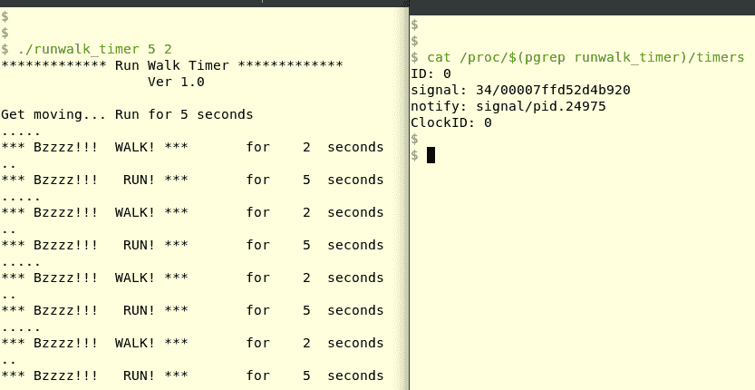

# 第十三章：计时器

计时器使我们能够设置一个工件，当指定的时间到期时，操作系统会通知我们——这是一个普遍的应用程序（甚至是内核）特性。当然，计时器通常只有在与应用程序逻辑并行运行时才有用；这种异步通知行为是通过不同的方式实现的，很多时候是通过内核发送相关进程信号来实现的。

在本章中，我们将探讨 Linux 上用于设置和使用计时器的可用接口。这些接口分为两大类——较旧的 API（`alarm(2)`、`[get|set]itimer(2)`）和闪亮的新 POSIX API（`timer_create(2)`、`timer_[set|get]time(2)`等）。当然，由于信号与计时器一起被广泛使用，我们也会使用信号接口。

我们还想指出，由于计时器的固有动态特性，静态地查看我们书中示例程序的输出是不够的；像往常一样，我们强烈建议读者克隆本书的 GitHub 存储库并自己尝试代码。

在本章中，读者将学习使用 Linux 内核提供的各种计时器接口（API）。我们首先介绍较旧的接口，尽管它们有一些限制，但在系统软件中仍然被广泛使用，因为需要。我们编写了一个简单的**命令行界面**（**CLI**）-仅数字时钟程序，并使用这些 API 进行分析。然后我们将读者引入更近期和功能强大的 POSIX 计时器 API 集。展示和研究了两个非常有趣的示例程序——一个“你有多快能反应”的游戏和一个跑步间隔计时器应用程序。最后简要提到了通过文件抽象使用计时器 API 以及看门狗计时器是什么。

# 较旧的接口

如前所述，较旧的接口包括以下内容：

+   `alarm(2)`系统调用

+   间隔计时器`[get|set]itimer(2)`系统调用 API

让我们从它们中的第一个开始。

# 老式的闹钟

`alarm(2)`系统调用允许进程设置一个简单的超时机制；其签名如下：

```
#include <unistd.h>
unsigned int alarm(unsigned int seconds);
```

这是相当不言自明的。让我们举一个简单的例子：一个进程想要设置一个在三秒后到期的计时器，所以`alarm(3)`基本上就是用来做这个的代码。

在上述代码中到底发生了什么？在发出警报系统调用后三秒钟，也就是在定时器被装备后，内核将向进程发送信号`SIGALRM`。

`SIGALRM`（在 x86 上是信号＃14）的默认操作是终止进程。

因此，我们期望开发人员捕获信号（最好通过`sigaction(2)`系统调用，如前面的第十一章和第十二章中所深入讨论的那样）。

如果传递给`alarm`的参数是`0`，则任何待处理的`alarm(2)`都将被取消（实际上，当调用`alarm`API 时，无论如何都会发生这种情况）。

请注意，`alarm`API 不同寻常地返回一个无符号整数（因此不能返回`-1`，这是通常的失败情况）。相反，它返回任何先前编程的超时秒数，如果没有挂起的超时，则返回零。

接下来是一个简单的程序（`ch13/alarm1.c`），演示了`alarm(2)`的基本用法；参数指定了超时的秒数。

为了可读性，以下仅显示源代码的关键部分；要查看完整的源代码、构建它并运行它，可以从 GitHub 克隆整个树：[`github.com/PacktPublishing/Hands-on-System-Programming-with-Linux`](https://github.com/PacktPublishing/Hands-on-System-Programming-with-Linux)。

信号捕获和计时器装备代码如下所示：

```
[...]
/* Init sigaction to defaults via the memset,
 * setup 'sig_handler' as the signal handler function,
 * trap just the SIGALRM signal.
 */
 memset(&act, 0, sizeof(act));
 act.sa_handler = sig_handler;
 if (sigaction(SIGALRM, &act, 0) < 0)
     FATAL("sigaction on SIGALRM failed");

 alarm(n);
 printf("A timeout for %ds has been armed...\n", n);
 pause(); /* wait for the signal ... */
```

内核向进程分发`SIGALRM`信号后会发生什么；也就是说，一旦定时器超时了？信号处理程序当然会运行。在这里：

```
static void sig_handler(int signum)
{
    const char *str = " *** Timeout! [SIGALRM received] ***\n";
    if (signum != SIGALRM)
        return;
    if (write(STDOUT_FILENO, str, strlen(str)) < 0)
        WARN("write str failed!");
}
```

这里有一个快速的构建和测试运行：

```
$ make alarm1
gcc -Wall -UDEBUG -c ../common.c -o common.o
gcc -Wall -UDEBUG -c alarm1.c -o alarm1.o
gcc -Wall -UDEBUG -o alarm1 alarm1.o common.o 
$ ./alarm1 
Usage: ./alarm1 seconds-to-timeout(>0)
$ ./alarm1 3
A timeout for 3s has been armed...
    *** Timeout! [SIGALRM received] ***            *<< 3 seconds later! >>*
$ 
```

我们现在增强了先前的代码（`ch13/alarm1.c`）以使超时持续重复（源文件是`ch13/alarm2_rep.c`）；已更改的相关代码片段如下：

```
[...]
alarm(n);
printf("A timeout for %ds has been armed...\n", n);
/* (Manually) re-invoke the alarm every 'n' seconds */
while (1) {
    pause(); /* wait for the signal ... */
    alarm(n);
    printf(" Timeout for %ds has been (re)armed...\n", n);
}
[...]
```

虽然这里不适用，但要意识到调用`alarm(2)`会自动取消任何先前挂起的超时。快速试运行如下：

```
$ ./alarm2_rep 1
A timeout for 1s has been armed...
 *** Timeout! [SIGALRM received] ***
 Timeout for 1s has been (re)armed...
 *** Timeout! [SIGALRM received] ***
 Timeout for 1s has been (re)armed...
 *** Timeout! [SIGALRM received] ***
 Timeout for 1s has been (re)armed...
 *** Timeout! [SIGALRM received] ***
 Timeout for 1s has been (re)armed...
^C
$ 
```

警报现在重复（在上面的示例运行中，每秒一次）。还要注意我们如何用键盘*Ctrl*+*C*（发送`SIGINT`，因为我们没有捕获它，所以只终止前台进程）杀死进程。

# Alarm API - 令人沮丧

现在我们已经看过使用（简单的）`alarm(2)`API，重要的是要意识到它有一些缺点：

+   非常粗糙的粒度超时（在现代处理器上是非常长的一秒！）

+   不可能同时运行多个超时

+   不可能在以后的时间点查询或修改超时值-尝试这样做将取消它

+   混合以下 API 可能会导致问题/冲突（在下面，后一个 API 可能是使用前一个 API 内部实现的）

+   `alarm(2)`和`setitimer(2)`

+   `alarm(2)`和`sleep(3)`

+   总是可能超时发生比预期晚（超时）

随着我们在本章中的进展，我们将发现更强大的函数可以克服大部分这些问题。（嗯，公平地说，可怜的`alarm(2)`确实有一个好处：对于简单的目的，它非常快速和容易使用！）

# 间隔计时器

间隔计时器 API 允许进程设置和查询可以按固定时间间隔自动重复的计时器。相关的系统调用如下：

```
#include <sys/time.h>
int getitimer(int which, struct itimerval *curr_value);
int setitimer(int which, const struct itimerval *new_value,
                struct itimerval *old_value);
```

显然，`setitimer(2)`用于设置新的计时器；`getitimer(2)`可用于查询它，并返回剩余时间。

两者的第一个参数都是`which`，它指定要使用的计时器类型。Linux 允许我们使用三种间隔计时器类型：

+   `ITIMER_REAL`：使用此计时器类型在实时中倒计时，也称为挂钟时间。计时器到期时，内核会向调用进程发送信号`SIGALRM`。

+   `ITIMER_VIRTUAL`：使用此计时器类型在虚拟时间中倒计时；也就是说，只有当调用进程（所有线程）在 CPU 上运行在用户空间时，计时器才会倒计时。计时器到期时，内核会向调用进程发送信号`SIGVTALRM`。

+   `ITIMER_PROF`：使用此计时器类型也在虚拟时间中倒计时；这时，当调用进程（所有线程）在 CPU 上运行在用户空间和/或内核空间时，计时器会倒计时。计时器到期时，内核会向调用进程发送信号`SIGPROF`。

因此，要使计时器在特定时间过期时到期，请使用第一个；可以使用剩下的两种类型来对进程的 CPU 使用情况进行分析。每种类型的计时器一次只能使用一个（后面将详细介绍）。

要检查的下一个参数是`itimerval`数据结构（以及它的内部`timeval`结构成员；两者都在`time.h`头文件中定义）：

```
struct itimerval {
    struct timeval it_interval;    /* Interval for periodic timer */
    struct timeval it_value;       /* Time until next expiration */
};

struct timeval {
    time_t      tv_sec;            /* seconds */
    suseconds_t tv_usec;           /* microseconds */
};
```

（顺便说一句，内部的`time_t`和`suseconds_t`typedefs 都转换为长整型值。）

正如我们所看到的，这是`setitimer(2)`的第二个参数，它是指向名为`new_value`的结构体`itimerval`的指针，用于指定新计时器的到期时间，例如：

+   在`it_value`结构成员中，放置初始超时值。该值随着计时器的运行而减少，并且在某个时候将变为零；在这一点上，与计时器类型对应的适当信号将被传递给调用进程。

+   在上一步之后，将检查`it_interval`结构成员。如果它不为零，则该值将被复制到`it_value`结构中，导致定时器有效地自动重置并再次运行该时间量；换句话说，这就是 API 如何实现间隔定时器角色的方式。

此外，明确指出，时间到期以秒:微秒表示。

例如，如果我们想要每秒重复（间隔）超时，我们需要将结构初始化如下：

```
struct itimerval mytimer;
memset(&mytimer, 0, sizeof(struct itimerval));
mytimer.it_value.tv_sec = 1;
mytimer.it_interval.tv_sec = 1;
setitimer(ITIMER_REAL, &mytimer, 0);
```

（出于清晰起见，错误检查代码未在上述代码中显示。）这正是在接下来的简单数字时钟演示程序中完成的。

存在一些特殊情况：

+   要取消（或解除武装）定时器，请将`it_timer`结构的两个字段都设置为零，并调用`setitimer(2)`API。

+   要创建一个单次定时器——即，到期后仅一次——将`it_interval`结构的两个字段都初始化为零，然后调用`setitimer(2)`API。

+   如果`setitimer(2)`的第三个参数为非 NULL，则将在此处返回先前的定时器值（就好像调用了`getitmer(2)`API 一样）。

与通常一样，这对系统调用在成功时返回`0`，在失败时返回`-1`（并适当设置`errno`）。

由于每种类型的定时器到期时会生成一个信号，因此在给定进程中只能同时运行每种类型的定时器的一个实例。如果我们尝试设置多个相同类型的定时器（例如，`ITIMER_REAL`），则总是可能会将多个相同信号的实例（在本例中为`SIGALRM`）同时传递给进程——并且传递给相同的处理程序例程。正如我们在第十一章和第十二章中学到的那样，*信号-第一部分*和*信号-第二部分*，常规的 Unix 信号不能排队，因此信号实例可能会被丢弃。实际上，在给定进程中最好（也最安全）同时使用每种类型的定时器的一个实例。

下表对比了我们之前看到的简单`alarm(2)`系统调用 API 和我们刚刚看到的更强大的`[set|get]itimer(2)`间隔定时器 API：

| **特性** | **简单定时器** [`alarm(2)`] | **间隔定时器** [`setitimer(2)`, `getitimer(2)`] |
| --- | --- | --- |
| 粒度（分辨率） | 非常粗糙；1 秒 | 很好的粒度；理论上为 1 微秒（实际上，在 2.6.16 HRT[1]之前通常为毫秒） |
| 查询剩余时间 | 不可能 | 是的，使用`getitimer(2)` |
| 修改超时 | 不可能 | 是的 |
| 取消超时 | 是 | 是 |
| 自动重复 | 不，但可以手动设置 | 是的 |
| 多个定时器 | 不可能 | 是的，但每个进程最多三个——每种类型一个（实时、虚拟和分析） |

表 1：简单`alarm(2)`API 和间隔定时器的快速比较

[1] **高分辨率定时器**（**HRT**）；从 Linux 2.6.16 开始实现。在 GitHub 存储库的*进一步阅读*部分中有一篇详细论文的链接。

没有应用的知识有什么用？让我们尝试一下间隔定时器 API。

# 一个简单的 CLI 数字时钟

我们人类非常习惯看到时钟每秒滴答一次。为什么不编写一个快速的 C 程序，模拟一个（非常简单的命令行）数字时钟，必须每秒显示我们正确的日期和时间！（嗯，个人而言，我更喜欢看到老式的模拟时钟，但是，嘿，这本书并没有涉及执行图形绘图的密切保密的秘密口诀。）

我们实现这一点非常简单，实际上：我们设置一个每秒超时一次的间隔定时器。下面是演示相当强大的`setitimer(2)`API 的基本用法的程序（`ch13/intv_clksimple.c`）。

为了可读性，以下仅显示了源代码的关键部分；要查看完整的源代码，构建并运行它，整个树都可以从 GitHub 克隆到这里：[`github.com/PacktPublishing/Hands-on-System-Programming-with-Linux`](https://github.com/PacktPublishing/Hands-on-System-Programming-with-Linux)。

信号捕获和设置单秒间隔定时器如下所示：

```
static volatile sig_atomic_t opt;
[...]
int main(int argc, char **argv)
{
    struct sigaction act;
    struct itimerval mytimer;
[...]
    memset(&act, 0, sizeof(act));
    act.sa_handler = ticktock;
    sigfillset(&act.sa_mask); /* disallow all signals while handling */
    /*
    * We deliberately do *not* use the SA_RESTART flag;
    * if we do so, it's possible that any blocking syscall gets
    * auto-restarted. In a timeout context, we don't want that
    * to happen - we *expect* a signal to interrupt our blocking
    * syscall (in this case, the pause(2)).
    * act.sa_flags = SA_RESTART;
    */
    if (sigaction(SIGALRM, &act, 0) < 0)
        FATAL("sigaction on SIGALRM failed");
    /* Setup a single second (repeating) interval timer */
    memset(&mytimer, 0, sizeof(struct itimerval));
    mytimer.it_value.tv_sec = 1;
 mytimer.it_interval.tv_sec = 1;
    if (setitimer(ITIMER_REAL, &mytimer, 0) < 0)
        FATAL("setitimer failed\n");
    while (1)
        (void)pause();
```

请注意，关于为什么我们通常在处理传递超时的信号时不使用`SA_RESTART`标志的自解释注释。

设置间隔定时器很容易：我们初始化`itimerval`结构，将其中的秒成员设置为`1`（微秒部分保持为零），然后发出`setitimer(2)`系统调用。定时器被装载——它开始倒计时。当一秒钟过去后，内核将向进程传递`SIGALRM`信号（因为定时器类型是`ITIMER_REAL`）。信号处理程序`ticktock`将执行获取并打印当前时间戳的任务（请参见其代码如下）。由于间隔组件被设置为`1`，定时器将自动重复每秒触发一次。

```
static void ticktock(int signum)
{
    char tmstamp[128];
    struct timespec tm;
    int myerrno = errno;

    /* Query the timestamp ; both clock_gettime(2) and
     * ctime_r(3) are reentrant-and-signal-safe */
    if (clock_gettime(CLOCK_REALTIME, &tm) < 0)
        FATAL("clock_gettime failed\n");
    if (ctime_r(&tm.tv_sec, &tmstamp[0]) == NULL)
        FATAL("ctime_r failed\n");

    if (opt == 0) {
        if (write(STDOUT_FILENO, tmstamp, strlen(tmstamp)) < 0)
            FATAL("write failed\n");
    } else if (opt == 1) {
      /* WARNING! Using the printf / fflush here in a signal handler is
       * unsafe! We do so for the purposes of this demo app only; do not
       * use in production.
       */
        tmstamp[strlen(tmstamp) - 1] = '\0';
        printf("\r%s", tmstamp);
        fflush(stdout);
    }
    errno = myerrno;
}
```

前面的信号处理程序例程每秒调用一次（当然，内核在定时器到期时向进程传递`SIGALRM`信号）。这个例程的工作很明确：它必须查询并打印当前日期时间；也就是时间戳。

# 获取当前时间

查询当前时间乍一看似乎很简单。许多程序员使用以下 API 序列来实现它：

```
time(2)
localtime(3)
strftime(3)
```

我们不这样做。为什么呢？回想一下我们在第十一章《信号-第一部分》中对异步信号安全（可重入）函数的讨论（在“可重入安全性和信号”部分）。在前面提到的三个 API 中，只有`time(2)` API 被认为是信号安全的；其他两个则不是（也就是说，它们不应该在信号处理程序中使用）。相关的 man 页面（`signal-safety(7)`）证实了这一点。

因此，我们使用文档化的异步信号安全 API——`time(2)`、`clock_gettime(2)`和`ctime_r(3)`——来安全地获取时间戳的角色。以下是它们的快速查看。

`clock_gettime(2)`系统调用的签名如下：

```
int clock_gettime(clockid_t clk_id, struct timespec *tp);
```

第一个参数是要使用的时钟源或时钟类型；事实上，Linux 操作系统（和 glibc）支持许多不同的内置时钟类型；其中包括以下几种：

+   `CLOCK_REALTIME`：系统范围的挂钟时钟（实时）；使用它来查询时间戳。

+   `CLOCK_MONOTONIC`：单调时钟按一个方向计数（显然是向上；通过时间倒流是一项仍在被疯狂（或者是吗？）的科学家们研究的功能）。它通常计算自系统启动以来经过的时间。

+   `CLOCK_BOOTTIME`（从 Linux 2.6.39 开始）：这与`CLOCK_MONOTONIC`几乎相同，只是它考虑了系统暂停的时间。

+   `CLOCK_PROCESS_CPUTIME_ID`：衡量给定进程的所有线程在 CPU 上花费的 CPU 时间（通过 PID；使用`clock_getcpuclockid(3)` API 来查询）。

+   `CLOCK_THREAD_CPUTIME_ID`：衡量特定线程在 CPU 上花费的 CPU 时间（使用`pthread_getcpuclockid(3)` API 来查询）。

还有更多；请参考`clock_gettime(2)`的 man 页面以获取详细信息。对于我们当前的目的，`CLOCK_REALTIME`是我们要使用的时钟类型。

`clock_gettime(2)`的第二个参数是一个值-结果风格的参数；实际上，这是一个返回值。在成功返回时，它将保存`timeval`结构中的时间戳；该结构在`time.h`头文件中定义，并以秒和纳秒的形式保存当前时间戳：

```
struct timespec {
    time_t tv_sec; /* seconds */
    long tv_nsec; /* nanoseconds */
 };
```

我们对秒数的值将会非常满意。

但是这个秒和纳秒的值是如何解释的呢？在 Unix 宇宙中，这实际上非常常见：Unix 系统将时间存储为自 1970 年 1 月 1 日午夜（00:00）以来经过的秒数——可以将其视为 Unix 的诞生！这个时间值被称为自纪元以来的时间或 Unix 时间。好吧，今天它将是一个相当大的秒数，对吧？那么如何以人类可读的格式表示它呢？我们很高兴你问，因为这正是`ctime_r(3)`API 的工作：

```
char *ctime_r(const time_t *timep, char *buf);
```

第一个参数将是我们从`clock_gettime(2)`API 返回的`time_t`成员的指针；再次，第二个参数是一个值结果式的返回——成功完成时，它将保存可读的时间戳！请注意，为缓冲区`buf`分配内存（并根据需要释放）是应用程序员的工作。在我们的代码中，我们只使用静态分配的本地缓冲区。（当然，我们对所有 API 执行错误检查。）

最后，根据用户传递的`opt`值，我们要么使用（安全的）`write(2)`系统调用，要么使用（不安全的！）`printf(3)`/`fflush(3)`API 来打印当前时间。

代码`printf("\r%s", tmstamp);`使用了`\r`格式的`printf(3)`——这是回车，它有效地将光标带回到同一行的开头。这给人一种不断更新的时钟的外观。这很好，除了使用`printf(3)`本身是不安全的！

# 试运行

这是一个试运行，首先使用信号安全的`write(2)`方法：

```
$ ./intv_clksimple
Usage: ./intv_clksimple {0|1}
 0 : the Correct way (using write(2) in the signal handler)
 1 : the *Wrong* way (using printf(3) in the signal handler) *@your risk*
$ ./intv_clksimple 0
Thu Jun 28 17:52:38 2018
Thu Jun 28 17:52:39 2018
Thu Jun 28 17:52:40 2018
Thu Jun 28 17:52:41 2018
Thu Jun 28 17:52:42 2018
^C
$ 
```

现在，这是一个使用信号不安全的`printf(3)`/`fflush(3)`方法的试运行：

```
$ ./intv_clksimple 1
 *WARNING* [Using printf in signal handler]
Thu Jun 28 17:54:53 2018^C
$ 
```

看起来更好，时间戳不断刷新在同一行上，但是不安全。这本书无法向您展示，亲爱的读者，回车样式的`printf("\r...")`的愉快效果。在您的 Linux 系统上尝试一下，看看自己。

我们知道在信号处理程序中使用`printf(3)`和`fflush(3)`API 是不好的编程实践——它们不是异步信号安全的。

但是，如果低级设计规范要求我们确切使用这些 API 呢？好吧，总是有办法：为什么不重新设计程序，使用其中一个同步阻塞 API 来等待和捕获信号（请记住，当捕获致命信号如`SIGILL`、`SIGFPE`、`SIGSEGV`和`SIGBUS`时，建议使用通常的异步`sigaction(2)`API）：`sigwait(3)`、`sigwaitinfo(2)`、`sigtimedwait(2)`甚至是`signalfd(2)`API（我们在第十二章中介绍过，*信号-第二部分*，*通过 sigwait 同步阻塞信号的 API*）。我们把这留给读者作为练习。

# 关于使用分析计时器的一些话

我们已经比较详细地探讨了`ITIMER_REAL`计时器类型的使用——它按实时倒计时。那么，使用另外两种——`ITIMER_VIRTUAL`和`ITIMER_PROF`——计时器呢？嗯，代码风格非常相似；没有什么新东西。对于新手开发人员来说，面临的问题是：信号可能根本不会到达！

让我们看一个使用`ITIMER_VIRTUAL`计时器的简单代码片段：

```
static void profalrm(int signum)
{
    /* In production, do Not use signal-unsafe APIs like this! */
    printf("In %s:%d sig=%d\n", __func__, __LINE__, signum);
}

[...]

// in main() ...

struct sigaction act;
struct itimerval t1;

memset(&act, 0, sizeof(act));
act.sa_handler = profalrm;
sigfillset(&act.sa_mask); /* disallow all signals while handling */
if (sigaction(SIGPROF, &act, 0) < 0)
    FATAL("sigaction on SIGALRM failed");

[...]

memset(&t1, 0, sizeof(struct itimerval));
t1.it_value.tv_sec = 1;
t1.it_interval.tv_sec = 1;
if (setitimer(ITIMER_PROF, &t1, 0) < 0)
    FATAL("setitimer failed\n");

while (1)
    (void)pause();
```

运行时，没有输出出现——计时器似乎没有工作。

这真的不是这种情况——它正在工作，但问题在于：这个进程仅通过`pause(2)`来睡眠。在睡眠时，它不在 CPU 上运行；因此，内核几乎没有减少（前面提到的，每秒）间隔计时器！请记住，只有当进程在 CPU 上运行时，`ITIMER_VIRTUAL`和`ITIMER_PROF`计时器才会递减（或倒计时）。因此，一秒钟的计时器实际上从未到期，`SIGPROF`信号也从未发送。

因此，现在解决之前问题的方法变得明显：让我们在程序中引入一些 CPU 处理，并减少超时值。我们可靠的`DELAY_LOOP_SILENT`宏（参见源文件`common.h`）使进程在一些愚蠢的逻辑上旋转——重点是它变得 CPU 密集。此外，我们已经将定时器到期减少为每个进程在 CPU 上花费 10 毫秒：

```
[...]
memset(&t1, 0, sizeof(struct itimerval));
t1.it_value.tv_sec = 0;
t1.it_value.tv_usec = 10000;       // 10,000 us = 10 ms
t1.it_interval.tv_sec = 0;
t1.it_interval.tv_usec = 10000;    // 10,000 us = 10 ms
if (setitimer(ITIMER_PROF, &t1, 0) < 0)
    FATAL("setitimer failed\n");

while (1) {
    DELAY_LOOP_SILENT(20);
    (void)pause();
}
```

这一次，运行时，我们看到了这个：

```
In profalrm:34 sig=27
In profalrm:34 sig=27
In profalrm:34 sig=27
In profalrm:34 sig=27
In profalrm:34 sig=27
...
```

性能分析定时器确实在工作。

# 更新的 POSIX（间隔）定时器机制

在本章前面，我们在*表 1：简单* *alarm(2) API 和间隔定时器的快速比较*中看到，尽管间隔定时器`[get|set]itimer(2)`API 优于简单的`alarm(2)`API，但它们仍然缺乏重要的现代功能。现代 POSIX（间隔）定时器机制解决了一些缺点，其中一些如下：

+   通过增加纳秒粒度定时器（通过在 2.6.16 Linux 内核中集成的与架构无关的 HRT 机制）来改善分辨率一千倍。

+   一种通用的`sigevent(7)`机制——这是一种处理异步事件的方式，例如定时器到期（我们的用例）、AIO 请求完成、消息传递等——来处理定时器到期。我们现在不再被迫将定时器到期与信号机制绑定。

+   重要的是，一个进程（或线程）现在可以设置和管理任意数量的定时器。

+   最终，总是有一个上限：在这种情况下，它是资源限制`RLIMIT_SIGPENDING`。（更技术上地说，事实是操作系统为每个创建的定时器分配了一个排队的实时信号，这就是限制。）

这些观点将如下所述，继续阅读。

# 典型的应用程序工作流程

设置和使用现代 POSIX 定时器的设计方法（和使用的 API）如下；顺序通常如下所示：

+   信号设置。

+   假设正在使用的通知机制是信号，首先通过`sigaction(2)`捕获信号。

+   创建和初始化定时器。

+   决定使用哪种时钟类型（或源）来测量经过的时间。

+   决定应用程序使用的定时器到期事件通知机制——通常是使用（通常的）信号还是（新生成的）线程。

+   上述决策通过`timer_create(2)`系统调用实现；因此它允许创建一个定时器，当然，我们可以多次调用它来创建多个定时器。

+   使用`timer_settime(2)`来装载（或解除装载）特定的定时器。装载定时器意味着有效地启动它运行——倒计时；解除装载定时器则相反——停止它。

+   查询特定定时器的剩余时间（到期时间）（及其间隔设置）使用`timer_gettime(2)`。

+   使用`timer_getoverrun(2)`检查给定定时器的超时计数。

+   使用`timer_delete(2)`删除（显然也是解除装载）定时器。

# 创建和使用 POSIX（间隔）定时器

如前所述，我们使用强大的`timer_create(2)`系统调用为调用进程（或线程）创建定时器：

```
#include <signal.h>
#include <time.h>
int timer_create(clockid_t clockid, struct sigevent *sevp,
                 timer_t *timerid);
Link with -lrt.
```

我们必须链接**实时**（**rt**）库来使用这个 API。`librt`库实现了 POSIX.1b 对 POSIX 接口的实时扩展。在 GitHub 存储库的*进一步阅读*部分中找到`librt`man 页面的链接。

传递给`timer_create(2)`的第一个参数通知操作系统要使用的时钟源；我们避免重复这个问题，并参考本章前面涵盖的*获取当前时间*部分，其中我们列举了 Linux 中常用的几种时钟源。（另外，正如在那里指出的，可以参考`clock_gettime(2)`的 man 页面获取更多细节。）

传递给`timer_create(2)`的第二个参数很有趣：它提供了一种通用的方式来指定应用程序使用的计时器到期事件通知机制！为了理解这一点，让我们来看看`sigevent`结构：

```
#include <signal.h>

union sigval {     /* Data passed with notification */
    int sival_int;      /* Integer value */
    void *sival_ptr;    /* Pointer value */
 };

struct sigevent {
    int sigev_notify;         /* Notification method */
    int sigev_signo;          /* Notification signal */
    union sigval sigev_value; /* Data passed with notification */
    void (*sigev_notify_function) (union sigval);
    /* Function used for thread notification (SIGEV_THREAD) */
    void *sigev_notify_attributes; /* Attributes for notification 
    thread(SIGEV_THREAD) */
    pid_t sigev_notify_thread_id;
             /* ID of thread to signal (SIGEV_THREAD_ID) */
 };
```

（回想一下，我们已经在第十一章和第十二章中使用了`union sigval`机制，将一个值传递给信号处理程序。*信号-第一部分*和*信号-第二部分*。）

`sigev_notify`成员的有效值在以下枚举：

| **通知方法**：`sigevent.sigev_notify` | **意义** |
| --- | --- |
| `SIGEV_NONE` | 事件到达时不执行任何操作-空通知 |
| `SIGEV_SIGNAL` | 通过发送进程中`sigev_signo`成员中指定的信号来通知 |
| `SIGEV_THREAD` | 通过调用（实际上是生成）一个（新的）线程，其函数为`sigev_notify_function`，传递给它的参数是`sigev_value`，如果`sigev_notify_attributes`不为 NULL，则应该是新线程的`pthread_attr_t`结构。（读者们，请注意，我们将在后续章节中详细介绍多线程。） |
| `SIGEV_THREAD_ID` | 仅在 Linux 中使用，用于指定在计时器到期时将运行的内核线程；实际上，只有线程库才使用此功能。 |

表 2：使用 sigevent(7)机制

在第一种情况下，`SIGEV_NONE`，可以始终通过`timer_gettime(2)`API 手动检查计时器是否到期。

更有趣和常见的情况是第二种情况，`SIGEV_SIGNAL`。在这里，信号被传递给计时器已经到期的进程；进程的`sigaction(2)`处理程序的`siginfo_t`数据结构被适当地填充；对于我们的用例-使用 POSIX 计时器-如下：

+   `si_code`（或信号来源字段）设置为值`SI_TIMER`，表示 POSIX 计时器已经到期（在`sigaction`的 man 页面中查找其他可能性）

+   `si_signo`设置为信号编号（`sigev_signo`）

+   `si_value`将是`union sigev_value`中设置的值

对于我们的目的（至少在本章中），我们只考虑将`sigevent`通知类型设置为值`SIGEV_SIGNAL`（因此设置要在`sigev_signo`成员中传递的信号）。

传递给`timer_create(2)`的第三个参数，`timer_t *timerid`，是一个（现在常见的）值结果样式的参数；实际上，它是新创建的 POSIX 计时器的返回 ID！当然，系统调用在失败时返回`-1`（并相应设置`errno`），成功时返回`0`。`timerid`是计时器的句柄-我们通常将其作为参数传递给后续的 POSIX 计时器 API，以指定要操作的特定计时器。

# 军备竞赛-启动和停止 POSIX 计时器

如前所述，我们使用`timer_settime(2)`系统调用来启动或停止计时器：

```
#include <time.h>
int timer_settime(timer_t timerid, int flags,
                    const struct itimerspec *new_value,
                    struct itimerspec *old_value);
Link with -lrt.
```

由于可以同时运行多个并发的 POSIX 计时器，因此我们需要准确指定我们正在引用的计时器；这是通过第一个参数`timer_id`完成的，它是计时器的 ID，并且是先前看到的`timer_create(2)`系统调用的有效返回。

这里使用的重要数据结构是`itimerspec`；其定义如下：

```
struct timespec {
    time_t tv_sec; /* Seconds */
    long tv_nsec;  /* Nanoseconds */
};

struct itimerspec {
    struct timespec it_interval; /* Timer interval */
    struct timespec it_value;    /* Initial expiration */
};
```

因此，很明显：在第三个参数中，指向名为`new_value`的`itimerspec`结构的指针：

+   我们可以将时间指定到（理论上的）纳秒分辨率！请注意，时间是相对于由`timer_create(2)`API 指定的时钟源来测量的。

+   这提醒我们，可以始终使用`clock_getres(2)`API 查询时钟分辨率。

+   关于初始化`it_value`（`timespec`结构）：

+   将其设置为非零值以指定初始计时器到期值。

+   将其设置为零以指定我们正在解除（停止）计时器。

+   如果这个结构已经保存了一个正值，那么它将被覆盖，并且定时器将使用新值重新启动。

+   不仅如此，通过将`it_interval`（timespec 结构）初始化为非零值，我们将设置一个重复的间隔定时器（因此称为 POSIX 间隔定时器）；时间间隔就是它初始化的值。定时器将持续无限期地触发，直到它被解除武装或删除。如果相反，这个结构被清零，定时器就变成了一次触发的定时器（当 it_value 成员中指定的时间过去时只触发一次）。

通常，将`flags`值设置为`0`——`timer_settime(2)`的 man 页面指定了一个可以使用的附加标志。最后，第四个参数`old_value`（同样是指向`struct itimerspec`的指针）的工作如下：

+   如果为`0`，则会被简单地忽略。

+   如果非零，则是查询到给定定时器到期的剩余时间的一种方法。

+   到期时间将在`old_value->it_value`成员中返回（以秒和纳秒为单位），设置的间隔将在`old_value->it_interval`成员中返回。

预期的成功返回值为`0`，失败时为`-1`（并适当设置了`errno`）。

# 查询定时器

可以随时查询给定的 POSIX 定时器，以获取剩余时间到定时器到期的时间，使用`timer_gettime(2)`系统调用 API；其签名如下：

```
#include <time.h>
int timer_gettime(timer_t timerid, struct itimerspec *curr_value);
```

显然，传递给`timer_gettime(2)`的第一个参数是要查询的特定定时器的 ID，传递的第二个参数是值结果样式返回——到期时间以它返回（在`itimerspec`类型的结构中）。

正如我们从前面所知道的，`struct itimerval`本身由两个`timespec`类型的数据结构组成；剩余时间到定时器到期将被放置在`curr_value->it_value`成员中。如果这个值为 0，则意味着定时器已经停止（解除武装）。如果放置在

`curr_value->it_interval`成员为正值时，表示定时器将重复触发的间隔（在第一次超时后）；如果为 0，则意味着定时器是单次触发的（没有重复超时）。

# 示例代码片段显示工作流程

在接下来的内容中，我们展示了来自我们的样本程序`ch13/react.c`的代码片段（在下一节中更多地了解这个相当有趣的反应时间游戏应用程序），它清楚地说明了先前描述的步骤序列。

+   设置信号：

+   假设正在使用的通知机制是信号，首先通过`sigaction(2)`捕获信号如下：

```
struct sigaction act;
[...]
// Trap SIGRTMIN : delivered on (interval) timer expiry
memset(&act, 0, sizeof(act));
act.sa_flags = SA_SIGINFO | SA_RESTART;
act.sa_sigaction = timer_handler;
if (sigaction(SIGRTMIN, &act, NULL) == -1)
    FATAL("sigaction SIGRTMIN failed\n");
```

+   创建和初始化定时器：

+   决定使用的时钟类型（或来源）来测量经过的时间：

+   我们使用实时时钟`CLOCK_REALTIME`作为我们的定时器来源，系统范围的挂钟时间。

+   决定应用程序使用的定时器到期事件通知机制——通常是使用（通常的）信号还是（新生成的）线程。

+   我们使用信号作为定时器到期事件通知机制。

+   上述决定是通过`timer_create(2)`系统调用实现的，它允许创建一个定时器；当然，我们可以多次调用它来创建多个定时器：

```
struct sigevent sev;
[...]
/* Create and init the timer */
sev.sigev_notify = SIGEV_SIGNAL;
sev.sigev_signo = SIGRTMIN;
sev.sigev_value.sival_ptr = &timerid;
if (timer_create(CLOCK_REALTIME, &sev, &timerid) == -1)
    FATAL("timer_create failed\n");
```

+   使用`timer_settime(2)`API 来启动（或解除武装）特定的定时器。启动定时器意味着有效地开始计时或倒计时；解除武装定时器则相反——停止它的运行：

```
static struct itimerspec itv;    // global
[...]
static void arm_timer(timer_t tmrid, struct itimerspec *itmspec)
{
    VPRINT("Arming timer now\n");
    if (timer_settime(tmrid, 0, itmspec, NULL) == -1)
        FATAL("timer_settime failed\n");
    jumped_the_gun = 0;
}
[...]
printf("Initializing timer to generate SIGRTMIN every %ld ms\n",
 freq_ms);
memset(&itv, 0, sizeof(struct itimerspec));
itv.it_value.tv_sec = (freq_ms * 1000000) / 1000000000;
itv.it_value.tv_nsec = (freq_ms * 1000000) % 1000000000;
itv.it_interval.tv_sec = (freq_ms * 1000000) / 1000000000;
itv.it_interval.tv_nsec = (freq_ms * 1000000) % 1000000000;
[...]
arm_timer(timerid, &itv);
```

+   要查询特定定时器的剩余时间（到期时间）和其间隔设置，请使用`timer_gettime(2)`

这在这个特定的应用程序中没有执行。

+   使用`timer_getoverrun(2)`检查给定定时器的超时计数

在下一节“计算超时”中提供了此 API 的解释以及我们可能需要它的原因。

```
/* 
 * The realtime signal (SIGRTMIN) - timer expiry - handler.
 * WARNING! Using the printf in a signal handler is unsafe!
 * We do so for the purposes of this demo app only; do Not
 * use in production.
 */
static void timer_handler(int sig, siginfo_t * si, void *uc)
{
  char buf[] = ".";

  c++;
  if (verbose) {
      write(2, buf, 1);
#define SHOW_OVERRUN 1
#if (SHOW_OVERRUN == 1)
    {
          int ovrun = timer_getoverrun(timerid);
          if (ovrun == -1)
              WARN("timer_getoverrun");
          else {
              if (ovrun)
                  printf(" overrun=%d [@count=%d]\n", ovrun, c);
          }
    }
#endif
  }
}
```

+   使用`timer_delete(2)`删除（显然解除武装）一个定时器

这不是这个特定应用程序中执行的（因为进程退出当然会删除与进程相关的所有定时器）。

正如`timer_create(2)`的 man 手册所告诉我们的，关于 POSIX（间隔）定时器的一些要点如下：

+   在`fork(2)`之后，所有定时器都会自动解除武装；换句话说，定时器不会在子进程中继续到期。

+   在`execve(2)`之后，所有定时器都被删除，因此在后继进程中将不可见。

+   值得注意的一点是（从 Linux 3.10 内核开始），proc 文件系统可以用来查询进程拥有的定时器；只需查找 cat 伪文件/proc/<pid>/timers 以查看它们（如果存在）。

+   从 Linux 4.10 内核开始，POSIX 定时器是一个内核可配置的选项（在内核构建时，默认情况下启用）。

正如我们反复提到的，man 手册是开发人员可用的非常宝贵和有用的资源；再次，`timer_create(2)`的 man 手册提供了一个很好的示例程序；我们敦促读者参考 man 手册，阅读它，构建它并尝试运行程序。

# 计算超限

假设我们使用信号作为事件通知机制来告诉我们 POSIX 定时器已经到期，并且假设定时器到期时间非常短（比如几十微秒）；例如，100 微秒。这意味着每 100 微秒信号将被传递给目标进程！

在这种情况下，可以合理地期望进程以如此高的速率接收相同的重复信号，不可能处理它。我们也知道，从我们对信号的了解来看，在类似这样的情况下，使用实时信号要远远优于使用常规 Unix 信号，因为操作系统有能力排队实时信号，但不能排队常规信号——它们（常规信号）将被丢弃，只保留一个实例。

因此，我们将使用实时信号（比如`SIGRTMIN`）来表示定时器到期；然而，即使使用一个非常小的定时器到期时间（例如，正如我们所说的 100 微秒），这种技术也不足以满足需求！进程肯定会被相同信号的快速传递所淹没。对于这些情况，我们可以获取定时器到期和实际信号处理之间发生的实际超限次数。我们该如何做到这一点？有两种方法：

+   一种是通过信号处理程序的`siginfo_t->_timer->si_overrun`成员（这意味着我们在使用 sigaction 捕获信号时指定了`SA_SIGINFO`标志）——这是超限计数。

+   然而，这种方法是特定于 Linux 的（不可移植）。获得超限计数的更简单、可移植的方法是使用`timer_getoverrun(2)`系统调用。这里的缺点是系统调用比内存查找的开销要大得多；就像生活中一样，有利的一面就有不利的一面。

# POSIX 间隔定时器-示例程序

编程最终是通过实践来学习和理解的，而不仅仅是看或阅读。让我们听从自己的建议，编写一些体面的代码示例，以说明如何使用 POSIX（间隔）定时器 API。 （当然，亲爱的读者，这意味着你也要这样做！）

第一个示例程序是一个小型 CLI 游戏“你的反应有多快”？第二个示例程序是一个简单的跑步计时器的实现。继续阅读了解更多细节。

# 反应-时间游戏

我们都知道现代计算机很快！当然，这是一个非常相对的说法。有多快？这是一个有趣的问题。

# 有多快？

在第二章中，*虚拟内存*，在内存金字塔部分，我们看到了*表 2：内存层次结构数字*。这里，对数字进行了代表性的查看-不同类型的内存技术（嵌入式和服务器空间）的典型访问速度在表中列举。

快速回顾给出了典型内存（和网络）访问速度的以下内容。当然，这些数字仅供参考，最新的硬件可能具有更优越的性能特征；这里，重点是概念：

| **CPU 寄存器** | **CPU 缓存** | **RAM** | **Flash** | **磁盘** | **网络往返** |
| --- | --- | --- | --- | --- | --- |
| 300 - 500 ps | 0.5 ns（L1）至 20 ns（L3） | 50-100 ns | 25-50 us | 5-10 ms | >= 100s of ms |

表 3：硬件内存速度摘要表

这些延迟值大多是如此微小，以至于我们作为人类实际上无法将它们可视化（请参阅稍后的*平均人类反应时间*信息框）。所以，这带来了一个问题。我们人类究竟能够希望相当正确地可视化和理解哪些微小的数字？简短的答案是几百毫秒。

为什么要这样说？嗯，如果一个计算机程序告诉你尽快做出反应并立即按下某个键盘组合键，需要多长时间？所以，我们真正想要测试的是人对视觉刺激的反应时间。啊，通过编写这个精确的程序，我们可以通过实验证明这一点：一个反应计时器！

请注意，这个简单的视觉刺激反应测试并不被认为是科学的；我们完全忽略了重要的延迟产生机制，比如计算机系统硬件和软件本身。所以，当你尝试时，不要对结果感到沮丧！

# 我们的反应游戏-它是如何工作的

因此，在高层次上，这是程序的逐步计划（实际代码显示在下一节；我们建议您先阅读此内容，然后再查看代码）：

+   创建并初始化一个简单的警报；将其设置为在程序启动后的 1 到 5 秒之间的任意时间过期

+   警报过期的时刻，执行以下操作：

+   设置 POSIX（间隔）计时器（到第一个参数指定的频率）。

+   显示一条消息，要求用户在键盘上按下*Ctrl *+ *C*。

+   获取时间戳（我们称之为`tm_start`）。

+   当用户实际按下*^C*（*Ctrl *+ *C*；我们将通过`sigaction(2)`捕获到），再次获取时间戳（我们称之为`tm_end`）。

+   计算用户的反应时间（作为`tm_end` - `tm_start`）并显示它。

（注意前面的步骤遵循我们在本章前面描述的*典型应用程序工作流程*。）

此外，我们要求用户指定间隔计时器的间隔时间（第一个参数），以及作为第二个参数的可选详细选项。

进一步分解（更详细地），初始化代码执行以下操作：

+   通过`sigaction(2)`捕获信号：

+   `SIGRTMIN`：我们将使用信号通知来指定计时器到期；这是在我们的 POSIX 间隔计时器到期时生成的信号。

+   `SIGINT`：用户按下*^C*键盘组合时生成的信号。

+   `SIGALRM`：我们的初始随机警报过期时生成的信号

+   设置 POSIX 间隔计时器：

+   初始化`sigevent`结构。

+   创建计时器（使用实时时钟源）并用`timer_create(2)`。

+   将`itimerspec`结构初始化为用户指定的频率值（以毫秒为单位）

然后：

+   向用户显示消息：

```
We shall start a timer anywhere between 1 and 5 seconds of starting this app.

GET READY ...
 [ when the "QUICK! Press ^C" message appears, press ^C quickly as you can ]
```

+   在 1 到 5 秒之间的任意时间，警报会过期

+   我们进入`SIGALRM`处理程序函数

+   显示`*** 快！按^C 键！***`消息

+   调用`timer_settime(2)`来设置计时器

+   获取`tm_start`时间戳（使用`clock_gettime(2)`API）

+   现在 POSIX 间隔计时器正在运行；它每`freq_ms`毫秒到期一次（由用户提供的值）；在详细模式下运行时，我们为每个计时器到期显示一个`**.**`。

+   用户在某个时候，近或远，做出反应并按下*Ctrl*+*C*（^C）；在 SIGINT 的信号处理程序代码中，我们执行以下操作：

+   获取`tm_end`时间戳（使用`clock_gettime(2)`API）

+   通过`tm_end` - `tm_start`计算增量（反应时间！），并显示它

+   退出。

# 反应 - 试验运行

最好是看到程序在运行中的情况；当然，读者最好（并且会更享受这个练习！）亲自构建并尝试一下：

```
$ ./react 
Usage: ./react <freq-in-millisec> [verbose-mode:[0]|1]
  default: verbosity is off
  f.e.: ./react 100   => timeout every 100 ms, verbosity Off
      : ./react   5 1 => timeout every   5 ms, verbosity On

How fast can you react!?
Once you run this app with the freq-in-millisec parameter,
we shall start a timer anywhere between 1 and 5 seconds of
your starting it. Watch the screen carefully; the moment
the message "QUICK! Press ^C" appears, press ^C (Ctrl+c simultaneously)!
Your reaction time is displayed... Have fun!

$ 
```

我们首先以 10 毫秒的频率运行它，而且不显示详细信息：

```
$ ./react 10
Initializing timer to generate SIGRTMIN every 10 ms
[Verbose: N]
We shall start a timer anytime between 1 and 5 seconds from now...

GET READY ...
 [ when the "QUICK! Press ^C" message appears, press ^C quickly as you can ]
```

在 1 到 5 秒的随机间隔之后，出现这条消息，用户必须做出反应：

```
*** QUICK! Press ^C !!! ***
^C
*** PRESSED ***
 Your reaction time is precisely 0.404794198 s.ns [~= 405 ms, count=40]
$ 
```

接下来，以 10 毫秒的频率和详细模式：

```
$ ./react 10 1
Initializing timer to generate SIGRTMIN every 10 ms
timer struct ::
 it_value.tv_sec = 0 it_value.tv_nsec = 10000000
 it_interval.tv_sec = 0 it_interval.tv_nsec = 10000000
[SigBlk: -none-]
[Verbose: Y]
We shall start a timer anytime between 1 and 5 seconds from now...

GET READY ...
 [ when the "QUICK! Press ^C" message appears, press ^C quickly as you can ]
```

在 1 到 5 秒的随机间隔之后，出现这条消息，用户必须做出反应：

```
react.c:arm_timer:161: Arming timer now

*** QUICK! Press ^C !!! *
```

现在，每次 POSIX 间隔计时器到期时，句号字符`.`会迅速出现，也就是说，在这次运行中，每 10 毫秒出现一次。

```
.....................................^C
*** PRESSED ***
 Your reaction time is precisely 0.379339662 s.ns [~= 379 ms, count=37]
$ 
```

在我们之前的样本运行中，用户反应需要 405 毫秒和 379 毫秒；正如我们提到的，它在数百毫秒的范围内。接受挑战——你能做得更好吗？

研究结果表明，人类平均反应时间如下：

| **刺激** | **视觉** | **听觉** | **触觉** |
| --- | --- | --- | --- |
| 平均人类反应时间 | 250 毫秒 | 170 毫秒 | 150 毫秒 |

来源：[`backyardbrains.com/experiments/reactiontime`](https://backyardbrains.com/experiments/reactiontime)。我们已经习惯于使用短语，比如“眨眼之间”来表示非常快。有趣的是，眨眼实际上需要多长时间？研究表明，平均需要 300 到 400 毫秒！

# 反应游戏 - 代码视图

一些关键功能方面如下所示；首先是为`SIGRTMIN`设置信号处理程序并创建 POSIX 间隔的代码（`ch13/react.c`）：

为了可读性，以下仅显示源代码的关键部分；要查看完整的源代码，构建并运行它，整个树都可以从 GitHub 克隆，链接在这里：[`github.com/PacktPublishing/Hands-on-System-Programming-with-Linux`](https://github.com/PacktPublishing/Hands-on-System-Programming-with-Linux)。

```
static int init(void)
{
 struct sigevent sev;
  struct rlimit rlim;
  struct sigaction act;

  // Trap SIGRTMIN : delivered on (interval) timer expiry
  memset(&act, 0, sizeof(act));
  act.sa_flags = SA_SIGINFO | SA_RESTART;
  act.sa_sigaction = timer_handler;
  if (sigaction(SIGRTMIN, &act, NULL) == -1)
    FATAL("sigaction SIGRTMIN failed\n");

[...]

/* Create and init the timer */
  sev.sigev_notify = SIGEV_SIGNAL;
  sev.sigev_signo = SIGRTMIN;
  sev.sigev_value.sival_ptr = &timerid;
  if (timer_create(CLOCK_REALTIME, &sev, &timerid) == -1)
    FATAL("timer_create failed\n");

  printf("Initializing timer to generate SIGRTMIN every %ld ms\n",
         freq_ms);
  memset(&itv, 0, sizeof(struct itimerspec));
  itv.it_value.tv_sec = (freq_ms * 1000000) / 1000000000;
  itv.it_value.tv_nsec = (freq_ms * 1000000) % 1000000000;
  itv.it_interval.tv_sec = (freq_ms * 1000000) / 1000000000;
  itv.it_interval.tv_nsec = (freq_ms * 1000000) % 1000000000;
[...]
```

意外开始的实现如下：

```
/* random_start
 * The element of surprise: fire off an 'alarm' - resulting in SIGALRM being
 * delivered to us - in a random number between [min..max] seconds.
 */
static void random_start(int min, int max)
{
    unsigned int nr;

    alarm(0);
    srandom(time(0));
    nr = (random() % max) + min;

#define CHEAT_MODE     0
#if (CHEAT_MODE == 1)
    printf("Ok Cheater :-) get ready; press ^C in %ds ...\n", nr);
#endif
 alarm(nr);
}
```

它的调用如下：

```
#define MIN_START_SEC 1
#define MAX_START_SEC 5
[...]
random_start(MIN_START_SEC, MAX_START_SEC);
```

信号处理程序（函数`startoff`）和与闹钟（`SIGALRM`）相关的逻辑如下：

```
static void arm_timer(timer_t tmrid, struct itimerspec *itmspec)
{
  VPRINT("Arming timer now\n");
  if (timer_settime(tmrid, 0, itmspec, NULL) == -1)
      FATAL("timer_settime failed\n");
  jumped_the_gun = 0;
}

/*
 * startoff
 * The signal handler for SIGALRM; arrival here implies the app has
 * "started" - we shall arm the interval timer here, it will start
 * running immediately. Take a timestamp now.
 */
static void startoff(int sig)
{
  char press_msg[] = "\n*** QUICK! Press ^C !!! ***\n";

  arm_timer(timerid, &itv);
  write(STDERR_FILENO, press_msg, strlen(press_msg));

  //—- timestamp it: start time
  if (clock_gettime(CLOCK_REALTIME, &tm_start) < 0)
      FATAL("clock_gettime (tm_start) failed\n");
}
```

请记住，当用户在四处游荡时，我们的 POSIX 间隔计时器会继续以用户指定的频率设置和重置自身（作为传递的第一个参数，我们将其保存在变量`freq_ms`中）；因此，每`freq_ms`毫秒，我们的进程将接收到信号`SIGRTMIN`。这是它的信号处理程序例程：

```
static volatile sig_atomic_t gTimerRepeats = 0, c = 0, first_time = 1,
    jumped_the_gun = 1; [...] static void timer_handler(int sig, siginfo_t * si, void *uc)
{
  char buf[] = ".";

  c++;
  if (verbose) {
      write(2, buf, 1);
#define SHOW_OVERRUN 1
#if (SHOW_OVERRUN == 1)
      {
          int ovrun = timer_getoverrun(timerid);
          if (ovrun == -1)
              WARN("timer_getoverrun");
          else {
              if (ovrun)
                  printf(" overrun=%d [@count=%d]\n", ovrun, c);
          }
    }
#endif
  }
}
```

当用户（最终！）按下*^C*时，将调用 SIGINT 的信号处理程序（函数`userpress`）：

```
static void userpress(int sig)
{
  struct timespec res;

  // timestamp it: end time
  if (clock_gettime(CLOCK_REALTIME, &tm_end) < 0)
    FATAL("clock_gettime (tm_end) failed\n");

  [...]
      printf("\n*** PRESSED ***\n");
      /* Calculate the delta; subtracting one struct timespec
       * from another takes a little work. A retrofit ver of
       * the 'timerspecsub' macro has been incorporated into
       * our ../common.h header to do this.
       */
      timerspecsub(&tm_end, &tm_start, &res);
      printf
          (" Your reaction time is precisely %ld.%ld s.ns"
           " [~= %3.0f ms, count=%d]\n",
           res.tv_sec, res.tv_nsec,
           res.tv_sec * 1000 +
             round((double)res.tv_nsec / 1000000), c);
    }
   [...]
  c = 0;
  if (!gTimerRepeats)
    exit(EXIT_SUCCESS);
}
```

# 运行：步行间隔计时器应用程序

本书的作者是一个自称业余跑步者。在我看来，跑步者/慢跑者，尤其是刚开始时（甚至经验丰富的人），可以从一致的跑步：步行模式中受益（单位通常是分钟）。

这背后的想法是，持续奔跑很难，尤其是对初学者来说。教练经常让新手跑步者遵循有用的跑步：步行策略；跑一段时间，然后休息一段时间，然后重复——再跑，再走——无限期地，或者直到达到目标距离（或时间）。

例如，当初学者跑 5 公里或 10 公里时，可能会遵循一致的 5:2 跑步：步行模式；也就是说，跑步 5 分钟，步行 2 分钟，重复这个过程，直到跑步结束。（而超级长跑者可能更喜欢类似 25:5 的策略。）

为什么不编写一个跑步：步行计时器应用程序，以帮助我们的初学者和认真的跑步者。

我们将这样做。不过，从更好地理解这个程序的角度来看，让我们想象一下程序已经编写并且正在运行——我们将试一试。

# 几次试运行

当我们简单地运行程序而不传递任何参数时，帮助屏幕会显示出来：

```
$ ./runwalk_timer 
Usage: ./runwalk_timer Run-for[sec] Walk-for[sec] [verbosity-level=0|[1]|2]
 Verbosity Level :: 0 = OFF [1 = LOW] 2 = HIGH
$ 
```

正如所见，程序期望至少有两个参数：

+   跑步时间（以秒为单位）[必需]

+   步行时间（以秒为单位）[必需]

+   冗长级别[可选]

可选的第三个参数，冗长级别，允许用户在程序执行时请求更多或更少的信息（这总是一种有用的工具，因此有助于调试程序）。我们提供了三种可能的冗长级别：

+   `OFF`：除了必需的内容之外，不显示任何内容（传递第三个参数 0）

+   `LOW`：与关闭级别相同，另外我们使用句点字符`**.**`来显示时间流逝——每秒钟，`**.**`都会打印到`stdout`[默认]

+   `HIGH`：与关闭级别相同，另外我们显示内部数据结构值、计时器到期时间等（传递第三个参数 2）

让我们首先尝试以默认的冗长级别（LOW）运行，使用以下规范：

+   运行 5 秒

+   步行 2 秒

好吧，好吧，我们知道，你比那更健康——你可以跑步：步行超过 5 秒：2 秒。原谅我们，但是这样的事情：为了演示的目的，我们并不真的想等到 5 分钟然后再过 2 分钟，只是为了看看它是否有效，对吧？（当您在跑步时使用这个应用程序时，请将分钟转换为秒并尝试！）。

话不多说；让我们启动一个 5:2 的跑步：步行 POSIX 计时器：

```
$ ./runwalk_timer 5 2
************* Run Walk Timer *************
                  Ver 1.0

Get moving... Run for 5 seconds
.....        *<< each "." represents 1 second of elapsed time >>*
*** Bzzzz!!! WALK! *** for 2 seconds
..
*** Bzzzz!!! RUN! *** for 5 seconds
.....
*** Bzzzz!!! WALK! *** for 2 seconds
..
*** Bzzzz!!! RUN! *** for 5 seconds
....^C
+++ Good job, bye! +++
$ 
```

是的，它有效；我们通过输入*^C*（*Ctrl*+*C*）来中断它。

前面的试运行是在默认的冗长级别`LOW`；现在让我们以相同的 5:2 跑步：步行间隔重新运行它，但是将冗长级别设置为`HIGH`，通过传递`2`作为第三个参数：

```
$ ./runwalk_timer 5 2 2
************* Run Walk Timer *************
                  Ver 1.0

Get moving... Run for 5 seconds
trun= 5 twalk= 2; app ctx ptr = 0x7ffce9c55270
runwalk: 4.999s                    *<< query on time remaining >>*
runwalk: 3.999s
runwalk: 2.999s
runwalk: 1.999s
runwalk: 0.999s
its_time: signal 34. runwalk ptr: 0x7ffce9c55270 Type: Run. Overrun: 0

*** Bzzzz!!! WALK! *** for 2 seconds
runwalk: 1.999s
runwalk: 0.999s
its_time: signal 34. runwalk ptr: 0x7ffce9c55270 Type: Walk. Overrun: 0

*** Bzzzz!!! RUN! *** for 5 seconds
runwalk: 4.999s
runwalk: 3.999s
runwalk: 2.999s
runwalk: 1.999s
runwalk: 0.999s
its_time: signal 34. runwalk ptr: 0x7ffce9c55270 Type: Run. Overrun: 0

*** Bzzzz!!! WALK! *** for 2 seconds
runwalk: 1.999s
runwalk: 0.999s
its_time: signal 34. runwalk ptr: 0x7ffce9c55270 Type: Walk. Overrun: 0

*** Bzzzz!!! RUN! *** for 5 seconds
runwalk: 4.999s
runwalk: 3.999s
runwalk: 2.999s
^C
+++ Good job, bye! +++
$ 
```

细节被揭示；每秒钟，我们的 POSIX 计时器到期的剩余时间被显示出来（以毫秒为分辨率）。当计时器到期时，操作系统向进程发送实时信号`SIGRTMIN`；我们进入信号处理程序`its_time`，然后我们打印出从`struct` `siginfo_t`指针获得的信号信息。我们接收到信号号码（34）和联合体`si->si_value`中的指针，这是指向我们的应用程序上下文数据结构的指针，因此我们可以在没有使用全局变量的情况下访问它（稍后会详细介绍）。（当然，正如多次注意到的那样，在信号处理程序中使用`printf(3)`和变体是不安全的。我们在这里只是为了演示；不要在生产中这样编码。`Bzzzz!!!`消息代表计时器响起的声音，当然；程序指示用户相应地进行`RUN!`或`WALK!`，以及进行的秒数。整个过程无限重复。

# 低级设计和代码

这个简单的程序将允许您设置跑步和步行的秒数。它将相应地计时。

在这个应用程序中，我们使用一个简单的一次性 POSIX 计时器来完成工作。我们设置计时器使用信号通知作为计时器到期通知机制。我们为 RT 信号（SIGRTMIN）设置了一个信号处理程序。接下来，我们最初将 POSIX 计时器设置为在跑步期间到期，然后当信号在信号处理程序中到达时，我们重新设置（重新装载）计时器，使其在步行期间秒后到期。这基本上是无限重复的，或者直到用户通过按*^C*中止程序。

为了可读性，以下仅显示源代码的关键部分；要查看完整的源代码，构建并运行它，整个树可在 GitHub 上克隆：[`github.com/PacktPublishing/Hands-on-System-Programming-with-Linux`](https://github.com/PacktPublishing/Hands-on-System-Programming-with-Linux)。

许多现实世界的应用程序（实际上，任何软件）通常需要几个信息片段 - 在任何给定时间点都可用于所有函数 - 即全局可用。通常，可以将它们声明为全局（静态）变量并继续。我们有一个建议：为什么不将它们全部封装到一个单一的数据结构中？事实上，为什么不通过 typedef 一个结构来使其成为我们自己的？然后我们可以为其分配内存，初始化它，并以一种不需要它成为全局的方式传递其指针。那将是高效而优雅的。

```
// Our app context data structure
typedef struct {
  int trun, twalk;
  int type;
  struct itimerspec *itmrspec;
  timer_t timerid;
} sRunWalk;
```

在我们的应用程序中，为了保持简单，我们只是静态分配内存给（此外，请注意它是一个局部变量，而不是全局变量）：

```
int main(int argc, char **argv)
{
  struct sigaction act;
  sRunWalk runwalk;
  struct itimerspec runwalk_curval;
[...]
```

初始化工作在这里进行：

```
/*————————— Our POSIX Timer setup
 * Setup a 'one-shot' POSIX Timer; initially set it to expire upon
 * 'run time' seconds elapsing.
 */
static void runwalk_timer_init_and_arm(sRunWalk * ps)
{
  struct sigaction act;
  struct sigevent runwalk_evp;

  assert(ps);

  act.sa_sigaction = its_time;
  act.sa_flags = SA_SIGINFO;
  sigfillset(&act.sa_mask);
  if (sigaction(SIGRTMIN, &act, 0) < 0)
      FATAL("sigaction: SIGRTMIN");
  memset(ps->itmrspec, 0, sizeof(sRunWalk));
  ps->type = RUN;
 ps->itmrspec->it_value.tv_sec = ps->trun;

  runwalk_evp.sigev_notify = SIGEV_SIGNAL;
  runwalk_evp.sigev_signo = SIGRTMIN;
  // Pass along the app context structure pointer
 runwalk_evp.sigev_value.sival_ptr = ps;

  // Create the runwalk 'one-shot' timer
  if (timer_create(CLOCK_REALTIME, &runwalk_evp, &ps->timerid) < 0)
      FATAL("timer_create");

  // Arm timer; will exire in ps->trun seconds, triggering the RT signal
  if (timer_settime(ps->timerid, 0, ps->itmrspec, NULL) < 0)
      FATAL("timer_settime failed");
}
[...]
runwalk_timer_init_and_arm(&runwalk);
[...]
```

在上述代码中，我们执行以下操作：

+   捕获实时信号（`SIGRTMIN`）（在定时器到期时传递）。

+   初始化我们的应用上下文运行：步行数据结构：

+   特别是，将类型设置为运行，并将超时值（秒）设置为用户传递的第一个参数中的时间。

+   定时器到期事件通知机制被选择为通过`sigevent`结构的`sigev_notify`成员进行信号传递。

+   通过`sigev_value.sival_ptr`成员将传递的数据设置为指向我们应用上下文的指针是有用的；这样，我们可以在信号处理程序中始终访问它（消除了保持全局的需要）。

+   使用实时时钟源创建 POSIX 定时器，并将其 ID 设置为我们应用上下文运行步行结构的`timerid`成员

+   装载 - 或启动 - 定时器。（回想一下，它已经初始化为在运行秒后到期。）

在我们之前的试运行中，运行设置为 5 秒，因此，从开始的 5 秒开始，我们将异步进入`SIGRTMIN`的信号处理程序`its_time`，如下所示：

```
static void its_time(int signum, siginfo_t *si, void *uctx)
{
  // Gain access to our app context
 volatile sRunWalk *ps = (sRunWalk *)si->si_value.sival_ptr;

  assert(ps);
  if (verbose == HIGH)
    printf("%s: signal %d. runwalk ptr: %p"
           " Type: %s. Overrun: %d\n",
           __func__, signum,
           ps,
           ps->type == WALK ? "Walk" : "Run", 
           timer_getoverrun(ps->timerid)
        );

  memset(ps->itmrspec, 0, sizeof(sRunWalk));
  if (ps->type == WALK) {
    BUZZ(" RUN!");
    ps->itmrspec->it_value.tv_sec = ps->trun;
    printf(" for %4d seconds\n", ps->trun);
  }
  else {
    BUZZ(" WALK!");
    ps->itmrspec->it_value.tv_sec = ps->twalk;
    printf(" for %4d seconds\n", ps->twalk);
  }
  ps->type = !ps->type; // toggle the type

  // Reset: re-arm the one-shot timer
  if (timer_settime(ps->timerid, 0, ps->itmrspec, NULL) < 0)
    FATAL("timer_settime failed");
}
```

在信号处理代码中，我们执行以下操作：

+   （如前所述）访问我们的应用上下文数据结构（通过将`si->si_value.sival_ptr`强制转换为我们的（`sRunWalk *`）数据类型）。

+   在高度冗长的模式下，我们显示更多细节（再次，不要在生产中使用`printf(3)`）。

+   然后，如果刚刚到期的定时器是`RUN`，我们调用我们的蜂鸣器函数`BUZZ`并传递`WALK`消息参数，而且，重要的是：

+   重新初始化超时值（秒）为用户传递的第二个参数的持续时间。

+   将类型从运行切换到步行。

+   通过`timer_settime(2)`API 重新装载定时器。

+   在从刚刚到期的步行模式转换到运行模式时也是如此。

这样，进程将永远运行（或直到用户通过*^C*终止它），不断地在下一个运行：步行间隔超时。

# 通过 proc 查找定时器

还有一件事：有趣的是，Linux 内核允许我们深入了解操作系统；这通常是通过强大的 Linux proc 文件系统实现的。在我们当前的上下文中，proc 允许我们查找给定进程的所有定时器。这是如何做到的？通过读取伪文件`/proc/<PID>/timers`。看一看。下面的屏幕截图说明了这是如何在`runwalk_timer`进程上执行的。



左侧的终端窗口是`runwalk_timer`应用程序运行的地方；当它正在运行时，在右侧的终端窗口中，我们查找 proc 文件系统的伪文件`/proc/<PID>/timers`。输出清楚地显示了以下内容：

+   进程中只有一个（POSIX）定时器（ID 为`0`）。

+   定时器到期事件通知机制是*信号*，因为我们可以看到`notify:signal/pid.<PID>`和 signal: 34 与该定时器相关联（signal: 34 是`SIGRTMIN`；使用`kill -l 34`来验证）。

+   与此定时器相关的时钟源是 `ClockID 0`；也就是实时时钟。

# 快速提及

为了结束本章，我们简要介绍了两种有趣的技术：通过文件抽象模型和看门狗定时器。这些部分没有详细介绍；我们留给感兴趣的读者进一步了解。

# 通过文件描述符使用定时器

您是否还记得我们在本书的第一章中介绍的 Unix（因此也是 Linux）设计的一个关键理念？也就是说，一切都是一个进程；如果不是进程，就是一个文件。文件抽象在 Linux 上被广泛使用；在这里，我们也发现可以通过文件抽象来表示和使用定时器。

这是如何实现的？`timerfd_*` API 提供了所需的抽象。在本书中，我们不打算深入研究复杂的细节；相反，我们希望读者意识到，如果需要，可以使用文件抽象—通过`read(2)`系统调用读取定时器。

以下表格快速概述了`timerfd_*` API 集：

| **API** | **目的** | **等同于 POSIX 定时器 API** |
| --- | --- | --- |
| `timerfd_create(2)` | 创建一个 POSIX 定时器；成功时返回值是与该定时器关联的文件描述符。 | `timer_create(2)` |
| `timerfd_settime(2)` | (解)装备由第一个参数`fd`引用的定时器。 | `timer_settime(2)` |
| `timerfd_gettime(2)` 在成功完成时，返回由第一个参数 `fd` 引用的定时器的到期时间和间隔。`timer_gettime(2)` |

表 4：`timerfd_*` API

```
include <sys/timerfd.h>

int timerfd_create(int clockid, int flags);

int timerfd_settime(int fd, int flags,
 const struct itimerspec *new_value, struct itimerspec *old_value);

int timerfd_gettime(int fd, struct itimerspec *curr_value);
```

使用文件描述符表示各种对象的真正优势在于可以使用统一、强大的一组 API 对它们进行操作。在这种特殊情况下，我们可以通过`read(2)`、`poll(2)`、`select(2)`、`epoll(7)`和类似的 API 来监视基于文件的定时器。

如果创建了基于 fd 的定时器的进程进行了 fork 或 exec 怎么办？在`fork(2)`时，子进程将继承父进程通过`timerfd_create(2)`API 创建的任何定时器相关的文件描述符的副本。实际上，它与父进程共享相同的定时器。

在`execve(2)`时，定时器在继承的进程中仍然有效，并且将在超时时继续到期；除非在创建时指定了`TFD_CLOEXEC`标志。

更多详细信息（以及示例）可以在此处的 man 页面中找到：[`linux.die.net/man/2/timerfd_create`](https://linux.die.net/man/2/timerfd_create)。

# 关于看门狗定时器的简要说明

看门狗本质上是一种基于定时器的机制，用于定期检测系统是否处于健康状态，如果被认为不是，就重新启动它。

这是通过设置（内核）定时器（比如，60 秒超时）来实现的。如果一切正常，看门狗守护进程将在定时器到期之前一直解除定时器，并随后重新启用（装备）它；这被称为*抚摸狗*。如果守护进程不解除看门狗定时器（因为某些事情出了问题），看门狗会感到恼火并重新启动系统。

守护进程是系统后台进程；有关守护进程的更多信息，请参阅[附录 B](https://www.packtpub.com/sites/default/files/downloads/Daemon_Processes.pdf)，*守护进程*。

纯软件看门狗实现将无法防止内核错误和故障；硬件看门狗（它连接到板复位电路）将始终能够在需要时重新启动系统。

看门狗定时器在嵌入式系统中经常被使用，特别是在深度嵌入式系统中（或者由于某种原因无法被人类接触到的系统）；在最坏的情况下，它可以重新启动，并希望再次执行其指定的任务。一个著名的看门狗定时器导致重启的例子是 NASA 在 1997 年发送到火星表面的 Pathfinder 机器人（是的，就是在火星上遇到了优先级倒置并发错误的那个机器人。我们将在第十五章《使用 Pthreads 进行多线程编程第二部分-同步》中稍微探讨一下这个问题，关于多线程和并发）。是的，这就是在优秀电影《火星救援》中扮演角色的 Pathfinder 机器人！关于这个问题，我们将在 GitHub 存储库的“进一步阅读”部分中详细介绍。

# 总结

在本章中，读者已经了解了 Linux 在创建和使用定时器方面提供的各种接口。设置和管理超时是许多系统应用的重要组成部分，如果不是大多数系统应用的话。旧的接口——备受尊敬的`alarm(2)`API，以及`[s|g]etitimer(2)`系统调用——都有示例代码。然后，我们深入了解了更新更好的 POSIX 定时器，包括它们提供的优势以及如何在实际中使用它们。这在两个相当复杂的示例程序——react 游戏和 run:walk 定时器应用程序的帮助下得到了很大的帮助。最后，读者被介绍了通过文件抽象使用定时器的概念，以及看门狗定时器。

下一章将是我们开始在 Linux 上理解和使用强大的多线程框架的漫长三章旅程的地方。
