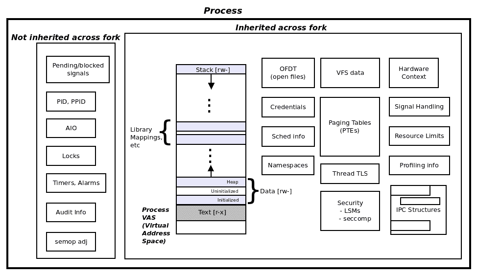
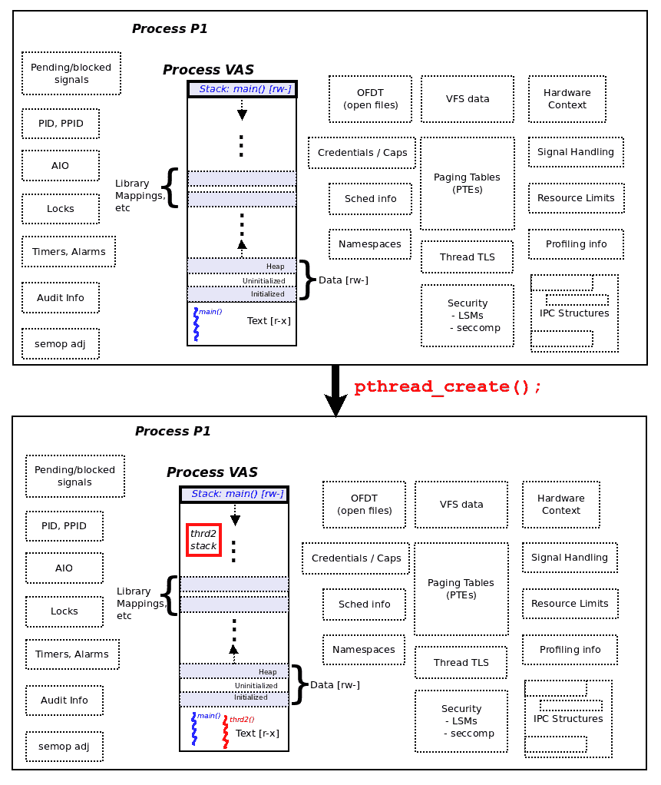
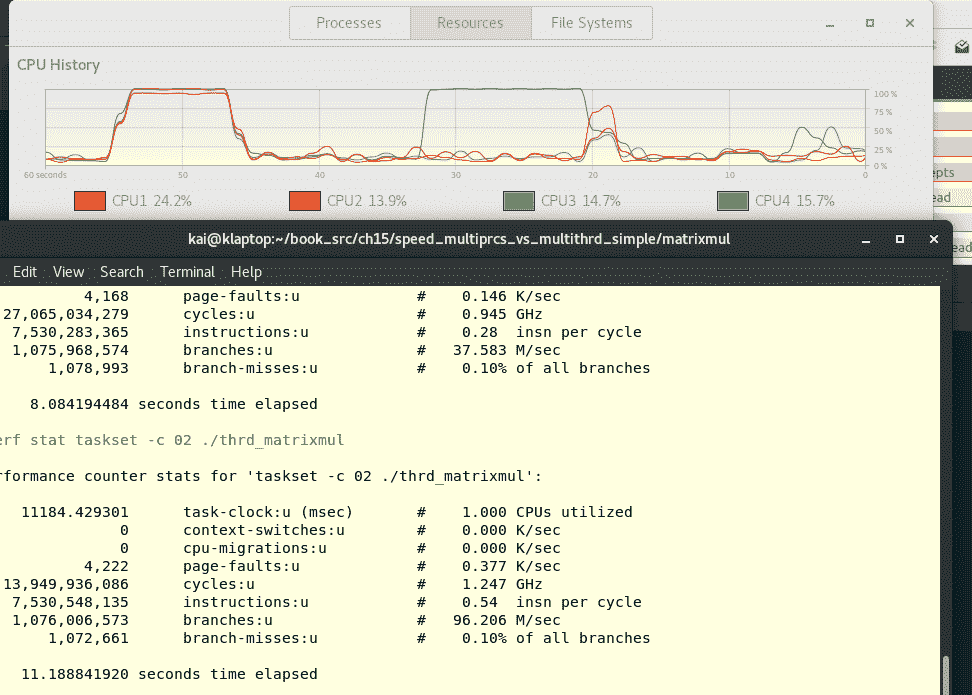
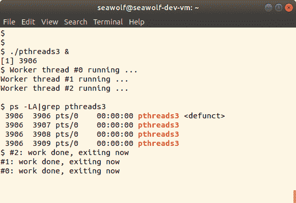
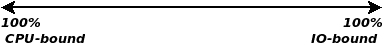

# 第十四章：使用 Pthreads 进行多线程编程第一部分 - 基础知识

你是否使用过下载加速器类型的应用程序下载过大文件？你玩过在线游戏吗？飞行模拟器程序？使用过文字处理、网页浏览器、Java 应用程序等等？（在这里放一个笑脸表情的诱惑很高！）

很可能你至少使用过其中一些；那又怎样呢？所有这些不同的应用程序有一个共同点：它们很可能都是为多线程设计的，这意味着它们的实现使用多个线程并行运行。多线程确实已经成为现代程序员几乎是一种生活方式。

解释一个像多线程这样庞大的话题本身就是一项艰巨的任务；因此我们将其分成三个单独的章节进行覆盖。这是其中的第一章。

本章本身在逻辑上分为两个广泛的部分：在第一部分中，我们仔细考虑并理解线程模型背后的概念——多线程的“什么”和“为什么”。线程到底是什么，我们为什么需要线程，以及多线程在 Linux 平台上是如何发展的一个快速了解。

在第二部分中，我们将重点关注 Linux 上多线程的线程管理 API，即多线程的“如何”（在某种程度上）。我们将讨论创建和管理线程所需的 API 集合，并且当然会有很多实际的代码可以看到和尝试。

在这个话题的开始，我们还必须明确指出这样一个事实，即在本书中，我们只关注软件编程的多线程；特别是在 Linux 平台上的 POSIX 线程（pthreads）实现，具体来说是 Linux 平台上的 pthreads。我们不打算处理其他各种出现的多线程框架和实现（如 MPI、OpenMP、OpenCL 等）或硬件线程（超线程、具有 CUDA 的 GPU 等）。

在本章中，你将学习如何在 Linux 平台上使用多个线程进行编程，具体来说，是如何开始使用 pthread 编程模型或框架。本章大致分为两部分：

+   在第一部分，涵盖了关键的多线程概念——多线程的“什么”和“为什么”，为第二部分（以及后面两章关于多线程的内容）奠定了基础。

+   第二部分涵盖了在 Linux 上构建功能性多线程应用程序所需的基本 pthread API（它故意没有涵盖所有方面；接下来的两章将在此基础上展开）。

# 多线程概念

在本节中，我们将学习在 Linux 平台上多线程的“什么”和“为什么”。我们将从回答“线程到底是什么？”这个常见问题开始。

# 线程到底是什么？

在古老的 Unix 程序员的好（或坏？）旧日子里，有一个简单的软件模型（其他操作系统和供应商几乎完全继承了这个模型）：有一个存在于虚拟地址空间（VAS）中的进程；VAS 本质上由称为段的同质区域（基本上是虚拟页面的集合）组成：文本、数据、其他映射（库）和栈。文本实际上是可执行的——事实上是机器——代码，它被馈送到处理器。我们在本书的早期部分已经涵盖了所有这些内容（你可以在第二章《虚拟内存》中复习这些基础知识）。

线程是进程内部的独立执行（或流）路径。在线程的生命周期和范围中，在我们通常使用的熟悉的过程式编程范式中，它只是一个函数。

因此，在我们之前提到的传统模型中，我们有一个执行线程；在 C 编程范式中，该线程是`main()`函数！想想看：`main()`线程是执行开始（至少从应用程序开发者的角度来看）和结束的地方。这个模型现在被称为单线程软件模型。与之相对的是什么？当然是多线程模型。所以，我们可以有多个线程与同一进程中的其他独立线程同时执行（并行）。

但是，等等，进程难道也不能产生并行性，并且在应用程序的不同方面上有多个副本在工作吗？当然可以：我们已经在第十章中以所有的荣耀（和影响）介绍了`fork(2)`系统调用。这被称为多进程模型。因此，如果我们有多进程——在这里，有几个进程并行运行，并且完成了工作——百万美元的问题就变成了：“为什么还要使用多线程？”（请存入一百万美元，我们将提供答案。）有几个很好的理由；请查看接下来的章节（特别是*动机-为什么要使用线程？*；我们建议第一次读者按照本书中所规定的顺序进行阅读）以获取更多细节。

# 资源共享

在第十章中，*进程创建*，我们反复指出，虽然 fork(2)系统调用非常强大和有用，但它被认为是一种重量级操作；执行 fork 需要大量的 CPU 周期（因此需要时间），而且在内存（RAM）方面也很昂贵。计算机科学家们正在寻找一种减轻这种情况的方法；结果，正如你所猜到的那样，就是线程。

不过，为了方便读者，我们在这里重现了一个图表——*Linux 进程-在 fork()中的继承和非继承*——来自第十章，*进程创建*：



图 1：Linux 进程-在 fork()中的继承和非继承

这个图表很重要，因为它向我们展示了为什么 fork 是一种重量级操作：每次调用 fork(2)系统调用时，父进程的完整虚拟地址空间和图表右侧的所有数据结构都必须被复制到新生的子进程中。这确实是很多工作和内存使用！（好吧，我们有点夸张：正如在第十章中所提到的，*进程创建*，*现代操作系统，特别是 Linux，确实费了很多功夫来优化 fork。尽管如此，它还是很重的。请查看我们的示例 1 演示程序，进程的创建和销毁比线程的创建和销毁要慢得多（并且需要更多的 RAM）。

事实是这样的：当一个进程创建一个线程时，该线程与同一进程的所有其他线程（几乎）共享所有内容——包括之前的虚拟地址空间、段和所有数据结构——除了栈。

每个线程都有自己的私有堆栈段。它位于哪里？显然，它位于创建进程的虚拟地址空间内；它确切地位于哪里对我们来说并不重要（回想一下，无论如何都是虚拟内存，而不是物理内存）。对应用程序开发人员来说，更相关和重要的问题是线程堆栈的大小。简短的答案是：与通常一样（在 Linux 平台上通常为 8MB），但我们将在本章后面详细介绍细节。只需这样想：`main()`的堆栈总是位于（用户模式）虚拟地址空间的顶部；进程中其余线程的堆栈通常位于该空间中的任何位置。实际上，它们通常位于堆和（main 的）堆栈之间的虚拟内存空间中。

以下图表帮助我们了解 Linux 上多线程进程的内存布局；图表的上部是`pthread_create(3)`之前的进程；下部显示了成功创建线程后的进程：



图 2：线程-除了堆栈之外，一切都在 pthread_create()中共享

进程文本段中的蓝色波浪线代表`main()`线程；它的堆栈也清晰可见。我们使用虚线表示所有这些内存对象（用户空间和内核空间）都在`pthread_create(3)`中被共享。显然可以看到，在`pthread_create(3)`之后，唯一的新对象是新线程本身（**thrd2**；在进程文本段中显示为红色波浪线）和刚刚创建的线程**thrd2**的新堆栈（红色）。将此图与*图 1*进行对比；当我们进行`fork(2)`时，几乎所有东西都必须复制到新生的子进程中。

到目前为止，我们描述的唯一区别是进程和线程之间的资源共享——进程不共享，它们复制；线程共享一切，除了堆栈。再深入一点，你会意识到软件和硬件状态都必须以每个线程为基础进行维护。Linux 操作系统正是这样做的：它在操作系统内部维护了一个每个线程的任务结构；任务结构包含所有进程/线程属性，包括软件和硬件上下文（CPU 寄存器值等）信息。

再深入挖掘一下，我们意识到操作系统确实会为每个线程维护以下属性的独立副本：堆栈段（因此堆栈指针）、可能的备用信号堆栈（在第十一章中介绍，*信号-第一部分*）、常规信号和实时信号掩码、线程 ID、调度策略和优先级、能力位、CPU 亲和性掩码以及 errno 值（不用担心，这些中的几个将在后面解释）。

# 多进程与多线程

为了清楚地理解为什么和如何线程可以提供性能优势，让我们进行一些实验！（实证的重要性-实验，尝试-是一个关键特征；我们的第十九章，*故障排除和最佳实践*，更多涵盖了这些内容）。首先，我们进行两个简单示例程序的比较：一个是比较创建和销毁进程与线程的程序，另一个是以两种方式进行矩阵乘法运算的程序——一种是传统的单线程进程模型，另一种是多线程模型。

因此，我们在这里真正比较的是使用多进程模型和多线程模型的执行时间性能。我们要请读者注意，我们现在不会费力详细解释线程代码的原因有两个：一是这不是重点，二是在我们详细介绍线程 API 之前，这样做没有意义。（因此，亲爱的读者，我们要求你暂时忽略线程代码；只需跟着我们，构建和重现我们在这里做的事情；随着你的学习，代码和 API 将变得清晰。）

# 示例 1 - 创建/销毁 - 进程/线程

进程模型：我们的做法是：在一个循环中（总共执行了 60,000 次！），通过调用`fork(2)`创建和销毁进程，然后退出。（我们处理了一些细节，比如在父进程中等待子进程死亡，以清除任何可能的僵尸进程，然后继续循环。）相关的代码如下（`ch14/speed_multiprcs_vs_multithrd_simple/create_destroy/fork_test.c`）：

为了便于阅读，以下代码中只显示了相关部分；要查看和运行完整的源代码，可以在这里找到：[`github.com/PacktPublishing/Hands-on-System-Programming-with-Linux`](https://github.com/PacktPublishing/Hands-on-System-Programming-with-Linux)。

```
...
#define NFORKS 60000
void do_nothing()
{
  unsigned long f = 0xb00da;
}
int main(void)
{
  int pid, j, status;

  for (j = 0; j < NFORKS; j++) {
        switch (pid = fork()) {
        case -1:
              FATAL("fork failed! [%d]\n", pid);
        case 0: // Child process
              do_nothing();
              exit(EXIT_SUCCESS);
        default: // Parent process
              waitpid(pid, &status, 0);
        }
  }
  exit(EXIT_SUCCESS);
}
```

我们在`time(1)`实用程序的前缀下运行它，这给了我们一个程序在处理器上花费的时间的大致概念；花费的时间显示为三个组成部分：`real`（总的挂钟时间），`user`（用户空间中花费的时间）和`sys`（内核空间中花费的时间）：

```
$ time ./fork_test 

real    0m10.993s
user    0m7.436s
sys     0m2.969s
$ 
```

显然，你在 Linux 系统上得到的确切数值可能会有所不同。而且，`user` + `sys`的总和也不会完全等于 real。

# 多线程模型

再次强调，我们的做法是：关键是要理解这里使用的代码（`ch14/speed_multiprcs_vs_multithrd_simple/create_destroy/pthread_test.c`）在所有方面都与前面的代码相同，只是这里我们使用线程而不是进程：在一个循环中（总共执行了 60,000 次！），通过调用`pthread_create(3)`创建和销毁线程，然后通过调用`pthread_exit(3)`退出。（我们处理了一些细节，比如在调用线程中等待兄弟线程终止，通过调用`pthread_join(3)`。）如前所述，让我们暂时跳过代码/API 的细节，只看执行情况：

```
$ time ./pthread_test 

real    0m3.584s
user    0m0.379s
sys     0m2.704s
$ 
```

哇，线程化的代码运行速度大约比进程模型的代码快 3 倍！结论很明显：创建和销毁线程比创建和销毁进程要快得多。

技术方面的一点说明：对于更好奇的极客：为什么`fork(2)`比`pthread_create(3)`慢得多？熟悉操作系统开发的人会明白，Linux 在`fork(2)`的内部实现中大量使用了性能增强的**写时复制**（COW）内存技术。因此，问题是，如果 COW 被大量使用，那么是什么使 fork 变慢？简短的答案是：页表的创建和设置不能进行 COW；这需要一段时间。当创建同一进程的线程时，这项工作（页表设置）完全被跳过。

即便如此，Linux 的 fork 在今天任何可比较的操作系统中都被认为是最快的。

另外，衡量花费的时间和性能特征的一种更准确的方法是使用众所周知的`perf(1)`实用程序（请注意，在本书中，我们不打算详细介绍`perf`；如果感兴趣，请查看 GitHub 存储库的*进一步阅读*部分，其中有一些与`perf`相关的链接）：

```
$ perf stat ./fork_test

 Performance counter stats for './fork_test':

       9054.969497 task-clock (msec)      # 0.773 CPUs utilized 
            61,245 context-switches       # 0.007 M/sec 
               202 cpu-migrations         # 0.022 K/sec 
         15,00,063 page-faults            # 0.166 M/sec 
   <not supported> cycles 
   <not supported> instructions 
   <not supported> branches 
   <not supported> branch-misses 

      11.714134973 seconds time elapsed
$ 
```

正如前面的代码所示，在虚拟机上，当前版本的`perf`不能显示所有的计数器；这在这里并不妨碍我们，因为我们真正关心的是执行所花费的最终时间——这显示在`perf`输出的最后一行中。

以下代码显示了多线程应用程序的`perf(1)`：

```
$ perf stat ./pthread_test

 Performance counter stats for './pthread_test':

       2377.866371 task-clock (msec)        # 0.587 CPUs utilized 
            60,887 context-switches         # 0.026 M/sec 
               117 cpu-migrations           # 0.049 K/sec 
                69 page-faults              # 0.029 K/sec 
   <not supported> cycles 
   <not supported> instructions 
   <not supported> branches 
   <not supported> branch-misses 

       4.052964938 seconds time elapsed
$ 
```

对于感兴趣的读者，我们还提供了一个包装脚本（`ch14/speed_multiprcs_vs_multithrd_simple/create_destroy/perf_runs.sh`），允许用户使用`perf(1)`进行记录和报告会话。

# 示例 2-矩阵乘法-进程/线程

一个众所周知的练习是编写一个计算两个给定矩阵的（点）积的程序。基本上，我们想执行以下操作：

`矩阵 C = 矩阵 A * 矩阵 B`

再次强调的是，我们在这里实际上并不关心算法（和代码）的细节；我们关心的是在设计层面上如何执行矩阵乘法。我们提出（并编写相应的代码）两种方法：

+   按顺序，通过单线程模型

+   同时，通过多线程模型

注意：这些算法或代码都不打算是原创或突破性的；这些都是众所周知的程序。

在第一个模型中，一个线程-当然是`main()`-将运行并执行计算；程序可以在这里找到：`ch14/speed_multiprcs_vs_multithrd_simple/matrixmul/prcs_matrixmul.c`。

其次，我们将在目标系统上创建至少与 CPU 核心数相同的线程，以充分利用硬件（这个方面在本章的后面一节中处理，名为*你可以创建多少线程？*）；每个线程将与其他线程并行执行一部分计算。程序可以在这里找到：`ch14/speed_multiprcs_vs_multithrd_simple/matrixmul/thrd_matrixmul.c`。

在多线程版本中，目前，我们只是在代码中硬编码 CPU 核心数为四，因为它与我们的本机 Linux 测试系统之一匹配。

为了真正了解我们的应用程序的进程和/或线程如何实际消耗 CPU 带宽，让我们使用有趣的`gnome-system-monitor` GUI 应用程序以图形方式查看资源消耗！（要运行它，假设已安装，只需在 shell 上键入`$ gnome-system-monitor＆`）。

我们提醒您，所有软件和硬件要求都已在本书的 GitHub 存储库上提供的软件硬件清单材料中详细列出。

我们将按以下方式进行实验：

1.  在具有四个 CPU 核心的本机 Linux 系统上运行应用程序：

！[](img/e3a13cd1-66d2-48a1-b3ef-527f115b79ef.png)

仔细看前面的（带注释的）屏幕截图（如果您正在阅读电子版本，请放大）；我们会注意到几个有趣的项目：

+   在前台是我们运行`prcs_matrixmul`和`thrd_matrixmul`应用程序的终端窗口应用程序：

+   我们使用`perf(1)`来准确测量所花费的时间，并故意过滤除了执行期间经过的最终秒数之外的所有输出。

+   在背景中，您可以看到正在运行的`gnome-system-monitor` GUI 应用程序。

+   （本机 Linux）系统-我们已经在其上进行了测试-有四个 CPU 核心：

+   找到系统上 CPU 核心数量的一种方法是使用以下代码：`getconf -a | grep _NPROCESSORS_ONLN | awk '{print $2}'`

（您可以在源代码`thrd_matrixmul.c`中更新`NCORES`宏以反映此值）

+   `prcs_matrixmul`应用程序首先运行；当它运行时，它会在四个可用的 CPU 核心中的一个上消耗 100%的 CPU 带宽（它恰好是 CPU 核心＃2）

+   请注意，在 CPU 历史记录仪的中间到左侧，代表 CPU2 的红线飙升到 100%（用紫色椭圆标出并标记为进程）！

+   在实际拍摄屏幕截图时（OS 在 X 轴时间线上；它从右向左移动），CPU 恢复到正常水平。

+   接下来（在这次运行的间隔为 10 秒后），`thrd_matrixmul`应用程序运行；这里的关键点在于：当它运行时，它会在所有四个 CPU 核心上消耗 100%的 CPU 带宽！

+   请注意，在 X 轴时间线上大约在 15 秒标记之后（从右到左阅读），所有四个 CPU 核心都突然达到了 100%——这是在执行`thrd_matrixmul`（用红色省略号突出显示并标记为 Threads）时发生的。

这告诉我们什么？非常重要的一点：底层的 Linux 操作系统 CPU 调度器将尝试利用硬件，并且如果可能的话，将我们的四个应用程序线程安排在四个可用的 CPU 上并行运行！因此，我们获得了更高的吞吐量、更高的性能和更高的性价比。

可以理解的是，此时您可能会对 Linux 如何执行 CPU（线程）调度产生很多疑问；不用担心，但请耐心等待——我们将在第十七章中详细探讨 Linux 的 CPU 调度。

1.  限制为仅一个 CPU：

`taskset(1)`实用程序允许在指定的处理器核心上运行进程。 （将进程与给定的 CPU 关联起来的能力称为 CPU 亲和性。我们将在调度章节中回到这一点。）使用`taskset`的基本形式很容易：`taskset -c <cpu-mask> <app-to-run-on-given-cpus>`

正如您可以从以下截图中看到的，我们对系统上所有四个 CPU 核心（通常方式）执行`thrd_matrixmul`应用程序的运行进行了对比，以及通过`taskset(1)`指定 CPU 掩码在仅一个 CPU 上运行它；截图再次清楚地显示了，在前一次运行中，所有四个 CPU 都被操作系统利用（总共需要 8.084 秒），而在后一次运行中，只有一个 CPU（以绿色显示为 CPU3）被用于执行其代码（总共需要 11.189 秒）：



根据本节刚学到的内容，您可能会得出结论：“嘿，我们找到答案了：让我们总是使用多线程。”但是，当然，经验告诉我们并没有银弹。事实是，尽管线程确实提供了一些真正的优势，但就像生活中的一切一样，它也有缺点。我们将在第十六章中推迟更多关于利弊的讨论，即*使用 Pthreads 进行多线程编程第三部分*；但请记住这一点。

现在，让我们进行另一个实验，以清楚地说明不仅多线程，而且多进程——使用 fork 生成多个进程——也非常有助于获得更高的吞吐量。

# 示例 3——内核构建

因此，最后一个实验（本节）：我们将为 ARM Versatile Express 平台构建（交叉编译）Linux 内核版本 4.17（使用默认配置）。内核构建的细节等都不在本书的范围之内，但没关系：关键点在于内核构建绝对是一个 CPU 和 RAM 密集型的操作。不仅如此，现代的`make(1)`实用程序也支持多进程！可以通过其`-jn`选项开关告诉`make`要内部生成（fork）的作业数量，其中`n`是作业（线程）的数量。我们使用一个启发式（经验法则）来确定这个数量：

`n = CPU 核心数量 * 2`

（在具有大量核心的高端系统上乘以 1.5。）

了解了这一点，接下来看看接下来的实验。

# 在具有 1GB RAM、两个 CPU 核心和并行化 make -j4 的 VM 上

我们配置了虚拟机客户机具有两个处理器，并进行了并行化构建（通过指定`make -j4`）：

```
$ cd <linux-4.17-kernel-src-dir>
$ perf stat make V=0 -j4 ARCH=arm CROSS_COMPILE=arm-linux-gnueabihf- allscripts/kconfig/conf --syncconfig Kconfig
  CHK include/config/kernel.release
  SYSHDR arch/arm/include/generated/uapi/asm/unistd-oabi.h
  SYSHDR arch/arm/include/generated/uapi/asm/unistd-common.h
  WRAP arch/arm/include/generated/uapi/asm/bitsperlong.h
  WRAP arch/arm/include/generated/uapi/asm/bpf_perf_event.h
  WRAP arch/arm/include/generated/uapi/asm/errno.h
[...]                  *<< lots of output >>* 
  CC arch/arm/boot/compressed/string.o
  AS arch/arm/boot/compressed/hyp-stub.o
  AS arch/arm/boot/compressed/lib1funcs.o
  AS arch/arm/boot/compressed/ashldi3.o
  AS arch/arm/boot/compressed/bswapsdi2.o
  AS arch/arm/boot/compressed/piggy.o
  LD arch/arm/boot/compressed/vmlinux
  OBJCOPY arch/arm/boot/zImage
  Kernel: arch/arm/boot/zImage is ready

 Performance counter stats for 'make V=0 -j4 ARCH=arm CROSS_COMPILE=arm-linux-gnueabihf- all':

    1174027.949123 task-clock (msec) # 1.717 CPUs utilized 
          3,80,189 context-switches  # 0.324 K/sec 
             7,921 cpu-migrations    # 0.007 K/sec 
       2,13,51,434 page-faults       # 0.018 M/sec 
   <not supported> cycles 
   <not supported> instructions 
   <not supported> branches 
   <not supported> branch-misses 

 683.798578130 seconds time elapsed
$ ls -lh <...>/linux-4.17/arch/arm/boot/zImage 
-rwxr-xr-x 1 seawolf seawolf 4.0M Aug 13 13:10  <...>/zImage*
$ ls -lh <...>/linux-4.17/vmlinux
-rwxr-xr-x 1 seawolf seawolf 103M Aug 13 13:10  <...>/vmlinux*
$ 
```

构建总共花费了大约 684 秒（11.5 分钟）。只是让您知道，用于 ARM 的压缩内核映像是名为`zImage`的文件；未压缩的内核映像（仅用于调试目的）是`vmlinux`文件。

在构建过程中，通过快速执行`ps -LA`确实显示了其多进程——而不是多线程——的性质：

```
$ ps -LA
[...]
11204 11204 pts/0 00:00:00 make
11227 11227 pts/0 00:00:00 sh
11228 11228 pts/0 00:00:00 arm-linux-gnuea
11229 11229 pts/0 00:00:01 cc1
11242 11242 pts/0 00:00:00 sh
11243 11243 pts/0 00:00:00 arm-linux-gnuea
11244 11244 pts/0 00:00:00 cc1
11249 11249 pts/0 00:00:00 sh
11250 11250 pts/0 00:00:00 arm-linux-gnuea
11251 11251 pts/0 00:00:00 cc1
11255 11255 pts/0 00:00:00 sh
11256 11256 pts/0 00:00:00 arm-linux-gnuea
11257 11257 pts/0 00:00:00 cc1
[...]
$ 
```

# 在具有 1GB RAM、一个 CPU 核心和顺序 make -j1 的 VM 上

我们配置客户 VM 只有一个处理器，清理构建目录，然后再次进行，但这次是顺序构建（通过指定`make -j1`）：

```
$ cd <linux-4.17-kernel-src-dir>
$ perf stat make V=0 -j1 ARCH=arm CROSS_COMPILE=arm-linux-gnueabihf- all
scripts/kconfig/conf --syncconfig Kconfig
  SYSHDR arch/arm/include/generated/uapi/asm/unistd-common.h
  SYSHDR arch/arm/include/generated/uapi/asm/unistd-oabi.h
  SYSHDR arch/arm/include/generated/uapi/asm/unistd-eabi.h
  CHK include/config/kernel.release
  UPD include/config/kernel.release
  WRAP arch/arm/include/generated/uapi/asm/bitsperlong.h

[...]                  *<< lots of output >>*

  CC crypto/hmac.mod.o
  LD [M] crypto/hmac.ko
  CC crypto/jitterentropy_rng.mod.o
  LD [M] crypto/jitterentropy_rng.ko
  CC crypto/sha256_generic.mod.o
  LD [M] crypto/sha256_generic.ko
  CC drivers/video/backlight/lcd.mod.o
  LD [M] drivers/video/backlight/lcd.ko

 Performance counter stats for 'make V=0 -j1 ARCH=arm CROSS_COMPILE=arm-linux-gnueabihf- all':

    1031535.713905 task-clock (msec) # 0.837 CPUs utilized 
          1,78,172 context-switches # 0.173 K/sec 
                 0 cpu-migrations # 0.000 K/sec 
       2,13,29,573 page-faults # 0.021 M/sec 
   <not supported> cycles 
   <not supported> instructions 
   <not supported> branches 
   <not supported> branch-misses 

    1232.146348757 seconds time elapsed
$ 
```

构建总共花费了大约 1232 秒（20.5 分钟），几乎是上一次构建的两倍长！

你可能会问这个问题：那么，如果使用一个进程构建大约花费了 20 分钟，而使用多个进程进行相同的构建大约花费了一半的时间，为什么还要使用多线程？多处理似乎也很好！

不，想一想：我们关于进程与线程创建/销毁的第一个例子告诉我们，生成（和终止）进程比使用线程慢得多。这仍然是许多应用程序利用的关键优势。毕竟，线程在创建和销毁方面比进程更有效。

在一个动态、不可预测的环境中，我们事先不知道需要多少工作，使用多线程能够快速创建工作线程（并快速终止它们）非常重要。想想著名的 Apache 网络服务器：它默认是多线程的（通过其 mpm_worker 模块，以便快速响应客户端请求）。同样，现代的 NGINX 网络服务器使用线程池（对于感兴趣的人，更多信息可以在 GitHub 存储库的“进一步阅读”部分找到）。

# 动机 - 为什么要使用线程？

线程确实提供了许多有用的优势；在这里，我们试图列举一些更重要的优势。我们认为这是对应用架构师使用多线程的动机，因为可能获得的优势。我们将这个讨论分为两个方面：设计和性能。

# 设计动机

在设计方面，我们考虑以下内容：

# 利用潜在的并行性

许多现实世界的应用程序将受益于以这样的方式设计它们，使得工作可以分成不同的单元，并且这些单元或工作包可以并行 - 与彼此同时运行。在实现层面，我们可以使用线程来实现工作包。

例如，下载加速器程序通过让几个线程执行网络 I/O 来利用网络。每个线程被分配下载文件的一部分的工作；它们都并行运行，有效地获得比单个线程更多的网络带宽，完成后，目标文件被拼接在一起。

有许多这样的例子；认识到并行性的潜力是架构师工作的重要部分。

# 逻辑分离

线程模型直观地适合让设计者逻辑上分离工作。例如，GUI 前端应用程序可能有几个线程管理 GUI 状态，等待并响应用户输入等。其他线程可以用于处理应用程序的业务逻辑。不将用户界面（UI）与业务逻辑混合在一起是良好设计的关键要素。

# CPU 与 I/O 重叠

这一点与前面的类似——任务的逻辑分离。在我们讨论的背景下，CPU 指的是软件是 CPU 密集型或 CPU 绑定的（经典的例子是 C 代码的`while（1）`）；I/O 指的是软件处于阻塞状态 - 我们说它在等待 I/O，意味着它在等待某些其他操作完成（也许是文件或网络读取，或者任何阻塞 API），然后它才能继续前进；这被称为 I/O 绑定。

所以，这样想：假设我们有一系列要执行的任务（它们之间没有依赖关系）：任务 A，任务 B，任务 C 和任务 D。

我们还可以说，任务 A 和任务 C 高度依赖 CPU，而任务 B 和任务 D 更依赖 I/O。如果我们使用传统的单线程方法，那么每个任务都必须按顺序执行；因此，进程最终会等待——也许要等很长时间——等待任务 B 和 D，从而延迟任务 C。另一方面，如果我们使用多线程方法，我们可以将任务分开为单独的线程。因此，即使任务 B 和 D 的线程在 I/O 上被阻塞，任务 A 和 C 的线程仍然可以取得进展。

这被称为 CPU 与 I/O 的重叠。在没有依赖关系的情况下，通过使用线程来解耦（和分离）任务，这是一种通常值得追求的设计方法。这会导致更好的应用程序响应能力。

# 经理-工人模型

线程非常容易适用于熟悉的经理-工人模型；一个经理线程（通常是`main()`）根据需要创建工作线程（或者将它们汇集在一起）；当工作出现时，工作线程处理它。想想繁忙的网络服务器。

# IPC 变得更简单

在进程之间执行 IPC 需要学习曲线、经验和大量工作。对于属于一个进程的线程，它们之间的 IPC——通信——就像写入和读取全局内存一样简单（说实话，这并不那么简单，当我们在下一章中讨论并发和同步的主题时，我们将了解到，概念上和实际上，这仍然比处理 IPC 要少得多）。

# 性能动机

正如前一节的两个示例清楚地向我们展示的那样，使用多线程可以显著提高应用程序的性能；这其中的一些原因在这里提到。

# 创建和销毁

前面的示例 1 清楚地表明，创建和销毁线程所需的时间远远少于进程。许多应用程序几乎要求您几乎不断地这样做。（我们将看到，与进程相比，创建和销毁线程在编程上要简单得多。）

# 自动利用现代硬件的优势

前面的示例 2 清楚地说明了这一点：在现代多核硬件上运行多线程应用程序时（高端企业级服务器可以拥有超过 700 个 CPU 核心！），底层操作系统将负责将线程优化地调度到可用的 CPU 核心上；应用程序开发人员不需要关心这一点。实际上，Linux 内核将尽可能确保完美的 SMP 可伸缩性，这将导致更高的吞吐量，最终实现速度增益。（亲爱的读者，我们在这里是乐观的：现实是，随着并行性和 CPU 核心的增加，也伴随着并发问题的严重缺陷；我们将在接下来的章节中更详细地讨论所有这些。）

# 资源共享

我们已经在本章的开始部分的*资源共享*部分中涵盖了这一点（如果需要，可以重新阅读）。最重要的是：与进程创建相比，线程创建成本较低（销毁也是如此）。此外，与进程相比，线程的内存占用要低得多。因此，可以获得资源共享和相关的性能优势。

# 上下文切换

上下文切换是操作系统上不幸的现实-每次操作系统从运行一个进程切换到运行另一个进程时都必须进行的元工作（我们有自愿和非自愿的上下文切换）。上下文切换所需的实际时间高度依赖于硬件系统和操作系统的软件质量；通常情况下，对于基于 x86 的硬件系统，大约在几十微秒的范围内。这听起来很小：要想知道为什么这被认为很重要（而且确实很浪费），看看在平均 Linux 台式电脑上运行`vmstat 3`的输出（`vmstat(1)`是一个著名的实用程序；以这种方式使用，它给我们提供了系统活动的一个很好的总体视图；嘿，还可以尝试它的现代继任者`dstat(1)`）：

```
$ vmstat 3
procs --------memory----------- --swap-- --io-- -system-- ------cpu-----
 r b  swpd   free   buff  cache  si so  bi  bo   in   cs  us sy id wa st
 0 0 287332 664156 719032 6168428 1 2  231  141   73   22 23 16 60  1  0
 0 0 287332 659440 719056 6170132 0 0    0  124 2878 2353  5  5 89  1  0
 1 0 287332 660388 719064 6168484 0 0    0  104 2862 2224  4  5 90  0  0
 0 0 287332 662116 719072 6170276 0 0    0  427 2922 2257  4  6 90  1  0
 0 0 287332 662056 719080 6170220 0 0    0   12 2358 1984  4  5 91  0  0
 0 0 287332 660876 719096 6170544 0 0    0   88 2971 2293  5  6 89  1  0
 0 0 287332 660908 719104 6170520 0 0    0   24 2982 2530  5  6 89  0  0
[...]
```

（请查阅`vmstat(1)`的 man 页面，详细解释所有字段）。在`system`标题下，我们有两列：`in`和`cs`（硬件）中断和上下文切换，分别表示在过去一秒内发生的。只需看看数字（尽管忽略第一行输出）！这是相当高的。这就是为什么这对系统设计者来说真的很重要。

在同一进程的线程之间进行上下文切换所需的工作量（因此时间）要比在不同进程（或属于不同进程的线程）之间要少得多。这是有道理的：当整个进程保持不变时，大部分内核代码可以有效地被短路。因此，这成为使用线程的另一个优势。

# 线程的简要历史

线程-一个顺序控制流-现在已经存在很长时间了；只是以进程的名义存在（据报道，这是在 1965 年的伯克利分时系统时）。然后，在 20 世纪 70 年代初，Unix 出现了，将进程巩固为 VAS 和顺序控制流的组合。正如前面提到的，这现在被称为单线程模型，因为当然只有一个控制流-主函数-存在。

然后，1993 年 5 月，Sun Solaris 2.2 推出了 UI 线程，并推出了一个名为*libthread*的线程库，它公开了 UI API 集；实际上，这是现代线程。竞争的 Unix 供应商迅速推出了自己的专有多线程解决方案（带有暴露 API 的运行时库）-Digital 的 DECthreads（后来被 Compaq Tru64 Unix 吸收，随后是 HP-UX）、IBM 的 AIX、Silicon Graphics 的 IRIX 等等-每个都有自己的专有解决方案。

# POSIX 线程

专有解决方案对拥有来自几家供应商的异构硬件和软件的大客户构成了重大问题；由于是专有的，很难让不同的库和 API 集相互通信。这是一个常见的问题-缺乏互操作性。好消息是：1995 年，IEEE 成立了一个单独的 POSIX 委员会-IEEE 1003.1c-**POSIX 线程**（**pthreads**）委员会，以制定多线程 API 的标准化解决方案。

POSIX：显然，IEEE 机构的原始名称是**计算环境的便携式操作系统接口**（**POSICE**）。Richard M. Stallman（RMS）建议将名称缩短为**Unix 的便携式操作系统接口**（**POSIX**），这个名称一直沿用至今。

因此，pthreads 是一个 API 标准；正式来说，是 IEEE 1003.1c-1995。所有 Unix 和类 Unix 操作系统供应商逐渐构建了支持 pthreads 的实现；因此，今天（至少在理论上），你可以编写一个 pthreads 多线程应用程序，并且它将在任何支持 pthreads 的平台上运行（在实践中，可能需要一些移植工作）。

# Pthreads 和 Linux

当然，Linux 希望符合 POSIX 线程标准；但是谁会真正构建一个实现（记住，标准只是一个草案规范文件；它不是代码）？1996 年，Xavier Leroy 站出来构建了 Linux 的第一个 pthread 实现——一个名为 Linux 线程的线程库。总的来说，这是一个很好的努力，但并不完全兼容（当时全新的）pthread 标准。

早期解决问题的努力被称为**下一代 Posix 线程**（**NGPT**）。大约在同一时间，Red Hat 也派出一个团队来处理这个领域；他们称之为**本机 Posix 线程库**（**NPTL**）项目。在开源文化的最佳传统中，NGPT 开发人员与 NPTL 的同行合作，开始将 NGPT 的最佳特性合并到 NPTL 中。NGPT 的开发在 2003 年的某个时候被放弃；到那时，在 Linux 上实际的 pthread 实现——直到今天仍然存在的——是 NPTL。

更具体地说：尽管特性被集成到 2.6 版 Linux 内核（2003 年 12 月以后），NPTL 作为优越的线程 API 接口得到了巩固，这有助于大大提高线程性能。

NPTL 实现了 1:1 线程模型；这个模型提供了真正的多线程（用户和内核状态），也被称为本地线程模型。在这里，我们不打算深入探讨这些内部细节；在 GitHub 存储库的*进一步阅读*部分中提供了一个链接，供感兴趣的读者参考。

可以使用以下代码（在 Fedora 28 系统上）查找线程实现（自 glibc 2.3.2 以来）：

```
$ getconf GNU_LIBPTHREAD_VERSION
NPTL 2.27
$ 
```

显然，这是 NPTL。

# 线程管理——基本的 pthread API

在这个第一章关于多线程的第二个重要部分中，我们现在将专注于机制：使用 pthread API，程序员究竟如何以有效的方式创建和管理线程？我们将探索基本的 pthread API 接口，以实现这一关键目的；这种知识是编写功能性和性能友好的 pthread 应用程序的基础。

我们将通过 API 集来介绍线程的生命周期——创建、终止、等待（等待）、以及一般地管理进程的线程。我们还将涵盖线程堆栈管理。

这当然意味着我们在 Linux 系统上安装了一个 pthread 运行时库。在现代 Linux 发行版上，这肯定是这样；只有在使用相当古怪的嵌入式 Linux 时，您才需要验证这一点。Linux 平台上 pthread 库的名称是 libpthread。

关于 pthread API 的一些关键点如下：

+   所有 pthread API 都需要在源文件中包含`<pthread.h>`头文件。

+   该 API 经常使用面向对象的数据隐藏和数据抽象概念；许多数据类型是内部 typedefs；这种设计是故意的：我们希望代码是可移植的。因此，程序员不应该假设类型，并且必须使用提供的辅助方法来访问和/或查询数据类型。 （当然，代码本身是通常的过程式 C；然而，许多概念都是围绕对象导向建模的。有趣的是，Linux 内核也遵循这种方法。）

# 线程创建

用于创建线程的 pthread API 是`pthread_create(3)`；其签名如下：

```
#include <pthread.h>
int pthread_create(pthread_t *thread, const pthread_attr_t *attr,
                void *(*start_routine) (void *), void *arg);
```

在编译 pthread 应用程序时，非常重要的是指定`-pthread` `gcc`选项开关（它启用了使用 libpthread 库所需的宏（后续将详细介绍）。

`pthread_create`是调用以在调用进程中创建新线程的 API。成功时，新线程将与该进程中可能存在的其他线程并发（并行）运行；但它将运行什么代码呢？它将从运行`start_routine`函数的代码开始（这是 API 的第三个参数：指向函数的指针）。当然，这个线程函数随后可以进行任意数量的函数调用。

新线程的线程 ID 将被存储在不透明数据项`thread`中——第一个参数（这是一个值-结果样式的参数）。它的数据类型`pthread_t`是故意不透明的；我们不能假设它是整数（或任何其他东西）。我们很快将遇到何时以及如何使用线程 ID。

请注意，第三个参数，函数指针——新线程运行的例程本身接收一个 void*参数——一个通用指针。这是一种常见且有用的编程技术，使我们能够向新创建的线程传递绝对任何值。 （这种参数通常在文献中被称为客户数据或标签。）我们如何传递它？通过`pthread_create(3)`的第四个参数`arg`。

`pthread_create(3)`的第二个参数是线程属性结构；在这里，程序员应该传递正在创建的线程的属性（我们很快将讨论其中的一些）。有一个快捷方式：在这里传递`NULL`意味着库应该在创建线程时使用默认属性。然而，在某个 Unix 上的默认值可能与另一个 Unix 或 Linux 上的默认值有很大不同；编写可移植的代码意味着不要假设任何默认值，而是显式地初始化适合应用程序的属性。因此，我们的建议肯定是不要传递`NULL`，而是显式地初始化一个`pthread_attr_t`结构并将其传递（接下来的代码示例将说明这一点）。

最后，`pthread_create(3)`的返回值在成功时为`0`，失败时为非零；`errno`将根据需要设置为几个值（我们建议您参考`pthread_create(3)`的手册页了解这些细节）。

当创建新线程时，它会从创建线程那里继承某些属性；其中包括以下内容：

+   创建线程的能力集（回想一下我们在第八章中的讨论，*进程能力*）；这是特定于 Linux 的

+   创建线程的 CPU 亲和性掩码；这是特定于 Linux 的

+   信号掩码

新线程中的任何未决信号和未决定时器（警报）都将被清除。新线程的 CPU 执行时间也将被重置。

只要你知道，在 Linux libpthreads 实现中，`pthread_create(3)`调用了`clone(2)`系统调用，在内核中实际上创建了线程。

有趣的是，现代 glibc 的`fork`实现也调用了`clone(2)`系统调用。传递给`clone(2)`的标志确定了如何进行资源共享。

是时候写一些代码了！我们将为 pthread 编写一个非常简单（实际上相当有 bug 的）`hello, world.`应用程序（`ch14/pthreads1.c`）：

```
[...]
#include <pthread.h>
#include "../common.h"
#define NTHREADS 3

void * worker(void *data)
{
      long datum = (long)data;
      printf("Worker thread #%ld says: hello, world.\n", datum);
      printf(" #%ld: work done, exiting now\n", datum);
}

int main(void)
{
      long i;
      int ret;
      pthread_t tid;

      for (i = 0; i < NTHREADS; i++) {
            ret = pthread_create(&tid, NULL, worker, (void *)i);
            if (ret)
                  FATAL("pthread_create() failed! [%d]\n", ret);
      }
      exit(EXIT_SUCCESS);
}
```

正如你所看到的，我们循环三次，在每次循环迭代时创建一个线程。注意`pthread_create(3)`的第三个参数——一个函数指针（只提供函数名称就足够了；编译器会自动处理剩下的部分）；这是线程的工作例程。这里是函数`worker`。我们还传递第四个参数给`pthread_create`——记住这是客户数据，任何你想传递给新创建线程的数据；这里我们传递循环索引`i`（当然，我们适当地对其进行类型转换，以免编译器抱怨）。

在`worker`函数中，我们通过再次将`void *`强制转换回其原始类型`long`来访问客户数据（作为形式参数`data`接收）：

`long datum = (long)data;`

然后我们只是发出了一些 printf 来显示，是的，我们确实在这里。请注意，所有工作线程都运行相同的代码——`worker`函数。这是完全可以接受的；请记住，代码（文本）是按页权限进行读取执行的；并行运行文本不仅是可以的，而且通常是可取的（提供高吞吐量）。

构建它，我们提供了 Makefile；请注意，所有 pthread API 默认情况下并未链接，就像 glibc 一样。不，它们当然在 libpthread 中，我们需要显式编译（到我们的源文件）并通过`-pthread`指令链接到我们的二进制可执行文件中。Makefile 中的以下片段显示了这一点：

```
CC := gcc
CFLAGS=-O2 -Wall -UDEBUG -pthread
LINKIN := -pthread

#--- Target :: pthreads1
pthreads1.o: pthreads1.c
    ${CC} ${CFLAGS} -c pthreads1.c -o pthreads1.o
pthreads1: common.o pthreads1.o
    ${CC} -o pthreads1 pthreads1.o common.o ${LINKIN}
```

现在构建已经可以工作了，但是请注意，这个程序实际上并不工作得很好！在下面的代码中，我们通过循环运行`./pthreads1`来执行一些测试运行：

```
$ for i in $(seq 1 5); do echo "trial run #$i:" ; ./pthreads1; done trial run #1:
Worker thread #0 says: hello, world.
Worker thread #0 says: hello, world.
trial run #2:
Worker thread #0 says: hello, world.
Worker thread #0 says: hello, world.
 #0: work done, exiting now
trial run #3:
Worker thread #1 says: hello, world.
Worker thread #1 says: hello, world.
 #1: work done, exiting now
trial run #4:
trial run #5: $ 
```

正如您所看到的，`hello, world.`消息只是间歇性地出现，并且在第 4 和第 5 次试运行中根本没有出现（当然，由于时间问题，您尝试这个程序时看到的输出肯定会有所不同）。

为什么会这样？很简单：我们无意中设置了一个有 bug 的情况——竞争！到底在哪里？仔细再看一遍代码：一旦循环结束，`main()`函数会做什么？它调用`exit(3)`；因此整个进程终止，不仅仅是主线程！而且谁能说工作线程在这发生之前完成了他们的工作呢？啊——这位女士们先生们，这就是您经典的竞争。

那么，我们该如何修复它呢？目前，我们将只进行一些快速修复；避免竞争代码的正确方法是通过同步；这是一个重要的话题，值得单独一章来讨论（您将会看到）。好的，首先，让我们解决主线程过早退出的问题。

# 终止

`exit(3)`库 API 会导致调用进程以及其所有线程终止。如果您希望单个线程终止，请让它调用`pthread_exit(3)`API：

```
#include <pthread.h>
 void pthread_exit(void *retval);
```

这个参数指定了调用线程的退出状态；目前，我们忽略它，只传递`NULL`（我们将很快研究如何使用这个参数）。

那么，回到我们的竞争应用程序（`ch14/pthreads1.c`）；让我们制作一个第二个更好的版本（`ch14/pthreads2.c`）。实际上，我们第一个版本的问题是竞争——主线程调用`exit(3)`，导致整个进程可能在工作线程有机会完成工作之前就死掉了。所以，让我们通过让`main()`调用`pthread_exit(3)`来解决这个问题！另外，为什么不让我们的线程工作函数通过显式调用`pthread_exit(3)`来正确终止呢？

以下是`worker()`和`main()`函数的修改后的代码片段（`ch14/pthreads2.c`）：

```
void * worker(void *data)
{
      long datum = (long)data;
      printf("Worker thread #%ld running ...\n", datum);
      printf("#%ld: work done, exiting now\n", datum);
      pthread_exit(NULL);
}
[...]
  for (i = 0; i < NTHREADS; i++) {
        ret = pthread_create(&tid, NULL, worker, (void *)i);
        if (ret)
              FATAL("pthread_create() failed! [%d]\n", ret);
  }
#if 1
 pthread_exit(NULL);
#else
      exit(EXIT_SUCCESS);
#endif
[...]
```

让我们尝试一下前面的程序：

```
$ ./pthreads2 
Worker thread #0 running ...
#0: work done, exiting now
Worker thread #1 running ...
#1: work done, exiting now
Worker thread #2 running ...
#2: work done, exiting now
$ 
```

好多了！

# 鬼魂的回归

还有一个隐藏的问题。让我们进行更多的实验：让我们编写这个程序的第三个版本（让我们称之为`ch14/pthreads3.c`）。在这个版本中，我们假设工作线程需要更长的时间来完成他们的工作（比它们目前所需的时间长）。我们可以很容易地通过一个简单的`sleep(3)`函数来模拟这一点，这将被引入到工作例程中：

```
[...]
void * worker(void *data)
{
      long datum = (long)data;
      printf("Worker thread #%ld running ...\n", datum);
      sleep(3);
      printf("#%ld: work done, exiting now\n", datum);
      pthread_exit(NULL);
}
[...]
```

让我们试一试：

```
$ ./pthreads3 
Worker thread #0 running ...
Worker thread #1 running ...
Worker thread #2 running ...
 *[... All three threads sleep for 3s ...]*

#1: work done, exiting now
#0: work done, exiting now
#2: work done, exiting now
$ 
```

好了？看起来很好。真的吗？还有一个快速而次要的修改必须完成；将睡眠时间从 3 秒增加到 30 秒，然后重新构建和重试（我们这样做的唯一原因是给最终用户一个机会输入`ps(1)`命令，如下面的屏幕截图所示，然后应用程序就会死掉）。现在，在后台运行，并仔细观察！



查看前面的屏幕截图：我们在后台运行`pthreads3`应用程序；该应用程序（实际上是应用程序的主线程）创建了另外三个线程。这些线程只是通过每个休眠三十秒来阻塞。当我们在后台运行进程时，我们可以在 shell 进程上获得控制；现在我们使用`ps(1)`和`-LA`选项开关运行。从`ps(1)`的 man 页面上：

+   `-A`：选择所有进程；与`-e`相同

+   `-L`：显示线程，可能带有 LWP 和 NLWP 列

好吧！（GNU）`ps(1)`甚至可以通过使用`-L`选项开关来显示每个活动的线程（也尝试一下`ps H`）。使用`-L`开关，`ps`输出的第一列是进程的 PID（对我们来说非常熟悉）；第二列是**轻量级进程**（**LWP**）；实际上，这是内核所见的单个线程的 PID。有趣。不仅如此，仔细看看这些数字：PID 和 LWP 匹配的地方是进程的`main()`线程；PID 和 LWP 不同的地方告诉我们这是一个子线程，或者更准确地说是属于进程的对等线程；LWP 是操作系统所见的线程 PID。因此，在我们的示例运行中，我们有进程 PID 为 3906，以及四个线程：第一个是`main()`线程（因为其 PID == 其 LWP 值），而其余三个具有相同的 PID——证明它们属于同一个进程，但它们各自的线程 PID（它们的 LWP）是唯一的——3907、3908 和 3909！

我们一直在提到的问题是，在`ps`输出的第一行（代表`main`线程）中，进程名称后面跟着短语

`<defunct>`（极端右侧）。敏锐的读者会记得`defunct`是`zombie`的另一个术语！是的，臭名昭著的僵尸又回来了。

主线程通过调用`pthread_exit(3)`（回想一下`ch14/pthreads3.c`中的主代码）在进程中的其他线程之前退出；因此 Linux 内核将其标记为僵尸。正如我们在第十章中学到的那样，僵尸是不受欢迎的实体；我们真的不希望有僵尸挂在那里（浪费资源）。因此，问题当然是如何防止主线程成为僵尸？答案很简单：不要允许主线程在应用程序中的其他线程之前终止；换句话说，建议始终保持`main()`活动，等待所有其他线程死亡，然后再终止自身（从而终止进程）。如何做到？继续阅读。

再次强调（但我们还是要说！）：只要其中至少一个线程保持活动状态，进程就会保持活动状态。

作为一个快速的旁白，工作线程何时运行相对于彼此和主线程？换句话说，第一个创建的线程是否保证首先运行，然后是第二个线程，然后是第三个，依此类推？

简短的答案是：没有这样的保证。特别是在现代的**对称多处理器**（**SMP**）硬件和像 Linux 这样的现代多进程和多线程能力的操作系统上，运行时的实际顺序是不确定的（这是一种说法，即无法知道）。实际上，这取决于操作系统调度程序来做出这些决定（也就是说，在没有实时调度策略和线程优先级的情况下；我们将在本书的后面讨论这些主题）。

我们的`./pthreads2`示例程序的另一个试运行显示了这种情况：

```
$ ./pthreads2 
Worker thread #0 running ...
#0: work done, exiting now
Worker thread #2 running ...
#2: work done, exiting now
Worker thread #1 running ...
#1: work done, exiting now
$ 
```

你能看到发生了什么吗？在前面的代码中显示的顺序是：`thread #0`，然后是`thread #2`，然后是`thread #1`！这是不可预测的。在设计多线程应用程序时，不要假设任何特定的执行顺序（我们将在以后的章节中介绍同步，教我们如何实现所需的顺序）。

# 死亡的方式有很多

线程如何终止？事实证明有几种方式：

+   通过调用`pthread_exit(3)`。

+   通过从线程函数返回，返回值会被隐式传递（就像通过`pthread_exit`参数一样）。

+   隐式地，通过从线程函数中跳出；也就是说，到达右括号`}`；但请注意，这并不推荐（稍后的讨论将告诉你为什么）

+   任何调用`exit(3)`API 的线程，当然会导致整个进程以及其中的所有线程死掉。

+   线程被取消（我们稍后会讨论）。

# 有太多线程了吗？

到目前为止，我们知道如何创建一个应用程序进程，并在其中执行一些线程。我们将重复我们的第一个演示程序`ch14/pthreads1.c`中的代码片段，如下：

```
#include <pthread.h>
#define NTHREADS 3
[...]

int main(void)
{
  [...]
 for (i = 0; i < NTHREADS; i++) {
        ret = pthread_create(&tid, NULL, worker, (void *)i);
        if (ret)
              FATAL("pthread_create() failed! [%d]\n", ret);
  }
[...]
```

显然，进程-实际上我们指的是进程的主线程（或应用程序）-进入循环，每次循环迭代都会创建一个线程。因此，当完成时，我们将有三个线程，加上主线程，总共有四个线程，在进程中活动。

这是显而易见的。这里的重点是：创建线程比使用`fork(2)`创建（子）进程要简单得多；使用 fork 时，我们必须仔细编写代码，让子进程运行其代码，而父进程继续其代码路径（回想一下 switch-case 结构；如果愿意，可以快速查看我们的`ch10/fork4.c`代码示例）。使用`pthread_create(3)`，对于应用程序员来说变得很容易-只需在循环中调用 API-就可以了！在前面的代码片段中，想象一下调整它，将`NTHREADS`的值从 3 更改为 300；就这样，进程将产生 300 个线程。如果我们将`NTHREADS`设为 3,000 呢？或者 30,000！？

思考这一点会引发一些相关的问题：一，你实际上能创建多少线程？二，你应该创建多少线程？请继续阅读。

# 你能创建多少线程？

如果你仔细想想，底层操作系统对应用程序可以创建的线程数量肯定有一些人为的限制；否则，系统资源会很快被耗尽。事实上，这并不是什么新鲜事；我们在第三章中的整个讨论实际上就是关于类似的事情。

关于线程（和进程），有两个（直接）限制影响着任何给定时间点可以存在的线程数量：

+   每个进程的资源限制：你会回忆起我们在第三章中讨论过，有两个实用程序可以查看当前定义的资源限制：`ulimit(1)`和`prlimit(1)`，后者是现代接口。让我们快速看一下最大用户进程的资源限制；还要意识到，尽管使用了单词进程，但实际上应该将其视为线程：

```
$ ulimit -u
63223
$ 
```

同样，`prlimit()`向我们展示了以下内容：

```
$ prlimit --nproc
RESOURCE DESCRIPTION          SOFT  HARD  UNITS
NPROC max number of processes 63223 63223 processes
$ 
```

在这里，我们已经向你展示了如何通过 CLI 查询限制；要查看如何进行交互和使用 API 接口来更改它，请参考第三章，*资源限制*。

+   系统范围限制：Linux 操作系统维护着一个系统范围的（而不是每个进程的）限制，限制了在任何给定时间点可以活动的线程总数。这个值通过 proc 文件系统暴露给用户空间：

```
$ cat /proc/sys/kernel/threads-max 
126446
$ 
```

因此，要理解的是，如果违反了前两个限制中的任何一个，`pthread_create(3)`（以及类似地，`fork(2)`）将失败（通常将`errno`设置为值`EAGAIN`再试一次；操作系统实际上是在说：“我现在无法为你做到这一点，请稍后再试一次”）。

你能改变这些值吗？当然可以，但通常情况下，你需要 root（超级用户）访问权限才能这样做。（同样，我们已经在第三章中详细讨论了这些要点，*资源限制*）关于系统范围的限制，你确实可以作为 root 来改变它。但是，请等一下，盲目地改变系统参数而不了解其影响是失去对系统控制的一种确定方式！所以，让我们首先问自己这个问题：操作系统在启动时设置`threads-max`限制的值是基于什么的？

简短的回答是：它与系统上的 RAM 数量成正比。这是有道理的：最终，内存是关于创建线程和进程的关键限制资源。

对于我们亲爱的操作系统级别的极客读者来说，更详细地说：内核代码在启动时设置了`/proc/sys/kernel/threads-max`的值，以便操作系统中的线程（任务）结构最多可以占用可用 RAM 的八分之一。（`threads-max`的最小值是 20；最大值是常量`FUTEX_TID_MASK 0x3fffffff`。）

此外，默认情况下，最大线程数的每进程资源限制是系统限制的一半。

从前面的代码中可以看出，我们得到的值是 126,446；这是在一台带有 16GB RAM 的本机 Linux 笔记本电脑上完成的。在一台带有 1GB RAM 的虚拟机上运行相同的命令会得到以下结果：

```
$ cat /proc/sys/kernel/threads-max 
7420
$ prlimit --nproc
RESOURCE DESCRIPTION          SOFT  HARD  UNITS
NPROC max number of processes 3710  3710  processes
$ 
```

将`threads-max`内核可调整值设置为过高的值——超过`FUTEX_TID_MASK`——将导致它被降低到该值（但是，当然，在任何情况下，这几乎肯定都太大了）。但即使在限制范围内，你也可能走得太远，导致系统变得脆弱（可能会受到**拒绝服务**（DoS）攻击的影响！）。在嵌入式 Linux 系统上，降低限制实际上可能有助于约束系统。

# 代码示例——创建任意数量的线程

所以，让我们来测试一下：我们将编写我们先前程序的一个简单扩展，这次允许用户指定要在进程中尝试创建的线程数量作为参数（`ch14/cr8_so_many_threads.c`）。主函数如下：

```
int main(int argc, char **argv)
{
  long i;
  int ret;
  pthread_t tid;
  long numthrds=0;

  if (argc != 2) {
      fprintf(stderr, "Usage: %s number-of-threads-to-create\n", argv[0]);
      exit(EXIT_FAILURE);
  }
  numthrds = atol(argv[1]);
  if (numthrds <= 0) {
      fprintf(stderr, "Usage: %s number-of-threads-to-create\n", argv[0]);
      exit(EXIT_FAILURE);
  }

  for (i = 0; i < numthrds; i++) {
        ret = pthread_create(&tid, NULL, worker, (void *)i);
        if (ret)
              FATAL("pthread_create() failed! [%d]\n", ret);
  }
  pthread_exit(NULL);
}
```

这很简单：我们将用户传递的字符串值作为第一个参数转换为数字值，然后我们循环`numthrds`次，每次调用`pthread_create(3)`，从而在每次循环迭代时创建一个全新的线程！一旦创建，新线程会做什么？很明显——它们执行`worker`函数的代码。让我们来看一下：

```
void * worker(void *data)
{
      long datum = (long)data;
      printf("Worker thread #%5ld: pausing now...\n", datum);
      (void)pause();
```

```

      printf(" #%5ld: work done, exiting now\n", datum);
      pthread_exit(NULL);
}
```

同样，这非常简单：工作线程只是发出一个`printf(3)`——这很有用，因为它们打印出它们的线程号——当然只是循环索引。然后，它们通过`pause(2)`系统调用进入睡眠状态。（这个系统调用很有用：它是一个完美的阻塞调用；它会将调用线程置于睡眠状态，直到收到信号。）

好了，让我们试一试：

```
$ ./cr8_so_many_threads 
Usage: ./cr8_so_many_threads number-of-threads-to-create
$ ./cr8_so_many_threads 300
Worker thread #   0: pausing now...
Worker thread #   1: pausing now...
Worker thread #   2: pausing now...
Worker thread #   3: pausing now...
Worker thread #   5: pausing now...
Worker thread #   6: pausing now...
Worker thread #   4: pausing now...
Worker thread #   7: pausing now...
Worker thread #  10: pausing now...
Worker thread #  11: pausing now...
Worker thread #   9: pausing now...
Worker thread #   8: pausing now...

[...]

Worker thread #  271: pausing now...
Worker thread #  299: pausing now...
Worker thread #  285: pausing now...
Worker thread #  284: pausing now...
Worker thread #  273: pausing now...
Worker thread #  287: pausing now...
[...]
^C
$ 
```

它起作用了（请注意，我们已经截断了输出，因为在本书中显示太多内容）。请注意，线程启动和执行的顺序（发出它们的`printf`）是随机的。我们可以看到，我们创建的最后一个线程是加粗显示的——线程`# 299`（0 到 299 是 300 个线程）。

现在，让我们再次运行它，但这次让它创建一个不可能的大数量的线程（我们目前正在一台带有 1GB RAM 的虚拟机上尝试这个）：

```
$ prlimit --nproc ; ulimit -u RESOURCE DESCRIPTION          SOFT HARD UNITS
NPROC max number of processes 3710 3710 processes
3710 $ ./cr8_so_many_threads 40000
Worker thread # 0: pausing now...
Worker thread # 1: pausing now...
Worker thread # 2: pausing now...
Worker thread # 4: pausing now...

[...]

Worker thread # 2139: pausing now...
Worker thread # 2113: pausing now...
Worker thread # 2112: pausing now...
FATAL:cr8_so_many_threads.c:main:52: pthread_create() #2204 failed ! [11]
 kernel says: Resource temporarily unavailable
$ 
```

显然，你将看到的结果取决于你的系统；我们鼓励读者在不同的系统上尝试一下。此外，实际的失败消息可能出现在你的终端窗口的更高位置；向上滚动以找到它！

线程的名称，如`ps(1)`所示，等等，可以通过`pthread_setname_np(3)`API 来设置；请注意，`np`后缀意味着该 API 是不可移植的（仅限 Linux）。

# 应该创建多少个线程？

你创建的线程数量确实取决于应用程序的性质。在我们的讨论中，我们将考虑应用程序倾向于是 CPU 还是 I/O 限制。

在本章的前面（特别是在*设计动机*和*重叠 CPU 与 I/O*的部分），我们提到了一个事实，即一个线程在执行行为上，处于一个连续体的某个位置，介于两个极端之间：一个极端是完全 CPU 限制的任务，另一个极端是完全 I/O 限制的任务。这个连续体可以被想象成这样：



图 3：CPU 限制/I/O 限制连续体

一个 100%的 CPU 绑定线程将不断地在 CPU 上运行；一个 100%的 I/O 绑定线程是一个总是处于阻塞（或等待）状态的线程，从不在 CPU 上执行。这两个极端在真实应用中都是不现实的；然而，很容易想象出它们倾向于出现的领域。例如，涉及大量数学处理（科学模型，矢量图形，如 Web 浏览器中的 Flash 动画，矩阵乘法等），（解）压缩实用程序，多媒体编解码器等领域肯定倾向于更多地受 CPU 限制。另一方面，我们人类每天与之交互的许多（但不是所有）应用程序（想想你的电子邮件客户端，Web 浏览器，文字处理等）倾向于等待人类做一些事情；实际上，它们倾向于受 I/O 限制。

因此，尽管有点简化，但这仍然作为一个有用的设计经验法则：如果正在设计的应用程序在性质上受到 I/O 限制，那么创建甚至是大量等待工作的线程是可以的；这是因为它们大部分时间都会处于休眠状态，因此不会对 CPU 造成任何压力（当然，创建太多线程会对内存造成压力）。

另一方面，如果应用程序被确定为高度 CPU 限制，那么创建大量线程将会给系统带来压力（最终导致抖动-一种现象，其中元工作的时间比实际工作的时间更长！）。因此，对于 CPU 限制的工作负载，经验法则是：

```
max number of threads = number of CPU cores * factor;
 where factor = 1.5 or 2.
```

但需要注意的是，确实存在一些 CPU 核心不提供任何**超线程**（**HT**）功能；在这样的核心上，因子应该保持为 1。

实际上，我们的讨论相当简单：许多现实世界的应用程序（想想像 Apache 和 NGINX 这样的强大的 Web 服务器）将根据确切的情况、配置预设和当前工作负载动态地创建和调整所需的线程数量。然而，前面的讨论作为一个起点，让你开始思考多线程应用程序的设计。

# 线程属性

在本章早期的*线程创建*讨论中，我们看到了`pthread_create(3)`API；第二个参数是指向线程属性结构的指针：`const pthread_attr_t *attr`。我们提到过，在这里传递 NULL，实际上是让库使用默认属性创建线程。虽然这确实是这样，但问题在于，对于真正可移植的应用程序，这是不够的。为什么？因为默认线程属性在不同的实现中实际上有很大的差异。正确的方法是在线程创建时显式指定线程属性。

首先，当然，我们需要了解 pthread 具有哪些属性。以下表格列举了这些属性：

| **属性** | **含义** | **APIs: **`pthread_attr_...` | **可能的值** | ***Linux 默认*** |
| --- | --- | --- | --- | --- |
| 分离状态 | 创建可连接或分离的线程 | `pthread_attr_` `[get&#124;set]detachstate` | PTHREAD_CREATE_JOINABLE PTHREAD_CREATE_DETACHED | PTHREAD_CREATE_JOINABLE |
| 调度/争用范围 | 我们与之竞争资源（CPU）的线程集 | `pthread_attr_``[get&#124;set]scope` | PTHREAD_SCOPE_SYSTEM PTHREAD_SCOPE_PROCESS | PTHREAD_SCOPE_SYSTEM |
| 调度/继承 | 确定调度属性是从调用线程隐式继承还是从 attr 结构显式继承 | `pthread_attr_``[get&#124;set]inheritsched` | PTHREAD_INHERIT_SCHED PTHREAD_EXPLICIT_SCHED | PTHREAD_INHERIT_SCHED |

| 调度/策略 | 确定正在创建的线程的调度策略 | `pthread_attr_``[get&#124;set]schedpolicy` | SCHED_FIFO SCHED_RR

SCHED_OTHER | SCHED_OTHER |

| 调度/优先级 | 确定正在创建的线程的调度优先级 | `pthread_attr_``[get&#124;set]schedparam` | 结构 sched_param 保存    int sched_priority | 0（非实时） |
| --- | --- | --- | --- | --- |
| 栈/保护区域 | 线程栈的保护区域 | `pthread_attr_``[get&#124;set]guardsize` | 字节中的栈保护区域大小 | 1 页 |

| 栈/位置，大小 | 查询或设置线程的栈位置和大小 | `pthread_attr_` `[get&#124;set]stack``pthread_attr_`

`[get&#124;set]stackaddr``pthread_attr_`

`[get&#124;set]stacksize` | 字节中的栈地址和/或栈大小 | 线程栈位置：左到 OSThread 栈大小：8 MB |

正如您所看到的，要清楚地理解这些属性的确切含义需要进一步的信息。请耐心等待我们在本章（实际上是本书）中继续进行，因为其中的一些属性及其含义将变得非常清楚（调度的详细信息将在第十七章中显示，*Linux 上的 CPU 调度*）。 

# 代码示例 - 查询默认线程属性

现在，一个有用的实验是查询新创建线程的默认属性，其属性结构指定为 NULL（默认）。如何？`pthread_default_getattr_np(3)`将起作用（请注意，再次，`_np`后缀意味着它是一个仅限 Linux 的非可移植 API）：

```
#define _GNU_SOURCE /* See feature_test_macros(7) */
#include <pthread.h>
int pthread_getattr_default_np(pthread_attr_t *attr);
```

有趣的是，由于此函数依赖于定义`_GNU_SOURCE`宏，因此我们必须首先定义该宏（在源代码中的早期）；否则，编译会触发警告并可能失败。（在我们的代码中，我们首先使用`#include "../common.h"`，因为我们的*common.h*头文件定义了`_GNU_SOURCE`宏。）

我们的代码示例可以在这里找到，位于本书的 GitHub 存储库中：`ch14/disp_defattr_pthread.c` *。*

在下面的代码中，我们在运行 4.17.12 Linux 内核的 Fedora x86_64 箱上进行了试验：

```
$ ./disp_defattr_pthread 
Linux Default Thread Attributes:
Detach State : PTHREAD_CREATE_JOINABLE
Scheduling 
 Scope       : PTHREAD_SCOPE_SYSTEM
 Inheritance : PTHREAD_INHERIT_SCHED
 Policy      : SCHED_OTHER
 Priority    : 0
Thread Stack 
  Guard Size :    4096 bytes
  Stack Size : 8388608 bytes
$ 
```

为了便于阅读，只显示了源代码的关键部分；要查看完整的源代码，构建并运行它，整个树都可以从 GitHub 克隆到这里：[`github.com/PacktPublishing/Hands-on-System-Programming-with-Linux`](https://github.com/PacktPublishing/Hands-on-System-Programming-with-Linux)。

这里的关键函数显示在以下代码中（`ch14/disp_defattr_pthread.c`）；我们首先查询和显示线程属性结构的“分离状态”（这些术语将很快详细解释）：

```
static void display_thrd_attr(pthread_attr_t *attr)
{
  int detachst=0;
  int sched_scope=0, sched_inh=0, sched_policy=0;
  struct sched_param sch_param;
  size_t guardsz=0, stacksz=0;
  void *stackaddr;

  // Query and display the 'Detached State'
  if (pthread_attr_getdetachstate(attr, &detachst))
        WARN("pthread_attr_getdetachstate() failed.\n");
  printf("Detach State : %s\n",
    (detachst == PTHREAD_CREATE_JOINABLE) ? "PTHREAD_CREATE_JOINABLE" :
    (detachst == PTHREAD_CREATE_DETACHED) ? "PTHREAD_CREATE_DETACHED" :
     "<unknown>");
```

接下来，将查询和显示各种调度属性（一些细节稍后在第十七章中讨论，*Linux 上的 CPU 调度*）：

```
//--- Scheduling Attributes
  printf("Scheduling \n");
  // Query and display the 'Scheduling Scope'
  if (pthread_attr_getscope(attr, &sched_scope))
        WARN("pthread_attr_getscope() failed.\n");
  printf(" Scope : %s\n",
    (sched_scope == PTHREAD_SCOPE_SYSTEM) ? "PTHREAD_SCOPE_SYSTEM" :
    (sched_scope == PTHREAD_SCOPE_PROCESS) ? "PTHREAD_SCOPE_PROCESS" :
     "<unknown>");

  // Query and display the 'Scheduling Inheritance'
  if (pthread_attr_getinheritsched(attr, &sched_inh))
        WARN("pthread_attr_getinheritsched() failed.\n");
  printf(" Inheritance : %s\n",
    (sched_inh == PTHREAD_INHERIT_SCHED) ? "PTHREAD_INHERIT_SCHED" :
    (sched_inh == PTHREAD_EXPLICIT_SCHED) ? "PTHREAD_EXPLICIT_SCHED" :
     "<unknown>");

  // Query and display the 'Scheduling Policy'
  if (pthread_attr_getschedpolicy(attr, &sched_policy))
        WARN("pthread_attr_getschedpolicy() failed.\n");
  printf(" Policy : %s\n",
        (sched_policy == SCHED_FIFO)  ? "SCHED_FIFO" :
        (sched_policy == SCHED_RR)    ? "SCHED_RR" :
        (sched_policy == SCHED_OTHER) ? "SCHED_OTHER" :
         "<unknown>");

  // Query and display the 'Scheduling Priority'
  if (pthread_attr_getschedparam(attr, &sch_param))
        WARN("pthread_attr_getschedparam() failed.\n");
  printf(" Priority : %d\n", sch_param.sched_priority);
```

最后，线程栈属性被查询和显示：

```
//--- Thread Stack Attributes
  printf("Thread Stack \n");
  // Query and display the 'Guard Size'
  if (pthread_attr_getguardsize(attr, &guardsz))
        WARN("pthread_attr_getguardsize() failed.\n");
  printf(" Guard Size : %9zu bytes\n", guardsz);

  /* Query and display the 'Stack Size':
   * 'stack location' will be meaningless now as there is no
   * actual thread created yet!
   */
  if (pthread_attr_getstack(attr, &stackaddr, &stacksz))
        WARN("pthread_attr_getstack() failed.\n");
  printf(" Stack Size : %9zu bytes\n", stacksz);
}
```

在前面的代码中，我们使用`pthread_getattr_default_np(3)` API 来查询默认线程属性。它的对应物，`pthread_setattr_default_np(3)` API，允许您在创建线程时指定默认线程属性应该是什么，并且将第二个参数传递给`pthread_create(3)`。请参阅其手册以获取详细信息。

有一种编写类似程序的替代方法：为什么不创建一个带有 NULL 属性结构的线程，从而使其成为默认属性，然后使用`pthread_getattr_np(3)` API 来查询和显示实际的线程属性？我们把这留给读者作为一个练习（事实上，`pthread_attr_init(3)`的 man 页面提供了这样一个程序）。

# 连接

想象一个应用程序，其中一个线程（通常是`main`）产生了几个其他工作线程。每个工作线程都有特定的工作要做；一旦完成，它就会终止（通过`pthread_exit(3)`）。创建线程如何知道工作线程何时完成（终止）？啊，这正是连接的作用。通过连接，创建线程可以等待另一个线程在进程内终止。

这不是听起来非常像父进程发出的`wait(2)`系统调用等待子进程死亡吗？是的，但正如我们马上会看到的那样，它肯定不是完全相同的。

同样重要的是，终止的线程的返回值被传递给发出对其的连接的线程。这样，它就知道工作线程是否成功完成了它的任务（如果没有，失败的值可以被检查以找出失败的原因）：

```
#include <pthread.h>
int pthread_join(pthread_t thread, void **retval);
```

`pthread_join(3)`的第一个参数`thread`是要等待的线程的 ID。它终止时，调用线程将在第二个参数中接收到终止的线程的返回值（是的，这是一个值-结果风格的参数），这当然是通过其`pthread_exit(3)`调用传递的值。

因此，连接非常有帮助；使用这个结构，你可以确保一个线程可以阻塞在任何给定线程的终止上。特别是在`main`线程的情况下，我们经常使用这种机制来确保`main`等待所有其他应用程序线程在它自己终止之前终止（从而防止我们之前看到的僵尸）。这被认为是正确的方法。

回想一下，在前面的部分，“幽灵的回归”中，我们清楚地看到了`main`线程在其对应线程之前死亡，成为了一个无意识的僵尸（`ch14/pthreads3.c`程序）。建立在这个先前代码的快速示例将有助于澄清事情。所以，让我们增强那个程序 - 现在我们将它称为`ch14/pthreads_joiner1.c` - 以便我们的`main`线程通过调用`pthread_join(3)` API 等待所有其他线程死亡，然后自己终止：

```
int main(void)
{
  long i;
  int ret, stat=0;
  pthread_t tid[NTHREADS];
 pthread_attr_t attr;

  /* Init the thread attribute structure to defaults */
  pthread_attr_init(&attr);
  /* Create all threads as joinable */
  pthread_attr_setdetachstate(&attr, PTHREAD_CREATE_JOINABLE);

  // Thread creation loop
  for (i = 0; i < NTHREADS; i++) {
      printf("main: creating thread #%ld ...\n", i);
      ret = pthread_create(&tid[i], &attr, worker, (void *)i);
      if (ret)
          FATAL("pthread_create() failed! [%d]\n", ret);
  }
  pthread_attr_destroy(&attr);
```

这里有几件事情需要注意：

+   随后执行连接，我们需要每个线程的 ID；因此，我们声明了一个`pthread_t`的数组（`tid`变量）。每个元素将存储相应线程的 ID 值。

+   线程属性：

+   到目前为止，我们在创建线程时没有明确地初始化和使用线程属性结构。在这里，我们纠正了这个缺点。`pthread_attr_init(3)`用于初始化（为默认值）属性结构。

+   此外，我们通过在结构中设置这个属性（通过`pthread_attr_setdetachstate(3)` API）来明确地使线程可连接。

+   一旦线程被创建，我们必须销毁线程属性结构（通过`pthread_attr_destroy(3)` API）。

关键是要理解，只有将其分离状态设置为可连接的线程才能被连接。有趣的是，可连接的线程以后可以被设置为分离状态（通过调用`pthread_detach(3)` API）；没有相反的例程。

代码继续；现在我们向你展示线程`worker`函数：

```
void * worker(void *data)
{
      long datum = (long)data;
      int slptm=8;

      printf(" worker #%ld: will sleep for %ds now ...\n", datum, slptm);
      sleep(slptm);
      printf(" worker #%ld: work (eyeroll) done, exiting now\n", datum);

      /* Terminate with success: status value 0.
 * The join will pick this up. */
 pthread_exit((void *)0);
}
```

简单：我们让所谓的工作线程睡 8 秒然后死掉；这次，`pthread_exit(3)`传递`0`作为返回状态。在下面的代码片段中，我们继续`main`的代码：

```
  // Thread join loop
  for (i = 0; i < NTHREADS; i++) {
      printf("main: joining (waiting) upon thread #%ld ...\n", i);
      ret = pthread_join(tid[i], (void **)&stat);
      if (ret)
          WARN("pthread_join() failed! [%d]\n", ret);
      else
          printf("Thread #%ld successfully joined; it terminated with"
                 "status=%d\n", i, stat);
  }
  printf("\nmain: now dying... <Dramatic!> Farewell!\n");
  pthread_exit(NULL);
}
```

这是关键部分：在循环中，主线程通过`pthread_join(3)`API 阻塞（等待）每个工作线程的死亡；第二个（值-结果风格）参数实际上返回刚终止的线程的状态。遵循通常的成功返回零的约定，因此允许主线程判断工作线程是否成功完成工作。

让我们构建并运行它：

```
$ make pthreads_joiner1 
gcc -O2 -Wall -UDEBUG -c ../common.c -o common.o
gcc -O2 -Wall -UDEBUG -c pthreads_joiner1.c -o pthreads_joiner1.o
gcc -o pthreads_joiner1 pthreads_joiner1.o common.o -lpthread
$ ./pthreads_joiner1 
main: creating thread #0 ...
main: creating thread #1 ...
 worker #0: will sleep for 8s now ...
main: creating thread #2 ...
 worker #1: will sleep for 8s now ...
main: joining (waiting) upon thread #0 ...
 worker #2: will sleep for 8s now ...

*<< ... worker threads sleep for 8s ... >>*

 worker #0: work (eyeroll) done, exiting now
 worker #1: work (eyeroll) done, exiting now
 worker #2: work (eyeroll) done, exiting now
Thread #0 successfully joined; it terminated with status=0
main: joining (waiting) upon thread #1 ...
Thread #1 successfully joined; it terminated with status=0
main: joining (waiting) upon thread #2 ...
Thread #2 successfully joined; it terminated with status=0

main: now dying... <Dramatic!> Farewell!
$ 
```

当工作线程死亡时，它们被`main`线程通过`pthread_join`接收或加入；不仅如此，它们的终止状态-返回值-可以被检查。

好的，我们将复制前面的程序并将其命名为`ch14/pthreads_joiner2.c`。我们唯一的改变是，不是让每个工作线程睡眠相同的 8 秒，而是让睡眠时间动态变化。我们将更改代码；例如，这一行将被更改为：`sleep(slptm);`

新的一行将如下所示：`sleep(slptm-datum);`

在这里，`datum`是传递给线程的值-循环索引。这样，我们发现工作线程的睡眠如下：

+   工作线程＃0 睡眠（8-0）= 8 秒

+   工作线程＃1 睡眠（8-1）= 7 秒

+   工作线程＃2 睡眠（8-2）= 6 秒

显然，工作线程＃2 将首先终止；那又怎样？嗯，想想看：与此同时，`main`线程正在循环`pthread_join`，但是按照线程＃0，线程＃1，线程＃2 的顺序。现在，线程＃0 将最后死亡，线程＃2 将首先死亡。这会有问题吗？

让我们试一试：

```
$ ./pthreads_joiner2 
main: creating thread #0 ...
main: creating thread #1 ...
main: creating thread #2 ...
main: joining (waiting) upon thread #0 ...
 worker #0: will sleep for 8s now ...
 worker #1: will sleep for 7s now ...
 worker #2: will sleep for 6s now ... *<< ... worker threads sleep for 8s, 7s and 6s resp ... >>*
 worker #2: work (eyeroll) done, exiting now
 worker #1: work (eyeroll) done, exiting now
 worker #0: work (eyeroll) done, exiting now
Thread #0 successfully joined; it terminated with status=0
main: joining (waiting) upon thread #1 ...
Thread #1 successfully joined; it terminated with status=0
main: joining (waiting) upon thread #2 ...
Thread #2 successfully joined; it terminated with status=0

main: now dying... <Dramatic!> Farewell!
$ 
```

我们注意到什么？尽管工作线程＃2 首先死亡，但工作线程＃0 首先加入，因为在代码中，这是我们首先等待的线程！

# 线程模型加入和进程模型等待

到目前为止，您应该已经开始意识到，尽管`pthread_join(3)`和`wait(2)`（以及家族）API 似乎非常相似，但它们肯定不是等价的；它们之间存在几个差异，并在以下表中列举出来：

| **情况** | **线程：`pthread_join(3)`** | **进程：`waitpid`** |
| --- | --- | --- |
| 条件 | 等待的线程必须将其分离状态属性设置为可连接的，而不是分离的。 | 无；任何子进程都可以（实际上必须）等待（回想一下我们的*fork 规则＃7*） |
| 层次结构 | 无：任何线程都可以加入任何其他线程；没有父子关系的要求。实际上，我们不认为线程像进程那样严格存在父子关系；所有线程都是对等的。 | 存在严格的父子关系层次结构；只有父进程可以等待子进程。 |
| 顺序 | 使用线程时，必须强制加入（等待）指定为`pthread_join(3)`参数的特定线程。换句话说，如果有，比如说，三个线程在运行，主线程在一个升序循环中发出加入，那么它必须等待线程＃1 的死亡，然后是线程＃2，然后是线程＃3。如果线程＃2 提前终止，那就没办法了。 | 使用`wait`，进程可以等待（或停止）任何子进程的死亡，或者使用`waitpid`指定等待的特定子进程。 |
| 信号 | 在线程死亡时不发送信号。 | 在进程死亡时，内核向父进程发送`SIGCHLD`信号。 |

关于`pthread_join(3)`的另外一些要点如下：

+   您需要线程的线程 ID 才能加入它；这是故意这样做的，以便我们实际上只加入我们应用程序进程的线程。尝试加入其他线程（比如第三方库线程）将是糟糕的设计。

+   如果我们正在等待的线程（已经死亡）已经死亡了怎么办？然后`pthread_join(3)`立即返回。

+   如果一个线程试图加入自己会怎样？这会导致失败（`errno`设置为`EDEADLK`）。

+   试图让几个线程加入一个线程会导致未定义的行为；要避免这种情况。

+   如果一个试图连接到另一个线程的线程被取消（稍后会讨论），目标线程保持原样（可连接）。

# 检查生命，超时

有时，我们可能会遇到这样的情况，我们想要检查特定线程是否仍然存活；通过`pthread_tryjoin_np(3)` API 就可以做到这一点：

```
#define _GNU_SOURCE /* See feature_test_macros(7) */
#include <pthread.h>

int pthread_tryjoin_np(pthread_t thread, void **retval);
int pthread_timedjoin_np(pthread_t thread, void **retval,
                         const struct timespec *abstime);
```

`pthread_tryjoin_np(3)`的第一个参数是我们要连接的线程；（第二个参数和往常一样，是目标线程的终止状态）。注意 API 中的 try 短语 - 这通常指定调用是非阻塞的；换句话说，我们对目标线程执行非阻塞连接。如果目标线程仍然存活，那么 API 将立即返回错误：`errno`将被设置为`EBUSY`（手册页告诉我们，这意味着在调用时线程尚未终止）。

如果我们想要等待（阻塞）直到目标线程死亡，但不是永远？换句话说，我们想要等待一段给定的最长时间。这可以通过`pthread_timedjoin_np(3)` API 实现；前两个参数与`pthread_join`相同，而第三个参数指定了绝对时间的超时（通常称为 Unix 时间 - 自 1970 年 1 月 1 日午夜以来经过的秒数（和纳秒数） - 纪元！）。

如第十三章所述，*定时器*，`timespec`数据结构的格式如下：

```
 struct timespec {
     time_t tv_sec; /* seconds */
     long tv_nsec;  /* nanoseconds */
 };
```

这很简单；但是我们如何将时间指定为 UNIX 时间（或自纪元以来的时间）？我们建议读者参考`pthread_timedjoin_np(3)`的手册页，其中提供了一个简单的示例（同时，我们建议您尝试这个 API 作为练习）。

当使用`pthread_timedjoin_np(3)` API 时，我注意到另一件事：连接可能超时，然后继续释放一些资源，比如在工作线程仍然存活并使用它时执行`free(3)`在堆缓冲区上。这显然是一个错误；这也表明你必须仔细考虑和测试设计；通常，对所有工作线程执行阻塞连接，从而确保它们在释放资源之前已经全部终止，是正确的方法。

再次提醒您，API 的后缀`_np`表示它们是不可移植的（仅限 Linux）。

# 连接还是不连接？

一个明确设置为分离状态的线程不能被连接；那么当它死亡时会发生什么？它的资源将被库处理。

一个明确设置为可连接状态的线程（或者可连接是默认状态）必须被连接；否则会导致一种资源泄漏。所以要小心：如果你已经创建了可连接的线程，那么你必须确保连接已经完成。

通常认为，通过主线程对其他应用程序线程执行连接是最佳实践，因为这可以防止我们之前看到的僵尸线程行为。此外，对于创建线程来说，了解它的工作线程是否成功执行了任务，如果没有，原因是什么通常是很重要的。连接使所有这些成为可能。

然而，可能你的应用程序不想等待一些工作线程；在这种情况下，请确保将它们创建为分离状态。

# 参数传递

回想一下`pthread_create(3)` API 的签名：

`int pthread_create(pthread_t *thread, const pthread_attr_t *attr,`

`                    void *(*start_routine) **(void *), void *arg**);`

第三个参数是线程函数 - 实际上是新生线程的生命和范围。它接收一个类型为`void *`的参数；这个参数传递给新生线程的是通过第四个参数`pthread_create`传递的：`void *arg`。

正如前面提到的，它的数据类型是一个通用指针，这样我们就可以实际上将任何数据类型作为参数传递，然后在线程例程中适当地进行类型转换和使用。到目前为止，我们已经遇到了相同的简单用例 - 通常是将整数值作为参数传递。在我们的第一个简单的多线程应用程序`ch14/pthreads1.c`中，在我们的`main`函数中，我们做了以下操作：

```
long i;
int ret;
pthread_t tid;

for (i = 0; i < NTHREADS; i++) {
     ret = pthread_create(&tid, NULL, worker, (void *)i);
    ...
}
```

而在线程例程`worker`中，我们进行了简单的类型转换和使用：

```
void * worker(void *data)
{
 long datum = (long)data;
...
```

这很简单，但确实引发了一个非常明显的问题：在`pthread_create(3)` API 中，似乎只有一个占位符用于`arg`（参数），如何传递多个数据项 - 实际上是几个参数 - 给线程例程？

# 将结构作为参数传递

前面的标题揭示了答案：我们传递一个数据结构。但是，具体来说呢？为数据结构的指针分配内存，初始化它，并将指针强制转换为`void *`进行传递。（事实上，这是 C 程序员常用的方法。）在线程例程中，像往常一样，进行类型转换并使用它。

为了澄清，我们将尝试这个（`ch14/param_passing/struct_as_param.c`）：

为了可读性，只显示了源代码的关键部分；要查看完整的源代码，构建并运行它，整个树可以在 GitHub 上克隆：[`github.com/PacktPublishing/Hands-on-System-Programming-with-Linux`](https://github.com/PacktPublishing/Hands-on-System-Programming-with-Linux)*.*

```
/* Our data structure that we intend to pass as a parameter to the threads. City Airport information. */
typedef struct {
    char IATA_code[IATA_MAXSZ];
              /* http://www.nationsonline.org/oneworld/IATA_Codes/ */
    char city[CITY_MAXSZ];     /* city name */
    float latitude, longitude; /* coordinates of the city airport */
    unsigned int altitude;     /* metres */
  /* todo: add # runways, runway direction, radio beacons freq, etc etc */
    unsigned long reserved;    /* for future use */
} Airport; /* yes! the {lat,long,alt} tuple is accurate :-) */
static const Airport city_airports[3] = {
  { "BLR", "Bangalore International", 13.1986, 77.7066, 904, 0 },
  { "BNE", "Brisbane International", 27.3942, 153.1218, 4, 0 },
  { "BRU", "Brussels National", 50.9010, 4.4856, 58, 0 },
};
```

举个例子，我们构建了自己的机场信息数据结构 airport，然后设置了一个数组（`city_airports`），初始化了其中的一些成员。

在`main`函数中，我们声明了一个指向机场结构的指针数组；我们知道单独的指针没有内存，所以在线程创建循环中，我们为每个指针分配内存，然后将其初始化为一个机场（通过简单的`memcpy(3)`）：

```
  Airport * plocdata[NTHREADS];
...
  // Thread creation loop
  for (i = 0; i < NTHREADS; i++) {
      printf("main: creating thread #%ld ...\n", i);

      /* Allocate and initialize data structure to be passed to the
       * thread as a parameter */
       plocdata[i] = calloc(1, sizeof(Airport));
       if (!plocdata[i])
          FATAL("calloc [%d] failed\n", i);
       memcpy(plocdata[i], &city_airports[i], sizeof(Airport));

       ret = pthread_create(&tid[i], &attr, worker, (void *)plocdata[i]);
       if (ret)
          FATAL("pthread_create() index %d failed! [%d]\n", i, ret);
  }
```

好吧，我们已经知道前面的代码并不是真正的最佳选择；我们本可以只将`city_airports[i]`结构指针作为线程的参数传递。为了举例说明，我们使用刚刚分配的`plocdata[i]`结构，将一个结构`memcpy`到另一个结构中。

然后，在`pthread_create(3)`调用中，我们将指向我们数据结构的指针作为第四个参数传递。这将成为线程的参数；在线程例程中，我们声明一个相同数据类型的`arg`指针，并将其等同于我们接收到的类型转换数据指针：

```
void * worker(void *data)
{
 Airport * arg = (Airport *)data;
  int slptm=8;

  printf( "\n----------- Airports Details ---------------\n"
    " IATA code : %.*s %32s\n"
    " Latitude, Longitude, Altitude : %9.4f %9.4f %9um\n"
    , IATA_MAXSZ, arg->IATA_code,
    arg->city,
    arg->latitude, arg->longitude, arg->altitude);
...
```

然后我们可以将`arg`用作指向 Airport 的指针；在前面的演示代码中，我们只是打印了结构中的值。我们鼓励读者构建并运行此代码。

在前面的代码中，你注意到了`%.*s` C printf 格式说明符的技巧吗？当我们想要打印一个不一定以 NULL 结尾的字符串时，`%.*s`格式说明符允许我们指定大小，然后是字符串指针。字符串将只打印大小字节。

# 线程参数 - 不要这样做

将参数传递给线程例程时要牢记的关键事情是，必须保证传递的参数是线程安全的；基本上，在线程（或线程）使用它时不会以任何方式进行修改。

（线程安全是处理线程的一个关键方面；在接下来的章节中，我们将经常回顾这一点）。

为了更清楚地理解可能的问题，让我们举几个典型的例子。在第一个例子中，我们将尝试将循环索引作为参数传递给新创建的线程，比如在主函数中（代码：`ch14/pthreads1_wrong.c`）：

```
 printf("main: &i=%p\n", &i);
 for (i = 0; i < NTHREADS; i++) {
     printf("Creating thread #%ld now ...\n", i);
     ret = pthread_create(&tid, NULL, worker, (void *)&i);
     ...
}
```

你注意到了吗？我们将参数传递为`&i`。那么？在线程例程中正确解引用它应该仍然有效，对吧：

```
void * worker(void *data)
{
    long data_addr = (long)data;
    long index = *(long *)data_addr;
    printf("Worker thread: data_addr=%p value=%ld\n", 
            (void *)data_addr, index);
    pthread_exit((void *)0);
}
```

看起来不错 - 让我们试试看！

```
$ ./pthreads1_wrong
main: &i=0x7ffebe160f00
Creating thread #0 now ...
Creating thread #1 now ...
Worker thread: data_addr=0x7ffebe160f00 value=1
Creating thread #2 now ...
Worker thread: data_addr=0x7ffebe160f00 value=2
Worker thread: data_addr=0x7ffebe160f00 value=3 $ 
```

嗯，它有效。但等等，再试几次 - 时间巧合可能会让你误以为一切都很好，但实际上并非如此：

```
$ ./pthreads1_wrong
main: &i=0x7fff4475e0d0
Creating thread #0 now ...
Creating thread #1 now ...
Creating thread #2 now ...
Worker thread: data_addr=0x7fff4475e0d0 value=2
Worker thread: data_addr=0x7fff4475e0d0 value=2
Worker thread: data_addr=0x7fff4475e0d0 value=3
$ 
```

有一个错误！`index`的值已经两次评估为值`2`；为什么？仔细思考：我们已经通过引用将循环索引传递了 - 作为循环变量的指针。线程 1 启动，并查找其值 - 线程 2 也是如此，线程 3 也是如此。但等等：这里难道不可能存在竞争吗？难道不可能在线程 1 运行并查找循环变量的值时，它已经在其下发生了变化（因为，不要忘记，循环是在主线程中运行的）？当然，这正是在前面的代码中发生的。

换句话说，通过地址传递变量是不安全的，因为在它被读取（由工作线程）的同时被写入（由主线程）时，其值可能会发生变化；因此，它不是线程安全的，因此会出现错误（竞争）。

解决方案实际上非常简单：不要通过地址传递循环索引；只需将其作为文字值传递：

```
for (i = 0; i < NTHREADS; i++) {
     printf("Creating thread #%ld now ...\n", i);
     ret = pthread_create(&tid, NULL, worker, (void *)i);
    ...
}
```

现在，每个工作线程都收到了循环索引的副本，从而消除了任何竞争，使其安全。

现在，不要草率地得出结论，嘿，好吧，所以我们永远不应该将指针（地址）作为参数传递。当然可以！只要确保它是线程安全的 - 在主线程和其他应用线程操作它时，它的值不会在其下发生变化。

参考我们在上一节演示的`ch14/struct_as_param.c`代码；我们非常明确地将线程参数作为结构体的指针传递。仔细看：在主线程创建循环中，每个指针都是单独分配的（通过`calloc(3)`）。因此，每个工作线程都收到了结构体的副本；因此，一切都是安全的，而且运行良好。

一个有趣的练习（我们留给读者）是故意在`struct_as_param`应用程序中插入一个缺陷，方法是只分配一个结构（而不是三个），并将其传递给每个工作线程。这次，它将是竞争的，并且（最终）会失败。

# 线程堆栈

我们知道，每当创建一个线程时，它都会为其堆栈获取一个新的、新分配的内存块。这导致了这样的理解：（显然，但我们还是要说明）在线程函数中声明的所有局部变量都将保持私有，因为它们将驻留在该线程的堆栈中。（参考本章中的*图 2* - 新创建线程的新堆栈显示为红色）。此外，每当发生上下文切换时，**堆栈指针**（**SP**）寄存器会更新为指向当前线程的堆栈。

# 获取和设置线程堆栈大小

了解并能够更改线程堆栈的大小很重要（请参阅 GitHub 存储库中*进一步阅读*部分提供的链接，其中提到了如何设置某个平台的堆栈太小导致了随机且难以调试的故障的真实经验）。

那么，默认的线程堆栈大小是多少？答案已经提供了；回想一下我们在本章前面运行的`disp_defattr_pthread`程序（在*代码示例 - 查询默认线程属性*部分）：它告诉我们，在（现代 NPTL）Linux 平台上，默认的线程堆栈大小为 8 MB。

pthread API 集提供了一些例程来设置和查询线程堆栈大小。一种方法如下：

```
#include <pthread.h>
int pthread_attr_setstacksize(pthread_attr_t *attr, size_t stacksize);
int pthread_attr_getstacksize(const pthread_attr_t *attr, 
                              size_t *stacksize);
```

由于我们之前已经在早期的`disp_defattr_pthread`程序中使用了`pthread_attr_getstacksize(3)`，我们将避免在这里再次展示它的用法。使用互补的`pthread_attr_setstacksize(3)` API 可以轻松设置线程大小-第二个参数是所需的大小（以字节为单位）。不过，这两个 API 都包含`_attr_`短语，这意味着栈大小实际上是从线程属性结构中设置或查询的，而不是从活动线程本身。这使我们了解到我们只能在创建线程时通过设置属性结构（当然，随后作为第二个参数传递给`pthread_create(3)`）来设置或查询栈大小。一旦线程被创建，其栈大小就无法更改。这条规则的例外是主线程的栈。

# 栈位置

线程栈实际上位于内存中的哪个位置（从技术上讲，给定进程的 VAS 中的哪个位置）？以下几点有助于我们理解：

+   主线程的栈总是位于进程 VAS 的顶部。

+   进程中所有其他线程的栈位于进程堆段和主栈之间的某个位置；这个具体位置对应用程序开发人员来说事先是未知的；无论如何，我们不应该需要知道。

+   这与直接相关，但很重要：回想一下第二章，“虚拟内存”中提到，对于大多数处理器，栈符合栈向下增长的语义；也就是说，栈段的增长方向是朝着较低的虚拟地址。

虽然我们不应该需要，但是有没有一种方法可以指定线程栈的位置？如果你坚持的话，是的：`pthread_attr_[get|set]stack(3)` API 可以用于此目的，以及设置和/或查询线程栈的大小：

```
#include <pthread.h>
int pthread_attr_setstack(pthread_attr_t *attr,
                           void *stackaddr, size_t stacksize);
int pthread_attr_getstack(const pthread_attr_t *attr,
                           void **stackaddr, size_t *stacksize);
```

虽然您可以使用`pthread_attr_setstack`来设置栈位置，但建议将此工作留给操作系统。此外，如果您确实使用它，还建议栈位置`stackaddr`和栈大小`stacksize`都是系统页面大小的倍数（并且位置对齐到页面边界）。通过`posix_memalign(3)` API 可以轻松实现将线程栈对齐到页面边界（我们已经在第四章，“动态内存分配”中涵盖了此 API 的示例用法）。

要小心：如果您在线程属性结构中指定栈位置，并且在循环中创建线程（这是正常的方式），您必须确保每个线程都接收到唯一的栈位置（通常通过通过前述的`posix_memalign(3)`分配栈内存，然后将其返回值作为栈位置传递）。当然，将用于线程栈的内存页面必须具有读写权限（回想一下第四章，“动态内存分配”中的`mprotect(2)`）。

说了这么多，设置和查询线程栈的机制是直截了当的；真正关键的一点是：（强调）测试您的应用程序，以确保提供的线程栈内存是足够的。正如我们在第十一章，“信号-第一部分”中看到的，栈溢出是一个严重的缺陷，并将导致未定义的行为。

# 栈保护

这很好地引出了下一个问题：有没有一种方法可以让应用程序知道堆栈内存处于危险之中，或者说，已经溢出了？确实有：堆栈保护。保护内存是一个或多个虚拟内存页面的区域，它被故意放置，并且具有适当的权限，以确保任何尝试访问该内存都会导致失败（或某种警告；例如，`SIGSEGV`的信号处理程序可以提供这样的语义-但要注意一旦收到 SIGSEGV，我们就处于未定义状态，必须终止；但至少我们会知道并且可以修复堆栈大小！）：

```
#include <pthread.h>
int pthread_attr_setguardsize(pthread_attr_t *attr, size_t guardsize);
int pthread_attr_getguardsize(const pthread_attr_t *attr, 
                               size_t *guardsize);
```

保护区是在线程堆栈末尾分配的额外内存区域，其大小为指定的字节数。默认（保护）大小是系统页面大小。再次注意，保护大小是线程的一个属性，因此只能在线程创建时（而不是以后）指定。我们将运行（代码：`ch14/stack_test.c`）这样的应用程序：

```
$ ./stack_test 
Usage: ./stack_test size-of-thread-stack-in-KB
$ ./stack_test 2560
Default thread stack size       : 8388608 bytes
Thread stack size now set to    : 2621440 bytes
Default thread stack guard size :    4096 bytes

main: creating thread #0 ...
main: creating thread #1 ...
main: creating thread #2 ...
 worker #0:
main: joining (waiting) upon thread #0 ...
 worker #1:

 *** In danger(): here, sizeof long is 8
 worker #2:
Thread #0 successfully joined; it terminated with status=1
main: joining (waiting) upon thread #1 ...
dummy(): parameter val = 115709118
Thread #1 successfully joined; it terminated with status=0
main: joining (waiting) upon thread #2 ...
Thread #2 successfully joined; it terminated with status=1
main: now dying... <Dramatic!> Farewell!
$ 
```

在前面的代码中，我们将 2,560 KB（2.5 MB）指定为线程堆栈大小。尽管这远低于默认值（8 MB），但事实证明足够了（至少对于 x86_64 来说，一个快速的粗略计算显示，对于给定的程序参数，我们将需要为每个线程堆栈分配至少 1,960 KB）。

在下面的代码中，我们再次运行它，但这次将线程堆栈大小指定为仅 256 KB：

```
$ ./stack_test 256
Default thread stack size       : 8388608 bytes
Thread stack size now set to    :  262144 bytes
Default thread stack guard size :    4096 bytes

main: creating thread #0 ...
main: creating thread #1 ...
 worker #0:
main: creating thread #2 ...
 worker #1:
main: joining (waiting) upon thread #0 ...
Segmentation fault (core dumped)
$ 
```

正如预期的那样，它导致段错误。

使用 GDB 检查核心转储将揭示关于为什么发生段错误的许多线索-包括非常重要的线程堆栈的状态（实际上是堆栈`回溯`）在崩溃时。然而，这超出了本书的范围。

我们绝对鼓励您学习使用诸如 GDB 这样强大的调试器（请参见 GitHub 存储库上的*进一步阅读*部分）。

此外（至少在我们的测试系统上），内核会向内核日志中发出有关此崩溃的消息；查找内核日志消息的一种方法是通过方便的实用程序`dmesg(1)`。以下输出来自 Ubuntu 18.04 框：

```
$ dmesg [...]
kern :info : [*<timestamp>*] stack_test_dbg[27414]: segfault at 7f5ad1733000 ip 0000000000400e68 sp 00007f5ad164aa20 error 6 in stack_test_dbg[400000+2000]
$ 
```

前面应用程序的代码可以在这里找到：`ch14/stack_test.c`：

为了便于阅读，只显示了源代码的关键部分；要查看完整的源代码，构建并运行它，整个树都可以从 GitHub 克隆：[`github.com/PacktPublishing/Hands-on-System-Programming-with-Linux`](https://github.com/PacktPublishing/Hands-on-System-Programming-with-Linux)。

```
int main(int argc, char **argv)
{
[...]
  stack_set = atoi(argv[1]) * 1024;
[...]
  /* Init the thread attribute structure to defaults */
  pthread_attr_init(&attr);
[...]
  /* Set thread stack size */
  ret = pthread_attr_setstacksize(&attr, stack_set);
  if (ret)
      FATAL("pthread_attr_setstack(%u) failed! [%d]\n", TSTACK, ret);
  printf("Thread stack size now set to : %10u bytes\n", stack_set);
[...]
```

在`main`中，我们展示了线程堆栈大小属性被初始化为用户传递的参数（以 KB 为单位）。然后代码继续创建三个工作线程，然后等待它们。

在线程工作例程中，我们只有线程＃2 执行一些实际工作-你猜对了，是堆栈密集型工作。这段代码如下：

```
void * worker(void *data)
{
  long datum = (long)data;

  printf(" worker #%ld:\n", datum);
  if (datum != 1)
      pthread_exit((void *)1);

 danger(); ...
```

`danger`函数，当然，是进行这项危险的、潜在的堆栈溢出工作的函数：

```
static void danger(void)
{
#define NEL    500
  long heavylocal[NEL][NEL], alpha=0;
  int i, j;
  long int k=0;

  srandom(time(0));

  printf("\n *** In %s(): here, sizeof long is %ld\n",
          __func__, sizeof(long));
  /* Turns out to be 8 on an x86_64; so the 2d-array takes up
   * 500 * 500 * 8 = 2,000,000 ~= 2 MB.
   * So thread stack space of less than 2 MB should result in a segfault.
   * (On a test box, any value < 1960 KB = 2,007,040 bytes,
   * resulted in segfault).
   */

  /* The compiler is quite intelligent; it will optimize away the
   * heavylocal 2d array unless we actually use it! So lets do some
   * thing with it...
   */
  for (i=0; i<NEL; i++) {
      k = random() % 1000;
      for (j=0; j<NEL-1; j++)
 heavylocal[i][j] = k;
      /*printf("hl[%d][%d]=%ld\n", i, j, (long)heavylocal[i][j]);*/
  }

  for (i=0; i<NEL; i++)
      for (j=0; j<NEL; j++)
          alpha += heavylocal[i][j];
  dummy(alpha);
}
```

前面的函数使用大量（线程）堆栈空间，因为我们声明了一个名为`heavylocal`的本地变量-一个`NEL*NEL`元素（`NEL=500`）的二维数组。在一个占用 8 字节的 x86_64 上，这大约相当于 2 MB 的空间！因此，将线程堆栈大小指定为小于 2 MB 的任何值应该导致堆栈溢出（堆栈保护内存区域实际上将检测到这一点），因此导致分段违规（或段错误）；这正是发生的事情（正如您在我们的试运行中所看到的）。

有趣的是，如果我们仅声明本地变量但实际上没有使用它，现代编译器将会优化代码；因此，在代码中，我们努力对`heavylocal`变量进行一些（愚蠢的）使用。

关于堆栈保护内存区域的一些额外要点，以结束本讨论，如下：

+   如果应用程序使用了`pthread_attr_setstack(3)`，这意味着它正在自行管理线程堆栈内存，并且任何保护大小属性都将被忽略。

+   保护区域必须对齐到页面边界。

+   如果保护内存区域的大小小于一页，实际（内部）大小将会被舍入到一页；`pthread_attr_getguardsize(3)`返回理论大小。

+   `pthread_attr_[get|set]guardsize(3)`的 man 页面提供了额外信息，包括实现中可能存在的 glibc 错误。

# 摘要

本章是关于在 Linux 平台上编写多线程应用程序的三章中的第一章。在这里，我们涵盖了两个关键领域：第一个是关于关于线程的重要概念，我们将其与进程模型进行了对比（我们在第九章*进程执行*和第十章*进程创建*中学习过）。我们详细介绍了为什么你会更喜欢多线程设计，并包括了三个例子。通过这种方式，我们展现了使用多线程设计方法的动机。

本章的第二部分着重介绍了实际的 pthread API（及其相关概念），我们如何创建线程，可以创建多少个线程以及应该创建多少个线程也有所讨论。还涉及了线程终止的基础知识，线程属性，向新创建的线程传递参数，什么是加入以及如何执行加入，最后还介绍了如何操纵线程堆栈（和堆栈保护）的细节。展示了许多示例程序来帮助巩固所学的概念。

在下一章中，我们将专注于另一个编写强大且安全的多线程软件的关键方面——并发性、竞争、临界区、死锁（及其避免）和原子性；我们如何使用互斥锁（及其变体）以及条件变量来处理这些问题。
